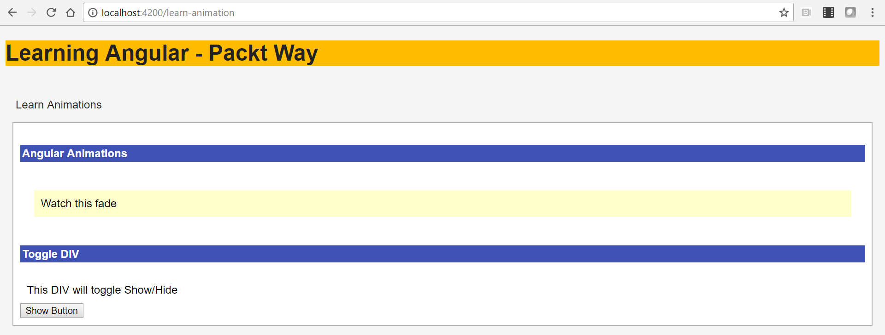
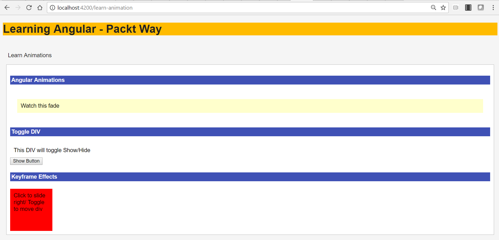

# 十四、处理 Angular 动画


在本章中，我们将学习 Angular 动画。动画这个词听起来既有趣又有创意，所以要系紧安全带；我们将有学习 Angular 动画的乐趣。web 应用中的运动是一个关键的设计因素，也是良好用户体验的主要驱动因素。转换尤其令人感兴趣，因为它们使应用的元素能够从一种状态移动到另一种状态。

本章详细介绍了以下主题：

*   Angular 动画简介
*   Angular 2 中的内置类支持动画
*   了解并学习使用动画模块、[T0]、[T1]、[T2]等
*   设置页面转换动画
*   动画切换/折叠手风琴幻灯片


# Angular 动画简介


Angular 提供了对动画的可靠本地支持，因为运动和过渡是任何应用的主要部分。

Angular 有一个内置的动画引擎，它还支持和扩展在大多数现代浏览器上运行的 Web 动画 API。

我们必须在您的项目文件夹中单独安装 Angular 动画。我们将在以下部分中创建一些动画示例。


# 安装 Angular 动画库


正如我们前面所讨论的，Angular 动画已经作为一个单独的库分出，需要单独安装。

在本节中，我们将讨论如何获取最新的 Angular 动画版本并进行安装；遵循以下步骤：

1.  获取最新的 Angular 动画库。

您可以使用以下`npm`命令进行安装：

```ts
npm install @angular/animations@latest --save

```

运行上述命令将保存最新版本的 Angular animations library，并将其作为依赖项添加到`package.json`文件中。

2.  验证最新安装的 Angular 动画库。

为了确保我们已经安装了 Angular animations library，打开`package.json`文件，在依赖项列表中应该有`@animations/animations`条目。

正确导入并安装 Angular animations library 后，`package.json`文件应显示以下屏幕截图：


3.  导入`app.module.ts`文件中的 Angular 动画库。

我们需要在`app.module.ts`文件中导入 Angular 动画库。为了包含库，我们将使用以下代码段：

```ts
import { BrowserAnimationsModule } from '@angular/platform-
   browser/animations';

```

4.  在[T0]装饰器的导入中包括 Angular 动画库：

```ts
@ngModule({
 imports: [
BrowserModule,
BrowserAnimationsModule
 ],
//other imports
})

```

在前面的代码片段中，我们只是将[T0]导入到我们的[T1]中，以便在整个应用中使用它。

伟大的现在，我们已经将 Angular animations 库作为应用的一部分，我们可以继续使用动画和效果像往常一样构建组件。

在我们开始编写使用动画的组件示例之前，花一些时间探索 Angular 动画中所有可用的类是很重要的，我们可以利用这些类。


# Angular 动画-特定功能


如前一节所述，Angular 自带了一个单独的动画库，它有许多内置类和方法来支持各种动画。

让我们了解本节中提供的各种内置类：

*   `trigger`
*   `transition`
*   `state`
*   `style`
*   `animate`

我们将详细学习上述每个方法，但在学习之前，让我们快速了解使用这些方法的一般语法。

编写动画的通用语法示例如下：

```ts

animations : [
 trigger('slideInOut', [
  state('in', style({
      transform: 'translate3d(0, 0, 0)'
    })),
  state('out', style({
      transform: 'translate3d(100%, 0, 0)'
    })),
  transition('in => out', animate('400ms ease-in-out')),
  transition('out => in', animate('400ms ease-in-out'))
 ])
]

```

让我们快速详细分析前面的代码：

1.  我们正在定义一个名为`slideInOut`的触发器。
2.  我们定义了两个`states`：`in`和`out`。
3.  对于每个状态，我们为每个状态分配一个样式，即 CSS`transform`属性。
4.  我们还添加了`transition`以提及`state`和`animation`细节。

看起来很简单，对吧？是的，没错！

现在我们已经知道了如何编写动画的语法，让我们深入了解 Angular animation library 中提供的每种方法。


# 触发


触发器定义将触发动画的名称。触发器名称帮助我们根据事件确定应该触发哪个触发器。

定义触发器的一般语法如下所示：

```ts
trigger('triggerName', [
  we define states and transitions here
])

```

在前面的代码语法中，我们定义了以下内容：

1.  触发器通过传递一个强制参数、名称和可选参数来定义，可以包括`state`和`transition`。
2.  触发器名称；我们定义一个名称来标识触发器。
3.  我们还可以选择将状态和转换定义为触发器定义中的参数。


# 州


状态是在给定时间点定义的元素动画特性。

状态是应用的逻辑状态，例如，活动和非活动。我们为状态定义状态名称和相应的样式属性。

编写定义状态的语法的一般语法如下：

```ts
state('in', style({
 backgroundColor: '#ffffcc'
}))

```

在前面的代码语法中，我们定义了以下内容：

1.  我们用名称`'in'`定义`state`，这是我们应用中的逻辑状态之一。
2.  在样式中，我们定义了需要应用于元素的状态的`CSS`属性。这里定义了常规`CSS`样式属性。


# 过渡


转换允许元素从一种状态平滑地移动到另一种状态。在转换中，我们定义动画的各种状态（一个或多个）。

状态是转换的一部分。

编写[T0]的一般语法如下：

```ts
//Duration Example - seconds or milliseconds
transition('in => out', animate('100')) 

// Easing Example: refer http://easings.net
transition('in => out', animate('300ms ease-in'))

// Using Delay in Animation
transition('in => out', animate('10s 50ms'))

```

在前面的代码语法中，我们定义了以下内容

1.  我们正在定义过渡状态，即从开始状态到结束状态。在我们的语法中，它是从 In 状态到 out 状态。
2.  动画选项如下所示：
    1.  缓和：动画进行得有多顺利
    2.  持续时间：动画从开始运行到结束所需的时间
    3.  延迟：延迟控制动画触发和过渡开始之间的时间长度。

通过对如何编写 Angular 动画的概念和语法的深入理解，让我们继续使用以下部分中前面的所有函数创建示例。


# 设置页面转换动画


在上一节中，我们为动画创建了几个状态。在本节中，我们将学习如何使用状态创建转换。

`transition`是 Angular 动画库中最重要的方法，因为它负责所有效果和状态更改。

让我们创建一个完整页面转换的示例。我们将创建组件类`learn-animation.component.ts`：

```ts
import { Component } from '@angular/core';
import { state, style, animate, trigger, transition, keyframes} from '@angular/core';

@Component({
 templateUrl: './learn-animation.component.html',
 styleUrls: ['./learn-animation.component.css'],
 animations : [
 trigger('customHover', [
  state('inactive', style({
   transform: 'scale(1)',
    backgroundColor: '#ffffcc'
  })),
  state('active', style({
   transform: 'scale(1.1)',
   backgroundColor: '#c5cae8'
  })),

 transition('inactive => active', animate('100ms ease-in')),
 transition('active => inactive', animate('100ms ease-out'))
 ]),
 ]
})
export class AppComponent {
 title = 'Animation works!';
 constructor() {}

 state: string = 'inactive';
 toggleBackground() {
  this.state = (this.state === 'inactive' ? 'active' : 'inactive');
 }
}

```

让我们详细分析前面的代码以了解 Angular 动画：

1.  我们正在定义一个名为`customHover`的触发器。
2.  我们定义了两个`states`：`inactive`和`active`。
3.  对于每个状态，我们都指定一种样式，即 CSS；`transform`和`backgroundColor`各自状态的属性。
4.  我们还添加了过渡，以提及状态和动画细节：
    1.  `transition`在状态从`inactive`移动到`active`时生效。
    2.  `transition`在状态从`active`移动到`inactive`时生效。
5.  我们正在定义一个`toggleBackground`方法，当调用该方法时，它会将状态从`inactive`切换到`active`，反之亦然。

现在我们已经创建了组件类，我们在`learn-animation.component.html`模板中调用了`toggleBackground`方法：

```ts
<div>
 <div id="content" [@customHover]='state' 
       (mouseover)="toggleBackground()"  
       (mouseout)="toggleBackground()">Watch this fade</div>
</div>

```

让我们详细分析前面的代码：

1.  在`learn-animation.component.html`中，我们定义了一个`div`元素。
2.  我们正在用`toggleBackground`方法绑定`mouseover`和`mouseout`事件。

3.  因为我们将触发器定义为`@customHover`，所以我们将使用它进行属性绑定。在我们放置`[@customHover]`的任何元素上，将应用定义的动画。
4.  由于我们已经应用了属性绑定，属性`@customHover`的值将在`active`和`inactive`之间切换。
5.  当我们将鼠标移到元素上时，会调用`toggleBackground`方法，我们会看到背景颜色随着`transform`属性的变化而变化。
6.  在 mouse out 事件中，再次调用`toggleBackground`方法，样式被重置为原始样式。

运行应用，我们将在以下屏幕截图中看到输出：


在本节中，我们讨论了如何使用基本的 Angular 动画。在下一节中，我们将探索更多的动画示例。


# 还有一个示例-Angular 动画


在上一节中，我们学习了动画的基础知识；在本节中，我们将使用 Angular 动画再创建一个示例。

在本例中，我们将创建一个按钮和一个`div`元素。单击按钮时，`div`元素将滑入页面。很酷，对吧？

让我们开始吧。将以下代码添加到我们在上一节中创建的组件文件中：`learn-animation.component.ts`：

```ts
 trigger('animationToggle', [
  transition('show => hide', [
   style({transform: 'translateX(-100%)'}),
   animate(350) ]),
   transition('hide => show', animate('3000ms'))
 ])

```

以下是上述代码中需要注意的重要事项：

1.  我们正在使用`animationToggle`创建一个触发器。
2.  我们定义了两个过渡，即从`show => hide`和`hide => show`。
3.  我们正在`show => hide`转换中添加样式属性。
4.  我们没有在`hide => show`转换中添加样式属性。

It's not mandatory to define style for transition but more often than not we will need to define custom styling for our elements with animations.

运行应用，屏幕截图后，您应该会看到下面提到的应用和动画：



在我们的应用中，当您`click`点击 show 按钮时，`DIV`元素将从右向左滑入页面。再次单击按钮，它将切换为隐藏。

很酷，对吧？是的。Angular 动画使我们能够为元素创建美丽的动画和过渡效果，这将增加一个伟大的用户体验。

我们将构建许多实现动画的很酷的示例。


# 使用关键帧-样式序列


到目前为止，我们已经使用各种 Angular 动画方法实现了示例。

当我们设计/决定元素的运动和过渡时，我们需要迭代各种样式以实现平滑过渡。

使用`keyframes`我们可以在转换时定义不同风格的迭代。`keyframes`本质上是为元素定义的一系列样式。

为了更好地理解这一点，让我们来看看下面的代码片段：

```ts
transition('frameTest1 => frameTest2', [
 animate(300, keyframes([
 style({opacity: 1, transform: 'rotate(180deg)', offset: 0.3}),
 style({opacity: 1, transform: 'rotate(-90deg)', offset: 0.7}),
 style({opacity: 0, transform: 'rotate(-180deg)', offset: 1.0})
 ]))

```

让我们详细分析前面的代码段：

1.  我们从`frameTest1 => frameTest2`定义`transition`
2.  我们正在用[T0]毫秒定义 animate 属性。
3.  我们正在定义`keyframes`，在此基础上我们定义了三种不同的风格；元素将逐步通过每个`transition`帧。

现在，让我们用后续代码展开前一节中前面创建的示例。

更新后的`learn-animation.component.ts`文件将包含以下代码：

```ts
import { Component } from '@angular/core';
import { state, style, animate, trigger, transition, keyframes} from '@angular/animations';

@Component({
 selector: 'app-learn-animation',
 templateUrl: './learn-animation.component.html',
 styleUrls: ['./learn-animation.component.css'],
 animations: [
 trigger('animationState', [
   state('frameTest1', style({ transform: 'translate3d(0, 0, 0)'  })),
   state('frameTest2', style({ transform:
                 'translate3d(300px, 0, 0)'  })),
   transition('frameTest1 => frameTest2', 
                  animate('300ms ease-in-out')),

   transition('frameTest2 => frameTest1', [
     animate(1000, keyframes([
       style({opacity: 1, transform: 'rotate(180deg)', offset: 0.3}),
       style({opacity: 1, transform: 'rotate(-90deg)', offset: 0.7}),
       style({opacity: 0, transform: 'rotate(-180deg)', offset: 1.0})
     ]))
   ])
  ])
 ]
})
export class LearnAnimationComponent{
 constructor() {}

 public left : string = 'frameTest1';
 public onClick () : void
 {
  this.left = this.left === 'frameTest1' ? 'frameTest2' : 'frameTest1';
 }
}

```

让我们详细分析前面的代码：

1.  我们正在从 Angular 动画库导入所需的模块：`state`、`style`、`animate`、`keyframes`和`transition`。这些模块帮助我们在应用中创建动画。
2.  我们创建一个`LearnAnimationComponent`组件。
3.  我们为组件指定了`animations`。
4.  我们定义了一个名为`animationState`的触发器。
5.  对于创建的触发器，我们定义了两种状态--`frameTest1`和`frameTest2`。
6.  我们定义了两种转换：`'frameTest2 => frameTest1'`和`'frameTest2 => frameTest1'`。

7.  对于定义的每个转换，我们都实现了`keyframes`，也就是说，一系列样式与`animate`方法相结合，以实现具有时间延迟的平滑转换。
8.  在 component 类中，我们定义了一个`left`变量。
9.  我们正在定义一个`onClick`方法，从`frameTest1`和`frameTest2`切换值。

到目前为止，一切顺利。我们已经实现了这个组件。

现在是时候更新我们的`learn-animation.component.html`并将以下代码段添加到文件中：

```ts
<h4>Keyframe Effects</h4>

<div class="animateElement" [@animationState]="left"    
  (click)="onClick()">
     Click to slide right/ Toggle to move div
</div>

```

好的，一切就绪。现在，运行该应用，您将看到如屏幕截图和动画所示的输出，如下所述：



在运行应用时，您应该看到以下动画

1.  当你点击`DIV`元素时，它应该向右滑动
2.  再次点击`DIV`元素，该元素应该随着`DIV`元素的转换向右移动——给人一种 DIV 旋转的感觉。

在本节中，您学习了如何使用`keyframes`并为元素创建一系列样式，以实现更平滑的过渡。


# 设置折叠菜单的动画


在本节中，我们将创建任何应用的一个非常重要的方面，即应用的侧栏菜单。

根据我们到目前为止对 Angular 动画的了解，我们将在本节中创建一个折叠边栏的示例。

让我们更新组件模板`learn-animation.component.html`并使用以下代码片段更新文件：

```ts
<h4>Collapse Menu</h4>

<button (click)="toggleMenu()" class="menuIcon">Toggle Menu</button>
 <div class="menu" [@toggleMenu]="menuState">
 <ul>
   <li>Home</li>
   <li>Angular</li>
   <li>Material Design</li>
   <li>Sridhar Rao</li>
   <li>Packt Publications</li>
 </ul>
</div>

```

对上述代码的分析如下：

1.  我们正在添加一个`<h4>`标题，一个`Collapse`菜单。
2.  我们正在定义一个按钮并使用`toggleMenu`方法附加`click`事件。
3.  我们正在创建一个无序列表`<ul>`，其中包含菜单中的样本列表项`<li>`。

现在，我们将在`learn-animation.component.css`文件中添加一些基本的 CSS 样式：

```ts
.animateElement{
   background:red;
   height:100px;
   width:100px;
}
.menu {
   background: #FFB300;
   color: #fff;
   position: fixed;
   left: auto;
   top: 0;
   right: 0;
   bottom: 0;
   width: 20%;
   min-width: 250px;
   z-index: 9999;
   font-family: Arial, "Helvetica Neue", Helvetica, sans-serif;
 }

 ul {
   font-size: 18px;
   line-height: 3;
   font-weight: 400;
   padding-top: 50px;
   list-style: none;
 }
 .menuIcon:hover {
   cursor: pointer;
 }

```

到目前为止，我们已经创建了应用组件模板`learn-animation.component.html`并对菜单组件`learn-animation.component.css`进行了样式化。

现在，我们将创建菜单组件类。

将以下代码添加到`learn-animation.component.ts`文件中：

```ts
import { Component } from '@angular/core';
import { state, style, animate, trigger, transition, keyframes} from '@angular/core';

@Component({
 selector: 'app-learn-animation',
 templateUrl: './learn-animation.component.html',
 styleUrls: ['./learn-animation.component.css'],
 animations: [

  trigger('toggleMenu', [
   state('opened', style({
    transform: 'translate3d(0, 0, 0)'
   })),
   state('closed', style({
    transform: 'translate3d(100%, 0, 0)'
   })),
   transition('opened => closed', animate('400ms ease-in-out')),
   transition('closed => opened', animate('400ms ease-in-out'))
  ])
 ])
 ]
})
export class LearnAnimationComponent{

constructor() {}
 menuState : string = 'opened';
 toggleMenu()
 {
  this.menuState = this.menuState === 'closed' ? 'opened' : 'closed';
 }
}

```

让我们详细分析前面的代码：

1.  我们正在导入所需的 Angular 动画库模块，如`state`、`style`、`animate`、`trigger`、`transition`和`keyframes`。
2.  在动画中，我们定义了一个触发器：`toggleMenu`。
3.  我们正在创建两个状态：`opened`和`closed`。
4.  对于每个状态，我们都使用[T0]定义一些样式属性。
5.  现在我们用一些动画细节来定义过渡`opened => closed`和`closed => open`。
6.  我们定义了一个`menuState`变量。
7.  在 component 类中，我们定义了[T0]。
8.  在`toggleMenu`方法中，我们将`menuState`的变量值切换为`opened`或`closed`，反之亦然。

演示时间到了。运行应用，您将看到如下输出：


再次单击切换菜单按钮，我们将看到菜单向右滑动，如以下屏幕截图所示：


在本节中，我们使用 Angular 动画创建了应用的侧栏菜单。


# 总结


在本章中，我们介绍了 Angular 动画。动画是设计和构建具有平滑过渡和元素效果的美丽用户体验的关键。

我们介绍了如何安装和导入 Angular 动画库，以及如何使用库中的各种模块。

我们讨论了重要的模块，如`state`、`style`、`animate`、`trigger`、`transition`和`keyframes`。

我们使用 Angular 动画创建并实现了一些示例。

最后，我们创建了一个带有一些动画的 web 应用侧栏菜单。现在，交给你！

在下一章中，您将学习如何将 Bootstrap 与 Angular 应用集成。Bootstrap 可以说是最流行的前端框架，在本章中，您将了解 Angular x Bootstrap 应用的含义。