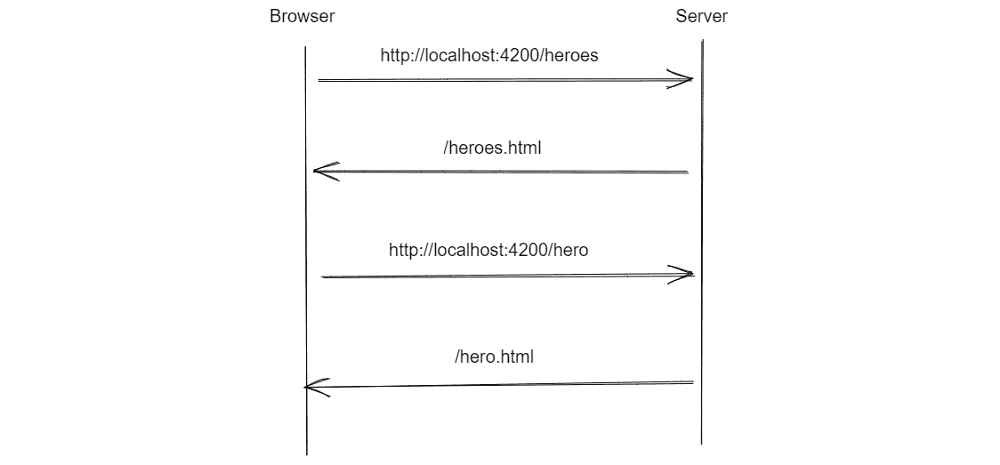
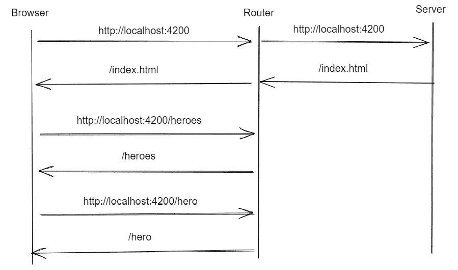
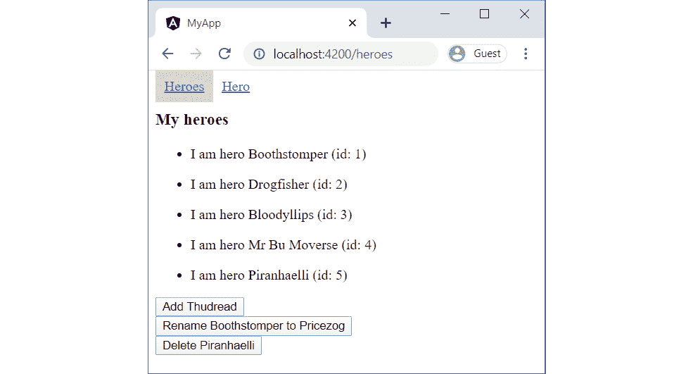
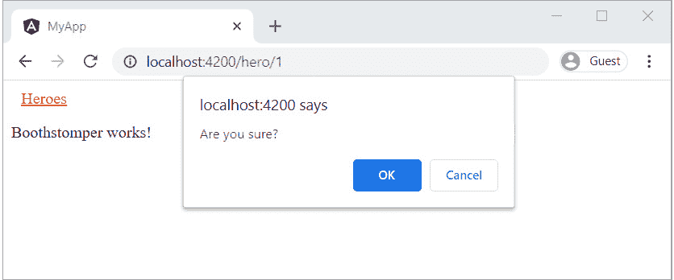

# 七、通过路由浏览组件

在前几章中，我们在分离关注点和添加不同抽象层以提高 Angular 10 应用的可维护性方面做了大量工作。然而，我们几乎不关心我们通过应用提供的用户体验。

目前，我们的用户界面充斥着分散在单个屏幕上的组件。我们需要提供更好的导航体验和逻辑方法来直观地更改应用的视图。现在是整合路由并将不同的兴趣区域分割成不同页面的正确时机，这些页面通过链接和 URL 网格相互连接。

那么，我们如何在 Angular 10 应用的组件之间部署导航方案呢？我们使用 Angular router，该路由是在考虑组件化的情况下构建的，并创建自定义链接以使我们的组件对它们做出反应。

在本章中，我们将执行以下操作：

*   了解如何定义用于打开和关闭组件的路由，并将它们重定向到其他路由。
*   了解如何根据请求的路由在视图中触发路由和加载组件。
*   了解如何使用路由向组件传递和处理参数。
*   学习如何保护我们的路线。
*   研究如何提高 Angular 应用的响应时间和捆绑大小。

# 技术要求

GitHub 链接：[https://github.com/PacktPublishing/Learning-Angular--Third-Edition/tree/master/ch07](https://github.com/PacktPublishing/Learning-Angular--Third-Edition/tree/master/ch07) 。

# Angular 路由介绍

在传统的 web 应用中，当我们想从一个视图切换到另一个视图时，我们需要从服务器请求一个新页面。浏览器将为视图创建 URL 并将其发送到服务器。一旦收到来自服务器的响应，浏览器就会重新加载页面。这是一个导致往返时间延迟和应用糟糕用户体验的过程：



图 7.1–传统 web 应用

使用 JavaScript 框架（如 Angular）的现代 web 应用采用不同的方法。它们处理客户端视图或组件之间的更改，而不会影响服务器。在引导过程中，他们只与服务器联系一次，以获取主`index.html`文件。任何后续的 URL 更改都会被截获并由客户端上的路由处理。这些类型的应用称为**单页应用**（**SPA**），因为它们不会导致完全重新加载页面：



图 7.2–SPA

Angular 框架提供了`@angular/router`npm 包，我们可以使用它在 Angular 10 应用的不同组件之间导航。在 Angular 应用中添加路由包括以下步骤：

1.  指定 Angular 应用的基本路径。
2.  使用`@angular/router`包装中适当的 Angular 模块。
3.  为 Angular 应用配置不同的路由。
4.  决定在导航时渲染组件的位置。

在下面的部分中，我们将在深入实践示例之前学习 Angular 布线的基础知识。

## 指定基本路径

正如我们已经看到的，当应用内部的 URL 发生变化时，现代和传统 web 应用的反应不同。每个浏览器的体系结构在这种行为中起着至关重要的作用。当 URL 更改时，旧浏览器会向服务器发起新请求。现代浏览器，也称为**HTML5 浏览器**，可以在不同视图中导航时更改浏览器的 URL 和历史记录，而无需使用称为**HTML5 pushState**的技术向服务器发送请求。

重要提示

HTML5 pushState 允许应用内导航，而不会导致完全重新加载页面，所有现代浏览器都支持它。

Angular 应用必须在`index.html`文件中设置`base`HTML 标记以启用 pushState 路由：

index.html

```ts
<!doctype html>
<html lang="en">
<head>
  <meta charset="utf-8">
  <title>MyApp</title>
  <base href="/">
  <meta name="viewport" content="width=device-width,   initial-scale=1">
  <link rel="icon" type="img/x-icon" href="favicon.ico">
</head>
<body>
  <app-root></app-root>
</body>
</html>
```

当浏览器深入 URL 层次结构时，`href`属性通知浏览器在尝试加载外部资源（如媒体或 CSS 文件）时应遵循的路径。

Angular CLI 在创建新 Angular app 时默认添加标记，并将`href`值设置为应用根目录`/`。如果您的应用位于与应用不同的文件夹中，则应根据该文件夹的名称进行更改。

## 导入路由模块

Angular router library 包含`RouterModule`，一个 Angular 模块，我们需要将其导入应用才能开始使用路由功能：

```ts
import { RouterModule } from '@angular/router';
```

我们在主应用模块`AppModule`中导入`RouterModule`，使用[*第 6 章*](06.html#_idTextAnchor149)中已经看到的`forRoot`模式，*使用异步数据服务丰富组件*：

```ts
@NgModule({
  imports: [
    RouterModule.forRoot(routes)
  ]
})
```

`RouterModule`的`forRoot`方法返回一个 Angular 模块，该模块包含一组与路由相关的 Angular 伪影：

*   用于执行常见路由任务（如导航）的服务
*   我们可以在组件中使用的指令，用导航逻辑丰富它们

它只接受一个参数，即应用的路由配置。

## 配置路由

我们在`forRoot`方法中传递的`routes`变量是一个`Routes`对象列表，用于指定应用中存在哪些路由以及哪些组件应响应特定路由。它可以如下所示：

```ts
const routes: Routes = [
  { path: 'heroes', component: HeroListComponent },
  { path: '**', component: PageNotFoundComponent }
];
```

每个路由定义对象都包含一个`path`属性，该属性是路由的 URL 路径，以及一个`component`属性，该属性定义应用导航到该路径时将加载哪个组件。请注意，`path`属性的值不包含前导的`/`。

Angular 10 应用中的导航可以通过更改浏览器的 URL 或指示路由沿应用代码中的路由路径导航来实现。在第一种情况下，当浏览器 URL 包含`/heroes`路径时，路由创建`HeroListComponent`的实例并在页面上显示其模板。相反，当应用通过代码导航到`/heroes`时，路由遵循相同的过程，并且更新浏览器的 URL。

如果用户试图导航到与任何路由不匹配的 URL，Angular 将激活一种称为**通配符路由**的自定义路由类型。通配符路由有一个带有两个星号的`path`属性，并与任何 URL 匹配。`component`属性通常是特定于应用的`PageNotFoundComponent`或应用的主要组件。

## 渲染组件

路由库使用`forRoot`方法导出的指令之一是`router-outlet`。它被用作角组件，并作为通过布线激活的组件的占位符。

通常，Angular 10 应用的`AppComponent`仅用于提供应用的主布局和编排所有其他组件。我们应该只写一次就忘了它，当我们想在应用中添加新功能时，不要修改它。因此，`AppComponent`的一个典型示例如下：

```ts
<app-header></app-header>
<router-outlet></router-outlet>
<app-footer></app-footer>
```

`app-header`和`app-footer`是布局组件，`router-outlet`是使用布线渲染所有其他组件的位置。实际上，这些组件被呈现为`router-outlet`指令的同级元素。

我们已经介绍了基本知识，并提供了路由的最低设置。在下一节中，我们将看一个更现实的示例，并进一步扩展我们对路由模块的了解，以及它如何帮助我们。

# 创建带路由的 Angular 应用

到目前为止，每当我们在本书中创建一个新的 Angular 应用时，Angular CLI 都会问我们是否想要添加路由，我们总是回答*否*。好了，现在是时候积极响应并启用路由到我们的 Angular 应用了！在以下各节中，我们将实践我们所学到的有关布线的所有基础知识：

*   搭建一个带有路由的 10 角应用
*   将路由配置添加到我们的 Angular 应用
*   导航到应用路径

在本节结束时，我们将构建一个简单的 Angular 10 应用，该应用具有完整的路由功能。

## 搭建一个有路线的角形应用

我们将使用 Angular CLI 从头开始创建一个新的 Angular 10 应用：

1.  执行`ng new`Angular CLI 命令，创建名为`my-app`的 Angular 应用。
2.  在询问我们是否要将路由添加到应用的问题中键入`y`（是），然后按*输入*。
3.  接受样式设置的默认`CSS`选择并按*输入*。

Angular CLI 在`app`文件夹中创建以下结构：


图 7.3–Angular 应用文件夹结构

它生成的文件与通常的大致相同，但有一个例外，`app-routing.module.ts`文件：

```ts
import { NgModule } from '@angular/core';
import { Routes, RouterModule } from '@angular/router';
const routes: Routes = [];
@NgModule({
  imports: [RouterModule.forRoot(routes)],
  exports: [RouterModule]
})
export class AppRoutingModule { }
```

这是一个 Angular 模块，用于在我们的应用中配置和启用路由。它使用`forRoot`方法导入`RouterModule`，正如我们在上一节中已经了解到的。它还重新出口`RouterModule`，以便进口`AppRoutingModule`的其他模块的组件可以访问路由服务和指令。默认情况下，`AppModule`导入`AppRoutingModule`，因此我们应用的所有组件都启用了路由功能：

```ts
import { BrowserModule } from '@angular/platform-browser';
import { NgModule } from '@angular/core';
import { AppRoutingModule } from './app-routing.module';
import { AppComponent } from './app.component';
@NgModule({
  declarations: [
    AppComponent
  ],
  imports: [
    BrowserModule,
    AppRoutingModule
  ],
  providers: [],
  bootstrap: [AppComponent]
})
export class AppModule { }
```

我们在上一节提到，`AppModule`直接进口`RouterModule`。我们本可以采用这种方法进行最小的路由配置，但出于以下原因，我们建议创建一个单独的路由模块：

*   我们可以随时更改应用的路由配置，与导入它的 Angular 模块无关。
*   我们可以在不启用路由的情况下轻松测试 Angular 模块。在单元测试中，路由很难管理。
*   从路由模块的存在，我们可以快速理解，Angular 模块支持路由。

路由模块不仅用于主应用模块`AppModule`，还用于功能模块，我们将在本章后面学习。

## 将路线配置添加到我们的 Angular app 中

我们应用的主模块还没有路由配置。`AppRoutingModule`中的`routes`变量为空数组。让我们开始用值填充它：

1.  Create two Angular components, one named `hero-list` and another named `hero-detail`.

    重要提示

    由于这些组件将通过路由被激活，我们可以安全地从`@Component`装饰器中删除它们的`selector`属性。但是，为了调试的目的，保持它们不变是很有帮助的，因为我们可以在 DOM 树的后面快速识别组件。

2.  在`routes`变量中添加两个路由定义对象，每个组件一个。`heroes`路由将激活`HeroListComponent`，而`hero`路由将激活`HeroDetailComponent`：

    ```ts
    const routes: Routes = [
      { path: 'heroes', component: HeroListComponent },
      { path: 'hero', component: HeroDetailComponent }
    ];
    ```

现在我们已经设置了我们应用的路由配置，我们只需要学习如何导航到特定的路由。

## 导航至申请路线

我们将使用两个路由指令在我们的应用中执行导航，即我们已经看到的指令和`routerLink`指令。我们将`routerLink`指令应用于锚定 HTML 元素，并将要导航的路由路径指定为值。请注意，路径以`/`开头，而不是路由定义对象中的`path`属性。开始吧：

1.  打开`app.component.html`文件，用`router-outlet`指令替换所有内容。
2.  添加一个包含两个锚定标记的`nav`HTML 元素，每个组件一个锚定标记。
3.  将`routerLink`指令添加到每个标记，并从我们前面创建的路由配置中分配相应的路径：

    ```ts
    <nav>
      <a routerLink="/heroes">Heroes</a>
      <a routerLink="/hero">Hero</a>
    </nav>
    <router-outlet></router-outlet>
    ```

我们现在可以预览 Angular 应用了。运行`ng serve`并点击**英雄**链接。应用应在`nav`元素下方显示`HeroListComponent`模板。它还应该更新浏览器的 URL 以匹配路由路径。现在试着做相反的事情。导航到根路径[http://localhost:4200](http://localhost:4200) ，并在 URL 末尾追加`/heroes`路径。应用的行为应该与之前相同，我们应该得到如下屏幕截图：


图 7.4-英雄路线

祝贺您的 Angular 应用现在支持应用内导航。我们几乎没有触及 Angular 布线的表面。许多路由功能正等待我们在以下部分进行研究。现在，让我们尝试将组件移动到一个单独的功能模块，这样我们就可以独立于主应用模块来管理它。

# 将我们的应用分为功能路由模块

在这一点上，我们已经设置了路由配置，以便路由按其应该的方式工作。然而，这种方法不能很好地扩展。随着我们应用的增长，越来越多的路由可能会添加到`AppRoutingModule`。因此，我们应该为我们的组件创建一个单独的功能模块，该模块也将有一个专用的路由模块。

我们已经在[*第 5 章*](05.html#_idTextAnchor129)*中学习了如何创建一个新的 Angular 模块，*构建一个 Angular 应用*。我们将使用相同的`generate`Angular CLI 命令，但我们也将传递一个不同的选项来创建路由模块：*

```ts
ng generate module heroes --routing
```

`--routing`参数指示 Angular CLI 与`heroes`功能模块一起创建路由模块：


图 7.5–英雄文件夹结构

Angular CLI 在实际功能模块的名称之后命名路由模块文件，并附加`-routing`后缀。这是一种惯例，有助于我们快速确定功能模块是否启用了路由，以及哪个是相应功能模块的路由模块。路由模块的 TypeScript`class`的名称也遵循类似的约定：

```ts
import { NgModule } from '@angular/core';
import { Routes, RouterModule } from '@angular/router';
const routes: Routes = [];
@NgModule({
  imports: [RouterModule.forChild(routes)],
  exports: [RouterModule]
})
export class HeroesRoutingModule { }
```

在前面的代码片段中，您可能已经注意到我们没有像以前那样使用`forRoot`方法导入`RouterModule`。相反，我们使用`forChild`方法来实现这一点。`forChild`方法用于在功能模块中注册路由。您只需在主应用模块`AppRoutingModule`的路由模块中调用`forRoot`方法**。**

 **现在我们已经创建了我们的特性模块和相关的路由模块，我们应该将所有特性相关的工件从`AppModule`移动到`HeroesModule`。首先移动组件，然后继续布线配置：

1.  将`hero-list`和`hero-detail`文件夹移动到`heroes`文件夹中。
2.  删除`AppModule`的`HeroListComponent`和`HeroDetailComponent`声明，并将其添加到`HeroesModule`的`declarations`属性中。不要忘记将他们的`import`语句移到文件顶部。
3.  从`app-routing.module.ts`文件中获取`routes`变量的内容，并将其移动到`heroes-routing.module.ts`文件的相应属性中。不要忘记再次移动相关的`import`语句。`AppRoutingModule`的路由配置现在应该是空数组。
4.  Finally, add `HeroesModule` **above** `AppRoutingModule` in the `imports` property of `AppModule`.

    重要提示

    我们导入路由模块的顺序确实很重要。路由选择具有*第一个匹配获胜*策略的路由。我们将包含更多特定路由的功能路由模块放在包含更多通用路由（如通配符路由）的主应用路由模块之前。因此，我们希望强制路由首先搜索特定的路由路径，然后返回到特定于应用的路径。

如果我们现在使用`ng serve`运行 Angular 应用，我们将看到它与以前一样工作。我们没有引入任何新功能或做任何花哨的事情，但我们已经为有效分离我们的路线配置铺平了道路。路由将我们的功能模块`HeroesModule`的路由与主应用模块`AppModule`的路由相结合。因此，我们可以在功能模块中继续使用路由，而无需修改主路由配置。

目前，我们应用的路由配置非常简单。在 web 应用中使用路由时，我们需要考虑一些场景，例如：

*   在引导应用时是否要显示特定视图？
*   如果我们尝试导航到不存在的路由路径，会发生什么？

在下一节中，我们将探讨如何处理最后一个案例，以避免破坏我们的应用。

## 处理未知路由路径

我们在*介绍 Angular 路由*一节中已经遇到了未知路由的概念。我们设置了一个通配符路由，当我们的应用试图导航到一个不存在的路由路径时，它会显示一个`PageNotFoundComponent`。现在是时候真正添加该组件了：

1.  使用 Angular CLI 创建名为`page-not-found`的新组件。当我们导航到未知路径时，我们的应用将显示新生成的组件。确保在模板中为其提供有意义的内容：

    ```ts
    <h3>Ooops!</h3>
    <p>The requested page was not found</p>
    ```

2.  Open the `app-routing.module.ts` file and add a new route definition object in the `routes` variable. Set the `path` property to double asterisks and the `component` property to the new component that you created:

    ```ts
    const routes: Routes = [
      { path: '**', component: PageNotFoundComponent }
    ];
    ```

    重要提示

    最好在`AppRoutingModule`中定义一个通配符路由以及相关组件。通配符路由应用于整个应用，因此它不绑定到特定功能。

如果我们运行`ng serve`并将浏览器指向[http://localhost:4200/angular](http://localhost:4200/angular) ，我们看到屏幕上显示了`page-not-found`组件，因为我们的应用没有`angular`路由：


图 7.6–未找到页面路径

重要提示

当路由遇到未知路由时，它会导航到通配符路由，但浏览器仍然指向无效的 URL。

尝试导航到应用的根路径[http://localhost:4200](http://localhost:4200) ，您会注意到`page-not-found`组件在屏幕上仍然可见。我们不小心破坏了我们的应用！为什么会这样？

`base`标记的`href`属性是 Angular 应用启动的位置，正如我们在*介绍 Angular 路由*一节中了解到的。创建新的 Angular 应用时，Angular CLI 默认将`href`的值设置为`/`。我们还了解到，路由的`path`属性中不包含`/`。因此，当我们的应用引导时，它加载到`''`空路由路径中。根据我们的路线配置，我们没有定义这样的路径。因此，路由返回到通配符路由，并在屏幕上显示`page-not-found`组件。

我们需要为 Angular 应用定义一个默认路由，这就引出了我们描述的第一个场景：如何在应用引导时定义默认路由路径。

## 设置默认路径

我们将路由的`path`属性设置为空字符串，以指示该路由是 Angular 应用的默认路由。在本例中，我们希望默认路由路径显示`HeroListComponent`：

1.  打开`heroes-routing.module.ts`文件，在已有路由下添加新的路由定义对象**。**
2.  将`path`属性设置为空字符串`''`，将`component`属性设置为`HeroListComponent`。
3.  运行应用，您会注意到当浏览器 URL 指向我们的应用的根路径时，`hero-list`组件显示在屏幕上。

然而，我们本可以做得比为`HeroListComponent`定义新的路由路径更好。让我们介绍另一个路由术语，`redirect`。将默认管线定义对象替换为以下对象：

```ts
{ path: '', redirectTo: '/heroes', pathMatch: 'full' }
```

当应用导航到默认路由时，我们告诉路由重定向到`/heroes`路径。`pathMatch`属性告诉路由如何将 URL 与路由`path`属性匹配。在这种情况下，只有当 URL 与默认路由匹配时，路由才会重定向到`/heroes`路径。

值得注意的是，我们在所有其他路由之后添加了空路由路径，因为我们已经了解到，路由的顺序很重要。我们想要更多的具体路线，而不是更少的具体路线。在下图中，您可以看到路由解析应用中路径的顺序：


图 7.7–路由路径解析过程

我们已经学会了如何使用`routerLink`指令在应用中导航。这是在模板中使用锚元素时的首选方法。然而，在现实世界的应用中，我们也使用按钮进行导航。在下一节中，我们将学习如何使用`button`元素强制导航到路由路径。

## 强制导航到某条路线

当我们导航到通配符路由时，`component`属性的模板显示在屏幕上。但是，正如我们所看到的，浏览器的地址栏停留在无效的 URL 上。因此，我们需要为用户提供一种逃离此路线的方法：

1.  打开`page-not-found.component.html`文件并添加`button`HTML 元素。
2.  向`button`元素的本机`click`DOM 事件添加事件绑定。将绑定的模板语句设置为`goHome`组件方法，该组件方法尚不存在。我们已经在[*第 3 章*](03.html#_idTextAnchor092)*组件交互和交互通信*

    ```ts
    <button (click)="goHome()">Home</button>
    ```

    中了解了事件绑定
3.  打开`page-not-found.component.ts`文件，创建`goHome`方法。
4.  `RouterModule`导出`Router`服务，我们可以在组件中使用该服务，以代码形式执行命令式导航。将服务注入到`PageNotFoundComponent`的构造函数中。
5.  在`goHome`方法中调用`Router`服务的`navigate`方法，导航到应用的根路径。它接受一个包含两项的**链路参数数组**——目的地路由路径和任何路由参数，我们将在本章后面了解：

page-not-found.component.ts

```ts
import { Component } from '@angular/core';
import { Router } from '@angular/router';
@Component({
  selector: 'app-page-not-found',
  templateUrl: './page-not-found.component.html',
  styleUrls: ['./page-not-found.component.css']
})
export class PageNotFoundComponent {
  constructor(private router: Router) { }
  goHome() {
    this.router.navigate(['/']);
  }
}
```

值得注意的是，链接参数数组也可以用于`routerLink`指令。例如，我们可以为英雄路线编写锚元素，如下所示：

```ts
<a [routerLink]="['/heroes']">Heroes</a>
```

重要提示

我们可以使用带有锚元素的命令式导航，以及带有`button`元素的`routerLink`指令。那很好。然而，按照本书中的建议使用它们在语义上更为正确。`routerLink`指令修改目标元素的行为并添加一个`href`属性，该属性以锚元素为目标。

到目前为止，我们一直依赖浏览器的地址栏来指示在任何给定的时间哪个路由路径处于活动状态。我们可以通过使用 CSS 样式来改善用户体验。

## 用样式装饰路由链接

`RouterModule`导出`routerLinkActive`指令，我们可以使用该指令更改活动路由的样式。它的工作原理类似于我们在[*第 3 章*](03.html#_idTextAnchor092)、*组件交互和交互通信*中学习的类绑定。它接受类名列表或单个类，该类在链接处于活动状态时添加，在链接处于非活动状态时删除：

1.  打开`app.component.css`文件并定义一个`active`类，该类将背景颜色设置为您选择的值：

    ```ts
    .active {
      background-color: lightgray;
    }
    ```

2.  将`routerLinkActive`指令添加到`app.component.html`中的两个链接，并将其设置为`active`类名：

    ```ts
    <a routerLink="/heroes" routerLinkActive="active">Heroes</a>
    <a routerLink="/hero" routerLinkActive="active">Hero</a>
    ```

现在，当我们点击应用中的链接时，它的背景颜色会变成我们选择的颜色。

我们已经了解到，我们可以导航到具有静态路径值的路由。在下一节中，我们将学习如何在路径通过路由参数动态更改时执行此操作。

# 向路由传递参数

企业 web 应用中的一个常见场景是有一个项目列表，当您单击其中一个项目时，页面将更改当前视图并显示所选项目的详细信息。此类似于主控详细信息浏览功能，其中主控页面中的每个生成 URL 都包含加载详细信息页面中每个项目所需的标识符。

我们可以用两条导航到不同组件的路线来表示前面的场景。一个组件是项目列表，另一个是项目的详细信息。因此，我们需要找到一种方法来创建特定于项目的动态数据，并将其从一个路由传递到另一个路由。

我们在这里解决了两个问题：在运行时使用动态参数创建 URL 和解析这些参数的值。没问题：Angular 路由得到了我们的支持，我们将通过一个真实的例子来了解如何使用它。

## 使用路由参数建立详细页面

我们需要重构我们正在处理的 Angular CLI 项目，以便重现前面的场景。我们的应用流程应如下所示：

1.  `HeroListComponent`显示后端 API 中的英雄列表。
2.  用户单击列表中的英雄。
3.  应用将用户重定向到`HeroDetailComponent`组件，该组件负责从后端 API 获取所选英雄的详细信息。

让我们从重用[*第 6 章*](06.html#_idTextAnchor149)中的一些内容开始，*使用异步数据服务丰富组件*：

1.  将`data.service.ts`文件复制到 Angular CLI 项目的`app`文件夹中。
2.  将`hero.model.ts`和`hero.service.ts`文件复制到 Angular CLI 项目的`heroes`文件夹中。
3.  将`HttpClientModule`导入`AppModule`中。
4.  安装角内存 web API 库并将`HttpClientInMemoryWebApiModule`导入`AppModule`。
5.  将`hero-list`文件夹替换为上一章代码中的相同文件夹。

到目前为止，我们的 Angular 应用在使用`ng serve`运行时应显示以下内容：



图 7.7–应用输出

用户应该能够点击列表中的每个英雄，并导航到所选英雄的详细信息。我们需要相应地定义路线配置，并修改英雄列表，以便每个英雄都可以单击：

1.  Open the `heroes-routing.module.ts` file and append the `/:id` suffix onto the `path` property of the hero route:

    ```ts
    { path: 'hero/:id', component: HeroDetailComponent }
    ```

    冒号字符表示`id`是一个路由参数。如果一个路由有多个参数，我们用`/`将它们分开。当我们想在组件中使用参数的值时，参数的名称`id`很重要，我们将在后面学习。

2.  Open the `hero-list.component.html` file and convert each paragraph element into an anchor element that displays the `name` property of a hero. Add the `routerLink` directive to each anchor element and use property binding to set its value in a link parameters array. Set the second item of the array to the `id` property of the `hero` template reference variable:

    ```ts
    <a [routerLink]="['/hero', hero.id]">{{hero.name}}</a>
    ```

    `routerLink`指令在处理动态路由时需要属性绑定。它将创建一个`href`属性，该属性包含`/hero`路径，后跟其`id`属性的值。

    如果我们运行应用并点击英雄的名字，它只会像以前一样导航到`HeroDetailComponent`。我们还没有利用英雄路线的新路线参数。

`HeroDetailComponent`应获取`id`参数的值，并向后端 API 发出 HTTP 请求，以获取具有该特定 id 的英雄。最后，应在组件属性中设置返回的英雄，以便我们可以在组件的模板中显示其详细信息：

1.  从`AppComponent`模板中移除指向英雄路线的锚元素。
2.  在`HeroService`中添加一个`getHero`方法，该方法使用 HTTP 客户端获取特定英雄的详细信息。该方法应返回一个类型为`Hero`的`Observable`：

    ```ts
    getHero(id: number): Observable<Hero> {
      return this.http.get<Hero>(this.heroesUrl + id);
    }
    ```

3.  `RouterModule`导出`ActivatedRoute`服务，我们可以使用该服务检索当前活动路由的信息，包括任何参数。将`ActivatedRoute`服务注入`HeroDetailComponent`：

    ```ts
    constructor(private route: ActivatedRoute) { }
    ```

    的构造函数
4.  在组件中创建一个`hero`属性，并使用插值在组件的模板

    ```ts
    <p>{{hero?.name}} works!</p>
    ```

    中显示其`name`属性

我们在`hero`属性中添加的`?`字符称为**安全导航操作符**。它用于保护我们的组件不受`hero`属性的`null`或`undefined`值的影响。如果我们不使用这个操作符，我们由于 HTTP 请求而经历的延迟将破坏我们的模板。模板将尝试显示尚未设置的`hero`对象的`name`属性，并将抛出错误。或者，我们可以在段落元素中使用`ngIf`指令来防止这种类型的错误。

`ActivatedRoute`服务包含`paramMap`可观察项，我们可以订阅它来获取路由参数值。`HeroDetailComponent`需要从`paramMap`可观察对象中获取`id`参数值，并调用`HeroService`的`getHero`方法，该方法也是可观察对象。那么，我们如何才能完成这项任务呢？

我们引入另一个 RxJS 操作符，`switchMap`，从一个可观测对象切换到另一个可观测对象。我们还利用`map`操作符将后端 API 返回的 hero 设置为本地`hero`组件属性：

```ts
ngOnInit(): void {
  this.getHeroObs();
}
private getHeroObs() {
  this.route.paramMap.pipe(
    switchMap((params: ParamMap) => {
      const id = +params.get('id');
      return this.heroService.getHero(id);
    }),
    map(hero => this.hero = hero)
  ).subscribe();
}
```

使用`switchMap`操作符的好处是，它可以取消任何挂起的 HTTP 请求。也就是说，如果用户使用不同的 id 重新激活到相同的路由路径，并且之前的 HTTP 请求尚未完成，则会丢弃旧请求并继续执行新请求。

在前面的代码片段中，值得注意以下几点：

*   `paramMap`observable 返回一个`ParamMap`类型的对象。我们可以使用`ParamMap`对象的`get`方法，传递我们在路由配置中定义的参数名称来访问其值。
*   我们在`id`参数前面加上加号，将其从`string`转换为`number`。

使用`ng serve`运行应用，并从列表中单击英雄的名字。应用导航到`HeroDetailComponent`并显示所选英雄的姓名。我们已经成功地将路由和 HTTP 集成到 Angular 10 应用中。令人惊叹的

在上一个示例中，我们使用`paramMap`将路线参数作为一个可观察参数。因此，理想情况下，我们的组件可以在其生命周期内收到新值的通知。但每次我们想从列表中选择不同的英雄时，组件都会被销毁，订阅`paramMap`可观察到的也会被销毁。那么，使用它到底有什么意义呢？

在连续导航期间，只要组件的实例保持在屏幕上，路由就可以重用该实例。我们可以使用子路由实现此行为。

## 使用子路由重用组件

当我们想要为功能模块定义一个容器组件，该组件将充当该模块组件的路由编排器时，我们使用子路由。它包含一个`router-outlet`元素，将在其中加载子路由。假设我们想要定义 Angular 应用的布局，如下所示：


图 7.9–Angular 应用的布局

`HeroListComponent`应包含现有内容以及`router-outlet`元素。当相关路由被激活时，额外的`router-outlet`元素用于呈现`HeroDetailComponent`。

重要提示

`HeroDetailComponent`的模板在`HeroListComponent`的`router-outlet`元素中呈现，而不是在`AppComponent`的`router-outlet`元素中呈现。

当我们从一个英雄导航到另一个英雄时，`HeroDetailComponent`不会被摧毁。相反，它保留在 DOM 树中，`ngOnInit`方法被调用一次，这是我们第一次选择英雄。当我们从列表中选择一个新英雄时，`paramMap`可观察对象会发出新英雄的 id。`HeroService`获取请求的 hero，并刷新组件的模板以反映新的更改。

在这种情况下，我们的 Angular app 的路由配置如下所示：

```ts
const routes: Routes = [
  {
    path: 'heroes',
    component: HeroListComponent,
    children: [
      { path: ':id', component: HeroDetailComponent },
    ]
  },
  { path: '', redirectTo: '/heroes', pathMatch: 'full' }
];
```

我们使用路由配置对象的`children`属性来定义子路由，其中包含路由配置对象的列表。还要注意，我们从`hero`路由的`path`属性中删除了单词`hero`。我们想明确它是`heroes`路线的子路径，应该使用`/heroes/:id`路径访问。

我们还应该更改`hero-list.component.html`文件中锚元素的`routerLink`指令，以便我们的应用正常工作：

```ts
<a [routerLink]="['./', hero.id]">{{hero.name}}</a>
```

请注意，我们将`/hero`替换为`./`。这个奇怪的语法是什么？它被称为**相对导航**，告诉路由相对于当前激活的路由导航到特定的路由。与我们目前使用的语法相反，我们称之为**绝对导航**。例如，`./`路径表示相对于当前级别进行导航，在我们的例子中，当前级别为`/heroes`。如果我们想要导航到的路线比`heroes`路线高一层，我们会使用`../`作为路径。可以将其视为使用命令行在文件夹之间导航。同样的语法也适用于命令式导航：

```ts
this.router.navigate(['./', hero.id], { relativeTo: this.route });
```

在本例中，我们在定义指向当前激活路由的`relativeTo`属性的链接参数数组之后传递一个附加`NavigationExtras`对象。

重要提示

相对导航被认为是比绝对导航更好的选择，因为它更容易重构。它通过定义相对于当前路由的路径来解耦硬编码链路。想象一下，移动一堆组件，突然所有的硬编码路径都错了。即使您决定更改父路径，功能模块内的导航也会按预期工作。

我们已经学会了如何利用角路由中的`paramMap`可观察性。显然，它不会给我们的 Angular 应用带来任何好处。在下一节中，我们将讨论使用路由快照的替代方法。

## 拍摄路线参数快照

目前，当我们从列表中选择英雄时，`HeroListComponent`从 DOM 树中删除，并添加`HeroDetailComponent`。要选择不同的英雄，请单击**英雄**链接或浏览器的后退按钮。因此，`HeroDetailComponent`从 DOM 中删除，并添加`HeroListComponent`。因此，我们现在的情况是，屏幕上一次只显示一个组件。

当`HeroDetailComponent`被破坏时，`ngOnInit`方法和对`paramMap`的订阅也被破坏。因此，在这一点上，我们使用可观测数据并没有获得任何好处。或者，我们可以使用`ActivatedRoute`服务的`snapshot`属性来获取路由参数的值：

```ts
private getHeroSnap() {
  const id = this.route.snapshot.params['id'];
  this.heroService.getHero(id).subscribe(hero => this.  hero = hero);
}
```

`snapshot`属性始终包含路由参数的当前值，该值恰好也是初始值。它包含`params`属性，该属性是`Params`类型的对象。`Params`对象包含路由参数键值对，我们可以像访问 TypeScript 中的标准对象一样访问这些键值对。

重要提示

如果您确信您的组件不会被重用，那么应该使用快照方法，因为它也更具可读性。

到目前为止，我们一直在以`heroes/:id`的形式处理路由参数。当我们想要路由到需要参数正常工作的组件时，我们使用这些类型的参数。在我们的例子中，`HeroDetailComponent`需要`id`参数，以便它可以获得特定英雄的详细信息。但是，还有另一种类型的参数被认为是可选的，我们将在下一节中学习。

## 使用查询参数过滤数据

查询参数被视为可选参数，因为它们旨在对数据进行排序或缩小数据集的大小。一些例子如下：

*   `/heroes?sortOrder=asc`：按升序排列英雄列表
*   `/heroes?page=3&pageSize=10`：将英雄列表拆分为 10 条记录，并获得第三页

查询参数在路由中由`?`字符识别。我们可以通过将多个查询参数与符号（`&`字符）链接来组合它们。`ActivatedRoute`服务包含一个`queryParamMap`可观察项，我们可以订阅它来获取查询参数值。它返回一个`ParamMap`对象，类似于`paramMap`可观察对象，我们可以查询该对象以获取参数值。例如，要检索`sortOrder`查询参数的值，我们将按如下方式使用它：

```ts
constructor(private route: ActivatedRoute) { }
ngOnInit(): void {
  this.route.queryParamMap.subscribe(params => {
    console.log(params.get('sortOrder'));
  });
}
```

使用快照路由获取查询参数值时，`queryParamMap`属性也可用。

现在，我们已经学会了如何在导航过程中传递参数，我们已经基本上涵盖了开始使用路由构建 Angular 应用所需的所有基本信息。在以下部分中，我们将重点介绍一些高级实践，这些实践将在我们的 Angular 应用中使用应用内导航时增强用户体验。

# 使用先进功能增强导航功能

到目前为止，我们已经介绍了基本路由，包括路由参数和查询参数。不过，Angular router 的功能非常强大，可以做更多的事情，例如：

*   控制对路由的访问
*   阻止航行离开路线
*   预加载数据以改进用户体验
*   延迟加载路由以加快响应时间
*   提供工件，以便在 Angular 10 应用中轻松调试路由行为

在下面的章节中，我们将更详细地了解所有这些技术。

## 控制路由访问

当我们想要防止未经授权访问特定路线时，我们使用一种称为**警卫**的特定 Angular 服务。为了创建一个防护，我们使用 Angular CLI 的`generate`命令，传递单词`guard`及其名称作为参数：

```ts
ng generate guard auth
```

当我们执行上一个命令时，Angular CLI 会询问我们希望 guard 实现哪些接口：


图 7.10–选择接口

我们可以根据它们提供的功能创建多种类型的防护装置。每个 guard 实现不同的接口：

*   **CanActivate**：控制是否可以激活路由。
*   **CanActivateChild**：控制对路由的子路由的访问。
*   **CanDeactivate**：控制是否可以停用路由。当我们离开某条路线时，会发生停用。
*   **CanLoad**：控制对加载延迟加载模块的路由的访问。

现在，让我们接受默认值`CanActivate`，然后按*输入*：

```ts
import { Injectable } from '@angular/core';
import { CanActivate, ActivatedRouteSnapshot, RouterStateSnapshot, UrlTree } from '@angular/router';
import { Observable } from 'rxjs';
@Injectable({
  providedIn: 'root'
})
export class AuthGuard implements CanActivate {
  canActivate(
    next: ActivatedRouteSnapshot,
    state: RouterStateSnapshot): Observable<boolean |     UrlTree> | Promise<boolean |     UrlTree> | boolean | UrlTree {
    return true;
  }

}
```

我们创建的防护实现了`CanActivate``interface`的`canActivate`方法，它接受两个参数：`ActivatedRouteSnapshot`对象，表示将被激活的路由和`RouterStateSnapshot`，其中包含成功导航后路由的状态。`canActivate`方法可以同步或异步返回`boolean`值。在后一种情况下，路由将等待可观察到的或承诺解决后再继续。如果异步事件未完成，导航将不会继续。`canActivate`方法还可以返回`UrlTree`对象，这将导致新的导航到定义的路线。

目前，我们的守卫立即返回`true`，允许自由进入一条路线。让我们创建一个`isAuthenticated`属性，这样我们就可以更容易地改变守卫的行为：

重要提示

在实际应用中，我们会将用户是否经过身份验证的决定委托给单独的服务。该服务可能会检查浏览器的本地存储或任何其他方式，以指示用户是否已通过身份验证。

```ts
export class AuthGuard implements CanActivate {
  private isAuthenticated = true;
  constructor(private router: Router) {}
  canActivate(
    next: ActivatedRouteSnapshot,
    state: RouterStateSnapshot): Observable<boolean | UrlTree>     | Promise<boolean | UrlTree> | boolean | UrlTree {
    return this.checkLogin();
  }
  private checkLogin(): boolean {
    if (this.isAuthenticated) { return true };
    this.router.navigate(['/']);
    return false;
  }
}
```

我们创建了一个单独的`checkLogin`方法来处理是否允许访问路由的逻辑。`canActivate`方法调用`checkLogin`方法并返回其值。它检查`isAuthenticated`属性的值，如果是`true`，则应用可以导航到指定的路由。否则，它使用`Router`服务将导航到 Angular app 的根路径并返回`false`，以便取消之前的导航。

重要提示

当我们重定向到守卫内的另一条路线时，我们需要从`canActivate`方法返回`false`值，以便取消当前正在进行的导航。

路由配置对象包含`canActivate`属性，我们可以使用该属性将`CanActivate`防护应用于特定路由：

```ts
const routes: Routes = [
  { path: 'heroes', component: HeroListComponent },
  { path: 'hero/:id', component: HeroDetailComponent,   canActivate: [AuthGuard] },
  { path: '', redirectTo: '/heroes', pathMatch: 'full' }
];
```

现在只有经过身份验证的用户才能访问 hero 路由。运行应用并使用`AuthGuard`的`isAuthenticated`属性的不同值检查结果。

## 防止航行偏离路线

类似地，为了防止访问路由，我们还可以使用`CanDeactivate<T>`接口防止导航离开路由。`T`表示我们希望离开的组件`class`。我们需要在一个守卫中实现`canDeactivate`方法才能开始使用它：

1.  使用 Angular CLI 创建名为`confirm`的新防护装置。
2.  当 Angular CLI 请求时，仅选择要实现的**CanDeactivate**选项。
3.  打开`confirm.guard.ts`文件，将`CanDeactivate``interface`的类型设置为`HeroDetailComponent`，因为我们想检查用户是否只导航离开该组件。在真实场景中，您可能需要创建一个更通用的防护来支持其他组件：

    ```ts
    export class ConfirmGuard implements CanActivate, CanDeactivate<HeroDetailComponent> {
    }
    ```

4.  另外，将`canDeactivate`方法的`component`参数类型设置为`HeroDetailComponent`。
5.  创建一个`showConfirm`方法，该方法使用全局`window`对象的`confirm`方法在导航离开`HeroDetailComponent`之前显示确认对话框。确保该方法返回一个带有`boolean`值的可观察值：

    ```ts
    private showConfirm(): Observable<boolean> {
      const confirmation = window.confirm('Are you sure?');
      return of(confirmation);
    }
    ```

6.  `canDeactivate`方法可以同步或异步返回`boolean`或`UrlTree`值，类似于`canActivate`方法。调用`canDeactivate`方法中的`showConfirm`方法：

    ```ts
    canDeactivate(
      component: HeroDetailComponent,
      currentRoute: ActivatedRouteSnapshot,
      currentState: RouterStateSnapshot,
      nextState?: RouterStateSnapshot): Observable<boolean |   UrlTree> | Promise<boolean | UrlTree> | boolean |   UrlTree {
      return this.showConfirm();
    }
    ```

7.  路由配置对象包含类似于`canActivate`的`canDeactivate`属性。打开`heroes-routing.module.ts`文件并相应设置为使用`ConfirmGuard`：

    ```ts
    {
      path: 'hero/:id',
      component: HeroDetailComponent,
      canActivate: [AuthGuard],
      canDeactivate: [ConfirmGuard]
    }
    ```

使用`ng serve`运行应用并从列表中选择英雄。点击**英雄**链接或按浏览器的后退按钮，将显示确认对话框：



图 7.11–离开路线导航

如果选择**取消**，则导航被取消，应用保持当前状态。如果您选择**确定**，您将被重定向到应用的根路径。

## 预加载路线数据

您可能已经注意到，当您从列表中选择一个英雄并导航到`HeroDetailComponent`时，显示英雄详细信息的延迟。这是合理的，因为我们正在向后端 API 发出 HTTP 请求。然而，用户界面中存在闪烁现象，这对用户体验不利。谢天谢地，Angular 路由可以帮助我们解决这个问题。我们可以使用**解析器**预取英雄的详细信息，以便在激活路由和显示组件时可以使用这些信息。

重要提示

当我们想在激活路由之前处理可能的错误时，解析器非常方便。如果我们作为路由参数传递的 id 在后端不存在，则不导航到`HeroDetailComponent`更合适。

分解器是实现`Resolve<T>``interface`的 Angular 服务，其中`T`是被分解的数据类型。服务需要明确实现该`interface`的`resolve`方法。它同步或异步返回解析数据。在我们的例子中，由于我们使用 HTTP 客户端与后端 API 通信，因此它返回一个可观察的`Hero`对象：

hero-detail-resolver.service.ts

```ts
import { Injectable } from '@angular/core';
import { Resolve, ActivatedRouteSnapshot, RouterStateSnapshot } from '@angular/router';
import { Hero } from './hero.model';
import { HeroService } from './hero.service';
import { take, mergeMap } from 'rxjs/operators';
import { of, Observable } from 'rxjs';
@Injectable({
  providedIn: 'root'
})
export class HeroDetailResolverService implements Resolve<Hero> {
  constructor(private heroService: HeroService) { }
  resolve(route: ActivatedRouteSnapshot, state:   RouterStateSnapshot): Observable<Hero> {
    const id = +route.paramMap.get('id');
    return this.heroService.getHero(id).pipe(
      take(1),
      mergeMap(hero => of(hero))
    );
  }
}
```

`resolve`前面的方法中涉及到的步骤有：

1.  首先，我们获取`id`路由参数的值，并使用加号将其转换为`number`。
2.  然后调用`HeroService`的`getHero`方法，我们将`id`作为参数传递。
3.  我们使用`pipe`操作符与另外两个 RxJS 操作符一起处理返回的可观测值。
4.  `take`操作符确保在发出第一个值后，可观察对象完成。
5.  `mergeMap`运算符用于展平`getHero`方法返回的可观测值。

路由配置对象包含一个`resolve`属性，我们可以使用该属性注册刚刚创建的解析器：

```ts
{
  path: 'hero/:id',
  component: HeroDetailComponent,
  canActivate: [AuthGuard],
  canDeactivate: [ConfirmGuard],
  resolve: {
    hero: HeroDetailResolverService
  }
}
```

`resolve`属性是一个对象，它包含一个唯一的名称作为键，以及解析程序的 TypeScript 类作为值。密钥的名称很重要，因为我们将在组件中使用该名称访问解析数据：

```ts
ngOnInit(): void {
  this.hero = this.route.snapshot.data.hero;
}
```

来自解析器的数据在`snapshot`对象的`data`属性中可用。或者，您也可以通过`ActivatedRoute`服务直接订阅：

```ts
ngOnInit(): void {
  this.route.data.subscribe((data: { hero: Hero }) => {
    this.hero = data.hero;
  });
}
```

请注意，在这两种情况下，解析数据都是从`data`对象的`hero`属性访问的。它是我们在路由配置对象的`resolve`属性中定义的密钥的名称。

如果您现在运行应用，您会注意到导航到`HeroDetailComponent`时没有闪烁，并且会立即显示英雄的详细信息。但是，在从列表中选择英雄时，您可能会注意到有一点延迟。这是 HTTP 请求对源自解析程序的后端 API 引入的延迟。

## 延迟装载路线

在某个时候，我们的应用可能会增长，并且我们放入其中的数据量也可能会增长。其结果是，应用可能需要很长时间才能启动，或者某些部件可能需要很长时间才能启动。为了克服这些问题，我们可以使用一种称为**延迟加载**的技术。

延迟加载意味着我们最初不会加载应用的所有部分。当我们提到零件时，我们指的是角模。应用模块可以分为块，仅在需要时加载。在 Angular 应用中延迟加载模块有很多优点：

*   可根据用户的请求加载功能模块。
*   访问应用某些区域的用户可以从这项技术中获益匪浅。
*   我们可以在延迟加载的模块中添加更多功能，而不会影响整个应用包的大小。

为了充分展示延迟加载的潜力，让我们在 Angular 应用中添加一个新组件：

1.  创建名为`about`的新模块，并启用路由。
2.  在新创建的模块中创建一个名为`about-info`的组件。
3.  打开`about-routing.module.ts`文件，在`routes`变量中添加新的路由配置对象，激活`AboutInfoComponent`。将`path`属性设置为空字符串，以便在默认情况下激活`AboutInfoComponent`：

    ```ts
    const routes: Routes = [
      { path: '', component: AboutInfoComponent }
    ];
    ```

4.  向链接到新创建的路由的`app.component.html`文件中添加新的锚元素：

    ```ts
    <nav>
      <a routerLink="/heroes" routerLinkActive=  "active">Heroes</a>
      <a routerLink="/about" routerLinkActive="active">About</  a>
    </nav>
    <router-outlet></router-outlet>
    ```

5.  Add a new route configuration object to the `routes` variable of `AppRoutingModule`. Set the `path` property to `about` and use the `loadChildren` property to point to `AboutModule` lazily:

    ```ts
    const routes: Routes = [
      { path: 'about', loadChildren: () => import('./about/  about.module').then(m => m.AboutModule)},
      { path: '**', component: PageNotFoundComponent }
    ];
    ```

    `loadChildren`属性返回一个箭头`function`，该箭头使用 ES6 动态`import`语句延迟加载`AboutModule`。`import``function`接受我们要导入的模块的相对路径，并返回包含我们要加载的 Angular 模块的 TypeScript`class`的 promise 对象。

    重要提示

    我们没有将`AboutModule`添加到`AppModule`的`imports`数组中。如果我们这样做的话，`AboutModule`将被加载两次：一次是急切地从`AppModule`加载，另一次是懒散地从**关于**链接加载。

使用`ng serve`运行应用并打开浏览器的开发工具。点击**关于**链接，查看**网络**页签中的请求：


图 7.12–延迟加载路由请求

应用向`about-about-module.js`文件发起新请求，该文件是`AboutModule`的捆绑包。Angular 框架为每个延迟加载的模块创建一个新的捆绑包，并且不将其包含在主应用捆绑包中。

如果您离开并再次单击**关于**的链接，您将注意到应用不会发出新的加载`AboutModule`请求。只要请求延迟加载的模块，它就会保存在内存中，并可用于后续请求。

不过，我要提醒你一句。正如我们在[*第 5 章*](05.html#_idTextAnchor129)*中了解到的，*构造一个 Angular 应用*，使用`@Injectable`装饰器的`providedIn`属性向应用的根注入器注册 Angular 服务。延迟加载模块创建一个单独的注入器，它是根应用注入器的直接子注入器。如果在延迟加载的模块中使用向根应用注入器注册的 Angular 服务，那么在这两种情况下，最终都会得到一个单独的服务实例。因此，对于如何在延迟加载的模块中使用服务，我们必须谨慎。*

延迟加载的模块是标准的 Angular 模块，因此我们可以使用防护来控制对它们的访问。

### 保护延迟加载的模块

我们可以控制对延迟加载模块的未经授权的访问，就像我们在急切加载的模块中所做的那样。但是，对于这种情况，我们需要实现一个不同的`interface`，即`CanLoad``interface`。

让我们扩展`AuthGuard`，这样它也可以用于延迟加载的模块。我们需要从`CanLoad``interface`中执行`canLoad`方法：

```ts
canLoad(
  route: Route,
  segments: UrlSegment[]): Observable<boolean> |   Promise<boolean> | boolean {
  return this.checkLogin();
}
```

与所有以前的防护一样，我们必须使用路由配置对象的`canLoad`属性向延迟加载的路由注册`AuthGuard`：

```ts
{
  path: 'about',
  loadChildren: () => import('./about/about.module').  then(m => m.AboutModule),
  canLoad: [AuthGuard]
}
```

如果我们运行应用并将`AuthGuard`的`isAuthenticated`属性更改为`false`，我们将注意到，即使我们点击**关于**链接，我们的应用也不会导航到路线。

有时，我们需要预加载延迟加载的模块，因为我们知道用户可能会在某个时候访问它。我们可以通过在模块中使用预加载策略来实现此功能。

### 预加载延迟加载的模块

预加载策略只能应用于延迟加载的模块，并且可以使用`RouterModule`的`forRoot`方法进行配置。我们可以选择预加载所有模块，或者指定一个自定义策略，以确定何时加载哪个模块。为了对所有模块启用预加载，我们使用`PreloadAllModules`策略：

```ts
@NgModule({
  imports: [RouterModule.forRoot(routes, {preloadingStrategy:   PreloadAllModules})],
  exports: [RouterModule]
})
```

这对于桌面连接来说已经足够好了；但是，如果您使用的是移动连接，这可能太重了。此时，我们需要更好、更细粒度的控制。我们可以做的是实施我们的定制预加载策略：

1.  创建实现`PreloadingStrategy``interface`特别是其`preload`方法的 Angular 服务。
2.  `preload`方法接受两个参数：`Route`对象，表示延迟加载的路由；以及`load`方法，如果路由需要预加载，则调用该方法。否则，它应该返回一个空的可观测值。我们使用`EMPTY`RxJS 运算符表示可观测对象不发出任何值。
3.  使用`Route`对象的`data`属性定义是否应预加载路由。路由配置对象的`data`属性可用于存储与路由相关的任意数据，如页面标题、面包屑或其他静态数据。

我们创建的 Angular 服务应如下所示：

自定义预加载.service.ts

```ts
import { Injectable } from '@angular/core';
import { PreloadingStrategy, Route } from '@angular/router';
import { Observable, EMPTY } from 'rxjs';
@Injectable({
  providedIn: 'root'
})
export class CustomPreloadingService implements PreloadingStrategy {
  constructor() { }
  preload(route: Route, load: () => Observable<any>):   Observable<any> {
    if (route.data && route.data['preload']) {
      return load();
    } else {
      return EMPTY;
    }
  }
}
```

我们现在需要在`RouterModule`中定义新创建的预加载策略，并设置`about`路线的`data`属性：

```ts
const routes: Routes = [
  {
    path: 'about',
    loadChildren: () => import('./about/about.module').    then(m => m.AboutModule),
    canLoad: [AuthGuard],
    data: { preload: true }
  },
  { path: '**', component: PageNotFoundComponent }
];
@NgModule({
  imports: [RouterModule.forRoot(routes, {preloadingStrategy:   CustomPreloadingService})],
  exports: [RouterModule],
})
```

使用`ng serve`运行应用，您应该看到`about`路由的捆绑包默认在应用引导时加载。然而，这并没有发生。为什么？预加载策略预加载每个延迟加载的路由，由`canLoad`防护的路由除外。这是有意义的，因为`canLoad`只有在我们经过身份验证或授权，或者基于我们设置的其他条件时才会加载。尝试从路由中删除`canLoad`属性，您将成功看到`about`路由预加载正确。

## 调试路由配置

我们为什么要调试路由？嗯，有时候 Angular 应用中的路由并不像应该的那样工作；当出现这种情况时，最好能更多地了解路由是如何工作的以及为什么。要启用调试，我们需要在`RouterModule`的`forRoot`方法中传递一个配置对象作为第二个参数。它包含`enableTracing`属性，当设置为`true`时，会在浏览器的控制台窗口中记录路由事件：

```ts
@NgModule({
  imports: [RouterModule.forRoot(routes,   {enableTracing: true})],
  exports: [RouterModule]
})
```

另一个很好的选择是监听特定的路由事件并记录它。Angular 路由在每次导航期间发出特定事件。导航事件可以通过订阅`Router`服务的`events`可观察项并检查事件类型来访问，如下所示：

```ts
this.router.events.pipe(filter(event => event instanceof NavigationEnd)).subscribe();
```

前面的代码段只侦听`NavigationEnd`类型的事件。您可以在[找到支持的导航事件类型的完整列表 https://angular.io/guide/router#router-事件](https://angular.io/guide/router#router-events)。

# 总结

现在，我们已经揭开了角形路由的威力，我们希望您能享受这段进入这个复杂图书馆的旅程。Angular router 的亮点之一是，我们可以通过如此简单但功能强大的实现涵盖大量选项和场景。

我们已经学习了设置路由和处理不同类型参数的基础知识。我们还了解了更高级的功能，例如子路由。此外，我们还学会了如何保护我们的路线不被未经授权的访问。最后，我们展示了异步路由的全部功能，以及如何通过延迟加载和预加载提高响应时间。

在下一章中，我们将加强我们的`HeroDetailComponent`，以展示 web 表单的底层机制，以及使用表单控件获取用户输入的最佳策略。**