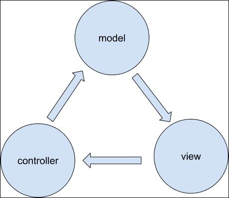

# 一、Angular 2 组件架构

我们对 web 应用程序的思考方式已经改变。本章的目标是概述用于构建前端应用程序的现有流行体系结构模式，以及依赖于组合自包含自定义组件的新方法。

了解 Angular 1 中实现的体系结构模式将有助于将来将现有应用程序迁移到 Angular 2。在本章中，我们将讨论以下主题：

*   模型-视图-控制器模式概述
*   Angular 1 模型、视图和视图模型的实现
*   从 MVVM 迁移到组件
*   Angular 2 组件体系结构示例

# 模型-视图-控制器模式

这是一种用于实现用户界面的架构设计模式，多年来一直用于桌面 GUI。

它将应用程序分为三个不同的部分：

*   **型号**：此负责存储实际数据
*   **视图**：将数据呈现给用户的表示层
*   **控制器**：模型与视图之间的胶水

下图描述了这些部件之间的关系：



此模式描述这些部件之间的通信。**视图**反映了模型中的数据，但不能直接改变模型中的数据。通常将模型和视图之间的关系描述为只读（视图只能从模型中读取）。视图通过调用方法和更改属性来使用**控制器**。**控制器**更新模型，使视图更新并呈现新数据。

MVC 最初是为桌面应用程序开发的，它已被广泛用作构建单页 web 应用程序的体系结构，并且可以在所有流行的客户端框架中找到，包括 Angular。

# Angular 1 中的 MVC

Angular 1 实现了经典 MVC 的变体，其名称为模型视图模型（**MVVM**。此模式描述了部件之间的不同角色和通信：

*   **模型**：此保存数据或充当数据访问层
*   **视图**：与 MVC 一样，这是表示层
*   **视图模型**：这是绑定到视图的视图的抽象

下图描述了这些零件之间的关系，术语为 Angular 1：


Angular 1 中的**ViewModel**是一个名为：`$scope`的对象，由 Angular 控制器构造。我们并不总是直接与这个对象交互。它与视图的绑定是双向的（在 Angular 上，我们将视图称为“模板”）。ViewModel 可以读取和更改模型上的数据，并在必要时进行自我更新。视图将立即反映这些变化。Angular 不包括任何预定义的模型类型。相反，我们将模型编码为纯 JavaScript，并将其注册为 Angular 服务。下面的代码片段显示了自定义模型服务`Model.js`的结构：

```ts
class Product {
  constructor(){
    this.color = "red";
  }
}
```

下面的代码片段展示了`ViewModel.js`的结构：

```ts
class ProductController {
  constructor(Product) {
    this.product = Product
  }
}
```

下面的代码片段展示了`View.html`的结构：

```ts
<p>{{ product.color }}</p>
```

# 从视图移动到组件

Angular 应用程序基于视图的概念。Angular 视图指的是模板（HTML），大多数情况下，该模板由一个或多个控制器管理。该视图还可以包含一些自定义指令，这些指令封装了其他一些 HTML 和 JavaScript 块。当然，随着时间的推移，Angular 开发人员倾向于创建越来越多的指令，并将它们用作构建块，用自定义元素替换原始 HTML 标记。

从小型定制元素组成视图的概念已经成为一种潮流，可以在其他流行的现代框架中找到，如 react 和 polymer。Angular 2 很好地围绕这个概念构建，并将 UI 架构建立在这些构建块的基础上。因此，从现在起，我们将组件称为构建块，将模板称为布局。

# 定义组件

组件是一种干净的方式，可以将 UI 代码组织成自包含、可重用的块，其中包含它们自己的视图和逻辑。组件可以组合在一起以创建复杂的用户界面。组件可以选择从外部世界接收属性，也可以选择通过回调或事件进行通信。业务逻辑、结构和样式可以封装在组件代码中。

Angular 2 中的组件只是带有视图的指令。实际上，Angular 2 中的组件是一种指令类型。我们还可以在 Angular 2 中编写一个不包含模板（并且不会被称为组件）的指令。

这些指令与您熟悉的 Angular 1.x 中的指令非常相似。主要区别在于，在 Angular 2.0 中，我们考虑两种指令：向元素添加行为的属性指令和我们命名为：组件的结构指令。

# 将应用程序分解为多个组件

angular 2 应用程序是一组组件。我们为每个 UI 元素、视图和路由定义一个组件。我们必须定义一个根组件，将其用作所有其他组件的容器。换句话说，Angular 2 应用程序是组件树。

设计良好、面向组件的 Angular 2 应用程序的关键是成功地将 UI 分解为组件树。例如，让我们讨论一个简单的移动待办事项列表应用程序，它如下所示：


构成此 UI 的组件树如下所示：


此应用程序由九个组件组成。根部是**应用程序**组件，其中包含所有其他组件。接下来，我们找到表单组件，它由**输入**组件和**按钮**组件构建而成。

**任务列表**组件是**任务行**组件的容器。每个 TaskRow 由三个组件组成：一个**复选框**、**标签**和一个**垃圾箱**图标。

对于您应该创建多少组件没有严格的规定，但最好的做法是将 UI 拆分为尽可能多的组件。组件的数量将影响应用程序的其他方面，如可重用性、维护和测试。

# 总结

从组件构建 UI 的想法并不新鲜。在 Angular 1 中，我们能够开发类似组件的指令，但这不是强制性的。在 Angular 2 中，整个应用程序是一棵组件树，因此将设计分解为小部分并学习如何构建组件的能力至关重要。