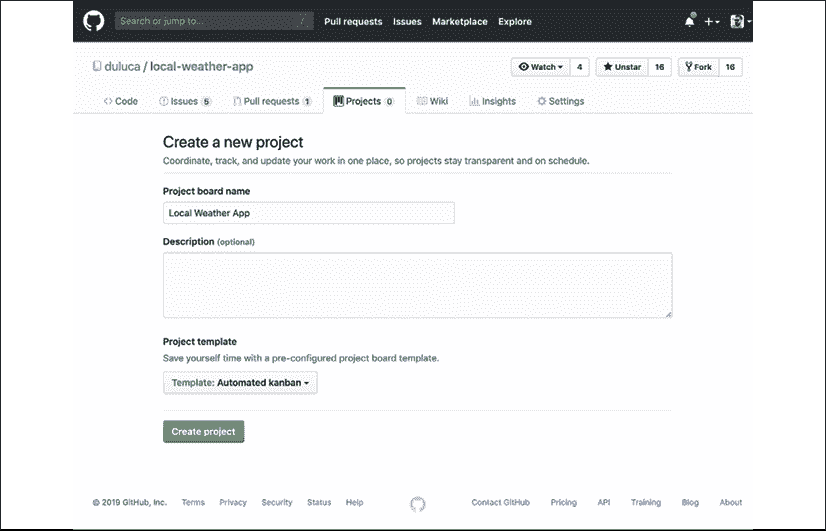
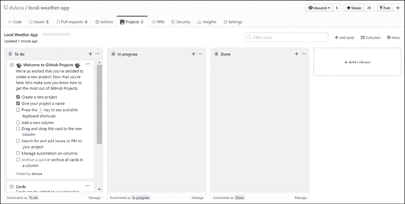
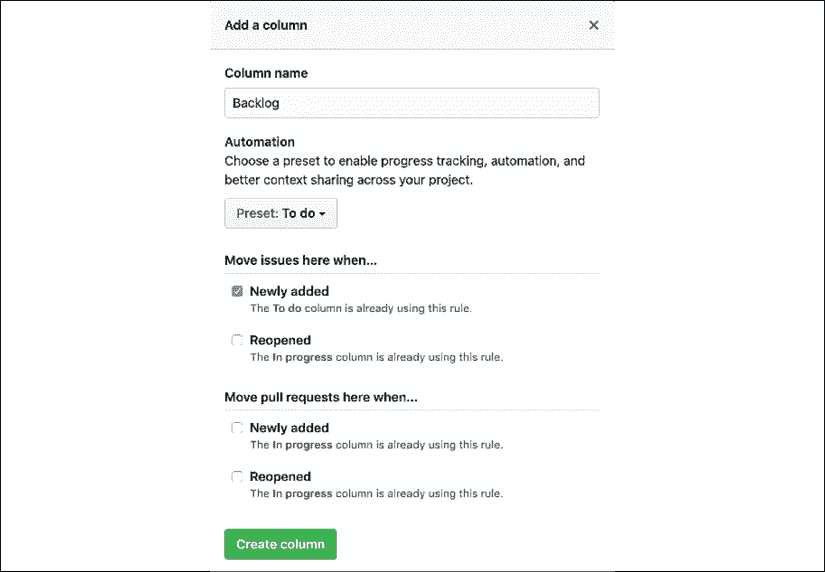
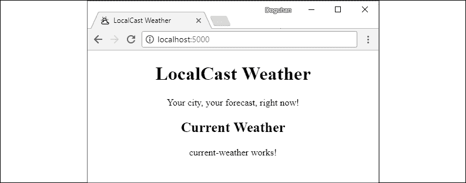
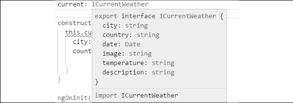
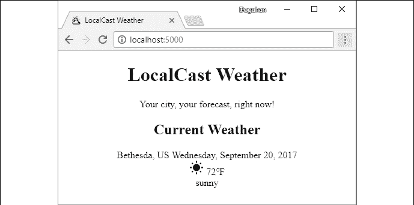
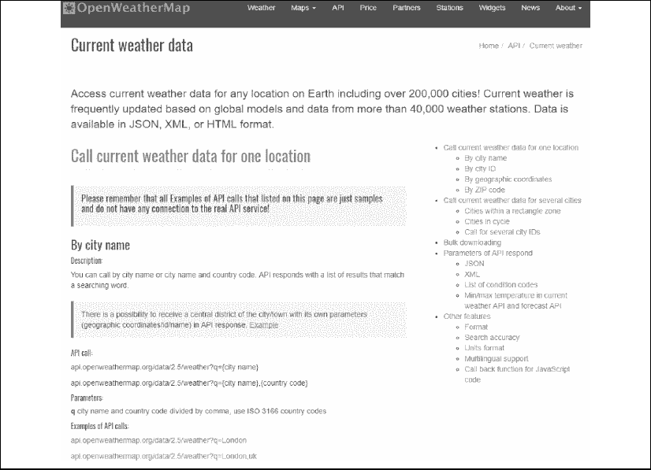

# 三、创建一个基本的 Angular 应用

在本章中，我们将使用 Angular 和第三方 web API 以及迭代开发方法设计并构建一个简单的本地天气应用。在学习 Angular、TypeScript、VisualStudio（VS）代码、反应式编程和 RxJS 的细微差别和最佳使用方式的同时，我们将首先关注交付价值。在深入编码之前，我们需要构建一个功能路线图，创建一个我们打算构建的应用的模型，并绘制应用的高层架构图。

将向您介绍 Angular 基础知识，以构建一个简单的 web 应用，并熟悉新的 Angular 平台和全栈体系结构。

在本章中，您将学习以下内容：

*   使用 GitHub 项目规划路线图
*   使用看板板实现协作和轻松的信息辐射
*   制作一个新的 UI 元素，使用 Angular 组件和 TypeScript 界面显示当前天气信息
*   使用 Angular services 和`HttpClient`从`OpenWeatherMap`API 检索数据
*   利用可观测流使用 RxJS 转换数据
*   Angular 传感器中的零位保护

本书样本代码的最新版本在下面链接的存储库的 GitHub 上。存储库包含代码的最终和完成状态。您可以在本章末尾通过在`projects`文件夹下查找代码的章末快照来验证您的进度。

对于*第三章*：

1.  克隆存储库[https://github.com/duluca/local-weather-app](https://github.com/duluca/local-weather-app) 。
2.  在根文件夹上执行`npm install`以安装依赖项。
3.  本章代码示例在子文件夹

    ```ts
    projects/ch3 
    ```

    下
4.  要运行本章的 Angular 应用，请执行：

    ```ts
    npx ng serve ch3 
    ```

请注意，书中或 GitHub 上的源代码可能并不总是与 Angular CLI 生成的代码匹配。书中的代码和 GitHub 上的代码在实现上也可能有细微的差异，因为生态系统是不断发展的。随着时间的推移，示例代码自然会发生变化。此外，在 GitHub 上，希望找到更正、修复以支持库的更新版本，或者同时实现多种技术，供读者观察。读者只希望实现书中推荐的理想解决方案。如果发现错误或有问题，请在 GitHub 上创建问题或提交请求，以方便所有读者。

您可以在*附录 C*、*保持 Angular 和 Tools 常青*中了解更多关于更新 Angular 的信息。您可以从[在线找到此附录 https://static.packt-cdn.com/downloads/9781838648800_Appendix_C_Keeping_Angular_and_Tools_Evergreen.pdf](https://static.packt-cdn.com/downloads/9781838648800_Appendix_C_Keeping_Angular_and_Tools_Evergreen.) 或[处 https://expertlysimple.io/stay-evergreen](https://expertlysimple.io/stay-evergreen) 。

让我们从创建一个高层计划开始，在开始编码之前了解要实现什么。

# 使用看板和 GitHub 项目进行规划

上路前制定路线图对于确保你到达目的地至关重要。同样，在开始编码之前制定一个粗略的行动计划对于确保项目成功非常重要。尽早制定计划可以让你的同事或客户知道你计划完成什么。然而，任何初始计划都会随着时间的推移而发生变化。

敏捷软件开发旨在考虑优先级和特性随时间的变化。看板和 Scrum 是两种最流行的方法，您可以使用它们来管理您的项目。每种方法都有一个积压工作的概念，并列出了捕获计划中、进行中和完成的工作的列表。积压工作（backlog）包含任务的优先列表，它建立了对下一步需要做什么的共同理解。捕获每个任务状态的列表充当信息辐射器，利益相关者可以在其中获得更新，而不会中断您的工作流程。无论你是为自己还是他人开发应用，保持实时待办事项和跟踪任务进度都会带来回报，并将注意力集中在你试图实现的目标上。

在实现本地天气应用时，我们将利用 GitHub 项目作为看板。在企业中，您可以使用票务系统或工具来保存待办事项、实施 Scrum 方法和显示看板。在 GitHub 中，问题代表您的积压工作。您可以利用内置的**项目**选项卡来定义表示发布或冲刺的工作范围，以建立看板。GitHub 项目直接与 GitHub 存储库的问题集成，并通过标签跟踪问题的状态。这样，您就可以继续使用您选择的工具与存储库进行交互，并且仍然可以轻松地散发信息。在下一节中，您将设置一个项目来实现此目标。

## 设置 GitHub 项目

让我们建立一个 GitHub 项目：

1.  在浏览器中导航到 GitHub 存储库。
2.  切换到**项目**页签。
3.  Click on **Create a new project**, as shown in the screenshot that follows:

    

    图 3.1：在 GitHub 中创建新项目

4.  在**项目板名称**框中提供名称。
5.  选择一个**项目模板**，如**自动看板**。
6.  在本书的后面，我们将为您的 GitHub 项目启用 GitHub 流。使用 GitHub flow，通过**拉取请求**（**PR**处理对存储库的更改。在未来，您可能希望选择**自动看板和评审**模板，该模板自动跟踪 PR 的状态，辐射有关软件开发过程内部工作的更详细信息。
7.  点击**创建项目**。

观察看板，看板应显示如下：



图 3.2：项目看板

如果存储库中存在问题，系统可能会提示您将卡添加到板中。您现在可以安全地忽略此项，并使用**+添加卡片**按钮返回。您还将收到几张**待办**卡。请随意查看并删除这些卡片，以清除您的棋盘。

如果您想跟踪每个版本或 sprint，您可以为每个版本创建一个新项目。创建新项目有助于跟踪给定版本或 sprint 的完成百分比，但会引入额外的管理开销。

接下来，我们将把项目配置为看板而不是 GitHub 项目，GitHub 项目是一种轻量级的方法来组织您的工作，您可以选择其他方法，比如 Scrum。

## 配置看板板

看板并不定义您的工作的正式迭代或发布。如果您希望有一个低开销的流程，即只处理单个项目，那么可以通过在项目中引入 Backlog 列来实现这一点。

现在，让我们添加一个 Backlog 列：

1.  点击**+增加**栏。
2.  对于**列名**输入`Backlog`。
3.  对于**预设**选择**进行**。
4.  Under **Move issues here when…**, select **Newly added**, as shown here:

    

    图 3.3：选择“新增”的位置

5.  点击**创建栏**。
6.  拖动列以成为最左侧的列。

通过此设置，新问题将添加到**待办事项**，允许您在**待办事项**列中手动维护您打算处理的项目。

## 为本地天气应用创建积压工作

让我们创建一个积压问题，以便在您实现应用设计时跟踪您的进度。在创建问题时，您应该专注于交付能够为用户带来一些价值的功能迭代。

用户或客户对实现这些结果所必须清除的技术障碍不感兴趣。

以下是我们计划在第一个版本中构建的功能：

*   显示当前位置当天的天气信息
*   显示当前位置的预测信息
*   添加城市搜索功能，以便用户可以查看其他城市的天气信息
*   添加首选项窗格以存储用户的默认城市
*   使用 Angular 材质改善应用的用户体验

我们还将添加一些在本书中不会实现的功能，以演示积压工作如何捕获您的想法：

*   添加认证，以便用户可以从任何浏览器检索数据
*   添加 HTML5 地理位置支持
*   使用`localStorage`缓存用户偏好

您可以在待办事项列表中随意添加您可以想到的其他功能。

首先在 GitHub 上创建前面的功能作为问题。确保将每个新问题分配给您在本章前面创建的项目。创建后，将前面定义的特征移动到**to do**列。开始处理任务时，将卡片移动到**进行中**列，完成后，将其移动到**Don**e 列。以下是当我们计划开始使用第一个功能时，电路板的外观-*显示当前位置的天气信息*：


图 3.4:GitHub 上板的初始状态快照

注意，我还在**中添加了一个问题，为**应用创建了一个模型，并将其移动到**完成**，这将在下一节中介绍。此外，GitHub 可能会在您打开和关闭卡时自动将卡从一个状态移动到另一个状态。

最终，GitHub 项目提供了一个易于使用的 GUI，以便非技术人员可以轻松地与 GitHub 问题交互。通过允许非技术人员参与 GitHub 的开发过程，您可以充分发挥 GitHub 成为整个项目信息的单一来源的优势。关于功能和问题的问题、答案和讨论都作为 GitHub 问题的一部分进行跟踪，而不是在电子邮件中丢失。您还可以在 GitHub 上存储 wiki 类型的文档。因此，通过将所有与项目相关的信息、数据、对话和工件集中在 GitHub 上，您可以大大简化需要高成本持续维护的多个系统之间的潜在复杂交互。对于私有存储库和内部企业安装，GitHub 的成本非常合理。如果你坚持开源，就像我们在本章中所说的，所有这些工具都是免费的。

作为奖励，我在我的存储库[上创建了一个基本的 wiki 页面 https://github.com/duluca/local-weather-app/wiki](https://github.com/duluca/local-weather-app/wiki) 。请注意，您不能将图像上载到`README.md`或 wiki 页面。为了绕过这个限制，您可以创建一个新的问题，在评论中上传一个图像，并复制和粘贴 URL，以便将图像嵌入到`README.md`或 wiki 页面。在示例 wiki 中，我遵循此技术将线框设计嵌入到页面中。

有了路线图，现在就可以创建应用的模型了。

## 线框设计

有一些很棒的工具可以制作外观粗糙的实体模型，以惊人数量的丰富功能来展示您的想法。如果你有一个专门的用户体验设计师，这些工具非常适合创建准原型。然而，作为一名全栈开发人员，我发现最好的工具是纸和笔。这样，你就不必再学习**另一个工具**（**一**），这是一个比完全没有设计要好得多的选择。把东西写在纸上可以省去昂贵的编码弯路，如果你能提前与用户验证你的线框设计，那就更好了。我的应用名为 LocalCast Weather，但要有创意，选择自己的名字。请看，您的天气应用的线框设计：


图 3.5:LocalCast 的手绘线框。（提示：我确实用过尺子！）

线框不应该是什么花哨的东西。我建议从手绘设计开始，手绘设计速度非常快，可以有效地保留大致轮廓。

有很多很棒的线框工具。在这本书中，我建议并使用其中的几个，然而，在项目的最初几天，每一个小时都很重要。

诚然，这种粗略的设计可能永远不会离开您团队的边界，但请知道，没有什么比通过将您的想法写在纸上或白板上获得即时反馈和协作更好的了。

## 高级体系结构

无论你的项目有多小或多大，从一个良好的架构开始是至关重要的，它可以在任务需要时扩展。大多数情况下，您无法提前准确预测项目的规模。遵循*第 1 章*中讨论的架构基础，*Angular 简介及其概念*可以产生一个不太繁重的架构，因此您可以快速执行一个简单的应用想法。关键是要确保正确地从起步阶段脱钩。

在我看来，有两种类型的脱钩。一种是软解耦，即达成“绅士协议”，不混合关注点，并且尝试不弄乱代码库。这可以应用于您编写的代码，一直到基础架构级别的交互。如果在与后端代码相同的代码结构下维护前端代码，并且让 REST 服务器为前端应用提供服务，那么您只是在练习软解耦。

相反，您应该练习硬解耦，这意味着前端代码位于单独的存储库中，从不直接调用数据库，并且完全托管在其 web 服务器上。通过这种方式，您可以确保 RESTAPI 或前端代码在任何时候都是完全可替换的，并且独立于其他代码。实行硬脱钩也有货币和安全方面的好处。前端应用的服务和扩展需求保证与后端应用不同，因此您可以适当优化主机环境并节省资金。如果您只对来自前端服务器的调用使用 RESTAPI 的白名单访问，您将大大提高安全性。考虑一下我们本地化的天气应用下面的高级架构图：


图 3.6:LocalCast 高级体系结构

高层架构表明，我们的 Angular web 应用与任何后端完全解耦。它托管在其 web 服务器上，可以与 web API（如**OpenWeatherMap**）进行通信，或者可选地将与后端基础设施配对，以解锁 web API 无法单独提供的丰富和定制功能，例如存储每个用户的首选项或用我们自己的数据集补充 OpenWeatherMap API 的数据集。

不管您的后端技术如何，我建议您的前端始终驻留在其存储库中，并使用不依赖于 API 服务器的 web 服务器提供服务。

在*第 10 章*、*RESTful API 和全栈实现*中，您将深入了解使用 MongoDB、Express、Angular 和 Node 的平均栈应用在实践中是如何结合在一起的。

现在我们有了我们的功能、线框设计和高级架构，我们可以开始实施我们的应用了。

# 使用组件和接口制作 UI 元素

在*第 2 章*中*设置您的开发环境*中，您应该已经创建了一个 Angular 应用。我们将以此为出发点。如果您还没有这样做，请返回*第 2 章，设置您的开发环境*，并创建您的项目。

在本节中，您将利用 Angular 组件、接口和服务以解耦、内聚和封装的方式构建当前天气功能。

Angular 应用的登录页默认位于`app.component.html`中。因此，首先用基本 HTML 编辑`AppComponent`的模板，为应用规划初始登陆体验。

我们现在开始开发功能 1：**显示当天**的当前位置天气信息，这样您可以将 Github 项目中的卡片移动到**进行中**列。

1.  删除模板文件`app.component.html`中的任何现有代码
2.  添加一个标题作为`h1`标记，后面是我们应用的标语作为`div`，以及我们可能想要显示当前天气的占位符，如以下代码块所示：

    ```ts
    **src/app/app.component.html**
    <div style="text-align:center">
      <h1>
        LocalCast Weather
      </h1>
      <div>Your city, your forecast, right now!</div>
      <h2>Current Weather</h2>
      <div>current weather</div>
    </div> 
    ```

3.  从`component`类中删除未使用的`title`属性，使其为空

    ```ts
    **src/app/app.component.ts**
    import { Component } from '@angular/core'
    @Component({
      selector: 'app-root',
      templateUrl: './app.component.html',
      styleUrls: ['./app.component.css'],
    })
    export class AppComponent {} 
    ```

4.  在终端执行`npm start`
5.  在浏览器上导航到`http://localhost:5000`

现在，您应该能够在浏览器中实时观察所做的更改。

请注意，您应该使用 VS 代码中的集成终端来运行命令，这样您就不必在不同的窗口间跳转。在 Windows 上使用[`CTRL`+```ts，或在 Mac 上使用[`^`+```启动终端。如果您不熟悉，```ts 是一个反勾号，通常与`~`（波浪号）位于同一个键上。

## 添加 Angular 分量

我们需要显示`<div>current weather</div>`所在的当前天气信息。为了实现这一点，我们需要构建一个负责显示天气数据的组件。

创建单独组件背后的原因是一种架构最佳实践，它被编码在**模型视图模型**（**MVVM**设计模式中。您可能以前听说过**模型视图控制器**（**MVC**模式。大约在 2005-2015 年间编写的绝大多数基于 web 的代码都是按照 MVC 模式编写的。正如我在 2013 年关于 DevPro 的文章中所解释的，MVVM 与 MVC 模式在一些有意义的方面有所不同：

> MVVM 的有效实现本质上强制了适当的关注点分离。业务逻辑与表示逻辑明显分离。因此，当开发视图时，它保持开发状态，因为修复一个视图功能中的错误不会影响其他视图。另一方面，如果[您有效地使用]可视化继承并[创建]可重用的用户控件，在一个地方修复一个 bug 可以修复整个应用中的问题。

Angular 提供了 MVVM 的实际实现：

> ViewModels 巧妙地封装了任何表示逻辑，并允许通过充当模型的专用版本来实现更简单的视图代码。视图和 ViewModel 之间的关系很简单，允许以更自然的方式将 UI 行为包装到可重用的用户控件中。

您可以在[阅读更多关于建筑细微差别的信息，并附上插图 http://bit.ly/MVVMvsMVC](http://bit.ly/MVVMvsMVC) 。

接下来，使用 Angular CLI 的`ng generate`命令创建第一个 Angular 组件，其中包括视图和 ViewModel：

1.  In the terminal, execute `npx ng generate component current-weather`

    确保您正在`local-weather-app`文件夹下执行`ng`命令，而不是在初始化项目的父文件夹下执行。另外，请注意，`npx ng generate component current-weather`可以重写为`ng g c current-weather`。本书采用速记格式，并希望您在必要时预编`npx`。

2.  Observe the new files created in your `app` folder:

    ```
    **src/app**
    ├── app.component.css
    ├── app.component.html
    ├── app.component.spec.ts
    ├── app.component.ts
    ├── app.module.ts
    ├── current-weather
      ├── current-weather.component.css
      ├── current-weather.component.html
      ├── current-weather.component.spec.ts
      └── current-weather.component.ts 
    ```ts

    生成的组件有四个部分：

    *   `current-weather.component.css`包含特定于组件的任何 CSS，并且是可选文件。
    *   `current-weather.component.html`包含 HTML 模板，该模板定义了组件的外观和绑定的呈现方式，并且可以与所使用的任何 CSS 样式一起被视为视图。
    *   `current-weather.component.spec.ts`包含基于 Jasmine 的单元测试，您可以对其进行扩展以测试组件功能。
    *   `current-weather.component.ts`包含类定义上方的`@Component`修饰符，是连接 CSS、HTML 和 JavaScript 代码的粘合剂。该类本身可以被视为 ViewModel，从服务中提取数据并执行任何必要的转换以公开视图的合理绑定，如下所示：

    ```
    **src/app/current-weather/current-weather.component.ts**
    import { Component, OnInit } from '@angular/core'
    @Component({
      selector: 'app-current-weather',
      templateUrl: './current-weather.component.html',
      styleUrls: ['./current-weather.component.css'],
    })
    export class CurrentWeatherComponent implements OnInit {
      constructor() {}
      ngOnInit() {}
    } 
    ```ts

    如果您计划编写的组件是一个简单的组件，那么您可以使用内联样式和内联模板来编写它，以简化代码的结构。如果我们要使用内联模板和样式重写上面的组件，它将类似于以下示例：

    ```
    **example**
    import { Component, OnInit } from '@angular/core'
    @Component({
      selector: 'app-current-weather', 
      template: `
      <p>
        current-weather works!
      </p>
      `,
      styles: []
    })
    export class CurrentWeatherComponent implements OnInit {
      constructor() {}
      ngOnInit() {}
    } 
    ```ts

    但是，我们不会内联这个模板。因此，保持生成的代码原样。

    请注意，模板由反勾号字符```包围，而不是单个引号字符。backtick 字符定义一个模板文本，它允许定义换行，而不必使用加号运算符连接字符串。您可以在[阅读更多关于模板文字的信息 https://developer.mozilla.org/en-US/docs/Web/JavaScript/Reference/Template_literals](https://developer.mozilla.org/en-US/docs/Web/JavaScript/Reference/Template_literals) 。

    当您执行`generate`命令时，除了创建组件外，该命令还添加了您在应用根模块`app.module.ts`中创建的新组件，避免了将组件连接在一起的繁琐任务：

    ```ts
    **src/app/app.module.ts**
    ...
    import { 
      CurrentWeatherComponent 
    } from './current-weather/ current-weather.component'
    ...
    @NgModule({
    declarations: [
        AppComponent, 
        CurrentWeatherComponent
      ],
    ... 
    ```

    不可否认，Angular 的自举过程有点复杂。这是角 CLI 存在的主要原因。`index.html`包含一个名为`<app-root>`的元素。Angular 开始执行时，首先加载`main.ts`，配置浏览器使用的框架并加载应用模块。然后，应用模块加载其所有依赖项，并在前面提到的`<app-root>`元素中呈现。在*第 7 章**创建路由一线业务应用*中，我们在构建一线业务应用时，会创建功能模块，以利用 Angular 的可扩展性功能。

    现在，我们需要在初始`AppComponent`模板上显示我们的新组件，以便最终用户可以看到它。

3.  将`CurrentWeatherComponent`添加到`AppComponent`中，将`<div>current weather</div>`替换为`<app-current-weather></app-current-weather>`：

    ```ts
    **src/app/app.component.html**
    <div style="text-align:center">
      <h1>
        LocalCast Weather
      </h1>
      <div>Your city, your forecast, right now!</div>
      <h2>Current Weather</h2>
      <app-current-weather></app-current-weather>
    </div> 
    ```

4.  如果一切正常，您应该看到：



图 3.7：本地天气应用的初始渲染

注意浏览器窗口选项卡中的图标和名称。作为 web 开发规范，在`index.html`文件中，使用应用的名称和图标更新`<title>`标记和`favicon.ico`文件，以自定义浏览器选项卡信息。如果您的 favicon 没有更新，请在`href`属性后面附加一个唯一的版本号，例如`href="favicon.ico?v=2"`。因此，您的应用将开始看起来像一个真正的 web 应用，而不是 CLI 生成的初学者项目。

既然您已经看到了一个角组件在起作用，那么让我们来介绍一些封面下发生的基本情况。

## 消除 Angular 分量的神秘性

如*第 1 章**Angular 及其概念简介*所述，Angular 组件作为 ES2015 类实现，这使我们能够利用 OOP 概念。类传统上是强类型语言中的，因此 JavaScript 将类实现为动态类型语言是非常好的。类允许我们在自包含的单元（对象）中对功能和行为进行分组（封装）。我们可以用非常通用和抽象的方式定义行为，并实现继承层次结构，以共享行为并将其变形为不同的实现。

考虑到下面的`CurrentWeatherComponent`课程，我可以强调课程的一些好处：

```ts
@Component(...)
export class CurrentWeatherComponent implements OnInit {
  constructor() {}
  ngOnInit() {}
} 
```

与函数不同，您不能直接在类中使用代码。它必须用 new 关键字实例化为对象。这意味着我们可以拥有任何给定类的多个实例，每个对象都可以维护其内部状态。在本例中，Angular 在幕后为我们实例化了一个组件。类的`constructor`在实例化时执行。您可以将任何初始化其他类或变量的代码放入构造函数中。但是，您不应该进行 HTTP 调用或尝试从构造函数访问 DOM 元素。这就是`OnInit`生命周期挂钩发挥作用的地方。

当 Angular 将`CurrentWeatherComponent`初始化为对象时，它还将遍历模块、组件、服务和其他依赖关系的整个图形，以确保所有相互依赖的代码都加载到内存中。在此期间，Angular 还不能保证 HTTP 或 DOM 访问的可用性。所有类实例化后，Angular 遍历用`@Component`修饰的类，实现`OnInit`接口，并调用我们类中的`ngOnInit`函数。这就是为什么我们需要在第一次加载组件时将任何需要 HTTP 或 DOM 访问的代码放入`ngOnInit`的原因。

类可以具有属性、变量和函数。从 Angular 模板中，可以访问表达式内部的任何属性、变量或函数。表达式的语法类似于`{{ expression }}, [target]="expression", (event)="expression"`或`*ngIf="expression"`。

现在，您已经很好地了解了模板（视图）后面的代码或视图模型是如何实例化的，以及如何从模板访问该代码。在下一节中，我们将构建一个接口，它是一个定义对象形状的契约。

## 使用接口定义模型

现在视图和视图模型已经就位，您需要定义模型。如果回顾设计，您将看到组件需要显示：

*   城乡
*   当前日期
*   当前图像
*   当前温度
*   当前天气描述

首先需要创建一个表示此数据结构的接口。我们正在创建一个接口而不是类，因为接口是一个不包含任何实现的抽象。在创建接触点或在不同组件之间传递数据时，如果依赖对象上的抽象定义，可能会实现不可预测的自定义行为，从而导致错误，那么我们可以确保解耦设计。

从创建接口开始：

1.  在终端执行`npx ng generate interface ICurrentWeather`
2.  Observe a newly generated file named `icurrent-weather.ts` with an empty interface definition that looks like this:

    ```ts
    **src/app/icurrent-weather.ts**
    export interface ICurrentWeather {
    } 
    ```

    这不是一个理想的设置，因为我们可能会在我们的应用中添加大量的接口，并且可能会对各种接口进行繁琐的跟踪。随着时间的推移，当您将这些接口的具体实现添加为类时，将类及其接口放在它们的文件中是有意义的。

    为什么不直接调用接口`CurrentWeather`？这是因为，稍后，我们可能会创建一个类来实现`CurrentWeather`的一些有趣行为。接口建立契约，在实现或扩展接口的任何类或接口上建立可用属性的列表。当您使用类而不是接口时，务必注意这一点。如果您遵循始终以大写字母`I`开头接口名称的最佳实践，您将始终意识到您传递的对象类型。因此，该接口被命名为`ICurrentWeather`。

3.  将`icurrent-weather.ts`重命名为`interfaces.ts`
4.  Also, implement the interface as follows:

    ```ts
    **src/app/interfaces.ts**
    export interface ICurrentWeather {
      city: string
      country: string 
      date: Date 
      image: string
      temperature: number 
      description: string
    } 
    ```

    这个接口及其作为类的最终具体表示是 MVVM 中的模型。到目前为止，我已经强调了 Angular 的各个部分如何适合 MVVM 模式；接下来，我将根据这些部分的实际名称来引用它们。

    现在，我们可以将接口导入组件，并开始在`CurrentWeatherComponent`模板中连接绑定。

5.  进口`ICurrentWeather`
6.  切换回`templateUrl`和`styleUrls`
7.  Define a local variable called `current` with type `ICurrentWeather`:

    ```ts
    **src/app/current-weather/current-weather.component.ts**
    import { Component, OnInit } from '@angular/core' 
    import { ICurrentWeather } from '../interfaces'
    @Component({
      selector: 'app-current-weather',
      templateUrl: './current-weather.component.html',
      styleUrls: ['./current-weather.component.css'],
    })
    export class CurrentWeatherComponent implements OnInit {
      current: ICurrentWeather
      constructor() {}
      ngOnInit() {}
    } 
    ```

    如果您只需键入`current:ICurrentWeather`，您可以使用 VS 代码中的自动修复程序自动插入`import`语句。

    在构造函数中，您需要临时使用伪数据填充`current`属性，以测试绑定。

8.  Implement dummy data as a JSON object and declare its adherence to `ICurrentWeather` using the `as` operator:

    ```ts
    **src/app/current-weather/current-weather.component.ts**
    ...
    constructor() { 
      this.current = {
        city: 'Bethesda', 
        country: 'US', 
        date: new Date(),
        image: 'iimg/sunny.svg', 
        temperature: 72,
        description: 'sunny',
      } as ICurrentWeather
    }
    ... 
    ```

    在`src/assets`文件夹中，创建一个名为`img`的子文件夹，并在虚拟数据中放置一个您选择要引用的图像。

    您可能会忘记创建的界面中的确切属性。您可以用鼠标按住`Ctrl`键并将鼠标悬停在界面名称上方，快速查看它们，如图所示：

    

    图 3.8:`Ctrl`+将鼠标悬停在界面上

    现在，更新模板以使用基于 HTML 的基本布局连接绑定。

9.  开始执行模板：

    ```ts
    **src/app/current-weather/current-weather.component.html**
    <div>
      ...
    </div> 
    ```

10.  Within the parent `div`, define another `div` to display the city and country information using binding:

    ```ts
    <div>
      <span>{{current.city}}, {{current.country}}</span>
      ...
    </div> 
    ```

    请注意，在`span`中，您可以使用静态文本定位这两个属性。在本例中，`city`和`country`由逗号分隔，后跟空格。

11.  Below `city` and `country`, display the `date` using binding and a `DatePipe` to define a display format for the property:

    ```ts
    <span>{{current.date | date:'fullDate'}}</span> 
    ```

    为了更改`current.date`的显示格式，我们使用了上面的`DatePipe`，传入`'fullDate'`作为格式选项。在 Angular 中，可以使用各种开箱即用和自定义管道`|`操作符来更改数据的外观，而无需实际更改基础数据。这是一个非常强大、方便和灵活的系统，可以共享此类用户界面逻辑，而无需编写重复的样板代码。

    在前面的例子中，如果我们想以更紧凑的形式表示当前日期，我们可以传入`'shortDate'`。有关各种`DatePipe`选项的更多信息，请参阅[中的文档 https://angular.io/api/common/DatePipe](https://angular.io/api/common/DatePipe) 。

12.  Define another `div` to display the temperature information, formatting the value using `DecimalPipe` and bind an image of the current weather to an `img` tag:

    ```ts
    <div>
      
      <span>{{current.temperature | number:'1.0-0'}}˚F</span>
    </div> 
    ```

    我们使用方括号语法将 image 属性绑定到`img`标记的`src`属性。接下来，我们使用`DecimalPipe`对`current.temperature`进行格式化，以便不显示分数值。文件位于[https://angular.io/api/common/DecimalPipe](https://angular.io/api/common/DecimalPipe) 。

    请注意，您可以使用˚C 和˚F 各自的 HTML 代码呈现˚C 和˚F：`&#8451;`表示˚C 和`&#8457`；对于˚F。

13.  创建最终的`div`以显示描述属性：

    ```ts
    <div>
      {{current.description}}
    </div> 
    ```

14.  您的最终模板应如下所示：

    ```ts
    **src/app/current-weather/current-weather.component.html**
    <div>
      <div>
        <span>{{current.city}}, {{current.country}}</span>
        <span>{{current.date | date:'fullDate'}}</span>
      </div>
      <div>
        
        <span>{{current.temperature | number:'1.0-0'}}˚F</span>
      </div>
      <div>
        {{current.description}}
      </div>
    </div> 
    ```

15.  如果一切正常，您的应用应该与此屏幕截图相似：



图 3.9：使用虚拟数据连接绑定后的应用

祝贺您–您已成功连接第一个组件！

现在，让我们更新应用，以便我们可以从 Web API 中提取实时天气数据。

# 使用 Angular Services 和 HttpClient 检索数据

现在您需要将`CurrentWeather`组件连接到`OpenWeatherMap`API 以获取实时天气数据。但是，我们不想将此代码直接插入到我们的组件中。如果我们这样做了，那么如果 API 发生变化，我们就必须更新组件。现在想象一下一个有几十个或数百个视图的应用，想象一下这将如何带来一个重大的可维护性挑战。

相反，我们将利用 Angular 服务，一个 singleton 类，它可以向我们的组件提供当前的天气信息，并抽象出数据源。抽象将 UI 与 Web API 分离。利用这种关注点分离，未来我们可以增强服务，从多个 API 或本地缓存中提取天气信息，而无需更改 UI 代码。

在接下来的部分中，我们将介绍以下步骤以实现此目标：

1.  创建新的 Angular 服务
2.  导入`HttpClientModule`并将其注入服务
3.  发现`OpenWeatherMap`API
4.  创建符合 API 形状的新接口
5.  写一个`get`请求
6.  将新服务注入到`CurrentWeather`组件中
7.  从`CurrentWeather`组件的`ngOnInit`函数调用服务

1.  最后，使用 RxJS 函数将 API 数据映射到本地`ICurrentWeather`类型，以便您的组件可以使用它

## 创建新的 Angular 服务

任何超出组件边界的代码都应该存在于服务中；这包括组件间通信（除非存在父子关系）、任何类型的 API 调用，以及从 cookie 或浏览器`localStorage`缓存或检索数据的任何代码。这是一种关键的体系结构模式，可使应用长期保持可维护性。我在我的 DevPro MVVM 文章链接[中进一步阐述了这个想法 https://www.itprotoday.com/microsoft-visualstudio/mvvm-and-net-great-combo-web-application-development](https://www.itprotoday.com/microsoft-visualstudio/mvvm-and-net-great-combo-web-application-developme) 。

要创建 Angular 服务，请使用 Angular CLI：

1.  在终端执行`npx ng g s weather --flat false`

1.  观察新创建的`weather`文件夹：

    ```ts
    **src/app**
    ...
    └── weather
    ├── weather.service.spec.ts
    └── weather.service.ts 
    ```

CLI 生成的服务有两个部分：

*   `weather.service.spec.ts`包含基于 Jasmine 的单元测试，您可以扩展这些测试来测试服务的功能。
*   `weather.service.ts`包含类定义上方的`@Injectable`修饰符，利用 Angular 的提供者系统，可以将此服务注入其他组件。这确保了我们的服务是单例的，这意味着无论在其他地方注入多少次，它都会被实例化一次。

服务的生成如下图所示：

```ts
**src/app/weather/weather.service.ts**
import { Injectable } from '@angular/core'
@Injectable({
  providedIn: 'root',
})
export class WeatherService {
  constructor() {}
} 
```

注意，`providedIn`属性确保根模块在`app.module.ts`中提供天气服务。

接下来，让我们看看 Angular 中的依赖项注入机制，它允许其他服务、组件或模块使用服务和模块，而开发人员不必管理共享对象的实例化。

## 注入依赖项

要进行 API 调用，您需要利用 Angular 中的`HttpClient`模块。正式文件（[https://angular.io/guide/http](https://angular.io/guide/http) 简要说明了本模块的优点：

> “对于 HttpClient，@angular/common/http 为用于 angular 应用的 http 功能提供了简化的 API，构建在浏览器公开的 XMLHttpRequest 接口之上。HttpClient 的其他好处包括可测试性支持、请求和响应对象的强类型、请求和响应拦截器支持，以及通过基于可观察性的 API 更好地处理错误。”

我们先从开始，将`HttpClientModule`导入我们的 app，这样我们就可以将模块提供的`HttpClient`注入`WeatherService`：

1.  在`app.module.ts`中增加`HttpClientModule`，如下：

    ```ts
    **src/app/app.module.ts**
    ... 
    import { HttpClientModule } from '@angular/common/http' 
    ... 
    @NgModule({ 
      ... 
      imports: [..., HttpClientModule]
      ...
    }) 
    ```

2.  注入`HttpClient`，由`WeatherService`中的`HttpClientModule`提供，如下：

    ```ts
    **src/app/weather/weather.service.ts**
    import { HttpClient } from '@angular/common/http'
    import { Injectable } from '@angular/core'
    @Injectable()
    export class WeatherService {
      constructor(private httpClient: HttpClient) {}
    } 
    ```

现在，`httpClient`已准备好用于您的服务。

## 发现 OpenWeatherMapAPI

因为`httpClient`是强类型的，所以我们需要创建一个符合我们将调用的 API 形状的新接口。要做到这一点，您需要熟悉当前的天气数据 API：

1.  Read the documentation by navigating to [http://openweathermap.org/current](http://openweathermap.org/current):

    

    图 3.10:OpenWeatherMap 当前天气数据 API 文档

    您需要使用名为**By city name**的 API，该 API 允许您通过提供城市名称作为参数来获取当前天气数据，因此我们的 web 请求如下所示：

    ```ts
    api.openweathermap.org/data/2.5/weather?q={city name},{country code} 
    ```

2.  On the documentation page, click on the link under **Example of API calls**, and you will see a sample response like the following:

    ```ts
    **http://samples.openweathermap.org/data/2.5/weather?q=London,uk&appid=b1b15e88fa797225412429c1c50c122a1**
    {
      "coord": { 
        "lon": -0.13,
        "lat": 51.51
      },
      "weather": [
        {
          "id": 300,
          "main": "Drizzle",
          "description": "light intensity drizzle",
          "icon": "09d"
        }
      ],
      "base": "stations",
      "main": {
        "temp": 280.32,
        "pressure": 1012,
        "humidity": 81,
        "temp_min": 279.15,
        "temp_max": 281.15
      },
      "visibility": 10000,
      "wind": {
        "speed": 4.1,
        "deg": 80
      },
      "clouds": {
      "all": 90
      },
      "dt": 1485789600,
      "sys": {
        "type": 1,
        "id": 5091,
        "message": 0.0103,
        "country": "GB",
        "sunrise": 1485762037,
        "sunset": 1485794875
      },
      "id": 2643743,
      "name": "London",
      "cod": 200
    } 
    ```

    考虑到您已经创建的现有`ICurrentWeather`接口，此响应包含的信息超出了您的需要。您需要编写一个符合此响应形状的新接口，但只指定要使用的数据片段。此接口仅存在于`WeatherService`中，我们不会导出它，因为应用的其他部分不需要知道此类型。

3.  在`import`和`@Injectable`语句之间的`weather.service.ts`中创建一个名为`ICurrentWeatherData`的新接口
4.  新的接口应该是这样的：

    ```ts
    **src/app/weather/weather.service.ts**
    interface ICurrentWeatherData { 
      weather: [{
        description: string,
        icon: string
      }],
      main: {
        temp: number
      },
      sys: {
        country: string
      },
      dt: number,
      name: string
    } 
    ```

通过`ICurrentWeatherData`接口，我们通过向具有不同结构的接口添加子对象来定义新的匿名类型。这些对象中的每一个都可以单独提取出来，并定义为它们自己的命名接口。特别注意，`weather`是一个匿名类型的数组，具有`description`和`icon`属性。

接下来，让我们了解如何将环境变量引入 Angular 应用，以便应用的测试和生产版本可以依赖不同的值。

## 存储环境变量

很容易遗漏，但前面章节中的示例 URL-`http://samples.openweathermap.org/data/2.5/weather?q=London,uk&appid=b1b15e88fa797225412429c1c50c122a1`-包含一个必需的`appid`参数。你必须在你的 Angular 应用中存储这把钥匙。您可以将其存储在 weather service 中，但实际上，当应用从开发环境转移到测试、暂存和生产环境时，它们需要能够针对不同的资源集。Angular 提供了两个现成的环境：一个`prod`，另一个作为默认环境。

在继续之前，您需要注册一个免费的`OpenWeatherMap`帐户并检索您的`appid`。您可以在[阅读`appid`的文档 http://openweathermap.org/appid](http://openweathermap.org/appid) 了解更多详细信息。

1.  复制您的`appid`，这是一个由字符和数字组成的长字符串
2.  将您的`appid`存储在`environment.ts`中
3.  配置`baseUrl`供以后使用：

    ```ts
    **src/environments/environment.ts**
    export const environment = {
      production: false,
      appId: 'xxxxxxxxxxxxxxxxxxxxxxxxxxxxxxxx',
      baseUrl: 'http://',
    } 
    ```

在代码中，我们使用驼峰格`appId`来保持编码风格的一致性。

由于 URL 参数不区分大小写，`appId`与`appid`一样工作。

接下来，让我们实现一个 HTTP GET 来获取当前的天气数据。

## 实现 HTTP GET 操作

现在，我们可以在`WeatherService`类中实现 GET 调用：

1.  在名为`getCurrentWeather`的`WeatherService`类中添加一个新函数
2.  导入`environment`对象
3.  执行`httpClient.get`功能
4.  Return the results of the HTTP call:

    ```ts
    **src/app/weather/weather.service.ts**
    import { HttpClient } from '@angular/common/http'
    import { environment } from '../../environments/environment'
    ...
    export class WeatherService {
      constructor(
        private httpClient: HttpClient
      ) { }
    getCurrentWeather(city: string, country: string) { 
      return this.httpClient
        .get<ICurrentWeatherData>(
        `${environment.baseUrl}api.openweathermap.org/data/2.5/weather?` +
            `q=${city},${country}&appid=${environment.appId}`
        )
      }
    } 
    ```

    请注意使用 ES2015 的字符串插值功能。您可以使用 backtick 语法来包装``your string``，而不是通过将变量相互追加（如`environment.baseUrl + 'api.openweathermap.org/data/2.5/weather?q=' + city + ',' + country + '&appid=' + environment.appId`）来构建字符串。在 backticks 中，您可以使用换行符，并通过使用`${dollarbracket}`语法包装变量，将其直接嵌入字符串流中。但是，当您在代码中引入换行符时，它会被解释为文字换行符`\n`。要分解代码中的字符串，可以添加反斜杠`\`，但代码的下一行不能有缩进。只连接多个模板更容易，如前面的代码示例所示。

    使用长而复杂的字符串是一个容易出错的过程。相反，我们可以使用`HttpParams`对象以编程方式构建 URL。

5.  利用`HttpParams`来简化 URL:

    ```ts
    **src/app/weather/weather.service.ts**
    import { HttpClient, HttpParams } from '@angular/common/http'
    import { environment } from '../../environments/environment'
    ...
    export class WeatherService {
      constructor(private httpClient: HttpClient) { }
      getCurrentWeather(city: string, country: string) {
        const uriParams = new HttpParams()
          .set('q', `${city},${country}`)
          .set('appid', environment.appId)
        return this.httpClient
          .get<ICurrentWeatherData>(
        `${environment.baseUrl}api.openweathermap.org/data/2.5/weather`,
            { params: uriParams }
          )
      }
    } 
    ```

现在让我们连接这些点，以便我们可以利用天气服务从 CurrentWeather 组件获取当前天气数据。

## 从组件检索服务数据

为了能够使用`CurrentWeather`组件中的`getCurrentWeather`功能，您需要将服务注入组件中：

1.  将`WeatherService`注入`CurrentWeatherComponent`类的构造函数中
2.  Remove the existing code that created the dummy data in the constructor:

    ```ts
    **src/app/current-weather/current-weather.component.ts**
    constructor(private weatherService: WeatherService) { } 
    ```

    注意，TypeScript 泛型与使用插入符号语法的`get`函数一起使用，如`<TypeName>`。使用泛型是开发时的生活质量特性。通过向函数提供类型信息，该函数的输入和/或返回变量类型将在编写代码时显示，并在开发期间和编译时验证。

3.  调用`ngOnInit`函数中的`getCurrentWeather`函数：

    ```ts
    **src/app/current-weather/current-weather.component.ts**
    ngOnInit() { 
      this.weatherService.getCurrentWeather('Bethesda', 'US')
        .subscribe((data) => this.current = data)
    } 
    ```

公平警告：不要期望此代码正在工作，因为`data`属于`ICurrentWeatherData`类型，`current`属于`ICurrentWeather`类型。您可以观察错误，应该是“`error TS2322: Type 'Observable<ICurrentWeatherData>' is not assignable to type 'Observable<ICurrentWeather>'`”。让我们看看下一节中发生了什么。

Angular 组件具有丰富的生命周期挂钩集合，允许您在呈现、刷新或销毁组件时注入自定义行为。`ngOnInit()`是您将要使用的最常见的生命周期挂钩。当组件第一次实例化或访问时，只调用一次。这是您要执行服务调用的位置。要更深入地了解组件生命周期挂钩，请查看[上的文档 https://angular.io/guide/lifecycle-hooks](https://angular.io/guide/lifecycle-hooks) 。

请注意您传递给 subscribe 的匿名函数是一个 ES2015 arrow 函数。如果您不熟悉箭头函数，一开始可能会感到困惑。箭头函数非常优雅和简单。考虑以下箭头功能：

```ts
(data) => { this.current = data } 
```

您可以将其改写为：

```ts
function(data) { this.current = data } 
```

编写用于转换数据段的箭头函数时有一个特殊条件，例如：

```ts
(data) => { data.main.temp } 
```

此函数有效地将`ICurrentWeatherData`作为输入，并返回`temp`属性。return 语句是隐式的。如果将其重写为常规函数，则如下所示：

```ts
function(data) { return data.main.temp } 
```

当`CurrentWeather`组件加载时，`ngOnInit`触发一次，调用`getCurrentWeather`函数，返回类型为`Observable<ICurrentWeatherData>`的对象。

可观测的*是 RxJS*最基本的构建块，代表事件发射器，它会以官方文档中描述的`ICurrentWeatherData`类型发射随时间接收到的任何数据。

可观测对象本身是良性的，除非被监听，否则不会通过网络发送请求。您可以在[上阅读更多关于可观测的信息 https://reactivex.io/rxjs/class/es6/Observable.js~Observable.html](https://reactivex.io/rxjs/class/es6/Observable.js~Observable.html)。

通过对可观察对象调用`.subscribe`，您实际上是在将侦听器连接到发射器。您已经在`subscribe`方法中实现了一个匿名函数，每当接收到一条新数据并发出一个事件时，就会执行该函数。匿名函数将数据对象作为参数，在本例中，具体实现将数据段分配给名为`current`的局部变量。无论何时更新`current`，您先前实现的模板绑定都会拉入新数据并在视图中呈现。即使`ngOnInit`只执行一次，对可观察对象的订阅仍然存在。因此，只要有新数据，当前变量就会更新，视图会重新渲染以显示最新数据。

当前错误的根本原因是正在发送的数据属于`ICurrentWeatherData`类型；然而，我们的组件只理解由`ICurrentWeather`接口描述的数据。在下一节中，您需要深入研究 RxJS，以了解如何最好地完成该任务。

注意，VS 代码和 CLI 有时会停止工作。如前所述，当您编码时，`npm start`命令正在 VS 代码的集成终端中运行。Angular CLI 与 Angular 语言服务插件相结合，持续监视代码更改，并将 TypeScript 代码传输到 JavaScript，以便您可以通过在浏览器中实时重新加载来观察更改。最棒的是，当您出现编码错误时，除了 VS 代码中的红色下划线外，您还可以在终端甚至浏览器中看到一些红色文本，因为传输失败。在大多数情况下，更正错误时，红色下划线消失，Angular CLI 自动重新传输代码，一切正常。但是，在特定场景中，请注意 VS Code 无法选择 IDE 中的键入更改，因此您将无法获得自动完成帮助，或者 CLI 工具可能会被一条消息卡住，该消息称**网页包：****未能编译**。

要从这种情况中恢复，您有两种主要策略：

*   点击终端，点击`Ctrl`+`C`停止运行 CLI 任务，执行`npm start`重启。
*   如果不起作用，请在 Windows 中使用`Alt`+`F4`退出 VS 代码，在 macOS 中使用``+`Q`退出 VS 代码并重新启动。考虑到 Angular 和 VS 代码的每月发布周期，我相信随着时间的推移，该工具只会有所改进。

让我们通过转换数据的形状来解决类型不匹配的问题。

# 使用 RxJS 转换数据

我们将使用 RxJS 反应管道（或数据流）来重塑来自外部 API 的数据结构，以适应我们的 Angular 应用中预期的数据形状。如果我们不这样做，那么我们的代码将由于类型不匹配错误而失败。

参见*第一章*、*Angular 及其概念简介*，对 RxJS 和反应式编程有更深的理解。

## 实现反应式转换

为了避免将来从您的服务返回非预期类型的数据等错误，您需要更新`getCurrentWeather`函数，将返回类型定义为`Observable<ICurrentWeather>`并导入`Observable`类型，如图所示：

```ts
**src/app/weather/weather.service.ts**
import { Observable } from 'rxjs'
import { ICurrentWeather } from '../interfaces'
...
export class WeatherService {
  ...
  getCurrentWeather(city: string, country: string): 
    Observable<ICurrentWeather> {
  }
  ...
} 
```

现在，VS 代码让您知道类型`Observable<ICurrentWeatherData>`不可分配给类型`Observable<ICurrentWeather>`：

1.  编写一个名为`transformToICurrentWeather`的转换函数，可以将`ICurrentWeatherData`转换为`ICurrentWeather`
2.  Also, write a helper function named `convertKelvinToFahrenheit` that converts the API-provided Kelvin temperature to Fahrenheit:

    ```ts
    **src/app/weather/weather.service.ts**
    export class WeatherService {
    ...
      private transformToICurrentWeather(data: ICurrentWeatherData): ICurrentWeather {
        return {
          city: data.name,
          country: data.sys.country,
          date: data.dt * 1000,
          image:
    `http://openweathermap.oimg/w/${data.weather[0].icon}.png`, 
          temperature: this.convertKelvinToFahrenheit(data.main.temp), 
          description: data.weather[0].description,
        }
      }
      private convertKelvinToFahrenheit(kelvin: number): number
      { 
        return kelvin * 9 / 5 - 459.67
      }
    } 
    ```

    请注意，在此阶段需要将 icon 属性转换为图像 URL。在服务中这样做有助于保留封装；将图标值绑定到视图模板中的 URL，打破了**关注点分离**（**SoC**原则。如果您希望创建真正模块化、可重用和可维护的组件，您必须保持警惕并严格执行 SoC。天气图标的文档和 URL 应如何形成的详细信息，包括所有可用图标，可在[中找到 http://openweathermap.org/weather-conditions](http://openweathermap.org/weather-conditions) 。

    另一方面，可以提出这样的论点：开尔文到华氏度的转换是一个视图问题，但我们已经在服务中实现了它。这一观点是站得住脚的，特别是考虑到我们已经计划好了一项能够在摄氏度和华氏度之间切换的功能。一个相反的论点是，在这个时候，我们只需要显示华氏温度，而能够转换单位是气象服务工作的一部分。这一论点也有道理。最终的实现是编写一个自定义的 Angular 管道并将其应用到模板中。管道也可以使用计划的切换按钮轻松绑定。

    然而，在这个时候，我们只需要以华氏温度显示温度，我会错误地选择*而不是*来设计解决方案。

3.  Update `ICurrentWeather.date` to the `number` type

    写转换时，函数返回日期作为转换的日期。此数字表示自 Unix 纪元（时间戳）以来的时间量（秒），即 1970 年 1 月 1 日 00:00:00 UTC。但是，`ICurrentWeather`需要一个`Date`对象。通过将时间戳像新的`Date(data.dt)`一样传递给`Date`对象的构造函数，可以很容易地转换时间戳。这很好，但也没有必要，因为 Angular 的`DatePipe`可以直接使用时间戳。以毫不留情的简单性和最大限度地利用我们使用的框架功能的名义，我们更新了`ICurrentWeather`以使用 number。如果要转换大量数据，这种方法还可以提高性能和内存，但这种担心在这里并不适用。有一个警告 JavaScript 的时间戳以毫秒为单位，但服务器值以秒为单位，因此在转换过程中仍然需要简单的乘法。

4.  Import the RxJS `map` operator right below the other `import` statements:

    ```ts
    **src/app/weather/weather.service.ts**
    import { map } from 'rxjs/operators' 
    ```

    手动导入`map`操作符似乎有些奇怪。RxJS 是一个功能强大的框架，具有广泛的 API 界面。仅一个`Observable`就有 200 多个附加方法。默认情况下，包括所有这些方法会导致开发时间问题，有太多的功能可供选择，也会对最终交付的大小产生负面影响，包括应用性能和内存使用。必须分别添加要使用的每个运算符。

5.  对`httpClient.get`方法通过`pipe`返回的数据流应用`map`功能
6.  Pass the data object into the `transformToICurrentWeather` function:

    ```ts
    **src/app/weather/weather.service.ts**
    ...
    return this.httpClient
      .get<ICurrentWeatherData>(
        `${environment.baseUrl}api.openweathermap.org/data/2.5/weather`,
        { params: uriParams }
      )
      .pipe(map(data => this.transformToICurrentWeather(data)))
    ... 
    ```

    现在，传入数据可以在流中流动时进行转换，确保`OpenWeatherMap`当前天气 API 数据的形状正确，以便`CurrentWeather`组件可以使用它。

7.  确保你的应用成功编译
8.  Inspect the results in the browser:

    

    图 3.11：显示 OpenWeatherMap 的实时数据

    您应该看到，您的应用能够从`OpenWeatherMap`中提取实时数据，并正确地将服务器数据转换为您期望的格式。

    您已经完成了功能 1 的开发：**显示当天**的当前位置天气信息。提交你的代码！

9.  Finally, we can move this task to the **Done** column:

    

    图 3.12:GitHub 项目看板状态

干得好！您现在已经熟悉 Angular 的基本架构。您还通过利用 RxJS 开始在反应式范例中实现代码。

现在，让我们通过防止可能破坏应用代码的空值或未定义值来提高应用的弹性。

# Angular 传感器中的零位保护

在 JavaScript 中，`undefined`和`null`值是一个持续存在的问题，必须在每一步都主动处理。这在处理外部 API 和其他库时尤其重要。如果我们不处理`undefined`和`null`值，那么您的应用可能会呈现糟糕的渲染视图、控制台错误、业务逻辑问题，甚至整个应用崩溃。

在 Angular 中有多种防止空值的策略：

*   属性初始化
*   安全导航操作员，`?.`
*   带`*ngIf`的零位保护

您可以使用其中一种或多种策略。然而，在接下来的几节中，我将演示为什么`*ngIf`策略是最佳使用策略。

要模拟从服务器获取空响应的场景，请继续并注释掉`CurrentWeatherComponent`的`getCurrentWeather`调用`ngOnInit`：

```ts
**src/app/current-weather/current-weather.component.ts**
ngOnInit(): void {
    // this.weatherService
    //   .getCurrentWeather('Bethesda', 'US')
    //   .subscribe(data => (this.current = data))
} 
```

让我们从实现属性初始化策略开始，以防止空值。

## 属性初始化

在静态类型的语言（如 Java）中，我们向您灌输了正确的变量初始化/实例化是无错误操作的关键。那么，让我们在`CurrentWeatherComponent`中尝试使用默认值初始化`current`：

```ts
**src/app/current-weather/current-weather.component.ts**
constructor(private weatherService: WeatherService) { 
  this.current = {
    city: '',
    country: '', 
    date: 0, 
    image: '',
    temperature: 0, 
    description: '',
  }
} 
```

这些更改的结果将控制台错误的数量从两个减少到零。但是，应用本身并没有处于可展示的状态，您可以在此处看到：


图 3.13：属性初始化结果

为了让这个视图呈现给用户，我们必须使用模板上每个属性的默认值进行编码。因此，通过初始化修复空保护问题，我们创建了一个默认值处理问题。初始化和默认值处理都是开发者的*O（n）*规模任务。在最好的情况下，这种策略实施起来很烦人，在最坏的情况下，效率很低且容易出错，每个属性至少需要*O（2n）*努力。

接下来，让我们了解 Angular 的安全导航操作符，当我们无法控制哪些属性可能为 null 或未定义时，它在处理应用外部的对象时非常有用。

## 安全导航操作员

Angular 执行安全导航操作`?.`，以防止意外穿越未定义的对象。因此，不用编写初始化代码和处理模板值，我们只需更新模板即可。

从构造函数中删除属性初始化代码，并更新模板，如图所示：

```ts
**src/app/current-weather/current-weather.component.html**
<div>
  <div>
    <span>{{current?.city}}, {{current?.country}}</span>
    <span>{{current?.date | date:'fullDate'}}</span>
  </div>
  <div>
    
    <span>{{current?.temperature}}℉</span>
  </div>
  <div>
    {{current?.description}}
  </div>
</div> 
```

这一次，我们不必设置默认值，我们让 Angular 处理显示未定义的绑定。该应用本身的状态稍好一些。不再显示令人困惑的数据；但是，它仍然没有处于可呈现的状态，如下所示：


图 3.14：使用安全导航操作员的结果

您可能可以想象，在更复杂的场景中，安全导航操作员可以如何派上用场。然而，当大规模部署时，这种类型的编码至少需要*O（n）*级别的努力才能实现。

当向用户呈现数据时，我们不希望呈现空值。清理 UI 的最简单方法是利用`ngIf`指令隐藏整个`div`。

## 带*ngIf 的空保护

理想的策略是使用`*ngIf`，这是一个结构指令，意味着 Angular 停止遍历 falsy 语句之外的 DOM 树元素。

在`CurrentWeather`组件中，我们可以在尝试呈现模板之前轻松检查`current`变量是否为 null 或未定义：

1.  撤消上一节中安全导航操作符的实现
2.  Update the topmost `div` element with `*ngIf` to check whether `current` is an object, as shown:

    ```ts
    **src/app/current-weather/current-weather.component.html**
    <div *ngIf="!current">
      no data
    </div>
    <div *ngIf="current">
    ...
    </div> 
    ```

    现在观察控制台日志，确保没有报告任何错误。您应该始终确保 Angular 应用报告的控制台错误为零。如果您仍然在控制台日志中看到错误，请确保已将`OpenWeather`URL 正确还原到其正确状态，或者终止并重新启动`npm start`进程。我强烈建议您在继续之前解决所有控制台错误。

3.  Observe that the UI will now show that there's no data:

    

    图 3.15：与*ngIf 一起使用空保护的结果

4.  重新启用`CurrentWeatherComponent`：

    ```ts
    **src/app/current-weather/current-weather.component.ts**
    ngOnInit(): void {
      this.weatherService
          .getCurrentWeather('Bethesda', 'US')
          .subscribe(data => (this.current = data))
    } 
    ```

    的`getCurrentWeather`调入`ngOnInit`
5.  提交您的更改。

使用空保护，您可以确保您的 UI 始终看起来很专业。

# 总结

祝贺在本章中，您使用灵活的体系结构创建了第一个 Angle 应用，同时避免了过度工程化。这是可能的，因为我们首先建立了一个路线图，并将其编成看板，让您的同事和同事都能看到。我们一直专注于实现我们正在开发的第一个特性，并且没有偏离计划。

您学习了如何通过主动声明函数的输入和返回类型以及使用泛型函数来避免编码错误。您使用了日期和十进制管道来确保数据按照需要进行格式化，同时将格式化相关的问题主要保留在此类逻辑所属的模板中。

最后，您使用接口在组件和服务之间进行通信，而不会将外部数据结构泄漏给内部组件。通过组合应用所有这些技术（Angular、RxJS 和 TypeScript 允许我们这么做），您确保了关注点和封装的正确分离。因此，`CurrentWeather`组件现在是真正可重用和可组合的；这不是一个容易实现的壮举。

如果你不发货，它就永远不会发生。在下一章中，我们将通过排除应用错误、确保自动化单元测试和 e2e 测试通过，以及使用 Docker 将 Angular 应用容器化，以便在 web 上发布，为 Angular 应用的生产版本做好准备。

# 进一步阅读

*   *餐巾背面：用图片解决问题和推销创意*，丹·罗姆，2008。
*   *视觉思维：通过视觉协作赋予人和组织权力*，威廉·布兰德，2017。
*   *项目动画片*、[http://projectcartoon.com](http://projectcartoon.com) 。
*   *项目管理，简化*，GitHub，[https://github.com/features/project-management](https://github.com/features/project-management) 。
*   *创建项目板*、GitHub、[https://help.github.com/en/articles/creating-a-project-board](https://help.github.com/en/articles/creating-a-project-board) 。

# 问题

尽可能回答以下问题，以确保您在不使用谷歌搜索的情况下理解了本章的关键概念。你需要帮助回答这些问题吗？参见*附录 D*、*自我评估答案*在线[https://static.packt-cdn.com/downloads/9781838648800_Appendix_D_Self-Assessment_Answers.pdf](https://static.packt-cdn.com/downloads/9781838648800_Appendix_D_Self-Assessment_Answers.pdf) 或访问[https://expertlysimple.io/angular-self-assessment](https://expertlysimple.io/angular-self-assessment) 。

1.  我介绍了看板板的概念。看板板在我们的软件应用开发中扮演什么角色？
2.  在我们最初创建本地天气应用后，我们使用 Angular CLI 工具生成了哪些不同的 Angular 组件来构建该应用，它们各自具有哪些功能和角色？
3.  在 Angular 中绑定数据的不同方式有哪些？
4.  为什么我们需要 Angular 结构的服务？
5.  在 RxJS 中什么是可观察的？
6.  如果模板背后的数据是虚假的，那么呈现干净 UI 的最简单方法是什么？