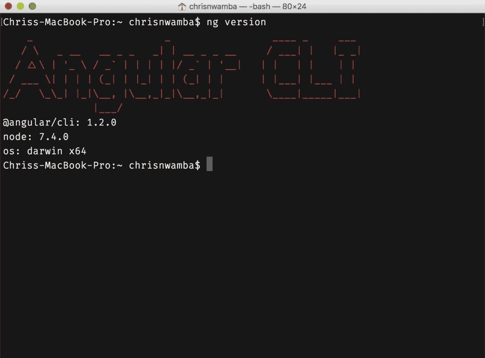
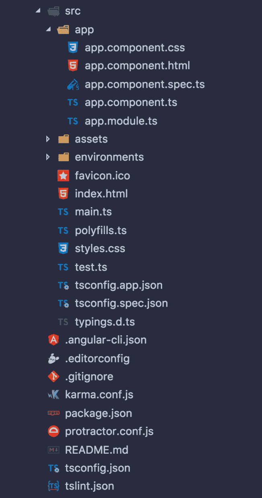
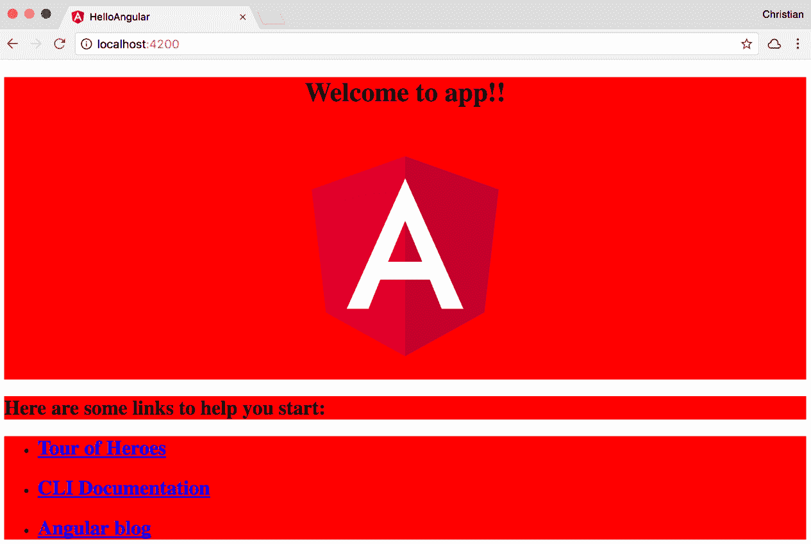

# 四、使用 Angular 和 TypeScript 启动并运行

前几章阐述了 TypeScript 的基本和最常见的特性。这些特性将在处理角度项目时广泛使用。在构建角度项目时，TypeScript 是完全可选的，但是，相信我，在体验了 TypeScript 如何简化开发过程之后，仅仅使用 JavaScript 并不是您想要走的路线。

本章向我们介绍了本书令人兴奋的部分——使用 TypeScript 构建 Angular 应用程序。本章将介绍以下主题：

*   使用 TypeScript 设置角度
*   了解组件基础知识
*   学习 Angular 的模板语法
*   一些数据绑定魔法

所有这些激动人心的话题都会有很好的例子作后盾，所以你可以亲眼看看这些东西是如何工作的。让我们开始吧。

# 设置角度和字体脚本

Angular 并不是一个很难开始使用的框架。不幸的是，从初学者的角度来看，生态系统可能会用很多很多的术语来压倒你。这些术语中的大多数表示使角度工作的工具，而不是角度本身。Webpack、linters、TypeScript、打字、构建过程等等，都是一些令人困惑的术语，可能会让你在角度之旅开始时感到厌烦。

出于这个原因，Angular 团队构建了一个一体化的工具，帮助您减少对周围工具的关注，而更多地关注项目的构建。它被称为 Angular CLI，您只需使用几个 CLI 命令即可构建应用程序。现在花在管理 JavaScript 工具上的时间令人担忧，作为初学者（甚至是专业人士），你不想陷入这样的混乱。

要安装 CLI，需要使用 npm 运行以下命令：

```ts
npm install -g @angular/cli
```

安装完成后，您应该在控制台中看到以下 npm 日志：


您可以通过运行`help`或`version`命令来检查安装是否成功：

```ts
# Help command
ng help

# Version command
ng version
```

help 命令将显示通过 CLI 工具可用的命令列表，version 命令将显示当前安装的版本。如果安装失败，他们都不会打印上述信息。

以下是运行`help`命令时打印的日志详细信息：


运行 version 命令显示以下屏幕截图：



# 创建新的角度项目

安装 CLI 后，现在可以开始在项目中使用它。当然，第一件事是创建一个。CLI 的`new`命令在项目中仅使用一次，以生成项目所需的启动程序文件和配置：

```ts
ng new hello-angular
```

该命令不仅为您创建项目；它还安装 npm 依赖项，因此您不必在开始之前运行 install 命令：


右键导航到文件夹的根目录并运行`serve`命令：

```ts
ng serve
```

运行该命令后，您将获得以下输出，这表明您的应用程序正在成功运行，并且您可以在哪里访问它。它还显示捆绑文件，包括样式和脚本。注意这里没有 TypeScript 文件；所有内容都已转换为 JavaScript，以便浏览器理解：


您应该看到您的闪亮应用程序在`localhost:4200`上运行：


# 项目结构

Angular 生成大量帮助文件，以方便测试、构建过程、包管理等。您可以构建一个成功的项目，而不必关心这些文件的作用。因此，我们将展示一些对我们入门非常重要的文件：



我们现在应该关注`src`目录。这就是我们的项目文件（组件、服务、模板等）的所在地。

# 生成文件

您可以手动添加更多的 TypeScript 文件和模板，但使用 CLI 工具更有效。这是因为 CLI 工具不仅创建文件，而且还生成初学者代码段来表示您尝试创建的文件类型。例如，让我们创建一个报价组件：

```ts
ng generate component quote
# OR
ng g component quote
```

对于生成的一些代码和文件，“组件”命令就是这样的：


该图像包括以下内容：

1.  生成进程的 CLI 输出。
2.  生成的组件、模板、CSS 和测试文件。
3.  类型脚本组件。

CLI 可用于生成其他 Angular/TypeScript 构建块，而不仅仅是组件。我们现在不会尝试；我们将在下一章的主题中进行讨论。下表用于生成项目 Github 自述文件中显示的命令：

| **脚手架** | **用法** |
| 组成部分 | `ng g component my-new-component` |
| 指示 | `ng g directive my-new-directive` |
| 管 | `ng g pipe my-new-pipe` |
| 服务 | `ng g service my-new-service` |
| 班 | `ng g class my-new-class` |
| 警卫 | `ng g guard my-new-guard` |
| 界面 | `ng g interface my-new-interface` |
| 枚举 | `ng g enum my-new-enum` |
| 单元 | `ng g module my-module` |

# 基本概念

在本书中，我们将深入探讨不同的主题，但为了上下文的缘故，粗略地解释正在发生的事情是一个好主意。

# 组件

你的好奇心可能会让你打开`app.component.ts`或`quote.component.ts`。如果他们看起来势不可挡，不要担心；我们将在本书中广泛讨论组件（特别是在接下来的两章中）。

组件是任何角度项目的核心。它们是核心构建块，其他所有功能都只是为了支持组件。提到的文件包含用 TypeScript 编写的角度组件。这就是`app.component.ts`看起来的样子：

```ts
import { Component } from '@angular/core';  

@Component({  
  selector: 'app-root',  
  templateUrl: './app.component.html',  
  styleUrls: ['./app.component.css'] 
}) 
export class AppComponent {  title = 'app'; } 
```

组件是带有模板的修饰类。在这种情况下，装饰的类型才是最重要的。请记住，在上一章中，装饰器只是扩展其所装饰的功能的函数。这就是前面例子中发生的情况。

首先，我们从 Angular 的核心模块`@angular/core`导入这个装饰器。然后我们将装饰师放在`AppComponent`类的正上方。装饰器将 JavaScript 对象作为其参数来描述组件。该对象包含以下内容：

*   `selector`：在应用程序的任何部分中调用组件时，组件将被标识为该组件。由于此组件是应用程序的入口点，因此将通过包含其选择器直接在正文中使用：

```ts
<!--./src/index.html-->
...
<body>  
  <app-root></app-root> 
</body>
...
```

*   `templateUrl`：组件向视图呈现模板。我们需要一种方法来告诉组件渲染哪个模板。这可以通过`template`或`templateUrl`属性实现。`template`属性获取 HTML 内容字符串，`templateUrl`获取模板 HTML 文件的 URL。
*   `styleUrls`：这是应用于已定义模板的样式 URL 数组。

作为实际组件（并且正在装饰）的类将成为与此组件关联的属性和方法的主对象。所有这些都作为一个整体一起工作，以形成一个称为组件的可重用特性。

quote 组件看起来非常相似：

```ts
import { Component, OnInit } from '@angular/core';  

@Component({  
  selector: 'app-quote',  
  templateUrl: './quote.component.html',  
  styleUrls: ['./quote.component.css'] 
}) 
export class QuoteComponent implements OnInit {   
  constructor() { }   
  ngOnInit() {  }  
} 
```

唯一明显的区别是它实现了`OnInit`接口，该接口具有类必须实现的`ngOnInit`方法。这种方法称为生命周期挂钩，我们将很快讨论它。

# 模板

模板只是普通的 HTML 文件，尽管有大量的插值和指令。以下是`app.component.html`的当前内容，它是`AppComponent`的模板：

```ts
<div style="text-align:center">  
  <h1>  Welcome to {{title}}!!  </h1>  
   
</div> 
<h2>Here are some links to help you start: </h2> 
<ul>  
  <li>  <h2><a target="_blank" href="https://angular.io/tutorial">Tour of Heroes</a></h2>  </li>  
  <li>  <h2><a target="_blank" href="https://github.com/angular/angular-cli/wiki">CLI Documentation</a></h2>  </li>  
  <li>  <h2><a target="_blank" href="http://angularjs.blogspot.ca/">Angular blog</a></h2>  </li> 
</ul>  
```

正如您所看到的，它只是普通的 HTML。不过，有一件事似乎并不熟悉：

```ts
<h1>  Welcome to {{title}}!!  </h1>  
```

用双大括号括起来的`title`文本可能会让你感到困惑。这就是所谓的插值。`title`值在运行时根据组件类的属性值进行解析。别忘了我们有一个值为`app`的标题属性：

```ts
title = 'app';
```

除了像这样的绑定值之外，您还可以在模板上执行许多惊人的任务。这些措施包括：

*   属性和事件绑定
*   双向装订
*   迭代与条件
*   样式和类绑定
*   简单表达
*   管道和指令

我们应该做的是讨论它们以及它们如何与其他即将到来的主题相关，而不是向您提供所有与模板和模板语法相关的枯燥内容。通过这种方式，您可以在示例中看到它们，这应该会更有趣。

# 组件样式

组件在很大程度上体现了可重用性。事实上，当您询问使用组件体系结构的好处时，这是您得到的第一个答案。这就是为什么模板和样式被限定在组件的范围内，而不是在应用程序的环境中使用繁重的 HTML 和 CSS。

组件的 decorator 参数中的`styleUrls`属性接受一个 URL 数组，该数组指向要应用于组件的样式。大多数时候，你只需要一个文件；因此，数组将只包含一个 URL 项，在我们的示例中为`app.component.css`。它目前是空的，但我们可以用它进行实验：

```ts
* {  
  background: red; 
}
```

`*`选择器应该选择文档中的所有内容。所以，我们说，*选择每个元素并将背景设置为红色*。你可能会对结果感到惊讶：



请注意实际的 body 标记是如何不设置样式的，因为您使用了全局选择器，所以这可能没有任何意义。组件样式适用于组件；因此，样式不能泄漏到包含的父级。这就是为什么主体保持白色，`AppComponent`模板中的内容为红色。

# 模块

组件用于在产品中构建可重用的小功能。它们与服务、指令、管道等概念一起工作，形成功能特性。在某些情况下，您可能希望将这些功能从一个项目移动到另一个项目，甚至在大型项目的不同部分之间移动。因此，您需要一种方法将它们收集在一起作为特性。这正是模块所做的。

模块是用`NgModule`装饰器装饰的类。装饰器接受一个对象，就像组件装饰器一样。此对象描述了需要关联到此模块的所有要素成员。可能的成员（但不是所有成员）如下：

*   **声明**：包括组件、指令和管道
*   **提供者**：包括可注入服务
*   **导入**：包括其他导入模块
*   **引导**：这是启动应用程序的入口组件

我们已经有一个模块，它是`AppModule`：

```ts
import { BrowserModule } from '@angular/platform-browser'; 
import { NgModule } from '@angular/core';  

import { AppComponent } from './app.component'; 
import { QuoteComponent } from './quote/quote.component';  

@NgModule({  
  declarations: [  
    AppComponent,  
    QuoteComponent  
  ],  
  imports: [  
    BrowserModule  
  ],  
  providers: [],  
  bootstrap: [ 
    AppComponent 
  ] 
}) 
export class AppModule { } 
```

让我们花一些时间来描述本模块中的项目：

*   **声明**：`AppComponent`和`QuoteComponent`是组件。因此，它们属于这一类。Angular CLI 在生成 quote 组件后所做的一件惊人的事情是为我们自动将其添加到声明中。如果没有，即使您在应用程序中的某个位置使用组件选择器，报价组件内容仍不会显示，并且您将在控制台中得到一个错误。
*   **导入**：`BrowserModule`是一个模块。它是一个包含常见浏览器任务的模块，特别是模板指令，如`*ngFor`等。
*   **提供者**：由于我们还没有任何服务，所以可以省略提供者或将数组留空。
*   **引导**：app 模块是我们的进入模块。因此需要定义录入组件，即`AppComponent`。这就是`bootstrap`属性所做的。

# 单元测试

虽然直到本书的最后一章我们才讨论测试，但是让测试成为一种习惯是值得的。这就是为什么我们要在这里探索测试组件的简单性。

基本上，Angular 在`TestBed`的帮助下为测试组件提供了一个抽象层。在查看组件是否按计划运行之前，不需要运行整个应用程序。我们的应用程序组件的 CLI 支架附带了一个简单的测试。可以在文件旁边找到它（这是一种常见且良好的做法），如`app.component.spec.ts`。

让我们查看此文件的内容：

```ts
import { TestBed, async } from '@angular/core/testing';  
import { AppComponent } from './app.component';  

describe('AppComponent', () => {

});
```

首先，我们从`@angular/core/testing`导入测试实用程序和要测试的组件，即`AppComponent`。还创建了一个`describe`块，其中包含给定特性（`AppComponent`的测试套件集，但保留为空。

在开始编写套件之前，我们需要为组件配置一个临时测试模块。这是在`beforeEach`块中完成的：

```ts
//...
describe('AppComponent', () => {  
  beforeEach(async(() => {  
    TestBed.configureTestingModule({  
      declarations: [  AppComponent  ],  
    }).compileComponents();  
  }));
  // ...
});
```

在实际的应用程序中，我们可以奢侈地创建`AppComponent`所在的`AppModule`作为声明。在这里，我们只需要一个上面有`AppComponent`的简单模块，感谢`TestBed`的`configureTestingModule`模块使这成为可能。

接下来，我们可以开始为我们想要检查的任何场景编写测试套件。首先，我们来看看`AppComponent`是否是一件事：

```ts
describe('AppComponent', () => {  
  it('should create the app', async(() => {  
    const fixture = TestBed.createComponent(AppComponent);  
    const app = fixture.debugElement.componentInstance;  
    expect(app).toBeTruthy();  
  }));
});
```

在使用`createComponent()`创建组件本身之后，我们首先尝试使用`componentInstance`创建组件实例。

实际检查是在我们用`expect`断言时完成的，以查看组件是否存在于`toBeTruthy()`中。

我们还可以检查组件属性的内容：

```ts
it(`should have as title 'app'`, async(() => {  
  const fixture = TestBed.createComponent(AppComponent);  
  const app = fixture.debugElement.componentInstance;  
  expect(app.title).toEqual('app');  
}));
```

`app`是组件的实例，可以访问该实例的属性和方法。我们只是测试一下`app.title`的初始值是否等于`app`。

最后一个测试套件实际上检查 DOM 中的值：

```ts
it('should render title in a h1 tag', async(() => {  
  const fixture = TestBed.createComponent(AppComponent);  
  fixture.detectChanges();  
  const compiled = fixture.debugElement.nativeElement;
  expect(compiled.querySelector('h1').textContent).toContain('Welcome to app!!');  }));
```

注意，`detectChanges`在这个套件中被调用。在任何模板上启动绑定。然后，我们不创建实例，而是抓取已编译元素，查询它的`h1`标记，并检查标记的文本内容是否包含`Welcome to app`。

要运行这些测试，请执行以下命令：

```ts
ng test
```

这将启动 Karma，一个孤立的测试环境。将运行测试，并将以下内容打印到 CLI：


你可能想知道为什么最后一行写的是`4`测试而不是`3`；请记住，我们生成的报价组件也有一个测试套件。

# 总结

在本章中，您学习了如何创建角度项目以及新项目必须附带哪些文件。现在您知道了如何创建角度项目和脚手架构建块（如构件），并了解了构件的基本骨架。您还了解了模块存在的原因，如何将简单样式应用于组件，以及单元测试在 Angular 中是什么样子的。

在下一章中，我们将深入研究更多组件的创建，并查看一些示例。