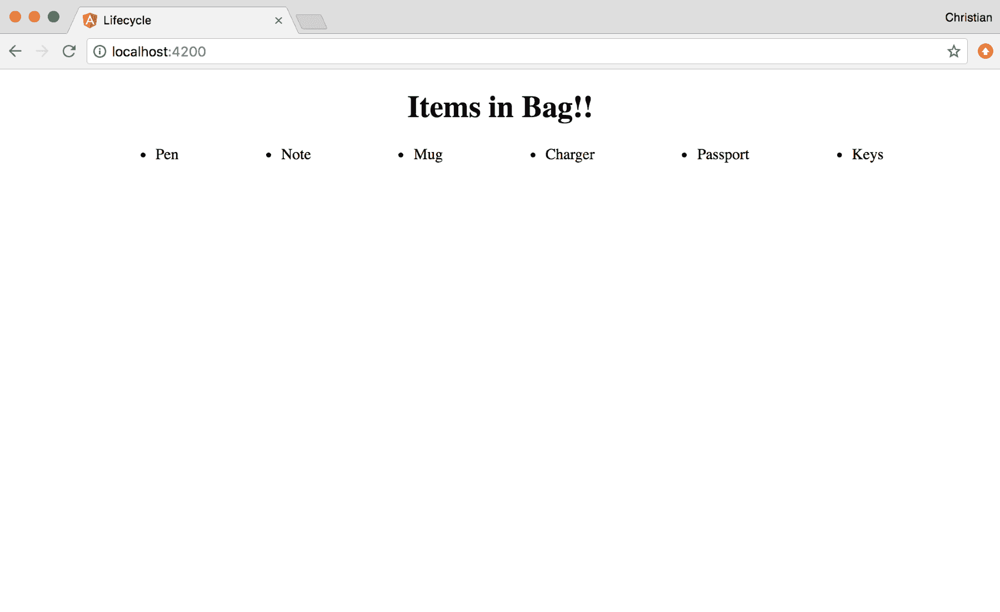
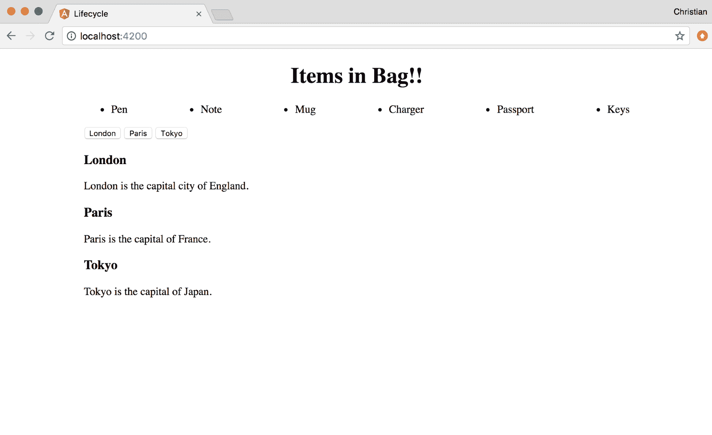

# 五、使用 TypeScript 的高级自定义组件

我们在上一章中讨论了组件的创建和用法。这些知识不足以构建健壮的应用程序。我们需要更深入地研究 Angular 令人兴奋的组件，看看 TypeScript 如何使使用组件变得更容易。

我们将讨论以下主题，同时展示一些有关它们如何工作的实际示例：

*   **生命周期钩子**：这些是 Angular 中的类方法，您可以钩住它们。它们可以通过实现 TypeScript 接口来实现。
*   **ElementRef**：这涉及使用 ElementRef API 在 Angular 中安全地操作和查询 DOM。
*   **视图封装**：您将了解如何将范围样式应用于角度组件，以及如何更改默认行为。

# 生命周期挂钩

在类中创建的大多数方法都必须在某个地方被调用，这是编程中的预期模式。Angular 定义为生命周期挂钩的情况并非如此。这些钩子是您为 Angular 创建的方法，用于在内部调用它们，具体取决于组件/指令的当前状态。它们是在组件或指令的类中创建的。

以下挂钩在角度组件中可用：

*   `ngOnChanges`：记住属性是如何绑定到组件的。这些属性是被动的，这意味着，当它们更改时，视图也会更新。当绑定到视图的任何属性发生更改时，将调用此生命周期方法。因此，您可以在反映更改之前处理所发生的事情。
*   `ngOnInit`：这是最常见的生命周期。在使用默认属性绑定初始化组件后调用它。因此，在第一个`ngOnChanges`之后调用。
*   `ngDoCheck`：反应性（变化检测）通常为您处理，但在极端情况下，您需要自己处理。使用`ngDoCheck`检测 Angular 自身无法或无法检测到的变化并对其采取行动。
*   `ngAfterContentInit`：组件内容初始化后调用。
*   `ngAfterContentChecked`：每次检查组件内容后调用。
*   `ngAfterViewInit`：基于组件模板初始化视图后调用。
*   `ngAfterViewChecked`：检查组件的视图和组件的子视图后调用。
*   `ngOnDestroy`：组件销毁前调用。这是一个清理的好地方。

某些生命周期挂钩可能无法立即发挥作用。你不应该担心它们，因为只有在极端情况下，你才会需要很多。

一个例子将有助于阐明它们是如何工作的。让我们探索一下最常见的钩子，它是`ngOnInit`

使用 CLI 命令创建新的角度项目。打开 app component TypeScript 文件并更新导入，以包括`OnInit`：

```ts
// Code: 5.1
//./src/app/app.component.ts

import { Component, OnInit } from '@angular/core';
```

`OnInit`是任何想要实现`ngOnInit`的类都应该继承的接口。这在技术上不是必需的（参见[https://angular.io/guide/lifecycle-hooks#interfaces-技术上是可选的](https://angular.io/guide/lifecycle-hooks#interfaces-are-optional-technically)。

您现在可以让`AppComponent`类实现这个接口：

```ts
// Code: 5.1
//./src/app/app.component.ts

@Component({ 
  selector: 'app-root', 
  templateUrl: './app.component.html',  
  styleUrls: ['./app.component.css'] 
}) 
export class AppComponent implements OnInit { 
  title: string = 'Items in Bag'; 
  items: Array<string> = []; 
  loading: boolean = false;  
  ngOnInit () { 
    this.loading = true;  
    setTimeout(() => { 
      this.items = [ 
         'Pen', 
         'Note', 
         'Mug', 
         'Charger', 
         'Passport', 
         'Keys' 
      ] 
     this.loading = false; 
   }, 3000) 
 } 
}
```

我们试图模拟一种异步行为，在这种行为中，值将在将来解析。这种操作最好在应用程序初始化时完成，这就是我们在`ngOnInit`方法中处理此操作的原因。组件准备好后，Angular 调用此钩子，它将在三秒后设置项数组。

我们甚至可以在值出现之前将其绑定到视图。当值可用时，Angular 将始终更新视图：

```ts
<!-- Code: 5.1 -->
<!-- ./src/app/app.component.html -->

<div style="text-align:center">  
  <h1>  {{title}}!!  </h1>  
  <h4 *ngIf="loading">Please wait...</h4>  
</div>  
<ul>  
  <li *ngFor="let item of items">{{item}}</li>  
</ul>
```

为了迭代角度模板中的列表，我们使用`*ngFor`**结构指令**，如上例所示。DOM 是基于 Boolean 属性的，而 DOM 是基于结构元素的。

如往常一样，使用`ng serve`运行应用程序，您将首先看到以下内容：


三秒钟后，“请稍候…”文本将消失，您将看到您的项目列表：



# DOM 操作

在 Angular 1.x 中，触摸 DOM 似乎很神秘；不是说你不能，但不知怎的它又回来咬你了。这是具有讽刺意味的，因为我们作为 web 设计人员/开发人员所做的是绘制 DOM，如果不对其进行操作，这是不可能的。

使用 Angular 2+，这变得非常容易。Angular 对 DOM 进行了抽象，并提供了可供处理的浅拷贝。然后它负责在不伤害任何人的情况下将其放回原处。TypeScript 变得更加有趣，因为编辑器可以为您提示大多数 DOM 属性方法。

# ElementRef

实现 Dom 操作的 API 为`ElementRef`。让我们基于[上的基本演示构建一个使用此 API 的选项卡组件 https://www.w3schools.com/howto/howto_js_tabs.asp](https://www.w3schools.com/howto/howto_js_tabs.asp) 。

首先使用 CLI generate 命令生成新组件：

```ts
ng g component tab
```

将模板作为子模板添加到我们的应用程序组件中，就在`*ngFor`指令之后：

```ts
<ul>
  <li *ngFor="let item of items">{{item}}</li>  
</ul>  

<!--Add tab component to app-->
<app-tab></app-tab>
```

然后，将组件的模板替换为以下内容：

```ts
<!--./src/app/tab/tab.component.css-->
<div class="tab">  
  <button class="tablink" (click)="openTab($event, 'London')">London</button> 
  <button class="tablink" (click)="openTab($event, 'Paris')">Paris</button>
  <button class="tablink" (click)="openTab($event, 'Tokyo')">Tokyo</button>
</div>

<div id="London" class="tabcontent">
  <h3>London</h3>
  <p>London is the capital city of England.</p>
</div>
<div id="Paris" class="tabcontent">
  <h3>Paris</h3>
  <p>Paris is the capital of France.</p>  
</div>
<div id="Tokyo" class="tabcontent">
  <h3>Tokyo</h3>
  <p>Tokyo is the capital of Japan.</p>
</div>
```

您应该在浏览器上看到结果，如以下屏幕截图所示：



让我们添加一些样式以创建选项卡式外观：

```ts
// based on styles from the base sample

/* ./src/app/tab/tab.component.css */
div.tab {
  overflow: hidden;
  border: 1px solid #ccc;
  background-color: #f1f1f1;
 } 

div.tab button {
  background-color: inherit;
  float: left;
  border: none;
  outline: none;
  cursor: pointer;
  padding: 14px 16px;
  transition: 0.3s;
 }

div.tab button:hover {
  background-color: #ddd;
 }   

div.tab button.active {
  background-color: #ccc;
 }   

.tabcontent {
  padding: 6px 12px;
  border: 1px solid #ccc;
  border-top: none;
}
```

使用这些样式，结果应显示在以下屏幕截图中：


现在是开始操作 DOM 的时候了。我们首先需要在默认情况下使用 CSS 隐藏所有选项卡内容；然后，可以在 TypeScript 中激活它们：

```ts
.tabcontent {  
  display: none;
 }
```

# 连接到内容初始化

为了确保能够访问 DOM，我们需要使用`ngAfterContentInit`生命周期方法。在这个方法中，我们可以使用`ElementRef`查询 DOM 并对其进行操作：

```ts
import { Component, ElementRef, OnInit, AfterContentInit } from '@angular/core';  

@Component({
  selector: 'app-tab',
  templateUrl: './tab.component.html',
  styleUrls: ['./tab.component.css']
 })

export class TabComponent implements OnInit, AfterContentInit {
  tabContents: Array<HTMLElement>;
  tabLinks: Array<HTMLElement>;

  constructor(
    private el: ElementRef
  ) { }

  ngOnInit() {}

  ngAfterContentInit() {
    // Grab the DOM
    this.tabContents = this.el.nativeElement.querySelectorAll('.tabcontent');
    this.tabLinks = this.el.nativeElement.querySelectorAll('.tablink');
   }   
} 
```

该类实现了`AfterContentInit`和`OnInint`，展示了如何实现多个接口。然后，我们将按钮声明为一个`HTMLElement`链接数组。这也适用于选项卡内容。

在构造函数中，我们创建了一个`ElementRef`实例作为`el`，我们可以使用它与 DOM 交互。在 DOM 内容准备好后调用`ngAfterContentInit`函数，这使得它成为启动时处理 DOM 操作的最佳候选。因此，我们在那里获取对 DOM 的引用。

我们需要显示第一个选项卡，并在加载时激活第一个选项卡链接。让我们扩展`ngAfterContentInit`来实现这一点：

```ts
export class TabComponent implements OnInit, AfterContentInit {
  tabContents: Array<HTMLElement>;
  tabLinks: Array<HTMLElement>;
  constructor(
    private el: ElementRef
  ) { }
  ngOnInit() {}
  ngAfterContentInit() {
    this.tabContents = this.el.nativeElement.querySelectorAll('.tabcontent');
    this.tabLinks = this.el.nativeElement.querySelectorAll('.tablink');

    // Activate first tab

    this.tabContents[0].style.display = "block";
    this.tabLinks[0].className = " active";
 }
} 
```

这将显示第一个选项卡，如以下屏幕截图所示：


# 处理 DOM 事件

最后要做的是将事件侦听器添加到单击事件并开始切换选项卡。在前面的模板中，我们将单击事件附加到每个按钮：

```ts
<button class="tablink" (click)="open($event, 'London')">London</button> 
<button class="tablink" (click)="open($event, 'Paris')">Paris</button>
<button class="tablink" (click)="open($event, 'Tokyo')">Tokyo</button>
```

`openTab`方法是事件处理程序。让我们实施它：

```ts
export class TabComponent implements OnInit, AfterContentInit {
  tabContents: Array<HTMLElement>;
 tabLinks: Array<HTMLElement>;
  constructor(
 private el: ElementRef
  ) { }

  // ...

 open(evt, cityName) {
    for (let i = 0; i < this.tabContents.length; i++) {
      this.tabContents[i].style.display = "none";
    }
    for (let i = 0; i < this.tabLinks.length; i++) {
      this.tabLinks[i].className = this.tabLinks[i].className.replace(" active", "");
    }
   this.el.nativeElement.querySelector(`#${cityName}`).style.display = "block"; 
   evt.currentTarget.className += " active"; 
 }
} 
```

调用该方法时，我们迭代所有选项卡并隐藏它们。我们还迭代按钮，并通过用空字符串替换活动类来禁用它们。然后，我们可以显示要打开的选项卡并激活单击的按钮。

现在，单击选项卡按钮时，将显示每个选项卡内容：


有不同的方法可以解决这个问题，其中一些方法更先进。我们刚才展示的示例故意执行 DOM 查询，以向您展示在 Angular 中进行 DOM 操作的可能性和简单性。

# 视图封装

可以将组件配置为以不同的方式应用样式。这个概念叫做封装，这就是我们现在要讨论的。

使用 CLI 创建另一个项目，并使用以下命令添加额外组件：

```ts
ng g component child
```

然后，通过应用程序组件将此新组件添加到视图中：

```ts
// Code 5.2
<!-- ./src/app/app.component.html -->

<div style="text-align:center">
  <h1>  This is parent component  </h1>
  <app-child></app-child> 
</div>  
```

子组件的模板如下所示：

```ts
// Code 5.2
<!-- ./src/app/child/child.component.html -->

<h3>This is child component </h3> 
```

这只是了解视图封装策略所需的最低设置。让我们来探索一下。

# 仿效

这是默认策略。通过 HTML 全局应用的任何样式（不是父组件）以及应用于组件的所有样式都将得到反映。在我们的案例中，如果我们针对`h3`并将样式应用于`style.css`、`app.component.css`和`child.component.css`，则只会反映`style.css`和`child.component.css`。

以下 CSS 是子组件：

```ts
h3 {  color: palevioletred }
```

在运行上述代码时，子组件视图的结果如下所示：


如果将相同样式应用于全局样式和零部件本身上的相同图元，则零部件样式将取代全局样式。例如，考虑{ Ty0T0}文件如下：

```ts
h3 {
  color: palevioletred
}
```

现在考虑一下，{0}0}文件如下：

```ts
h3 {
  color: blueviolet
}
```

`h3`的颜色为`blueviolet`，如下图所示：


您可以在 component decorator 中进行设置，但这不是必需的，因为`Emulated`是默认值：

```ts
import { Component, OnInit, ViewEncapsulation } from '@angular/core';

@Component({
  selector: 'app-child',
</span>  templateUrl: './child.component.html',
  styleUrls: ['./child.component.css'],
  // Encapsulation: Emulated
  encapsulation: ViewEncapsulation.Emulated
})

export class ChildComponent implements OnInit {
   constructor() { }
   ngOnInit() {  }
} 
```

# 出生地的

此策略类似于模拟，但它禁止全局样式进入组件。保持全局样式不变，将封装设置为本机：

```ts
@Component({
  selector: 'app-child',
  templateUrl: './child.component.html',
  styleUrls: ['./child.component.css'],
 // Encapsulation: Native
  encapsulation: ViewEncapsulation.Native
})
```

即使全局样式将`h3`颜色设置为`pinkvioletred`，文本颜色仍然为黑色，因为它无法穿透模板：


# 没有一个

这是最自由的策略。无论在何处设置样式（子级或父级），样式都会泄漏到其他组件：

```ts
@Component({
  selector: 'app-child',
  templateUrl: './child.component.html',
  styleUrls: ['./child.component.css'],
 // Encapsulation: Native
  encapsulation: ViewEncapsulation.None
})
```

通过此设置，您可以通过子组件的样式设置父标记中的`h1`标记的样式：

```ts
// child component style
h1 {
  color: blueviolet
}
```

这反映在视图中，如下图所示：


# 总结

希望讨论的高级主题不那么复杂或难以理解。您学习了如何实现生命周期挂钩、控制组件范围样式的行为，以及在呈现 DOM 内容之后如何操作 DOM 内容。

如果您从本章中只学到一件事，那就是如何使用 TypeScript 实现生命周期接口，并使用 TypeScript 装饰器配置组件。在下一章中，您将了解组件通信以及组件如何通过属性、事件、视图子项和内容子项相互交互。