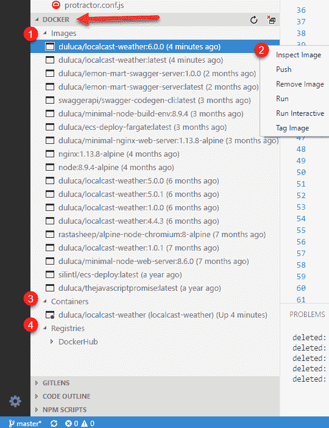

# 十、为产品发布准备 Angular 应用

在上一章中，您创建了一个可以检索当前天气数据的本地天气应用。你创造了一些价值；然而，如果你不把你的应用放到网上，你最终会创造零价值。交付某些东西是困难的，将某些东西交付到生产中更困难。您希望遵循一种能够产生可靠、高质量和灵活版本的策略。

我们在[第 9 章](09.html)*创建本地天气 Web 应用*中创建的应用非常脆弱。我们需要能够将前端应用与后端应用分开交付，这对于保持推送单独应用和服务器更新的灵活性非常重要。此外，解耦将确保当应用堆栈中的各种工具和技术不可避免地失去支持或青睐时，您将能够在不完全重写系统的情况下替换前端或后端。

在本章中，您将学习执行以下操作：

*   防止空数据
*   使用 Docker 容器化应用
*   立即使用 Zeit 在 web 上部署应用

所需软件如下所示：

*   Docker 社区版 17.12
*   Zeit Now 帐户

# Angular传感器中的零位保护

在 JavaScript 中，`undefined`和`null`值是一个持续存在的问题，必须在每一步都主动处理。有多种方法可以防止Angular中的`null`值：

1.  属性初始化
2.  安全导航操作员`?.`
3.  带`*ngIf`的零位保护

# 属性初始化

在静态类型语言（如 Java）中，您会深入了解到正确的变量初始化/实例化是无错误操作的关键。让我们在`CurrentWeatherComponent`中尝试一下，用默认值初始化 current：

```ts
src/app/current-weather/current-weather.component.ts
constructor(private weatherService: WeatherService) {
  this.current = {
    city: '',
    country: '',
    date: 0,
    image: '',
    temperature: 0,
    description: '',
  }
}
```

这些更改的结果将把控制台错误从 12 个减少到 3 个，此时您将只看到与 API 调用相关的错误。但是，应用本身将不会处于可呈现的状态，如下所示：


属性初始化结果

为了让用户能够看到这个视图，我们必须为模板上的每个属性编码默认值。因此，通过初始化修复空保护问题，我们创建了一个默认值处理问题。初始化和默认值处理都是开发者的*O（n）*规模任务。在最好的情况下，该策略实施起来会很烦人，在最坏的情况下，效率很低且容易出错，每个属性至少需要*O（2n）*努力。

# 安全导航操作员

Angular 执行安全导航操作`?.`，以防止意外穿越未定义的对象。因此，与其编写初始化代码和处理模板值，不如更新模板：

```ts
src/app/current-weather/current-weather.component.html
<div>
  <div>
    <span>{{current?.city}}, {{current?.country}}</span>
    <span>{{current?.date | date:'fullDate'}}</span>
  </div>
  <div>
    
    <span>{{current?.temperature}}℉</span>
  </div>
  <div>
    {{current?.description}}
  </div>
</div>
```

这一次，我们不必设置默认值，我们让 Angular 处理显示未定义的绑定。您将注意到，与初始化修复一样，错误已从 12 减少到 3。该应用本身的状态稍好一些。不再显示令人困惑的数据；但是，它仍然没有处于可呈现的状态，如下所示：


Results of Safe Navigation Operator

您可能可以想象，在更复杂的场景中，安全导航操作员可以派上用场。然而，当大规模部署时，这种类型的编码至少需要*O（n）*级别的努力才能实现。

# 带*ngIf 的空保护

理想的策略是使用`*ngIf`，这是一个结构指令，意味着 Angular 将停止遍历 falsy 语句之外的 DOM 树元素。

在`CurrentWeather`组件中，我们可以在尝试呈现模板之前轻松检查`current`变量是否为 null 或未定义：

1.  用`*ngIf`更新最上面的`div`元素，检查`current`是否为对象，如图所示：

```ts
src/app/current-weather/current-weather.component.html <div *ngIf="current">
  ...
</div>
```

现在观察控制台日志，确保没有报告任何错误。始终确保 Angular 应用报告零控制台错误。如果您仍然在控制台日志中看到错误，请确保已将`OpenWeather`URL 正确还原到其正确状态，或者终止并重新启动`npm start`进程。我强烈建议您在继续之前解决所有控制台错误。修复所有错误后，请确保再次提交代码。

2.  提交代码。

# 使用 Docker 容器化应用

Docker[Docker.io](http://docker.io)是一个*开放平台*，用于开发、发布和运行应用。Docker 将*轻量级*容器虚拟化平台与有助于管理和部署应用的工作流和工具相结合。**虚拟机**（**虚拟机**）与 Docker 容器之间最明显的区别在于，虚拟机通常有几十 GB 的大小，需要 GB 的内存，而容器则需要 MB 的磁盘和内存。此外，Docker 平台抽象出主机**操作系统**（**操作系统**）级别的配置设置，因此成功运行应用所需的每一项配置都以人类可读的 Dockerfile 格式编码，如下所示：

```ts
Dockerfile
FROM duluca/minimal-node-web-server:8.11.1
WORKDIR /usr/src/app
COPY dist public
```

前面的文件描述了一个新容器，它继承了名为`duluca/minimal-node-web-server`的容器，将工作目录更改为`/usr/src/app`，然后将`dist`文件夹的内容从您的开发环境复制到容器的`public`文件夹中。在这种情况下，父映像配置了一个 Express.js 服务器，作为 web 服务器来服务`public`文件夹中的内容。

请参阅下图，以了解正在发生的情况的视觉表示：


Context of a Docker Image

底层是我们的主机操作系统，例如运行 Docker 运行时的 Windows 或 macOS，将在下一节中安装。Docker 运行时能够运行独立的 Docker 映像，该映像由上述`Dockerfile`定义。`duluca/minimal-node-web-server`基于轻量级 Linux 操作系统 Alpine。Alpine 是一个完全精简的 Linux 版本，它没有任何 GUI、驱动程序，甚至没有 Linux 系统中的大多数 CLI 工具。因此，操作系统的大小只有约 5 MB。然后，基本包将安装 Node.js，它本身的大小约为 10 MB，并安装基于我的自定义 Node.js 的 Express.js web 服务器，从而生成一个约 15 MB 的图像。Express 服务器配置为提供`/usr/src/app`文件夹的内容。在前面的`Dockerfile`中，我们只是在我们的开发环境中复制`/dist`文件夹的内容，并将其放入`/usr/src/app`文件夹中。我们稍后将构建并执行此映像，它将运行包含`dist`文件夹输出的 Express web 服务器。

Docker 的妙处在于你可以导航到[https://hub.docker.com Apple T5，搜索{To0t}，读取它的 Tyt1，并追踪它的起源一直回到原始的基础图像，这是 Web 服务器的基础。我鼓励您检查您以这种方式使用的每个 Docker 图像，以了解它为您的需求带来了什么。你可能会发现它有些过分，或者有一些你不知道的功能，可以让你的生活更轻松。请注意，父图像要求在`8.11.1`处有一个特定版本的`duluca/minimal-node-web-server`。这是非常有意的，作为读者，您应该选择您找到的 Docker 图像的最新可用版本。但是，如果不指定版本号，则始终会获得图像的最新版本。随着一个映像的更多版本发布，您可能会获取可能会破坏应用的未来版本。因此，请始终为所依赖的图像指定版本号。](https://hub.docker.com)

其中一个例子是烘焙到`duluca/minimal-node-web-server`中的 HTTPS 重定向支持。当您需要做的只是将以下行添加到 Dockerfile 中时，您可以花费无数的时间尝试设置一个 nginx 代理来执行相同的操作：

```ts
ENV ENFORCE_HTTPS=xProto
```

就像 npm 软件包一样，Docker 可以带来极大的便利和价值，但您必须注意了解正在使用的工具。

In [Chapter 16](16.html), *Highly-Available Cloud Infrastructure on AWS,* we mention the use of a lower footprint docker image based on Nginx. If you're comfortable configuring `nginx`, you can use `duluca/minimal-nginx-web-server` as your base image.

# 安装 Docker

为了能够构建和运行容器，必须首先在计算机上安装 Docker 执行环境。

Windows support of Docker can be challenging. You must have a PC with a CPU that supports virtualization extensions, which is not a guarantee on laptops. You must also have a Pro version of Windows with Hyper-V enabled. On the flip side, Windows Server 2016 has native support for Docker, which is an unprecedented amount of support shown by Microsoft toward the industry initiative to adopt Docker and containerization.

1.  通过执行以下命令安装 Docker：

对于 Windows：

```ts
PS> choco install docker docker-for-windows -y

```

对于 macOS：

```ts
$ brew install docker
```

2.  执行`docker -v`验证安装。

# 设置 Docker 脚本

现在，让我们配置一些 Docker 脚本，用于自动化容器的构建、测试和发布。我为 Docker 开发了一套名为**npm 脚本的脚本，可在 Windows 10 和 macOS 上运行。您可以在[bit.ly/npmScriptsForDocker](http://bit.ly/npmScriptsForDocker)获取这些脚本的最新版本：**

1.  在[上注册 Docker Hub 帐户 https://hub.docker.com/](https://hub.docker.com/)
2.  为应用创建公共（免费）存储库

Unfortunately, at the time of publication, Zeit doesn't support private Docker Hub repositories, so your only alternative is to publish your container publicly. If your image must remain private, I encourage you to set up an AWS ECS environment as described in [Chapter 16](16.html), *Highly-Available Cloud Infrastructure on AWS*. You can keep tabs on the issue by visiting Zeit Now's documentation at [zeit.co/docs/deployment-types/docker](https://zeit.co/docs/deployment-types/docker).

3.  更新`package.json`以添加具有以下配置属性的新配置属性：

```ts
package.json
  ...
  "config": {
    "imageRepo": "[namespace]/[repository]",
    "imageName": "custom_app_name",
    "imagePort": "0000"
  },
 ...
```

名称空间将是您的 DockerHub 用户名。您将定义在创建过程中对存储库的调用。示例图像存储库变量应类似于`duluca/localcast-weather`。图像名称用于在使用 Docker 命令（如`docker ps`）时方便识别您的容器。我会打电话给我的`localcast-weather`。端口将定义应该使用哪个端口从容器内部公开应用。因为我们使用`5000`进行开发，所以选择一个不同的，比如`8080`。

4.  通过从[bit.ly/npmScriptsForDocker](http://bit.ly/npmScriptsForDocker)复制粘贴脚本，将 Docker 脚本添加到`package.json`。下面是脚本的注释版本，解释了每个函数。

请注意，对于 npm 脚本，`pre`和`post`关键字分别用于在执行给定脚本之前或之后执行辅助脚本，并且脚本被有意地分割成更小的部分，以便于阅读和维护：

```ts
package.json
...
  "scripts": {
    ...
    "predocker:build": "npm run build",
    "docker:build": "cross-conf-env docker image build . -t $npm_package_config_imageRepo:$npm_package_version",
    "postdocker:build": "npm run docker:tag",
    ...
```

`npm run docker:build`将在`pre`中构建您的 Angular 应用，然后使用`docker image build`命令构建 Docker 映像，并在 post 中用版本号标记映像：

```ts
package.json
    ...
    "docker:tag": " cross-conf-env docker image tag $npm_package_config_imageRepo:$npm_package_version $npm_package_config_imageRepo:latest",
    ...
```

`npm run docker:tag`将使用`package.json`中`version`属性中的版本号和`latest`标记对已构建的 Docker 映像进行标记：

```ts
package.json
    ...
    "docker:run": "run-s -c docker:clean docker:runHelper",
    "docker:runHelper": "cross-conf-env docker run -e NODE_ENV=local --name $npm_package_config_imageName -d -p $npm_package_config_imagePort:3000 $npm_package_config_imageRepo",
    ...
```

`npm run docker:run`将删除任何现有的先前版本的映像，并使用`docker run`命令运行已构建的映像。请注意，`imagePort`属性用作 Docker 映像的外部端口，该端口映射到 Node.js 服务器侦听的映像的内部端口，端口`3000`：

```ts
package.json
    ...
    "predocker:publish": "echo Attention! Ensure `docker login` is correct.",
    "docker:publish": "cross-conf-env docker image push $npm_package_config_imageRepo:$npm_package_version",
    "postdocker:publish": "cross-conf-env docker image push $npm_package_config_imageRepo:latest",
    ...
```

`npm run docker:publish`将使用`docker image push`命令将生成的映像发布到配置的存储库，在本例中为 Docker Hub。首先，发布版本化的图像，然后发布贴有`latest`标记的图像：

```ts
package.json
    ...
    "docker:clean": "cross-conf-env docker rm -f $npm_package_config_imageName",
    ...
```

`npm run docker:clean`将使用`docker rm -f`命令从您的系统中删除先前构建的映像版本：

```ts
package.json
    ...
    "docker:taillogs": "cross-conf-env docker logs -f $npm_package_config_imageName",
    ...
```

`npm run docker:taillogs`将使用`docker log -f`命令显示正在运行的 Docker 实例的内部控制台日志，这是调试 Docker 实例时非常有用的工具：

```ts
package.json
    ...
    "docker:open:win": "echo Trying to launch on Windows && timeout 2 && start http://localhost:%npm_package_config_imagePort%",
    "docker:open:mac": "echo Trying to launch on MacOS && sleep 2 && URL=http://localhost:$npm_package_config_imagePort && open $URL",
    ...
```

`npm run docker:open:win`或`npm run docker:open:mac`将等待 2 秒，然后使用`imagePort`属性以正确的 URL 启动浏览器到您的应用：

```ts
package.json
    ...
    "predocker:debug": "run-s docker:build docker:run",
    "docker:debug": "run-s -cs docker:open:win docker:open:mac docker:taillogs"
  },
...
```

`npm run docker:debug`将在`pre`中构建您的图像并运行其实例，打开浏览器，然后开始显示容器的内部日志。

5.  安装确保脚本跨平台功能所需的两个开发依赖项：

```ts
$ npm i -D cross-conf-env npm-run-all
```

6.  自定义预构建脚本以在构建映像之前执行单元和 e2e 测试：

```ts
package.json
"predocker:build": "npm run build -- --prod --output-path dist && npm test -- --watch=false && npm run e2e",
```

Note that `npm run build` is provided the `--prod` argument, which achieves two things:
1\. Development time payload of ~2.5 MB is optimized down to ~73kb or less
2\. The configuration items defined in `src/environments/environment.prod.ts` is used at runtime

7.  从`OpenWeather`更新`src/environments/environment.prod.ts`使其看起来像是在使用自己的`appId`：

```ts
export const environment = {
  production: true,
  appId: '01ffxxxxxxxxxxxxxxxxxxxxxxxxxxxx',
  baseUrl: 'https://',
}
```

We are modifying how `npm test` is executed, so the tests are run only once and the tool stops executing. The `--watch=false` option is provided to achieve this behavior, as opposed to the development-friendly default continuous execution behavior. In addition `npm run build` is provided with `--output-path dist` to ensure that `index.html` is published at the root of the folder.

8.  创建一个名为`Dockerfile`且没有文件扩展名的新文件
9.  执行`Dockerfile`，如图所示：

```ts
Dockerfile
FROM duluca/minimal-node-web-server:8.11.1
WORKDIR /usr/src/app
COPY dist public
```

Be sure to inspect the contents of your `dist` folder. Ensure that `index.html` is at the root of `dist`. Otherwise ensure that your `Dockerfile` copies the folder that has `index.html` at its root.

10.  执行`npm run predocker:build`以确保您的应用更改成功
11.  执行`npm run docker:build`以确保您的映像成功构建

虽然您可以单独运行提供的任何脚本，但实际上您只需要记住其中两个脚本：

*   **npm run docker:debug**将在新的浏览器窗口中测试、构建、标记、运行、跟踪并启动您的集装箱化应用进行测试
*   **npm run docker:publish**会将您刚刚构建并测试的图像发布到在线 docker 存储库中

12.  在您的终端执行`docker:debug`：

```ts
$ npm run docker:debug
```

You will note that the scripts display errors in the Terminal window. These are not necessarily indicators of a failure. The scripts are not polished, so they attempt both Windows and macOS compatible scripts parallelly, and during a first build, the clean command fails, because there's nothing to clean. By the time you read this, I may have published better scripts; if not, you're more than welcome to submit a pull request.

成功的`docker:debug`运行应该会产生一个新的焦点浏览器窗口，其中您的应用和服务器日志将在终端中跟踪，如下所示：

```ts
Current Environment: local.
Server listening on port 3000 inside the container
Attenion: To access server, use http://localhost:EXTERNAL_PORT
EXTERNAL_PORT is specified with 'docker run -p EXTERNAL_PORT:3000'. See 'package.json->imagePort' for th
e default port.
GET / 304 12.402 ms - -
GET /styles.d41d8cd98f00b204e980.bundle.css 304 1.280 ms - -
GET /inline.202587da3544bd761c81.bundle.js 304 11.117 ms - -
GET /polyfills.67d068662b88f84493d2.bundle.js 304 9.269 ms - -
GET /vendor.c0dc0caeb147ad273979.bundle.js 304 2.588 ms - -
GET /main.9e7f6c5fdb72bb69bb94.bundle.js 304 3.712 ms - -
```

You should always run `docker ps` to check whether your image is running, when it was last updated, or if it is clashing with the existing images claiming the same port.

13.  在您的终端执行`docker:publish`：

```ts
$ npm run docker:publish
```

您应该在终端窗口中观察到成功运行，如下所示：

```ts
The push refers to a repository [docker.io/duluca/localcast-weather]
60f66aaaaa50: Pushed
...
latest: digest: sha256:b680970d76769cf12cc48f37391d8a542fe226b66d9a6f8a7ac81ad77be4f58b size: 2827
```

Over time, your local Docker cache may grow to a significant size, that is, on my laptop, roughly 40 GB over two years. You can use the `docker image prune` and `docker container prune` commands to reduce the size of your cache. For more detailed information, refer to the documentation at [https://docs.docker.com/config/pruning](https://docs.docker.com/config/pruning).

接下来，让我们看看与 Docker 进行交互的更简单的方法。

# VS 代码中的 Docker 扩展

与 Docker 图像和容器交互的另一种方式是通过 VS 代码。如果您已经安装了`PeterJausovec.vscode-docker`Docker 扩展，如[第 9 章](09.html)*中建议的，创建一个本地天气 Web 应用*，您将在 VS 代码的浏览器窗格中看到一个名为 Docker 的可扩展标题，如以下屏幕截图中的箭头所示：



Docker extension in VS Code

让我们看一下扩展提供的一些功能：

1.  **图像**包含系统中存在的所有容器快照的列表
2.  右键单击 Docker 图像会显示一个上下文菜单，可以在其上运行各种操作，如运行、推送和标记

3.  **容器**列出系统中存在的所有可执行 Docker 容器，您可以启动、停止或连接到这些容器
4.  **注册表**显示配置为连接的注册表，如 DockerHub 或 AWS 弹性容器注册表

虽然该扩展使与 Docker 的交互更加容易，但 Docker 的**npm 脚本**自动化了许多与构建、标记、测试和图像相关的琐事。它们是跨平台的，在持续集成环境中也能同样出色地工作。

通常通过 CLI 与 npm 脚本交互可能会让您感到困惑。接下来让我们看看 VS 代码的 npm 脚本支持。

# VS 代码中的 NPM 脚本

VS 代码为 npm 脚本提供了开箱即用的支持。要启用 npm 脚本资源管理器，请打开 VS 代码设置并确保`"npm.enableScriptExplorer": true`属性存在。一旦启用，您将在资源管理器窗格中看到名为 npm 脚本的可扩展标题，如箭头所示：


NPM Scripts in VS Code

您可以单击任何脚本以启动包含`package.json`中脚本的行，或者单击鼠标右键并选择“运行”以执行脚本。

# 部署容器化应用

如果从编码的Angular来看向生产交付某些东西是困难的，那么从基础设施的Angular来看，正确地交付这些东西是极其困难的。在后面的章节中，我将介绍如何为您的应用提供世界级的 AWS**弹性容器服务**（**ECS**）基础设施，但如果您需要快速演示一个想法，这将无济于事。现在就进去。

# 立即开始

Zeit Now，[https://zeit.co/now](https://zeit.co/now) 是一项多云服务，可直接从 CLI 实时全局部署应用。现在可以使用正确实现`package.json`或`Dockerfile`的应用。尽管我们已经完成了这两项工作，但我们还是更愿意部署我们的 Docker 映像，因为在幕后应用了更多的魔法来实现`package.json`部署，而您的 Docker 映像可以部署在任何地方，包括 AWS ECS。

# 配置 Now CLI 工具

现在，让我们立即配置 Zeit 以在您的存储库上工作：

1.  执行`npm i -g now`立即安装 Zeit
2.  通过执行`now -v`确保正确安装
3.  在`local-weather-app`下创建一个名为`now`的新文件夹
4.  在新的`now`文件夹下创建一个新的`Dockerfile`
5.  实现要从刚发布的图像中提取的文件：

```ts
now/Dockerfile
FROM duluca/localcast-weather:6.0.1
```

6.  最后，在您的终端中执行`now`命令，按照说明完成配置：

```ts
$ now
> No existing credentials found. Please log in:
> We sent an email to xxxxxxxx@gmail.com. Please follow the steps provided
 inside it and make sure the security code matches XXX XXXXX.
√ Email confirmed
√ Fetched your personal details
> Ready! Authentication token and personal details saved in "~\.now"
```

# 部署

现在在 Zeit 上部署非常简单：

1.  将您的工作目录更改为`now`并执行以下命令：

```ts
$ now --docker --public
```

2.  在终端窗口中，该工具将报告其进度和 URL，您可以从中访问现在发布的应用：

```ts
> Deploying C:\dev\local-weather-app\web-app\now under duluca
> Ready! https://xxxxxxxxxxxxx.now.sh [3s]
> Initializing...
> Building
> ▲ docker build
Sending build context to Docker daemon 2.048 kBkB
> Step 1 : FROM duluca/localcast-weather
> latest: Pulling from duluca/localcast-weather
...
> Deployment complete!
```

3.  导航到第二行列出的 URL 并验证应用的发布。

请注意，如果您在此过程中出现配置错误，您的浏览器可能会显示一个错误，表示此页面正在尝试加载不安全的脚本，允许并重新加载以查看您的应用。

You can explore Zeit Now's paid features, which allow for advanced features such as automated scaling for your application.

恭喜你，你的应用正在互联网上直播！

# 总结

在本章中，您学习了如何通过防止空数据来最好地避免Angular控制台错误。您已将系统配置为与 Docker 一起工作，并使用自己的专用 web 服务器成功地将 web 应用容器化。您为项目配置了适用于 Docker 的 npm 脚本，任何团队成员都可以利用这些脚本。最后，您已经成功地在云中交付了一个 web 应用。

现在，您知道了构建一个生产就绪的Angular应用需要什么，该应用是可靠的、有弹性的和容器化的，以允许灵活的部署策略。在下一章中，我们将改进应用功能集，并使用Angular材质使其看起来很棒。