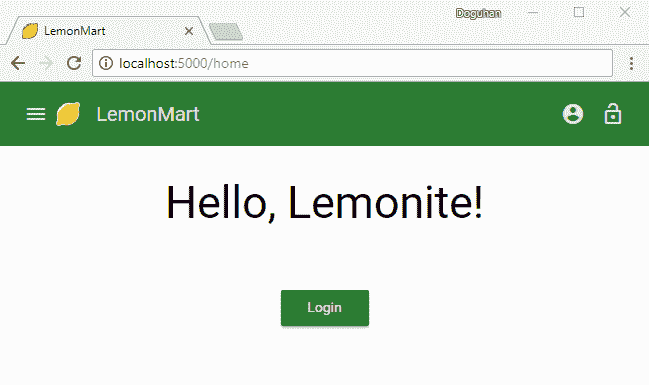
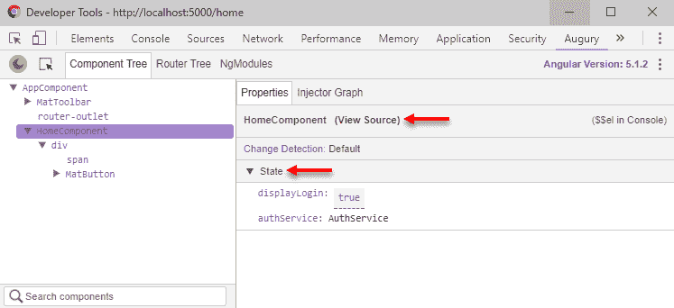
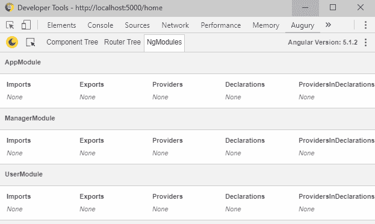
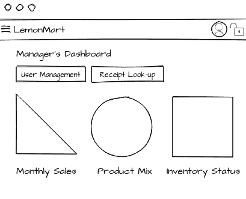
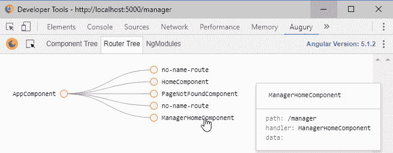
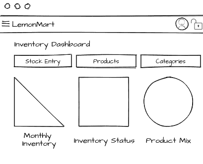
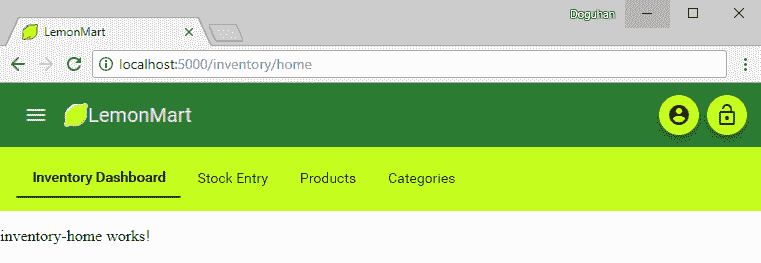

# 创建路由器第一条业务线应用程序

业务线（**LOB**应用程序是软件开发领域的重要组成部分。正如维基百科中所定义的，LOB 是一个通用术语，指的是为特定客户交易或业务需求服务的一种产品或一组相关产品。LOB 应用程序提供了一个很好的机会来演示各种特性和功能，而无需进入大型企业应用程序通常需要的扭曲或特殊场景。从某种意义上说，他们是 80-20 岁的学习经历。然而，我必须指出 LOB 应用程序的一个奇怪之处：如果你最终构建了一个半有用的 LOB 应用程序，对它的需求将无法控制地增长，你将很快成为自己成功的受害者。这就是为什么您应该将每个新项目的开始视为一个机会，如果您愿意的话，这是一个编码 kata，以便更好地创建更灵活的体系结构。

在本章和其余章节中，我们将建立一个新的应用程序，该应用程序具有丰富的功能，可以通过可扩展的体系结构和工程最佳实践来满足 LOB 应用程序的需求，这将帮助您从小处着手，并能够在有需求时快速扩展您的解决方案。我们将遵循路由器优先的设计模式，依靠可重用组件创建一个名为 LemonMart 的杂货店 LOB。

在本章中，您将学习执行以下操作：

*   有效地使用 CLI 创建主要的角度组件和 CLI 支架
*   了解如何构建路由器优先应用程序
*   品牌、定制和材料图像
*   用预兆调试复杂的应用程序
*   启用延迟加载
*   创建行走骨架

本书中提供的代码示例需要第 5 版和第 6 版。Angular 5 代码在运行时与 Angular 6 兼容。到 2019 年 10 月，LTS 将支持 Angular 6。代码存储库的最新版本可以在以下 URL 中找到：

*   [Github.com/duluca/local-Weather-app](https://github.com/duluca/local-weather-app)上的本地天气预报
*   LemonMart 位于[Github.com/duluca/lemon-mart](https://github.com/duluca/lemon-mart)

# 角形备忘单

在我们开始创建 LOB 应用程序之前，我已经为您提供了一份备忘单，让您熟悉常见的 Angular 语法和 CLI 命令，因为接下来将使用这些语法和命令，而不会明确说明它们的用途。花些时间回顾一下新的角度语法、主要组件、CLI 框架和公共管道，并为自己确定方向。如果你的背景是 AngularJS，你可能会发现这个列表特别有用，因为你需要忘记一些旧的语法。

# 结合

绑定或数据绑定是指代码中的变量与 HTML 模板或其他组件中显示或输入的值之间的自动单向或双向连接：

| **型** | **语法** | **数据方向** |
| 插值
属性
属性
类
样式 | `{{expression}}``[target]="expression"``bind-target="expression"` | 从数据源
到查看目标的单向
 |
| 事件 | `(target)="statement"`
`on-target="statement"` | 从视图目标
到数据源的单向
 |
| 双向 | `[(target)]="expression"`
`bindon-target="expression"` | 双向 |

来源：[https://angular.io/guide/template-syntax#binding-语法概述](https://angular.io/guide/template-syntax#binding-syntax-an-overview)

# 内置指令

指令封装了可作为属性应用于 HTML 元素或其他组件的编码行为：

| **名称** | **语法** | **目的** |
| 结构指令 | `*ngIf``*ngFor``*ngSwitch` | 控制 HTML 的结构布局以及元素是否从 DOM 中添加或删除 |
| 属性指令 | `[class]``[style]``[(model)]` | 侦听和修改其他 HTML 元素、属性、属性和组件的行为，例如 CSS 类、HTML 样式和 HTML 表单元素 |

结构指令来源：[https://angular.io/guide/structural-directives](https://angular.io/guide/structural-directives)

属性指令来源：[https://angular.io/guide/template-syntax#built-在属性指令](https://angular.io/guide/template-syntax#built-in-attribute-directives)中

# 普通管道

管道修改数据绑定值在 HTML 模板中的显示方式。

| **名称** | **目的** | **用法** |
| 日期 | 根据区域设置规则设置日期格式 | `{{date_value &#124; date[:format]}}` |
| 文本转换 | 将文本转换为大写、小写或标题大小写 | `{{value &#124; uppercase}}``{{value &#124; lowercase}}``{{value &#124; titlecase }}` |
| 十进制的 | 根据区域设置规则设置数字格式 | `{{number &#124; number[:digitInfo]}}` |
| 百分比 | 根据区域设置规则将数字格式化为百分比 | `{{number &#124; percent[:digitInfo]}}` |
| 通货 | 根据区域设置规则，使用货币代码和符号将数字格式化为货币 | `{{number &#124; currency[:currencyCode [:symbolDisplay[:digitInfo]]]}}` |

管道来源：[https://angular.io/guide/pipes](https://angular.io/guide/pipes)

# 初学者命令、主要组件和 CLI 框架

Starter 命令有助于生成新项目或添加依赖项。Angular CLI 命令可以轻松地自动生成样板搭建代码，从而帮助创建主要组件。有关全套命令的列表，请访问[https://github.com/angular/angular-cli/wiki](https://github.com/angular/angular-cli/wiki) ：

| **名称** | **目的** | **CLI 命令** |
| 刚出现的 | 创建一个新的 Angular 应用程序，该应用程序已初始化 git repository、package.json 并配置了路由。从父文件夹运行。 | `npx @angular/cli new project-name --routing` |
| 使现代化 | 更新角度、RxJS 和角度材质依赖项。如有必要，重写代码以保持兼容性。 | `npx ng update` |
| 添加材料 | 安装和配置角度材质依赖项。 | `npx ng add @angular/material` |
| 单元 | 创建一个新的`@NgModule`类。使用`--routing`为子模块添加路由。或者，使用`--module`将新模块导入父模块。 | `ng g module new-module` |
| 组成部分 | 创建一个新的`@Component`类。使用`--module`指定父模块。或者，使用`--flat`跳过目录创建，`-t`用于内联模板，`-s`用于内联样式。 | `ng g component new-component` |
| 指示 | 创建一个新的`@Directive`类。（可选）使用`--module`为给定子模块定义指令范围。 | `ng g directive new-directive` |
| 管 | 创建一个新的`@Pipe`类。或者，使用`--module`为给定子模块确定管道范围。 | `ng g pipe new-pipe` |
| 服务 | 创建新的`@Injectable`类。使用`--module`为给定子模块提供服务。服务不会自动导入到模块中。可以选择使用`--flat`false 在目录下创建服务。 | `ng g service new-service` |
| 警卫 | 创建一个新的`@Injectable`类，该类实现路由生命周期挂钩`CanActivate`，使用`--module`为给定子模块提供保护。防护装置不会自动导入模块。 | `ng g guard new-guard` |
| 班 | 创建一个裸骨骼类。 | `ng g class new-class` |
| 界面 | 创建一个基本界面。 | `ng g interface new-interface` |
| 枚举 | 创建裸骨骼枚举。 | `ng g enum new-enum` |

In order to properly scaffold some of the components listed earlier under a custom module, such as `my-module`, you can prepend the module name before the name of what you intend to generate, for example, `ng g c my-module/my-new-component`. Angular CLI will properly wire up and place the new component under the `my-module` folder.

# 配置角度 CLI 自动完成

使用 Angular CLI 时，您将获得自动完成体验。为您的`*nix`环境执行适当的命令：

*   对于 bash shell：

```ts
$ ng completion --bash >> ~/.bashrc
$ source ~/.bashrc
```

*   对于 zsh 外壳：

```ts
$ ng completion --zsh >> ~/.zshrc
$ source ~/.zshrc
```

*   对于使用 git bash shell 的 Windows 用户：

```ts
$ ng completion --bash >> ~/.bash_profile
$ source ~/.bash_profile
```

# 路由器优先体系结构

在`@angular/router`包中提供的角度路由器是构建**单页应用程序**（**SPA**）的核心和关键部分，其行为和行为类似于常规网站，可以使用浏览器控件或缩放或微缩放控件轻松导航。

Angular Router 具有诸如延迟加载、路由器出口、辅助路由、智能主动链路跟踪等高级功能，并且能够表示为`href`，这使得使用 RxJS`SubjectBehavior`的无状态数据驱动组件能够实现高度灵活的路由器第一应用架构。

大型团队可以针对单个代码库进行工作，每个团队负责一个模块的开发，而无需相互干涉，同时实现轻松的连续集成。拥有数十亿行代码的谷歌，有一个很好的理由针对单一代码库工作。事实上，集成是非常昂贵的。

小型团队可以动态地重新组合 UI 布局，以快速响应更改，而无需重新构建代码。很容易低估由于后期游戏布局或导航的改变而浪费的时间。这样的变化更容易被大型团队吸收，但对于小型团队来说，这是一项代价高昂的工作。

通过延迟加载，所有开发人员都能从次秒级有意义的绘制中获益，因为交付给浏览器的核心用户体验的文件大小在构建时保持在最小值。模块的大小会影响下载和加载速度，因为浏览器需要做的事情越多，用户看到应用程序第一个屏幕的时间就越长。通过定义延迟加载的模块，每个模块都可以打包为单独的文件，可以根据需要单独下载和加载。智能活动链接跟踪带来了卓越的开发人员和用户体验，可以非常轻松地实现突出显示功能，向用户指示当前活动的应用程序的当前选项卡或部分。辅助路由最大限度地重用组件，并帮助轻松完成复杂的状态转换。使用辅助管线，可以仅使用单个外部样板渲染多个主视图和详图视图。您还可以控制如何在浏览器的 URL 栏中向用户显示路由，并使用模板中的`routerLink`和代码中的`Router.navigate`组合路由，以驱动复杂场景。

为了首先实现路由器，您需要执行以下操作：

1.  尽早定义用户角色
2.  考虑到延迟加载的设计
3.  实现行走骨架导航体验
4.  围绕主要数据组件进行设计
5.  实施解耦的组件体系结构
6.  区分用户控件和组件
7.  最大化代码重用

用户角色通常表示用户的工作职能，例如经理或数据输入专家。在技术术语中，它们可以被认为是一组特定类别的用户可以执行的操作。定义用户角色有助于识别可配置为延迟加载的子模块。毕竟，数据输入专家永远看不到管理者可以看到的大部分屏幕，那么为什么要将这些资产交付给这些用户并降低他们的体验呢？延迟加载对于创建可扩展的应用程序体系结构至关重要，不仅仅是从应用程序的角度，同时也从优质高效的发展角度出发。配置延迟加载可能很棘手，这就是为什么尽早确定行走骨架导航体验很重要的原因。

识别用户将使用的主要数据组件，如发票或人员对象，将有助于避免过度设计应用程序。围绕主要数据组件进行设计将在早期为 API 设计提供信息，并帮助定义`BehaviorSubject`数据锚，您将使用这些数据锚实现无状态、数据驱动的设计，以确保组件架构的解耦。

最后，确定封装您希望为应用程序创建的独特行为的自包含用户控件。用户控件可能被创建为具有数据绑定属性和紧密耦合的控制器逻辑和模板的指令或组件。另一方面，组件将利用路由器生命周期事件解析参数并对数据执行 CRUD 操作。尽早识别这些组件重用将导致创建更灵活的组件，这些组件可以在路由器编排的多个上下文中重用，从而最大限度地实现代码重用。

# 创造柠檬艺术

LemonMart 将是一个中等规模的业务线应用程序，包含 90 多个代码文件。我们将通过创建一个新的 Angular 应用程序开始我们的旅程，从一开始就配置路由和 Angular 材质。

# 创建路由器第一个应用程序

使用路由器优先的方法，我们希望在应用程序的早期启用路由：

1.  通过执行以下命令，可以创建已配置路由的新应用程序：

确保`@angular/cli`未全局安装，否则可能会出错：

```ts
$ npx @angular/cli new lemon-mart --routing
```

2.  已经为我们创建了一个新的`AppRoutingModule`文件：

```ts
src/app/app-routing.modules.ts
import { NgModule } from '@angular/core';
import { Routes, RouterModule } from '@angular/router';

const routes: Routes = [];

@NgModule({
  imports: [RouterModule.forRoot(routes)],
  exports: [RouterModule]
})
export class AppRoutingModule { }
```

我们将在 routes 数组中定义路由。请注意，传入 routes 数组以配置为应用程序的根路由，默认根路由为`/`。

When configuring your `RouterModule`, you can pass in additional options to customize the default behavior of the Router, such as when you attempt to load a route that is already being displayed, instead of taking no action, you can force a reload of the component. To enable this behavior, create your router like `RouterModule.forRoot(routes, { onSameUrlNavigation: 'reload' })`.

3.  最后，`AppRoutingModule`在`AppModule`注册，如图所示：

```ts
src/app/app.module.ts ...
import { AppRoutingModule } from './app-routing.module';

@NgModule({
  ...
  imports: [
    AppRoutingModule 
    ...
  ],
  ...
```

# 配置 Angular.json 和 Package.json

在继续之前，您应该完成以下步骤：

1.  修改`angular.json`和`tslint.json`以强制执行您的设置和编码标准
2.  安装`npm i -D prettier`
3.  将`prettier`设置添加到`package.json`
4.  将您的开发服务端口配置为除`4200`之外的其他端口，如`5000`
5.  添加`standardize`脚本并更新`start`和`build`脚本
6.  将 Docker 的 npm 脚本添加到`package.json`
7.  建立开发规范并将其记录在项目中，`npm i -D dev-norms`然后`npx dev-norms create`
8.  如果使用 VS 代码，请设置`extensions.json`和`settings.json`文件

You may configure the TypeScript Hero extension to auto organize and prune import statements, but adding `"typescriptHero.imports.organizeOnSave": true` to `settings.json`. If combined with the setting `"files.autoSave": "onFocusChange"` you may find that the tool aggressively cleans unused imports as you are trying to type them out. Ensure that this setting works for you and doesn't collide with any other tools or VS Code's own import organization feature.

9.  执行`npm run standardize`

更多配置细节请参见[第 10 章](10.html)、**制作制作发布*的角度 App。*

*You can get the npm Scripts for Docker at [bit.ly/npmScriptsForDocker](http://bit.ly/npmScriptsForDocker) and npm Scripts for AWS at [bit.ly/npmScriptsForAWS](http://bit.ly/npmScriptsForAWS).

# 配置材质和样式

我们还需要设置 Angular Material 并配置要使用的主题，如[第 11 章](12.html)所述，*使用 Angular Material*增强 Angular App：

1.  安装角材料：

```ts
$ npx ng add @angular/material
$ npm i @angular/flex-layout hammerjs 
$ npx ng g m material --flat -m app
```

2.  进出口`MatButtonModule`、`MatToolbarModule`、`MatIconModule`
3.  配置默认主题并注册其他角度相关性
4.  将常用 css 添加到`styles.css`中，如下所示：，

```ts
src/styles.css

body {
  margin: 0;
}

.margin-top {
  margin-top: 16px;
}

.horizontal-padding {
  margin-left: 16px;
  margin-right: 16px;
}

.flex-spacer {
  flex: 1 1 auto;
}
```

更多配置细节请参见[第 11 章](11.html)、*使用角材料*增强角 App。

# 设计柠檬艺术

从数据库到前端，建立一个基本的路线图是很重要的，同时也要避免过度工程化。此初始设计阶段对于项目的长期健康和成功至关重要，团队之间的任何现有筒仓都必须分解，团队所有成员都必须充分理解总体技术愿景。这说起来容易做起来难，而且有很多关于这个话题的书。

在工程学中，问题没有一个正确的答案，因此重要的是要记住，没有一个人能够得到所有的答案，也没有一个清晰的愿景。重要的是，技术和非技术领导者应创造一个安全的空间，提供开放式讨论和实验的机会，作为文化的一部分。作为一个团队，能够应对这种不确定性所带来的谦逊和同理心与任何单个团队成员的技术能力一样重要。每个团队成员都必须在门口检查自己的自我，因为我们的共同目标是在开发周期中根据不断变化的需求开发和发展应用程序。如果您创建的软件的各个部分很容易被任何人替换，您就会知道您已经成功了。

# 识别用户角色

我们设计的第一步是思考您使用该应用程序的原因。

我们为 LemonMart 设想了四种用户状态或角色：

*   经过身份验证，任何经过身份验证的用户都可以访问其配置文件
*   出纳，其唯一职责是为客户结账
*   职员，其唯一职责是执行与库存相关的职能
*   经理，可以执行出纳和职员可以执行的所有操作，但也可以访问管理功能

考虑到这一点，我们可以开始应用程序的高级设计。

# 使用站点地图识别高级模块

开发应用程序的高级站点地图，如图所示：


Landing pages for users I used MockFlow.com's SiteMap tool to create the site map
shown at [https://sitemap.mockflow.com](https://sitemap.mockflow.com).

在第一次考试中，三个高级模块作为候选模块出现：

1.  销售点（POS）
2.  库存
3.  经理

出纳只能访问 POS 模块和组件。职员只能访问库存模块，该模块将包括库存输入、产品和类别管理组件的附加屏幕。


Inventory pages

最后，经理将能够使用经理模块访问所有三个模块，包括用户管理和收据查找组件。


Manager pages

为所有三个模块启用延迟加载有很大的好处，因为收银员和办事员永远不会使用属于其他用户角色的组件，所以没有理由将这些字节发送到他们的设备。这意味着，随着 Manager 模块获得更高级的报告功能或向应用程序添加新角色，POS 模块将不受其他不断增长的应用程序对带宽和内存的影响。这意味着更少的支持调用和更长时间内相同硬件上的一致性能。

# 生成支持路由器的模块

现在我们已经将高级组件定义为 Manager、Inventory 和 POS，我们可以将它们定义为模块。这些模块将不同于您迄今为止创建的用于布线和角度材质的模块。我们可以将用户配置文件创建为应用程序模块上的组件；但是，请注意，用户配置文件将仅用于已验证的用户，因此定义第四个模块通常只用于已验证的用户是有意义的。这样，您将确保应用程序的第一个负载保持尽可能小。此外，我们将创建一个 Home 组件来包含我们的应用程序的登录体验，以便我们能够将实施细节排除在`app.component`之外：

1.  生成`manager`、`inventory`、`pos`和`user`模块，指定其目标模块和路由能力：

```ts
$ npx ng g m manager -m app --routing
$ npx ng g m inventory -m app --routing
$ npx ng g m pos -m app --routing
$ npx ng g m user -m app --routing
```

If you have configured `npx` to automatically recognize `ng` as a command, you can save some more keystrokes so that you won't have to append `npx` to your commands every time. Do not globally install `@angular/cli`. Note the abbreviate command structure, where `ng generate module manager` becomes `ng g m manager`, and similarly, `--module` becomes `-m`.

2.  验证您没有 CLI 错误。

请注意，在 Windows 上使用`npx`可能会遇到错误，例如路径必须是字符串。接收未定义。此错误似乎对命令的成功运行没有任何影响，这就是为什么始终检查 CLI 工具生成的内容至关重要的原因。

3.  验证文件夹和文件是否已创建：

```ts
/src/app
│   app-routing.module.ts
│   app.component.css
│   app.component.html
│   app.component.spec.ts
│   app.component.ts
│   app.module.ts
│   material.module.ts
├───inventory
│        inventory-routing.module.ts
│        inventory.module.ts
├───manager
│        manager-routing.module.ts
│        manager.module.ts
├───pos
│        pos-routing.module.ts
│        pos.module.ts
└───user
        user-routing.module.ts
        user.module.ts
```

4.  检查`ManagerModule`是如何连接的。

子模块实现类似于`app.module`的`@NgModule`。最大的区别是子模块没有实现根模块初始化 Angular app 所需的`bootstrap`属性：

```ts
src/app/manager/manager.module.ts
import { NgModule } from '@angular/core'
import { CommonModule } from '@angular/common'

import { ManagerRoutingModule } from './manager-routing.module'

@NgModule({
  imports: [CommonModule, ManagerRoutingModule],
  declarations: [],
```

```ts
})
export class ManagerModule {}
```

由于我们已经指定了`-m`选项，该模块已经导入`app.module`：

```ts
src/app/app.module.ts
...
import { ManagerModule } from './manager/manager.module'
...
@NgModule({
  ...
  imports: [
    ...
    ManagerModule 
  ],
...
```

另外，由于我们还指定了`--routing`选项，所以已经创建了一个路由模块并导入到`ManagerModule`中：

```ts
src/app/manager/manager-routing.module.ts
import { NgModule } from '@angular/core'
import { Routes, RouterModule } from '@angular/router'

const routes: Routes = []

@NgModule({
  imports: [RouterModule.forChild(routes)],
  exports: [RouterModule],
})
export class ManagerRoutingModule {}
```

请注意，`RouterModule`正在使用`forChild`进行配置，与`AppRouting`模块的`forRoot`相反。通过这种方式，路由器理解在不同模块上下文中定义的路由之间的正确关系，并且能够正确地将`/manager`前置到本例中的所有子路由。

The CLI doesn't respect your `tslint.json` settings. If you have correctly configured your VS Code environment with prettier, your Code Styling preferences will be applied as you work on each file or, globally, when you run the prettier command.

# 设计回家路线

考虑下面的模型作为 LimunMalm 的登陆体验：


LemonMart Landing Experience

与`LocalCastWeather`应用程序不同，我们不希望所有这些标记都位于`App`组件中。`App`组件是整个应用程序的根元素；因此，它应该只包含在整个应用程序中持续出现的元素。在以下带注释的实体模型中，标记为 1 的工具栏将在整个应用程序中保持不变。

标记为 2 的区域将容纳 home 组件，它本身将包含一个登录用户控件，标记为 3：


LemonMart Layout Structure

最佳做法是在 Angular 中创建默认或平台构件作为单独的图元。这有助于减少每页中必须加载的代码量和执行的逻辑量，但在使用路由器时，也会产生更灵活的体系结构：

使用内联模板和样式生成`home`组件：

```ts
$ npx ng g c home -m app --inline-template --inline-style
```

现在，您可以配置路由器了。

# 设置默认路由

让我们开始为 LemonMart 设置一条简单的路线：

1.  配置您的`home`路线：

```ts
src/app/app-routing.module.ts 
...
const routes: Routes = [
  { path: '', redirectTo: '/home', pathMatch: 'full' },
  { path: 'home', component: HomeComponent },
]
...
```

我们首先为`'home'`定义一条路径，并通过设置组件属性通知路由器渲染`HomeComponent`。然后，我们将应用程序`''`的默认路径设置为重定向到`'/home'`。通过设置`pathMatch`属性，我们始终确保回家路线的这个非常具体的实例将被呈现为着陆体验。

2.  使用内联模板创建一个`pageNotFound`组件
3.  为`PageNotFoundComponent`配置通配符路由：

```ts
src/app/app-routing.module.ts 
...
const routes: Routes = [
  ...
  { path: '**', component: PageNotFoundComponent }
]
...
```

这样，任何不匹配的路由都将指向`PageNotFoundComponent`。

# 路由器链路

当用户登陆`PageNotFoundComponent`时，我们希望他们使用`RouterLink`方向重定向到`HomeComponent`：

1.  使用`routerLink`实现内联模板链接回主页：

```ts
src/app/page-not-found/page-not-found.component.ts
...
template: `
    <p>
      This page doesn't exist. Go back to <a routerLink="/home">home</a>.
    </p>
  `,
...
```

This navigation can also be done via an `<a href>` tag implementation; however, in more dynamic and complicated navigation scenarios, you will lose features such as automatic active link tracking or dynamic link generation.

角度引导过程将确保`AppComponent`位于`index.html`中的`<app-root>`元素内。然而，我们必须手动定义我们希望`HomeComponent`呈现的位置，以最终确定路由器配置。

# 路由器出口

`AppComponent`被认为是`app-routing.module`中定义的根路由器的根元素，它允许我们在此根元素内定义出口，以便使用`<router-outlet>`元素动态加载我们希望的任何内容：

1.  配置`AppComponent`使用内联模板和样式
2.  为应用程序添加工具栏
3.  将应用程序的名称添加为按钮链接，以便在单击时将用户带到主页

4.  为要呈现的内容添加`<router-outlet>`：

```ts
src/app/app.component.ts
...
template: `
    <mat-toolbar color="primary">
      <a mat-button routerLink="/home"><h1>LemonMart</h1></a>
    </mat-toolbar>
    <router-outlet></router-outlet>
  `,
```

现在，home 的内容将在`<router-outlet>`内呈现。

# 品牌、自定义和材质图标

为了构建一个有吸引力和直观的工具栏，我们必须在应用程序中引入一些图标和品牌，以便用户可以借助熟悉的图标轻松浏览应用程序。

# 品牌创建

在品牌方面，你应该确保你的 web 应用程序应该有定制的调色板，并与桌面和移动浏览器功能集成，以显示你的应用程序的名称和图标。

# 调色板

使用材质颜色工具选择调色板，如[第 11 章](11.html)所述，*使用角度材质*增强角度应用程序。这是我为 LemonMart 挑选的一个：

```ts
https://material.io/color/#!/?view.left=0&view.right=0&primary.color=2E7D32&secondary.color=C6FF00
```

# 实现浏览器清单和图标

您需要确保浏览器在浏览器选项卡中显示正确的标题文本和图标。此外，应该创建一个清单文件，为各种移动操作系统实现特定的图标，这样，如果用户锁定了您的网站，就会显示一个理想的图标，类似于手机上的其他应用程序图标。这将确保如果用户在其移动设备的主屏幕上收藏或锁定您的 web 应用程序，他们将获得一个本地应用程序图标：

1.  从设计师或类似[的网站上创建或获取网站徽标的 SVG 版本 https://www.flaticon.com](https://www.flaticon.com)
2.  在本例中，我将使用一个特定的 lemon 图像：


LemonMart's signature logo When using images you find on the internet, pay attention to applicable copyrights. In this case, I have purchased a license to be able to publish this lemon logo, but you may grab your own copy at the following URL, given that you provide the required attribution to the author of the image: [https://www.flaticon.com/free-icon/lemon_605070](https://www.flaticon.com/free-icon/lemon_605070).

3.  使用[等工具生成`favicon.ico`和清单文件 https://realfavicongenerator.net](https://realfavicongenerator.net)
4.  根据您的喜好调整 iOS、Android、Windows Phone、macOS 和 Safari 的设置
5.  确保您设置了一个版本号，favicons 可以通过缓存进行升级；随机版本号将确保用户始终获得最新版本
6.  将生成的`favicons.zip`文件下载并解压缩到您的`src`文件夹中
7.  编辑`angular.json`文件以在应用程序中包含新资产：

```ts
angular.json   
"apps": [
  {
    ...
      "assets": [
        "src/assets",
        "src/favicon.ico",
        "src/android-chrome-192x192.png",
        "src/favicon-16x16.png",
        "src/mstile-310x150.png",
        "src/android-chrome-512x512.png",
        "src/favicon-32x32.png",
        "src/mstile-310x310.png",
        "src/apple-touch-icon.png",
        "src/manifest.json",
        "src/mstile-70x70.png",
        "src/browserconfig.xml",
        "src/mstile-144x144.png",
        "src/safari-pinned-tab.svg",
        "src/mstile-150x150.png"
      ]
```

8.  在您的`index.html`的`<head>`部分插入生成的代码：

```ts
src/index.html
<link rel="apple-touch-icon" sizes="180x180" href="/apple-touch-icon.png?v=rMlKOnvxlK">
<link rel="icon" type="img/png" sizes="32x32" href="/favicon-32x32.png?v=rMlKOnvxlK">
<link rel="icon" type="img/png" sizes="16x16" href="/favicon-16x16.png?v=rMlKOnvxlK">
<link rel="manifest" href="/manifest.json?v=rMlKOnvxlK">
<link rel="mask-icon" href="/safari-pinned-tab.svg?v=rMlKOnvxlK" color="#b3ad2d">
<link rel="shortcut icon" href="/favicon.ico?v=rMlKOnvxlK">
<meta name="theme-color" content="#ffffff">
```

9.  确保新 favicon 显示正确

为了进一步扩展您的品牌，请考虑配置自定义材质主题并利用 AutoT0.https://material.io/color

# 定制图标

现在，让我们在 Angular 应用程序中添加自定义品牌。您将需要用于创建 favicon 的 svg 图标：

1.  将图像置于`src/aimg/img/icons`下，命名为`lemon.svg`
2.  将`HttpClientModule`导入`AppComponent`以便可以通过 HTTP 请求`.svg`文件

3.  更新`AppComponent`以将新 svg 文件注册为图标：

```ts
src/app/app.component.ts import { DomSanitizer } from '@angular/platform-browser'
...
export class AppComponent {
  constructor(iconRegistry: MatIconRegistry, sanitizer: DomSanitizer) {
    iconRegistry.addSvgIcon(
      'lemon',
      sanitizer.bypassSecurityTrustResourceUrl('iimg/icons/lemon.svg')
    )
  }
}
```

4.  将图标添加到工具栏：

```ts
src/app/app.component.ts  
template: `
    <mat-toolbar color="primary">
      <mat-icon svgIcon="lemon"></mat-icon>
      <a mat-button routerLink="/home"><h1>LemonMart</h1></a>
    </mat-toolbar>
    <router-outlet></router-outlet>
  `,
```

现在，让我们为菜单、用户配置文件和注销添加其余图标。

# 材质图标

角度材质与材质设计图标一起开箱即用，可以在`index.html`中将其作为 web 字体导入到您的应用程序中。可以自行设置字体的宿主；然而，如果你沿着这条路走下去，你也不会从用户访问另一个网站时已经缓存了字体的浏览器中得到好处，从而节省了下载 42-56 KB 文件的速度和延迟。完整的图标列表见[https://material.io/icons/](https://material.io/icons/) 。

现在，让我们用一些图标更新工具栏，并用一个最小的假登录按钮模板设置主页：

1.  确保材料图标`<link>`标签已添加到`index.html`：

```ts
src/index.html
<head>
  ...
  <link href="https://fonts.googleapis.com/icon?family=Material+Icons" rel="stylesheet">
</head>
```

Instructions on how to self-host can be found under the Self Hosting section at [http://google.github.io/material-design-icons/#getting-icons](http://google.github.io/material-design-icons/#getting-icons).

配置后，使用材质图标很容易。

2.  更新工具栏以在标题左侧放置菜单按钮。
3.  添加一个`fxFlex`，使其余图标右对齐。
4.  添加用户配置文件和注销图标：

```ts
src/app/app.component.ts    
template: `
    <mat-toolbar color="primary">
      <button mat-icon-button><mat-icon>menu</mat-icon></button>
      <mat-icon svgIcon="lemon"></mat-icon>
      <a mat-button routerLink="/home"><h1>LemonMart</h1></a>
      <span class="flex-spacer"></span>
      <button mat-icon-button><mat-icon>account_circle</mat-icon></button>
      <button mat-icon-button><mat-icon>lock_open</mat-icon></button>
    </mat-toolbar>
    <router-outlet></router-outlet>
  `,
```

5.  为登录添加最小模板：

```ts
src/app/home/home.component.ts 
  styles: [`
    div[fxLayout] {margin-top: 32px;}
  `],
  template: `
    <div fxLayout="column" fxLayoutAlign="center center">
      <span class="mat-display-2">Hello, Lemonite!</span>
      <button mat-raised-button color="primary">Login</button>
    </div>
  `
```

您的应用程序应类似于此屏幕截图：



LemonMart with minimal login

考虑到用户的身份验证状态，在实现和显示/隐藏菜单、配置文件和注销图标方面还有一些工作要做。我们将在[第 14 章](14.html)、*设计认证和授权*中介绍此功能。现在您已经为应用程序设置了基本路由，在我们继续设置带有子组件的延迟加载模块之前，您需要学习如何调试 Angular 应用程序。

# 角兆

Augury 是 Chrome 开发工具的扩展，用于调试和分析角度应用程序。它是一个专门构建的工具，可以帮助开发人员直观地导航组件树，检查路由器的状态，并通过生成的 JavaScript 代码和开发人员编码的 TypeScript 代码之间的源代码映射启用断点调试。您可以从[Augury.angular.io](http://augury.angular.io)下载占卜。一旦安装完毕，当您为 Angular 应用程序打开 Chrome Dev Tools 时，您会注意到 Augury 的一个新选项卡，如图所示：


Chrome Dev Tools Augury

Augury 为了解 Angular 应用程序在运行时的行为提供了有用且关键的信息：

1.  在本例中，当前角度版本作为版本 5.1.2 列出
2.  组件树
3.  路由器树显示应用程序中已配置的所有路由
4.  NgModules 显示应用程序的`AppModule`和子模块

# 组件树

“组件树”选项卡显示所有应用程序组件的关联方式以及它们之间的交互方式：

1.  选择特定组件，如`HomeComponent`，如下所示：



Augury Component Tree

右侧的 Properties 选项卡将显示一个名为 View Source 的链接，您可以使用该链接调试组件。在下面，您将能够观察组件属性的状态，例如 displayLogin 布尔值，包括您注入组件的服务及其状态。

You can change the value of any property by double-clicking on the value. For example, if you would like to change the value of displayLogin to `false`, simply double-click on the blue box that contains the true value and type in false. You will be able to observe the effects of your changes in your Angular app.

为了观察`HomeComponent`的运行时组件层次结构，您可以观察注入器图。

2.  单击喷油器图形选项卡，如图所示：


Augury Injector Graph

此视图显示如何渲染选定组件。在这种情况下，我们可以观察到`HomeComponent`是在`AppComponent`内呈现的。这种可视化对于在不熟悉的代码库或存在深层组件树的地方跟踪特定组件的实现非常有帮助。

# 断点调试

让我重申，为了记录在案，`console.log`语句永远不会签入您的存储库。一般来说，它们是在浪费您的时间，因为它需要编辑代码，然后清理代码。此外，Augury 已经提供了组件的状态，因此在简单的情况下，您应该能够利用它观察或强制状态。

有一些特殊的用例，`console.log`语句可能很有用。这些大多是并行运行的异步工作流，依赖于及时的用户交互。在这些情况下，控制台日志可以帮助您更好地了解事件流和各种组件之间的交互。

Augury 还不够复杂，无法解析异步数据或通过函数返回的数据。还有其他常见情况，您希望在设置属性时观察属性的状态，甚至能够动态更改它们的值，以强制代码在`if`-`else`或`switch`语句中执行分支逻辑。对于这些情况，应该使用断点调试。

假设`HomeComponent`上存在一些基本逻辑，根据从`AuthService`检索到的`isAuthenticated`值设置`displayLogin``boolean`，如图所示：

```ts
src/app/home/home.component.ts
...
import { AuthService } from '../auth.service'
...
export class HomeComponent implements OnInit {
  displayLogin = true
  constructor(private authService: AuthService) {}

  ngOnInit() {
    this.displayLogin = !this.authService.isAuthenticated()
  }
}
```

现在观察`displayLogin`值和`isAuthenticated`功能设置时的状态，然后观察`displayLogin`值的变化：

1.  点击`HomeComponent`上的查看源链接
2.  在`ngOnInit`函数内的第一行上放置一个断点
3.  刷新页面

4.  Chrome 开发工具将切换到 Source 选项卡，您将看到您的断点命中率，如蓝色突出显示的：


Chrome Dev Tools break point debugging

5.  将鼠标悬停在`this.displayLogin`上方，观察其值是否设置为`true`
6.  如果将鼠标悬停在`this.authService.isAuthenticated()`上方，您将无法观察其值

当达到断点时，您可以在控制台中访问状态的当前范围，这意味着您可以执行函数并观察其值。

7.  在控制台执行`isAuthenticated()`：

```ts
> !this.authService.isAuthenticated()
true
```

您将看到它返回`true`，这是`this.displayLogin`设置的值。您仍然可以在控制台中强制`displayLogin`的值。

8.  将`displayLogin`设置为`false`：

```ts
> this.displayLogin = false
false
```

如果将鼠标悬停在`displayLogin`上或从控件中检索`displayLogin`的值，您将看到该值被设置为`false`。

利用断点调试基础，您可以调试复杂的场景，而无需更改源代码。

# 路由器树

路由器树选项卡将显示路由器的当前状态。这是可视化管线和组件之间关系的一个非常有用的工具，如图所示：


Augury Router Tree

前面的路由器树演示了带有主详细视图的深度嵌套路由结构。通过单击圆形节点，可以查看渲染给定组件所需的绝对路径和参数。

如您所见，对于`PersonDetailsComponent`，准确确定渲染主细节视图的此细节部分所需的参数集可能会变得复杂。

# NGM 模块

NgModules 选项卡显示`AppModule`和当前加载到内存中的任何其他子模块：

1.  启动应用程序的`/home`路线
2.  观察 NgModules 选项卡，如下所示：


Augury NgModules

您会注意到只有`AppModule`被加载。然而，由于我们的应用程序有一个延迟加载的体系结构，所以我们的其他模块都还没有加载。

3.  导航到`ManagerModule`中的页面
4.  然后，导航到`UserModule`中的页面
5.  最后，返回`/home`路线

6.  观察 NgModules 选项卡，如图所示：



Augury NgModules with Three Modules

7.  现在，您将看到三个模块已加载到内存中。

NgModules 是可视化设计和体系结构影响的重要工具。

# 具有延迟加载的子模块

延迟加载允许由 webpack 支持的角度构建过程将 web 应用程序分离为称为块的不同 JavaScript 文件。通过将应用程序的各个部分分离为单独的子模块，我们允许将这些模块及其依赖项捆绑到单独的块中，从而将初始 JavaScript 捆绑包大小保持在最小。随着应用程序的增长，第一次有意义绘制的时间保持不变，而不是随时间不断增加。延迟加载对于实现可伸缩的应用程序体系结构至关重要。

现在我们将讨论如何设置包含组件和路由的子模块。我们还将使用占卜来观察各种路由器配置的效果。

# 使用组件和路由配置子模块

manager 模块需要一个登录页，如本模型所示：



Manager's Dashboard Let's start by creating the home screen for the `ManagerModule`:

1.  创建`ManagerHome`组件：

```ts
$ npx ng g c manager/managerHome -m manager -s -t
```

In order to create the new component under the `manager` folder, we must prefix `manager/` in front of the component name. In addition, we specify that the component should be imported and declared with the `ManagerModule`. Since this is another landing page, it is unlikely to be complicated enough to require separate HTML and CSS files. You can use `--inline-style` (alias `-s`) and/or `--inline-template` (alias `-t`) to avoid creating additional files.

2.  验证文件夹结构是否如下所示：

```ts
 /src
 ├───app
 │ │
 │ ├───manager
 │ │ │ manager-routing.module.ts
 │ │ │ manager.module.ts
 │ │ │
 │ │ └───manager-home
 │ │ manager-home.component.spec.ts
 │ │ manager-home.component.ts
```

3.  将`ManagerHome`组件的路由配置为`manager-routing.module`，类似于我们将`Home`组件配置为`app-route.module`：

```ts
src/app/manager/manager-routing.module.ts
import { ManagerHomeComponent } from './manager-home/manager-home.component'
import { ManagerComponent } from './manager.component'

const routes: Routes = [
  {
    path: '',
    component: ManagerComponent,
    children: [
      { path: '', redirectTo: '/manager/home', pathMatch: 'full' },
      { path: 'home', component: ManagerHomeComponent },
    ],
  },
]
```

你会注意到`http://localhost:5000/manager`实际上还没有解析为组件，因为我们的 Angular 应用程序没有意识到`ManagerModule`的存在。让我们首先尝试一下蛮力、渴望加载的方法来导入`manager.module`并在我们的应用程序中注册 manager 路由。

# 急装

本节纯粹是一个练习，旨在演示我们在导入和注册路由方面迄今所学的概念如何不会产生可扩展的解决方案，无论是急切地还是懒散地加载组件：

1.  将`manager.module`导入`app.module`：

```ts
 src/app/app.module.ts
 import { ManagerModule } from './manager/manager.module'
   ...
   imports: [
   ...
     ManagerModule,
   ]
```

您将注意到，`http://localhost:5000/manager`仍然不会渲染其主组件。

2.  使用 Augury 调试路由器状态，如图所示：



Router Tree with Eager Loading

3.  似乎`/manager`路径已正确注册并指向正确的组件`ManagerHomeComponent`。这里的问题是`app-routing.module`中配置的`rootRouter`不知道`/manager`路径，因此`**`路径优先，而呈现`PageNotFoundComponent`。

4.  作为最后一个练习，实现`app-routing.module`中的`'manager'`路径，并像通常一样为其分配`ManagerHomeComponent`：

```ts
src/app/app-routing.module.ts
import { ManagerHomeComponent } from './manager/manager-home/manager-home.component'  
...
const routes: Routes = [
  ...
  { path: 'manager', component: ManagerHomeComponent },
  { path: '**', component: PageNotFoundComponent },
]
```

现在您将注意到，`http://localhost:5000/manager`通过显示`manager-home works!`正确渲染；但是，如果您通过 Augury 调试路由器状态，您将注意到`/manager`已注册两次。

这个解决方案不能很好地扩展，因为它迫使所有开发人员维护一个主文件来导入和配置每个模块。合并冲突和挫折的时机已经成熟，希望团队成员不要多次注册同一路线。

可以设计一个解决方案，将模块划分为多个文件。您可以在`manager.module`中实现路由数组并将其导出，而不是标准的`*-routing.module`。考虑下面的例子：

```ts
example/manager/manager.module
export const managerModuleRoutes: Routes = [
  { path: '', component: ManagerHomeComponent }
]
```

然后需要将这些文件单独导入到`app-routing.module`中，并使用`children`属性进行配置：

```ts
example/app-routing.module
import { managerModuleRoutes } from './manager/manager.module'
...
{ path: 'manager', children: managerModuleRoutes },
```

此解决方案将起作用，并且是正确的解决方案，如此处的 Augury Router 树所示：


Router Tree with children routes

没有重复注册，因为我们删除了`manager-routing.module`。此外，我们不必在`manager.module`之外导入`ManagerHomeComponent`，从而获得更好的可扩展解决方案。然而，随着应用程序的增长，我们仍然必须向`app.module`注册模块，并且子模块仍然以潜在不可预测的方式耦合到父`app.module`。此外，此代码不能分块，因为使用 import 导入的任何代码都被视为硬依赖项。

# 延迟加载

现在，您已经了解了模块的急切加载是如何工作的，您将能够更好地理解我们将要编写的代码，这可能看起来像是黑魔法，而神奇的（又称误解的）代码总是导致意大利面条式的体系结构。

现在，我们将把渴望加载解决方案发展为延迟加载解决方案。为了从不同的模块加载路由，我们知道我们不能简单地导入它们，否则它们将被急切地加载。答案在于使用带有字符串的`loadChildren`属性配置路由，通知路由器如何在`app-routing.module.ts`中加载子模块：

1.  确保在``app.module``中没有导入您想要延迟加载的任何模块

 *2.  删除添加到`ManagerModule`的任何路由
3.  确保`ManagerRoutingModule`已导入`ManagerModule`
4.  使用`loadChildren`属性实现或更新管理器路径：

```ts
src/app/app-routing.module.ts
import {
  ...
  const routes: Routes = [
    ...
    { path: 'manager', loadChildren: './manager/manager.module#ManagerModule' },
    { path: '**', component: PageNotFoundComponent },
  ]
  ...
```

Lazy loading is achieved via a clever trick that avoids using an `import` statement. A string literal with two parts is defined, where the first part defines the location of the module file, such as `app/manager/manager.module`, and the second part defines the class name of the module. A string can be interpreted during the build process and at runtime, to dynamically create chunks, load the right module and instantiate the correct class. `ManagerModule` then acts as if its own Angular app and manages all of its children dependencies and routes.

5.  更新`manager-routing.module`路由，考虑到 manager 现在是它们的根路由：

```ts
src/app/manager/manager-routing.module.ts
const routes: Routes = [
  { path: '', redirectTo: '/manager/home', pathMatch: 'full' },
  { path: 'home', component: ManagerHomeComponent },
]
```

我们现在可以将`ManagerHomeComponent`的路径更新为更有意义的`'home'`路径。此路径不会与在`app-routing.module`中找到的路径冲突，因为在此上下文中，`'home'`解析为`'manager/home'`，同样，如果路径为空，URL 将类似于`http://localhost:5000/manager`。

6.  通过查看 Augury，确认延迟加载正在工作，如下所示：


Router Tree with lazy loading The root node for `ManagerHomeComponent` is now named `manager [Lazy]`.

# 完成行走骨架

使用我们为 LemonMart 创建的站点地图，从本章前面开始，我们需要完成应用程序的行走骨架导航体验。为了创造这种体验，我们需要创建一些按钮来将所有模块和组件链接在一起。我们将逐个模块进入本模块：

*   在我们开始之前，更新`home.component`上的登录按钮以链接到`Manager`模块：

```ts
src/app/home/home.component.ts
 ...
 <button mat-raised-button color="primary" routerLink="/manager">Login as Manager</button>
 ...
```

# 管理模块

既然我们已经为`ManagerModule`启用了延迟加载，那么让我们继续完成它的其余导航元素。

在当前设置中，`ManagerHomeComponent`呈现在`app.component`中定义的`<router-outlet>`中，因此当用户从`HomeComponent`导航到`ManagerHomeComponent`时，`app.component`中实现的工具栏保持不变。如果我们在`ManagerModule`中实现了一个类似的工具栏，那么我们就可以创建一个一致的 UX，用于跨模块导航子页面。

为了实现这一点，我们需要复制`app.component`和`home/home.component`之间的父子关系，其中父元素实现了工具栏和`<router-outlet>`，以便可以在其中呈现子元素：

1.  首先创建基础`manager`组件：

```ts
$ npx ng g c manager/manager -m manager --flat -s -t
```

The `--flat` option skips directory creation and places the component directly under the `manager` folder, just like `app.component` residing directly under the `app` folder.

2.  实现带有`activeLink`跟踪的导航工具栏：

```ts
src/app/manager/manager.component.ts
styles: [`
   div[fxLayout] {margin-top: 32px;}
   `, `
  .active-link {
    font-weight: bold;
    border-bottom: 2px solid #005005;
  }`
],
template: `
  <mat-toolbar color="accent">
    <a mat-button routerLink="/manager/home" routerLinkActive="active-link">Manager's Dashboard</a>
    <a mat-button routerLink="/manager/users" routerLinkActive="active-link">User Management</a>
    <a mat-button routerLink="/manager/receipts" routerLinkActive="active-link">Receipt Lookup</a>
  </mat-toolbar>
  <router-outlet></router-outlet>
`
```

It must be noted that submodules don't automatically have access to services or components created in parent modules. This is an important default behavior to preserve a decoupled architecture. However, there are certain cases where it is desirable to share some amount of code. In this case, `mat-toolbar` needs to be reimported. Since the `MatToolbarModule` is already loaded in `src/app/material.module.ts`, we can just import this module into `manager.module.ts` and there will not be a performance or memory penalty for doing so.

3.  `ManagerComponent`应导入`ManagerModule`中：

```ts
src/app/manager/manager.module.ts
import { MaterialModule } from '../material.module'
import { ManagerComponent } from './manager.component'
...
imports: [... MaterialModule, ManagerComponent],
```

4.  为子页面创建组件：

```ts
$ npx ng g c manager/userManagement -m manager
$ npx ng g c manager/receiptLookup -m manager
```

5.  创建父/子路由。我们知道需要以下路由才能导航到子页面，如下所示：

```ts
example
{ path: '', redirectTo: '/manager/home', pathMatch: 'full' },
{ path: 'home', component: ManagerHomeComponent },
{ path: 'users', component: UserManagementComponent },
{ path: 'receipts', component: ReceiptLookupComponent },
```

为了针对`manager.component`中定义的`<router-outlet>`，我们需要先创建父路由，然后为子页面指定路由：

```ts
src/app/manager/manager-routing.module.ts
...
const routes: Routes = [
  {
    path: '', component: ManagerComponent, children: [
      { path: '', redirectTo: '/manager/home', pathMatch: 'full' },
      { path: 'home', component: ManagerHomeComponent },
```

```ts
      { path: 'users', component: UserManagementComponent },
      { path: 'receipts', component: ReceiptLookupComponent },
    ]
  },
]
```

你现在应该可以在应用程序中导航了。当您单击“以管理员身份登录”按钮时，您将进入此处显示的页面。将突出显示可单击的目标，如图所示：


Manager's Dashboard with clickable targets highlighted

如果您要下载，请单击主页。如果您单击经理的仪表板、用户管理或收据查找，您将被导航到相应的子页面，而活动链接将在工具栏上以粗体显示并加下划线。

# 用户模块

登录后，用户将能够访问他们的配置文件，并通过侧面导航菜单查看他们可以在 LemonMart 应用程序中访问的操作列表。在[第 14 章](14.html)、*设计认证授权*中，当我们实施认证授权时，我们将从服务器接收用户角色。根据用户的角色，我们将能够自动导航或限制用户可以看到的选项。我们将在该模块中实现这些组件，以便用户登录后才能加载它们。为了完成行走骨架，我们将忽略与身份验证相关的问题：

1.  创建必要的组件：

```ts
$ npx ng g c user/profile -m user
$ npx ng g c user/logout -m user -t -s
$ npx ng g c user/navigationMenu -m user -t -s
```

2.  实施路由：

首先在`app-routing`中实现延迟加载：

```ts
src/app/app-routing.module.ts
... 
 { path: 'user', loadChildren: 'app/user/user.module#UserModule' },
```

Ensure that  `PageNotFoundComponent` route is always the last route in `app-routing.module`. 

现在在`user-routing`中实现子路由：

```ts
src/app/user/user-routing.module.ts
...
const routes: Routes = [
  { path: 'profile', component: ProfileComponent },
  { path: 'logout', component: LogoutComponent },
]
```

We are implementing routing for `NavigationMenuComponent`, because it'll be directly used as an HTML element. In addition, since `userModule` doesn't have a landing page, there's no default path defined.

3.  用户注销和连线图标：

```ts
src/app/app.component.ts ...
<mat-toolbar>
  ...
  <button mat-mini-fab routerLink="/user/profile" matTooltip="Profile" aria-label="User Profile"><mat-icon>account_circle</mat-icon></button>
  <button mat-mini-fab routerLink="/user/logout" matTooltip="Logout" aria-label="Logout"><mat-icon>lock_open</mat-icon></button>
</mat-toolbar>
```

Icon buttons can be cryptic, so it's a good idea to add tooltips to them. In order for tooltips to work, switch from the `mat-icon-button` directive to the `mat-mini-fab` directive and ensure that you import `MatTooltipModule` in `material.module`. In addition, ensure that you add `aria-label` for icon only buttons so that users with disabilities relying on screen readers can still navigate your web application.

4.  确保应用程序正常工作。

您会注意到这两个按钮彼此太近，如下所示：


Toolbar with icons

5.  您可以通过在`<mat-toolbar>`中添加`fxLayoutGap="8px"`来解决图标布局问题；但是，现在 lemon 徽标与应用程序名称的距离太远，如图所示：


Toolbar with padded icons

6.  通过合并图标和按钮，可以解决徽标布局问题：

```ts
src/app/app.component.ts ...<mat-toolbar>  ...
  <a mat-icon-button routerLink="/home"><mat-icon svgIcon="lemon"></mat-icon><span class="mat-h2">LemonMart</span></a>
  ...
</mat-toolbar>
```

如以下屏幕截图所示，分组解决了布局问题：


Toolbar with grouped and padded elements

从用户体验的角度来看，这也是一个更可取的方法；现在用户也可以通过点击柠檬返回主页。

# POS 和库存模块

我们的行尸走肉假定是经理的角色。为了能够访问我们将要创建的所有组件，我们需要使经理能够访问 pos 和库存模块。

使用两个新按钮更新`ManagerComponent`：

```ts
src/app/manager/manager.component.ts
<mat-toolbar color="accent" fxLayoutGap="8px">
  ...
  <span class="flex-spacer"></span>
  <button mat-mini-fab routerLink="/inventory" matTooltip="Inventory" aria-label="Inventory"><mat-icon>list</mat-icon></button>
  <button mat-mini-fab routerLink="/pos" matTooltip="POS" aria-label="POS"><mat-icon>shopping_cart</mat-icon></button>
</mat-toolbar>
```

请注意，这些路由器链接将在`ManagerModule`之外导航使用，因此工具栏消失是正常的。

现在，由您来实现剩下的最后两个模块。

# POS 模块

POS 模块与用户模块非常相似，只是`PosComponent`将是默认路由。这将是一个包含一些子组件的复杂组件，因此请确保使用目录创建它：

1.  创建`PosComponent`
2.  将`PosComponent`注册为默认路由
3.  为`PosModule`配置延迟加载
4.  确保应用程序正常工作

# 库存模块

库存模块与`ManagerModule`非常相似，如图所示：



Inventory Dashboard mock-up

1.  创建一个基础`Inventory`组件
2.  注册`MaterialModule`
3.  创建库存仪表板、库存条目、产品和类别组件
4.  在`inventory-routing.module`中配置父子路由
5.  为``InventoryModule``配置延迟加载

6.  确保应用程序正常工作，如图所示：



LemonMart Inventory Dashboard

现在，应用程序的行走框架已经完成，检查路由器树以确保延迟加载已正确配置，并且模块不会无意中被急切加载，这一点很重要。

# 检查路由器树

导航到应用程序的基本路线，并使用 Augury 检查路由器树，如图所示：


Router Tree with eager loading mistakes

除了最初需要的组件外，所有组件都应该用[Lazy]属性表示。如果由于某种原因，路由没有用[Lazy]表示，那么它们很可能被错误地导入到`app.module`或其他组件中。

在前面的屏幕截图中，您可能会注意到，`ProfileComponent`和`LogoutComponent`被急切地加载，而`user`模块被正确地标记为[Lazy]。即使通过工具和代码库进行多次目视检查，也可能会让您寻找罪魁祸首。但是，如果您对`UserModule`进行全局搜索，您会很快发现它正被导入`app.module`。

为了安全起见，请确保删除`app.module`中模块的任何导入语句，并且您的文件应如下所示：

```ts
src/app/app.module.ts
import { FlexLayoutModule } from '@angular/flex-layout'
import { BrowserModule } from '@angular/platform-browser'
import { NgModule } from '@angular/core'

import { AppRoutingModule } from './app-routing.module'
import { AppComponent } from './app.component'
import { BrowserAnimationsModule } from '@angular/platform-browser/animations'
import { MaterialModule } from './material.module'
import { HomeComponent } from './home/home.component'
import { PageNotFoundComponent } from './page-not-found/page-not-found.component'
import { HttpClientModule } from '@angular/common/http'

@NgModule({
  declarations: [AppComponent, HomeComponent, PageNotFoundComponent],
  imports: [
    BrowserModule,
    AppRoutingModule,
    BrowserAnimationsModule,
    MaterialModule,
    HttpClientModule,
    FlexLayoutModule,
  ],
  providers: [],
  bootstrap: [AppComponent],
})
export class AppModule {}

```

下一个屏幕截图显示已更正的路由器树：


Router Tree with lazy loading Ensure that `npm test` and `npm run e2e` executes without errors before moving on.

# 通用测试模块

现在我们有很多模块要处理，为每个 spec 文件分别配置导入和提供程序就变得单调乏味了。为此，我建议创建一个通用测试模块，以包含通用配置，您可以全面重用该配置。

首先创建一个新的`.ts`文件。

1.  创建`common/common.testing.ts`
2.  使用常见的测试提供者、赝品和模块填充它，如下所示：

我提供了`ObservableMedia`、`MatIconRegistry`、`DomSanitizer`的伪实现，以及`commonTestingProviders`和`commonTestingModules`的数组。

```ts
src/app/common/common.testing.ts
import { HttpClientTestingModule } from '@angular/common/http/testing'
import { MediaChange } from '@angular/flex-layout'
import { FormsModule, ReactiveFormsModule } from '@angular/forms'
import { SafeResourceUrl, SafeValue } from '@angular/platform-browser'
import { NoopAnimationsModule } from '@angular/platform-browser/animations'
// tslint:disable-next-line:max-line-length
import { SecurityContext } from '@angular/platform-browser/src/security/dom_sanitization_service'
import { RouterTestingModule } from '@angular/router/testing'
import { Observable, Subscription, of } from 'rxjs'
import { MaterialModule } from '../material.module'

const FAKE_SVGS = {
  lemon: '<svg><path id="lemon" name="lemon"></path></svg>',
}

export class ObservableMediaFake {
  isActive(query: string): boolean {
    return false
  }

  asObservable(): Observable<MediaChange> {
    return of({} as MediaChange)
  }

  subscribe(
    next?: (value: MediaChange) => void,
    error?: (error: any) => void,
    complete?: () => void
  ): Subscription {
    return new Subscription()
  }
}

export class MatIconRegistryFake {
  _document = document
  addSvgIcon(iconName: string, url: SafeResourceUrl): this {
    // this.addSvgIcon('lemon', 'lemon.svg')
    return this
  }

  getNamedSvgIcon(name: string, namespace: string = ''): Observable<SVGElement> {
    return of(this._svgElementFromString(FAKE_SVGS.lemon))
  }

  private _svgElementFromString(str: string): SVGElement {
    if (this._document || typeof document !== 'undefined') {
      const div = (this._document || document).createElement('DIV')
      div.innerHTML = str
      const svg = div.querySelector('svg') as SVGElement
      if (!svg) {
        throw Error('<svg> tag not found')
      }
      return svg
    }
  }
}

export class DomSanitizerFake {
  bypassSecurityTrustResourceUrl(url: string): SafeResourceUrl {
    return {} as SafeResourceUrl
  }
  sanitize(context: SecurityContext, value: SafeValue | string | null): string | null {
    return value ? value.toString() : null
  }
}

export const commonTestingProviders: any[] = [
  // intentionally left blank
]

export const commonTestingModules: any[] = [
  FormsModule,
  ReactiveFormsModule,
  MaterialModule,
  NoopAnimationsModule,
  HttpClientTestingModule,
  RouterTestingModule,
]

```

现在，让我们看看这个共享配置文件的示例用法：

```ts
src/app/app.component.spec.ts import { commonTestingModules,
 commonTestingProviders,
 MatIconRegistryFake,
 DomSanitizerFake,
 ObservableMediaFake,
} from './common/common.testing'
import { ObservableMedia } from '@angular/flex-layout'
import { MatIconRegistry } from '@angular/material'
import { DomSanitizer } from '@angular/platform-browser'

...
TestBed.configureTestingModule({
      imports: commonTestingModules,
      providers: commonTestingProviders.concat([
        { provide: ObservableMedia, useClass: ObservableMediaFake },
        { provide: MatIconRegistry, useClass: MatIconRegistryFake },
        { provide: DomSanitizer, useClass: DomSanitizerFake },
      ]),
      declarations: [AppComponent],
...
```

大多数其他模块只需要导入`commonTestingModules`。

在你所有的考试都通过之前不要继续！

# 总结

在本章中，您掌握了如何有效地使用 Angular CLI 创建主要的角度组件和支架。您创建了应用程序的品牌，利用自定义和内置材质图像。你学会了如何用预兆调试复杂的 Angular 应用程序。最后，您开始构建 Router first 应用程序，在早期定义用户角色，在设计时考虑延迟加载，并在早期确定行走骨架导航体验。

总而言之，为了实现路由器优先，您需要执行以下操作：

1.  尽早定义用户角色
2.  考虑到延迟加载的设计
3.  实现行走骨架导航体验
4.  围绕主要数据组件进行设计
5.  实施解耦的组件体系结构
6.  区分用户控件和组件
7.  最大化代码重用

在本章中，您执行了步骤 1-3；在接下来的三章中，您将执行步骤 4-7。在[第 13 章](13.html)*持续集成和 API 设计*中，我们将围绕主要数据组件进行设计，并实现持续集成，以确保高质量的交付成果。在[第 14 章](14.html)、*设计认证与授权*中，我们将深入探讨安全考虑因素，设计一个有条件的导航体验。在[第 15 章](15.html)*Angular App Design and Recipes*中，我们将通过坚持解耦的组件架构，在创建用户控件和组件之间进行巧妙选择，并使用各种类型脚本、RxJS 和 Angular 编码技术最大限度地实现代码重用，从而将一切联系在一起。**