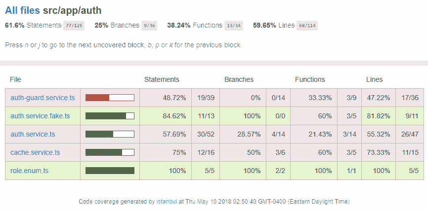
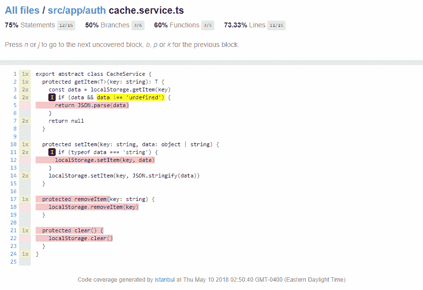
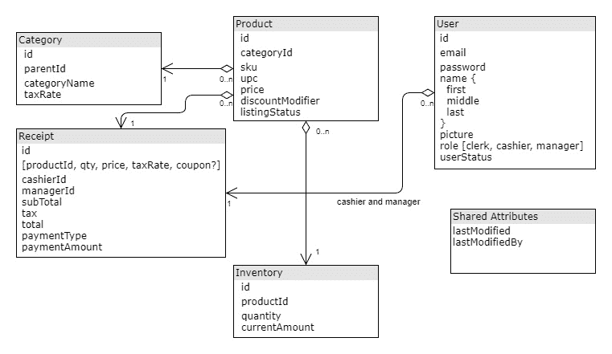
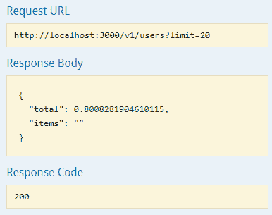

# 十三、持续集成与 API 设计

在我们开始为 LOB 应用 LemonMart 构建更复杂的功能之前，我们需要确保我们创建的每一个代码推送都通过了测试，遵守了编码标准，并且是一个可执行工件，团队成员可以在我们继续进一步开发应用时对其进行测试。同时，我们需要开始考虑应用将如何与后端服务器通信。无论您、您的团队还是其他团队将创建新的 API，API 设计同时满足前端和后端体系结构的需求都很重要。为了确保开发过程的顺利进行，需要一个健壮的机制来为 API 创建一个可访问的、动态的文档。**持续集成**（**CI**）可以解决第一个问题，Swagger 非常适合解决 API 设计、文档和测试需求。

通过在每次代码推送上构建和执行测试，持续集成对于确保高质量的可交付成果至关重要。设置 CI 环境可能非常耗时，并且需要对所使用的工具有专门的知识。CircleCI 是一个已建立的、基于云的 CI 服务，它有一个免费的层和一些有用的文章，可以让您以尽可能少的配置开始。我们将介绍一种可以在大多数 CI 服务上运行的基于 Docker 的方法，使您的特定配置知识和 CI 服务知识保持在最低限度。

全堆栈开发的另一个方面是，您可能会同时开发应用的前端和后端。无论您是独自工作，还是作为一个团队工作，还是与多个团队合作，都必须建立数据契约，以确保您不会遇到最后一刻的集成挑战。我们将使用 Swagger 为 RESTAPI 定义一个数据契约，然后创建一个模拟服务器，您的 Angular 应用可以对其进行 HTTP 调用。对于后端开发，Swagger 可以作为生成样板代码的一个很好的起点，并可以作为 API 的活文档和测试 UI。

在本章中，您将学习如何执行以下操作：

*   CircleCI
*   狂妄自大的 API 设计

本章要求：

*   免费的 CircleCI 帐户
*   码头工人

# 连续积分

持续集成的目的是使一个一致的、可重复的环境能够在每次代码推送时构建、测试和生成应用的可部署构件。在推送代码之前，开发人员应该有一个合理的期望，即他们的构建将通过；因此，创建一个可靠的 CI 环境，使开发人员也可以在本地机器上运行的命令自动化是至关重要的。

# 容器化构建环境

为了确保跨各种操作系统平台、开发人员机器和连续集成环境的一致构建环境，您可以将构建环境容器化。请注意，目前至少有六种常用 CI 工具在使用。了解每种工具的来龙去脉几乎是不可能完成的任务。构建环境的容器化是一个高级概念，它超越了当前对 CI 工具的期望。然而，容器化是标准化超过 90%的构建基础设施的一种很好的方法，几乎可以在任何 CI 环境中执行。通过这种方法，您学习的技能和创建的构建配置变得更有价值，因为您的知识和您创建的工具都可以转移和重用。

有许多策略可以用不同的粒度级别和性能期望来容器化构建环境。在本书中，我们将重点介绍可重用性和易用性。与其创建一组复杂、相互依赖的 Docker 映像，以实现更高效的故障优先和恢复路径，不如将重点放在一个简单明了的工作流上。Docker 的较新版本有一个称为多阶段构建（multi-stage builds）的强大功能，它允许您以易于阅读的方式定义一个多映像过程，并维护一个单一的`Dockerfile`。

在流程结束时，您可以提取一个优化的容器图像作为我们的可交付工件，从而降低流程中以前使用的图像的复杂性。

提醒您，您的单曲`Dockerfile`看起来像下面的示例：

```ts
Dockerfile
FROM duluca/minimal-node-web-server:8.11.1
WORKDIR /usr/src/app
COPY dist public
```

多阶段通过在单个`Dockerfile`中使用多个`FROM`语句来工作，其中每个阶段都可以执行一项任务，并使其实例中的任何资源可供其他阶段使用。在构建环境中，我们可以将各种与构建相关的任务作为它们自己的阶段来实现，然后将最终结果（例如Angular构建的`dist`文件夹）复制到最终映像，该映像包含一个 web 服务器。在这种情况下，我们将实现图像的三个阶段：

*   **生成器**：用于构建 Angular 应用的生产版本
*   **测试仪**：用于针对无头镀铬实例运行单元和 e2e 测试
*   **Web 服务器**：最终结果仅包含优化的生产位

Multi-stage builds require Docker version 17.05 or higher. To read more about multi-stage builds, read the documentation at [https://docs.docker.com/develop/develop-img/multistage-build/](https://docs.docker.com/develop/develop-img/multistage-build/).

首先，在项目的根目录下创建一个新文件来实现多阶段配置，名为`Dockerfile.integration`。

# 代码覆盖率报告

了解 Angular 项目单元测试覆盖率的数量和趋势的一个好方法是通过代码覆盖率报告。要为应用生成报告，请从项目文件夹中执行以下命令：

```ts
$ npx ng test --browsers ChromiumNoSandbox --watch=false --code-coverage
```

生成的报告将在文件夹名覆盖下创建为 HTML；执行以下命令以在浏览器中查看它：

```ts
$ npx http-server -c-1 -o -p 9875 ./coverage
```

以下是`istanbul.js`为 LemonMart 生成的文件夹级样本覆盖率报告：


Istanbul code coverage report for LemonMart

您可以深入查看特定文件夹，如`src/app/auth`，并获得文件级报告，如下所示：



Istanbul code coverage report for src/app/auth

您可以进一步向下钻取以获取给定文件的行级别覆盖率，如`cache.service.ts`，如下所示：



Istanbul Code Coverage Report for cache.service.ts

在上图中，您可以看到第 5、12、17-18 和 21-22 行未被任何测试覆盖。I**图标表示没有采用 if 路径。我们可以通过执行单元测试来增加代码覆盖率，单元测试执行`CacheService`中包含的功能。作为练习，读者应尝试使用新的单元测试至少覆盖其中一个函数，并观察代码覆盖率报告的更改。**

 **理想情况下，您的 CI 服务器配置应该以易于访问的方式在每次测试运行时生成并托管代码覆盖率报告。在`package.json`中以脚本形式实现这些命令，并在 CI 管道中执行它们。此配置留给读者作为练习。

Install `http-server` as a development dependency to your project.

# 建设者

第一阶段为`builder`。我们需要一个轻量级的构建环境，以确保全面一致的构建。为此，我创建了一个基于 Alpine 的节点构建环境示例，其中包括 npm、bash 和 git 工具。有关我们为什么使用 Alpine 和 Node 的更多信息，请参阅[第 10 章](10.html)、*为生产发布准备 Angular 应用*，在*使用 Docker 对应用进行集装箱化*部分：

1.  实施新的 npm 脚本来构建 Angular 应用：

```ts
"scripts": {
  "build:prod": "ng build --prod",
}
```

2.  继承自基于 Node.js 的构建环境，如`node:10.1`或`duluca/minimal-node-build-env:8.11.2`
3.  实现特定于环境的构建脚本，如下所示：

Note that at the time of publishing a bug in low-level npm tooling is preventing `node` based images  from successfully installing Angular dependencies. This means that the sample `Dockerfile` below is based on an older version of Node and npm with `duluca/minimal-node-build-env:8.9.4`. In the future, when the bugs are sorted out an updated build environment will be able to leverage `npm ci` to install dependencies, which brings significant speed gains over the `npm install` command.

```ts
Dockerfile.integration
FROM duluca/minimal-node-build-env:8.9.4 as builder

# project variables
ENV SRC_DIR /usr/src
ENV GIT_REPO https://github.com/duluca/lemon-mart.git
ENV SRC_CODE_LOCATION .
ENV BUILD_SCRIPT build:prod

# get source code
RUN mkdir -p $SRC_DIR
WORKDIR $SRC_DIR
# if necessary, do SSH setup here or copy source code from local or CI environment
RUN git clone $GIT_REPO .
# COPY $SRC_CODE_LOCATION .

RUN npm install
RUN npm run $BUILD_SCRIPT
```

在前面的示例中，容器正在从 GitHub 中提取源代码。为了保持示例的简单性，我选择这样做，因为它在本地和远程连续集成环境中都以相同的方式工作。但是，您的 CI 服务器已经有了源代码的副本，您需要将其从 CI 环境复制到容器中。

您可以使用`COPY $SRC_CODE_LOCATION .`命令从 CI 服务器或本地计算机复制源代码，而不是使用`RUN git clone $GIT_REPO .`命令。如果您这样做，您必须实现一个与您的`.gitignore`文件类似的`.dockerignore`文件，以确保机密不会泄露，`node_modules`不会被复制，并且配置可以在其他环境中重复。在 CI 环境中，您需要重写环境变量`$SRC_CODE_LOCATION`，以便`COPY`命令的源目录正确无误。您可以随意创建多个版本的`Dockerfile`，以满足您的各种需求。

另外，我已经基于`node-alpine`构建了一个最小节点构建环境`duluca/minimal-node-build-env`，您可以在[的 Docker Hub 上看到 https://hub.docker.com/r/duluca/minimal-node-build-env](https://hub.docker.com/r/duluca/minimal-node-build-env) 。这张图片大约比`node`小十倍。Docker 映像的大小对构建时间有实际影响，因为 CI 服务器或您的团队成员将花费额外的时间来绘制更大的映像。选择最适合您需要的环境。

# 调试生成环境

根据您的特殊需要，`Dockerfile`的生成器部分的初始设置可能会令人沮丧。要测试新命令或调试错误，可能需要直接与生成环境交互。

要在生成环境中以交互方式进行实验和/或调试，请执行以下操作：

```ts
$ docker run -it duluca/minimal-node-build-env:8.9.4 /bin/bash
```

在将命令烘焙到您的`Dockerfile`中之前，您可以在此临时环境中测试或调试命令。

# 测试员

第二阶段为`tester`。默认情况下，Angular CLI 生成面向开发环境的测试需求。这在持续集成环境中不起作用；我们必须将 Angular 配置为针对无头浏览器工作，该浏览器可以在没有 GPU 的帮助下执行，此外，还必须配置容器化环境来执行测试。

# 配置无头浏览器以实现Angular控制

量角器测试工具正式支持在无头模式下运行 Chrome。为了在连续集成环境中执行Angular测试，您需要将测试运行程序 Karma 配置为使用无头 Chrome 实例运行：

1.  更新`karma.conf.js`以包括新的无头浏览器选项：

```ts
src/karma.conf.js
...
browsers: ['Chrome', 'ChromiumHeadless', 'ChromiumNoSandbox'],
customLaunchers: {
  ChromiumHeadless: {
        base: 'Chrome',
        flags: [
          '--headless',
          '--disable-gpu',
          // Without a remote debugging port, Google Chrome exits immediately.
          '--remote-debugging-port=9222',
        ],
        debug: true,
      },
      ChromiumNoSandbox: {
        base: 'ChromiumHeadless',
        flags: ['--no-sandbox', '--disable-translate', '--disable-extensions']
      }
    },
```

`ChromiumNoSandbox`自定义启动器封装了良好默认设置所需的所有配置元素。

2.  更新`protractor`配置以无头模式运行：

```ts
e2e/protractor.conf.js
...
  capabilities: {
    browserName: 'chrome',
    chromeOptions: {
      args: [
        '--headless',
        '--disable-gpu',
        '--no-sandbox',
        '--disable-translate',
        '--disable-extensions',
        '--window-size=800,600',
      ],
    },
  },
...
```

In order to test your application for responsive scenarios, you can use the `--window-size` option, as shown earlier, to change the browser settings.

3.  更新`package.json`脚本以在生产构建场景中选择新浏览器选项：

```ts
package.json
"scripts": {
  ...
  "test:prod": "npm test -- --watch=false"
  ...
}
```

Note that `test:prod` doesn't include `npm run e2e`. e2e tests are integration tests that take longer to execute, so  think twice about including them as part of your critical build pipeline. e2e tests will not run on the lightweight testing environment mentioned in the next section, so they will require more resources and time to execute.

# 配置测试环境

对于轻量级测试环境，我们将利用基于 Alpine 的 Chromium 浏览器安装：

1.  继承自`slapers/alpine-node-chromium`
2.  将以下配置附加到`Docker.integration`：

```ts
Docker.integration
...
FROM slapers/alpine-node-chromium as tester
ENV BUILDER_SRC_DIR /usr/src
ENV SRC_DIR /usr/src
ENV TEST_SCRIPT test:prod

RUN mkdir -p $SRC_DIR
WORKDIR $SRC_DIR

COPY --from=builder $BUILDER_SRC_DIR $SRC_DIR

CMD 'npm run $TEST_SCRIPT'
```

前面的脚本将从`builder`阶段复制生产构建，并以可预测的方式执行测试脚本。

# 网络服务器

第三个也是最后一个阶段将生成作为 web 服务器的容器。此阶段完成后，将丢弃之前的阶段，最终结果将是一个优化的小于 10 MB 的容器：

1.  使用 Docker 容器化您的应用
2.  在文件末尾追加`FROM`语句
3.  `COPY`来自`builder`的生产就绪代码如下：

```ts
Docker.integration
...
FROM duluca/minimal-nginx-web-server:1.13.8-alpine
ENV BUILDER_SRC_DIR /usr/src
COPY --from=builder $BUILDER_SRC_DIR/dist /var/www
CMD 'nginx'
```

4.  构建并测试您的多阶段`Dockerfile`：

```ts
$ docker build -f Dockerfile.integration .
```

If you are pulling code from GitHub, ensure that your code is committed and pushed before building the container, since it will pull your source code directly from the repository. Use the `--no-cache` option to ensure that new source code is pulled. If you are copying code from your local or CI environment, then do *not* use `--no-cache` as you won't the speed gains from being able to reuse previously built container layers.

5.  将脚本另存为名为`build:ci`的新 npm 脚本，如图所示：

```ts
package.json
"scripts": {
  ...
  "build:ci": "docker build -f Dockerfile.integration . -t $npm_package_config_imageRepo:latest",
  ...
}
```

# CircleCI

CircleCI 为初学者和专业人士提供了一个免费的入门平台和优秀的文档。如果您有独特的企业需求，CircleCI 可以在内部部署、在公司防火墙后面部署，也可以作为云中的私有部署。

CircleCI 有预烘焙的构建环境，用于免费设置的虚拟配置，但它也可以使用 Docker 容器运行构建，使其成为一个可根据用户技能和需求进行扩展的解决方案，如*容器化构建环境*部分所述：

1.  在[创建 CircleCI 账户 https://circleci.com/](https://circleci.com/)
2.  注册 GitHub：


CircleCI Sign up page

3.  添加新项目：


CircleCI Projects Page

在下一个屏幕上，您可以选择 Linux 或 macOS 构建环境。macOS 构建环境对于构建 iOS 或 macOS 应用非常有用。但是，这些环境没有可用层；只有具有 1x 并行性的 Linux 实例是免费的。

4.  搜索 lemon mart 并单击安装项目
5.  选择 Linux
6.  选择平台 2.0
7.  选择语言作为其他语言，因为我们将使用自定义的容器化构建环境

8.  在源代码中，创建一个名为`.circleci`的文件夹，并添加一个名为`config.yml`的文件：

```ts
.circleci/config.yml
version: 2
jobs:
  build:
    docker:
      - image: docker:17.12.0-ce-git
    working_directory: /usr/src
    steps:
      - checkout
      - setup_remote_docker:
          docker_layer_caching: false
      - run:
          name: Build Docker Image
          command: |
            npm run build:ci
```

在前面的文件中，定义了一个`build`作业，该作业基于 CircleCI 的预构建`docker:17.12.0-ce-git`映像，其中包含 Docker 和 git CLI 工具。然后我们定义 build`steps`，它用`checkout`从 GitHub 中检出源代码，用`setup_remote_docker`命令通知 CircleCI 在 Docker 环境中设置 Docker，然后执行`docker build -f Dockerfile.integration .`命令来启动我们的定制构建过程。

In order to optimize builds, you should experiment with layer caching and copying source code from the already checked out source code in CircleCI.

9.  将更改同步到 Github
10.  在 CircleCI 上，单击以创建项目

如果一切顺利，你将通过*绿色*建造。如以下屏幕截图所示，构建#4 成功：


Green build on CircleCI

目前，CI 服务器正在运行，在第 1 阶段构建应用，然后在第 2 阶段运行测试，然后在第 3 阶段构建 web 服务器。请注意，我们没有对该 web 服务器容器映像执行任何操作，例如将其部署到服务器。

为了部署映像，您需要实现部署步骤。在此步骤中，您可以部署到多个目标，如 Docker Hub、Zeit Now、Heroku 或 AWS ECS。与这些目标的整合将涉及多个步骤。在高层，这些步骤如下：

1.  使用单独的运行步骤安装特定于目标的 CLI 工具
2.  使用特定于目标环境的登录凭据配置 Docker，并将所述凭据存储为 CircleCI 环境变量
3.  使用`docker push`将生成的 web 服务器映像提交到目标的 Docker 注册表
4.  执行特定于平台的`deploy`命令，指示目标运行刚刚推送的 Docker 映像。

[第 16 章](16.html)、*AWS*上的高可用云基础设施中介绍了如何从本地开发环境在 AWS ECS 上配置此部署的示例。

# API 设计

在全栈开发中，尽早确定 API 设计是很重要的。API 设计本身与数据契约的外观密切相关。您可以创建 RESTful 端点或使用下一代 GraphQL 技术。在设计 API 时，前端和后端开发人员应密切协作，以实现共享的设计目标。以下列出了一些高级别目标：

*   最小化客户端和服务器之间传输的数据
*   坚持良好的设计模式（即分页）
*   旨在减少客户端中存在的业务逻辑的设计
*   扁平化数据结构
*   不要公开数据库键或关系
*   从开始到结束的版本端点
*   围绕主要数据组件进行设计

重要的是，不要重新发明轮子，而要采取严格的方法来设计 API。一旦应用上线，API 设计中的失误可能会产生深远的影响，并且不可能纠正。

我将详细介绍围绕主要数据组件的设计，并实现一个样例 Swagger 端点。

# 围绕主要数据组件进行设计

它有助于围绕主要数据组件组织 API。这将大致符合您在 Angular 应用中使用各种组件中的数据的方式。首先，我们将通过创建一个粗略的数据实体图来定义主要的数据组件，然后使用 swagger 为用户数据实体实现一个示例 API。

# 定义实体

让我们首先尝试一下您希望存储哪种实体，以及这些实体之间的关系。

下面是使用[draw.io](http://draw.io)创建的 LemonMart 设计示例：



Data entity diagram for LemonMart At this moment, whether your entities are stored in a SQL or NoSQL database is inconsequential. My suggestion is to stick to what you know, but if you're starting from scratch, a NoSQL database like MongoDB will offer the most amount of flexibility as your implementation and requirements evolve.

粗略地说，每个实体都需要 CRUDAPI。您可以使用 Swagger 来设计 API。

# 大摇大摆

Swagger 将允许您设计 web API。对于团队来说，它可以充当前端和后端团队之间的接口。此外，通过 API 模拟，您可以在 API 实现开始之前开发和完成 API 功能。

接下来，我们将实现一个示例用户 API，以演示 Swagger 是如何工作的。

The sample project comes with recommended extensions for VS Code. Swagger Viewer allows us to preview the YAML file without running any additional tools.

# 定义 Swagger YAML 文件

最广泛使用和支持的 Swagger 规范版本是`swagger: '2.0'`。下面的示例使用更新的、基于标准的`openapi: 3.0.0`给出。示例代码存储库包含这两个示例。然而，在发布时，Swagger 生态系统中的大多数工具都依赖于版本 2.0。

The sample code repository can be found at [github.com/duluca/lemon-mart-swagger-server](http://github.com/duluca/lemon-mart-swagger-server). For your mock API server, you should create a separate git repository, so that this contract between your frontend and backend can be maintained separately. 

1.  创建一个名为`lemon-mart-swagger-server`的新 GitHub 存储库
2.  开始使用常规信息和目标服务器定义 YAML 文件：

```ts
swagger.oas3.yaml
openapi: 3.0.0
info:
  title: LemonMart
  description: LemonMart API
  version: "1.0.0"

servers:
  - url: http://localhost:3000
    description: Local environment
  - url: https://mystagingserver.com/v1
    description: Staging environment
  - url: https://myprodserver.com/v1
    description: Production environment
```

3.  在`components`下定义共享数据`schemas`：

```ts
swagger.oas3.yaml
...
components:
  schemas: 
    Role:
      type: string
      enum: [clerk, cashier, manager]
    Name:
      type: object
      properties:
        first:
          type: string
        middle:
          type: string
        last:
          type: string
    User:
      type: object
      properties:
        id:
          type: string
        email:
          type: string
        name:
          $ref: '#/components/schemas/Name'
        picture:
          type: string
        role:
          $ref: '#/components/schemas/Role'
        userStatus:
          type: boolean
        lastModified:
          type: string
          format: date
        lastModifiedBy:
          type: string
    Users:
      type: object
      properties:
        total:
          type: number
          format: int32
      items:
        $ref: '#/components/schemas/ArrayOfUser'
    ArrayOfUser:
      type: array
      items:
            $ref: '#/components/schemas/User'
```

4.  在`components`下，添加共享`parameters`，便于重复使用分页端点等常用模式：

```ts
swagger.oas3.yaml
...
  parameters:
    offsetParam: # <-- Arbitrary name for the definition that will be used to refer to it.
                  # Not necessarily the same as the parameter name.
      in: query
      name: offset
      required: false
      schema:
        type: integer
        minimum: 0
      description: The number of items to skip before starting to collect the result set.
    limitParam:
      in: query
      name: limit
      required: false
      schema:
        type: integer
        minimum: 1
        maximum: 50
        default: 20
      description: The numbers of items to return.
```

5.  在`paths`下，为`/users`路径定义一个`get`端点：

```ts
...
paths:
  /users:
    get:
      description: |
        Searches and returns `User` objects.
        Optional query params determines values of returned array
      parameters:
        - in: query
          name: search
          required: false
          schema:
            type: string
          description: Search text
        - $ref: '#/components/parameters/offsetParam'
        - $ref: '#/components/parameters/limitParam'
      responses:
        '200': # Response
          description: OK
          content: # Response body
            application/json: # Media type
              schema:
                $ref: '#/components/schemas/Users'
```

6.  在`paths`下，添加`get`按 ID 用户和`update`按 ID 用户端点：

```ts
swagger.oas3.yaml
...
  /user/{id}:
    get:
      description: Gets a `User` object by id
      parameters:
        - in: path
          name: id
          required: true
          schema:
            type: string
          description: User's unique id
      responses:
         '200': # Response
            description: OK
            content: # Response body
              application/json: # Media type
                schema:
                  $ref: '#/components/schemas/User'
    put:
      description: Updates a `User` object given id
      parameters:
        - in: query
          name: id
          required: true
          schema:
            type: string
          description: User's unique id
        - in: body
          name: userData
          schema:
            $ref: '#/components/schemas/User'
          style: form
          explode: false
          description: Updated user object
      responses:
        '200':
          description: OK
          content: # Response body
              application/json: # Media type
                schema:
                  $ref: '#/components/schemas/User'
```

To validate your Swagger file, you can use the online editor at [editor.swagger.io](https://editor.swagger.io). Note the use of `style: form` and `explode: false`, which are the simplest way to configure an endpoint that expects basic form data. For more parameter serialization options or to simulate authentication endpoints and a slew of other possible configurations, refer to the documentation at [swagger.io/docs/specification/](https://swagger.io/docs/specification/).

# 创建一个招摇过市的服务器

使用 YAML 文件，可以使用 Swagger Code Gen 工具生成 mock Node.js 服务器。

# 带有非官方工具的 OpenAPI 3.0

如前一节所述，本节将使用 YAML 文件的版本 2，它可以使用官方工具生成服务器。但是，还有其他工具可以生成一些代码，但不够完整，不容易使用：

1.  如果在项目文件夹上使用 OpenAPI 3.0，请执行以下命令：

```ts
$ npx swagger-node-codegen swagger.oas3.yaml -o ./server
...
Done! 
Check out your shiny new API at C:\dev\lemon-mart-swagger-server\server.
```

在一个名为`server`的新文件夹下，现在应该生成一个 Node Express 服务器。

2.  安装服务器的依赖项：

```ts
$ cd server
$ npm install
```

然后必须手动实现丢失的存根，以完成服务器的实现。

# 带官方工具的 Swagger 2.0

使用官方工具和 2.0 版，您可以自动创建 API 和生成响应。一旦官方工具完全支持 OpenAPI 3.0，同样的说明也应适用：

1.  在您的计算机可以访问的 URI 上发布 YAML 文件：

```ts
https://raw.githubusercontent.com/duluca/lemon-mart-swagger-server/master/swagger.2.yaml
```

2.  在项目文件夹中，执行以下命令，将`<uri>`替换为指向 YAML 文件的命令：

```ts
$ docker run --rm -v ${PWD}:/local swaggerapi/swagger-codegen-cli 
$ generate -i <uri> -l nodejs-server -o /local/server
```

与上一节类似，这将在服务器目录下创建一个 Node Express 服务器。要执行此服务器，请执行以下步骤。

3.  使用`npm install`安装服务器的依赖项
4.  运行`npm start`。您的模拟服务器现在应该已启动并正在运行。

5.  导航至`http://localhost:3000/docs`

6.  试用`get /users`的 API；您将注意到 items 属性为空：



Swagger UI - Users endpoint

但是，您应该接收虚拟数据。我们将纠正这种行为。

7.  试用`get /user/{id}`；您将看到您收到了一些虚拟数据：


Swagger UI - User by ID endpoint

行为上的差异是因为，默认情况下，Node Express 服务器使用在`server/controllers/Default.js`下生成的控制器从`server/service/DefaultService.js`读取服务器创建过程中生成的随机数据。但是，您可以禁用默认控制器并强制 Swagger 进入更好的默认存根模式。

8.  更新`index.js`以强制使用存根和注释控制器：

```ts
index.js
var options = {
  swaggerUi: path.join(__dirname, '/swagger.json'),
  // controllers: path.join(__dirname, './controllers'),
  useStubs: true,
}
```

9.  再次尝试`/users`端点

正如您在这里看到的，默认情况下，响应的质量更高：


Swagger UI - Users endpoint with dummy data

前面提到，`total`是一个整数，`role`定义正确，`items`是一个有效的数组结构。

To enable better and more customized data mocking, you can edit `DefaultService.js`. In this case, you would want to update the `usersGET` function to return an array of customized users.

# 启用跨源资源共享（CORS）

在您能够从应用使用服务器之前，您需要将其配置为允许**跨源资源共享**（**CORS**），以便托管在`http://localhost:5000`上的 Angular 应用可以与托管在`http://localhost:3000`上的模拟服务器通信：

1.  安装`cors`包：

```ts
$ npm i cors
```

2.  更新`index.js`使用`cors`：

```ts
server/index.js
...
var cors = require('cors')
...
app.use(cors())

// Initialize the Swagger middleware
swaggerTools.initializeMiddleware(swaggerDoc, function(middleware) {
...
```

Ensure that `app.use(cors())` is called right before `initializeMiddleware`; otherwise, other Express middleware may interfere with the functionality of `cors()`.

# 验证和发布 Swagger 服务器

您可以通过位于`http://localhost:3000/docs`的 Swagger UI 验证您的 Swagger 服务器设置，或者您可以通过 VS 代码中的预览 Swagger 扩展实现更集成的环境。

我将演示如何使用此扩展从 VS 代码中测试 API：

1.  在资源管理器中选择 YAML 文件
2.  按*Shift*+*Alt*+*P*并执行预览招摇命令
3.  您将看到一个交互式窗口来测试配置，如图所示：


Preview Swagger Extension in Visual Studio Code

4.  单击/用户的“获取”按钮
5.  单击“试用”以查看结果

In OpenAPI 3.0.0, instead of schemes, you will see a list of servers, including local and remote resources. This is a very convenient tool to explore various data sources as you code your frontend application.

现在您已经验证了您的 Swagger 服务器，您可以发布您的服务器，使团队成员或需要可预测数据集才能成功执行的**自动验收测试**（**AAT**环境能够访问该服务器。

执行以下步骤*：*

6.  将 Docker 的 npm 脚本添加到根级别`package.json`文件
7.  添加一个`Dockerfile`：

```ts
Dockerfile
FROM duluca/minimal-node-build-env:8.11.2

RUN mkdir -p /usr/src
WORKDIR /usr/src

COPY server .

RUN npm ci

CMD ["node", "index"]
```

一旦构建了容器，就可以部署它了。

I have published a sample server on Docker Hub at [https://hub.docker.com/r/duluca/lemon-mart-swagger-server](https://hub.docker.com/r/duluca/lemon-mart-swagger-server).

# 总结

在本章中，您学习了如何创建基于容器的持续集成环境。我们利用 CircleCI 作为基于云的 CI 服务，并强调您可以将构建结果部署到所有主要的云托管提供商。如果您启用这种自动部署，您将实现**连续部署**（**CD**）。通过 CI/CD 管道，您可以与客户和团队成员共享应用的每个迭代，并快速向最终用户提供错误修复或新功能。

我们还讨论了良好 API 设计的重要性，并将 Swagger 确立为一种工具，有利于前端和后端开发人员根据实时数据契约进行定义和开发。如果您创建了一个 Swagger 模拟服务器，那么您可以让团队成员在后端实现完成之前提取模拟服务器映像并使用它开发他们的前端应用。

CircleCI 和 Swagger 都是高度复杂的工具。本章中提到的技术在目的上很简单，但它们旨在实现复杂的工作流，让您体验这些工具的真正威力。您可以极大地提高此技术的效率和能力，但这些技术将取决于您的具体需求。

有了 CI 和模拟 API，我们可以向它们发送真正的 HTTP 请求，我们可以快速迭代，同时确保高质量的可交付成果。在下一章中，我们将深入探讨使用基于令牌的身份验证和条件导航技术为您的业务线应用设计授权和身份验证体验，以实现流畅的用户体验，继续采用路由优先的方法。**