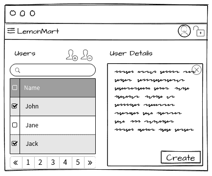
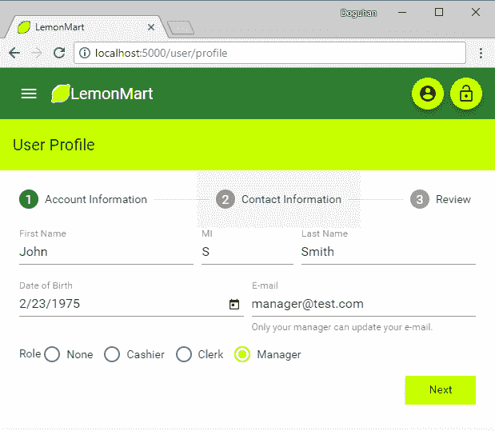
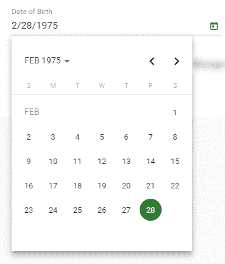
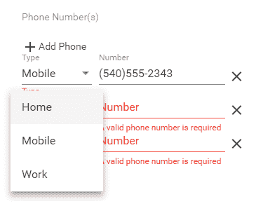

# 十五、Angular 应用设计和秘籍

在本章中，我们将完成 LemonMart 的实现。作为 router first 方法的一部分，我将演示如何创建也支持数据绑定的可重用路由组件——使用路由的辅助路由布局组件的能力，使用 resolve guards 减少样板代码，并利用类、接口、枚举、验证器和管道最大限度地实现代码重用。此外，我们将创建多步骤表单，并使用分页实现数据表，并探索响应性设计。在此过程中，在本书中，我们将接触到角材料和角材料提供的大部分主要功能。

在本章中，训练轮已关闭。我将提供一般指导，让您开始实施；但是，这将取决于您自己尝试并完成实现。如果您需要帮助，您可以参考本书提供的完整源代码，或参考 GitHub 上的最新示例，网址为[GitHub.com/duluca/lemon-mart](https://github.com/duluca/lemon-mart)。

在本章中，您将了解以下主题：

*   面向对象类设计
*   可路由的可重用组件
*   缓存服务响应
*   HTTP POST 请求
*   多步骤响应形式
*   解决守卫问题
*   使用辅助管线的主视图/详图视图
*   带分页的数据表

# 用户类与面向对象编程

到目前为止，我们只使用接口来表示数据，我们仍然希望在各种组件和服务之间传递数据时继续使用接口。但是，需要创建一个默认对象来初始化`BehaviorSubject`。在**面向对象编程**（**OOP**中，`User`对象拥有此功能而不是服务非常有意义。所以，让我们实现一个`User`类来实现这个目标。

在`user/user`文件夹中定义`UserModule`中提供的`IUser`接口和`User`类：

```ts
src/app/user/user/user.ts
import { Role } from '../../auth/role.enum'

export interface IUser {
  id: string
  email: string
  name: {
    first: string
    middle: string
    last: string
  }
  picture: string
  role: Role
  userStatus: boolean
  dateOfBirth: Date
  address: {
    line1: string
    line2: string
    city: string
    state: string
    zip: string
  }
  phones: IPhone[]
}

export interface IPhone {
  type: string
  number: string
  id: number
}

export class User implements IUser {
  constructor(
    public id = '',
    public email = '',
    public name = { first: '', middle: '', last: '' },
    public picture = '',
    public role = Role.None,
    public dateOfBirth = null,
    public userStatus = false,
    public address = {
      line1: '',
      line2: '',
      city: '',
      state: '',
      zip: '',
    },
    public phones = []
  ) {}

  static BuildUser(user: IUser) {
    return new User(
      user.id,
      user.email,
      user.name,
      user.picture,
      user.role,
      user.dateOfBirth,
      user.userStatus,
      user.address,
      user.phones
    )
  }
}
```

请注意，通过将构造函数中具有默认值的所有属性定义为`public`属性，我们一举两得；否则，我们将需要定义属性并分别初始化它们。这样，我们实现了一个简洁的实现。

您还可以实现在模板中使用的计算属性，例如能够方便地显示用户的`fullName`：

```ts
src/app/user/user/user.ts  
get fullName() {
  return `${this.name.first} ${this.name.middle} ${this.name.last}`
}
```

Using a `static BuildUser` function, you can quickly hydrate the object with data received from the server. You can also implement the `toJSON()` function to customize the serialization behavior of your object before sending the data up to the server.

# 重用组件

我们需要一个能够显示给定用户信息的组件。当用户导航到`/user/profile`时，显示此信息的自然位置。您可以看到实体模型`User`配置文件：


User profile mock-up

用户信息也显示在应用的其他地方，即`/manager/users`：



Manager user management mock-up

为了最大化代码重用，我们需要确保您设计的`User`组件可以在两种上下文中使用。

例如，让我们完成两个与用户配置文件相关的屏幕的实现。

# 支持多步骤身份验证的响应表单的用户配置文件

现在，让我们实现一个多步骤输入表单来捕获用户配置文件信息。我们还将使此多步骤表单响应使用媒体查询的移动设备。

1.  让我们从添加一些帮助器数据开始，这些数据将帮助我们显示带有选项的输入表单：

```ts
src/app/user/profile/data.ts
export interface IUSState {
  code: string
  name: string
}

export function USStateFilter(value: string): IUSState[] {
  return USStates.filter(state => {
    return (
      (state.code.length === 2 && state.code.toLowerCase() === value.toLowerCase()) ||
      state.name.toLowerCase().indexOf(value.toLowerCase()) === 0
    )
  })
}

export enum PhoneType {
  Mobile,
  Home,
  Work,
}

const USStates = [
  { code: 'AK', name: 'Alaska' },
  { code: 'AL', name: 'Alabama' },
  { code: 'AR', name: 'Arkansas' },
  { code: 'AS', name: 'American Samoa' },
  { code: 'AZ', name: 'Arizona' },
  { code: 'CA', name: 'California' },
  { code: 'CO', name: 'Colorado' },
  { code: 'CT', name: 'Connecticut' },
  { code: 'DC', name: 'District of Columbia' },
  { code: 'DE', name: 'Delaware' },
  { code: 'FL', name: 'Florida' },
  { code: 'GA', name: 'Georgia' },
  { code: 'GU', name: 'Guam' },
  { code: 'HI', name: 'Hawaii' },
  { code: 'IA', name: 'Iowa' },
  { code: 'ID', name: 'Idaho' },
  { code: 'IL', name: 'Illinois' },
  { code: 'IN', name: 'Indiana' },
  { code: 'KS', name: 'Kansas' },
  { code: 'KY', name: 'Kentucky' },
  { code: 'LA', name: 'Louisiana' },
  { code: 'MA', name: 'Massachusetts' },
  { code: 'MD', name: 'Maryland' },
  { code: 'ME', name: 'Maine' },
  { code: 'MI', name: 'Michigan' },
  { code: 'MN', name: 'Minnesota' },
  { code: 'MO', name: 'Missouri' },
  { code: 'MS', name: 'Mississippi' },
  { code: 'MT', name: 'Montana' },
  { code: 'NC', name: 'North Carolina' },
  { code: 'ND', name: 'North Dakota' },
  { code: 'NE', name: 'Nebraska' },
  { code: 'NH', name: 'New Hampshire' },
  { code: 'NJ', name: 'New Jersey' },
  { code: 'NM', name: 'New Mexico' },
  { code: 'NV', name: 'Nevada' },
  { code: 'NY', name: 'New York' },
  { code: 'OH', name: 'Ohio' },
  { code: 'OK', name: 'Oklahoma' },
  { code: 'OR', name: 'Oregon' },
  { code: 'PA', name: 'Pennsylvania' },
  { code: 'PR', name: 'Puerto Rico' },
  { code: 'RI', name: 'Rhode Island' },
  { code: 'SC', name: 'South Carolina' },
  { code: 'SD', name: 'South Dakota' },
  { code: 'TN', name: 'Tennessee' },
  { code: 'TX', name: 'Texas' },
  { code: 'UT', name: 'Utah' },
  { code: 'VA', name: 'Virginia' },
  { code: 'VI', name: 'Virgin Islands' },
  { code: 'VT', name: 'Vermont' },
  { code: 'WA', name: 'Washington' },
  { code: 'WI', name: 'Wisconsin' },
  { code: 'WV', name: 'West Virginia' },
  { code: 'WY', name: 'Wyoming' },
]

```

2.  安装帮助程序库以编程方式访问 TypeScript 枚举值

```ts
$ npm i ts-enum-util
```

3.  向`common/validations.ts`添加新的验证规则

```ts
src/app/common/validations.ts
...

export const OptionalTextValidation = [Validators.minLength(2), Validators.maxLength(50)]
export const RequiredTextValidation = OptionalTextValidation.concat([Validators.required])
export const OneCharValidation = [Validators.minLength(1), Validators.maxLength(1)]
export const BirthDateValidation = [
  Validators.required,
  Validators.min(new Date().getFullYear() - 100),
  Validators.max(new Date().getFullYear()),
]
export const USAZipCodeValidation = [
  Validators.required,
  Validators.pattern(/^\d{5}(?:[-\s]\d{4})?$/),
]
export const USAPhoneNumberValidation = [
  Validators.required,
  Validators.pattern(/^\D?(\d{3})\D?\D?(\d{3})\D?(\d{4})$/),
]
```

4.  现在执行`profile.component.ts`如下：

```ts
src/app/user/profile/profile.component.ts
import { Role as UserRole } from '../../auth/role.enum'
import { $enum } from 'ts-enum-util'
...
@Component({
  selector: 'app-profile',
  templateUrl: './profile.component.html',
  styleUrls: ['./profile.component.css'],
})
export class ProfileComponent implements OnInit {
  Role = UserRole
  PhoneTypes = $enum(PhoneType).getKeys()
  userForm: FormGroup
  states: Observable<IUSState[]>
  userError = ''
  currentUserRole = this.Role.None

  constructor(
    private formBuilder: FormBuilder,
    private router: Router,
    private userService: UserService,
    private authService: AuthService
  ) {}

  ngOnInit() {
    this.authService.authStatus.subscribe(
      authStatus => (this.currentUserRole = authStatus.userRole)
    )

    this.userService.getCurrentUser().subscribe(user => {
      this.buildUserForm(user)
    })

    this.buildUserForm()
  }
  ...
}
```

加载时，我们从`userService`请求当前用户，但这需要一段时间，因此我们必须首先使用`this.buildUserForm()`构建一个空表单。在这个函数上，您还可以实现一个解析保护，如后面部分所述，根据路由上提供的用户`userId`加载用户，并将该数据传递到`buildUserForm(routeUser)`并跳过加载`currentUser`，以提高该组件的可重用性。

# 组队

我们的表单有许多输入字段，因此我们将使用由`this.formBuilder.group`创建的`FormGroup`来容纳各种`FormControl`对象。此外，子`FormGroup`对象将允许我们保持数据结构的正确形状。

开始构建`buildUserForm`功能，如下所示：

```ts
src/app/user/profile/profile.component.ts
...
  buildUserForm(user?: IUser) {
    this.userForm = this.formBuilder.group({
      email: [
        {
          value: (user && user.email) || '',
          disabled: this.currentUserRole !== this.Role.Manager,
        },
        EmailValidation,
      ],
      name: this.formBuilder.group({
        first: [(user && user.name.first) || '', RequiredTextValidation],
        middle: [(user && user.name.middle) || '', OneCharValidation],
        last: [(user && user.name.last) || '', RequiredTextValidation],
      }),
      role: [
        {
          value: (user && user.role) || '',
          disabled: this.currentUserRole !== this.Role.Manager,
        },
        [Validators.required],
      ],
      dateOfBirth: [(user && user.dateOfBirth) || '', BirthDateValidation],
      address: this.formBuilder.group({
        line1: [
          (user && user.address && user.address.line1) || '',
          RequiredTextValidation,
        ],
        line2: [
          (user && user.address && user.address.line2) || '',
          OptionalTextValidation,
        ],
        city: [(user && user.address && user.address.city) || '', RequiredTextValidation],
        state: [
          (user && user.address && user.address.state) || '',
          RequiredTextValidation,
        ],
        zip: [(user && user.address && user.address.zip) || '', USAZipCodeValidation],
      }),
      ...
    })
    ...
  }
...
```

`buildUserForm`可以选择接受`IUser`来预先填充表单，否则所有字段都设置为默认值。`userForm`本身就是顶级`FormGroup`。添加了各种`FormControls`，如`email`，并根据需要附加了验证器。注意`name`和`address`是如何成为它们自己的`FormGroup`对象的。这种父子关系确保了表单数据在序列化为 JSON 时的正确结构，JSON 符合`IUser`的结构，我们的应用和服务器端代码的其余部分可以利用这种结构。

您将按照本章提供的示例代码独立完成`userForm`的实现，在接下来的几节中，我将逐一介绍代码的各个部分，以解释某些关键功能。

# 步进式和响应式布局

角材料步进机附带 MatStepperModule。stepper 允许将表单输入分解为多个步骤，这样用户就不会一次处理几十个输入字段。用户仍然可以跟踪他们在流程中的位置，作为一种副作用，作为开发人员，我们将分解我们的`<form>`实现，逐步实施验证规则，或者创建可选的工作流，其中某些步骤可以跳过或需要。与所有材料用户控制一样，步进机的设计考虑到了响应性用户体验。在接下来的几节中，我们将实施三个步骤，涵盖流程中的不同表单输入技术：

1.  帐户信息
    *   输入验证
    *   带有媒体查询的响应式布局
    *   计算属性
    *   日期选择器
2.  联系方式
    *   超前式支架
    *   动态表单数组
3.  回顾
    *   只读视图
    *   保存和清除数据

让我们准备一些新材料模块的用户模块：

1.  创建一个包含以下物料模块的`user-material.module`：

```ts
MatAutocompleteModule,
MatDatepickerModule,
MatDividerModule,
MatLineModule,
MatNativeDateModule,
MatRadioModule,
MatSelectModule,
MatStepperModule,
```

2.  确保`user.module`正确导入：
    1.  新的`user-material.module`
    2.  基线`app-material.module`
    3.  必需的`FormsModule`、`ReactiveFormsModule`和`FlexLayoutModule`

As we start adding sub material modules, it makes sense to rename our root `material.module.ts` file to `app-material.modules.ts` inline with how `app-routing.module.ts` is named. Going forward, I will be using the latter convention.

3.  现在，开始实施帐户信息步骤的第一行：

```ts
src/app/user/profile/profile.component.html <mat-toolbar color="accent"> <h5>User Profile</h5>
</mat-toolbar>

<mat-horizontal-stepper #stepper="matHorizontalStepper">
  <mat-step [stepControl]="userForm">
    <form [formGroup]="userForm">
      <ng-template matStepLabel>Account Information</ng-template>
      <div class="stepContent">
        <div fxLayout="row" fxLayout.lt-sm="column" [formGroup]="userForm.get('name')" fxLayoutGap="10px">
          <mat-form-field fxFlex="40%">
            <input matInput placeholder="First Name" aria-label="First Name" formControlName="first">
            <mat-error *ngIf="userForm.get('name').get('first').hasError('required')">
              First Name is required
            </mat-error>
            <mat-error *ngIf="userForm.get('name').get('first').hasError('minLength')">
              Must be at least 2 characters
            </mat-error>
            <mat-error *ngIf="userForm.get('name').get('first').hasError('maxLength')">
              Can't exceed 50 characters
            </mat-error>
          </mat-form-field>
          <mat-form-field fxFlex="20%">
            <input matInput placeholder="MI" aria-label="Middle Initial" formControlName="middle">
            <mat-error *ngIf="userForm.get('name').get('middle').invalid">
              Only inital
            </mat-error>
          </mat-form-field>
          <mat-form-field fxFlex="40%">
            <input matInput placeholder="Last Name" aria-label="Last Name" formControlName="last">
            <mat-error *ngIf="userForm.get('name').get('last').hasError('required')">
              Last Name is required
            </mat-error>
            <mat-error *ngIf="userForm.get('name').get('last').hasError('minLength')">
              Must be at least 2 characters
            </mat-error>
            <mat-error *ngIf="userForm.get('name').get('last').hasError('maxLength')">
              Can't exceed 50 characters
            </mat-error>
          </mat-form-field>
        </div>
       ...
      </div>
    </form>
   </mat-step>
...
</mat-horizontal-stepper>
```

4.  注意了解到目前为止步进器和表单配置的工作原理，您应该看到第一行渲染，拉取模拟数据：


Multi-step form - Step 1

5.  为了完成表单的实现，请参考本章提供的示例代码或[GitHub.com/duluca/lemon-mart](https://github.com/duluca/lemon-mart)上的参考实现

During your implementation, you will notice that the Review step uses a directive named `<app-view-user>`. A minimal version of this component is implemented in the ViewUser component section below. However, feel free to implement the capability inline for now and refactor your code during the Reusable component with binding and route data section.

在以下屏幕截图中，您可以看到桌面上多步骤表单的完整实现是什么样子的：



Multi-step form on desktop

请注意，在带有`fxLayout="row"`的行上添加`fxLayout.lt-sm="column"`可以实现表单的响应性布局，如图所示：


Multi-step form on mobile

让我们在下一节中了解“出生日期”字段是如何工作的。

# 计算属性和日期选择器

如果希望显示基于用户输入的计算特性，可以按照此处显示的模式进行操作：

```ts
src/app/user/profile/profile.component.ts ...
get dateOfBirth() {
  return this.userForm.get('dateOfBirth').value || new Date()
}

get age() {
  return new Date().getFullYear() - this.dateOfBirth.getFullYear()
}
...
```

模板中计算属性的用法如下所示：

```ts
src/app/user/profile/profile.component ...
<mat-form-field fxFlex="50%">
  <input matInput placeholder="Date of Birth" aria-label="Date of Birth" formControlName="dateOfBirth" [matDatepicker]="dateOfBirthPicker">
  <mat-hint *ngIf="userForm.get('dateOfBirth').touched">{{this.age}} year(s) old</mat-hint>
  <mat-datepicker-toggle matSuffix [for]="dateOfBirthPicker"></mat-datepicker-toggle>
  <mat-datepicker #dateOfBirthPicker></mat-datepicker>
  <mat-error *ngIf="userForm.get('dateOfBirth').invalid">
    Date must be with the last 100 years
  </mat-error>
</mat-form-field>
...
```

这就是它的作用：



Selecting date with DatePicker

选择日期后，将显示计算的年龄，如下所示：


Calculated age property

现在，让我们进入下一步，联系信息，看看如何使用一种方便的方式来显示和输入地址字段的状态部分。

# 超前式支架

在`buildUserForm`中，我们在`address.state`上设置了一个监听器，以支持类型先行过滤下拉体验：

```ts
src/app/user/profile/profile.component.ts ...
this.states = this.userForm
  .get('address')
  .get('state')
  .valueChanges.pipe(startWith(''), map(value => USStateFilter(value)))
...
```

在模板上，使用`async`管道实现绑定到过滤状态数组的`mat-autocomplete`：

```ts
src/app/user/profile/profile.component.html ...
<mat-form-field fxFlex="30%">
  <input type="text" placeholder="State" aria-label="State" matInput formControlName="state" [matAutocomplete]="stateAuto">
  <mat-autocomplete #stateAuto="matAutocomplete">
    <mat-option *ngFor="let state of states | async" [value]="state.name">
      {{ state.name }}
    </mat-option>
  </mat-autocomplete>
  <mat-error *ngIf="userForm.get('address').get('state').hasError('required')">
    State is required
  </mat-error>
</mat-form-field>
...
```

以下是用户输入`V`字符时的外观：


Dropdown with Typeahead Support In the next section, let's enable the input of multiple phone numbers.

# 动态表单数组

注意，`phones`是一个数组，可能允许许多输入。我们可以通过构建一个带有`this.formBuilder.array`和几个辅助函数的`FormArray`来实现这一点：

```ts
src/app/user/profile/profile.component.ts
...
  phones: this.formBuilder.array(this.buildPhoneArray(user ? user.phones : [])),
...
  private buildPhoneArray(phones: IPhone[]) {
    const groups = []

    if (!phones || (phones && phones.length === 0)) {
      groups.push(this.buildPhoneFormControl(1))
    } else {
      phones.forEach(p => {
        groups.push(this.buildPhoneFormControl(p.id, p.type, p.number))
      })
    }
    return groups
  }

  private buildPhoneFormControl(id, type?: string, number?: string) {
    return this.formBuilder.group({
      id: [id],
      type: [type || '', Validators.required],
      number: [number || '', USAPhoneNumberValidation],
    })
  }
...
```

`BuildPhoneArray`支持使用单个电话输入初始化表单或使用现有数据填充表单，与`BuildPhoneFormControl`协同工作。当用户单击 Add（添加）按钮以创建新行进行输入时，后一个功能非常方便：

```ts
src/app/user/profile/profile.component.ts
...  
  addPhone() {
    this.phonesArray.push(
      this.buildPhoneFormControl(this.userForm.get('phones').value.length + 1)
    )
  }

  get phonesArray(): FormArray {
    return <FormArray>this.userForm.get('phones')
  }
...
```

`phonesArray`属性 getter 是一种常见的模式，它使访问某些表单属性变得更容易。但是，在这种情况下，它也是必要的，因为`get('phones')`必须被类型转换为`FormArray`，这样我们就可以在模板上访问它的`length`属性：

```ts
src/app/user/profile/profile.component.html
...
<mat-list formArrayName="phones">
  <h2 mat-subheader>Phone Number(s)</h2>
  <button mat-button (click)="this.addPhone()">
    <mat-icon>add</mat-icon>
    Add Phone
  </button>
  <mat-list-item *ngFor="let position of this.phonesArray.controls let i=index" [formGroupName]="i">
  <mat-form-field fxFlex="100px">
    <mat-select placeholder="Type" formControlName="type">
      <mat-option *ngFor="let type of this.PhoneTypes" [value]="type">
      {{ type }}
      </mat-option>
    </mat-select>
  </mat-form-field>
  <mat-form-field fxFlex fxFlexOffset="10px">
    <input matInput type="text" placeholder="Number" formControlName="number">
    <mat-error *ngIf="this.phonesArray.controls[i].invalid">
      A valid phone number is required
    </mat-error>
  </mat-form-field>
  <button fxFlex="33px" mat-icon-button (click)="this.phonesArray.removeAt(i)">
    <mat-icon>close</mat-icon>
  </button>
  </mat-list-item>
</mat-list>
...
```

The `remove` function is implemented inline.

让我们看看它应该如何工作：



Multiple inputs using FormArray

现在我们已经完成了数据输入，我们可以进入步进器的最后一步，查看。但是，正如前面提到的，审查步骤使用`app-view-user`指令来显示其数据。让我们先构建这个视图。

# 视图用户组件

以下是`<app-view-user>`指令的最低限度实施，这是审查步骤的先决条件。

在`user`下新建一个`viewUser`组件，如下图：

```ts
src/app/user/view-user/view-user.component.ts
import { Component, OnInit, Input } from '@angular/core'
import { IUser, User } from '../user/user'

@Component({
  selector: 'app-view-user',
  template: `
    <mat-card>
      <mat-card-header>
        <div mat-card-avatar><mat-icon>account_circle</mat-icon></div>
        <mat-card-title>{{currentUser.fullName}}</mat-card-title>
        <mat-card-subtitle>{{currentUser.role}}</mat-card-subtitle>
      </mat-card-header>
      <mat-card-content>
        <p><span class="mat-input bold">E-mail</span></p>
        <p>{{currentUser.email}}</p>
        <p><span class="mat-input bold">Date of Birth</span></p>
        <p>{{currentUser.dateOfBirth | date:'mediumDate'}}</p>
      </mat-card-content>
      <mat-card-actions *ngIf="!this.user">
        <button mat-button mat-raised-button>Edit</button>
      </mat-card-actions>
    </mat-card>
  `,
  styles: [
    `
    .bold {
      font-weight: bold
    }
  `,
  ],
})
export class ViewUserComponent implements OnChanges {
  @Input() user: IUser
  currentUser = new User()

  constructor() {}

  ngOnChanges() {
    if (this.user) {
      this.currentUser = User.BuildUser(this.user)
    }
  }
}
```

上述组件使用与`@Input`的输入绑定，从外部组件获取符合`IUser`接口的用户数据。我们实现了`ngOnChanges`事件，该事件在绑定数据发生变化时触发。在本例中，我们将`this.user`中存储的简单 JSON 对象作为类`User`的实例与`User.BuildUser`混合，并将其分配给`this.currentUser`。模板使用此变量，因为像`currentUser.fullName`这样的计算属性只有在数据驻留在类`User`的实例中时才起作用。

现在，我们准备完成多步骤表单。

# 查看组件并保存表单

在多步骤表单的最后一步，用户应该能够查看并保存表单数据。作为一种良好的实践，成功的`POST`请求将返回保存到浏览器的数据。然后，我们可以使用从服务器收到的信息重新加载表单：

```ts
src/app/user/profile/profile.component 
...
async save(form: FormGroup) {
  this.userService
    .updateUser(form.value)
    .subscribe(res => this.buildUserForm(res), err => (this.userError = err))
 }
...
```

如果有错误，则设置为`userError`显示。在保存之前，我们将在可重用组件中以紧凑的形式呈现数据，我们可以将表单数据绑定到该组件：

```ts
src/app/user/profile/profile.component.html
...
<mat-step [stepControl]="userForm">
  <form [formGroup]="userForm" (ngSubmit)="save(userForm)">
  <ng-template matStepLabel>Review</ng-template>
  <div class="stepContent">
    Review and update your user profile.
    <app-view-user [user]="this.userForm.value"></app-view-user>
  </div>
  <div fxLayout="row" class="margin-top">
    <button mat-button matStepperPrevious color="accent">Back</button>
    <div class="flex-spacer"></div>
    <div *ngIf="userError" class="mat-caption error">{{userError}}</div>
    <button mat-button color="warn" (click)="stepper.reset()">Reset</button>
    <button mat-raised-button matStepperNext color="primary" type="submit" [disabled]="this.userForm.invalid">Update</button>
  </div>
  </form>
</mat-step>
...
```

这就是最终产品的外观：


Review step Note the option to reset the form. Adding an alert dialog to confirm resetting of user input data would be good UX.

现在用户配置文件输入已经完成，我们的最终目标是创建一个主/详细视图，经理可以单击用户并查看他们的配置文件详细信息。我们还需要添加更多的代码，在这一过程中，我们已经陷入了添加大量样板代码的模式，以加载组件所需的数据。在下一节中，我们将学习 resolve guards，以便简化代码并简化样板文件。

# 决断守卫

解析防护是路由防护的一种，如[第 14 章](14.html)、*设计认证和授权中所述。*resolve guard 可以通过读取路由参数中的记录 ID 为组件加载必要的数据，异步加载数据，并在组件激活和初始化时准备好。

resolve guard 的主要优势包括加载逻辑的可重用性、样板代码的减少以及摆脱依赖关系，因为组件可以接收它所需的数据，而不必导入任何服务：

1.  在`user/user`下新建`user.resolve.ts`类：

```ts
src/app/user/user/user.resolve.ts
import { Injectable } from '@angular/core'
import { Resolve, ActivatedRouteSnapshot } from '@angular/router'
import { UserService } from './user.service'
import { IUser } from './user'

@Injectable()
export class UserResolve implements Resolve<IUser> {
  constructor(private userService: UserService) {}

  resolve(route: ActivatedRouteSnapshot) {
    return this.userService.getUser(route.paramMap.get('userId'))
  }
}

```

2.  您可以使用解析保护，如图所示：

```ts
example
{
  path: 'user',
  component: ViewUserComponent,
  resolve: {
    user: UserResolve,
  },
},
```

3.  `routerLink`将如下所示：

```ts
example
['user', {userId: row.id}]
```

4.  在目标组件的` ngOnInit`钩子上，您可以像这样读取已解析的用户：

```ts
example
this.route.snapshot.data['user']
```

在我们更新`ViewUserComponent`和路由以利用 resolve guard 之后，您可以在接下来的两部分中观察到这种行为。

# 具有绑定和路由数据的可重用组件

现在，让我们重构`viewUser`组件，以便在多个上下文中重用它。一个是它可以使用适用于主/详细视图的 resolve guard 加载自己的数据，另一个是我们可以将当前用户绑定到它，正如我们在上一节构建的多步骤输入表单的查看步骤中所做的：

1.  使用以下更改更新`viewUser`组件：

```ts
src/app/user/view-user/view-user.component.ts
...
import { ActivatedRoute } from '@angular/router'

export class ViewUserComponent implements OnChanges, OnInit {
  ...
  constructor(private route: ActivatedRoute) {}

  ngOnInit() {
    if (this.route.snapshot && this.route.snapshot.data['user']) {
      this.currentUser = User.BuildUser(this.route.snapshot.data['user'])
      this.currentUser.dateOfBirth = Date.now() // for data mocking purposes only
    }
  }
  ...
```

我们现在有两个独立的活动。一个用于`ngOnChanges`，处理分配给`this.currentUser`的值，如果`this.user`已绑定到。`ngOnInit`仅在组件首次初始化或路由到时触发一次。在这种情况下，如果路由的任何数据已被解析，那么它将被分配到`this.currentUser`。

为了能够跨多个延迟加载的模块使用该组件，我们必须将其包装在自己的模块中。

2.  在`app`下新建`shared-components.module.ts`：

```ts
src/app/shared-components.module.ts
import { NgModule } from '@angular/core'
import { ViewUserComponent } from './user/view-user/view-user.component'
import { FormsModule, ReactiveFormsModule } from '@angular/forms'
import { FlexLayoutModule } from '@angular/flex-layout'
import { CommonModule } from '@angular/common'
import { MaterialModule } from './app-material.module'

@NgModule({
  imports: [
    CommonModule,
    FormsModule,
    ReactiveFormsModule,
    FlexLayoutModule,
    MaterialModule,
  ],
  declarations: [ViewUserComponent],
  exports: [ViewUserComponent],
})
export class SharedComponentsModule {}

```

3.  确保将`SharedComponentsModule`模块导入到您打算在中使用`ViewUserComponent`的每个功能模块中。在我们的例子中，这些将是`User`和`Manager`模块。
4.  从`User`模块声明中删除`ViewUserComponent`

现在，我们已经准备好了开始实施主视图/详细视图的关键部分。

# 主/局部视图辅助管线

路由优先体系结构的真正威力是通过使用辅助路由实现的，在辅助路由中，我们可以通过路由配置单独影响组件的布局，从而实现丰富的场景，我们可以将现有组件重新混合到不同的布局中。辅助路由是相互独立的路由，它们可以在标记中定义的命名出口中呈现内容，例如`<router-outlet name="master">`或`<router-outlet name="detail">`。此外，辅助管线可以有自己的参数、浏览器历史记录、子管线和嵌套辅助管线。

在以下示例中，我们将使用辅助管线实现基本主视图/详细视图：

1.  实现一个简单组件，并定义两个命名出口：

```ts
src/app/manager/user-management/user-manager.component.ts
template: `
    <div class="horizontal-padding">
      <router-outlet name="master"></router-outlet>
      <div style="min-height: 10px"></div>
      <router-outlet name="detail"></router-outlet>
    </div>
  `
```

2.  在`manager`下创建`userTable`组件
3.  更新`manager-routing.module`定义辅助路线：

```ts
src/app/manager/manager-routing.module.ts
  ...
      {
        path: 'users',
        component: UserManagementComponent,
        children: [
          { path: '', component: UserTableComponent, outlet: 
         'master' },
          {
            path: 'user',
            component: ViewUserComponent,
            outlet: 'detail',
            resolve: {
              user: UserResolve,
            },
          },
        ],
        canActivate: [AuthGuard],
        canActivateChild: [AuthGuard],
        data: {
          expectedRole: Role.Manager,
        },
      },
  ...
```

这意味着当用户导航到`/manager/users`时，他们将看到`UserTableComponent`，因为它是通过`default`路径实现的。

4.  在`manager.module`中提供`UserResolve`，因为`viewUser`依赖于它
5.  在`userTable`中执行一个临时按钮

```ts
src/app/manager/user-table/user-table.component.html
<a mat-button mat-icon-button [routerLink]="['/manager/users', { outlets: { detail: ['user', {userId: 'fakeid'}] } }]" skipLocationChange>
  <mat-icon>visibility</mat-icon>
</a>
```

考虑到用户点击上面所定义的一个“视图细节”按钮，然后将用给定的 ORT T1 来为用户呈现“OutT0}”。在下一个屏幕截图中，您可以看到在我们实现下一节中的数据表后，“查看详细信息”按钮的外观：


View Details button You can have as many combinations and alternative components defined for master and detail, allowing for an infinite possibilities of dynamic layouts. However, setting up the `routerLink` can be a frustrating experience. Depending on the exact condition, you have to either supply or not supply all or some outlets in the link. For example, for the preceding scenario, if the link was `['/manager/users', { outlets: { master: [''], detail: ['user', {userId: row.id}] } }]`, the route will silently fail to load. Expect these quirks to be ironed out in future Angular releases.

现在，我们已经完成了`ViewUserComponent`的 resolve guard 的实现，您可以使用 Chrome 开发工具查看正确加载的数据。在调试之前，确保我们在[第 13 章](13.html)*持续集成和 API 设计*中创建的模拟服务器正在运行。

6.  通过执行`docker run -p 3000:3000 -t duluca/lemon-mart-swagger-server`或`npm run mock:standalone`确保模拟服务器正在运行。
7.  在 Chrome Dev Tools 中，在将`this.currentUser`分配给之后设置断点，如图所示：


Dev Tools Debugging ViewUserComponent

您会发现`this.currentUser`设置正确，没有在`ngOnInit`函数中加载数据的样板代码，显示了解析保护的真正好处。`ViewUserComponent`是详细视图；现在，让我们将主视图实现为带有分页的数据表。

# 带分页的数据表

我们已经创建了脚手架来布置主视图/详图视图。在主插座中，我们将有一个分页的用户数据表，所以让我们实现`UserTableComponent`，它将包含一个名为`dataSource`的`MatTableDataSource`属性。我们将提供【T3 标准】和【T3 标准】控件，以便用户使用【T3 标准】获取数据。

让我们首先向`UserService`添加必要的功能。

1.  实现一个新的接口`IUsers`来描述分页数据的数据结构

```ts
src/app/user/user/user.service.ts
...
export interface IUsers {
  items: IUser[]
  total: number
}
```

2.  将`getUsers`添加到`UserService`

```ts
src/app/user/user/user.service.ts
...
getUsers(pageSize: number, searchText = '', pagesToSkip = 0): Observable<IUsers> {
  return this.httpClient.get<IUsers>(`${environment.baseUrl}/v1/users`, {
    params: {
      search: searchText,
      offset: pagesToSkip.toString(),
      limit: pageSize.toString(),
    },
  })
}
...
```

3.  使用分页、排序和筛选设置`UserTable`：

```ts
src/app/manager/user-table/user-table.component
import { AfterViewInit, Component, OnInit, ViewChild } from '@angular/core'
import { FormControl } from '@angular/forms'
import { MatPaginator, MatSort, MatTableDataSource } from '@angular/material'
import { merge, of } from 'rxjs'
import { catchError, debounceTime, map, startWith, switchMap } from 'rxjs/operators'
import { OptionalTextValidation } from '../../common/validations'
import { IUser } from '../../user/user/user'
import { UserService } from '../../user/user/user.service'

@Component({
  selector: 'app-user-table',
  templateUrl: './user-table.component.html',
  styleUrls: ['./user-table.component.css'],
})
export class UserTableComponent implements OnInit, AfterViewInit {
  displayedColumns = ['name', 'email', 'role', 'status', 'id']
  dataSource = new MatTableDataSource()
  resultsLength = 0
  _isLoadingResults = true
  _hasError = false
  errorText = ''
  _skipLoading = false

  search = new FormControl('', OptionalTextValidation)

  @ViewChild(MatPaginator) paginator: MatPaginator
  @ViewChild(MatSort) sort: MatSort

  constructor(private userService: UserService) {}

  ngOnInit() {}

  ngAfterViewInit() {
    this.dataSource.paginator = this.paginator
    this.dataSource.sort = this.sort

    this.sort.sortChange.subscribe(() => (this.paginator.pageIndex = 0))

    if (this._skipLoading) {
      return
    }

    merge(
      this.sort.sortChange,
      this.paginator.page,
      this.search.valueChanges.pipe(debounceTime(1000))
    )
      .pipe(
        startWith({}),
        switchMap(() => {
          this._isLoadingResults = true
          return this.userService.getUsers(
            this.paginator.pageSize,
            this.search.value,
            this.paginator.pageIndex
          )
        }),
        map((data: { total: number; items: IUser[] }) => {
          this._isLoadingResults = false
          this._hasError = false
          this.resultsLength = data.total

          return data.items
        }),
        catchError(err => {
          this._isLoadingResults = false
          this._hasError = true
          this.errorText = err
          return of([])
        })
      )
      .subscribe(data => (this.dataSource.data = data))
  }

  get isLoadingResults() {
    return this._isLoadingResults
  }

  get hasError() {
    return this._hasError
  }
}

```

在初始化分页、排序和过滤器属性之后，我们使用`merge`方法侦听所有三个数据流中的更改。如果其中一个发生变化，则会触发整个`pipe`，其中包含对`this.userService.getUsers`的调用。然后将结果映射到表的`datasource`属性，否则将捕获并处理错误。

4.  创建一个包含以下物料模块的`manager-material.module`：

```ts
MatTableModule, 
MatSortModule, 
MatPaginatorModule, 
MatProgressSpinnerModule
```

5.  确保`manager.module`正确导入：
    1.  新的`manager-material.module`
    2.  基线`app-material.module`
    3.  必需的`FormsModule`、`ReactiveFormsModule`和`FlexLayoutModule`
6.  最后，实现`userTable`模板：

```ts
src/app/manager/user-table/user-table.component.html
<div class="filter-row">
  <form style="margin-bottom: 32px">
    <div fxLayout="row">
      <mat-form-field class="full-width">
        <mat-icon matPrefix>search</mat-icon>
        <input matInput placeholder="Search" aria-label="Search" [formControl]="search">
        <mat-hint>Search by e-mail or name</mat-hint>
        <mat-error *ngIf="search.invalid">
          Type more than one character to search
        </mat-error>
      </mat-form-field>
    </div>
  </form>
</div>
<div class="mat-elevation-z8">
  <div class="loading-shade" *ngIf="isLoadingResults">
    <mat-spinner *ngIf="isLoadingResults"></mat-spinner>
    <div class="error" *ngIf="hasError">
      {{errorText}}
    </div>
  </div>
  <mat-table [dataSource]="dataSource" matSort>
    <ng-container matColumnDef="name">
      <mat-header-cell *matHeaderCellDef mat-sort-header> Name </mat-header-cell>
      <mat-cell *matCellDef="let row"> {{row.name.first}} {{row.name.last}} </mat-cell>
    </ng-container>
    <ng-container matColumnDef="email">
      <mat-header-cell *matHeaderCellDef mat-sort-header> E-mail </mat-header-cell>
      <mat-cell *matCellDef="let row"> {{row.email}} </mat-cell>
    </ng-container>
    <ng-container matColumnDef="role">
      <mat-header-cell *matHeaderCellDef mat-sort-header> Role </mat-header-cell>
      <mat-cell *matCellDef="let row"> {{row.role}} </mat-cell>
    </ng-container>
    <ng-container matColumnDef="status">
      <mat-header-cell *matHeaderCellDef mat-sort-header> Status </mat-header-cell>
      <mat-cell *matCellDef="let row"> {{row.status}} </mat-cell>
    </ng-container>
    <ng-container matColumnDef="id">
      <mat-header-cell *matHeaderCellDef fxLayoutAlign="end center">View Details</mat-header-cell>
      <mat-cell *matCellDef="let row" fxLayoutAlign="end center" style="margin-right: 8px">
        <a mat-button mat-icon-button [routerLink]="['/manager/users', { outlets: { detail: ['user', {userId: row.id}] } }]" skipLocationChange>
          <mat-icon>visibility</mat-icon>
        </a>
      </mat-cell>
    </ng-container>
    <mat-header-row *matHeaderRowDef="displayedColumns"></mat-header-row>
    <mat-row *matRowDef="let row; columns: displayedColumns;">
    </mat-row>
  </mat-table>

  <mat-paginator [pageSizeOptions]="[5, 10, 25, 100]"></mat-paginator>
</div>

```

仅在主视图中，该表如下图所示：


UserTable

如果单击视图图标，`ViewUserComponent`将在细节输出中渲染，如图所示：


Master/Detail view

然后，您可以连接编辑按钮并将`userId`传递给`UserProfile`，以便可以编辑和更新数据。或者，您可以在详图出口中适当渲染`UserProfile`。

带分页的数据表完成了本书中 LemonMart 的实现。现在，在我们继续之前，让我们确保所有测试都通过。

# 更新单元测试

因为我们引入了一个新的`userService`，所以使用`authService`和`commonTestingProviders`中的相同模式为它创建一个伪实现。

1.  实现`UserService`的`IUserService`接口

```ts
src/app/user/user/user.service.ts
export interface IUserService {
  currentUser: BehaviorSubject<IUser>
  getCurrentUser(): Observable<IUser>
  getUser(id): Observable<IUser>
  updateUser(user: IUser): Observable<IUser>
  getUsers(pageSize: number, searchText: string, pagesToSkip: number): Observable<IUsers>
}
...
export class UserService extends CacheService implements IUserService {
```

2.  实施假用户服务

```ts
src/app/user/user/user.service.fake.ts
import { Injectable } from '@angular/core'
import { BehaviorSubject, Observable, of } from 'rxjs'

import { IUser, User } from './user'
import { IUsers, IUserService } from './user.service'

@Injectable()
export class UserServiceFake implements IUserService {
  currentUser = new BehaviorSubject<IUser>(new User())

  constructor() {}

```

```ts
  getCurrentUser(): Observable<IUser> {
    return of(new User())
  }

  getUser(id): Observable<IUser> {
    return of(new User((id = id)))
  }

  updateUser(user: IUser): Observable<IUser> {
    return of(user)
  }

  getUsers(pageSize: number, searchText = '', pagesToSkip = 0): Observable<IUsers> {
    return of({
      total: 1,
      items: [new User()],
    } as IUsers)
  }
}
```

3.  将用户服务假添加到`commonTestingProviders`

```ts
src/app/common/common.testing.ts
export const commonTestingProviders: any[] = [
  ...
  { provide: UserService, useClass: UserServiceFake },
]
```

4.  将`SharedComponentsModule`添加到`commonTestingModules`

```ts
src/app/common/common.testing.ts
export const commonTestingModules: any[] = [
  ...
  SharedComponentsModule
]
```

5.  实例化`UserTableComponent`的默认数据

在修复其提供程序和导入之后，您将注意到`UserTableComponent`仍然无法创建。这是因为组件初始化逻辑需要定义`dataSource`。如果未定义，则无法创建组件。但是，我们可以在第二个`beforeEach`方法中轻松修改组件属性，该方法在`TestBed`向组件类注入真实、模拟或虚假依赖项后执行。有关测试数据设置，请参见下面粗体显示的更改：

```ts
src/app/manager/user-table/user-table.component.spec.ts ...
  beforeEach(() => {
    fixture = TestBed.createComponent(UserTableComponent)
    component = fixture.componentInstance
 component.dataSource = new MatTableDataSource()
 component.dataSource.data = [new User()]
 component._skipLoading = true
    fixture.detectChanges()
  })
...
```

到目前为止，您可能已经注意到，只需更新我们的一些中心配置，一些测试就通过了，其余的测试可以通过应用我们在本书中一直使用的各种模式来解决。例如`user-management.component.spec.ts`使用我们创建的通用测试模块和提供程序：

```ts
src/app/manager/user-management/user-management.component.spec.ts      
providers: commonTestingProviders,
imports: commonTestingModules.concat([ManagerMaterialModule]),
```

当您使用提供者和赝品时，请记住正在测试的模块、组件、服务或类，并注意只提供依赖项的赝品。

`ViewUserComponent` is a special case, where we can't use our common testing modules and providers, otherwise we would end up creating a circular dependency. In this case, manually specify the modules that need to be imported. 

6.  继续修复单元测试配置，直到所有配置都通过！

在本书中，我们没有涉及任何功能单元测试，我们将测试一些业务逻辑以测试其正确性。相反，我们专注于保持自动生成的测试正常工作。我强烈建议使用 Angular 提供的优秀框架实现单元测试，以涵盖关键业务逻辑。

您始终可以选择编写更进一步的基本单元测试，使用 Jasmine 单独测试类和函数。Jasmine 具有丰富的测试双重功能，能够模拟和监视依赖项。编写和维护这些类型的基本单元测试既简单又便宜。然而，这个话题本身就很深刻，超出了本书的范围。

# 总结

在本章中，我们完成了所有主要的 Angular 应用设计注意事项，以及秘籍，以便能够轻松实现一个业务线应用。我们讨论了应用面向对象的类设计来简化数据的水合或序列化。我们创建了可重用的组件，这些组件可以由路由激活，也可以通过数据绑定嵌入到另一个组件中。我们展示了您可以`POST`将数据发送到服务器并缓存响应。我们还创建了一个丰富的多步骤输入表单，可以响应屏幕大小的变化。我们通过利用 resolve guard 加载用户数据，从组件中删除了样板代码。然后，我们使用辅助路由实现了主/详细视图，并演示了如何使用分页构建数据表。

总的来说，通过使用路由优先设计、体系结构和实现方法，我们对应用的设计有了很好的高层理解。此外，通过早期识别重用机会，我们能够优化实现策略，提前实现可重用组件，而不会冒过度设计解决方案的风险。

在下一章中，我们将在 AWS 上建立一个高可用的基础设施来托管 LemonMart。我们将使用新脚本更新项目，以实现无停机的蓝绿色部署。