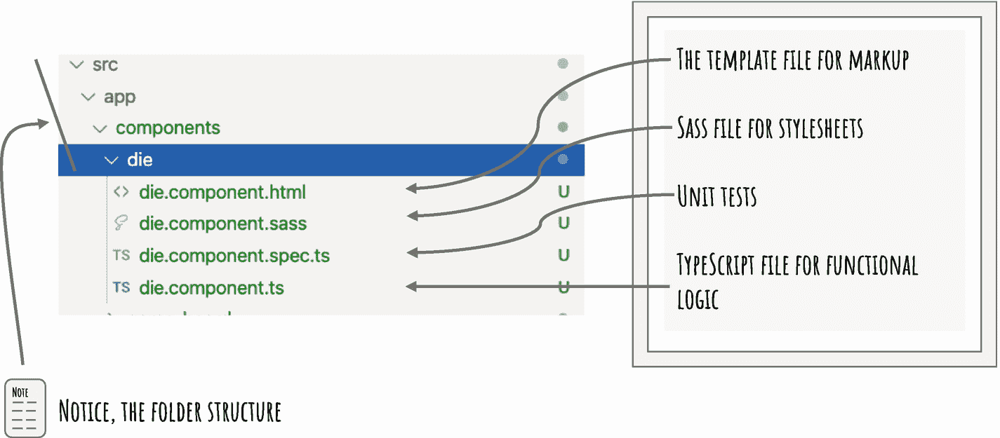
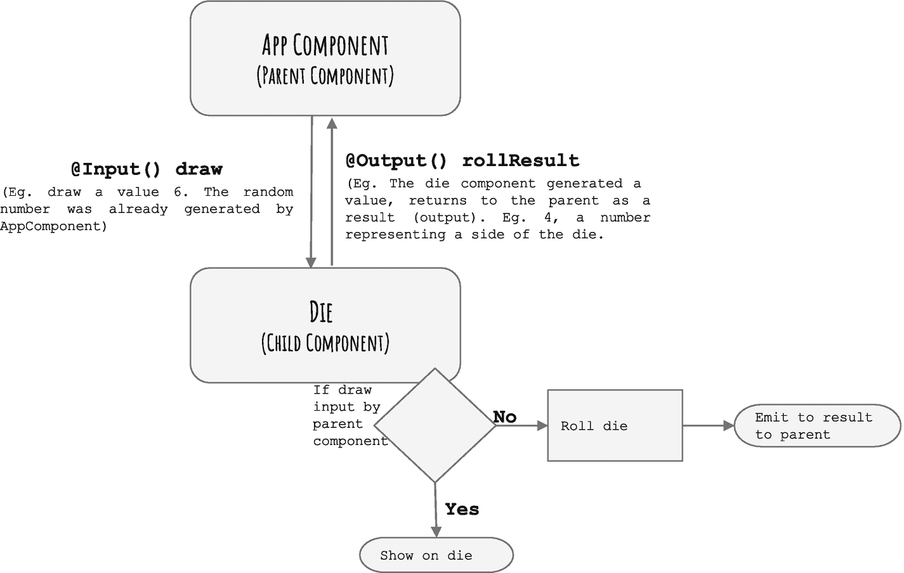
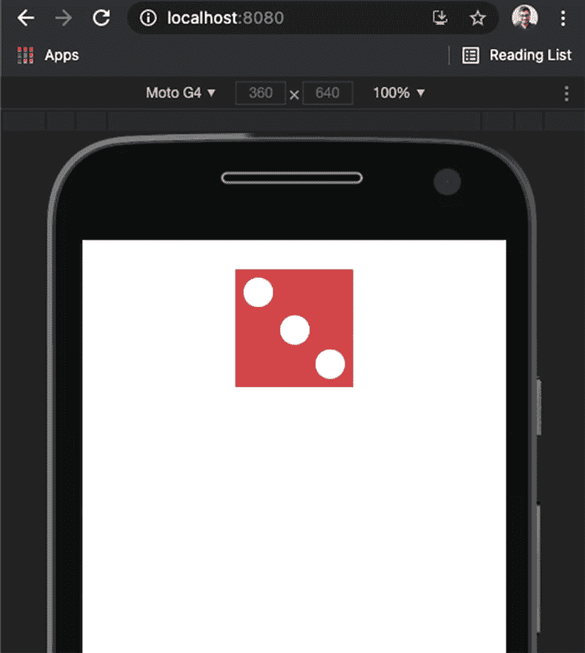
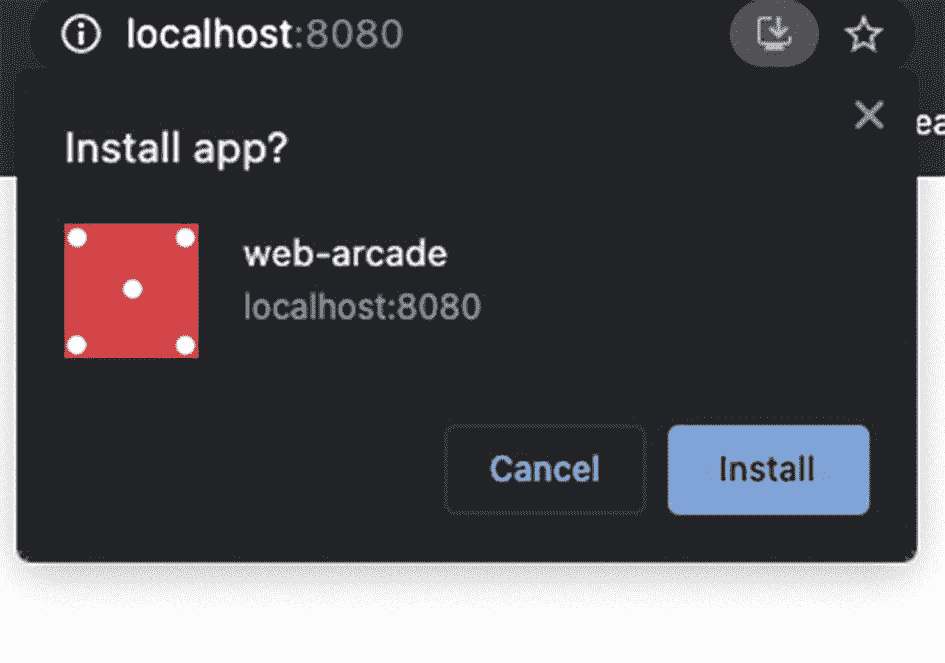
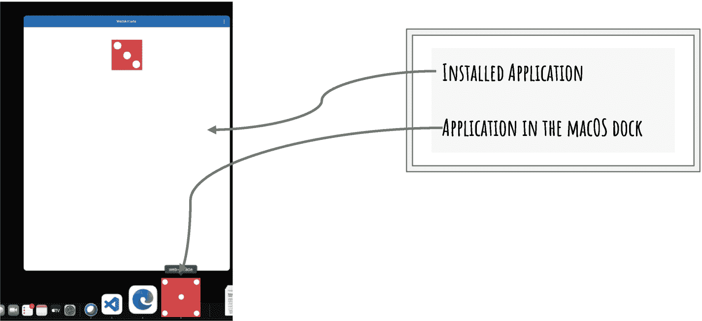

# 3.安装角度应用程序

本章首先提供在 Angular 应用程序中创建新屏幕和组件的说明。它提供关于组件的介绍性细节，然后提供足够的细节来构建一个离线角度应用程序。如果您正在寻找关于组件和角度概念的深入信息，请阅读《材料设计的角度》一书或参考本书末尾参考资料中提供的角度文档。在本章快结束时，您将把应用程序打包并安装到客户端设备(桌面或移动设备)上。

## 角度分量

web 应用程序是由许多网页组成的。在网页中，用户与之交互的视图，包括标签、文本字段、按钮等。，是用 HTML 构建的。文档对象模型(DOM)节点组成一个 HTML 页面。DOM 被组织成一棵树。HTML 页面从一个根节点开始，通常是一个`html`元素(`<html></html>`)。它有子节点，子节点有更多的子节点。

可以想象，所有的浏览器都知道这些 HTML 元素。它们有内置的实现来呈现 HTML 页面中的每个元素。比如浏览器遇到一个`input`元素(`<input />`)，就显示一个文本字段；浏览器将以粗体显示`strong`元素(`<strong>text</strong>`)中的文本。

然而，我们是否局限于 HTML 中预定义的元素？如果您想创建封装视图和行为的新元素，该怎么办？假设您想为 Web Arcade 构建一个骰子。

### 创建一个组件

角度组件使开发人员能够构建自定义元素。组件是角度应用程序的构建块。本节提供了如何创建新组件的说明。

正如您在第 [2](02.html) 章中看到的，您将使用 Angular CLI 来创建和管理 Angular 应用程序。当您在前一章中设置开发环境时，您已经安装了 Angular CLI，所以它应该可以使用了。

要创建新组件，请运行以下命令:

```ts
% ng generate component components/dice

```

正如您之前看到的，`ng`可执行文件运行 Angular CLI。

*   带 Angular CLI 的`generate`命令创建文件。

*   接下来，`component`集合在与`generate`一起使用时指定如何添加组件文件。

*   第三个参数指定组件名`dice`。在值前面加上`components/`会在文件夹`components`下创建它。如果文件夹不存在，它将创建该文件夹。

Note

或者，您可以使用下面的简短形式，使用`g`表示生成，使用`c`表示组件。

`% ng g c components/dice`

Angular CLI 在名为`src/app/components/dice`的新文件夹中生成以下文件。见图 [3-1](#Fig1) 。



图 3-1

使用 Angular CLI 生成的组件文件

*   `dice.component.html`:用于标记的 HTML 模板文件。要在网页中创建视图，可以使用 HTML。骰子的一面是用 HTML 模板创建的。

*   样式表文件包含组件外观的 SASS 样式。它包括颜色、文本装饰、边距等。

*   `dice.component.spec.ts`:一个用于单元测试的类型脚本文件。

*   `dice.component.ts`:用于`dice`组件的功能实现的类型脚本文件。

### 网络街机:创建一个骰子

本节详细介绍了`dice`组件的代码。这是对创建一个`dice`组件的固执己见的看法。请参考“练习”部分，了解关于构建骰子的其他想法。

### 组件的样式

样式表管理外观、颜色、字体等。，用于组件。样式可以应用于组件的元素。将样式表的范围限定在组件本地是一个很好的做法。这是角度应用程序中的默认行为。本节详细介绍了如何为`dice`组件创建样式表。

注意，在 Web Arcade 代码示例中，`src/assets`目录中有六个 PNG 文件，分别对应于骰子的每一面。在样式表中使用这些图像来显示骰子的侧面。首先在样式表中为每一方创建变量。考虑清单 [3-1](#PC2) 中的变量列表，这些变量带有指向骰子图像侧面的 URL 引用。冒号的左边(`:`)是变量名。冒号的右边是一个值，在本例中是骰子的 PNG 图像。使用`url()`功能将图像文件包含在 CSS 中。

```ts
// Variables in SASS
$side1:url('/assets/side1.png')
$side2:url('/assets/side2.png')
$side3:url('/assets/side3.png')
$side4:url('/assets/side4.png')
$side5:url('/assets/side5.png')
$side6:url('/assets/side6.png')

Listing 3-1Sides of the Die Images

```

接下来，为骰子的每一面创建 CSS 类，可用于`div`元素。参见清单 [3-2](#PC3) 。

```ts
div.img-1
  background-image: $side1

div.img-2
  background-image: $side2

div.img-3
  background-image: $side3

div.img-4
  background-image: $side4

div.img-5
  background-image: $side5

div.img-6
  background-image: $side6

Listing 3-2Code for the CSS Class That Defines Each Side of a Die

```

每个`img-x`类(例如`img-6`)都是一个 CSS 类。它的前缀是`div` *。在 HTML 中，CSS 类`img-6`只能应用在`div`元素上。*

Note

记住，SASS 文件不使用花括号或分号。注意元素和类名下 CSS 样式的缩进。也就是说，名为`$side6`的样式背景图像与`div.img-6`相关，因为它缩进了一个制表符，表明它与 CSS 类相关。

### TypeScript:组件的功能逻辑

每个组件至少有一个 TypeScript 文件和一个 TypeScript 类。组件的功能/行为逻辑写在这个类中。例如，考虑掷骰子并生成 1 到 6 之间的随机数的逻辑。这就是`dice`组件的功能/行为逻辑。本节介绍如何为`dice`组件创建 TypeScript 类。

### 组件的输出(事件发射器)

到目前为止，您已经看到该组件有一个样式表来显示骰子的六个面中的任何一面。当你掷骰子时，它会抽取六个数字中的一个。利用`dice`组件的代码可能需要掷骰子的结果。把这当成输出。用输出装饰器为输出创建一个`EventEmitter`对象。在这个对象上使用`emit()`函数来输出组件外部的值。继续阅读进一步的解释和代码示例。

### 组件的输入

该组件还可能允许从组件外部设置值。只要是合法值(1 到 6 之间的值)，组件就可以显示在骰子上。把这当成输入。创建一个类级变量，用`Input()`修饰它。这充当组件的属性。对于此属性，代码可以使用组件提供输入值。

考虑清单 [3-3](#PC4) 和图 [3-2](#Fig2) 中显示的类型脚本。注意用粗体突出显示的文本，第 7 行和第 8 行。`Input()`装饰器允许从组件外部设置变量值。`Output()`装饰器启用从组件发出的`rollResult`值。



图 3-2

骰子和应用程序组件之间的输入和输出

```ts
import { Component, Input, OnInit, Output, EventEmitter } from '@angular/core';
1\. @Component({
2\.  selector: 'wade-dice',
3\.  templateUrl: './dice.component.html',
4\.  styleUrls: ['./dice.component.sass']
5\. })
6\. export class DiceComponent implements OnInit {
7\.   @Input() draw: string = '';
8\.   @Output() rollResult = new EventEmitter<number>();
9\.   constructor() { }
10\.  ngOnInit(): void { }
11\. }

Listing 3-3Dice Component TypeScript File

```

还要注意清单 [3-3](#PC4) ，第 1 行到第 5 行。组件装饰器为组件指定元数据。

*   如前所述，组件是可重用的定制元素。在 HTML 文件中使用组件时，您将使用该值引用组件。在本例中，参见`<wade-dice></wade-dice>`。

    **注意** `wade-`是为 Web 归档代码样本中的所有组件选择的任意前缀。Angular 使用的默认是`app`。

*   `template-url`:指组件使用的 HTML 文件。见图 [3-1](#Fig1) 。它显示了为`dice`组件创建的 HTML 文件。

*   `style-urls`:指组件使用的样式表文件。可以有多个样式表。因此，它是一个值数组。见图 [3-1](#Fig1) 。它显示了为`dice`组件创建的 SASS 文件。

注意第 9 行中显示的构造函数。它实例化了 TypeScript 类。第 10 行中的函数`ngOnInit()`，是在构造函数之后调用的角度生命周期钩子。因此，当这个函数被调用时，类变量已经被实例化了。这是设置角度组件上下文的理想位置。

在当前的`dice`组件案例中，我们通过滚动骰子来设置上下文，生成 1 到 6 之间的随机数，并显示骰子的那一面。或者，`dice`组件也允许您从组件外部设置一个值。考虑上市 [3-4](#PC5) 。

```ts
01: @Input() draw: string = '';
02: @Output() rollResult = new EventEmitter<number>();
03:
04: constructor() { }
05:
06: ngOnInit(): void {
07:   if(this.draw){
08:     this.showOnDice(+this.draw);
09:   } else {
10:     this.rollDice();
11:   }
12: }

Listing 3-4ngOnInit() Hook for the Component

```

Note

TypeScript 类变量和方法(函数)是用`this`关键字访问的。

注意第 1 行和第 7 行。`this.draw`是组件的输入属性。如果向元件提供输入，则在骰子上显示该值。使用组件的角度代码明确提供了一个值。你不需要掷骰子来产生一个随机数。参见清单 [3-5](#PC6) 。

另一方面，当没有输入时，滚动骰子，产生一个随机数，并在骰子上显示该值。参见清单 [3-6](#PC7) 。

Note

注意清单 [3-4](#PC5) 第 8 行的`+`前缀。输入属性是一个字符串值。`+`前缀将字符串值转换为数字。

```ts
/*
     At class level, a variable selectedDiceSideCssClass is declared.

selectedDiceSideCssClass: string = '';
/*
01:  // show the given number (draw parameter) on the dice
02:   showOnDice(draw: number){
03:     // the css class img-x show appropriate side on the dice.
04:     switch (draw) {
05:       case 1: {
06:         this.selectedDiceSideCssClass = 'img-1';
07:         break;
08:       }
09:       case 2: {
10:         this.selectedDiceSideCssClass = 'img-2';
11:         break;
12:       }
13:       case 3: {
14:         this.selectedDiceSideCssClass = 'img-3';
15:         break;
16:       }
17:       case 4: {
18:         this.selectedDiceSideCssClass = 'img-4';
19:         break;
20:       }
21:       case 5: {
22:         this.selectedDiceSideCssClass = 'img-5';
23:         break;
24:       }
25:       case 6: {
26:         this.selectedDiceSideCssClass = 'img-6';
27:         break;
28:       }
29:       default: {
30:         break;
31:       }
32:     }
33:   }

Listing 3-5Show the Given Number on a Die

```

记住清单 [3-1](#PC2) 和 [3-2](#PC3) 中的样式表。他们定义了 CSS 类`img-1`到`img-6`，显示描述骰子六个面的图像。清单 [3-5](#PC6) 为一个名为`selectedDiceSideCssClass`的变量设置了一个合适的 CSS 类名。您将在 HTML 模板中使用这个 CSS 类。

要滚动骰子(无输入时)，使用功能`rollDice()`。

```ts
01: rollDice(){
02:     let i = 0;
03:
04:     // run the provided function 25 times depicting a rolloing dice
05:     const interval = setInterval(() => {
06:
07:       // random number generator for numbers between 1 and 6
08:       let randomDraw = Math.round((Math.random()*5) + 1);
09:       this.showOnDice(randomDraw);
10:
11:       // After 25, clear the interval so that the dice doesn't roll next time.
12:       if(i > 25) {
13:         clearInterval(interval);
14:         this.rollResult.emit(randomDraw);
15:       }
16:
17:       i += 1;
18:
19:     }, 100);
20: }

Listing 3-6Roll the Die

```

该函数试图模仿滚动骰子。因此，它在骰子上设置值 25 次(任意次数)。它每 100 毫秒运行一次代码。看到 5 和 19 之间的线。

*   一个 JavaScript 函数接受一个回调函数作为第一个参数。

*   第二个参数指示第一个回调函数运行之前的毫秒数。

为了更容易理解，请参见清单- [3-7](#PC8) 中的一小段空白代码。

```ts
setInterval(() => { }, // first parameter, callback
 100 // second parameter, interval duration in
     // milliseconds
);

Listing 3-7The setInterval() Function

```

要生成随机数，请参考清单 [3-6](#PC7) 中的第 8 行。

*   `Math.random()`生成一个介于 0 和 1 之间的值。

*   将这个数乘以 5 会将值限制在 0 到 5 之间。

*   骰子不显示小数值；因此，使用 JavaScript 函数`Math.round()`对数字进行四舍五入。

*   骰子不显示零；因此，加 1。

Note

什么时候用`rollResult`？想象一下，在棋盘游戏中，根据骰子抽出的数字移动一个棋子。棋盘游戏组件使用来自`dice`组件的随机数结果。`dice`组件发出棋盘游戏的号码。

在一个例子中，假设骰子抽取 6。一篇关于垄断的文章应该移动六个位置。`dice`组件显示 6 并发出数字。垄断组件接收 6，并将棋子移动 6 个位置。

请参考 TypeScript 类文件的完整代码段。参见清单 [3-8](#PC9) 。

```ts
import { Component, Input, OnInit, Output, EventEmitter } from '@angular/core';

@Component({
  selector: 'wade-dice',
  templateUrl: './dice.component.html',
  styleUrls: ['./dice.component.sass']
})
export class DiceComponent implements OnInit {

  @Input() draw: string = '';
  @Output() rollResult = new EventEmitter<number>();

  selectedDiceSideCssClass: string = '';

  constructor() { }

  ngOnInit(): void {
    if(this.draw){
      this.showOnDice(+this.draw);
    } else {
      this.rollDice();
    }
  }

  // show the given number (draw parameter) on the dice
  showOnDice(draw: number){
    // the css class img-x show appropriate side on the dice.
    switch (draw) {
      case 1: {
        this.selectedDiceSideCssClass = 'img-1';
        break;
      }
      case 2: {
        this.selectedDiceSideCssClass = 'img-2';
        break;
      }
      case 3: {
        this.selectedDiceSideCssClass = 'img-3';
        break;
      }
      case 4: {
        this.selectedDiceSideCssClass = 'img-4';
        break;
      }
      case 5: {
        this.selectedDiceSideCssClass = 'img-5';
        break;
      }
      case 6: {
        this.selectedDiceSideCssClass = 'img-6';
        break;
      }
      default: {
        break;
      }
    }
  }

// generate a random number between 1 and 6
// and set on the dice
  rollDice(){
    let i = 0;

// run the provided function 25 times depicting a rolling dice
    const interval = setInterval(() => {

      // random number generator for numbers between 1 and 6
      let randomDraw = Math.round((Math.random()*5) + 1);
      this.showOnDice(randomDraw);

      // After 25, clear the interval so that the dice doesn't roll next time.
      if(i > 25) {
        clearInterval(interval);
        this.rollResult.emit(randomDraw);
      }
      i += 1;
    }, 100);
  }
}

Listing 3-8Dice Component, TypeScript File

```

### HTML 模板

关于用户与之交互的视图，请参考清单 [3-9](#PC10) 中的 HTML 模板。

```ts
<div
  class="dice"
  [ngClass]="selectedDiceSideCssClass"
></div>

Listing 3-9Dice Component, HTML Template

```

注意 CSS 类值`dice`是静态的。它提供了在骰子滚动时不会动态改变的填充、高度和宽度。

另一方面，`ngClass`使用属性绑定来动态设置 CSS 类。这是一个角度属性指令。`ngClass`将通过变量`selectedDiceSideCssClass`提供的 CSS 类应用到`div`元素*上。*参见清单 [3-8](#PC9) 中的`showOnDice()`功能。它有条件地选择一个 CSS 类名。

Note

属性指令允许您更改 DOM 元素的外观和行为。`ngClass`是 Angular 提供的一个内置指令，用于动态更新 CSS 类。这对于动态控制元素的外观非常有用。

属性绑定在 HTML 属性上启用单向数据绑定类型脚本变量。

现在，`dice`组件已经可以使用了。转到`app.component.html`并删除导致第 [2](02.html) 章图 [2-3](02.html#Fig3) 的默认内容。它是用 Angular CLI 创建的应用程序的占位符。记住，`dice`组件的选择器是`wade-dice` *。*在 HTML 模板的 app 组件中使用。参见清单 [3-10](#PC11) 。

```ts
<div class="container align-center">
   <wade-dice></wade-dice>
</div>

Listing 3-10App Component of the HTML Template

```

Note

在这一点上，`div`和两个 CSS 类`container`和`align-center`没有太大的意义。它们有助于在页面上更好地呈现内容。

记住清单 [3-4](#PC5) 中的代码。如果您没有为`draw`属性(输入)提供一个值，`dice`组件会生成一个随机数。因此，清单 [3-10](#PC11) 掷骰子，生成一个随机数，并将其设置在骰子上。相反，如果你使用属性`draw`，它不会掷骰子。它只显示了骰子的第 4 面。

`<wade-dice draw="4"></wade-dice>`

结果如图 [3-3](#Fig3) 所示。



图 3-3

使用应用程序组件中的骰子组件

### 服务人员配置

接下来，您已经准备好安装应用程序了。完成后，我们可以回顾如何在桌面上安装应用程序。

在第 [2 章](02.html)中，当你安装`@angular/pwa`时，它创建了以下配置。`ng add @angular/pwa`命令添加了`@angular/service-worker`包。考虑应用程序的以下更新:

1.  该命令将`manifest.webmanifest`文件添加到应用程序中。当您在桌面或移动浏览器上加载应用程序时，它会在此配置文件的帮助下识别渐进式 web 应用程序。`ng add @angular/pwa`命令更新`index.html`并添加一个到这个配置文件的链接。

2.  该命令将`ngsw-config.json`文件添加到应用程序中。这是服务人员的角度特定配置文件。它由 CLI 和构建过程使用。它为应用程序配置缓存行为。

3.  在 Angular 的应用程序模块中，它导入服务工作者模块并注册它。

Note

加载 web 应用程序时，每次都会从 web 服务器获取`ngsw-config.json`文件。它不与服务工作者一起缓存。它有助于识别对应用程序的更改，并获取一个全新的版本。

### 创建图标

PWA 需要各种图标文件。请记住，它现在是一个可安装的应用程序。你需要不同分辨率的启动图标。这些图标用在移动设备主屏幕上的应用程序中，桌面上的快捷方式，Windows 任务栏或 macOS Dock 上，等等。默认图标是一个角形标志。您可以使用位于`web-arcade/src/assets/icons`的 Web Arcade 代码示例中的图标。

服务人员应用程序需要具有以下分辨率(像素)的图标:

*   72 × 72

*   96 × 96

*   128 × 128

*   144 × 144

*   152 × 152

*   192 × 192

*   384 × 384

*   512 × 512

将图标复制到文件夹`<your-project-folder>/src/assets/icons`。运行 build 命令。请注意，图标和应用程序包一起被复制到可部署目录中。确保 Http-Server 正在`dist/web-arcade`目录中运行，以便 URL`http://localhost:8080`继续为应用程序提供服务。

在支持服务人员的新浏览器窗口中启动应用程序。请注意，Web Arcade 应用程序有一个安装按钮。图 [3-4](#Fig4) 显示了桌面上 Google Chrome 的安装选项。



图 3-4

安装维修工人

Note

在新的浏览器窗口(或选项卡)中启动应用程序可确保旧版本的应用程序不会由服务人员缓存提供。相反，它在 web 服务器上识别更新的应用程序包，并下载新的应用程序。

单击安装。它现在可以在桌面上使用。见图 [3-5](#Fig5) 。



图 3-5

macOS 上安装的应用程序

## 摘要

本章继续构建 Web Arcade 示例应用程序。在这个过程中，本章详细介绍了 Angular 和 service worker 概念。它还为骰子开发了样式表，最后在桌面和移动设备上安装应用程序，并列出由包`@angular/pwa`添加的配置。

Exercise

*   本章中描述的代码示例没有显示重复掷骰子的按钮。给`dice`组件添加一个按钮，再次滚动。使用 click 事件来处理按需掷骰子。

*   用 CSS 创建骰子的侧面，而不是使用图像。

*   创建一个 8 面或 12 面的模具。

*   探索滚动骰子的动画。