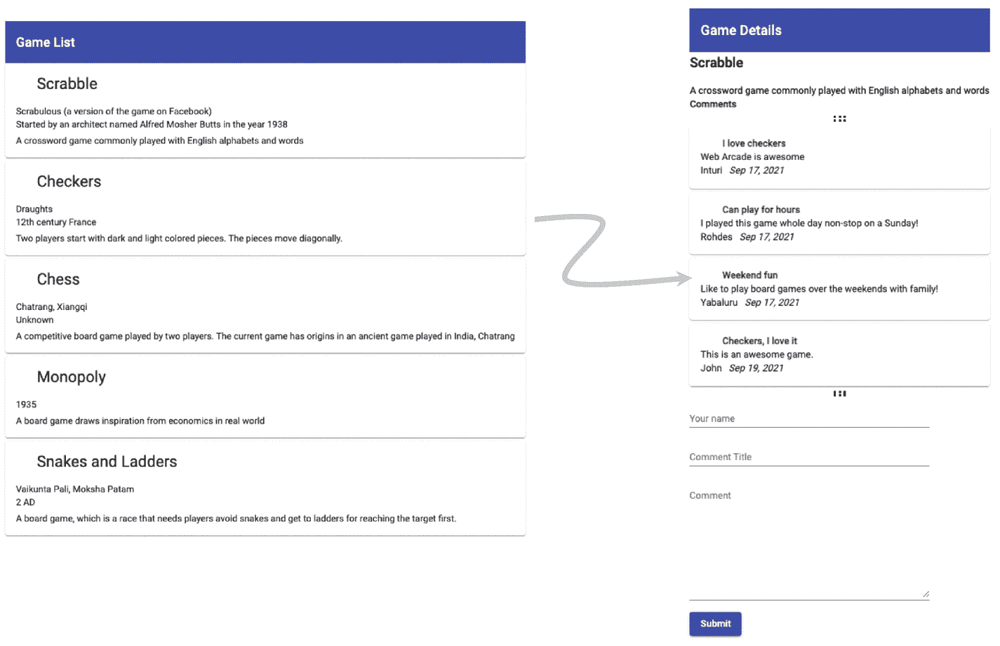
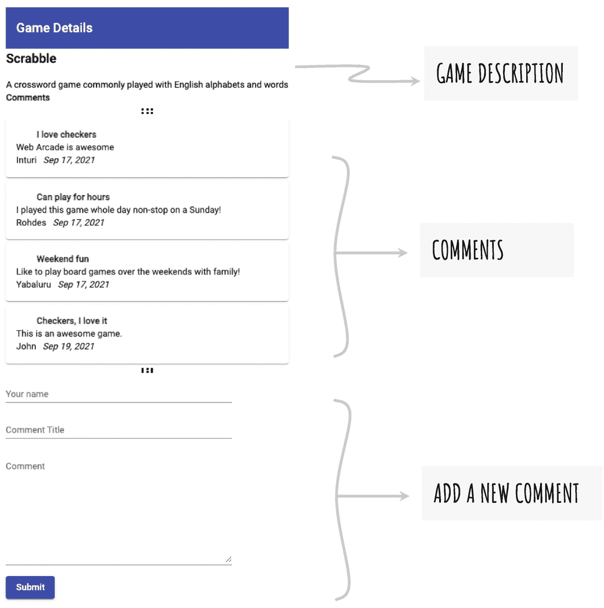
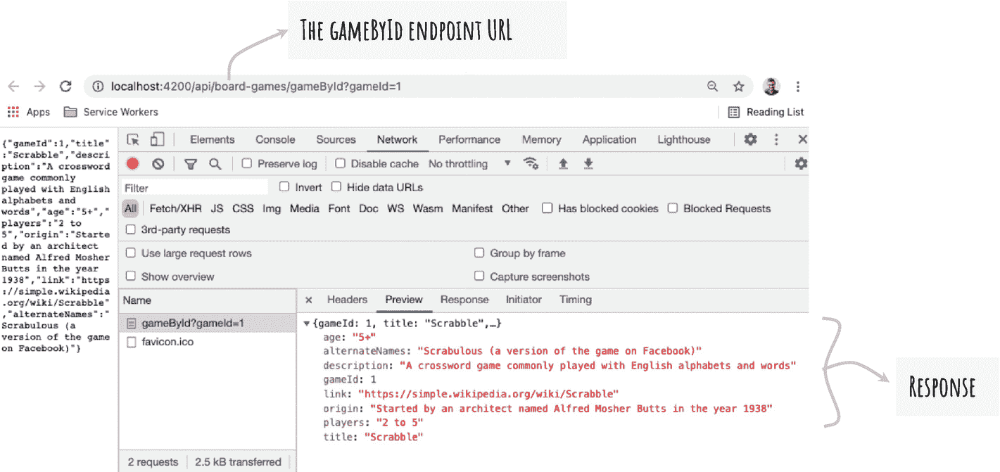
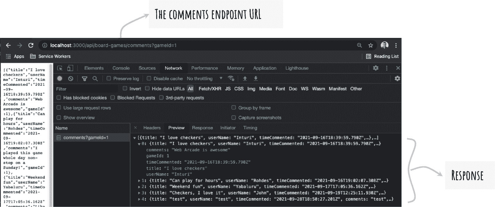
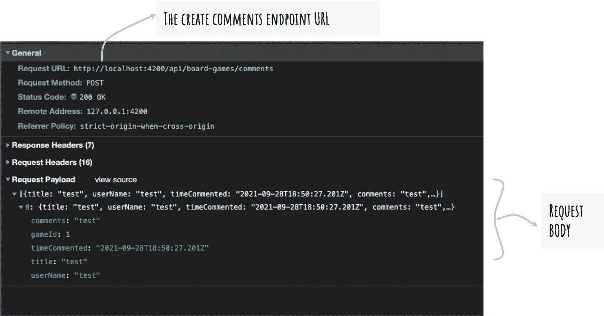

# 八、创建实体用例

在处理数据时，您从数据检索开始。您使用远程 HTTP 服务进行 GET 调用，并在 Angular 应用的屏幕上显示数据。您创建了缓存包括数据调用在内的资源的能力。随着您的进展，应用需要创建、更新和删除数据。在支持脱机功能的应用中，创建、更新和删除操作是复杂的。

本章建立了处理此类场景的用例。它详细描述了如何构建执行创建操作的Angular组件和服务。该示例可以很容易地升级为编辑和删除操作。前一章介绍了在浏览器中持久化数据的 IndexedDB。它通常用于管理缓存。本章描述的用例有助于充分利用 IndexedDB 实现。随着本书的深入，下一章将详细介绍如何使用 IndexedDB 执行离线操作，因此您需要理解我们将在本章构建的用例。

在 Web Arcade 中，创建、更新和删除操作在游戏详细信息页面上执行。页面将调用远程 HTTP 服务来保存数据。本章首先解释了前面提到的动作的 HTTP 方法。接下来，它详细介绍了如何创建组件。它为列表组件(显示棋盘游戏列表)和详细信息页面之间的导航引入了Angular路由。接下来，它详细描述了我们在开发用例时在游戏细节页面上构建的特性。最后，本章详细介绍了如何构建模拟服务器端服务来支持 Angular 应用。

## 网络街机:游戏详情页面

游戏详细信息页面显示所选游戏的详细信息。我们使用这个页面来展示一个如何将离线操作与远程 HTTP 服务同步的例子。

当调用远程 HTTP 服务时，HTTP 方法定义要执行的期望动作。考虑以下最常用的 HTTP 方法:

*   GET 检索数据。例如，它检索棋盘游戏列表。

*   POST 提交或创建实体。例如，它创建一个服务来创建一个棋盘游戏，或者在一个实现 POST 方法的游戏上添加用户评论。

*   放置替换或完全更新实体。例如，考虑一个棋盘游戏实体，该实体具有游戏 ID、游戏标题、游戏描述、具有关于游戏的综合细节的网络链接、起源等字段。对于给定的游戏 ID，使用 PUT 方法替换所有字段。即使一些字段没有改变，您也可以在使用 PUT 方法时再次提供相同的值。

*   PATCH 替换或更新实体上的一些字段。在前面的示例中，考虑只更新原点字段。开发一个带有补丁的 HTTP 服务来更新实体上的 origin 字段。

*   删除移除或删除实体。

Note

除了前面的 HTTP 方法，还有其他较少使用的 HTTP 方法，包括 HEAD、CONNECT、OPTIONS 和 TRACE。

到目前为止，提供离线访问来获取服务调用。本章使用 IndexedDB 来缓存和同步 POST 服务调用。您可以在其余的 HTTP 方法上使用类似的实现。

在前面的章节中，您创建了一个组件来显示游戏列表。在本章中，您将更新示例，以便通过单击选择游戏来导航到详细信息页面。见图 [8-1](#Fig1) 。



图 8-1

导航至游戏详情页面

游戏详细信息页面有游戏的描述和其他详细信息。它列出了所有用户的评论。它在底部提供了一个提交新评论的表单。参见图 [8-2](#Fig2) 。



图 8-2

游戏详细信息页面上的字段

### 离线场景

用户可以提交评论。在线时，该服务调用 HTTP 服务来发布新的评论。但是，如果脱机，请使用 IndexedDB 临时保存注释。重新上线后，将评论发布到远程服务。

### 为游戏细节创建组件

运行以下 Angular CLI 命令创建新组件:

```ts
ng g c game-details

```

在接下来的几节中，您将更新组件以显示游戏细节。但是，该游戏是在早期的游戏列表组件中选择的。游戏细节组件如何知道所选择的游戏？请记住，当用户从棋盘游戏列表中选择时，您将导航到游戏详细信息。列表组件在 URL 中提供选择的游戏 ID 作为`query param`。考虑以下带有游戏 ID 参数的 URL:

```ts
http://localhost:4200/details?gameId=1

```

### 选择途径

Angular routing 使 Angular 应用能够利用 URL(查看浏览器中的地址栏)并动态加载内容。您将组件映射到 URL 中的路径。该组件在用户导航到相应路径时加载。

请记住，当您使用 Angular CLI 为 Web Arcade 创建新应用时，路由已经设置好了。这包括一个用于配置自定义路径和 URL 的`AppRoutingModule`。更新路由配置，以在导航到详细信息页面时首先显示游戏列表组件和游戏详细信息组件(如前面提到的 URL 所示)。考虑`app-routing.module.ts`中的路由配置，如清单 [8-1](#PC3) 所示。

```ts
06: const routes: Routes = [{
07:   path: "home",
08:   component: BoardGamesComponent
09: }, {
10:   path: "details",
11:   component: GameDetailsComponent
12: }, {
13:   path: "",
14:   redirectTo: "/home",
15:   pathMatch: "full"
16: }];
17:
18: @NgModule({
19:   imports: [RouterModule.forRoot(routes)],
20:   exports: [RouterModule]
21: })
22: export class AppRoutingModule { }
23:

Listing 8-1Route Configuration

```

注意，棋盘游戏组件被配置为使用路径`/home`加载，游戏细节组件被配置为使用路径`/details`加载，例如`http://localhost:4200/home`和`http://localhost:4200/details`。

组件在 HTML 模板中的`router-outlet`处加载。记住，`AppComponent`是根组件。更新路由器出口，以便在用户导航到相应的 URL(路径)时加载前面提到的组件。请考虑以下简短片段:

```ts
1: <div class="container align-center">
2:     <router-outlet></router-outlet>
3: </div>

```

### 导航到游戏详情页面

接下来，更新列表组件(`BoardGamesComponent`)以导航到详细信息页面。编辑组件的 HTML 模板(`src/app/components/board-games/board-games.component.html`)。见清单 [8-2](#PC5) 。

```ts
01: <mat-toolbar color="primary">
02:     <mat-toolbar-row>Game List</mat-toolbar-row>
03: </mat-toolbar>
04: <div>
05:     <ng-container *ngFor="let game of (games | async)?.boardGames">
06:         <a (click)="gameSelected(game)">
07:             <mat-card>
08:                 <mat-card-header>
09:                     <h1>
10:                         {{game.title}}
11:                     </h1>
12:                 </mat-card-header>
13:                 <mat-card-content>
14:                     <span>{{game.alternateNames}}</span>
15:                     <div>{{game.origin}}</div>
16:                     <div>{{game.description}}</div>
17:                 </mat-card-content>
18:             </mat-card>
19:         </a>
20:     </ng-container>
21: </div>

Listing 8-2Board Games Component Template

```

考虑以下解释:

*   请参见第 6 行和第 19 行。每个游戏(卡片)都包含在一个超级链接元素`<a></a>`中。

*   注意，第 5 行使用`ngFor`指令遍历游戏列表。变量`game`代表迭代中的一个游戏。

*   在第 6 行，点击事件由`gameSelected()`函数处理。注意游戏变量是作为参数传入的。这是当前迭代中包含游戏数据的变量。

`gameSelected`函数(在游戏细节组件的 TypeScript 文件中定义)导航到游戏细节页面，如清单 [8-3](#PC6) 所示。

```ts
01:
02: export class BoardGamesComponent implements OnInit {
03:
04:   constructor(private router: Router) { }
05:
06:   gameSelected(game: BoardGamesEntity){
07:    this.router.navigate(['/details'], {queryParams: {gameId: game.gameId}})
08:   }
09:
10: }

Listing 8-3Navigate to the Details Page

```

考虑以下解释:

*   第 4 行注入了一个路由器服务实例。

*   第 7 行使用一个路由器实例导航到详细信息页面。

*   注意，提供了一个查询参数游戏 ID。游戏对象是从模板传入的。参见之前的清单 [8-2](#PC5) 。

*   在当前列表组件(`BoardGamesComponent`)中选择的`game-id`将用于游戏详情组件。它检索所选游戏的完整细节。

接下来，从游戏细节组件中的 URL 检索游戏 ID，如清单 [8-4](#PC7) 所示。

```ts
01: import { Component, OnInit } from '@angular/core';
02: import { ActivatedRoute } from '@angular/router';
03:
04: @Component({
05:   selector: 'wade-game-details',
06:   templateUrl: './game-details.component.html',
07:   styleUrls: ['./game-details.component.sass']
08: })
09: export class GameDetailsComponent implements OnInit {
10:   game: BoardGamesEntity;
      commentsObservable = new Observable<CommentsEntity[]>();
11:   constructor(private router: ActivatedRoute, private gamesSvc: GamesService) { }
12:
13:   ngOnInit(): void {
14:     this.router
15:       .queryParams
16:       .subscribe( r =>
17:         this.getGameById(r['gameId']));
18:   }
19:
20:   private getGameById(gameId: number){
21:     this.gamesSvc.getGameById(gameId).subscribe(
22:       (res: BoardGamesEntity) => {
23:         this.game = res;
24:         this.getComments(res?.gameId);
25:       });
26:   }
27: }

28:
29: private getComments(gameId: number){
30:     this.commentsObservable = this.gamesSvc.getComments(gameId);
31: }
32:

Listing 8-4Retrieve Game ID from Query Params

```

考虑以下解释:

*   该示例使用`ActivatedRoute`服务读取 URL 中的查询参数。

*   第 2 行从 Angular 的路由器模块导入了`ActivatedRoute`服务。接下来，第 11 行将服务注入到组件中。服务实例被命名为`router`。

*   参见第 13 行和第 18 行之间的`ngOnInit()`功能。该函数在构造函数之后和组件初始化期间被调用。

*   请参见第 14 行和第 17 行之间的代码。注意，代码使用了`router.queryParams`。`queryParams`是可观测的。订阅它以访问查询参数。

*   `queryParams`订阅的结果被命名为`r`。以结果字段的形式访问游戏 ID，`r['gameId']`。现在，你可以访问`BoardGamesComponent`提供的游戏 ID。

*   将游戏 ID 作为函数参数传递给私有函数`getGameById()`。第 20 到 27 行定义了这个函数。

*   `getGameById()`函数调用另一个同名函数`getGameById()`，该函数被定义为`GamesService`的一部分。它返回一个可观察对象，订阅它会从 HTTP 服务返回结果。远程 HTTP 服务通过`GameId`提供游戏详情。

*   在第 23 行中，您将来自 HTTP 服务的结果设置到组件上的一个游戏对象上，该对象在 HTML 模板中使用。

*   HTML 模板向用户显示游戏细节。

*   接下来，调用私有函数`getComments()`，该函数检索对给定棋盘游戏的评论。参见第 29 行到第 31 行。它调用`GameService`实例上的`getComments()`函数，该函数从远程 HTTP 服务获取数据。

*   将来自 HTTP 服务的结果设置到组件上的一个`commentsObservable`对象上，该对象在 HTML 模板中使用。HTML 模板显示了注释。

总之，清单 [8-4](#PC7) 检索游戏细节和注释，并将它们设置在一个类变量上。在第 23 行，类别字段`game`已经选择了游戏标题、描述等。接下来，在第 30 行，类字段`commentsObservable`有一个注释列表。这些是不同用户对所选游戏的评论。接下来，查看呈现游戏细节和评论的 HTML 模板代码。考虑上市 [8-5](#PC8) 。

```ts
01:
02: <!-- Toolbar to provide a title-->
03: <mat-toolbar [color]="toolbarColor">
04:     <h1>Game Details</h1>
05: </mat-toolbar>
06:
07:
08: <!-- This section shows game title and description-->
09: <div *ngIf="game">
10:     <h2>{{game.title}}</h2>
11:     <div>{{game.description}}</div>
12: </div>
13:
14:
15: <!-- Following section shows comments made by users -->
16: <div>
17:     <strong>
18:         Comments
19:     </strong>
20:     <hr />
21:     <mat-card *ngFor="let comment of commentsObservable | async">
22:         <mat-card-header>
23:             <strong>
24:                 {{comment.title}}
25:             </strong>
26:         </mat-card-header>
27:         <mat-card-content>
28:             <div>{{comment.comments}}</div>
29:             <div><span>{{comment.userName}}</span> <span class="date">{{comment.timeCommented | date}}</span></div>
30:         </mat-card-content>
31:     </mat-card>
32: </div>

Listing 8-5Game Details Component HTML Template

```

考虑以下解释:

*   第 10 行和第 11 行显示了游戏标题和描述。第 9 行检查游戏对象是否被定义(用一个`ngIf`指令)。这是为了避免在从服务获取游戏数据之前组件出错。可以想象，当组件第一次加载时，服务调用仍在进行中。游戏标题、描述和其他字段尚不可用。从服务中检索后，`ngIf`条件变为真，并显示数据。

*   见第 21 行。它遍历注释。第 24 行显示了注释标题。第 28 和 29 行显示了评论描述、用户名和评论时间戳。

*   参见清单 [8-4](#PC7) 。`commentsObservable`属于`Observable`类型。因此，清单 [8-5](#PC8) 中的第 27 行使用了`| async`。

*   请注意以下 HTML 样式决定:
    *   清单使用 Angular Material 的工具栏组件(`mat-toolbar`)来显示标题。请参见第 3 行到第 5 行。

    *   每条评论都显示在一张有角的材料卡片上。参见第 21 至 31 行的组件`mat-card`、`mat-card-header`和`mat-card-content`。

清单 [8-4](#PC7) 使用服务中的两个函数:`getGameById()`和`getComments().`可以想象，Angular service 函数调用远程 HTTP 服务来获取数据。

记住，我们开发了模拟服务来演示远程 HTTP 服务功能。你为棋盘游戏返回了模拟 JSON。对于前面的两个函数，`getGameById()`和`getComments()`，您将扩展 Node.js Express 服务。这将在本章后面的“模拟 HTTP 服务的更新”一节中介绍

Note

真实世界的服务与 Oracle、Microsoft SQL Server 或 MongoDB 等主流数据库集成，并在其中创建、检索和更新数据。这超出了本书的范围。为了确保代码示例的功能，我们创建了模拟服务。

然而，正如您在前面的代码示例中看到的，这些组件并不直接与远程 HTTP 服务集成。您使用一个Angular服务，它使用其他服务从组件中抽象出这个功能。组件纯粹关注应用的表示逻辑。

记住，您创建了一个名为`GamesService`的服务，用于封装检索游戏数据的代码。接下来，更新服务以包含之前的两个函数`getGamesById()`和`getComments()`，如清单 [8-6](#PC9) 所示。

```ts
01: @Injectable({
02:     providedIn: 'root'
03:   })
04:   export class GamesService {
05:
06:     constructor(private httpClient: HttpClient) { }
07:
08:     getGameById(gameId: number): Observable<BoardGamesEntity>{
09:       return this
10:         .httpClient
11:         .get<BoardGamesEntity>(environment.boardGamesByIdServiceUrl,{
12:           params: {gameId}
13:         });
14:     }
15:
16:     getComments(gameId: number): Observable<CommentsEntity[]>{
17:         return this
18:           .httpClient
19:           .get<CommentsEntity[]>(environment.commentsServiceUrl,{
20:             params: {gameId}
21:           });
22:       }
23:
24: }

Listing 8-6Game Service Invoking Remote HTTP Services

```

考虑以下解释:

*   第 6 行注入了`HttpClient`服务。它是 Angular 提供的一种开箱即用的服务，可以进行 HTTP 调用。

*   请参见第 10 行和第 18 行。这些函数使用`HttpClient`实例`httpClient.`来调用远程 HTTP 服务。

*   这两个函数都使用 GET HTTP 方法。第一个参数是端点 URL。

*   建议配置 URL(而不是在应用中对它们进行硬编码)。因此，URL 在环境文件中被更新。环境文件见清单 [8-7](#PC10) 。

*   注意，这两个函数都需要`gameId`作为参数。请参见第 8 行和第 16 行。

*   游戏作为查询参数传递给远程 HTTP 服务。请参见第 12 行和第 20 行。

*   请注意，`getGameById()`返回了一个类型为`BoardGamesEntity (Observable<BoardGamesEntity>)`的可观察对象。远程服务应该返回一个符合`BoardGamesEntity`中指定的接口契约的 JSON 响应。接口定义见清单 [8-8](#PC11) (a)。

*   `getComments()`返回一个`CommentsEntity` ( `Observable<CommentsEntity>`)类型的可观察值。由于从服务中检索到多个注释，所以它是一个数组。远程服务应该返回一个符合`CommentsEntity`中指定的接口契约的 JSON 响应。接口定义见清单 [8-8](#PC11) (b)。

*   远程服务调用返回一个可观察的，因为它们是异步的。浏览器一调用数据，服务就不会立即返回数据。代码不会等到结果返回。因此，一旦远程服务中的数据可用，就会调用订户回调函数。

```ts
1: export interface CommentsEntity {
2:     title: string;
3:     comments: string;
4:     timeCommented: string;
5:     gameId: number;
6:     userName:string;
7: }

Listing 8-8(b)TypeScript Interface CommentsEntity

```

```ts
01: export interface BoardGamesEntity {
02:     gameId: number;
03:     age: string;
04:     link: string;
05:     title: string;
06:     origin: string;
07:     players: string;
08:     description: string;
09:     alternateNames: string;
10: }

Listing 8-8(a)TypeScript Interface BoardGamesEntity

```

```ts
08: export const environment = {
09:   boardGameServiceUrl: `/api/board-games`,
10:   commentsServiceUrl: '/api/board-games/comments',
11:   boardGamesByIdServiceUrl: '/api/board-games/gameById',
12:   production: false,
13: };
14:

Listing 8-7Environment File with Additional Endpoints

```

Note

两个文件中需要 URL:`src/environments/environment.ts`和`src/environments/environment.prod.ts`。`environment.ts`文件用于开发构建(例如，`yarn start`)。`environment.prod.ts`文件用于生产构建(例如`yarn build`或`ng build`)。

### 添加注释

参见图 [8-2](#Fig2) 。请注意数据表单的最后一部分添加了注释。它使用户能够添加关于棋盘游戏的评论。到目前为止，您主要从事数据检索工作。这是一个创建实体的例子，即一个评论实体。如前所述，您使用 HTTP POST 方法在后端系统中创建一个实体。

考虑清单 [8-9](#PC13) ，它显示了 Add Comment HTML 模板。

```ts
01: <div>
02:     <mat-form-field>
03:         <mat-label>Your name</mat-label>
04:         <input matInput type="text" placeholder="Please provide your name" (change)="updateName($event)">
05:     </mat-form-field>
06: </div>
07:
08: <div>
09:     <mat-form-field>
10:         <mat-label>Comment Title</mat-label>
11:         <input matInput type="text" placeholder="Please provide a title for the comment" (change)="updateTitle($event)">
12:     </mat-form-field>
13: </div>
14:
15: <div>
16:     <mat-form-field>
17:         <mat-label>Comment</mat-label>
18:         <textarea name="comment" id="comment" placeholder="Write your comment here" (change)="updateComments($event)" matInput cols="30" rows="10"></textarea>
19:     </mat-form-field>
20: </div>
21:
22: <button mat-raised-button color="primary" (click)="submitComment()">Submit</button>

Listing 8-9Add Comment HTML Template

```

考虑以下解释:

*   注意第 1 行到第 20 行。他们为用户名、标题和评论详细信息创建表单字段。

*   该列表使用材料设计组件和指令。第 4、11 和 18 行分别对元素输入和文本区域使用`matInput`。这些角形材料元素需要材料设计输入模块。参见清单 [8-10](#PC14) ，第 1 行和第 8 行。

*   `mat-form-field`组件封装了表单字段和标签。组件`mat-label`显示了表单字段的标签。

*   第 4、11 和 18 行使用与函数`updateName()`、`updateTitle()`和`updateComments().`绑定的变更事件数据，清单 [8-11](#PC15) 将表单字段的值设置为组件中的一个变量。每当表单域发生更改(用户键入值)时，change 事件就会发生。

*   在清单 [8-9](#PC13) 中，注意第 22 行 HTML 模板中的点击事件数据绑定。当用户点击按钮时，TypeScript 函数`submitComments()`被调用。

```ts
01: import { MatInputModule } from '@angular/material/input';
02:
03: @NgModule({
04:   declarations: [
05:     AppComponent,
06:   ],
07:   imports: [
08:     MatInputModule,
09:     BrowserAnimationsModule
10:   ],
11:   bootstrap: [AppComponent]
12: })
13: export class AppModule { }
14:

Listing 8-10Import Angular Material Input Module

```

考虑为组件的类型脚本代码列出 [8-11](#PC15) 。它包括“注释”表单中的“更改事件处理程序”和“单击事件处理程序”。

```ts
01: import { Component, OnInit } from '@angular/core';
02: import { MatSnackBar } from '@angular/material/snack-bar';
03: import { GamesService } from 'src/app/common/games.service';
04:
05: @Component({
06:   selector: 'wade-game-details',
07:   templateUrl: './game-details.component.html',
08:   styleUrls: ['./game-details.component.sass']
09: })
10: export class GameDetailsComponent implements OnInit {
11:
12:   name: string = "";
13:   title: string = "";
14:   comments: string = "";
15:
16:   constructor( private gamesSvc: GamesService,
17:     private snackbar: MatSnackBar) { }
18:
19:   updateName(event: any){
20:     this.name = event.target.value;
21:   }
22:
23:   updateTitle(event: any){
24:     this.title = event.target.value;
25:   }
26:
27:   updateComments(event: any){
28:     this.comments = event.target.value;
29:   }
30:
31:   submitComment(){
32:       this
33:         .gamesSvc
34:         .addComments(this.title, this.name, this.comments, this.game.gameId)
35:         .subscribe( (res) => {
36:           this.snackbar.open('Add comment successful', 'Close');
37:         });
38:   }
39:
40: }

Listing 8-11Comments Form Handlers

```

考虑以下解释:

*   参见第 19 至 29 行的功能`updateName()`、`updateTitle()`和`updateComments()`。请记住，它们是在表单字段的变更事件中调用的。注意函数定义使用了`event.target.value`。事件的目标指向表单域(DOM 元素)。该值返回用户键入的数据。

*   这些值被设置为类变量`name`(用户名)、`title`(评论标题)和`comments`(评论描述)。

*   提交按钮的点击事件是绑定到`submitComment()`函数的数据。请参见第 32 至 38 行。注意，它调用了服务`GameService`实例(`gameSvc`)上的`addComments()`函数。在第 16 行，`GameService`被注入到组件中使用。

*   注意，服务函数需要一个参数列表，包括用户名、标题和描述。先前捕获的值(使用 change 事件处理程序)被传递到服务函数中。

*   `addComments()`调用服务器端 HTTP 服务。如果添加注释动作成功，将调用可观察对象的成功回调。它显示一条成功消息，提供关于添加评论操作的反馈。

清单 [8-12](#PC16) 显示了`GameService`的实现。清单主要关注`addComments()`动作。

```ts
01: import { Injectable } from '@angular/core';
02: import { HttpClient } from '@angular/common/http';
03: import { environment } from 'src/environments/environment';
04:
05:
06: @Injectable({
07:   providedIn: 'root'
08: })
09: export class GamesService {
10:
11:   constructor(private httpClient: HttpClient) { }
12:
13:   addComments(title: string, userName: string, comments: string, gameId: number, timeCommented = new Date()){
14:     return this
15:       .httpClient
16:       .post(environment.commentsServiceUrl, [{
17:         title,
18:         userName,
19:         timeCommented,
20:         comments,
21:         gameId
22:       }]);
23:   }
24: }

Listing 8-12GameService Implementation

```

考虑以下解释:

*   第 11 行注入了`HttpClient`服务。这是 Angular 提供的现成服务，用于进行 HTTP 调用。

*   在第 14 行和第 22 行，函数使用了名为`httpClient.`的`HttpClient`实例，这调用了远程 HTTP 服务。

*   在第 16 行，注意您正在进行一个 HTTP POST 调用。第一个参数是服务 URL。考虑到 URL 是一个配置工件，它在环境文件中被更新。

*   第二个参数是 POST 方法的请求体。参见图 [8-5](#Fig5) 了解这些值如何在网络上转换为请求体。

Note

一个评论 URL 用于两个操作，检索和创建评论。RESTful 服务使用 HTTP 方法 GET 进行检索。对于创建操作，POST HTTP 方法使用相同的 URL。

## 模拟 HTTP 服务的更新

新组件需要来自远程 HTTP 服务的附加数据和特性。本节详细介绍了对模拟服务的更改。在实际应用中，这些服务和功能是通过查询和更新数据库来开发的。由于这超出了本书的范围，我们将开发模拟服务。

### 按 ID 过滤游戏详情

游戏细节组件一次需要一个游戏细节。请记住，在前面的章节中，您开发了一个返回所有棋盘游戏的服务。本节详细介绍了如何通过 ID 检索游戏数据。

记住，我们使用`mock-data/board-games.js`来表示所有棋盘游戏相关的端点。添加一个新的端点，它通过 ID 检索游戏。命名为`/gameById`，如清单 [8-13](#PC17) 所示。

```ts
1: var express = require('express');
2: var router = express.Router();
3: var dataset = require('../data/board-games.json');
4:
5: router.get('/gameById', function(req, res, next){
6:     res.setHeader('Content-Type', 'application/json');
7:     res.send(dataset
          .boardGames
          .find( i => +i.gameId === +req.query.gameId));
8: });

Listing 8-13Filter Game by an ID

```

考虑以下解释:



图 8-3

通过 ID 过滤游戏

*   第 7 行通过游戏 ID 过滤棋盘游戏。语句`dataset .boardGames.find( i => +i.gameId === +req.query.gameId)`返回给定 ID 的游戏细节。通常，我们期望一个游戏有一个 ID。在另一个不同的场景中，如果您预期不止一个结果，请使用`filter()`函数而不是`find()`。

*   来自`find()`函数的结果作为参数传递给响应对象上的`send()`函数(变量名`res`)。这将结果返回给客户端(浏览器)。见图 [8-3](#Fig3) 。
    *   见第 3 行。模拟服务从数据目录中的模拟 JSON 对象检索棋盘游戏列表。

    *   见第 5 行。这个过滤器端点的 HTTP 方法是 GET。

    *   见第 6 行。响应内容类型设置为 JSON，这是 Angular 服务和组件的现成格式。

Note

注意第 7 行的+号。这是 JavaScript 中一种将字符串大小写转换为数字的方法。

### 正在检索注释

游戏详情页面列出评论，如图 [8-2](#Fig2) 所示。注意游戏描述下面的评论列表。本节详细介绍了如何创建一个模拟服务器端服务来检索注释。

该服务返回对给定游戏的评论。它使用游戏 ID 的查询参数。考虑一个示例 URL，`http://localhost:3000/api/board-games/comments?gameId=1`。见图 [8-4](#Fig4) 。



图 8-4

注释端点

真实世界的服务与数据库相集成，以有效地存储和查询数据。如前所述，它是一个模拟服务。因此，它从文件中读取注释。考虑在`mock_sevices/routes/board-games.js`中列出 [8-14](#PC18) 。`board-games.js`文件是合适的，因为它包含了所有与棋盘游戏相关的端点。评论在一个棋盘游戏上。

```ts
01: var fs = require('fs');
02: var express = require('express');
03: var router = express.Router();
04:
05: router.get('/comments', function(req, res){
06:     fs.readFile("data/comments.json", {encoding: 'utf-8'},  function(err, data){
07:         let comments = [];
08:         if(err){
09:             return console.log("error reading from the file", err);
10:         }
11:         res.setHeader('Content-Type', 'application/json');
12:         comments = JSON.parse(data);
13:         comments = Object.values(comments).filter( i => {
14:
15:             return +i.gameId === +req.query.gameId
16:         });
17:         res.send(comments);
18:     });
19: });

Listing 8-14An Endpoint to Retrieve Comments

```

考虑以下解释:

*   第 5 行创建了一个端点，它响应一个 HTTP 方法 GET。快速路由器实例上的`get()`功能使您能够创建端点。

*   第 6 行从磁盘上的一个文件中检索当前的注释列表，`data/comments.json`。

*   `fs`模块上的`readFile()`功能(用于“文件系统”)是异步的。您提供了一个回调函数，当 API 成功读取一个文件或错误时调用该函数。在清单 [8-14](#PC18) 中，注意第 6 行和第 18 行之间的回调函数。

*   第一个参数`err`表示错误，第二个参数`data`包含文件的内容。请参见第 8 行到第 10 行。如果返回一个错误，它将被记录下来，并将控制返回到函数之外。

*   假设读取文件时没有错误，文件内容包括属于系统中所有游戏的完整评论列表。该服务预计只返回给定游戏的评论。因此，你通过游戏 ID 过滤评论。参见第 13 到 16 行的代码，它创建了一个过滤器。在 JavaScript 数组对象上定义了`filter()`函数。第 15 行的谓词测试数组中的每一项。返回带有给定游戏 ID 的评论。

*   参见第 17 行，该行用过滤后的注释响应客户机(例如，浏览器)。

### 添加注释

游戏详情页面允许用户评论，如图 [8-2](#Fig2) 所示。该表单包含用户名、标题和详细评论字段。本节详细介绍了如何创建一个模拟服务器端服务来保存注释。

添加注释是通过创建操作完成的。您正在创建一个新的注释实体。请记住，POST 方法适用于创建实体。POST 方法有一个请求体，其中包含一个由 Angular 应用创建的注释列表(由用户键入)。参见图 [8-5](#Fig5) 。



图 8-5

创建注释端点

考虑在`mock_sevices/routes/board-games.js`中列出 [8-15](#PC19) 。`board-games.js`文件是合适的，因为它包含了所有与棋盘游戏相关的端点。用户在评论桌游。

```ts
01: var fs = require('fs');
02: var express = require('express');
03: var router = express.Router();
04:
05: router.post('/comments', function(req, res){
06:     let commentsData = [];
07:     try{
08:         fs.readFile("data/comments.json", {encoding: 'utf-8'},  function(err, data){
09:             if(err){
10:                 return console.log("error reading from the file", err);
11:             }
12:             commentsData = commentsData.concat(JSON.parse(data));
13:             commentsData = commentsData.concat(req.body);
14:
15:             fs.writeFile("data/comments.json", JSON.stringify(commentsData), function(err){
16:                 if(err){
17:                     return console.log("error writing to file", err);
18:                 }
19:                 console.log("file saved");
20:             });
21:         });
22:         res.send({
23:             status: 'success'
24:         });
25:     }catch(err){
26:         console.log('err2', err);
27:         res.sendStatus(200);
28:     }
29: });

Listing 8-15A POST Endpoint to Create Comments

```

考虑以下解释:

*   第 5 行创建了一个端点，它响应 HTTP POST 方法。快速路由器实例上的`post()`功能使您能够创建端点。

*   端点需要将新的注释附加到当前的注释列表。文件`data/comments.json`有一个当前注释列表的数组。

*   `fs`模块上的`readFile()`功能是异步的。您提供了一个回调函数，当 API 成功读取一个文件或错误时调用该函数。在清单 [8-15](#PC19) 中，注意第 8 到 21 行的回调函数。

*   第一个参数`err`表示错误，第二个参数`data`包含文件内容。请参见第 9 行到第 11 行。如果返回一个错误，它将被记录下来，并将控制返回到函数之外。

*   假设读取文件没有错误，第 12 行将文件中的注释添加到一个名为`commentsData`的局部变量中。

*   接下来，第 13 行将请求对象上的新注释列表连接到`commentsData`变量。如前所述，POST 方法有一个请求体。它包括一个由 Angular 应用提供的注释列表。

*   注释的综合列表被写回到文件中。参见第 15 行，它将整个注释列表写入文件。

## 摘要

本章基于 Web Arcade 使用案例。这对理解我们将在下一章构建的离线函数至关重要。到目前为止，在处理数据时，您执行了数据检索和缓存。本章为创建、更新和删除场景建立了一个用例。

Exercise

*   游戏详情页面只显示一个棋盘游戏的标题和描述。然而，模拟服务和 TypeScript 接口包括许多附加字段，包括来源、别名、推荐的玩家数量等。包括游戏详细信息页面上的附加字段。

*   如果操作成功，添加注释功能会显示一条 Snackbar 组件消息(参见清单 [8-11](#PC15) ，第 36 行)。该示例不显示错误消息。更新代码示例以显示 Snackbar 组件错误警报。

*   在游戏详细信息页面上实现一个后退按钮，以导航回列表屏幕。