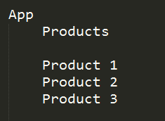
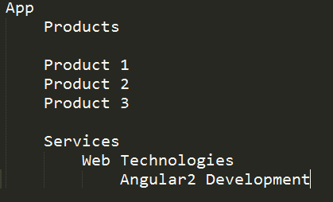
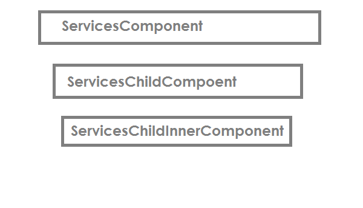
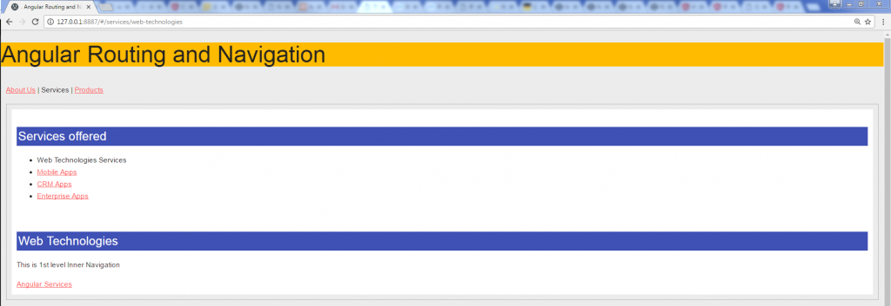

# 五、实现Angular路由和导航


应用导航是任何网站或应用的核心功能之一。除了定义路线或路径外，导航还可以帮助用户访问应用页面、探索功能，对于 SEO 目的也非常有用。

在本章中，您将了解有关Angular路由和导航的所有信息。下面是我们将在路由和导航中学习和实现的功能的详细列表。

您将了解路由和导航的以下方面：

*   导入和配置路由器
*   启用视图中的路由器出口`routerLink`、`routerLinkActive`和`base href`
*   自定义元件管线和子管线
*   具有内部子路由的自定义组件路由--相同的页面加载
*   演示应用路由和导航

在本章末尾，我们将能够做以下事情：

*   为应用创建`app.routes`并设置所需的模块
*   实施并启用`RouterModule.forRoot`
*   定义路由器出口和绑定路由路径的[T0]指令
*   启用`RouterLinkActivated`查找当前激活状态
*   了解路由状态是如何工作的
*   了解并实施路由生命周期挂钩
*   创建自定义构件管线和子管线
*   为我们的 web 应用实施位置策略
*   创建应用路由和导航示例

第一件事首先，看看我们将作为本章的一部分开发的演示应用路由和导航：


作为演示应用的一部分，我们将开发关于我们、服务和产品组件的路线。

服务组件将具有内部子路由。产品组件将利用`ActivatedRoute`获取路径`params`。我们还将使用 JavaScript 事件`onclick`实现导航。


# 导入和配置路由器


为了定义和实施导航策略，我们将使用路由器和`RouterModule`。

我们需要更新我们的`app.module.ts`文件以执行以下操作：

*   从角路由器模块导入`RouterModule`和路由
*   导入应用组件
*   使用路径和组件详细信息定义管线
*   进口`RouterModule.forRoot`（`appRoutes`）

每个管线定义可以具有以下键：

*   `path`：我们希望在浏览器地址栏中显示的 URL。
*   `component`：保存视图和应用逻辑的对应组件。
*   `redirectTo`（可选）：这表示我们希望用户从此路径重定向的 URL。
*   `pathMatch`（可选）：重定向路由需要`pathMatch`——它告诉路由器如何将 URL 与路由路径匹配。`pathMatch`可取值为`full`或`prefix`。

现在我们将在`NgModule`中导入并配置路由器。请看更新后的`app.module.ts`文件，其中包含路由器的完整实现：

```ts
import { NgModule } from '@angular/core';
import { BrowserModule } from '@angular/platform-browser';
import { FormsModule } from '@angular/forms';
import { RouterModule, Routes } from '@angular/router';

import { AppComponent } from './app.component';
import { AboutComponent} from './about.component';
import { ServicesComponent} from './services.component';
import { ProductsComponent } from './products.component';

const appRoutes: Routes = [
 { path: 'about', component: AboutComponent },
 { path: 'services', component: ServicesComponent }, 
 { path: 'products', redirectTo:'/new-products', pathMatch:'full'},
 { path: '**', component: ErrorPageNotFoundComponent }
];

@NgModule({
 imports: [
 BrowserModule,
 FormsModule,
 RouterModule.forRoot(appRoutes)
 ],
 declarations: [
  AppComponent,
  AboutComponent,
  ServicesComponent,
  ProductsComponent,
 ],
 bootstrap: [ AppComponent ]
})
export class AppModule { }

```

让我们分析前面的代码片段：

1.  我们从`@angular/router`进口`Routes`和`routerModule`。
2.  我们正在从各自的Angular库导入所需的模块`NgModule`、`BrowserModule`和`FormsModule`。
3.  我们正在导入自定义组件--`About`、`Services`和`Products`。
4.  我们正在定义一个常量`appRoutes`，在该常量中我们为组件指定路径。
5.  我们正在通过`appRoutes`创建路由，并通过传递各种参数为各种 URL 路由器链接定义自定义路径。

现在，我们已经了解了如何导入和配置我们的`NgModule`以实现路由，在下一节中，我们将了解路由器的构建块。


# 路由器的构造块


在本节中，您将学习路由器的重要组成部分。重要的构建块是`base href`、`Router Outlet`、`routerLink`和`routerLinkActive`。

现在让我们分析路由器库的每个构建块：

*   `base href`：我们必须在`index.html`页面中设置`base`指令。*这是一个强制性步骤。*如果没有`base`标签，当*深入链接*到应用时，浏览器可能无法加载资源（图像、CSS 和脚本）。

    在我们的申请中，我们需要在我们的`index.html`文件中定义`<head>`标签内的`base href`：

```ts
<base href="/“>

```

*   **定义**`router-outlet`：`router-outlet`指令是包含视图加载数据的占位符。在`router-outlet`指令内，将加载并显示组件视图。
    将指令放置在`app.component.html`中的模板内，以呈现数据：

```ts
<router-outlet></router-outlet> 

```

*   **使用多个**`router-outlet`：在某些情况下，我们希望将数据加载到不同的视图容器，而不是我们的`router-outlet`。我们可以很容易地将多个路由器出口添加到一个页面中，并为它们指定名称，以便我们可以呈现其中的相应数据：

```ts
<router-outlet></router-outlet>
<router-outlet name="content-farm"></router-outlet>

```

要加载名为`router-outlet`的视图中的数据，我们在定义路由的同时定义密钥：

```ts
 {
   path: 'content', component: ContentFarmComponent, 
   outlet: 'content- farm'
 }

```

*   **创建**`RouterLink`：表示可以直接从浏览器地址栏到达的 URL 或链接地址。将链接路径与锚定标记绑定并关联：例如，`/about`或`/products`。

绑定和关联锚定标记的一般语法如下：

```ts
<a [routerLink]="['/about']">About Us</a>
<a [routerLink]="['/products']">Products</a>
<a [routerLink]="['/services']">Services</a>

```

*   `RouterLinkActive`**对于活动状态链路**：`routerLinkActive`用于突出显示当前活动链路。使用`routerLinkActive`，我们可以轻松突出显示当前处于活动状态的链接，以更好地适应我们的应用外观：

```ts
<a [routerLink]="['/about']" routerLinkActive = 
       “active-state">About Us</a>

```

在样式表中，添加我们的自定义样式类`active-state`。

*   **构建动态**`routerLink`：我们可以通过`routerLink`指令绑定动态值或参数来传递自定义数据。
    一般来说，在大多数应用中，我们使用唯一标识符对数据进行分类——例如，`http://hostname/product/10`将编写如下：

```ts
<a [routerLink]="['/product', 10]">Product 10</a>

```

可以在我们的模板视图中动态呈现前面相同的代码：

```ts
<a [routerLink]="['/product', product.id]">Product 10</a>

```

*   **通过**`routerLink`**指令**传递数组和数据集：我们可以通过`routerLink`传递数据数组：

```ts
 <a [routerLink]="['/contacts', { customerId: 10 }]">Crisis 
    Center</a>

```


# 关于路由器定位策略


我们需要定义应用的 URL 行为。根据应用首选项，我们可以自定义 URL 的呈现方式。

使用`LocationStrategy`，我们可以定义我们希望应用路由系统的行为方式。

Angular 通过`LocationStrategy`提供了两种我们可以在应用中实现的路由策略。让我们了解在Angular应用中可以使用的不同路线策略选项：

*   `PathLocationStrategy`: This is the default HTML style routing mechanism.

    应用`PathLocationStrategy`是常见的路由策略，涉及在检测到的每个更改时向服务器端发出请求/调用。实现这一策略将允许我们创建干净的 URL，并且可以轻松地为 URL 添加书签。

    An example of a route using `PathLocationStrategy` is given as follows:

```ts
http://hostname/about

```

*   `HashLocationStrategy`*这是散列 URL 样式。在大多数现代 web 应用中，我们看到正在使用哈希 URL。这有一个很大的优势。
    当`#`后的信息发生变化时，客户端不进行服务器调用或请求；因此，服务器调用更少：*

```ts
http://hostname/#/about

```

*   在我们的应用中定义并设置`LocationStrategy`：在`providers`下的`app.module.ts`文件中，我们需要传递`LocationStrategy`并告诉路由器到`useClass`的路径为`HashLocationStrategy`。

在`app.module.ts`中，导入并使用`LocationStrategy`并提到我们想要使用`HashLocationStategy`，如下代码所示：

```ts
@NgModule({
  imports: [
  BrowserModule,
  routing
 ],
 declarations: [
  AppComponent
 ],
 bootstrap: [
  AppComponent
 ],
 providers: [
  {provide: LocationStrategy, useClass: HashLocationStrategy }
 ]
})
export class AppModule { }

```

在前面的代码中，我们已经在我们的提供者中注入了`LocationStrategy`，并且我们明确提到要使用`HashLocationStrategy`。

默认情况下，Angular路由器执行`PathLocationStrategy`。


# 处理错误状态-通配符路由


我们需要为找不到页面或 404 页面设置错误消息。我们可以使用`ErrorPageNotFoundComponent`组件显示未找到的页面或路由器未知路径的错误消息：

```ts
const appRoutes: Routes = [
 { path: 'about', component: AboutComponent },
 { path: 'services', component: ServicesComponent }, 
 { path: 'old-products', redirectTo:'/new-products', pathMatch:'full'},
 { path: '**', component: ErrorPageNotFoundComponent },
 { path: 'content', component: ContentFarmComponent, outlet: 'content-
    farm' }
];

```

在这个阶段，有了关于如何使用路由器的各个方面的所有信息，让我们将它们全部添加到我们的`app.component.ts`文件中：

```ts
import { Component, ViewEncapsulation } from '@angular/core';

@Component({
 selector: 'my-app',
 template: `
 <h2>Angular2 Routing and Navigation</h2>
 <div class="">
 <p>
   <a routerLink="/about" routerLinkActive="active"> About Us</a> |
   <a routerLink="/services" routerLinkActive="active" > Services</a> |
   <a routerLink="/products" routerLinkActive="active"> Products</a>
 </p>
 <div class="app-data">
  <router-outlet></router-outlet>
 </div> 
 </div>`,
  styles: [`
    h4 { background-color:rgb(63,81,181);color:#fff; padding:3px;}
    h2 { background-color:rgb(255, 187, 0);color:#222}
    div {padding: 10px;}
    .app-data {border: 1px solid #b3b3b3;}
    .active {color:#222;text-decoration:none;}
    `
   ],
 encapsulation: ViewEncapsulation.None
})
export class AppComponent {
}

```

让我们分析前面的代码，并将其分解为关键功能：

*   我们定义了`routerLink`属性，以便在用户单击锚链接时启用导航
*   我们实现了`routerLinkActive`属性来突出显示当前/活动链接，即用户单击的链接
*   我们为`<router-outlet>`定义了一个占位符，它将保存来自不同视图的数据——这取决于单击的链接

现在，当我们启动应用时，我们将看到结果输出，如下所示：


太棒了！到目前为止，一切顺利。现在让我们添加路由器防护功能。

在下一节中，我们将学习如何集成路线卫士以实现不同组件之间的受控导航。


# 路障


路线卫士允许您控制路线导航的各个阶段。在从一个组件导航到另一个组件时，我们需要确保将显示的数据已授权给用户，如果未授权，则取消导航。

路由器守卫可以返回一个`Observable<boolean>`或`Promise<boolean>`，路由器将等待 Observable 解析为 true 或 false：

*   如果 Route Guard 返回 true，它将继续导航并显示视图
*   如果 Route Guard 返回 false，它将中止/取消导航

我们可以单独使用或组合使用各种路线防护装置。详情如下:

*   `canActivate`
*   `canActivateChild`
*   `canDeactivate`
*   `Resolve`
*   `canLoad`

guard 函数可以接受参数以做出更好的决策。我们可以传递的参数如下：

*   `component`：我们创建的自定义组件指令：例如，`Products`、`Services`等等。
*   `route`：`ActivatedRouteSnapshot`是未来的路线，如果警卫通过，该路线将被激活。
*   `state`：`RouterStateSnapshot`是守卫通过时的未来路由状态。
*   `canActivate`：这保护了组件——可以将其视为一个消毒功能，其工作类似于著名酒吧外的保镖。确保在激活路线之前满足所有必要的标准。
    我们需要从路由器导入`canActivate`模块，调用组件类中的函数。

以下是一个通用健全服务`check-credentials.ts`文件的代码片段：

```ts
import { Injectable } from '@angular/core';
import { CanActivate } from '@angular/router';

@Injectable()
export class checkCredentials implements CanActivate {
  canActivate() {
   console.log('checking on user credential - user logged in: Passed');
   return true;
 }
}

```

If you want to redirect users without any validations or business rules, use the navigate function instead of `canActivate`.

*   `canActivateChild`：这将保护子组件*--*还记得上一节，我们创建了组件路由和子路由吗？是的，现在我们要确保我们也保护他们。
*   `canActivateChild`功能与`canActivate`类似，关键区别在于该功能保护组件的子路由。

以下是在服务中使用`canActivateChild`函数的示例代码：

```ts
import {CanActivateChild} from "@angular/router";

@Injectable()
class checkCredentialsToken implements CanActivateChild {
 canActivateChild() {
 console.log("Checking for child routes inside components");
 return true;
 }
}

```

*   `canDeactivate`：这会多次处理页面*--*中任何未保存的更改。当用户试图离开有未保存更改的页面时，我们需要通知用户挂起的更改，并确认用户是否要保存他们的工作或继续而不保存。

这就是`canDeactivate`进入画面的地方。下面是一个服务的代码片段，它实现了`canDeactivate`功能：

```ts
import { CanDeactivate } from '@angular/router';

@Injectable()
export class checkCredentials {
 canDeactivate() {
 console.log("Check for any unsaved changes or value length etc");
 return true;
 }
}

```

*   `Resolve`：在路由激活之前执行路由数据检索--`Resolve`允许我们在激活路由和组件之前从服务中预取数据检索。

以下是我们如何使用`Resolve`功能并在激活路由之前从服务获取数据的代码片段：

```ts
import { Injectable } from '@angular/core';
import { Resolve, ActivatedRouteSnapshot } from '@angular/router';
import { UserService } from './shared/services/user.service';

@Injectable()
export class UsersResolve implements Resolve<any> {
  constructor(private service: UserService) {}
   resolve(route: ActivatedRouteSnapshot) {
   return this.service.getUsers();
  }
}

```

*   `canLoad`：即使在加载模块*--*之前，我们也可以使用`canActivate`将未经授权的用户重定向到其他登录页面，但在这种情况下，模块会被加载。

我们可以使用`canLoad`功能避免模块加载。

在下一节中，我们将学习如何定义组件和子组件的路由。我们将学习创建组件的多级层次结构。


# 自定义元件管线和子管线


在前面的章节中，我们已经了解了路由器的各种用途；现在是时候利用我们所有的知识，使用所有的路由示例来组合一个示例演示应用了。现在，我们将创建一个自定义组件，并使用子管线定义其管线文件。

我们将创建一个名为 Products 的无序项目列表，其中包含子产品的链接列表项目。单击相应的产品链接，用户将显示产品详细信息。

应用导航计划如下所示：



在前面的章节中，我们学习了在`NgModule`中定义和创建路线。或者，我们也可以定义一个单独的`app.route.ts`文件，并将所有路由细节放在其中。

创建`app.route.ts`文件，并将以下代码段添加到该文件中：

```ts
import { productRoutes } from './products/products.routes';

export const routes: Routes = [
 {
 path: '',
 redirectTo: '/',
 pathMatch: 'full'
 },
 ...aboutRoutes,
 ...servicesRoutes,
 ...productRoutes,
 { path: '**', component: PageNotFoundComponent }
];

export const routing: ModuleWithProviders = RouterModule.forRoot(routes);

```

我们将组件导入到`app.routes.ts`文件中，然后用`productRoutes`定义路由。

现在，是我们为产品创建带有路径定义的`product.routes.ts`文件的时候了。以下是执行此操作的代码：

```ts
import { Routes } from '@angular/router';
import { ProductsComponent } from './products.component';
import { ProductsDetailsComponent } from './products-details.component';

export const productRoutes: Routes = [
 { path: 'products', component: ProductsComponent },
 { path: 'products/:id', component: ProductsDetailsComponent } 
];

```

让我们分析前面的代码：

1.  我们在`products.routes.ts`文件中定义了两条路径。
2.  路径`products`将指向`ProductsComponent`。
3.  转换为`products/10`的路径`products/:id`将映射到`ProductsDetailsComponent`。

现在，是时候创建我们的组件了--`ProductsComponent`和`ProductsDetailsComponent`。

让我们在`products.components.ts`文件中定义`ProductsComponent`类，并添加以下代码：

```ts
import { Component } from '@angular/core';
import { Routes, Router } from '@angular/router';

@Component({
 template: `
 <div class="container">
 <h4>Built with Angular2</h4>
 <p> select country specific website for more details </p>
 <ul>
 <li><a routerLink="10" routerLinkActive="disabled">Product #10</a>
   </li>
 <li><a routerLink="11" routerLinkActive="disabled">Product #11</a>
   </li>
 <li><a routerLink="12" routerLinkActive="disabled">Product #12</a>
   </li>
 </ul>

<button (click)="navigateToServices()">Navigate via Javascript event</button>

<router-outlet></router-outlet>

</div>`,
 styles: ['.container {background-color: #fff;}']
})
export class ProductsComponent {

   constructor(private router: Router) {}

   navigateToServices(){
     this.router.navigate(['/services']);
   }
}

```

让我们详细分析前面的代码：

*   我们已经根据`routerLink`指令创建了三个产品链接；点击这些链接将使我们映射到我们在`products.route.ts`文件中创建的路径
*   我们创建了一个按钮，它有一个`navigateToServices`事件，在`ProductsComponent`类中，我们实现了导航到服务页面的方法
*   我们已经创建了一个`routerLink`来处理每个产品 ID，相应的数据将加载到`<router-outlet>`中

现在，让我们使用以下代码在`products`文件夹下的`products-details.components.ts`中创建`ProductsDetailsComponent`：

```ts
import { Component, OnInit } from '@angular/core';
import { Observable } from 'rxjs/Observable';
import { ROUTER_DIRECTIVES, ActivatedRoute } from '@angular/router';

@Component({
 template: `
 <div class="container">
  <h4>Product Demo Information</h4>
  <p>This is a page navigation for child pages</p>
  showing product with Id: {{selectedId}}
  <p>
  <a routerLink="/products">All products</a>
  </p>
 </div>
 `,
 directives: [ROUTER_DIRECTIVES],
 styles: ['.container {background-color: #fff;}']
})

export class ProductsDetailsComponent implements OnInit {
  private selectedId: number;

  constructor(private route: ActivatedRoute) {}

  ngOnInit() {
   this.sub = this.route.params.subscribe(params => {
   let id = params['id'];
   this.selectedId = id;
   console.log(id);
  });
 }
}

```

下面是对前面代码的分析：

*   当用户点击产品链接时，`id`被映射并显示其各自的产品详细信息
*   我们正在从`@angular/core`库导入所需的模块`Component`和`OnInit`
*   我们正在从`angular/router`库导入所需的模块`ROUTER_DIRECTIVES`和`ActivatedRoute`
*   我们正在出口`ProductsDetailsComponent`类产品
*   我们正在构造函数方法中注入`ActivatedRoute`
*   我们正在定义将在页面加载时调用的`ngOnInIt`方法
*   我们正在使用`ActivatedRoute`服务，该服务提供`params``Observable`，我们可以订阅以获取路由参数
*   我们正在使用`this.route.params.subscribe`映射 URL 中传递的参数
*   该参数具有我们分配给变量`this.selectedId`的所选/点击产品的`id`

到目前为止一切都准备好了吗？伟大的

现在是时候用新组件及其声明更新我们的`app.module.ts`文件了。更新后的`app.module.ts`如下：

```ts
import { NgModule } from "@angular/core";
import { BrowserModule } from "@angular/platform-browser";
import { HashLocationStrategy, LocationStrategy } from "@angular/common";

import { AppComponent } from "./app.component";
import { routing } from "./app.routes";

import { ProductsComponent } from "./products/products.component";
import { ProductsDetailsComponent } from './products/products-
  details.component';

@NgModule({
  imports: [
      BrowserModule,
      routing
    ],
  declarations: [
     AppComponent,
     ProductsComponent,
     ProductsDetailsComponent
    ],
  bootstrap: [
     AppComponent
    ],
  providers: [
     {provide: LocationStrategy, useClass: HashLocationStrategy }
   ]
  })
export class AppModule { }

```

好吧现在，让我们试驾一下到目前为止已经开发的应用。

下图显示了我们的应用在此阶段的行为：


下图显示了当用户单击任何特定产品时，应用将带用户进入相应的产品列表：


# 具有内部子管线的自定义元件管线


在前面的示例中，当用户单击产品链接时，用户将被导航到新路径。在本例中，您将学习如何创建自定义构件和子管线，并在同一路径内显示视图；也就是说，内部子路由。

扩展同一示例，看一下应用导航计划：



让我们首先在`service.routes.ts`文件中定义路由定义。有关路线定义，请参阅以下代码：

```ts
import { Routes } from '@angular/router';

import { ServicesComponent } from './services.component';
import { ServicesChildComponent } from "./services-child.component";
import { ServicesInnerChildComponent } from "./services-inner-
    child.component";

export const servicesRoutes: Routes = [
 {
    path: 'services',
    component: ServicesComponent,
    children: [
       {
         path: '', redirectTo: 'services', pathMatch: 'full'},
         {
           path: 'web-technologies',
           component: ServicesChildComponent,
           children: [
              { path: '', redirectTo: 'web-technologies', pathMatch: 
                'full'},
              { path: 'angular2', component: 
                  ServicesInnerChildComponent}
           ]
         }
     ]
   }
];

```

在前面的代码片段中，我们正在创建路径服务，在同一路径中，我们正在创建多级子路由，它们都属于同一 URL 层次结构。

组件导航路由定义如下所示：

*   `/services`
*   `/services/web-technologies`
*   `/services/web-technologies/angular2`

现在，让我们为我们的服务创建三个新组件：

*   `ServicesComponent`
*   `ServicesChildComponent`
*   `ServicesInnerChildComponent`

Note that adding the `<router-outlet>` directive is important in parent views; otherwise, it will throw an error.

现在我们需要创建服务组件。对于`ServicesComponent`，创建一个名为`services.component.ts`的新文件，并向其中添加以下代码段：

```ts
import { Component } from '@angular/core';

@Component({
 template: `
 <div class="container">
 <h4>Services offered</h4>
 <ul>
 <li><a routerLink="web-technologies" routerLinkActive="active">Web 
     Technologies Services</a></li>
 <li><a routerLink="#" routerLinkActive="disabled">Mobile Apps</a></li>
 <li><a routerLink="#" routerLinkActive="disabled">CRM Apps</a></li>
 <li><a routerLink="#" routerLinkActive="disabled">Enterprise Apps</a> 
  </li>
 </ul>
 </div>
 <router-outlet></router-outlet>
 `,
 styles: ['.container {background-color:#fff;}']
})

export class ServicesComponent {
}

```

关于上述代码的简要说明如下：

1.  我们已经在`ServicesComponent`模板中定义了`<li>`项的无序列表`<ul>`。
2.  对于每个列表项，我们都附加了`routerLink`属性来链接 URL。
3.  在模板中，我们还添加了`<router-outlet>`——这将允许将子组件视图模板放置在父组件视图中。

我们已经创建并准备好了我们的父母`ServicesComponent`。现在是时候创建作为内部组件的子组件了：`ServicesChildComponent.`

让我们创建一个名为`services-child.component.ts`的新文件，并将以下代码段添加到该文件中：

```ts
import {Component} from '@angular/core';

@Component({
 template: `
 <div class="container">
 <h4>Web Technologies</h4>
 <p>This is 1st level Inner Navigation</p>
 <a routerLink="angular2" routerLinkActive="active">Angular2 Services</a>
 </div>
<router-outlet></router-outlet> 
 `,
 styles: ['.container {background-color: #fff;}']
})

export class ServicesChildComponent {}

```

关于上述代码的简要说明如下：

1.  我们已经定义了一个标题和锚定标签`<a>`，并为其添加了`routerLink`和`routerLinkActive`属性。
2.  对于锚定标签，我们附加了`routerLink`和`routerLinkActive`属性。

3.  在模板内部，我们还添加了`<router-outlet>`——这将允许将内部子组件视图模板放置在子组件视图中。

请看以下描述组件结构的层次结构图：



到目前为止，我们已经创建了一个父组件`ServicesComponent`，它的子组件`ServicesChildComponent`，具有父子关系的层次结构。

现在是创建第三级组件`ServicesInnerChildComponent`的时候了。创建一个名为`services-child.component.ts`的新文件：

```ts
import {Component} from '@angular/core';

@Component({
 template: `
 <div class="container">
 <h4>Angular Services</h4>
 <p>This is 2nd level Inner Navigation</p>
 <a routerLink="/services" routerLinkActive="active">View All 
    Services</a>
 </div>
 `,
 styles: ['.container {background-color: #fff;}']
})

export class ServicesInnerChildComponent {}

```

好了，现在我们已经定义了所有的组件和子组件以及它们各自的路由定义，现在是时候看看它们的作用了。以下屏幕截图显示了服务组件和子组件的导航路线的工作方式。


单击 Web Technologies 链接将显示用户子组件数据。



单击 Angular Services 链接将显示用户子组件数据。


我们的组件单独工作得非常好。在下一节中，我们将把它们集成到一个单一的工作应用中。


# 将所有组件集成在一起


我们已经为单个组件`About`、`Services`和`Products`定义并实施了路由。

在本节中，我们将把它们集成到一个`NgModule`中，因此我们将所有路由作为一个单页应用一起工作。

让我们将`About`、`Services`和`Products`组件的所有单独路由添加到我们的`app.routes.ts`中，更新后的`app.route.ts`文件如下：

```ts
import { ModuleWithProviders } from '@angular/core';
import { Routes, RouterModule } from '@angular/router';
import { PageNotFoundComponent } from './not-found.component';

import { AboutComponent } from "./about/about.component";

import { ServicesComponent } from "./services/services.component";
import { ServicesChildComponent } from "./services/services-
  child.component";
import { ServicesInnerChildComponent } from "./services/services-inner-
  child.component";

import { ProductComponent } from "./products/products.component";
import { ProductsDetailsComponent } from './products/products-
  details.component';

import { aboutRoutes } from './about/about.routes';
import { servicesRoutes } from './services/services.routes';
import { productRoutes } from './products/products.routes';

export const routes: Routes = [
 {
   path: '',
   redirectTo: '/',
   pathMatch: 'full'
 },
 ...aboutRoutes,
 ...servicesRoutes,
 ...productRoutes,
 { 
  path: '**', component: PageNotFoundComponent }
];

export const routing: ModuleWithProviders = RouterModule.forRoot(routes);

```

我们已经更新了`app.routes.ts`文件，以包括组件以及子组件的所有路由。

现在是更新`NgModule`以导入所有组件以及更新路由的时候了。

更新后的`app.module.ts`文件如下：

```ts
import { NgModule } from "@angular/core";
import { BrowserModule } from "@angular/platform-browser";
import { HashLocationStrategy, LocationStrategy } from "@angular/common";

import { AppComponent } from "./app.component";
import { routing } from "./app.routes";
import { PageNotFoundComponent } from './not-found.component';

import { AboutComponent } from "./about/about.component";
import { ServicesComponent } from "./services/services.component";
import { ServicesChildComponent } from "./services/services-
  child.component";
import { ServicesInnerChildComponent } from "./services/services-inner-
  child.component";

import { ProductsComponent } from "./products/products.component";
import { ProductsDetailsComponent } from './products/products-
  details.component';

@NgModule({
  imports: [
   BrowserModule,
   routing
    ],
  declarations: [
   AppComponent,
   ProductsComponent,
   ServicesComponent,
   AboutComponent,
   ProductsDetailsComponent,
   PageNotFoundComponent,
   ServicesChildComponent,
   ServicesInnerChildComponent
    ],
  bootstrap: [
   AppComponent
    ],
  providers: [
   {provide: LocationStrategy, useClass: HashLocationStrategy }
   ]
})
export class AppModule { }

```

上述代码中需要注意的重要事项包括：

1.  我们正在导入我们目前创建的所有组件，即`About`、`Services`和`Products`。
2.  我们还将导入为每个组件创建的路由`app.routes.ts`。
3.  我们正在注入`LocationStrategy`并明确向`useClass HashLocationStrategy`提及。

我们已经了解了 Angular 为实现应用的路由机制而提供的[T0]、[T1]和实用程序。我们学习了不同类型的`LocationStrategy`可以用来定义 URL 的显示方式。

我们创建了具有路由路径和子组件路由路径的组件，并且还学会了使用 JavaScript 事件进行导航。

在下一节中，我们将把所有代码缝合在一起，以制作演示应用。


# 演示应用路由和导航


我们在学习Angular路由器方面已经走了很长的路。我们已经看到了如何使用路由器模块的各种提示和技巧。现在是一个有趣的时刻，我们将迄今为止所学的所有内容整合到一个整洁、干净的应用中。

下图显示了我们的最终应用文件系统结构：


我们将在`app.component.ts`文件中添加主导航菜单和一些基本样式，以增强我们的应用：

```ts
import { Component, ViewEncapsulation } from '@angular/core';

@Component({
 selector: 'my-app',
 template: `
    <h2>Angular2 Routing and Navigation</h2>
    <div class="">
    <p>
      <a routerLink="/about" routerLinkActive="active">About Us</a>|
      <a routerLink="/services" routerLinkActive="active">Services</a>|
      <a routerLink="/products" routerLinkActive="active">Products</a>
    </p>
    <div class="app-data">
      <router-outlet></router-outlet>
    </div> 
   </div>`,
     styles: [`
       h4 { background-color:rgb(63,81,181);color:#fff; padding:3px;}
       h2 { background-color:rgb(255, 187, 0);color:#222}
       div {padding: 10px;}
       .app-data {border: 1px solid #b3b3b3;}
       .active {color:#222;text-decoration:none;}
      `
     ],
 encapsulation: ViewEncapsulation.None
})

export class AppComponent {
}

```

我们最终的`app.routes.ts`文件代码如下：

```ts
import { ModuleWithProviders } from '@angular/core';
import { Routes, RouterModule } from '@angular/router';
import { PageNotFoundComponent } from './not-found.component';

import { AboutComponent } from "./about/about.component";
import { ServicesComponent } from "./services/services.component";
import { ServicesChildComponent } from "./services/services-
   child.component";
import { ServicesInnerChildComponent } from "./services/services-inner-
   child.component";

import { ProductComponent } from "./products/products.component";
import { ProductsDetailsComponent } from './products/products-
   details.component';

import { aboutRoutes } from './about/about.routes';
import { servicesRoutes } from './services/services.routes';
import { productRoutes } from './products/products.routes';

export const routes: Routes = [
   {
     path: '',
     redirectTo: '/',
     pathMatch: 'full'
   },
   ...aboutRoutes,
   ...servicesRoutes,
   ...productRoutes,
   { path: '**', component: PageNotFoundComponent }
  ];

export const routing: ModuleWithProviders =
           RouterModule.forRoot(routes);

```

我方`app.module.ts`文件编码如下：

```ts
import { NgModule } from "@angular/core";
import { BrowserModule } from "@angular/platform-browser";
import { HashLocationStrategy, LocationStrategy } from 
     "@angular/common";
import { AppComponent } from "./app.component";
import { routing } from "./app.routes";

import { PageNotFoundComponent } from './not-found.component';
import { AboutComponent } from "./about/about.component";

import { ServicesComponent } from "./services/services.component";
import { ServicesChildComponent } from "./services/services-
   child.component";
import { ServicesInnerChildComponent } from "./services/services-inner-
    child.component";

import { ProductsComponent } from "./products/products.component";
import { ProductsDetailsComponent } from './products/products-
    details.component';

@NgModule({
 imports: [
   BrowserModule,
   routing
   ],
 declarations: [
   AppComponent,
   ProductsComponent,
   ServicesComponent,
   AboutComponent,
   ProductsDetailsComponent,
   PageNotFoundComponent,
   ServicesChildComponent,
   ServicesInnerChildComponent
 ],
 bootstrap: [
    AppComponent
 ],
 providers: [
   { provide: LocationStrategy, useClass: HashLocationStrategy }
 ]
})
export class AppModule { }

```

我们的应用已准备好进行盛大的演示。

在下面的屏幕截图中，我们向您展示了应用的行为。

当我们启动页面时，我们会看到登录页面。登录页屏幕截图如下所示：


Landing page

现在让我们点击服务链接。`routerLink/services`将被激活，并显示以下屏幕：


Services page.

好的，现在我们进入服务页面。现在，单击子组件 Web 技术服务。应显示以下屏幕：


Services child page--Web Technologies.

这里的情况发展得很好。

我们现在已经在子组件——Web 技术服务中了，现在我们再单击一级。让我们点击 Angular2 服务。应显示以下屏幕：


Web Technologies inner child route--Angular2.

好的，现在点击产品链接。应显示以下屏幕截图：


Products page.

下车，现在我们进入产品页面。现在，单击“所有产品”链接并导航到“服务”页面。
但是，导航使用的是 JavaScript 事件，而不是`routerLink`。


Product details page.


# 总结


Angular路由是任何 web 应用的核心功能之一。在本章中，我们详细讨论、设计和实现了角路由。我们还讨论了如何实现和启用`RouterModule.forRoot`。此外，我们定义了路由器出口和`routerLink`指令来绑定路由路径，并启用`RouterLinkActivated`来查找当前活动状态。

我们关注路由状态如何工作，理解并实现路由生命周期挂钩。我们概述了如何创建自定义组件路由和子路由，以及如何为 web 应用实现定位策略。最后，我们创建了一个实现路由和导航的示例应用。

在下一章中，您将学习如何创建指令和实现更改检测。您还将了解指令，Angular 提供的不同类型的指令，以及创建自定义用户定义的指令。

您将深入了解 Angular 如何处理更改检测，以及我们如何在应用中使用更改检测。*