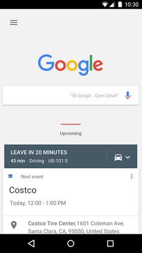
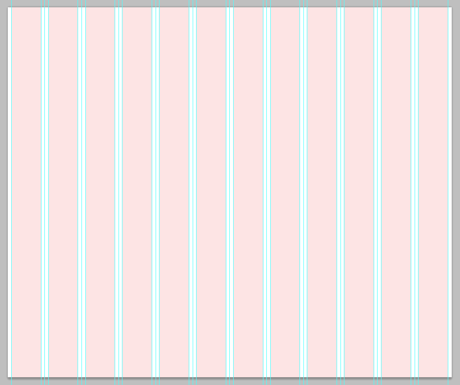
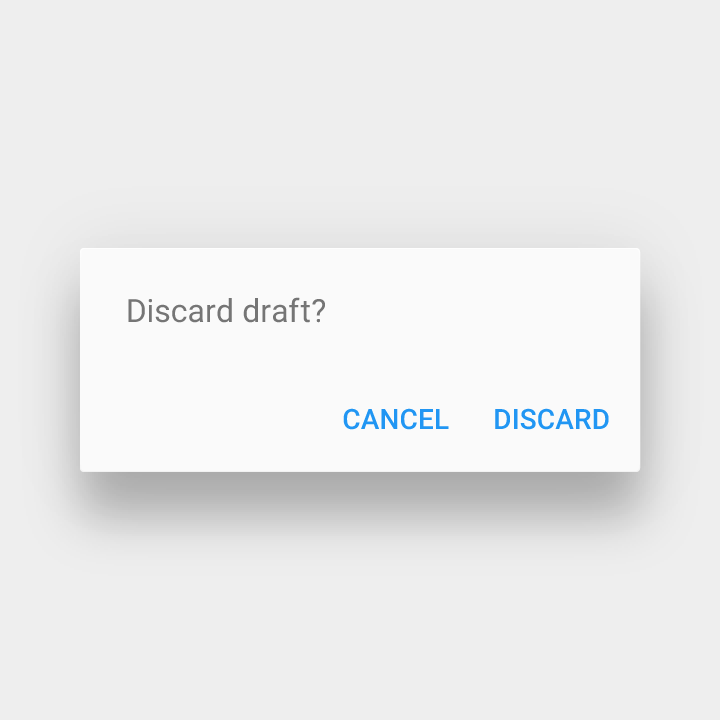

# 角度传感器的材料设计


材料设计是一种全新的、大肆宣传的设计风格。它取代了平面设计，成为新的必用设计。2014 年，谷歌推出了材质设计，它扩展了谷歌现在的卡片图案。以下是 Google Now 卡的图像：


谷歌现在卡。

材料设计背后的整个理念是建立在基于网格的系统、动画和过渡的响应性之上，同时增加设计的深度。材料设计的首席设计师 Matias Duarte 这样说：

"Unlike real paper, our digital material can expand and reform intelligently. Material has physical surfaces and edges. Seams and shadows provide meaning about what you can touch."

材料设计是一套非常精确和完整的规范，可在此处找到：[https://material.google.com/](https://material.google.com/) 。

任何拥有 CSS3 和 HTML5 扎实知识的人都可以获得书面文档并实现每个组件。然而，这将需要大量的时间和精力。幸运的是，我们不用等那么久。事实上，一群有才华的开发人员为 Angular 组装并创建了一个材料设计组件。在撰写本文时，它仍处于测试阶段，这意味着一些组件尚未实现或尚未完全实现。然而，我很少发现自己会因为一个组件不存在或不工作而不得不改变整个设计。

在本章中，我们将学习如何安装用于材料设计的角度组件，然后使用一些最流行的组件。我们还将看到材质图标。更详细地说，我们将看到：

*   如何安装角钢的材料设计
*   如何处理响应性布局
*   材质图标
*   按钮
*   菜单
*   工具栏
*   对话
*   创建自己的主题


# 安装软件包


首先，我们需要安装 Angular Material 设计包。使用 Angular CLI 相对简单：

```ts
ng new chap10
cd chap10
npm install --save @angular/material 
npm install --save @angular/animations
npm install --save hammerjs 

```

我们在这里安装了两个软件包，`@angular/material`和`hammerjs`软件包。第一个模块包含在我们的应用程序中，材料设计模块，我们将在下一节中使用。然而，第二个包是触摸运动的 JavaScript 实现。一些材料设计组件，如`slider`依赖于`hammerjs`。

然后，根据`NgModule`规范，我们可以进口`MaterialModule`如下：

```ts
//src/app/app.module.ts

import { MaterialModule } from '@angular/material';
import { BrowserModule } from '@angular/platform-browser';
import { NgModule } from '@angular/core';
import { FormsModule, ReactiveFormsModule } from '@angular/forms';
import { HttpModule } from '@angular/http';

import { AppComponent } from './app.component';

@NgModule({
 declarations: [
   AppComponent
 ],
 imports: [
   BrowserModule,
   FormsModule,
   HttpModule,
   ReactiveFormsModule,
   NgbModule.forRoot(),
   MaterialModule.forRoot()
 ],
 providers: [],
 bootstrap: [AppComponent]
})
export class AppModule { } 

```

接下来，我们需要选择一个主题。主题是将应用于角度材质组件的颜色集。在主题中，有以下颜色：

*   主调色板由所有屏幕和组件中最广泛使用的颜色组成
*   强调调色板由用于浮动操作按钮和交互元素的颜色组成
*   警告调色板由用于传达错误状态的颜色组成
*   前景调色板由文本和图标的颜色组成
*   背景调色板由用于元素背景的颜色组成

幸运的是，我们可以直接使用默认主题（谷歌在其大多数服务中使用的主题）。为此，请将以下行添加到您的`/src/styles.css`文件中：

```ts
@import '~@angular/material/core/theming/prebuilt/deeppurple-
     amber.css'; 

```

这里，我们使用深紫色主题，这是可用的默认主题之一。您可以在此处看到所有默认主题：`node_modules/@angular/material/core/theming/prebuilt`。

而且，就是这样！您可以运行`ng serve`再次传输您的项目，并确认一切都按照计划进行。正如所料，目前没有太多可展示的东西。以下是运行`ng serve`后拍摄的屏幕截图：


App works!


# 响应式布局


材料设计的一个重要部分是适应任何可能屏幕大小的响应性布局。为了实现这一点，我们使用断点宽度：480、600、840、960、1280、1440 和 1600 dp，定义见下表[https://material.io/guidelines/layout/responsive-ui.html#responsive-ui 断点](https://material.io/guidelines/layout/responsive-ui.html#responsive-ui-breakpoints)：

| **断点（dp）** | **手机/平板画像** | **手机/平板电脑景观** | **窗口** | **栏目** | **天沟** |
| 0 | 小型手机 |  | xsmall | 4 | 16 |
| 360 | 中型手机 |  | xsmall | 4 | 16 |
| 400 | 大型手机 |  | xsmall | 4 | 16 |
| 480 | 大型手机 | 小型手机 | xsmall | 4 | 16 |
| 600 | 小片 | 中型手机 | 小的 | 8 | 16/24 |
| 720 | 大板 | 大型手机 | 小的 | 8 | 16/24 |
| 840 | 大板 | 大型手机 | 小的 | 12 | 16/24 |
| 960 |  | 小片 | 小的 | 12 | 24 |
| 1024 |  | 大板 | 中等的 | 12 | 24 |
| 1280 |  | 大板 | 中等的 | 12 | 24 |
| 1440 |  |  | 大的 | 12 | 24 |
| 1600 |  |  | 大的 | 12 | 24 |
| 1920 |  |  | 这很糟糕。 | 12 | 24 |

请注意，我们将在本章中使用的所有材料设计指令都已经实现了这些断点。但是，如果开始创建主题（请参阅本章最后一节）或实现自定义指令，则必须记住它们。CSS 断点很容易定义，但可能是一项乏味的工作：

```ts
@media (min-width: 600dp) {
 .class {
   content: 'Whoa.';
 }
} 

```

现在，前面表格的前四列是不言自明的，我们有 dp 中的断点、手持设备/平板电脑肖像、手持设备/平板电脑风景和窗口。然而，最后两个问题需要一些解释。Columns（列）列表示每个 dp 大小在屏幕上等分的列数。

排水沟是每根柱子之间的空间。这是一个 12 列的网格布局：



Columns (pink) and gutters (blue).

要使用网格系统，您可以将[T0]附加到任何给定标记的类。例如，`<button class="md-2">`创建了一个两列宽的按钮。

要查看不同大小的网站，您可以使用谷歌 Chrome 开发者工具（*F12*然后*CTRL*+*Shift*+*M*或[）http://material.io/resizer/](http://material.io/resizer/) 。注意[http://material.io 如果您尝试分析的网站将*X-Frame-Options*设置为*拒绝*，则](http://material.io)将自动失败。


# 材质图标


让我们以材料图标开始材料设计之旅。材质图标是为在任何分辨率和设备上使用而创建的图标字体（官方支持 web、Android 和 iOS）。

图标传达了一种特殊的含义，开发者倾向于使用相同的图标来传达相同的东西。因此，用户在您的应用程序中更容易找到自己的方式。

有数百个图标可供您使用，每天都会添加新图标。

以下是一些例子：


Fold icons.

您可以在[处看到所有图标 https://material.io/icons/](https://material.io/icons/) 。

由于材质图标是材质设计的可选部分（也就是说，您可以让材质设计一个应用程序，例如，使用令人敬畏的字体图标，甚至自定义图标），因此您的代码中还需要添加另一行代码。在您的`src/index.html`文件中，在`head`部分添加以下内容：

```ts
<link href="https://fonts.googleapis.com/icon?family=Material+Icons" 
    rel="stylesheet"> 

```

最终的`src/index.html`将如下所示：

```ts
<!doctype html>
<html>
<head>
 <meta charset="utf-8">
 <title>Chap10</title>
 <base href="/">

 <meta name="viewport" content="width=device-width, initial-scale=1">
 <link rel="icon" type="image/x-icon" href="favicon.ico">
 <link href="https://fonts.googleapis.com/icon?family=Material+Icons" 
    rel="stylesheet">
</head>
<body>
 <app-root>Loading...</app-root>
</body>
</html> 

```

现在，为了查看导入是否成功，我们将在自动生成的应用程序组件中添加一个图标。在`src/app/app.component.html`中，添加以下`<i class="material-icons">cast_connected</i>`如下所示：

```ts
<h1>
 {{title}}

 <i class="material-icons">cast_connected</i>
</h1> 

```

您的浏览器应刷新`http://localhost:4200/`页面并显示`cast_connected`图标：


Cast connected icon.

如您所见，使用材质图标相当简单。第一步是确定要在[上使用的一个图标的名称 https://material.io/icons/ 然后，创建一个具有`class="material-icons"`属性的`<i></i>`标记，最后包含所需图标的名称。以下是一些例子：](https://material.io/icons/)

*   `<i class="material-icons">cast_connected</i>`
*   `<i class="material-icons">gamepad</i>`
*   `<i class="material-icons">dock</i>`
*   `<i class="material-icons">mouse</i>`


# 按钮


除了图标之外，用于材质设计的最简单指令之一是按钮指令。我们可以有一个按钮，它是平的、凸起的、圆形的，并且有三种不同的预设颜色：原色、强调色和警告色。下面是一个带有模板的组件，它尝试了一些可能的组合：

```ts

 @Component({
  selector: 'buttons',
  template: `
    <button md-button>FLAT</button>
    <button md-raised-button>RAISED</button> 
    <button md-fab>
        <md-icon>add</md-icon>
    </button>
    <button md-mini-fab>
        <md-icon>add</md-icon>
    </button>
    <button md-raised-button color="primary">PRIMARY</button>
    <button md-raised-button color="accent">ACCENT</button>
    <button md-raised-button color="warn">WARN</button>
  `
 })
 export class ButtonsComponent {
  constructor() { }
 }

```

结果如下所示：


其次是：


主色、强调色和警告色要么在`style.scss`中定义为 SCCS 变量，要么在默认材质设计主题中定义（如果未覆盖它们）。


# 菜单


在本节中，我们将对`menu`指令感兴趣。下面的组件创建了一个包含四个元素的菜单。第四个元素已禁用（即，我们无法单击它）：

```ts
@Component({
 selector: 'menu',
 template: `
 <md-menu>
     <button md-menu-item> Refresh </button>
     <button md-menu-item> Settings </button>
     <button md-menu-item> Help </button>
     <button md-menu-item disabled> Sign Out </button>
 </md-menu>
 `
})
export class MenuComponent {
 constructor() { }
} 

```

以下是菜单关闭时的外观：


Menu closed.

打开（用户单击后）版本显示在以下屏幕截图中：


Menu opened.


# 工具栏


角度材质设计的工具栏组件将按如下方式使用：

```ts
<md-toolbar>
 One good looking toolbar
</md-toolbar> 

```

这将产生以下结果：


Bare-bones toolbar.

此外，还可以使用角度`[color]="primary" | "accent" | "warn"`属性。此外，工具栏还可以使用`<md-toolbar-row>`标记包含行：

```ts
<md-toolbar [color]="accent">
  One good looking toolbar
</md-toolbar>
<md-toolbar [color]="warn">
  <span>First Row</span>

  <md-toolbar-row>
    <span>Second Row</span>
  </md-toolbar-row>

  <md-toolbar-row>
    <span>Third Row</span>
  </md-toolbar-row>
</md-toolbar>
<md-toolbar [color]="primary">
  Another good looking toolbar
</md-toolbar> 

```

下面将生成三个不同的工具栏，它们相互重叠。第二个工具栏将由三行组成。


# 对话


根据谷歌的定义：<q>对话框通知用户某项特定任务，可能包含关键信息、需要决策或涉及多个任务</q>。在 Angular 中使用的对话框具有以下方法：

*   `open(component: ComponentType<T>, config: MdDialogConfig): MdDialogRef<T>`创建并打开一个新对话框供用户交互
*   `closeAll()`：关闭对话框的 void

然后，对话框本身可以使用四种不同的指令：

*   `md-dialog-title`将包含如下对话框的标题：`<md-dialog-title>My Dialog Title</md-dialog-title>`。
*   `md-dialog-content`包含对话框的内容。
    例如：`<md-dialog-content>My Dialog Content</md-dialog-title>`。
*   `md-dialog-close`将添加到按钮`(``<button md-dialog-close>Close</button>`上。它使按钮关闭对话框本身。
*   `md-dialog-actions`用于设置对话框的不同动作，即关闭、放弃、同意等。

在下面的示例中，我们有一个初稿组件。草稿组件有一个只包含一个按钮的简单模板。按钮的`click`事件调用`openDialog`方法。对于组件本身的定义，我们有一个构造函数，它接收一个名为[T2]的对话框。方法`openDialog`有两个回调——一个用于实际打开对话框，另一个用于在对话框关闭时打印包含`result:`字符串的`result`变量：

```ts
@Component({
 selector: 'draft-component',
 template: `
 <button type="button" (click)="openDialog()">Open dialog</button>
 `
})
export class DraftComponent {

 dialogRef: MdDialogRef<DraftDialog>;

 constructor(public dialog: MdDialog) { }

 openDialog() {
   this.dialogRef = this.dialog.open(DraftDialog, {
     disableClose: false
   });

   this.dialogRef.afterClosed().subscribe(result => {
     console.log('result: ' + result);
     this.dialogRef = null;
   });
 }
} 

```

如您所见，`DraftComponent`组件的`dialogRef`属性是泛型的。更具体地说，它是`DraftDialog`类的通用实例。让我们来定义它：

```ts
@Component({
 selector: 'draft-dialog',
 template: `
 <md-dialog-content>
   Discard Draft?
 </md-dialog-content>
 <md-dialog-actions>
   <button (click)="dialogRef.close('can
cel')">Cancel</button>
   <button md-dialog-close>Discard</button>
 </md-dialog-actions>
 `
})
export class DraftDialog {
 constructor(public dialogRef: MdDialogRef<DraftDialog>) { }
} 

```

同样，这是一个简单的类。在这里，我们可以看到模板包含四个可能的指令中的三个。事实上，我使用`<md-dialog-content>`定义了要显示的对话框的内容，`<md-dialog-actions>`为对话框的“操作”按钮留出了专用空间，最后，`md-dialog-close`使`Discard`按钮关闭了我的对话框。组件本身只有一个定义`public`属性的构造：`MdDialogRef<DraftDialog>`。

要使用此对话框，最后一件事是在我们的`NgModule`中引用它，如下所示：

```ts
@NgModule({
 declarations: [
   ...,
   DraftDialog
 ],
 entryComponents: [
   ...,
   DraftDialog
 ],
 ...
})
export class AppModule { } 

```

下面是我们按下按钮时对话框的图像：



Draft dialog.


# 侧边导航抽屉


侧边导航抽屉在移动设备上非常流行。然而，它们确实开始出现在成熟版本的网站上；因此，本章将对其进行介绍。

下面是侧面导航抽屉的外观：


Side navigation drawer.

在浅灰色的左侧，我们有一个导航抽屉，当被调用时它会弹出到我们的内容上。在深灰色中，我们拥有页面的内容。

通过以下组件，我们重现本节开头所示的侧导航：

```ts
@Component({
 selector: 'sidenav',
 template: `
   <md-sidenav-container>
   <md-sidenav #side (open)="closeButton.focus()">
      Side Navigation.
     <br>
     <button md-button #closeButton      
         (click)="side.close()">Close</button>
   </md-sidenav>

   My regular content. This will be moved into the proper DOM at 
       runtime.
   <button md-button (click)="side.open()">Open side sidenav</button>

 </md-sidenav-container>
 `
})
export class SideNavComponent {
 constructor() { }
} 

```

这里唯一有趣的是模板。让我们把它分解一下。首先，我们有一个`<md-sidenav-container>`标签，它允许我们为内容定义两个独立的区域。这两个区域是`md-sidenav`和我们页面的实际内容。虽然内容的`sidenav`部分由`md-sidenav`标记明确定义，但我们的其他内容（即实际页面）没有包含在任何特殊标记中。页面内容只能在`md-sidenav`定义之外。我们有一个带有`#side`属性的`md-sidenav`块的引用。作为提醒，在任何 Angular 指令中添加`#myName`都会为您提供一个引用，以便在模板的其余部分中访问它。`md-sidenav`有一个开放的方法，将焦点放在其内部定义的`#closeButton`上。此按钮有一个调用`#side`的`close`方法的`click`方法。最后，在页面内容中，我们有一个按钮，单击时会调用`#side.open`。除了这两种方法（`open`和`close`之外，`md-sidenav`指令还有一种切换`sidenav`（即`opened = !opened`的`toggle`方法）。


# 支持主题


现在，我们可以描述角材料设计中的每个可用组件。然而，它们有很多，而且它们的用途几乎都很复杂。以下是我撰写本章时可用的受支持指令列表：

*   `buttons`
*   `cards`
*   `checkbox`
*   `radio`
*   `input`
*   `sidenav`
*   `toolbars`
*   `list`
*   `grid`
*   `icon`
*   `progress`
*   `tabs`
*   `slide`
*   `slider`
*   `menu`
*   `tooltip`
*   `ripples`
*   `dialogs`
*   `snackbar`

在接下来的几个月里，更多的指令将被添加到组合中。你可以在这里找到它们：[https://github.com/angular/material2](https://github.com/angular/material2) 。

不用说，我们是在指令方面被涵盖的。尽管有如此广泛的可能性，我们可以通过创建自定义主题来进一步自定义角度的材质设计。在“角度材质”中，通过组合多个选项板创建主题。具体而言，主题包括：

*   主调色板由所有屏幕和组件中最广泛使用的颜色组成
*   强调调色板由用于浮动操作按钮和交互元素的颜色组成
*   警告调色板由用于传达错误状态的颜色组成
*   前景调色板由文本和图标的颜色组成
*   背景调色板由用于元素背景的颜色组成

下面是一个自定义主题的示例：

```ts
//src/styles.scss

@import '~https://fonts.googleapis.com/icon?family=Material+Icons';
@import '~@angular/material/core/theming/all-theme';
// Plus imports for other components in your app.

// Include the base styles for Angular Material core. We include this here so that you only
// have to load a single css file for Angular Material in your app.
@include md-core();

// Define the palettes for your theme using the Material Design 
   palettes available in palette.scss
// (imported above). For each palette, you can optionally specify a 
  default, lighter, and darker
// hue.
  $candy-app-primary: md-palette($md-indigo);
  $candy-app-accent:  md-palette($md-pink, A200, A100, A400);

// The warn palette is optional (defaults to red).
   $candy-app-warn:    md-palette($md-red);

// Create the theme object (a Sass map containing all of the palettes).
  $candy-app-theme: md-light-theme($candy-app-primary, $candy-app-  
   accent, $candy-app-warn);

// Include theme styles for core and each component used in your app.
// Alternatively, you can import and @include the theme mixins for each 
   component
// that you are using.
@include angular-material-theme($candy-app-theme); 

```

因此，我们学会了为材料设计创建自定义主题。


# 总结


在本章中，我们通过使用 Angular/Material2 模块学习了 Angular 的材料设计和响应设计。我们看到了一些最常用的指令，如[T0]、[T1]、[T2]或[T3]。此外，我们还利用 Angular/Material2 的主题功能解决了材料设计定制问题。

在[第 15 章](15.html)*中，结合 Bootstrap 和 Angular2 应用*，我们将看到如何使用 Bootstrap（推特）而不是材料设计（谷歌）来驱动 Angular2 应用的设计。