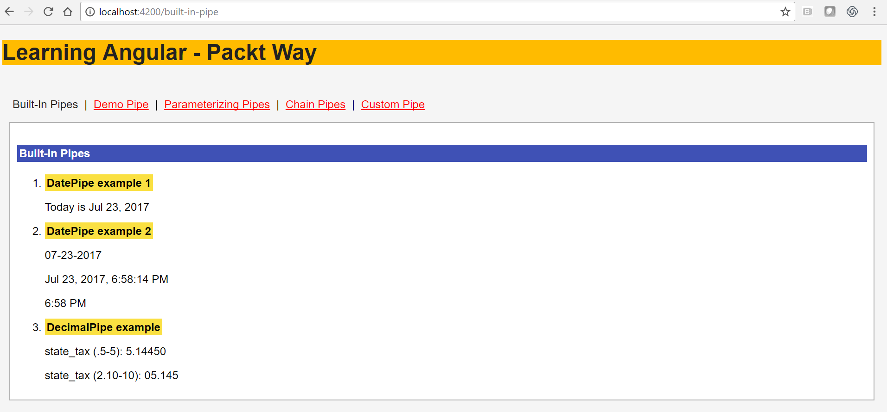
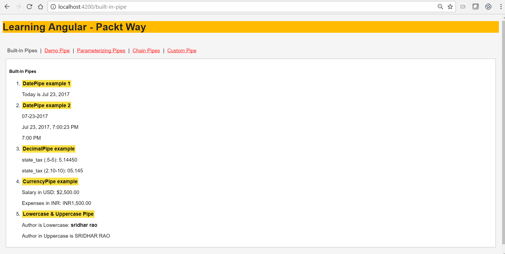

# 实现角管道


在本章中，您将学习角度管道。将角度管道视为过滤器的现代化版本，包括帮助我们在模板中格式化值的函数。Angular 中的管道基本上是 Angular v1 中过滤器的扩展。我们可以在模板中轻松使用许多有用的内置管道。您将了解内置管道，我们还将创建自己的自定义用户定义管道。

在本章末尾，您将学习并实施以下内容：

*   角管简介
*   定义和实现管道
*   了解各种内置管道
    *   日期管
    *   十进制管
    *   电流管
    *   小写的 Epipe 和大写的 Casepipe
    *   JSON 管道
    *   切片管
    *   异步管道
*   学习实现自定义用户定义的管道
*   参数化管道
*   用链条拴住管道
*   了解纯净和不纯净管道


# 角管-概述


管道允许我们在显示模板之前格式化模板视图中的值。例如，在大多数现代应用程序中，我们希望显示术语，如今天、明天等，而不是系统日期格式，如 2017 年 4 月 13 日 08:00。让我们来看看更真实的场景。

是否希望应用程序中的提示文本始终为小写？没问题；定义并使用`LowercasePipe`。在天气应用程序中，如果您想将月份名称显示为 MAR 或 APR 而不是其全名，请使用`DatePipe`。

很酷，对吧？你明白了。管道帮助您添加业务规则，这样您就可以在数据实际显示在模板中之前对其进行转换。
与角度管道相关的一个好方法是通过角度 1.x 过滤器，但管道不仅仅是过滤。

We have used the Angular router to define the route path, so we have all the functionalities of pipes in one page; you can create it in the same or different apps. Feel free to use your creativity.

在 Angular 1.x 中，我们有过滤器——管道是过滤器的替代品。

在下一节中，您将学习如何定义和使用角度管道。


# 定义管道


管道操作符定义为管道符号（`|`，后跟管道名称：

```ts
{{ appvalue | pipename }}

```

以下是一个简单的`lowercase`管道示例：

```ts
{{"Sridhar Rao" | lowercase}} 

```

在前面的代码中，我们使用[T0]管道将文本转换为小写。

现在，让我们使用`lowercase`管道示例编写一个`Component`示例：

```ts
@Component({
 selector: 'demo-pipe',
 template: `
 Author name is {{authorName | lowercase}}
 `
})
export class DemoPipeComponent {
 authorName = 'Sridhar Rao';
}

```

让我们详细分析前面的代码：

*   我们定义了一个`DemoPipeComponent`组件类
*   我们创建了一个字符串变量[T0]，并分配了值[T1]
*   在模板视图中，我们显示了`authorName`；然而，在我们将其打印到 UI 之前，我们使用`lowercase`管道对其进行了转换

运行前面的代码，您将看到以下输出：


做得好！在前面的示例中，我们使用了内置管道。在后续部分中，您将了解有关内置管道的更多信息，并创建一些自定义管道。

Note that the pipe operator only works in your templates and not inside controllers.


# 内置管道


Angular pipes 是 Angular 1.x 过滤器的现代化版本。Angular 附带了许多预定义的内置管道。我们可以在视图中直接使用它们，并动态转换数据。

以下是 Angular 内置支持的所有管道的列表：

*   日期管
*   十进制管
*   电流管
*   小写的 Epipe 和大写的 Casepipe
*   JSON 管道
*   切片管
*   异步管道

在以下几节中，让我们实现并了解有关各种管道的更多信息，并查看它们的实际情况。


# 日期管


DatePipe，顾名思义，允许我们格式化或转换与日期相关的值。DatePipe 还可以用于根据运行时传递的参数转换不同格式的值。

通用语法显示在以下代码段中：

```ts
{{today | date}} // prints today's date and time
{{ today | date:'MM-dd-yyyy' }} //prints only Month days and year
{{ today | date:'medium' }} 
{{ today | date:'shortTime' }} // prints short format

```

让我们详细分析前面的代码段：

*   如前一节所述，通用语法是一个变量，后跟一个（`|`）管道操作符，然后再后跟管道操作符的名称
*   我们使用 DatePipe 来转换`today`变量
*   另外，在前面的示例中，您会注意到我们向管道操作符传递了一些参数；我们将在下一节介绍管道的传递参数

现在，让我们创建一个完整的`DatePipe`组件示例；下面是实现`DatePipe`组件的代码片段：

```ts
import { Component } from '@angular/core';

@Component({
 template: `
 <h5>Built-In Pipes</h5>
 <ol>
 <li>
 <strong class="packtHeading">DatePipe example 1</strong>
 <p>Today is {{today | date}}
 </li>
 <li>
 <strong class="packtHeading">DatePipe example 2</strong>
 <p>{{ today | date:'MM-dd-yyyy' }} 
 <p>{{ today | date:'medium' }}
 <p>{{ today | date:'shortTime' }} 
 </li>
 </ol>
 `,
})
export class PipeComponent {
 today = new Date();
}

```

让我们详细分析前面的代码段：

1.  我们创建了一个`PipeComponent`组件类。
2.  我们定义了一个`today`变量。
3.  在视图中，我们将变量的值转换为基于不同参数的各种表达式。

现在，运行应用程序，我们将看到以下输出：


您在本节中了解了[T0]。在以下部分中，您将继续学习和实现其他内置管道，并创建一些自定义用户定义管道。


# 十进制管


在本节中，您将了解另一个内置管道——DecimalPipe。

DecimalPipe 允许我们根据区域规则格式化数字。DecimalPipe 还可用于转换不同格式的数字。

一般语法如下：

```ts
appExpression | number [:digitInfo]

```

在前面的代码段中，我们使用数字管道，并且可以选择传递参数。

让我们来看看如何创建一个实现小数点的 AutoT0A.以下是相同的示例代码：

```ts
import { Component } from '@angular/core';
@Component({
 template: `
  <h5>Built-In Pipes</h5>
 <ol>
<li>
<strong class="packtHeading">DecimalPipe example</strong>
 <p>state_tax (.5-5): {{state_tax | number:'.5-5'}}</p>
 <p>state_tax (2.10-10): {{state_tax | number:'2.3-3'}}</p>
 </li>
 </ol>
 `,
})
export class PipeComponent {
 state_tax: number = 5.1445;
}

```

让我们详细分析前面的代码段：

1.  我们定义了一个组件类，即[T0]。
2.  我们定义了一个`state_tax`变量。
3.  然后我们在视图中改变了[T0]。
4.  第一个管道操作符告诉表达式打印小数，最多五位小数。
5.  第二个管道操作符告诉表达式将值打印到小数点后三位。

前面的管道组件示例的输出如下所示：



毫无疑问，数字管道是各种应用中最有用和最常用的管道之一。我们可以变换数值，特别是处理小数和浮点。


# 电流管


对于那些想要迎合跨国地理环境的应用程序，我们需要显示特定于国家的代码及其各自的货币值——这就是`CurrencyPipe`拯救我们的地方。

`CurrencyPipe`运算符用于在数值前追加`country`代码或`currency`符号。

请看实现[T0]运算符的代码片段：

```ts
{{ value | currency:'USD' }}

Expenses in INR: {{ expenses | currency:'INR' }}

```

让我们详细分析前面的代码段：

1.  第一行代码显示了编写`CurrencyPipe`的一般语法。
2.  第二行显示了货币语法，我们使用它来转换`expenses`值，并将印度货币符号附加到它上面。

既然我们已经知道了如何使用`CurrencyPipe`操作符，那么让我们结合一个示例来显示多种`currency`和`country`格式；下面是完整的组件类，它实现了一个`CurrencyPipe`操作符：

```ts
import { Component } from '@angular/core';

@Component({
 selector: 'currency-pipe',
 template: `
 <h5>CurrencyPipe Example</h5>
 <ol>
 <li>
 <p>Salary in USD: {{ salary | currency:'USD':true }}</p>
 <p>Expenses in INR: {{ expenses | currency:'INR':false }}</p>
 </li>
 </ol>
 `
})
export class CurrencyPipeComponent {
 salary: number = 2500;
 expenses: number = 1500;
}

```

让我们详细分析前面的代码：

1.  我们创建了一个组件类`CurrencyPipeComponent`，并声明了几个变量，即`salary`和`expenses`。
2.  在组件模板中，我们通过添加`country`和`currency`细节来转换变量的显示。
3.  在第一个管道操作符中，我们使用了`'currency : USD'`，它将在变量之前附加（$）美元符号。
4.  在第二个管道操作符中，我们使用了`'currency : 'INR':false'`，它将添加货币代码，`false`将告诉它不要打印符号。

现在，启动应用程序，我们将看到以下输出：


在本节中，我们讨论并实现了`CurrencyPipe`。在以下部分中，我们将继续探索和学习其他内置管道以及更多内容。


# 小写的 Epipe 和大写的 Casepipe


正如名称所示，小写的 epipe 和大写的 casepipe 分别有助于将文本转换为小写和大写。

请看以下代码段：

```ts
Author is Lowercase {{authorName | lowercase }}
Author in Uppercase is {{authorName | uppercase }}

```

让我们详细分析前面的代码：

1.  第一行代码使用`lowercase`管道将`authorName`的值转换为小写。
2.  第二行代码使用`uppercase`管道将`authorName`的值转换为大写。

现在我们已经了解了如何定义小写和大写管道，现在是创建一个完整的组件示例的时候了，它实现了以小写和大写显示作者姓名的管道。

请看以下代码段：

```ts
import { Component } from '@angular/core';

@Component({
 selector: 'textcase-pipe',
 template: `
 <h5>Built-In LowercasPipe and UppercasePipe</h5>
 <ol>
 <li>
 <strong>LowercasePipe example</strong>
 <p>Author in lowercase is {{authorName | lowercase}}
 </li>
 <li>
 <strong>UpperCasePipe example</strong>
 <p>Author in uppercase is {{authorName | uppercase}}
 </li>
 </ol>
 `
})
export class TextCasePipeComponent {
 authorName = "Sridhar Rao";
}

```

让我们详细分析前面的代码：

1.  我们创建了一个组件类`TextCasePipeComponent`，并定义了一个`authorName`变量。
2.  在组件视图中，我们使用了`lowercase`和`uppercase`管道。
3.  第一个管道将变量的值转换为小写文本。
4.  第二个管道将变量的值转换为大写文本。

运行应用程序，我们将看到以下输出：



在本节中，您学习了如何使用`lowercase`和`uppercase`管道来转换值。


# JSON 管道


与 Angular 1.x 中的 JSON 过滤器类似，我们有 JSON 管道，它帮助我们将字符串转换为 JSON 格式的字符串。

在小写或大写的管道中，我们转换字符串；使用 JSON 管道，我们可以将字符串转换并显示为 JSON 格式的字符串。

通用语法显示在以下代码段中：

```ts
<pre>{{ myObj | json }}</pre>

```

现在，让我们使用前面的语法创建一个完整的`Component`示例，它使用 JSON 管道：

```ts
import { Component } from '@angular/core';

@Component({ 
 template: `
 <h5>Author Page</h5>
 <pre>{{ authorObj | json }}</pre>
 `
})
export class JSONPipeComponent {
 authorObj: any; 
 constructor() {
 this.authorObj = {
 name: 'Sridhar Rao',
 website: 'http://packtpub.com',
 Books: 'Mastering Angular2'
 };
 }
}

```

让我们详细分析前面的代码：

1.  我们创建了一个组件类`JSONPipeComponent`和`authorObj`，并将 JSON 字符串分配给变量。
2.  在组件模板视图中，我们转换并显示 JSON 字符串。

运行应用程序，我们将看到以下输出：


JSON 很快就成为 web 应用程序在服务和客户端技术之间集成的事实标准。因此，每次我们需要在视图中将值转换为 JSON 结构时，JSON 管道都会派上用场。


# 切片管


SlicePipe 非常类似于数组切片 JavaScript 函数。切片管道从两个指定索引之间的字符串中提取字符，并返回新的子字符串。

定义切片管道的一般语法如下所示：

```ts
{{email_id | slice:0:4 }}

```

在前面的代码片段中，我们对电子邮件地址进行切片，以仅显示变量值[T0]的前四个字符。

现在我们知道了如何使用切片管，让我们把它放在一个组件中。

以下是实现 SlicePipe 的完整代码段：

```ts
import { Component } from '@angular/core';

@Component({
 selector: 'slice-pipe',
 template: `
 <h5>Built-In Slice Pipe</h5>
 <ol>
 <li>
 <strong>Original string</strong>
 <p> Email Id is {{ emailAddress }}
 </li>
 <li>
 <strong>SlicePipe example</strong>
 <p>Sliced Email Id is {{emailAddress | slice : 0: 4}}
 </li>
 </ol>
 `
})
export class SlicePipeComponent {
 emailAddress = "test@packtpub.com";
}

```

让我们详细分析前面的代码段：

1.  我们创建了一个`SlicePipeComponent`类。
2.  我们定义了一个字符串变量`emailAddress`并给它赋值`test@packtpub.com`。
3.  然后，我们将 SlicePipe 应用于[T0]变量。
4.  我们从`0`位置开始得到子字符串，从`emailAddress`的变量值中得到`4`字符。

运行应用程序，我们将看到以下输出：


SlicePipe 无疑是一个非常有用的内置管道，尤其是处理字符串或子字符串。


# 异步管道


异步管道允许我们直接将承诺或观察映射到模板视图中。为了更好地理解异步管道，让我先介绍一个可观察的管道。

Observable 是角度可注入服务，可用于将数据流传输到应用程序中的多个部分。在下面的代码片段中，我们使用一个`async`管道作为承诺来解析返回的作者列表：

```ts
<ul id="author-list">
 <li *ngFor="let author of authors | async" >
 <!-- loop the object here -->
 </li>
</ul>

```

`async`管道现在订阅`Observable`（作者）并检索最后一个值。

让我们看一下如何将`async`管道同时用作`Promise`和`Observable`的示例。

在我们的`app.component.ts`文件中添加以下代码行：

```ts
 getAuthorDetails(): Observable<Author[]> {
  return this.http.get(this.url).map((res: Response) => res.json());
 }

 getAuthorList(): Promise<Author[]> {
  return this.http.get(this.url).toPromise().then((res: Response) => 
   res.json());
 }

```

让我们详细分析前面的代码段：

1.  我们创建了一个`getAuthorDetails`方法，并附加了一个可观察的方法。该方法将返回来自`url`的响应，这是一个 JSON 输出。
2.  在`getAuthorList`方法中，我们绑定了一个承诺，需要在`http`请求调用的`url`返回的输出中解析或拒绝。

在本节中，我们已经了解了`async`管道的工作原理。你会发现这与处理服务非常相似。我们可以映射一个承诺或一个可观察的，并将结果映射到模板。


# 参数化管道


管道也可以采用参数。我们可以沿着管道传递参数。参数在管道后用冒号（`:`分隔：

```ts
{{appValue | Pipe1: parameter1: parameter2 }}

```

让我们快速构建一个简单的管道示例，以查看它的运行情况。下面是一个带有`MM-dd-yyyy`参数的`DatePipe`示例：

```ts
{{today | date:'MM-dd-yyyy' }} 

```

具有参数的管道的另一个示例如下所示：

```ts
{{salary | currency:'USD':true}}

```

让我们详细分析前面的代码段：

1.  我们将 USD 作为参数传递给`CurrencyPipe`，这将告诉管道显示货币代码，例如*USD*表示美元，*EUR*表示欧元。
2.  `true`参数表示显示货币符号（$）。默认情况下，它设置为 false。

让我们看一下它们的运行情况，以及组件的完整代码：

```ts
import { Component } from '@angular/core';

@Component({
 template: `
 <h5>Parametrizing pipes</h5>

 <p>Date with parameters {{ today | date:'MM-dd-yyyy' }} 
 <p>Salary in USD: {{salary | currency:'USD':true}}</p>
 `,
})
export class ParamPipeComponent {
 today = new Date();
 salary: number = 1200;
}

```

在前面的代码片段中，我们创建了一个`ParamPipeComponent`类并定义了`today`和`salary`变量。
在`Component`模板视图中，我们传递`DatePipe`的`date:'MM-dd-yyyy'`参数和`CurrencyPipe`的`currency:'USD' :true`参数。
这是前面代码的输出：


在前面的示例中，我们将自定义参数（如`currency`和`date`格式）传递给管道，并相应地查看输出。

在大多数应用程序用例中，我们需要将参数传递给管道，以基于业务逻辑转换值。在本节中，我们重点讨论通过传递值来参数化管道。

到目前为止，我们一直在使用内置管道并向管道传递参数。

在以下部分中，您将了解如何链接管道、创建自定义管道以及将参数传递给自定义用户定义管道。


# 链式管道


我们可以将多条管道连接在一起。这在需要关联多个需要应用的管道的场景中特别有用，最终输出将与应用的所有管道进行转换。

将触发工作流或链，并逐个应用管道。链管道语法的示例如下所示：

```ts
{{today | date | uppercase | slice:0:4}}

```

我们在前面的代码中应用了两个链管道。首先，将`DatePipe`应用于`today`变量，然后应用`uppercase`管道。以下是`ChainPipeComponent`的完整代码片段：

```ts
import {Component } from '@angular/core';

@Component({
 template: `
 <h5>Chain Pipes</h5>
 <p>Month is {{today | date | uppercase | slice:0:4}}
 `,
})
export class ChainPipeComponent {
 today = new Date();
}

```

我们已经使用了切片来只显示月份的前四个字符。以下屏幕截图显示了前面组件的输出：


应用链管时要记住的一些关键事项如下：

*   执行顺序是从左到右
*   管道一个接一个地铺设

在本节中，您了解了如何在我们的应用程序中将多个管道链接在一起。在下一节中，您将详细了解如何创建自己的自定义管道。


# 创建自定义管道


到目前为止，一切顺利。管道确实给我们留下了深刻的印象，但是等等，我们可以用管道做更多很棒的事情。正如您所看到的，内置管道非常有限，数量很少。我们当然需要创建自己的定制管道，以满足我们应用程序的功能。

在本节中，您将学习如何为我们的应用程序创建自定义管道。

在本例中，我们将构建一个管道，它将是一个税务计算器。我们传递产品的价格，并使用管道功能自动计算和显示销售税。魔法，对吧？

要创建自定义管道，我们需要执行以下步骤：

1.  创建一个模板将其应用于管道（在我们的示例中，它是[T0]）。
2.  创建一个管道文件，即[T0]。
    1.  每个管道文件都必须从角度核心导入管道。
    2.  定义管道元数据。
    3.  创建`Component`类。它应该具有`transform`功能，该功能保存管道应该做什么的业务逻辑。

在下面的代码片段中，我们正在定义一个名为`UpdateTaxPipe`的自定义管道，它将接受一个`percentage`参数，并进行增值税计算，并将其显示在我们的模板中：

```ts
{{ productPrice | UpdateTaxPipe: percentage }}

```

让我们创建我们的`update-tax.pipe.ts`文件：

```ts
import { Pipe, PipeTransform } from '@angular/core';

@Pipe({
 name : "UpdateTaxPipe"
})

export class UpdateTaxPipe implements PipeTransform{
 transform(value:number, taxVal: number):number{
 return (value*taxVal)/100;
 }
}

```

让我们详细分析前面的代码段：

1.  为了告诉 Angular 这是一个管道，我们应用了从 core Angular 库导入的`@Pipe`装饰器。
2.  我们使用`name`管道元数据创建了一个名为`UpdateTaxPipe`的定制管道。
3.  我们创建了一个`transform`方法，该方法对于管道是必需的，并在该方法中定义了我们的业务逻辑和规则。
4.  我们将两个参数传递给`transform`方法，它返回更新后的值。

Angular looks for and executes the `transform` method, regardless of whether we include the interface PipeTransform or not.

运行应用程序，我们将看到如下屏幕截图所示的输出：


在本节中，您学习了如何创建自定义管道。创建用户定义的管道非常简单。定制管道无疑有助于我们轻松集成应用程序的业务逻辑。

Try and create custom pipes, which can fit the write once and use logic many times and also in many component views; for example, validating a phone number, address, and so on.


# 纯净和不纯净的管道


管道还接受名为 Pure 的元数据。管道有两种状态：

*   纯管
*   不纯管


# 纯管道


纯管道仅在输入参数的值更改时执行。它不会记住或跟踪以前的任何值或状态。角形内置管均为`pure`管。

All the pipes we have seen so far as examples are Pure Pipes.


# 不纯管道


无论值或参数是否发生变化，每个变化检测周期都会调用一个不纯管道。为了使用不纯净的管道，我们应该使用管道装饰器`pure`作为`false`。

By default, all pipe decorators have `pure` set as `true`.

将管道装饰器值设置为`pure`将检查管道的输出，无论其值是否更改，并将不断更新管道提供的值。

定义不纯管道与创建任何自定义用户定义管道相同，唯一的区别是在`@Pipe`装饰器中，我们将通过将值设置为`false`来明确提及要不纯的管道。

以下是通过将“管道”的值设置为 false 来定义不纯净管道的语法：

```ts
import { Pipe, PipeTransform } from '@angular/core';

@Pipe({
  name: 'authorName'
  pure: false
})

```

在本节中，您了解了不同类型的角度管道，即纯管道和非纯管道。仅当输入组件的值更改时，才会调用纯管道。无论值是否更改，每次更改检测时都会调用不纯管道。


# 总结


在本章中，您学习了所有关于角管道的知识。角度管道在转换视图样板中的数据时非常有用。Angular pipes 是 Angular 1.x 中提供的过滤器的现代化版本。

我们可以在模板中轻松使用许多有用的内置管道操作符。在本章中，您了解了内置管道以及创建的自定义用户定义管道。

使用数字时，我们可以使用`DatePipe`、`DecimalPipe`和`CurrencyPipe`。在专门处理字符串时，我们始终可以使用 SlicePipe、[T3]和[T4]。

当我们主要处理服务器端响应或进行异步调用并处理响应时，可以使用`JSONPipe`和`asyncPipe`。我们还介绍了将参数传递到管道以及根据应用程序的需要进行自定义。

我们探讨了如何创建和实现自定义用户定义的管道，这些管道还可以根据我们的应用程序需要使用参数来更好地自定义管道。

所以，继续，用管道变换视图。

在下一章中，您将学习如何实现角度服务。您将了解服务和工厂、创建角度服务、使用服务从组件访问数据以及创建异步服务。