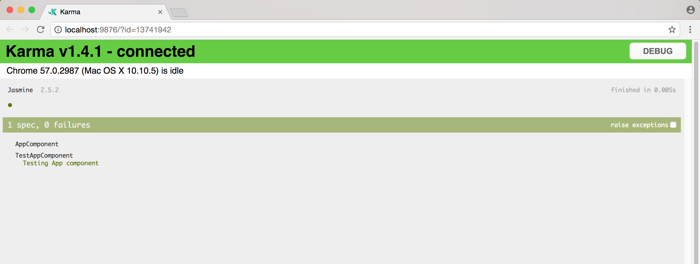
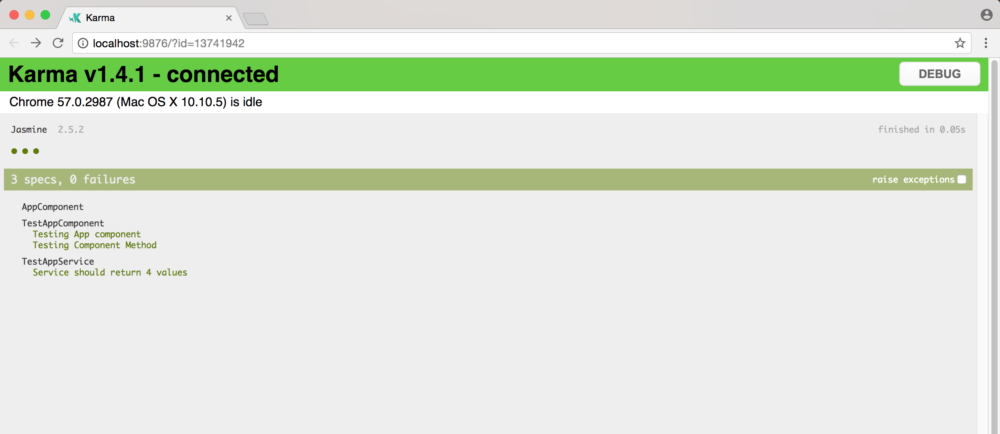
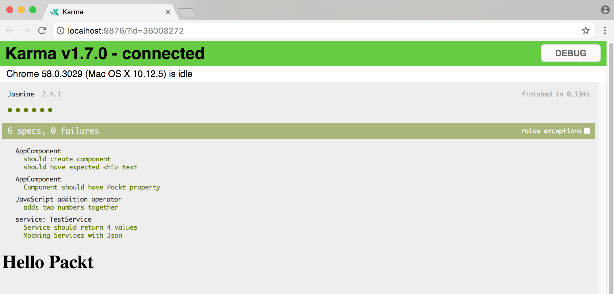
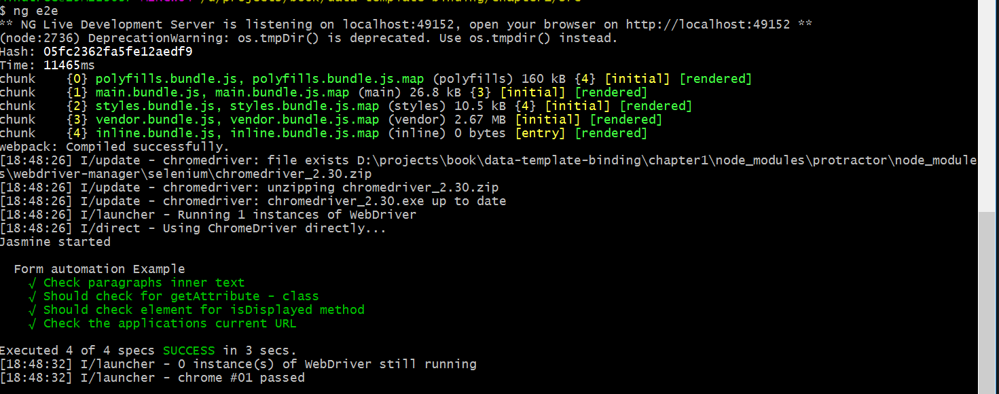
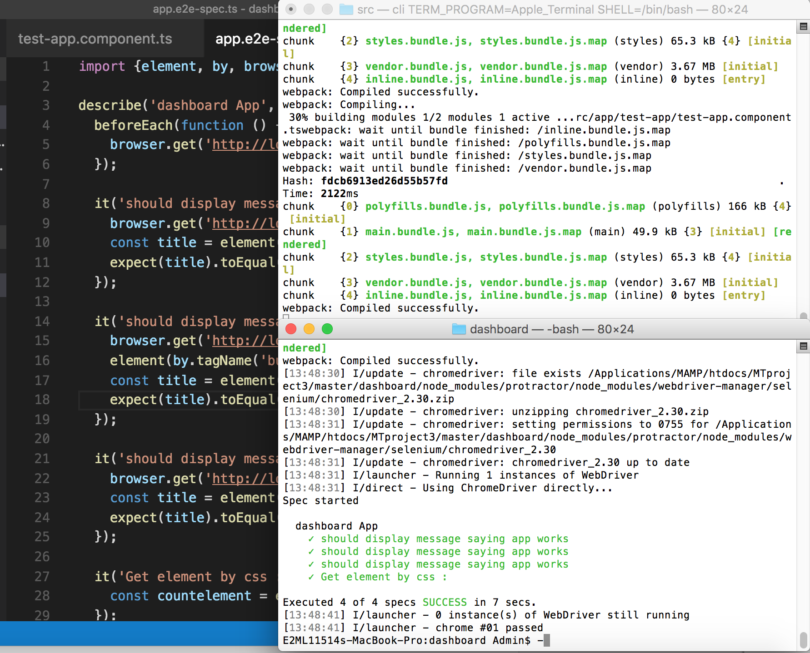

# 十六、使用 Jasmine 和 Protractor 框架测试 Angular 应用


测试是现代应用开发过程中最重要的方面之一。我们甚至有专门的软件开发方法，主要由测试优先的方法驱动。

除了 Angular 提供的测试实用程序外，还有一些推荐的框架，如 Jasmine、Karma 和 Gradutor，使用这些框架可以轻松创建、维护和编写测试脚本。用 Jasmine 和 Digrator 编写的测试脚本可以节省时间和精力，而且最重要的是，通过在开发过程中更早地发现缺陷，可以获得良好的回报。

在本章中，您将学习使用 Jasmine 和 Protractor 测试 Angular 应用的所有内容。在本章中，我们将讨论以下内容：

*   了解测试中的重要概念
*   了解特定于单元测试环境的 Angular CLI
*   介绍 Jasmine 框架
*   使用 Jasmine 编写测试脚本
*   编写测试脚本以测试 Angular 组件
*   测试 Angular 组件：一个高级示例
*   使用 Jasmine 测试脚本测试 Angular 服务
*   学习 Protractor
*   使用 Protractor 编写 E2E 测试脚本


# 测试中的概念


在开始测试 Angular 应用之前，我们必须快速复习并理解一些测试中最常用的术语：

*   **单元测试**：可以将单元测试视为应用中最小的可测试部分。
*   **测试用例**：这是一组测试输入、执行条件和实现目标的预期结果。在 Jasmine 框架中，这些被称为规范。
*   **测试床**：测试床是一种通过传递所有必需的数据和对象，以隔离方式测试特定模块的方法。
*   **测试套件**：这是用于端到端测试模块的测试用例集合。
*   **系统测试**：在完整集成的系统上进行的测试，以评估系统功能。
*   **E2E 测试**：它是一种测试方法，用于确定应用的行为是否符合要求。我们传递数据、所需对象和依赖项，并在模拟实时用例和场景的情况下从头到尾执行。

现在我们知道了前面的术语，让我们了解一下测试 Angular 应用。


# 了解和设置用于测试的 Angular CLI


到目前为止，我们已经使用 Angular CLI 来设置项目、创建新组件、服务等。现在我们将讨论如何使用命令行工具来设置和执行测试套件，以测试我们的应用。

首先，简要回顾一下如何使用 Angular CLI 快速创建项目：

```ts
npm install -g angular-cli

```

使用前面的代码片段，我们安装了 Angular 命令行工具。现在，让我们创建一个名为`test-app`的新目录，并在项目目录中导航：

```ts
ng new test-app
cd test-app

```

是时候快速创建一个名为`test-app`的新组件了：

```ts
ng g component ./test-app

```

现在，我们将看到如下输出：


我们应该看到新目录以及在该目录中创建的相应文件。命令行工具创建了四个与组件相关的文件，包括`test-app.component.spec.ts`测试脚本占位符文件。

现在，让我们启动并运行应用：

```ts
ng serve

```

此时，我们已经启动并运行了应用。现在是开始测试 Angular 应用的时候了。


# Jasmine 框架简介


Jasmine 是一个用于测试 JavaScript 代码的行为驱动开发框架。这是官方网站对茉莉花的解释：

Jasmine is a behavior-driven development framework for testing JavaScript code. It does not depend on any other JavaScript frameworks. It does not require a DOM. And it has a clean, obvious syntax so that you can easily write tests.

Jasmine 测试套件的一般语法如下所示：

```ts
describe("Sample Test Suite", function() {
 it("This is a spec that defines test", function() {
   expect statement // asserts the logic etc
 });
});

```

让我们分析前面的代码片段以了解测试套件语法。已遵循以下步骤：

1.  每个 Jasmine 测试套件都有一个`describe`语句，我们可以在其中给出一个名称。
2.  在测试套件中，我们使用[T0]语句创建更小的测试用例；每个测试用例都有两个参数，一个名称和一个函数，其中包含需要测试的应用逻辑。
3.  我们使用`expect`语句来验证数据，以确保我们的应用和数据按预期工作。

在下一节中，您将详细了解 Jasmine 框架以及我们可以在测试脚本中使用的可用方法和函数。


# Jasmine 框架-我们可以使用的全局方法


Jasmine 框架支持并提供了许多预定义的方法供我们使用和编写测试套件。Jasmine 对测试环境、监视元素等有着广泛的支持。有关可用方法的完整帮助和文档，请参阅官方网站。

对于编写测试脚本，我们需要对 Jasmine 框架中一些最常用的方法有一个基本的理解和知识。


# 茉莉的常用方法


下面列出了可用于编写测试套件的最常用的 Jasmine 全局方法：

| **全局方法** | **说明** |
| 描述 | 描述函数是实现测试套件的代码块 |
| 信息技术 | 规范是通过调用全局 Jasmine 函数`it`来定义的，如前所述，它接受一个字符串和一个函数 |
| 晋升 | 在调用该方法的描述中，该方法在每个规范之前调用一次 |
| 之后 | 此方法在每个规范之后调用一次 |
| 以前 | 此方法在描述中的所有规范之前调用一次 |
| 毕竟 | 此方法仅在调用所有规范后调用一次 |
| xD 描述 | 这将暂时禁用您不希望执行的测试 |
| 悬而未决的 | 挂起的规范不运行；它们将添加到待定结果列表中 |
| 退出 | 使用 xit 声明的任何规范都标记为挂起 |
| 间谍 | 间谍可以存根任何函数并跟踪对它的调用和所有参数；这在 descripe 或 it 语句中使用 |
| 间谍属性 | 对间谍的每次调用都会在 calls 属性上进行跟踪和公开 |

有关更多详细信息和完整文档，请参阅 GitHub 上的 Jasmine 框架文档。


# Angular CLI 和 Jasmine 框架-首次测试


当我们安装 Angular CLI 时，Jasmine 框架会自动随工具一起提供。

在前一节中，我们看到了用 Jasmine 编写测试的一般语法。现在，让我们使用 Jasmine 框架编写一个快速测试脚本：

```ts
describe('JavaScript addition operator', function () {
  it('adds two numbers together', function () {
  expect(1 + 2).toEqual(3); });
});

```

以下是关于前面的测试脚本需要注意的重要事项：

1.  我们编写一个`describe`语句来描述测试脚本。
2.  然后，我们使用`it`语句和相应的方法定义一个测试脚本。
3.  在`expect`语句中，我们断言两个数字，并使用`toEqual`测试两个数字的相加是否与`3`匹配。


# 用茉莉花测试 Angular 分量


现在是使用 Jasmine 框架创建测试套件的时候了。在第一部分*理解并设置 Angular CLI 以测试*中，我们使用`ng`命令创建了组件`TestAppComponent`和`test-app.component.ts`文件。我们将在本节中继续使用相同的方法。

要开始，请使用以下代码添加文件的所有内容：

```ts
import { async, ComponentFixture, TestBed } from '@angular/core/testing';

import { TestAppComponent } from './test-app.component';

describe('Testing App Component', () => {
   it('Test learning component', () => {
    let component = new TestAppComponent();
    expect(component).toBeTruthy();
   });
});

```

让我们一步一步地分析前面的测试套件。代码块中遵循的步骤如下：

1.  在第一步中，我们从`@angular/core/testing`导入了所有需要测试的模块。
2.  我们导入了新创建的组件`TestAppComponent`。
3.  我们通过编写一个名为[T1]的[T0]语句创建了一个测试套件。
4.  我们使用`it`和相应的方法`() =>`编写了一个测试脚本。
5.  我们创建了`TestAppComponent`类的`component`对象。
6.  然后，我们断言返回的值是否为真。如果将该值强制为[T1]得到的值为 true，则该值为[T0]。

All test suites written will end with a `.spec.ts` extension, for example, `test-app.component.spec.ts`.

到目前为止我们都很好！这很好，现在我们将运行测试套件并查看其输出。

我们仍在使用 Angular CLI 工具；让我们使用项目目录中的`ng`命令运行测试，并在终端中运行以下命令：

```ts
ng test

```

命令行工具将构建整个应用，打开一个新的 Chrome 窗口，使用 Karma test runner 运行测试，并运行 Jasmine 测试套件。

Karma test runner spawns a web server that executes all the tests in the browser and watches all the configurations specified in `karma.conf.js`. We can use the test runner to run work with various frameworks, including Jasmine and Mocha. The web server collects the results from all of the captured browsers and displays them to the developers.

我们应该看到如下屏幕截图所示的输出：



如果你看到前面的截图，恭喜你。您已经成功地执行了测试套件，请注意测试脚本已经通过。

恭喜！现在，让我们深入挖掘，为测试组件和服务创建更复杂的测试脚本。


# 用茉莉花测试 Angular 分量


在前面的示例中，我们看到了编写测试脚本和测试 Angular 组件的基本示例。

在本节中，我们将探讨如何编写测试 Angular 组件的最佳实践。我们将使用上一节中创建的组件--`TestAppComponent`，并通过添加变量和方法进一步扩展测试套件。

在`test-app.component.ts`文件中，我们创建几个变量并将它们映射到视图中：

```ts
import { Component, OnInit } from '@angular/core';

@Component({
 selector: 'app-test-app',
 templateUrl: './test-app.component.html',
 styleUrls: ['./test-app.component.css']
})
export class TestAppComponent implements OnInit {
  public authorName = 'Sridhar';
}

```

让我们分析一下我们在`test-app.component.ts`文件中编写的上述代码：

1.  我们创建了一个组件--`TestAppComponent`。
2.  我们在`templateUrl`和`styleUrls`中分别映射了 HTML 和 CSS 文件。
3.  我们声明了一个名为`authorName`的公共`variable`，并分配了值`'Sridhar'`。

现在，让我们转到`test-app.component.spec.ts`。我们将编写测试套件并定义一个测试用例，以验证`authorName`是否与传递的字符串匹配：

```ts
import { async, ComponentFixture, TestBed } from '@angular/core/testing';
import { TestAppComponent } from './test-app.component';

 describe('TestAppComponent', () => {
  it('Testing App component', () => {
   let component = new TestAppComponent();
   expect(component.authorName).toMatch('Sridhar');
  });
});

```

让我们分析`test-app.component.spec.ts`文件中前面的代码片段。代码块遵循以下步骤：

1.  我们导入了运行测试所需的所有模块`async`、`componentFixture`和`TestBed`。
2.  我们通过编写[T0]语句创建了一个测试套件，并指定了[T1]名称。
3.  我们创建了一个测试用例，并创建了组件`TestAppComponent`类的一个新实例。

4.  在`expect`语句中，我们断言`authorName`变量是否与字符串匹配。结果将返回 true 或 false。

伟大的到目前为止，一切顺利。现在，继续读下去。

是时候把它带到下一个层次了。我们将向`component`类添加新方法，并在`specs`文件中测试它们。

在`test-app.component.ts`文件中，我们添加一个变量和一个方法：

```ts
import { Component, OnInit } from '@angular/core';

@Component({
 selector: 'app-test-app',
 templateUrl: './test-app.component.html',
 styleUrls: ['./test-app.component.css']
})
export class TestAppComponent {
 public authorName = 'Sridhar';
 public publisherName = 'Packt'

 public hiPackt() {
 return 'Hello '+ this.publisherName;
 }
}

```

让我们创建`test-app.component.spec.ts`文件并测试我们在`component`类中定义的变量和方法。

在`test-app.component.spec.ts`文件中，添加以下代码行：

```ts
it('Testing Component Method', () => {
 let component = new TestAppComponent();
 expect(component.hiPackt()).toBe("Hello Packt");
});

```

让我们详细分析前面的代码片段。已遵循以下步骤：

1.  我们创建了一个测试用例，并创建了`TestAppComponent`类的`component`实例。
2.  在`expect`语句中，我们断言并验证传递的字符串与`hiPackt`方法的返回值匹配。

在我们运行前面的测试脚本之前，让我们再快速看一个测试用例：

```ts
describe('TestAppComponent', () => {
 beforeEach(function() {
  this.app = new TestAppComponent();
 });

 it('Component should have matching publisher name', function() {
  expect(this.app.publisherName).toBe('Packt');
 });
});

```

让我们分析前面的代码片段：

1.  我们实现了`beforeEach`茉莉花方法。我们在每个测试脚本之前创建一个`AppComponent`实例。
2.  我们编写了一个测试脚本，使用组件的实例，即`this.app`，我们得到`publisherName`变量的值，并断言`publisherName`变量的值是否与`toBe('Packt')`匹配。

现在，测试应该自动构建或调用`ng test`来运行测试。

我们应该看到以下屏幕截图：


伟大的您学会了编写测试脚本来测试 Angular 组件，包括变量和方法。

您学习了使用 Jasmine 框架的一些内置方法，例如`beforeEach`、`expect`、`toBeTruthy`和`toBe`。

在下一节中，我们将继续学习高级技术，并编写更多测试脚本，以更详细地测试 Angular 组件。


# 测试角组件-高级


在本节中，我们将深入研究并学习测试 Angular 组件的一些更重要和更高级的方面。

如果您观察，您可以在上一节提到的示例中注意到以下几点：

1.  我们每次在每个测试用例中单独创建一个对象实例。
2.  我们必须为每个测试用例分别注入所有提供者。

相反，如果我们能够在每个测试脚本之前定义组件的实例，那就太好了。我们可以通过使用`TestBed`——Angular 为测试提供的最重要的实用程序之一来实现这一点。


# 试验台


`TestBed`是 Angular 提供的最重要的测试工具。它创建了一个 Angular 测试模块--`@NgModule`类，我们可以将其用于测试目的。

因为它创建了一个`@NgModule`，所以我们可以定义提供者、导入和导出——类似于我们的常规`@NgModule`配置。

我们可以在`async`或`sync`模式下配置`TestBed`。

*   对于异步配置`TestBed`，我们将使用`configureTestingModule`定义对象的元数据
*   为了同步配置`TestBed`，我们将定义组件的对象实例，如前一节所述

现在，让我们来看看下面的代码片段：

```ts
beforeEach(() => {
 fixture = TestBed.createComponent(AppComponent);
 comp = fixture.componentInstance;
 de = fixture.debugElement.query(By.css('h1'));
 });

```

在前面的代码片段中需要注意的重要事项：

1.  我们定义了`beforeEach`，这意味着这段代码将在每个测试用例之前运行。
2.  我们使用`TestBed`创建了一个组件实例。
3.  使用`TestBed`同步方式，我们定义了一个`fixture`变量，该变量创建组件`AppComponent`。
4.  我们使用`componentInstance`创建了一个`comp`变量，它是`AppComponent`的一个测试实例。
5.  使用`debugElement`函数，我们可以定义并瞄准视图中的特定元素。
6.  使用`debugElement`，我们可以通过 CSS 元素选择器以单个元素为目标。

现在，使用前面的`beforeEach`方法，其中包含组件实例，我们将创建用于测试 Angular 组件的测试脚本。


# 示例-使用更改检测编写测试脚本


在本节中，我们将继续编写更多的测试脚本单元测试。我们还将实现更改检测和元素跟踪。

让我们从创建一个简单的`app.component.ts`组件开始：

```ts
import { Component } from '@angular/core';

@Component({
 selector: 'test-root',
 templateUrl: './app.component.html',
 styleUrls: ['./app.component.css']
})

export class AppComponent {
 title = 'Packt Testing works';
}

```

让我们分析前面的代码片段：

1.  我们创建了一个`AppComponent`组件类。
2.  我们用一个值声明了一个`title`变量。
3.  我们将组件的模板和样式文件映射到它们各自的`templateUrl`和`styleUrls`。

在`app.component.html`中，添加以下代码：

```ts
<h1> {{ title }} </h1>

```

在前面的代码中，我们正在添加一个`<h1>`标记并映射`title`变量。

现在，是时候用多个断言创建我们的测试脚本了。但是，在编写测试脚本之前，让我们先了解一下用例：

1.  我们将编写脚本来检查是否创建了`ChangeDetectTestComponent`。
2.  我们将编写断言来检查`title`是否等于`Packt Testing works`。
3.  最后，我们将检查更改检测，并验证是否应该呈现[T0]标记并包含值[T1]。
4.  我们还将使用`querySelector`以特定元素为目标并匹配值。

现在，让我们看一下前面用例的测试脚本：

```ts
import { async, ComponentFixture, TestBed } from '@angular/core/testing';
import { ChangeDetectTestComponent } from './change-detect-test.component';
import { By } from '@angular/platform-browser';
import { DebugElement } from '@angular/core';

describe('ChangeDetectTestComponent', () => {

 let comp:ChangeDetectTestComponent;
   let fixture: ComponentFixture<ChangeDetectTestComponent>;
   let de:DebugElement;
   let el:HTMLElement;

 beforeEach(() => {
    TestBed.configureTestingModule({
      declarations: [ ChangeDetectTestComponent ]
    });
    fixture = TestBed.createComponent(ChangeDetectTestComponent);
    comp = fixture.componentInstance;
    de = fixture.debugElement.query(By.css('h1'));
    el = de.nativeElement;
  });

it('should have as title 'Packt Testing works!'', async(() => {
   const fixture = TestBed.createComponent(ChangeDetectTestComponent);
   const app = fixture.debugElement.componentInstance;
   expect(app.title).toEqual('Packt Testing works');
 }));

it('should render title in a h1 tag', async(() => {
  const fixture = TestBed.createComponent(ChangeDetectTestComponent);
  fixture.detectChanges();
  const compiled = fixture.debugElement.nativeElement;
  expect(compiled.querySelector('h1').textContent).toContain('Packt   
    Testing works');
 }));
});

```

让我们详细分析前面的代码段：

1.  我们从`angular/core/testing`导入所需的模块，即`TestBed`、`ComponentFixture`和`async`。
2.  我们定义`beforeEach`并启动变量 fixture、`comp`和`de`。
3.  在第一个测试脚本中，我们为组件[T0]编写了一个简单的 expect 语句。
4.  在第二个测试脚本中，我们通过`TestBed.createComponent`创建组件的实例。
5.  我们使用`debugElement`创建所创建组件的实例，即`app`。
6.  使用`app`组件的实例，我们可以得到组件的`title`并断言`toEqual`。
7.  在最后一个测试脚本中，我们使用了`async`方法。我们使用`debugElement``nativeElement`方法，以元素`<h1>`为目标，在我们的例子中，检查标题是否包含`Packt Testing Works`。
8.  第二个测试脚本和第三个测试脚本之间的区别在于，我们正在使用`async`方法，并等待在第三个测试脚本中检测到更改--`detectChanges`。

运行测试，我们将看到如下屏幕截图所示的输出：


在本节中，您学习了如何使用`beforeEach`为所有测试脚本创建组件实例，以及如何使用`nativeElement`针对任何元素。

我们使用`detectChanges`方法来识别元素中发生的变化。

在接下来的部分中，我们将继续了解更多关于测试 Angular 服务的 Jasmine 框架的信息。


# 测角服务


在本节中，我们将学习如何测试 Angular 服务。

在大多数 Angular 应用中，编写服务是一个重要的核心方面，因为它执行与后端服务的交互；在组件之间创建和共享数据，并易于长期维护。因此，同样重要的是确保我们正在彻底测试我们的 Angular 服务。

让我们学习如何编写测试脚本来测试我们的服务。为了测试服务，我们首先使用[T0]命令创建一个服务。

在终端中运行以下命令：

```ts
ng g service ./test-app/test-app

```

前面的命令将在`test-app`文件夹中生成`test-app.service.ts`和`test-app.service.spec.ts`文件。

服务是可注入的，这意味着我们必须将它们导入到各自的组件中，将它们添加到提供者列表中，并在组件构造函数中创建服务实例。

我们修改`test-app.service.ts`并添加以下代码：

```ts
import { Injectable } from '@angular/core';

@Injectable()
export class TestAppService {

  getAuthorCount() {
    let Authors =[
      {name :"Sridhar"},
      {name: "Robin"},
      {name: "John"},
      {name: "Aditi"}
   ];
  return Object.keys(Authors).length;
 };
}

```

请注意前面代码片段中的以下重要内容：

1.  我们从角核引进了`injectable`。
2.  我们定义了`@injectable`元数据，并为我们的服务创建了一个类--`TestAppService`。
3.  我们定义了[T0]方法来返回作者的计数。

我们需要导入服务类并将其注入组件中。为了测试前面的服务，我们将在`test-app.service.specs.ts`文件中编写测试脚本。

The way we write test scripts for testing services is similar to how we write for testing components.

现在，让我们通过在`test-app.service.spec.ts`文件中添加以下代码来创建用于测试服务的测试套件：

```ts
import { TestBed, inject } from '@angular/core/testing';
import { TestAppService } from './test-app.service';

describe('TestAppService', () => {
 beforeEach(() => {
 TestBed.configureTestingModule({
 providers: [TestAppService]
 });
 });

 it('Service should return 4 values', inject([TestAppService], 
  (service: TestAppService) => {
     let countAuthor = service.getAuthorCount;
     expect(countAuthor).toBe(4);
 }));

});

```

对上述代码的分析如下：

1.  我们将所需的模块`TestBed`和`inject`导入`spec`文件。
2.  我们将`TestAppService`服务导入`spec`文件。
3.  使用**依赖注入**（**DI**创建`TestAppService`的`service`实例。
4.  我们创建一个测试用例；我们需要注入服务，调用`getAuthorCount`方法，并断言值是否与`4`匹配。

以下屏幕截图显示了运行测试时的输出：



在本节中，您了解了如何使用 Jasmine 测试脚本对 Angular 组件和服务进行单元测试。

We have to inject the service using DI in every test case.


# 测试 Angular 服务-模拟后端服务


在上一节中，您学习了如何编写测试脚本来测试 Angular 服务。在本节中，我们将编写一个测试脚本，并学习如何在实时项目中模拟后端服务。

以下是我们将编写测试脚本的用例：

1.  编写测试脚本以测试服务中的方法。
2.  编写测试脚本以检查方法的返回值是否包含特定值。

3.  编写测试脚本，使用`mockBackend`模拟后端连接，并检查目标 URL 是否正确。
4.  编写测试脚本，为请求 URL 设置`mockResponse`。
5.  最后，调用一个写在`service`中的方法并映射响应，该响应应该等于`mockResponse`。

让我们创建我们的服务`test.service.ts`文件并添加以下代码：

```ts
import { Injectable } from '@angular/core';
import { Http } from '@angular/http';
import { Observable } from 'rxjs';
import 'rxjs/add/operator/map';

@Injectable()

export class TestService {
 constructor (private http: Http) {}

 getpublications() {
    return ['Packt', 'Packt PDF', 'Packt Video'];
  }

  getproducts() {
    return this.http.get('someurl1').map((response) => response);
  }

 search(term: string): Observable<any> {
   return this.http.get(
      'someurl'
    ).map((response) => response.json());
  }
}

```

在前面的代码片段中需要注意的重要事项如下：

1.  我们正在将所需的模块从`Angular/core`导入`spec`文件，即`injectable`。
2.  我们正在将所需的模块从`Angular/http`导入`spec`文件，即`Http`。
3.  我们正在将所需的模块从`Angular/rxjs`导入`spec`文件，即`Observable`。
4.  我们正在为`TestService`创建组件类。

5.  我们正在使用`@injectable`装饰器，它将允许将服务注入到任何组件或服务中。
6.  在构造函数中，我们正在注入`HTTP`服务并创建一个 HTTP 实例。
7.  我们正在创建三种方法：`getPublications`、`getProducts`和`search`。
8.  在`getProducts`中，我们正在进行一个 HTTP 调用，当然，我们使用它来模拟服务器 URL。
9.  我们正在将 HTTP 请求的响应映射到`response`变量。

现在我们已经准备好了服务，我们可以开始编写测试规范文件来测试变量和方法了。

在我们在`spec`文件中编写测试脚本之前，让我们创建一个`beforeEach`方法，该方法将具有所有启动，并在每个测试脚本之前注册提供者：

```ts
 beforeEach(() => {
  TestBed.configureTestingModule({
   imports: [ HttpModule ],
   providers: [
   {
    provide: XHRBackend,
    useClass: XHRBackend
   },
   TestService ]
  });
 });

```

正如我们为测试 Angular 组件定义了`beforeEach`方法一样，我们为服务定义了`beforeEach`方法。在提供者数组配置中，我们正在注册`XHRBackend`类。

Since services have dependencies on other modules and require providers, we need to define and register the required services using `configureTestingModule`.

让我们详细分析前面的代码段：

1.  我们正在定义一个`beforeEach`方法，它将在每个测试脚本之前执行。
2.  使用`TestBed`，我们正在使用`configuringTestingModule`配置测试模块。

3.  由于在`configureTestingModule`中传递的参数与传递给`@NgModule`装饰器的元数据相似，因此我们可以指定提供者和导入。
4.  在`imports`中，我们导入`HttpModule`。
5.  我们正在提供者列表中配置所需的依赖项--`XHRBackend`和`TestService`。
6.  我们正在使用注入令牌注册一个提供者`XHRBackend`，并将提供者设置为`XHRBackend`，这样，当我们请求提供者时，DI 系统返回一个`XHRBackend`实例。

现在我们可以创建`spec`文件`test.service.spec.ts`，并在该文件中添加以下代码：

```ts
import {TestService} from './test.service';
import { TestBed, inject } from '@angular/core/testing';
import { MockBackend, MockConnection} from '@angular/http/testing';
import { HttpModule,XHRBackend, ResponseOptions,Response, RequestMethod } from '@angular/http';

const mockResponse = {
 'isbn': "123456",
 'book': {
    "id": 10,
    "title": "Packt Angular"
  }
};
const mockResponseText = 'Hello Packt';

describe('service: TestService', () => {
 beforeEach(() => {
    TestBed.configureTestingModule({
      imports: [ HttpModule ],
       providers: [
        {
          provide: XHRBackend,
          useClass: XHRBackend
        }, TestService]
    });
  });
  it('Service should return 4 publication values',    
    inject([TestService, XHRBackend], (service: TestService, 
      XHRBackend: XHRBackend) => {
        let names = service.getpublications();
        expect(names).toContain('Packt');
        expect(names).toContain('Packt PDF');
        expect(names).toContain('Packt Video');
        expect(names.length).toEqual(3);
  }));

  it('Mocking Services with Json', inject([TestService, XHRBackend], 
     (service: TestService, XHRBackend: XHRBackend) => {
         const expectedUrl = 'someurl';
         XHRBackend.connections.subscribe(
           (connection: MockConnection) => {
             expect(connection.request.method).toBe(RequestMethod.Get);
             expect(connection.request.url).toBe(expectedUrl);
             connection.mockRespond(new Response(
             new ResponseOptions({ body: mockResponse })
        ));
     });
    service.getbooks().subscribe(res => {
      expect(res).toEqual(mockResponse);
    });
  }));
});

```

这是一段很长的代码片段，因此让我们将其分解以进行分析：

1.  我们正在将`TestService`服务文件导入`spec`文件。
2.  我们正在从`@angular/core/testing`导入所需的模块`TestBed`和`inject`。
3.  我们正在从`@angular/http/testing`导入模块`MockBackend`和`MockConnection`。
4.  我们正在从`@angular/http`导入模块`HttpModule`、`XHRBackend`、`ResponseOptions`、`Response`和`RequestMethod`。
5.  我们定义了一个`mockResponse`变量，它有一个 temp`json`对象。
6.  我们还定义了一个`mockResponseText`变量并给它赋值。
7.  我们将使用前面定义的`beforeEach`方法，通过该方法我们将注册所有提供者和依赖项。
8.  在第一个测试脚本中，我们将`TestService`实例注册为`service`，将`XHRBackend`实例注册为`XHRBackend`。
9.  我们正在调用`service.getpublications()`方法，该方法将返回数组。
10.  在结果名称中，我们断言的值包含作为测试数据传递的字符串。

11.  在第二个测试脚本中，我们使用`mockBackend`创建连接，并使用`subscribe`传递请求`method`和`url`。
12.  使用`mockRespond`连接，我们将响应值设置为`mockResponse`。
13.  我们还调用了`getbooks`方法，映射响应，并将`toEqual`值断言为`mockResponse`。

运行测试；我们应该在下面的屏幕截图中看到输出：



如果你看到前面的截图，那就太好了。

到目前为止，在本节中，您已经学习并探索了 Jasmine 框架及其用于测试 Angular 组件和服务的内置方法。

我们讨论了测试 Angular 组件：测试变量和方法。我们还讨论了如何在每个测试脚本之前编写要执行的`beforeEach`方法，以及如何创建组件实例并访问其属性。我们还介绍了使用 Jasmine 框架测试 Angular 服务，以及测试 Angular 服务及其属性：变量和方法。

对于测试 Angular services，您学习了如何创建一个`beforeEach`方法，该方法将在每个测试脚本之前执行，并在每个测试脚本之前创建一次提供者和依赖项。

您学习了通过模拟服务来测试后端服务。这在独立开发 Angular 服务和组件时非常有用。

在下一节中，您将了解如何使用 Protractor 框架来测试端到端测试。


# Protractor 框架简介


在前面的部分中，您学习了使用 Jasmine 进行单元测试。在本节中，您将了解如何使用 Protractor 框架对 Angular 应用进行端到端测试。

这是官方网站解释 Protractor 的方式：

Protractor is an end-to-end test framework for Angular and AngularJS applications. Protractor runs tests against your application running in a real browser, interacting with it as a user would.

Protractor 框架打包在 Angular CLI 工具中，我们可以在主项目目录中找到创建的`e2e`文件夹：


您将学习为您的 Angular 应用编写端到端测试，并将它们保存在`e2e`文件夹下。

Remember that it's a best practice to create separate E2E scripts for each functionality or page.


# Protractor-快速概述


Protractor 是围绕 SeleniumWebDriver 的包装器，它提供了许多内置类和方法，我们可以使用这些类和方法编写端到端测试。

Protractor API 主要围绕`Browser`、`Element`、`Locators`和`ExpectedConditions`公开了各种类别和方法。

Protractor 支持 Chrome、Firefox、Safari 和 IE 的两个最新主要版本，这意味着我们可以编写测试脚本并在任何/所有主流浏览器上运行它们。

为了编写端到端测试，我们需要以页面中的元素为目标，读取它们的属性，更新属性，调用附加到元素的方法，或者发送和验证数据。

我们将讨论 Protractor 框架中可用的各种类和方法，使用这些类和方法，我们可以通过编写端到端测试来自动化应用功能。

让我们了解可用的方法和类，我们可以使用 Protractor 框架使用这些方法和类。


# Protractor 与 DOM


在本节中，您将学习如何使用 Protractor 与页面中的 DOM 元素交互。

Protractor API 支持并公开用于在页面中定位元素的类和方法。我们需要明确提到是否需要以特定元素为目标，或者是否希望返回一组元素。

`element`函数用于查找网页上的 HTML 元素。它返回一个`ElementFinder`对象，该对象可用于与元素交互或获取有关附加到元素的属性和方法的信息。

我们需要在页面中动态查找、编辑、删除和添加元素及其属性。然而，为了实现这些用例，我们需要首先定义并找到目标元素。

我们可以使用以下方法定义目标元素：

*   `element`：此方法将返回单个/特定元素：

```ts
element( by.css ( 'firstName' ) );

```

*   `element.all`：此方法返回元素集合：

```ts
element.all(by.css('.parent'))

```

使用上述方法，我们可以针对页面中的任何和所有元素。在下一节中，您将了解我们可以用来查找元素的可用方法以及`element`或`element.all`方法。


# 可用于选择图元的某些方法


在上一节中，我们看到了一个最常用的方法列表，这些方法用于选择或定位页面中的一个或多个元素。

要使用前面讨论的方法，您需要明确提到是否需要以特定元素为目标，或者是否需要返回一组元素。

在本节中，让我们了解在测试脚本中针对/选择元素的可用方法和方法。我们可以一次性瞄准一个或多个元素。

我们可以使用几乎所有的属性、属性和自定义指令来针对特定的元素。

让我们来看看一些测试脚本中元素的方法：

*   `by.css`：我们可以通过 CSS 选择器选择一个元素：

```ts
element( by.css('.firstName' ) );

```

CSS `selectors` are the most commonly and frequently used method for targeting and selecting elements.

*   `by.model`：我们使用绑定到元素的`ng-model`名称来选择或定位元素：

```ts
element( by.model ( 'firstName' ) );

```

Note that the official documentation still suggests using CSS selectors instead of model.

*   `by.repeater`：我们使用此方法选择使用`ng-repeat`指令显示的元素：

```ts
element( by.repeater('user in users').row(0).column('name') );

```

*   `by.id`：我们使用这个方法来选择一个元素，使用它的 ID：

```ts
element( by.id( 'firstName' ) );

```

*   `by.binding`：使用此选项选择与单向或双向 Angular 绑定相关的元素：

```ts
element( by.binding( 'firstName' ) );

```

*   `by.xpath`：通过遍历`xpath`来选择元素：

```ts
element(by.css('h1')).element(by.xpath('following-
  sibling::div'));

```

*   `first()`、`last()`或特定元素：我们使用这些方法获取特定位置或索引处的元素：

```ts
 element.all(by.css('.items li')).first();

```

我们学习了一些通过使用元素的属性和信息来定位元素的方法。有关可用方法的完整列表，请参阅 GitHub 上 Protractor 的官方文档。

在下一节中，您将了解我们可以用来编写测试脚本以自动化应用逻辑的各种内置方法。


# 探索 Protractor API


在本节中，您将了解 Protractor API 中可用的各种内置类和方法，我们可以使用它们编写测试脚本。

Protractor API 有很多预定义的内置属性和方法用于支持[T0]、[T1]、[T2]和[T3]。

它提供了许多内置方法，从单击事件到设置输入表单的数据，从获取文本到获取 URL 详细信息等等，都可以模拟应用页面中的操作和事件。

让我们快速查看一些可用的内置方法来模拟用户交互：

*   `click`：使用这种方法，我们可以安排一个命令来点击这个元素。该方法用于模拟页面中的任何单击事件：

```ts
element.all( by.id('sendMail') ).click();

```

*   `getTagName`：获取元素的标签/节点名：

```ts
element(by.css('.firstName')).getTagName()

```

*   `sendKeys`：使用这个方法，我们可以安排一个命令在 DOM 元素上键入一个序列：

```ts
element(by.css('#firstName')).sendKeys("sridhar");

```

*   `isDisplayed`：使用此方法，我们可以安排一个命令来测试此元素当前是否显示在页面中：

```ts
element(by.css('#firstPara')).isDisplayed();

```

*   `Wait`：使用此方法，我们可以执行命令，等待条件保持或承诺解决：

```ts
browser.wait(function() {
  return true;
}).then(function () {
  // do some operation
});

```

*   `getWebElement`：使用此方法，我们可以找到由`ElementFinder`表示的 web 元素：

```ts
element(by.id('firstName')).getWebElement();

```

*   `getCurrentUrl`：使用此方法，我们可以检索当前应用页面的 URL。此方法用于`browser`模块：

```ts
var curUrl = browser.getCurrentUrl();

```

有关属性和方法的完整列表，请参阅 GitHub 上 Protractor 的官方文档。

在本节中，您了解了一些可用于编写测试脚本和自动化页面中的应用工作流的可用方法。

在下面的章节中，我们将通过示例学习使用一些内置方法。在下一节中，我们将开始使用 Protractor 编写测试脚本。


# Protractor-第一步


在本节中，让我们开始使用 Protractor 编写测试脚本。我们将使用我们在前面的章节和元素定位中看到的方法来编写测试脚本。

Protractor 框架测试套件的一般语法如下：

```ts
describe("Sample Test Suite", function() {
 it("This is a spec that defines test", function() {
     // expect statement to assert the logic etc
 });
});

```

分析前面的代码片段，您会发现它与我们为 Jasmine 测试脚本创建的代码片段非常相似。答对 了

为茉莉花和 Protractor 编写的测试套件看起来很相似。主要区别在于我们使用了`element`和`browser`模块，通过它们我们可以针对页面中的任何特定 DOM 元素。

现在，在`app.e2e-specs.ts`文件中，我们编写第一个端到端测试脚本；将以下代码段添加到文件中：

```ts
import {element, by, browser} from 'protractor';

  describe('dashboard App', () => {
   it('should display message saying app works', () => {
    browser.get('/');
    let title = element(by.tagName('h1')).getText();
    expect(title).toEqual('Testing E2E');
   });
});

```

让我们详细分析前面的代码片段。随后的步骤如下：

1.  我们正在将所需的模块`element`、`by`和`browser`从`protractor`库导入到我们的测试脚本中。
2.  使用`describe`语句，我们为端到端测试规范指定一个名称，并为其编写`specDefinitions`。
3.  我们使用`it`语句定义了一个测试脚本，在函数中我们使用`browser`导航到主页并检查`<H1>`标记和值是否等于`Testing E2E`。

我们已经定义了我们的`e2e`测试脚本；现在让我们使用`ng`命令运行测试，如下所示：

```ts
ng e2e

```

前面的命令将运行，调用浏览器，执行`e2e`测试脚本，然后关闭浏览器。

您应该在终端中看到以下结果：


如果您看到所有测试脚本都通过了，那么我们的所有 E2E 测试都通过了。恭喜！

The command needs to be run in the parent directory of the project directory.


# 使用 Protractor 编写 E2E 测试


在上一节中，您学习了使用 Protractor 编写第一个测试脚本。在本节中，我们将扩展我们的示例并添加更多内容。

让我们来看看在本例中我们将自动化的用例：

1.  我们将检查我们的主页是否有标题`Testing E2E`。
2.  我们将检查页面上是否显示具有`firstPara`ID 的元素。
3.  我们将断言具有`firstPara`ID 的元素的`class`属性等于`'custom-style'`。
4.  最后，我们读取页面的当前 URL 并检查它是否等于我们在断言中传递的值。

现在，让我们为这个问题编写 E2E 规范。在`app.e2e.spec.ts`文件中，添加以下代码行：

```ts
import { browser, by, element } from 'protractor';

describe('Form automation Example', function() {
 it('Check paragraphs inner text', function() {
    browser.get('/first-test');
    var s = element(by.css('#firstPara')).getText();
    expect(s).toEqual('Testing E2E');
  });

 it('Should check for getAttribute - class', function() {
    browser.get('/first-test');
    var frstPa = element(by.id('firstPara'));
    expect(frstPa.getAttribute('class')).toEqual('custom-style');
  });

 it('Should check element for isDisplayed method', function() {
    browser.get('/first-test');
    var ele = element(by.css('#firstPara')).isDisplayed();
    expect(ele).toBeTruthy();
  });

 it('Check the applications current URL', function() {
    var curUrl = browser.getCurrentUrl();
    expect(curUrl).toBe('http://localhost:49152/first-test');
  });

});

```

对上述代码的细分和分析如下：

1.  我们从`protractor`导入了所需的模块`element`、`by`和`browser`。
2.  我们写了一个`describe`语句来创建一个名为`'Form automation Example'`的测试套件。
3.  对于第一个测试脚本，我们告诉`protractor`使用`browser`使用`get`方法导航到`/first-test`URL。
4.  我们收到了以`id`作为`firstPara`的元素及其文本，并检查该值是否等于`Testing E2E`。
5.  在第二个测试脚本中，我们使用`get`方法导航到 URL`/first-test`，并接收到与`firstPara`相同的元素`id`。
6.  使用`getAttribute`方法，我们现在获取元素的`class`属性，并检查其值是否与`'custom-style'`匹配。
7.  在第三个测试脚本中，我们告诉`protractor`使用`browser`使用`get`方法导航到`/first-test`URL。
8.  使用`isDisplayed`方法，我们检查元素是否显示在页面上。

9.  在第四个测试脚本中，我们告诉`protractor`，使用`browser`方法`getCurrentUrl`获取页面的`currentUrl`
10.  我们检查了`currentUrl`是否与测试脚本中传递的值匹配。

要运行端到端测试，我们将使用`ng`命令。在项目目录中，运行以下命令：

```ts
ng e2e

```

以下屏幕截图显示了所有测试通过后我们将看到的输出：



创建和运行测试有多容易和简单，对吗？

这是一个良好的开端，我们将继续学习使用高级技术编写更多的测试脚本。

继续插入您的逻辑，并为您的应用编写自动测试脚本。


# 使用 Protractor 编写 E2E 测试-高级


到目前为止，在前面的部分中，我们已经介绍了使用 Protractor 框架安装、使用和编写测试脚本。我们已经学习并实现了 Protractor API 公开的内置方法和类。

在本节中，我们将介绍如何编写高级测试脚本，这些脚本将在页面中进行交互，并彻底测试元素。

请看一下我们将介绍的用例：

1.  我们将测试数组值。
2.  我们将使用 class 属性以元素为目标。
3.  我们将检查页面的标题。
4.  我们将模拟附在按钮上的`click`事件，然后验证另一个元素的文本更改。

让我们开始编写测试脚本。

我们需要先创建`test-app.component.html`文件。创建文件，并向文件中添加以下代码：

```ts
<h3 class="packtHeading">Using protractor - E2E Tests</h3>

<input id="sendEmailCopy" type="checkbox"> Send email copy

<!-- paragraph to load the result -->
<p class="afterClick">{{afterClick}}</p>

<!-- button to click -->
<button (click)="sendMail()">Send mail!</button>

```

前面代码段的分析如下所示：

1.  我们定义了一个`h3`标题标签，并分配了一个`class`属性，其值为`packtHeading`。
2.  我们创建了一个 ID 为`sendEmailCopy`的`input`类型`checkbox`元素。
3.  我们将带有`class`属性的段落`p`标记定义为`afterClick`，并将值绑定到`{{ }}`中。
4.  我们定义了一个`button`并附加了一个`click`事件来调用`sendMail`方法。
5.  `sendMail`方法的目的是更改`paragraph`标记内的文本。

现在我们已经定义了模板文件，是时候创建组件文件了。

创建`test-app.component.ts`文件，并向其中添加以下代码段：

```ts
import { Component } from '@angular/core';
import { Component } from '@angular/core';
import { FormsModule } from '@angular/forms';

@Component({ 
 selector: 'app-test-app',
 templateUrl: './test-app.component.html',
 styleUrls: ['./test-app.component.css']
})

export class TestAppComponent { 
  constructor() {} 

  public myModel = "Testing E2e";
  public authorName = 'Sridhar';
  public publisherName = 'Packt';
  public afterClick = 'Element is not clicked';

  public hiPackt() {
    return 'Hello ' + this.publisherName;  
  }
  public sendMail() {
   this.afterClick = 'Element is clicked';
  }
}

```

让我们详细分析前面的代码段：

1.  我们从`@angular/core`进口了`Component`和`Oninit`模块。
2.  我们还从`@angular/forms`进口了`FormsModule`。
3.  我们创建了`Component`并将 HTML 和 CSS 文件分别关联到`templateUrl`和`stylesUrl`。
4.  我们定义了`myModel`、`authorName`、`publisherName`和`afterClick`变量。
5.  我们为定义的变量赋值。
6.  我们定义了一个`hiPackt`方法，该方法将显示`Hello Packt`。
7.  我们定义了一个`sendMail`方法，调用该方法时将更新`afterClick`变量的值。

到目前为止，一切顺利。在这件事上和我呆在一起；我们将很快编写漂亮的测试脚本。

现在，我们定义了模板文件并实现了组件文件；我们非常了解该组件的功能。是时候开始测试了。

让我们创建测试规范`app.e2e.spec.ts`文件，并向其中添加以下代码段：

```ts
import {element, by, browser} from 'protractor';

describe('dashboard App', () => {
 beforeEach(function () {
   browser.get('/test-app');
 });

 it('should display message saying app works', () => {
  const title = element(by.tagName('h1')).getText();
  expect(title).toEqual('Learning Angular - Packt Way');
 });

 it('should display message saying app works', () => {
  element(by.tagName('button')).click();
  const title = element(by.css('.afterClick')).getText();
  expect(title).toEqual('Element is not clicked');
 });

 it('Should check is radio button is selected or deselected',  
  function() {
    var mailCopy = element(by.id('sendEmailCopy'));
    expect(mailCopy.isSelected()).toBe(false);
    mailCopy.click();
    expect(mailCopy.isSelected()).toBe(true);
 });

 it('Check the applications current URL', function() {
   var curUrl = browser.getCurrentUrl();
   expect(curUrl).toBe('http://localhost:49152/test-app');
 });

});

```

让我们仔细看看我们的测试规范中所发生的事情：

1.  我们定义了一个`beforeEach`方法，该方法将在测试脚本之前执行，并按照定义打开浏览器 URL。
2.  我们现在编写一个测试脚本，使用断言`toEqual`测试`h1`标记的`title`值。
3.  在第二个测试脚本中，我们使用`tagName`获取`button`元素并调用`click`方法。
4.  由于方法为`clicked`，因此段落的值已更新。
5.  我们将使用`by.css`检索段落元素，并获取其中段落的文本`value`。
6.  我们断言新更新的`value`是否等于`Element is clicked`。
7.  在第三个测试脚本中，使用`isSelected`方法检查`input`元素类型`checkbox`是否被检查。

8.  使用`click`方法，我们现在切换`checkbox`并再次检查值。这个测试脚本将向您展示如何使用表单元素。
9.  最后，在最后一个测试脚本中，我们使用`getCurrentUrl`获取当前页面的 URL，并检查它是否与`/test-app`匹配。

就这样，全部完成。现在，我们已经有了模板文件，我们已经创建了组件，我们也有了测试规范文件。

表演时间到了。让我们运行应用，我们将看到以下屏幕截图中显示的输出：



在本节中，您学习了使用 Protractor 框架编写测试脚本。我们探索了框架中所有内置的可用方法，以便在编写脚本时使用。

我们注意到，编写的测试脚本与 Jasmine 测试脚本类似。我们还了解了如何使用各种方法，例如`by.css`、`by.binding`和`by.id`针对特定元素或元素集合。

我们讨论了使用 Protractor 框架的事件处理和绑定。


# 总结


测试是应用开发中最关键和最重要的方面之一。在本章中，您学习了如何使用 Angular CLI、Jasmine 和 Protractor 框架。使用 Jasmine 和 Protractor 进行自动化测试可以帮助您节省时间和精力。

您学习了如何为 Angular 组件和服务编写单元测试脚本，以及如何为工作流自动化测试编写 E2E 测试用例。您详细研究了 Jasmine 框架和函数内置的 Protractor 框架方法和变量。

我们深入研究了定位特定元素以及检索元素集合以读取、更新和编辑属性和值。继续使用这些优秀的测试框架自动化您的应用。

在下一章中，您将学习 Angular 中的设计模式。Typescript 是一种面向对象的编程语言，因此，我们可以利用数十年来关于面向对象体系结构的知识。您还将探索一些最有用的面向对象设计模式，并学习如何从 Angular 应用它们。