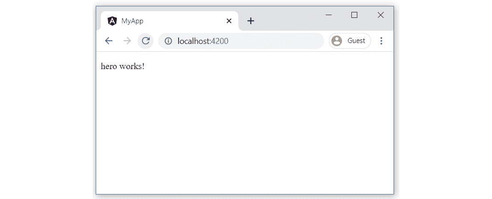
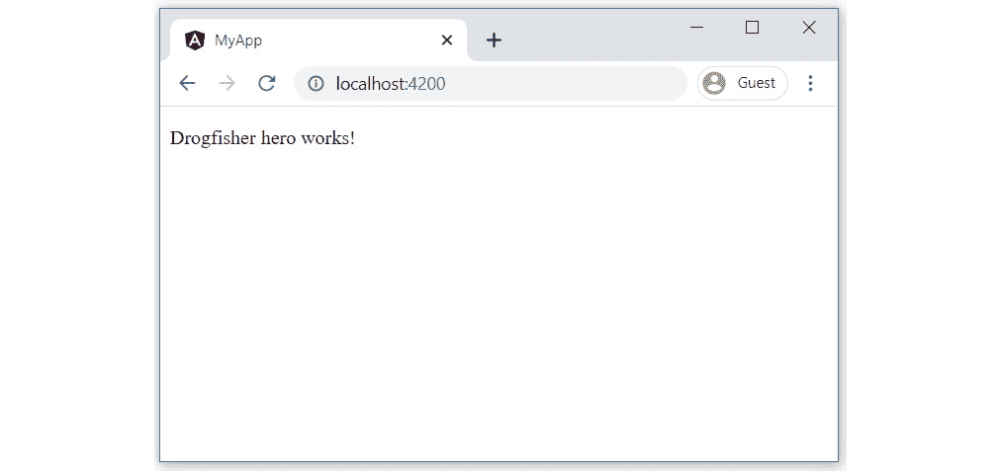
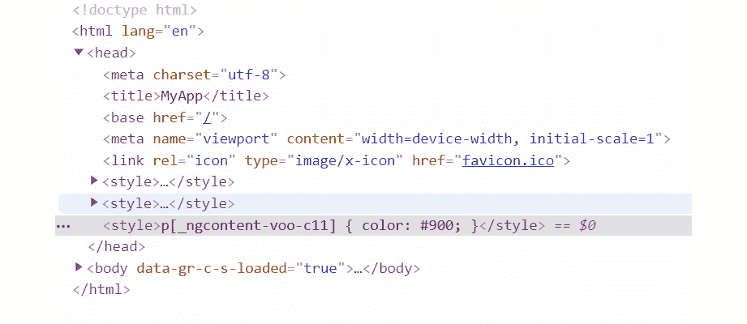

# 三、组件交互

到目前为止，我们有机会鸟瞰 Angular 框架。我们学习了如何使用 Angular CLI 10 创建新的 Angular 应用，以及 Angular 框架如何在后台工作。事实证明，TypeScript 是这项工作的完美伴侣。

我们似乎拥有我们需要的一切，来探索 Angular 为游戏带来的关于创建交互组件以及它们如何相互通信的更多可能性。

在本章中，我们将执行以下操作：

*   了解如何为 Angular 应用创建组件
*   发现我们可以使用的所有语法可能性来绑定模板中的内容
*   为我们的组件创建公共 API，以便我们可以从它们的属性和事件处理程序中获益
*   请参见如何在 Angular 中实现数据绑定
*   通过视图封装降低 CSS 管理的复杂性
*   了解如何调整组件内部的更改检测
*   对组件生命周期进行概述

# 技术要求

GitHub 链接：[https://github.com/PacktPublishing/Learning-Angular--Third-Edition/tree/master/ch03](https://github.com/PacktPublishing/Learning-Angular--Third-Edition/tree/master/ch03) 。

# 创建我们的第一个组件

组件是 Angular 应用的基本构建块。它们控制网页的不同部分，称为**视图**，如产品列表或注册表单。Angular 应用由可相互交互的组件树组成：


图 3.1–组件架构

Angular 应用的体系结构基于组件。每个 Angular 组件都可以与组件树中的一个或多个组件进行通信和交互。正如我们在前面的图中所看到的，一个组件可以同时是一些子组件的父组件和另一个父组件的子组件。

Angular CLI 最常用的命令之一是`generate`命令，我们使用它来创建某些 Angular 工件。我们用以下语法定义工件的`<type>`及其`<name>`：

```ts
ng generate <type> <name>
```

您可以在[找到可用类型的列表 https://angular.io/cli/generate#ng-生成](https://angular.io/cli/generate#ng-generate)。

在本章中，我们对组件类型感兴趣。在下面的章节中，我们将学习如何创建其他类型的工件。要创建组件，请导航到 Angular CLI 项目的根文件夹，并在命令行中运行以下命令：

```ts
ng generate component hero
```

如果您正在使用 VS 代码，请考虑使用集成终端来运行角 CLI 命令。在主菜单中选择**终端**新建终端打开。

重要提示

在 Windows 中，VS 代码的集成终端默认使用**PowerShell**，这可能会因为安全原因阻止您运行 Angular CLI 命令。要更改它，请单击下拉菜单**1:powershell**，选择**选择默认 Shell**选项，然后选择**命令提示符**。

创建 Angular 组件需要两个步骤。它包括组件必要文件的创建及其与 Angular 模块的注册。我们将在以下部分了解有关此过程的更多详细信息。

## 组件文件创建

当我们运行上一节中的命令生成 Angular 组件时，Angular CLI 在`app`文件夹中创建一个`hero`文件夹，并生成以下文件：


图 3.2–组件文件夹结构

Angular CLI 在每个文件名中添加单词`component`作为约定。它对所有 Angular 工件（如指令、管道和服务）遵循相同的原则，以便使用 IDE 的搜索功能以及其他文件更容易找到它们。典型的 Angular 组件由以下文件组成：

*   **组件类**：一个类型脚本文件，包含组件的数据和表示逻辑（`hero.component.ts`）。
*   **组件模板**：与`class`关联的 HTML 文件，定义组件的视图（`hero.component.html`）。
*   **组件样式**：一组范围明确的 CSS 样式，特别是针对组件（`hero.component.css`）。文件的扩展名取决于创建新 Angular 应用时选择的样式类型。
*   **组件单元测试**：随组件一起进行的一组单元测试（`hero.component.spec.ts`。

## 模块注册

在[*第 1 章*](01.html#_idTextAnchor015)*构建您的第一个 Angular 应用*中，我们讨论了 Angular 如何在内部工作，通过搜索 Angular 应用的所有注册组件来显示组件。Angular CLI 通过将组件添加到主应用模块`AppModule`的`declarations`属性中，在创建组件时自动注册该组件：

app.module.ts

```ts
import { BrowserModule } from '@angular/platform-browser';
import { NgModule } from '@angular/core';
import { AppComponent } from './app.component';
import { HeroComponent } from './hero/hero.component';
@NgModule({
  declarations: [
    AppComponent,
    HeroComponent
  ],
  imports: [
    BrowserModule
  ],
  providers: [],
  bootstrap: [AppComponent]
})
export class AppModule { }
```

`@NgModule`装饰器的`declarations`属性是我们放置要向模块注册的 Angular 工件的地方。这些可以是组件、指令和管道。为了正确地声明它们，我们必须`import`将它们作为 ES6 模块。幸运的是，Angular CLI 自动为我们添加了`import`语句。稍后我们将在[*第 5 章*](05.html#_idTextAnchor129)*中学习如何构造一个 Angular App*，一个 Angular application 可以有许多模块，以及如何使用`@NgModule`装饰器配置它们。现在我们已经创建了一个组件，让我们看看如何对其进行适当的配置。

# 配置组件

组件是通常是一个带有`@Component`修饰符的打字脚本`class`。与文件名约定类似，Angular CLI 在`class`名称中添加了单词`Component`。所有 Angular 构件都是 TypeScript 类，它们遵循相同的命名原则，并具有适当的装饰器。Angular 不会在框架的上下文中识别它们，除非我们定义了上面的`class`定义中的装饰器*。装饰器用于将元数据传递给 Angular，以便它知道如何创建特定工件。`@Component`装饰器的元数据是一个具有特定属性的普通对象：*

```ts
@Component({
  selector: 'app-hero',
  templateUrl: './hero.component.html',
  styleUrls: ['./hero.component.css']
})
```

特别是，它定义了以下选项：

*   `selector`：要在 HTML 模板中标识的组件的名称。它告诉 Angular 在 HTML 中找到相应标记时在何处创建组件。Angular CLI 默认情况下会添加`app`前缀，但您可以在使用`--prefix`选项创建 Angular 项目时对其进行自定义。
*   `templateUrl`：组件模板文件相对于组件`class`的路径。或者，您可以使用`template`属性内联提供模板。
*   `styleUrls`：组件样式文件相对于组件`class`的路径。请注意，此选项是一个数组，可接受多个文件进行组件样式设置。或者，您可以使用`styles`属性内联提供样式。

零部件模板文件是 Angular 零部件的基本特性。在下一节中，我们将详细了解如何与之交互。

# 与模板交互

在[*第 1 章*](01.html#_idTextAnchor015)*构建您的第一款 Angular 应用*中，我们看到 Angular 如何显示来自组件的 HTML 内容，但我们甚至没有为 Angular 开发模板。正如我们将在本书后面看到的，模板实现与 shadowdom 设计的原则紧密结合在一起，它提供了许多语法糖分，以简化以声明方式在视图中绑定属性和事件的任务。让我们首先看一看 Angular 组件如何通过显示和获取数据或对其应用样式来与其模板交互。

## 显示来自组件的数据

我们已经偶然发现了插值，以显示从`class`组件到模板的属性值：

```ts
<span>{{ title }}</span>
```

Angular 将`title`组件属性转换为文本并显示在屏幕上。执行插值的另一种方法是将`title`绑定到`span`HTML 元素的`innerText`属性，方法称为**属性绑定**：

```ts
<span [innerText]="title"></span>
```

请注意，我们将绑定到元素的**文档对象模型（DOM）**属性，而不是一个 HTML 属性，乍一看就是这样。方括号内的属性称为目标属性，是我们要绑定到的 DOM 元素的属性。右边的变量称为模板表达式，对应组件的`public``title`属性。如果该属性不是`public`，模板将无法使用该属性。

重要提示

当我们在浏览器中打开一个网页时，它会解析网页的 HTML 内容，并将其转换为树形结构 DOM。页面的每个 HTML 元素都转换为一个称为节点的对象，它表示 DOM 的一部分。节点定义一组表示此对象 API 的属性和方法。`innerText`就是这样一个属性，用于设置 HTML 元素内部的文本。

为了更好地理解 Angular 模板机制是如何工作的，我们需要首先了解 Angular 如何与属性和属性交互。它在 HTML 中定义属性来初始化 DOM 属性，然后使用数据绑定直接与属性交互。

为了设置 HTML 元素的属性，我们通过属性绑定使用`attr-`语法。例如，要设置 HTML 元素的`aria-label`属性，我们将编写以下代码：

```ts
<p [attr.aria-label]="myText"></p>
```

这里，`myText`是相应 Angular 分量中的一个属性。请记住，属性绑定与 Angular 组件的属性交互。因此，如果我们想将`innerText`属性的值直接设置为 HTML，我们将编写包含单引号的文本值：

```ts
<span [innerText]="'My title'"></span>
```

在这种情况下，传递给`innerText`属性的值是静态`string`，而不是组件属性。

属性绑定是一种方便的技术，不仅用于显示，而且用于样式目的。

## 将样式应用于模板

web 应用中的样式可以使用 HTML 元素的`class`或`styles`属性进行应用：

```ts
<p class="star"></p>
<p style="color: greenyellow"></p>
```

Angular 框架提供两种类型的属性绑定来动态设置它们，**类绑定**和**样式绑定**。我们可以使用以下语法将单个类应用于 HTML 元素：

```ts
<p [class.star]="isLiked"></p>
```

当`isLiked`表达式为`true`时，`star`类将添加到段落元素中。否则，它将从元素中删除。如果要同时应用多个类，可以使用以下语法：

```ts
<p [class]="currentClasses"></p>
```

`currentClasses`变量是组件`class`的一个属性，可以是以下之一：

*   以空格分隔的类名字符串，如`'star, active'`。
*   一个对象，其中键作为类名，值作为每个键的`boolean`条件。当键的值及其名称计算为`true`时，将向元素添加一个类。否则，该类将从元素

    ```ts
    currentClasses = {
      star: true,
      active: false
    };
    ```

    中删除

我们可以直接为元素设置样式，而不是使用 CSS 类为元素设置样式。与类绑定类似，我们可以使用样式绑定同时应用单个或多个样式。可以使用以下语法将单个样式设置为 HTML 元素：

```ts
<p [style.color]="'greenyellow'"></p>
```

段落元素将具有`greenyellow`颜色。一些样式可以在绑定中进一步扩展，比如段落元素的`width`，我们可以用度量单位来定义：

```ts
<p [style.width.px]="100"></p>
```

段落元素的长度将为`100`像素。如果需要同时切换多个样式，可以使用对象语法：

```ts
<p [style]="currentStyle"></p>
```

`currentStyle`可以是样式用分号分隔的字符串：

```ts
currentStyle = 'color: greenyellow; width: 100px';
```

或者，它可以是一个对象，其中键是样式名称，值是实际样式值：

```ts
currentStyle = {
  color: 'greenyellow',
  width: '100px'
};
```

类和样式绑定是 Angular 在设计组件样式时提供的强大功能。一个同样引人注目的特性是能够将数据从模板读入组件类。

## 从模板中获取数据

在前面的部分中，我们学习了如何使用属性绑定来显示来自组件`class`的数据。现实场景通常涉及通过组件的双向数据流。为了将模板中的数据返回到组件，我们使用了一种名为**事件绑定**的方法。考虑下面的 HTML 片段：

```ts
<button (click)="onClick()">Click me</button>
```

事件绑定侦听在目标 HTML 元素上发生的 DOM 事件，并通过调用组件中相应的方法来响应这些事件。在这种情况下，当用户点击`button`时，组件调用`onClick`方法。括号内的事件被称为**目标事件**，是我们正在收听的事件。

支持本机 DOM 事件，可在[找到 https://developer.mozilla.org/en-US/docs/Web/Events](https://developer.mozilla.org/en-US/docs/Web/Events) 。

右边的变量称为**模板语句**，对应组件的`onClick``public`方法。组件方法必须是`public`模板才能调用它们：


图 3.3–组件模板交互

在前面的图中，您可以看到组件如何与其模板双向交互的概述。当我们想要在组件之间通信时，也遵循同样的原则。

# 与其他部件通信

简而言之，Angular 组件公开了一个公共 API，允许它们与其他组件通信。此 API 包含输入属性，我们使用这些属性向组件提供数据。它还公开了我们可以将事件侦听器绑定到的输出属性，从而获得有关组件状态更改的及时信息。

让我们来看看 Angular 如何解决在下面的部分中通过快速和简单的例子将数据注入组件和从组件中删除数据的问题。

## 使用输入绑定传递数据

在*创建第一个组件*部分，我们学习了如何在 Angular 项目中创建新组件。默认情况下，Angular CLI 为我们的新组件创建了一个带有静态 HTML 内容的模板：

```ts
<p>hero works!</p>
```

要查看正在运行的新组件，请执行以下操作：

1.  导航到`src`文件夹中存在的`app`文件夹。
2.  打开应用主要组件的模板`app.component.html`。
3.  Replace the contents of the template with the `selector` of the hero component, `<app-hero></app-hero>`.

    如果我们运行应用，我们将在屏幕上看到新组件的模板：



图 3.4–简单 Angular 组件

仅显示静态信息的模板在 Angular 应用中很少见。让我们通过显示实际工作的英雄的名字，使我们的英雄组件更具交互性。名称将从`AppComponent`动态传递。最初，我们在 hero 组件`class`中定义一个属性，使用`@Input`装饰符，后跟属性名称：

```ts
@Input() name: string;
```

`@Input`decorator 是 Angular 团队创建的一个专门的 TypeScript decorator，当我们想将数据从一个组件*向下*传递到另一个组件时使用它。我们首先需要从`@angular/core`包中导入使用：

```ts
import { Input } from '@angular/core';
```

输入属性的类型`string`定义了要传递到组件中的数据类型。

定义输入属性后，我们使用插值将`name`属性绑定到 hero 组件的模板：

```ts
<p>{{name}} hero works!</p>
```

我们已经完成了大部分工作；我们现在需要从`AppComponent`传递输入属性的值。我们使用属性绑定，正如我们前面所了解的，在与模板部分交互的*中，将`AppComponent`中的`hero`属性的值绑定到 hero 组件的`name`输入属性中。这种方法称为**输入绑定**：*

```ts
<app-hero [name]="hero"></app-hero>
```

在某些情况下，我们希望传递一个静态`string`或一个我们确信永远不会更改的值。在这些情况下，我们可以省略输入属性周围的方括号，如下所示：

```ts
<app-hero name="Boothstomper"></app-hero>
```

我们在输入绑定中使用的`hero`变量对应于`AppComponent`中的一个属性：

```ts
export class AppComponent {
  title = 'my-app';
  hero = 'Drogfisher';
}
```

如果我们现在运行应用，它应该显示以下内容：



图 3.5–具有输入绑定的组件

就这样！我们已成功地将数据从一个组件传递到另一个组件。在下一节中，我们将学习如何侦听组件中的事件并对其作出响应。

## 使用输出绑定监听事件

我们了解到，当我们想要在组件之间传递数据时，使用输入绑定。此方法适用于有两个组件的场景，一个作为父组件，另一个作为子组件。如果我们想以另一种方式沟通，从子组件到父组件，该怎么办？我们如何通知父组件在子组件中发生的特定操作？

考虑一个场景，其中英雄组件的模板包含一个像 TytT4}的 Ty3 t0 元素，当点击时，该元素应该通知用户关于用户行为的 T1。最初，我们在 hero 组件`class`中定义一个输出属性：

```ts
@Output() liked = new EventEmitter();
```

`liked`属性是一个`EventEmitter`标记有`@Output`装饰符，后跟属性名称。`@Output`修饰符是 Angular 团队创建的一个专门的 TypeScript 修饰符，当我们想要触发从一个组件*到*到另一个组件的事件时，可以使用它。我们首先需要从`@angular/core`包中导入这两种产品以使用它们：

```ts
import { Output, EventEmitter } from '@angular/core';
```

重要提示

许多包，Angular 的和非 Angular 的，都包含一个`EventEmitter`类。确保从`@angular/core`包中导入正确的。

我们的按钮应该调用`liked`属性的`emit`方法来触发`EventEmitter`：

```ts
<button (click)="liked.emit()">Like</button>
```

我们快到了！我们需要连接`AppComponent`中的绑定，以便两个组件可以相互通信。我们使用事件绑定，正如我们前面所了解的，在与模板交互的*部分中，将`onLike`方法从`AppComponent`绑定到 hero 组件的`liked`输出属性中。这种方法称为**输出绑定**：*

```ts
<app-hero [name]="hero" (liked)="onLike()"></app-hero>
```

当用户点击英雄组件中的`button`等**按钮时，`AppComponent`调用`onLike`方法：**

```ts
onLike() {
    window.alert(`I like ${this.hero}`);
}
```

然后，应用显示以下警报消息：


图 3.6–显示警报窗口的输出绑定

在这里，您可以看到对我们已经讨论过的组件通信机制的概述：


图 3.7–组件间通信

英雄组件的`liked``EventEmitter`只会向父组件`AppComponent`发出一个事件。`EventEmitter``class`也可用于通过`emit`方法传递任意数据，我们将在下一节中学习。

### 通过自定义事件发送数据

`EventEmitter`属性的`emit`方法可以接受传递给父组件的任何数据。正确的方法是首先定义可以传递给属性的数据类型。

假设应用在每次点击时都保持**Like**按钮的状态，以便用户可以喜欢或不喜欢英雄。我们将使用`EventEmitter`类的泛型来声明将传递到`AppComponent`的数据类型：

```ts
@Output() liked = new EventEmitter<boolean>();
```

hero 组件模板的`click`事件绑定将调用传递`boolean`值的`emit`方法，如下所示：

```ts
<button (click)="liked.emit(true)">Like</button>
```

然后可通过`$event`对象在`AppComponent`中获取数据：

```ts
<app-hero [name]="hero" (liked)="onLike($event)"></app-hero>
```

`$event`对象是 Angular 中的保留关键字，包含事件发射器的有效负载数据。

输入和输出绑定是使用公共 API 在组件之间进行通信的好方法。但是，在某些情况下，我们希望直接使用本地模板引用变量访问组件的属性或方法。

## 模板中的本地引用

我们已经看到了如何使用插值和双花括号语法将数据绑定到模板。除此之外，在属于我们的组件的元素中，甚至在常规 HTML 元素中，我们经常会发现以哈希符号（`#`为前缀的命名标识符。这些引用标识符，即**模板引用变量**，用于引用模板视图中标记有它们的组件，然后以编程方式访问它们。组件还可以使用它们引用 DOM 中的其他元素并访问它们的属性。

在上一节中，我们了解了如何监听 hero 组件的`liked`事件或通过`AppComponent`的`hero`属性传递数据。但是，如果我们可以深入检查组件，或者至少检查它的`public`属性和方法，并且在不经过输入和输出绑定的情况下访问它们，会怎么样呢？那么，在组件本身上设置一个本地引用将打开通向其公共外观的大门。让我们在模板`AppComponent`中声明我们的`hero`组件的实例，本地引用名为`#heroCmp`：


图 3.8–作用中的模板参考变量

从那一刻起，我们可以直接访问 hero 组件的`public`属性，甚至可以将其绑定到模板的其他位置。这样，我们甚至不需要依赖输入和输出属性，甚至可以操纵这些属性的值。

我们主要解释了组件类如何与其模板或其他组件交互，但我们几乎不关心它们的样式。

# 封装 CSS 样式

为了更好地封装我们的代码并使其更易于重用，我们可以在组件中定义 CSS 样式。在*配置组件*一节中，我们学习了如何通过`styleUrls`属性使用外部 CSS 文件或通过使用`styles`属性在 TypeScript 组件文件中定义 CSS 样式来为组件定义 CSS 样式。

CSS 特异性的一般规则适用于两种方式：

[https://developer.mozilla.org/en/docs/Web/CSS/Specificity](https://developer.mozilla.org/en/docs/Web/CSS/Specificity)

CSS 管理和特殊性在支持阴影 DOM 的浏览器上变得轻而易举，这要归功于作用域样式。CSS 样式应用于组件中包含的元素，但它们不会超出其边界。

最重要的是，Angular 将样式表嵌入到文档的头部，以便它们可能会影响应用的其他元素。为了防止这种情况发生，我们可以设置不同级别的视图封装。简而言之，封装是 Angular 在组件内管理 CSS 作用域的方式，适用于与 Shadow DOM 兼容的浏览器和不支持它的浏览器。可以通过在以下`ViewEncapsulation`枚举值之一中设置`@Component`修饰符的`encapsulation`属性来更改：

*   `Emulated`：这是默认选项，通过在指向我们组件的特定选择器下沙箱化 CSS 规则，它需要模拟阴影 DOM 中的本机作用域。此选项优先用于确保我们的组件样式受应用上其他现有库的影响。
*   `Native`：使用渲染器的本机 Shadow DOM 封装机制，该机制仅适用于支持 Shadow DOM 的浏览器。
*   `None`：未提供模板或样式封装。样式按原样注入到文档的标题中。

让我们来看看 PosiT0.视图封装的一个例子：

```ts
import { Component, ViewEncapsulation } from '@angular/core';
@Component({
  selector: 'app-hero',
  templateUrl: './hero.component.html',
  styles: ['p { color: #900; }'],
  encapsulation: ViewEncapsulation.Emulated
})
```

如果我们使用浏览器的 developer tools inspector 并检查生成的 HTML，我们将发现 CSS 是如何在页面`<head>`块中插入的：



图 3.9–从 Angular 注入的 CSS 样式

已使用自定义 CSS 选择器`_ngcontent-voo-c11`对注入的样式表进行了沙盒处理，以确保我们在组件上定义的全局 CSS 规则仅适用于`hero`组件范围内的匹配元素。

重要提示

以`_ngcontent`开头的自定义 CSS 选择器是从 Angular 框架动态创建的，在运行前面的示例时可能不相同。

我们可以配置的`@Component`装饰器的另一个基本属性是组件的更改检测策略。

# 变更检测策略

更改检测是 Angular 内部使用的机制，用于检测组件属性中发生的更改，并将此更改反映到视图中。这是一个非确定性过程，在特定事件时触发，例如当用户单击按钮时，异步请求完成，或执行`setTimeout`和`setInterval`方法。Angular monkey 通过使用名为**Zone.js**的库覆盖其默认行为来修补这些类型的事件。

每个组件都有一个更改检测器，通过比较属性的当前值和前一个值来检测其属性中是否发生了更改。如果存在差异，则会将更改应用于组件的模板。在下面的代码片段中，当`name`输入属性由于我们前面提到的事件而发生更改时，更改检测机制将为此组件运行，并相应地更新模板：

```ts
@Input() name: string;
```

在某些用例中，这种行为不是理想的，例如在呈现列表中数百或数千项的组件中。在这种情况下，默认的更改检测机制可能会在应用中引入性能瓶颈。在这种情况下，我们可以设置`@Component`装饰器的`changeDetection`属性，从可用的`ChangeDetectionStrategy`枚举值中选择不同的策略：

```ts
import { Component, ChangeDetectionStrategy } from '@angular/core';
@Component({
  selector: 'app-hero',
  templateUrl: './hero.component.html',
  changeDetection: ChangeDetectionStrategy.OnPush
})
```

`OnPush`策略仅在`@Input`属性的引用发生变化时触发*变化检测机制*，显著提高了大规模应用的性能。

变更检测策略结束了我们如何配置组件的旅程，但 Angular 框架并没有就此结束。它还允许我们连接到组件生命周期中的特定时间，我们将在下一节中学习。

# 介绍组件生命周期

生命周期事件是允许我们监视组件生命周期中特定阶段并应用自定义逻辑的钩子。它们是完全可选的，但如果您了解如何使用它们，可能会有很大帮助。一些钩子被认为是使用的最佳实践，而其他钩子则有助于调试和理解 Angular 应用中发生的事情。钩子附带了一个`interface`，它定义了我们需要实现的方法。Angular 框架确保调用钩子，前提是我们已经在组件中实现了这个方法。在组件中定义`interface`不是强制性的，但它被认为是一种良好的做法。Angular 框架关心我们是否实现了实际的方法。可用的组件生命周期挂钩如下：

*   `OnInit`
*   `OnDestroy`
*   `OnChanges`
*   `DoCheck`
*   `AfterContentInit`
*   `AfterContentChecked`
*   `AfterViewInit`
*   `AfterViewChecked`

所有以前的生命周期挂钩都可以从 Angular 框架的`@angular/core`包中获得。在本节中，我们将介绍 Angular 应用中最常用的前三个。剩下的一些将在本书后面的章节中重温。

组件的第一个也是最基本的生命周期事件是`OnInit`挂钩。

## 执行组件初始化

Angular CLI 在创建新组件时默认实现：

```ts
import { Component, OnInit, Input, Output, EventEmitter } from '@angular/core';
@Component({
  selector: 'app-hero',
  templateUrl: './hero.component.html',
  styleUrls: ['./hero.component.css']
})
export class HeroComponent implements OnInit {
  @Input() name: string;
  @Output() liked = new EventEmitter();
  constructor() { }
  ngOnInit(): void {
  }
}
```

`OnInit`生命周期钩子实现`ngOnInit`方法，该方法在组件初始化时调用。在这个阶段，所有的输入绑定和数据绑定属性都已正确设置，我们可以安全地使用它们。使用组件的`constructor`来访问它们可能很有诱惑力。在以下代码段中，`constructor`中未定义`name`输入属性：

```ts
constructor() {
  console.log(this.name);
}
```

构造函数应该是相对空的，并且除了设置初始变量之外没有其他逻辑。在`constructor`中添加业务逻辑也使得在测试场景中模拟 it 变得非常困难。

`OnInit`钩子的另一个很好的用途是，当我们需要使用来自外部源（如 Angular service）的数据初始化组件时。正如我们将在[*第 5 章*](05.html#_idTextAnchor129)*中了解到的，*构造了一个 Angular 应用*，当我们想在组件初始化之前使用 Angular 服务的方法时，我们在`ngOnInit`方法中调用它。*

Angular 框架为组件生命周期的所有阶段（从初始化到销毁）提供了挂钩。

## 清理资源

我们为钩住销毁事件而实现的`interface`是`OnDestroy`生命周期钩子：

```ts
export class HeroComponent implements OnDestroy, OnInit {
  @Input() name: string;
  @Output() liked = new EventEmitter();
  constructor() { }
  ngOnInit(): void {
  }
  ngOnDestroy() {
  }
}
```

我们可以使用多个生命周期挂钩，方法是用一个“*逗号”*分隔它们。`OnDestroy`生命周期钩子实现了`ngOnDestroy`方法，当从网页的 DOM 树中删除组件时调用该方法。销毁组件可能是以下情况之一的结果：

*   使用`ngIf`指令，正如我们将在[*第 4 章*](04.html#_idTextAnchor113)中学习的，*使用管道和指令*增强组件。
*   使用 URL 远离组件，我们将在[*第 7 章*](07.html#_idTextAnchor168)中学习，*使用路由*浏览组件。

我们通常在`ngOnDestroy`方法中对组件资源进行清理，例如：

*   重置计时器和间隔
*   取消对可观察流的订阅，我们将在[*第 6 章*](06.html#_idTextAnchor149)中学习，*使用异步数据服务丰富组件*

我们已经学习了如何使用输入绑定将数据传递给组件。Angular 框架提供了`OnChanges`生命周期挂钩，我们可以使用它来检查这种绑定的值何时发生了变化。

## 检测输入变化

为了更好地理解它的工作原理，让我们看看它的实际应用：

1.  打开`app.component.ts`文件，修改`onLike`方法，将`hero`属性改为`Boothstomper`：

    ```ts
    onLike() {
      window.alert(`I like ${this.hero}`);
      this.hero = 'Boothstomper';
    }
    ```

2.  打开`hero.component.ts`文件，在组件的已实现接口列表中添加`OnChanges`生命周期钩子。
3.  添加`ngOnChanges`方法，该方法实现了刚才添加的`interface`。

`ngOnChanges`方法接受一个类型为`SimpleChanges`的对象作为参数，该参数包含每个更改的输入属性的一个键。每个键指向另一个具有属性`currentValue`和`previousValue`的对象，分别表示输入属性的新值和旧值：

```ts
ngOnChanges(changes: SimpleChanges) {
  const hero = changes['name'];
  const oldValue = hero.previousValue;
  const newValue = hero.currentValue;
  console.log(`Hero changed from ${oldValue} to ${newValue}`);
}
```

前面的代码段跟踪`name`输入属性的更改，并在控制台窗口中记录新旧值。要检查结果，请执行以下操作：

1.  使用`ng serve`运行应用。
2.  从浏览器的开发人员工具打开控制台窗口。
3.  点击**Like**按钮。
4.  关闭弹出对话框并注意控制台窗口中的输出。


图 3.10–浏览器控制台窗口

在最后一行中，您可以通过`ngOnChanges`方法查看日志。如果仔细观察，您会注意到第一行中有一个额外的日志，说明名称从**未定义**更改为**Drogfisher**。为什么呢？我们已经了解到，`ngOnChanges`方法在组件的输入属性改变时被调用。属性的初始值也被视为一种变化。旧值为`undefined`，因为该属性还没有值。新值是我们在属性中设置的第一个值——在我们的例子中是`Drogfisher`。为了消除不必要的日志，我们可以使用`isFirstChange`方法检查这是否是第一次更改：

```ts
if (!hero.isFirstChange()) {
  console.log(`Hero changed from ${oldValue} to ${newValue}`);
}
```

如果我们重新运行应用，我们可以在控制台窗口中看到正确的日志。

# 总结

在本章中，我们学习了如何使用 Angular CLI 创建 Angular 组件，并使用`@Component`装饰器对其进行配置。我们讨论了如何在外部文件中隔离组件的 HTML 模板，以简化其未来的可维护性。此外，我们还了解了如何对任何要绑定到组件的样式表执行相同的操作，以防我们不希望内联绑定组件样式。我们还使用属性和事件绑定以双向方式完成了组件与其模板之间的通信。

我们了解了 Angular 中为组件创建强大 API 的可用选项，因此我们可以在组件之间提供高级别的互操作性，通过分配静态值或托管绑定来配置其属性。我们还看到了一个组件如何充当另一个子组件的主机组件，在其模板中实例化了前者的自定义元素，为应用中更大的组件树奠定了基础。输出参数通过将组件转换为事件发射器来提供所需的交互层，以便它们能够以不可知的方式与最终可能承载它们的任何父组件充分通信。

模板引用为在自定义元素中创建引用铺平了道路，我们可以在模板中以声明方式将这些元素用作其属性和方法的访问器。通过对 Angular 中处理 CSS 视图封装的内置特性的概述，我们进一步了解了如何在每个组件的基础上受益于 Shadow DOM 的 CSS 范围。最后，我们了解了变化检测在 Angular 应用中的重要性，以及如何对其进行定制以进一步提高其性能。

关于 Angular 中的模板管理，我们还有很多要学习的内容，主要是关于两个概念，您将在 Angular 的旅程中广泛使用这两个概念：指令和管道，我们将在下一章介绍它们。