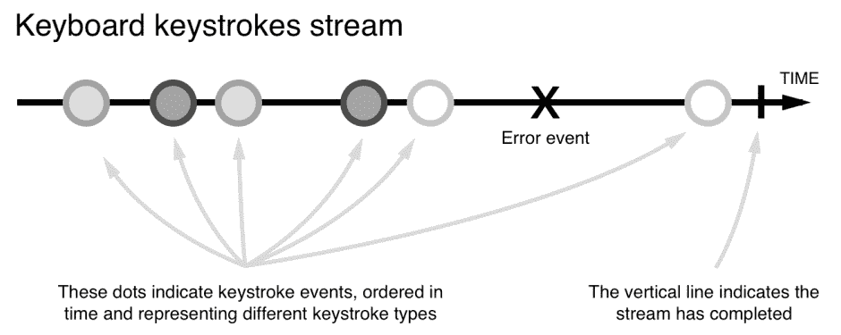
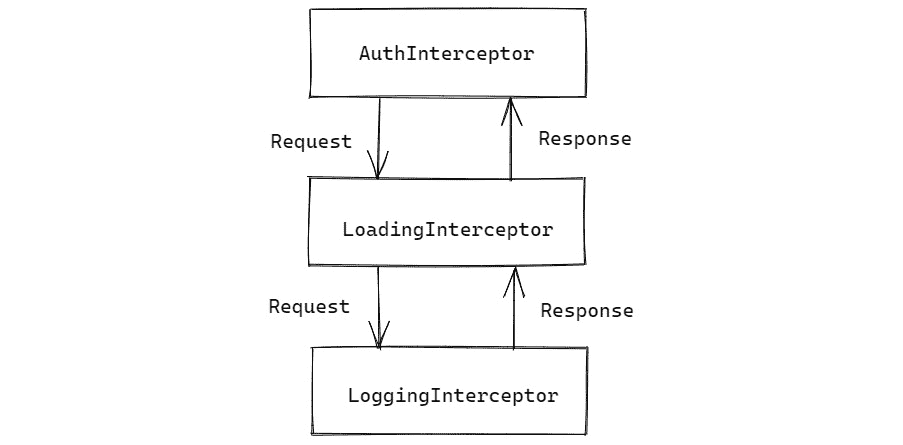

# 六、使用异步数据服务丰富组件

作为开发人员，连接到数据服务和 API 并处理异步信息是我们日常生活中的一项常见任务。从这个意义上讲，Angular 提供了一个无与伦比的工具集来帮助我们消费、消化和转换从数据服务获取的各种信息。可观察流和 HTTP 数据访问位于该工具集的最前沿，为开发人员在创建应用时提供了丰富的功能集。

有许多可能性可以描述如何通过 HTTP 连接到 API 或异步使用文件系统中的信息。在这本书中，我们将只触及表面。尽管如此，本章中介绍的见解将为您提供在任何时候都能将 Angular 应用连接到 HTTP 服务所需的一切，让您的创造力决定如何使用它们。

在本章中，我们将执行以下操作：

*   查看处理异步数据的不同策略
*   介绍 observer 软件设计模式
*   讨论功能反应式编程和**RxJS**
*   了解 Angular 中的内置 HTTP 客户端及其 API
*   了解如何拦截 HTTP 请求并设置其他 HTTP 头
*   了解 Angular**内存 web API**以及如何将其连接到 Angular 应用

# 技术要求

下面是相应的 GitHub 链接：[https://github.com/PacktPublishing/Learning-Angular--Third-Edition/tree/master/ch06](https://github.com/PacktPublishing/Learning-Angular--Third-Edition/tree/master/ch06) 。

# 处理异步信息的策略

使用 API 中的信息是我们日常开发工作流程中的一个典型操作。我们一直在 HTTP 上使用数据，例如通过向身份验证服务发送凭据来验证用户时。我们在最喜欢的 Twitter 小部件中获取最新推文时也使用 HTTP。现代移动设备引入了一种独特的远程服务消费方式。他们延迟请求和响应，直到移动连接可用。响应度和可用性已经成为一件大事。尽管当今互联网连接速度很快，但在提供此类信息时，总是需要一定的响应时间。因此，正如我们将在下面几节中看到的，我们为最终用户提供了以透明方式处理应用中状态的机制。

## 从地狱转向承诺

有时，我们可能需要在应用中构建一些功能，一旦过了一段时间，这些功能就会异步改变其状态。为了处理应用状态中的延迟更改，我们需要引入代码模式，例如**回调模式**。

在回调中，触发异步操作的`function`接受另一个`function`作为参数，该参数在异步操作完成时调用。让我们通过一个示例来了解如何使用回调：

1.  首先，创建一个名为`my-app`的新 Angle 应用。
2.  打开`app.component.ts`文件并创建`setTitle`属性以更改组件的`title`属性。请注意，它返回一个箭头`function`，因为我们将使用它作为对另一个方法

    ```ts
    private setTitle = () => {
      this.title = 'Hello Angular 10';
    }
    ```

    的回调
3.  接下来，创建一个`changeTitle`方法，该方法在 2 秒后调用另一个方法，按照约定命名为`callback`：

    ```ts
    private changeTitle(callback) {
      setTimeout(() => {
        callback();
      }, 2000);
    }
    ```

4.  最后，在组件的`constructor`中调用`changeTitle`方法，将`setTitle`属性作为参数传递：

    ```ts
    constructor() {
      this.changeTitle(this.setTitle);
    }
    ```

如果我们运行 Angular 应用，我们会看到`title`属性在 2 秒后确实发生了变化。注意`changeTitle`方法如何使用不带括号的`setTitle`。当我们使用回调时，我们传递的是`function`签名，而不是实际的`function`调用。

这种模式的问题是，随着我们引入越来越多的嵌套回调，代码可能变得非常混乱和繁琐。考虑下面的场景，我们需要钻取文件夹层次结构来访问设备中的照片：

```ts
getRootFolder(folder => {
  getAssetsFolder(folder, assets => {
      getPhotos(assets, photos => {   
      });
  });
});
```

我们依赖于上一个异步调用及其在执行下一个调用之前返回的数据。我们必须在回调中执行一个方法，该方法使用回调执行另一个方法，等等。代码很快就变得可怕和复杂，这导致了一种被称为**回调地狱**的情况。

我们可以使用**承诺**避免回调地狱。Promissions 引入了一种新的方式，通过遵循更整洁、更可靠的接口来设想异步数据管理。不同的异步操作可以在同一级别链接，甚至可以拆分并从其他函数返回。为了更好地理解承诺是如何工作的，让我们重构前面的回调示例：

1.  创建一个名为`onComplete`的新方法，该方法返回一个`Promise`对象。`Promise`对象接受两个参数；表示允诺成功完成并可选择返回结果的`resolve`方法，以及表示在执行过程中发生错误并可选择返回错误原因的`reject`方法：

    ```ts
    private onComplete() {
      return new Promise((resolve, reject) => {

      });
    }
    ```

2.  在 promise 中引入 2 秒的超时，以便在该时间过后解决该问题。注意承诺主体中没有`reject`方法。`reject`方法可选择使用：

    ```ts
    return new Promise((resolve, reject) => {
      setTimeout(() => {
        resolve();
      }, 2000);
    });
    ```

3.  Now, replace the `changeTitle` call in the `constructor` with the promise-based method. To execute a method that returns a promise, we invoke the method and chain it with the `then` method:

    ```ts
    constructor() {
      this.onComplete().then(this.setTitle);
    }
    ```

    如果我们重新运行 Angular 应用，我们不会注意到任何显著的差异。承诺的真正价值在于代码的简单性和可读性。我们现在可以相应地重构前面的文件夹层次结构示例：

    ```ts
    getRootFolder()
      .then(getAssetsFolder)
      .then(getPhotos);
    ```

    前面代码中调用的`then`方法的链接显示了我们如何将一个异步调用串联起来。以前的每个异步调用都将其结果传递给即将到来的异步方法。

承诺是令人信服的，但为什么我们需要另一种范式？嗯，有时我们可能需要生成一个响应输出，它遵循一个更复杂的摘要过程，甚至取消整个过程。我们不能用承诺来完成这样的行为，因为一旦它们被实例化，它们就会被触发。换句话说，承诺并不懒惰。另一方面，在特定场景中，在异步操作被触发但尚未完成后，可以很方便地将其拆除。承诺允许我们解析或拒绝异步操作，但有时我们可能希望在到达该点之前中止所有操作。

最重要的是，承诺表现为一次性操作。一旦这些问题得到解决，除非我们从头开始重新运行，否则我们无法期望收到任何进一步的信息或状态更改通知。此外，我们有时需要更积极主动地实现异步数据处理，这就是**观测值**出现的地方。总结承诺的局限性，请注意以下几点：

*   不能取消。
*   他们立即被处决。
*   它们只是一次性操作；没有简单的方法可以重试它们。
*   它们只响应一个值。

## 简而言之，可以观察到

可观察对象是一个维护依赖项列表的对象，称为**观察者**，并通过异步发送事件通知他们状态和数据更改。为了做到这一点，可观测的实现了它产生和发出这些事件所需要的所有机器。无论它是否已经发出了预期的数据，它都可以在任何时候被触发和取消。

观察者需要订阅一个可观察的，这样他们就可以得到通知并做出反应，以反映状态的变化。这种模式，也称为**观察者模式**，允许并发操作和更高级的逻辑。这些观察者，也被称为订阅者，一直在监听观察对象中发生的任何事情，直到它被处理掉。

我们可能可以在一个实际的例子中更透明地看到这一切：

1.  重构前面提到的`onComplete`方法，将`setTimeout`替换为`setInterval`：

    ```ts
    private onComplete() {
      return new Promise((resolve, reject) => {
        setInterval(() => {
          resolve();
        }, 2000);
      });
    }
    ```

2.  修改`setTitle`属性，将当前时间戳追加到组件

    ```ts
    private setTitle = () => {
      const timestamp = new Date().getMilliseconds();
      this.title = `Hello Angular 10 (${timestamp})`;
    }
    ```

    的`title`属性中
3.  运行 Angular 应用，您会注意到时间戳仅在 2 秒后设置一次，并且不会再次更改。承诺自行解决，整个异步事件就在此时终止。让我们使用可观测数据修复此行为！
4.  创建一个名为`title$`的组件属性，该属性创建一个`Observable`对象。我们每 2 秒调用`observer`的`next`方法，以指示数据或应用状态的更改：

    ```ts
    title$ = new Observable(observer => {
      setInterval(() => {
        observer.next();
      }, 2000);
    });
    ```

5.  Modify the `constructor` of the component to use the newly created `title$` property. We use the `subscribe` method to register to an observable and get notified of any changes. If we do not call this method, `setInterval` never executes:

    ```ts
    constructor() {
      this.title$.subscribe(this.setTitle);
    }
    ```

    重要提示

    当我们定义一个可观察变量时，我们倾向于在变量名称后面加上*$*符号。这是我们遵循的一个惯例，以便我们能够高效、快速地识别代码中的可观察对象。

如果运行应用，您会注意到时间戳现在每 2 秒更改一次。祝贺您已经进入了可观察和反应式函数编程的世界！

Observable 返回一个事件流，我们的订户收到这些事件的提示通知，以便他们可以相应地采取行动。它们不会执行异步操作并死亡（尽管我们可以配置它们），但会启动一个我们可以订阅的连续事件流。

然而，这还不是全部。这个流可以是许多操作的组合，在它们击中订阅它的观测者之前。正如我们可以使用`map`或`filter`等方法操作数组来转换它们一样，我们也可以对可观测数据发出的事件流进行同样的操作。这就是所谓的反应式函数编程，Angular 充分利用了这种范式来处理异步信息。

# 角坐标系下的反应式函数编程

观察者模式是我们所知的反应式函数编程的核心。反应式功能脚本的最基本实现包括我们需要熟悉的几个概念：

*   可见的
*   观察者
*   时间表
*   一连串的事件
*   一组可组合运算符

听起来令人畏惧？事实并非如此。这里最大的挑战是改变我们的思维方式，学会被动思考，这也是本节的主要目标。

简单地说，我们可以说反应式编程需要将异步订阅和转换应用于可观察的事件流。让我们通过一个更具描述性的例子来解释它。

考虑一个交互设备，比如键盘。它有用户按下的键。每一次击键都会触发一个特定的键盘事件，例如**键向上**。该事件具有广泛的元数据，包括但不限于用户在给定时刻按下的特定键的数字代码。当用户继续按键时，会触发更多的按键事件，并通过想象的时间线传递，该时间线应如下图所示：



图 6.1–击键事件的时间线

时间线是一个连续的数据流，其中 keyUp 事件可以随时发生；毕竟，用户决定何时按下这些键。回想一下上一节中带有可观测值的示例。该代码能够通知观察者，每隔 2 秒，就会发出另一个值。那个代码和我们的 keyUp 事件有什么区别？没有什么我们知道定时器间隔被触发的频率。在 keyUp 事件中，我们不知道，因为它不在我们的控制之下。但这是唯一的区别，这意味着键控事件也可以被认为是可观察的。让我们通过在我们的应用中实现一个键盘记录器来进一步解释它：

1.  创建一个名为`key-logger`的新 Angular 组件。
2.  将一个`input`元素添加到新创建组件的模板中，并向其附加一个模板引用变量。模板引用变量可以添加到任何 HTML 元素，而不仅仅是组件，正如我们在[*第 3 章*](03.html#_idTextAnchor092)、*组件交互和交互*：

    ```ts
    <input type="text" #keyContainer>
    ```

    中所了解的那样
3.  Create a new component property, named `input`, to read the template reference variable that we have just created. Create also a second property, named `keys`, to keep all the keys that the user has pressed:

    ```ts
    keys = '';
    @ViewChild('keyContainer', {static: true}) input: ElementRef;
    ```

    模板引用变量不仅可以在模板中查询，还可以使用`@ViewChild`装饰器在`class`组件中查询。`@ViewChild`装饰器接受两个参数：模板引用变量的名称和具有`static`属性的对象。`static`属性指示我们要查询的元素在组件初始化期间是否可用。但是，在某些情况下，它的值为`false`，例如使用带有`ngIf`指令的 HTML 元素时。在这种情况下，我们可以完全忽略该属性，因为这是默认行为。

    查询`keyContainer`模板引用变量的结果为`ElementRef`对象。要在我们的组件中使用`ViewChild`和`ElementRef`，我们首先需要从`@angular/core`npm 包中导入它们：

    ```ts
    import { Component, OnInit, ViewChild, ElementRef } from '@angular/core';
    ```

4.  使用我们之前创建的`keys`属性保存按下的键盘键，以便使用插值在模板上显示它们：

    ```ts
    <input type="text" #keyContainer>
    You pressed: {{keys}}
    ```

5.  The RxJS library has a variety of helpful operators that we can use with observables. One of them is the `fromEvent` operator, which creates an observable from the DOM event of a native HTML element. We use this operator in the `ngOnInit` method of the component to listen for `keyup` events in the `input` element:

    ```ts
    ngOnInit(): void {
      const logger = fromEvent(this.input.nativeElement,   'keyup');
      logger.subscribe((evt: KeyboardEvent) => {
        this.keys += evt.key;
      });
    }
    ```

    注意，我们通过模板引用变量的`nativeElement`属性访问原生 HTML`input`元素。使用`@ViewChild`装饰器的结果是一个`ElementRef`对象，它是实际 HTML 元素的包装器。

6.  为了简单起见，删除`AppComponent`模板的所有内容，只保留`title`插值：

    ```ts
    <span>{{ title }} app is running!</span>
    ```

7.  将`KeyLoggerComponent`添加到`AppComponent`的模板中。
8.  运行应用并开始按键以验证刚刚创建的键盘记录器的使用情况。

观测值的一个重要方面是能够使用称为运算符的特殊函数并将观测值链接在一起，从而实现**丰富的合成**。就操作人员而言，可观测对象看起来像是中的阵列。例如，有一个用于观测值的`map`操作符，其的使用方式与数组的`map`方法类似。在下一节中，我们将了解提供这些运算符的 RxJS 库，并通过示例了解其中的一些运算符。

## RxJS 库

如前所述，Angular 对 RxJS 具有对等依赖性，RxJS 是 ReactiveX 库的 JavaScript 风格，允许我们从各种场景中创建可观察对象，包括以下场景：

*   互动事件
*   承诺
*   回调函数
*   事件

从这个意义上说，反应式编程的目的不是取代异步模式，例如承诺或回调。一直以来，它都可以利用它们来创建可观察的序列。

RxJS 内置支持多种可组合操作符，以转换、过滤和组合生成的事件流。它的 API 为观察者订阅这些流提供了方便的方法，以便我们的组件能够相应地响应状态更改或输入交互。让我们看看这些操作符中的一些正在运行。

### 创建可观察对象

我们已经学习了如何使用`fromEvent`操作符从 DOM 事件创建一个可观察对象。两个其他与可观测创造相关的流行操作符是`of`和`from`操作符。

`of`运算符用于根据数值（如数字）创建可观测值：

```ts
const values = of(1, 2, 3);
values.subscribe(value => console.log(value));
```

前面的代码片段将按顺序在控制台窗口*中打印数字`1`、`2`和`3`。必须从`rxjs`npm 软件包中导入用于创建可观察对象的运算符，以便使用它们：*

```ts
import { of } from 'rxjs';
```

`from`运算符用于将数组或承诺转换为可观测值：

```ts
const values = from([1, 2, 3]);
values.subscribe(value => console.log(value));
```

前面的代码段看起来可能与`of`运算符使用的代码段相同，但事实并非如此。如果仔细观察，您会注意到我们正在传递一个数字数组作为参数。如果我们运行这个片段，它会在控制台窗口中一次打印整个数组*。*

 *当我们想要将承诺或回调转换为可观测值时，`from`操作符也非常有用。我们可以使用此运算符将`AppComponent`的`onComplete`方法包装如下：

```ts
const obsComplete = from(this.onComplete());
obsComplete.subscribe(this.setTitle);
```

重要提示

`from`操作符是一种很好的方法，可以在 Angular 应用中从承诺迁移到可观察的对象，如果您还没有这样做的话！

除了创建可观察对象外，RxJS 库还包含两个方便的操作符，用于操作和转换从可观察对象发出的数据。

### 变换观测值

我们已经在[*第 4 章*](04.html#_idTextAnchor113)*中学习了如何创建一个纯数字指令，*使用管道和指令增强组件*。现在，我们将使用 RxJS 操作符在我们的键盘记录器中完成同样的事情：*

1.  Open the `key-logger.component.ts` file and refactor the `logger` observable so that it uses the `pipe` operator:

    ```ts
    ngOnInit(): void {
      const logger = fromEvent(this.input.nativeElement,   'keyup');
      logger.pipe(
        tap((evt: KeyboardEvent) => this.keys += evt.key)
    ).subscribe();
    }
    ```

    `pipe`运算符用于链接和组合由逗号分隔的多个运算符。我们可以把它看作是一个配方，它定义了一组应该应用于可观察对象的操作符。其中一个是`tap`操作符，当我们想在不修改数据的情况下处理所发出的数据时，可以使用它。

2.  如果运行该应用，您将不会注意到其行为有任何差异。然而，我们已经设定了操纵可观测数据的基础。值得注意的是，应用于现有可观测对象的所有 RxJS 运算符都是从`rxjs/operators`名称空间

    ```ts
    import { tap } from 'rxjs/operators';
    ```

    导入的
3.  我们想排除`logger`可观测发射的非数值。我们已经从`evt`属性中得到了实际的`key`，但它返回字母数字值。列出所有非数值并手动将其排除是没有效率的。我们要做的是使用`map`操作符来获取键的实际 Unicode 值。它的行为类似于数组的`map`方法，因为它返回带有初始数据修改版本的可观察值。在`tap`运算符上方添加以下代码段：

    ```ts
    map((evt: KeyboardEvent) => evt.key.charCodeAt(0))
    ```

4.  我们现在可以添加与数组的`filter`方法类似的`filter`运算符，以排除非数值：

    ```ts
    filter(code => {
      if (this.numeric) {
        return !(code > 31 && (code < 48 || code > 57));
      }
      return true;
    })
    ```

5.  最后，我们需要重构`tap`操作符，以便它将 Unicode 字符转换回实际的键盘代码：

    ```ts
    tap(digit => this.keys += String.fromCharCode(digit))
    ```

6.  As a final touch, add an input binding in the component to toggle the numeric-only feature on and off, conditionally. You should also refactor the `filter` operator to accommodate the input binding.

    `ngOnInit`方法最终应如下所示：

    ```ts
    ngOnInit(): void {
      const logger = fromEvent(this.input.nativeElement,   'keyup');
      logger.pipe(
        map((evt: KeyboardEvent) => evt.key.charCodeAt(0)),
        filter(code => {
          if (this.numeric) {
            return !(code > 31 && (code < 48 || code > 57));
          }
          return true;
        }),
        tap(digit => this.keys += String.fromCharCode(digit))
      ).subscribe();
    }
    ```

    重要提示

    别忘了在`pipe`接线员后面呼叫`subscribe`。否则，将永远不会调用可观察的`logger`。

您可能想知道如何将此模式应用于异步场景，例如使用 HTTP 服务中的信息。到目前为止，您已经习惯于向 AJAX 服务提交异步请求，然后将响应委托给回调或承诺。现在，我们将通过返回一个可观察的。可观察对象将作为流上下文中的事件发出服务器响应，可以通过 RxJS 操作符将其导入以更好地消化响应。

在真实场景中，您最有可能通过 HTTP 与真实的后端 API 服务交互。为了简单起见，我们将使用 Angular 团队创建的库，称为**内存 web API**。这将充当我们的后端服务器并处理所有 HTTP 请求。在下一节中，我们将了解有关如何配置它的更多详细信息。

# 以 Angular 方式创建后端 API

web 应用通常连接到服务器，并使用 HTTP 后端 API 对数据执行操作。它获取现有数据并进行更新、创建新数据或删除数据。这一系列的动作在软件开发中也称为**创建读取更新删除（CRUD）**操作。

但是，在某些情况下，我们无法访问真正的后端 API：

*   我们可以远程工作，服务器只能通过 VPN 连接访问，而我们没有访问权。
*   我们想建立一个用于演示目的的快速原型。
*   可用的 HTTP 端点尚未准备好供后端开发团队使用。在由不同类型的开发人员组成的大型团队中工作时，这是一个常见问题。

为了克服开发过程中前面的所有障碍，我们可以使用一个伪服务器，比如 Angular in memory web API。这可以模拟 HTTP REST API 的所有 CRUD 操作，以及其他更多操作，例如在响应中引入延迟和设置自定义头。我们可以使用标准 HTTP 方法访问它，就像我们对真正的后端服务器所做的那样，只是我们的数据驻留在应用的本地。

不过，我要提醒你一句。它的能力有限，不适合生产使用。本书通过示例广泛使用它作为成熟生产 API 的替代品，原因如下：

*   它易于设置和配置。
*   读者不应该关心如何设置后端 API。
*   本书旨在进行前端开发。

在以下步骤中，我们将学习如何配置并开始使用它：

1.  We first need to install it from the `npm` package registry:

    ```ts
    npm install angular-in-memory-web-api --save-dev
    ```

    重要提示

    我们可以在 Angular 应用中安装 npm 包，作为运行时依赖项或开发依赖项。运行时依赖项是应用运行所必需的，而开发依赖项仅在开发期间需要。我们表示，在安装过程中，包只能用于使用`--save-dev`选项的开发。Angular 包，如`@angular/core`和`@angular/common`是运行时依赖项。`angular-in-memory-web-api`仅在开发期间需要。只要真正的后端 API 不可访问，我们就会使用它。

2.  我们的后端 API 是一个实现了`InMemoryDbService``interface`

    ```ts
    import { Injectable } from '@angular/core';
    import { InMemoryDbService } from 'angular-in-memory-web-api';
    @Injectable({
      providedIn: 'root'
    })
    export class DataService implements InMemoryDbService {
      constructor() { }
    }
    ```

    的实际 Angular 服务
3.  Angular 服务必须执行`InMemoryDbService``interface`的`createDb`方法。`createDb`方法在内存中创建一个表示数据库的对象。对象的每个键代表我们应用的一个实体，如`heroes`。每个值表示实体对象的列表：

    ```ts
    export class DataService implements InMemoryDbService {
      constructor() { }
      createDb() {
        return {
          heroes: []
        };
      }
    }
    ```

4.  Angular 内存 web API 导出`HttpClientInMemoryWebApiModule`，这是一个需要导入 Angular 应用的 Angular 模块。正如我们在[*第 5 章*](05.html#_idTextAnchor129)*中了解到的，我们需要导入一个模块以使用其功能：

    ```ts
    import { BrowserModule } from '@angular/platform-browser';
    import { NgModule } from '@angular/core';
    import { AppComponent } from './app.component';
    import { KeyLoggerComponent } from './key-logger/key-logger.component';
    import { HttpClientInMemoryWebApiModule } from 'angular-in-memory-web-api';
    import { DataService } from './data.service';
    @NgModule({
      declarations: [
        AppComponent,
        KeyLoggerComponent
      ],
      imports: [
        BrowserModule,
        HttpClientInMemoryWebApiModule.forRoot(DataService)
      ],
      providers: [],
      bootstrap: [AppComponent]
    })
    export class AppModule { }
    ```* 

注意我们如何导入`HttpClientInMemoryWebApiModule`。我们不像普通模块那样导入它，比如`BrowserModule`。相反，我们调用它的`forRoot`方法，将我们先前创建的服务作为参数传递。

当模块定义服务和其他可声明工件（如组件和管道）时，使用`forRoot`模式。如果我们尝试正常地导入它，我们将得到同一服务的多个实例，从而违反单例模式。它的工作原理与我们为应用的根注入器提供服务时类似，正如我们在[*第 5 章*](05.html#_idTextAnchor129)*中了解到的，构建一个 Angular 应用*。

重要提示

我们可以使用环境文件，正如我们在[*第 5 章*](05.html#_idTextAnchor129)中所了解的，*构造一个 Angular 应用*，以便从内存中的 web API 切换回生产中的真实 API。然后，我们应该改变将模块导入为`(environment.production ? HttpClientInMemoryWebApiModule.forRoot(DataService) : [])`的方式。

现在就这样！我们已经成功地为 Angular 应用构建了一个后端 API，根本不使用任何服务器基础设施。我们现在已经准备好开始利用其全部功能，并将其与我们的组件集成。在以下部分中，我们将学习如何使用 Angular 内置 HTTP 客户端及其方法与后端 API 通信。

# 通过 HTTP 进行数据通信

在我们深入描述什么是 Angular 内置 HTTP 客户机以及如何使用它与服务器通信之前，让我们先谈谈 HTTP 的本机实现。目前，如果我们想使用 JavaScript 通过 HTTP 与服务器通信，我们可以使用`XMLHttpRequest`对象。这包含与服务器建立连接并开始交换数据的所有必要方法。您可以在以下代码中看到如何获取数据的示例：

```ts
const request = new XMLHttpRequest();
request.addEventListener("load", () => {
  if (request.readyState === 4 && request.status === 200) {
    console.log(request.responseText);
  } else {
    console.log('An error has occurred');
  }
});
request.open("GET", url);
request.send();
```

值得注意的是，当`readyState`属性的值为`4`且`status`属性的值为`200`时，请求成功。

重要提示

欲了解更多关于`XmlHttpRequest`的详细信息，请访问[查看官方文件 https://developer.mozilla.org/en-US/docs/Web/API/XMLHttpRequest](https://developer.mozilla.org/en-US/docs/Web/API/XMLHttpRequest) 。

现在，让我们尝试将其转换为可观察的。我们使用`Observable``class`中的`constructor`，我们已经学会将其包装成一个可观察的流。我们将`console`中的`log`方法替换为相应的`observer`对象方法：

```ts
const request$ = new Observable(observer => {
  const request = new XMLHttpRequest();
  request.addEventListener("load", () => {
    if (request.readyState === 4 && request.status === 200) {
      observer.next(request.responseText);
      observer.complete();
    } else {
      observer.error('An error has occured');
    }
  });
  request.open("GET", url);
  request.send();
});
```

`next`方法在订户到达后立即将响应数据发送回订户，`complete`方法通知订户流中将没有其他可用数据。如果发生错误，`error`方法会提醒订阅者发生错误。

就这样！现在，您已经构建了自定义 HTTP 客户端。当然，这并不多。有许多情况我们没有处理，例如 POST、PUT、DELETE 和缓存。然而，认识到 Angular 中 HTTP 客户机为我们所做的所有繁重工作是至关重要的，因为它还使用`XmlHttpRequest`进行 HTTP 通信。另一个重要的教训是获取任何类型的异步 API 并将其转换为与异步概念的其余部分非常匹配的可观察 API 是多么容易。那么，让我们继续介绍 Angular 的 HTTP 服务实现。

## 介绍 Angular HTTP 客户端

Angular 框架的内置 HTTP 客户端是一个独立的 Angular 库，位于`http`命名空间下的`@angular/common`npm 包中。Angular CLI 在创建新 Angular 项目时默认安装此包。要开始使用它，我们需要在主应用模块`AppModule`中导入`HttpClientModule`：

```ts
import { BrowserModule } from '@angular/platform-browser';
import { NgModule } from '@angular/core';
import { AppComponent } from './app.component';
import { KeyLoggerComponent } from './key-logger/key-logger.component';
import { HttpClientInMemoryWebApiModule } from 'angular-in-memory-web-api';
import { DataService } from './data.service';
import { HttpClientModule } from '@angular/common/http';
@NgModule({
  declarations: [
    AppComponent,
    KeyLoggerComponent
  ],
  imports: [
    BrowserModule,
    HttpClientModule,
    HttpClientInMemoryWebApiModule.forRoot(DataService)
  ],
  providers: [],
  bootstrap: [AppComponent]
})
export class AppModule { }
```

重要提示

我们必须在`HttpClientInMemoryWebApiModule`之前导入`HttpClientModule`，以便内存中的 web API 覆盖 Angular 框架中 HTTP 客户端的默认行为。

`HttpClientModule`提供了多种 Angular 服务，我们可以使用这些服务处理异步 HTTP 通信。其中最基本的是`HttpClient`服务，它提供了一个健壮的 API，并通过各种 HTTP 方法抽象处理异步连接所需的所有操作。它的实现被仔细考虑，以确保开发人员在开发利用这个类的解决方案时感到轻松。

简言之，`HttpClient`服务的实例可以访问各种方法来执行常见的请求操作，如 GET、POST、PUT 和每个现有的 HTTP 谓词。在本书中，我们对最基本的 CRUD 操作感兴趣，这些操作也构成了主要的 CRUD 操作：

*   `get`：执行 GET 操作，从后端获取数据。
*   `post`：执行 POST 操作以添加新数据。
*   `put`：执行 PUT 操作以更新现有数据。
*   `delete`：执行删除操作，删除已有数据。

前面的所有方法都返回可观察的数据流，我们的组件可以订阅这些数据流。在下一节中，我们将探讨如何使用这些方法并与我们之前设置的 API 进行通信。

## 用积垢处理 Angular 数据

CRUD 的应用在世界各地，尤其是在企业部门广泛存在。你将几乎找不到任何不遵循这种模式的 web 应用。Angular 通过提供`HttpClient`服务在支持此类应用方面做得很好。在本节的其余部分中，我们将通过一个示例来更好地了解所有这些是如何结合在一起的。让我们从[*第 5 章*](05.html#_idTextAnchor129)*中获取一些样板代码开始，构建一个 Angular 应用*：

1.  复制`heroes`文件夹，粘贴到当前 Angular 项目的`app`子文件夹下。
2.  Refactor the `heroes` folder so that it looks like the following:

    

    图 6.2–Heroes 文件夹结构

3.  将`HeroListComponent`模板中`app-hero-detail`组件的使用替换为`HeroDetailComponent`：

    ```ts
    <h3>My heroes</h3>
    <ul>
      <li *ngFor="let hero of heroes">
        <p>I am hero {{hero.name}} (id: {{hero.id}})</p>
      </li>
    </ul>
    ```

    的实际内容
4.  将`HeroesModule`导入`AppModule`中。
5.  将`HeroListComponent`添加到`AppComponent`的模板中。
6.  运行`ng serve`启动应用，并逐步修复您在终端窗口中看到的一些错误。别担心。这些错误是由于您刚刚进行的重构造成的。英雄名单最终会出现在页面上。

目前，`HeroListComponent`使用`HeroService`取数。正如我们在[*第 5 章*](05.html#_idTextAnchor129)*中了解到的，*构建了一个 Angular 应用*，组件将复杂任务委托给服务，因此我们不打算改变这一点。相反，我们将重构`HeroService`，以便它使用内置的 HTTP 客户端获取数据。*

### 将服务注入到服务中

我们已经学习了如何在 Angular 中使用 DI 机制将 Angular 服务注入组件。在部分中，我们还将学习如何将 Angular 服务`HttpClient`注入到其他服务中：

1.  首先，我们需要设置我们之前在`data.service.ts`文件中创建的内存中数据库。从`HeroService`中剪切`getHeroes`方法的内容，粘贴到`createDb`方法的`heroes`属性中：

    ```ts
    createDb() {
      return {
        heroes: [
          { id: 1, name: 'Boothstomper' },
          { id: 2, name: 'Drogfisher' },
          { id: 3, name: 'Bloodyllips' },
          { id: 4, name: 'Mr Bu Moverse' },
          { id: 5, name: 'Piranhaelli' }
        ]
      };
    }
    ```

2.  现在将`HttpClient`注入`HeroService`开始使用：

    ```ts
    import { Injectable } from '@angular/core';
    import { Hero } from './hero.model';
    import { HttpClient } from '@angular/common/http';
    @Injectable({
      providedIn: 'root'
    })
    export class HeroService {
      constructor(private http: HttpClient) { }
      getHeroes(): Hero[] {
        return [];
      }
    }
    ```

3.  Modify the `getHeroes` method so that it uses the `HttpClient` service to get the list of heroes. The `get` method of `HttpClient` accepts the URL of an API endpoint as a parameter. For the in-memory database that we use, the URL always starts with the word `api`, followed by the entity that we want to access. In our case, the entity is `heroes`, as defined in the `createDb` method of `DataService`:

    ```ts
    getHeroes(): Observable<Hero[]> {
      return this.http.get<Hero[]>('api/heroes');
    }
    ```

    值得注意的是，`getHeroes`方法不再返回`Hero`对象列表，而是返回`Observable`对象列表。您可能还注意到，我们在`get`方法中传递`Hero[]`类型，以从服务器获取特定类型的响应。我们表示从服务器返回的数据类型实际上是一个`Hero`对象列表。

到目前为止，我们已经将 Angular 服务转换为使用新推出的`HttpClient`。但是我们的组件会发生什么呢？我们还必须相应地修改它，因为服务的相关方法返回一个可观察的流，而不是原始数据。在下一节中，我们将学习如何完成此任务。

### 订阅组件

我们已经了解到，当我们订阅可观测数据时，它们会发出数据。因此，我们的组件必须订阅`HeroService`中返回可观察值的特定方法：

1.  打开`hero-list.component.ts`文件，创建一个名为`getHeroes`的新`private`方法。
2.  新方法应订阅`HeroService`的`getHeroes`方法，并将结果设置为组件的`heroes`属性：

    ```ts
    private getHeroes() {
      this.heroService.getHeroes().subscribe(heroes => this.  heroes = heroes);
    }
    ```

3.  将组件的`ngOnInit`生命周期钩子中的简单赋值替换为调用新创建的方法：

    ```ts
    ngOnInit(): void {
      this.getHeroes();
    }
    ```

4.  不要忘记删除`@Component`装饰器的`providers`属性，因为我们将使用根注入器提供的`HeroService`实例。

运行`ng serve`启动 Angular 应用，您应该会看到屏幕上呈现的英雄列表稍微有点延迟。内存中的 web API 在伪造后端服务器方面做得很好，因此在发出请求和返回响应之间引入了延迟。您可以通过在`HttpClientInMemoryWebApiModule`的`forRoot`方法的可选配置对象中设置`delay`属性来修改其值。

我们已经介绍了 CRUD 操作的*读取*部分。在下一节中，我们将介绍其余的部分，它们主要涉及修改数据。

### 通过 HTTP 修改数据

当我们谈论在 CRUD 应用中修改数据时，我们指的是添加新数据和更新或删除现有数据。为了演示如何使用`HttpClient`在 Angular 应用中实现此类功能，我们将稍微修改`HeroListComponent`。我们将添加三个按钮来执行剩余的 CRUD 操作：

*   在英雄列表中添加新英雄。
*   更新现有英雄的名称。
*   删除现有英雄并将其从列表中删除。

我们将在每个按钮上连接一个单独的方法，该方法将调用`HeroService`的特定方法。让我们先创建`HeroService`方法，以向后的方式开始：

1.  在`HeroService`顶部添加`private`属性，以保留我们将用于所有方法的 URL 端点：

    ```ts
    private heroesUrl = 'api/heroes/';
    ```

2.  Create a method, `createHero`, that takes the `name` of a hero as a parameter and returns an `Observable` of the `Hero` type:

    ```ts
    createHero(name: string): Observable<Hero> {
      const hero = { name };
      return this.http.post<Hero>(this.heroesUrl, hero);
    }
    ```

    我们使用`HttpClient`的`post`方法，它接受两个参数：我们想要创建的实体的 URL 端点和实际的实体对象。

3.  Create another method, `editHero`, which takes the `id` of a hero and a `Hero` object as parameters:

    ```ts
    editHero(id: number, hero: Hero): Observable<any> {
      return this.http.put(this.heroesUrl + id, hero);
    }
    ```

    我们现在使用`HttpClient`的`put`方法，它接受两个参数：我们要更新的实体的 URL 端点，后跟它的`id`，以及实际实体对象的新细节。

4.  Finally, create a method, `deleteHero`, which takes the `id` of the hero as a parameter:

    ```ts
    deleteHero(id: number): Observable<any> {
      return this.http.delete(this.heroesUrl + id);
    }
    ```

    我们要将其【T1，后跟一个】作为`delete`的参数来删除。

此时，我们应该后退一步，注意与`editHero`和`deleteHero`方法相关的一些事实：

*   它们返回一个`any`类型的`Observable`对象。我们不关心实际的反应类型。我们只想知道这些操作是否成功完成。其他一切都应由组件负责。
*   他们在 URL 端点中附加我们想要更新或删除的英雄的`id`。为什么呢？内存中的 web API 通过做一些假设，尽可能表现得像真正的后端 REST API。其中之一是所有集合必须包含一个名为`id`的字段，该字段充当集合中每个对象的主键。

现在我们已经配置了`HeroService`以便它使用`HttpClient`进行剩余的 CRUD 操作，现在是时候继续使用`HeroListComponent`：

1.  创建一个以新英雄的`name`为参数的`add`方法。订阅`HeroService`的`createHero`方法，并将返回的`hero`名称添加到列表中：

    ```ts
    add(name: string) {
      this.heroService.createHero(name).subscribe(hero =>   this.heroes.push(hero));
    }
    ```

2.  创建一个`rename`方法，该方法将`Hero`对象作为参数，创建其副本，并更改其`name`。然后订阅`HeroService`的`editHero`方法。一旦订阅成功完成，它也会更新列表中英雄的名字：

    ```ts
    rename(hero: Hero) {
      const existingHero = { id: hero.id, name: 'Pricezog' };
      this.heroService.editHero(hero.id, existingHero).  subscribe(() => {
        this.heroes.find(hero => hero.id).name = 'Pricezog';
      });
    }
    ```

3.  最后，创建一个以`Hero`对象为参数的`remove`方法，并订阅`HeroService`的`deleteHero`方法。然后，当订阅完成时，它使用`filter`方法将英雄从列表中删除：

    ```ts
    remove(hero: Hero) {
      this.heroService.deleteHero(hero.id).subscribe(() => {
        this.heroes = this.heroes.filter(selected => selected     !== hero);
      });
    }
    ```

4.  将三个`button`元素添加到`hero-list.component.html`文件中，并将它们的`click`事件绑定到前面的每个方法：

    ```ts
    <h3>My heroes</h3>
    <ul>
      <li *ngFor="let hero of heroes">
        <p>I am hero {{hero.name}} (id: {{hero.id}})</p>
      </li>
    </ul>
    <div>
      <button (click)="add(‹Thudread›)">Add Thudread</button>
    </div>
    <div>
      <button (click)="rename(heroes[0])">Rename Boothstomper   to Pricezog</button>
    </div>
    <div>
      <button (click)="remove(heroes[4])">Delete   Piranhaelli</button>
    </div>
    ```

祝贺您现在可以运行`ng serve`在 Angular 中预览 CRUD 应用。

重要提示

不要忘记内存中的 web API 是一个在内存中保存数据的数据库。如果刷新或关闭浏览器，所做的任何更改都将丢失。

在真实的企业 CRUD 应用中，某些数据只能由授权用户访问。后端服务器提供身份验证机制来控制对该数据的访问。Web 应用通常使用 HTTP 头对后端 API 进行身份验证，我们将在下一节中学习。

# 使用 HTTP 进行身份验证

让我们考虑一下，我们的 T3A.正在使用一个后端 API，它希望所有的 Ty4T4 请求都包含一个名为“OutT0}”的自定义标题。在这种情况下，我们应该重构`HeroService`方法，以便在每个 HTTP 请求中包含此头。例如，`getHeroes`方法应转换为以下内容：

```ts
getHeroes(): Observable<Hero[]> {
  return this.http.get<Hero[]>(this.heroesUrl, {
    headers: new HttpHeaders({'Authorization': 'myAuthToken'})
  });
}
```

为了简单起见，我们使用硬编码值作为身份验证令牌。在现实世界中，我们可以通过浏览器的本地存储或其他方式获取它。

到目前为止，我们遇到的所有`HttpClient`方法都接受可选对象作为参数，用于向请求传递附加选项。这些选项可以是自定义的头，就像我们的例子一样，甚至可以是 URL 的查询字符串参数。为了设置标题，我们使用选项对象的`header`键并创建一个新的`HttpHeaders`实例作为值。`HttpHeaders`对象是定义自定义 HTTP 头的键值对。

现在想象一下，如果我们有许多需要身份验证令牌的请求，将会发生什么。我们应该找到它们中的每一个，一次又一次地编写同一段代码。我们的代码可能很快变得杂乱无章，难以测试。幸运的是，Angular 内置 HTTP 库还有另一个功能，我们可以在这种情况下使用它来帮助我们——HTTP 拦截器。

HTTP 拦截器是一种 Angular 服务，用于拦截源自`HttpClient`的 HTTP 请求和响应。它可用于以下场景：

*   当我们希望在每个请求中传递自定义 HTTP 头时，例如身份验证令牌
*   当我们想在等待服务器响应时显示加载指示器时
*   当我们想要为每个 HTTP 通信提供日志记录机制时

我们创建一个拦截器，就像我们通常创建一个 Angular 服务一样。唯一的区别是：

*   必须实现`HttpInterceptor`接口。
*   不应该在`@Injectable`修饰符

    ```ts
    import { Injectable } from '@angular/core';
    import { HttpInterceptor } from '@angular/common/http';
    @Injectable()
    export class AuthInterceptorService implements HttpInterceptor {}
    ```

    中设置`providedIn`属性

或者，我们可以使用 Angular CLI 的`generate`命令创建 Angular 拦截器：

```ts
ng generate interceptor auth
```

前面的命令将创建一个名为`auth`的 Angular 拦截器，并添加所有必要的导入和方法。

Angular 拦截器必须注册到 Angular 模块才能使用。为了向模块注册拦截器，我们导入`HTTP_INTERCEPTORS`注入令牌并将其与[*第 5 章*](05.html#_idTextAnchor129)*中学习的`provide`对象文字结合使用，*构造一个 Angular 应用*：*

```ts
@NgModule({
  declarations: [
    AppComponent,
    KeyLoggerComponent
  ],
  imports: [
    BrowserModule,
    HttpClientModule,
    HttpClientInMemoryWebApiModule.forRoot(DataService),
    HeroesModule
  ],
  providers: [
    { provide: HTTP_INTERCEPTORS, useClass:     AuthInterceptorService, multi: true }
  ],
  bootstrap: [AppComponent]
})
export class AppModule { }
```

重要提示

必须在导入`HttpClientModule`的同一模块中提供 HTTP 侦听器。

`provide`对象文本包含一个名为`multi`的键，该键接受一个`boolean`值。我们将其设置为`true`，表示当前注入令牌`HTTP_INTERCEPTORS`在我们的例子中可以接受多个服务实例。这就是我们最初没有在服务的 decorator 中设置`providedIn`属性的原因。它还使我们能够组合多个拦截器，每一个拦截器都能满足特定的需求。但是，他们如何合作，如何才能玩得很好呢？

`HttpInterceptor`接口包含一个名为`intercept`的方法，我们的拦截器必须实现该方法：

```ts
intercept(req: HttpRequest<any>, next: HttpHandler) {
  return next.handle(req);
}
```

它接受两个参数：`HttpRequest`对象表示当前请求，以及`HttpHandler`对象表示链中的下一个拦截器。拦截器最纯粹的形式是使用`handle`方法将请求委托给下一个拦截器。因此，很明显，我们进口拦截器的顺序很重要。在这里，您可以看到拦截器如何根据其顺序处理 HTTP 请求和响应：



图 6.3–Angular 拦截器的执行顺序

默认情况下，向服务器发送请求之前的最后一个拦截器是一个名为`HttpBackend`的特定服务。

您可能没有意识到这一点，但您以前已经遇到过 HTTP 拦截器！内存中的 web API 是 HTTP 拦截器。它侦听通常会发送到实际后端服务器的 HTTP 请求，并将它们重定向到保存在内存中的数据存储。内存中的 web API 覆盖了`HttpBackend`，因此它阻止所有 HTTP 请求被发送到真正的服务器。

现在我们已经介绍了拦截器的一些基本知识，让我们使用前面创建的拦截器来设置身份验证标头：

auth-interceptor.service.ts

```ts
import { Injectable } from '@angular/core';
import { HttpInterceptor, HttpRequest, HttpHandler } from '@angular/common/http';
@Injectable()
export class AuthInterceptorService implements HttpInterceptor {
  constructor() { }
  intercept(req: HttpRequest<any>, next: HttpHandler) {
    const authReq = req.clone({ setHeaders: { Authorization:     'myAuthToken' } });
    return next.handle(authReq);
  }
}
```

`HttpRequest`对象是不可变的。如果我们需要修改它们，我们需要使用它们的`clone`方法。`HttpHeaders`对象也是不可变的。我们不能只创建标题的新实例。相反，我们使用速记`setHeaders`方法来更新它们。

重要提示

在某些情况下，您可能需要在拦截器中访问`HttpClient`。例如，您可能希望在发送新的 HTTP 请求之前刷新身份验证令牌。虽然将`HttpClient`服务注入拦截器很有诱惑力，但通常应该避免，除非您知道自己在做什么。您应该非常小心，因为最终可能会出现循环依赖。

HTTP 请求可能无法到达目标服务器，或者服务器可能返回错误响应。在下一节中，我们将学习如何使用 Angular 内置 HTTP 客户端处理此类错误。

# 处理 HTTP 错误

处理 HTTP 请求中的错误通常需要手动检查错误响应对象中返回的信息。RxJS 提供了`catchError`操作符来简化该操作。与`pipe`操作符一起，它可以捕获在启动 HTTP 请求时可能发生的潜在错误：

```ts
getHeroes(): Observable<Hero[]> {
  return this.http.get<Hero[]>(this.heroesUrl).pipe(
    catchError((error: HttpErrorResponse) => {
      console.error(error);
      return throwError(error);
    })
  );
}
```

`catchError`方法的签名包含从服务器返回的实际`HttpErrorResponse`对象。捕捉到错误后，我们使用另一个名为`throwError`的操作符，它将错误作为可观察对象重新抛出。通过这种方式，我们确保流不会崩溃，这将导致潜在的内存泄漏，但会正常完成。

在真实场景中，我们可能会创建一个助手方法，该方法将涉及在更可靠的跟踪系统中记录错误，并返回有意义的内容或添加一些重试逻辑。几乎所有东西都有一个 RxJS 操作符，甚至还有一个用于重试 HTTP 请求。它接受在成功完成之前必须执行特定请求的重试次数：

```ts
getHeroes(): Observable<Hero[]> {
  return this.http.get<Hero[]>(this.heroesUrl).pipe(
    retry(2),
    catchError((error: HttpErrorResponse) => {
      console.error(error);
      return throwError(error);
    })
  );
}
```

关键是，使用`catchError`操作符，我们有一种捕获错误的方法；我们如何处理它取决于场景。

当我们创建可观察对象时，如果我们不及时清理它们，我们对潜在的内存泄漏免疫。在下一节中，我们将学习如何实现这一目标的不同方法。

# 取消对可观察对象的订阅

当我们关注从可见物中清理资源时，有一些已知的技术可以使用：

*   手动取消订阅 Observable。
*   使用`async`管道。

让我们在下面的部分中看到这两种技术的实际应用。

## 破坏组件

组件有生命周期事件，我们可以钩住它们并执行自定义逻辑，正如我们在[*第 3 章*](03.html#_idTextAnchor092)、*组件交互和交互通信*中所了解的。其中之一是`ngOnDestroy`事件，当组件被销毁且不再存在时调用该事件。

回想一下`HeroListComponent`，我们在前面的示例中使用了它。组件初始化时采用`HeroService`的`getHeroes`方法。当组件被销毁时，订阅的引用似乎保持活动状态，这可能导致不可预测的行为。

重要提示

幸运的是，事实并非如此。`getHeroes`方法由`HttpClient`内部处理，它为我们处理所有清理任务，例如自行取消订阅观测值。

不过，作为一项额外的预防措施，我们自己手动清理订阅是一种很好的做法：

1.  在组件中创建`Subscription`类型的`private`属性。`Subscription`可从`rxjs`npm 套餐

    ```ts
    private heroSub: Subscription;
    ```

    导入
2.  将`heroSub`属性分配给`HeroService`

    ```ts
    private getHeroes() {
      this.heroSub = this.heroService.getHeroes().  subscribe(heroes => this.heroes = heroes);
    }
    ```

    的`getHeroes`方法调用的订阅
3.  将`OnDestroy`接口添加到组件中。
4.  实现`ngOnDestroy`方法，调用`heroSub`属性的`unsubscribe`方法：

    ```ts
    ngOnDestroy() {
      this.heroSub.unsubscribe();
    }
    ```

这是很多样板代码，只是为了取消订阅一个单一的订阅。如果我们有很多订阅，它可能很快变得无法阅读和维护。我们能做得更好吗？是的，我们可以！

我们可以使用一种称为`Subject`的特殊类型的可观察对象，它扩展了`Observable`对象，因为它既是观察者又是可观察对象。它可以将值多播给多个观察者，而`Observable`对象是单播的。我们在[*第三章*](03.html#_idTextAnchor092)*组件交互和交互通信*中已经见过这样的对象。我们在组件的输出绑定中使用的`EventEmitter`是一个`Subject`。可使用的其他情况如下：

*   组件之间传递数据的另一种方式。
*   在您键入功能时使用*搜索实现一种机制。*

让我们将`HeroListComponent`的`Subscription`转换为`Subject`：

1.  将`heroSub`属性初始化为`Subject`对象。`Subject`对象也可以从`rxjs`npm 包导入：

    ```ts
    private heroSub = new Subject();
    ```

2.  使用`pipe`和`takeUntil`操作符订阅`HeroService`的`getHeroes`可观测值。`takeUntil`操作员指示观察者持续监听发射值，直到`heroSub`完成：

    ```ts
    private getHeroes() {
      this.heroService.getHeroes().pipe(
        map(heroes => this.heroes = heroes),
        takeUntil(this.heroSub)
      ).subscribe();
    }
    ```

3.  修改`ngOnDestroy`方法，使`heroSub`发出一个值，然后完成：

    ```ts
    ngOnDestroy() {
      this.heroSub.next();
      this.heroSub.complete();
    }
    ```

现在，我们已经将订阅转换为更具可读性的声明性方式。但可维护性问题仍然存在。我们可以使用一种特殊用途的角管`async`管来解决这个问题。

## 使用异步管道

`async`管道是一种与可观察物结合使用的角管，其作用有两个方面。它帮助我们输入更少的代码，而且它还为我们省去了设置和删除订阅的繁琐工作。我们用它来简化`HeroListComponent`的代码：

1.  创建一个`Observable`类型的组件属性。可观测对象将发射`Hero`对象阵列的值：

    ```ts
    heroes$: Observable<Hero[]>;
    ```

2.  分配刚在`HeroService`的`getHeroes`方法调用中创建的属性。请注意，您*不应该*订阅它：

    ```ts
    private getHeroes() {
      this.heroes$ = this.heroService.getHeroes();
    }
    ```

3.  修改组件模板以使用`ngFor`指令中的`async`管道：

    ```ts
    <ul>
      <li *ngFor="let hero of heroes$ | async">
        <p>I am hero {{hero.name}} (id: {{hero.id}})</p>
      </li>
    </ul>
    ```

就这样！我们不需要订阅或取消订阅的观测！`async`管道仅通过三个步骤为我们完成的所有工作。理想情况下，我们还需要对其余的 CRUD 方法进行更改，因为我们对可观察对象进行操作，但这超出了本章的范围。

# 总结

要详细介绍使用 Angular HTTP 库可以做的所有伟大事情，需要的不仅仅是一章。好消息是我们已经涵盖了几乎所有我们需要的工具和类。我们学习了什么是反应式函数编程，以及如何将其应用于 Angular。我们了解了如何应用反应式技术（如 observates）与后端 httpapi 通信。我们还研究了 HTTP 中涉及身份验证和错误处理的各种方法。

剩下的只是你的想象，所以请随意多走一步，将所有这些知识应用到你的 Angular 应用中。可能性是无穷无尽的，你有各种各样的策略可供选择，从承诺到观察。您可以利用反应式运营商令人难以置信的功能和强大的`HttpClient`与后端服务器通信。如果您正在准备您喜爱的应用的原型，或者后端 API 还没有准备好，您可以使用 Angular in memory web API 创建一个假的原型。

正如我们已经强调的，天空是极限。然而，我们仍然有一条漫长而令人兴奋的道路要走。既然我们知道了如何在组件中使用异步数据，那么让我们来了解如何通过将用户路由到不同的组件中，在应用中提供更广泛的用户体验。我们将在下一章介绍这一点。*