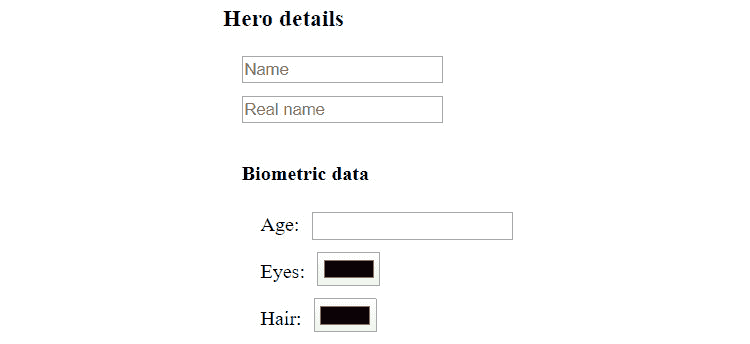
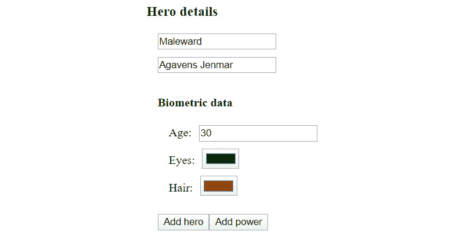
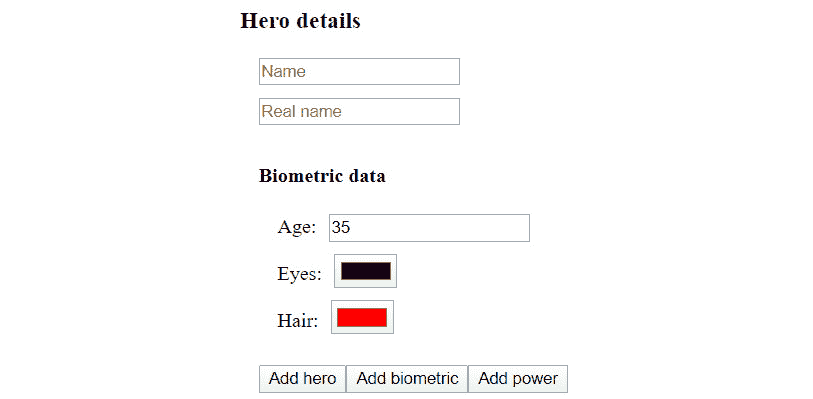

# 八、以表单形式编排验证体验

Web 应用在从用户收集数据时使用表单。使用案例包括允许用户登录、填写付款信息、预订航班，甚至执行搜索。表单数据可以稍后在本地存储上持久化，或者使用后端 API 发送到服务器。表单通常具有以下特征，以增强 web 应用的用户体验：

*   可以定义不同类型的输入字段
*   可以设置不同类型的验证，并向用户显示验证错误
*   可以支持在表单处于错误状态时处理数据的不同策略

Angular框架提供了两种处理表单的方法：**模板驱动**和**反应式**。这两种方法都不比另一种好；你只需要选择一个最适合你的场景。这两种方法的主要区别在于它们管理数据的方式：

*   模板驱动的表单很容易设置并添加到Angular应用中，但它们不能很好地扩展。它们仅在模板上操作以创建元素和配置验证规则，因此不容易测试。它们还依赖于框架的变化检测机制。如果您的 Angular 应用包含带有几个输入控件和简单逻辑的表单，请选择此方法。
*   当涉及到扩展和测试时，以及当它们不与变更检测周期交互时，反应式表单更加健壮。它们在组件`class`中操作，以管理输入控制并设置验证规则。如果你广泛使用反应式编程技术，或者你的 Angular 应用由许多表单组成，那么这种技术适合你。

在本章中，我们将主要关注被动形式，因为它们在社区中广受欢迎。更具体地说，我们将涵盖以下主题：

*   学习如何使用模板驱动的表单应用双向绑定
*   发现如何使用面向反应的方法设计表单
*   学习如何将数据与被动表单中的输入控件绑定
*   深入研究输入验证的不同方法
*   构建我们的自定义验证器
*   学习如何获取表单数据并在其发生变化时作出反应

让我们开始吧！

# 技术要求

以下是本章代码和示例的 GitHub 链接：[https://github.com/PacktPublishing/Learning-Angular--Third-Edition/tree/master/ch08](https://github.com/PacktPublishing/Learning-Angular--Third-Edition/tree/master/ch08) 。

# 将表单引入 web 应用

web应用中的表单由一个`form`HTML 元素和一个`button`元素组成，前者包含一些用于输入数据的`input`元素，后者用于处理该数据。表单可以检索数据并将其保存在本地或发送到服务器进行进一步操作。以下是用于将用户登录到 web 应用的简单表单：

```ts
<form>
  <div>>>
    <input type="text" name="username" placeholder="Username">
  </div>
  <div>
    <input type="password" name="password"     placeholder="Password">
  </div>
  <button type="submit">Login</button>
</form>
```

此表单有两个`input`元素：一个用于输入用户名，另一个用于输入密码。密码字段的`type`设置为`password`，以便在键入时输入控件的内容不可见。`button`元素的`type`被设置为`submit`，以便表单可以通过点击按钮或在任何输入控件上按*输入*来收集数据。或者，我们可以添加另一个具有`reset`类型的`button`元素来清除表单数据。请注意，HTML 元素必须位于`form`元素中，这样它才能成为它的一部分。以下屏幕截图显示了表单在页面上呈现时的外观：


图 8.1–登录表单

Web 应用可以通过使用提供输入控件中的自动完成或提示保存敏感数据等功能的表单来显著增强用户体验。现在我们已经基本了解了 web 表单的外观，让我们来学习如何将所有这些都融入到 Angular 框架中。

# 模板驱动表单的数据绑定

模板驱动的形式是将形式与Angular整合的两种不同方式之一。由于前面所述的原因，这是一种没有被 Angular 社区广泛接受的方法。然而，当我们想要为 Angular 应用创建小而简单的表单时，它可能会非常强大。当与`ngModel`指令一起使用时，模板驱动的表单可以脱颖而出，在我们的组件中提供双向数据绑定。

我们在[*第 3 章*](03.html#_idTextAnchor092)*组件交互和交互通信*中学习了数据绑定，以及如何使用不同类型从 HTML 元素或组件读取数据并向其写入数据。在这种情况下，绑定是一种或另一种方式，称为**单向绑定**。我们可以将这两种方式结合起来，创建一个可以同时读写数据的**双向绑定**。模板驱动的表单提供了`ngModel`指令，我们可以在组件中使用该指令来获得这种行为。我们可以通过从`@angular/forms`npm 包中导入`FormsModule`将模板驱动的表单添加到一个 Angular10 应用中。正是`FormsModule`导出了我们想要使用的`ngModel`指令：

1.  在`AppModule`的`imports`属性中增加`FormsModule`：

    ```ts
    import { BrowserModule } from '@angular/platform-browser';
    import { NgModule } from '@angular/core';
    import { FormsModule } from '@angular/forms';
    import { AppComponent } from './app.component';
    import { LoginComponent } from './login/login.component';
    @NgModule({
      declarations: [
        AppComponent,
        LoginComponent
      ],
      imports: [
        BrowserModule,
        FormsModule
      ],
      providers: [],
      bootstrap: [AppComponent]
    })
    export class AppModule { }
    ```

2.  创建一个名为`login`的Angular组件，并在其模板中输入上一节中表单的 HTML。
3.  打开文件，为每个输入控件添加两个属性：

    ```ts
    export class LoginComponent {
      username: string;
     password: string;
    }
    ```

4.  Open the `login.component.html` file and add the `ngModel` directive to each input control. Set the value of the directive to the respective component property that we created earlier:

    ```ts
    <div>
      <input type="text" name="username"   placeholder="Username" [(ngModel)]="username">
    </div>
    <div>
      <input type="password" name="password"   placeholder="Password" [(ngModel)]="password">
    </div>
    ```

    重要提示

    `ngModel`指令的语法称为*盒子里的香蕉*，这是一条记忆规则，您可以记住如何键入它。我们分两步创建它。首先，我们通过在括号`()`中包围`ngModel`来创建香蕉。然后，我们把香蕉放在一个盒子里，用方括号括起来`[()]`。记住，它叫盒子里的香蕉，不是盒子里的香蕉。

5.  为了更好地理解双向绑定的工作原理，可以向模板中添加另一个`div`元素，该元素使用插值来显示`username`属性的值：

    ```ts
    <div>You are trying to login as <b>{{username}}</b></div>
    ```

6.  删除`app.component.html`文件的内容，并将登录组件的`selector`添加到该文件中。
7.  使用`ng serve`和在**用户名**输入控件内开始输入，运行应用。您将注意到，插入的文本会在键入时相应地更新。现在，您应该了解双向绑定和`ngModel`背后的魔力。
8.  要模拟登录过程，请在组件`class`中创建一个`login`方法，在浏览器的控制台窗口

    ```ts
    login() {
      console.log('User: ' + this.username);
      console.log('Password: ' + this.password);
    }
    ```

    中记录用户名和密码
9.  最后，通过向`form`元素的`ngSubmit`事件添加事件绑定，将`login`方法连接到表单。通过任何方式提交表单时触发`ngSubmit`事件：

    ```ts
    <form (ngSubmit)="login()">
      <div>
        <input type="text" name="username"     placeholder="Username" [(ngModel)]="username">
      </div>
      <div>
        <input type="password" name="password"     placeholder="Password" [(ngModel)]="password">
      </div>
      <button type="submit">Login</button>
      <div>You are trying to login as <b>{{username}}</b></  div>
    </form>
    ```

现在，尝试在**用户名**和**密码**字段中输入一些数据，点击**登录**按钮或在**密码**字段中按*输入*。您应该可以看到在浏览器的控制台窗口中输入的登录详细信息。

重要提示

我们用于`ngModel`指令的“盒子里的香蕉”的语法根本不是随机的。在引擎盖下，`ngModel`是一个指令，包含一个名为`ngModel`的`@Input`绑定和一个名为`ngModelChange`的`@Output`绑定。它实现了一个名为`ControlValueAccessor`的特殊`interface`，用于为表单创建自定义控件。按照惯例，当指令或组件包含以相同名称开头的两个绑定，但输出绑定以`Change`结尾时，该属性可以用作双向绑定。有关`ControlValueAccessor`的更多信息，请访问[https://angular.io/guide/built-in-directives#ngmodel-和值存取器](https://angular.io/guide/built-in-directives#ngmodel-and-value-accessors)。

我们已经看到了模板驱动的表单如何在创建小而简单的表单时派上用场。在下一节中，我们将深入探讨Angular框架提供的另一种方法：反应形式。

# 使用Angular形式的反应模式

响应式表单，顾名思义，以响应式方式提供对 web 表单的访问。它们是在考虑到反应性的情况下构建的，其中输入控制及其值可以使用可观察的流进行操纵。它们还维护表单数据的不变状态，使它们更易于测试，因为我们可以确保表单的状态可以被显式地、一致地修改。

反应式表单有一种编程方法来创建表单元素和设置验证规则。我们在组件`class`中设置了所有内容，只在模板中指出我们创建的工件。

该方法涉及的主要类别如下：

*   `FormControl`：表示单个表单控件，如`input`元素。
*   `FormGroup`：表示表单控件的集合。`form`元素是反应形式层次结构中最顶层的`FormGroup`。
*   `FormArray`：表示表单控件的集合，与`FormGroup`类似，但可以在运行时修改。例如，我们可以根据需要动态添加或删除`FormControl`对象。

所有这些课程都可以从`@angular/forms`npm 软件包中获得。`FormControl`和`FormGroup`类继承自`AbstractControl`，其中包含许多有趣的属性。我们可以根据特定控件或组的状态，使用这些属性以不同的方式呈现 UI。例如，我们可能希望在 UI 方面区分从未与之交互的表单和现有表单。了解我们是否与某个特定控件进行了交互也很有意义。正如你所能想象的，在很多情况下，了解一个特定的状态是很有趣的。我们将使用`FormControl`和`FormGroup`类来探索所有这些属性。

在下一节中，我们将采用前面创建的模板驱动表单，并将其重新创建为反应式表单。

## 将模板驱动的表单转化为反应式表单

Angular框架提供`ReactiveFormsModule`，我们可以导入开始创建反应表单：

1.  Import `ReactiveFormsModule` from the `@angular/forms` npm package and add it to the `imports` property of `AppModule`:

    ```ts
    import { BrowserModule } from '@angular/platform-browser';
    import { NgModule } from '@angular/core';
    import { FormsModule, ReactiveFormsModule } from '@angular/forms';
    import { AppComponent } from './app.component';
    import { LoginComponent } from './login/login.component';
    @NgModule({
      declarations: [
        AppComponent,
        LoginComponent
      ],
      imports: [
        BrowserModule,
        FormsModule,
        ReactiveFormsModule
      ],
      providers: [],
      bootstrap: [AppComponent]
    })
    export class AppModule { }
    ```

    重要提示

    在上例中，`AppModule`同时导入`FormsModule`和`ReactiveFormsModule`。这样做没有害处。你可以在 Angular 应用中同时使用它们，一切都会正常工作。

2.  创建一个名为`reactive-login`的Angular组件，它将具有与我们之前创建的登录组件相同的输入控件和行为。
3.  Open the `reactive-login.component.ts` file and define a `loginForm` property. Set its value to a new `FormGroup` instance, passing an empty object as a parameter to its `constructor`. The provided parameter will serve as the container used to define input controls later on:

    ```ts
    loginForm = new FormGroup({});
    ```

    `FormGroup``class`的`constructor`接受包含`FormControl`实例键值对的对象。键表示表单控件的唯一名称，`FormGroup`可以用来跟踪它，而值是`FormControl`的一个实例。为我们的案例创建两个`FormControl`实例–一个用于用户名，另一个用于密码：

    ```ts
    loginForm = new FormGroup({
      username: new FormControl(''),
     password: new FormControl('')
    });
    ```

    `FormControl``class`的`constructor`接受输入控件的默认值作为参数。因为我们正在构建一个登录表单，所以我们将向这两个控件传递一个空字符串，以便最初不设置任何值。

4.  在我们创建了表单组及其控件之后，我们需要将它们与模板中相应的 HTML 元素相关联。将`login.component.html`文件内容复制到`ReactiveLoginComponent`模板中。
5.  `ReactiveFormsModule`导出`formGroup`指令，我们可以使用该指令将`FormGroup`实例连接到`form`元素。在`formGroup`指令和组件

    ```ts
    <form [formGroup]="loginForm" (ngSubmit)="login()">
    ```

    的`loginForm`属性之间添加属性绑定
6.  `ReactiveFormsModule`还导出`formControlName`指令，我们可以使用该指令将`FormControl`实例连接到`input`元素。将`ngModel`双向数据绑定替换为`formControlName`属性。`formControlName`指令的值设置为`FormControl`实例的名称。

到目前为止，我们已经成功地使用反应式技术重新创建了模板驱动的登录表单！移除`ngSubmit`事件绑定，并使用插值注释掉显示`username`属性的`div`元素。如果您使用`ng serve`运行应用，您将能够预览登录表单。目前，它不包含任何关于反应形式的逻辑。让我们改变这一点：

1.  Copy the `login` method from `LoginComponent` into the `reactive-login.component.ts` file and modify it accordingly:

    ```ts
    login() {
      const controls = this.loginForm.controls;
      console.log('User:' + controls.username.value);
      console.log('Password:' + controls.password.value);
    }
    ```

    以前，在模板驱动的表单中，我们可以直接访问数据模型的`username`和`password`属性。在反应形式中，情况并非如此，因为形式模型是真理的源泉。因此，我们需要从`FormGroup`或`FormControl`类中获取输入控制值。`FormGroup``class`公开了`controls`属性，我们可以使用来获取特定的`FormControl`实例。`FormControl``class`包含各种属性，例如与之关联的输入控件的值。

    重要提示

    `FormGroup``class`还包含一个`value`属性，我们可以使用该属性作为单个对象访问表单控件值。在后端 API 中发布整个实体时，我们通常使用此属性。

2.  现在我们知道了如何获取表单控件的值，我们可以取消注释`div`元素，它显示`username`属性的值。相应地修改它，以便它从`loginForm`属性获取`username`表单控件的值。不要忘记恢复表单元素

    ```ts
    <div>You are trying to login as <b>{{loginForm.controls.username.value}}</b></div>
    ```

    上的`ngSubmit`事件绑定
3.  在现实世界的应用中，表单并不像我们已经看到的登录表单那样小和短。它们有许多表单控件，在某些情况下还有嵌套的表单组层次结构。他们可能还需要在模板和组件`class`中多次访问特定表单控件，以检查其状态或值。直接从表单组访问它会很快使表单变得混乱，并且可能变得无法阅读。在这种情况下，好的做法是对每个这样的控件使用 getter 方法：

    ```ts
    get username(): AbstractControl {
      return this.loginForm.controls.username;
    }
    get password(): AbstractControl {
      return this.loginForm.controls.password;
    }
    ```

4.  然后，我们可以将代码中所有出现的`loginForm.controls.username`和`loginForm.controls.password`替换为`username`和`password`getter 属性。

如果我们运行应用，我们将看到它的行为与模板驱动的表单相同。尝试单击**登录**按钮，但不在**用户名**或**密码**字段中输入任何值，然后查看浏览器控制台窗口中发生的情况–在此，应用为两个表单控件打印空值。然而，在现实世界中，我们应该避免这种情况。我们应该了解表单控件的状态，并采取相应的操作。

在下一节中，我们将研究可以检查的不同属性，以获取表单控件的状态，并根据该状态向用户提供反馈。

## 提供状态反馈

Angular框架在表单控件中根据当前状态自动设置以下类：

*   `ng-untouched`：表示我们尚未与控件进行交互
*   `ng-touched`：表示我们已经与控件进行了交互
*   `ng-dirty`：表示控件有值
*   `ng-pristine`：表示控件还没有值
*   `ng-valid`：表示该控件的值有效
*   `ng-invalid`：表示控件的值无效

每个类名在表单模型中都有类似的属性。属性的名称与类名相同，没有`ng-`前缀。我们可以尝试利用这两种方式，在表单中提供独特的体验。

假设我们想在第一次与输入控件交互时在该控件中显示高亮显示的边框。我们应该定义一个全局 CSS 样式，例如：

```ts
.ng-touched:not(form) {
  border: 3px solid lightblue;
}
```

值得注意的是，前面的 CSS 规则排除了`form`元素。应用于表单控件的相同 CSS 类也可以应用于表单组。在我们的例子中，我们不希望在整个`form`元素中显示高亮显示的边框；我们只想在单个`input`元素中显示它。

我们还可以根据应用的需要组合一些 CSS 类。假设我们想在输入控件有值时显示一个`green`边框，在它没有任何值时显示一个`red`边框。只有当我们最初在输入控件中输入了一个值，然后立即将其删除时，`red`边框才可见。我们应该创建以下 CSS 规则：

```ts
.ng-dirty.ng-valid:not(form) {
  border: 2px solid green;
}
.ng-dirty.ng-invalid:not(form) {
  border: 2px solid red;
}
```

为了使`ng-valid`和`ng-invalid`类能够工作，我们需要向`input`元素添加一个验证规则。我们可以使用许多内置的验证器，我们将在章后面学习，但在本例中，我们将使用`required`验证器，这表明输入控件必须具有有效的值。要应用它，请将`required`属性添加到两个`input`元素：

```ts
<div>
  <input type="text" name="username" placeholder="Username"   formControlName="username" required>
</div>
<div>
  <input type="password" name="password" placeholder="Password"   formControlName="password" required>
</div>
```

稍后，在*以反应方式验证控件*部分，我们将学习如何将验证器直接应用于`FormControl`实例。

使用`ng serve`运行应用，并按照以下步骤检查应用的 CSS 规则：

1.  点击**用户名**字段，然后点击**密码**字段。**用户名**字段现在应显示浅蓝色边框。
2.  在**密码**字段中输入一些文本，注意它有一个绿色边框。
3.  删除**密码**字段中的文本，注意边框变为红色。

我们现在可以理解当输入控件的状态发生变化时会发生什么，并直观地通知用户该变化。在下一节中，我们将了解表单的状态可以在不同级别的许多表单控件和组中生成。

## 创建嵌套表单层次结构

我们已经了解了如何使用两个输入控件创建一个登录表单。登录表单是一个简单的表单，需要一个`FormGroup``class`和两个`FormControl`类。企业应用中的一些用例要求我们构建更高级的表单，包括创建表单组的嵌套层次结构。考虑下面的表单，你可以用它输入英雄细节：



图 8.2-添加英雄表单

这可能看起来像一个单一的表单，但如果我们更仔细地查看组件`class`，我们将看到它由两个`FormGroup`实例组成，一个嵌套在另一个中：

```ts
heroDetails = new FormGroup({
  name: new FormControl(''),
  realName: new FormControl(''),
  biometricData: new FormGroup({
    age: new FormControl(''),
    eyes: new FormControl(''),
    hair: new FormControl('')
  })
})
```

`heroDetails`属性为父表单组，`biometricData`为子表单组。家长表单组可以有任意多的子表单组。如果我们查看组件的模板，就会发现子表单组的定义与父表单组不同：

```ts
<form formGroupName="biometricData">
  <div>
    <label>Age:</label>
    <input type="number" formControlName="age">
  </div>
  <div>
    <label>Eyes:</label>
    <input type="color" formControlName="eyes">
  </div>
  <div>
    <label>Hair:</label>
    <input type="color" formControlName="hair">
  </div>
</form>
```

我们使用`formGroupName`指令将内部`form`元素绑定到`biometricData`属性。

重要提示

您可能希望将其直接绑定到`heroDetails.biometricData`属性，但这是行不通的。Angular 框架非常聪明，因为它理解`biometricData`是`heroDetails`的子形式组。它可以推断此信息，因为与`biometricData`相关的`form`元素位于绑定到`heroDetails`属性的`form`元素内部。

子表单的状态在嵌套表单层次结构中与其父表单共享。在我们的例子中，当`biometricData`表单无效时，它的父表单`heroDetails`也将无效。状态的改变并不是父窗体中出现的唯一问题。子窗体的值也会向上传播到层次结构中，从而保持一致的窗体模型：


图 8.3–嵌套表单层次结构中的状态和值传播

嵌套层次结构在组织大型表单结构时，为开发人员的工具链添加了一个有用的Angular表单功能。状态以及每个表单的值通过层次结构进行传播，从而为我们的模型提供稳定性。

我们已经了解了如何通过使用 CSS 样式触发状态更改来定义模板中的验证规则。在下一节中，我们将学习如何在组件`class`中定义它们，并使用适当的消息提供视觉反馈。

# 以反应式方式验证控制

我们已经学习了如何将验证应用于表单模板。我们在*使用Angular形式的反应模式*部分中使用了`required`属性，以指示输入控件需要有一个值。在反应式表单中，事实的来源是我们的表单模型，因此我们需要能够在构建`FormGroup`实例时定义验证规则。

要添加验证规则，我们将使用`FormControl``constructor`的第二个参数：

1.  打开`reactive-login.component.ts`文件，将`Validators.required`方法添加到`username`和`password`表单控件中：

    ```ts
    loginForm = new FormGroup({
      username: new FormControl('', Validators.required),
      password: new FormControl('', Validators.required)
    });
    ```

2.  The `Validators` `class` contains almost the same validator rules that are available for template-driven forms, such as the `required` validator. There are other validators, such as `min` and `max`, that are not yet supported by reactive forms. We can combine multiple validators by adding them to an array. For example, we can set the `password` form control to be at least six characters long using the `Validators.minLength` method:

    ```ts
    password: new FormControl('', [
     Validators.required,
     Validators.minLength(6)
    ])
    ```

    重要提示

    当我们使用`FormControl`的`constructor`添加验证器时，我们可以从表单的模板中删除相应的 HTML 属性。但是，您可以出于可访问性的目的保留它，以便屏幕阅读器能够理解表单控件应该如何进行验证。

3.  我们现在可以使用这些验证规则的状态，并对它们的更改作出反应。例如，当表单无效时，我们可以禁用`Login``button`：

    ```ts
    <button type="submit" [disabled]="!loginForm.valid">Login</button>
    ```

4.  We can also display specific messages to the user upon changing the validity of each control:

    ```ts
    <div>
      <input type="text" name="username"   placeholder="Username" formControlName="username"   required>
      <span class="help-block" *ngIf="username.  touched && username.invalid">The username is not   valid</span>
    </div>
    <div>
      <input type="password" name="password"   placeholder="Password" formControlName="password"   required>
      <span class="help-block" *ngIf="password.  touched && password.invalid">The password is not   valid</span>
    </div>
    ```

    请注意，我们还为`password`表单控件创建了一个 getter 属性，以便我们可以在模板或组件`class`中轻松地引用它。

5.  It would be nice, though, if we could display different messages, depending on the validation rule. For example, we could display a more specific message when the password is less than six characters long. The `FormControl` `class` contains the `errors` property, which we can use for this purpose. This is an object where each key is the validation property, such as `required`, and the value is the `boolean` result of the validation:

    ```ts
    <input type="password" name="password" placeholder="Password" formControlName="password" required>
    <span class="help-block" *ngIf="password.touched && password.errors?.required">The password is required</span>
    <span class="help-block" *ngIf="password.touched && password.errors?.minlength">The password is too short</span>
    ```

    重要提示

    我们在访问`errors`属性时使用安全导航操作符，因为当表单控件没有任何错误时，其值为`null`，这可能会损坏我们的组件。

Angular框架提供了一组内置的验证器，我们可以在表单中使用这些验证器。验证器是一个`function`，当控件没有任何错误时，它返回`ValidationErrors`对象或`null`。验证器还可以根据场景同步或异步返回值。稍后，在*构建自定义验证器*部分，我们将学习如何创建自定义同步验证器。目前，让我们关注表单构建，并介绍另一个工件，我们可以使用它在运行时动态添加表单控件。

# 动态修改表单

到目前为止，我们已经在本章的中广泛使用了`FormGroup`和`FormControl`类。然而，我们还没有看到`FormArray`到底是怎么回事。

假设我们想启用`HeroComponent`的形式，这样我们就可以为我们的英雄添加一些力量。毕竟，超级英雄都是关于拥有特殊能力的，不是吗？一个英雄可以有多个超能力，所以让我们相应地修改`heroDetails`形式：

1.  在`heroDetails`表单组中添加`powers`属性，并将其值设置为`FormArray``class`的实例。`FormArray``class`的`constructor`接受`FormControl`实例列表作为参数。现在，列表是空的，因为英雄最初没有任何能力：

    ```ts
    heroDetails = new FormGroup({
      name: new FormControl(''),
      realName: new FormControl(''),
      biometricData: new FormGroup({
        age: new FormControl(''),
        eyes: new FormControl(''),
        hair: new FormControl('')
      }),
      powers: new FormArray([])
    });
    ```

2.  定义一个 getter属性，该属性返回`powers`表单数组并将其转换为`FormArray`类型。这里的类型转换非常重要，因为我们希望使用标准数组方法（如`push`：

    ```ts
    get powers(): FormArray {
      return this.heroDetails.controls.powers as FormArray;
    }
    ```

    来操作`powers`属性
3.  在组件中创建一个方法，将新的`FormControl`实例添加到`powers`表单数组中：

    ```ts
    addPower() {
      this.powers.push(new FormControl(''));
    }
    ```

4.  打开`hero.component.html`文件，在`biometricData`表单元素之后添加一个`button`元素。将`button`元素的`click`事件绑定到新创建的`addPower`方法

    ```ts
    <button (click)="addPower()">Add power</button>
    ```

5.  `addPower`方法填充`powers`表单数组的`controls`属性。我们可以使用`ngFor`指令迭代`controls`属性并为每个属性创建一个`input`元素：

    ```ts
    <div *ngFor="let power of powers.controls; let i=index">
      <label>
        Power:
        <input type="text" [formControlName]="i">
      </label>
    </div>
    ```

6.  我们使用`ngFor`指令的`index`关键字为每个表单控件提供一个动态创建的名称。

`FormArray``class`的真正威力在于，它不仅可以用于`FormControl`实例，还可以用于更复杂的结构和其他形式组。

通过`FormArray`，我们已经完成了关于角形形状最基本构件的知识范围。在下一节中，我们将学习如何在不显式使用角形的情况下构建角形。

# 创造优雅的反应形式

到目前为止，我们一直在使用`FormGroup`、`FormControl`和`FormArray`类来创建表单，如下所示：

```ts
loginForm = new FormGroup({
  username: new FormControl('', Validators.required),
  password: new FormControl('', [
    Validators.required,
    Validators.minLength(6)
  ])
});
```

但是，前面的方法会产生很多噪音，尤其是在包含许多控件的窗体中。或者，我们可以使用称为`FormBuilder`的Angular服务来消除大量噪音。我们可以从`@angular/forms`npm 包中导入`FormBuilder`，注入组件的`constructor`中，重写`loginForm`如下：

```ts
constructor(private builder: FormBuilder) { }
private buildForm() {
  this.loginForm = this.builder.group({
    username: ['', Validators.required],
    password: ['', [
      Validators.required,
      Validators.minLength(6)
    ]]
  });
}
```

我们使用`FormBuilder`服务的`group`方法将表单控件分组在一起。`FormControl`现在是一个包含两项的数组：第一项是控件的默认值，第二项是验证程序列表。`FormBuilder`服务还包含以下方法：

*   `control`：初始化`FormControl`对象
*   `array`：初始化`FormArray`对象

使用`FormBuilder`服务看起来更容易阅读，而且我们不必显式地处理`FormGroup`、`FormControl`和`FormArray`数据类型，尽管这是在幕后创建的。

我们已经看到 Angular 框架提供的一些内置验证器。然而，表单在Angular上是如此的可扩展，这允许我们创建定制的验证器来满足我们的需求。在下一节中，我们将学习如何从头创建这样的验证器。

# 构建自定义验证器

有时候，默认的验证器不会覆盖我们在应用中可能遇到的所有场景。幸运的是，编写自定义验证器并在我们的表单中使用它非常容易。在我们的例子中，我们正在构建一个验证器来检查英雄的名字是否已经存在。

我们已经了解到，验证器是一个`function`，它需要返回一个带有指定错误的`ValidationErrors`对象或一个`null`值。让我们定义这样一个`function`：

reserved-name.directive.ts

```ts
import { ValidatorFn, AbstractControl } from '@angular/forms';
const heroes = [
  { id: 1, name: 'Boothstomper' },
  { id: 2, name: 'Drogfisher' },
  { id: 3, name: 'Bloodyllips' },
  { id: 4, name: 'Mr Bu Moverse' },
  { id: 5, name: 'Piranhaelli' }
];
export function reservedNameValidator(): ValidatorFn {
  return (control: AbstractControl): {[key: string]: any} |   null => {
    const reserved = heroes.find(hero => hero.name === control.    value);
    return reserved ? {‹reservedName': true} : null;
  };
}
```

验证程序是一个返回另一个`function`的`function`，称为配置的验证程序`function`。它接受将应用它作为参数的表单控件对象。如果控件的值与`heroes`列表中的英雄名称匹配，则返回验证错误对象。否则返回`null`。

验证错误对象的键指定验证程序错误的描述性名称。这是一个名称，我们可以稍后在控件的`errors`对象中检查它是否有任何错误。验证错误对象的值可以是我们可以在错误消息中传递的任意值。

要使用我们的新验证器，我们需要做的就是将其导入到我们的组件`class`中，并将其添加到`name``FormControl`实例中：

```ts
heroDetails = new FormGroup({
  name: new FormControl('',   reservedNameValidator()),
  realName: new FormControl(''),
  biometricData: new FormGroup({
    age: new FormControl(''),
    eyes: new FormControl(''),
    hair: new FormControl('')
  }),
  powers: new FormArray([])
});
```

然后，如果出现特定错误，我们可以在组件的模板中显示错误消息：

```ts
<div>
  <input type="text" placeholder="Name" formControlName="name">
  <span class="help-block" *ngIf="heroDetails.  controls.name.hasError('reservedName')">Hero name is   already taken</span>
</div>
```

在这里，我们使用`FormControl``class`的方法`hasError`，传递错误名称以检查是否发生了错误。

Angular窗体不仅用于检查状态，还用于设置值。在下一节中，我们将学习如何在表单中设置值。

# 操作表单数据

`FormGroup``class`包含两种方法，我们可以使用它们以编程方式更改表单的值：

*   `setValue`：替换表单所有控件中的值
*   `patchValue`：更新表单特定控件中的值

`setValue`方法接受一个对象作为参数，该参数包含表单的所有控件的键值对*。让我们在`heroDetails`表单中添加一个按钮，创建一个新英雄，以说明`setValue`的用法：*

1.  打开`hero.component.html`文件，在添加电源的按钮前添加一个名为`Add hero`的`button`元素。
2.  将`Add hero`按钮的`click`事件绑定到名为`addHero`：

    ```ts
    <button (click)="addHero()">Add hero</button>
    ```

    的组件方法
3.  Open the `hero.component.ts` file and add the `addHero` method, which uses the `setValue` method to fill in the form with details of a new hero:

    ```ts
    addHero() {
      this.heroDetails.setValue({
        name: 'Maleward',
        realName: 'Agavens Jenmar',
        biometricData: {
          age: 30,
          eyes: '#006400',
          hair: '#8b4513'
        },
        powers: []
      });
    }
    ```

    `setValue`方法中传递的对象的每个键必须与表单中每个控件的名称匹配。如果我们省略一个，Angular 将抛出一个错误。

使用`ng serve`运行应用并点击**添加英雄**按钮。您应该在屏幕上看到以下输出：



图 8.4–编辑英雄表单

相反，如果我们想要填写*某个英雄的一些*细节，我们可以使用`patchValue`方法：

1.  创建一个名为`Add biometric`的新`button`元素，并将其`click`事件绑定到名为`addBio`：

    ```ts
    <button (click)="addBio()">Add biometric</button>
    ```

    的新方法
2.  创建`addBio`方法，使用`patchValue`方法设置英雄的一些生物特征数据中的值：

    ```ts
    addBio() {
      this.heroDetails.patchValue({
        biometricData: {
          age: 35,
          hair: '#ff0000'
        },
      })
    }
    ```

重新运行应用并单击**添加生物特征**按钮。您现在应该看到以下输出：



图 8.5–设置 hero 生物特征数据

在表单中设置数据时，`FormGroup``class`的`setValue`和`patchValue`方法帮助我们。反应式表单的另一个有趣方面是，当这些值发生变化时，我们也可以收到通知。

# 观察状态变化，做出反应

到目前为止，我们已经学习了如何以编程方式创建表单，以及如何在代码中指定所有字段及其验证。反应型表单可以在表单控件发生更改时侦听这些更改，并做出相应的反应。一个合适的反应可能是禁用/启用控件、提供视觉提示或根据您的需要执行其他操作。你明白了。

我们怎样才能做到这一点？一个`FormControl`实例包含两个可观察的属性：`statusChanges`和`valueChanges`。当控件的状态发生变化时，第一个通知我们，例如从`invalid`变为`valid`。另一方面，当控件的值发生变化时，第二个控件会通知我们。让我们用一个例子更详细地探讨这个问题。

`ReactiveLoginComponent`表单中的`password`字段包含一个验证器，用于检查用户输入值的最小长度。从最终用户的Angular来看，最好在用户开始在字段中输入值后立即显示有关此验证的提示：

1.  First, add a `span` element to the template of the component. This will contain an appropriate hint message:

    ```ts
    <div>
      <input type="password" name="password"   placeholder="Password" formControlName="password"   required>
      <span class="help-block" *ngIf="password.touched &&   password.errors?.required">The password is required</  span>
      <span class="help-block" *ngIf="password.touched &&   password.errors?.minlength">The password is too short</  span>
      <span *ngIf="showPasswordHint">Password should be   minimum six characters long</span>
    </div>
    ```

    提示将根据组件的`showPasswordHint`属性显示。

2.  在组件中创建`showPasswordHint``boolean`属性。
3.  Subscribe to the `valueChanges` property of the `password` form control inside the `ngOnInit` method. It checks if the password that's been entered is smaller than six characters long and sets `showPasswordHint` appropriately. The `valueChanges` subscription provides values for each keystroke in the input control:

    ```ts
    ngOnInit() {
      this.password.valueChanges.subscribe((value:   string) => {
        this.showPasswordHint = value.length < 6;
      });
    }
    ```

    重要提示

    `valueChanges`和`statusChanges`是标准的可观测流。不要忘记取消订阅，正如我们在[*第 6 章*](06.html#_idTextAnchor149)中所了解的，*使用异步数据服务丰富组件*。

当然，我们可以用`valueChanges`和`statusChanges`观测值做更多的。例如，我们可以通过将用户名发送到后端服务器来检查用户名是否被占用，但这段代码显示了反应性。希望这已经传达了您如何利用表单的反应性并做出相应的响应。

# 总结

在本章中，我们了解到 Angular 为创建表单提供了两种不同的风格——模板驱动的表单和反应式表单，并且这两种方法都不能说比另一种更好。我们只关注反应形式，因为它们有许多优点，并学会了如何构建它们。我们还介绍了现有的不同类型的验证，现在我们知道了如何创建自定义验证。我们还学习了如何在表单中填入值，并在值发生变化时得到通知。

在下一章中，我们将学习如何在棱角材质的帮助下对应用进行蒙皮，使其看起来更漂亮。角材质附带许多组件和样式，可供您在项目中使用。所以，让我们给你的Angular项目应得的爱。