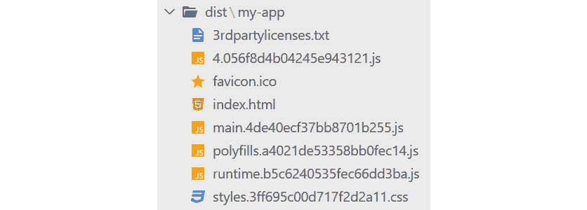

# 十二、将 Angular 应用带入生产

web 应用通常应该在 web 上运行，任何人都可以从任何地方访问。因此，它需要两个基本要素：一个将承载应用的 web 服务器和一个要部署到该服务器的应用的生产构建。在本章中，我们将重点介绍配方的第二部分。但我们所说的生产建设是什么意思？

简而言之，web 应用的生产构建是应用代码的优化版本，它更小、更快、性能更好。首先，它是一个获取应用的所有代码文件、应用优化技术并将其转换为单个捆绑文件的过程。

在前面的章节中，我们已经介绍了构建 Angular 10 应用时涉及的许多部分。我们只需要最后一个部分来连接这些点，并使我们的应用可供任何人使用，这就是构建它并将其部署到 web 服务器。

在本章中，我们将执行以下操作：

*   了解如何创建 Angular 10 应用的生产构建
*   了解如何使用预算限制构建的大小
*   了解如何将优化技术应用于构建
*   调查可用的内置托管提供商并了解如何部署到其中一个提供商

# 技术要求

本章的源代码可以在 GitHub 存储库中的[中找到 https://github.com/PacktPublishing/Learning-Angular--Third-Edition/tree/master/ch12](https://github.com/PacktPublishing/Learning-Angular--Third-Edition/tree/master/ch12) 。

# 构建一个有Angular的应用

要构建Angular 10 应用，我们使用 Angular CLI 的以下命令：

```ts
ng build
```

构建过程启动 Angular 编译器，该编译器主要收集应用代码的所有 TypeScript 文件，并将其转换为 JavaScript。Angular 应用包含运行时通常不使用的各种类型脚本文件，例如单元测试或工具帮助程序。编译器如何知道为构建过程收集哪些文件？那么，它读取`tsconfig.app.json`文件的`files`属性，该属性指示 Angular 10 应用的主要入口点：

```ts
"files": [
 "src/main.ts",
  "src/polyfills.ts"
]
```

从那里，它可以遍历我们的应用所需的所有组件、服务和其他Angular工件，正如我们在[*第 1 章*](01.html#_idTextAnchor015)*构建您的第一个Angular应用*中已经了解到的。Angular 编译器将生成的 JavaScript 文件输出到根据 Angular CLI 项目名称命名的文件夹中，该项目在`dist`文件夹中创建：


图 12.1–开发模式下的输出文件夹

输出文件夹包含多个文件，包括：

*   `favicon.ico`：Angular 应用的图标
*   `index.html`：Angular 应用的主 HTML 文件
*   `main.js`：包含我们编写的应用的源代码
*   `polyfills.js`：包含旧浏览器的功能多边形填充
*   `runtime.js`：包含运行所有其他文件所需的与 CLI 相关的代码
*   `styles.js`：包含全局应用 CSS 样式
*   `vendor.js`：包含 Angular 框架和 Angular 应用中使用的任何第三方库

该文件夹还包含几个扩展名为`.map`的文件。它们被称为**源映射**文件，主要用于调试目的。`index.html`文件与`src`文件夹中的 HTML 文件相同，只是 Angular CLI 对其进行了修改，使其包含其余 JavaScript 构建文件：

```ts
<body>
  <app-root></app-root>
<script src="runtime.js" defer></script><script src="polyfills.js" defer></script><script src="styles.js" defer></script><script src="vendor.js" defer></script><script src="main.js" defer></script></body>
```

Angular CLI 的`build`命令可以在两种模式下运行：开发和生产。默认情况下，它在开发模式下运行。我们已经在[*第 5 章*](05.html#_idTextAnchor129)*中了解到，*构造一个Angular App*，如果我们想在生产模式下运行它，我们应该运行以下命令：*

```ts
ng build --configuration=production
```

或者，我们可以使用`--prod`开关使用生产配置的快捷方式：

```ts
ng build --prod
```

`dist`文件夹的输出现在应该如下所示：


图 12.2–生产模式下的输出文件夹

Angular CLI 对应用代码执行各种优化技术，以便最终输出适合在 web 服务器和生产环境中托管。输出文件夹不包含源映射文件，因为我们不希望在生产环境中启用调试。它还为每个文件添加了一个*散列*号，这样浏览器的缓存在部署新版本的应用时会很快使它们失效。

Angular 10 应用可能会使用未作为 ES6 模块导入的文件，但需要在全局`window`对象中附加，例如第三方**jQuery**插件。在这种情况下，我们需要告诉 Angular CLI 它们的存在，以便它可以将它们包含在最终的包中。`angular.json`配置文件包含`build`配置中的`options`对象，我们可以使用该对象定义此类文件。根据我们想要包含的文件类型，分为`assets`、`styles`和`scripts`三类：

```ts
"options": {
  "outputPath": "dist/my-app",
  "index": "src/index.html",
  "main": "src/main.ts",
  "polyfills": "src/polyfills.ts",
  "tsConfig": "tsconfig.app.json",
  "aot": true,
 "assets": [
 "src/favicon.ico",
 "src/assets"
 ],
 "styles": [
 "src/styles.css"
 ],
 "scripts": []
}
```

重要提示

`assets`文件夹已经包含，但它是空的，这就是它没有进入最终输出文件夹的原因。默认情况下，`styles.css`文件也包含在 Angular CLI 中。对应于输出文件夹中生成的`styles.js`文件。

随着我们在一个Angular应用中添加越来越多的特性，最终的捆绑包在某个时候会变得更大。在下一节中，我们将学习如何使用预算来缓解这种影响。

# 限制应用包大小

作为开发人员，我们总是希望为最终用户构建包含酷特性的令人印象深刻的应用。因此，我们最终在 Angular 应用中添加了越来越多的功能——有时根据规范，有时为用户提供附加值。然而，在 Angular 应用中添加新功能将导致其尺寸增大，这在某些情况下可能是不可接受的。为了克服这个问题，我们可以在生产构建中使用 Angular CLI 预算。

预算是我们可以在`angular.json`配置文件中定义的阈值，并确保应用的大小不超过这些阈值。要设置预算，我们可以在`build`环境中使用`production`配置的`budgets`属性：

```ts
"budgets": [
  {
    "type": "initial",
    "maximumWarning": "2mb",
    "maximumError": "5mb"
  },
  {
    "type": "anyComponentStyle",
    "maximumWarning": "6kb",
    "maximumError": "10kb"
  }
]
```

Angular CLI在创建新的 Angular CLI 项目时为我们定义了一些默认预算，做得非常好。

我们可以为不同类型定义预算，例如整个 Angular 应用或其某些部分。预算的阈值可以用字节、千字节、兆字节或其百分比来定义。当大小达到或超过阈值的定义值时，Angular CLI 将显示警告或引发错误。

为了更好地理解它，让我们描述前面的默认示例：

*   当 Angular 应用的大小超过 2MB 时会显示警告，超过 5MB 时会显示错误。
*   当任何组件样式的大小超过 6KB 时会显示警告，当超过 10KB 时会显示错误。

要查看在 Angular 应用中配置预算时可以定义的所有可用选项，请查看官方文档网站[上的指南https://angular.io/guide/build#configuring-规模预算](https://angular.io/guide/build#configuring-size-budgets)。

当我们想要在 Angular 应用显著增长的情况下提供警报机制时，预算是非常有用的。然而，它们只是一种信息和预防措施。在下一节中，我们将学习如何最小化捆绑包的大小。

# 优化应用包

正如我们在*构建 Angular 10 应用*一节中了解到的，Angular CLI 在生产模式下构建 Angular 10 应用时执行优化技术。应用代码中执行的优化过程包括现代 web 技术和工具，包括以下内容：

*   **缩小**：通过删除空格和注释，将多行源文件转换为一行。这是一个让浏览器以后能够更快地解析它们的过程。
*   **丑化**：将属性和方法重命名为非人类可读的形式，使其难以理解并用于恶意目的。
*   **捆绑**：将应用的所有源文件连接成一个文件，称为**捆绑**。
*   **摇树**：移除未使用的文件和组件、模块等Angular伪影，形成更小的捆绑。

正如我们所看到的，Angular CLI 在构建优化方面为我们做了大量工作。但是，如果最终捆绑包的大小仍然相当大，我们可以使用我们在[*第 7 章*](07.html#_idTextAnchor168)中已经看到的延迟加载模块技术，*通过路由*浏览组件。

简言之，我们可以使用 Angular router 根据请求加载 Angular 模块，而我们确信它们不会经常使用。因此，我们大大减少了初始包的大小，因为 Angular CLI 在构建应用时为每个延迟加载的模块创建了一个小包。例如，如果我们在[*第 7 章*](07.html#_idTextAnchor168)中构建 Angular app，*通过路由*浏览组件，输出文件夹将如下所示：


图 12.3–开发模式下带有延迟加载模块的输出文件夹

我们可以看到 Angular CLI 创建了一个名为`about-about-module.js`的文件，它是路由器延迟加载的`AboutModule`包。如果我们将`AboutModule`定义为急切加载，则不会创建包，模块的源代码将包含在`main.js`包中。

延迟加载包的名称包含默认情况下在开发模式下构建 Angular 应用时相关模块的名称，如`about-about-module.js`。Angular 在生产模式下构建应用时，通过在包文件名前添加一个随机数来重命名包：



图 12.4–生产模式下带有延迟加载模块的输出文件夹

上一个屏幕截图中的`about-about-module.js`包已替换为`4.056f8d4b04245e943121.js`。

重要提示

当我们设计一个有Angular的应用时，一个很好的做法是首先考虑小问题，然后相应地计划。仔细考虑哪些模块不会频繁使用，使它们加载迟缓。一个很好的例子是网站的菜单链接。您可以为每个链接定义一个模块并延迟加载它。一旦您取得进展，如果某个模块最终需要立即可用，请立即加载该模块。这样，您将始终从可用的最小捆绑大小开始。

延迟加载技术还提高了 Angular 应用的启动时间，因为从浏览器中可以更快地解析较小的包。

最后一个方法是使用一个名为**源地图浏览器**的外部工具，我们已经应用了所有以前的优化，但最终捆绑包仍然很大。它分析我们的应用包，并显示我们在可视化表示中使用的所有Angular工件和库。要开始使用它，请执行以下操作：

1.  安装`source-map-explorer`npm 包：

    ```ts
    npm install source-map-explorer --save-dev
    ```

2.  在生产模式下构建 Angular 应用并启用源地图：

    ```ts
    ng build --prod --source-map
    ```

3.  对主捆绑文件

    ```ts
    node_modules/.bin/source-map-explorer dist/my-app/main.*.js
    ```

    运行`source-map-explorer`二进制文件

它将在默认浏览器中打开应用包的可视化表示。然后我们可以与它交互并检查它，以便我们能够理解为什么我们的包仍然足够大。一些原因可能是以下原因：

*   一个库在包中包含两次
*   包含库，但当前未使用

构建 Angular 应用的生产版本后的最后一步是将其部署到 web 服务器，我们将在下一节中学习。

# 部署Angular应用

如果你已经有了一个 web 服务器，你想将它用于你闪亮的新 Angular 10 应用，只需将输出文件夹的内容复制到服务器中的一个路径即可。如果要将其部署到根目录以外的其他目录中，请使用`ng build`命令的`--base-href`选项：

```ts
ng build --prod --base-href=/myapp/
```

上一个命令将在生产模式下构建 Angular app，并将`index.html`文件中`base`标记的`href`值更改为`/myapp/`。

如果您不想将其部署到自定义服务器，您可以使用 Angular CLI 基础设施将其部署到其支持的一个现成的内置主机提供程序中，包括以下内容：

*   **Firebase 托管**：[https://firebase.google.com/docs/hosting](https://firebase.google.com/docs/hosting)
*   **天蓝**：[https://azure.microsoft.com/en-us/](https://azure.microsoft.com/en-us/)
*   **网利菲**：[https://www.netlify.com/](https://www.netlify.com/)
*   **GitHub 页面**：[https://pages.github.com/](https://pages.github.com/)
*   **Npm**: [https://npmjs.com/](https://npmjs.com/)

    重要提示

    在使用自动部署之前，您可能需要在提供程序中创建一个帐户并进行相应的配置，这是一个流程，不在本书的范围之内。

然而，Angular CLI 为我们提供了自动化基础设施，因此我们可以直接从 IDE 舒适的环境中部署 Angular 应用。怎样有一些第三方 npm 库，称为**Angular builders**，已经为前面提到的一些提供商实现了部署功能。我们可以将它们添加到 Angular CLI 项目，然后使用 Angular CLI 直接部署到相应的提供程序。让我们看看将一个简单的 Angular 10 应用部署到 GitHub 页面有多容易：

1.  使用 Angular CLI 的`add`命令安装`angular-cli-ghpages`生成器：

    ```ts
    ng add angular-cli-ghpages
    ```

2.  运行 Angular CLI 的`deploy`命令，将 Angular 应用的生产版本部署到 GitHub 页面：

    ```ts
    ng deploy
    ```

Angular CLI 以生产模式构建 Angular 10 应用，并将其上载到使用当前 Angular CLI 项目配置的 GitHub 存储库。就这样！超级简单！该应用现在可在 https://<username>.github.io/<repositoryname>上获得。</repositoryname></username>

# 总结

我们终于在Angular框架中完成了我们的神奇旅程的最后一步。Angular 应用的部署是整个过程中最简单、最关键的部分，因为它最终让最终用户可以使用您的出色应用。最终，向最终用户提供体验是 web 应用的全部内容。

在本章中，我们学习了如何构建 Angular 10 应用，并为生产做好准备。我们还研究了优化最终捆绑包的不同方法，并了解了如何为其他主机提供商手动和自动将 Angular 10 应用部署到自定义服务器中。

在下一章，也是本书的最后一章，我们将把所学的示例应用到实践中，并构建一个真实世界的 Angular 10 应用。