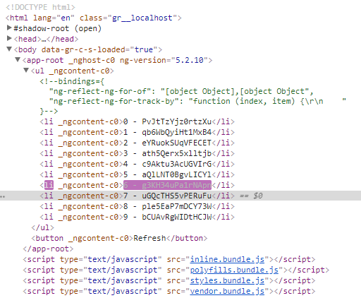

# 六、性能模式

在上一章中，我们研究了稳定性模式。稳定性模式适用于您的应用程序，使其能够在 bug 中生存。期望应用程序在交付时没有任何 bug 是可笑的，而试图实现这一点会让您的团队精疲力竭。相反，我们学会了如何使用它，并确保我们的应用程序具有足够的弹性，能够克服错误。在本章中，我们将重点讨论性能模式和反模式。这些模式定义的体系结构和实践对应用程序的性能产生了积极或消极的影响。

我们将详细了解以下内容：

*   阿贾克斯滥杀
*   未绑定结果集
*   代理
*   过滤器和管道
*   循环
*   变化检测
*   不变性
*   原型与可重用池

# 阿贾克斯滥杀

如果您的应用程序不仅仅是一个一次性原型或一个美化的单页机，那么您很可能正在处理远程 API。这些远程 API 依次与后端层（例如 PHP、Ruby 或 Golang）和数据库（例如 MySQL、MS SQL 或 Oracle）通信。

虽然这本书关注的是*角度*应用，但我们不能忽视这样一个事实，即它们通常不单独存在。实际上，任何有意义的应用程序都需要将数据从某处拉入或推送到某处。

考虑到这一点，让我们假设您的应用程序是在线电子商务网站（如 Amazon）的某种前端。这个虚构的应用程序肯定会有一个配置文件页面，您的用户可以在其中查看他们过去和正在执行的命令。

让我们进一步指定我们的应用程序，假设您的 API、端点指定如下：

```ts
GET /orders
```

这将返回已登录用户的订单。

以下是 JSON 返回调用的示例：

```ts
{
 "orders":[
  {
   "id":"123",
   "date": "10/10/10",
   "amount": 299,
   "currency": "USD"
  },
  {
   "id":"321",
   "date": "11/11/11",
   "amount": 1228,
   "currency": "USD"
  },
  {
   "id":"322",
   "date": "11/12/11",
   "amount": 513,
   "currency": "USD"
   },

  ...

 ]
}
```

为了清晰和简洁，我们将假设我们的用户通过了神奇的身份验证，并且他们访问给定 API 端点的授权也是神奇的。

对于每个命令，您都可以访问一个`GET`/`command_details`API，其中，对于给定的 ID，您可以检索命令的详细信息：

```ts
{
  "items":[
     {
        "id":123,
        "qty":1,
        "price": 2,
        "tax_rate": 0.19,
        "currency": "USD",
        "shipped_at": "10/10/10",
        "received_at": "11/10/10"
     },
     {
        "id":124,
        "qty":2,
        "price": 3,
        "tax_rate": 0.19,
        "currency": "USD",
        "shipped_at": "10/10/10",
        "received_at": "11/10/10"
     }
   ...
  ]
}
```

角度方面可以是一个简单的扩展面板，使用 Google Material Design components 套件的扩展面板实现，如以下屏幕截图所示：


我们还可以添加一个返回项目详细信息的`GET`/`items_details`，但现在我们就到此为止。

现在，假设每个 API 调用需要 100 毫秒才能完成，将 JSON 转换为 TypeScript 对象还需要 10 毫秒。有经验的开发人员肯定会首先获取给定用户的所有命令，然后预获取每个命令的详细信息，这样用户就不必在给定面板展开时等待。如果我们的 API 每秒可以处理 100 个请求，这是值得尊敬的，那么我们每秒只能服务 9 个客户端，假设每个客户端都有 10 个命令。每秒 9 个客户听起来不太好

事实上，10 个客户一次点击*订单恢复*页面将消耗我们 1/10 的容量，并引发额外的 100 个呼叫（10 个客户×10 个命令）。因此，第 10<sup>个</sup>客户端将在第一秒钟内不被服务。这听起来可能没有那么令人担忧，但是，我们只讨论了 10 个用户。

这种效果被称为 AJAX overkill 性能反模式。作为一名前端开发人员，我可以访问满足我所有需求的 API，并使用它们让我的客户满意。然而，预加载每个命令的每个细节，以及每个项目的每个细节，是一个糟糕的想法。您对后端体系结构施加了不必要的压力，以免客户希望立即访问最后命令的详细信息。

为了您的后端基础设施，当用户真正想要查看命令时，只请求命令的详细信息可能是值得的。

这与未绑定的 API 密切相关。再一次，后端架构不在本书的范围内，但是，如果我们要讨论 Angular 应用程序的性能，我们必须提到它。如果您可以控制所使用的 API，那么请确保它们公开某种分页，并且您可以正确使用它。

# 代理模式

继续我们对无界 API 和 AJAX overkill 的研究，在前面的配方中，我们确定应该避免这两种情况，但解决方案是在 API 未分页的情况下更改 API。这假设您有权访问这些 API，或者有权访问这些 API 的人。虽然这是一个合理的假设，但并非在所有情况下都成立。

除了不发出请求（显然），我们还能做些什么来保护那些设计糟糕、失控的 API？好的，解决这个问题的一个优雅方法是使用代理模式。代理模式用于控制对对象的访问。您肯定知道，web 代理可以在给定用户凭据的情况下控制对 web 页面的访问。在此配方中，我们将不讨论 web 代理，而是面向对象的代理。在面向对象代理中，我们在安全性方面并没有控制对对象的访问，而是在功能方面。

例如，图像处理软件可以列出和显示文件夹中的高分辨率照片对象，但用户不会始终可视化给定文件夹中的所有图像。因此，一些图像将被免费加载。

但是，这与我们的 API 问题有什么关系？使用代理模式，我们可以控制何时执行 API 请求，同时保持命令集合整洁。首先，让我们看看代理 UML：


首先，我们有定义`doOperation()`方法的`Subject`接口。此接口由`Proxy`和`RealSubject`类实现。`Proxy`类包含对`realSubject`类的引用，该类将在正确的时间填充。就我们的目的而言，它会是什么样子？

首先，我们有一个名为`OnlineCommand`的简单接口：

```ts
import { Item } from "./item";
export interface OnlineCommand {
fetchItems() : Item[]
}
```

在此接口中定义了唯一的方法：`fetchItems()`。此方法返回命令中包含的项。

然后，我们的组件有一个命令数组，代表我们客户的命令：

```ts
import { Component } from '@angular/core';
import { OnlineCommand } from './online-command';

@Component({
   selector: 'app-root',
   templateUrl: './app.component.html',
   styleUrls: ['./app.component.css']
})
export class AppComponent {
title = 'app';
private commands:OnlineCommand[]
}
```

在这个简短的组件中，除了使角度组件成为组件之外，我们只有客户的命令。

对于 HTML 部分，我们只需迭代命令集合，然后单击调用`fetchItems`函数：

```ts
<ul>
  <li *ngFor="let item of commands; let i = index" (click)="item.fetchItems()">
    {{i}} {{item}}
 </li>
</ul>
```

然后，我们有实现`OnlineCommand`接口的`RealCommand`类：

```ts
import { OnlineCommand } from "./online-command";
import { Item } from "./item";

//RealCommand is a real command that has the right to do
//API calls
export class RealCommand implements OnlineCommand{

   public fetchItems() : Item[] {
      //This would come from an API call
      return [new Item(), new Item()];
  }
}
```

谜题的最后一块，尽管是最重要的一块，是联机命令的代理版本：

```ts
import { OnlineCommand } from "./online-command";
import { RealCommand } from "./real-command";
import { Item } from "./item";

//A Proxified Command
export class ProxyfiedCommand implements OnlineCommand{

     //Reference to the real deal
     private real:RealCommand;

     //Constructor
     constructor() {
        this.real = new RealCommand();
     }

     //The Proxified fetchItems.
     //It only exists as a placeholder and if we need it
     //we' ll the real command.
     public fetchItems() : Item[] {
     console.log("About the call the API");
     let items = this.real.fetchItems();
     console.log("Called it");
     return items;
  }
}
```

如前所述，联机命令的代理版本包含对真实命令的引用，无论出于何种目的，该命令都是我们的实际命令。这里的要点是，昂贵的操作是我们只想在真正需要时访问的功能。在 HTML 方面，一切都优雅地隐藏在封装后面。在 TypeScript 方面，我们只在用户请求详细信息时执行调用，而不是在之前。

# 循环计数

任何类型的 Web 应用程序通常都充满了循环。它可以是*Amazon.com*的产品循环，银行网站的交易循环，手机操作商网站的电话循环，等等。最糟糕的是，一个页面上可能有许多循环。当这些循环在静态集合上进行迭代时，在生成页面时处理肯定需要时间，除非您对此无能为力。您仍然可以应用我们在本章前面看到的模式，以减少您的收集深度，并节省对每个项目的大量调用。然而，真正出现性能问题的地方是当这些循环绑定到异步演化的集合时。实际上，Angular 和所有允许这种绑定的框架在每次集合更改时都会重新绘制集合。实际上，它现在可以显示集合中的哪些项已被修改，以及如何在 DOM 中选择它们。因此，如果集合中有 1000 个元素，如果其中一个元素被修改，则必须重新绘制整个集合。实际上，这对用户和开发人员都是非常透明的。尽管如此，选择和更新 1000 个 DOM 元素（关于 JavaScript 集合的值）在计算上是可扩展的。

让我们模拟一组书籍：

```ts
export class Book {
   public constructor(public id:number, public title:string){

     this.id = id;
     this.title = title;
   }
}
```

`Book`类很简单。它只包含两个属性：`id`和`title`。在默认的应用程序组件中，我们添加了一个书籍列表和一些方法。在构造函数中，我们填充书籍。我们还有一个刷新方法，可以随机选择一本书并更新其标题。最后，`makeid`方法生成一个随机字符串 ID，我们可以使用它填充书名：

```ts
import { Component } from '@angular/core';
import { Book } from './books'
@Component({
  selector: 'app-root',
  templateUrl: './app.component.html',
  styleUrls: ['./app.component.css']
})
export class AppComponent {
  title = 'app';
  books: Book[] = [];
  constructor(){
    for (let i = 0; i < 10; i++) {

      this.books.push(new Book(i, this.makeid()))
    }
  }
  refresh(){
    let id =Math.floor(Math.random() * this.books.length)
    this.books[id].title = this.makeid();
    console.log(id, "refreshed")
  }
  private makeid(): string {
    var text = "";
    var possible = "ABCDEFGHIJKLMNOPQRSTUVWXYZabcdefghijklmnopqrstuvwxyz0123456789";
    for (var i = 0; i < 15; i++)
      text += possible.charAt(Math.floor(Math.random() * possible.length));
    return text;
  }
}
```

我们实验的最后一部分是下面的 HTML 模板：

```ts
<ul>
  <li *ngFor="let book of books; let i = index">{{book.id}} - {{book.title}}</li>
</ul>
<button (click)="refresh()">Refresh</button>
```

我们的 book 类、app 组件和`html`模板组合在一起时，将创建以下页面：


我们有 10 本书和与`refresh`功能相关的刷新按钮。按下时，将随机选择并更新一本书。现在，默认情况下，必须重新计算整个列表。当然，这里的*刷新*机制是手动的，但在更现实的场景中，刷新将与远程 API 更新异步。为了帮助 Angular 找出哪些元素已经更改并且需要刷新，我们可以使用`ngFor`的`trackBy`选项，如下所示：

```ts
<ul>
  <li *ngFor="let book of books; trackBy: trackByFn; let i = index">{{book.id}} - {{book.title}}</li>
</ul>
<button (click)="refresh()">Refresh</button>
The trackBy: trackByFn;we added references a function of our component named trackByFn
  trackByFn(index, item) {
returnindex; // or item.id
 }
```

此函数帮助 Angular 了解如何跟踪图书集合中的元素。现在，当按下刷新按钮时，只会重新计算并重新绘制修改后的元素。换句话说，将只操作一个 DOM 元素。再一次，对于 10 个元素，差异将不明显。然而，对于几十个用户来说，根据硬件的不同，他们可能会开始觉得页面有点迟钝。我们可以断言，通过使用 Chrome 开发工具，`trackByFn`函数按预期运行。在检查 DOM 时，如果单击刷新按钮，则只有一个`<li>`标记会亮起。DOM 元素在修改时亮起。在下面的屏幕截图中，您可以看到只有索引 6 处的元素正在重新计算，而不是列表中的所有元素：



# 变化检测和不变状态

我们在前面的配方中提到的问题是任何映射某种视图和模型的框架所固有的。这不是一个角度的特殊性。也就是说，这个问题虽然在循环中加剧，但在其他地方也存在。准确地说，它存在于我们在模型和视图之间绑定一切的任何地方。换句话说，每当我们的 HTML 模型中有`{{ myValue }}`时，它就会对我们的应用程序的性能产生影响。

那么，解决方案是什么？完全停止使用绑定？好吧，这不是很实际，因为我们会放弃让 JavaScript 具有吸引力的东西。不，真正的解决办法是使我们的对象不可变。然而，为了理解为什么，我们需要看看如何在角度检测中实现变化检测。顾名思义，变化检测是 Angular 为检测是否有任何变化而执行的过程。如果是这样，对象将被重新处理并重新绘制到 DOM 中。Angular 默认的方式是在我们的模型上附加一个*观察者*。观察者观察模型，并为绑定到视图的每个值保留一些内容。它保留绑定对象的引用、对象每个属性的旧值以及对象每个属性的新值。旧值和新值在对象更改状态时使用。在上一节的图书示例中，我们模型的观察者将为每本书提供其参考、新旧 ID 以及新旧标题。在每个检测周期，Angular 将检查对象的新旧属性是否匹配，如下所示：

```ts
book == book ? No; repaintBook.title == Book.title? No; repaintBook.id == Book.it ? No; repaint
```

像往常一样，单独采取这些行动并不重要。但是，当页面中有数百个具有数十个映射属性的对象时，您会感觉到性能受到了影响。正如我之前所说，这个问题的答案是不变性。对象的不变性意味着我们的对象不能改变它们的属性。如果要更改视图中显示的值，则必须完全更改对象。如果遵循不变性原则，那么之前的控制流如下所示：

```ts
book == book ? No; repaint
```

这在我们的应用程序中为我们节省了大量的 ifs 和 but，但也意味着我们的模型中对绑定变量（如`book.title = "qwerty"`）的修改不会反映在视图中。要使此修改可见，我们必须向视图提供一个新的 book 对象。让我们尝试一下这个新概念。以下是我们的 HTML 模板：

```ts
{{ book.id }} - {{ book.title }}<br/><button (click)="changeMe()">CHANGE</button>
```

这是我们的组成部分：

```ts
import { Component } from '@angular/core';
import { Book } from './book'
@Component({
  selector: 'app-root',
  templateUrl: './app.component.html',
  styleUrls: ['./app.component.css']
})
export class AppComponent {
  title = 'app';
  book: Book;
  constructor(){
    this.book = new Book(1, "Some Title");
  }
  changeMe(){
    this.book.title = "Some Other Title";
  }
}
```

book 类保持在上一节中介绍的状态。现在，在提供此应用程序时，您将收到以下信息：


按下更改按钮将更改显示的标题，如下所示：


如果我们告诉 Angular，我们希望只检查引用是否已更改，而不是使用`ChangeDetection.OnPush`方法检查每个属性的值，那么按钮将不再对视图产生任何影响。事实上，模型的值会发生变化，但变化检测算法不会捕捉到这种变化，因为正如我们前面解释的，本书的参考仍然是一样的。因此，如果确实要将更改传播到视图，则必须更改引用。以下是考虑到所有这些因素后我们的组件的外观：

```ts
import { Component, Input } from '@angular/core';
import { Book } from './book'
import { ChangeDetectionStrategy } from '@angular/core';
@Component({
  selector: 'app-root',
  templateUrl: './app.component.html',
  styleUrls: ['./app.component.css'],
  changeDetection: ChangeDetectionStrategy.OnPush
})
export class AppComponent {
  title = 'app';
  @Input() book: Book;
  constructor(){
    this.book = new Book(1, "Some Title");
  }
  changeMe(){
    this.book = new Book(this.book.id, "Some Other Title");
  }
}
```

我们在组件中添加了`changeDetection: ChangeDetectionStrategy.OnPush`并更改了`changeMe`方法，这样它就可以创建一本新书，而不是更新旧书。当然，创建一个新对象比更新一个现有对象更昂贵。然而，这种技术为角度应用带来了更好的性能，因为与实际发生变化的周期相比，在没有变化的情况下，每个对象的属性仍然与其旧值进行比较，因此存在无限多的周期。

使用这种技术，我们可以显著提高应用程序的性能，而不必考虑何时要将对象的更新传播到视图。请注意，这也适用于过滤器和管道。如果您的应用程序只有从模型到视图的一个绑定值，那么您可能会认为这无关紧要，并且可以一直变。如果您的应用程序确实只有一个绑定值，并且该值从未使用`{{ myValue | myPipe }}`符号进行管道传输或过滤，那么您是对的。

实际上，我们的应用程序异步处理每个管道。事实上，如果您有 100 个对`myPipe`的调用，那么您实际上创建了相当于 100 个监视`myValue`值的监视程序，并将您的管道应用于该值。这是有意义的，因为您的管道无法知道将要发生什么，也无法预测 100 次调用的计算结果是相同的。因此，它可以根据需要多次监视和执行。如果您发现自己的模板中填充了返回所有相同值的管道调用，那么最好使用该值创建一个虚拟组件作为输入，或者将转换后的值一起存储在模型中。

# 原型与可重用池

面向对象的开发人员正在寻找降低创建对象成本的方法，尤其是当这些对象由于需要（例如）数据库拉取或复杂的数学操作而创建成本高昂时。投资于降低特定对象的创建成本的另一个原因是当您创建很多对象时。如今，后端开发人员倾向于忽略这方面的优化，因为按需 CPU/内存已经变得便宜且易于调整。在你的后端增加一个内核或者 256MB 的 RAM，你每个月要多花几块钱。

这对于桌面应用程序开发人员来说也是一件大事。在客户机桌面上，没有办法按需添加 CPU/RAM，但对于消费类 PC 来说，相当有节奏的四核和荒谬的 RAM 数量使问题变得不那么严重。如今，似乎只有游戏和密集型分析解决方案开发商关心。那么，你到底为什么要关心对象的创建时间呢？嗯，您正在构建一些可能从旧设备访问的东西（我仍然使用 iPad1 在厨房或沙发上随意浏览）。虽然桌面应用程序开发人员可以发布最低限度的和推荐的配置，并通过拒绝自己安装来强制执行这些配置，但作为 web 开发人员，我们并没有这种奢侈。现在，如果你的网站行为不正常，用户不会质疑他们的机器，但你的技能。。。最终，他们不会使用您的产品，即使在功能强大的机器上。让我们看看如何使用`Prototype`设计模式。首先，我们需要这样一个`Prototype`接口：

```ts
export interface Prototype{
    clone():Prototype;
}
```

`Prototype`接口仅定义返回符合`Prototype`的对象的`clone`方法。您已经猜到了，创建对象的最佳方式是在需要时克隆它们！因此，假设您有一个名为`Movie`的对象，由于某些原因，它需要时间来构建：

```ts
export class Movie implements Prototype {

     private title:string;
     private year:number;
     //...

     public constructor()
     public constructor(title:string = undefined, year:number = undefined)
     {
         if(title == undefined || year == undefined){
             //do the expensive creation
         }else{
             this.title = title;
             this.year = year;
         }
     }

     clone() : Movie {
         return new Movie(this.title, this.year);
     }
 }

 expansiveMovie:Movie = new Movie();
 cheapMovie = expansiveMovie.clone();
```

如您所见，我们在 TypeScript 中重写函数的方式与大多数语言不同。在这里，构造函数的两个签名相互重叠，共享同一个实现。`Prototype`模式就是这样。通常与`Prototype`模式一起使用的另一个模式是对象池模式。在使用昂贵的对象来创建对象时，克隆它们肯定会有所不同。更大的区别是什么都不做：不创造，不克隆。为了实现这一点，我们可以使用 pool 模式。在这个模式中，我们有一个对象池，在 Angular 2 应用程序中，任何客户端或组件都可以共享这些对象。池实现很简单：

```ts
export class MoviePool{

     private static movies:[{movie:Movie, used:boolean}] = [];
     private static nbMaxMovie = 10;
     private static instance:MoviePool;

     private static constructor(){}

     public static getMovie(){

         //first hard create
         if(MoviePool.movies.length == 0){

             MoviePool.movies.push({movie:new User(), used:true});
             return MoviePool.movies[0].movie;

         }else{

             for(var reusableMovie:{movie:Movie, used:boolean} of MoviePool.movies){
                 if(!reusableMovie.used){
                     reusableMovie.used = true;
                     return reusableMovie.movie;
                 }
             }
         }

         //subsequent clone create
         if(MoviePool.movie.length < MoviePool.nbMaxMovie){

             MoviePool.movies.push({movie:MoviePool.movies[MoviePool.movies.length - 1].clone(), used:true});
             return MoviePool.movies[MoviePool.movies.length - 1].movie;
         }

         throw new Error('Out of movies');
     }

     public static releaseMovie(movie:Movie){
         for(var reusableMovie:{movie:Movie, used:boolean} of MoviePool.movies){
             if(reusableMovie.movie === movie){
                 reusableMovie.used = false;
             }
             return;
         }
     }
 }
```

首先也是最重要的是，游泳池也是单身。事实上，如果任何人都可以随意创建池，那么使用这种昂贵的对象可重用设计就没有多大意义。因此，我们有静态的`instance:MoviePool`和私有构造函数来确保只能创建一个池。然后，我们有以下属性：`private static movies:[{movie:Movie, used:boolean}] = [];`。

`movies`属性存储电影集合和一个布尔值，用于确定当前是否有人正在使用任何给定的电影。由于电影对象在内存中的创建或维护可能会非常繁重，因此有必要对我们的池中可以有多少这样的对象进行严格限制。此限制由私有静态`nbMaxMovie = 10;`属性管理。要获取电影，组件必须调用`getMovie():Movie`方法。此方法对第一部电影进行硬创建，然后利用`Prototype`模式创建任何后续电影。每次从池中签出电影时，`getMovie`方法都会将`used`布尔值更改为 true。请注意，如果池已满，并且我们没有任何免费电影可供分发，则会抛出一个错误。

最后，组件需要一种方法将它们的电影检查回池中，以便其他人可以使用它们。这是通过`releaseMovie`方法实现的。此方法接收假设签出的电影，并迭代池中的电影，根据布尔值将其设置为 false。因此，电影可用于其他组件。

# 总结

在本章中，我们学习了如何通过限制 AJAX 调用和使用代理设计模式来避免*Angular*应用程序中的主要性能缺陷。我们还学习了如何在性能方面控制循环的不良影响。然后，我们深入研究了 Angular 的变化检测过程，以便在对象计数过高的情况下，它能够很好地处理不可变对象。最后，我们还了解了原型和可重用池模式，这有助于减少应用程序在所需资源方面的占用。

在下一章中，我们将学习角度应用程序的操作模式。操作模式是帮助监视和诊断实时应用程序的模式。