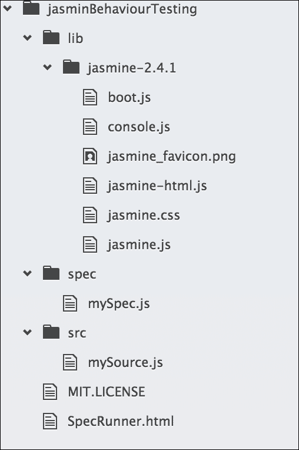
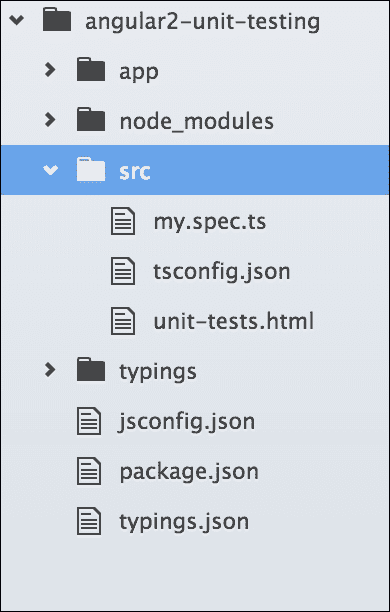

# 第 2 章 JavaScript 测试的细节

实践 TDD 是获得高质量、高精度软件的好方法，即使人数较少。对于 web 应用程序，JavaScript 已经成为最流行的脚本语言，测试 JavaScript 代码已经成为一项挑战。基于浏览器的测试实际上是一个时间杀手，对于 TDD 来说很难遵循，但是解决这个问题的方法是使用一些支持 JavaScript 自动测试的酷工具。大多数 web 应用程序项目仅限于单元测试，如果没有自动化测试工具，端到端测试或功能测试几乎是不可能的。

许多专注于 JavaScript 测试的工具和框架正在问世，它们提供不同的解决方案，使开发人员的生活变得轻松。除了发明新的 JavaScript 框架外，开发人员社区还发明了一些工具集来简化测试。像 Angular 团队一样，他们也有很酷的工具，比如**Karma**。我们也有重复的测试框架或工具，两者都以不同的方式解决类似的问题。选择哪些工具或框架取决于开发人员；他们必须选择最适合自己需求的工具。

在本章中，我们将介绍以下内容：

*   自动化测试简介
*   不同类型的测试侧重于 JavaScript
*   关于一些测试工具和框架的简要介绍

# JavaScript 测试工艺

我们都知道 JavaScript 是一种动态类型的解释语言。因此，与其他类似于 Java 的编译语言不同，没有任何编译步骤可以帮助您找出错误。因此，JavaScript 开发人员应该分配更多的时间来测试代码。然而，现在的生活更轻松了，因为开发人员可以使用最新的工具技术，用最少的步骤和时间完成测试。它是自动测试的一部分，在自动测试中，只要代码发生更改，就会自动测试代码。在这个过程中，测试可以是在后台运行的任务，可以集成到 IDE 或 CLI 中，并在开发过程中提供测试结果。

在接下来的部分中，我们将讨论如何使用测试运行器和无头浏览器在多个浏览器中自动化测试过程。

## 自动测试

测试很有趣，编写测试将使代码变得更好；这是一个很好的实践，但是过程性手动测试有点耗时，容易出错，而且不可复制。在此过程中，需要编写测试规范，更改代码以通过测试，刷新浏览器以获得结果，并重复此过程数次。作为一个程序员，重复同样的事情有点无聊。

除了单调之外，它还大大减慢了开发过程，这降低了开发人员练习 TDD 的积极性。因此，当手动流程减慢进度时，我们必须寻找一些自动化流程来完成这项工作，并为其他可能增加更多业务价值的任务节省时间。

因此，如果有一些工具或技术可以帮助程序员摆脱这些重复和枯燥的手动步骤，这些步骤会减慢流程，自动、更快地完成任务，并节省时间，从而使它们对业务更有价值，那将是一件非常棒的事情。幸运的是，有一些工具可以自动化这些测试。我们将介绍更多关于这些工具和技术的内容，但不在本节中介绍。

除了减慢开发过程的问题外，当我们谈论测试特性时，另一个重要的观点出现了，那就是跨浏览器兼容性问题。由于 web 应用程序应该在现代平台和浏览器上完美运行，而且手动逐个测试几乎是不可能的，因此自动化测试可能是使用 web 驱动程序和无头浏览器的解决方案。

让我们回顾一下我们在前一章中解释的基本测试流程——测试它，使它运行，并使它更好。为了使该过程自动化，开发人员可以在 CLI 中甚至在开发 IDE 中实现该工具集，并且这些测试将在单独的过程中连续运行，而无需开发人员的任何输入。

让我们考虑一下任何应用程序的注册或注册功能，每次我们想要测试该功能时，都必须手动填写表单并单击提交按钮，然后通过更改数据重复该过程。这实际上被称为功能测试（我们将在本章末尾讨论）。为了自动执行这些过程，我们将在 CLI 中使用工具集（test runner、web 驱动程序和 headless browser），并使用带有一些参数的单个命令完成该过程。

在自动化测试中测试 JavaScript 并不是一个新概念，事实上，它是最常用的自动化浏览器。硒是在 2004 年发明的，此后，出现了很多工具，包括幻影、因果报应、量角器和 CasperJS。在本章中，我们将讨论其中一些。

# 测试类型

在 TDD 中，开发人员必须遵循流程来实现测试目标。在这个流程中，每个步骤都有一个单独的测试目标。例如，编写一些测试只是为了以多种方式测试每个函数的行为，有些测试是为了测试模块/功能的流程。基于此，我们将在这里讨论两种主要的测试类型。详情如下:

*   **单元测试**：主要用于行为测试。
*   **端到端测试**：这通常被称为 e2e 测试，用于功能测试。

## 单元测试

**单元测试**是一个软件开发过程，其中任何应用程序的最小可测试部分单独称为单元，该小部分的行为应是可隔离测试的，不依赖于其他部分。如果我们将 JavaScript 应用程序视为软件，那么该应用程序中具有特定行为的每个方法/函数都将是一个代码单元。这些方法或代码单元的行为应该以隔离的方式进行测试。

关于单元测试的一个重要观点是，任何代码单元都应该独立运行/可测试，并且应该以任何顺序运行，这意味着如果单元测试在任何应用程序中成功运行，那么它代表了该应用程序的组件或模块的隔离。

例如，我们在前一章中已经展示了一个关于如何测试方法的小测试示例；虽然我们没有使用任何测试框架，但是想法是一样的。我们通过传递一些参数来调用该方法，得到该方法的结果，然后将结果与期望值进行比较。

通常，我们将使用我们选择的单元测试框架编写此类测试。现在有很多测试框架和工具，我们必须根据我们的需求来决定和选择最好的。最常用的框架是 Jasmine、Mocha 和 QUnit。我们将在本章中深入讨论这些工具，并在后续章节中介绍实际示例。

测试应该快速运行，并以清晰的输出自动进行。例如，您可以验证如果使用特定参数调用函数，它应该返回预期结果。

单元测试可以随时运行测试，例如在以下情况下：

*   从开发过程的一开始，即使测试失败
*   完成任何功能的开发后，验证行为是否正确
*   修改任何现有功能以验证行为没有更改后
*   在现有应用程序中添加新功能后，我们需要验证新功能是否被隔离，并且没有破坏任何其他功能

## 端到端测试

端到端测试是一种用于测试应用程序流从头到尾是否按照设计执行的方法。例如，如果用户单击产品列表中的产品，则应提示模式显示所选产品的详细信息。在这种情况下，产品/项目所有者将在规范中逐步定义项目要求。开发过程结束后，将根据规范的工作流程对项目进行测试。这称为函数/流测试，是端到端测试的另一个名称。

除了单元测试之外，端到端测试对于确认各个组件作为应用程序一起工作、传递信息以及在它们之间通信也很重要。单元测试的主要区别在于它不单独测试任何组件；相反，它是将所有相关组件组合在一起的流量测试。

考虑一个注册模块，用户应该提供一些有效的信息来完成注册，并且该模块/应用程序的功能/流量测试应该遵循一些步骤来完成测试。

步骤如下：

1.  加载/编译表单
2.  获取表单元素的 DOM
3.  触发 submit 按钮的 click 事件
4.  从输入字段中收集值以进行验证
5.  验证输入字段
6.  调用假 API 来存储数据

在每个步骤中，都会有一些结果与预期结果集进行比较。

这些类型的功能/流程测试可以由填写表单的人员手动进行测试，方法是单击下一步的按钮，完成应用程序流程，并将结果与实现过程中前面定义的规范进行比较。

然而，有一些技术可以以自动化的方式进行功能/流程测试，而不需要任何人的输入，这就是所谓的端到端测试。为了使这个测试过程更容易，有一些工具可用；最常用的是硒、幻影和量角器。这些工具可以轻松地与任何应用程序测试系统集成。在本章中，我们将更详细地讨论这些测试工具，在后续章节中，我们将把它们集成到应用程序的测试套件中。

# 测试工具和框架

了解不同的测试工具是什么是成功的一半。其中一些对于深入了解角度测试非常重要；我们将在本书中详细学习它们。然而，在本节中，我们将了解一些在不同 web 应用程序中用于各种测试和方法的著名工具和框架。详情如下:

*   **Karma**：这是 JavaScript 的测试运行程序
*   **量角器**：这是端到端测试框架
*   **Jasmine**：指行为驱动的 JavaScript 测试框架
*   **摩卡**：这是 JavaScript 测试框架
*   **QUnit**：表示单元测试框架
*   **Selenium**：这是一个自动化 web 浏览器的工具
*   **幻影 JS**：这是无头 webkit 浏览器

## 业力

在讨论什么是业力之前，最好先讨论什么不是业力。它不是编写测试的框架；这是一个试跑者。这意味着 Karma 使我们能够以自动化的方式在多个不同的浏览器中运行测试。过去，开发人员必须执行手动步骤来完成此操作，包括以下步骤：

*   打开浏览器
*   将浏览器指向项目 URL
*   运行测试
*   确认所有测试均已通过
*   改变
*   刷新页面

通过 Karma，自动化使开发人员能够运行单个命令并确定整个测试套件是否通过或失败。从 TDD 的角度来看，这使我们能够快速发现并修复失败的测试。

与手动过程相比，使用业力的一些优点如下：

*   能够在多个浏览器和设备中自动化测试
*   能够查看文件
*   在线文档和支持
*   做一件事——运行 JavaScript 测试——并且做得很好
*   使其易于与持续集成服务器集成

使用业力的缺点：

*   需要额外的工具来学习、配置和维护

自动化测试和使用 Karma 的过程是非常有利的。在本书的 TDD 旅程中，业力将是我们的主要工具之一。我们将在[第三章](3.html "Chapter 3. The Karma Way")、*业道*中详细了解业力。

## 量角器

量角器是一种端到端测试工具，允许开发人员模拟用户交互。它通过 web 浏览器的交互自动测试功能和特性。量角器有特定的方法来帮助测试角度，但它们并非仅限于角度。

使用量角器的一些优点如下：

*   可配置为测试多个环境
*   易于与角度传感器集成
*   语法和测试可以类似于为单元测试选择的测试框架

使用量角器的缺点：

*   其文档和示例有限

对于本书中示例的端到端测试，量角器将是我们的主要框架。量角器将在[第 4 章](4.html "Chapter 4. End-to-End Testing with Protractor")、*量角器端到端测试*中进一步详细介绍。

## 茉莉花

Jasmine 是一个用于测试 JavaScript 代码的行为驱动开发框架。它可以很容易地集成和运行的网站，是不可知的角度。它提供间谍和其他功能。它也可以在没有业力的情况下独立运行。在本章中，我们将详细了解 Jasmine 常用的内置全局函数，并了解 Jasmine 测试套件如何满足 web 应用程序的测试需求。此外，在本书中，我们将使用 Jasmine 作为我们的测试框架。

使用茉莉花的一些优点如下：

*   与业力的默认整合
*   提供附加功能以协助测试，例如测试间谍、伪造和传递功能
*   清除可读语法，该语法允许以与被测试行为相关的方式格式化测试
*   与多个输出报告器的集成

以下是使用茉莉花的一些缺点：

*   运行测试时没有可用的文件监视功能。这意味着测试必须在更改时由用户重新运行。
*   对于所有量角器方法和功能，学习曲线可能陡峭。

## T0 摩卡

Mocha 最初是为 Node.js 应用程序编写的测试框架，但它也支持浏览器测试。它与 Jasmine 非常相似，反映了它的大部分语法。Mocha 的主要区别在于它不能作为测试框架独立运行——它需要一些插件和库作为测试框架运行，而 Jasmine 是独立的。它更易于配置和灵活使用。

让我们讨论一下摩卡咖啡的一些优点：

*   易于安装
*   提供良好的文档
*   他有好几个记者
*   插入多个节点项目

以下是一些缺点：

*   断言、间谍等需要单独的插件/模块
*   与 Karma 一起使用所需的额外配置

## T0

QUnit 是一个功能强大、易于使用的 JavaScript 单元测试套件。它被 jQuery、jQuery UI 和 jQuery 移动项目使用，能够测试任何通用 JavaScript 代码。QUnit 专注于在浏览器中测试 JavaScript，同时为开发人员提供尽可能多的便利。

QUnit 的一些优点：

*   易于安装
*   提供良好的文档

以下是使用 QUnit 的一个缺点：

*   主要是为 jQuery 开发的，不适合与其他框架一起使用

## 硒

硒（[http://www.seleniumhq.org/](http://www.seleniumhq.org/) 对自身的定义如下：

> *“Selenium 自动化浏览器。就是这样！”*

浏览器的自动化意味着开发人员可以轻松地与浏览器交互。他们可以点击按钮或链接，输入数据，等等。Selenium 是一个强大的工具集，如果使用和设置得当，它会带来很多好处；然而，设置它可能会让人困惑和麻烦。

硒的一些优点如下：

*   大型功能集
*   分布式测试
*   通过**酱油实验室**（[等服务提供 SaaS 支持 https://saucelabs.com/](https://saucelabs.com/)
*   现有文件和资源

以下是硒的一些缺点：

*   必须作为单独的进程运行
*   配置的几个步骤

由于量角器是硒的包装器，因此不会详细讨论。

## 幻影

PhantomJS 是一个无头 WebKit，可使用 JavaScript API 编写脚本。对各种 web 标准有*fast*和*原生*支持；DOM 处理、CSS 选择器、JSON、画布和 SVG。PhantomJS 用于测试工作流。

简单地说，PhantomJS 是一种无头运行的浏览器（即，不绘制屏幕）。它带来的好处是速度——如果您控制计算机上的实际程序，则在启动浏览器、配置配置文件等方面会有一定的开销。

PhantomJS 并不是要取代测试框架；它将与一个应用程序一起工作。

# 这是我们的选择

正如我们所看到的，有很多用于测试 JavaScript 项目的工具集和框架：

*   对于断言框架，我们将使用 Jasmine，因为 Angular 本身使用 Jasmine 作为断言；但在某些情况下，主要是对于 Node.js 项目，Mocha 也很有趣
*   只要我们专注于自动化测试套件，测试运行者对我们来说是最重要的，当涉及到一个角度项目时，没有什么可以与 Karma 相比
*   对于端到端测试，量角器是最好的框架，我们将在本章中使用它。
*   只要是端到端测试，就必须实现自动化，Selenium 将为我们实现浏览器的自动化。
*   作为跨浏览器支持运行测试是很重要的，而 PhantomJS 在这里可以作为无头浏览器。

# 向 Jasmine 测试套件问好

只要我们必须使用测试框架来构建测试套件，所有框架上都有一些基本和通用的断言。了解这些断言和间谍以及何时使用它们是很重要的。

在本节中，我们将解释 Jasmine 的断言和间谍，因为 Jasmine 将是我们在本书中的测试框架。

## 套房

任何测试套件都以一个全局 Jasmine`describe`函数开始，该函数接收两个参数。第一个是字符串，第二个是函数。字符串是套件名称/标题，函数用于将在套件中实现的代码块。

考虑下面的例子：

```ts
describe("A sample test suite to test jasmine assertion", function() {  
   // .. implemented code block 
}); 

```

## 规格

任何用 Jasmine 的全局`it`函数定义的规范，类似于套件中接收两个参数的规范，第一个是字符串，第二个是函数。字符串是规范名称/标题，函数用于规范中要实现的代码块。请看以下示例：

```ts
describe("A sample test suite to test jasmine assertion", function() { 
    var a; 
    it("Title for a spec", function() { 
        // .. implemented code block 
    }); 
}); 

```

## 期望值

使用`expect`函数定义的任何期望值，该函数接收一个称为“实际”的参数值。此函数是一个带有 matcher 函数的链，matcher 函数将期望值作为参数来匹配实际值。

有几个常用的匹配器；它们都实现了实际值和期望值之间的布尔比较。任何匹配者都可以通过将`expect`方法与`not`关键字链接来计算负值。

一些常见的匹配器是`toBe`、`toEqual`、`toMatch`、`toBeNull`、`toBeDefined`、`toBeUndefined`和`toContain`。

考虑给定的例子：

```ts
describe("A sample test suite to test jasmine assertion", function() {  
    var a, b; 
    it("Title for a spec", function() { 
        var a = true; 
        expect(a).toBe(true); 
        expect(b).not.toBe(true); 
    }); 
}); 

```

## 设置和拆卸

为了通过 DRY（不要重复自己）复制安装和拆卸代码来改进测试套件，Jasmine 为安装和拆卸提供了一些全局函数。这些全局函数（`beforeEach`、`afterEach`等等）如下所示，它们按照名称运行。

每个函数都是根据测试规范运行的。Jasmine 的全局设置和拆卸函数是`beforeEach`、`afterEach`、`beforeAll`和`afterAll`。

考虑下面的例子：

```ts
describe("A sample test suite to test jasmine assertion", function() { 
    var a=0;    
    beforeEach(function() { 
        a +=1; 
    }); 
    afterEach(function() { 
        a =0; 
    }); 
    it("Title for a spec 1", function() { 
        expect(a).toEqual(1); 
    }); 
    it("Title for a spec 2", function() { 
        expect(a).toEqual(1); 
        expect(a).not.toEqual(0); 
    }); 
}); 

```

## 间谍

间谍在《茉莉花》中扮演双重角色；它们可以存根任何函数并跟踪对该函数及其所有参数的调用。有几个匹配者在跟踪是否有间谍被叫来。这些是`toHaveBeenCalled`、`toHaveBeenCalledTimes`等等。

spy 使用了一些有用的链式方法，例如`returnValue`/`returnValues`，当通过 spy 链式调用时，这些方法将返回一个或多个值。还有一些类似的有用方法，例如`callThrough`、`call`、`stub`、`call.allArgs`、`call.first`和`call.reset`。

考虑下面的例子：

```ts
describe("A sample test suite to test jasmine assertion", function() { 
    var myObj, a, fetchA; 
    beforeEach(function() { 
        myObj = { 
            setA: function(value) { 
                a = value; 
            }, 
            getA: function(value) { 
                return a; 
            }, 
        }; 
        spyOn(myObj, "getA").and.returnValue(789); 
        myObj.setA(123); 
        fetchA = myObj.getA(); 
    }); 

    it("tracks that the spy was called", function() { 
         expect(myObj.getA).toHaveBeenCalled(); 
    }); 
    it("should not affect other functions", function() { 
        expect(a).toEqual(123); 
    }); 
    it("when called returns the requested value", function() { 
        expect(fetchA).toEqual(789); 
    }); 
}); 

```

## 茉莉花测试套件

在上一节中，我们查看了所有测试框架（包括 Jasmine）在任何类型的测试套件中使用的一些常用断言。

尽管在本书中，我们将为角度测试构建一个自动化测试套件，但让我们在 Jasmine 测试套件中尝试一些断言，看看它是如何工作的。这个示例测试套件将为我们提供一些关于断言如何在测试套件上工作的实践经验。

对于这个测试套件，我们将使用 Jasmine 的样例 spec runner 项目（在示例中的 Jasmine 下载包中提供），项目的文件夹结构如下所示：



让我们快速浏览一下贾斯敏样本 To.t0}项目中必须更新的文件：

```ts
SpecRunner.html: 
<!DOCTYPE HTML> 
<html> 
<head> 
    <meta http-equiv="Content-Type" content="text/html; charset=UTF-8"> 
    <title>Jasmine Spec Runner v2.4.1</title> 
    <link rel="shortcut icon" type="image/png" href="lib/jasmine-2.4.1/jasmine_favicon.jpg"> 
    <link rel="stylesheet" type="text/css" href="lib/jasmine-2.4.1/jasmine.css"> 

    <script type="text/javascript" src="lib/jasmine-2.4.1/jasmine.js"></script> 
    <script type="text/javascript" src="lib/jasmine-2.4.1/jasmine-html.js"></script> 
    <script type="text/javascript" src="lib/jasmine-2.4.1/boot.js"></script> 
    <!-- include source files here... --> 
    <script type="text/javascript" src="src/mySource.js"></script> 
    <!-- include spec files here... --> 
    <script type="text/javascript" src="spec/mySpec.js"></script> 
</head> 
<body> 
</body> 
</html> 

src/mySource.js: 
var a, 
myObj = { 
    setA: function(value) { 
        a = value; 
    }, 
    getA: function(value) { 
        return a; 
    }, 
}; 

Spec/mySpec.js: 
describe("A sample test suite to test jasmine assertion", function() { 
    var fetchA; 
    beforeEach(function() { 
        spyOn(myObj, "getA").and.returnValue(789); 
        myObj.setA(123); 
        fetchA = myObj.getA(); 
    }); 

    it("tracks that the spy was called", function() { 
         expect(myObj.getA).toHaveBeenCalled(); 
    }); 
    it("should not affect other functions", function() { 
        expect(a).toEqual(123); 
    }); 
    it("when called returns the requested value", function() { 
        expect(fetchA).toEqual(789); 
    }); 
}); 

```

只要它是基于浏览器的测试套件，我们就必须指向 web 浏览器才能获得测试结果。我们将通过所有测试，测试结果将如以下屏幕截图所示：


# 茉莉花测角套装

在前面的示例中，我们看到了一个用于 JavaScript 测试的 Jasmine 测试套件，但是对于 Angular，它应该是什么样子呢？实际上，没有直接的答案，因为对于 Angular project 测试套件，我们不会使用基于浏览器的测试套件；我们有一个测试运行者，负责测试套件的 Karma。但是，正如我们在前面的示例中熟悉的基于浏览器的 Jasmine 测试套件一样，让我们看看如果我们为 Angular 项目创建一个类似的测试套件会是什么样子。

我们必须在测试规范的 Angular 项目中添加一个子文件夹`src`，然后项目的文件夹结构将如下所示：



### 注

在 Angular 项目中，我们将使用 TypeScript，而不是 Angular 官方建议使用的普通 JavaScript。因此，我们希望大家都知道 TypeScript 语法，并知道如何编译为 JS。

在本书中，对于 Angular 测试套件，我们将使用 SystemJS 作为模块加载器，正如 Angular 官方建议的那样；我们来看看 SystemJS。

这个示例 Angular test suite 只是为了说明我们可以多么容易地为 Angular 项目创建一个测试套件，尽管它没有遵循最佳实践和加载模块的最佳方式。

在[第 3 章](3.html "Chapter 3. The Karma Way")、*因果报应之路*中，我们将使用真实示例更新此测试套件，并使用 SystemJS 作为模块加载程序。

GitHub 的 Angular 团队有一个名为`Angular2-seed`的种子项目，用测试套件引导 Angular 项目；我们将遵循这一点，为我们真正的角度项目。

如果我们看一下文件夹结构，它几乎与前一个相同，并且 spec 文件中的更改也很少；规范中唯一的更改是 TypeScript：

```ts
src/unit-tests.html: 

<!DOCTYPE html> 
<html> 
<head> 
    <meta http-equiv="content-type" content="text/html;charset=utf-8"> 
    <title>NG2 App Unit Tests</title> 
    <link rel="stylesheet" href="node_modules/jasmine-core/lib/jasmine-core/jasmine.css"> 
    <script src="node_modules/jasmine-core/lib/jasmine-core/jasmine.js"></script> 
    <script src="node_modules/jasmine-core/lib/jasmine-core/jasmine-html.js"></script> 
    <script src="node_modules/jasmine-core/lib/jasmine-core/boot.js"></script> 
    <script src="../app/mysource.js"></script> 
    <script src="my.spec.js"></script> 

</head> 
<body> 
</body> 
</html> 

app/mysource.ts: 
export class Source { 
    // ...  
} 

src/my.spec.ts: 
describe('1st tests', () => { 
    it('true is true', () => expect(true).toEqual(true)); 

    it('null is not the same thing as undefined', 
        () => expect(null).not.toEqual(undefined) 
    ); 
}); 

```

由于这也是一个基于浏览器的测试套件，我们必须在 web 浏览器中指向[T0]才能获得测试结果。我们将通过所有测试，测试结果如下所示：


# 自测题

自测问题将帮助您进一步测试使用 TDD 进行 JavaScript 应用程序测试的知识。

问题 1。端到端测试意味着什么样的测试？

*   功能测试
*   行为测试

问题 2。量角器是一个单元测试框架。

*   符合事实的
*   错误的

第三季度。PhantomJS 是一种浏览器类型。

*   符合事实的
*   错误的

第四季度。QUnit 是用于什么的测试框架？

*   jQuery
*   有棱角的
*   NodeJS

问题 5。安装和拆卸是 Jasmine 的一项功能。

*   符合事实的
*   错误的

# 总结

在本章中，我们回顾了测试 TDD 的不同机制，并介绍了自动测试。我们回顾了各种 JavaScript 测试框架和工具，并回顾了这些框架的使用及其优缺点。我们还回顾了 Jasmine 的一些常见断言，并亲自尝试了它们的工作原理。

在下一章中，我们将学习 Karma，并了解它如何与角度测试套件一起工作。