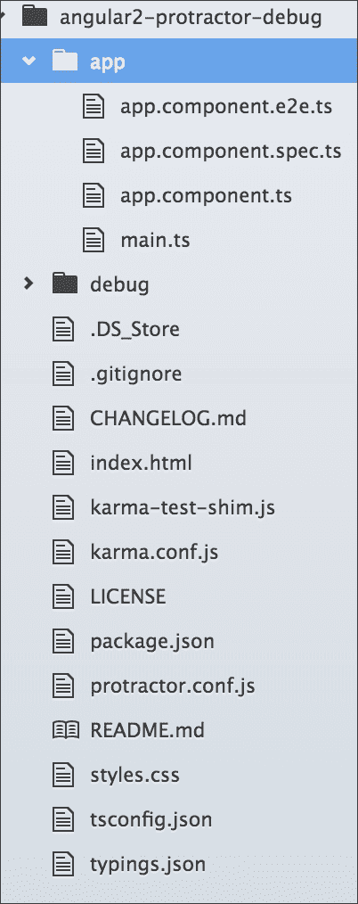
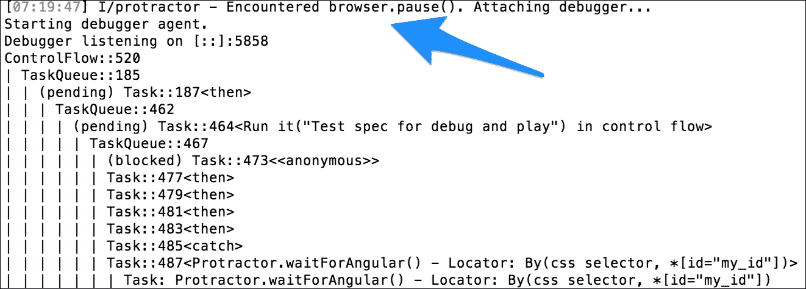
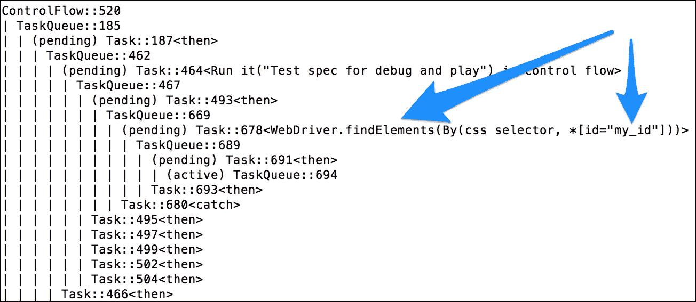
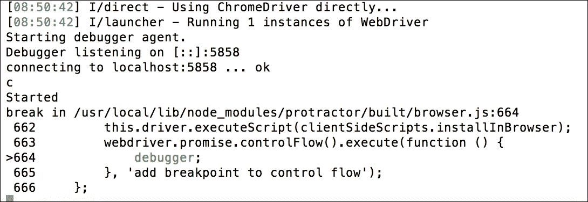

# 第五章量角器，前进一步

端到端测试非常有趣，只要它直接与浏览器交互，但是一个好的开发人员应该知道量角器的高级功能，以便执行大规模的应用程序测试。此外，调试在 e2e 测试中也是一项挑战，因为它取决于浏览器的 DOM 元素。

量角器有一些用于调试的 API。本章将主要介绍这些 API 和功能，包括以下内容：

*   设置和配置量角器
*   一些高级量角器 API，如浏览器、定位器和动作
*   用`browser.pause()`和`browser.debug()`API 调试量角器

# 高级设置和配置

在上一章中，我们看到了量角器的基本和常用设置和配置。在这里，我们将了解一些使安装更简单、功能更强大的高级配置。

## 整体安装量角器

以下是全局安装量角器的步骤：

1.  Once Node.js has been installed and is available in command prompt, type the following command to install Protractor globally on the system:

    ```ts
    $ npm install -g protractor

    ```

    前面的命令使用 Node 的`npm`命令全局安装量角器，这样我们就可以只使用`protractor`命令使用量角器。

2.  测试量角器版本是否可以确定如下：

    ```ts
    $ protractor --version

    ```

## 高级配置

在本节中，我们将使用以下步骤进一步配置量角器：

1.  更新量角器`config`文件以支持单个测试套件中的多个浏览器。`multiCapabilities`参数是一个数组，它为任何测试套件获取多个`browserName`对象，如下所示：

    ```ts
            exports.config = {  
              //...  
            multiCapabilities: [{
             'browserName': 'firefox' 
            }, { 
             'browserName': 'chrome' 
            }]
            //... };
    ```

2.  我们可以在`capabilities`参数中设置浏览器的高级设置；例如，对于`chrome`，我们可以将额外的参数传递为`chromeOptions`，如下所示：

    ```ts
            exports.config = {  
              //...  
              capabilities: { 
                'browserName': 'chrome'
                'chromeOptions': {
                  'args': ['show-fps-counter=true']
                }}]
            //... };
    ```

3.  有时，我们可能需要在没有 Selenium 或 WebDriver 的情况下直接运行量角器。这可以通过在`config.js`文件中传递参数来实现。配置对象中的参数为`directConnect: true`，如图所示：

    ```ts
            exports.config = { 
              //... 
              directConnect: true, 
              //... 
            }; 

    ```

伟大的我们已经提前一步配置了量角器。

# 量角器 API

对任何网页进行 e2e 测试的主要活动是获取该网页的 DOM 元素，与它们交互，为它们分配操作，并与它们共享信息；然后，用户可以获得网站的当前状态。为了使我们能够执行所有这些操作，Gragrator 提供了大量 API（有些来自 web 驱动程序）。在本章中，我们将介绍一些常用的 API。

在上一章中，我们了解了量角器如何与角度项目一起工作，在角度项目中，我们必须与 UI 元素交互。为此，我们使用了一些量角器 API，例如`element.all`、`by.css`、`first`、`last`和`getText`。然而，我们没有深入了解这些 API 的工作原理。理解量角器中 API 的工作原理非常简单，但在现实生活中，我们将不得不处理更大、更复杂的项目。因此，为了与 UI 交互并处理其事件，我们必须了解并了解更多关于这些 API 的信息。

## 浏览器

量角器与 SeleniumWebDriver 配合使用，后者是一个浏览器自动化框架。我们可以使用 Selenium WebDriver API 中的方法与测试规范中的浏览器进行交互。我们将在以下部分中介绍其中的一些方法。

要将浏览器导航到特定的 web 地址，并在角度加载之前加载该页面的模拟模块，我们将使用`.get()`方法，通过传递特定地址或相对路径：

```ts
browser.get(url); 
browser.get('http://localhost:3000'); // This will navigate to
the localhost:3000 and will load mock module if needed 

```

要获取当前页面的 web URL，请使用`CurrentUrl()`方法，如下所示：

```ts
browser.getCurrentUrl(); // will return http://localhost:3000 

```

要导航到另一个页面并在页面导航中使用它进行浏览，请使用`setLocation`，如下所示：

```ts
browser.setLocation('new-page'); // will change the url and navigate to the new url, as our current url was http://localhost:3000, now it will change and navigate to http://locahost:3000/#/new-page 

```

要获取当前页面的标题（基本上是 HTML 页面中设置的标题），使用`getTitle`方法，如下所示：

```ts
browser.getTitle(); // will return the page title of our page, for us it will return us "Angular Protractor Debug" 

```

要在角度加载之前使用 mocks 模块重新加载当前页面，请使用`refresh()`方法，如下所示：

```ts
browser.refresh(); // this will reload the full page and definitely will load the mocks module as well. 

```

为了暂停测试过程，使用`pause()`方法。这对于调试测试过程非常有用，我们将使用以下测试调试部分：

```ts
browser.pause(); 

```

为了调试测试过程，使用了`debugger()`方法。这种方法是不同的，可以认为是`pause()`方法的先进水平。这对于测试过程的高级调试以及向浏览器中注入自定义辅助功能非常有用。我们还将使用此测试调试部分：

```ts
browser.debugger(); 

```

要关闭当前浏览器，请使用`close()`。当我们有时需要在打开新浏览器之前关闭当前浏览器时，这对于复杂的多模块测试非常有用：

```ts
browser.close(); 

```

为了支持量角器中的角度，我们必须将`useAllAngularAppRoots`参数设置为`true`。这样做的逻辑是，当我们将此参数设置为`true`时，当元素查找器遍历页面时，它将搜索页面中的所有 Angle 应用程序：

```ts
browser.useAllAngular2AppRoots; 

```

## 元素

### 提示

量角器本身公开了一些全局函数，`element`就是其中之一。这个函数接受一个定位器（一种选择器——我们将在下一步中讨论），并返回一个`ElementFinder`。此函数基本上基于定位器查找单个元素，但它支持多元素唱歌，同时链接另一个方法`element.all`，该方法也接受定位器并返回`ElementFinderArray`。它们都支持下一个操作的链接方法。

### 元素。全部

我们已经知道，`element.all`返回一个`ElementArrayFinder`，它支持下一个操作的链接方法。我们将介绍其中的一些，以及它们实际上是如何工作的：

要选择多个元素作为具有特定定位器的数组，我们应使用`element.all`，如下所示：

```ts
element.all(Locator); 
var elementArr = element.all(by.css('.selector'));  // return the ElementFinderArray 

```

在获得一组元素作为数组之后，我们可能需要选择一个特定的元素。在这种情况下，我们应该通过传递特定数组索引作为位置号来链接`get(position)`：

```ts
element.all(Locator).get(position); 
elementArr.get(0); // will return first element from the ElementFinderArray  

```

在获得一组元素作为数组后，我们可能需要使用首选定位器再次选择子元素，为此，我们可以再次将`.all(locator)`方法与现有元素链接，如下所示：

```ts
element.all(Locator).all(Locator); 
elementArr.all(by.css('.childSelector')); // will return another ElementFinderArray as child elements based on child locator  

```

在获得所需的元素后，我们可能希望检查所选元素的数量是否如预期的那样。有一种方法`count()`，用于链取所选元素的总数：

```ts
element.all(Locator).count(); 
elementArr.count(); // will return the total number in the select element's array   

```

类似于`get(position)`方法，我们可以通过链接`first()`方法从数组中获取第一个元素：

```ts
element.all(Locator).first(); 
elementArr.first(); // will return the first element from the element's array   

```

与`first()`方法类似，我们可以通过链接`last()`方法从数组中获取最后一个元素：

```ts
element.all(Locator).last(); 
elementArr.last(); // will return the last element from the element array   

```

只要我们有一组元素作为一个数组，我们就可能需要遍历这些元素来执行任何操作。在这种情况下，我们可能需要通过链接`each()`方法进行循环：

```ts
element.all(Locator).each(Function) { }; 
elementArr.each( function (element, index) { 
    // ......  
}); // ... will loop through out the array elements 

```

与`each()`方法一样，还有另一种方法`filter()`与元素数组链接以遍历项目并为其分配过滤器：

```ts
element.all(Locator).filter(Function) { }; 
elementArr.filter( function (element, index) { 
    // ......  
}); //... will apply filter function's action to all elements  

```

### 元素

`element`类返回`ElementFinder`，表示元素数组中的单个元素，也支持下一个动作的链接方法。在前面的示例中，我们看到了如何从元素数组中获取单个选定元素，以便所有链接方法也可以处理该单个元素。对于单个元素，有很多链接方法，我们将介绍一些最常用的方法。

通过将特定定位器作为参数传递给`element`方法，我们可以选择单个 DOM 元素，如下所示：

```ts
element(Locator); 
var elementObj = element(by.css('.selector'));  // return the ElementFinder based on locator  

```

在获得特定的单个元素后，我们可能需要找到元素的子元素，在该元素上我们必须将`element.all`方法与 rerun`elementFinder`对象链接起来。为此，请传递特定定位器以查找子项`elementFinderArray`，如下所示：

```ts
element(Locator).element.all(Locator); 
elementObj.element.all(by.css('.childSelector')); // will return another ElementFinderArray as child elements based on child locator  

```

选择特定元素后，我们可能需要在链接`isPresent()`方法时检查该元素是否存在，如下所示：

```ts
element(Locator).isPresent(); 
elementObj.isPresent(); // will return boolean if the selected element is exist or not.   

```

## 行动

操作主要更改影响或触发所选 DOM 元素的方法。选择 DOM 元素的目的是通过触发一些操作来与它交互，以便它可以像真正的用户一样工作。对于特定的交互，有一些常用的操作。我们将在这里介绍其中的一些。

要获取任何元素的内部文本或包含文本，我们必须在选择特定元素后将`getText()`方法与`elementFinder`对象链接，如下所示：

```ts
element(Locator).getText(); 
var elementObj = element(by.css('.selector'));  // return the ElementFinder based on locator  
elementObj.getText(); // will return the contained text of that specific selected element  

```

要获取任何元素的内部 HTML，我们必须在选择特定元素后将`getInnerHtml()`方法与`elementFinder`对象链接，如下所示：

```ts
element.(Locator).getInnerHtml(); 
elementObj.getInnerHtml(); // will return the inner html of the selected element.  

```

通过将属性键传递给`getAttribute()`方法，我们可以找到任何元素的任何特定属性值，该方法将与所选`elementFinder`对象链接，如下所示：

```ts
element(Locator).getAttribute('attribute'); 
elementObj.getAttribute('data'); // will return the value of data attribute of that selected element if that have that attribute 

```

在大多数情况下，我们需要清除输入字段的值。为此，我们可以将`clear()`方法与所选`elementFinder`对象链接，如图所示：

```ts
element.(Locator).clear(); 
elementObj.clear(); // Guessing the elementFinder is input/textarea, and after calling this clear() it will clear the value and reset it.    

```

### 提示

请记住，只有输入或纹理可能具有某些值，需要您清除/重置该值。

当我们需要在任何按钮、链接或图像上触发点击事件时，在选择一个特定的`elementFinder`对象后，我们需要链接`click()`方法，它将像在该元素上真正点击一样：

```ts
element.(Locator).click(); 
elementObj.click(); // will trigger the click event as the selected element chaining it.    

```

有时，我们可能需要触发表单提交的`submit()`方法。在这种情况下，我们必须将`submit()`方法与所选元素链接起来。所选元素应为`form`元素：

```ts
element.(Locator).submit(); 
elementObj.submit(); // Will trigger the submit for the form 
element as submit() work only for form element.   

```

## 定位器

定位器通知量角器如何在 DOM 元素中找到某个元素。量角器将`locator`导出为全局工厂函数，该函数将与全局`by`对象一起使用。基于 DOM，我们可以以多种方式使用它们，但让我们看看一些最常用的方法。

我们可以通过将任何 CSS 选择器传递给`by.css`方法来选择任何元素，如下所示：

```ts
element(by.css(cssSelector));  
element.all(by.css(cssSelector)); 
<span class="selector"></span> 
element.all(by.css('.selector'));  // return the specific DOM element/elements that will have selector class on it 

```

我们可以通过将元素 ID 传递给`by.id`方法来选择任何元素，如下所示：

```ts
element(by.id(id)); 
<span id="selectorID"></span>   
element(by.id('selectorID')); // return the specific DOM element that will have selectorID as element id on it  

```

我们也可以通过传递给`by.tagName`，通过标记名选择一个或多个特定元素，如下所示：

```ts
element(by.tagName(htmlTagName)); 
element.all(by.tagName(htmlTagName)); 
<span data="myData">Content</span> 
element.all(by.tagName('span')); // will return the DOM element/elements of all span tag.  

```

要选择任何特定输入字段的 DOM 元素，我们可以在`by.name`方法中传递名称，如图所示：

```ts
element(by.name(elementName)); 
<input type="text" name="myInput"> 
element(by.name('myInput')); // will return the specific input field's DOM element that have name attr as myInput 

```

除了 CSS 选择器或 ID 之外，我们还可以通过将其文本标签传递给`by.buttonText`来选择特定的按钮：

```ts
<button name="myButton">Click Me</button> 
element(by.buttonText('Click Me')); // will return the specific button that will have Click Me as label text  
element(by.buttonText(textLabel)); 

```

我们可以通过在`by.model`上传递定义为`ng-model`的模型名来找到一个元素，如下所示：

```ts
element.(by.model); 
<span ng-model="userName"></span> 
element(by.model('userName')); // will return that specific element which have defined userName as model name    

```

类似地，我们可以通过传递其在`by.bindings`中用`ng-bind`定义的绑定来找到特定的 DOM 元素，如下所示：

```ts
element.(by.binding); 
<span ng-bind="email"></span> 
element(by.binding('email')); // will return the element that have email as bindings with ng-bind  

```

除了前面解释的所有定位器之外，还有另一种方法可以找到特定的 DOM 元素：自定义定位器。在这里，我们必须通过传递定位器名称和回调来使用`by.addLocator`创建自定义定位器。然后，我们必须使用`by.customLocatorName(args)`传递该自定义定位器，如下所示：

```ts
element.(by.locatorName(args)); 
<button ng-click="someAction()">Click Me</button> 
by.addLocator('customLocator', function(args) { 
    // .....  
}) 
element(by. customLocator(args)); // will return the element that will match with the defined logic in the custom locator. This useful mostly when user need to select dynamic generated element.  

```

# 量角器试验-尸检

调试 e2e 测试有点困难，因为它们依赖于应用程序的整个生态系统。有时它们依赖于以前的操作，例如登录，有时它们依赖于权限。调试 e2e 的另一个主要障碍是它对 WebDriver 的依赖性。由于它在不同的操作系统和浏览器中的行为不同，因此很难调试 e2e。除此之外，它还会生成很长的错误消息，这使得很难区分与浏览器相关的问题和测试过程错误。

尽管如此，我们仍将尝试调试所有 e2e 测试，看看它如何适用于我们的案例。

## 故障类型

测试套件失败可能有多种原因，只要它依赖于 WebDriver 和整个系统的各个部分。

让我们看看一些已知的故障类型：

*   **WebDrive 失败**：当命令无法完成时，WebDriver 抛出错误。例如，浏览器无法获取为帮助其导航而定义的地址，或者可能未按预期找到元素。
*   **WebDriver 意外失败**：有时候 WebDriver 在更新 web 驱动程序管理器失败时会失败并给出错误。这是一个与浏览器和操作系统相关的问题，尽管这并不常见。
*   **角度量角器故障**：由于量角器测试依赖于角度本身，当库中未按预期找到角度时，量角器将失败。
*   **量角器 Angular2 故障**：当配置中缺少`useAllAngular2AppRoots`参数时，量角器对于 Angular 项目的测试规范将失败，因为如果没有此参数，测试过程将查看一个根元素，同时期望过程中有更多元素。
*   **量角器超时失败**：有时测试规范落入循环或长池中，量角器超时失败，无法及时返回数据。但是，超时是可配置的，因此可以根据需要增加超时。
*   **期望故障**：这是测试规范中常见的故障。

## 加载现有项目

本测试使用的代码来自[第 4 章](4.html "Chapter 4. End-to-End Testing with Protractor")、*使用量角器进行端到端测试*。我们将把代码复制到一个新目录：`angular-protractor-debug`。

提醒一下，该应用程序是一个待办事项应用程序，在待办事项列表中有一些项目，我们向其中添加了一些项目。它有一个组件类`AppComponent`，它有一个项目列表和一个`add`方法。

当前目录的结构应如下所示：



验证文件夹结构是否与前一屏幕截图中所示相同后，第一个作业是通过运行以下命令在本地获取所需的依赖项`node_modules`：

```ts
$ npm install

```

这将安装所有必需的模块。现在，让我们使用`npm`命令构建并运行项目：

```ts
$ npm start

```

现在一切正常：项目在`http://localhost:3000`上运行，输出如图所示：


有了这些，我们就可以进入下一步，在 Angular 项目中实现调试器了。

## 项目中包含调试器

在将调试器添加到项目之前，让我们在现有项目中运行 e2e 测试。我们希望在 e2e 测试规范中能够顺利通过。

让我们使用以下命令运行它：

```ts
$ npm run e2e

```

正如所料，我们的测试通过了。结果如下：


我们可以在通过的测试规范所在的位置添加调试代码，但是让我们将通过的测试用例分开，并在不同的目录中使用调试器。让我们创建一个新目录，[T0]。目录中需要两个文件：一个用于配置，另一个用于规范。

对于量角器配置文件，我们可以复制`protractor.conf.js`文件并将其重命名为`debugConf.js`。

配置中的所有内容都将与以前的配置相同。但是，我们需要增加 Jasmine 测试的默认超时，否则测试将在调试期间超时。

让我们将超时增加到`3000000`毫秒：

```ts
exports.config = { 
    // ....  
    jasmineNodeOpts: { 
      showColors: true, 
      defaultTimeoutInterval: 3000000 
    }, 
    // ..... 
}; 

```

接下来，我们将需要一个规范文件，用于编写测试规范和调试测试。将新规范文件另存为`app.debug.e2e.ts`。哦，是的，我们需要再次更改配置文件以定义用于调试的规范文件。

```ts
exports.config = { 
    // ....  
    specs: [ 
      'app.debug.e2e.js' 
    ], 
    // ..... 
}; 

```

我们可以为`app.debug.e2e.ts`制作一个简单的测试规范文件。然后，我们可以添加调试代码并使用它们。

简单测试规范如下所示：

```ts
describe('AppComponent Tests', () => { 
    beforeEach(() => { 
        browser.get('/'); 
    }); 

    it('Test spec for debug and play', () => { 

    }); 
}); 

```

# 暂停和调试

要调试任何测试规范，我们必须暂停测试过程，一步一步地查看发生了什么。量角器还内置了暂停过程的方法。以下是暂停和调试测试过程的两种方法：

*   `browser.pause()`
*   `browser.debugger()`

## 使用暂停

使用`browser.pause()`命令，调试量角器测试变得简单易行。使用`pause()`方法，我们可以进入量角器调试器控制流并执行一些命令来检查测试的控制流中发生了什么。大多数情况下，当测试因未知错误而失败并且有很长的错误消息时，开发人员在测试中使用调试器。

使用`browser.pause()`命令后，我们可以根据需要使用更多的命令。

让我们简单地看一看：

*   `c`：如果我们输入`c`作为命令，它将在测试中向前移动一步，我们将深入了解测试命令的工作方式。如果我们计划继续进行一项测试，那么最好快点进行，因为有一个超时问题（Jasmine 默认超时），我们已经了解了这个问题。稍后我们将看到一个示例。
*   `repl`：通过输入`repl`作为命令，我们可以进入调试的交互模式。它被称为交互模式，从那里，我们可以通过键入 WebDriver 命令从终端直接与浏览器交互。来自浏览器的响应、结果或错误也将显示在终端上。稍后我们将看到更多实际操作的示例。
*   `Ctrl + C`：按***Ctrl***+C 退出暂停模式，继续测试。当我们使用它时，测试将从暂停点继续。

### 一个简单的例子

要在测试规范中使用`browser.pause()`，我们必须在需要暂停测试并观察控制流以进行调试的地方将方法添加到测试规范中。在这里，我们只有一个错误/失败的测试用例的测试规范，我们知道它将失败，我们将找出它失败的原因。

我们必须将`pause()`方法添加到测试`spec it() {}`功能中，如图所示：

```ts
it('Test spec for debug and play', () => { 
  browser.pause(); 
  // There is not element with the id="my_id", so this will fail
  the test 
  expect(element(by.id('my_id')).getText()).toEqual('my text') 
});  

```

是时候进行测试了。由于我们已经分离了调试器的测试规范，我们将通过量角器（而不是[T0]）运行测试。

让我们使用以下命令运行测试：

```ts
$ protractor debug/debugConf.js

```

由于我们将`browser.pause()`方法置于`expect()`方法之前，因此它将在此处暂停。我们可以在控制流中看到，这使得它等待角度：



我们将继续前进；为此，让我们键入[T0]。它将运行`executeAsyncScript`并等待角度加载：


我们将通过键入`C`向前迈进一步。它会根据我们提供的定位器来选择元素，即`element(by.id('my_id')`：



我们现在快得到测试结果了。为此，我们必须再向前迈进一步，键入[T0]。现在，它将尝试根据定位器选择元素，但选择失败。这将给出一个带有错误消息的结果，如预期的那样：


### 交互方式调试

要进入交互模式，我们必须键入`repl`，之后我们可以运行测试规范中使用的任何命令。

让我们查找元素及其文本：

```ts
> element(by.id('my_id')).getText() 

```

结果和我们之前得到的一样，一步一步向前，输入`C`。

**结果**：`NoSuchElementError: No element found using locator: By (css selector,``*[id="my_id"])`

现在，让我们看看交互模式在有效定位器中是如何工作的，何时会找到[T0]：

```ts
> element.all(by.css('li')).first().getText() 

```

**结果**：`test`

## 使用调试器

使用`browser.debugger()`命令进行调试有点复杂，比使用`browser.pause()`更高级。使用`browser.pause()`命令，我们可以暂停测试的控制流，并将自定义助手函数注入浏览器，以便以与在浏览器控制台中调试相同的方式进行调试。

这个调试应该在调试模式下的节点下进行，就像这里的量角器调试一样。此调试对于不擅长节点调试的人没有用处。

以下是一个例子：

为了在测试规范中使用`browser.debugger()`方法，我们必须在我们想要设置断点并观察控制流的地方将该方法添加到测试规范中。

对于我们来说，我们需要在`test spec it() {}`函数中添加`debugger()`方法，如下所示，这将是我们的断点：

```ts
it('Test spec for debug and play', () => { 
  browser.debugger(); 
  // There is not element with the id="my_id", so this will fail 
the test 
  expect(element(by.id('my_id')).getText()).toEqual('my text') 
  });   

```

现在让我们运行它：

```ts
$ protractor debug debug/debugConf.js

```

### 注

要运行调试器，我们必须在`protractor`之后的命令中添加`debug`。

运行命令后，我们必须通过键入[T0]前进，但在这里我们只需要执行一次。结果如下：



# 自测题

问题 1。`Selenium WebDriver`是一个浏览器自动化框架。

*   符合事实的
*   错误的

问题 2。使用`browser.debugger()`是调试量角器的一种简单方法。

*   符合事实的
*   错误的

第三季度。`by.css()`、`by.id()`和`by.buttonText()`的名称是什么？

*   元素
*   定位器
*   行动
*   浏览器

# 总结

量角器有各种 API。在本章中，我们试图通过一些示例了解一些最常用的 API。我们还详细介绍了 API 类型（如浏览器、元素、定位器和操作），以及它们之间的链接方式。

本章介绍了调试，我们尝试学习一种简单的调试方法，更详细地使用`browser.pause()`，然后我们转向一种复杂的方法（`browser.debugger()`，并理解复杂的开发人员需要节点调试经验。

在下一章中，我们将深入研究更多的现实项目；此外，我们将学习自上而下和自下而上的方法，并学习它们。