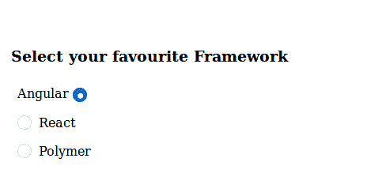
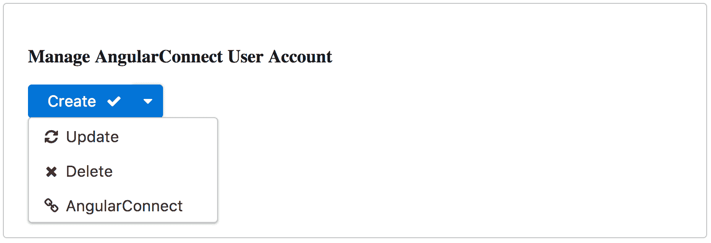
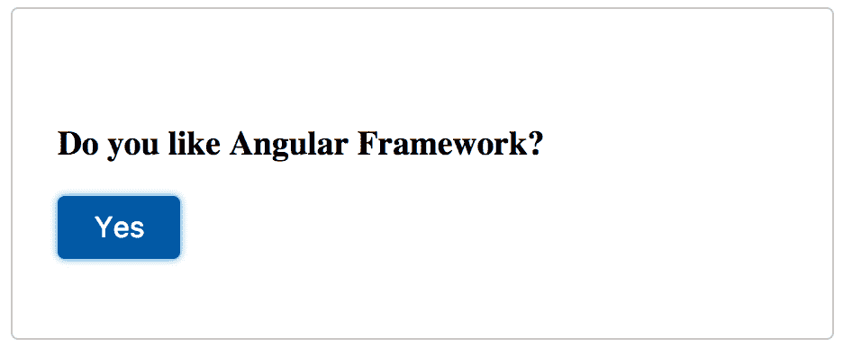

# 四、按钮和面板组件


在本章中，我们将首先介绍各种按钮组件，如单选按钮、拆分按钮、切换按钮和选择按钮，然后介绍各种面板组件，如工具栏、基本面板、字段集、手风琴和选项卡式视图。用户输入方式多种多样，其中按钮输入是最佳选择之一；另一方面，面板组件充当容器组件，允许对其他本机 HTML 或启动组件进行分组。Priming 的每个特性——增强的按钮和面板组件都涵盖了许多实时用例需求。本章详细介绍了配置按钮和面板组件的各种设置。

在本章中，我们将介绍以下主题：

*   增强型按钮、单选按钮和拆分按钮
*   通过切换按钮和选择按钮选择值
*   使用工具栏对按钮进行分组
*   使用面板和字段集排列视图
*   带手风琴的垂直堆叠面板
*   在 TabView 中使用选项卡对内容进行分组


# 增强型按钮、单选按钮和拆分按钮


按钮是任何网页设计中经常使用的元素。使用令人敬畏的功能启动扩展的普通按钮行为。


# 按钮


按钮组件是标准输入元素的扩展，用于用户与图标和主题的交互。[T0]指令使普通 HTML 按钮成为一个增强型按钮。具有已定义标签文本的按钮组件的基本示例如下所示：

```ts
<button name="basic" pButton type="button" label="ClickMe"></button>

```

按钮类型应为`button`型。以下屏幕截图显示基本按钮示例的快照结果：


Button 组件支持一个名为`click`的事件回调，单击 Button 元素将调用该事件回调。请记住，按钮的点击事件基本上是从角度事件，而不是特定于启动。


# 图标和严重性


按钮组件对于图标和严重性属性更有用。`icon`属性用于表示顶部的字体图标。默认图标位置为左侧位置。可以使用有效值为`left`和`right`的`iconPos`属性进行定制。要仅显示一个图标，请将标签保留为未定义。具有图标和标签的各种组合的按钮组件示例如下所示：

```ts
<button pButton type="button" icon="fa-close"></button>
<button pButton type="button" icon="fa-check" label="Yes"></button>
<button pButton type="button" icon="fa-check" iconPos="right" label="Yes"></button>

```

在前面的示例中，按钮定义为不带标签、带标签和带标签的右定位图标（按各自的顺序）。以下屏幕截图以图标为例显示了按钮的快照结果：


为了区分用户操作的不同严重性级别，PrimeNG 提供了五种不同的类别，即这些样式类别不同于常规主题颜色：

*   `ui-button-secondary`
*   `ui-button-success`
*   `ui-button-info`
*   `ui-button-warning`
*   `ui-button-danger`

以下屏幕截图显示了一个按钮的快照结果，以所有严重性案例（与常规主题类相比）为例：


使用常规的`disabled`属性阻止用户交互。

The complete demo application with instructions is available on GitHub at
[https://github.com/ova2/angular-development-with-primeng/tree/master/chapter4/button.](https://github.com/ova2/angular-development-with-primeng/tree/master/chapter4/button)


# 单选按钮


RadioButton 是标准单选按钮元素的扩展，具有蒙皮功能，一次只能选择一个值。双向绑定是通过`ngModel`指令提供的，该指令将默认值启用为选中或未选中（预选）。具有已定义标签文本的 RadioButton 组件的基本示例如下所示：

```ts
<div class="ui-g">
  <div class="ui-g-12">
    <p-radioButton name="group1" value="Angular" label="Angular"
      [(ngModel)]="basic"></p-radioButton>
  </div>
  <div class="ui-g-12">
    <p-radioButton name="group1" value="React" label="React"
      [(ngModel)]="basic"></p-radioButton>
  </div>
  <div class="ui-g-12">
    <p-radioButton name="group1" value="Polymer" label="Polymer"
      [(ngModel)]="basic"></p-radioButton>
  </div>
</div>

```

在前面的示例中，所有单选按钮都映射到同一组（`name="group1"`，以便作为互斥单选组工作。以下屏幕截图显示单选按钮示例的快照结果：



单选按钮组件支持一个名为`onClick`的事件回调，单击单选按钮元素时将调用该事件回调。`label`属性为单选按钮提供标签文本。标签也可以单击并选择值。与单选按钮关联的标签组件需要在点击时触发输入焦点，这可以通过`inputId`属性实现。

The complete demo application with instructions is available on GitHub at
[https://github.com/ova2/angular-development-with-primeng/tree/master/chapter4/radio-button.](https://github.com/ova2/angular-development-with-primeng/tree/master/chapter4/radio-button)


# 拆分按钮


SplitButton 使用默认命令按钮将叠加中的菜单项集合分组。此按钮使用公共菜单模型 API 来定义其项。因此，“拆分”按钮是按钮和菜单组件的组合。定义了标签文本的 SplitButton 组件的基本示例如下所示：

```ts
<p-splitButton label="Create" (onClick)="create()" [model]="items">
</p-splitButton>

```

标签仅应用于默认命令按钮。以下屏幕截图显示了拆分按钮示例的快照结果：


split button 组件支持一个名为`onClick`的事件回调，单击默认按钮元素时将调用该事件回调。

PrimeNG 4.1 provided `appendTo` the option which provides customization over where the overlay would be appended.


# 图标和主题


有许多选项可以自定义拆分按钮的简单行为。这些图标可以使用`icon`属性分别应用于相关的默认命令按钮和菜单项。默认情况下，图标与左侧对齐，但这也可以应用于右侧，使用`iconPos`属性，而组件和叠加的蒙皮行为通过`style`、`styleClass`、`menuStyle`和`menuStyleClass`类属性进行修改。具有已定义标签文本的 SplitButton 组件的基本示例如下所示：

```ts
<p-splitButton label="Create" icon="fa-check" iconPos="right"  
  menuStyleClass="customized-menu" [model]="itemsIcons">
</p-splitButton>

```

在前面的示例中，叠加菜单默认样式是在[T0]属性的帮助下更改的。例如，在这种情况下，通过设置`menuStyleClass`类名更改叠加的默认宽度，如下所示：

```ts
.customized-menu {
  width: 140%;
}

```

以下屏幕截图显示了拆分按钮示例的快照结果：



在前面的快照中，“拆分”按钮使用图标进行自定义，“创建命令”按钮图标与右侧对齐，叠加的宽度增加以容纳图标和文本。

The complete demo application with instructions is available on GitHub at
[https://github.com/ova2/angular-development-with-primeng/tree/master/chapter4/split-button](https://github.com/ova2/angular-development-with-primeng/tree/master/chapter4/split-button).


# 使用 ToggleButton 和 SelectButton 选择值


ToggleButton 提供了一种使用按钮选择布尔值的方法。`ngModel`指令用于定义与布尔属性的双向数据绑定。也就是说，通过启用布尔属性来实现切换按钮的预选。ToggleButton 用法的基本示例如下：

```ts
<p-toggleButton [(ngModel)]="basic" name="basic"></p-toggleButton>

```

以下屏幕截图显示了基本示例的快照结果：



ToggleButton 还为默认标签和图标提供了自定义选项，如`onLabel`、`offLabel`、`onIcon`和`offIcon`。与切换按钮关联的标签组件需要在点击标签时触发按钮焦点，这可以通过`inputId`属性实现。带有标签、图标和事件的自定义切换按钮如下所示：

```ts
<p-toggleButton [(ngModel)]="customized" name="custom" onLabel="I 
  confirm" offLabel="I reject" onIcon="fa-check-square" 
  offIcon="fa-window-close">
</p-toggleButton>

```

在前面的示例中，`icon`属性可以使用各种字体图标。以下屏幕截图显示了自定义示例的快照结果：


使用`onChange`事件通知用户操作。同时，使用`disabled`属性阻止用户交互。


# 选择按钮


SelectButton 组件用于以按钮的形式从列表中选择单个或多个项目。选项列表中的每个项都定义为具有标签-值对属性的`SelectItem`接口。这些选项通过带有双向绑定的`ngModel`属性进行绑定，这将导致基于后端组件数据的默认选择。选择按钮用法的基本示例如下：

```ts
<p-selectButton [options]="types" [(ngModel)]="selectedType"   
  name="basic">
</p-selectButton> 

```

在前面的示例中，所有基本库都作为[T0]属性的数组收集。以下屏幕截图显示了选择按钮示例的快照结果：


在前面的示例中，一次只选择一个项目（单个选择），但也可以使用`multiple`属性（即`multiple="true"`选择多个项目）。在这种情况下，所选数组列表不应指向 null 或未定义的值。

选择按钮组件支持一个名为`onChange`的事件回调，单击默认按钮元素将调用该事件回调。

The complete demo application with instructions is available on GitHub:

*   [https://github.com/ova2/angular-development-with-primeng/tree/master/chapter4/togglebutton](https://github.com/ova2/angular-development-with-primeng/tree/master/chapter4/togglebutton)
*   [https://github.com/ova2/angular-development-with-primeng/tree/master/chapter4/selectbutton](https://github.com/ova2/angular-development-with-primeng/tree/master/chapter4/selectbutton)


# 使用工具栏对按钮进行分组


工具栏是按钮和其他 web 资源的分组或容器组件。工具栏内容被包装在两个`div`元素中，一个用于使用`.ui-toolbar-group-left`类对齐左侧的内容，另一个用于使用`.ui-toolbar-group-right`类对齐右侧的内容。具有不同按钮、输入控件和文本内容的工具栏组件示例如下：

```ts
<p-toolbar name="toolbar">
  <div class="ui-toolbar-group-left">
    <button pButton type="button" name="open" label="Open" 
      icon="fa-folder-open"></button>
    <button pButton type="button" name="new" label="New folder" 
      icon="fa-plus"></button>
    <p-splitButton  name="organize" label="Organize" 
      icon="fa-check" name="organize"
      [model]="items"></p-splitButton>
  </div>

  <div class="ui-toolbar-group-right">
    <input name="search" type="text" size="30" pInputText 
    [(ngModel)]="search"
      placeholder="Search files here"/>
      <i class="fa fa-bars"></i>
      <button name="refresh" pButton type="button" 
      icon="fa-refresh"></button>
      <button name="help" pButton type="button" 
      icon="fa-question-circle"></button>
  </div>
</p-toolbar>

```

以下屏幕截图以工具栏的快照结果为例：


在前面的快照中，常用工具栏按钮位于左侧，辅助（或附加信息）位于右侧。蒙皮功能通过`style`和`styleClass`属性提供。

The complete demo application with instructions is available on GitHub at
[https://github.com/ova2/angular-development-with-primeng/tree/master/chapter4/toolbar](https://github.com/ova2/angular-development-with-primeng/tree/master/chapter4/toolbar).


# 使用面板和字段集排列视图


大多数网站和仪表盘需要分组或容器组件来突出显示标题和说明。Priming 提供了多种容器组件。


# 面板


作为 web 内容的通用分组组件，Panel 具有切换和自定义内容等功能。小组的基本定义如下：

```ts
<p-panel header="PrimeNG">
  PrimeNG is a collection of rich UI components for Angular.
  PrimeNG is a sibling of the popular JavaServer Faces Component Suite,  
  PrimeFaces.
  All widgets are open source and free to use under MIT License.
  PrimeNG is developed by PrimeTek Informatics, a company with years of 
  expertise in developing open source UI components.
</p-panel>

```

面板的上述定义将显示容器内的底漆细节，如以下屏幕截图所示：


该面板将更加用户友好，具有可切换（`toggleable="true"`和自定义标题内容功能。可切换功能将内容定义为展开或折叠。使用`collapsed`属性定义的面板内容（展开或折叠）的初始状态；默认情况下，内容部分将展开，而自定义的页眉和页脚是通过接受文本、图像、图标等的`p-header`和`p-footer`标记定义的。例如，以下拉形式列出预充资源的自定义标题如下所示：


我们可以使用`onBeforeToggle`和`onAfterToggle`回调捕获切换前和切换后的用户操作。


# 字段集。


FieldSet 是一个具有内容切换功能的分组组件。在顶部，图例定义了标题，并在正文内容周围绘制了一个框。具有`toggleable`功能的字段集示例如下：

```ts
 <p-fieldset legend="PrimeNG" [toggleable]="true" [collapsed]="true">
   PrimeNG is a collection of rich UI components for Angular.
   PrimeNG is a sibling of the popular JavaServer Faces Component  
   Suite, PrimeFaces.
   All widgets are open source and free to use under MIT License.
   PrimeNG is developed by PrimeTek Informatics, a company with years 
   of expertise in developing open source UI components.
</p-fieldset>

```

字段集的上述定义将显示在以下屏幕截图中：


与面板组件类似，FieldSet 通过`p-header`属性（即自定义标题内容）提供自定义图例。

字段集标题文本由`legend`属性管理，而切换功能由`toggleable`和`collapsed`属性控制。有两个名为`onBeforeToggle`和`onAfterToggle`的事件回调可用于任何自定义逻辑实现。

The complete demo application with instructions is available on GitHub:

*   [https://github.com/ova2/angular-development-with-primeng/tree/master/chapter4/panel](https://github.com/ova2/angular-development-with-primeng/tree/master/chapter4/panel)

*   [https://github.com/ova2/angular-development-with-primeng/tree/master/chapter4/fieldset](https://github.com/ova2/angular-development-with-primeng/tree/master/chapter4/fieldset)


# 带手风琴的垂直堆叠面板


Accordion 是一个容器组件，它能够以多个选项卡的形式对内容进行分组。内容可以是文本、图像或任何其他组件。所有选项卡内容都以垂直顺序堆叠。具有不同角度细节版本的手风琴组件的基本定义如下：

```ts
<p-accordion>
  <p-accordionTab header="AngularJS">
    AngularJS (commonly referred to as "Angular.js" or "AngularJS 1.X")  
    is a JavaScript-based open-source front-end web application 
    framework mainly maintained by Google and by a community of  
    individuals and corporations to address many of the
    challenges encountered in developing single-page applications.
  </p-accordionTab>
  <p-accordionTab header="AngularV2.0">
    The successor to the older AngularJS web framework, now simply 
    known as "Angular". Angular takes a web component-based 
    approach to build powerful applications for the web. It is used  
    along with TypeScript which provides support for both older
    and new versions of JavaScript.
  </p-accordionTab>
  <p-accordionTab header="AngularV4.0">
    Angular version 4.0.0 is a major release following announced 
    adoption of Semantic Versioning, and is backwards compatible with   
    2.x.x for most applications.
  </p-accordionTab>
</p-accordion>

```

前面的手风琴将以垂直面板显示，如以下屏幕截图所示：


在前面的简单示例中，手风琴将一次显示一个选项卡内容。组件中提供了通过启用`multiple`属性来显示多个选项卡内容的功能。手风琴可以通过强大的功能进行定制，如自定义标题、选项卡事件、默认选定选项卡和禁用行为。

手风琴组件的自定义定义如下：

```ts
<p-accordion>
  <p-accordionTab>
    <p-header>
      
      AngularJS
    </p-header>
    AngularJS (commonly referred to as "Angular.js" or "AngularJS 1.X") 
    is a JavaScript-based open-source front-end web application 
    framework mainly maintained by Google and by a community
    of individuals and corporations to address many of the challenges  
    encountered in developing single-page applications.
  </p-accordionTab>
  <p-accordionTab header="AngularV2.0">
    <p-header>
      
      AngularV2.0
    </p-header>
    The successor to the older AngularJS web framework, 
    now simply known as "Angular". Angular takes a web 
    component-based approach to build powerful 
    applications for the web. It is used along with TypeScript 
    which provides support for both older and new versions of  
    JavaScript.
  </p-accordionTab>
  <p-accordionTab header="AngularV4.0">
    <p-header>
      
      AngularV4.0
    </p-header>
    Angular version 4.0.0 is a major release 
    following announced adoption of Semantic Versioning,
    and is backwards compatible with 2.x.x for most applications.
  </p-accordionTab>
</p-accordion>

```

在前面的示例中，自定义标题是使用`p-header`标记创建的，该标记由角度徽标和文本内容组成。手风琴将显示定制的高级功能，如下图所示：


Accordion 组件支持两个名为`onOpen`和`onClose`的事件回调，分别在打开和关闭选项卡时调用。

PrimeNG 4.1 release introduced the `activeIndex` property, which defines the active tab or an array of indexes to change selected tab programmatically. For example, `[activeIndex]="0,1"`.
The complete demo application with instructions is available on GitHub at
[https://github.com/ova2/angular-development-with-primeng/tree/master/chapter4/accordion](https://github.com/ova2/angular-development-with-primeng/tree/master/chapter4/accordion).


# 在 TabView 中使用选项卡对内容进行分组


选项卡式视图是一种选项卡式面板组件，用于以垂直和水平选项卡的形式对内容进行分组。默认选项卡视图将以水平方向显示选项卡，一次只能选择一个选项卡来查看内容。选项卡视图组件的基本定义如下：

```ts
<p-tabView name="basic">
  <p-tabPanel header="AngularJS">
    AngularJS (commonly referred to as "Angular.js" or
    "AngularJS 1.X") is a JavaScript-based open-source front-end web  
    application framework mainly maintained by Google and by a  
    community of individuals and corporations to address many of 
    the challenges encountered in developing single-page applications.
  </p-tabPanel>
  <p-tabPanel header="AngularV2.0">
    The successor to the older AngularJS web framework, 
    now simply known as "Angular". Angular takes a
    web component-based approach to build powerful 
    applications for the web. It is used along with
    TypeScript which provides support for both older 
    and new versions of JavaScript.
  </p-tabPanel>
  <p-tabPanel header="AngularV4.0">
    Angular version 4.0.0 is a major release following announced  
    adoption of Semantic Versioning, and is backwards compatible 
    with 2.x.x for most applications.
  </p-tabPanel>
</p-tabView>

```

前面的选项卡视图将与水平面板一起显示，如以下屏幕截图所示：


每个页签用`p-tabPanel`表示。可以使用`orientation`属性更改选项卡的方向。它支持四种不同的方向：`top`、`bottom`、`left`和`right`。`Top`是默认方向。

该组件还支持各种其他高级功能，如`closable`选项卡（`closable="true"`），事件（`onChange`在选项卡更改时调用，`onClose`在选项卡关闭时调用），使用`selection`属性的默认选择，以及使用`disabled`属性禁用选项卡。

`onChange`事件对象公开了组件类中可访问的两个属性：

| `onChange` | 

*   `event.originalEvent` ：本机点击事件
*   `event.index` ：所选页签的索引

 |

```ts
onTabChange(event:any) {
  this.msgs = [];
  this.msgs.push({severity:'info', summary:'Tab Expanded', 
    detail: 'Target: '+ event.originalEvent.target+'Index: '
    + event.index});

```

`onClose`事件对象公开了三个属性，这些属性可以在组件类中访问：

| `onClose` | 

*   `event.originalEvent` ：本机点击事件
*   `event.index` ：已关闭页签索引
*   `event.close` ：实际关闭页签的回调，仅当 `controlClose` 已启用

时才可用 |

```ts
onTabClose(event:any) {
  this.msgs = [];
  this.msgs.push({severity:'info', summary:'Tab closed', 
    detail: 'Target: ' + event.originalEvent.target+'Index: '
    + event.index});
}

```

选项卡视图组件的自定义定义如下：

```ts
<p-tabView (onChange)="onTabChange($event)"  
  (onClose)="onTabClose($event)">
  <p-tabPanel header="AngularJS" [closable]="true" [selected]="true">
    AngularJS (commonly referred to as "Angular.js" or "AngularJS 1.X") 
    is a JavaScript-based open-source front-end web application 
    framework mainly maintained by Google and by a community of
    individuals and corporations to address many of the challenges 
    encountered in developing single-page applications.
    </p-tabPanel>
  <p-tabPanel header="AngularV2.0" [closable]="true" 
   leftIcon="fa-bell-o" rightIcon="fa-bookmark-o">
    The successor to the older AngularJS web framework, 
    now simply known as "Angular". Angular takes a
    web component-based approach to build powerful applications 
    for the web. It is used along with TypeScript which provides  
    support for both older and new versions of JavaScript.
  </p-tabPanel>
  <p-tabPanel header="AngularV4.0" [disabled]="true">
    Angular version 4.0.0 is a major release following announced  
    adoption of Semantic Versioning, and is backwards compatible 
    with 2.x.x for most applications.
  </p-tabPanel>
</p-tabView>

```

前面的选项卡视图将显示如下屏幕截图所示：


请记住，只有`orientation`、`activeIndex`、`style`和`styleClass`属性应用于 TabView 元素，而所有其他属性都需要为 tab Panel 元素定义。

The complete demo application with instructions is available on GitHub at
[https://github.com/ova2/angular-development-with-primeng/tree/master/chapter4/tabview](https://github.com/ova2/angular-development-with-primeng/tree/master/chapter4/tabview).


# 总结


在本章末尾，您将了解如何根据给定的用例处理各种按钮和面板组件。最初，我们介绍了各种按钮组件。首先，我们从单击按钮变体开始，例如按钮、RadioButton 和 SplitButton 组件；之后，我们继续介绍选择值按钮的变体，如 ToggleButton 和 SelectButton 组件，然后解释如何使用工具栏组件对多个按钮进行分组。后来，我们转向容器组件，例如 Priming 套件中提供的各种面板组件。“面板组件”教程首先使用面板和字段集有效地排列视图，然后介绍如何使用垂直堆叠的手风琴组件，然后在 TabView 组件中使用多个选项卡对内容进行分组。

下一章将详细介绍数据迭代组件，如 DataTable、export CSV 数据、DataList、OrderList、PickList、Schedule，然后是树层次组件，如 tree 和 TreeTable 组件。所有这些组件都以一步一步的方式解释了所有可能的功能。