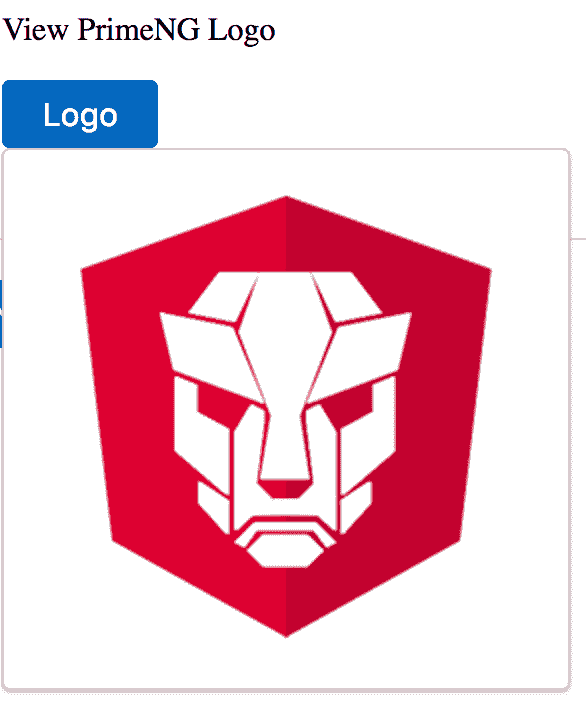
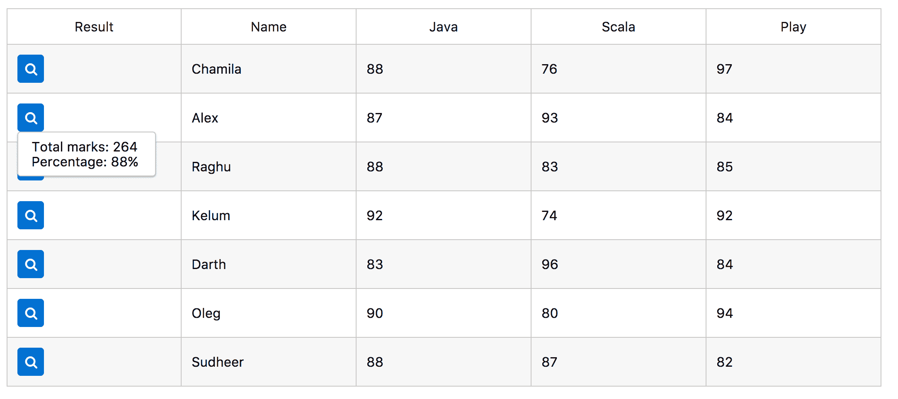

# 惊人的覆盖和消息


惊人的覆盖图和消息演示了在模式或非模式覆盖图中显示的内容的各种变体，例如对话框、Lightbox 和覆盖面板。当内容显示在上述覆盖图中时，用户不会离开页面流。覆盖组件覆盖页面上的其他组件。PrimeNG 还提供通知组件来显示任何类型的消息或咨询信息。还将描述这些消息组件。

在本章中，我们将介绍以下主题：

*   以弹出模式显示内容
*   具有重叠面板的多用途场景
*   在 Lightbox 中显示内容
*   用消息和咆哮通知用户
*   表单组件的工具提示


# 以弹出模式显示内容


网站的附加信息可以用弹出式格式表示。这将通过最佳视口改善用户体验。存在两种类型的弹出格式：**对话框**和**确认对话框**。


# 对话


对话框是一个容器组件，用于在覆盖窗口中显示内容。要保存网页的视口，对话框以弹出格式显示附加信息非常有用。对话框的可见性通过`visible`属性控制。

默认情况下，对话框以`visibility`作为`false`隐藏，启用`visible`属性显示对话框。由于对话框的双向绑定特性，`visible`属性在使用关闭图标关闭对话框后自动变为`false`。`closeOnEscape`属性用于使用*Esc*键关闭对话框。

带有源按钮的对话框组件的基本示例如下所示：

```ts
<p-dialog header="PrimeNG" [(visible)]="basic"> 
  PrimeNG content goes here.... </dialog>

```

在用户操作上启用了[T0]属性。以下屏幕截图显示了基本对话框示例的快照结果：


对话框组件支持两个名为`onShow`和`onHide`的事件回调，当显示或隐藏对话框时将调用这两个事件回调。


# 可用性特征


对话框组件的用户体验将通过使用`draggable`、`resizable`、`closable`和`responsive`属性的可拖动、可调整大小、可关闭和响应功能得到改善。除了这些交互功能，`modal`属性防止用户在透明背景的主页上进行操作，而`dismissableMask`则在用户单击透明背景时隐藏对话框。

这些属性的默认值如下所示：

*   `draggable = true`
*   `resizable = true`
*   `closable = true`
*   `responsive = false`
*   `modal = false`
*   `dismissableMask = false`


# 自定义页眉和页脚


对话框的表头是通过`header`属性定义的，可以通过`showHeader`属性控制。对话框组件的页眉和页脚部分可以使用`p-header`和`p-footer`标记以更灵活的方式定义。为了使用它们，需要导入页眉和页脚组件并在“指令”部分中声明。

具有自定义页眉和页脚的对话框组件的自定义示例将编写如下：

```ts
<p-dialog[(visible)]="custom" modal="true">
  <p-header>
    PrimeNG License declaration
  </p-header>
  All widgets are open source and free to use under MIT License.
  If agree with the license please click 'Yes' otherwise click 'No'.
  <p-footer>
    <div class="ui-dialog-buttonpane ui-widget-content 
      ui-helper-clearfix">
      <button type="button" pButton icon="fa-close"
        (click)="onComplete()" label="No"></button>
      <button type="button" pButton icon="fa-check"
        (click)="onComplete()" label="Yes"></button>
    </div>
  </p-footer>
</p-dialog>

```

以下屏幕截图显示了自定义对话框示例的快照结果：


前面的快照显示了如何根据需要或要求自定义页眉、消息和页脚图标。默认情况下，对话框组件在视口中居中对齐，但这可以使用`positionLeft`和`positionTop`属性进行自定义。


# 确认对话框


ConfirmDialog 是一个组件，用于同时显示具有多个操作的确认窗口。在这种情况下，它将由使用 observables 的确认服务支持。需要导入对多个操作使用确认方法的服务。

带有源按钮（或对话框生成器按钮）的 ConfirmDialog 组件的基本示例如下所示：

```ts
<p-confirmDialog></p-confirmDialog>
    <button type="button" (click)="confirmAccept()" pButton
      icon="fa-check" label="Confirm"></button>
    <button type="button" (click)="confirmDelete()" pButton
      icon="fa-trash" label="Delete"></button>

```

在前面的示例中，confirm 方法将确认用于自定义对话框 UI 的实例以及 accept 和 reject 按钮。例如，`accept`函数调用确认服务的确认方法，该方法决定需要执行哪些操作：

```ts
confirmAccept() {
  this.confirmationService.confirm({
    message: 'Do you want to subscribe for Angular news feeds?',
    header: 'Subscribe',
    icon: 'fa fa-question-circle',
    accept: () => {
      this.msgs = [];
      this.msgs.push({severity:'info', summary:'Confirmed',
                     detail: 'You have accepted'});
    }
  });
}

```

单击按钮组件时出现对话框。以下屏幕截图显示了基本确认对话框示例的快照结果：


页脚接受和拒绝按钮决定是否订阅角新闻馈送系统。


# 定制


有两种方法可以为确认对话框提供标题、消息和图标。一种是声明式方法，其中通过属性（`header`、`message`和`icon`提供所有功能，而另一种方法是编程式方法，其中的值可以通过已确认的实例属性进行动态设置。甚至页脚部分按钮也可以使用自己的 UI（`acceptLabel`、`acceptIcon`、`acceptVisibility`、`rejectLabel`、`rejectIcon`、`rejectVisibility`以及本地`ng-template`变量的接受和拒绝方法进行定制。

带有页眉和页脚的确认对话框组件的自定义示例如下所示：

```ts
<p-confirmDialog header="Confirmation" message="Do you like to use  
  DataTable component" icon="fa fa-question-circle" width="400" 
  height="200" #confirmation>
  <p-footer>
    <button type="button" pButton icon="fa-close" label="No" 
    (click)="confirmation.reject()"></button>
    <button type="button" pButton icon="fa-check" label="Yes" 
    (click)="confirmation.accept()"></button>
  </p-footer>
</p-confirmDialog>

```

以下屏幕截图显示了自定义确认对话框示例的快照结果：


在前面的快照中，所有标题、消息和图标都是以声明方式自定义的。确认对话框提供默认的`closable`、`responsive`和`closeOnEscape`属性，与对话框组件类似。

The complete demo application with instructions is available on GitHub:

*   [https://github.com/ova2/angular-development-with-primeng/tree/master/chapter6/dialog](https://github.com/ova2/angular-development-with-primeng/tree/master/chapter6/dialog)

*   [https://github.com/ova2/angular-development-with-primeng/tree/master/chapter6/confirm-dialog.](https://github.com/ova2/angular-development-with-primeng/tree/master/chapter6/confirm-dialog)


# 具有重叠面板的多用途场景


OverlyPanel 是一个容器组件，它在页面中其他组件的顶部显示附加信息。该元素将使用本地`ng-template`变量的`show`或`toggle`方法显示，并可使用`hide`或`toggle`方法隐藏。请记住，`show`方法将允许第二个参数作为目标元素，其中必须显示覆盖（而不是源）。带有源按钮生成器的覆盖组件的基本示例将编写如下：

```ts
<p-overlayPanel #overlaybasic>
  
</p-overlayPanel>
<button type="button" pButton label="Logo" (click)="overlaybasic.toggle($event)"></button>

```

在前面的示例中，单击按钮组件将显示覆盖。以下屏幕截图显示了基本覆盖示例的快照结果：



在前面的快照中，覆盖在单击徽标按钮时将 Priming 徽标显示为图像。默认情况下，OverlyPanel 附加到页面主体，但是可以使用`appendTo`属性更改目标。


# 与其他组件的集成


OverlyPanel 组件也可以与其他打底组件集成。例如，下面的快照显示了如何使用`ng-template`将覆盖组件与 DataTable 组件集成。在这种情况下，需要将按钮放置在 DataTable`ng-template`内，并通过`toggle`事件触发叠加：



在前面的快照中，覆盖面板用于通过单击每行中的结果按钮以弹出格式显示聚合信息，如标记和百分比。


# 可关闭属性


默认情况下，覆盖面板外部的交互会立即关闭对话框。借助于`dismissable`属性，可以防止这种行为。同时，在右上角有一个使用`showCloseIcon`属性显示 close 的选项。

对话框组件支持四个名为`onBeforeShow`、`onAfterShow`、`onBeforeHide`和`onAfterHide`的事件回调，当显示或隐藏对话框时将调用这些事件回调。

The complete demo application with instructions is available on GitHub at
[https://github.com/ova2/angular-development-with-primeng/tree/master/chapter6/overlaypanel.](https://github.com/ova2/angular-development-with-primeng/tree/master/chapter6/overlaypanel)


# 在 Lightbox 中显示内容


LightBox 组件用于以模式覆盖模式显示图像、视频、内联 HTML 内容以及 iFrame 的集合。存在两种类型的灯箱模式：一种是默认的`image`类型，另一种是`content`类型。在图像模式下，将显示一组图像，其中每个条目表示一个图像对象，该对象表示图像、缩略图和标题的来源。具有角度会议集合（或阵列）的灯箱的基本示例如下：

```ts
<p-lightbox [images]="images" name="image"></p-lightbox>

```

组件将按以下屏幕截图所示进行渲染：


在前面的快照中，所有图像都显示为图像库，并通过下一个和上一个图标导航。


# 自定义内容模式


内容模式是通过将`type`属性设置为`content`来启用的，该属性提供了一个锚（或链接）来打开灯箱并在其中显示内容。具有角度会议集合的灯箱的自定义内容示例如下所示：

```ts
<p-lightbox type="content" name="content">
  <a class="group" href="#">
    Watch PrimeNG Video
  </a>
  <iframe width="500" height="300" 
    src="https://www.youtube.com/watch?v=Jf9nQ36e0Fw&t=754s"
    frameborder="0" allowfullscreen></iframe>
</p-lightbox>

```

组件将在覆盖面板内渲染为 iframe 视频，如以下屏幕截图所示：


如前一个快照所示，将显示视频列表，可以在弹出模式下观看视频，以获得更好的体验。


# 过渡效应


LightBox 组件通过图像之间的过渡效果更加强大。这可以通过`easing`属性实现。这里，默认值为`ease-out`（即使用`easing`属性定制效果）。还有许多其他效果可用，整个 CSS3 效果列表都受支持。此外，默认情况下，效果持续时间为`500ms`。这也可以通过`effectDuration`属性进行定制。

具有角度会议集合的灯箱的过渡效果示例如下所示：

```ts
<p-lightbox [images]="images" name="effects" easing="ease-out"  
  effectDuration="1000ms">
</p-lightbox>

```

The complete demo application with instructions is available on GitHub at
[https://github.com/ova2/angular-development-with-primeng/tree/master/chapter6/lightbox.](https://github.com/ova2/angular-development-with-primeng/tree/master/chapter6/lightbox)


# 用消息和咆哮通知用户


消息组件用于以内联格式显示消息以通知用户。这些消息将作为特定操作的结果进行通知。Priming API 中的每条消息都是使用`Message`接口定义的，该接口定义了`severity`、`summary`和`detail`属性。

通知用户的消息的基本示例如下：

```ts
<p-messages ([value])="messages" name="basic"></p-messages>

```

在前面的示例中，使用`value`属性显示消息，该属性定义了`Message`接口的数组。组件将按以下屏幕截图所示进行渲染：


消息的严重性用`class`属性表示。消息严重性的可能值如下所示：

| **严重程度** | **类名** |
| `success` | `.ui-button-success` |
| `info` | `.ui-button-info` |
| `warn` | `.ui-button-warn` |
| `error` | `.ui-button-error` |

默认情况下，在右上角的十字图标的帮助下，这些消息是可关闭的。此行为可以通过`closable`属性进行更改，即`[closable]="false"`禁用消息的可关闭性。


# 咆哮-另一种通知信息的方式


与消息组件类似，Growl 用于显示特定操作产生的消息，但它以覆盖模式而不是内联模式的形式显示。每一条消息都通过与`severity`、`summary`和`details`的`Message`接口表示。咆哮通知用户的一个基本示例如下：

```ts
<p-growl ([value])="messages" name="basic"></p-growl>

```

`value`属性定义了支持组件模型中`Message`接口的数组。组件将按以下屏幕截图所示进行渲染：


与 Messages 组件类似，Growl 中也可以定义相同的严重性类型。Priming 4.1 版本引入了`onClick`事件回调，点击消息时将调用该回调。


# 粘性行为


默认情况下，咆哮消息在一段时间后被删除。咆哮消息的默认寿命为`3000ms`。这可以使用`life`属性（即`life="5000"`进行定制）。要使消息具有粘性，无论所提到的生命周期如何，都应该启用粘性行为，即[T3]。

PrimeNG Version 4.0.1 supports the two-way binding feature for Growl messages. Due to this feature, whenever the message is removed manually from UI, backend instance, or message, array will be updated immediately. The complete demo application with instructions is available on GitHub at

*   [https://github.com/ova2/angular-development-with-primeng/tree/master/chapter6/messages](https://github.com/ova2/angular-development-with-primeng/tree/master/chapter6/messages)

*   [https://github.com/ova2/angular-development-with-primeng/tree/master/chapter6/growl.](https://github.com/ova2/angular-development-with-primeng/tree/master/chapter6/growl)


# 表单组件的工具提示


工具提示提供了零部件的建议信息。这将在使用前简要了解目标组件。工具提示通过`pTooltip`指令应用，其值用于定义要显示的文本。除此之外，HTML 标记也在`escape`属性的帮助下显示，而不是常规文本信息。工具提示的一个基本示例是为输入提供咨询信息，如下所示：

```ts
<input type="text" pInputText pTooltip="Enter your favourite component   
  name" >

```

工具提示显示在输入的右侧，如以下屏幕截图所示：


默认情况下，工具提示位置显示在目标零部件的右侧。使用`tooltipPosition`属性和`top`、`right`和`bottom`等其他值可以更改此行为，例如，`tooltipPosition`和`top`值将导致以下屏幕截图：


默认情况下，工具提示显示在目标元素的悬停位置（即，调用工具提示信息的默认事件为悬停）。这可以使用`tooltipEvent`属性进行自定义，该属性提供用于显示的焦点事件和用于隐藏工具提示的模糊事件。请记住，也可以使用[T1]属性禁用工具提示。

输入的工具提示事件示例如下：

```ts
<input type="text" pInputText pTooltip="Enter your favourite component 
  name" tooltipEvent="focus" placeholder="Focus inputbox"/>

```

默认情况下，工具提示指定给文档正文。如果工具提示的目标放在滚动容器中（例如，溢出`div`元素），则将工具提示附加到具有相对位置的元素。这可以通过使用`appendTo`属性（即`appendTo="container"`来实现）。

Priming 版本 4.1 提供了`showDelay`和`hideDelay`属性，以便在显示和隐藏工具提示时增加延迟（以毫秒为单位接受数值）。延迟特性的应用如下：

```ts
<input type="text" pInputText pTooltip="Enter your favourite component 
  name" tooltipEvent="focus" placeholder="Focus inputbox" 
  showDelay="1000" hideDelay="400"/>

```

The complete demo application with instructions is available on GitHub at
[https://github.com/ova2/angular-development-with-primeng/tree/master/chapter6/tooltips.](https://github.com/ova2/angular-development-with-primeng/tree/master/chapter6/tooltips)


# 总结


通过阅读本节，您将了解如何在覆盖窗口中显示图像、视频、iframe 和 HTML 内容，而不必离开当前页面流。最初，您将看到如何使用 Dialog、ConfirmDialog、LightBox 和 Overlay 组件。之后，您学习了如何分别通过消息和咆哮组件显示内联消息或覆盖中的消息。

最后一个配方介绍了用于显示建议信息的工具提示组件。所有这些组件都以一步一步的方式解释了所有可能的功能。在下一章中，您将看到如何使用菜单模型 API、导航和菜单变体，如菜单、超大菜单、菜单栏、幻灯片菜单、面板菜单、分层菜单等，以及各种功能。