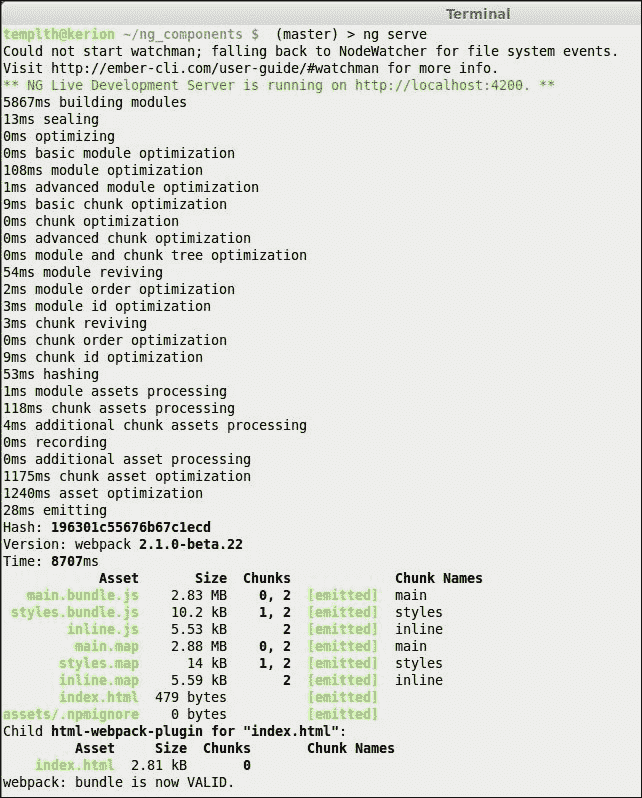
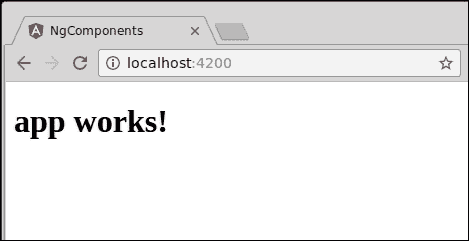

# 第二章，使用 Angular cli 建立 Angular 2 开发环境

Angular 2 利用了现代 web 技术和工具，这意味着开发环境变得更加复杂，需要一些工具和他们的理解。

幸运的是，我们不需要花时间安装和配置所有必需的依赖项，也不需要将所有内容连接在一起。我们可以使用与 angular 2 并行开发的 angular cli（命令行工具）。

在本章中，我们将介绍如何使用 angular cli 设置开发环境：如何安装它以及如何使用它在几分钟内启动 angular 2 项目。

# 节点与 npm

在开始使用 angular cli 之前，我们需要在机器上安装 Node.js。Node 是一个基于 Chrome 的 v8javascript 引擎构建的 JavaScript 运行时。它使JavaScript 能够在没有浏览器的情况下运行，这导致了我们现在使用的许多开发工具的开发，如任务运行器、编译器、linter 和模块加载器。现代 web 前端开发环境依赖于这些工具。

## 安装节点

节点是跨平台的，所以可以在任何流行的操作系统上运行。安装`node`最简单的方法是下载操作系统的官方安装程序。要执行此操作，请转至[https://nodejs.org/en/](https://nodejs.org/en/) 并查找 Windows、Macintosh 或 Linux 的官方安装程序。目前，节点发布有两个主要路径—一个**长时间支持**（**LTS**）和一个稳定版本。对于本书，我们将使用 Node 的 LTS 版本。确保下载 Node 4.24.53 LTS 版本安装程序。

下载并成功运行安装程序后，打开终端（或 Windows 中的命令行）并键入`node -v`。此命令应打印您刚刚安装的`node`的当前版本；在我们的例子中，它应该是`4.24.53`或更大。

我们使用`node`作为开发环境工具所依赖的 JavaScript 引擎。这里提到的版本没有任何特殊意义，因为在本书中我们不会编写任何 Node.js 代码，但我们使用的其他工具会。

笔记 angular cli 工具可用于任何大于 4.x 的 node 版本，因此，如果您愿意，可以使用其他安装。

## 引入新产品管理

Npm 是节点的包管理器。它与节点安装程序捆绑在一起。如果您在上一步中成功安装了`node`，npm 应该可以使用了。为确保安装正确，请打开终端（Windows 上的命令行）并键入`npm -v`。这个版本应该是 T2。它应该是 3 或更大。

我们使用`npm`来安装开发和运行时所需的依赖项。Npm在`npm`注册表中搜索这些软件包，目前包含超过 19000 个软件包（并且还在增长）。您可以访问[https://www.npmjs.com/](https://www.npmjs.com/) 和搜索软件包，或使用`npm cli`搜索、安装和管理软件包。Npm 还帮助我们管理项目生命周期，我们将在下面看到。

# 安装角头螺钉

我们将使用在工作站上安装 angular cli。为此，请执行以下简单步骤：

1.  启动`Terminal`（或 Windows 中的命令行）。
2.  键入：`npm install -g angular-cli@latest`并按*进入*（在 Windows 中，您可能需要以管理员身份运行此命令）。

就这样！`angular-cli`现在已安装在您的机器上，由于我们在`npm install`命令中使用了`-g`标志，`angular-cli`暴露了一个可从任何地方获得的`ng`别名。`(-g`代表`global`，表示模块安装在系统级目录中）。

# 生成角度 2 项目

我们将与`angular-cli`一起使用的第一个命令是`new`。此命令将为我们的项目创建文件夹结构，并安装所有必需的依赖项。除了基本的 Angular 2 文件和模块外，`angular-cli`还将安装用于测试、筛选和记录代码的模块。这本书都是关于组件的，所以我们不会碰这些东西的大部分。您可以在官方的 angular cli 页面[上阅读有关可用命令的更多信息 https://cli.angular.io/](https://cli.angular.io/) 。

要生成新项目，请执行以下步骤：

1.  启动`Terminal`（或 Windows 中的命令行）。
2.  键入`ng new ng_components`并按*进入*。

`angular-cli`软件将在当前目录下生成一个新项目：


请注意，最后一行打印：`Installing packages for tooling via npm`。`angular-cli`工具将在后台使用标准`npm`命令下载所有需要的模块。

就这样！您刚刚生成了一个完整的 Angular 2 项目，所需的一切都已经配置好并连接好了。

要在开发服务器上提供it，请执行以下步骤：

1.  使用`cd`导航到您刚刚通过键入`cd ng_components.`创建的目录中
2.  键入`ng serve`并坐下。

等待`angular-cli`打印以下内容：



### 注

如果您看到与 Brocolli 相关的内容，这是因为[T0]的早期版本未正确卸载。在这种情况下，请使用以下命令：

```ts
$ npm uninstall -g angular-cli
$ npm cache clean

```

然后，您可以使用以下命令按照本章所述重新安装工具：

```ts
$ npm install -g angular-cli@latest

```

在幕后，`angular-cli`构建项目，启动服务器并为应用程序提供服务。我们只需要启动浏览器并将其指向`http://localhost:4200`：



幕后有很多事情。angular cli 工具使用各种其他工具，如`webpack`来实现其魔力。这些工具超出了本书的范围，但您可以在 GitHub 上的 angular cli 文档[中阅读相关内容 https://github.com/angular/angular-cli](https://github.com/angular/angular-cli) 。

# 选择 IDE

虽然Angular 2 应用程序可以使用纯文本编辑器开发，但强烈建议使用 IDE（集成开发环境）。就我个人而言，我使用的是`webstorm`（[https://www.jetbrains.com/webstorm/](https://www.jetbrains.com/webstorm/) ），为角形开箱即用提供全面支持。如果您正在寻找一个免费的、开源的替代方案，我们有`VSCode`（[https://code.visualstudio.com/](https://code.visualstudio.com/) ），也自然支持 Angular 2。它们都提供角度代码检查和高亮显示，以及重构和自动完成功能。WebStorm 提供了与几乎所有 JavaScript 工具的完整集成，许多人认为它是最好的 JavaScript IDE。

# 总结

在本章中，我们学习了如何使用 angular cli 在几分钟内创建、配置和服务新的 angular 2 项目。作为开发人员，此工具帮助我们关注应用程序代码，而不是配置。

在下一章中，我们将熟悉 TypeScript 语言，重点介绍构建 Angular 2 组件（以及项目的所有其他部分）的重要功能。