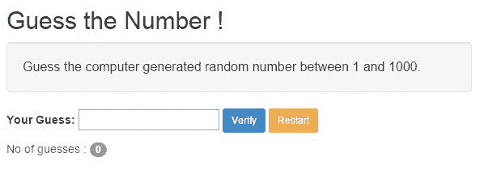
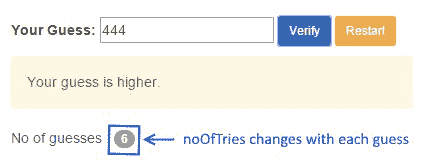
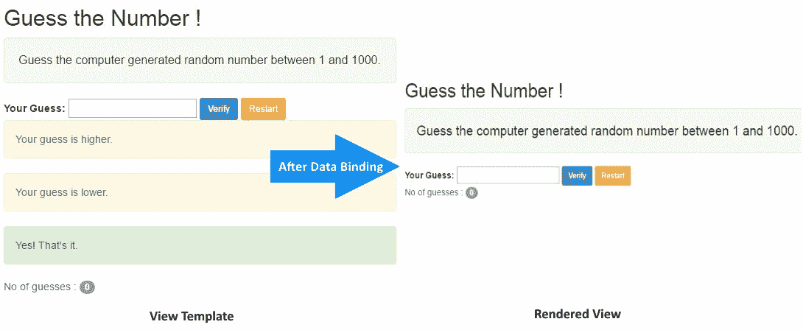
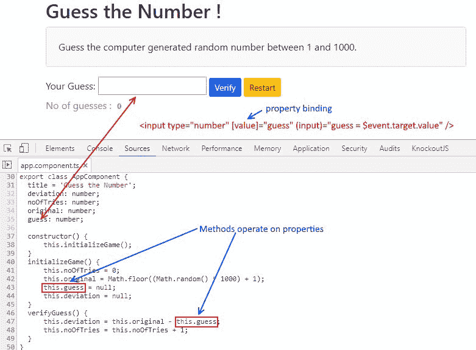
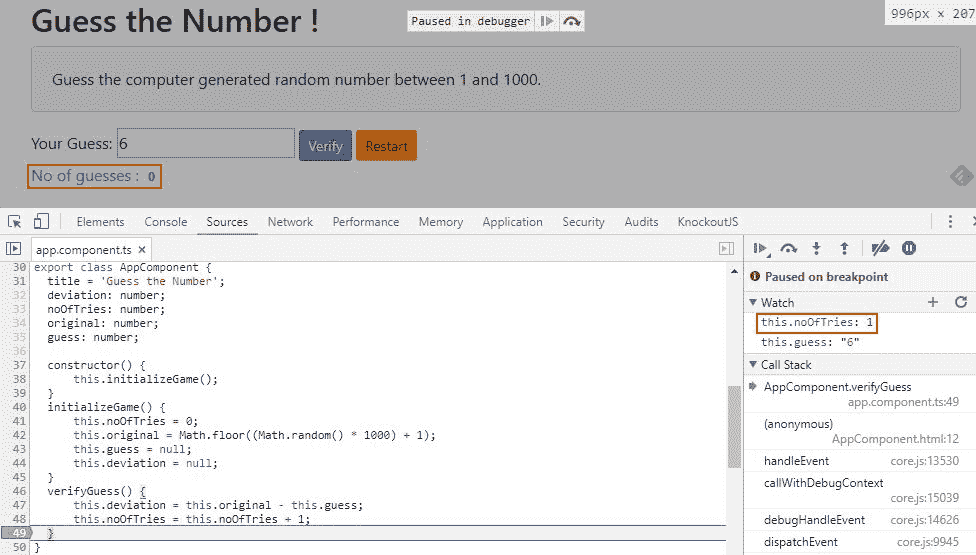
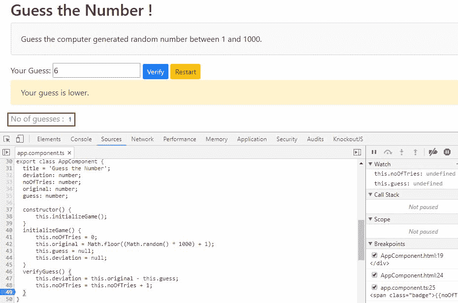

# 一、开始

用 JavaScript 开发应用始终是一项挑战。由于其可塑性和缺乏类型检查，用 JavaScript 构建一个合适大小的应用是很困难的。此外，我们将 JavaScript 用于所有类型的流程，例如**用户界面**（**用户界面**）操作、客户机-服务器交互和业务处理/验证。结果，我们最终得到了难以维护和测试的意大利式代码。

jQuery 之类的库在处理各种浏览器怪癖方面做得很好，并提供了能够全面减少代码行的结构。然而，这些库缺乏任何结构指导，当代码库`/grows`出现时，这些指导可以帮助我们。

近年来，出现了 JavaScript 框架来管理这种复杂性。其中许多框架，包括 Angular 的早期版本，使用一种称为**模型-视图-控制器**的设计模式将应用的元素分离为更易于管理的部分。这些框架的成功以及它们在开发人员社区中的流行确立了使用这种模式的价值。

然而，自 2009 年 Angular 首次推出以来，Web 开发一直在不断发展，并发生了很大变化。Web 组件、新版 JavaScript（ES2015）和 TypeScript 等技术都已经出现。综合起来，它们为建立一个新的前瞻性框架提供了机会。随着这个新框架的出现，出现了一种新的设计模式——组件模式。

本章致力于理解组件模式，以及在使用 Angular 构建简单应用时如何将其付诸实践。

我们将在本章中介绍的主题如下：

*   **Angular basics**：我们将简要介绍用于构建 Angular 应用的组件模式
*   **构建我们的第一个 Angular 应用**：我们将构建一个小游戏-*猜猜数字！-*Angular
*   **介绍一些 Angular 构造**：我们将回顾 Angular 中使用的一些构造，例如插值、表达式和数据绑定语法
*   **变更检测**：我们将讨论如何在 Angular 应用中管理变更检测
*   **工具和资源**：最后，我们将提供一些在 Angular 开发和调试过程中使用的资源和工具


# Angular基础

让我们从 Angular 如何实现组件模式开始。


# 组件模式

Angular应用使用组件模式。你可能没听说过这种模式，但它无处不在。它不仅用于软件开发，还用于制造业、建筑业和其他领域。简言之，它涉及到将更小、离散的构建块组合成更大的成品。例如，电池是汽车的一个部件。

在软件开发中，组件是可以组合成更大应用的逻辑单元。组件往往具有内部逻辑和属性，这些逻辑和属性对较大的应用是屏蔽或隐藏的。然后，较大的应用通过称为**接口**的特定网关使用这些构建块，这些网关只公开使用组件所需的内容。通过这种方式，只要不改变接口，就可以修改组件的内部逻辑，而不会影响更大的应用。

回到我们的电池示例，汽车通过一系列连接器消耗电池。但是，如果电池耗尽，只要电池具有相同的连接器，就可以用全新的电池更换。这意味着汽车制造商不必担心电池的内部结构，这简化了汽车的制造过程。更重要的是，车主不必在每次电池耗尽时更换汽车。

为了扩大类比，电池制造商可以将其用于一系列不同的车辆，例如 ATV、船只或雪地摩托。因此，组件模式使他们能够实现更大的规模经济。


# 在 web 应用中使用组件模式

随着 web 应用不断变得越来越复杂，需要能够用更小、离散的组件构建它们变得越来越迫切。组件允许应用以某种方式构建，以防止它们成为杂乱无章的代码。相反，基于组件的设计允许我们独立于其他部分对应用的特定部分进行推理，然后我们可以通过商定的连接点将应用缝合成一个完整的整体。

此外，维护成本更低，因为每个组件的内部逻辑可以单独管理，而不会影响应用的其他部分。并且，使用自描述组件将应用组合在一起可以使应用在更高的抽象级别上更易于理解。


# 为什么以前没有在 Angular 中使用组件？

如果这个想法很有意义，为什么早期版本的 Angular 中没有采用组件模式？答案是 Angular 最初发布时存在的技术并不完全支持在 web 应用中实现这种模式。

然而，Angular 的早期版本在实现更智能的 web 应用设计和组织方面迈出了实质性的一步。例如，他们实现了 MVC 模式，将应用分为模型、视图和控制器（您将看到 MVC 模式在我们将在 Angular 中构建的组件中继续使用）。

使用 MVC 模式，模型是数据，视图是网页（或移动应用屏幕，甚至是 Flash 页面），控制器用模型中的数据填充视图。这样，就实现了关注点的分离。遵循此模式并智能使用指令将使您非常接近组件。

因此，Angular 的早期版本允许更合理地设计和构建应用。然而，由于所使用的技术并不是真正孤立的，这种方法受到限制。取而代之的是，它们最终都没有与屏幕上的其他元素真正分离。


# 有什么新功能使 Angular 能够使用组件模式？

相比之下，Angular 的最新版本包含了最近出现的技术，这使得更全面地实现组件模式成为可能。这些技术包括 Web 组件、ES2015（JavaScript 的新版本）和 TypeScript。让我们讨论一下，这些技术中的每一项都为实现这一目标带来了什么。


# Web 组件

Web 组件是一个总括性术语，实际上涵盖了四种新兴的 Web 浏览器标准：

*   自定义元素
*   阴影 DOM
*   模板
*   HTML 导入

有关 Web 组件的更多信息，请访问[https://www.webcomponents.org/introduction](https://www.webcomponents.org/introduction)

现在让我们详细讨论其中的每一项：

*   **自定义元素**允许创建新类型的 DOM 元素，而非标准 HTML 标记，如`<div>`和`<p>`。您将在本书中看到这些自定义元素的使用。例如，我们在本章中构建的应用将有一个名为`<app-root>`的根元素，但是您可以给这个元素任何您喜欢的名称。单个组件也将使用自定义元素。例如，在下面的章节中，我们将构建一个更复杂的应用，将屏幕分解为多个组件。页面的标题将使用自定义元素`<abe-header>`来显示其内容（前缀`abe`是我们的应用所独有的，有助于避免与本机 HTML 元素或其他应用中的自定义元素发生命名冲突）。添加自定义标记的功能在屏幕上提供了一个位置，可以为绑定组件保留该位置。简而言之，这是将一个组件从页面的其余部分分离出来并使其成为真正独立的第一步。
*   **Shadow DOM**在页面上为脚本、CSS 和 HTML 提供了一个隐藏区域。此隐藏区域内的标记和样式不会影响页面的其余部分，同样重要的是，它们不会受到页面其他部分上的标记和样式的影响。我们的组件可以使用此隐藏区域渲染其显示。因此，这是使我们的组件独立的第二步。
*   **模板**是最初不会在网页中呈现的 HTML 片段，但可以在运行时使用 JavaScript 激活。许多 JavaScript 框架已经支持某种形式的模板。Web 组件将此模板化，并在浏览器中为其提供直接支持。模板可用于使组件使用的阴影 DOM 中的 HTML 和 CSS 动态化。所以，这是制作组件的第三步。
*   构成 Web 组件的最终标准是**HTML 导入**。它们提供了一种在单个包中加载 HTML、CSS 和 JavaScript 等资源的方法。Angular 不使用 HTML 导入。相反，它依赖于 JavaScript 模块加载，我们将在本章稍后讨论。


# Angular和腹板组件

当前的 Web 浏览器不完全支持 Web 组件。因此，Angular构件严格来说不是腹板构件。更准确地说，Angular组件实现了 Web 组件背后的设计原则。它们还使构建可以在当今浏览器中运行的组件成为可能。

在撰写本文时，Angular 支持 Chrome、Firefox、Safari 和 Edge 等常青浏览器，以及 IE9 及以上版本。它还支持 Android 和 IOS。有关 Angular 支持的浏览器列表，请访问[https://angular.io/guide/browser-support.](https://angular.io/guide/browser-support)

因此，在本书的其余部分中，我们将着重于构建Angular组件，而不是 Web 组件。尽管有这种区别，但Angular组件与 Web 组件紧密对齐，甚至可以相互操作。随着浏览器开始更全面地支持 Web 组件，Angular组件和 Web 组件之间的差异将开始消失。因此，如果您想开始采用未来的 Web 组件标准，Angular 今天为您提供了这样做的机会。


# 英语中的语言支持

您可以使用 ES5（当前所有浏览器都支持的 JavaScript 版本）开发组件，但 Angular 通过添加对最新语言（如 ES2015 和 TypeScript）中的关键功能的支持，增强了开发组件的能力。


# ES2015

ES2015 是 JavaScript 的新版本；2015 年 6 月获得批准。它为语言添加了许多改进，我们将在本书中看到这些改进，但目前我们最感兴趣的两个方面是：

*   班级
*   模块加载

**类**以前在 JavaScript 中不存在。既然它们确实存在，使用它们的关键优势在于它们提供了一种简单、清晰的语法，我们可以使用它为组件中的代码创建方便的容器。当您开始使用本书中的应用时，您会发现。类还为我们的组件提供了一个方便的速记名称，使得通过依赖项注入等方式将它们彼此缝合在一起变得更加容易。

要明确的是，JavaScript 类并没有引入全新的东西。**Mozilla 开发者网络**（**MDN**将其描述为 JavaScript 现有基于原型的继承之上的主要语法糖分。欲了解更多信息，请访问[https://developer.mozilla.org/en-US/docs/Web/JavaScript/Reference/Classes](https://developer.mozilla.org/en-US/docs/Web/JavaScript/Reference/Classes) 。

我们将通过本书中的示例来探索类。如果您没有使用过面向对象的语言，您可能不熟悉类，因此我们将在本章的示例中介绍它们。

ES2015 还引入了一种新的**模块加载**方法。模块提供了一种封装 JavaScript 文件的方法。当它们被封装时，它们不会污染全局名称空间，并且可以以受控的方式与其他模块交互。

一旦我们定义了模块，我们需要一种方法将它们加载到应用中执行。模块加载允许我们从组成 Angular 组件的模块和我们创建或使用的其他组件中选择应用所需的内容。

目前，存在一系列方法和库来支持 JavaScript 中的模块加载。ES2015 添加了一种新的、一致的语法，用于作为语言的一部分加载模块。语法很简单，包括在模块前面加上`export`关键字（或使用默认导出），然后在应用的其他地方使用`import`。

ES 2015 模块加载使我们能够将组件组合成有用的捆绑包或功能，这些捆绑包或功能可以在我们的应用中导入或导出。事实上，模块是 Angular 本身的核心。我们将看到模块在 Angular 本身和我们在本书中构建的应用中被广泛使用。

重要的是要理解，虽然 Angular 使用的语法与 ES2015 模块加载语法相似，但 Angular 模块（我们将在本章稍后讨论）与 JavaScript 模块不同。有关这些差异的更多详细信息，请参见[中的Angular文档 https://angular.io/guide/architecture#ngmodules-vs javascript 模块](https://angular.io/guide/architecture#ngmodules-vs-javascript-modules)。

由于当今的浏览器并不完全支持 ES2015，我们需要将 ES2015 转换为 ES5，以便在应用中使用类和模块加载等功能。我们通过一个称为**蒸腾**的过程来实现这一点。

Transpilation 与编译类似，不同之处在于它没有像编译那样将代码转换为机器语言，而是将一种类型的源代码转换为另一种类型的源代码。在这种情况下，它将 ES2015 转换为 ES5。有几种称为**transpilers**的工具使我们能够做到这一点。常见的运输工具包括 Traceur 和 Babel。TypeScript（我们将在下面讨论）也是一个 transpiler，我们将在本书的示例中使用它。

一旦 ES2015 传输到 ES5，我们就可以使用模块加载器，如**SystemJS**来加载我们的模块。**SystemJS**遵循 ES2015 的模块加载语法，使我们能够在当今的浏览器中进行模块加载。或者，我们可以使用模块绑定器，如**webpack**来加载和组合我们的模块。对于本书中的项目，我们将使用**webpack**加载、捆绑和部署应用中的模块。

自 ES2015 发布以来，ECMAScript（JavaScript 的官方名称）新版本的发布时间表是每年一次的，因此我们现在有 ES2016 和 ES2017，很快就会有 ES2018。由于我们在本书中强调的功能首先在 ES2015 中介绍，因此我们将参考 ES2015，而不是任何较新版本。然而，较新的版本完全兼容我们在本书这里和其他地方强调的语言特性。


# 打字稿

TypeScript 是由 Microsoft 作为 JavaScript 的超集创建的，这意味着它包含 ES2015 的功能（例如类和模块加载），并添加了以下内容：

*   类型
*   装饰师

**类型**允许我们在类中标记变量、属性和参数，以指示它们是数字、字符串、布尔值或各种结构，如数组和对象。这使我们能够在设计时执行类型检查，以确保在应用中使用正确的类型。

**装饰符**是简单的注释，我们可以使用`@`符号和函数将其添加到类中。它们为类的使用提供了说明（称为元数据）。在 Angular 的情况下，decorator 允许我们将类标识为 Angular 组件。decorator 还允许我们指定一个自定义元素，将组件绑定到该元素，并标识一个向组件添加 HTML 视图的模板。在阅读本书时，我们将介绍更多关于装饰器的使用。

装饰器不是 ES2015 的一部分，而是将来将它们包含在 JavaScript 语言中的一部分。作为微软和谷歌合作的一部分，它们被添加到了 TypeScript 中。如前所述，TypeScript 编译成 ES5，因此我们可以在不完全支持 ES2015 或建议的装饰器标准的浏览器中使用类型和装饰器。

如前所述，无需使用 ES2015 或带有 Angular 的 TypeScript。然而，我们认为，当我们通过本书中的示例工作时，您将看到使用它们的优势。


# 把它们放在一起

通过遵循 Web 组件标准并添加对 ES2015 和 TypeScript 的支持，Angular 使我们能够创建实现组件设计模式的 Web 应用。这些组件有助于实现通过自描述和自包含的构建块集合构建大规模应用的标准背后的愿景。

我们希望您能在本书中的示例中看到 Angular 使组件能够以一种直观和声明的方式构造，从而使开发人员更容易实现它们。当我们继续阅读本书中的示例时，我们将重点介绍这些技术的使用位置。


# 角模

组件是Angular应用的基本构建块。但是我们如何将这些构建块组织成完整的应用呢？Angular模块提供了这个问题的答案。它们使我们能够将组件组合成可重用的功能组，这些功能组可以在整个应用中导出和导入。例如，在一个更复杂的应用中，我们希望有用于身份验证、公共实用程序和外部服务调用的模块。同时，模块使我们能够以一种允许我们按需加载的方式对应用中的功能进行分组。这就是所谓的惰性加载，我们将在*构建私人教练*中介绍这个主题。

每个Angular应用将有一个或多个包含其组件的模块。Angular 引入了`NgModule`作为一种方便地指定组成模块的组件的方法。每个Angular应用必须至少有一个模块根模块。

Angular 本身构建为我们导入到应用中的模块。因此，在构建 Angular 应用时，您将看到模块的使用。


# 构建Angular应用的基本步骤

总而言之：在基本层面上，您将看到要在 Angular 中开发应用，您将执行以下操作：

1.  创建组件
2.  将它们捆绑到模块中
3.  引导应用

理解 Angular 和组件设计模式的最佳方法是观察它的实际情况。因此，我们将在 Angular 中构建我们的第一个 Hello World 应用。此应用将帮助您熟悉 Angular 框架，并查看正在运行的组件设计模式。

让我们开始做吧。


# 习惯的 Hello Angular 应用–猜猜数字！

作为第一个练习，我们希望保持简单，但仍然展示框架的功能。因此，我们将构建一个非常简单的游戏，名为*猜数字！*。游戏的目的是尽可能少的尝试，猜测计算机生成的随机数字。

这就是游戏的样子：



现在让我们构建*猜猜数字！*。


# 猜猜数字！

构建用户界面时的标准做法是自顶向下构建。从设计 UI 开始，然后根据需要插入数据和行为。使用这种方法，应用的 UI、数据和行为方面都是紧密耦合的，这是一种不太理想的情况！

使用基于组件的设计，我们的工作方式不同。我们首先查看 UI 和预期行为，然后将所有这些封装到一个构建块中，我们称之为**组件**。然后，该组件将托管在我们的页面上。在组件中，我们将 UI 分离为视图，将行为分离为类，并使用支持该行为所需的适当属性和方法。如果你不熟悉课程，别担心。我们将在浏览示例时详细讨论它们是什么。

好的，让我们确定应用需要的 UI 和行为。


# 设计我们的第一个组件

为了确定我们的组件需要什么，我们将首先详细说明我们希望应用支持的功能：

*   生成随机数（`original`）
*   为用户提供猜测值的输入（`guess`
*   跟踪已猜测的数量（`noOfTries`
*   根据用户的输入提示用户改进猜测（`deviation`
*   如果用户正确猜到数字，则给出成功消息（`deviation`

现在我们有了我们的特性，我们可以确定需要向用户显示什么以及需要跟踪什么数据。对于前面的功能集，括号中的元素表示支持这些功能的属性，需要包含在我们的组件中。

设计组件是一个非常关键的过程。如果操作正确，我们就可以以一种易于理解和维护的方式对应用进行逻辑组织。

在构建任何应用时，我们敦促您首先考虑您想要提供的功能，然后考虑支持该功能的数据和行为。最后，考虑如何为它构建一个用户界面。无论您使用此应用库还是使用此应用库都是一种良好的做法。


# 开发我们的第一个组件

现在我们有了第一个组件的设计，我们将开始使用**Angular 命令行界面**（**Angular CLI**来开发它。Angular CLI 使我们能够开始构建 Angular 应用，并通过一系列控制台命令进行部署。我们将在以后的章节中更详细地介绍**角 CLI**。现在，我们将安装它并使用它生成一个基本应用，作为我们第一个组件的起点。

要使用**Angular CLI**必须首先安装**Node.js**和**npm**（**Node**的软件包管理器）。**节点**跨平台可用，可从[下载 http://nodejs.org](http://nodejs.org) 。安装**节点**同时安装**npm**。本书使用的是**Node.js**版本 8.9.4 和**npm**版本 5.6.0。有关安装**节点**并将**npm**更新至最新版本的更多信息，请访问[https://docs.npmjs.com/getting-started/installing-node](https://docs.npmjs.com/getting-started/installing-node) 。

安装**节点**和**npm**后，打开命令提示符并键入以下内容：

```ts
npm install -g @angular/cli
```

这将安装我们将用于开始构建应用的**Angular CLI**。现在，从本地计算机上的目录输入以下命令：

```ts
ng new guessthenumber --inlineTemplate
cd guessthenumber
ng serve
```

使用第一个命令，**Angular CLI**将在您的本地机器上创建一个新的 Angular 项目（`--inlineTemplate`标志在我们的组件中创建一个模板，这非常适合我们在本章中展示的内容）。使用第二个命令，您将导航到**Angular CLI**为新项目创建的目录。第三个命令启动应用，您可以在`http://localhost:4200/`查看该应用。如果这样做，您应该会在浏览器中看到一个标准的默认Angular页面。


# 安装引导程序

在构建应用的细节之前，还有一个步骤。让我们添加引导库以增强应用的外观。首先，在启动应用的终端中键入*Ctrl*+*C*停止应用，当询问是否要终止批处理作业时，输入*Y*。接下来从`guessthenumber`目录输入以下命令：

```ts
npm install bootstrap --save
```

这将安装最新版本的引导程序（在撰写本文时为 4.0.0 版）。您可能会看到一些关于未满足依赖关系的警告消息。你可以忽略它们。

接下来，配置您的新项目以包括引导**样式表：**

 **1.  在`guessthenumber`目录中找到并打开文件`angular.json`
2.  在该文件中找到`projects`属性，它包含我们新项目中的设置
3.  然后在`architect.build.options`中找到`styles`属性，您将看到它包含一个包含`styles.css`的数组，这是我们新项目的默认样式表
4.  将`bootstrap.min.css`样式表的位置添加到该数组中，如下所示：

```ts
"styles": [
   "node_modules/bootstrap/dist/css/bootstrap.min.css",
   "src/styles.css"
],
```

有关使用**Angular CLI**包括引导的说明，请参见[https://github.com/angular/angular-cli/wiki/stories-include-bootstrap](https://github.com/angular/angular-cli/wiki/stories-include-bootstrap) 。


# 到目前为止我们有什么？

如果您在`guessthenumber`目录中查看**Angular CLI**已创建，您将看到大量文件。乍一看，这可能会让人不知所措，但需要了解的重要一点是，**Angular CLI**仅通过几个命令行语句就为我们生成了所有这些文件。这样一来，开始使用Angular应用就更加顺畅和容易。它消除了流程中繁重的工作，使我们能够以最小的工作量构建和服务我们的应用。在本章中，我们将重点介绍创建应用所需的几个文件。

如果您在 Internet Explorer 中运行应用，则需要查看一个文件-`polyfill.ts`。这将添加在 Internet Explorer 中运行应用所需的各种其他文件。您需要取消注释该文件中的几个部分，以添加这些必要的文件。执行此操作的说明包含在文件本身中。

在打开我们的应用的具体细节之前，让我们先来看一个用来启动和运行我们的应用的关键文件。

下载示例代码

本书中的代码可在 GitHub 的[上找到 https://github.com/chandermani/angular6byexample](https://github.com/chandermani/angular6byexample) 。它是在检查点中组织的，允许您在本书中构建示例项目时一步一步地遵循检查点。本章要下载的分支是 GitHub 的分支：checkpoint1.1。在`guessthenumber`文件夹中查找我们在这里介绍的代码。如果您没有使用 Git，请从以下 GitHub 位置下载 Checkpoint 1.1（ZIP 文件）的快照：[https://github.com/chandermani/angular6byexample/tree/checkpoint1.1](https://github.com/chandermani/angular6byexample/tree/checkpoint1.1) 。第一次设置快照时，请参考`guessthenumber`文件夹中的`readme.md`文件。


# 主机文件-index.html

导航到`guessthenumber`目录中的`src`文件夹并打开`index.html`。您将看到以下内容：

```ts
<!doctype html>
<html lang="en">
<head>
  <meta charset="utf-8">
  <title>Guessthenumber</title>
  <base href="/">

  <meta name="viewport" content="width=device-width, initial-scale=1">
  <link rel="icon" type="image/x-icon" href="favicon.ico">
</head>
<body>
  <app-root></app-root>
</body>
</html>
```

`index.html`是我们应用的主机文件。它将在应用首次运行时由浏览器启动，并将承载应用中的组件。如果您曾接触过 web 开发，那么该文件中的大多数 HTML 代码应该看起来很熟悉。它有标准的`html`、`head`和`body`标记以及两个可选标记，一个是用于视口的元标记，用于配置应用在移动设备中的显示方式，另一个是指向Angular favicon 图像的链接，该图像将显示在加载应用的浏览器的选项卡上。


# 自定义元素

但是，页面上还有一个重要的标签，您可能不太熟悉：

```ts
<app-root></app-root> 
```

此标记是一个**自定义元素**。它指示将要构建的组件注入到何处。

*猜猜数字！*和本书中的所有其他应用都已经过 Angular 6 最终版本的测试。


# 组件文件

现在让我们来构建应用的细节。鉴于前面对组件模式的讨论，您不会惊讶于我们将构建一个组件。在本书中，我们将使用多个组件来构建多个应用（我们将在本书后面的部分中看到更多的组件）。Angular CLI 已经给了我们一个开始，为我们生成了一个组件文件。当然，该文件不包含我们申请的任何细节，因此我们必须对其进行修改。为此，请导航到`app`目录中的`src`文件夹并打开`app.component.ts`。


# 进口声明

在页面顶部，您将看到以下行：

```ts
import { Component } from '@angular/core';
```

这是一个导入语句。它告诉我们将在组件中加载和使用哪些模块。在这种情况下，我们选择一个需要从Angular加载的模块：`Component`。Angular 还有许多其他模块，但我们只加载我们需要的。

您会注意到，我们导入的位置在应用中没有标识为路径或目录。相反，它被标识为`@angular/core`。Angular 已分为以[T1]为前缀的桶形模块。

这些桶结合了几个逻辑上相关的模块。在本例中，我们表示要导入`core`桶模块，这反过来又引入`Component`模块。

The Angular documentation describes a barrel as**:**A way to roll up exports from several ES2015 modules into a single convenient ES2015 module. The barrel itself is an ES2015 module file that re-exports selected exports of other ES2015 modules.

For more information about barrels, see [https://angular.io/guide/glossary#barrel](https://angular.io/guide/glossary#barrel).


# 室内装修设计师

接下来，将以`@Component`开头的代码块替换为以下代码块：

```ts
@Component({
 selector: 'app-root',
 template: `
  <div class="container">
      <h2>Guess the Number !</h2>
        <div class="card bg-light mb-3">
           <div class="card-body">
              <p class="card-text">Guess the computer generated random number between 1 
                                                                          and 1000.</p>
           </div>
        </div>
       <div>
         <label>Your Guess: </label>
         <input type="number" [value]="guess" (input)="guess = $event.target.value" />
         <button (click)="verifyGuess()" class="btn btn-primary btn-sm">Verify</button>
         <button (click)="initializeGame()" class="btn btn-warning btn-
                                                               sm">Restart</button>
       </div>
      <div>
         <p *ngIf="deviation<0" class="alert alert-warning">Your guess is higher.</p>
         <p *ngIf="deviation>0" class="alert alert-warning">Your guess is lower.</p>
         <p *ngIf="deviation===0" class="alert alert-success">Yes! That's it.</p>
      </div>
      <p class="text-info">No of guesses :
        <span class="badge">{{noOfTries}}</span>
      </p>
  </div> 
  `
})
```

这是我们组件的装饰器，它直接放在类定义之上，我们将很快讨论。`@`符号用于识别装饰师。`@Component`装饰器有一个名为 selector 的属性，当您看到它被设置为 HTML 页面中的`<app-root>`标记时，您可能不会感到惊讶。此设置告诉 Angular 将此组件注入 HTML 页面上的标记中。

装饰器还有一个名为`template`的属性，该属性标识组件的 HTML 标记。请注意，使用多行返回模板（ESTICKS）渲染多行。或者，我们可以设置一个指向单独文件的`templateUrl`属性。


# 定义类

现在将以`export class AppComponent`开头的代码块替换为以下代码块：

```ts
export class AppComponent {
  deviation: number;
  noOfTries: number;
  original: number;
  guess: number;

  constructor() {
      this.initializeGame();
  }
  initializeGame() {
      this.noOfTries = 0;
      this.original = Math.floor((Math.random() * 1000) + 1);
      this.guess = null;
      this.deviation = null;
  }
  verifyGuess() {
      this.deviation = this.original - this.guess;
      this.noOfTries = this.noOfTries + 1;
  }
}
```

如果您一直在使用 ES5（当前所有浏览器都支持的 JavaScript 版本）进行开发，您可能不熟悉这里类的使用。因此，我们将花一些时间来了解类的组成（对于那些使用面向对象编程语言（如 C#或 Java）进行开发的人来说，这应该是熟悉的领域）。

类文件包含我们将用于运行组件的代码。在顶部，我们给这个类起了一个名字，它是`AppComponent`。然后，在花括号内，我们有四行代码来声明类的属性。这些变量类似于 ES5 变量，我们将使用它们来保存运行应用所需的值（您会注意到，这是我们在设计组件时确定的四个值）。

这些属性与标准 JavaScript 变量的不同之处在于，每个属性名称后面都跟有`:`和一个数字。这些设置属性的类型。在本例中，我们指出这四个属性中的每一个都将被设置为数字类型，这意味着我们希望所有这些属性的值都是数字。TypeScript 提供了为属性指定类型的功能，而标准 JavaScript 中没有这种功能。

向下移动时，我们将看到三块脚本，它们都有名称，后面是括号，然后是大括号，里面有几行脚本。这些是我们类的方法，它们包含我们的组件将支持的操作。它们非常类似于标准 JavaScript 函数。

这些方法中的第一个是`constructor()`，这是一个特殊的方法，将在首次创建组件实例时运行。在我们的示例中，构造函数在创建类时只做一件事；它调用了我们类中的另一个方法，称为`initializeGame()`。

`initializeGame()`方法使用赋值运算符`=`设置类中四个属性的起始值。我们将这些值设置为`null`或`zero`，但`original`除外，其中我们使用随机数生成器创建要猜测的数字。

该类还有一个名为`verifyGuess()`的方法，它更新`deviation`和`noOfTries`属性。未从组件类内调用此方法；相反，它将从视图中调用，我们将在稍后更仔细地检查视图时看到这一点。您还将注意到，我们的方法通过在属性前面加上[T3]来引用同一类中的属性。


# 模块文件

正如我们前面提到的，每个Angular组件都必须包含在Angular模块中。这意味着我们至少必须在应用的根目录中添加一个Angular模块文件。我们称之为**根模块**。对于像*这样的简单应用，猜猜数字！*，根模块可能是我们需要的唯一模块。然而，随着 Angular 应用大小的增加，将多个 Angular 模块文件按功能分解通常是有意义的。在本书后面几章中，我们将介绍这种情况，以构建更复杂的应用。

让我们继续看一看我们的角模文件。Angular CLI 再次为我们创建了此文件。打开`src`文件夹中`app`目录中的`app.module.ts`，您将看到以下内容：

```ts
import { BrowserModule } from '@angular/platform-browser';
import { NgModule } from '@angular/core';

import { AppComponent } from './app.component';

@NgModule({
  declarations: [
    AppComponent
  ],
  imports: [
    BrowserModule
  ],
  providers: [],
  bootstrap: [AppComponent]
})
export class AppModule { }
```

前两条语句导入`BrowserModule`和`NgModule`。注意，当`NgModule`从`@angular/core`导入时，`BrowserModule`从另一个模块导入：`@angular/platform-browser`。这里重要的是，导入不是来自`@angular/core`，而是来自特定于基于浏览器的应用的单独模块。这提醒我们 Angular 可以支持浏览器以外的设备，比如移动设备，因此需要将`BrowserModule`放入一个单独的模块中。

此文件中的另一个导入是我们的组件`AppComponent`。如果您返回到该组件，您将注意到`export`被添加到类定义的前面，这意味着我们正在自己的应用中使用模块加载。

接下来我们定义一个新组件`AppModule`。类本身除了一些导入和一个 decorator 之外没有其他内容：`@ngModule`。我们可以使用此装饰器在应用中配置模块。第一个属性是声明，通过该属性，我们提供了将在应用中使用的组件数组。在这种情况下，我们只有一个组件：`AppComponent`。

我们接下来添加导入，在本例中包括`BrowserModule`。顾名思义，此模块将提供在浏览器中运行应用所需的功能。下一个属性是`providers`。此属性用于注册提供者（如服务和其他对象），这些提供者将通过依赖项注入在整个应用中使用。我们在这里构建的简单应用中不需要提供程序，因此此属性为空。我们将在[第 3 章](3.html#3FIHQ0-7edc9b1e1ea341adae33006323903887)中详细讨论提供者和依赖注入，*更具Angular——SPA，路由*。

最后，我们设置了[T0]属性。这表示应用启动时将加载的第一个组件。这也是`AppComponent`。

有了这个配置，我们现在就可以引导我们的组件了。


# 自举

`AppComponent`的类定义作为组件的蓝图运行，但它内部的脚本在我们创建组件实例之前不会运行。为了运行我们的应用，我们需要在应用中创建这个实例。这样做的过程需要我们添加引导组件的代码。

在`src`文件夹中，查找名为`main.ts`的文件。打开它，您将看到以下代码：

```ts
import { enableProdMode } from '@angular/core';
import { platformBrowserDynamic } from '@angular/platform-browser-dynamic';

import { AppModule } from './app/app.module';
import { environment } from './environments/environment';

if (environment.production) {
  enableProdMode();
}

platformBrowserDynamic().bootstrapModule(AppModule)
  .catch(err => console.log(err));
```

如您所见，我们从`@angular/core`导入`enableProdMode`，从`@angular/platform-browser-dynamic`导入`platformBrowserDynamic`模块。与在`appModule`文件中导入`BrowseModule`一样，后一个导入专门针对基于浏览器的应用。接下来，我们添加`AppModule`的导入和一个名为`environment`的文件，该文件位于我们应用的`environments`目录中。

在接下来的代码行中，我们检查`environment`文件中的常量`environment`是否将其`production`属性设置为`true`，如果是，则调用`enableProdMode()`，顾名思义，这将启用生产模式。`environment.production`的默认设置为`false`，这对于我们这里的目的来说是很好的，因为我们不是在生产模式下运行应用。

如果打开`environments.ts`，您将看到一些注释，这些注释为在构建过程中覆盖此文件中的设置提供了指导。直到[第 2 章](2.html#1TVKI0-7edc9b1e1ea341adae33006323903887)*构建我们的第一个应用——7 分钟训练*之前，我们不会介绍Angular构建过程；所以我们这里不讨论这些材料。

最后，我们以我们的`AppModule`作为参数调用`platformBrowserDynamic().boostrapModule`方法。然后，`bootstrapModule`方法创建`AppModule`组件的一个新实例，该实例反过来初始化我们的`AppComponent`，我们已将其标记为要引导的组件。它通过调用组件的构造函数方法来实现这一点。


# 我们开始行动了！

好了，应用已经完成，可以测试了！在`guessthenumber`目录中再次键入以下内容：

```ts
    ng serve
```

应用应显示在您的浏览器上。

如果您在运行应用时遇到问题，您可以在 GitHub 上的[上查看可用的工作版本 https://github.com/chandermani/angular6byexample](https://github.com/chandermani/angular6byexample) 。如果您没有使用 Git，请从以下 GitHub 位置下载 Checkpoint 1.1（ZIP 文件）的快照：[https://github.com/chandermani/angular6byexample/tree/checkpoint1.1](https://github.com/chandermani/angular6byexample/tree/checkpoint1.1) 。第一次设置快照时，请参考`guessthenumber`文件夹中的`readme.md`文件

如果我们浏览一下我们的组件文件和模板，就会对我们所取得的成就留下深刻的印象。我们没有编写任何代码来在应用运行时更新 UI。不过，一切都很完美。


# 深入挖掘

为了理解这个应用在Angular上下文中是如何工作的，我们需要深入研究一下我们的组件。虽然组件中的类定义非常简单明了，但我们需要更仔细地查看模板中的 HTML，以了解 Angular 在这里的工作方式。它看起来像是带有一些新符号的标准 HTML，例如`[ ]`、`( )`、`{{`和`}}`。

在Angular世界中，这些符号的含义如下：

*   `{{`和`}}`是插值符号
*   `[ ]`表示属性绑定
*   `( )`表示事件绑定

显然，这些符号附加了一些行为，并且似乎链接了视图 HTML 和组件代码。让我们试着理解这些符号的实际作用。


# 插值

请看`app.component.ts`中模板中的 HTML 片段：

```ts
<p class="text-info">No of guesses :  
  <span class="badge">{{noOfTries}}</span> 
</p> 
```

术语`noOfTries`夹在两个插值符号之间。插值通过将插值标记的内容替换为插值符号内表达式（`noOfTries`的值来工作。在本例中，`noOfTries`是组件属性的名称。因此，零部件特性的值将显示为插值标记内的内容。

使用以下语法声明插值：`{{expression}}`。此表达式看起来类似于 JavaScript 表达式，但总是在组件的上下文中进行计算。请注意，我们没有做任何事情来将属性的值传递给视图。相反，插值标记直接从组件读取属性值，而无需任何其他代码。


# 跟踪尝试次数的更改

插值的另一个有趣方面是，对零部件特性所做的更改会自动与视图同步。运行应用并进行一些猜测；每次猜测后，`noOfTries`值会发生变化，视图内容也会发生变化：



在需要查看模型状态的场景中，插值是一个优秀的调试工具。使用插值，我们不必在代码中设置断点，只需知道组件属性的值。因为插值可以采用表达式，所以我们可以传递组件的方法调用或属性并查看其值。


# 表达

在进一步讨论之前，我们需要花一些时间了解 Angular 中的模板表达式。

Angular 中的模板表达式只不过是一段普通 JavaScript 代码，在与使用它们的模板关联的组件实例的上下文中进行计算。但正如[中的文件所示 https://angular.io/docs/ts/latest/guide/template-syntax.html#template-表达方式](https://angular.io/docs/ts/latest/guide/template-syntax.html#template-expressions)表明，有一些区别：

*   禁止转让
*   禁止使用`new`操作员
*   不支持按位运算符`|`和`&`
*   不支持递增和递减运算符`++`和`--`
*   模板表达式操作符，如`|`和`?.`添加了新的含义

根据我们对基于组件的设计的讨论，您可能不会惊讶地了解到文档还清楚地说明了一些事情；模板表达式不能：

*   引用全局命名空间中的任何内容
*   参考窗口或文档
*   致电`console.log`

相反，这些表达式仅限于表达式上下文，该上下文通常是支持特定模板的组件实例。

然而，这些限制并没有阻止我们用表达式做一些漂亮的事情。正如我们在以下示例中所看到的，这些都是有效的表达式：

```ts
// outputs the value of a component property 
{{property}} 

// adds two values 
{{ 7 + 9 }} 

//outputs the result of boolean comparison. Ternary operator 
{{property1 >=0?'positive': 'negative'}} 

//call a component's testMethod and outputs the return value 
{{testMethod()}} 
```

在研究了表达式之后，我们强烈建议您保持表达式的简单，从而保持 HTML 的可读性。`*ngIf="formHasErrors()"`表达式总是比`*ng-if="name==null || email==null || emailformatInValid(email) || age < 18"`好。因此，当表达式开始变得复杂时，将其移动到组件中的方法中。


# 安全导航操作员

在我们继续之前，还有一个表达我们应该接触：Angular安全导航操作符（`?.`。此运算符提供了一种方便的方法来检查冗长属性路径中的空值，如下所示：

```ts
{{customer?.firstName }} 
```

如果安全导航操作符发现空值（此处为客户），它将停止处理路径，但允许应用继续运行。如果没有它，应用将在到达第一个 null（此处为客户名称）之后的任何位置时崩溃，并且视图将不会显示。在异步加载数据并且视图可能无法立即使用数据的情况下，“安全导航”操作符特别有用。安全导航操作员将防止应用崩溃，然后在数据可用时加载数据。


# 数据绑定

学习插值和表达式很容易。现在，让我们看看示例应用数据绑定使用的另一个框架结构。在接下来的章节中，我们将更详细地介绍数据绑定。现在，我们只简单地讨论一下我们正在构建的示例应用中使用的绑定。


# 属性绑定

如果我们查看`app.component.ts`中的模板，我们将看到几个使用方括号`[ ]`的地方。这些是**属性绑定**。

让我们看看我们创建的第一个绑定：

```ts
<input type="number" [value]="guess" (input)="guess = $event.target.value" />
```

该绑定通过将组件类中的`guess`属性的值链接到视图中输入字段的`value`来工作。绑定是动态的；因此，随着`guess`属性值的变化，输入字段的`value`将同步到相同的值；我们不需要编写任何代码来实现这一点。

在一开始，当我们初始化游戏时，这个属性在组件类的初始化方法中被设置为 null，所以我们在输入字段中看不到任何东西。然而，随着游戏的进行，这个数字将随着猜测值的变化而更新。


# 事件绑定

再次查看`app.component.ts`中的模板，我们发现几个括号`( )`出现的地方。这些是**事件绑定**。

让我们看看我们为第一个事件绑定创建的 HTML 代码行。这应该很熟悉，因为事件绑定与我们第一次查看属性绑定的标记相同：`input`标记：

```ts
<input type="number" [value]="guess" (input)="guess = $event.target.value" />
```

在这种情况下，输入元素的`input`事件绑定到一个表达式。表达式将组件类中的`guess`属性设置为`$event.target.value`，这是用户输入的值。在幕后，当我们使用这种语法时，Angular 会为我们绑定到的事件设置一个事件处理程序。在这种情况下，每当用户在`input`字段中输入数字时，处理程序就会更新我们组件类中的`guess`属性。

在我们的代码中还有几个地方出现了`( )`括号：

```ts
<button (click)="verifyGuess()" class="btn btn-primary btn-sm">Verify</button>
<button (click)="initializeGame()" class="btn btn-warning    btn-sm">Restart</button>
```

这两个事件绑定将屏幕上按钮的`click`事件绑定到组件中的方法。因此，在本例中，Angular 在幕后设置事件处理程序，直接绑定到组件中的方法。点击验证按钮时调用`verifyGuess`方法，点击重启按钮时调用`initializeGame`方法。

当您阅读本书中的示例时，您将看到许多地方将属性绑定的[T0]标记与事件的[T1]标记组合在一起。事实上，这种配对非常常见，正如我们稍后将看到的，Angular 已经提出了一种将这些标记组合成一个标记的速记语法。


# 结构指令

接下来，我们将研究一些看起来类似于数据绑定的东西，但包含了一个我们以前从未见过的Angular特性：**结构指令**：

```ts
<div>
  <p *ngIf="deviation<0" class="alert alert-warning"> Your guess is higher.</p> 
  <p *ngIf="deviation>0" class="alert alert-warning"> Your guess is lower.</p>
  <p *ngIf="deviation===0" class="alert alert-success"> Yes! That's it.</p> 
</div> 
```

`*ngIf`在`<p>`标签内是`NgIf`结构指令。结构指令允许我们操纵 DOM 元素的结构。[T3]指令根据分配给它的表达式的结果删除或添加 DOM 元素。

`ngIf`前面的星号`*`是一个简化的语法，Angular 在引擎盖下扩展为`ng-template`，这是 Angular 对我们前面讨论的 Web 组件模板的实现。在下一章中，我们将学习更多关于这种语法和结构指令的知识。

在本例中，我们将`NgIf`与一个简单表达式一起使用，类似于我们在插值中看到的表达式类型。根据猜测的值及其与正确数字的关系（较高、较低或相等），表达式解析为`true`或`false`。然后将结果分配给`NgIf`，如果结果为`true`，则会添加 DOM 元素；如果结果为`false`，则会删除 DOM 元素。


# 重新访问我们的应用

现在，我们已经更仔细地了解了视图的组成部分，让我们再看看应用启动并运行时的情况。当我们运行应用时，一旦浏览器在我们的视图中呈现原始 HTML，Angular绑定就会启动。然后，框架编译此视图模板，并在此过程中设置必要的绑定。接下来，它在组件类和生成最终渲染输出的视图模板之间执行必要的同步。以下屏幕截图描述了为我们的应用执行数据绑定后视图模板发生的转换：



通过从输入框下面的段落中删除三个[T0]指令和分配给它们的表达式，并在浏览器中刷新应用，我们可以看到应用的未转换视图模板（如前一屏幕截图左侧所示）。

Angular 与其他模板框架的不同之处在于，组件与其视图之间的这些绑定是活动的。对零部件特性所做的更改将更新视图。Angular 从不重新生成 HTML；它只对 HTML 的相关部分起作用，并且只更新需要随组件属性更改而更改的 HTML 元素。这种数据绑定功能使 Angular 也成为一个特殊的视图模板引擎。


# 查看我们的代码如何处理更新

如果我们回头看看类的代码，就会发现类中的属性和方法并不直接引用视图。相反，这些方法只是对类中的属性进行操作。因此，我们类的代码更具可读性，因此更易于维护（当然也更易于测试）：



到目前为止，我们已经讨论了 Angular 如何基于组件属性的更改来更新视图。这是一个需要理解的重要概念，因为它可以将我们从无数个小时的调试和挫折中解救出来。下一节将专门学习更改检测以及如何管理这些更新。


# 维持状态

首先，让我们看看如何在Angular应用中保持状态。由于 Angular 应用是动态而非静态的，因此我们需要了解用于确保这些动态值在应用中的数据更新时保持最新的机制。例如，在我们的应用中，猜测的数量如何在屏幕上得到更新？应用如何根据用户输入决定显示关于猜测是否正确的正确消息？


# 组件作为状态的容器

由于到目前为止我们一直强调 Angular 使用组件设计模式，因此您可能不会惊讶地知道应用状态的基本容器是组件本身。这意味着当我们有一个组件实例时，组件中的所有属性及其值都可用于组件中引用的模板实例。在实际层面上，这意味着我们可以在模板的表达式和绑定中直接使用这些值，而无需编写任何管道代码来连接它们。

例如，在示例应用中，为了确定要显示的消息，我们可以在模板表达式中直接使用`deviation`。Angular 将扫描我们的组件以查找具有该名称的属性并使用其值。`noOfTries`也是如此；Angular 将在我们的组件中查找此属性的值，然后使用它在模板内的插值中设置其值。我们不必编写任何其他代码：

```ts
 <div>
    <p *ngIf="deviation<0" class="alert alert-warning"> Your guess is higher.</p>
    <p *ngIf="deviation>0" class="alert alert-warning"> Your guess is lower.</p>
    <p *ngIf="deviation===0" class="alert alert-success"&gt; Yes! That's it.</p></div> 
    <p class="text-info">No of guesses : 
      <span class="badge">{{noOfTries}}</span> 
    </p> 
</div>
```


# 变化检测

那么 Angular 在运行时如何跟踪组件中的变化呢？到目前为止，这一切似乎都是靠魔法完成的。我们只需设置组件属性和方法，然后使用插值以及属性和事件绑定将它们绑定到视图。剩下的就交给我吧！

当然，这并不是靠魔法实现的，为了有效地利用 Angular，您需要了解它如何在这些值发生变化时更新这些值。这被称为**变化检测**，Angular 的方法与之前存在的方法非常不同。

如果在浏览器中使用调试器工具浏览应用，您将看到更改检测是如何工作的。在这里，我们正在使用 Chrome 的开发工具，并为[T0]属性设置一个手表。如果您在`verifyGuess()`方法的末尾放置一个断点，您将看到当您输入猜测时，`noOfTries`属性将在您到达断点时首先更新，如下所示：



一旦越过断点，屏幕上的显示将更新为正确的猜测次数，如以下屏幕截图所示：



引擎盖下真正发生的事情是 Angular 正在对应用中的事件做出反应，并使用变化检测器来确定是否有任何影响视图的变化。在这种情况下，事件是一个按钮单击。按钮点击生成的事件调用组件上更新`noOfTries`属性的`verifyGuess()`方法。

该事件触发更改检测循环，该循环标识视图中使用的`noOfTries`属性已更改。因此，Angular 使用该属性的新值更新视图中绑定到`noOfTries`的元素。

如您所见，这是一个多步骤的过程，Angular 首先更新组件和域对象以响应事件，然后运行更改检测，最后重新渲染视图中已更改的元素。而且，它会在每个浏览器事件（以及其他异步事件，如 XHR 请求和计时器）上执行此操作。Angular变化检测是反应式和单向的。

这种方法允许 Angular 只通过一次更改检测图。它被称为**单向数据绑定**，极大地提高了 Angular 的性能。

我们将在、*一些实际场景*中深入介绍Angular变化检测。有关 Angular 团队对该过程的描述，请访问[https://vsavkin.com/two-phases-of-angular-2-applications-fda2517604be#.fabhc0ynb](https://vsavkin.com/two-phases-of-angular-2-applications-fda2517604be#.fabhc0ynb) 。


# 工具

工具让我们的生活变得轻松，我们将分享一些工具，这些工具将帮助您完成Angular开发的各个方面，从代码编写到调试：

*   **Visual Studio 代码**：这是微软开发的新 IDE（[https://code.visualstudio.com/](https://code.visualstudio.com/) ）。它为 Angular 和 TypeScript 提供了出色的智能感知和代码完成支持。Visual Studio 2017（[https://www.visualstudio.com/](https://www.visualstudio.com/) 还包括对 Angular 和 TypeScript 的支持。
*   **IDE 扩展**：市场上许多流行的 IDE 都有插件/扩展，使 Angle 开发对我们来说很容易。例子包括：
    *   喷气式韦氏风暴 T1 T2https://www.jetbrains.com/webstorm/ T3
    *   **崇高文本的 Angular2 片段**：[https://github.com/evanplaice/angular2-snippets](https://github.com/evanplaice/angular2-snippets) 和升华[的**类型脚本插件 https://github.com/Microsoft/TypeScript-Sublime-Plugin**](https://github.com/Microsoft/TypeScript-Sublime-Plugin)
    *   **Atom**[的 Angular 2 打字脚本片段 https://atom.io/packages/angular-2-typescript-snippets](https://atom.io/packages/angular-2-typescript-snippets) 和**原子的**类型脚本**插件：[https://atom.io/packages/atom-typescript](https://atom.io/packages/atom-typescript)**

***   **Angular language service**：令人兴奋的新开发工具之一，它在组件装饰器或外部 HTML 文件中放置的 Angular 模板内提供自动完成、错误检查和 F12 导航。您可以在[上找到安装说明和有关该服务的更多信息 https://angular.io/guide/language-service](https://angular.io/guide/language-service) 。*   **浏览器开发者控制台**：当前所有浏览器在 JavaScript 调试方面都有很好的功能。因为我们使用的是 JavaScript，所以我们可以设置断点，添加一个手表，并使用 JavaScript 执行所有可能的操作。请记住，只要查看浏览器的控制台窗口，就可以检测到许多代码错误。*   **占卜**[https://augury.angular.io/](https://augury.angular.io/) ：这是一个 Chrome 开发工具扩展，用于调试Angular应用。*   组件供应商也开始为 Angular 提供支持。例如，Telerik 发布了 Angular:[T0]的剑道 UIhttp://www.telerik.com/kendo-angular-ui/ 。**

 **

# 资源

Angular 是一个新的框架，但已经有一个充满活力的社区开始围绕它出现。除了这本书，还有博客、文章、支持论坛和大量帮助。下面将解释一些有用的重要资源：

*   **框架代码及文档**：Angular文档可在[找到 https://angular.io/docs](https://angular.io/docs) 。然后，总是有Angular的源代码，一个伟大的学习来源。可在[找到 https://github.com/angular/angular](https://github.com/angular/angular) 。
*   **Angular 团队的博客**：您可以在[查阅 Angular 团队的博客，了解更多关于 Angular 的信息 https://blog.angular.io/](https://blog.angular.io/) 。
*   **令人敬畏的Angular资源**：**一份精心策划的Angular资源清单**：这是一项社区驱动的努力，保持在[水平 https://github.com/gdi2290/awesome-angular](https://github.com/gdi2290/awesome-angular) 。
*   **角吉特聊天室****[https://gitter.im/angular/angular](https://gitter.im/angular/angular)** **非常活跃。还可以查看**Reddit**[上的**Angular**https://www.reddit.com/r/Angular](https://www.reddit.com/r/Angular) 。**
***   **Angular谷歌集团**[https://groups.google.com/forum/#！论坛/Angular](https://groups.google.com/forum/#!forum/angular)和**堆栈溢出通道**（[http://stackoverflow.com/questions/tagged/Angular](http://stackoverflow.com/questions/tagged/Angular) ：如果您有任何问题或遇到问题，请过来。*   **角展**[http://angularexpo.com/](http://angularexpo.com/) ：人们使用 Angular 创建了一些令人惊叹的应用。这个网站展示了这样的应用，其中大多数都有源代码可供我们查看。**

 **就这样！本章已经完成，现在是总结您所学内容的时候了。


# 总结

旅程已经开始，我们已经到达了第一个里程碑。尽管本章被命名为*入门*，但我们已经涵盖了许多概念，您需要了解这些概念才能理解更大的图景。您的学习来源于我们的*猜猜数字！*应用，我们在本章中构建并剖析了它。

您了解了 Angular 如何使用 Web 组件的新兴标准以及最新版本的 JavaScript 和 TypeScript 实现组件设计模式。我们还回顾了 Angular 中使用的一些构造，例如插值、表达式和数据绑定语法。最后，我们看了一下变更检测和一些有用的工具和资源，它们将帮助您开始Angular开发。

基础工作已经打好，现在我们准备在 Angular 框架上进行一些严肃的应用开发。在下一章中，我们将开始做一个更复杂的练习，并将自己暴露在一些新的Angular构造中。******