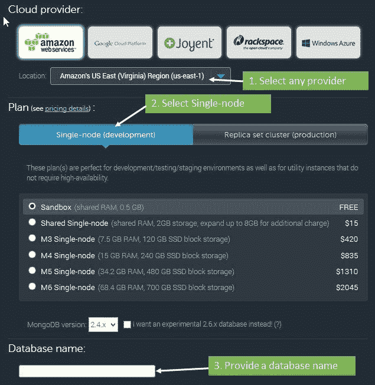
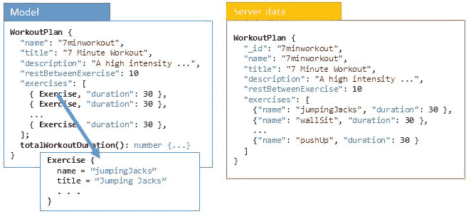

# 支持服务器数据持久性

现在是与服务器对话的时候了！创建一个训练，添加训练，然后保存它，让我们以后意识到我们所有的努力都白费了，因为数据在任何地方都不存在，这是没有乐趣的。我们需要解决这个问题。

应用程序很少是独立的。任何消费类应用程序，无论大小，都有与边界之外的元素交互的部分。对于基于 web 的应用程序，交互主要是与服务器进行的。应用程序与服务器交互以进行身份验证、授权、存储/检索数据、验证数据以及执行其他此类操作。

本章探讨 Angular 为客户机-服务器交互提供的结构。在这个过程中，我们向*Personal Trainer*添加了一个持久层，用于将数据加载并保存到后端服务器。

本章涵盖的主题包括以下内容：

*   **设置后端以保存训练数据**：我们建立了一个 MongoLab 帐户，并使用其数据 API 访问和存储训练数据。
*   **理解角度 HttpClient**：`HttpClient`允许我们通过 HTTP 与服务器交互。您将学习如何使用`HttpClient`生成所有类型的`GET`、`POST`、`PUT`和`DELETE`请求。
*   **实现训练数据**的加载和保存：我们使用`HTTPClient`将训练数据加载并存储到 MongoLab 数据库中。
*   **我们可以通过两种方式使用 HttpClient 的 XMLHttpRequest**：可以观察到，也可以承诺。
*   **使用 RxJS 和 Observables**：订阅和查询数据流。
*   **使用承诺**：在本章中，我们将了解如何使用承诺作为 HTTP 调用和响应的一部分。
*   **使用跨域访问**：当我们与另一个域中的 MongoLab 服务器交互时，您将了解浏览器对跨域访问的限制。您还将了解 JSONP 和 CORS 如何帮助我们简化跨域访问，以及 JSONP 的角度支持。

让我们开始吧。


# 角度和服务器交互

任何客户机-服务器交互通常归结为向服务器发送 HTTP 请求并从服务器接收响应。对于繁重的 JavaScript 应用程序，我们依赖 AJAX 请求/响应机制与服务器通信。为了支持基于 AJAX 的通信，Angular 提供了 Angular`HttpClient`模块。在深入研究`HttpClient`模块之前，我们需要建立存储数据并允许我们管理数据的服务器平台。


# 设置持久性存储

对于数据持久性，我们使用一个名为 MongoDB（[的文档数据库 https://www.mongodb.com/](https://www.mongodb.com/) ），托管于蒙古航空公司（[https://www.mlab.com/](https://www.mlab.com/) ），作为我们的数据存储。我们关注 MongoLab 的原因是它提供了一个直接与数据库交互的接口。这节省了我们设置服务器中间件以支持 MongoDB 交互的工作量。

直接向客户机公开数据存储/数据库从来都不是一个好主意。但在本例中，由于我们的主要目的是了解 Angular 和客户机-服务器交互，因此我们可以自由地直接访问 MongoDB 中托管的 MongoDB 实例。还有一种新的应用程序是基于**noBackend**解决方案构建的。在这样的设置中，前端开发人员构建应用程序时并不知道所涉及的确切后端。服务器交互仅限于对后端进行 API 调用。如果您有兴趣了解更多关于这些 noBackend 解决方案的信息，请查看[http://nobackend.org/](http://nobackend.org/) 。

我们的第一项任务是在 MongoLab 上提供一个帐户并创建一个数据库：

1.  转到[https://mlab.com](https://mlab.com) 并按照网站上的说明注册 mLab 帐户
2.  设置帐户后，通过单击主页上的“新建”按钮登录并创建新的 Mongo 数据库
3.  在数据库创建屏幕上，您需要进行一些选择以设置数据库。请参见以下屏幕截图以选择免费数据库层和其他选项：



4.  创建数据库并记下您创建的数据库名称
5.  设置数据库后，打开数据库并从“集合”选项卡向其中添加两个集合：
    *   `exercises`：存储所有*私人教练*练习
    *   `workouts`：存储所有*私人教练*训练

MongoDB 世界中的集合相当于一个数据库表。

MongoDB 属于一种称为**文档数据库**的数据库。这里的核心概念是文档、属性及其链接。与传统数据库不同的是，模式不是严格的。在本书中，我们将不介绍什么是文档数据库以及如何为基于文档的存储执行数据建模。*私人培训师*的存储需求有限，我们使用前面提到的两个文档集进行管理。我们甚至可能没有使用真正意义上的文档数据库。

添加集合后，从“用户”选项卡将自己作为用户添加到数据库中。

下一步是确定 MongoLab 帐户的 API 密钥。提供的 API 密钥必须附加到向 MongoLab 发出的每个请求中。要获取 API 密钥，请执行以下步骤：

1.  单击右上角的用户名（而不是帐户名）打开用户配置文件。
2.  在标题为 API 密钥的部分中，显示当前 API 密钥；复制它。同时，单击 API 键下方的按钮以启用数据 API 访问。这在默认情况下是禁用的。

数据存储架构已完成。我们现在需要为这些收藏品播种。


# 为数据库设定种子

*私人教练*应用程序已经有一个预定义的训练和 12 个练习的列表。我们需要用这些数据为收集的数据播种。

从伴随代码库中打开检查点 5.1 的`trainer/db`文件夹中的`seed.js`。它包含 seed JSON 脚本和关于如何将数据种子植入 MongoLab 数据库实例的详细说明。

一旦设定种子，数据库将在“训练”集合中有一个训练，在“练习”集合中有 12 个练习。在 MongoLab 现场验证这一点；集合应显示以下内容：


现在一切都已设置完毕，让我们开始讨论`HttpClient`模块，并为*私人教练*应用程序实现锻炼/锻炼持续性。


# HTTPClient 模块的基础知识

`HTTPClient`模块的核心是`HttpClient`。它使用`XMLHttpRequest`作为默认后端执行 HTTP 请求（也可以使用 JSONP，我们将在本章后面看到）。支持`GET`、`POST`、`PUT`、`DELETE`等请求。在本章中，我们将使用`HttpClient`发出所有这些类型的请求。正如我们将看到的，`HttpClient`使得以最少的设置和复杂性进行这些调用变得容易。对于以前使用 Angular 或构建与后端数据存储通信的 JavaScript 应用程序的人来说，这些术语都不会让他们感到惊讶。

然而，Angular 处理 HTTP 请求的方式发生了重大变化。调用请求现在返回一个可观察的 HTTP 响应。它是通过使用 RxJS 库来实现的，RxJS 库是异步可观测模式的一个著名的开源实现。

您可以在 GitHub 上的[找到 RxJS 项目 https://github.com/Reactive-Extensions/RxJS](https://github.com/Reactive-Extensions/RxJS) 。该网站表明，该项目正由微软与一个开源开发者社区合作积极开发。这里我们将不详细介绍异步可观察模式，我们鼓励您访问该站点，了解更多关于该模式以及 RxJS 如何实现它的信息。Angular 使用的 RxJS 版本是 beta 5。

用最简单的术语来说，使用可观察性允许开发人员将流经应用程序的数据视为应用程序可以随时使用的信息流。这些流会随着时间的推移而变化，这允许应用程序对这些变化做出反应。这种可观测的质量为函数 Tr0 提供了一个基础，即功能反应式编程 To1 T1（Pr.T2 FRP PosiT3），这从根本上改变了从必要性到反应性构建 Web 应用的范例。

`RxJS`库提供操作员，允许您订阅和查询这些数据流。此外，您可以轻松地混合和组合它们，我们将在本章中看到。Observables 的另一个优点是可以很容易地取消或取消订阅，从而可以无缝地在线处理错误。

虽然仍然可以使用 promises，但 Angular 中的默认方法使用 Observable。我们还将在本章介绍承诺。


# 个人培训师和服务器集成

如前一节所述，客户机-服务器交互都是关于异步的。当我们改变*私人教练*应用程序以从服务器加载数据时，这种模式变得不言而喻。

在上一章中，`WorkoutService`实现中对初始训练集和练习进行了硬编码。让我们先看看如何从服务器加载这些数据。


# 加载运动和锻炼数据

在本章前面，我们在数据库中植入了一个数据表单`seed.js`文件。我们现在需要在视图中呈现这些数据。蒙古 AB 数据 API 将在这方面帮助我们。

MongoLab 数据 API 使用 API 密钥对访问请求进行身份验证。向 MongoLab 端点发出的每个请求都需要一个查询字符串参数`apikey=<key>`，其中`key`是我们在本章前面设置的 API 密钥。请记住，密钥始终提供给用户并与其帐户关联。避免与他人共享您的 API 密钥。

API 遵循可预测的模式来查询和更新数据。对于任何 MongoDB 集合，典型的端点访问模式如下所示（这里给出的是基本 URL:[T0]https://api.mongolab.com/api/1/databases ：

*   `/<dbname>/collections/<name>?apiKey=<key>`：有如下要求：
    *   `GET`：此操作获取给定集合名称中的所有对象。
    *   `POST`：此操作向集合名称添加新对象。MongoLab 具有唯一标识文档（对象）的`_id`属性。如果过账数据中未提供，则自动生成。
*   `/<dbname>/collections/<name>/<id>?apiKey=<key>`：有如下要求：
    *   `GET`：从集合名称中获取具有特定 ID（在`_id`属性上完成匹配）的特定文档/集合项。
    *   `PUT`：更新集合名称中的具体项目（`id`）。
    *   `DELETE`：从集合名称中删除具有特定 ID 的项。

有关数据 API 接口的更多详细信息，请访问蒙古 AB 数据 API 文档，网址为[http://docs.mlab.com/data-api](http://docs.mlab.com/data-api) 。

现在，我们可以开始实施锻炼/锻炼列表页面了。

我们在本章中开始的代码是本书 GitHub 存储库中的`checkpoint 4.6`（文件夹：`trainer`）。在 GitHub（[上提供 https://github.com/chandermani/angular6byexample](https://github.com/chandermani/angular6byexample) ）。检查点在 GitHub 中作为分支实现。如果您没有使用 Git，请从以下 GitHub 位置下载检查点 4.6 的快照（ZIP 文件）：[https://github.com/chandermani/angular6byexample/tree/checkpoint4.6](https://github.com/chandermani/angular6byexample/tree/checkpoint4.6) 。第一次设置快照时，请参考`trainer`文件夹中的`README.md`文件。


# 从服务器加载练习和训练列表

要从蒙古 AB 数据库中提取运动和锻炼列表，我们必须重写我们的`WorkoutService`服务方法：`getExercises`和`getWorkouts`。但在此之前，我们必须将服务设置为与 Angular 的 HTTPClient 模块一起工作。


# 将 HTTPClient 模块和 RxJS 添加到我们的项目中

Angular HTTPClient 模块包含在您已经安装的 Angular 捆绑包中。要使用它，我们需要像这样将其导入到`app.module.ts,`中（确保导入遵循`BrowserModule`：

```ts
import { HttpClientModule } from '@angular/common/http';
. . . 
@NgModule({ 
  imports: [ 
    BrowserModule,
    HttpClientModule, 
. . . 
})
```

我们还需要一个外部第三方库：**针对 JavaScript**（**RxJS**的反应式扩展。RxJS 实现了可观察模式，Angular 与 HTTPClient 模块一起使用。它包含在角束中，角束已经是我们项目的一部分。


# 更新训练服务以使用 HTTPClient 模块和 RxJS

从`trainer/src/app/core`打开`workout.service.ts`。为了在`WorkoutService`中使用 HTTPClient 和 RxJS，我们需要向该文件添加以下导入：

```ts
import { HttpClient } from '@angular/common/http';
import { Observable } from 'rxjs/Observable';
import { catchError } from 'rxjs/operators';
```

我们正在从 RxJS 导入`HTTPClient`模块和`Observable`以及一个额外的 RxJS 操作符：`catchError`。我们将在本节中的代码中了解如何使用此运算符。

在类定义中，添加以下属性，包括一个训练属性、设置 Mongo 数据库中集合的 URL 和该数据库的密钥的属性以及另一个属性：`params`，该属性将 API 密钥设置为 API 访问的查询字符串：

```ts
workout: WorkoutPlan; 
collectionsUrl = "https://api.mongolab.com/api/1/ databases/<dbname>/collections"; 
apiKey = <key> 
params = '?apiKey=' + this._apiKey; 
```

将`<dbname>`和`<key>`标记替换为我们在本章前面设置的数据库的数据库名称和 API 密钥。

接下来，使用以下代码行将 HTTPClient 模块注入到`WorkoutServiceconstructor`中：

```ts
constructor(public http: HttpClient) {
}
```

然后将`getExercises()`方法更改为：

```ts
getExercises() {
    return this.http.get<ExercisePlan>(this.collectionsUrl + '/exercises' + this.params)
        .pipe(catchError(WorkoutService.handleError));
}
```

如果您习惯于使用异步数据操作的承诺，那么您在这里看到的情况将有所不同。这里发生的是，`http.get`方法从 RxJS 库返回一个可观测值，而不是一个链接到`then()`的调用的承诺。请注意，我们还将响应设置为类型`<ExercisePlan>`，以便向上游调用方显式说明从 HTTP GET 调用返回的可观察类型。

使用`HTTPClient`模块的`get`方法时，返回一个可观察的是默认响应。然而，可观察的事物可以转化为承诺。而且，正如我们将在本章后面看到的，返回 JSONP 的选项也存在。

在我们继续之前，在这段代码中还有一件事需要涉及。请注意，我们正在使用管道方法添加一个`catchError`操作符。该操作员接受一种方法`handleError`，用于处理失败的响应。`handleError`方法将失败响应作为参数。我们将错误记录到控制台，并使用`Observable.throw`将错误返回给消费者：

```ts
static handleError (error: Response) { 
    console.error(error); 
    return Observable.throw(error || 'Server error');
}
```

明确地说，这不是生产代码，但它将让我们有机会展示如何在上游编写代码来处理作为数据访问一部分生成的错误。

重要的是要理解，在这一阶段，在订阅之前，没有数据流过可观察对象。如果您不小心将订阅添加到您的观察对象中，这可能会导致添加和更新之类的事情陷入困境。


# 修改 getWorkouts（）以使用 HTTPClient 模块

检索训练代码的更改与训练代码的更改几乎相同：

```ts
getWorkouts() {
    return this.http.get<WorkoutPlan[]>(this.collectionsUrl + '/workouts' + this.params)
        .pipe(catchError(WorkoutService.handleError));
}
```

在本例中，我们再次指定了可观测的类型`<WorkoutPlan[]>`——这将由我们的 HTTP GET 调用返回，并使用`pipe`添加`catchError`操作符。

既然`getExercises`和`getWorkouts`方法已经更新，我们需要确保它们与上游调用方一起工作。


# 更新训练/锻炼列表页面

运动和锻炼列表页面（以及`LeftNavExercises`调用`model.ts`中的`getExercises`或`getWorkouts`方法。为了使用`HTTPClient`模块进行远程调用，我们需要修改这些调用以订阅`HTTPClient`模块返回的可观察对象。因此，将`exercises.component.ts`中`ngOnInit`方法中的代码更新为：

```ts
  ngOnInit() {
    this.workoutService.getExercises()
    .subscribe(
        exercises => this.exerciseList = exercises,
        (err: any) => console.error
    );
```

我们的方法现在订阅了`getExercises`方法返回的可观测数据；在响应到达时，它将结果分配给`exerciseList`。如果有错误，它会将其分配给一个在控制台中显示错误的`console.error`调用。所有这些现在都是使用带有 RxJS 的`HTTPClient`模块异步处理的。

继续，对`workouts.component.ts`和`left-nav-exercises.component.ts`中的`ngOnInit`方法进行类似的更改。

刷新“训练/锻炼列表”页面，将从数据库服务器加载训练和锻炼数据。

如果检索/显示数据有困难，请查看 GitHub 存储库中 checkpoint 5.1 中的完整实现。请注意，在这个检查点中，我们禁用了指向训练和锻炼屏幕的导航链接，因为我们仍然需要向它们添加可观察的实现。我们将在下一节中这样做。还记得在从`Checkpoint 5.1`运行代码之前替换数据库名称和 API 密钥。如果您没有使用 Git，请从以下 GitHub 位置下载`Checkpoint 5.1`（ZIP 文件）的快照：[https://github.com/chandermani/angular6byexample/tree/checkpoint5.1](https://github.com/chandermani/angular6byexample/tree/checkpoint5.1) 。第一次设置快照时，请参考`trainer`文件夹中的`README.md`文件。

这看起来不错，列表加载也很好。嗯，差不多了！“训练列表”页面中有一个小故障。如果我们仔细查看任何列表项（实际上，只有一项），就可以很容易地发现它：


训练持续时间计算不再有效！原因可能是什么？我们需要回顾一下这些计算是如何实现的。`WorkoutPlan`服务（在`model.ts`中）定义了一个`totalWorkoutDuration`方法，用于对此进行计算。

不同之处在于绑定到视图的训练数组。在上一章中，我们使用使用`WorkoutPlan`服务创建的模型对象创建了数组。但是现在，由于我们正在从服务器检索数据，我们将一个简单的 JavaScript 对象数组绑定到视图，由于明显的原因，该视图没有计算逻辑。

我们可以通过将服务器响应映射到模型类对象并将它们返回给任何上游调用方来解决这个问题。


# 将服务器数据映射到应用程序模型

如果模型和服务器存储定义匹配，则可能不需要将服务器数据映射到我们的模型，反之亦然。如果我们查看`Exercise`模型类和我们为 MongoLab 中的练习添加的种子数据，我们将看到它们确实匹配，因此映射变得不必要。

如果出现以下情况，则必须将服务器响应映射到模型数据：

*   我们的模型定义了任何方法
*   存储模型与其在代码中的表示不同
*   同一个模型类用于表示来自不同来源的数据（这可能发生在 mashup 中，我们从不同来源提取数据）

`WorkoutPlan`服务是模型表示及其存储之间阻抗不匹配的主要示例。查看以下屏幕截图以了解这些差异：



模型和服务器数据之间的两个主要区别如下：

*   模型定义了`totalWorkoutDuration`方法。
*   `exercises`数组表示形式也不同。模型的`exercises`数组包含完整的`Exercise`对象，而服务器数据只存储练习标识符或名称。

这显然意味着加载和保存训练需要模型映射。

我们将通过添加另一个操作符来转换可观察的响应对象。到目前为止，我们只返回了一个普通 JavaScript 对象作为响应。好的是，我们用来添加错误处理的管道方法还允许我们添加额外的操作符，我们可以使用这些操作符将 JavaScript 对象转换为模型中的`WorkoutPlan`类型。

让我们将`workout-service.ts`文件中的`getWorkouts`方法重写为：

```ts
    getWorkouts(): Observable<WorkoutPlan[]> {
        return this.http.get<WorkoutPlan[]>(this.collectionsUrl + '/workouts' + this.params)
            .pipe(
                map((workouts: Array<any>) => {
                  const result: Array<WorkoutPlan> = [];
                  if (workouts) {
                      workouts.forEach((workout) => {
                          result.push(
                              new WorkoutPlan(
                                  workout.name,
                                  workout.title,
                                  workout.restBetweenExercise,
                                  workout.exercises,
                                  workout.description
                              ));
                      });
                  }
                  return result;
                }),
                catchError(this.handleError<WorkoutPlan[]>('getWorkouts', []))
            );
    }
```

我们添加了一个`map`操作符，该操作符将这个可观察对象转换为一个由`WorkoutPlan`对象组成的对象。每个`WorkoutPlan`对象（我们目前只有一个）都将拥有我们需要的`totalWorkoutDuration`方法。

查看代码，您可以看到我们对 JSON 结果 HTTPClient 响应进行操作，这就是我们使用`<any>`类型的原因。然后我们创建一个类型化数组`WorkoutPlans`并使用胖箭头`forEach`函数迭代第一个数组，将每个 JavaScript 对象分配给一个`WorkoutPlan`对象

我们将这些映射的结果返回给订阅它们的调用方，在本例中为[T0]。我们还使用新的`handleError`方法更新了`catchError`操作符，您可以在`Checkpoint 5.2`中找到该方法。呼叫者不需要对他们用于订阅我们可观察训练的代码进行任何更改。相反，模型映射可以在应用程序中的一个位置进行，然后在整个应用程序中使用。

如果重新运行应用程序，您将看到总秒数现在正确显示：


GitHub 存储库中的 Checkpoint 5.2 包含到目前为止我们已经介绍过的工作实现。GitHub 分支为`checkpoint5.2`（文件夹：`trainer`。


# 从服务器加载运动和训练数据

正如我们在前面的`WorkoutService`中修复了`getWorkouts`实现一样，我们可以为锻炼和锻炼相关的东西实现其他 get 操作。从 checkpoint 5.2 的`trainer/src/app/core`文件夹中的`workout.service.ts`复制`WorkoutService`的`getExercise`和`getWorkout`方法的服务实现。

`getWorkout`和`getExercise`方法使用训练/练习的名称来检索结果。每个 MongoLab 集合项都有一个唯一标识项/实体的`_id`属性。对于我们的`Exercise`和`WorkoutPlan`对象，我们使用练习的名称进行唯一标识。因此，每个对象的`name`和`_id`属性始终匹配。

此时，我们需要向`workout.service.ts`添加一个导入：

```ts
import { forkJoin } from 'rxjs/observable/forkJoin';
```

这个导入引入了`forkJoin`操作符，我们将很快讨论它。

特别注意`getWorkout`方法的实现，因为由于模型和数据存储格式不匹配，会发生大量的数据转换。这就是`getWorkout`方法现在的样子：

```ts
    getWorkout(workoutName: string): Observable<WorkoutPlan> {
      return forkJoin (
          this.http.get(this.collectionsUrl + '/exercises' + this.params),
          this.http.get(this.collectionsUrl + '/workouts/' + workoutName + this.params))
          .pipe(
               map(
                  (data: any) => {
                      const allExercises = data[0];
                      const workout = new WorkoutPlan(
                          data[1].name,
                          data[1].title,
                          data[1].restBetweenExercise,
                          data[1].exercises,
                          data[1].description
                      );
                      workout.exercises.forEach(
                          (exercisePlan: any) => exercisePlan.exercise = allExercises.find(
                              (x: any) => x.name === exercisePlan.name
                          )
                      );
                      return workout;
                  }
              ),
              catchError(this.handleError<WorkoutPlan>(`getWorkout id=${workoutName}`))
        );
      }
```

[T0]里面发生了很多我们需要理解的事情。

`getWorkout`方法使用 Observable 及其`forkJoin`操作符返回两个可观察对象：一个检索`Workout`，另一个检索所有`Exercises`的列表。`forkJoin`运算符的有趣之处在于，它不仅允许我们返回多个可观察流，而且还可以等待两个可观察流检索到数据后再进一步处理结果。换句话说，它使我们能够流式处理来自多个并发 HTTP 请求的响应，然后对组合结果进行操作。

一旦我们有了`Workout`详细信息和完整的练习列表，我们就`pipe`将结果发送给`map`操作符（我们之前看到了`Workouts`列表的代码），我们使用该操作符将训练的`exercises`数组更改为正确的`Exercise`类对象。我们通过在从服务器返回的`workout.exercises`数组中搜索`allExercises`可观察到的练习名称，然后将匹配的练习分配给训练服务数组来实现这一点。最终的结果是我们有了一个完整的`WorkoutPlan`对象，并且`exercises`数组设置正确。

这些`WorkoutService`变化也保证了上游调用方的修复。我们已经确定了`LeftNavExercises`和`Exercises`部分的练习列表以及`Workouts`部分的训练。现在，让我们沿着类似的路线来修复`Workout`和`Exercise`组件。训练服务中的`getWorkout`和`getExercise`方法不是由这些组件直接调用的，而是由构建器服务调用的。因此，我们必须将 builder 服务与`Workout`和`Exercise`组件以及两个解析器`WorkoutResolver`和`ExerciseResolver`一起修复，这两个解析器是我们添加到这些组件的路由中的。


# 修复生成器服务

现在，我们已经设置了`WorkoutService`从远程数据存储中检索训练，我们必须修改`WorkoutBuilderService`以便能够将该训练作为可观察数据检索。拉取`Workout`细节的方法是`startBuilding`。为此，我们将当前的`startBuilding`方法分为两种方法，一种用于新的训练，另一种用于我们从服务器检索到的现有训练。以下是新训练的代码：

```ts
    startBuildingNew() {
      const exerciseArray: ExercisePlan[] = [];
      this.buildingWorkout = new WorkoutPlan('', '', 30, exerciseArray);
      this.newWorkout = true;
      return this.buildingWorkout;
    }
```

对于现有训练，我们添加以下代码：

```ts
    startBuildingExisting(name: string) {
      this.newWorkout = false;
      return this.workoutService.getWorkout(name);
    }
```

我们将让您在`ExerciseBuilderService`中进行相同的修复。


# 更新冲突解决程序

当我们继续在数据访问中使用可观察类型时，我们必须对我们为通向训练和锻炼屏幕的路线创建的解析器进行一些调整。我们从`workout-resolver.ts`中的`WorkoutResolver`开始，它可以在`workout`文件夹中找到。

首先从 RxJs 添加以下导入：

```ts
import { Observable } from 'rxjs/Observable';
import { of } from 'rxjs/observable/of';
import { map, catchError } from 'rxjs/operators';
```

接下来更新`resolve`方法如下：

```ts
  resolve(
    route: ActivatedRouteSnapshot,
    state: RouterStateSnapshot): Observable<WorkoutPlan> {
    const workoutName = route.paramMap.get('id');

    if (!workoutName) {
        return this.workoutBuilderService.startBuildingNew();
    } else {
        return this.workoutBuilderService.startBuildingExisting(workoutName)
        .pipe(
          map(workout => {
            if (workout) {
              this.workoutBuilderService.buildingWorkout = workout;
              return workout;
            } else {
              this.router.navigate(['/builder/workouts']);
              return null;
            }
          }),
          catchError(error => {
            console.log('An error occurred!');
            this.router.navigate(['/builder/workouts']);
            return of(null);
          })
        );
    }
```

如您所见，我们已将新训练（URL 中没有训练名称作为参数传递的训练）和现有训练的行为分开。在前一种情况下，我们调用`workoutBuilderService.startBuildingExisting`，它将返回一个新的`WorkoutPlan`。在后一种情况下，我们调用`workoutBuilderService.startBuildingExisting`并通过管道将结果映射到返回`workout`，除非未找到该结果，在这种情况下，我们将用户路由回`Workouts`屏幕。


# 修复训练和锻炼组件

一旦我们修复了`WorkoutBuilderService`和`WorkoutResolver`，实际上`WorkoutComponent`中不需要进一步的修复。所有处理观测值的工作都已在下游进一步完成，我们在这一阶段需要做的就是订阅路线数据并检索训练，就像我们已经做的那样：

```ts
  ngOnInit() {
      this.sub = this.route.data
          .subscribe(
            (data: { workout: WorkoutPlan }) => {
              this.workout = data.workout;
            }
          );
  }
```

要测试实现，请取消注释`workouts.component.ts`中`onSelect`方法中包含的以下突出显示的代码：

```ts
  onSelect(workout: WorkoutPlan) {
      this.router.navigate( ['./builder/workout', workout.name] );
  }
```

然后从`/builder/workouts/`显示的训练列表中单击任何现有训练，如*7 分钟训练*。训练数据应成功加载。

`ExerciseBuilderService`和`ExerciseResolver`也需要修复。`Checkpoint 5.2`包含这些修复。您可以复制这些文件，也可以自己复制并比较实现。不要忘记在`exercises.component.ts`中取消注释`onSelect`方法中的代码。

GitHub 存储库中的`Checkpoint 5.2`包含了我们到目前为止所讨论的工作实现。如果您没有使用 Git，请从以下 GitHub 位置下载 Checkpoint 5.2（ZIP 文件）的快照：[https://github.com/chandermani/angular6byexample/tree/checkpoint5.2](https://github.com/chandermani/angular6byexample/tree/checkpoint5.2) 。第一次设置快照时，请参考`trainer`文件夹中的`README.md`文件。

现在是修复、创建和更新练习和训练场景的时候了。


# 在练习/训练中执行 CRUD

当涉及到创建、读取、更新和删除（CRUD）操作时，所有保存、更新和删除方法都需要转换为可观察模式。

在本章前面，我们详细介绍了 MongoLab 集合中 CRUD 操作的端点访问模式。返回*加载运动和训练数据*部分，重新访问访问模式。我们现在就需要这个，因为我们计划创建/更新训练。

在开始实施之前，了解 MongoLab 如何识别集合项以及 ID 生成策略是什么很重要。MongoDB 中的每个集合项在集合中使用`_id`属性进行唯一标识。在创建一个新项目时，要么我们提供一个 ID，要么服务器自己生成一个 ID。`_id`一旦设置，就不能更改。对于我们的模型，我们将使用锻炼/锻炼的`name`属性作为唯一 ID，并将名称复制到`_id`字段中（因此，不会自动生成`_id`。还要记住，我们的模型类不包含这个`_id`字段；必须在首次保存记录之前创建该记录。

让我们首先修复训练创建场景。


# 创建新的训练

采用自下而上的方法，首先需要确定的是`WorkoutService`。更新`addWorkout`方法，如下代码所示：

```ts
    addWorkout(workout: WorkoutPlan) {
      const workoutExercises: any = [];
      workout.exercises.forEach(
          (exercisePlan: any) => {
              workoutExercises.push({name: exercisePlan.exercise.name, duration: exercisePlan.duration});
          }
      );

      const body = {
          '_id': workout.name,
          'exercises': workoutExercises,
          'name': workout.name,
          'title': workout.title,
          'description': workout.description,
          'restBetweenExercise': workout.restBetweenExercise
      };

      return this.http.post(this.collectionsUrl + '/workouts' + this.params, body)
        .pipe(
          catchError(this.handleError<WorkoutPlan>())
        );
    }
```

在`getWorkout`中，我们必须将数据从服务器模型映射到客户端模型；在这里必须做相反的事情。首先，我们为练习创建一个新阵列`workoutExercises`，然后向该阵列添加一个更紧凑的服务器存储练习版本。我们只想将练习名称和持续时间存储在服务器上的练习数组中（该数组的类型为`any`，因为它的紧凑格式不符合`ExercisePlan`类型）。

接下来，我们通过将这些更改映射到 JSON 对象来设置文章的正文。请注意，作为构造此对象的一部分，我们将`_id`属性设置为训练的名称，以在训练集合的数据库中唯一标识它。

在 MongoDB 中，使用锻炼/锻炼的*名称*作为记录标识符（或`id`）的简单方法将不适用于任何规模合适的应用程序。请记住，我们正在创建一个可由多个用户同时访问的基于 web 的应用程序。由于总是有可能两个用户在一次锻炼/锻炼中使用相同的名称，因此我们需要一个强大的机制来确保名称不重复。MongoLab REST API 的另一个问题是，如果存在具有相同`id`字段的重复`POST`请求，一个将创建一个新文档，第二个将更新它，而不是第二个失败。这意味着客户端的`id`字段上的任何重复检查仍然无法防止数据丢失。在这种情况下，优选分配自动生成的`id`值。在创建实体的标准情况下，唯一 ID 的生成是在服务器上完成的（主要由数据库完成）。创建实体时的响应包含生成的 ID。在这种情况下，我们需要在向调用代码返回数据之前更新模型对象。

最后，我们调用`HTTPClient`模块的`post`方法，传递要连接的 URL、一个额外的查询字符串参数（`apiKey`，以及我们要发送的数据。

最后一个 return 语句看起来应该很熟悉，因为我们使用 Observables 返回训练对象作为 observablesolution 的一部分。您需要确保将`.subscribe`添加到可观察链中，以使其工作。我们将很快通过向`WorkoutComponent`添加对`save`方法的订阅来实现这一点。


# 更新训练

为什么不尝试实现更新操作？`updateWorkout`方法可以用同样的方式固定，唯一的区别是需要`HTTPClient`模块的`put`方法：

```ts
    updateWorkout(workout: WorkoutPlan) {
      const workoutExercises: any = [];
      workout.exercises.forEach(
          (exercisePlan: any) => {
              workoutExercises.push({name: exercisePlan.exercise.name, duration: exercisePlan.duration});
          }
      );

      const body = {
          '_id': workout.name,
          'exercises': workoutExercises,
          'name': workout.name,
          'title': workout.title,
          'description': workout.description,
          'restBetweenExercise': workout.restBetweenExercise
      };

      return this.http.put(this.collectionsUrl + '/workouts/' + workout.name + this.params, body)
        .pipe(
          catchError(this.handleError<WorkoutPlan>())
        );
    }
```

前面的请求 URL 现在包含一个额外的片段（`workout.name`，表示需要更新的集合项的标识符。

如果在集合中找不到文档，MongoLab`PUT`API 请求将创建作为请求主体传入的文档。在发出`PUT`请求时，确保原始记录存在。我们可以先对同一份文件发出`GET`请求，并在更新之前确认我们收到了一份文件。我们将留给您来实施。


# 删除训练

最后一个需要修复的操作是删除训练。下面是一个简单的实现，我们调用`HTTPClient`模块的`delete`方法来删除特定 URL 引用的训练：

```ts
    deleteWorkout(workoutName: string) {
        return this.http.delete(this.collectionsUrl + '/workouts/' + workoutName + this.params)
          .pipe(
            catchError(this.handleError<WorkoutPlan>())
          );
    }
```


# 修正上游代码

有了这些，现在是修复`WorkoutBuilderService`和`Workout`组件的时候了。`WorkoutBuilderService`的`save`方法如下：

```ts
    save() {
      const workout = this.newWorkout ?
          this.workoutService.addWorkout(this.buildingWorkout) :
          this.workoutService.updateWorkout(this.buildingWorkout);
      this.newWorkout = false;
      return workout;
   }
```

因为它是一样的，所以大部分看起来和以前一样！我们不必更新此代码，因为我们在`WorkoutService`组件中有效地隔离了与外部服务器的交互。

最后，`Workout`组件的保存代码如下所示：

```ts
  save(formWorkout: any) {
    this.submitted = true;
    if (!formWorkout.valid) { return; }
    this.workoutBuilderService.save().subscribe(
      success => this.router.navigate(['/builder/workouts']),
      err => console.error(err)
    );
  }
```

在这里，我们做了一个更改，以便现在订阅 save。您可能还记得我们之前的讨论，`subscribe`使一个可观察的活动，以便我们可以完成保存。

就这样！我们现在可以创建新的训练并更新现有的训练（我们将把删除训练的完成留给您）。那并不太难！

让我们试试看。打开新的`Workout Builder`页面，创建训练并保存。还可以尝试编辑现有的训练。两种方案都应该无缝地工作。

如果您在运行本地副本时遇到问题，请查看`checkpoint 5.3`以获取最新的实现。如果您没有使用 Git，请从以下 GitHub 位置下载 Checkpoint 5.3（ZIP 文件）的快照：[https://github.com/chandermani/angular6byexample/tree/checkpoint5.3](https://github.com/chandermani/angular2byexample/tree/checkpoint5.3) 。第一次设置快照时，请参考`trainer`文件夹中的`README.md`文件。

当我们发出`POST`或`PUT`请求保存数据时，网络端发生了一些有趣的事情。打开浏览器的网络日志控制台（*F12*，查看正在进行的请求。该日志类似于以下内容：


The network log

在实际的`POST`或`PUT`完成之前，向同一端点发出`OPTIONS`请求。我们在这里看到的行为被称为**预授权请求**。发生这种情况是因为我们正在向`api.mongolab.com`发出跨域请求。


# 对 HTTP 请求使用承诺

本章的大部分内容集中于角度`HTTPClient`如何使用可观测值作为`XMLHttpRequests`的默认值。这代表着过去工作方式的重大变化。许多开发人员都熟悉对异步 HTTP 请求使用承诺。在这种情况下，Angular 继续支持承诺，但不是默认选择。开发者必须选择`XMLHttpRequest`中的承诺，才能使用它们。

例如，如果我们想在`WorkoutService`中的`getExercises`方法中使用 Promissions，我们必须按照如下方式重新构造命令：

```ts
    getExercises(): Promise<Exercise[]> {
        return this.http.get<Exercise[]>(this.collectionsUrl + '/exercises' + this.params)
        .toPromise()
        .then(res => res)
        .catch(err => {
            return Promise.reject(this.handleError('getExercises', []));
        });
    }
```

为了将此方法转换为使用承诺，我们所要做的就是在方法链中添加`.toPromise()`，一个成功参数`then`用于承诺，并且`catch`带有一个`Promise.reject`指向现有`handleError`方法。

对于上游组件，我们只需将返回值作为承诺而不是可观察值来处理。因此，要在这种情况下使用承诺，我们必须更改`Exercises.component.ts`和`LeftNavExercises.component.ts`中的代码，首先为错误消息添加一个新属性（关于错误消息在屏幕上的显示方式，我们将留给您）：

```ts
errorMessage: any;
```

然后将调用`WorkoutService`的`ngOnInit`方法更改为：

```ts
  ngOnInit() {
    this.workoutService.getExercises()
 .then(exerciseList => this.exerciseList = exerciseList,
 error => this.errorMessage = <any>error
    );
  }  
```

当然，在这个简单的例子中，我们可以轻易地用承诺来代替可观测值，这并不表明它们本质上是相同的。`then`承诺返回另一个承诺，这意味着您可以创建连续链接的承诺。在可观察的情况下，订阅本质上是行的末尾，不能映射或订阅到该点之外。

如果你对承诺很熟悉，那么在这个阶段，坚持承诺而不尝试观察可能会很有诱惑力。毕竟，在本章中，我们对可观测对象所做的大部分工作也可以通过承诺来完成。例如，我们使用 Observable 的`forkJoin`操作符对`getWorkouts`进行的两个可观测数据流的映射也可以通过 promise 的`q,all`函数完成。

然而，如果你采取这种方法，你就会卖空自己。Observables 为使用所谓的函数式反应式编程进行 web 开发开辟了一条令人兴奋的新途径。它们涉及到思维的根本转变，即将应用程序的数据视为应用程序反应和响应的恒定信息流。这种转变使得应用程序可以用不同的体系结构构建，从而使它们更快、更具弹性。在事件发射器和新版本的`NgModel`中，可观测值是角度测量的核心。

虽然 promises 是工具箱中的一个有用工具，但我们鼓励您在使用 Angular 进行开发时调查可观察到的内容。它们是 Angular 前瞻性理念的一部分，在未来的应用程序和技能测试中非常有用。

查看`checkpoint 5.3`文件以获得最新的实现，其中包括我们前面介绍的与承诺相关的代码。如果您没有使用 Git，请从以下 GitHub 位置下载 Checkpoint 5.3 的快照（ZIP 文件）：[https://github.com/chandermani/angular6byexample/tree/checkpoint5.3](https://github.com/chandermani/angular6byexample/tree/checkpoint5.3) 。第一次设置快照时，请参考`trainer`文件夹中的`README.md`文件。请注意，在下一节中，我们将恢复使用此代码的可观察性。此代码可在`checkpoint 5.4`文件中找到。


# 异步管道

正如我们在本章介绍的许多数据操作中所看到的，有一种相当常见的模式被反复重复。当从 HTTP 请求返回一个可观察对象时，我们将响应转换为 JSON 并订阅它。然后，订阅将可观察的输出绑定到 UI 元素。如果我们能够消除这种重复的编码，用一种更简单的方式来完成我们想要做的事情，那不是很好吗？

毫不奇怪，Angular 为我们提供了正确的方法。它被称为**异步管道**，可以像其他管道一样用于绑定屏幕上的元素。然而，异步管道是一种比其他管道更强大的机制。它接受一个可观察的或承诺作为输入，并自动订阅它。它还处理可观察对象订阅的拆卸，而不需要任何进一步的代码行。

让我们看一下应用程序中的一个例子。让我们回到`LeftNavExercises`部分，我们刚刚在上一节中讨论了与承诺相关的内容。注意，我们已经将这个组件和`Exercises`组件从 promises 转换回使用 Observable。

请查看`checkpoint 5.4`文件以获取最新的实现，其中包括再次将此代码转换为使用 Observable。如果您没有使用 Git，请从以下 GitHub 位置下载 Checkpoint 5.4 的快照（ZIP 文件）：[https://github.com/chandermani/angular6byexample/tree/checkpoint5.4](https://github.com/chandermani/angular6byexample/tree/checkpoint5.4) 。第一次设置快照时，请参考`trainer`文件夹中的`README.md`文件。

然后在`LeftNavExercises`中进行以下更改。首先，从 RxJs 导入 Observable：

```ts
import { Observable } from 'rxjs/Observable';
```

然后将`exerciseList`从一系列练习更改为相同类型的可观察：

```ts
public exerciseList:Observable<Exercise[]>;
```

接下来修改对`WorkoutService`的调用，该调用获取练习以消除订阅：

```ts
this.exerciseList = this.workoutService.getExercises();
```

最后打开`left-nav-exercises.component.html`并将`async`管道添加到`*ngFor`回路中，如下所示：

```ts
<div *ngFor="let exercise of exerciseList|async|orderBy:'title'">
```

刷新页面，您仍将看到显示的练习列表。但这一次，我们使用了`async`管道来消除对可观察对象的订阅的需要。很酷！这是 Angular 所增加的一个很好的便利，因为我们在本章中花了很多时间来理解可观测数据是如何与订阅一起工作的，所以我们对`async`管道现在为我们提供的信息有了一个清晰的概念。

我们将让您在`Exercises`组件中实现相同的更改。

了解 HTTP 请求的跨域行为以及 Angular 提供的用于进行跨域请求的构造非常重要。


# 跨域访问和数据传输

跨域请求是对不同域中的资源发出的请求。当这些请求源于 JavaScript 时，浏览器会施加一些限制；这些被称为*同源政策*限制。这样的限制会阻止浏览器向不同于脚本原始源的域发出 AJAX 请求。源匹配严格基于协议、主机和端口的组合进行。

对于我们自己的应用程序，`https://api.mongolab.com`的调用是跨域调用，因为我们的源代码宿主位于不同的域中（很可能类似于`http://localhost/....`。

有一些变通方法和标准可以帮助放松/控制跨域访问。我们将探讨其中两种技术，因为它们是最常用的技术。详情如下:

*   **带填充的 JSON**（**JSONP**）
*   **跨源资源共享**（**CORS**）

规避这种同源策略的一种常见方法是使用 JSONP 技术。


# 使用 JSONP 进行跨域请求

远程调用的 JSONP 机制依赖于这样一个事实：浏览器可以从任何域执行 JavaScript 文件，而不管源代码是什么，只要脚本是通过`<script>`标记包含的。

在 JSONP 中，不直接向服务器发出请求，而是生成一个动态的`<script>`标记，将`src`属性设置为需要调用的服务器端点。此`<script>`标记附加到浏览器的 DOM 后，会导致向目标服务器发出请求。

然后，服务器需要以特定格式发送响应，将响应内容包装在函数调用代码中（响应数据周围的额外填充为该技术命名为 JSONP）。

Angular JSONP 服务隐藏了这种复杂性，并提供了一个简单的 API 来发出 JSONP 请求。StackBlitz 链接，[T0]https://stackblitz.com/edit/angular-nxeuxo 重点介绍了如何提出 JSONP 请求。使用*IEX 免费库存 API*（[https://iextrading.com/developer/](https://iextrading.com/developer/) 获取任何股票符号的报价。

Angular JSONP 服务只支持 HTTP`GET`请求。使用任何其他 HTTP 请求，如`POST`或`PUT`，将生成错误。

如果您查看 StackBlitz 项目，您将看到我们在本书中遵循的熟悉的组件创建模式。我们将不再讨论此模式，但将重点介绍与使用 Angular JSONP 服务相关的一些细节。

首先，在导入`FormsModule`和`HttpClientModule`的同时，您需要将`HttpClientJsonpModule`导入`app.module.ts`中，如下所示：

```ts
. . . 
import { HttpClientModule, HttpClientJsonpModule } from '@angular/common/http';
import { FormsModule } from '@angular/forms';
. . . 
@NgModule({
. . . 
  imports: [
    BrowserModule,
    FormsModule,
    HttpClientModule,
 HttpClientJsonpModule
  ],
. . . 
}) 
```

接下来，我们需要在`get-quote.component.ts`中添加以下导入：

```ts
import { Component }from '@angular/core';
import { HttpClient } from '@angular/common/http';
import { Observable } from 'rxjs/Observable';
import { map } from 'rxjs/operators';
```

我们正在导入`HttpClient`，其中包含我们将使用的`JSONP`方法，以及 RxJS`Observable`和`map `操作符。从我们在本章中构建的内容来看，这些导入对您来说很熟悉。

在使用 Angular JSONP 时，必须了解，默认情况下，它使用 RxJS 返回可观测值。这意味着我们必须遵循订阅这些观察值的模式，并使用 RxJS 操作符来操纵结果。我们还可以使用异步管道来简化这些操作。

然后我们将`HttpClient`注入构造函数：

```ts
constructor(public http: HttpClient) {}
```

接下来，我们添加几个变量，这些变量将在 JSONP 调用中使用：

```ts
   symbol: string;
   quote: Observable<string>;
   url: string = 'https://api.iextrading.com/1.0/stock/';
```

[T0]变量将保存用户提供的搜索字符串。在我们的模板中，`quote`变量将用于显示 JSONP 调用返回的值。[T2]变量是我们将调用服务的基本 URL。

现在我们已经为我们的`getQuote`方法准备好了一切。让我们来看一看：

```ts
   getQuote (){ 
      let searchUrl = `${this.url}${this.symbol}/quote`;
      this.quote = this.http.jsonp(searchUrl, 'callback')
          .pipe(
          map( (res: string) => res)
        ); 
    }; 
```

我们首先通过连接`url`和`symbol`并添加`/quote`来构建我们的`searchUrl`。最后一部分`quote`是我们需要传递给报价服务以返回股票报价的内容。

然后，我们使用 HTTPClient 的`jsonp`方法执行对 quote 服务的远程调用。我们将[T1]作为该方法的第一个参数传递，并将字符串[T2]作为第二个参数传递。Angular 使用后一个参数用一个额外的查询字符串参数`callback`来扩充`searchUrl`。在内部，Angular JSONP 服务随后生成一个动态`script`标记和一个回调函数，并发出远程请求。

打开 StackBlitz 并输入符号，如`GOOG`、`MSFT`或`FB`，以查看股票报价服务的运行情况。请求的浏览器网络日志如下所示：

```ts
https://api.iextrading.com/1.0/stock/MSFT/quote?callback=ng_jsonp_callback_0
```

这里，`ng_jsonp_callback_0`是动态生成的函数。答复如下：

```ts
typeof ng_jsonp_callback_0 === 'function' && ng_jsonp_callback_0({"quote"::{"symbol":"MSFT"..});
```

响应被包装在回调函数中。Angular 解析并计算该响应，从而调用`__ng_jsonp__.__req1`回调函数。然后，该函数在内部将数据路由到我们的函数回调。

我们希望这能解释 JSONP 是如何工作的，以及 JSONP 请求的底层机制是什么。然而，JSONP 有其局限性：

*   首先，我们只能发出`GET`请求（这是显而易见的，因为这些请求源于脚本标记）
*   其次，服务器还需要实现解决方案中涉及将响应包装到函数回调中的部分
*   第三，始终存在安全风险，因为 JSONP 依赖于动态脚本生成和注入
*   第四，错误处理也不可靠，因为不容易确定脚本加载失败的原因

最终，我们必须认识到 JSONP 与其说是解决方案，不如说是一种变通方法。随着我们走向 Web2.0，在 Web2.0 中混搭变得司空见惯，越来越多的服务提供商决定在 Web 上公开他们的 API，一个更好的解决方案/标准出现了：CORS。


# 跨来源资源共享

**跨源资源共享****CORS**为 web 服务器提供了一种支持跨站点访问控制的机制，允许浏览器通过脚本进行跨域请求。根据该标准，消费者应用程序（如*私人教练*）可以提出某些类型的请求，称为**简单请求**，无需任何特殊设置要求。这些简单请求仅限于`GET`、`POST`（具有特定 MIME 类型）和`HEAD`。所有其他类型的请求称为**复杂请求**。

对于复杂的请求，CORS 要求该请求之前应该有一个 HTTP`OPTIONS`请求（也称为飞行前请求），该请求向服务器查询允许跨域请求的 HTTP 方法。只有在探测成功的情况下，才会提出实际的请求。

您可以从[T0]上的 MDN 文档中了解有关 CORS 的更多信息 https://developer.mozilla.org/en-US/docs/Web/HTTP/Access_control_CORS 。

CORS 最好的部分是，客户机不必像 JSONP 那样进行任何调整。完整的握手机制对呼叫代码是透明的，我们的角度`HTTPClient`呼叫工作顺利。

CORS 要求在服务器上进行配置，并且 MongoLab 服务器已经配置为允许跨域请求。所以我们之前向蒙古航空公司提出的`POST`和`PUT`请求，要求添加和更新`Exercise`和`Workout`文件，都导致了飞行前`OPTIONS`请求。


# 未找到处理训练

您可能还记得，在[第 4 章](4.html#5BL580-7edc9b1e1ea341adae33006323903887)、*私人教练*中，我们创建了`WorkoutResolver`，不仅可以在导航到`WorkoutComponent`之前检索训练，还可以在路线参数中不存在训练时阻止导航到该组件。现在，我们希望通过在训练屏幕上显示一条错误消息来增强此功能，指示未找到训练。

为了做到这一点，我们将修改`WorkoutResolver`，以便在未找到训练时，它将重新路由到训练屏幕。首先，将以下子路径添加到`WorkoutBuilderRoutingModule`（确保其位于现有训练路径之前）：

```ts
children: [ 
  {path: '', pathMatch: 'full', redirectTo: 'workouts'}, 
 {path: 'workouts/workout-not-found', component: WorkoutsComponent'}, 
  {path: 'workouts', component: 'WorkoutsComponent'}, 
   *** other child routes *** 
  }, 
]
```

接下来，修改`WorkoutResolver`中的`resolve`方法，在未找到训练的情况下重定向到此路线：

```ts
resolve(
    route: ActivatedRouteSnapshot,
    state: RouterStateSnapshot): Observable<WorkoutPlan> {
    const workoutName = route.paramMap.get('id');

    if (!workoutName) {
        return this.workoutBuilderService.startBuildingNew();
    } else {
        this.isExistingWorkout = true;
        return this.workoutBuilderService.startBuildingExisting(workoutName)
        .pipe(
          map(workout => {
            if (workout) {
              this.workoutBuilderService.buildingWorkout = workout;
              return workout;
            } else {
              this.router.navigate(['/builder/workouts/workout-not-found']);
              return null;
            }
          }),
          catchError(error => {
            console.log('An error occurred!');
            this.router.navigate(['/builder/workouts']);
            return of(null);
          })
        );
    }
```

然后将`notFound`布尔集合添加到`false`到`Workouts`组件中的变量：

```ts
  workoutList: Array<WorkoutPlan> = [];
  public notFound = false;
```

并且，在该组件的`ngOnInit`方法中，添加以下代码来检查`workout-not-found`路径，并将`notFound`值设置为`true`：

```ts
ngOnInit() {
  if(this.route.snapshot.url[1] && this.route.snapshot.url[1].path === 
  'workout-not-found') this.notFound = true; 
  this.subscription = this.workoutService.getWorkouts() 
  .subscribe( 
    workoutList => this.workoutList = workoutList, 
    (err:any) => console.error(err) 
  ); 
}
```

最后在`Workouts.component.html`模板中，在`notFound`设置为`true`时显示的训练列表上方添加以下`div`标签：

```ts
<div *ngIf="notFound" class="not-found-msgbox">Could not load the specific workout!</div>
```

当用户返回到`Workouts`页面时，如果我们在路径中找到`workout-not-found`，则在屏幕上显示以下消息：


我们已修复了“训练生成器”页面的路由故障，但“练习生成器”页面仍处于挂起状态。再说一次，我们会让你自己来解决它。

另一个主要的（待定的）实现是修复*7 分钟锻炼*，因为它目前只满足一个锻炼程序。


# 修复 7 分钟训练应用程序

目前，*7 分钟训练*（或*训练跑步者*应用程序只能播放一项特定训练。它需要固定以支持使用*私人教练*制定的任何训练计划的执行。显然有必要将这两种解决方案结合起来。我们已经为开始这一整合做了基础工作。我们有共享的模型服务和`WorkoutService`来加载数据，足以让我们开始。

确定*7 分钟训练*并将其转换为通用*训练跑步者*大致包括以下步骤：

*   删除硬编码训练和*7 分钟训练*中使用的训练。
*   修复起始页以显示所有可用的训练，并允许用户选择要运行的训练。
*   修复训练路线配置，将选定的训练名称作为路线参数传递到训练页面。
*   使用`WorkoutService`加载所选训练数据并开始训练。
*   当然，我们需要重新命名应用程序的*7 分钟锻炼*部分；这个名字现在用词不当。我认为完整的应用程序可以称为*私人教练*。我们也可以从视图中删除对*7 分钟锻炼*的所有引用。

这是一个很好的锻炼自己的方法！这就是为什么我们不给你们介绍解决方案的原因。相反，继续实施解决方案。将您的实现与`checkpoint 5.4`中提供的实现进行比较。

是时候结束本章并总结您的学习了。


# 总结

我们现在有了一个可以做很多事情的应用程序。它可以运行训练、加载训练、保存和更新训练，以及跟踪历史记录。如果我们回顾过去，我们已经用最少的代码实现了这一点。我们打赌，如果我们在标准 jQuery 或其他框架中尝试这一点，它将需要比 Angular 付出更多的努力。

我们通过在*MongoLab*服务器上提供*MongoDB*数据库开始本章。因为 MongoLab 提供了一个 RESTful API 来访问数据库，所以我们没有设置自己的服务器基础设施，从而节省了一些时间。

我们提到的第一个角度构造是`HTTPClient`，它是连接到任何 HTTP 后端的主要服务。

您还了解了`HTTPClient`模块如何使用可观察对象。在本章中，我们首次创建了自己的可观察对象，并解释了如何创建对这些可观察对象的订阅。

我们修复了我们的*私人教练*应用程序，使其使用`HTTPClient`模块加载和保存训练数据（请注意，训练的数据持久性留给您完成）。在此过程中，您还了解了有关跨域资源访问的问题。您了解了 JSONP，这是一种绕过浏览器的*同源*限制的解决方案，以及如何使用 Angular 发出 JSONP 请求。我们还谈到了 CORS，它已经成为跨域通信的标准。

我们现在已经讨论了 Angular 的大部分构建块，除了大的一个：Angular 指令。我们在任何地方都使用了指令，但还没有创建指令。下一章专门讨论角度指令。我们将为*训练生成器*应用程序创建一些小指令，如远程验证程序、AJAX 按钮和验证提示指令。