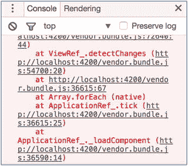

# 7.开始使用 CLI 编码

当我第一次在 Angular 2 中开始开发时，我发现一开始有一个尖锐的学习曲线。因为没有一个标准的 Angular 2 项目蓝图来简单地处理项目的构建和运行，所以很难让项目进行下去。您必须在 Node 中设置您依赖项(稍后将详细介绍)，设置您的构建过程，并设置部署过程。这使得 Angular 2 一开始很难，因为你必须同时学习概念和语法。

输入 CLI。Angular CLI(命令行界面)的开发是为了让开发人员能够快速使用 Angular。这很棒——它可以生成结构良好、设计良好的项目。我怎么强调都不为过，这是一个多么好的工具。难怪这么快就被采用了。

Angular CLI 是一个开源项目。你可以在 [`https://github.com/angular/angular-cli/`](https://github.com/angular/angular-cli/) 看它的代码。官方 Angular CLI 文档可通过 [`https://cli.angular.io/`](https://cli.angular.io/) 在线获取。你可以在 [`https://angular.io/docs/ts/latest/cli-quickstart.html`](https://angular.io/docs/ts/latest/cli-quickstart.html) 查看快速入门页面。

本章的目的是让您使用 CLI 创建项目。现在还不打算详细介绍 CLI，因为还没有必要——在后面的章节中会有更多关于 CLI 的内容。然而，如果你现在想要大量的信息，我推荐你在 [`www.sitepoint.com/ultimate-angular-cli-reference/`](http://www.sitepoint.com/ultimate-angular-cli-reference/) 的优秀文章。

Angular CLI 名副其实，它使用命令行界面。您在终端中使用`ng`命令，它就开始工作了。使用命令行可能会让您想起“糟糕的旧时光”，那时您必须记住一堆命令，但是当您看到 CLI 所做的事情时，您会忘记这一切:

*   它允许您创建新的Angular应用。
*   它允许您运行一个开发服务器，并实时重载变更。
*   它允许您向Angular应用添加更多代码
*   它运行您的应用的测试。
*   它为部署构建您的应用。
*   它部署您的应用。

如前一章所述，要运行 CLI，首先需要安装 node . js 4 . 0 . 0 版或更高版本。如果您还没有这样做，请返回并阅读如何做到这一点。

要安装 CLI，请在终端中输入以下命令，这将启动各种节点下载:

```ts
npm install -g angular-cli

```

请注意，`-g`参数将 Angular CLI 作为全局包安装。这将把`ng`命令放在 path 中，使它可以在任何目录中使用。

您可以通过运行以下命令来检查您的 CLI 版本:

```ts
ng --version

```

要更新 CLI 版本，您应该卸载它，然后使用以下命令重新安装:

```ts
npm uninstall -g angular-cli
npm cache clean
npm install -g angular-cli

```

## 创建一个开始项目

最后，我们要做一些编码！不完全是。还没有。让我们创建基本项目并运行它。请遵循以下步骤:

1.  打开终端窗口。
2.  导航到合适的文件夹，例如“文档”。
3.  输入以下命令，这将在一个名为 start 的文件夹中创建一个新的 Angular 应用，并会产生大量它创建的文件:

    ```ts
    ng new start

    ```

4.  导航到开始文件夹。

    ```ts
    cd start

    ```

5.  输入以下命令启动应用:

    ```ts
    ng serve

    ```

6.  Open your web browser and browse to localhost:4200\. You should see the text “welcome to app!” as shown in Figure [7-1](#Fig1). That means your app is running.

    

    图 7-1

    The app is working  

现在，您可以对项目中的文件进行更改，只要您运行`ng serve`，项目就会自动重新编译代码，并在 web 浏览器中刷新应用。这造就了一个高效的开发环境。

现在，让我们来看看这个项目以及其中的内容。启动 Visual Studio 代码并打开文件夹 start。表 [7-1](#Tab1) 显示了内部的内容及其结构。

表 7-1

What’s in the Root Folder?

<colgroup><col align="left"> <col align="left"></colgroup> 
| 文件或文件夹 | 事实真相 |
| :-- | :-- |
| e2e | 用于测试文件的文件夹(本书后面会有更多关于测试、Karma 和量角器的内容) |
| 节点 _ 模块 | 项目节点相关性的文件夹 |
| 科学研究委员会 | 项目源代码的文件夹 |
| .editorConfig | 编辑器配置文件 |
| 。吉蒂尔 | Git 忽略文件 |
| angular angular-CLI . JSON | CLI 配置文件。您可以在此文件中更改 CLI 选项 |
| 因果报应日 json | Karma 配置文件(本书后面会有更多关于测试、Karma 和量角器的内容) |
| package.json | 节点相关性配置文件 |
| 量角器-conf.js | 量角器配置文件(本书后面会有更多关于测试、Karma 和量角器的内容) |
| README.md | 自述信息文件，包含有关 CLI 命令的信息 |
| 林顿. json | Lint 配置文件 |

表 [7-2](#Tab2) 显示了源代码。这是真正重要的东西 CLI 为您的项目生成的源代码。这是您编码的起点。

表 7-2

CLI-Generated project code

<colgroup><col align="left"> <col align="left"></colgroup> 
| 文件或文件夹 | 事实真相 |
| :-- | :-- |
| 应用 | 应用源代码文件的文件夹，当前包含应用组件的源代码(稍后将详细介绍) |
| 资产 | 应用图像和 CSS 文件的文件夹 |
| 环境 | 环境配置文件的文件夹，例如，开发和生产配置 |
| favicon.ico | 应用图标 |
| index.html | Angular单页应用的 HTML 页面 |
| 主页面 | 启动应用的代码(稍后将详细介绍) |
| 样式. css | 全局样式定义 |
| 测试. ts | 运行应用测试的代码 |
| tsconfig.json 文件 | 类型脚本/编译器配置文件 |

## 修改开始项目

让我们修改开始项目，看看会发生什么。请遵循以下步骤:

1.  打开终端窗口。
2.  导航到 start 文件夹，确保`ng start`命令正在运行，并且导航到 localhost:8080 会产生“欢迎使用 app！”如预期的网页。保持`ng start`命令运行。
3.  编辑文件 src/app/app.component.ts，将其更改为以下内容:

    ```ts
    import { Component } from '@angular/core';

    @Component({
      selector: 'app-root',
      templateUrl: './app.component.html',
      styleUrls: ['./app.component.css']
    })
    export class AppComponent {
      title = 'app works! and has been modified....';
    }

    ```

4.  Go back to your web browser . It should now display what you see in Figure [7-2](#Fig2).

    

    图 7-2

    The app has been modified  

请注意，当您在编辑器中单击“保存”时，应用是如何自动重新编译和重新加载的。这是因为 CLI 项目包括 Watchman，它可以监视更改的文件，并在您更改应用时对其进行重建和重新加载。我很快会说更多关于 Watchman 的内容。

## 启动项目:编译错误

让我们在项目中引入一个编译错误，看看会发生什么。

编辑文件 src/app/app.component.ts，并将其更改为以下内容(记住省略“app works”中的引号):

```ts
import { Component } from '@angular/core';

@Component({
  selector: 'app-root',
  templateUrl: './app.component.html',
  styleUrls: ['./app.component.css']
})
export class AppComponent {
  title = app works;
}

```

请注意，应用不会改变或重新加载，并且您会在终端窗口中得到错误信息。浏览器控制台中也会出现错误消息。在 Chrome 中，您可以通过选择更多工具，然后在菜单中选择开发者工具来查看浏览器控制台。

## 启动项目:运行时错误

让我们在项目中引入一个运行时错误，看看会发生什么:

1.  编辑文件 src/app/app.component.ts，改回原代码:

    ```ts
    import { Component } from '@angular/core';

    @Component({
      selector: 'app-root',
      templateUrl: './app.component.html',
      styleUrls: ['./app.component.css']
    })
    export class AppComponent {
      title = 'app works!';
    }

    ```

2.  编辑文件 src/app/app.component.html 并将其更改为以下内容(以创建一个错误):

    ```ts
    <h1>
      {{title.test.test}}
    </h1>

    ```

应用变成空白。如果你检查终端，它说“webpack:编译成功。”所以，编译成功了。然而，页面没有加载，因为我们(故意)引入了一个运行时错误(只有在应用运行时才会出现)。要查找错误，请转到浏览器控制台(参见图 [7-3](#Fig3) )。在谷歌浏览器中，你可以通过打开“汉堡”菜单，选择更多工具，然后在菜单中选择开发者工具来查看浏览器控制台。



图 7-3

The app has been modified

## 文件监视器和网络服务器

如前所述，如果让`ng serve`运行，它会监视我们的文件(必要时执行编译和重新部署),并在 localhost:4200 上运行一个本地 web 服务器。当您更改某项内容并单击“保存”时，观察器会执行以下操作:

*   创建一个 Webpack 构建，包括编译兼容的 JavaScript 和捆绑代码(本书后面会详细介绍 Webpack)
*   生成一个新的 index.html 文件，根据需要添加脚本引用来引用 Webpack 捆绑的 JavaScript 文件
*   在本地 web 服务器上执行新的部署
*   刷新网页

## 拔靴带

自举通常是指一个自启动的过程，它应该在没有外部输入的情况下进行。在这种情况下，它指的是 Angular 应用如何启动。这一节看一下 starter 项目如何启动。

当我们转到 localhost:4200 时，会发生以下情况:

1.  默认情况下，web 浏览器会打开文件 index.html。
2.  浏览器在最后加载脚本文件。这包括 main.bundle.js，它是 typescript 文件 main.ts 的 transpiled 版本。这是我们的主要应用入口点。
3.  Main.bundle.js 加载一些模块然后调用下面的Angular系统代码:

    ```ts
    platformBrowserSpecific().bootstrapModule(AppModule)

    ```

4.  AppModule 已加载——它是用于引导应用的根 Angular 模块。这是一个Angular模块，不是 JavaScript 模块——它们是不同的东西(我将在本书的后面介绍Angular模块)。如果您查看 AppModule.ts，您会看到它包含以下代码行，告诉模块使用 AppComponent 进行引导:

    ```ts
    @NgModule({

        ...

      bootstrap: [AppComponent]
    })

    ```

5.  AppModule 用 AppComponent 引导，将组件注入开始和结束标记`app-root` :

    ```ts
    <app-root>Loading...</app-root>

    ```

    之间的空间

## 有用的 CLI 选项

我们经常在本书中使用 CLI，以下是我们在示例中使用的一些 CLI 选项:

```ts
--flat

```

生成具有平面文件结构的 cli 项目，而不是在自己的目录中生成每个组件。

```ts
--inline-template

```

使用内联模板生成组件(稍后将详细介绍)。组件模板标记将在组件中生成，而不是在单独的文件中生成。

```ts
--inline-style

```

生成具有内联样式的组件(稍后将详细介绍)。组件样式将在组件中生成，而不是在单独的文件中生成。

```ts
--spec false

```

生成不带单元测试“规范”文件的组件，默认情况下通常会为您生成这些文件。

自从我编写了示例之后，又添加了一个非常有用的新 CLI 选项:

```ts
--minimal

```

生成一个包含内联模板、样式且不包含测试的最小 cli 项目。

## 提前编译

正如在第 [2](02.html) 章中提到的，Angular 现在更倾向于 aot 模型，在这种模型中，你的代码是提前编译的，而不是在需要的时候。5 中的这些编译器更新推进了向 aot 的转移，这将使您的应用运行得更快，因为它在运行应用时将执行更少的编译。

如果您正在处理一个 CLI 项目，并且希望提前执行 aot 编译，那么您可以在 CLI 命令中添加'—aot '选项。例如，您可以使用以下命令运行带有 aot 编译的应用:

```ts
ng serve -aot

```

这对于提前发现模板中的错误非常有用。如果你的组件行为异常，而你不知道为什么，试着用 aot 编译来编译或运行你的应用！这在很多场合都帮了我大忙！在运行 ng serve 时使用'—aot '选项可以提前发现我们在 3 页前引入模板的运行时错误:

```ts
<h1>
  {{title.test.test}}
</h1>

```

## 摘要

本章向您介绍了 Angular CLI。除了创建一个启动项目之外，您还可以做更多的事情:

*   将不同类型的对象添加到项目中
*   测试您的代码
*   构建您的代码
*   部署您的代码
*   更加

我们将在所有的编码示例中使用 CLI，所以不要担心:我将会更多地介绍它，并且我们将用它做更多的事情。

下一章非常重要:它介绍了组件，有Angular的用户界面的构建块。