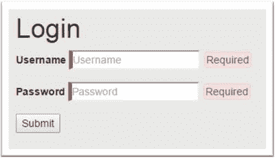
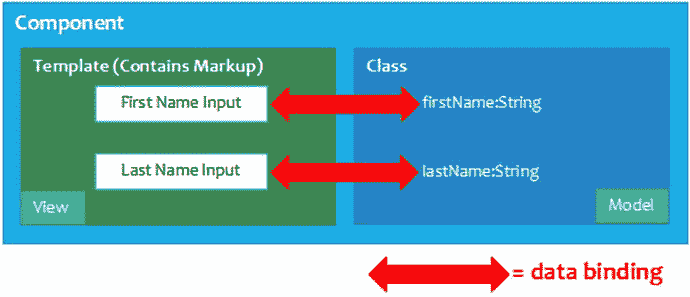
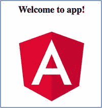
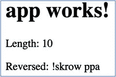
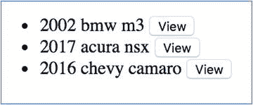
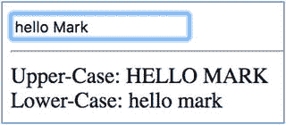

# 8.组件介绍

Angular组件类似于 AngularJS 控制器。组件基本上是标记、元数据和一个类(包含数据和代码),它们组合在一起创建一个 UI 小部件。组件是我们用来构建交互式 UI 的主要工具。所有Angular应用都有一个根组件，通常称为应用组件。

Angular 为组件之间传递数据和响应彼此的事件提供了方法。我们将在第 [12](12.html) 章讨论组件输入和输出。

您可以编写一个组件，并在其他几个组件中将它作为子组件使用——出于这个目的，它们被设计为自包含和松散耦合的。每个组件都包含关于自身的有价值的数据:

*   它需要什么数据作为输入
*   它可能向外界发射什么事件
*   怎么画自己
*   它的依赖关系是什么

通常当你开发组件时，三个文件中的每一个都有一个组件，因为一个组件有三个部分:模板、类和样式。默认情况下，CLI 就是这样工作的。例如，当您使用命令`ng new [project name]`在 CLI 中创建一个应用时，CLI 会为该应用组件生成三个文件(如果您包括. spec.ts 测试文件，则会生成更多文件):

*   app.component.css:样式
*   app.component.html:模板
*   应用组件:类

然而，这不是你唯一的选择。以下是更多选项:

*   将样式包含在。ts 类文件:这被称为内联样式，它使你不必为组件准备一个样式文件。如前一章所述，使用 CLI `--inline-style`参数生成具有内联样式的组件。
*   将模板包含在。ts 类文件:这被称为内联模板，它使你不必为组件准备模板文件。如前一章所述，使用 CLI `--inline-template`参数生成具有内联样式的组件。
*   在同一个文件中包含多个组件类:您可以在同一个文件中组合多个组件，如下所示:

```ts
import { Component } from '@angular/core';

@Component({
  selector: 'Paragraph',
  template: `
  <p><ng-content></ng-content></p>
  `,
  styles: ['p { border: 1px solid #c0c0c0; padding: 10px }']
})
export class Paragraph {
}

@Component({
  selector: 'app-root',
  template: `
  <p>
  <Paragraph>Lorem ipsum dolor sit amet, consectetur adipiscing elit. </Paragraph>
  <Paragraph>Praesent eget ornare neque, vel consectetur eros. </Paragraph>
  </p>
  `,
  styles: ['p { border: 1px solid black }']
})
export class AppComponent {
  title = 'welcome to app!';
}

```

您可能会在同一个文件中找到包含多个组件的代码示例。这样做是有意的，以便您可以将更多的代码复制并粘贴到更少的文件中。

当您在应用中使用组件时，您需要确保每个组件都在模块中声明。第 9 章更详细地介绍了模块。以下是声明两个组件的模块示例:AppComponent 和 Paragraph:

```ts
import { AppComponent, Paragraph } from './app.component';

@NgModule({
  declarations: [
    AppComponent,
    Paragraph
  ],
  imports: [
    BrowserModule,
    FormsModule,
    HttpModule
  ],
  providers: [],
  bootstrap: [AppComponent]
})
export class AppModule { }

```

## 组件的剖析

注释提供了将所有部分组合成一个组件的元数据。模板通常是 HTML 标记，用于在浏览器中呈现组件，即模型-视图-控制器(MVC)中的视图。它可以包含嵌套组件的标记。一个类有添加元数据的注释并包含数据(was`$scope`)——MVC 中的模型。它包含行为代码 MVC 中的控制器。

### @组件注释

注释位于类的顶部附近，是类中最重要的元素。这是一个将类标记为组件并接受对象的函数。它使用对象向 Angular 提供关于组件以及如何运行它的元数据。注释也称为装饰器。

如果您使用 CLI 生成一个项目，并检查生成的组件 app.component.ts，您将看到下面的`@Component`注释:

```ts
@Component({
  selector: 'app-root',
  templateUrl: './app.component.html',
  styleUrls: ['./app.component.css']
})

```

表 [8-1](#Tab1) 显示了可以添加到`@Component`注释中的基本元素。

表 8-1

Basic Elements for the @`Component` Annotation

<colgroup><col align="left"> <col align="left"></colgroup> 
| 注释元素 | 笔记 |
| :-- | :-- |
| `selector` | 该组件对应的标记、元素。 |
| `template/templateUrl` | 指定包含组件标记的模板。您有两种选择:您可以使用`template`在引号块中指定内联模板。这对简单的模板非常有用。或者您可以使用`templateUrl`来指定外部模板文件的相对路径。这对于更大或更复杂的模板更好。如果模板长度超过 10 行，我通常会将其放在外部模板文件中。 |
| `styles/styleUrls` | 指定模板标记的 CSS 信息。您有两种选择:您可以使用`styles`来指定一个内联样式数组。这对于一些样式定义来说非常有用。或者您可以使用`styleUrls`来指定样式定义文件的相对路径数组。当你使用多种风格时，这样更好。如果组件中使用的样式超过 5 种，我通常会将它们放在一个外部样式文件中。 |

`selector`语法类似于 JQuery 选择器，如表 [8-2](#Tab2) 所示。

表 8-2

`selector` Syntax

<colgroup><col align="left"> <col align="left"> <col align="left"> <col align="left"></colgroup> 
| 类型 | 例子 | 所选标记的示例 | 笔记 |
| :-- | :-- | :-- | :-- |
| 名字 | `welcome` | `<welcome></welcome>` | 这是使用选择器最常见的方式。只要确保这个标签是唯一的，并且永远不会被 HTML 使用。为您的项目和其中的所有组件使用一个公共前缀通常是一个好主意。例如，奖励计划项目可以有前缀`rp_`。 |
| 身份 | `#welcome` | `<div id="welcome"></div>` |   |
| CSS 类 | `.welcome` | `'<div class="welcome"></div>` |   |

#### 选择器和 DSL

在 Angular 中，您可以创建映射到特定标签(或属性)的 can 组件和指令。例如，如果你正在创建一个销售汽车的应用，你可以像这样使用标签和属性:`<CarSearch></CarSearch>`、`<CarList></CarList>`、`<CarDetail></CarDetail>`等等。实际上，通过Angular组件和指令，我们正在为我们的应用创建 DSL(特定领域语言)。DSL 是一种专用于特定应用领域的计算机语言。DSL 非常强大，因为它们允许代码特定于应用的领域(它的使用),并以语言形式表示所代表的业务实体。

#### 其他元素

表 [8-3](#Tab3) 显示了你可以添加到`@Component`注释中的其他更高级的元素。我们将在后面详细讨论其中的许多内容。

表 8-3

Advanced Elements

<colgroup><col align="left"> <col align="left"></colgroup> 
| 注释元素 | 笔记 |
| :-- | :-- |
| `animations` | 该组件的动画列表 |
| `changeDetection` | 此组件使用的更改检测策略 |
| `encapsulation` | 此组件使用的样式封装策略 |
| `entryComponents` | 动态插入到该组件视图中的组件列表 |
| `exportAs` | 在模板中导出组件实例时使用的名称 |
| `hosts` | 将类属性映射到事件、属性和特性的宿主元素绑定 |
| `Inputs` | 要作为组件输入进行数据绑定的类属性名称列表 |
| `interpolation` | 此组件模板中使用的自定义插值标记 |
| `moduleId` | 定义该组件的文件的 ES/CommonJS 模块 ID |
| `outputs` | 公开其他人可以订阅的输出事件的类属性名称列表 |
| `providers` | 此组件及其子组件可用的提供程序列表 |
| `queries` | 配置可以注入组件的查询 |
| `viewProviders` | 此组件及其视图子级可用的提供程序列表 |

### 组件模板

该模板包含在 web 浏览器中显示组件的标记代码。关于组件模板的信息由注释提供。

#### 模板位置

模板标记可以包含在与`Component`类相同的文件中，也可以包含在单独的文件中:

以下是@ `Component`注释中内嵌的模板标记:

```ts
@Component({
  selector: 'app-root',
  template: `
  <div class="app">
  [app]
  <app-customer-list>
  </app-customer-list>
  </div>
  `,
  styles: ['.app {background-color:#d5f4e6;margin:10px;padding:10px;}']
})

```

下面是包含在一个单独文件中的模板标记:

```ts
@Component({
  selector: 'app-root',
  templateUrl: './app.component.html',
  styleUrls: ['./app.component.css']
})

```

#### 脚本标签

组件模板中不允许使用`<script>`标记。为了消除脚本注入攻击的风险，这是被禁止的。实际上，`<script>`被忽略，浏览器控制台中会出现一条警告。

换句话说，永远不要这样做:

```ts
import { Component } from '@angular/core';

@Component({
  selector: 'app-root',
  template: `
  <h1>
    {{title}}
  </h1>
  <script>
    alert('app works');
  </script>
  `,
  styles: []
})
export class AppComponent {
  title = 'welcome to app!';
}

```

#### Elvis 操作员

该操作员也被称为“安全导航操作员”。

Angular 经常出现空值问题，尤其是模板表达式。通常你会有一个模板突然停止工作，因为你添加的代码引用了一个未初始化的变量。例如，假设我们有一个为空的对象`x`，我们有以下代码:

```ts
Total {{x.totalAmt}}

```

这将导致 JavaScript 和 Zone 问题(稍后会有更多关于 Zone 的内容)，您的组件将突然无法呈现。我希望我每次遇到这种事都能得到一块钱。

幸运的是，“猫王”接线员帮助了我们。简单来说，Elvis 操作符就是模板表达式中可能为空的变量旁边的一个问号。一旦发现该变量为空，Elvis 操作符就告诉代码退出，留下一个空白。这将停止对属性的评估，并绕过 JavaScript 问题:

```ts
Total {{x?.totalAmt}}

```

有时在模板表达式中需要多个 Elvis 运算符:

```ts
Total {{x?.amt?.total}}

```

### 组件样式

样式包含更改组件样式所需的 CSS 规则。关于组件模板的信息由`style`注释提供。您可以在元件或外部文件中指定元件的样式。创建 Angular CLI 项目时，其样式文件在。angular-cli.json 文件。

样式可以包含在与`Component`类相同的文件中，也可以包含在单独的文件中。

以下是@ `Component`注释中内联包含的样式标记:

```ts
@Component({
  selector: 'app-root',
  template: `
  <div class="app">
  [app]
  <app-customer-list>
  </app-customer-list>
  </div>
  `,
  styles: ['.app {background-color:#d5f4e6;margin:10px;padding:10px;}']
})

```

下面是包含在一个单独文件中的样式标记:

```ts
@Component({
  selector: 'app-root',
  templateUrl: './app.component.html',
  styleUrls: ['./app.component.css']
})

```

### 组件类

此 TypeScript 类包含组件的数据和代码。数据包含在变量中，变量可以绑定到模板中的 HTML 标记。代码可以响应用户事件(比如单击按钮)或者调用自身来开始做事情。

别担心，这只是一个介绍——我们将在第 [12](12.html) 章更详细地讨论组件类。

MVC: Model View Controller

MVC 是一种编写程序的方式，主要用于在计算机上实现用户界面。它将给定的软件应用分成三个相互联系的部分:模型(数据)、视图(用户看到的)和控制器(更新模型的命令)。在 Angular 的上下文中，可以说模型是`Component`类中的数据，视图是组件模板，控制器可以是`Component`类中的代码。

## 数据绑定简介

数据绑定是 Angular 如此受欢迎的原因——组件 UI 小部件的元素与组件类中的数据的同步，反之亦然，由 Angular 为您管理。您在组件类中设置变量来存储数据，并在组件模板中编辑 HTML 来添加数据绑定。现在，您的 HTML 不再是静态的—它会随着您的数据而变化！如果您希望您的组件与用户交互，您必须在其中使用数据绑定。

就 MVC 而言，在运行时 Angular 使用变化检测来确保组件视图总是反映组件模型。使用数据绑定，您可以通过更改变量来控制组件的用户界面，并且可以接受用户输入，允许他们更改某些变量的值。数据绑定可以控制用户界面的每个方面:隐藏东西、关闭东西、显示结果、接受用户输入等等。它非常强大而且易于使用。

### 示例:登录组件中的数据绑定

假设你有一个带有两个字段的登录表单，如图 [8-1](#Fig1) 所示。每个字段在组件模板的 HTML 中都有一个文本框，每个字段在`Component`类中都有一个对应的实例变量。文本框和实例变量相互绑定。如果有人输入用户名，`username`实例变量会用新值更新。当开发人员编写提交按钮时，他们从实例变量中获得用户名和密码，而不是从 HTML 中提取它们。



图 8-1

Login form with two fields

### 示例:数据绑定和客户数据输入

您可以拥有一个表单，该表单允许您使用字段输入客户信息。每个字段在组件模板的 HTML 中都有一个文本框，每个字段在`Component`类中都有一个对应的实例变量。Angular数据绑定使您能够在用户向 HTML 字段输入信息时自动更新实例变量。它还使您能够在更改实例变量的值时自动更新 HTML 字段，以及在用户向文本框中键入内容时自动更新实例变量。当开发人员想要默认输入字段的值时，他们需要做的就是设置实例变量值。HTML 文本框将自动更新。

有两种主要类型的数据绑定—单向和双向:



图 8-2

Two-way data binding

1.  单向数据绑定:当模板(视图)自动与类实例变量(模型)中的最新值保持同步时，就会出现这种情况。更新只向一个方向流动。当类实例变量(模型)自动与从模板(视图)输入的值保持同步时，也会发生单向数据绑定。更新仍然是单向的。
2.  双向数据绑定:这是类实例变量(模型)和模板(视图)互相保持最新的时候。更新流向两个方向，如图 [8-2](#Fig2) 所示。

## 单向数据绑定

本节重点介绍 Angular 中单向数据绑定的各个方面。

### 与{{和}}的单向数据绑定

那些双花括号也被称为小胡子或插值。双花括号用于单向绑定模板表达式，根据模型中的可用数据进行计算，并将其包含在视图中。表达式产生一个值，它包含在视图中(来自组件模板的标记)。模型——即`Component`类中的数据——从不更新。

模板表达式通常是一个简单的 JavaScript 表达式。通常模板表达式只是模型中一个属性的名称(即`Component`类中的一个实例变量)。Angular 用属性的字符串值(实例变量的字符串值)替换该属性名称。

有时模板表达式会变得更复杂。Angular 试图对表达式(可以包含数学、属性名、方法调用等等)求值，并将求值结果转换为字符串。然后用结果替换内容和花括号。

以下是花括号和模板表达式的一些示例:

*   `{{2+2}}`
*   `{{firstName}}`
*   `{{1 + 1 + getVal()}}`

### 单向数据绑定:示例代码组件-ex100

下面的讨论将是关于示例组件-ex100:

1.  使用 CLI 构建应用:输入以下命令，这将在一个名为 Start 的文件夹中创建一个新的 Angular 应用，还将创建并输出大量文件:

    ```ts
    ng new components-ex100 --inline-template --inline-style

    ```

2.  开始`ng serve`:使用以下代码:

    ```ts
    cd components-ex100
    ng serve

    ```

3.  Open app: Launch your web browser and browse to localhost:4200\. You should see the text “welcome to app!” as shown in Figure [8-3](#Fig3). That means your project is running.

    

    图 8-3

    Your project is running  
4.  编辑组件:编辑文件 src/app/app.component.ts，并将其更改为:

    ```ts
    import { Component } from '@angular/core';

    @Component({
      selector: 'app-root',
      template: `
      <h1>
        {{title}}
      </h1>
      <p>
        Length: {{title.length}}
      </p>
      <p>
        Reversed: {{getReversed(title)}}
      </p>
      `,
      styles: []
    })
    export class AppComponent {
      title = 'welcome to app!';

      getReversed(str: string){
        let reversed = '';
        for (let i=str.length-1;i>=0;i--){
          reversed += str.substring(i,i+1);
        }
        return reversed;
      }
    }

    ```

你的应用应该工作在本地主机:4200。请注意模板如何使用两个表达式:一个显示标题的长度，另一个使用类中的方法反转标题。



### 使用[ and ]或*的单向数据绑定

方括号可用于单向绑定。通过这些，您可以绑定一个模板表达式，根据模型中的可用数据进行计算，并将其包含在数据绑定目标中。

您也可以使用前缀`*`来代替双方括号:

```ts
[Data Binding Target] = "Template Expression"

```

或者:

```ts
*Data Binding Target = "Template Expression"

```

数据绑定目标是 DOM 中的一些东西(包括元素属性、组件属性和指令属性)，可以绑定到目标右侧的表达式的结果，如表 [8-4](#Tab4) 所示。

表 8-4

Data Binding Target Markup

<colgroup><col align="left"> <col align="left"></colgroup> 
| 利润 | 描述 |
| :-- | :-- |
| `` | 将图像源设置为模型中的属性`imageUrl`。 |
| `<div [ngClass] = "{selected: isSelected}"></div>` | 根据模型中的属性`isSelected`设置 CSS 类。 |
| `<car-detail [car]="selectedCar"></car-detail>` | 将模型中`car-detail`的`car`属性设置为属性`selectedCar`。`car-detail`可以是一个组件，它会使用`car`属性将信息从当前模板传递给那个组件。 |
| `<button [style.color] = "isSpecial ? 'red' : 'green'">` | 根据模型中的属性`isSpecial`设置`button`颜色。 |

模板表达式用于根据模型中的可用数据计算值。

### 单向数据绑定:示例代码组件-ex200

下面的讨论将是关于示例组件-ex200:

1.  使用 CLI 构建应用:输入以下命令:

    ```ts
    ng new components-ex200 --inline-template --inline-style

    ```

2.  开始`ng serve`:使用以下代码:

    ```ts
    cd components-ex200
    ng serve

    ```

3.  打开应用:启动 web 浏览器，浏览到 localhost:4200。您应该看到文本“欢迎使用应用！”
4.  编辑组件:编辑文件 src/app/app.component.ts，并将其更改为:

    ```ts
    import { Component } from '@angular/core';

    @Component({
      selector: 'app-root',
      template: `
      <h1>Doesnt work:</h1>
      
      <h1>Works:</h1>
      
      `,
      styles: []
    })
    export class AppComponent {
      starUrl = 'https://developer.mozilla.org/samples/cssrimg/starsolid.gif';
    }

    ```

你的应用应该工作在本地主机:4200。注意以下事项(并参见图 [8-4](#Fig4) ):


图 8-4

Author please add caption

*   第一个图像标签失败，因为它没有换行`src`。它从字面上理解`startUrl`,而不是从一个实例变量中将它作为一个表达式来计算。
*   第二个 image 标签可以工作，因为它将`src`放在方括号中，这意味着这是一个需要计算`startUrl`实例变量的值的表达式。

有时，您需要在模板生成的 HTML 元素中动态创建属性。如果您希望在 HTML 中包含数据，稍后可以使用 JavaScript 代码提取这些数据，这将非常有用。例如:

```ts
<li
  id="12345"
  data-make="bmw"
  data-model="m3"
  data-parent="cars">
...
</li>

```

在这种情况下，`id`标签用于标识元素(对 JavaScript 和 CSS 非常有用)，还有各种存储信息的数据元素。

在 Angular 中，你可以使用`[attr.***name***]`语法在生成的 HTML 中设置属性。

### 单向数据绑定:示例代码组件-ex250

这个组件会列出一些汽车，让你点击查看按钮查看一篇关于汽车的文章，如图 [8-5](#Fig5) 所示。



图 8-5

Component that lists cars

该组件有趣的地方在于它在每个`<li>`元素中存储属性数据。这将是关于示例组件-ex250:

1.  使用 CLI 构建应用:输入以下命令:

    ```ts
    ng new components-ex250 --inline-template --inline-style

    ```

2.  开始`ng serve`:使用以下代码:

    ```ts
    cd components-ex250
    ng serve

    ```

3.  打开应用:打开 web 浏览器，浏览到 localhost:4200。您应该看到文本“欢迎使用应用！”这意味着您的项目正在运行。
4.  编辑组件:编辑文件 src/app/app.component.ts，并将其更改为:

    ```ts
    import { Component } from '@angular/core';
    import { Car } from './car';
    @Component({
      selector: 'app-root',
      template: `
        <ul>
          <li *ngFor="let car of _cars">
            <span [attr.id]="car.id" [attr.data-desc]="car.make + ' ' + car.model" [attr.data-article]="car.article">
              {{car.year}}&nbsp;{{car.make}}&nbsp;{{car.model}}&nbsp;<button (click)="showCar($event)">View</button></span>
          </li>
        </ul>
      `,
      styles: []
    })
    export class AppComponent {
      _cars = [
        new Car('car1', 2002, 'bmw', 'm3', 'https://en.wikipedia.org/wiki/BMW_M3'),
        new Car('car2', 2017, 'acura', 'nsx', 'https://en.wikipedia.org/wiki/Honda_NSX'),
        new Car('car3', 2016, 'chevy', 'camaro', 'https://en.wikipedia.org/wiki/Chevrolet_Camaro')
      ];

      showCar(event){
        const desc = event.target.parentElement.dataset.desc;
        if (window.confirm('If you click "ok" you would be redirected to an article about the ' +
            desc + '. Cancel will load this website '))
          {
          window.location.href=event.target.parentElement.dataset.article;
          };
      }
    }

    ```

5.  创建类:创建文件 src/app/car.ts，并将其更改为:

    ```ts
    export class Car {
        constructor(
            private _id: string,
            private _year: number,
            private _make: string,
            private _model: string,
            private _article: string){
        }

        public get id() : string {
            return this._id;
        }

        public get year() : number {
            return this._year;
        }

        public get make() : string {
            return this._make;
        }

        public get model() : string {
            return this._model;
        }

        public get article() : string {
            return this._article;
        }

    }

    ```

您已经到达练习的末尾。请注意以下几点:

*   `desc`数据属性是如何产生的:

    ```ts
    [attr.data-desc]="car.make + ' ' + car.model"

    ```

*   如何使用 JavaScript 获取`desc`数据属性:

    ```ts
    const desc = event.target.parentElement.dataset.desc;

    ```

## 双向数据绑定

本节重点介绍双向数据绑定。

### 使用[(和)]的双向数据绑定

`[()]`又称盒中香蕉。实际上，你已经看过了。`[(`和`)]`格式用于双向绑定属性——换句话说，从模型中读取和写入属性。格式如下:

```ts
[(Data Binding Target)] = "Property"

```

“数据绑定目标”是 DOM(包括`Component`和`Directive`标签)中可以绑定到目标右侧表达式的属性的东西。对于输入框，数据绑定目标是`ngModel`，它对应于输入框中的文本。

这是模型中的一个属性(`Component`类中的一个实例变量)。

### 双向数据绑定:示例代码组件-ex300

这是一个在用户改变输入时改变前景色和背景色的组件，如图 [8-6](#Fig6) 所示:

1.  使用 CLI 构建应用:输入以下命令:

    ```ts
    ng new components-ex300 --inline-template --inline-style

    ```

2.  开始`ng serve`:使用以下代码:

    ```ts
    cd components-ex300
    ng serve

    ```

3.  打开应用:打开 web 浏览器，浏览到 localhost:4200。您应该看到文本“欢迎使用应用！”这意味着您的项目正在运行。
4.  编辑模块:编辑文件 src/app/app.module.ts，并将其更改为:

    ```ts
    import { BrowserModule } from '@angular/platform-browser';
    import { NgModule } from '@angular/core';

    import { AppComponent } from './app.component';
    import { FormsModule } from '@angular/forms';

    @NgModule({
      declarations: [
        AppComponent
      ],
      imports: [
        BrowserModule,
        FormsModule
      ],
      providers: [],
      bootstrap: [AppComponent]
    })
    export class AppModule { }

    ```

5.  Edit component: Edit the file src/app/app.component.ts and change it to the following:

    

    图 8-6

    Changing foreground and background colors

    ```ts
    import { Component } from '@angular/core';

    @Component({
      selector: 'app-root',
      template: `
      <p>
      Foreground: <input [(ngModel)]="fg" />
      </p>
      <p>
      Background: <input [(ngModel)]="bg" />
      </p>
      <div [ngStyle]="{'color': fg, 'background-color': bg, 'padding': '5px'}">
      Test
      </div>
      `,
      styles: []
    })
    export class AppComponent {
      fg = "#ffffff";
      bg = "#000000";
    }

    ```

你的应用应该工作在本地主机:4200。当用户更改颜色值时，这会更新模型，然后更新模板的 HTML:

*   从输入字段到模型发生绑定(当用户改变颜色值时)。当输入字段改变时，模型更新以匹配。
*   从模型到模板的 HTML 发生绑定。当模型更新时，模板的 HTML 也随之更新。

## 事件处理

用户界面需要响应用户输入。这就是为什么我们在组件模板中有事件处理。我们指定一个目标事件，以及当该事件发生时应该发生哪个语句。格式是这样的:

```ts
(Target Event) = "Template Statement"

```

“目标事件”是括号中事件的名称。“模板语句”是关于目标事件发生时该做什么的指令。通常，这是对`Component`类中的一个方法的调用，该方法执行某些操作——通常，修改绑定到模板的实例变量，导致 UI 发生变化。事件信息在`$event`变量中可用，它可能被利用也可能不被利用。例如，如果您正在观察文本框中的输入，您可以使用来自`$event`的信息将文本框中的文本值传递给该方法。您将在下一个示例中看到这一点。

## 事件处理:示例代码组件-ex400

该组件接受文本框中的输入，捕获输入事件，并以大写和小写显示输入，如图 [8-7](#Fig7) 所示:

1.  使用 CLI 构建应用:输入以下命令:

    ```ts
    ng new components-ex400 --inline-template --inline-style

    ```

2.  开始`ng serve`:使用以下代码:

    ```ts
    cd components-ex400
    ng serve

    ```

3.  打开应用:启动 web 浏览器并导航到 localhost:4200。你应该看到“欢迎使用 app！”
4.  Edit class: Edit app.component.ts and change it to the following:

    

    图 8-7

    Displaying the input

    ```ts
    import { Component, AfterViewInit, ViewChild } from '@angular/core';

    @Component({
      selector: 'app-root',
      template: `
      <input #input type="text" (input)="textInput($event)" value=""/>
      <hr>
      Upper-Case: {{upperCase}}
      <br/>
      Lower-Case: {{lowerCase}}

      `,
      styles: []
    })
    export class AppComponent implements AfterViewInit{
      upperCase: string= '';
      lowerCase: string = '';
      @ViewChild('input') inputBox;

      textInput(event){
        this.upperCase = event.target.value.toUpperCase();
        this.lowerCase = event.target.value.toLowerCase();
      }

      ngAfterViewInit() {
        this.inputBox.nativeElement.focus()
      }
    }

    ```

你的应用应该工作在本地主机:4200。请注意以下几点:

*   模板变量`#input`和`viewChild`用于获取对输入框的引用。在视图初始化之后(生命周期方法`ngAfterViewInit`被触发)，焦点被设置到输入框。
*   该模板使用下面的代码来监听`input`事件，当事件发生时触发方法`textInput`(传入事件对象):

    ```ts
    (input)="textInput($event)"

    ```

*   该类有一个由`input`事件触发的方法`textInput`。它计算用户输入的大写和小写版本，并将其设置为从类绑定(单向)到模板的实例变量。

## CDK

Angular CDK(组件开发套件)于 2017 年与 Angular 5 一起发布。其目的是使开发人员能够创建高质量的Angular定制组件。CDK 包含服务、指令、组件、类和模块。CDK 包含组件可访问性、文本方向性、平台检测和动态组件实例化的代码。如果你真的想开始构建自己的定制可重用组件库，那么你需要安装“@angular/cdk”节点模块并开始。

## 摘要

本章涵盖了一些重要的概念，所以我强烈建议在继续学习之前先学习这些例子。阅读完本章后，你应该对组件有一些基本的了解，包括它们是由什么组成的。您还知道组件由注释、模板和类组成。我们还讨论了事件处理。

既然我们可以编写用户界面组件，我们将在下一章把注意力转向模块化我们的Angular代码。如果您还没有完全理解组件，请不要担心——后面的章节将会详细介绍。