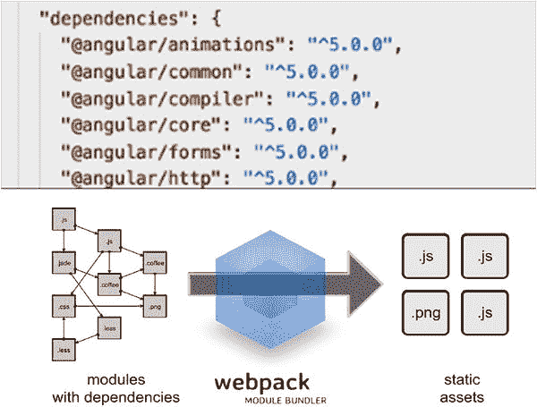
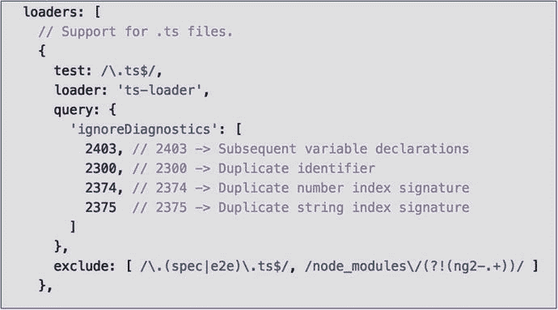

# 10.介绍 Webpack

如今，你可以在现代浏览器中做更多的事情，这在未来会增加更多。多亏了 Angular 5 这样的技术，页面重载会更少，每个页面会有更多的 JavaScript 代码，客户端会有很多代码。您需要一种方法来有效地部署所有这些代码，以便快速加载。

复杂的客户端应用可能包含模块，有些模块可以同步加载，有些可以异步加载。因此，我们如何打包并最有效地部署它–我们使用 Webpack！

## Webpack 和 Angular CLI

Angular CLI 使用 Webpack 来传输、编译和部署项目代码。默认情况下，它还使用 webpack-dev-server 作为它的 web 服务器。在这一章的后面，我会谈到 Webpack 配置和 webpack.config.js。你会在你的项目中寻找它，并注意到它不见了。这是故意的，因为编写 Angular CLI 的人希望隐藏尽可能多的配置细节，以使事情变得更简单，这包括 Webpack 配置。

以下 Angular CLI 命令使 Webpack 配置文件可用:

```ts
ng eject

```

但是，使用这个命令时要小心，因为可能会有一些意想不到的副作用。参见 [`https://github.com/angular/angular-cli/wiki/eject`](https://github.com/angular/angular-cli/wiki/eject) 和 [`http://stackoverflow.com/questions/39187556/angular-cli-where-is-webpack-config-js-file-new-2017-feb-ng-eject`](http://stackoverflow.com/questions/39187556/angular-cli-where-is-webpack-config-js-file-new-2017-feb-ng-eject) 了解更多关于这个主题的信息。

Webpack 是一个模块捆绑器。它获取具有依赖关系的模块，并生成表示这些模块的静态资产。图 [10-1](#Fig1) 所示。



图 10-1

Webpack generates static assets representing modules

## 模块和依赖关系

如果您使用 Node 进行开发，Webpack 将读取您的节点配置文件 packages.json，并自动将您的依赖项作为静态资产包含在构建中。这消除了配置模块加载和部署的痛苦——您不需要解决任何问题。我在参与的每个 Angular 5 项目中都使用了 Webpack，因为它让生活变得更简单。

Webpack 适用于大型项目，因为它支持开发和生产模式。开发模式可以利用像 JavaScript 这样的非最小化资产，使您的应用可以在这种模式下进行调试。生产模式可以使用最少的资产，因此占用空间更小。

您的代码库可以分成多个块，这些块可以按需加载，从而减少应用的初始加载时间。结果:更快的装载时间。作为一名开发人员，您还可以控制这些块的配置(稍后将详细介绍)。

开发过程是这样的:

1.  编写项目代码。
2.  将 Webpack 作为构建过程的一部分运行(或者通过 CLI 为您运行)。
3.  构建完成后，您的静态资产就可以部署到服务器上了。

## 安装和配置 Webpack

如果您正在使用 CLI，则不需要安装 Webpack。Webpack 在节点下运行。但是如果您想单独试验 Webpack，您可以使用下面的命令来安装它(从项目的根文件夹中):

```ts
npm install webpack -g

```

如果您运行前面提到的`ng eject`命令，您的 Webpack 选项将包含在项目根文件夹的 webpack.config.js 文件中。在该文件中，您会发现以下内容:

*   输出路径:您可以指定捆绑资产的放置位置——输出路径。
*   入口点:你的应用可以在不同的地方使用不同的代码启动。Webpack 将打包用于部署的代码，以便它可以从这些不同的代码开始，但共享公共的打包块。
*   Loaders: A loader is a Node function that takes a type of file and converts files of this type into a new source for bundling (see Figure [10-2](#Fig2)). Loaders are Node packages used by Webpack.

    

    图 10-2

    Loaders
*   Plugins: I use the CommonsChunk plugin in the book’s example project to split our code into deployable chunks that can be loaded separately. The CommonsChunk plugin checks which chunks of code (modules) you use the most and puts them in a file. This gives you a common file that has the CSS and JavaScript needed by every page in your application.

    

图 10-3 中的代码用于创建以下内容:

*   app.js
*   app.map
*   common.js
*   common.map
*   供应商. js
*   供应商.地图

## 摘要

这个简短的章节向您介绍了 Webpack 的基础知识。Webpack 为开发人员提供了惊人的控制能力，我们可以花大量的时间来研究它的可配置性。

但是我们需要继续学习 Angular。第 11 章介绍了另一个非常重要的元素:指令。