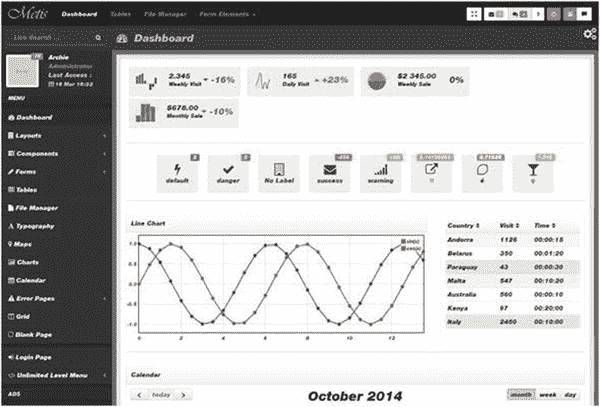
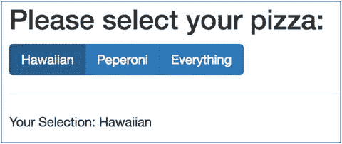
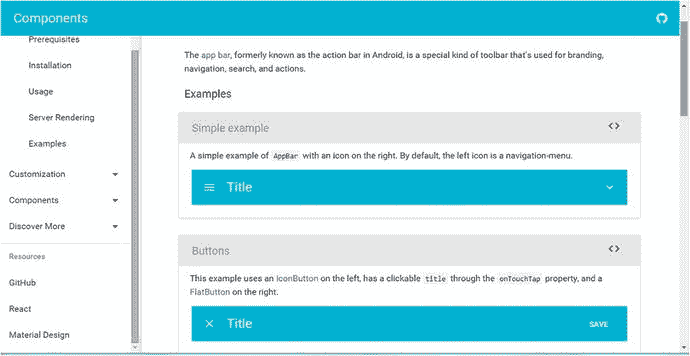
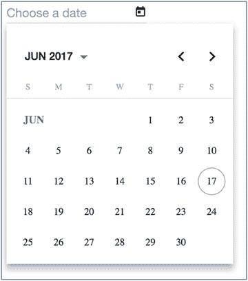

# 14.Angular和 UI 小部件

Angular 是许多新 JavaScript 应用的核心。但是，你需要把 Angular 和一个前端 UI 框架耦合起来，比如 Bootstrap 或者 Material Design。在这一章中，我首先介绍 Bootstrap，因为它是目前两者中比较常见的，然后我将讨论材料设计。

## 将 UI 小部件库与 Angular 一起使用

您可以通过两种方式使用 UI 小部件库:

*   前Angular方式:以正常方式使用 HTML 标记和 JavaScript。
*   使用自定义标记指令。您利用第三方定制组件和指令模块来生成 UI 小部件 HTML 标记。

### 预Angular方式

您可以使用 HTML 和 JavaScript 创建组件，这些组件的样式与您在 JQuery 或另一个早期的 JavaScript 库中使用的样式相同。

当然，HTML 是一种标记语言，也是 web 上最常见的文档格式。标记语言注释文档。包括 HTML 在内的一些标记语言有确定如何显示结构化数据的规范，它告诉计算机如何显示某些内容。在 Angular 中，我们编写动态用户界面，Angular 组件使用 HTML 标记来告诉计算机如何显示事物。

标记在模板中，模板在组件的`@Component`注释中指定。它有时也在`@View`注释中指定(稍后会详细介绍)。

### 棱角分明的方式

您可以使用预构建和样式化的Angular组件和指令的模块来创建组件，这些组件作为一个模块交付，以便您可以重用它们。这是一个组件对象(就像你在前面章节中写的那些)和指令的模块，使你能够使用标签来创建一个引导 UI。这需要您使用其他人的代码，但是通过提供预构建的组件和使用它们的指令，可以节省您的时间。第 [11 章](11.html)涵盖指令。

在这一章(和其他章节)中，我使用了 ng2-bootstrap 模块( [`http://valor-software.github.io/ng2-bootstrap/`](http://valor-software.github.io/ng2-bootstrap/) )，这是 Angular 的一个 bootstrap 实现。

## 使用 NgBootstrap 时的预Angular与Angular

图 [14-1](#Fig1) 显示了一个常见的 UI 元素:选项卡。我们将在有和没有 ng2-bootstrap 模块的情况下为同一个选项卡编写 HTML 标记。


图 14-1

Common UI element: a tab

以下是使用 HTML、CSS 和 JavaScript 的预Angular方法:

```ts
<div class="tabbable tabs-left" style="margin-top: 100px;">
  <ul class="nav nav-tabs">
    <li class="active"><a href="#pane1" data-toggle="tab" rel="popover" id="tab">Homee</a></li>
    <li><a href="#pane2" data-toggle="tab" title="blah blah" id="tab1">Profile</a></li>
    <li><a href="#pane3" data-toggle="tab" id="tab2">Messages</a></li>
    <li><a href="#pane4" data-toggle="tab">Settings</a></li>
  </ul>
  <div class="tab-content">
    <div id="pane1" class="tab-pane active">...</div>
    <div id="pane2" class="tab-pane">...</div>
    <div id="pane3" class="tab-pane">...</div>
    <div id="pane4" class="tab-pane">...</div>
  </div>
</div>

```

这是 ng2 自举模块的Angular:

```ts
<ngb-tabset>
  <ngb-tab title="Home">
    <ng-template ngbTabContent>
      ...
    </ng-template>
  </ngb-tab>
  <ngb-tab title="Profile">
    <ng-template ngbTabContent>
      ...
    </ng-template>
  </ngb-tab>
  <ngb-tab title="Messages">
    <ng-template ngbTabContent>
      ...
    </ng-template>
  </ngb-tab>
  <ngb-tab title="Settings">
    <ng-template ngbTabContent>
      ...
    </ng-template>
  </ngb-tab>
</ngb-tabset>

```

该模块使代码更小。注意它调用标签`ngb-tab` s 而不是`div` s。

## 引导程序

Bootstrap 是一个开源的工具组，拥有 HTML 和 CSS 设计模板，用于表单、按钮、排版和导航等界面元素，以及可选的 JavaScript 扩展。Bootstrap 使开发动态网站和 web 应用变得更加容易。它兼容大多数浏览器的最新版本，包括 Firefox、Internet Explorer、Google Chrome、Opera 和 Safari，但不是在所有平台上。

Bootstrap 及更高版本还支持响应式 web 设计，它可以根据正在使用的任何设备(无论是手机、平板电脑还是台式机)的特征动态调整网页的布局。从 3.0 版本开始，Bootstrap 拥有移动优先的设计理念，默认采用响应式设计。它提供了一个网格系统，允许开发人员(他们可能缺乏响应性设计方面的技能)编写在所有设备上都同样适用的代码。没有启用响应功能的默认 12 列网格系统使用 940 像素宽的容器。添加了响应 CSS 文件后，网格将变为 724×1170 像素宽，具体取决于您的视口。在 767 像素视口下，列变得流畅并垂直堆叠。

更多关于 Bootstrap 的信息，请访问 [`http://getbootstrap.com`](http://getbootstrap.com) 。图 [14-2](#Fig2) 展示了一个用 Bootstrap 制作的网页。



图 14-2

Web page made with Bootstrap

### 安装 ng 引导程序

ng-bootstrap 是 bootstrap 库的 Angular 版本，您可以使用 Bootstrap 小部件快速构建应用。源代码在 [`https://github.com/ng-bootstrap/ng-bootstrap`](https://github.com/ng-bootstrap/ng-bootstrap) 可用，演示在 [`https://ng-bootstrap.github.io/#/components/accordion/examples`](https://ng-bootstrap.github.io/%23/components/accordion/examples) 可用。

下面是安装 ng-bootstrap 的方法:

1.  以通常的方式使用 CLI 构建应用。
2.  使用 npm 安装 ng-bootstrap 和 bootstrap 模块:

    ```ts
    npm install --save @ng-bootstrap/ng-bootstrap bootstrap

    ```

3.  告诉 CLI 项目使用引导 CSS 文件中的样式。编辑. angular.json 并在 styles 下添加以下条目:

    ```ts
    "../node_modules/bootstrap/dist/css/bootstrap.css",

    ```

4.  编辑你的模块文件(app.module.ts)并将`NgbModule`指定为`import`。这将使`NgbModule`中的代码可用于该Angular模块:

    ```ts
    imports: [
        NgbModule.forRoot(),
        BrowserModule
      ],

    ```

### 引导程序:示例小部件-ex100

该组件允许用户使用一组按钮来选择披萨，这些按钮的作用类似于一组单选按钮，如图 [14-2](#Fig2) 所示。



图 14-3

Selecting a pizza

让我们看一下这个例子:

1.  使用 CLI 构建应用:使用以下命令:

    ```ts
    ng new widgets-ex100 --inline-template --inline-style

    ```

2.  安装`ng-bootstrap`和`bootstrap`:使用以下代码:

    ```ts
    cd widgets-ex100
    npm install --save @ng-bootstrap/ng-bootstrap bootstrap

    ```

3.  将引导程序样式安装到项目中:编辑。angular-cli.json 并在 styles 下添加以下条目:

    ```ts
    "../node_modules/bootstrap/dist/css/bootstrap.css",

    ```

    样式块应该如下所示:

    ```ts
    "styles": [
            "../node_modules/bootstrap/dist/css/bootstrap.css",
            "styles.css"
          ],

    ```

4.  开始`ng serve`:使用该命令:

    ```ts
    ng serve

    ```

5.  打开应用:打开 web 浏览器并导航到 localhost:4200。你应该看到“欢迎使用 app！”
6.  编辑模块:编辑 app.module.ts，修改为:

    ```ts
    import { BrowserModule } from '@angular/platform-browser';
    import { NgModule } from '@angular/core';
    import { FormsModule } from '@angular/forms';
    import { NgbModule } from '@ng-bootstrap/ng-bootstrap';

    import { AppComponent } from './app.component';

    @NgModule({
      declarations: [
        AppComponent
      ],
      imports: [
        NgbModule.forRoot(),
        BrowserModule,
        FormsModule
      ],
      providers: [],
      bootstrap: [AppComponent]
    })
    export class AppModule { }

    ```

7.  编辑类:编辑 app.component.ts，修改为:

    ```ts
    import { Component } from '@angular/core';
    import { NgbModule } from '@ng-bootstrap/ng-bootstrap';

    @Component({
      selector: 'app-root',
      template: `
        <div style="padding:10px">
        <h2>Please select your pizza:</h2>
        <div [(ngModel)]="model" ngbRadioGroup name="radioBasic">
          <label ngbButtonLabel class="btn btn-primary">
          <input ngbButton type="radio" value="Hawaiian"> Hawaiian
          </label>
          <label ngbButtonLabel class="btn btn-primary">
          <input ngbButton type="radio" value="Peperoni"> Peperoni
          </label>
          <label ngbButtonLabel class="btn btn-primary">
          <input ngbButton type="radio" value="Everything"> Everything
          </label>
        </div>
        <hr>
        Your Selection: {{model}}
        </div>
      `,
      styles: []
    })

    export class AppComponent {
      model = 'Hawaiian';
    }

    ```

你的应用应该工作在本地主机:4200。

## 材料设计

材料设计也使用基于网格的布局，如 Bootstrap。它支持快速响应的动画和过渡、填充、深度效果、灯光和阴影。材料具有基于纸张和墨水的颜色。

Polymer 是 web 应用用户界面材料设计的实现。它包含 Polymer library，该库为浏览器和 elements 目录提供了一个 Web 组件 API，包括一个以可视元素为特色的 paper elements 集合。图 [14-4](#Fig4) 显示一个材料设计网页。你可以在 [`www.material-ui.com`](http://www.material-ui.com) 了解更多关于这款产品的信息。



图 14-4

Web page of Material Design

### 安装角形材料

Angular Material 是一个Angular版本的素材库，您可以使用材质组件快速构建应用。源代码可在 [`https://github.com/jelbourn/material2-app`](https://github.com/jelbourn/material2-app) 处获得，示例在此: [`https://material2-app.firebaseapp.com`](https://material2-app.firebaseapp.com) 。

以下是安装角形材料的方法:

1.  以通常的方式使用 CLI 构建应用。
2.  使用 npm 安装Angular材质、Angular动画和 CDK(组件开发工具包)。

    ```ts
    npm install --save @angular/material
    npm install --save @angular/animations
    npm install --save @angular/cdk

    ```

3.  将图标添加到您的项目中，方法是将它们包含在 index.html 文件中:

    ```ts
    <link href="https://fonts.googleapis.com/icon?family=Material+Icons" rel="stylesheet">

    ```

4.  将样式文件 styles.css 重命名为 styles.scss，并将其更改为:

    ```ts
    @import '~@angular/material/prebuilt-themes/deeppurple-amber.css';

    ```

5.  更改对中样式文件的引用。angular-cli.json:

    ```ts
    "styles": [
        "styles.scss"
    ],

    ```

6.  编辑 CLI 生成的模块文件 app.module.ts，确保它导入了小部件模块(如 MdButtonModule、MdCheckboxModule)、动画模块(BrowserAnimationsModule)和 hammerjs:

    ```ts
    import {MdButtonModule, MdCheckboxModule} from '@angular/material';
    import {BrowserAnimationsModule} from '@angular/platform-browser/animations';
    import { hammerjs } from 'hammerjs';

    @NgModule({
      ...
      imports: [MdButtonModule, MdCheckboxModule], [BrowserAnimationsModule]
      ...
    }

    ```

### 棱角分明的材料设计:示例部件-ex200

该组件允许用户使用材料样式的日期选择器弹出窗口选择日期，如图 [14-5](#Fig5) 所示。



图 14-5

Date picker popup

让我们来看看这个例子:

1.  使用 CLI 构建应用:

    ```ts
    ng new widgets-ex200 --inline-template --inline-style

    ```

2.  安装Angular材料，动画和组件开发工具包。

    ```ts
    cd widgets-ex200
    npm install --save @angular/material
    npm install --save @angular/animations
    npm install --save @angular/cdk

    ```

3.  将图标添加到您的项目中，方法是将它们包含在 index.html 文件中:

    ```ts
    <link href="https://fonts.googleapis.com/icon?family=Material+Icons" rel="stylesheet">

    ```

4.  将样式文件 styles.css 重命名为 styles.scss，并将其更改为:

    ```ts
    @import '~@angular/material/prebuilt-themes/deeppurple-amber.css';

    ```

5.  更改对中样式文件的引用。angular-cli.json:

    ```ts
    "styles": [
        "styles.scss"
    ],

    ```

6.  编辑 app.module.ts 并将其更改为以下内容:

    ```ts
    import { BrowserModule } from '@angular/platform-browser';
    import { NgModule } from '@angular/core';
    import { AppComponent } from './app.component';
    import { BrowserAnimationsModule } from '@angular/platform-browser/animations';
    import {FormsModule, ReactiveFormsModule} from '@angular/forms';
    import {
      MatNativeDateModule,
      MatFormFieldModule,
      MatInputModule,
      MatDatepickerModule
    } from '@angular/material';
    @NgModule({
      declarations: [
        AppComponent
      ],
      imports: [
        BrowserModule, BrowserAnimationsModule, MatNativeDateModule, MatFormFieldModule, MatInputModule, MatDatepickerModule
      ],
      providers: [],
      bootstrap: [AppComponent]
    })
    export class AppModule { }

    ```

7.  编辑 app.component.ts 并将其更改为以下内容:

    ```ts
    import { Component } from '@angular/core';

    @Component({
    selector: 'app-root',
    template: `
      <mat-form-field>
      <input matInput [matDatepicker]="picker" placeholder="Choose a date">
      <mat-datepicker-toggle matSuffix [for]="picker"></mat-datepicker-toggle>
      <mat-datepicker #picker></mat-datepicker>
      </mat-form-field>
    `,
    styles: []
    })

    export class AppComponent {
      title = 'app';
    }

    ```

8.  开始`ng serve` :

    ```ts
    ng serve

    ```

9.  打开 web 浏览器，导航到 localhost:4200。您应该会看到应用正在运行。

你的应用应该工作在本地主机:4200。

## 摘要

如果你真的想构建一个完美的 Angular 应用，你应该使用一个预建的小部件库模块。许多应用使用自举和材料。我目前正在开发一个使用 Bootstrap 的应用，它的优势在于提供了一个网格系统，这消除了响应式设计的许多痛苦。

UI 小部件库无疑使用更易维护的标准代码编写漂亮的用户界面变得更加容易。不要浪费你的时间重新发明轮子写你自己的部件库！请记住，您可以在小部件库中设置主题，以便根据您的需求定制它们。