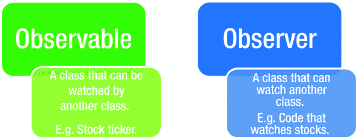
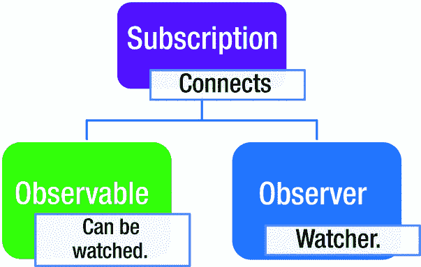
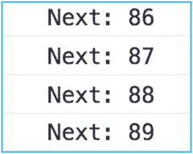
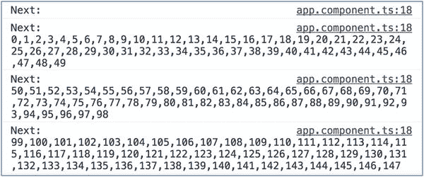
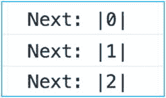
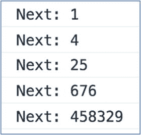
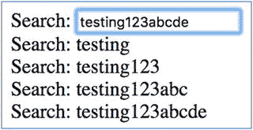
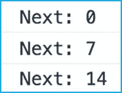
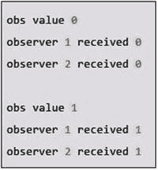

# 十六、观察者、反应式编程和 RxJS

Reactive Extensions for JavaScript(RxJS)是一个 Reactive streams 库，允许您处理异步数据流，它包含在 Angular。该项目是微软与开源开发者社区合作开发的。

本章的目的是介绍 RxJS 的基本概念，并涵盖该库的一些功能。我将在另一章介绍 RxJS 和 Angular 的结合使用。

反应式编程是一种专注于数据流和变化的编程范式。它允许您轻松地表达静态或动态数据流，并且执行模型将通过数据流自动传播更改。Reactive Extensions 代码几乎可以在每个计算平台上使用，不仅仅是 JavaScript，它的目的是将 Reactive 编程的能力带到计算平台上。

## 异步数据流

RxJS 库使用 JavaScript 中的可观察集合组成异步和基于事件的反应式程序。什么是异步数据流？让我们来分解一下:

*   异步:在 JavaScript 中，这意味着我们可以调用一个函数并注册一个回调函数，以便在结果可用时得到通知，这样我们就可以继续执行并避免网页无响应。这用于 AJAX 调用、DOM 事件、承诺、web workers 和 WebSockets。
*   数据:JavaScript 数据类型形式的原始信息，比如数字、字符串、对象(数组、集合、映射)。
*   流:一段时间内可用的数据序列。例如，与 to 数组相比，您不需要所有的信息都存在就可以开始使用它们。

异步数据流的例子包括您正在观看的内容:

*   股票报价
*   小鸟叫声
*   计算机事件，例如鼠标点击
*   Web 服务请求

## 可观察序列(可观察的)

在 RxJS 中，您使用可观察序列来表示异步数据流，也称为可观察序列。你可以使用 observables 来观察股票行情或鼠标点击。可观测量是灵活的，可以与推或拉模式一起使用:

*   Push:当使用 push 模式时，我们订阅源数据流，并在新数据可用(发出)时立即对其做出反应。你可以听一个流，然后做出相应的反应。
*   Pull:当使用 pull 模式时，我们使用相同的操作，但是是同步的。使用数组、生成器或可迭代对象时会发生这种情况。

因为可观测量是数据流，所以您可以使用由可观测量类型实现的操作符来查询它们。以下是使用可观察运算符可以做的许多事情中的一些:

*   过滤掉你不拥有的股票的变化
*   聚合—在前五秒钟内获得所有输入内容
*   对多个事件执行基于时间的操作

## 观察者:示例

如果说可观察物是可以观察的东西，那么观察者就是观察它们的东西，如图 [16-1](#Fig1) 所示。



图 16-1

Observables and observers

观察者是可以对事件或正在发生的事情做出反应的类。要做出响应，他们必须实现以下方法:

*   `onNext`:当被观察对象发出一个物品时，被观察对象调用这个方法。`onNext`将被观测者发射的物品作为参数。
*   `onError`:当一个可观察对象未能创建预期的数据或遇到其他错误时，调用这个方法，停止可观察对象。被观察对象不会再呼叫`onNext`或`onCompleted`。`onError`方法将导致错误的原因作为其参数。
*   `onCompleted`:如果没有任何错误，observable 在最后一次调用`onNext`后调用该方法。

在这个例子中，我们将用两个事件创建一个可观察对象，然后观察它。图 [16-2](#Fig2) 显示了您将看到的控制台。这将是示例 rxjs-ex100。


图 16-2

Console showing events

让我们来看看这个例子:

1.  使用 CLI 构建应用:使用以下命令:

    ```ts
    ng new rxjs-ex100 --inline-template --inline-style

    ```

2.  开始`ng serve`:使用以下代码:

    ```ts
    cd rxjs-ex100
    ng serve

    ```

3.  打开应用:打开 web 浏览器并导航到 localhost:4200。你应该看到“欢迎使用 app！”
4.  编辑类:编辑 app.component.ts，修改为:

    ```ts
    import { Component } from '@angular/core';
    import * as Rx from 'rxjs';
    @Component({
      selector: 'app-root',
      template: `
      `,
      styles: []
    })
    export class AppComponent {
      constructor(){
        const array: Array<string> = ['event1', 'event2'];
        const observable: Rx.Observable<string[]> = Rx.Observable.of(array);
        const subscription: Rx.Subscription = observable.subscribe(
          // Observer
          function (x) {
              console.log('Next: ' + x);
          },
          function (err) {
              console.log('Error: ' + err);
          },
          function () {
              console.log('Completed');
          }
        );
      }
    }

    ```

你的应用应该工作在本地主机:4200。在浏览器中打开开发者工具，重新加载页面并查看控制台输出。请注意，app 组件执行以下操作:

*   创建一个数组。
*   从数组中创建一个可观察值。
*   订阅是从对可观察对象的订阅中创建的。该订阅实现了处理事件的观察者代码。

## 捐款

订阅就像是可观察对象和观察者之间的联系。图 [16-3](#Fig3) 说明了这种关系。



图 16-3

A subscription connects observable and observer

您使用订阅将可观察对象和观察者联系在一起:

```ts
const subscription: Rx.Subscription = observable.subscribe(
      // Observer
      function (x) {
          console.log('Next: ' + x);
      },
      function (err) {
          console.log('Error: ' + err);
      },
      function () {
          console.log('Completed');
      }
    );

```

要取消可观察对象和观察者的链接，请在订阅中调用方法`dispose`:

```ts
subscription.dispose();

```

Observables, Observers, And Javascript ES7

ES7 是一个即将提出的 JavaScript 标准，将包含`Object.observe`，它将允许观察者接收一个按时间排序的变化记录序列，这些记录描述了一组被观察对象发生的一组变化。这和 RxJS 做的事情差不多，只是原生在浏览器里。它已经在一些浏览器中实现了——比如 Chrome 36.ss。

## 运算符:示例

操作员执行各种任务。他们的目的是为了更方便地观察一个可观察的现象。操作员执行以下操作:

*   创造可观的
*   组合可观测量
*   过滤可观测量
*   处理错误
*   执行实用程序

大多数操作符操作一个可观察值并返回一个可观察值。这允许您在一个链中一个接一个地应用操作符。链中的每一个算子都会修改前一个算子的运算所产生的可观测值。

在这个例子中，我们将创建一个带有两个事件的可观察对象，然后我们将观察它。如果您查看控制台，您会看到事件日志。这将是示例 rxjs-ex200。

让我们来看看这个例子:

1.  使用 CLI 构建应用:使用以下命令:

    ```ts
    ng new rxjs-ex200 --inline-template --inline-style

    ```

2.  开始`ng serve`:使用以下代码:

    ```ts
    cd rxjs-ex200
    ng serve

    ```

3.  打开应用:打开 web 浏览器并导航到 localhost:4200。你应该看到“欢迎使用 app！”
4.  编辑类:编辑 app.component.ts，修改为:

    ```ts
    import { Component } from '@angular/core';
    import * as Rx from 'rxjs';
    @Component({
      selector: 'app-root',
      template: `
      `,
      styles: []
    })
    export class AppComponent {
      constructor(){
        const observable: Rx.Observable<number> = Rx.Observable.range(0,100);
        const subscription: Rx.Subscription = observable.subscribe(
          // Observer
          val => { console.log(`Next: ${val}`) },
          err => { console.log(`Error: ${err}`) },
          () => { console.log(`Completed`) }
        );
      }
    }

    ```

你的应用应该工作在本地主机:4200。在浏览器中打开开发者工具，重新加载页面并查看控制台输出。请注意以下几点:

*   `range`操作符创建一系列事件。
*   观察者使用箭头函数来处理事件。

## 产生可观测量的算子

有许多运算符仅用于创建可观测量。本节将讨论其中的几个。

### 从

该运算符从发出多个值的其他对象创建一个可观察对象。下面的代码从发出两个值的数组中创建一个可观察对象:

```ts
const array: Array<string> = ['event1', 'event2'];
const observable: Rx.Observable<string> = Rx.Observable.from(array);

```

### 间隔

`interval`创建一个在每个周期后发出一个值的可观察值，例如 0，1，2，3，4。图 [16-4](#Fig4) 显示了每 1/2 秒(500 毫秒)发射一个可观测值。



图 16-4

Observable emitting a value every half second

代码如下:

```ts
const observable: Rx.Observable<number> = Rx.Observable.interval(500);
var observable: Rx.Observable<number> = new Rx.Observable.interval(500);

```

### (刚刚)的

将一个物品转换成一个只发射该物品的可观察物。下面的代码创建一个只发出一次 500 的可观察对象:

```ts
const observable: Rx.Observable<number> = Rx.Observable.of(500);

```

### 范围

创建一个发出整数范围的可观察对象。下面的代码创建一个发出 1 到 100 的可观察对象:

```ts
const observable: Rx.Observable<number> = Rx.Observable.range(0,100);

```

### 重复

创建一个可观察对象，该对象发出给定元素的特定次数的重复。下面的代码创建了一个发出`1 2 3 1 2 3 1 2 3 1 2 3`的可观察对象:

```ts
const observable: Rx.Observable<number> = Rx.Observable.range(1,3).repeat(4);

```

### 计时器

`timer`创建一个可观察对象，在到期时间过后和每个周期后发出一个值:

```ts
const observable: Rx.Observable<number> = Rx.Observable.timer(2000,500);

```

## 转换由可观察对象发出的项目的运算符

您已经看到了如何创建发出值的可观测量。现在让我们看看如何修改这些值。

## 缓冲器

`buffer`是一个操作符，它周期性地将可观察对象中的项目聚集成束并发射这些束，而不是一次发射一个项目。下面的代码创建一个每隔 100 毫秒发出一个值的可观察对象。然后，它每隔 5000 毫秒将发射捆绑起来:

```ts
const observable: Rx.Observable<any> = Rx.Observable
    .timer(0,100)
    .buffer( Rx.Observable.timer(0, 5000) );

```

图 [16-5](#Fig5) 显示了结果。



图 16-5

Gathering observables into bundles

## 地图

`map`是一种算子，常用于通过对每一项应用函数来变换一个可观察对象所发出的项。下面的代码只是在发出的值周围放了一个管道，结果如图 [16-6](#Fig6) 所示。



图 16-6

Putting pipes around emitted values

```ts
const observable: Rx.Observable<string> = Rx.Observable.range(0,100)
    .map((val) =>  '|' + val + '|' );

```

## 扫描

`scan`是一个运算符，用于将一个函数顺序应用于一个可观察对象发出的每一项，并发出每一个连续值。就像`map`一样，只是第一个函数调用的结果被输入到第二个函数调用中，以此类推。以下代码的结果如图 [16-7](#Fig7) 所示:



图 16-7

Emitting values of functions applied

```ts
const observable: Rx.Observable<number> = Rx.Observable.range(1,5)
    .scan((val) =>  { val++; return val * val } );

```

## 过滤由可观察对象发出的项目的运算符

你不需要什么都看。有时候你只需要看某些东西。

## 去抖:示例

`debounce`是用来保证观察者在一定时间内只发射一个物品的操作符。这在观察 UI 元素时很有用——例如，如果您有一个`filter`框，并且您不希望它响应太快，并且在多个请求中超越自己。`debounce`将阻止网络和计算机因过多的搜索请求而超载。

这将是示例 rxjs-ex300，其结果如图 [16-8](#Fig8) 所示。



图 16-8

Emitting only one item

这个例子有一个搜索框，它使用`debounce`和`distinctUntilChanged`方法过滤用户的输入:

1.  使用 CLI 构建应用:使用以下命令:

    ```ts
    ng new rxjs-ex300 --inline-template --inline-style

    ```

2.  开始`ng serve`:使用以下代码:

    ```ts
    cd rxjs-ex300
    ng serve

    ```

3.  打开应用:打开 web 浏览器并导航到 localhost:4200。你应该看到“欢迎使用 app！”
4.  编辑类:编辑 app.component.ts，修改为:

    ```ts
    import { Component } from '@angular/core';
    import * as Rx from 'rxjs';

    @Component({
      selector: 'app-root',
      template: `
        Search: <input type="text" (keyup)="onChange($event.target.value)"/>
        <div *ngFor="let log of _logs">Search:&nbsp;{{log}}</div>
      `,
      styles: []
    })
    export class AppComponent {
      _searchText: string;
      _searchSubject: Rx.Subject<string>;
      _logs: Array<string> = [];

      constructor() {

        // Create new Subject.
        this._searchSubject = new Rx.Subject<string>();

        // Set the Subject up to subscribe to events and filter them by
        // debounce events and ensure they are distinct.
        this._searchSubject
                .debounceTime(300)
                .distinctUntilChanged()
                .subscribe(
                  // Handle event. Log it.
                  searchText => this._logs.push(searchText)
                );
      }
      public onChange(searchText: string) {

        // Emit an event to the Subject.
        this._searchSubject.next(searchText);
      }
    }

    ```

你的应用应该工作在本地主机:4200。请注意以下几点:

*   构造函数设置 Rxjs 主题`_searchSubject`来订阅事件并过滤它们。过滤后，每个事件都会添加到日志中，显示在组件中。主体是既能充当观察者又能充当被观察者的客体。因为它是观察者，所以它可以订阅一个或多个可观察的，因为它是可观察的，所以它可以通过重新发射它们来穿过它所观察的项目，它也可以发射新的项目。
*   当用户在搜索框中键入一个键时，触发`onChange`方法。该方法中的代码向`_searchSubject` Rxjs 主题发送一个字符串事件。

## 明显的

`distinct`是用于抑制重复项发射的运算符。以下示例每 1/2 秒生成一个新值。然后，我们使用 map 将其转换为字符串“不变值”。然后我们添加`distinct`来抑制重复值。因此，我们只能发出一个值:

```ts
const observable: Rx.Observable<string> = Rx.Observable.interval(500)
      .map((val) => 'unchanging value').distinct();

```

## 过滤器

`filter`是一个运算符，用于从一个可观察对象中仅发出第一个项目，或满足某个条件的第一个项目。以下代码每 1/2 秒生成一个新值，然后过滤掉任何不能被 7 整除的值:

```ts
const observable: Rx.Observable<number> = Rx.Observable.range(0,100)
    .filter((val) => val % 7 === 0);

```

结果如图 [16-9](#Fig9) 所示。



图 16-9

Generating a new value and filtering

## 拿

`take`是一个运算符，用于只发射一个可观察对象发射的前 n 个项目。以下代码发出从 0 到 100 的新值，但只取前三个值:

```ts
const observable: Rx.Observable<number> = Rx.Observable.range(0,100)
    .take(3);

```

## 结合其他可观测量的算子

表 [16-1](#Tab1) 列出了组合其他运算符的运算符。

表 16-1

Operators That Combine Other Operators

<colgroup><col align="left"> <col align="left"></colgroup> 
| 操作员 | 描述 |
| :-- | :-- |
| `And` / `Then` / `When` | 使用模式和计划中介组合由多个可观察对象发出的项目 |
| `CombineLatest` | 使用指定的函数组合每个可观察对象发出的最新项目，并根据函数的结果发出项目 |
| `Join` | 当一个可观察物的物品在由另一个可观察物发射的物品定义的时间范围内发射时，组合由两个可观察物发射的物品 |
| `Merge` | 通过合并它们发出的光，把几个可观测的东西结合成一个 |
| `StartWith` | 在从源可观察物发射物品之前发射特定的物品序列 |
| `Switch` | 将发出可观察物的可观察物转换为发出由最近发出的那些可观察物发出的项目的单个可观察物。 |
| `Zip` | 通过一个函数将多个可观测值的发射组合起来，并根据函数的结果为每个组合发射单个项目。 |

## 分享

`share`操作符允许您将一个订阅的实例共享给一个或多个观察者。`share`当观察器的数量从 0 变到 1 时创建一个订阅，然后与所有后续的观察器共享该订阅，直到观察器的数量返回到 0，此时该订阅被释放。如果你想从多个地方观看同一个东西，这很有用。图 [16-10](#Fig10) 显示了一个例子，图 [16-11](#Fig11) 显示了第二个屏幕产生的控制台日志。



图 16-11

Console logs produced by the `share` operator


图 16-10

The `share` operator in action

## 摘要

这一重要章节介绍了异步数据流和 RxJs。我希望您已经完成了练习，因为很快我们将使用事件，这是一种异步数据流的形式，您将在应用中观察到。在处理Angular事件时，我们将使用主体、可观察对象和观察者，并且我们将使用本章中介绍的操作符。

下一章将详细介绍 RxJs 与 Angular 的结合使用。