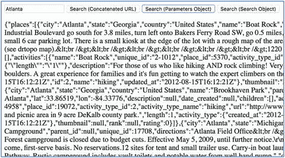
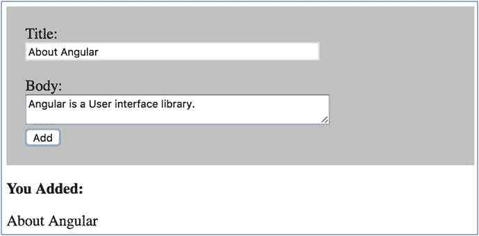
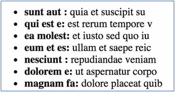

# 十八、HTTP 和 HttpClient 模块

99%的 Angular 项目涉及客户端(浏览器)和一些远程服务器之间的通信。通常这是通过 HTTP 完成的。因此，了解 HTTP 通信的工作原理以及如何为其编写代码非常重要。这就是本章的内容。

超文本传输协议(HTTP)旨在实现客户端和服务器之间的通信。HTTP 是客户端和服务器之间的请求-响应协议。我们将在本章中更详细地讨论这一点。

HTTP 方法已经存在很长时间了(在 AJAX 和不同类型的 web 应用之前)。HTTP 方法可以用于传统的服务器端 web 应用，也可以用于客户端 AJAX web 应用。

每当客户端使用 HTTP 与 web 服务器通信时，它都会包含有关请求方法的信息。该方法描述了客户端希望服务器做什么——请求的意图。最常用的方法是`GET`和`POST`。`GET`方法用于从服务器请求数据。`POST`方法用于向服务器发送数据，以便保存或更新数据。

最常用的 HTTP 方法如下:

*   `POST`
*   `GET`
*   `PUT`
*   `PATCH`
*   `DELETE`

HTTP 头允许客户机和服务器在请求或响应中传递附加信息。请求头由其名称组成，名称不区分大小写，后跟一个冒号(:)，再后跟其值(没有换行符)。

如果您在浏览器中使用开发工具，您可以看到网络通信，包括 HTTP 调用。如果您使用 web 浏览器的开发工具来检查 HTTP 请求，您将看到向服务器发出的请求和返回的请求。

图 [18-1](#Fig1) 和 [18-2](#Fig2) 显示了 HTTP 请求和响应头。


图 18-2

HTTP response headers


图 18-1

HTTP request headers

## Http 正文

http 主体允许客户端和服务器在请求或响应的报头后传递附加信息。Http 主体并不总是必需的，因为信息主体并不总是必需的。例如，Http“get”请求不需要在正文中包含信息——所有信息都已经包含在报头中了。

以下是服务器响应的 http 正文示例:


## 用 HTTP 传递信息

从浏览器向服务器传递信息有多种方式。服务器通常在正文中返回信息，尽管它可以通过在 HTTP 头中返回数据来传递信息。

### 查询参数

Angular Http 客户端允许您使用查询参数将 URL 中的信息传递给服务器。比如 http://localhost:4200/sock js-node/info？t=1498649243238。

某些字符不允许作为 URL 的一部分(例如空格)，而其他字符在 URL 中可能有特殊的含义。为了解决这个问题，URL 语法允许对参数进行编码，以确保 URL 有效。例如，以下 URL 中大西洋和城市之间的空格字符编码为%20: [`https://trailapi-trailapi.p.mashape.com/?q[city_cont]=Atlantic%20City`](https://trailapi-trailapi.p.mashape.com/%3Fq%5Bcity_cont%5D=Atlantic%20City) 。

当使用 JavaScript 方法`encodeURIComponent`构建带有字符串连接的 URL 时，可以执行这种编码。如果您使用一个有Angular的对象(比如`URLSearchParams`)来构建查询参数字符串，它会自动为您完成这项工作。

在浏览器中导航时，用户可以在地址栏中看到查询参数。但是，当使用 Angular Http 客户端执行 AJAX 请求时，它们是不可见的。

查询参数不能用来传递像请求体那样多的信息。

### 矩阵参数

Angular Http 客户端允许您使用矩阵参数在 URL 中将信息传递给服务器，例如 Http://localhost:4200/sock js-node/info；t=1498649243238。矩阵参数类似于查询字符串，但使用不同的模式。他们的行为也不同，因为没有？，它们可以被缓存。此外，矩阵参数可以有多个值。通过指定包含矩阵参数的 URL，可以在 Angular 中使用矩阵参数。但是，Angular 目前没有任何内置对象来创建带有矩阵参数的 URL。

矩阵参数不能用来传递像请求体那样多的信息。

### 路径参数

Angular Http 客户端允许您使用路径参数将信息传递到 URL 中的服务器，例如 Http://localhost:4200/API/badges/9243238。

### 在请求正文中传递数据

在过去，HTML 表单(带有`form`标签和`input`字段)是向服务器发送数据的最佳方式。用户将填写一个表单并点击 Submit，数据将在请求体中被发送(使用 HTTP `POST`方法)到服务器。

现在 Angular Http 客户端允许您以编程方式做同样的事情:使用 Http 客户端的`POST`方法在请求体中将信息传递给服务器。

与使用查询或矩阵参数在 URL 中传递数据相比，在请求正文中可以传递更多的数据。

## 休息

RESTful 应用是一个服务器应用，它将其状态和功能公开为一组客户机(浏览器)可以操作的资源，并且符合一组特定的原则。资源的例子可能是客户列表或他们的订单。

所有资源都是唯一可寻址的，通常通过 URIs，尽管也可以使用其他寻址方式。例如，您可以使用 orders/23 来访问订单编号 23，或者使用 orders/24 来访问订单编号 24。

所有资源都可以通过一组受约束的众所周知的动作来操作，通常是 CRUD(创建、读取、更新、删除)，最常见的是通过 HTTP 方法`POST`、`GET`、`PUT`和`DELETE`来表示。有时只使用这些 HTML 方法中的一部分，而不是全部。例如，您可以使用一个 HTTP `DELETE` to orders/23 来删除该订单。

所有资源的数据都是通过一定数量的众所周知的表示形式进行传输的，通常是 HTML、XML 或 JSON。JSON 是最常见的。

## 数据

JSON 代表 JavaScript 对象符号。这是一种用于在客户端和服务器之间双向传递数据的数据格式。JSON 与 JavaScript 语言使用的数据格式相同。它使用逗号来分隔项目，使用冒号来分隔属性名称和该属性的数据。它使用不同类型的括号来表示对象和数组。

下面是传递包含数据的对象的 JSON。注意如何使用`{`和`}`括号来表示对象的开始和结束:

```ts
{ "name":"John", "age":31, "city":"New York" }

```

这里是 JSON 传递一个数组。注意如何使用`[`和`]`括号来表示数组的开始和结束:

```ts
[ "Ford", "BMW", "Fiat"]

```

这是 JSON，用于传递对象数组。请注意括号是如何组合起来创建一个具有两个属性的`cars`对象的:`Nissan`和`Ford`。每个属性都有一系列模型:

```ts
{
    "cars": {
        "Nissan": [
            {"model":"Sentra", "doors":4},
            {"model":"Maxima", "doors":4}
        ],
        "Ford": [
            {"model":"Taurus", "doors":4},
            {"model":"Escort", "doors":4}
        ]
    }
}

```

## Angular Http 客户端

Angular Http client 是一个服务，您可以将它注入到您的类中，以执行与服务器的 Http 通信。这项服务可以通过新的 Angular 5 Http 客户端模块`@angular/common/http`获得，它取代了旧的 Angular 4 Http 模块`@angular/common/http`。您需要修改您的模块类(项目的模块类)来导入这个模块:

```ts
@NgModule({
  imports: [
        ...
        HttpClientModule,
        ...
  ],
  declarations: [ AppComponent ],
  bootstrap: [ AppComponent ]
})

```

您可以通过以下方式将 Angular Http 服务直接注入到您的组件中:

```ts
@Injectable()
class CustomerComponent {
  ...
  constructor(private http: HttpClient) {
  ...
  }
}

```

这对原型设计来说很好，但从长远来看对代码的可维护性来说是不可取的。实际上，您不应该在服务类之外直接使用 HttpClient 进行数据访问。相反，您应该编写使用 Http 客户端的服务类，然后将这些类注入到您的代码中需要数据访问的地方。如果你查看 angular.io 上的官方 Angular 文档，你会看到以下内容:这是一条黄金法则:总是将数据访问委托给支持服务类。

下面是一个使用 HttpClient 的服务类的示例:

```ts
@Injectable()
class CustomerCommunicationService {
  ...
  constructor(private http: HttpClient) {
  ...
  }
}

```

```ts
class CustomerComponent {
  ...
  constructor(private http: CustomerCommunicationService) {
  ...

  // perform data access
  }
}

```

## 无商标消费品

在 Angular 5 中，新的 HttpClientModule 允许我们在调用 HTTP 请求时使用泛型。泛型使我们能够告诉 Angular 我们期望从 HTTP 请求中收到的响应的类型。响应类型可以是“任何”(允许任何类型的响应)、变量类型(例如字符串)、类或接口。例如，下面的代码执行一个 http“get ”,将预期的响应指定为一个语言对象数组:

```ts
this._http.get<Array<Language>>('https://languagetool.org/api/v2/languages');

```

这使得 Angular 能够为我们解析响应，这样我们就不必这么做了。不再需要调用 JSON.parse 来将响应字符串转换为对象。

## 异步操作

在 JavaScript 中，发出 HTTP 请求是一个异步操作。它向 API 发送 HTTP 请求，在继续下一行代码之前不等待响应。当 API 在几毫秒、几秒或几分钟后做出响应时，我们会得到通知，并可以开始处理响应。

在 Angular 中，有两种方法来处理这些异步操作:我们可以使用承诺或可观察值(在几章前已经讨论过)。

通常我们调用我们的支持服务类，它们返回异步结果，我们在组件中处理。

## 请求选项

很快我将介绍您可以进行的每种类型的 HTTP 调用，但是首先让我们讨论一下请求选项。当您调用与服务器的 HTTP 通信时，您有许多配置通信的方法。你应该使用什么标题？您应该从服务器接受什么媒体？您应该向服务器传递什么凭证？您在名为`RequestOptionsArgs`的 Angular 对象中设置这些选项，并将其作为参数传递给 Angular Http 客户端方法调用。

这里有一个打`GET`电话时使用`RequestOptionsArg`的例子。请注意如何使用该对象来指定 URL、HTTP 方法、参数、身份验证令牌和主体:

```ts
var basicOptions:RequestOptionsArgs = {
  url: 'bankInfo',
  method: RequestMethods.Get,
  params: {
    accountNumber: accountNumber
  },
  headers: new HttpHeaders().set('Authentication': authenticationStr),
  body: null
};

```

## HTTP GET 方法:示例

`GET`方法非常常用于从服务器“获取”数据。它通常不使用请求体。比如对于 URL /customers/getinfo.php？id=123，没有请求体。下面是`GET`的一些方面:

*   这是幂等的——多次调用同一个`PUT`与调用一次效果相同。
*   它可以保留在浏览器历史中。
*   可以收藏。
*   它有长度限制。
*   请求使用 HTTP 头。
*   作为 HTTP 正文返回的响应。

`GET`方法应该在服务器上以独立的方式实现。换句话说，发出多个相同的请求与发出一个请求具有相同的效果。注意，虽然幂等操作在服务器上产生相同的结果(没有副作用)，但是响应本身可能不相同(例如，资源的状态可能在请求之间发生变化)。

图 [18-3](#Fig3) 显示了一个从 Snapchat 获取语言和语言代码列表的组件。


图 18-3

Getting a list of languages and language codes from Snapchat

这将是示例 http-ex100:

1.  使用 CLI 构建应用:使用以下命令:

    ```ts
    ng new http-ex100 --inline-template --inline-style

    ```

2.  开始`ng serve`:使用以下代码:

    ```ts
    cd http-ex100
    ng serve

    ```

3.  打开应用:打开 web 浏览器并导航到 localhost:4200。你应该看到“欢迎使用 app！”
4.  编辑模块:编辑 app.module.ts，修改为:

    ```ts
    import { BrowserModule } from '@angular/platform-browser';
    import { NgModule } from '@angular/core';
    import { AppComponent } from './app.component';
    import { SwaggerService } from './swagger.service';
    import { HttpClientModule } from '@angular/common/http';

    @NgModule({
      declarations: [
        AppComponent
      ],
      imports: [
        BrowserModule, HttpClientModule
      ],
      providers: [SwaggerService],
      bootstrap: [AppComponent]
    })
    export class AppModule { }

    ```

5.  创建服务:创建 swagger.service.ts::

    ```ts
    import { Injectable } from '@angular/core';
    import { HttpClient } from '@angular/common/http';
    import { Language } from './language';

    @Injectable()
    export class SwaggerService {
        constructor(private _http: HttpClient){}

        getLanguages() {
            return this._http.get<Array<Language>>('https://languagetool.org/api/v2/languages');
        }
    }

    ```

6.  创建数据对象类:创建语言. ts.

    ```ts
    export class Language {
        private _code: string;
        private _name: string;
        public get code() {
            return this._code;
        }
        public get name() {
            return this._name;
        }
        public set code(newValue: string){
            this._code = newValue;
        }
        public set name(newValue: string){
            this._name = newValue;
        }
    }

    ```

7.  编辑组件:编辑 app.component.ts，修改为:

    ```ts
    import { Component, OnInit } from '@angular/core';
    import { SwaggerService } from './swagger.service';
    import { Language } from './language';

    @Component({
      selector: 'app-root',
      template: `
      <h1>Countries</h1>
      <ul>
      <li *ngFor="let language of _languages">
      {{language.name}}&nbsp;({{language.code}})
      </li>
      </ul>
      `,
      styles: []
    })
    export class AppComponent implements OnInit{
      _languages = new Array<Language>();

      constructor(private _swaggerService: SwaggerService) {}

      ngOnInit(){
        this._swaggerService.getLanguages().subscribe(
          res => {
           this._languages = res;
          },
          error => { console.log('an error occurred'); }
        )
      }
    }

    ```

您的应用应该在 localhost:4200 上工作，您应该会看到一个语言列表。请注意以下几点:

*   swagger.service.ts 文件创建一个具有可注入注释的服务，使其能够被注入到 app 组件中。这个服务有一个构造函数，Angular Http 模块被注入到这个构造函数中。它还包含方法`getLanguages`，该方法对服务器进行 HTTP 调用，服务器返回一个可观察值。请注意，get 方法使用泛型将响应类型指定为“语言”(参见 <array>>)。</array>
*   文件“language.ts”定义了语言数据对象，我们将使用该对象将数据从服务传递到组件。
*   app.component.ts 文件创建一个组件。注意，swagger 服务是使用构造函数注入到这个组件中的。当组件初始化时，它调用 swagger 服务并用两种方法订阅可观察的结果:第一种方法表示成功，第二种方法表示失败。
*   第一个方法(成功的方法)接受 HTTP 结果作为参数，并将实例变量`_langages`设置为返回的 JavaScript 对象数组，然后在组件中可见。

## 使用参数的 HTTP GET 方法:示例

我们已经讨论了`GET`，但是“得到”什么呢？一个`GET`使用参数来获取一个特定的东西(或一些东西)——如果您想从服务器上获取特定客户的信息，这非常有用。您可以通过简单地修改`GET`的 URI 以包含查询参数来实现，或者您可以使用嵌入到`RequestOptionsArgs`对象中的Angular搜索或参数对象来实现。

图 [18-4](#Fig4) 显示了一个使用查询参数以三种不同方式执行 HTTP `GET`的例子，由三个不同的按钮触发。



图 18-4

`GET` in three different ways

这将是 http-ex200 的示例:

1.  使用 CLI 构建应用:使用以下命令:

    ```ts
    ng new http-ex200 --inline-template --inline-style

    ```

2.  开始`ng serve`:使用以下代码:

    ```ts
    cd http-ex200
    ng serve

    ```

3.  打开应用:打开 web 浏览器并导航到 localhost:4200。你应该看到“欢迎使用 app！”
4.  编辑模块:编辑 app.module.ts，修改为:

    ```ts
    import { BrowserModule } from '@angular/platform-browser';
    import { NgModule } from '@angular/core';
    import { FormsModule } from '@angular/forms';
    import { AppComponent } from './app.component';
    import { HttpClientModule } from '@angular/common/http';

    @NgModule({
      declarations: [
        AppComponent
      ],
      imports: [
        BrowserModule,
        HttpClientModule,
        FormsModule
      ],
      providers: [],
      bootstrap: [AppComponent]
    })
    export class AppModule { }

    ```

5.  编辑组件:编辑 app.component.ts，修改为:

    ```ts
    import { Component } from '@angular/core';
    import { HttpClient, HttpHeaders, HttpParams } from '@angular/common/http';

    @Component({
      selector: 'app-root',
      template: `
        <input [(ngModel)]="_search" placeholder="city">
        <button (click)="doSearchConcatenatedUrl()">Search (Concatenated URL)</button>
        <button (click)="doSeachHttpParams1()">Search (Http Params1)</button>
        <button (click)="doSeachHttpParams2()">Search (Http Params2)</button>
        <p>JSON {{_result | json}}</p>
      `,
      styles: []
    })
    export class AppComponent {
      _search = 'Atlanta';
      _result = {};

      constructor(private _http: HttpClient){
      }

      doSearchConcatenatedUrl(){
        const concatenatedUrl: string =
          "https://trailapi-trailapi.p.mashape.com?q[city_cont]=" +
          encodeURIComponent(this._search);
        const mashapeKey = 'OxWYjpdztcmsheZU9AWLNQcE9g9wp1qdRkFjsneaEp2Yf68nYH';
        const httpHeaders: HttpHeaders = new HttpHeaders(
          {'Content-Type': 'application/json',
         'X-Mashape-Key': mashapeKey});
        this._http.get(concatenatedUrl, { headers: httpHeaders }).subscribe(
          res => { this._result = res; });
      }

      doSeachHttpParams1(){
        const url: string =
          'https://trailapi-trailapi.p.mashape.com';
        const mashapeKey = 'OxWYjpdztcmsheZU9AWLNQcE9g9wp1qdRkFjsneaEp2Yf68nYH';
        const httpHeaders = new HttpHeaders(
          {'Content-Type': 'application/json',
          'X-Mashape-Key': mashapeKey});
        const params = new HttpParams({
          fromString: 'q[city_cont]=' + this._search;
        });
        this._http.get(url, {headers: httpHeaders, params: params}).subscribe(
            res => { this._result = res; });
      }

      doSeachHttpParams2(){
        const url: string =
          'https://trailapi-trailapi.p.mashape.com';
        const mashapeKey = 'OxWYjpdztcmsheZU9AWLNQcE9g9wp1qdRkFjsneaEp2Yf68nYH';
        const httpHeaders = new HttpHeaders(
          {'Content-Type': 'application/json',
          'X-Mashape-Key': mashapeKey});
        const params = new HttpParams().set('q[city_cont]', this._search);
        this._http.get(url, {headers: httpHeaders, params: params}).subscribe(
            res => { this._result = res; });
      }
    }

    ```

你的应用应该工作在本地主机:4200。请注意以下几点:

*   方法`doSearchConcatenatedUrl`通过将带有编码的‘q[city _ cont]’参数集的 URL 附加到编码的输入字符串来手动构建 URL 字符串。在 Http 客户端调用`GET`方法。
*   方法 doSeachHttpParams1 从一个查询字符串构建一个 HttpParams 对象，类似于上面的方法`'doSearchConcatenatedUrl'`。在 Http 客户端调用`GET`方法，在第二个参数中传递`HttpParams`对象。注意，HttpParams 对象为我们进行编码。
*   方法 doSeachHttpParams2 创建一个 HttpParams 对象，并将“q[city_cont]”参数设置为输入字符串。在 Http 客户机上调用`GET`方法，在第二个。

## 使用路径参数的 Http GET 方法:示例

这是一个使用路径参数执行 HTTP `GET`的例子。向用户显示文章列表，每一篇文章都有一个显示按钮，如图 [18-5](#Fig5) 所示。用户可以点击 Show 按钮，一个 HTTP `GET`将被调用，带有路径参数，以获取文章的细节，然后显示在一个弹出的模态上。


图 18-5

Showing an article from a list

这将是 http-ex300 的示例:

1.  使用 CLI 构建应用:使用以下命令:

    ```ts
    ng new http-ex300 --inline-template --inline-style

    ```

2.  开始`ng serve`:使用以下代码:

    ```ts
    cd http-ex300
    ng serve

    ```

3.  打开应用:打开 web 浏览器并导航到 localhost:4200。你应该看到“欢迎使用 app！”
4.  编辑模块:编辑 app.module.ts，修改为:

    ```ts
    import { BrowserModule } from '@angular/platform-browser';
    import { NgModule } from '@angular/core';

    import { AppComponent } from './app.component';

    import { HttpClientModule } from '@angular/common/http';

    @NgModule({
      declarations: [
        AppComponent
      ],
      imports: [
        BrowserModule,
        HttpClientModule
      ],
      providers: [],
      bootstrap: [AppComponent]
    })
    export class AppModule { }

    ```

5.  编辑组件:编辑 app.component.ts，修改为:

    ```ts
    import { Component, OnInit, AfterViewInit, ViewChild } from '@angular/core';
    import { HttpClient } from '@angular/common/http';

    @Component({
      selector: 'app-root',
      template: `
      <ul>
      <li *ngFor="let post of _posts">
        {{post.title}}&nbsp;&nbsp;<button (click)="showPost(post.id)">Show</button>
      </li>
      </ul>
      <div #modal id="myModal" class="modal">
        <div class="modal-content">
          <span class="close" (click)="closeModal()">&times;</span>
          <h3>{{this._post.title}}</h3>
          <p>{{this._post.body}}</p>
        </div>
      </div>
      `,
      styles: []
    })
    export class AppComponent implements OnInit {
      _posts = [];
      _post = {};
      @ViewChild('modal') _myModal: any;

      constructor(private _http: HttpClient) {
      }

      ngOnInit() {
        return this._http.get<any>("http://jsonplaceholder.typicode.com/posts").subscribe(
          res => {
            this._posts = res;
          }
        );
      }

      showPost(postId: number) {
        this._http.get<any>(`http://jsonplaceholder.typicode.com/posts/${postId}`).subscribe(
          res => {
            this._post = res;
            this._myModal.nativeElement.style.display = 'block';
          }
        )
      }

      closeModal() {
        this._myModal.nativeElement.style.display = 'none';
      }

    }

    ```

6.  编辑样式:编辑 styles.css 并将其更改为以下内容:

    ```ts
    .modal {
        display: none;
        position: fixed;
        z-index: 1;
        left: 0;
        top: 0;
        width: 100%;
        height: 100%;
        overflow: auto;
        background-color: rgb(0,0,0);
        background-color: rgba(0,0,0,0.2);
    }

    .modal-content {
        background-color: #fefefe;
        margin: 15% auto;
        padding: 20px;
        border: 1px solid #888;
        width: 60%;
    }

    .close {
        color: #aaa;
        float: right;
        font-size: 28px;
        font-weight: bold;
    }

    .close:hover,
    .close:focus {
        color: black;
        text-decoration: none;
        cursor: pointer;
    }

    ```

注意，在 app 组件方法`showPost`中，我们使用模板文字将文章 ID 注入 URL 字符串。

## HTTP POST 方法:示例

`POST`非常常用于向服务器发布数据。它通常在请求正文中发送数据。例如，对于 URL /customers/new，请求主体是 name = Mark&city = Atlanta&state = GA。

以下是 HTTP `POST`的一些重要方面:

*   它不是幂等的——多次调用同一个 put 会产生与调用一次不同的效果。
*   不能缓存。
*   它不能保留在浏览器历史中。
*   不能加书签。
*   它没有长度限制。
*   请求使用 HTTP 正文。
*   响应作为 HTTP 主体返回。

就其本质而言，HTTP POST 不是等幂的。它有副作用—例如，通过两次提交数据来两次添加客户(双重提交)。

图 [18-6](#Fig6) 显示了一个执行 HTTP `POST`的例子。用户可以输入标题和正文，然后单击 Add 将它们发送到服务器。服务器向浏览器返回信息，这些信息被添加到底部的“您添加的”列表中。



图 18-6

HTTP `POST`

这将是示例 http-ex400:

1.  使用 CLI 构建应用:使用以下命令:

    ```ts
    ng new http-ex400 --inline-template --inline-style

    ```

2.  开始`ng serve`:使用以下代码:

    ```ts
    cd http-ex400
    ng serve

    ```

3.  打开应用:打开 web 浏览器并导航到 localhost:4200。你应该看到“欢迎使用 app！”
4.  编辑模块:编辑 app.module.ts，修改为:

    ```ts
    import { BrowserModule } from '@angular/platform-browser';
    import { NgModule } from '@angular/core';
    import { HttpClientModule } from '@angular/common/http';
    import { FormsModule } from '@angular/forms';
    import { AppComponent } from './app.component';
    @NgModule({
      declarations: [
        AppComponent
      ],
      imports: [
        BrowserModule,
        HttpClientModule,
        FormsModule
      ],
      providers: [],
      bootstrap: [AppComponent]
    })
    export class AppModule { }

    ```

5.  编辑组件:编辑 app.component.ts，修改为:

    ```ts
    import { Component, OnInit, AfterViewInit, ViewChild } from '@angular/core';
    import { HttpClient } from '@angular/common/http';

    @Component({
      selector: 'app-root',
      template: `
          <div>
          Title:
          <br/>
          <input type="text" [(ngModel)]="_title" size="50" />
          <br/>
          <br/>
          Body:
          <br/>
          <textarea [(ngModel)]='_body' rows="2" cols="50">
          </textarea>
          <br/>
          <button (click)="onAdd()">Add</button>
          </div>
          <p><b>You Added:</b></p>
          <p *ngIf="_added.length == 0">None</p>
          <p *ngFor="let added of _added">
            {{added.title}}
          </p>
        `,
      styles: ['div { padding: 20px; background-color: #C0C0C0 }']
    })
    export class AppComponent {
      _title: string;
      _body: string;
      _added: Array<any> = new Array<any>();

      constructor(private _http: HttpClient) {
      }

      onAdd(){
        const requestBody = {
          title: this._title || '[Unspecified]',
          body: this._body || '[Unspecified]',
        };
        this._http.post("http://jsonplaceholder.typicode.com/posts", requestBody).subscribe(
          res => {
            this._added.push(res);
          }
        )
      }
    }

    ```

请注意以下几点:

*   在 app 组件方法`onAdd`中，我们创建了将在请求体中发送到服务器的对象。
*   在 app 组件方法`onAdd`中，我们使用了`or`操作符来确保我们向服务器传递了一些有效的东西——要么是`this._title`(如果存在的话)，要么是文本“`[Unspecified]`:

    ```ts
    title: this._title || '[Unspecified]'

    ```

*   在 app 组件方法`onAdd`中，我们订阅 HTTP `POST`并使用箭头函数来处理返回的结果。我们将返回的结果添加到`_added`的数组中，因此它出现在底部。

## 使用路径参数的 HTTP PUT 方法

除了在 REST 服务中通常用于更新资源而不是创建资源之外，`PUT`方法类似于`POST`方法。

HTTP `PUT`的一些重要方面包括:

*   这是幂等的——多次调用同一个`PUT`与调用一次效果相同。
*   它没有长度限制
*   它不可缓存。
*   请求使用 HTTP 正文。
*   响应作为 HTTP 头返回。

## 使用路径参数的 HTTP 修补方法

`PATCH`方法类似于`PUT`,除了它不是幂等的。例如，将某项资源的价值增加一定的数量会很有用。

`PATCH`的一些重要方面包括:

*   它不是幂等的——多次调用同一个`PUT`与调用一次有不同的效果。
*   它没有长度限制。
*   它不可缓存。
*   请求使用 HTTP 正文。
*   响应作为 HTTP 头返回。

## 使用路径参数的 HTTP 删除方法

`DELETE`方法用于从服务器上删除资源。请注意以下几点:

*   它不是幂等的——多次调用`DELETE`与调用一次效果相同。
*   它不可缓存。
*   请求使用 HTTP 正文。
*   响应作为 HTTP 头返回。

## 修改服务器响应:示例

记住，Http 客户端服务调用返回可观察的对象。这意味着服务器向客户端(浏览器)返回一个异步数据流，并且您可以使用 RxJS 模块使用第 [16 章](16.html)中讨论的操作符来处理该数据。这包括我们可以用来转换数据的`map`操作符。

图 [18-7](#Fig7) 显示了一个使用 RxJS `map`操作符(带函数)修改从服务器返回的响应的例子。在这种情况下，我们使用它将数据转换为类型化数据(在类中构造的数据)。



图 18-7

Using `map` to modify a response

这将是 http-ex500 的示例:

1.  使用 CLI 构建应用:使用以下命令:

    ```ts
    ng new http-ex500 --inline-template --inline-style

    ```

2.  开始`ng serve`:使用以下代码:

    ```ts
    cd http-ex500
    ng serve

    ```

3.  打开应用:打开 web 浏览器并导航到 localhost:4200。你应该看到“欢迎使用 app！”
4.  创建类:在 app 中创建以下TypeScript类`post.``ts`:

    ```ts
    export class Post {
        _title: string = "";
        _body: string = "";

        constructor(title: string, body: string){
            const titleNaN = title || '';
            const bodyNaN = body || '';
            this._title = titleNaN.length > 10 ? titleNaN.substring(0,9): titleNaN;
            this._body = bodyNaN.length > 20 ? bodyNaN.substring(0,19): bodyNaN;
        }

        get title(): string{
            return this._title;
        }

        get body(): string{
            return this._body;
        }

    }

    ```

5.  编辑模块:编辑 app.module.ts，修改为:

    ```ts
    import { BrowserModule } from '@angular/platform-browser';
    import { NgModule } from '@angular/core';
    import { AppComponent } from './app.component';
    import { HttpClientModule } from '@angular/common/http';

    @NgModule({
      declarations: [
        AppComponent
      ],
      imports: [
        BrowserModule,
        HttpClientModule
      ],
      providers: [],
      bootstrap: [AppComponent]
    })
    export class AppModule { }

    ```

6.  编辑组件:编辑 app.component.ts，修改为:

    ```ts
    import { Component } from '@angular/core';
    import { HttpClient } from '@angular/common/http';
    import { Post } from './Post';
    import 'rxjs/Rx';

    @Component({
      selector: 'app-root',
      template: `
        <ul>
          <li *ngFor="let post of _posts">
            <b>{{post.title}}:</b> {{post.body}}
          </li>
        </ul>
      `,
      styles: []
    })
    export class AppComponent {
      _posts: Array<Post>;
      constructor(private _http: HttpClient) {}
      ngOnInit() {
        return this._http.get<Array<Post>>("http://jsonplaceholder.typicode.com/posts")
          .map(
            response => {
              const postsArray: Array<Post> = new Array<Post>();
              for (const responseItem of response){
                const post =
                  new Post(responseItem['title'], responseItem['body']);
                postsArray.push(post);
              }
              return postsArray;
            }
          )
          .subscribe(
            response => {
              this._posts = response;
            }
        );
      }
    }

    ```

我们创建 typescript 类`Post`来存储每篇文章。请注意，这个类有一个构造函数，用于修剪每篇文章的标题和正文。我们使用`or`技巧将“不真实”的值转换为空字符串:

```ts
const titleNaN = title || '';

```

我们使用下面的代码从服务器获取数据。我们使用映射将响应(一个对象数组)转换成一个`Post`类的类型化数组。然后我们订阅结果:

```ts
    return this._http.get("http://jsonplaceholder.typicode.com/posts")
      .map(
        response => {
          const postsArray: Array<Post> = new Array<Post>();
          for (const responseItem of response){
            const post =
              new Post(responseItem['title'], responseItem['body']);
            postsArray.push(post);
          }
          return postsArray;
        }
      )
      .subscribe(
        response => {
          this._posts = response;
        }

    );

```

## 处理服务器错误响应:示例

当您订阅 HTTP 方法调用时，您提供了一个处理结果的处理程序方法。但是，您也可以提供其他处理程序方法—一个用于处理错误，另一个用于处理完成:

```ts
.subscribe(
    function(response) { console.log("Success " + response)},
    function(error) { console.log("Error " + error)},
    function() { console.log("Completion")}
);

```

这是一个处理服务器错误并显示适当错误信息的例子(如图 [18-8](#Fig8) 所示)。


图 18-8

Displaying an error message

这将是 http-ex600 的示例:

1.  使用 CLI 构建应用:使用以下命令:

    ```ts
    ng new http-ex600 --inline-template --inline-style

    ```

2.  开始`ng serve`:使用以下代码:

    ```ts
    cd http-ex600
    ng serve

    ```

3.  打开应用:打开 web 浏览器并导航到 localhost:4200。你应该看到“欢迎使用 app！”
4.  创建服务类:在应用中创建下面的TypeScript类`service.ts`:

    ```ts
    import { Injectable } from '@angular/core';
    import { HttpClient } from '@angular/common/http';
    import { Observable } from 'rxjs/Observable';
    import 'rxjs/Rx';

    @Injectable()
    export class Service {

      constructor(private _http: HttpClient) {
      }

      getPosts() : Observable<any> {
        return this._http.get("http://jsonplaceholder.typicode.com/postss");
      };

    }

    ```

5.  编辑模块:编辑 app.module.ts，修改为:

    ```ts
    import { BrowserModule } from '@angular/platform-browser';
    import { NgModule } from '@angular/core';
    import { AppComponent } from './app.component';
    import { HttpClientModule } from '@angular/common/http';
    import { Service } from './Service';

    @NgModule({
      declarations: [
        AppComponent
      ],
      imports: [
        BrowserModule,
        HttpClientModule
      ],
      providers: [HttpClientModule, Service],
      bootstrap: [AppComponent]
    })
    export class AppModule { }

    ```

6.  编辑组件:编辑 app.component.ts，修改为:

    ```ts
    import { Component } from '@angular/core';
    import { Service } from './Service';
    import 'rxjs/Rx';

    @Component({
      selector: 'app-root',
      template: `
        <ul>
          <li *ngFor="let post of _posts">
            <b>{{post.title}}:</b> {{post.body}}
          </li>
        </ul>
        <div *ngIf="_error">
          Error: {{_error.status}}: {{_error.statusText}}
        </div>
      `,
      styles: ['div {font-size:20px; padding: 5px; background-color: red;color: white}']
    })
    export class AppComponent {
      _posts = [];
      _error;

      constructor(private _service: Service) {}

      ngOnInit() {
        this._service.getPosts()
          .subscribe(
            response => {
              this._posts = response;
            },
            error => {
              this._error = error;
            }
          );
      }
    }

    ```

请注意以下几点:

*   服务类`service.` `ts`使用了不正确的 URL，这将引发 404 错误。
*   组件 app.component.ts 调用方法`getPosts`并订阅其结果，使用两个方法，每个方法都用一个箭头函数实现。第一个处理成功的结果，第二个处理错误。在这个例子中，我们处理错误，将实例变量`_error`设置为它的结果。
*   模板中引用了`_error`实例变量。如果设置，它显示一条红色消息。

## 异步管道:示例

异步管道订阅可观察对象或承诺，并返回它发出的最新值。当发出一个新值时，异步管道标记要检查更改的组件。当组件被破坏时，异步管道会自动取消订阅，以避免潜在的内存泄漏。

图 [18-9](#Fig9) 显示了一个使用映射来转换服务器输出，然后使用管道输出的例子。


图 18-9

Using a pipe to output

这将是 http-ex700 的示例:

1.  使用 CLI 构建应用:使用以下命令:

    ```ts
    ng new http-ex700 --inline-template --inline-style

    ```

2.  开始`ng serve`:使用以下代码:

    ```ts
    cd http-ex700
    ng serve

    ```

3.  打开应用:打开 web 浏览器并导航到 localhost:4200。你应该看到“欢迎使用 app！”
4.  编辑模块:编辑 app.module.ts，修改为:

    ```ts
    import { BrowserModule } from '@angular/platform-browser';
    import { NgModule } from '@angular/core';
    import { AppComponent } from './app.component';
    import { HttpClientModule } from '@angular/common/http';

    @NgModule({
      declarations: [
        AppComponent
      ],
      imports: [
        BrowserModule,
        HttpClientModule
      ],
      providers: [HttpClientModule],
      bootstrap: [AppComponent]
    })
    export class AppModule { }

    ```

5.  编辑组件:编辑 app.component.ts，修改为:

    ```ts
    import { Component } from '@angular/core';
    import { Injectable } from '@angular/core';
    import { HttpClient } from '@angular/common/http';
    import 'rxjs/Rx';
    import { Observable } from 'rxjs/Observable';

    @Component({
      selector: 'app-root',
      template: `
        <h1>Post Title Names</h1>
        <p>{{_result|async}}</p>
      `,
      styles: []
    })
    export class AppComponent {
      _result: any;

      constructor(private _http: HttpClient) {}

      ngOnInit() {
        this._result =
          this._http.get<Array<any>>("http://jsonplaceholder.typicode.com/posts")
          .map(
            response => {
              let titles = '';
              for (const responseItem of response){
                titles += responseItem['title'];
              }
              return titles;
            }
          );
      }
    }

    ```

请注意以下几点:

*   组件 app.component.ts 调用 HTTP `GET`方法返回帖子列表。它使用`map`操作符(和一个函数)将其转换成所有文章标题的字符串。然后，它将结果赋给`_result`实例变量。
*   组件 app.component.ts 使用一个模板来显示`_result`实例变量的值。

## 摘要

这一重要章节讲述了 Http 通信的基础知识，以及如何使用 HTTP 服务来获取和发送数据到服务器。我建议您完成所有的练习，因为 Http 服务对您将来编写单页应用非常重要。请记住，您将使用的 Http 服务可能有自己的自定义头和内容类型。例如，您的服务器开发人员可能会引入一个自定义头，以便在发生错误时将错误信息从服务器返回到客户端。您可能还需要为每个 Http 服务调用添加安全令牌。您将需要知道这些 Http 服务是如何工作的，以及如何扩展它们的功能以按照您想要的方式工作。

下一章也很重要:它涵盖了表单，Angular 的另一个你会一直用到的特性。