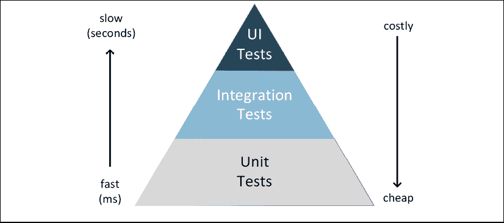
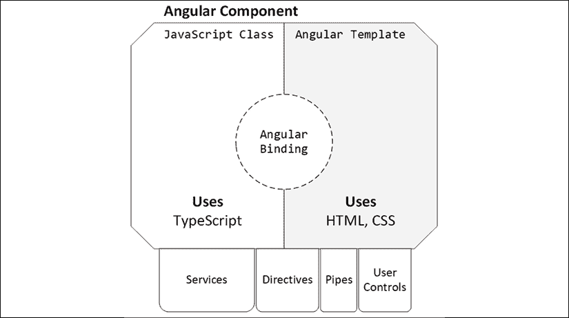
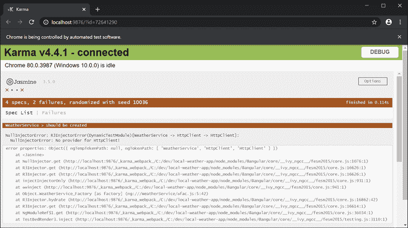
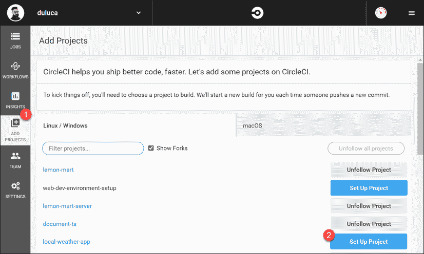
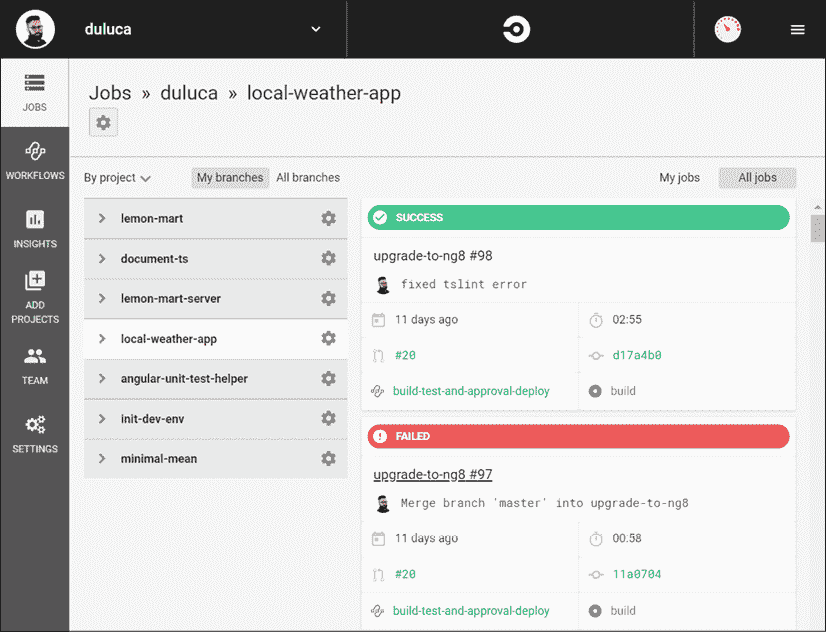
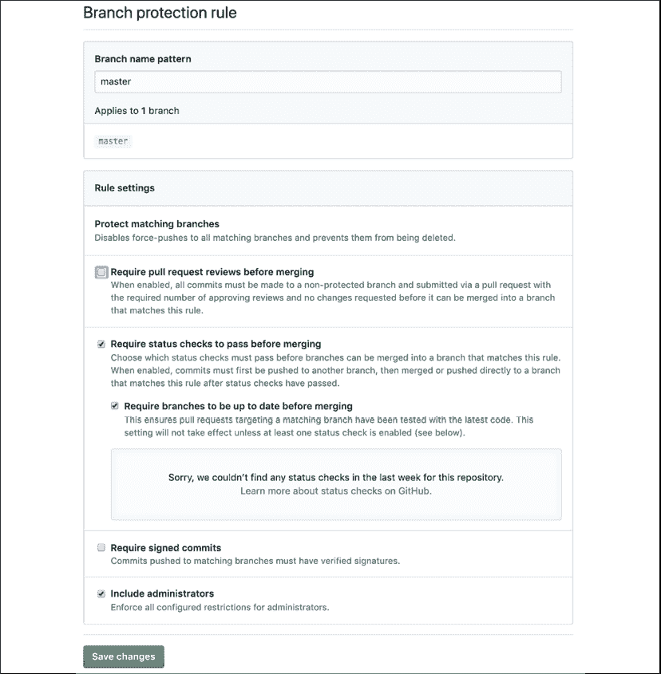
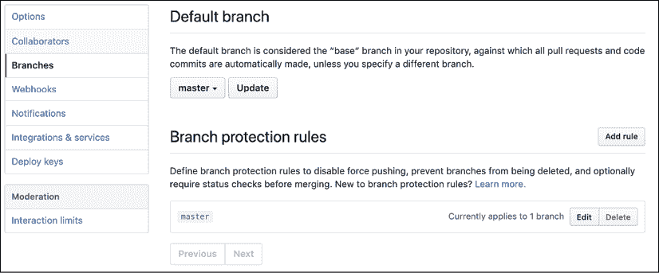
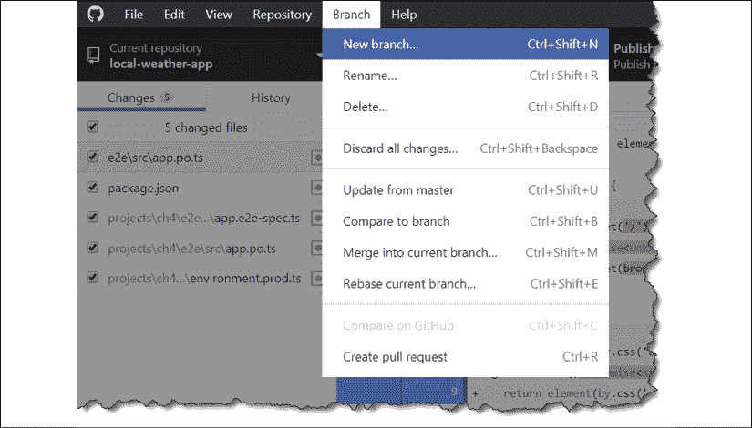
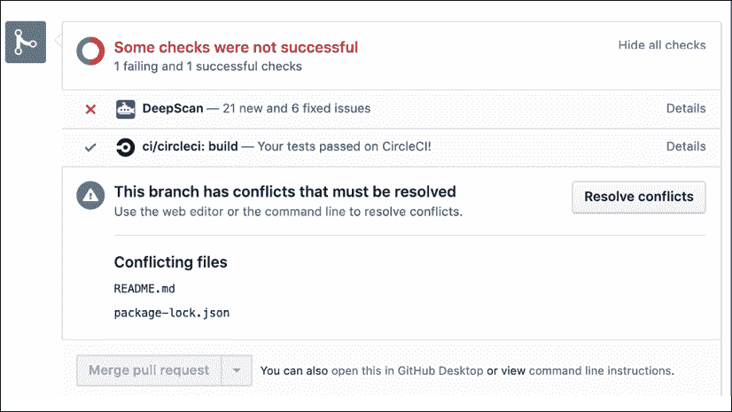

# 4.

# 自动化测试、CI 和产品发布

把它运出去，否则它就永远不会发生！在*第 3 章**创建基本角度应用程序*中，您创建了一个本地天气应用程序，可以检索当前天气数据。你这样做创造了一定的价值；然而，如果你不把你的应用程序放到网上，你最终会创造零价值。在许多行业中，运送工作的动机很普遍。然而，将一件作品交付给其他人或公开接受公众监督可能是可怕的。在软件工程中，交付任何东西都是困难的；将某些东西交付生产就更加困难了。本章将帮助您实现**持续集成**（**CI**管道）。CI 管道将帮助您实现频繁、可靠、高质量和灵活的发布。

只有当我们有一组能够快速验证代码正确性的自动化测试时，频繁可靠的发布才有可能。我们在上一章中创建的应用程序有失败的单元和**端到端**（**e2e**测试。我们需要修复这些单元测试，然后利用 GitHub 流和 CircleCI 确保它们不会再次中断。然后我们将介绍如何将 Angular 应用程序交付到 web。在*第 9 章**DevOps 使用 Docker*中，我们将介绍**连续交付**（**CD**管道），它还可以自动交付。

查看我 2018 年的演讲，*发货，否则就永远不会发生：Docker 的力量，Heroku&CircleCI*，在[https://bit.ly/ship-it-or-it-never-happened](https://bit.ly/ship-it-or-it-never-happened) 。

本章包括：

*   使用双重测试的单元测试
*   使用 Jasmine 的角度单元测试
*   角 e2e 试验
*   GitHub 流
*   生产准备
*   CircleCI 在 CI 中的应用
*   使用 Vercel Now 在 web 上部署应用程序

本书样本代码的最新版本在 GitHub 上的以下链接存储库中。存储库包含处于最终和完整状态的代码。您可以在本章末尾通过在`projects`文件夹下查找代码的章末快照来验证您的进度。

对于*第 4 章*：

1.  克隆回购[https://github.com/duluca/local-weather-app](https://github.com/duluca/local-weather-app )
2.  在根文件夹上执行`npm install`以安装依赖项
3.  本章的代码示例位于以下子文件夹中：

    ```ts
    projects/ch4 
    ```

4.  要运行本章的 Angular 应用程序，请执行：

    ```ts
    npx ng serve ch4 
    ```

5.  要运行本章的角度单元测试，请执行：

    ```ts
    npx ng test ch4 --watch=false 
    ```

6.  要运行本章的角度 e2e 测试，请执行：

    ```ts
    npx ng e2e ch4 
    ```

7.  To build a production-ready Angular app for this chapter, execute:

    ```ts
    npx ng build ch4 --prod 
    ```

    请注意，存储库根目录下的`dist/ch4`文件夹将包含编译后的结果。

请注意，书中或 GitHub 上的源代码可能并不总是与 Angular CLI 生成的代码匹配。书中的代码和 GitHub 上的代码在实现上也可能有细微的差异，因为生态系统是不断发展的。随着时间的推移，示例代码自然会发生变化。此外，在 GitHub 上，希望找到更正、修复以支持库的更新版本，或者同时实现多种技术，供读者观察。您只需要实现书中推荐的理想解决方案。如果发现错误或有问题，请在 GitHub 上创建问题或提交请求，以方便所有读者。

您可以在*附录 C*、*保持 Angular 和 Tools 常青*中了解更多关于更新 Angular 的信息。您可以从[在线找到此附录 https://static.packt-cdn.com/downloads/9781838648800_Appendix_C_Keeping_Angular_and_Tools_Evergreen.pdf](https://static.packt-cdn.com/downloads/9781838648800_Appendix_C_Keeping_Angular_and_Tools_Evergreen.) 或[处 https://expertlysimple.io/stay-evergreen](https://expertlysimple.io/stay-evergreen) 。

在本章中，您需要立即注册 CircleCI 和 Vercel 的帐户。但在部署我们的应用程序之前，我们需要确保我们已经进行了自动化测试，以确保随着时间的推移我们的应用程序的质量。首先，我们将深入探讨单元测试的基本原理，以使您熟悉测试驱动开发的好处，并涵盖诸如 First 和 SOLID 之类的原则。

# 单元测试

单元测试对于确保应用程序的行为不会随着时间的推移而发生意外的变化至关重要。单元测试将使您和您的团队能够继续对应用程序进行更改，而不会对以前验证过的功能进行更改。开发人员编写单元测试，其中每个测试的范围仅限于测试被测**函数**（**FUT**）或**类**（**CUT**中存在的代码。角度组件和服务均为所有类别；但是，我们也鼓励您开发可重用的功能。单元测试应该是丰富的、自动化的和快速的。您应该在原始代码旁边编写单元测试。如果它们与实现分离，即使是一两天，您也会开始忘记代码的细节。因此，您可能会忘记为潜在的边缘情况编写测试。

单元测试应遵循第一个原则：

*   **F**ast
*   **I**隔离
*   **R**可食
*   **S**elf 校验
*   **T**伊梅利

单元测试应该很快，只需要几毫秒就可以运行，这样我们就可以在几分钟内运行数千个单元测试。为了使快速测试成为可能，应该隔离单元测试。它不应该与数据库通信、通过网络发出请求或与 DOM 交互。隔离测试将是可重复的，因此每次运行测试都会返回相同的结果。可预测性意味着我们可以在不依赖任何外部环境的情况下断言测试的正确性，这使得我们的测试能够自我验证。如前所述，您应该及时编写单元测试；否则，您将失去编写单元测试的好处。

如果您的测试只关注一个 FUT/CUT，则可以遵循第一个原则。但是我们必须传递到 FUT/CUT 的其他类、服务或参数呢？单元测试可以通过利用双重测试来隔离 FUT/CUT 的行为。双重测试允许我们控制外部依赖项，因此您可以不向组件注入`HttpService`，而是注入假的或模拟的`HttpService`。使用双重测试，我们可以控制外部依赖的影响，并创建快速且可重复的测试。

多少测试就是足够的测试？您应该至少拥有与生产代码一样多的测试代码。如果你不这样做，那么你还远远不够写足够的测试。

单元测试不是您可以创建的唯一类型的测试，但到目前为止，它们是您应该创建最多的类型。让我们考虑可以创建的三大类测试：单元、集成和 UI。

正如我们所说，单元测试一次只关注一个 FUT/CUT。集成测试测试各种组件的集成，以便它们可以包括数据库调用、网络请求以及与 DOM 的交互。由于其性质，集成测试运行缓慢，需要频繁维护。运行时和维护的增加意味着随着时间的推移，集成测试比单元测试更昂贵。UI 测试测试应用程序，就像用户在使用它一样，填写字段，单击按钮，观察预期结果。

您可以想象这些测试是最慢、最脆弱的测试。应用程序的 UI 经常变化，使用 UI 测试创建可重复的测试非常困难。

我们可以利用集成和 UI 测试的混合来创建验收测试。验收测试是为了自动化我们交付的功能的业务验收而编写的。Angular 的 e2e 测试是创建验收测试的一种方法。

通过 Mike Cohn 的测试金字塔，我们可以直观地看到三大类自动化测试的优缺点，如下所示：



图 4.1:Mike Cohn 的测试金字塔

测试金字塔有效地总结了我们应该为我们的应用程序创建的每种测试的相对数量，同时考虑到它们的速度和成本。

就实现而言，单元测试由三部分组成：

*   安排–设置
*   Act–运行您想要测试的东西
*   断言–验证结果

在安排步骤中，我们设置了双重测试、预期结果和任何其他必要的依赖项。在 act 步骤中，我们执行正在测试的代码行。最后，在 assert 阶段，我们验证 act 步骤的结果是否与 arrange 步骤中定义的预期结果匹配。在下一节中，我们将看到如何在实践中安排、行动和断言工作。

让我们看看单元测试在角度测试中的含义。

# 角单元测试

角度单元测试的定义与我们在上一节中定义的单元测试的严格定义略有不同。Angular CLI 使用 Jasmine 框架为我们自动生成单元测试。然而，这些所谓的单元测试包括 DOM 交互，因为它们呈现组件的视图。

从 ART T0 中考虑角分量的结构。第 1 章 AUT1，第 2 部分：角度及其概念的介绍。



图 4.2：部件解剖图

由于 Angular 使用绑定，因此组件类及其模板是不可分割的，有效地表示一个单元。我们仍然可以通过测试单个函数来编写纯单元测试，但除此之外，组件及其模板被认为是需要测试的最小单元。

随着应用程序的增长，您可能会发现角度单元测试运行缓慢，因为它们呈现视图并解析依赖关系树。有各种各样的方法来处理这个问题，包括测试运行的并行化，选择不使用角度测试台，以及更积极地使用测试加倍。

正如您可能注意到的，我们可以将服务注入到组件中，或者使用模板中的其他组件。我们将利用 Jasmine 提供的双重测试机制，将我们的组件从这种外部依赖中分离出来。

让我们看看茉莉花是什么。

## 茉莉花

Jasmine 是一个用于 browser 和 Node.js 测试的行为驱动测试框架。Jasmine 还支持 Ruby 和 Python。Jasmine 是一个包含电池的框架。它支持基本的单元测试需求，如测试夹具、断言、模拟、间谍和记者。

茉莉花测试文件的命名约定包括在文件名后使用`spec.ts`，如`fileUnderTest.spec.ts`所示。Jasmine 测试组织在`describe`块中，这些块可以按级别分组，以反映属于单个函数的文件、类或多个测试的结构。单个测试用例或规范用`it`块表示。以下示例显示了名为`converters.ts`的文件，该文件导出了将摄氏度转换为华氏度的函数：

```ts
**Sample Jasmine Test**
describe('Converters', () => {
  describe('convertCtoF', () => {
    it('should convert 0c to 32f', () => {
      ...
    })
  })
}) 
```

规范的组织方式是，当它们执行时，它们读起来就像一个句子。在这种情况下，结果将是*转换器 convertCtoF 应将 0c 转换为 32f*。

有关茉莉花的更多信息，请访问[https://jasmine.github.io](https://jasmine.github.io) 。

接下来，让我们介绍 Jasmine 和大多数其他测试框架的主要功能类别–fixture 和 matches–它们帮助您使用 act、arrange 和 assert 结构编写连贯的单元测试。

### 固定设施

如前所述，单元测试有三个部分：安排、执行和断言。单元测试的安排部分可以重复，因为多个测试用例通常需要相同的设置。Jasmine 提供固定装置，帮助减少分数中的重复次数。

以下是四个固定装置：

*   `beforeAll()`-在`describe`中的所有规格之前运行
*   `afterAll()`-按照`describe`中的所有规格运行每个测试夹具
*   `beforeEach()`-在`describe`中的每个规格前运行
*   `afterEach()`-在`describe`中的每个规格后运行

夹具在一个规格或一组规格之前和之后执行，其作用域为`describe`块。

### 媒人

在单元测试的断言部分，我们需要让 Jasmine 知道规范是通过还是失败。我们可以通过编写断言来实现这一点。有两种断言：

*   `fail('message')`–此明确不符合规范
*   `expect()`-给定一个匹配器，它会动态断言预期结果是否与实际结果匹配

expect 断言要求匹配器确定测试结果。expect 和 matcher 的组合意味着读起来像一个句子。以下是您可以使用的常见匹配器：

```ts
**Jasmine Matchers**
expect(expected).toBe(actual)
                .toEqual(actual)
                .toBeDefined()
                .toBeFalsy()
                .toThrow(exception)
                .nothing() 
```

有关茉莉花配对器的完整范围，请参见[https://jasmine.github.io/api/edge/matchers.html](https://jasmine.github.io/api/edge/matchers.html) 。

还有其他功能更丰富的库，如 Jest、Mocha 或 testdouble.js。然而，当开始使用像 Angular 这样的新框架时，保持工具集最小化是很重要的。坚持违约是个好主意。

此外，Jasmine还为间谍提供了`spyOn`功能，间谍支持存根和模拟。我们将在本章后面更详细地介绍这些测试双打。

## 自动生成单元测试剖析

开箱即用的 Angular 配置为您可以使用 Jasmine 编写单元测试。Karma是测试运行者，它可以持续监视代码的更改并自动重新运行单元测试。

Angular 的默认配置利用了`TestBed`，这是一个特定于 Angular 的组件，有助于提供模块、依赖项注入、模拟、触发`ngOnInit`等 Angular 生命周期事件以及执行模板逻辑。

正如前面所讨论的，当您利用`TestBed`时，不可能用最严格的术语定义将这些测试称为单元测试。这是因为，默认情况下，`TestBed`注入依赖项的实际实例。这意味着当您执行测试时，您也在执行服务或其他组件中的代码，而您应该只测试驻留在当前正在测试的服务或组件中的代码。我们利用双重测试来帮助我们编写独立的、可重复的单元测试。

在*第 3 章**创建基础 Angular App*中，Angular CLI 在您创建新组件和服务时创建了单元测试文件，如`current-weather.component.spec.ts`和`weather.service.spec.ts`。查看以下规范文件并观察`should create`测试。框架断言，`CurrentWeatherComponent`类型的任何组件都不应为 null 或未定义，而应为 truthy：

```ts
**src/app/current-weather/current-weather.component.spec.ts**
describe('CurrentWeatherComponent', () => {
  let component: CurrentWeatherComponent
  let fixture: ComponentFixture<CurrentWeatherComponent>
  beforeEach(
    async(() => {
      TestBed.configureTestingModule({
        declarations: [CurrentWeatherComponent],
      }).compileComponents()
    })
  )
  beforeEach(() => {
    fixture = TestBed.createComponent(CurrentWeatherComponent)
    component = fixture.componentInstance
    fixture.detectChanges()
  })
  it('should create', () => {
    expect(component).toBeTruthy()
  })
}) 
```

`WeatherService`规范包含类似的测试。但是，您会注意到，每种类型的测试的设置略有不同：

```ts
**src/app/weather/weather.service.spec.ts**
describe('WeatherService', () => { 
  let service: WeatherService

  beforeEach(() => {
    TestBed.configureTestingModule({})
    service = TestBed.inject(WeatherService);
  })
  it('should be created', () => {
      expect(service).toBeTruthy()
    })
  )
}) 
```

在`WeatherService`规范的`beforeEach`功能中，切口被注入`TestBed`。另一方面，`CurrentWeatherComponent`规范有两个`beforeEach`功能。第一个`beforeEach`函数异步声明并编译组件的相关模块，而第二个`beforeEach`函数创建一个测试夹具并开始侦听组件中的更改，准备在编译完成后运行测试。

接下来，让我们执行单元测试，看看有多少通过或失败。

## 单元测试执行

Angular CLI使用 Jasmine 单元测试库定义单元测试，并使用 Karma 测试运行程序执行这些测试。最重要的是，这些测试工具配置为开箱即用。您可以使用以下命令执行单元测试：

```ts
$ npm test 
```

测试由 Karma test runner 在新的 Chrome 浏览器窗口中运行。Karma 的主要好处是，它带来了实时重新加载功能，类似于 Angular CLI 在开发应用程序时通过 webpack 实现的功能。

在初始执行`npm test`命令之后，您可能会遇到编译错误，因为在实现应用程序代码时，我们没有更新相应的单元测试代码。

在开发过程中，遇到许多错误是正常的。所以，不要沮丧！参见*附录 A**调试*，了解如何使用 Chrome/Edge 开发工具和 VS 代码进行故障排除和调试。

让我们看看如何解决这些错误。

### 编译错误

在开发应用程序代码时，更新单元测试代码非常重要。不这样做通常会导致编译错误。

请记住，当您构建 Angular 应用程序时，不会生成测试代码。您必须执行`npm test`来构建和运行测试代码。

执行测试时，您应该会看到如下错误消息：

```ts
ERROR in src/app/app.component.spec.ts:21:16 - error TS2339:
Property 'title' does not exist on type 'AppComponent'.
21     expect(app.title).toEqual('local-weather-app') 
```

我们需要纠正的第一个测试是在`app.component.spec.ts`下，名为`'should have as title "local-weather-app"'`。在上一章中，我们从`AppComponent`中删除了应用程序属性`title`，因为我们没有使用它。所以，我们不再需要这个单元测试了。

1.  Delete the `should have as title 'local-weather-app'` unit test.

    如前所述，Jasmine 结合了`describe`和`it`函数中提供的文本。因此，该测试被称为`'AppComponent should have as title 'local-weather-app''`。这是一种方便的快速定位测试的约定。在编写新测试时，由您来维护规范的可读描述。

    要修复的第二个测试在`AppComponent`下，名为`should render title`。现在我们将 LocalCast Weather 作为标题，所以让我们更改测试。

2.  更新`should render title`测试，如图所示：

    ```ts
    **src/app/app.component.spec.ts**
    it('should render title', () => {
      ... 
      expect(compiled.querySelector('h1').textContent)
        .toContain('LocalCast Weather') 
    }) 
    ```

3.  提交您的代码更改。

我们已经修复了单元测试中的逻辑问题。它们现在应该在没有编译错误的情况下执行。但是，您应该预期所有这些都会失败，因为我们尚未配置 Angular 的`TestBed`。

### 测试结果

您应该观察终端上的最后一条消息`TOTAL: 2 FAILED, 2 SUCCESS`。这是正常的，因为我们根本没有注意到测试，所以让我们修复它们。



图 4.3:Karma Runner 显示茉莉花单元测试结果

让 Karma Runner 窗口与 VS 代码并排打开，以便您可以立即看到更改的结果。

现在让我们配置测试台。

## 配置测试床

TestBed 有三个主要功能，可以帮助您创建单元可测试组件：

*   声明–构建组件类及其模板逻辑，以便于测试
*   Providers–提供无需注入模板逻辑和依赖项的组件类
*   导入–导入支持模块，以便能够呈现模板逻辑或其他平台功能

用 Angular 编写单元测试并不是的硬性要求，该主题在[中有很好的介绍 https://angular.io/guide/testing](https://angular.io/guide/testing) 。我的同事兼本书的审稿人布伦登·考尔金斯（Brendon Caulkins）为*第 12 章*、*配方——主/细节、数据表和名为`current-weather.component.nobed.spec.ts`的 NgRx*代码样本提供了一个无床规范文件。他引用了运行测试的显著性能提高，导入和维护更少，但实施测试需要更高级别的关注和专业知识。如果你对一个大的项目有兴趣，你应该认真考虑跳过测试台。

您可以在 GitHub 的[上找到示例代码 https://github.com/duluca/local-weather-app/tree/master/projects/ch12](https://github.com/duluca/local-weather-app/tree/master/projects/ch12) 。

让我们一个接一个地检查这些特性，同时修复手头的测试，以便它们能够成功运行。

### 声明

声明允许我方提供所需的所有组件，以使组件处于测试状态。通常，您将只声明正在测试的组件。所以，`app.component.spec.ts`声明`AppComponent`和`current-weather.component.spec.ts`声明`CurrentWeatherComponent`等等。

注意我们在`AppComponent`的模板中使用`<app-current-weather>`；但是，这并不意味着我们也需要在`app.component.spec.ts`中声明`CurrentWeatherComponent`。Angular 的 TestBed 的早期版本要求将子组件声明为父组件单元测试的一部分，这导致在创建单元测试时产生大量开销。在声明中包含多个组件会产生副作用，即需要注入所有声明组件的所有依赖项，而不仅仅是被测试组件的依赖项。这意味着向“单元”测试添加不相关的依赖项，使它们成为集成测试。

在这种情况下，`CurrentWeatherComponent`是`AppComponent`的硬编码依赖项。可以通过两种方式进一步解耦两个组件：一种是使用`ng-container`动态注入组件，另一种是利用角度路由器和`router-outlet`。`router-outlet`策略是我们如何构建绝大多数多屏幕角度应用程序，我将在后面的章节中介绍。使用`ng-container`对组件进行适当的解耦留作读者练习。

您可以尝试在`app.component.spec.ts`中声明`CurrentWeatherComponent`：

```ts
**src/app/app.component.spec.ts**
...
TestBed.configureTestingModule({
  declarations: [AppComponent, CurrentWeatherComponent],
}).compileComponents()
... 
```

注意，这样做会为`AppComponent`测试引入`HttpClient`相关错误，即使`AppComponent`本身并不导入`WeatherService`。事实上，`CurrentWeatherComponent`进口`WeatherService`，而其本身进口`HttpClient`。您可以看到依赖关系的复杂性是如何迅速失控的。角度单元测试配置为不需要子组件的声明，但请注意，单元测试框架正在抛出一个关于未知元素的警告：

```ts
WARN: ''app-current-weather' is not a known element 
```

在编程中，警告几乎和错误一样严重。不解决警告肯定会导致后续问题。我们将在稍后讨论模拟时讨论如何正确解决此问题。

在继续之前，请确保撤消更改。

现在，您不需要为父组件测试声明子组件，这使得最初通过单元测试变得更容易。在某些情况下，必须声明依赖组件，例如，当您创建自定义控件时，需要测试控件在组件上下文中是否正常工作。创建自定义控件的示例包含在*第 11 章*、*配方-可重用性、路由和缓存*中。

在下一节中，我们将研究提供者，它们帮助我们注入依赖项的真实和虚假实现，这样我们就可以避免测试像`WeatherService`这样的依赖项，而只测试“单元”

### 提供者

供应商允许我们提供不带模板逻辑的组件或注入我们测试组件的服务。您会注意到，我们的`CurrentWeatherComponent`测试没有通过，但出现了一个错误，抱怨缺少`HttpClient`的提供程序：

```ts
CurrentWeatherComponent > should create
NullInjectorError: R3InjectorError(DynamicTestModule)[WeatherService -> HttpClient -> HttpClient]: 
  NullInjectorError: No provider for HttpClient! 
```

这是因为注入到`CurrentWeatherComponent`中的`WeatherService`需要`HttpClient`的提供者。但是，`CurrentWeatherComponent`不知道`HttpClient`。它只知道`WeatherService`。您可能会猜测，我们可能不是严格的单元测试，而是实际的集成测试，您是对的。

但是，让我们一起玩并将`WeatherService`的提供者添加到`current-weather.component.spec.ts`。在`current-weather.component.spec.ts`的声明中提供`WeatherService`，如图所示：

```ts
**src/app/current-weather/current-weather.component.spec.ts**
...
beforeEach(async(() => { 
  TestBed.configureTestingModule({ 
    declarations: [...], 
    providers: [WeatherService], 
  })
  ...
})
... 
```

在本例中，提供了`WeatherService`的实际实现，这并不能解决当前的问题。`WeatherService`的实现仍然依赖于`HttpClient`，错误依然存在。

在继续之前，请确保撤消更改。

提供者允许我们提供依赖项的替代实现，比如该依赖项的伪实现或模拟实现。

如果我们定义了一个名为`FakeWeatherService`的`WeatherService`假实现，我们可以用`useClass`代替实际实现，如下所示：

```ts
providers: [{ provide: WeatherService, useClass: FakeWeatherService }] 
```

一个虚假的实现将打破对`HttpClient`的依赖并解决我们的问题。在即将到来的测试双打部分中，我将介绍如何实现伪造。

或者，如果我们为名为`mockWeatherService`的`WeatherService`创建一个模拟，我们可以为该模拟提供如下所示的`useValue`：

```ts
providers: [{ provide: WeatherService, useValue: mockWeatherService }] 
```

有了 mock，我们甚至不必实现一个假类并确保我们只测试被测试的组件。下一节将详细介绍模拟测试。

既然我们已经很好地了解了供应商可以为我们做什么和不能为我们做什么，那么让我们看看导入如何完成`TestBed`。

### 进口

导入有助于引入代码，以便将视图或其他依赖项呈现到测试中。目前测试仍然失败，因为`WeatherService`本身依赖`HttpClient`，所以我们需要提供`HttpClient`。如果我们这样做，那么我们的单元测试将尝试通过 HTTP 进行调用。我们不希望我们的测试依赖于其他服务，因为这违背了本章前面介绍的第一原则。所以，我们不应该提供实际的`HttpClient`。

Angular 为名为`HttpClientTestingModule`的`HttpClient`提供了一个双精度测试。要利用它，您必须导入它，它会自动为您提供双重测试。

为`current-weather.component.spec.ts`导入`HttpClientTestingModule`：

```ts
**src/app/current-weather/current-weather.component.spec.ts**
import { HttpClientTestingModule } from '@angular/common/http/testing'
...
  describe(' CurrentWeatherComponent', () => { 
    beforeEach(() => { 
      TestBed.configureTestingModule({ 
        imports: [HttpClientTestingModule], 
        ...
      })
    ...
  })
... 
```

与`HttpClientTestingModule`类似，还有`RouterTestingModule`和`NoopAnimationsModule`，它们是真实服务的模拟版本，因此单元测试可以只关注测试您编写的组件或服务代码。在后面的章节中，我们还将介绍如何编写自己的模拟。

呸！现在，您的所有单元测试都应该通过了。正如您所看到的，`CurrentWeatherComponent`测试不是我们的单元测试，因为它们使用的是实际的`WeatherService`，而实际的`WeatherService`本身取决于`HttpClient`。

现在，让我们看看双重测试如何帮助我们编写遵循第一原则的单元测试。

## 双打

只能执行切口中的代码。在`CurrentWeatherComponent`的情况下，我们需要确保服务代码没有被执行。出于这个原因，您应该*永远不要*提供服务的实际实现。

我们需要检查两种类型的双打测试：

*   赝品
*   嘲弄、存根或间谍

一般来说，更容易对假货进行推理，因此我们将从这一点开始。一旦您对单元测试感到满意，并且您现有的测试集处于正常工作状态，我强烈建议切换到只使用 mock，因为它将使您的测试更加健壮、高效和可维护。

### 赝品

fake 是现有类的另一种简化实现。这就像一个假的服务，没有实际的 HTTP 调用，但是您的服务返回预烘焙的响应。在单元测试期间，将实例化一个伪类，并与真实类一样使用它。在上一节中，我们使用了`HttpClientTestingModule`，这是一个假的`HttpClient`。我们的定制服务是`WeatherService`，因此我们必须提供我们的双测试实现。

我们通过创建一个服务的伪代码来创建一个双重测试。由于`WeatherService`的伪代码用于多个组件的测试，所以您的实现应该在一个单独的文件中。为了代码库的可维护性和可发现性，每个文件一个类是一个很好的经验法则。将类保存在单独的文件中可以避免犯某些编码错误，例如在两个类之间错误地创建或共享全局状态或独立函数，从而使代码在过程中解耦。

我们还需要确保实际实现和双重测试的 API 不会随着时间的推移而失去同步。我们可以通过为服务创建接口来实现这一点。

1.  将`IWeatherService`添加到`weather.service.ts`，如图所示：

    ```ts
    **src/app/weather/weather.service.ts**
    export interface IWeatherService {
      getCurrentWeather(
      city: string, 
      country: string
      ): Observable<ICurrentWeather> 
    } 
    ```

2.  更新`WeatherService`以实现新接口：

    ```ts
    **src/app/weather/weather.service.ts**
    export class WeatherService implements IWeatherService 
    ```

3.  创建新文件`weather/weather.service.fake.ts`
4.  Implement a basic fake in `weather.service.fake.ts`, as follows:

    ```ts
    **src/app/weather/weather.service.fake.ts**
    import { Observable, of } from 'rxjs'
    import { IWeatherService } from './weather.service'
    import { ICurrentWeather } from '../interfaces'
    export const fakeWeather: ICurrentWeather = {
      city: 'Bethesda',
      country: 'US',
      date: 1485789600,
      image: '',
      temperature: 280.32,
      description: 'light intensity drizzle',
    }
    export class WeatherServiceFake implements IWeatherService {
      public getCurrentWeather(
        city: string,
        country: string): Observable<ICurrentWeather> { 
          return of(fakeWeather)
      }
    } 
    ```

    我们正在利用现有的`ICurrentWeather`接口，我们的假数据已经正确地塑造了这个接口，但我们还必须将其转变为`Observable`。这很容易通过使用`of`实现，它根据提供的参数创建了一个可观察序列。

    现在，您已经准备好向`AppComponent`和`CurrentWeatherComponent`提供赝品。

5.  Update the provider in `current-weather.component.spec.ts` to use `WeatherServiceFake` so that the fake is used instead of the actual service:

    ```ts
    **src/app/current-weather/current-weather.component.spec.ts**
      ...
      beforeEach( 
        async(() => {
          TestBed.configureTestingModule({
            ...
            providers: [{
              provide: WeatherService, useClass: WeatherServiceFake
            }],
            ... 
    ```

    请注意，此替代实现是在名为`current-weather.component.fake.spec`的不同文件下提供的，该文件是 GitHub 上子文件夹`projects/ch4`的一部分。

6.  Remove `HttpClientTestingModule` from the imports, since it is no longer needed

    随着服务和组件变得越来越复杂，很容易提供不完整或不充分的双重测试。您可能会看到错误，例如`NetworkError: Failed to execute 'send' on 'XMLHttpRequest'`、`Can't resolve all parameters`或`[object ErrorEvent] thrown`。如果出现后一个错误，请单击 Karma 中的**调试**按钮，查看错误详细信息，这可能看起来像**超时-在 jasmine**指定的超时内未调用异步回调。单元测试设计为以毫秒为单位运行，因此不可能实际达到默认的 5 秒超时。问题几乎总是与测试设置或配置有关。

7.  确认所有测试均通过

通过使用赝品，我们能够在某种程度上降低测试复杂性并改进隔离。我们可以通过模仿、存根和间谍做得更好。

### 嘲弄、存根和间谍

模拟、存根或间谍不包含任何实现。mock 在单元测试文件中被配置为，以响应特定的功能调用，并提供一组响应，这些响应可以在不同的测试中轻松地改变。

在前面的*声明*部分中，我们讨论了在`app.component.spec.ts`中声明`CurrentWeatherComponent`以解决**非已知元素**警告的必要性。如果我们声明真实的`CurrentWeatherComponent`，那么`AppComponent`测试配置会变得过于复杂，配置元素很多，因为我们必须解析子组件的依赖树，包括`WeatherService`和`HttpClient`。此外，仅仅为了提供假天气数据而创建一个完整的假服务是过分的，不是一个灵活的解决方案。如果我们想要测试不同的服务响应，给定不同的输入，该怎么办？我们必须开始在我们的伪服务中引入逻辑，在您知道之前，您正在处理`WeatherService`的两个独立实现。

创建伪对象的另一种选择是创建一个空的对象，该对象显示为真实对象，但不包含任何实现。这些对象称为 mock。下面我们将利用两种不同的技术创建一个模拟组件和一个模拟服务。

#### 模拟组件

如果我们在`app.component.spec.ts`中提供`CurrentWeatherComponent`，我们可以解决**不是已知元素**的警告，而不必担心`CurrentWeatherComponent`依赖的所有组件和服务。

如果手动实现，模拟组件将如下所示：

```ts
@Component({
  selector: 'app-current-weather',
  template: ``,
})
class MockCurrentWeatherComponent {} 
```

然而，这会很快变得单调乏味，这就是为什么我发布了一个名为**angular unit test helper**的单元测试助手库，以使模拟组件更容易。使用该库，您只需使用以下函数调用替换声明中的组件：

```ts
createComponentMock('CurrentWeatherComponent') 
```

让我们更新`app.component.spec.ts`以使用模拟组件：

1.  执行`npm i -D angular-unit-test-helper`
2.  使用模拟组件更新`AppComponent`：

    ```ts
    **src/app/app.component.spec.ts**
    import { createComponentMock } from 'angular-unit-test-helper'
      TestBed.configureTestingModule({
        declarations: [ ...,
          createComponentMock('CurrentWeatherComponent')
        ],
        ...
      }) 
    ```

3.  完全删除`providers`属性
4.  清理未使用的进口商品

观察单元测试文件是否保持精简状态，警告是否已解除。**angular unit test helper**推断`CurrentWeatherComponent`表示类似`<app-current-weather>`的 HTML 标记，并在浏览器的窗口对象中提供。然后，`createComponentMock`函数通过分配选择器`'app-current-weather'`和一个空模板来正确装饰空类`CurrentWeatherComponent`。`TestBed`然后能够将`<app-current-weather>`解析为该模拟组件。`createComponentMock`还允许您提供自定义选择器或假模板，您可以根据需要传递该模板。这是一个可扩展的解决方案，将进口量削减一半以上，并坚持首要原则。

模拟的概念扩展到我们可以定义的所有类型的对象，包括角度服务。通过模拟服务，我们不必担心任何可能注入该服务的依赖关系。

让我们看看如何模拟服务。

#### 模拟服务

让我们为`CurrentWeatherComponent`编写两个新的单元测试，以演示模拟服务而不是为其实现伪服务的价值。mock 允许我们创建一个空对象，并允许我们选择只提供测试可能需要的函数。然后，我们可以在每次测试中剔除这些函数的返回值，或者监视它们，以查看我们的代码是否调用了它们。如果所讨论的函数没有返回值，则监视尤其有用。我们需要在规范的安排部分设置我们的间谍。

1.  让我们首先创建一个间谍`WeatherService`，使用`jasmine.createSpyObj`，如图所示：

    ```ts
    **src/app/current-weather/current-weather.component.spec.ts**
    import {
      ComponentFixture,
      TestBed,
      async
    } from '@angular/core/testing'
    import { injectSpy } from 'angular-unit-test-helper'
    import { WeatherService } from '../weather/weather.service'
    import {
      CurrentWeatherComponent
    } from './current-weather.component'
    describe('CurrentWeatherComponent', () => {
      ...
      let weatherServiceMock: jasmine.SpyObj<WeatherService>
      beforeEach(async(() => {
        const weatherServiceSpy =
          jasmine.createSpyObj(
            'WeatherService',
            ['getCurrentWeather']
          )

        TestBed.configureTestingModule({ ... })
      }) 
    ```

2.  用`useValue`提供`weatherServiceSpy`作为`WeatherService`的值
3.  最后，使用 angular unit test helper 提供的`injectSpy`方法，从`TestBed`获取注入实例，并将值分配给`weatherServiceMock`，如图所示：

    ```ts
    **src/app/current-weather/current-weather.component.spec.ts**
        beforeEach(async(() => { 
          ...
          TestBed.configureTestingModule({
          ...,
           providers: [{
             provide: WeatherService, useValue: weatherServiceSpy
           }]
        }).compileComponents()
        weatherServiceMock = injectSpy(WeatherService)
    } 
    ```

注意，`injectSpy`是`TestBed.inject(WeatherService)`的缩写。

在前面的示例中，我们有一个模拟版本的`WeatherService`，其中声明它有一个名为`getCurrentWeather`的函数。但是，请注意，您现在遇到了一个错误：

```ts
TypeError: Cannot read property 'subscribe' of undefined 
```

这是因为`getCurrentWeather`没有返回可观察的。使用`weatherServiceMock`，我们可以监视`getCurrentWeather`是否正在被调用，但也可以根据测试来剔除其返回值。

为了操纵`getCurrentWeather`的返回值，我们需要更新**应该创建**测试，以反映排列、动作和断言结构。为此，我们需要将`fixture.detectChanges()`从第二个`beforeEach`移动，这样我们可以控制它的执行顺序在排列部分之后。

```ts
**src/app****/current-weather/current-weather.component.spec.ts**
  import { of } from 'rxjs'
  ...
  beforeEach(() => {
    fixture = TestBed.createComponent(CurrentWeatherComponent)
    component = fixture.componentInstance
  })
  it('should create', () => {
    // Arrange
    weatherServiceMock.getCurrentWeather.and.returnValue(of())
    // Act
    fixture.detectChanges() // triggers ngOnInit
    // Assert
    expect(component).toBeTruthy()
  }) 
```

在排列部分，我们配置`getCurrentWeather`应该使用`RxJS\of`函数返回一个空的可观察的。在 act 部分，我们触发 TestBed 的`detectChanges`函数，该函数触发`ngOnInit`之类的生命周期事件。因为我们正在测试的代码在`ngOnInit`中，所以这是正确的执行方式。最后，在断言部分，我们确认我们的断言，即组件已成功创建。

在下一个测试中，我们可以验证`getCurrentWeather`函数是否只被调用了一次：

```ts
**src/app/current-weather/current-weather.component.spec.ts**
  it('should get currentWeather from weatherService', () => {
    // Arrange
    weatherServiceMock.getCurrentWeather.and.returnValue(of())
    // Act
    fixture.detectChanges() // triggers ngOnInit()
    // Assert
    expect(weatherServiceMock.getCurrentWeather)
      .toHaveBeenCalledTimes(1)
  }) 
```

最后，我们可以测试返回的值在 component 类中正确分配，但在模板上正确呈现：

```ts
**src/app/current-weather/current-weather.component.spec.ts**
import { By } from '@angular/platform-browser'
import { fakeWeather } from '../weather/weather.service.fake'
...
  it('should eagerly load currentWeather in Bethesda from weatherService', () => {
    // Arrange
    weatherServiceMock.getCurrentWeather
      .and.returnValue(of(fakeWeather))
    // Act
    fixture.detectChanges() // triggers ngOnInit()
    // Assert
    expect(component.current).toBeDefined()
    expect(component.current.city).toEqual('Bethesda')
    expect(component.current.temperature).toEqual(280.32)
    // Assert on DOM
    const debugEl = fixture.debugElement
    const titleEl: HTMLElement = debugEl.query(By.css('span'))
      .nativeElement
    expect(titleEl.textContent).toContain('Bethesda')
  }) 
```

在前面的示例中，您可以看到我们提供了一个`fakeWeather`对象，其中城市名称为 Bethesda。然后我们可以断言当前属性具有正确的`city`，并且带有`class=mat-title`的`<div>`元素包含文本 Bethesda。

您现在应该有七个通过测试：

```ts
TOTAL: 7 SUCCESS 
```

通过使用 mock、stub 和 spies，我们可以快速测试外部依赖项可以返回什么和不能返回什么的排列，并且我们能够通过观察 DOM 来验证我们对驻留在组件或服务类中的代码的断言。

要了解更多关于模仿、存根和间谍的信息，请参考[https://jasmine.github.io](https://jasmine.github.io) 。另外，我在[找到了 Dave Ceddia 的《茉莉花 2》间谍备忘单 https://daveceddia.com/jasmine-2-spy-cheat-sheet](https://daveceddia.com/jasmine-2-spy-cheat-sheet) ，成为有用的资源。

一般来说，单元测试最多只能断言一到两件事情。为了实现足够的单元测试覆盖率，您应该重点测试包含业务逻辑的函数的正确性：通常在您看到`if`或`switch`语句的地方。

编写单元可测试代码时，一定要坚持单一责任原则和实体原则的开/闭原则。

查看我的同事 Brendan Sawyer 在[创建的**ng 测试仪**库https://www.npmjs.com/package/ng-tester](https://www.npmjs.com/package/ng-tester) 。它为您的 Angular组件创建了自以为是的规范文件，这些组件利用**Angular unit test helper**来协助模拟。此外，该库还演示了如何在不使用`TestBed`的情况下模拟依赖项和创建测试。

您可以安装库`npm install -D ng-tester`并使用命令`npx ng generate ng-tester:unit`创建单元测试。

除了单元测试之外，Angular CLI 还为应用程序生成和配置 e2e 测试。接下来，让我们了解 e2e 测试。

# 角 e2e 试验

单元测试关注于隔离 CUT，而 e2e 测试关注于集成测试。Angular CLI利用量角器和 WebDriver，因此您可以从用户在浏览器中与应用程序交互的角度编写**自动验收测试**（**AAT**。根据经验，您应该始终比 AAT 多编写一个数量级的单元测试，因为您的应用程序经常更改，因此，与单元测试相比，AAT 更脆弱，维护成本也更高。

如果 web 驱动程序这个术语听起来很熟悉，那是因为它是规范的 Selenium web 驱动程序的演变。2017 年 3 月 30 日，WebDriver 被提议作为 W3C 的官方web 标准。您可以在[上了解更多信息 https://www.w3.org/TR/webdriver](https://www.w3.org/TR/webdriver) 。若您熟悉 Selenium，那个么您应该感到宾至如归，因为许多模式和实践几乎是相同的。

CLI 为初始`AppComponent`提供 e2e 测试，具体取决于的复杂性和应用程序的功能集。您可以按照提供的模式更好地组织测试。e2e 文件夹下每个组件生成两个文件：

```ts
**e2e/src/app.e2e-spec.ts**
import { browser, logging } from 'protractor'
import { AppPage } from './app.po'
describe('workspace-project App', () => {
  let page: AppPage
  beforeEach(() => {
    page = new AppPage()
  })
  it('should display welcome message', () => {
    page.navigateTo()
    expect(page.getTitleText())
      .toEqual('local-weather-app app is running!')
  })
  afterEach(async () => {
    // Assert that there are no errors emitted from the browser
    const logs = await browser
      .manage()
      .logs()
      .get(logging.Type.BROWSER)
    expect(logs).not.toContain(
      jasmine.objectContaining({
        level: logging.Level.SEVERE,
      } as logging.Entry)
    )
  })
}) 
```

`app.e2e-spec.ts`用茉莉花书写，并执行验收测试。规范依赖于页面对象（`po`文件，该文件在`spec`文件旁边定义：

```ts
**e2e/src/app.po.ts**
import { browser, by, element } from 'protractor'
export class AppPage {
  navigateTo(): Promise<unknown> {
    return browser.get(browser.baseUrl) as Promise<unknown>
  }
  getTitleText(): Promise<string> {
    return element(by.css('app-root div h1'))
      .getText() as Promise<string>
  }
} 
```

考虑下面的图，它代表了 E2E 测试体系结构：


图 4.4:e2e 测试的体系结构

**应显示欢迎信息**测试的目标是验证`app.component.html`显示的文本是否正确。页面对象文件`app.po.ts`封装了 web 驱动程序实现，用`getTitleText`函数检索消息。最后，该测试作为 Jasmine 测试写入到`app.e2e-spec.ts`文件中。AAT 是最脆弱的测试。在 HTML 和 spec 文件之间有一个页面对象层，可以实现易于维护、可读的测试。通过在这个级别上分离关注点，可以将 AAT 的脆弱性保持在一个位置。通过利用类继承，您可以构建一个健壮的页面对象集合，随着时间的推移，这些对象更易于维护。

## e2e 测试执行

您可以在终端中使用以下命令执行 e2e 测试：；确保`npm test`进程未运行：

```ts
$ npm run e2e 
```

请注意，与单元测试相比，测试执行是不同的。虽然您可以配置一个观察者来持续执行带有 Karma 的单元测试，但由于 e2e 测试的用户驱动和状态特性，尝试使用 e2e 测试进行类似配置不是一个好的做法。运行测试一次并停止测试线束可确保每次运行时处于清洁状态。

## e2e 页面对象和规范

在执行 e2e 测试后，您应该会看到一条类似于此处的错误消息：

```ts
**************************************************
*                    Failures                    *
**************************************************
1) web-app App should display welcome message
  - Failed: No element found using locator: By(css selector, app-root .content span)
Executed 1 of 1 spec (1 FAILED) in 0.659 sec. 
```

测试失败，因为我们在`app.component.html`中显著改变了 HTML 的结构，并且页面对象中的`getTitleText`方法不再正确。

1.  Begin by correcting `getTitleText` so it retrieves the correct text:

    ```ts
    e2e/src/app.po.ts
      getTitleText(): Promise<string> {
        return element(by.css('app-root div h1')).
          getText() as Promise<string>
      } 
    ```

    请注意，错误消息现在显示：

    ```ts
    - Expected 'LocalCast Weather' to equal 'local-weather-app app is running!'. 
    ```

2.  更新`spec`以期望正确的标头，如下所示：

    ```ts
    e2e/src/app.e2e-spec.ts
      it('should display welcome message', () => {
        page.navigateTo()
        expect(page.getTitleText()).toEqual('LocalCast Weather')
      }) 
    ```

3.  重新运行测试；他们现在应该通过了：

    ```ts
    Jasmine started
    web-app App
    √ should display welcome message
    Executed 1 of 1 spec SUCCESS in 0.676 sec. 
    ```

4.  提交代码更改。

我们的单元测试和 e2e 测试正在进行中。

有更强大的自动化验收测试工具，如[https://cypress.io](https://cypress.io) 和[https://github.com/bigtestjs](https://github.com/bigtestjs) 。考虑使用这些工具，而不是角度的 E2E 测试。

您可以在[找到*第 7 章*中介绍的*创建路由器第一条业务线应用程序*中的LemonMart 项目中集成了 CircleCI 的 Cypress 示例实现 https://github.com/duluca/lemon-mart](https://github.com/duluca/lemon-mart) 。

执行`npm run cypress:run`查看赛普拉斯的行动。Cypress 可以记录和回放测试运行，便于调试；它是下一个企业项目的强大工具。

接下来，请确保您的测试处于工作状态。

接下来，我们需要为生产部署准备我们的应用程序，这意味着在 prod 模式下构建应用程序并设置适当的环境变量。

# 生产准备

当您运行`npm start`时，Angular 将以调试模式构建，这将加快构建时间、断点调试和实时重新加载。这也意味着一个小型应用程序的捆绑包大小会膨胀到 7MB 以上。7 MB 的捆绑包大小导致在低速 3G 连接上的加载时间超过两分钟，而我们的应用程序仅需几秒钟即可加载。此外，在调试模式中，我们使用用于本地开发的环境变量。但是，在生产环境中，我们需要使用不同的设置，以便应用程序能够在托管环境中正确运行。

让我们从实现一个`npm`脚本开始，帮助我们在 prod 模式下构建。

## 生产性建筑

Angular 附带了一个健壮的构建工具，它可以通过从调试构建和预编译代码部分删除冗余、未使用和低效的代码来优化包的大小，以便浏览器能够更快地解释它。因此，即使在低速 3G 连接上，7MB 的捆绑包也可以变成 700KB，并在 7 秒钟内加载。

默认情况下，`ng build`命令以调试模式构建代码。通过添加`--prod`选项，我们可以启用`prod`模式。

1.  在`package.json`中添加一个名为`build:prod`的新脚本，如图所示：

    ```ts
    **package.json**
    "scripts": {
      ...
      "build:prod": "ng build --prod"
    } 
    ```

2.  通过执行：

    ```ts
    $ npm run build:prod 
    ```

    测试脚本

这是高效交付 Angular 应用程序的关键配置。

在未首先启用 prod 模式的情况下，请勿发布 Angular 应用程序。

接下来，让我们为 prod 设置环境变量。

## 设置环境变量

在*第 3 章*中*创建了一个基本的 Angular App*中，我们使用`src/environment/environment.ts`文件中存储的环境变量为 OpenWeatherMap API 配置了 URL。我们需要更新生产使用的变量，因为 Angular 应用程序所处的环境正在发生变化。在本地或测试环境中工作的设置不一定在宿主环境中工作。

将以下更改应用于`environment.prod.ts`：

1.  将`production`设置为`true`
2.  如有必要，提供生产`appId`变量
3.  将`baseUrl`更新为`https`：

    ```ts
    **src/environments/environment.prod.ts**
    export const environment = {
      production: true,
      appId: 'xxxxxxxxxxxxxxxxxxxxxxxxxxxxxxxx',
      baseUrl: 'https://',
    } 
    ```

将`production`设置为`true`允许应用程序代码检查应用程序的模式以调整其行为。此外，我们将`baseUrl`从 HTTP 更改为 HTTPS，因为我们的应用程序是通过 HTTPS 托管的。浏览器不允许提供混合内容，这削弱了 HTTPS 提供的整体安全优势。如果我们不切换到 HTTPS，那么我们对 OpenWeatherMapAPI 的调用就会失败。

您可以在[阅读更多关于混合内容的信息 https://developers.google.com/web/fundamentals/security/prevent-mixed-content/what-is-mixed-content](https://developers.google.com/web/fundamentals/security/prevent-mixed-content/what-is-mixed-content) 。

接下来，让我们设置 CI 以确保在将应用程序部署到生产环境之前，测试始终通过。

# 连续积分

在将代码推送到生产环境之前，应该启用 CI。通过自动化单元测试的执行，这种基本设置有助于确保应用程序代码即使在我们对代码进行更改时也能继续工作。

## CircleCI

CircleCI 为初学者和专业人士提供了免费的层和优秀的文档，使易于入门。如果您有独特的企业需求，CircleCI 可以部署在企业内部、企业防火墙后面，或者作为云中的私有部署。

CircleCI 已经为免费设置的虚拟配置提供了预烘焙构建环境，但它也可以使用 Docker 容器运行构建，使其成为一个可根据用户技能和需求扩展的解决方案，如*第 9 章*、*使用 Docker 的 DevOps*所述：

1.  在[创建 CircleCI 账户 https://circleci.com/](https://circleci.com/) 。
2.  Sign up with GitHub:

    

    图 4.5:CircleCI 注册页面

3.  Add a new project:

    

    图 4.6:CircleCI 项目页面

    在下一个屏幕上，您可以选择**Linux**或**macOS**构建环境。macOS 构建环境适合构建 iOS 或 macOS 应用程序。但是，这些环境没有可用层；只有具有 1x 并行性的 Linux 实例是免费的。

4.  搜索`local-weather-app`并点击**设置项目**。
5.  选择**Linux**。
6.  Select **Language** as **Node**, which provides a sample `.yml` file.

    本节使用**本地天气 app**回购。本节的`config.yml`文件名为`.circleci/config.ch4.yml`。您还可以在 CircleCI:[的本章中找到执行 yml 文件的 pull 请求 https://github.com/duluca/local-weatherapp/pull/52](https://github.com/duluca/local-weatherapp/pull/52) 使用`branch build_ch4`。注意，该分支在`config.yml`和`Dockerfile`中有一个修改的配置，使用**本地天气 app**中的`projects/ch4`代码。

7.  在您的源代码中，创建一个名为`.circleci`的文件夹，并添加一个名为`config.yml`：

    ```ts
    **.circleci/config.yml**
    version: 2.1
    jobs:
      build:
        docker:
          - image: circleci/node:lts-browsers
        working_directory: ~/repo
        steps:
          - checkout
          - restore_cache:
              keys:
                - v1-dependencies-{{ checksum "package-lock.json" }}
          - run: npm ci
          # force update the webdriver
          - run: cd ./node_modules/protractor && npm i webdrivermanager@latest
          # because we use "npm ci" to install NPM dependencies
          # we cache "~/.npm" folder
          - save_cache:
              key: v1-dependencies-{{ checksum "package-lock.json" }}
              paths:
                - ~/.npm
          - run: npm run style
          - run: npm run lint
          - run: npm run build:prod
          - run: npm run test:coverage -- --watch=false
          - run: npm run e2e
          - run:
              name: Tar & Gzip compiled app
              command: tar zcf dist.tar.gz dist/local-weather-app
          - store_artifacts:
              path: dist.tar.gz
    workflows:
      version: 2
      build-and-test:
        jobs:
          - build 
    ```

    的文件
8.  将您的更改同步到 Github。
9.  在 CircleCI 上，单击**开始构建**以注册您的项目。

如果一切顺利，你应该通过*绿色*建造。如果没有，您将看到一个失败的，*红色*，构建。以下屏幕截图显示了一个失败的版本**97**，以及一个成功的后续版本**98**：



图 4.7:CircleCI 上的绿色构建

既然已经有了一个绿色构建，您就可以利用 CircleCI 在每次代码推送时强制执行自动化管道。GitHub flow 允许我们控制代码如何流入存储库。

## GitHub 流

我们开发软件的主要原因是为了提供价值。通过自动化我们交付软件的方式，我们正在创造价值交付流。很容易交付损坏的软件；然而，为了可靠地传递价值，对代码库的每一次更改都应该经过一系列的检查和平衡。

通过控制门，我们可以强制执行标准，使我们的质量控制过程对每个团队成员都是可重复的，并且能够隔离变更。如果出现问题或工作不符合您的标准，您可以轻松放弃建议的更改并重新启动。

GitHub 流是定义价值交付流和实现控制门的重要部分。正如 GitHub 所说，*“GitHub 流是一个轻量级的、基于分支的工作流，支持定期部署的团队和项目。”*

GitHub 流由 6 个步骤组成，如 GitHub 的下图所示：


图 4.8:GitHub 流程图

1.  **分支**-始终为新分支中的错误或功能添加新代码
2.  **提交**-对分支机构进行多次提交
3.  **创建拉取请求**-向团队成员发出工作准备就绪的信号，并在拉取请求中查看 CI 结果
4.  **讨论和审查**-要求审查您的代码更改，提出一般或行级别的意见，并进行必要的修改
5.  **部署**-可以选择在测试服务器上或在生产环境中测试代码，并能够回滚到主服务器
6.  **合并**-将您的更改应用于主分支

使用 GitHub 流，您可以确保只有高质量的代码最终出现在主分支中。一个坚实的基础使其他团队成员在他们开始改变时获得成功。为了实施 GitHub 流，您需要限制对主分支的推送访问。

让我们为主分支启用分支保护：

1.  导航到项目的 GitHub 设置选项卡
2.  从左侧导航窗格中选择**分支**
3.  点击**添加规则**按钮
4.  Configure your rule as shown in the following image:

    

    图 4.9:GitHub 分支保护规则

5.  保存更改后，应在**分支**页面上看到新规则，如图所示：



图 4.10:GitHub 分支

您不再能够直接向主分支提交代码。要提交代码，首先需要从主分支创建一个分支，将更改提交到新分支，准备好后，使用新分支创建一个 pull 请求。如果您不熟悉`git`命令，可以使用 GitHub Desktop 来帮助您完成这些操作。请参见 GitHub 桌面上方便的**分支**菜单：



图 4.11:GitHub 桌面分支菜单

创建拉取请求后，您现在可以观察针对您的分支运行的检查。现在我们已经配置了 CircleCI，如果一切顺利，您应该能够合并一个请求，如图所示：


图 4.12:GitHub.com 状态检查通过

当检查失败时，在合并新代码之前，您将被迫修复任何问题。此外，如果在您处理分支时，团队成员合并到主成员，您可能会遇到合并冲突。在这种情况下，您可以使用 GitHub Desktop 的**主控更新**功能，用主控更新的最新分支赶上您的分支。

观察下图中失败拉动请求的状态：



图 4.13:GitHub.com 状态检查失败

注意，我还有一个额外的检查，DeepScan，它对我的代码库运行额外的测试。您可以在[向 DeepScan 注册您的回购协议 https://deepscan.io](https://deepscan.io) 。在*第 9 章*中*DevOps 使用 Docker*中，我演示了如何使用工作服强制实现单元测试代码覆盖率。

更多信息，请参考[https://guides.github.com/introduction/flow](https://guides.github.com/introduction/flow) 。

现在，我们已经确保了我们的自动检查正在实施，我们可以合理地确定，我们不会将一个坏掉的应用程序推向生产。接下来，让我们了解如何将我们的应用程序部署到云上。

# 部署到云

如果从编码的角度来看，将某些东西交付到生产环境是困难的，那么从基础设施的角度来看，正确地交付是非常复杂的。在*第 13 章**AWS*高可用云基础设施中，我介绍了如何为您的应用提供世界级的AWS**弹性容器服务**（**ECS**基础设施，但是，如果您需要快速演示一个想法，或者不需要高度可配置的解决方案，那么这将无济于事。现在进入 Vercel。

## 维塞尔现在

Vercel 现在，[https://vercel.com](https://vercel.com) 是一项多云服务，可直接从 CLI 实时全局部署应用程序。Vercel 现在可以使用静态文件、Node.js、PHP、Go 应用程序以及任何您愿意为其编写自定义生成器的自定义软件堆栈，这使得它的使用非常简单。Vercel Now 目前在版本 2 上，有一个免费层，您可以使用它快速部署 Angular 应用程序的`dist`文件夹。在*第 9 章**DevOps 使用 Docker*中，我演示了如何部署 Angular 应用程序的容器化版本。

有关立即安装 Vercel 的说明，请参阅*第 2 章**设置您的开发环境*。

有了`now`工具，我们就可以将应用程序部署到 web 上了。

## 部署静态文件

构建角度项目后，构建输出位于`dist`文件夹中。此文件夹中的文件被视为静态文件；web 服务器所需要做的就是将这些文件未经修改地传递到客户端浏览器，然后浏览器动态执行您的代码。

这意味着任何 web 服务器都可以为您的 Angular 项目提供服务。然而，`now`使它非常容易、自由地完成。

让我们开始使用`now`的静态文件托管功能部署 Angular 应用程序。

1.  Add two new scripts to `package.json`, as shown:

    ```ts
    **package.json**
    ...
    "scripts": {
      ...
      "prenow:publish": "npm run build:prod",
      "now:publish": "now --platform-version 2 dist/local-weather-app"
    } 
    ```

    部署第 4 章[中的特定代码 https://github.com/duluca/local-weather-app](https://github.com/duluca/local-weather-app) ，您需要执行`now --platform-version 2 dist/ch4`。接受 CLI 提示的默认选项。在我的例子中，应用程序部署到[https://ch4-dun.now.sh/](https://ch4-dun.now.sh/) 。

2.  执行`npm run now:publish`。
3.  Accept the default options for the CLI prompts.

    在终端窗口中，观察角度项目先建立，然后上传到`now`：

    ```ts
    $ npm run now:publish
    > localcast-weather@9.0.0 prenow:publish C:\dev\local-weather-app
    > npm run build:prod
    > localcast-weather@9.0.0 build:prod C:\dev\local-weather-app
    > ng build --prod
    Generating ES5 bundles for differential loading...
    ES5 bundle generation complete.
    chunk {2} polyfills-es2015.ca64e4516afbb1b890d5.js (polyfills) 35.6 kB [initial] [rendered]
    chunk {3} polyfills-es5.1d087d4db6b105875851.js (polyfills-es5) 128 kB [initial] [rendered]
    chunk {1} main-es2015.941dc398feac35a1a67d.js (main) 485 kB [initial] [rendered]
    chunk {1} main-es5.941dc398feac35a1a67d.js (main) 577 kB [initial] [rendered]chunk {0} runtime-es2015.0811dcefd377500b5b1a.js (runtime) 1.45 kB [entry] [rendered]
    chunk {0} runtime-es5.0811dcefd377500b5b1a.js (runtime) 1.45 kB [entry] [rendered]
    chunk {4} styles.1938720bb6985e81892f.css (styles) 62 kB [initial] [rendered]Date: 2020-03-24T00:14:52.939Z - Hash: 4d78a666345c6761dc95 - Time: 14719ms  
    > localcast-weather@9.0.0 now:publish C:\dev\local-weather-app
    > now --platform-version 2 --prod dist/local-weather-app
    > UPDATE AVAILABLE Run `npm i now@latest` to install Now CLI 17.1.1
    > Changelog: https://github.com/zeit/now/releases/tag/now@17.1.1
    Now CLI 17.0.4
    ? Set up and deploy "C:\dev\local-weather-app\dist\local-weather-app"? [Y/n] y
    ? Which scope do you want to deploy to? Doguhan Uluca
    ? Found project "duluca/local-weather-app". Link to it? [Y/n] y
      Linked to duluca/local-weather-app (created .now and added it to .gitigre)
      Inspect: https://zeit.co/duluca/local-weather-app/jy2k1szdi [2s]       
      Production: https://local-weather-app.duluca.now.sh [copied to clipboard] [4s] 
    ```

4.  Follow the URL displayed on the screen to see that your app has been successfully deployed, in my case, [https://local-weather-app.duluca.now.sh](https://local-weather-app.duluca.now.sh).

    注意关于丢失`now.json`文件的警告。当我们运行该命令时，我们使用选项`--platform-version 2`将我们的平台版本指定为版本 2，因此严格来说不需要配置文件。但是，如果您希望通过使用自定义域、选择地理区域或使用缩放选项来自定义部署的任何方面，您应该配置此文件。有关如何充分利用`now`的更多信息，请参考[https://vercel.com/docs](https://vercel.com/docs) 。

如果您的部署成功，您应该会看到您的应用程序显示来自美国贝塞斯达的当前天气：


图 4.14：成功部署

你就完了！恭喜你，你的 Angular 应用程序已在互联网上上线！

# 总结

在本章中，您了解了单元测试的重要性，并掌握了角度单元和 e2e 测试配置和设置。您学习了如何配置 Angular 的测试平台，以及如何使用测试双精度编写单元测试。您为生产部署配置了 Angular 应用程序。通过使用 CI 管道和 GitHub 流创建价值交付流，确保了应用程序的质量。最后，您成功地将 web 应用程序部署到云中。

现在您知道了构建一个生产就绪的角度应用程序需要什么，该应用程序是可靠的、有弹性的和容器化的，以允许灵活的部署策略。在下一章中，我们将介绍如何将角度材质添加到项目中，并使您的本地天气应用程序看起来很棒。在此过程中，您将了解用户控件或 UI 组件库可能对应用程序产生的负面性能影响，包括基本材料组件；角度柔性布局；可达性；印刷术；主题化；以及如何更新角度材质。

# 进一步阅读

*   *敏捷成功：使用 Scrum 进行软件开发*，Mike Cohn，2009。
*   *测试金字塔*马丁·福勒，2012，[https://martinfowler.com/bliki/TestPyramid.html](https://martinfowler.com/bliki/TestPyramid.html) 。
*   *Jasmine 2 间谍备忘单*，Dave Ceddia，2015，[https://daveceddia.com/jasmine-2-spy-cheat-sheet](https://daveceddia.com/jasmine-2-spy-cheat-sheet) 。
*   *实践测试金字塔*，哈姆·沃克，2018，[https://martinfowler.com/articles/practical-test-pyramid.html](https://martinfowler.com/articles/practical-test-pyramid.html) 。
*   *坚实的原则*，维基百科，2019，[https://en.wikipedia.org/wiki/SOLID](https://en.wikipedia.org/wiki/SOLID) 。

# 问题

尽可能回答以下问题，以确保您在不使用谷歌搜索的情况下理解了本章的关键概念。你需要帮助回答这些问题吗？参见*附录 D*、*自我评估答案*在线[https://static.packt-cdn.com/downloads/9781838648800_Appendix_D_Self-Assessment_Answers.pdf](https://static.packt-cdn.com/downloads/9781838648800_Appendix_D_Self-Assessment_Answers.pdf) 或访问[https://expertlysimple.io/angular-self-assessment](https://expertlysimple.io/angular-self-assessment) 。

1.  什么是测试金字塔？
2.  什么是固定装置和匹配器？
3.  模拟、间谍和存根之间有什么区别？
4.  在 prod 模式下构建 Angular 有什么好处？
5.  GitHub 流是如何工作的？
6.  我们为什么要保护主分支？