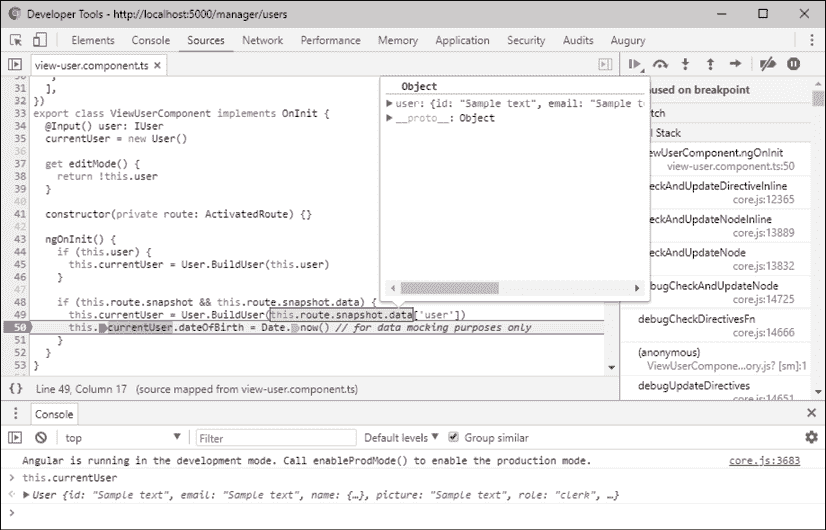
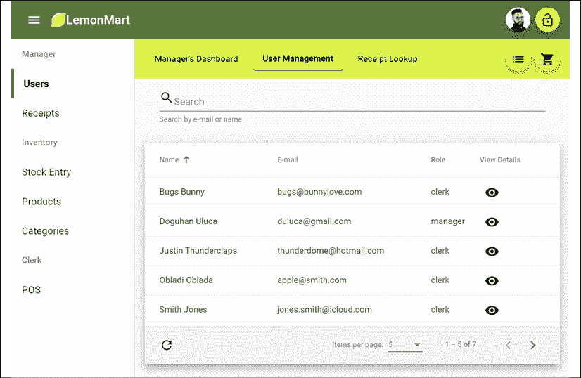
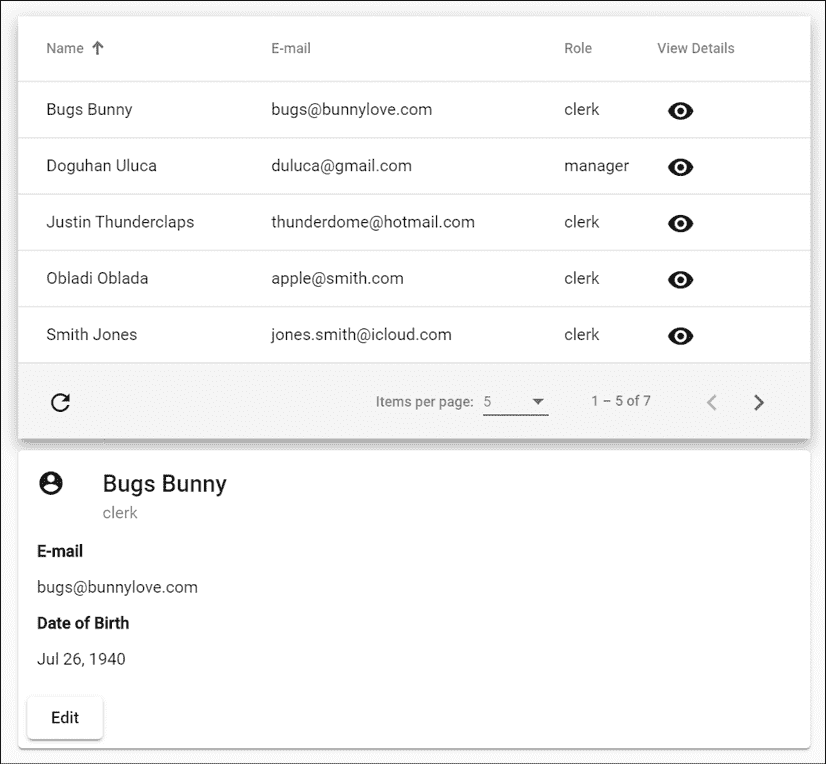
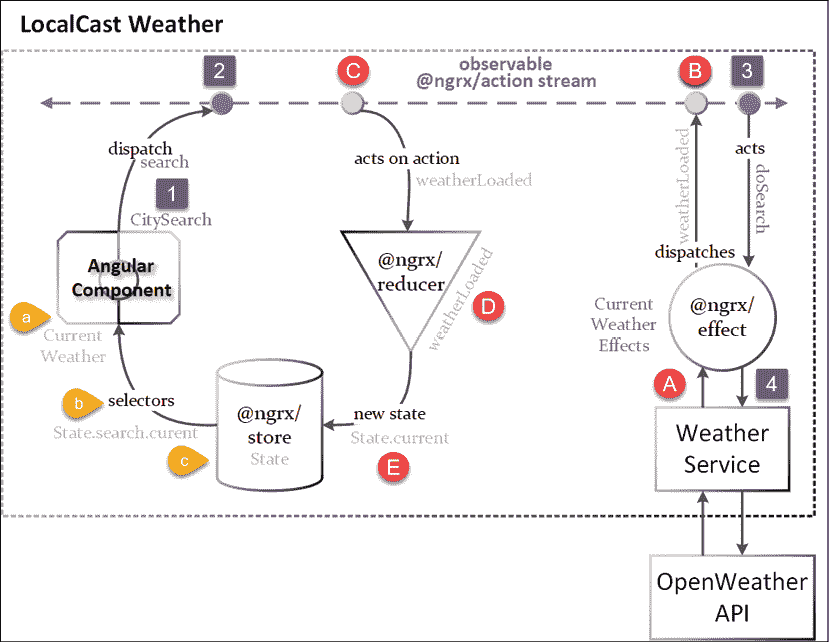
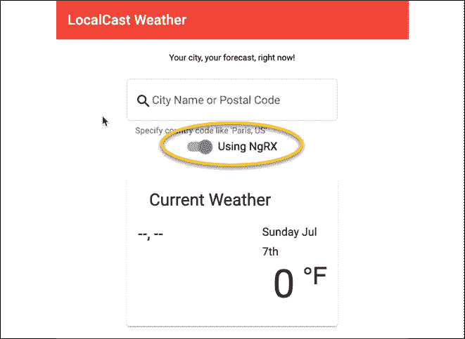
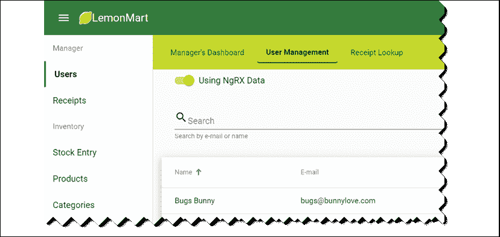
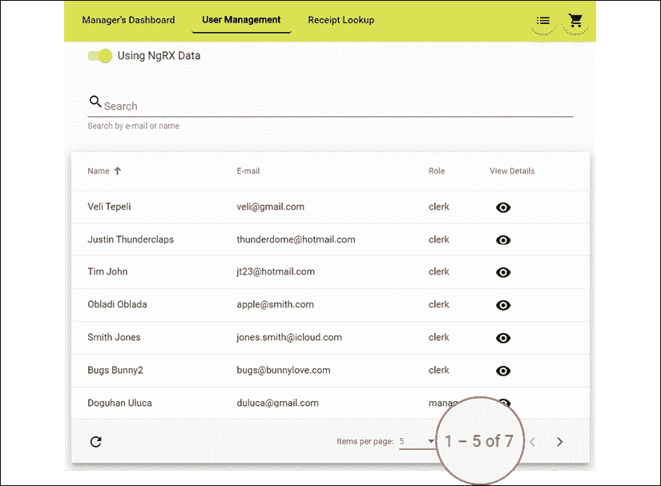

# 十二、秘籍——主要/细节、数据表和 NgRx

在本章中，我们通过实现业务应用中最常用的两个功能：主/详细视图和数据表，在 LemonMart 上完成路由优先体系结构的实现。我演示了带有服务器端分页的数据表，重点介绍了使用 LemonMart 和 LemonMart 服务器的前端和后端之间的集成。

在实施本章中概述的方法时，确保您的**lemon mart 服务器**已启动并运行。更多信息请参见*第 10 章*、*RESTful API 和全栈实现*。

我们利用路由编排的概念来编排组件加载数据或渲染的方式。在导航到组件之前加载数据时，我们使用 resolve guards 来减少样板代码。我们使用辅助路由通过路由配置布局组件。我们在多个上下文中重用同一组件。

然后，我们使用 LocalCast Weather 应用深入了解 NgRx，并使用 LemonMart 探索 NgRx 数据，这样您就可以熟悉 Angular 中更高级的应用体系结构概念。到本章结束时，我们将讨论棱角材质和棱角材质必须提供的大部分主要功能。

本章涵盖了很多方面。它是以秘籍格式组织的，因此您可以在处理项目时快速引用特定的实现。我将介绍实现的体系结构、设计和主要组件。我重点介绍了一些重要的代码，以解释解决方案是如何结合在一起的。利用到目前为止所学的知识，我希望读者能够填写例行实现和配置细节。但是，如果遇到问题，您可以随时参考 GitHub 回购协议。

在本章中，您将了解以下主题：

*   使用 resolve guards 加载数据
*   具有路由数据的可重用组件
*   使用辅助管线的主视图/详图视图
*   带分页的数据表
*   NgRx 存储和效果
*   NgRx 数据库

本书示例代码的最新版本在 GitHub 上，位于下面列表中链接的存储库中。存储库包含代码的最终和完成状态。您可以在本章末尾通过在`projects`文件夹下查找代码的章末快照来验证您的进度。

要根据**柠檬超市**设置本章示例，请执行以下操作：

1.  在[克隆回购协议 https://github.com/duluca/lemon-mart](https://github.com/duluca/lemon-mart)
2.  在根文件夹上执行`npm install`以安装依赖项
3.  本章的代码示例位于以下子文件夹下：

    ```ts
    projects/ch12 
    ```

4.  要运行本章的 Angular 应用，请执行以下命令：

    ```ts
    npx ng serve ch12 
    ```

5.  要运行本章的Angular单元测试，请执行以下命令：

    ```ts
    npx ng test ch12 --watch=false 
    ```

6.  要运行本章的Angular e2e 测试，请执行以下命令：

    ```ts
    npx ng e2e ch12 
    ```

7.  要为本章构建生产就绪的 Angular 应用，请执行以下命令：

    ```ts
    npx ng build ch12 --prod 
    ```

请注意，存储库根目录下的`dist/ch12`文件夹将包含编译后的结果。

为准备本章基于**本地天气 app**的示例，请执行以下步骤：

1.  在[克隆回购协议 https://github.com/duluca/local-weather-app](https://github.com/duluca/local-weather-app)
2.  在根文件夹上执行`npm install`以安装依赖项
3.  本章的代码示例位于以下子文件夹下：

    ```ts
    projects/ch12 
    ```

4.  要运行本章的 Angular 应用，请执行以下命令：

    ```ts
    npx ng serve ch12 
    ```

5.  要运行本章的Angular单元测试，请执行以下命令：

    ```ts
    npx ng test ch12 --watch=false 
    ```

6.  要运行本章的Angular e2e 测试，请执行以下命令：

    ```ts
    npx ng e2e ch12 
    ```

7.  要为本章构建生产就绪的 Angular 应用，请执行以下命令：

    ```ts
    npx ng build ch12 --prod 
    ```

请记住，存储库根目录下的`dist/ch12`文件夹将包含编译后的结果。

请注意，书中或 GitHub 上的源代码可能并不总是与 Angular CLI 生成的代码匹配。书中的代码和 GitHub 上的代码在实现上也可能有细微的差异，因为生态系统是不断发展的。随着时间的推移，示例代码自然会发生变化。同样在 GitHub 上，希望找到更正、修复以支持库的更新版本，或者并排实现多种技术以供读者观察。读者只希望实现书中推荐的理想解决方案。如果发现错误或有问题，请在 GitHub 上创建问题或提交请求，以方便所有读者。

您可以在*附录 C*、*保持 Angular 和 Tools 常青*中了解更多关于更新 Angular 的信息。您可以从[在线找到此附录 https://static.packt-cdn.com/downloads/9781838648800_Appendix_C_Keeping_Angular_and_Tools_Evergreen.pdf](https://static.packt-cdn.com/downloads/9781838648800_Appendix_C_Keeping_Angular_and_Tools_Evergreen.) 或[处 https://expertlysimple.io/stay-evergreen](https://expertlysimple.io/stay-evergreen) 。

在下一节中，我们将学习 resolve guards，以便简化代码并减少样板文件的数量。

# 编辑现有用户

在*第 11 章**秘籍——可重用性、路由和缓存*中，我们创建了一个具有和`editUser`功能的`ViewUserComponent`。在本章后面的章节中，当在系统中实现主/详细视图时，我们需要此功能，在主/详细视图中，管理员可以看到系统中的所有用户，并能够对其进行编辑。在启用`editUser`功能之前，我们需要确保`ProfileComponent`旁边的`ViewUserComponent`组件可以加载任何给定 ID 的用户。

让我们从实现一个可用于这两个组件的解析保护开始。

## 使用 resolve guard 加载数据

解析防护是一种路由防护，如*第 8 章*、*设计认证和授权*所述。resolve guard 可以通过从`route`参数中读取记录 ID 来加载组件所需的数据，异步加载数据，并在组件激活和初始化时将其准备就绪。

resolve guard 的主要优点包括加载逻辑的可重用性、样板代码的减少以及依赖关系的消除，因为组件可以接收其所需的数据，而无需导入任何服务：

1.  Create a new `user.resolve.ts` class under `user/user`:

    ```ts
    **src/app/user/user/user.resolve.ts**
    import { Injectable } from '@angular/core'
    import { ActivatedRouteSnapshot, Resolve } from '@angular/router'
    import { catchError, map } from 'rxjs/operators'
    import { transformError } from '../../common/common'
    import { IUser, User } from './user'
    import { UserService } from './user.service'
    @Injectable()
    export class UserResolve implements Resolve<IUser> { constructor(private userService: UserService) {}
      resolve(route: ActivatedRouteSnapshot) {
        return this.userService
          .getUser(route.paramMap.get('userId'))
          .pipe(map(User.Build), catchError(transformError))
      }
    } 
    ```

    请注意，与`UserService`中的`updateUser`方法类似，我们使用`map(User.Build)`来水合`user`对象，因此当组件从`route`快照加载数据时，可以使用它，我们将在下面看到。

2.  Provide the resolver in `user.module.ts`.

    接下来，让我们配置`router`和`ProfileComponent`以能够加载现有用户。

3.  Modify `user-routing.module.ts` to add a new path, `profile/:userId`, with a route resolver and the `canActivate AuthGuard`:

    ```ts
    **src/app/user/user-routing.module.ts**
    ...
    {
        path: 'profile/:userId',
        component: ProfileComponent,
        resolve: {
          user: UserResolve,
        },
        canActivate: [AuthGuard],
      },
      ... 
    ```

    记住在`user.module.ts`中提供`UserResolve`和`AuthGuard`。

4.  更新`profile`组件，从`route`加载数据（如果存在）：

    ```ts
    **src/app/user/profile/profile.component.ts**
    ...
      constructor(
        ...
        **private route: ActivatedRoute**
      ) {
        super()
      }
      ngOnInit() {
        this.formGroup = this.buildForm()
        if (**this.route.snapshot.data.user**) {
          **this.patchUser(this.route.snapshot.data.user)**
        } else {
          this.subs.sink = combineLatest(
            [this.loadFromCache(), 
             this.authService.currentUser$]
           )
          .pipe(
            filter(
              ([cachedUser, me]) => 
                cachedUser != null || me != null
            ),
            tap(
              ([cachedUser, me]) => 
               this.patchUser(cachedUser || me)
            )
          )
          .subscribe()
        }
      } 
    ```

我们首先检查`route`快照中是否存在用户。如果是这样，我们调用`patchUser`加载该用户。否则，我们返回到我们的条件缓存加载逻辑。

注意，`patchUser`方法还设置了`currentUserId`和`nameInitialDate$`可观测值，并调用`patchUpdateData`库来更新表单数据。

您可以通过使用您的用户 ID 导航到配置文件来验证解析程序是否正常工作。使用开箱即用设置，此 URL 将类似于`http://localhost:5000/user/profile/5da01751da27cc462d265913`。

## 使用绑定和路由数据重用组件

现在，让我们重构`viewUser`组件，以便在多个上下文中重用它。根据创建的实物模型，用户信息在应用中的两个位置显示。

首先是我们在上一章中实现的用户配置文件的**审查**步骤。第二个位置在`/manager/users`路线的用户管理屏幕上，如下所示：


图 12.1:Manager 用户管理模型

为了最大化代码重用，我们需要确保我们的共享`ViewUser`组件可以在两种上下文中使用。

对于多步骤输入表单的**审阅**步骤，我们只需将当前用户绑定到它。在第二个用例中，组件将需要使用 resolve guard 加载自己的数据，因此我们不需要实现额外的逻辑来实现我们的目标：

1.  Update the `viewUser` component to inject the `ActivatedRoute` object and set `currentUser$` from the route in `ngOnInit()`:

    ```ts
    **src/app/user/view-user/view-user.component.ts**
    ...
    import { ActivatedRoute } from '@angular/router'
    export class ViewUserComponent implements OnChanges, OnInit {
      ...
      constructor(
        private route: ActivatedRoute, private router: Router
        ) {} 
      ngOnInit() {
        if (this.route.snapshot.data.user) { 
          this.currentUser$.next(this.route.snapshot.data.user)
        }
      }
      ...
    } 
    ```

    `ngOnInit`仅在组件首次初始化或路由到时触发一次。在这种情况下，如果路由的任何数据已被解析，则将使用`next()`功能将其推送到`this.currentUser$`。

    我们现在有两个独立的事件来更新数据；一个用于`ngOnChanges`，处理`@Input`值的更新，如果`this.user`已绑定，则将其推送到`BehaviorSubject currentUser$`。

    为了能够跨多个延迟加载的模块使用此组件，我们必须将其包装在自己的模块中：

2.  Create a new `shared-components.module.ts` under `src/app`:

    ```ts
    **src/app/shared-components.module.ts**
    import { CommonModule } from '@angular/common'
    import { NgModule } from '@angular/core'
    import { FlexLayoutModule } from '@angular/flex-layout'
    import { ReactiveFormsModule } from '@angular/forms'
    import { AppMaterialModule } from './app-material.module'
    import { 
      ViewUserComponent 
    } from './user/view-user/view-user.component'
    @NgModule({
      imports: [
        CommonModule,
        ReactiveFormsModule,
        FlexLayoutModule,
        AppMaterialModule,
      ],
      declarations: [ViewUserComponent],
      exports: [ViewUserComponent],
    })
    export class SharedComponentsModule {} 
    ```

    确保将`SharedComponentsModule`模块导入到您打算在中使用`ViewUserComponent`的每个功能模块中。在我们的例子中，这些将是`UserModule`和`ManagerModule`。

3.  从`User`模块声明中删除`ViewUserComponent`
4.  同样地，在`SharedComponentsModule`中申报并出口`NameInputComponent`，然后清理其其他申报
5.  导入`SharedComponentsModule`中支持`ViewUserComponent`和`NameInputComponent`所需的模块，如`FieldErrorModule`

现在，我们已经准备好了开始实现主/详细视图的关键部分。让我们下一步再看一遍。

# 主/局部视图辅助管线

路由优先体系结构的真正力量是通过使用辅助路由实现的，其中我们可以通过路由配置单独影响组件的布局，允许丰富的场景，我们可以将现有组件重新混合到不同的布局中。辅助路由是相互独立的路由，它们可以在标记中定义的命名出口中呈现内容，例如`<router-outlet name="master">`或`<router-outlet name="detail">`。此外，辅助管线可以有自己的参数、浏览器历史记录、子管线和嵌套辅助管线。

在以下示例中，我们将使用辅助管线实现基本主视图/详细视图：

1.  实现一个简单组件，并定义两个命名出口：

    ```ts
    **src/app/manager/user-management/user-management.component.ts**
      template: `
        <div class="horizontal-padding">
          <router-outlet name="master"></router-outlet>
          <div style="min-height: 10px"></div>
          <router-outlet name="detail"></router-outlet>
        </div>
      ` 
    ```

2.  在 manager 下添加新的`userTable`组件
3.  Update `manager-routing.module.ts` to define the auxiliary routes:

    ```ts
    **src/app/manager/manager-routing.module.ts**
      ...
        {
          path: 'users',
          component: UserManagementComponent,
          children: [
            { 
              path: '', component: UserTableComponent, 
               outlet: 'master' 
            },
            {
              path: 'user',
              component: ViewUserComponent,
              outlet: 'detail',
              resolve: {
                user: UserResolve,
              },
            },
          ],
          canActivate: [AuthGuard],
          canActivateChild: [AuthGuard],
          data: {
            expectedRole: Role.Manager,
          },
        },
    ... 
    ```

    这意味着当用户导航到`/manager/users`时，他们会看到`UserTableComponent`，因为它是用默认路径实现的。

4.  在`manager.module.ts`中提供`UserResolve`，因为`viewUser`依赖于它
5.  Implement a temporary button in `userTable`:

    ```ts
    **src/app/manager/user-table/user-table.component.html**
    <a mat-button mat-icon-button [routerLink]="['/manager/users', 
        { outlets: { detail: ['user', { userId: row._id}] } }]"
        skipLocationChange>
      <mat-icon>visibility</mat-icon>
    </a> 
    ```

    `skipLocationChange`指令导航时没有将新记录推向历史。因此，如果用户查看多条记录并点击**后退**按钮，它们将返回到上一屏幕，而不必首先滚动查看记录。

    假设用户点击**查看详细信息**按钮，就像前面定义的按钮一样，那么`ViewUserComponent`将以给定的`userId`为用户呈现。在下一个屏幕截图中，您可以看到在我们实现下一节中的数据表后，**查看详细信息**按钮的外观：

    

    图 12.2：查看详细信息按钮

    您可以为主视图和详图定义任意多个组合和替代组件，从而允许动态布局的无限可能性。然而，建立`routerLink`可能是一个令人沮丧的经历。根据具体情况，您必须提供或不提供链路中的所有或部分插座。例如，对于前面的场景，如果链接是`['/manager/users', { outlets: { master: [''], detail: ['user', {userId: row.id}] } }]`，则路由将自动加载失败。预计这些怪癖将在未来的 Angular 版本中解决。

    现在我们已经完成了`ViewUserComponent`解析保护的实现，您可以使用 Chrome DevTools 查看数据是否正确加载。

    在调试之前，确保我们在*第 10 章*、*RESTful API 和全栈实现*中创建的**lemon mart 服务器**正在运行。

6.  In Chrome DevTools, set a break point right after `this.currentUser` is assigned, as shown:

    

    图 12.3：调试 ViewUserComponent 的开发工具

您将看到，`this.currentUser`的设置是正确的，没有在`ngOnInit`函数中加载数据的任何样板代码，显示了解析保护的真正好处。`ViewUserComponent`为局部视图；现在，让我们将主视图实现为带有分页的数据表。

# 带分页的数据表

我们已经创建了脚手架来布置我们的主视图/详细视图。在主插座中，我们将有一个分页的用户数据表，所以让我们实现`UserTableComponent`，它将包含一个名为`dataSource`的`MatTableDataSource`属性。我们需要能够使用`pageSize`和`pagesToSkip`等标准分页控件批量获取用户数据，并能够进一步缩小用户提供`searchText`的选择范围。

让我们从开始，向`UserService`添加必要的功能：

1.  实现一个新的`IUsers`接口来描述分页数据的数据结构：

    ```ts
    **src/app/user/user/user.service.ts**
    ...
    export interface IUsers {
      data: IUser[]
      total: number
    } 
    ```

2.  使用`getUsers`功能更新`UserService`的接口：

    ```ts
    **src/app/user/user/user.service.ts**
    ...
    export interface IUserService {
      getUser(id: string): Observable<IUser>
      updateUser(id: string, user: IUser): Observable<IUser>
      **getUsers(pageSize: number, searchText: string,** 
     **pagesToSkip: number): Observable<IUsers>**
    }
    export class UserService extends CacheService implements IUserService {
    ... 
    ```

3.  Add `getUsers` to `UserService`:

    ```ts
    **src/app/user/user/user.service.ts**
    ...
    getUsers(
        pageSize: number,
        searchText = '',
        pagesToSkip = 0,
        sortColumn = '',
        sortDirection: '' | 'asc' | 'desc' = 'asc'
      ): Observable<IUsers> {
        const recordsToSkip = pageSize * pagesToSkip
        if (sortColumn) {
          sortColumn =
            sortDirection === 'desc' ? `-${sortColumn}` : sortColumn
        }
        return this.httpClient.get<IUsers>(
          `${environment.baseUrl}/v2/users`, { 
            params: {
              filter: searchText,
              skip: recordsToSkip.toString(),
              limit: pageSize.toString(),
              sortKey: sortColumn,
            },
          })
        }
    ... 
    ```

    请注意，排序方向由关键字`asc`表示升序，关键字`desc`表示降序。当我们想按升序对列进行排序时，我们将列名作为参数传递给服务器。要按降序对列进行排序，我们在列名前加上减号。

4.  Set up `UserTable` with pagination, sorting, and filtering:

    ```ts
    **src/app/manager/user-table/user-table.component.ts**
    ...
    @Component({
      selector: 'app-user-table',
      templateUrl: './user-table.component.html',
      styleUrls: ['./user-table.component.css'],
    })
    export class UserTableComponent implements OnDestroy, AfterViewInit {
      displayedColumns = ['name', 'email', 'role', '_id']
      items$: Observable<IUser[]>
      resultsLength = 0
      hasError = false
      errorText = ''
      private skipLoading = false
      private subs = new SubSink()
      readonly isLoadingResults$ = new BehaviorSubject(true)
      loading$: Observable<boolean>
      refresh$ = new Subject()
      search = new FormControl('', OptionalTextValidation)
      @ViewChild(MatPaginator, { static: false })
        paginator: MatPaginator 
      @ViewChild(MatSort, { static: false }) sort: MatSort
      constructor(
        private userService: UserService
      ) {
        this.loading$ = this.isLoadingResults$
      }
      getUsers(
        pageSize: number,
        searchText: string,
        pagesToSkip: number,
        sortColumn: string,
        sortDirection: SortDirection
      ): Observable<IUsers> {
        return this.userService.getUsers(
          pageSize,
          searchText,
          pagesToSkip,
          sortColumn,
          sortDirection
        )
      }
      ngOnDestroy(): void {
        this.subs.unsubscribe()
      }
      ngAfterViewInit() {
        this.subs.sink = this.sort.sortChange
          .subscribe(() => this.paginator.firstPage()) 
        if (this.skipLoading) {
          return
        }
        **this.items$ = merge(**
     **this.refresh$,**
     **this.sort.sortChange,**
     **this.paginator.page,**
     **this.search.valueChanges.pipe(debounceTime(1000))**
     **).pipe(**
     **startWith({}),**
     **switchMap(() => {**
     **this.isLoadingResults$.next(true)**
     **return this.getUsers(**
     **this.paginator.pageSize,**
     **this.search.value,**
     **this.paginator.pageIndex,**
     **this.sort.active,**
     **this.sort.direction**
     **)**
     **}),**
     **map((results: { total: number; data: IUser[] }) => {**
     **this.isLoadingResults$.next(false)**
     **this.hasError = false**
     **this.resultsLength = results.total**
     **return results.data**
     **}),**
     **catchError((err) => {**
     **this.isLoadingResults$.next(false)**
     **this.hasError = true**
     **this.errorText = err**
     **return of([])**
     **})**
     **)**
     **this.items$.subscribe()**
      }
    } 
    ```

    我们定义并初始化各种属性，以支持加载分页数据。`items$`存储用户记录，`displayedColumns`定义我们要显示的数据列，`paginator`和`sort`提供分页和排序首选项，`search`提供我们需要过滤结果的文本。

    在`ngAfterViewInit`中，我们使用`merge`方法，如前面的片段中所强调的，来监听分页、排序和筛选属性中的更改。如果一个属性发生更改，将触发整个管道。这与我们在`AuthService`中实现登录例程的方式类似。管道包含对`this.userService.getUsers`的调用，该调用将根据传入的分页、排序和筛选首选项检索用户。然后，结果通过管道传输到`this.items$`可观测数据中，数据表使用`async`管道订阅该数据表，因此它可以显示数据。

5.  创建一个包含以下物料模块的`ManagerMaterialModule`：

    ```ts
    **src/app/manager/manager-material.module.ts**
        MatTableModule,
        MatSortModule,
        MatPaginatorModule,
        MatProgressSpinnerModule,
        MatSlideToggleModule, 
    ```

6.  确保正确导入以下内容：
    *   新的`ManageMaterialModule`
    *   基线`AppMaterialModule`
    *   以下所需模块：`FormsModule`、`ReactiveFormsModule`和`FlexLayoutModule`
7.  执行`userTable`

    ```ts
    **src/app/manager/user-table/user-table.component.css**
    .loading-shade {
      position: absolute;
      top: 0;
      left: 0;
      bottom: 56px;
      right: 0;
      background: rgba(0, 0, 0, 0.15);
      z-index: 1;
      display: flex;
      align-items: center;
      justify-content: center;
    }
    .filter-row {
      min-height: 64px;
      padding: 8px 24px 0;
    }
    .full-width {
      width: 100%;
    }
    .mat-paginator {
      background: transparent;
    } 
    ```

    的CSS
8.  Finally, implement the `userTable` template:

    ```ts
    **src/app/manager/user-table/user-table.component.html**
    <div class="filter-row">
      <form style="margin-bottom: 32px">
        <div fxLayout="row">
          <mat-form-field class="full-width">
            <mat-icon matPrefix>search</mat-icon>
            <input matInput placeholder="Search" aria-label="Search" [formControl]="search" />
            <mat-hint>Search by e-mail or name</mat-hint>
            <mat-error *ngIf="search.invalid">
              Type more than one character to search
            </mat-error>
          </mat-form-field>
        </div>
      </form>
    </div>
    <div class="mat-elevation-z8">
      <div class="loading-shade" *ngIf="loading$ | async as loading">
        <mat-spinner *ngIf="loading"></mat-spinner>
        <div class="error" *ngIf="hasError">
          {{ errorText }}
        </div>
      </div>
      <table mat-table class="full-width" [dataSource]="items$ | async" matSort
        matSortActive="name" matSortDirection="asc" matSortDisableClear>
        <ng-container matColumnDef="name">
          <th mat-header-cell *matHeaderCellDef mat-sort-header> Name </th>
          <td mat-cell *matCellDef="let row">
            {{ row.fullName }}
          </td>
        </ng-container>
        <ng-container matColumnDef="email">
          <th mat-header-cell *matHeaderCellDef mat-sort-header> E-mail </th>
          <td mat-cell *matCellDef="let row"> {{ row.email }} </td>
        </ng-container>
        <ng-container matColumnDef="role">
          <th mat-header-cell *matHeaderCellDef mat-sort-header> Role </th>
          <td mat-cell *matCellDef="let row"> {{ row.role }} </td>
        </ng-container>
        <ng-container matColumnDef="_id">
          <th mat-header-cell *matHeaderCellDef>View Details
          </th>
          <td mat-cell *matCellDef="let row" style="margin-right: 8px">
            <a mat-button mat-icon-button [routerLink]="[
                '/manager/users',
                { outlets: { detail: ['user', { userId: row._id }] } }
              ]" skipLocationChange>
              <mat-icon>visibility</mat-icon>
            </a>
          </td>
        </ng-container>
        <tr mat-header-row *matHeaderRowDef="displayedColumns"></tr>
        <tr mat-row *matRowDef="let row; columns: displayedColumns"> </tr>
      </table>
      <mat-toolbar>
        <mat-toolbar-row>
          <button mat-icon-button (click)="refresh$.next()">
            <mat-icon title="Refresh">refresh</mat-icon>
          </button>
          <span class="flex-spacer"></span>
          <mat-paginator [pageSizeOptions]="[5, 10, 25, 100]"
                         [length]="resultsLength">
          </mat-paginator>
        </mat-toolbar-row>
      </mat-toolbar>
    </div> 
    ```

    只有主视图，表格如以下屏幕截图所示（确保您已更新到 Angular 的最新版本！）：

    

    图 12.4：用户表

    如果您点击**视图**图标，`ViewUserComponent`将在细节输出中得到渲染，如图所示：

    

    图 12.5：主视图/详图视图

    在上一章中，我们实现了**编辑**按钮，将`userId`传递给`UserProfile`，以便对数据进行编辑和更新。

9.  点击**编辑**按钮进入`ProfileComponent`，编辑用户记录，验证您是否可以更新其他用户记录
10.  确认您可以在数据表中查看更新的用户记录

对于本书而言，带有分页的数据表的演示完成了 LemonMart 的主要功能。现在，在我们继续之前，让我们确保所有测试都通过。

## 更新单元测试

让我们看一下对`ProfileComponent`和`UserTableComponent`的一些单元测试，看看我们如何利用不同的技术来测试组件：

1.  Observe the unit test file for `ProfileComponent` and identify the use of the `authServiceMock` object to provide initial data for the component:

    ```ts
    **src/app/user/profile/profile.component.spec.ts**
    describe('ProfileComponent', () => {
      let component: ProfileComponent
      let fixture: ComponentFixture<ProfileComponent>
      let authServiceMock: jasmine.SpyObj<AuthService>
      beforeEach(async(() => {
        const authServiceSpy = autoSpyObj(
          AuthService,
          ['currentUser$', 'authStatus$'],
          ObservablePropertyStrategy.BehaviorSubject
        )
        TestBed.configureTestingModule({
          providers: commonTestingProviders.concat({
            provide: AuthService,
            useValue: authServiceSpy,
          }),
          imports: commonTestingModules.concat([
            UserMaterialModule,
            FieldErrorModule,
            LemonRaterModule,
          ]),
          declarations: [ProfileComponent, NameInputComponent, ViewUserComponent],
        }).compileComponents()
        authServiceMock = injectSpy(AuthService)
        fixture = TestBed.createComponent(ProfileComponent)
        component = fixture.debugElement.componentInstance
      }))
      it('should create', () => {
        authServiceMock.currentUser$.next(new User())
        authServiceMock.authStatus$.next(defaultAuthStatus)
        fixture.detectChanges()
        expect(component).toBeTruthy()
      })
    }) 
    ```

    请注意，我没有使用`angular-unit-test-helper`中的`createComponentMock`函数来导入`NameInputComponent`或`ViewUserComponent`，而是导入了它们的实际实现。这是因为`createComponentMock`还不够复杂，无法处理将数据绑定到子组件的问题。在*进一步阅读*一节中，我加入了爱子·克洛斯特曼（Aiko Klostermann）的一篇博文，内容涉及测试具有`@Input()`特性的Angular组件。

2.  Open the spec file for `UserTableComponent`:

    在修复其提供程序和导入之后，您将注意到`UserTableComponent`抛出了一个`ExpressionChangedAfterItHasBeenCheckedError`错误。这是，因为组件初始化逻辑需要定义`dataSource`。如果未定义，则无法创建组件。但是，我们可以在第二个`beforeEach`方法中轻松修改组件属性，该方法在`TestBed`将真实、模拟或虚假依赖注入组件类后执行。有关测试数据设置，请参见以下代码段中突出显示的更改：

    ```ts
    **src/app/manager/user-table/user-table.component.spec.ts**
    ...
    beforeEach(() => {
        fixture = TestBed.createComponent(UserTableComponent)
        component = fixture.componentInstance
        **component.items$ = of([new User()])**
     **Object.assign(component, { skipLoading: true })**
        fixture.detectChanges()
    })
    ... 
    ```

    到目前为止，您可能已经注意到，只需更新我们的一些中央配置文件，例如`commonTestingProviders`和`commonTestingModules`，一些测试就通过了，其余的测试可以通过应用我们在本书中一直使用的各种模式来解决。例如，`user-management.component.spec.ts`使用我们创建的通用测试模块和提供程序：

    ```ts
    **src/app/manager/user-management/user-management.component.spec.ts**
    providers: commonTestingProviders,
    imports: commonTestingModules.concat([ManagerMaterialModule]), 
    ```

    当您是模拟提供者时，请记住正在测试的模块、组件、服务或类，并只注意模拟依赖项。

    `ViewUserComponent`是一种特殊情况，我们不能使用我们的通用测试模块和提供者，否则，我们将最终创建一个循环依赖。在这种情况下，请手动指定需要导入的模块。

3.  修复单元测试配置，使所有配置都通过，并且不会生成警告。

随着实现的繁重工作完成，我们现在可以探索替代的体系结构、工具和库，以更好地理解为各种需求构建 Angular 应用的最佳方法。接下来，让我们探索 NgRx。

# NgRx 存储和效果

如*第一章*、*Angular 及其概念简介*所述，NgRx 库将基于 RxJS 的反应状态管理引入 Angular。NgRx 的状态管理允许开发人员编写原子的、自包含的和可组合的代码片段，创建操作、减缩器和选择器。这种反应式编程允许隔离状态变化中的副作用。本质上，NgRx 是 RxJS 上的一个抽象层，以适应流量模式。

NgRx 有四个主要元素：

*   **Store**: The central location where state information is persisted. You implement a reducer to store a state transition in the store and a selector to read data out of the store. These are atomic and composable pieces of code.

    视图（或用户界面）使用选择器显示存储中的数据。

*   **Action**: Unique events that happen throughout your app.

    从视图触发操作，目的是将其分派到存储区。

*   **Dispatcher**: This is a method to send actions to the store.

    存储上的还原程序侦听已调度的操作。

*   **效果**：这是动作和调度的组合。效果通常用于未从视图触发的操作。

让我们回顾一下下面的通量模式图，它现在突出显示了**效应**：


图 12.6：通量模式图

让我们通过一个具体的例子来演示 NgRx 是如何工作的。为了保持简单，我们将利用 LocalCast 天气应用。

## 实现本地广播天气的 NgRx

我们将实施 NgRx，以执行 LocalCast 天气应用中的搜索功能。考虑下面的架构图：



图 12.7:LocalCast 天气架构

为了实现我们的实现，我们将同时使用 NgRx 存储库和效果库。NgRx 存储操作在带有`WeatherLoaded`减速器和 app 状态的浅灰色图中反映。在顶部，动作被表示为各种数据对象的流，这些数据对象可以是分派动作，也可以是对分派的动作进行操作，使我们能够实现流量模式。NgRx 效应库通过在其自己的模型中隔离副作用而扩展了通量模式，而不会用临时数据乱丢存储。

效果工作流以深灰色表示，从**步骤 1**开始：

1.  `CitySearchComponent`发出`search`动作
2.  `search`动作出现在可观察的`@ngrx/action`流（或数据流）上
3.  `CurrentWeatherEffects`对`search`动作执行搜索
4.  `WeatherService`执行搜索，从**OpenWeather API**中检索当前天气信息

存储动作，以浅灰色表示，从**步骤 A**开始：

1.  `CurrentWeatherEffects`发出`weatherLoaded`动作
2.  `weatherLoaded`动作出现在数据流上
3.  `weatherLoaded`作用于减速器上
4.  `weatherLoaded`减速机将要存储的天气信息转换为新状态
5.  `appStore`新状态的一部分`search`

请注意，有一个父级`appStore`状态，其中包含一个子`search`状态。我有意保留此设置，以演示在向存储添加不同类型的数据元素时，父级状态是如何扩展的。

最后，一个视图从存储读取，从**步骤 a**开始：

1.  `CurrentWeather`组件使用`async`管道订阅`selectCurrentWeather`选择器
2.  `selectCurrentWeather`选择器侦听`appStore`状态下`store.search.current`属性的更改
3.  `appStore`状态检索持久化数据

使用 NgRx，当用户搜索一个城市时，通过单个可组合和不可变元素自动在`CurrentWeatherComponent`上检索、保存和显示该信息。

## 比较 BehaviorSubject 和 NgRx

我们将与`BehaviorSubjects`并排实现 NgRx，因此您可以看到相同功能实现中的差异。为此，我们需要一个滑动开关在两种策略之间切换：

本节使用**本地天气 app**回购。您可以在`projects/ch12`文件夹下找到本章的代码示例。

1.  Start by implementing a `<mat-slide-toggle>` element on `CitySearchComponent`, as shown in the following screenshot:

    

    图 12.8:LocalCast 天气滑动开关

    确保该字段由组件上名为`useNgRx`的属性支持。

2.  重构`doSearch`方法，将`BehaviorSubject`代码提取为自己的函数`behaviorSubjectBasedSearch`
3.  存根输出一个名为`ngRxBasedSearch`：

    ```ts
    **src/app/city-search/city-search.component.ts**
    doSearch(searchValue: string) {
      const userInput = searchValue.split(',').map((s) => s.trim())
      const searchText = userInput[0]
      const country = userInput.length > 1 ? userInput[1] : undefined
      **if (this.useNgRx) {**
     **this.ngRxBasedSearch(searchText, country)**
     **} else {**
     **this.behaviorSubjectBasedSearch(searchText, country)**
     **}**
    } 
    ```

    的函数

我们将从您刚刚创建的`ngRxBasedSearch`函数中分派一个操作。

## 设置 NgRx

您可以使用以下命令添加 NgRx 存储包：

```ts
$ npx ng add @ngrx/store 
```

这将创建一个包含`index.ts`文件的 reducers 文件夹。现在添加 NgRx 效果包：

```ts
$ npx ng add @ngrx/effects --minimal 
```

我们在这里使用`--minimal`选项以避免创建不必要的样板文件。

接下来，安装 NgRx 原理图库，以便您可以利用生成器为您创建样板代码：

```ts
$ npm i -D @ngrx/schematics 
```

由于 NgRx 的高度解耦特性，实现 NgRx 可能会令人困惑，这可能需要对库的内部工作进行一些深入了解。

`projects/ch12`下的样本项目配置`@ngrx/store-devtools`进行调试。

如果您希望在运行期间能够执行`console.log`NgRx 动作进行调试或插装，请参阅*附录 A*、*调试*。

## 定义 NgRx 操作

在我们能够实现效果或还原之前，我们首先需要定义我们的应用能够执行的操作。对于 LocalCast 天气，有两种类型的操作：

*   `search`：获取正在搜索的城市或邮政编码的当前天气
*   `weatherLoaded`：表示已获取新的当前天气信息

通过运行以下命令创建名为`search`的操作：

```ts
$ npx ng generate @ngrx/schematics:action search --group --creators 
```

出现提示时使用默认选项。

`--group`选项将动作分组到名为`action`的文件夹下。`--creators`选项使用 creator 函数来实现操作和减缩器，这是实现这些组件的一种更为熟悉和简单的方法。

现在，让我们使用`createAction`函数实现这两个操作，提供名称和预期的输入参数列表：

```ts
**src/app/action/search.actions.ts**
import { createAction, props, union } from '@ngrx/store'
import { ICurrentWeather } from '../interfaces'
export const SearchActions = {
  search: createAction(
    '[Search] Search',
    props<{ searchText: string; country?: string }>()
  ),
  weatherLoaded: createAction( 
    '[Search] CurrentWeather loaded',
    props<{ current: ICurrentWeather }>()
  ),
}
const all = union(SearchActions)
export type SearchActions = typeof all 
```

搜索操作的名称为`'[Search] Search'`，输入为`searchText`和可选的`country`参数。`weatherLoaded`动作遵循类似的模式。在文件的末尾，我们创建了一个动作的联合类型，这样我们就可以将它们分组到一个父类型下，以便在应用的其余部分中使用。

请注意，操作名称前面有`[Search]`。这是一种惯例，可以帮助开发人员在调试期间直观地将相关操作分组在一起。

现在我们的操作已经确定，我们可以实现处理搜索操作的效果并发送`weatherLoaded`操作。

## 实施 NgRx 效应

如前所述，效果允许我们更改存储状态，而不必存储导致更改的事件数据。例如，我们希望我们的州只有天气数据，而不是搜索文本本身。效应让我们一步到位，而不是强迫我们使用`searchText`的中间存储和更复杂的事件链将其转换为天气数据。

否则，我们必须在两者之间实现一个减缩器，首先将该值存储在存储中，然后从服务中检索它并发送一个`weatherLoaded`操作。这将使从我们的服务中检索数据变得更简单。

现在让我们将`CurrentWeatherEffects`添加到我们的应用中：

```ts
$ npx ng generate @ngrx/schematics:effect currentWeather --module=app.module.ts --root --group --creators 
```

出现提示时使用默认选项。

您将在`effects`文件夹下有一个新的`current-weather.effects.ts`文件。

再次使用`--group`将效果分组到同名文件夹下。`--root`在`app.module.ts`中注册效果，我们使用`--creators`选项的 creator 函数。

在`CurrentWeatherEffects`文件中，从实现私有`doSearch`方法开始：

```ts
**src/app/effects/current-weather.effects.ts**
private doSearch(action: { searchText: string; country?: string }) {
  return this.weatherService.getCurrentWeather(
    action.searchText,
    action.country
  ).pipe(
    map((weather) =>
      SearchActions.weatherLoaded({ current: weather })
    ),
    catchError(() => EMPTY)
  )
} 
```

注意，我们选择忽略`EMPTY`函数抛出的错误。您可以使用`UiService`向用户显示这些错误，就像您为 LemonMart 实现的一样。

此函数使用搜索参数执行操作，调用`getCurrentWeather`，并在收到响应后发送`weatherLoaded`操作，传递当前天气属性。

现在让我们创建效果本身，这样我们就可以触发`doSearch`功能：

```ts
**src/app/effects/current-weather.effects.ts**
getCurrentWeather$ = createEffect(() =>
  this.actions$.pipe(
    ofType(SearchActions.search), 
    exhaustMap((action) => this.doSearch(action))
  )
) 
```

在这里，我们点击可观察的动作流`this.actions$`，聆听`SearchAction.search`类型的动作。然后，我们使用`exhaustMap`操作符注册发出的事件。由于其独特的性质，`exhaustMap`在`doSearch`函数完成发送其`weatherLoaded`操作之前，不允许处理另一个搜索操作。

被各种各样的 RxJS 操作符弄糊涂了，还担心你永远记不住它们？快速参考请参见*附录 B*、*Angular备忘单*。

## 实现减速器

触发`weatherLoaded`动作后，我们需要一种方法来接收当前的天气信息并将其存储在`appStore`状态。Reducer 将帮助我们处理特定的操作，创建一个独立的、不可变的管道，以可预测的方式存储数据。

让我们创建一个搜索缩减器：

```ts
$ npx ng generate @ngrx/schematics:reducer search 
    --reducers=reducers/index.ts --group --creators 
```

采用默认选项。在这里，我们使用`--group`将文件组织在`reducers`文件夹下，并使用`--creators`利用创建 NgRx 组件的创建者风格。我们还用`--reducers`指定了我们的母公司`appStore`州在`reducers/index.ts`的位置，因此我们的新减速器可以在该州注册。

您可能会注意到`reducers.index.ts`已更新以注册新的`search.reducer.ts`。让我们一步一步地实施它。

在`search`状态下，我们将存储当前天气，因此实现接口以反映：

```ts
**src/app/reducers/search.reducer.ts**
export interface State {
  current: ICurrentWeather
} 
```

现在让我们指定`initialState`。这类似于我们需要定义一个`BehaviorSubject`的默认值。重构`WeatherService`以导出一个`const defaultWeather: ICurrentWeather`对象，您可以使用该对象初始化`BehaviorSubject`和`initialState`。

```ts
**src/app/reducers/search.reducer.ts**
export const initialState: 
  State = { current:
  defaultWeather,
} 
```

最后，使用`on`操作符执行`searchReducer`处理`weatherLoaded`动作：

```ts
**src/app/reducers/search.reducer.ts**
const searchReducer = createReducer(
  initialState,
  on(SearchActions.weatherLoaded, (state, action) => {
    return {
      ...state,
    current: action.current,
    }
  })
) 
```

我们只需为`weatherLoaded`操作注册，然后打开其中存储的数据，并将其传递到`search`状态。

当然，这是一个非常简单的例子。然而，很容易想象一个更复杂的场景，我们可能需要扁平化或处理接收到的一段数据，并以易于使用的方式存储它。以不变的方式隔离这样的逻辑是利用 NgRx 这样的库的关键价值主张。

## 使用选择器向存储注册

我们需要`CurrentWeatherComponent`向`appStore`状态注册更新当前天气数据。

通过依赖注入`appStore`状态并注册选择器从`State`对象获取当前天气来启动：

```ts
**src/app/current-weather/current-weather.component.ts**
**import * as appStore from '../reducers'**
export class CurrentWeatherComponent {
  current$: Observable<ICurrentWeather>
  constructor(**private store: Store<appStore.State**>) {
    this.current$ =
      **this.store.pipe(select((state: State) => state.search.current))**
  } 
  ...
} 
```

我们只需监听流经存储的状态更改事件。使用`select`函数，我们可以实现一个内联选择来获取我们需要的数据。

我们可以对其进行一些重构，并通过使用`createSelector`在`reducers/index.ts`上创建`selectCurrentWeather`属性，使选择器可重用：

```ts
**src/app/reducers/index.ts**
export const selectCurrentWeather = createSelector(
  (state: State) => state.search.current,
  current => current
) 
```

另外，由于我们希望维护`BehaviorSubject`的持续运行，我们可以在`CurrentWeatherComponent`中实现一个`merge`操作符来监听`WeatherService`更新和`appStore`状态更新：

```ts
**src/app/current-weather/current-weather.component.ts**
import * as appStore from '../reducers'
  constructor(
    private weatherService: WeatherService,
    private store: Store<appStore.State>
  ) {
    this.current$ = merge(
      **this.store.pipe(select(appStore.selectCurrentWeather)),**
      this.weatherService.currentWeather$
    )
  } 
```

现在我们可以收听商店更新了，让我们实现谜题的最后一部分：调度搜索操作。

## 调度存储操作

我们需要调度搜索行动，以便我们的搜索效果能够获取当前天气数据并更新存储。在本章前面，您在`CitySearchComponent`中实现了一个名为`ngRxBasedSearch`的存根函数。

让我们实施`ngRxBasedSearch`：

```ts
**src/app/city-search/city-search.component.ts**
ngRxBasedSearch(searchText: string, country?: string) {
  this.store.dispatch(SearchActions.search({ searchText, country }))
} 
```

别忘了将`appState`存储注入组件中！

就这样！现在，您应该能够运行代码并进行测试，看看是否一切正常。

正如您所看到的，NgRx 将许多复杂的技术带到表中，以创建使数据转换不可变、定义良好和可预测的方法。然而，这带来了相当大的实现开销。使用你的最佳判断来确定你是否真的需要你的 Angular 应用中的通量模式。通常，通过实现返回 flat 数据对象的 RESTful API，并在服务器端处理复杂的数据操作，可以简化前端应用代码。

## 单元测试减速器和选择器

您可以在`search.reducer.spec.ts`中对`weatherLoaded`减速器和`selectCurrentWeather`选择器进行单元测试：

```ts
**src/app/reducers/search.reducer.spec.ts**
import { SearchActions } from '../actions/search.actions'
import { defaultWeather } from '../weather/weather.service'
import { fakeWeather } from '../weather/weather.service.fake'
import { selectCurrentWeather } from './index'
import { initialState, reducer } from './search.reducer'
describe('Search Reducer', () => {
  describe('weatherLoaded', () => {
    it('should return current weather', () => {
      const action = SearchActions.weatherLoaded({ current: fakeWeather })
      const result = reducer(initialState, action)
      expect(result).toEqual({ current: fakeWeather })
    })
  })
})
describe('Search Selectors', () => { 
  it('should selectCurrentWeather', () => {
    const expectedWeather = defaultWeather
    expect(selectCurrentWeather({ search: { current: defaultWeather }
})).toEqual(
      expectedWeather
    )
  })
}) 
```

这些单元测试非常简单，可以确保存储中不会发生对数据结构的意外更改。

## 使用 MockStore 对组件进行单元测试

您需要更新`CurrentWeatherComponent`的测试，以便我们可以在组件中注入模拟`Store`来测试`current$`属性的值。

让我们看看配置模拟存储需要添加到规范文件中的增量：

```ts
**src/app/current-weather/current-weather.component.spec.ts**
import { MockStore, provideMockStore } from '@ngrx/store/testing'
describe('CurrentWeatherComponent', () => {
  ...
  let store: MockStore<{ search: { current: ICurrentWeather } }>
  const initialState = { search: { current: defaultWeather } }
  beforeEach(async(() => {
    ...
    TestBed.configureTestingModule({
      imports: [AppMaterialModule],
      providers: [
        ...
        **provideMockStore({ initialState }),**
      ],
    }).compileComponents()
    ...
    **store = TestBed.inject(Store) as any**
  }))
...
}) 
```

我们现在可以更新`'should get currentWeather from weatherService'`测试，查看`CurrentWeatherComponent`是否适用于模拟存储：

```ts
**src/app/current-weather/current-weather.component.spec.ts**
it('should get currentWeather from weatherService', (done) => {
  // Arrange
  store.setState({ search: { current: fakeWeather } })
  weatherServiceMock.currentWeather$.next(fakeWeather)
  // Act
  fixture.detectChanges() // triggers ngOnInit()
  // Assert
  expect(component.current$).toBeDefined()
  component.current$.subscribe(current => { 
    expect(current.city).toEqual('Bethesda')
    expect(current.temperature).toEqual(280.32)
    // Assert on DOM
    const debugEl = fixture.debugElement
    const titleEl: HTMLElement =
      debugEl.query(By.css('.mat-title')).nativeElement
    expect(titleEl.textContent).toContain('Bethesda')
    done()
  })
}) 
```

模拟存储允许我们设置存储的当前状态，这反过来允许构造函数中的选择器调用触发并获取提供的假天气数据。

在 Angular 中编写单元测试时，测试台不是一个硬性要求，该主题在[中有很好的介绍 https://angular.io/guide/testing](https://angular.io/guide/testing) 。我的同事兼这本书的审稿人 Brendon Caulkins 为本章提供了一个无床规范文件，名为`current-weather.component.nobed.spec.ts`。他指出，运行测试时，性能显著提高，导入更少，维护更少，但实施测试需要更高级别的关注和专业知识。如果你在一个大项目上，你应该认真考虑跳过这个问题。

您可以在 GitHub 的`projects/ch12`文件夹下找到示例代码。

继续更新其余的测试，直到它们都开始通过为止。

# NgRx 数据

如果 NgRx 是基于配置的框架，则 NgRx 数据是 NgRx 的基于约定的同级。NgRx 数据自动创建存储、效果、动作、还原、调度和选择器。如果您的应用操作大部分是**CRUD**（**创建**、**检索**、**更新**、**删除**操作，那么 NgRx 数据可以实现与 NgRx 相同的结果，而需要编写的代码要少得多。

对于您和您的团队来说，NgRx 数据可能是更好的通量模式介绍。然后您可以继续使用 NgRx 本身。

`@ngrx/data`与`@ngrx/entity`库协同工作。它们一起提供了丰富的功能集，包括事务数据管理。请访问[了解更多信息 https://ngrx.io/guide/data](https://ngrx.io/guide/data) 。

对于这个例子，我们将切换回 LemonMart 项目。

通过执行以下命令将 NgRx 数据添加到项目中：

```ts
$ npx ng add @ngrx/store --minimal
$ npx ng add @ngrx/effects --minimal
$ npx ng add @ngrx/entity
$ npx ng add @ngrx/data 
```

`projects/ch12`下的样本项目配置`@ngrx/store-devtools`进行调试。

如果您希望在运行时能够`console.log`NgRx 动作进行调试或插装，请参考*附录 A*、*调试Angular*。

## 在 LemonMart 中实现 NgRx/Data

在 LemonMart 中，我们为`@ngrx/data`库提供了一个很好的用例，其中包含`User`类和`UserService`类。它巧妙地代表了一个可以支持 CRUD 操作的实体。只需稍作修改和最少的工作量，就可以看到库的运行情况。

本节使用**柠檬超市**回购。您可以在`projects/ch12`文件夹下找到本章的代码示例。

1.  让我们首先在`entity-metadata.ts`：

    ```ts
    **src/app/entity-metadata.ts**
    import { EntityMetadataMap } from '@ngrx/data'
    const entityMetadata: EntityMetadataMap = {
      User: {},
    }
    export const entityConfig = {
      entityMetadata,
    } 
    ```

    中定义`User`实体
2.  确保已将`entityConfig`对象注册到`EntityDataModule`：

    ```ts
    **src/app/app.module.ts**
    imports: [
      ...
      StoreModule.forRoot({}),
      EffectsModule.forRoot([]),
      EntityDataModule.forRoot(entityConfig),
    ] 
    ```

3.  创建一个`User`实体服务：

    ```ts
    **src/app/user/user/user.entity.service.ts**
    import { Injectable } from '@angular/core' 
    import {
      EntityCollectionServiceBase,
      EntityCollectionServiceElementsFactory,
    } from '@ngrx/data'
    import { User } from './user'
    @Injectable({ providedIn: 'root' })
    export class UserEntityService
      extends EntityCollectionServiceBase<User> {
      constructor(
        serviceElementsFactory: EntityCollectionServiceElementsFactory
      ) {
        super('User', serviceElementsFactory)
      }
    } 
    ```

现在，您已经具备了将实体服务与组件集成在一起的所有基本元素。从某种意义上说，设置 NgRx 数据就这么容易。但是，我们必须对其进行定制，使其与我们现有的 RESTAPI 结构相适应，这将在下一节详细介绍。如果您遵循 NgRx 数据期望的 API 实现模式，则无需进行任何更改。

NgRx 数据希望通过`/api`路径访问 REST API，该路径与 Angular 应用位于同一端口。为了在开发过程中实现这一点，我们需要利用 Angular CLI 的代理功能。

## 在 Angular CLI 中配置代理

通常，发送到我们的 web 服务器和 API服务器的 HTTP请求应该具有完全相同的 URL。但是，在开发过程中，我们通常在`http://localhost`的两个不同端口上托管这两个应用。某些库（包括 NgRx 数据）要求 HTTP 调用位于同一端口上。这给创造无摩擦的开发体验带来了挑战。因此，Angular CLI 附带一个代理功能，您可以使用该功能将`/api`路径定向到本地主机上的其他端点。这样，您就可以使用一个端口为 web 应用和 API 请求提供服务。

1.  Create a `proxy.conf.json` file under `src`, as shown:

    如果您在**lemon mart 服务器**monorepo 中工作，这将是`web-app/src`。

    ```ts
    **proxy.conf.json**
    {
      "/api": {
        "target": "http://localhost:3000",
        "secure": false,
        "pathRewrite": {
           "^/api": ""
        }
      }
    } 
    ```

2.  向`angular.json`：

    ```ts
    **angular.json**
    ...
    "serve": {
      "builder": "@angular-devkit/build-angular:dev-server",
      "options": {
        "browserTarget": "lemon-mart:build",
        "proxyConfig": "proxy.conf.json"
      },
      ...
    } 
    ```

    注册代理

现在运行`npm start`或`ng serve`时启动的服务器可以用`http://localhost:3000`重写对`/api`路由的任何调用的 URL。这是**lemon mart server**默认运行的端口。

如果您的 API 正在运行不同的端口，请使用正确的端口号和子路由。

接下来，让我们使用`UserEntityService`。

## 使用实体服务

我们将更新用户管理主视图，因此我们可以选择使用`BehaviorSubject`或我们刚刚创建的`UserEntityService`。

1.  Start by implementing a toggle switch in `user-table.component.ts`, similar to the way we did for LocalCast Weather and NgRx earlier in the chapter:

    

    图 12.9：带有 NgRx 滑动切换的 UserTableComponent

2.  Inject the new service into `UserTableComponent` and merge its loading observable with the one that's present on the component:

    ```ts
    **src/app/manager/user-table/user-table.component.ts**
    useNgRxData = true
    readonly isLoadingResults$ = new BehaviorSubject(true) loading$: Observable<boolean>
    constructor(
      private userService: UserService,
      **private userEntityService: UserEntityService**
    **) {**
      this.loading$ = merge(
        **this.userEntityService.loading$,** 
        this.isLoadingResults$
      )
    } 
    ```

    由于`EntityDataModule`在我们申请的根目录`app.module.ts`中注册，所以我们也需要在`app.module.ts`中提供`UserService`，这样我们就可以在`UserEntityService`中使用它的数据。尽管`UserModule`中提供了`UserEntityService`，但 NgRx 数据中的操作顺序不适合与功能模块正常工作。这可能会在某个时候得到解决。

3.  您可以向组件添加 CRUD 方法，如下代码所示。但是，我们将只关注更新`getUsers`函数，因此不需要添加其他函数：

    ```ts
    **src/app/manager/user-table/user-table.component.ts**
    **getUsers() {**
     **return this.userEntityService.getAll().pipe(**
     **map((value) => {**
     **return { total: value.length, data: value }**
     **})**
     **)**
    **}**
    add(user: User) { 
      this.userEntityService.add(user)
    }
    delete(user: User) { 
      this.userEntityService.delete(user._id)
    }
    update(user: User) { 
      this.userEntityService.update(user)
    } 
    ```

4.  在`ngAfterViewInit`中，重构对`this.userService.getUsers`的调用，以便从名为`getUsers`的方法调用它
5.  然后实现对`this.userEntityService.getAll()`的条件调用，并映射出返回值，使其适合`IUsers`接口：

    ```ts
    **src/app/manager/user-table/user-table.component.ts**
    ...
      getUsers(pageSize: number, searchText = '', pagesToSkip = 0)
        : Observable<IUsers> {
          if (this.useNgRxData) {
            return this.userEntityService.getAll().pipe(   
              map((value) => {
                return { total: value.length, data: value }
              })
            )
          } else {
            return this.userService.getUsers(
              pageSize,
              searchText,
              pagesToSkip,
              sortColumn,
              sortDirection
            )
          } 
    ```

现在，通过切换幻灯片切换并输入一些新的搜索文本，您的组件可以尝试从任一源获取数据。然而，我们的端点并没有提供 NgRx 数据所期望的数据形式，因此我们需要定制实体服务来克服这个问题。

## 定制实体服务

您可以在许多地方自定义 NgRx 数据的行为。我们感兴趣的是重写`getAll()`函数的行为，因此我们正在接收的数据被适当地水合，并且可以从项目的对象中提取数据。

对于本例，我们不会尝试使用 NgRx 数据恢复完整分页功能。为了保持简单，我们只关注将数据数组放入数据表中。

更新用户实体服务注入`UserService`并实现使用它的`getAll`功能：

```ts
**src/app/user/user/user.entity.service.ts**
...
getAll(options?: EntityActionOptions): Observable<User[]> {
  return this.userService
    .getUsers(10)
    .pipe(map((users) => users.data.map(User.Build)))
}
... 
```

正如您所看到的，我们正在使用 builder 函数迭代项目的对象和水合对象，从而将`Observable<IUsers>`展平并转换为`Observable<User[]>`。

实施此更改后，您应该能够看到进入用户表的数据流，如下所示：



图 12.10：具有 NgRx 数据的用户表

请注意，所有七个用户同时显示，如前一个屏幕截图所示，分页功能不起作用。然而，该实现足以证明 NgRx 数据带来了什么。

那么，您是否应该在下一个应用中实现 NgRx 数据？视情况而定。由于该库是 NgRx 之上的一个抽象层，如果您对 NgRx 的内部结构没有很好的理解，您可能会发现自己迷失了方向，受到了限制。然而，该库在减少实体数据管理和 CRUD 操作的样板代码方面有很多希望。如果您在应用中执行大量 CRUD 操作，您可能会节省时间，但请小心将实现范围仅保留在需要的区域。不管怎样，你都应该密切关注这座伟大图书馆的发展。

# 总结

在本章中，我们使用 router first 架构完成了所有主要的 Angular 应用设计考虑事项，以及我们的秘籍，以轻松实现一个业务线应用。我们讨论了如何编辑现有用户，如何利用 resolve guard 加载用户数据，以及如何在不同的上下文中重用组件。

我们使用辅助路由实现了主/详细视图，并演示了如何使用分页构建数据表。然后，我们通过**本地天气应用**和**柠檬城**项目了解了 NgRx 和`@ngrx/data`库及其对我们代码库的影响。

总的来说，通过使用路由优先的设计、架构和实现方法，我们在高层次上理解了我们想要实现的目标，从而解决了应用的设计问题。通过早期识别代码重用机会，我们能够优化实现策略，提前实现可重用组件，而不会冒过度设计解决方案的风险。

在下一章中，我们将在 AWS 上建立一个高可用的基础设施来托管 LemonMart。我们将使用新脚本更新项目，以实现无停机的蓝绿色部署。最后，在最后一章中，我们将使用 Google Analytics 更新 LemonMart，并讨论高级云操作问题。

# 进一步阅读

*   *使用@Input（）*测试Angular组件，爱子·克洛斯特曼，2017，可在[上获得 https://medium.com/better-programming/testing-angular-components-with-input-3bd6c07cfaf6](https://medium.com/better-programming/testing-angular-components-with-input-3bd6c07cfaf6)
*   *什么是 NgRx？*、2020，可在[上获得 https://ngrx.io/docs](https://ngrx.io/docs)
*   *NgRx 测试*2020，可在[上获得 https://ngrx.io/guide/store/testing](https://ngrx.io/guide/store/testing)
*   *@ngrx/data*2020，可在[获取 https://ngrx.io/guide/data](https://ngrx.io/guide/data)
*   *NgRx：动作创作者重新设计*，亚历克斯·奥克拉什科，2019 年，可在[上购买 https://medium.com/angular-in-depth/ngrx-action-creators-redesigned-d396960e46da](https://medium.com/angular-in-depth/ngrx-action-creators-redesigned-d396960e46da)
*   *使用可观察存储简化前端状态管理*，Dan Wahlin，2019 年，可在[上获得 https://blog.codewithdan.com/simplifying-front-end-state-management-with-observable-store/](https://blog.codewithdan.com/simplifying-front-end-state-management-with-observable-store/)

# 问题

尽可能回答以下问题，以确保您在不使用谷歌搜索的情况下理解了本章的关键概念。你需要帮助回答这些问题吗？参见*附录 D*、*自我评估答案*在线[https://static.packt-cdn.com/downloads/9781838648800_Appendix_D_Self-Assessment_Answers.pdf](https://static.packt-cdn.com/downloads/9781838648800_Appendix_D_Self-Assessment_Answers.pdf) 或访问[https://expertlysimple.io/angular-self-assessment](https://expertlysimple.io/angular-self-assessment) 。

1.  什么是决断守卫？
2.  路由编排的好处是什么？
3.  什么是辅助路线？
4.  NgRx 与使用 RxJS/Subject 有何区别？
5.  NgRx 数据的价值是什么？
6.  在`UserTableComponent`中，为什么我们在一个简单的布尔值上使用`readonly isLoadingResults$: BehaviorSubject<Boolean>`来驱动加载微调器？