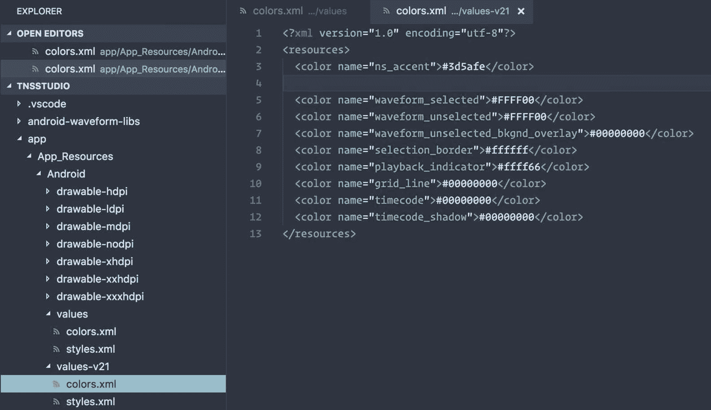
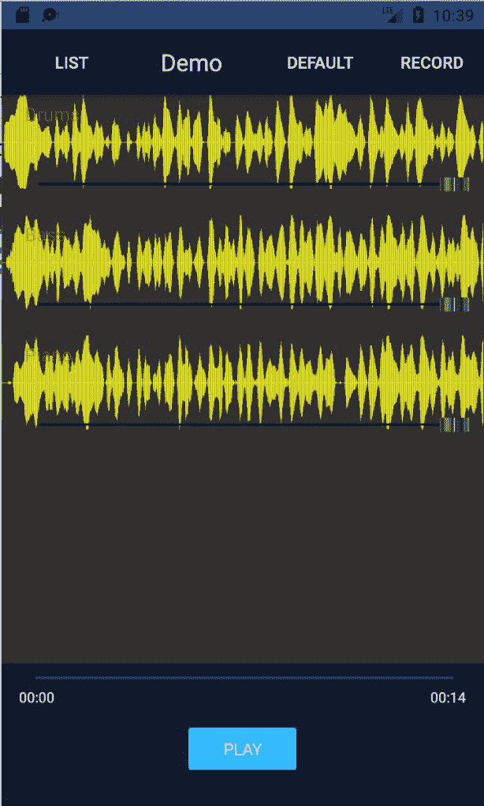

# 授权你的观点

Angular 和 NativeScript 的结合非常有趣，而且对于移动开发来说功能强大。无论您是需要提供服务来使用移动设备的硬件功能（如音频录制），还是通过引人入胜的视图来丰富应用程序的可用性，NativeScript for Angular 都提供了令人激动的机会。

让我们继续上一章中开发的几个概念，以提供一个丰富的轨迹视图，同时重用到目前为止我们已经介绍的所有内容，以及一些新的提示/技巧。

在本章中，我们将介绍以下主题：

*   使用带有`ListView`和`templateSelector`的多项目行模板
*   使用`ListView`处理行模板更改以及何时/如何刷新
*   通过`NativeScriptFormsModule`使用`ngModel`数据绑定
*   利用共享单例服务跨多个模块共享状态
*   在存储之前序列化数据，并在从持久化状态检索时进行水合
*   利用和重用 Angular 指令以更独特的特性丰富 NativeScript 滑块

# 具有 NativeScript 的 ListView 的多个项目模板

在整个[第 8 章](08.html#30A8Q0-289fe2426d594f99a90e4363b2c9c34d)*构建录音机*中，我们设计了一个双用途的定制 NativeScript 波形视图，该视图可接入 iOS 和 Android 的各种本机库，特别是为了丰富我们作品的曲目列表视图。让我们继续使用我们的多功能波形视图作为轨迹列表视图。这也将为我们提供一种在曲目旁边显示混音滑块控件（通常在音频制作和声音工程中称为音量控制器）的方法，使用户可以在整体构图中混音每首曲目的音量。让我们设置我们的`TrackListComponent`的`ListView`功能，为用户提供两种不同的方式来查看和处理他们的曲目，每种方式都有自己独特的实用程序。在这期间，我们还将借此机会最终连接轨道上的`mute`开关。

我们对`app/modules/player/components/track-list/track-list.component.html`做如下修改：

```ts
<ListView #listview [items]="tracks | orderBy: 'order'" class="list-group" 
  [itemTemplateSelector]="templateSelector">
  <ng-template let-track="item" nsTemplateKey="default">
    <GridLayout rows="auto" columns="100,*,100" class="list-group-item" 
      [class.muted]="track.mute">
      <Button text="Record" (tap)="record(track)" row="0" col="0" class="c-ruby"></Button>
      <Label [text]="track.name" row="0" col="1" class="h2"></Label>
      <Switch row="0" col="2" class="switch" [(ngModel)]="track.mute"></Switch>
    </GridLayout>
  </ng-template>

  <ng-template let-track="item" nsTemplateKey="waveform">
    <AbsoluteLayout [class.muted]="track.mute">
      <Waveform class="waveform w-full" top="0" left="0" height="80"
        [model]="track.model"
        type="file"
        plotColor="#888703"
        fill="true"
        mirror="true"
        plotType="buffer"></Waveform>

      <Label [text]="track.name" row="0" col="1" class="h3 track-name-float"
        top="5" left="20"></Label>
      <Slider slim-slider="fader.png" minValue="0" maxValue="1" 
        width="94%" top="50" left="0"
        [(ngModel)]="track.volume" class="slider fader"></Slider>
    </AbsoluteLayout>
  </ng-template>
</ListView>
```

这里发生了很多有趣的事情。首先，`[itemTemplateSelector]="templateSelector"`提供动态更改`ListView`项目行的功能。`templateSelector`函数的结果应该是一个字符串，它与任何 ng 模板的`ngTemplateKey`属性上提供的值相匹配。为了完成所有这些工作，我们需要准备好几样东西，首先是可以通过`#listview`和`ViewChild`访问`ListView`的`Component`：

```ts
// angular
import { Component, Input, ViewChild, ElementRef } from '@angular/core';
import { Router } from '@angular/router';

// nativescript
import { ListView } from 'ui/list-view';

// app
import { ITrack } from '../../../shared/models';
import { AuthService, DialogService } from '../../../core/services';
import { PlayerService } from '../../services/player.service';

@Component({
 moduleId: module.id,
 selector: 'track-list',
 templateUrl: 'track-list.component.html',
})
export class TrackListComponent {

  public templateSelector: Function;
  @Input() tracks: Array<ITrack>;
  @ViewChild('listview') _listviewRef: ElementRef;
 private _listview: ListView;
 private _sub: any;

  constructor(
    private authService: AuthService,
    private dialogService: DialogService,
    private router: Router,
    private playerService: PlayerService
  ) { 
    this.templateSelector = this._templateSelector.bind(this);
  }

  ngOnInit() {
 this._sub = this.playerService.trackListViewChange$.subscribe(() => {      // since this involves our templateSelector, ensure ListView knows about it
      // refresh list
 this._listview.refresh();
 });
 }

 ngAfterViewInit() {
 this._listview = <ListView>this._listviewRef.nativeElement;
 }

 private _templateSelector(item: ITrack, index: number, items: ITrack[]) {
 return this.playerService.trackListViewType;
 }
  ...
```

我们设置了一个`ViewChild`来保留对`ListView`的引用，稍后我们将使用该引用来调用`this._listview.refresh()`。当我们需要`ListView`在更改后更新显示时，这在角度上是必需的。第一个惊喜可能是注射了`PlayerService`，第二个惊喜可能是`this.templateSelector = this._templateSelector.bind(this)`。`templateSelector`绑定不是范围绑定，因为我们需要它从`Component`上的`this.playerService`返回属性引用，所以我们通过绑定`Function`引用来确保它正确绑定到`Component`的范围。**在这一点上，我们将使用`PlayerService`作为一个管道，帮助沟通`MixerModule`中`ActionBarComponent`的状态。**

**This example shows how services can help communicate the state throughout your app. However, this practice can be greatly improved by utilizing `ngrx` to help lessen interwoven dependencies and unlock a purely reactive setup with Redux-style architecture. @ngrx enhancements will be covered in [Chapter 10](10.html#3JCK20-289fe2426d594f99a90e4363b2c9c34d), *@ngrx/store + @ngrx/effects for State Management*.

我们的视图切换按钮将位于`ActionBar`（在`MixerModule`中），我们希望点击此处切换我们的`ListView`，它位于我们的`PlayerModule`中。`PlayerService`目前是一个单件（由`CoreModule`提供），并在整个应用程序中共享，因此它是一个完美的帮助对象。让我们来看看我们的 T6 变化。

```ts
<ActionBar [title]="title" class="action-bar">
  <ActionItem nsRouterLink="/mixer/home">
    <Button text="List" class="action-item"></Button>
  </ActionItem>
  <ActionItem (tap)="toggleList()" ios.position="right">
 <Button [text]="toggleListText" class="action-item"></Button>
 </ActionItem>
  <ActionItem (tap)="record()" ios.position="right">
    <Button text="Record" class="action-item"></Button>
  </ActionItem>
</ActionBar>
```

然后我们来看看`app/modules/mixer/components/action-bar/action-bar.component.android.html`的变化：

```ts
<ActionBar class="action-bar">
  <GridLayout rows="auto" columns="auto,*,auto,auto" class="action-bar">
    <Button text="List" nsRouterLink="/mixer/home" 
      class="action-item" row="0" col="0"></Button>
    <Label [text]="title" class="action-bar-title text-center" row="0" col="1"></Label>
    <Button [text]="toggleListText" (tap)="toggleList()" 
 class="action-item" row="0" col="2"></Button>
    <Button text="Record" (tap)="record()" 
      class="action-item" row="0" col="3"></Button>
  </GridLayout>
</ActionBar>
```

我们也来看看`Component`中的变化：

```ts
...
import { PlayerService } from '../../../player/services/player.service';

@Component({
  moduleId: module.id,
  selector: 'action-bar',
  templateUrl: 'action-bar.component.html'
})
export class ActionBarComponent {
  ...
  public toggleListText: string = 'Waveform';

  constructor(
    private router: RouterExtensions,
    private playerService: PlayerService
  ) { }
  ...
  public toggleList() {
    // later we can use icons, using labels for now let type = this.playerService.trackListViewType === 'default' ? 'waveform' : 'default';
    this.playerService.trackListViewType = type;
    this.toggleListText = type === 'default' ? 'Waveform' : 'Default';
 }
}
```

如您所见，我们在`ActionBar`上添加了一个按钮，该按钮将根据其状态使用标签`Waveform`或`Default`。然后，我们使用`PlayerService`修改了一个新的设置器`**this.playerService.trackListViewType** **=** **type**`。让我们来看看现在的：

```ts
...
@Injectable()
export class PlayerService {
  ...
  // communicate state changes from ActionBar to anything else
  public trackListViewChange$: Subject<string> = new Subject(); ... public get trackListViewType() {
    return this._trackListViewType;
  }

  public set trackListViewType(value: string) {
    this._trackListViewType = value;
    this.trackListViewChange$.next(value);
  } ...
```

这就完成了任务**。**

As mentioned, we will improve this setup in the next chapter with ngrx, which is all about polishing and simplifying the way we handle our app's state.

我们还需要做一些事情来确保所有新添加的功能正常工作。对于初学者来说，`[(ngModel)]`绑定在没有`NativeScriptFormsModule`的情况下将*根本无法*工作。

If you use the `ngModel` bindings in your component's view, you must ensure that the module that declares your `Component` imports the `NativeScriptFormsModule`. If it uses a `SharedModule`, ensure that the `SharedModule` imports and exports the `NativeScriptFormsModule`.

让我们将前面提示中提到的模块添加到我们的`SharedModule`中，以便我们所有的模块都可以在需要时使用`ngModel`：

```ts
...
import { NativeScriptFormsModule } from 'nativescript-angular/forms'; 
...
@NgModule({
  imports: [
    NativeScriptModule, 
    NativeScriptRouterModule,
    NativeScriptFormsModule
  ],
  ...
  exports: [
    NativeScriptModule,
    NativeScriptRouterModule,
    NativeScriptFormsModule,
    ...PIPES
  ]
})
export class SharedModule {}
```

我们现在需要更改每个曲目的静音和音量属性，以通知音频播放器。这涉及到稍微改变我们的`TrackModel`来考虑这个新功能；为此，请打开`app/modules/shared/models/track.model.ts`：

```ts
import { BehaviorSubject } from 'rxjs/BehaviorSubject';
...
export class TrackModel implements ITrack {
  public id: number;
  public filepath: string;
  public name: string;
  public order: number;
  public model: any;

  public volume$: BehaviorSubject<number>;

  private _volume: number = 1; // default full volume
  private _mute: boolean;
  private _origVolume: number; // return to after unmute

  constructor(model?: ITrack) {
    this.volume$ = new BehaviorSubject(this._volume);
    ...
  }

  public set mute(value: boolean) {
 this._mute = value;
 if (this._mute) {
 this._origVolume = this._volume;
 this.volume = 0;
 } else {
 this.volume = this._origVolume;
 }
 }

 public get mute() {
 return this._mute;
 }

 public set volume(value: number) {
 this._volume = value;
 this.volume$.next(this._volume);
 if (this._volume > 0 && this._mute) {
      // if just increasing volume from a muted state
      // ensure it's unmuted
 this._origVolume = this._volume;
 this._mute = false;
 }
 }

 public get volume() {
 return this._volume;
 }
}
```

我们现在想修改我们的`TrackPlayerModel`以配合这些新功能。之前，我们只保留了`trackId`；但是，有了这个新的添加，保留对整个`TrackModel`对象的引用会很有帮助，因此打开`app/modules/shared/models/track-player.model.ts`并进行以下更改：

```ts
...
import { Subscription } from 'rxjs/Subscription';
...
interface ITrackPlayer {
  track: TrackModel; // was trackId only
  duration: number;
  readonly player: TNSPlayer;
}
...
export class TrackPlayerModel implements ITrackPlayer {
  public track: TrackModel;
  ...
  private _sub: Subscription;
  ...
  public load(track: TrackModel, complete: Function, error: Function): Promise<number> {
    return new Promise((resolve, reject) => {
      this.track = track;

      this._player.initFromFile({
        ...
      }).then(() => {
        ...
        // if reloading track, clear subscription before subscribing again
        if (this._sub) this._sub.unsubscribe();
 this._sub = this.track.volume$.subscribe((value) => {
 if (this._player) {
 // react to track model property changes
 this._player.volume = value;
 }
 });
      }, reject);
    });
  }
  ...
  public cleanup() {
    // cleanup and dispose player
    if (this.player) this.player.dispose();
    if (this._sub) this._sub.unsubscribe(); 
  }
  ...
```

我们的音频播放器现在可以通过观察可观察到的`volume$`对象，对通过数据绑定从每个曲目产生的音量变化作出反应。由于静音本质上只需要修改播放器的音量，我们确保在切换静音开/关时相应地更新音量并保持原始音量，因此将保留任何自定义音量集。

我们新丰富的曲目视图包括可重复使用的波形视图，但这一次使用了`type="file"`，因为这将使用音频文件静态波形进行渲染，因此我们可以*看到*我们的音频。我们还提供了调整每个音轨音量（混合控制）的功能，并将标签浮动到左上角，以便用户仍然知道是什么。这一切都是通过使用`AbsoluteLayout`容器完成的，它允许我们重叠组件并手动将它们放置在彼此的顶部。

# 序列化数据以实现持久性，并在检索时恢复数据

这一切都非常有效，但是，我们引入了一个问题。我们的`MixerService`提供了保存这些作品及其所有轨迹的能力。但是，这些轨迹现在包含复杂的对象，例如可观察对象，甚至包含带有 getter 和 setter 的私有引用。

When persisting data, you will often want to use `JSON.stringify` to serialize objects when storing them so that they can be retrieved later and hydrated into more complex models if needed.

事实上，如果你现在试图用`JSON.stringify`来处理我们的`TrackModel`，它将失败，因为你无法严格化某些结构。因此，我们现在需要一种在存储数据之前序列化数据的方法，以及一种在检索数据以恢复更复杂的模型时对数据进行水合物化的方法。让我们对我们的`MixerService`做一些修改来说明这一点。打开`app/modules/mixer/services/mixer.service.ts`并进行以下更改：

```ts
// nativescript
import { knownFolders, path } from 'file-system';
...
@Injectable()
export class MixerService {

  public list: Array<IComposition>;

  constructor(
    private databaseService: DatabaseService,
    private dialogService: DialogService
  ) {
    // restore with saved compositions or demo list
    this.list = this._hydrateList(this._savedCompositions() || this._demoComposition());
  }
  ...
  private _saveList() {
    this.databaseService.setItem(DatabaseService.KEYS.compositions, this._serializeList());
  }

  private _serializeList() {
 let serialized = [];
 for (let comp of this.list) {
 let composition: any = Object.assign({}, comp);
 composition.tracks = [];
 for (let track of comp.tracks) {
 let serializedTrack = {};
 for (let key in track) {
          // ignore observable, private properties and waveform model (redundant)
          // properties are restored upon hydration
 if (!key.includes('_') && !key.includes('$') && key != 'model') {
 serializedTrack[key] = track[key];
 }
 }
 composition.tracks.push(serializedTrack);
 }
      // serialized composition
 serialized.push(composition);
 }
 return serialized;
 }

 private _hydrateList(list: Array<IComposition>) {
 for (let c = 0; c < list.length; c++) {
 let comp = new CompositionModel(list[c]);
 for (let i = 0; i < comp.tracks.length; i++) {
 comp.tracks[i] = new TrackModel(comp.tracks[i]);
        // for waveform
 (<any>comp.tracks[i]).model = {
          // fix is only for demo tracks since they use files from app folder
 target: fixAppLocal(comp.tracks[i].filepath)
 };
 }
 // ensure list ref is updated to use hydrated model
 list[c] = comp;
 }
 return list;
 }
  ...
}

const fixAppLocal = function (filepath: string) {
 if (filepath.indexOf('~/') === 0) {    // needs to be absolute path and not ~/ app local shorthand
 return path.join(knownFolders.currentApp().path, filepath.replace('~/', ''));
 }
 return filepath;
}
```

现在，我们将确保在保存我们的作文时，它被正确地序列化为一种安全且更简化的形式，可以由`JSON.stringify`处理。然后，当从我们的持久性存储中检索数据时（在本例中，通过我们的`DatabaseService`引擎盖下使用的 NativeScript 的应用程序设置模块；[第 2 章](02.html#1394Q0-289fe2426d594f99a90e4363b2c9c34d)、*功能模块*中介绍了这一点），我们将数据水合回我们的模型中，这将用我们的可观察属性丰富数据。

# 利用角度指令以更独特的特性丰富 NativeScript 滑块

对于每个音轨音量控制器（也称为我们的混音/音量控制），最好实际渲染一个看起来像音量控制器的控制旋钮，这样就可以清楚地看到这些滑块是混音旋钮，例如，它们不会被误认为是在播放该音轨。我们可以创建用于这些滑块的图形，如下所示：


对于 iOS，我们还需要向下/突出显示状态，因此当用户按下音量控制器时，可用性感觉良好：


我们现在可以创建每个文件的两个版本，并将它们放入`app/App_Resources/iOS`；对于标准分辨率，原版将为 100x48；对于 iPhone Plus 及以上版本，我们将提供 150x72 的@3x 版本（基本上是 24 加标准 48 高）：

*   `fader-down.png`
*   `fader-down@3x.png`
*   `fader.png`
*   `fader@3x.png`

我们现在可以重用我们的`SlimSliderDirective`（目前用于定制穿梭滑块的外观）并提供输入，以便我们可以从应用程序的资源中提供文件名，用于拇指。
打开`app/modules/player/directives/slider.directive.ios.ts`并进行以下修改：

```ts
import { Directive, ElementRef, Input } from '@angular/core';

@Directive({
  selector: '[slim-slider]'
})
export class SlimSliderDirective {
  @Input('slim-slider') imageName: string;

  constructor(private el: ElementRef) { } 

  ngAfterViewInit() {
    let uiSlider = <UISlider>this.el.nativeElement.ios;
    if (this.imageName) {
 uiSlider.setThumbImageForState(
 UIImage.imageNamed(this.imageName), UIControlState.Normal);
      // assume highlighted state always suffixed with '-down'
      let imgParts = this.imageName.split('.');
 let downImg = `${imgParts[0]}-down.${imgParts[1]}`;
 uiSlider.setThumbImageForState(
 UIImage.imageNamed(downImg), UIControlState.Highlighted);
    } else {
      // used for shuttle control
      uiSlider.userInteractionEnabled = false;
      uiSlider.setThumbImageForState(UIImage.new(), UIControlState.Normal);
    }
  }
}

```

这允许我们指定用作组件本身的`Slider`拇指的文件名：

```ts
<Slider slim-slider="fader.png" minValue="0" maxValue="1" 
  width="94%" top="50" left="0"
  [(ngModel)]="track.volume" class="slider fader"></Slider>
```

有了这一功能，我们现在可以在启用“轨迹混合视图”切换时为 iOS 提供这些整洁的音量控制器控件：


# Android 的图形和资源处理

现在，让我们为 Android 处理这个问题。我们首先将标准的 48 高度音量控制器图形复制到 app/app_Resources/Android/drawable hdpi 文件夹中。然后，我们可以创建此图形的适当分辨率，并将其复制到各种分辨率相关的文件夹中。Android 需要记住的一点是，它确实***而不是***像 iOS 一样使用“@3x”后缀标识符，所以我们只将所有这些命名为“fader.png”。以下是一个分辨率相关（本例中为**hdpi**，处理“高密度”屏幕分辨率）文件夹中的图形视图：


我们现在可以使用 thumb 图像处理定制 Android slider 指令，打开`app/modules/player/directives/slider.directive.android.ts`：

```ts
import { Directive, ElementRef, Input } from '@angular/core';
import { fromResource } from 'image-source';
import { getNativeApplication } from 'application';

let application: android.app.Application;
let resources: android.content.res.Resources;

const getApplication = function () {
 if (!application) {
 application = (<android.app.Application>getNativeApplication());
 }
 return application;
}

const getResources = function () {
 if (!resources) {
 resources = getApplication().getResources();
 }
 return resources;
}

@Directive({
 selector: '[slim-slider]'
})
export class SlimSliderDirective {
  @Input('slim-slider') imageName: string;
 private _thumb: android.graphics.drawable.BitmapDrawable;

  constructor(private el: ElementRef) { 
    el.nativeElement[(<any>slider).colorProperty.setNative] = function (v) {
// ignore the NativeScript default color setter of this slider
 };
  }

  ngAfterViewInit() {
    let seekBar = <android.widget.SeekBar>this.el.nativeElement.android;
    if (this.imageName) {
 if (!seekBar) {
        // part of view toggle - grab on next tick
        // this helps ensure the seekBar instance can be accessed properly
        // since this may fire amidst the view toggle switching on our tracks
        setTimeout(() => {
 seekBar = <android.widget.SeekBar>this.el.nativeElement.android;
 this._addThumbImg(seekBar);
 });
 } else {
 this._addThumbImg(seekBar);
 }
    } else {
      // seekBar.setEnabled(false);
      seekBar.setOnTouchListener(new android.view.View.OnTouchListener({
        onTouch(view, event) {
          return true;
        }
      }));
      seekBar.getThumb().mutate().setAlpha(0);
    }
  }

  private _addThumbImg(seekBar: android.widget.SeekBar) {
 if (!this._thumb) {
 let imgParts = this.imageName.split('.');
 let name = imgParts[0];
 const res = getResources();
 if (res) {
 const identifier: number = res.getIdentifier(
 name, 'drawable',  getApplication().getPackageName());
 if (0 < identifier) {
          // Load BitmapDrawable with getDrawable to make use of Android internal caching
 this._thumb = <android.graphics.drawable.BitmapDrawable>res.getDrawable(identifier);
 }
 }
 }
    if (this._thumb) {
 seekBar.setThumb(this._thumb);
 seekBar.getThumb().clearColorFilter();
 if (android.os.Build.VERSION.SDK_INT >= 21) {
 (<any>seekBar).setSplitTrack(false);
 }
 }
 }
}
```

上面提到的安卓系统实现最不寻常、或许令人惊讶的方面之一是：

```ts
constructor(private el: ElementRef) { 
  el.nativeElement[(<any>slider).colorProperty.setNative] = function (v) {
    // ignore the NativeScript color setter of the slider
  };
}
```

通常，您可以很容易地重用和扩展 NativeScript 中的控件。然而，这是其中一种例外情况，滑块控件上的默认 NativeScript setter 实际上只会在 Android 上给我们带来问题**。默认设置程序将尝试将拇指的颜色设置为蓝色，并使用一种方法将其混合。当它在滑块上设置此标志时，我们随后设置的任何图形形状都会将形状设置为全蓝色。因此，对于我们的 slider 类版本，要处理自定义图形，我们必须消除控件上的默认 slider thumb 颜色设置器。我们通过附加一个完全不做任何事情的新“颜色”设定器来控制这一点。这样，当 NativeScript 框架在初始化或重置控件时尝试设置默认颜色时，将不会发生任何事情，从而使我们能够完全控制所发生的事情。作为`_addThumbImg`方法末尾的预防措施，我们还调用`seekBar.getThumb().clearColorFilter();`作为良好的措施，以确保在我们能够使默认颜色设定器静音之前，已撤消对颜色过滤器的任何潜在设置。**

最后，当我们的曲目列表视图切换到混音模式时，我们可以自定义每个曲目显示的音频波形中使用的颜色。由于 Android 波形插件利用了应用程序的颜色资源，我们可以在 app/app_resources/Android/values/colors.xml 插件文档中添加适当的命名属性，同样的颜色也应该复制到 app/app_resources/Android/values-v21/colors.xml 中：



现在，我们可以在混合模式下自定义 Android 的文件波形显示样式：



# 总结

我们想提供一些额外的好东西，以配合您在第 3 部分中学习到的所有丰富内容；我们希望你喜欢它！在许多情况下，将多个项目行模板与`ListView`配合使用会很方便，但希望这能为您提供工具，让您知道如何使其适用于您和您的应用程序。

数据持久性的特殊注意事项对于任何引人入胜的应用程序来说都是一个重要因素，因此，在将数据恢复到持久状态之前，我们研究了如何序列化数据。

最后，我们将进一步丰富视图组件，使其具有更大的角度指向性。随着第 3 部分的完成，我们现在已经完成了本书应用程序的核心能力和功能集。然而，我们还远远没有完成应用程序。本书中介绍的开发工作流程和过程是我们为我们构建的任何应用程序带来的典型开发周期。我们将在[第 14 章](14.html#4IRMK0-289fe2426d594f99a90e4363b2c9c34d)、*部署准备和网页包捆绑*中介绍如何改进我们的架构并进一步完善我们的应用程序，以便通过 Google Play 和 app Store 进行公开发布。

现在让我们继续通过[第 10 章](10.html#3JCK20-289fe2426d594f99a90e4363b2c9c34d)、*@ngrx/store+@ngrx/effects for state Management*中的`ngrx`集成来改进我们应用程序的状态处理。值得一提的是，使用 Redux 风格的架构是在构建应用程序之前*做出的一个更好的决定，正如我们在这里所做的那样。然而，它不一定是关键性的，也不是强制性的，因此，我们想构建一个应用程序，以表明该应用程序基本上运行良好。现在，我们将继续使用它来展示您可以从中获得的各种优势。***