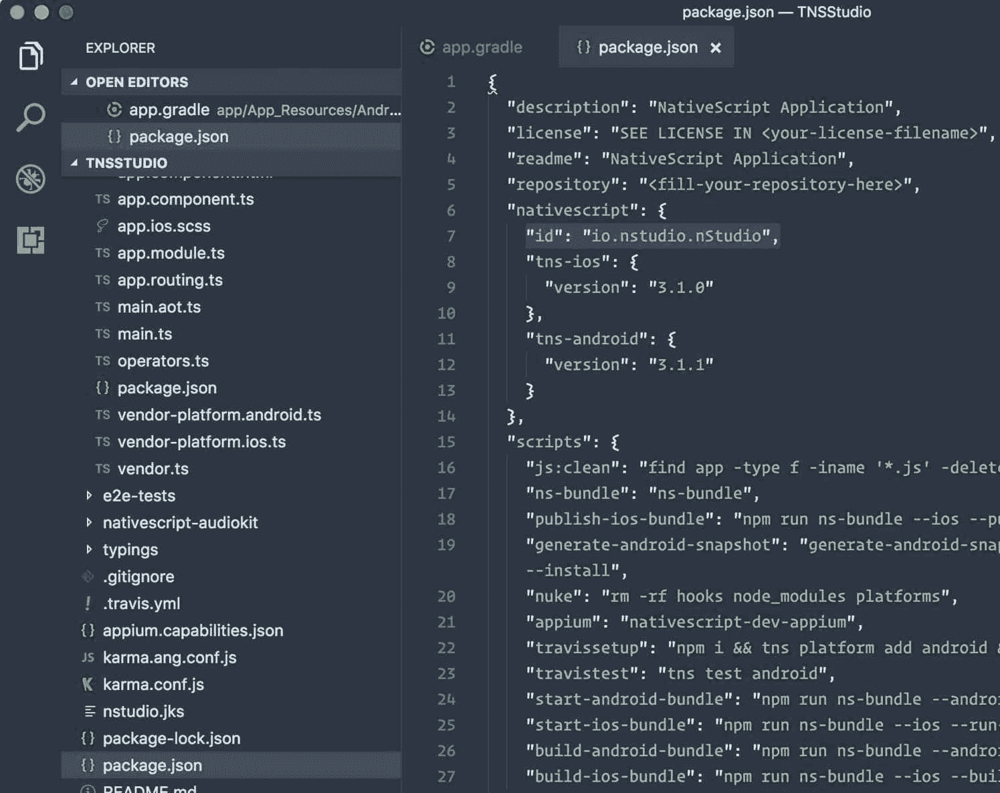
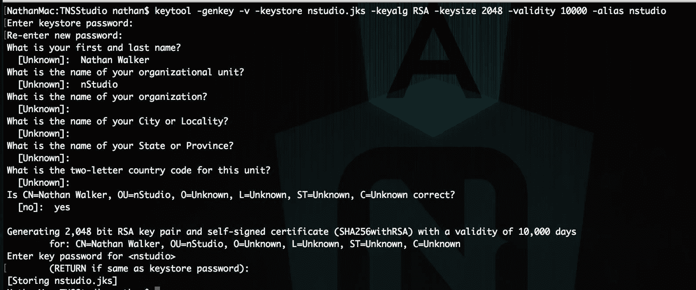
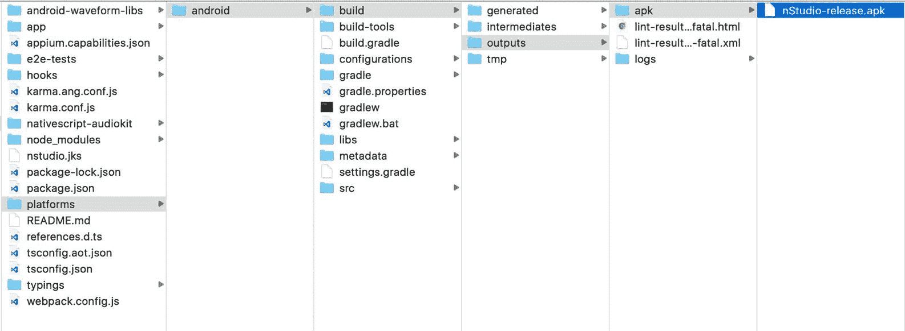
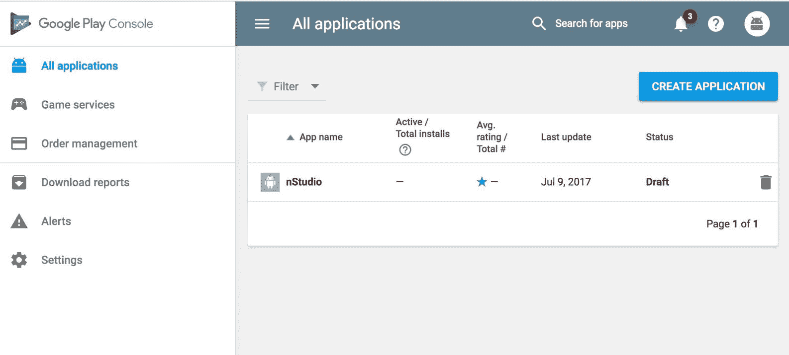
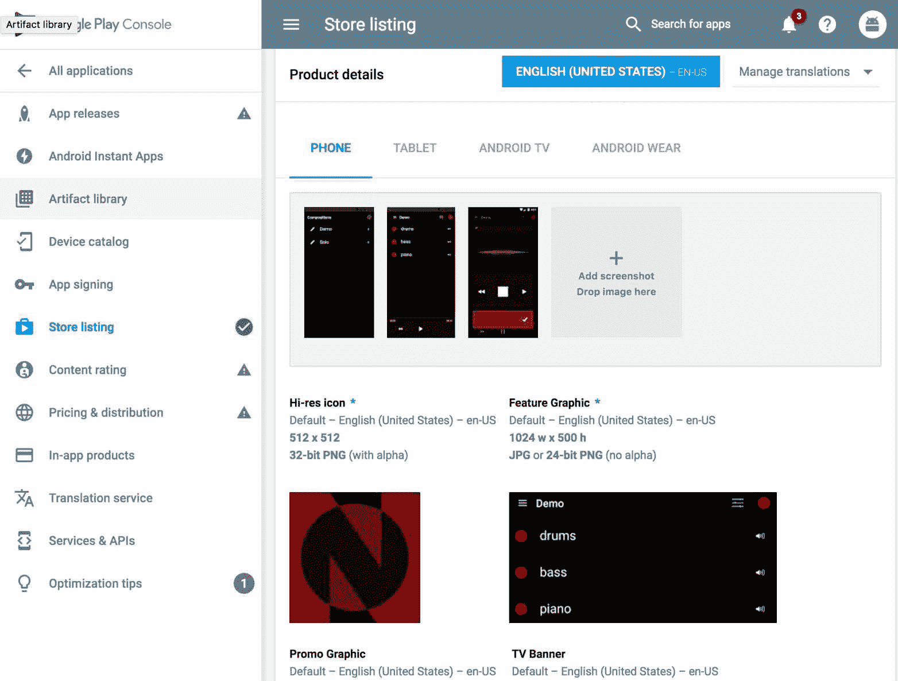
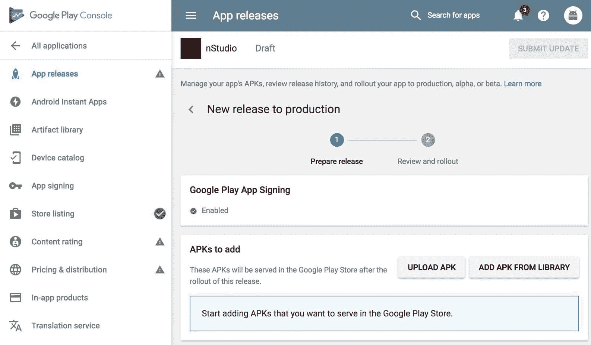

# 部署到 Google Play

尽管与苹果应用商店相比，在谷歌 Play 上部署应用程序要简单一些，但仍有几个关键步骤需要注意。我们在[第 14 章](14.html#4IRMK0-289fe2426d594f99a90e4363b2c9c34d)、*部署准备与网页包捆绑*、[第 15 章](15.html#4REBM0-289fe2426d594f99a90e4363b2c9c34d)、*部署到苹果应用商店*中介绍了一些准备步骤，如使用网页包捆绑应用，准备应用图标和闪屏，因此，我们将立即着手构建一个可发布的 APK。

我们感谢 TJ VanToll 为部署 NativeScript 应用程序（[提供了一篇出色的八步文章 https://www.nativescript.org/blog/steps-to-publish-your-nativescript-app-to-the-app-stores](https://www.nativescript.org/blog/steps-to-publish-your-nativescript-app-to-the-app-stores) ），我们将从中插入摘录，并尽可能扩展。

本章涵盖以下主题：

*   生成密钥库以使用
*   使用 NativeScript CLI 构建可发布的 APK
*   将 APK 上载到 Google Play 以供发布

# 为 Google Play 构建 APK

在您打开 Google Play 注册和发布此应用程序（这是下一步）之前，让我们仔细检查几件事，以确保我们的元数据是正确的。

打开`app/App_Resources/Android/app.gradle`并确保`applicationId`与您的包裹名称相符：


同时，打开项目根部的`package.json`并再次检查`nativescript.id`是否有良好措施：



现在，您需要为您的应用程序生成一个可执行的 Android 文件。在 Android 上，此文件具有`.apk`扩展名，您可以使用 NativeScript CLI 生成此文件。

在 NativeScript 开发过程中使用的`tns run`命令实际上会为您生成一个`.apk`文件，并将该文件安装在 Android 仿真器或设备上。但是，对于 GooglePlay 版本，您创建的构建也必须是代码签名的。您可以参考 Android 的文档（[https://developer.android.com/studio/publish/app-signing.html](https://developer.android.com/studio/publish/app-signing.html) ）在代码签名上，如果您想深入了解加密细节，但在较高级别上，您需要做以下两件事来创建 Android 应用程序的发布版本：

*   创建一个`.keystore`或`.jks`（Java 密钥库）文件
*   在构建过程中，使用该`.keystore`或`.jks`文件登录您的应用程序

Android 文档提供了一些关于如何创建密钥库文件（[的选项 https://developer.android.com/studio/publish/app-signing.html#release-模式](https://developer.android.com/studio/publish/app-signing.html#release-mode)。我们首选的方法是`keytool`命令行实用程序，它包含在 NativeScript 为您安装的 Java JDK 中，因此它应该已经在您的开发机器的命令行上可用。

要使用`keytool`为我们的应用程序生成用于代码签名的密钥库，我们将使用以下命令：

```ts
keytool -genkey -v -keystore nstudio.jks -keyalg RSA -keysize 2048 -validity 10000 -alias nstudio
```

`keytool`实用程序将询问您许多问题，其中一些是可选的（组织名称以及您所在的城市、州和国家的名称），但最重要的是密钥库和别名的密码（稍后将详细介绍）。以下是生成密钥库时的`keytool`过程：



在我们继续讨论如何使用这个`.jks`文件之前，有一件重要的事情你需要知道。将此`.jks`文件放在安全的地方，不要忘记密钥库或别名的密码。（就我个人而言，我喜欢对我的密钥库和别名使用相同的密码，以简化我的生活。）Android 要求你使用完全相同的`.jks`文件登录应用程序的任何和所有更新。这意味着，如果您丢失此`.jks`文件或其密码，您将无法更新您的 Android 应用程序。您必须在 Google Play 中创建一个全新的条目，而您现有的用户将无法升级，因此请注意不要丢失它！

哦，还有一点需要注意的是，在大多数情况下，您需要使用一个密钥库文件登录到您个人或公司的所有 Android 应用程序。还记得如何将-alias 标志传递给 keytool 实用程序，以及该别名如何拥有自己的密码吗？事实证明，一个密钥库可以有多个别名，您需要为您构建的每个 Android 应用程序创建一个别名。

好的，现在你有了这个`.jks`文件，并且把它存储在一个好的安全位置，剩下的过程就很简单了。

使用 webpack 构建我们的 Android 应用程序，并将您刚才用于创建`.jks`文件的信息传递给它。例如，以下命令用于创建`nStudio`的发布版本：

```ts
npm run build-android-bundle -- --release --keyStorePath ~/path/to/nstudio.jks --keyStorePassword our-pass --keyStoreAlias nstudio --keyStoreAliasPassword our-alias-pass
```

一旦命令运行完毕，你的应用程序的`platforms/android/build/outputs/apk`文件夹中将有一个可发布的`.apk`文件；请注意该文件的位置，因为下一步在 Google Play 上部署应用程序时需要该文件：



# 上传到 Google Play

Google Play 是 Android 用户查找和安装应用程序以及 Google Play 开发者控制台（[的地方 https://play.google.com/apps/publish/](https://play.google.com/apps/publish/) 是开发者为用户注册和上传应用的地方。

您将首先按名称创建一个新的应用程序，然后将其列出：



Android 关于上传应用程序和设置商店列表的文档非常好，所以我们不会在这里重新创建所有这些信息。相反，我们将提供一些提示，当您将自己的 NativeScript 应用程序上载到 Google Play 时，您可能会发现这些提示很有用。

在 Google Play 开发者控制台的商店列表选项卡上，您必须提供至少两个正在运行的应用程序的屏幕截图，如下所示：


在安卓**安卓虚拟设备**（**AVD**）中使用`tns run android --emulator`命令启动应用程序。Android AVD 有一种内置方式，可以使用模拟器侧栏中的小摄像头图标拍摄屏幕截图。

使用此按钮拍摄应用程序中最重要屏幕的一些屏幕截图，图像文件本身将显示在桌面上。从那里，你可以把这些文件直接上传到 GooglePlay 开发者控制台。还需要 1024 x 500 功能图形图像文件，该文件将显示在商店列表的顶部，如以下屏幕截图所示：



虽然在前面的屏幕截图中没有显示，但我们建议您使用类似达芬奇（[的服务 https://www.davinciapps.com](https://www.davinciapps.com) ）为你的屏幕截图添加一点天赋，并将其转化为你的应用程序功能的小教程。

# APK

Google Play 开发者控制台的应用发布部分是上传本章前面步骤中生成的`.apk`文件的地方。

在查看应用程序发布部分时，您可能会看到选择 Google Play 应用程序签名的内容。最好现在就加入，而不是以后。选择后，它将显示已启用：



然后，您可以继续将 apk 上传到应用程序的`platforms/android/build/outputs/apk`文件夹中。

上传 APK 后，您应该会在同一页面上看到它的列表，在该页面上，您可以选择多种语言键入上传版本的发行说明：


单击该页面上的“保存”后，您可能希望返回到“商店列表”部分，以完成填写应用程序的所有信息。一旦一切就绪，您就可以提交应用程序了。Android 应用程序审查通常需要几个小时，除非 Google 标记出任何问题，否则您的应用程序应该在半天左右的时间内在 Google Play 中可用。

# 总结

呜呼！我们在苹果应用商店和谷歌 Play 这两个商店都建立了一个从*零到*发布的应用程序。这是一次经历了许多曲折的冒险。我们真诚地希望，这能让您深入了解 NativeScript for Angular 应用程序开发，并为那些好奇的人揭开这个激动人心的技术堆栈的神秘面纱。

NativeScript 和 Angular 都拥有蓬勃发展的全球社区，我们鼓励您参与其中，讲述您的经历，并与他人分享您和您的团队可能正在从事的所有令人振奋的项目。请毫不犹豫地伸出援手寻求帮助，因为我们都对这两项技术的热爱和钦佩负有责任。

您还可以查看一些其他有用的资源：

*   [http://forum.nativescript.org](http://forum.nativescript.org)
*   [http://nativescript.rocks](http://nativescript.rocks)

当然也要了解医生！
[http://docs.nativescript.org/angular/start/introduction.html](http://docs.nativescript.org/angular/start/introduction.html)

干杯