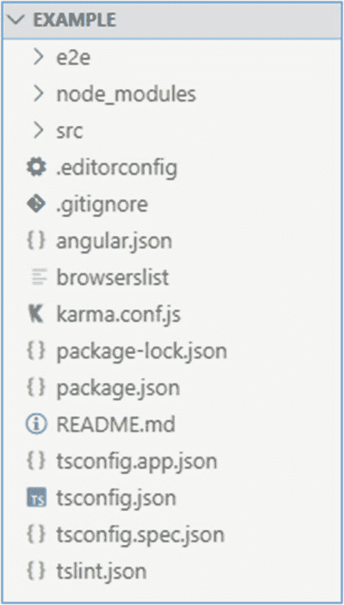
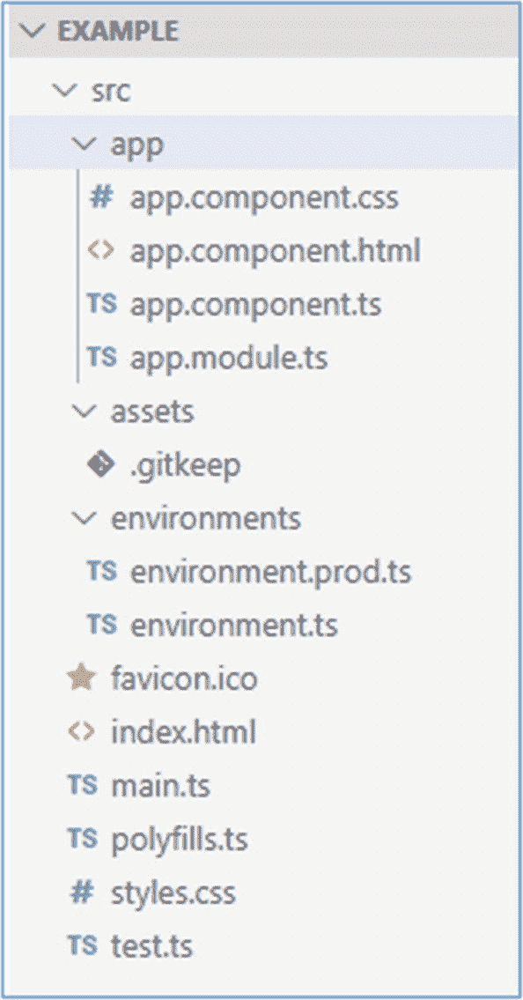

# 十一、了解Angular项目和工具

在这一章中，我解释了一个 Angular 项目的结构和用于开发的工具。在本章结束时，您将了解项目的各个部分是如何组合在一起的，并有一个应用后续章节中描述的更高级功能的基础。

Tip

你可以从 [`https://github.com/Apress/pro-angular-9`](https://github.com/Apress/pro-angular-9) 下载本章以及本书其他章节的示例项目。如果在运行示例时遇到问题，请参见第 [1](01.html) 章获取帮助。

## 创建新的Angular项目

您在第 [2 章](02.html)中安装的`angular-cli`包包含了创建一个新的 Angular 项目所需的所有功能，该项目包含一些占位符内容以启动开发，它还包含一组紧密集成的工具，用于构建、测试和准备 Angular 应用以进行部署。

要创建一个新的 Angular 项目，打开一个命令提示符，导航到一个方便的位置，并运行清单 [11-1](#PC1) 中所示的命令。

```ts
ng new example --routing false --style css --skip-git --skip-tests

Listing 11-1.Creating a Project

```

`ng new`命令创建新项目，参数是项目名称，在本例中是`example`。`ng new`命令有一组参数，这些参数决定了所创建项目的形状；表 [11-1](#Tab1) 描述了最有用的。

表 11-1。

有用的 ng 新选项

<colgroup><col class="tcol1 align-left"> <col class="tcol2 align-left"></colgroup> 
| 

争吵

 | 

描述

 |
| --- | --- |
| `--collection` | 此选项指定 schematics 集合。Schematics 是用于创建项目和条目的模板，但不在本书中使用。 |
| `--directory` | 此选项用于指定项目目录的名称。它默认为项目名称。 |
| `--dry-run` | 此选项用于模拟项目创建过程，而不执行它。 |
| `--force` | 如果为真，此选项将覆盖任何现有文件。 |
| `--inline-style` | 此选项指定将使用组件中定义的样式而不是单独的 CSS 文件中定义的样式来配置项目。 |
| `--inline-template` | 此选项指定将使用组件中定义的模板而不是单独的 HTML 文件中定义的模板来配置项目。 |
| `--minimal` | 该选项创建一个项目，而不添加对测试框架的支持。 |
| `--package-manager` | 该选项用于指定软件包管理器，该管理器将用于下载和安装 Angular 所需的软件包。如果省略，将使用 NPM。其他选项有`yarn`、`pnpm`和`cnpm`。默认的包管理器适用于大多数项目。 |
| `--prefix` | 该选项将前缀应用于所有组件选择器，如“了解Angular应用如何工作”一节所述。 |
| `--routing` | 此选项用于在项目中创建路由模块。我会在第[25](25.html)–[27](27.html)章中详细解释路由功能的工作原理。 |
| `--skip-git` | 使用该选项可以防止在项目中创建 Git 存储库。如果创建项目时没有使用该选项，则必须安装 Git 工具。 |
| `--skip-install` | 此选项阻止下载和安装 Angular 应用和项目开发工具所需的包的初始操作。 |
| `--skip-tests` | 此选项阻止添加测试工具的初始配置。 |
| `--style` | 此选项指定如何处理样式表。在本书中，我使用了`css`选项，但是也支持流行的 CSS 预处理程序，比如 SCSS、萨斯等等。 |

由`ng new`命令执行的项目初始化过程可能需要一些时间来完成，因为项目需要大量的包，既要运行 Angular 应用，也要运行我在本章中描述的开发和测试工具。

## 了解项目结构

使用您喜欢的代码编辑器打开`example`文件夹，您将看到如图 [11-1](#Fig1) 所示的文件和文件夹结构。该图显示了 Visual Studio Code表示项目的方式；其他编辑可能会以不同的方式呈现项目内容。



图 11-1。

新Angular项目的内容

表 [11-2](#Tab2) 描述了通过`ng new`命令添加到新项目中的文件和文件夹，这些文件和文件夹为大多数Angular开发提供了起点。

表 11-2。

新Angular项目中的文件和文件夹

<colgroup><col class="tcol1 align-left"> <col class="tcol2 align-left"></colgroup> 
| 

名字

 | 

描述

 |
| --- | --- |
| `e2e` | 该文件夹包含用于端到端测试的文件，该文件被设置为使用量角器包。我在本书中不描述端到端测试，因为它需要额外的基础设施，但您可以在 [`www.protractortest.org`](http://www.protractortest.org) 了解更多信息。 |
| `node_modules` | 该文件夹包含应用和Angular开发工具所需的 NPM 软件包，如“了解软件包文件夹”一节所述。 |
| `src` | 该文件夹包含应用的源代码、资源和配置文件，如“了解源代码文件夹”一节中所述。 |
| `.editorconfig` | 该文件包含配置文本编辑器的设置。并非所有的编辑器都响应此文件，但它可能会覆盖您定义的首选项。您可以在 [`http://editorconfig.org`](http://editorconfig.org) 了解更多关于可以在该文件中设置的编辑器设置。 |
| `.gitignore` | 该文件包含使用 Git 时从版本控制中排除的文件和文件夹的列表。 |
| `angular.json` | 该文件包含Angular开发工具的配置。 |
| `package.json` | 该文件包含应用和开发工具所需的 NPM 包的详细信息，并定义了运行开发工具的命令，如“了解包文件夹”一节中所述。 |
| `package-lock.json` | 该文件包含安装在`node_modules`文件夹中的所有软件包的版本信息，如“了解软件包文件夹”一节所述。 |
| `README.md` | 这是一个自述文件，包含开发工具的命令列表，这些命令在“使用开发工具”一节中进行了描述。 |
| `tsconfig.json` | 该文件包含 TypeScript 编译器的配置设置。在大多数 Angular 项目中，您不需要更改编译器配置。 |
| `tstlint.json` | 该文件包含 TypeScript linter 的设置，如“使用 linter”一节中所述。 |

您不会在每个项目中都需要所有这些文件，您可以删除不需要的文件。例如，我倾向于删除`README.md`、`.editorconfig`和`.gitignore`文件，因为我已经熟悉了工具命令，我不喜欢覆盖我的编辑器设置，并且我不使用 Git 进行版本控制。

### 了解源代码文件夹

`src`文件夹包含应用的文件，包括源代码和静态资产，比如图像。这个文件夹是大多数开发活动的焦点，图 [11-2](#Fig2) 显示了使用`ng new`命令创建的`src`文件夹的内容。



图 11-2。

src 文件夹的内容

`app`文件夹是您为应用添加定制代码和内容的地方，随着您添加特性，它的结构会变得更加复杂。其他文件支持开发过程，如表 [11-3](#Tab3) 所述。

表 11-3。

src 文件夹中的文件和文件夹

<colgroup><col class="tcol1 align-left"> <col class="tcol2 align-left"></colgroup> 
| 

名字

 | 

描述

 |
| --- | --- |
| `app` | 此文件夹包含应用的源代码和内容。该文件夹的内容是本书“了解 Angular 应用如何工作”一节和其他章节的主题。 |
| `assets` | 该文件夹用于应用所需的静态资源，如图像。 |
| `environments` | 该文件夹包含定义不同环境设置的配置文件。默认情况下，唯一的配置设置是`production`标志，当应用为部署而构建时，它被设置为`true`，如“了解应用引导”一节中所述。 |
| `favicon.ico` | 该文件包含一个图标，浏览器将在应用的选项卡中显示该图标。默认图像是Angular徽标。 |
| `index.html` | 这是在开发过程中发送到浏览器的 HTML 文件，如“理解 HTML 文档”一节所述。 |
| `main.ts` | 该文件包含执行时启动应用的 TypeScript 语句，如“了解应用引导”一节中所述。 |
| `polyfills.ts` | 该文件用于在项目中包含多填充，以提供对某些浏览器(尤其是 Internet Explorer)中原本不可用的功能的支持。 |
| `styles.css` | 该文件用于定义应用于整个应用的 CSS 样式。 |
| `tests.ts` | 这是 Karma 测试包的配置文件，我在第 [29](29.html) 章中描述过。 |

### 了解包文件夹

JavaScript 应用开发的世界依赖于一个丰富的包生态系统，其中一些包包含 Angular 框架，该框架将通过开发过程中在后台使用的小包发送到浏览器。一个 Angular 项目需要很多包；例如，本章开头创建的示例项目需要 850 多个包。

许多这样的包只有几行代码，但是它们之间有一个复杂的依赖层次，太大了以至于不能手工管理，所以使用了包管理器。包管理器得到了项目所需包的初始列表。然后检查这些包中的每一个包的依赖关系，这个过程一直继续，直到创建了完整的一组包。所有需要的包都被下载并安装在`node_modules`文件夹中。

使用`dependencies`和`devDependencies`属性在`package.json`文件中定义初始的一组包。`dependencies`属性用于列出应用运行所需的包。下面是来自示例应用中的`package.json`文件的`dependencies`包，尽管您可能会在您的项目中看到不同的版本号:

```ts
...
"dependencies": {
  "@angular/animations": "~9.0.0",
  "@angular/common": "~9.0.0",
  "@angular/compiler": "~9.0.0",
  "@angular/core": "~9.0.0",
  "@angular/forms": "~9.0.0",
  "@angular/platform-browser": "~9.0.0",
  "@angular/platform-browser-dynamic": "~9.0.0",
  "@angular/router": "~9.0.0",
  "bootstrap": "^4.4.1",
  "rxjs": "~6.5.4",
  "tslib": "^1.10.0",
  "zone.js": "~0.10.2"
},
...

```

大多数包提供Angular功能，少数支持包在后台使用。对于每个包，`package.json`文件包括可接受版本号的详细信息，使用表 [11-4](#Tab4) 中描述的格式。

表 11-4。

软件包版本编号系统

<colgroup><col class="tcol1 align-left"> <col class="tcol2 align-left"></colgroup> 
| 

格式

 | 

描述

 |
| --- | --- |
| `9.0.0` | 直接表示版本号将只接受具有精确匹配版本号的包，例如 9.0.0。 |
| `*` | 使用星号表示接受要安装的任何版本的软件包。 |
| `>9.0.0 >=9.0.0` | 在版本号前面加上>或> =接受任何大于或等于给定版本的软件包版本。 |
| `<9.0.0 <=9.0.0` | 在版本号前加上 |
| `~9.0.0` | 在版本号前加一个波浪号(~字符)接受要安装的版本，即使修补程序级别号(三个版本号中的最后一个)不匹配。例如，指定`~9.0.0`意味着您将接受版本 9.0.1 或 9.0.2(将包含版本 9.0.0 的补丁)，但不接受版本 9.1.0(将是一个新的次要版本)。 |
| `^9.0.0` | 在版本号前加一个插入符号(^字符)将接受版本，即使次要版本号(三个版本号中的第二个)或补丁号不匹配。例如，指定^9.0.0 意味着您将接受版本 9.1.0 和 9.2.0，但不接受版本 10.0.0。 |

在`package.json`文件的`dependencies`部分指定的版本号将接受较小的更新和补丁。当涉及到文件的`devDependencies`部分时，版本灵活性更加重要，该部分包含了开发所需的包的列表，但这些包不是最终应用的一部分。在示例应用的`package.json`文件的`devDependencies`部分列出了 19 个包，每个包都有自己的可接受版本范围。

```ts
...
"devDependencies": {
  "@angular-devkit/build-angular": "~0.900.1",
  "@angular/cli": "~9.0.1",
  "@angular/compiler-cli": "~9.0.0",
  "@angular/language-service": "~9.0.0",
  "@types/node": "^12.11.1",
  "@types/jasmine": "~3.5.0",
  "@types/jasminewd2": "~2.0.3",
  "codelyzer": "^5.1.2",
  "jasmine-core": "~3.5.0",
  "jasmine-spec-reporter": "~4.2.1",
  "karma": "~4.3.0",
  "karma-chrome-launcher": "~3.1.0",
  "karma-coverage-istanbul-reporter": "~2.1.0",
  "karma-jasmine": "~2.0.1",
  "karma-jasmine-html-reporter": "^1.4.2",
  "protractor": "~5.4.3",
  "ts-node": "~8.3.0",
  "tslint": "~5.18.0",
  "typescript": "~3.7.5"
}
...

```

同样，您可能会看到不同的细节，但关键的一点是，包之间的依赖关系的管理太复杂，无法手动完成，而是委托给包管理器。使用最广泛的包管理器是 NPM，它安装在 Node.js 旁边，是本书第 [2](02.html) 章准备工作的一部分。

当你创建一个项目时，开发所需的所有包都被自动下载并安装到`node_modules`文件夹中，但是表 [11-5](#Tab5) 列出了一些你可能会发现在开发过程中有用的命令。所有这些命令都应该在项目文件夹中运行，这个文件夹包含了`package.json`文件。

表 11-5。

有用的 NPM 命令

<colgroup><col class="tcol1 align-left"> <col class="tcol2 align-left"></colgroup> 
| 

命令

 | 

描述

 |
| --- | --- |
| `npm install` | 该命令执行在`package.json`文件中指定的包的本地安装。 |
| `npm install package@version` | 该命令执行包的特定版本的本地安装，并更新`package.json`文件以将包添加到`dependencies`部分。 |
| `npm install package@version --save-dev` | 该命令执行包的特定版本的本地安装，并更新`package.json`文件以将包添加到`devDependencies`部分。 |
| `npm install --global package@version` | 此命令执行特定版本软件包的全局安装。 |
| `npm list` | 该命令列出了所有本地包及其依赖项。 |
| `npm run <script name>` | 该命令执行在`package.json`文件中定义的脚本之一，如下所述。 |
| `npx package@version` | 这个命令下载并执行一个包。 |

Understanding Global And Local Packages

NPM 可以安装特定于单个项目的包(称为*本地安装*，或者可以从任何地方访问(称为*全局安装*)。很少有软件包需要全局安装，但有一个例外，那就是本书第 [2](02.html) 章中安装的`@angular/cli`软件包。`@angular-cli`包需要全局安装，因为它用于创建新项目。项目所需的单个包被本地安装到`node_modules`文件夹中。

表 [11-5](#Tab5) 中描述的最后两个命令很奇怪，但是包管理器传统上包括对运行在`package.json`文件的`scripts`部分中定义的命令的支持。在 Angular 项目中，该特性用于提供对工具的访问，这些工具在开发过程中使用，并为应用的部署做准备。下面是示例项目中`package.json`文件的`scripts`部分:

```ts
...
"scripts": {
    "ng": "ng",
    "start": "ng serve",
    "build": "ng build",
    "test": "ng test",
    "lint": "ng lint",
    "e2e": "ng e2e"
},
...

```

表 [11-6](#Tab6) 总结了这些命令，我将在本章后面的章节或本书这一部分后面的章节中演示它们的用法。

表 11-6。

package.json 文件的脚本部分中的命令

<colgroup><col class="tcol1 align-left"> <col class="tcol2 align-left"></colgroup> 
| 

名字

 | 

描述

 |
| --- | --- |
| `ng` | 该命令运行`ng`命令，该命令提供对Angular开发工具的访问。 |
| `start` | 该命令启动开发工具，相当于`ng serve`命令。 |
| `build` | 该命令执行生产构建过程。 |
| `test` | 该命令启动单元测试工具，这些工具在第 [29 章](29.html)中有描述，它相当于`ng test`命令。 |
| `lint` | 这个命令启动 TypeScript linter，如“使用 linter”一节所述，它相当于`ng lint`命令。 |
| `e2e` | 该命令启动端到端测试工具，相当于`ng e2e`命令。 |

这些命令通过使用`npm run`后跟您需要的命令名来运行，并且必须在包含`package.json`文件的文件夹中完成。因此，如果您想在示例项目中运行`lint`命令，导航到`example`文件夹并键入`npm run lint`。使用命令`ng lint`可以得到相同的结果。

`npx`命令对于用一个命令下载和执行一个包很有用，我在本章后面的“运行生产构建”一节中会用到它。不是所有的包都被设置为使用`npx`，这是一个最近的特性。

## 使用开发工具

使用`ng new`命令创建的项目包括一套完整的开发工具，用于监控应用的文件，并在检测到变更时构建项目。运行`example`文件夹中清单 [11-2](#PC5) 所示的命令，启动开发工具。

```ts
ng serve

Listing 11-2.Starting the Development Tools

```

命令启动构建过程，该过程在命令提示符下生成如下消息:

```ts
...
10% building modules 4/7 modules 3 active
...

```

在该过程结束时，您将看到已经创建的包的摘要，如下所示:

```ts
...
chunk {main} main.js, main.js.map (main) 9.29 kB [initial] [rendered]
chunk {polyfills} polyfills.js, polyfills.js.map (polyfills) 140 kB [initial] [rendered]
chunk {runtime} runtime.js, runtime.js.map (runtime) 6.15 kB [entry] [rendered]
chunk {styles} styles.js, styles.js.map (styles) 9.75 kB [initial] [rendered]
chunk {vendor} vendor.js, vendor.js.map (vendor) 2.67 MB [initial] [rendered]
Hash: 93087e33d02b97e55e3c - Time: 5540ms
** Angular Live Development Server is listening on localhost:4200, open your browser on http://localhost:4200/ **
: Compiled successfully.
...

```

### 了解开发 HTTP 服务器

为了简化开发过程，该项目包含了一个与构建过程紧密集成的 HTTP 服务器。在初始构建过程之后，HTTP 服务器被启动，并显示一条消息，告诉您正在使用哪个端口来侦听请求，如下所示:

```ts
...
** Angular Live Development Server is listening on localhost:4200, open your browser on http://localhost:4200/ **
...

```

默认端口是 4200，但是如果您已经在使用端口 4200，您可能会看到不同的消息。打开一个新的浏览器窗口，请求`http://localhost:4200`，你会看到`ng new`命令添加到项目中的占位符内容，如图 [11-3](#Fig3) 所示。


图 11-3。

使用 HTTP 开发服务器

`ng serve`命令构建应用并启动 HTTP 服务器，这样您就可以看到应用了。

### 了解构建过程

当您运行`ng serve`时，项目被构建，以便它可以被浏览器使用。这个过程需要三个重要的工具:TypeScript 编译器、Angular 编译器和一个名为 *webpack* 的包。

Angular 应用是使用包含表达式的 TypeScript 文件和 HTML 模板创建的，这两种文件浏览器都无法理解。TypeScript 编译器负责将 TypeScript 文件编译成 JavaScript，Angular 编译器负责将模板转换成 JavaScript 语句，这些语句在模板文件中创建 HTML 元素并计算它们包含的表达式。

构建过程通过 webpack 管理，web pack 是一个模块捆绑器，这意味着它从编译器获取 JavaScript 输出，并将其合并到一个可以发送到浏览器的模块中。这个过程被称为*捆绑*，这是对一个重要功能的平淡描述，它是开发 Angular 应用时您将依赖的关键工具之一，尽管您不会直接处理它，因为它是由 Angular 开发工具为您管理的。

当您运行清单 [11-2](#PC5) 中的命令时，您会在 webpack 处理应用时看到一系列消息。Webpack 从`main.ts`文件中的代码开始，这是应用的入口点，并遵循它包含的`import`语句来发现它的依赖项，对每个有依赖项的文件重复这个过程。Webpack 通过`import`语句工作，编译每个声明了依赖关系的TypeScript和模板文件，为整个应用生成 JavaScript 代码。

Note

本节描述开发构建过程。有关准备应用进行部署的过程的详细信息，请参见“了解生产构建过程”一节。

编译过程的输出被组合成一个文件，称为*包*。在捆绑过程中，webpack 会报告其在模块中的工作过程，并找到需要包含在捆绑包中的模块，如下所示:

```ts
...
10% building modules 4/7 modules 3 active
...

```

在该过程结束时，您将看到已经创建的包的摘要，如下所示:

```ts
...
chunk {main} main.js, main.js.map (main) 9.29 kB [initial] [rendered]
chunk {polyfills} polyfills.js, polyfills.js.map (polyfills) 140 kB [initial] [rendered]
chunk {runtime} runtime.js, runtime.js.map (runtime) 6.15 kB [entry] [rendered]
chunk {styles} styles.js, styles.js.map (styles) 9.75 kB [initial] [rendered]
chunk {vendor} vendor.js, vendor.js.map (vendor) 2.67 MB [initial] [rendered]
Hash: 93087e33d02b97e55e3c - Time: 5540ms
** Angular Live Development Server is listening on localhost:4200, open your browser on http://localhost:4200/ **
: Compiled successfully.
...

```

初始构建过程可能需要一段时间才能完成，因为生产了五个包，如表 [11-7](#Tab7) 中所述。(每个文件都有对应的`.map`文件，用来让浏览器中的 JavaScript 调试更容易。)

表 11-7。

由成Angular构建过程产生的束

<colgroup><col class="tcol1 align-left"> <col class="tcol2 align-left"></colgroup> 
| 

名字

 | 

描述

 |
| --- | --- |
| `main.js` | 该文件包含从`src/app`文件夹产生的编译输出。 |
| `polyfills.js` | 此文件包含目标浏览器不支持的应用使用的功能所需的 JavaScript 聚合填充。 |
| `runtime.js` | 该文件包含加载其他模块的代码。 |
| `styles.js` | 该文件包含添加应用全局 CSS 样式表的 JavaScript 代码。 |
| `vendor.js` | 该文件包含应用所依赖的第三方包，包括 Angular 包。 |

#### 了解应用捆绑包

仅当第一次运行`ng serve`命令时，才执行完整的构建过程。此后，如果组成包的文件发生变化，包将被重新构建。您可以通过用清单 [11-3](#PC11) 中所示的元素替换`app.component.html`文件的内容来看到这一点。

```ts
<div class="bg-primary text-center text-white p-2">
    Hello, World
</div>

Listing 11-3.Replacing the Contents of the app.component.html File in the src/app Folder

```

当您保存更改时，只有`main.js`包将被重新构建，您将在命令提示符下看到如下消息:

```ts
4 unchanged chunks
chunk {main} main.js, main.js.map (main) 9.39 kB [initial] [rendered]
Time: 140ms
: Compiled successfully.

```

有选择地编译文件和准备包可以确保开发过程中的变化效果可以很快看到。图 [11-4](#Fig4) 显示了清单 [11-3](#PC11) 变更的效果。


图 11-4。

更改 main.js 包中使用的文件

Understanding Hot Reloading

在开发过程中，Angular 开发工具在`main.js`包中增加了对一个叫做*热重装*的特性的支持。这个特性意味着您可以自动看到清单 [11-3](#PC11) 中的变化效果。添加到捆绑包中的 JavaScript 代码打开了一个返回到 Angular development HTTP 服务器的连接。当一个变更触发一个构建时，服务器通过 HTTP 连接发送一个信号，这将导致浏览器自动重新加载应用。

#### 了解 Polyfills 包

默认情况下，Angular 构建过程以最新版本的浏览器为目标，如果您需要为旧浏览器提供支持，这可能会是一个问题(旧浏览器经常出现在企业应用中)。`polyfills.js`包用于为没有本地支持的旧版本提供 JavaScript 特性的实现。`polyfills.js`文件的内容由`polyfills.ts`文件决定，该文件可以在`src`文件夹中找到。默认情况下，仅启用一个聚合填充，这将启用 Zone.js 库，Angular 使用该库在浏览器中执行更改检测。通过将`import`语句添加到`polyfills.ts`文件，您可以将自己的聚合填充添加到包中。

Tip

您还可以通过编辑`browserslist`文件来修改编译器生成的 JavaScript 和 CSS，该文件通过`ng new`命令添加到项目文件夹中。该文件的主要用途是启用对 Internet Explorer 的支持，默认情况下是禁用的。

#### 了解样式包

`styles.js`包用于将 CSS 样式表添加到应用中。包文件包含使用浏览器 API 定义样式的 JavaScript 代码，以及应用所需的 CSS 样式表的内容。(使用 JavaScript 来分发 CSS 文件似乎有悖常理，但它工作得很好，并且具有使应用自包含的优势，因此它可以作为一系列 JavaScript 文件进行部署，而不依赖于在部署 web 服务器上设置的附加资产。)

使用`angular.json`文件的样式部分将 CSS 样式表添加到应用中。运行清单 [11-4](#PC13) 中所示的命令，将引导 CSS 包添加到项目中。

```ts
npm install bootstrap@4.4.1

Listing 11-4.Installing the Bootstrap CSS Package

```

主 CSS 样式表是`node_modules/bootstrap/dist/css/bootstrap.min.css`文件。要将样式表合并到应用中，将文件名添加到`angular.json`文件的`styles`部分，如清单 [11-5](#PC14) 所示。

```ts
...
"architect": {
  "build": {
    "builder": "@angular-devkit/build-angular:browser",
    "options": {
      "outputPath": "dist/example",
      "index": "src/index.html",
      "main": "src/main.ts",
      "polyfills": "src/polyfills.ts",
      "tsConfig": "tsconfig.app.json",
      "aot": true,
      "assets": [
        "src/favicon.ico",
        "src/assets"
      ],
      "styles": [
        "src/styles.css",
        "node_modules/bootstrap/dist/css/bootstrap.min.css"
      ],
      "scripts": []
    },
...

Listing 11-5.Adding a Stylesheet in the angular.json File in the example Folder

```

`angular.json`文件中有两个`styles`部分，您必须确保将文件名添加到最靠近文件顶部的部分。开发工具没有检测到对`angular.json`文件的更改，所以通过键入`Control+C`来停止它们，并运行`example`文件夹中清单 [11-6](#PC15) 中所示的命令来再次启动它们。

```ts
ng serve

Listing 11-6.Starting the Angular Development Tools

```

在初始启动期间，将创建一个新的`styles.js`包。如果浏览器没有重新连接到开发 HTTP 服务器，重新加载浏览器窗口，你会看到新样式的效果，如图 [11-5](#Fig5) 所示。(这些样式是由我添加到清单 [11-3](#PC11) 中的`div`元素的类应用的。)


图 11-5。

添加样式表

最初的包只包含了`src`文件夹中的`styles.css`文件，默认情况下这个文件夹是空的。现在这个包包含了引导样式表，这个包要大得多，如构建消息所示。

```ts
...
chunk {styles} styles.js, styles.js.map (styles) 1.17 MB [initial] [rendered]
...

```

对于某些风格来说，这似乎是一个很大的文件，但是正如我在“理解产品构建过程”一节中解释的那样，只有在开发过程中才会有这么大。

### 使用棉绒

linter 是一种检查源代码的工具，以确保它符合一组编码约定和规则。用`ng new`命令创建的项目包括一个名为 TSLint 的 TypeScript linter，它支持的规则在 [`https://palantir.github.io/tslint`](https://palantir.github.io/tslint) 中描述，涵盖了从可能导致意外结果的常见错误到样式问题的所有内容。

您可以在`tslint.json`文件中启用和禁用林挺规则，许多规则都有配置选项，可以微调它们检测到的问题。为了演示 linter 是如何工作的，我对一个 TypeScript 文件做了两处修改，如清单 [11-7](#PC17) 所示。

```ts
import { Component } from '@angular/core';

debugger;

@Component({
  selector: 'app-root',
  templateUrl: './app.component.html',
  styleUrls: ['./app.component.css']
})
export class AppComponent {
  title = 'example'
}

Listing 11-7.Making Changes in the app.component.ts File in the src/app Folder

```

我添加了一个`debugger`语句，并删除了语句末尾的分号，该语句为`AppComponent`类中的`title`属性设置值。这两个更改都违反了默认的`TSLint`规则，您可以通过打开一个新的命令提示符，导航到`example`项目文件夹，并使用清单 [11-8](#PC18) 中所示的命令运行 linter 来查看结果。

```ts
ng lint

Listing 11-8.Running the TypeScript Linter

```

linter 检查项目中的 TypeScript 文件，并报告它遇到的任何问题。清单 [11-7](#PC17) 中的更改导致以下消息:

```ts
...
ERROR: C:/Users/adam/Documents/Books/Pro Angular 9/Source Code/Current/example/src/app/app.component.ts:3:1 - Use of debugger statements is forbidden
ERROR: C:/Users/adam/Documents/Books/Pro Angular 9/Source Code/Current/example/src/app/app.component.ts:11:20 - Missing semicolon
ERROR: C:/Users/adam/Documents/Books/Pro Angular 9/Source Code/Current/example/src/app/app.module.ts:16:27 - file should end with a newline
Lint errors found in the listed files.
...

```

这些消息强调了我所做的更改，但是也报告了`app.module.ts`文件没有以换行符结尾，这是另一个默认规则。

林挺没有集成到常规的构建过程中，并且是手动执行的。林挺最常见的用途是在提交对版本控制系统的更改之前检查潜在的问题，尽管一些项目团队通过将它集成到其他过程中来更广泛地使用林挺工具。

您可能会发现有个别语句会导致 linter 报告错误，但您无法更改。您可以在代码中添加一个注释，告诉 linter 忽略下一行，而不是完全禁用该规则，如下所示:

```ts
...
// tslint:disable-next-line
...

```

如果您有一个充满问题的文件，但您无法进行更改(通常是因为应用的其他部分应用了约束)，那么您可以通过在页面顶部添加以下注释来禁用整个文件的林挺:

```ts
...
/* tslint:disable */
...

```

这些注释允许您忽略那些不符合规则但不能更改的代码，同时仍然林挺项目的其余部分。

为了解决 linter 警告，我注释掉了调试器语句并恢复了`app.component.ts`文件中的分号，如清单 [11-9](#PC22) 所示。我还在`app.module.ts`文件的末尾添加了一个换行符。

```ts
import { Component } from '@angular/core';

//debugger;

@Component({
  selector: 'app-root',
  templateUrl: './app.component.html',
  styleUrls: ['./app.component.css']
})
export class AppComponent {
  title = 'example';
}

Listing 11-9.Addressing Linting Warnings in the app.component.ts File in the src/app Folder

```

The Joy and Misery of Linting

Linters 可能是一个强大的工具，特别是在一个技术和经验水平参差不齐的开发团队中。Linters 可以检测导致意外行为或长期维护问题的常见问题和细微错误。一个很好的例子是 JavaScript 操作符`==`和`===`之间的区别，当执行了错误类型的比较时，linter 会发出警告。我喜欢这种林挺，我喜欢在完成一个主要的应用特性之后，或者在将代码提交到版本控制之前，通过林挺过程运行我的代码。

但是棉绒也可能成为分裂和冲突的工具。除了检测编码错误之外，linters 还可以用于强制执行关于缩进、括号放置、分号和空格的使用以及许多其他样式问题的规则。大多数开发人员都有自己的风格偏好——我当然也有:我喜欢缩进四个空格，我喜欢左括号在同一行，以及它们所涉及的表达式。我知道一些程序员有不同的偏好，正如我知道那些人是完全错误的，总有一天会明白过来并开始正确地格式化他们的代码。

Linters 允许对格式有强烈看法的人强加给别人，通常打着“固执己见”的旗号，这可能会变得“令人讨厌”逻辑是，开发人员浪费时间争论不同的编码风格，每个人被迫以相同的方式编写会更好，这通常是观点强烈的人更喜欢的方式，并且忽略了这样一个事实，即开发人员只会争论其他事情，因为争论很有趣。

我尤其不喜欢林挺的格式，我认为这是分裂和不必要的。我经常在读者无法获得书籍示例时帮助他们(如果你需要帮助，我的电子邮件地址是`adam@adam-freeman.com`)，我每周都会看到各种各样的编码风格。但我没有强迫读者按照我的方式编码，而是让我的代码编辑器将代码重新格式化为我喜欢的格式，这是每个有能力的编辑器都提供的功能。

我的建议是少用林挺，把注意力放在会引起真正问题的问题上。将格式化决策留给个人，当您需要阅读由具有不同偏好的团队成员编写的代码时，依靠代码编辑器进行重新格式化。

## 了解Angular应用的工作原理

当您第一次开始使用 Angular 时，它看起来像魔术一样，并且很容易因为害怕破坏某些东西而对项目文件进行修改。尽管 Angular 应用中有许多文件，但它们都有特定的用途，它们一起工作来完成一件远非神奇的事情:向用户显示 HTML 内容。在本节中，我将解释示例Angular应用是如何工作的，以及每个部分是如何实现最终结果的。

如果您在上一节中停止了 Angular 开发工具来运行 linter，运行在`example`文件夹中的清单 [11-10](#PC23) 中显示的命令来再次启动它们。

```ts
ng serve

Listing 11-10.Starting the Angular Development Tools

```

一旦初始构建完成，使用浏览器请求`http://localhost:4200`，您将看到如图 [11-6](#Fig6) 所示的内容。


图 11-6。

运行示例应用

在接下来的小节中，我将解释如何将项目中的文件组合起来，以产生如图所示的响应。

### 理解 HTML 文档

运行应用的起点是位于`src`文件夹中的`index.html`文件。当浏览器向开发 HTTP 服务器发送请求时，它会收到这个文件，其中包含以下元素:

```ts
<!doctype html>
<html lang="en">
<head>
  <meta charset="utf-8">
  <title>Example</title>
  <base href="/">
  <meta name="viewport" content="width=device-width, initial-scale=1">
  <link rel="icon" type="image/x-icon" href="favicon.ico">
</head>
<body>
  <app-root></app-root>
</body>
</html>

```

`body`只包含一个`app-root`元素，其用途很快就会清楚。`index.html`文件的内容在被发送到浏览器时被修改，以包含 JavaScript 文件的`script`元素，如下所示:

```ts
<!doctype html>
<html lang="en">
<head>
  <meta charset="utf-8">
  <title>Example</title>
  <base href="/">
  <meta name="viewport" content="width=device-width, initial-scale=1">
  <link rel="icon" type="image/x-icon" href="favicon.ico">
</head>
<body>
  <app-root></app-root>
  <script src="runtime.js" type="module"></script>
  <script src="polyfills.js" type="module"></script>
  <script src="styles.js" type="module"></script>
  <script src="vendor.js" type="module"></script>
  <script src="main.js" type="module"></script></body>
</html>

```

Tip

您可能不熟悉 HTML 文件中用于`script`元素的`type`属性的`module`值。我在“理解差动加载”一节中解释了使用它的原因。

### 了解应用引导

浏览器按照它们的`script`元素出现的顺序执行 JavaScript 文件，从`runtime.js`文件开始，它包含处理其他 JavaScript 文件内容的代码。

接下来是`polyfills.js`文件，它包含实现浏览器不支持的特性的代码，然后是`styles.js`文件，它包含应用需要的 CSS 样式。`vendor.js`文件包含应用需要的第三方代码，包括 Angular 框架。该文件在开发过程中可能很大，因为它包含所有的Angular特征，即使应用不需要它们。优化过程用于为部署准备应用，如本章后面所述。

最后一个文件是`main.js`包，其中包含定制的应用代码。这个包的名称取自应用的入口点，即`src`文件夹中的`main.ts`文件。一旦处理完其他包文件，就会执行`main.ts`文件中的语句来初始化 Angular 并运行应用。下面是由`ng new`命令创建的`main.ts`文件的内容:

```ts
import { enableProdMode } from '@angular/core';
import { platformBrowserDynamic } from '@angular/platform-browser-dynamic';

import { AppModule } from './app/app.module';
import { environment } from './environments/environment';

if (environment.production) {
  enableProdMode();
}

platformBrowserDynamic().bootstrapModule(AppModule)
  .catch(err => console.error(err));

```

`import`语句声明了对其他 JavaScript 模块的依赖，提供了对 Angular 特性的访问(对`@angular`模块的依赖，包含在`vendor.js`文件中)和应用中的定制代码(`AppModule`依赖)。最后一个导入是针对环境设置的，它用于为开发、测试和生产平台创建不同的配置设置，如以下代码:

```ts
...
if (environment.production) {
  enableProdMode();
}
...

```

Angular 有一个生产模式，该模式禁用一些在开发过程中执行的有用检查，这些检查将在后面的章节中介绍。启用生产模式意味着提高性能，也意味着检查结果不会在浏览器的 JavaScript 控制台中报告，用户可以在那里看到它们。通过调用从`@angular/core`模块导入的`enableProdMode`函数启用生产模式。

为确定是否应启用生产模式，执行检查以查看`environment.production`是否为`true`。该检查对应于`src/environments`文件夹中的`environment.prod.ts`文件的内容，它设置该值，并在构建应用以准备部署时应用。结果是，如果应用是为生产而构建的，那么生产模式将被启用，但在其余时间被禁用。

文件中剩下的语句负责启动应用。

```ts
...
platformBrowserDynamic().bootstrapModule(AppModule).catch(err => console.error(err));
...

```

`platformBrowserDynamic`函数初始化用于网络浏览器的Angular平台，从`@angular/platform-browser-dynamic`模块导入。Angular 被设计成可以在一系列不同的环境中运行，调用`platformBrowserDynamic`函数是在浏览器中启动应用的第一步。

下一步是调用`bootstrapModule`方法，该方法接受应用的角根模块，默认为`AppModule`；`AppModule`从`src/app`文件夹中的`app.module.ts`文件导入，在下一节描述。`bootstrapModule`方法为 Angular 提供了进入应用的入口点，并代表了`@angular`模块提供的功能与项目中的定制代码和内容之间的桥梁。该语句的最后一部分使用`catch`关键字通过将引导错误写入浏览器的 JavaScript 控制台来处理这些错误。

### 了解根部Angular模块

术语*模块*在 Angular 应用中有双重作用，指的是 JavaScript 模块和 Angular 模块。JavaScript 模块用于跟踪应用中的依赖关系，并确保浏览器只接收它需要的代码。Angular模块用于配置Angular应用的一部分。

每个应用都有一个*根* Angular 模块，负责向 Angular 描述应用。对于用`ng new`命令创建的应用，根模块被称为`AppModule`，它被定义在`src/app`文件夹的`app.module.ts`文件中，包含以下代码:

```ts
import { BrowserModule } from '@angular/platform-browser';
import { NgModule } from '@angular/core';

import { AppComponent } from './app.component';

@NgModule({
  declarations: [AppComponent],
  imports: [BrowserModule],
  providers: [],
  bootstrap: [AppComponent]
})
export class AppModule { }

```

`AppModule`类没有定义任何成员，但是它通过其`@NgModule`装饰器的配置属性为 Angular 提供了基本信息。我将在后面的章节中描述用于配置 Angular 模块的不同属性，但是现在感兴趣的是`bootstrap`属性，它告诉 Angular 它应该加载一个名为`AppComponent`的组件，作为应用启动过程的一部分。组件是 Angular 应用中的主要构件，名为`AppComponent`的组件提供的内容将显示给用户。

### 理解Angular分量

由根Angular模块选择的名为`AppComponent`的组件定义在`src/app`文件夹的`app.component.ts`文件中。下面是`app.component.ts`文件的内容，我在本章前面编辑了它来演示林挺:

```ts
import { Component } from '@angular/core';

//debugger;

@Component({
  selector: 'app-root',
  templateUrl: './app.component.html',
  styleUrls: ['./app.component.css']
})
export class AppComponent {
  title = 'example';
}

```

`@Component`装饰器的属性配置了它的行为。属性告诉 Angular 这个组件将被用来替换一个名为`app-root`的 HTML 元素。`templateUrl`和`styleUrls`属性告诉 Angular，组件想要呈现给用户的 HTML 内容可以在一个名为`app.component.html`的文件中找到，应用于 HTML 内容的 CSS 样式在一个名为`app.component.css`的文件中定义(尽管 CSS 文件在新项目中是空的)。

下面是`app.component.html`文件的内容，我在本章的前面编辑了它来演示热重载和 CSS 样式的使用:

```ts
<div class="bg-primary text-center text-white p-2">
  Hello, World
</div>

```

该文件包含常规的 HTML 元素，但是，正如您将了解到的，Angular特性是通过使用定制的 HTML 元素或通过向常规 HTML 元素添加属性来应用的。

### 了解内容显示

当应用启动时，Angular 处理`index.html`文件，定位与根组件的`selector`属性匹配的元素，并用根组件的`templateUrl`和`styleUrls`属性指定的文件内容替换它。这是使用浏览器为 JavaScript 应用提供的域对象模型(DOM) API 完成的，只有在浏览器窗口中右键单击并从弹出菜单中选择 Inspect，才能看到更改，产生以下结果:

```ts
<html lang="en"><head>
  <meta charset="utf-8">
  <title>Example</title>
  <base href="/">
  <meta name="viewport" content="width=device-width, initial-scale=1">
  <link rel="icon" type="image/x-icon" href="favicon.ico">
  <style>/* You can add global styles to this file, and also import other
         style files */ sourceMappingURL=data:application/json;base64,
         eyJ2ZXJzaW9uIjozLCJzb3VyY2VzIjpbInNyYyyBmaWxlLCBhbmQgYWxzbyBpb
         Igc3R5bGUgZmlsZXMgKi9cbiJdfQ== */
  </style>
  <style>
     /*!
      * Bootstrap v4.4.1 (https://getbootstrap.com/)
      * Copyright 2011-2019 The Bootstrap Authors
      ...
  </style>
  <style>/*#sourceMappingURL=data:application/json;base64,eyJ2ZXJzaW9uI
           jozLCJzb3VyY2VzIjpbXSwibmFtZXMiOltdLCJtYXBwaW5ncyI6IiIsImZpb
           cmMvYXBwL2FwcC5jb21wb25lbnQuY3NzIn0= */
  </style>
</head>
<body>
    <app-root _nghost-utj-c11="" ng-version="9.0.0">
        <div _ngcontent-utj-c11="" class="bg-primary text-center text-white p-2">
            Hello, World
        </div>
    </app-root>
    <script src="runtime.js" type="module"></script>
    <script src="polyfills.js" type="module"></script>
    <script src="styles.js" type="module"></script>
    <script src="vendor.js" type="module"></script>
    <script src="main.js" type="module"></script>
</body>
</html>

```

`app-root`元素包含组件模板中的`div`元素，属性在初始化过程中由 Angular 添加。

`style`元素表示`app`文件夹中的`styles.css`文件、`src/app`文件夹中的`app.component.css`文件以及使用清单 [11-5](#PC14) 中的`angular.json`文件添加的引导 CSS 样式表的内容。`styles.css`和`app.component.css`文件是由`ng new`命令创建的空文件，但是我已经删除了大部分引导 CSS 样式，因为太多了，无法在此列出。动态生成的`div`元素与清单 [11-3](#PC11) 中指定的`class`属性的组合产生了如图 [11-7](#Fig7) 所示的结果。


图 11-7。

显示组件的内容

## 了解生产构建流程

在开发过程中，重点是快速编译，以便结果可以尽快显示在浏览器中，从而实现良好的迭代开发过程。在开发过程中，编译器和捆绑器不应用任何优化，这就是捆绑文件如此之大的原因。大小并不重要，因为浏览器与服务器运行在同一台机器上，并且会立即加载。

在部署应用之前，它是使用优化过程构建的。要运行这种类型的构建，运行示例文件夹中清单 [11-11](#PC33) 中所示的命令。

```ts
ng build --prod

Listing 11-11.Performing the Production Build

```

这个命令执行生产编译过程，它生成的包更小，只包含应用所需的代码。您可以在编译器生成的消息中看到包的详细信息。

```ts
...
Generating ES5 bundles for differential loading...
ES5 bundle generation complete.

chunk {2} polyfills-es2015.ca64e4516afbb1b890d5.js (polyfills) 35.6 kB [initial] [rendered]
chunk {3} polyfills-es5.277e2e1d6fb2daf91a5c.js (polyfills-es5) 127 kB [initial] [rendered]
chunk {1} main-es2015.c38e85d415502ff8dc25.js (main) 102 kB [initial] [rendered]
chunk {1} main-es5.c38e85d415502ff8dc25.js (main) 122 kB [initial] [rendered]
chunk {0} runtime-es2015.0811dcefd377500b5b1a.js (runtime) 1.45 kB [entry] [rendered]
chunk {0} runtime-es5.0811dcefd377500b5b1a.js (runtime) 1.45 kB [entry] [rendered]
chunk {4} styles.18138bb15891daf44583.css (styles) 154 kB [initial] [rendered]
...

```

热重装等特性不会添加到包中，并且不再生产大的`vendor.js`包。相反，`main.js`包包含应用和它所依赖的第三方代码部分。对于大多数应用，这意味着生产`main.js`文件只包含应用使用的Angular特征，而`vendor.js`文件包含所有Angular包。

### 了解提前编译

开发构建过程将 decoratorss 留在输出中，decorator 描述了 Angular 应用的构建块。然后这些被浏览器中的 Angular 运行时转换成 API 调用，这就是所谓的*实时* (JIT)编译。生产构建过程启用了一个名为*的提前* (AOT)编译特性，该特性可以转换装饰器，这样就不必在每次应用运行时都这样做。

结合其他构建优化，结果是一个加载和启动速度更快的 Angular 应用。缺点是额外的编译需要时间，如果您在开发期间启用优化构建，这可能会令人沮丧。

### 了解差异负载

生产构建过程为每个包生成两个 JavaScript 文件，以支持一个名为*差异加载*的特性。支持现代语言特性的浏览器可以使用这个包的较小版本。不支持最新 JavaScript 特性的旧浏览器使用大版本的捆绑包，它表达了相同的特性，但用更详细的代码表达，并添加了一些内容来解决缺少的语言特性。Angular 并没有向所有浏览器提供冗长的代码，而是生成了两组包文件，这样,`main-es2015.c38e85d415502ff8dc25.js`文件包含了现代浏览器将使用的简洁版本的代码，而`main-es5.c38e85d415502ff8dc25.js`文件包含了旧浏览器可以运行的更冗长的代码。(文件名的`c38e85d415502ff8dc25`部分是一个校验和，确保新的包版本不会被缓存和意外使用，称为*缓存破坏*。)

生产包文件是在`dist/example`文件夹中创建的，同时还有一个生产版本的`index.html`文件，其中包含用于差异加载的`script`元素，如下所示:

```ts
<!doctype html>
<html lang="en">
<head>
  <meta charset="utf-8">
  <title>Example</title>
  <base href="/">
  <meta name="viewport" content="width=device-width, initial-scale=1">
  <link rel="icon" type="image/x-icon" href="favicon.ico">
<link rel="stylesheet" href="styles.18138bb15891daf44583.css"></head>
<body>
  <app-root></app-root>
  <script src="runtime-es2015.0811dcefd377500b5b1a.js" type="module"></script>
  <script src="runtime-es5.0811dcefd377500b5b1a.js" nomodule defer></script>
  <script src="polyfills-es5.277e2e1d6fb2daf91a5c.js" nomodule defer></script>
  <script src="polyfills-es2015.ca64e4516afbb1b890d5.js" type="module"></script>
  <script src="main-es2015.c38e85d415502ff8dc25.js" type="module"></script>
  <script src="main-es5.c38e85d415502ff8dc25.js" nomodule defer></script>
</body>
</html>

```

现代浏览器的包文件有一个设置为`module`的`type`属性。

```ts
...
<script src="runtime-es2015.0811dcefd377500b5b1a.js" type="module"></script>
...

```

老版本的浏览器不理解这个值，不会处理这些`script`元素。相反，他们将使用其他元素，这些元素具有`nomodule`和`defer`属性。

```ts
...
<script src="runtime-es5.0811dcefd377500b5b1a.js" nomodule defer></script>
...

```

这些元素将被现代浏览器忽略，这意味着每个类别的浏览器都获得正确的文件集。

Tip

请注意，在产品构建过程中，CSS 样式被放在带有文件扩展名`.css`的标准样式表中，而不是放在开发过程中生成的 JavaScript 文件中。

表 [11-8](#Tab8) 显示了在开发过程中，在现代浏览器的生产中，以及在旧浏览器的生产中，包文件的总大小。

表 11-8。

总束尺寸

<colgroup><col class="tcol1 align-left"> <col class="tcol2 align-left"></colgroup> 
| 

目标

 | 

总尺寸

 |
| --- | --- |
| 发展 | 2.8MB |
| 生产(旧浏览器) | 404KB |
| 生产(现代浏览器) | 293KB |

您可以看到生产构建过程产生了更小的包，现代浏览器接收的文件比遗留浏览器更小，即使对于一个简单的示例项目也是如此。然而，优化过程需要时间，这就是为什么在开发过程中不使用它。

### 运行生产版本

为了测试生产版本，运行`example`文件夹中清单 [11-12](#PC38) 所示的命令。

```ts
npx http-server@0.12.1 dist/example --port 5000

Listing 11-12.Running the Production Build

```

这个命令将下载并执行 0.12.1 版的`http-server`包，它提供了一个简单的、自包含的 HTTP 服务器。该命令告诉`http-server`包提供`dist/example`文件夹的内容，并监听端口 5000 上的请求。打开一个新的 web 浏览器并请求`http://localhost:5000`，您将看到示例应用的生产版本，如图 [11-8](#Fig8) 所示(尽管，除非您检查浏览器发送的获取包文件的 HTTP 请求，否则您不会看到与前面图中所示的开发版本有任何不同)。


图 11-8。

运行生产版本

一旦测试了生产版本，使用`Control+C`停止 HTTP 服务器。

## 在Angular项目中开始开发

您已经看到了 Angular 应用的初始构件是如何组合在一起的，以及引导过程是如何将内容显示给用户的。在这一节中，我将向项目添加一个简单的数据模型，这是大多数开发人员的典型起点，并向组件添加一些特性，而不仅仅是本章前面添加的静态内容。

### 创建数据模型

在应用的所有构建块中，数据模型是 Angular 规范最少的一个。在应用的其他地方，Angular 要求应用特定的装饰器或使用 API 的部分，但对模型的唯一要求是它提供对应用所需数据的访问；如何做到这一点的细节以及数据看起来像什么是留给开发人员的。

这可能感觉有点奇怪，并且很难知道如何开始，但是，在它的核心，模型可以分为三个部分。

*   描述模型中数据的类

*   加载和保存数据的数据源，通常保存到服务器

*   允许操作模型中的数据的存储库

在接下来的部分中，我创建了一个简单的模型，它提供了我在接下来的章节中描述Angular特征所需的功能。

#### 创建描述性模型类

顾名思义，描述类描述了应用中的数据。在一个真实的项目中，通常会有很多类来完整地描述应用所操作的数据。从本章开始，我将创建一个简单的类作为数据模型的基础。我在`src/app`文件夹中添加了一个名为`product.model.ts`的文件，代码如清单 [11-13](#PC39) 所示。

Understanding Angular Schematics

Schematics 是智能模板，可用于创建从简单文件到完整项目的所有内容。例如，`ng new`命令使用原理图特征创建一个项目。使用`ng new`命令创建的项目还包括默认的 schematics，这些 schematics 充当向 Angular 项目添加通常需要的项目的模板，例如组件和TypeScript类。

schematics 功能很聪明，而且 schematics 很有用，但前提是您了解Angular的工作原理。在本书中，示例所需的所有文件都是显式创建的，因此您可以看到每个文件是如何使用的，并理解每个文件在 Angular 中扮演的角色。如果您想了解更多关于 schematics 的信息，那么运行`ng generate`命令，这将显示可用的 schematics 列表。一旦你理解了 Angular 是如何工作的，你会发现 schematics 很方便，但是在此之前，我建议你手动添加文件到你的项目中。

文件名遵循Angular描述性命名惯例。名称的`product`和`model`部分告诉您这是数据模型中与产品相关的部分，而`.ts`扩展名表示一个TypeScript文件。您不必遵循这种约定，但是 Angular 项目通常包含许多文件，并且隐晦的名称使得在源代码中导航很困难。

```ts
export class Product {

    constructor(public id?: number,
        public name?: string,
        public category?: string,
        public price?: number) { }
}

Listing 11-13.The Contents of the product.model.ts File in the src/app Folder

```

`Product`类定义了产品标识符、产品名称、类别和价格的属性。属性被定义为可选的构造函数参数，如果你使用 HTML 表单创建对象，这是一个有用的方法，我将在第 [14 章](14.html)中演示。

#### 创建数据源

数据源为应用提供数据。最常见的数据源使用 HTTP 从 web 服务请求数据，我在第 24 章[中描述了这一点。对于这一章，我需要一些更简单的东西，我可以在每次应用启动时重置为已知状态，以确保您从示例中获得预期的结果。我用清单](24.html) [11-14](#PC40) 中所示的代码在`src/app`文件夹中添加了一个名为`datasource.model.ts`的文件。

```ts
import { Product } from "./product.model";

export class SimpleDataSource {
    private data: Product[];

    constructor() {
        this.data = new Array<Product>(
            new Product(1, "Kayak", "Watersports", 275),
            new Product(2, "Lifejacket", "Watersports", 48.95),
            new Product(3, "Soccer Ball", "Soccer", 19.50),
            new Product(4, "Corner Flags", "Soccer", 34.95),
            new Product(5, "Thinking Cap", "Chess", 16));
    }

    getData(): Product[] {
        return this.data;
    }
}

Listing 11-14.The Contents of the datasource.model.ts File in the src/app Folder

```

该类中的数据是硬连线的，这意味着当浏览器重新加载时，应用中所做的任何更改都将丢失。这在真实的应用中毫无用处，但是对于书本上的例子来说非常理想。

#### 创建模型库

完成简单模型的最后一步是定义一个存储库，该存储库将提供对来自数据源的数据的访问，并允许在应用中对其进行操作。我在`src/app`文件夹中添加了一个名为`repository.model.ts`的文件，并用它来定义清单 [11-15](#PC41) 中所示的类。

```ts
import { Product } from "./product.model";
import { SimpleDataSource } from "./datasource.model";

export class Model {
    private dataSource: SimpleDataSource;
    private products: Product[];
    private locator = (p: Product, id: number) => p.id == id;

    constructor() {
        this.dataSource = new SimpleDataSource();
        this.products = new Array<Product>();
        this.dataSource.getData().forEach(p => this.products.push(p));
    }

    getProducts(): Product[] {
        return this.products;
    }

    getProduct(id: number): Product {
        return this.products.find(p => this.locator(p, id));
    }

    saveProduct(product: Product) {
        if (product.id == 0 || product.id == null) {
            product.id = this.generateID();
            this.products.push(product);
        } else {
            let index = this.products
                .findIndex(p => this.locator(p, product.id));
            this.products.splice(index, 1, product);
        }
    }

    deleteProduct(id: number) {
        let index = this.products.findIndex(p => this.locator(p, id));
        if (index > -1) {
            this.products.splice(index, 1);
        }
    }

    private generateID(): number {
        let candidate = 100;
        while (this.getProduct(candidate) != null) {
            candidate++;
        }
        return candidate;
    }
}

Listing 11-15.The Contents of the repository.model.ts File in the src/app Folder

```

`Model`类定义了一个构造函数，它从数据源类获取初始数据，并通过一组方法提供对它的访问。这些方法是存储库定义的典型方法，如表 [11-9](#Tab9) 所述。

表 11-9。

Web 窗体代码块的类型

<colgroup><col class="tcol1 align-left"> <col class="tcol2 align-left"></colgroup> 
| 

名字

 | 

描述

 |
| --- | --- |
| `getProducts` | 该方法返回一个包含模型中所有`Product`对象的数组。 |
| `getProduct` | 这个方法根据 ID 返回一个单独的`Product`对象。 |
| `saveProduct` | 该方法更新一个现有的`Product`对象或向模型添加一个新的对象。 |
| `deleteProduct` | 该方法根据 ID 从模型中删除一个`Product`对象。 |

存储库的实现可能看起来很奇怪，因为数据对象存储在标准的 JavaScript 数组中，但是由`Model`类定义的方法呈现数据，就好像它是由`id`属性索引的`Product`对象的集合。在为模型数据编写存储库时，有两个主要考虑事项。首先，它应该尽可能高效地呈现将要显示的数据。对于示例应用，这意味着以一种可以迭代的形式呈现模型中的所有数据，比如数组。这很重要，因为迭代会经常发生，正如我在后面的章节中解释的那样。`Model`类的其他操作效率较低，但会较少使用。

第二个要考虑的是能够呈现 Angular 要处理的不变数据。我在第 13 章[中解释了为什么这很重要，但是就实现存储库而言，这意味着`getProducts`方法在被多次调用时应该返回相同的对象，除非其他方法之一或应用的另一部分对`getProducts`方法提供的数据进行了更改。如果一个方法每次返回一个不同的对象，即使它们是包含相同对象的不同数组，Angular 也会报告一个错误。考虑到这两点意味着实现存储库的最佳方式是将数据存储在一个数组中，并接受低效率。](13.html)

### 创建组件和模板

模板包含组件想要呈现给用户的 HTML 内容。模板的范围可以从单个 HTML 元素到复杂的内容块。

为了创建一个模板，我在`src/app`文件夹中添加了一个名为`template.html`的文件，并添加了清单 [11-16](#PC42) 中所示的 HTML 元素。

```ts
<div class="bg-info text-white m-2 p-2">
    There are {{model.getProducts().length}} products in the model
</div>

Listing 11-16.The Contents of the template.html File in the src/app Folder

```

这个模板的大部分是标准 HTML，但是双括号字符之间的部分(`div`元素中的`{{`和`}}`)是数据绑定的一个例子。当显示模板时，Angular 将处理其内容，发现绑定，并评估它包含的表达式，以产生将由数据绑定显示的内容。

支持模板所需的逻辑和数据由其组件提供，该组件是一个应用了`@Component`装饰器的 TypeScript 类。为了给清单 [11-16](#PC42) 中的模板提供一个组件，我在`src/app`文件夹中添加了一个名为`component.ts`的文件，并定义了清单 [11-17](#PC43) 中所示的类。

```ts
import { Component } from "@angular/core";
import { Model } from "./repository.model";

@Component({
    selector: "app",
    templateUrl: "template.html"
})
export class ProductComponent {
    model: Model = new Model();
}

Listing 11-17.The Contents of the component.ts File in the src/app Folder

```

`@Component`装饰器配置组件。属性指定了指令将被应用到的 HTML 元素，即`app`。在`@Component`指令中的`templateUrl`属性指定了将被用作`app`元素内容的内容，对于这个例子，这个属性指定了`template.html`文件。

组件类，在这个例子中是`ProductComponent`，负责为模板提供绑定所需的数据和逻辑。`ProductComponent`类定义了一个名为`model`的属性，它提供了对`Model`对象的访问。

我用于组件选择器的`app`元素与`ng new`命令在创建项目时使用的元素不同，它应该出现在`index.html`文件中。在清单 [11-18](#PC44) 中，我修改了`index.html`文件以引入一个`app`元素来匹配清单 [11-17](#PC43) 中的组件选择器。

```ts
<!doctype html>
<html lang="en">
<head>
  <meta charset="utf-8">
  <title>Example</title>
  <base href="/">
  <meta name="viewport" content="width=device-width, initial-scale=1">
  <link rel="icon" type="image/x-icon" href="favicon.ico">
</head>
<body>
  <app></app>
</body>
</html>

Listing 11-18.Changing the Custom Element in the index.html File in the app Folder

```

这不是你在实际项目中需要做的事情，但它进一步证明了 Angular 应用以简单和可预测的方式组合在一起，你可以改变你需要或想要的任何部分。

### 配置根部Angular模块

我在上一节中创建的组件不会成为应用的一部分，直到我将它注册到根 Angular 模块。在清单 [11-19](#PC45) 中，我使用了`import`关键字来导入组件，并且使用了`@NgModule`配置属性来注册组件。

```ts
import { BrowserModule } from '@angular/platform-browser';
import { NgModule } from '@angular/core';

//import { AppComponent } from './app.component';
import { ProductComponent } from "./component";

@NgModule({
  declarations: [ProductComponent],
  imports: [BrowserModule],
  providers: [],
  bootstrap: [ProductComponent]
})
export class AppModule { }

Listing 11-19.Registering a Component in the app.module.ts File in the src/app Folder

```

我在`import`语句中使用了名称`ProductComponent`，并将该名称添加到了`declarations`数组中，该数组配置了应用中的一组组件和其他特性。我还更改了`bootstrap`属性的值，以便新组件是应用启动时使用的组件。

运行`example`文件夹中清单 [11-20](#PC46) 所示的命令，启动Angular开发工具。

```ts
ng serve

Listing 11-20.Starting the Angular Development Tools

```

一旦初始构建过程完成，使用 web 浏览器请求`http://localhost:4200`，这将产生如图 [11-9](#Fig9) 所示的响应。


图 11-9。

新组件和模板的效果

执行了标准的Angular引导序列，但是使用了我在上一节中创建的定制组件和模板，而不是创建项目时设置的组件和模板。

## 摘要

在这一章中，我创建了一个 Angular 项目，并用它来介绍它包含的工具，并解释一个简单的 Angular 应用是如何工作的。在下一章，我将从数据绑定开始深入研究细节。