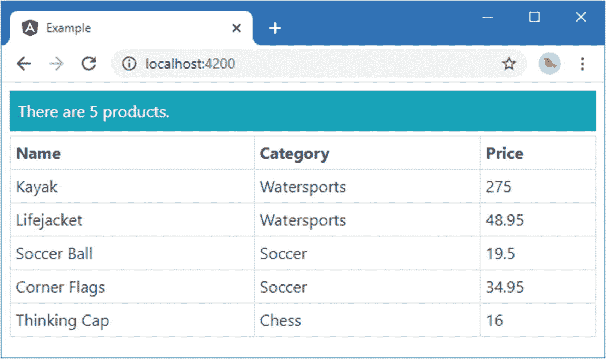
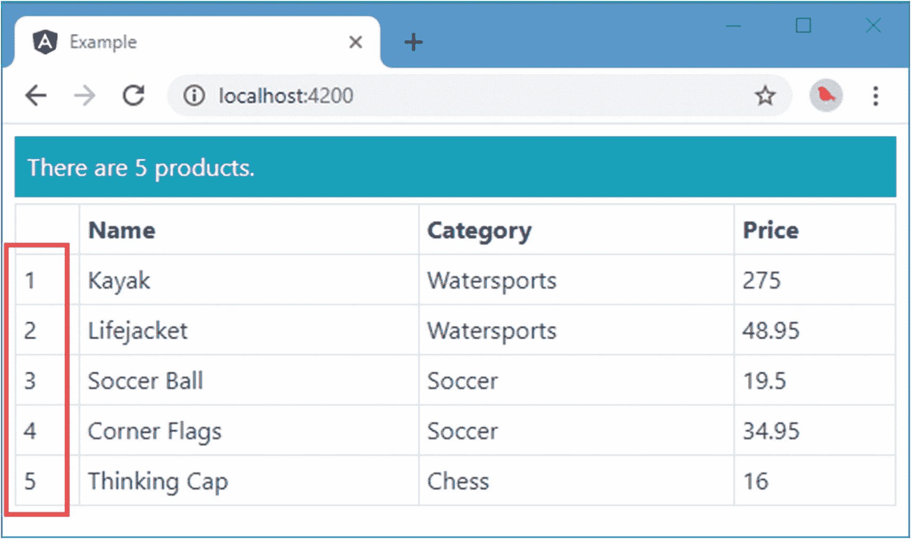
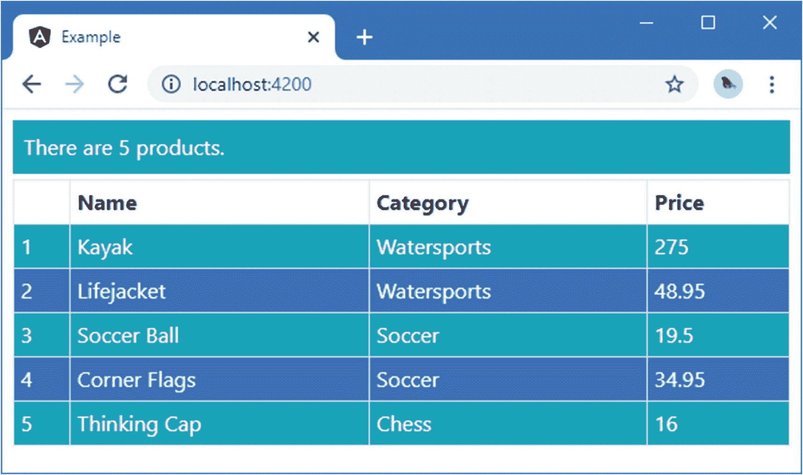
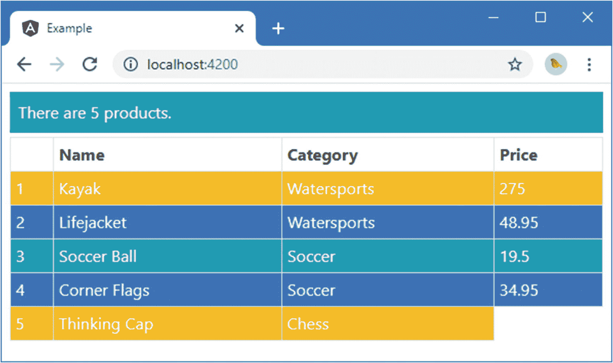
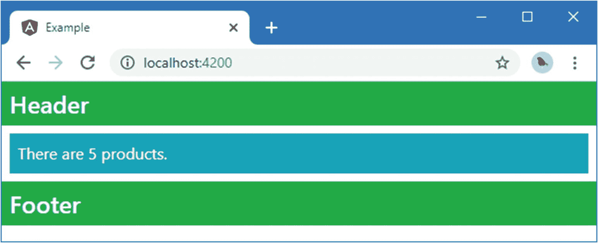

# 13.使用内置指令

在这一章中，我描述了内置指令，这些指令负责创建 web 应用程序的一些最常见的必需功能:有选择地包含内容，在不同的内容片段之间进行选择，以及重复内容。我还描述了 Angular 对用于单向数据绑定的表达式和提供这些表达式的指令的一些限制。表 [13-1](#Tab1) 将内置模板指令放在上下文中。

表 13-1。

将内置指令放在上下文中

<colgroup><col class="tcol1 align-left"> <col class="tcol2 align-left"></colgroup> 
| 

问题

 | 

回答

 |
| --- | --- |
| 它们是什么？ | 本章中描述的内置指令负责选择性地包含内容、在内容片段之间进行选择，以及为数组中的每个项目重复内容。还有设置元素样式和类成员的指令，如第 [13](13.html) 章所述。 |
| 它们为什么有用？ | 使用这些指令可以执行的任务是 web 应用程序开发中最常见和最基本的任务，它们为根据应用程序中的数据调整显示给用户的内容提供了基础。 |
| 它们是如何使用的？ | 这些指令应用于模板中的 HTML 元素。这一章(以及本书的其余部分)都有例子。 |
| 有什么陷阱或限制吗？ | 使用内置模板指令的语法要求您记住，其中一些指令(包括`ngIf`和`ngFor`)必须以星号为前缀，而其他指令(包括`ngClass`、`ngStyle`和`ngSwitch`)必须用方括号括起来。我在“理解微模板指令”边栏中解释了为什么这是必需的，但是这很容易忘记并得到意想不到的结果。 |
| 有其他选择吗？ | 你可以编写你自己的定制指令——这个过程我在第 [15](15.html) 和 [16](16.html) 章中描述过——但是内置指令写得很好并且经过了全面的测试。对于大多数应用程序，最好使用内置指令，除非它们不能准确提供所需的功能。 |

表 [13-2](#Tab2) 总结了本章内容。

表 13-2。

章节总结

<colgroup><col class="tcol1 align-left"> <col class="tcol2 align-left"> <col class="tcol3 align-left"></colgroup> 
| 

问题

 | 

解决办法

 | 

列表

 |
| --- | --- | --- |
| 基于数据绑定表达式有条件地显示内容 | 使用`ngIf`指令 | 1–3 |
| 基于数据绑定表达式的值在不同内容之间进行选择 | 使用`ngSwitch`指令 | 4, 5 |
| 为由数据绑定表达式产生的每个对象生成一段内容 | 使用`ngFor`指令 | 6–12 |
| 重复内容块 | 使用`ngTemplateOutlet`指令 | 13–14 |
| 防止模板错误 | 避免将修改应用程序状态作为数据绑定表达式的副作用 | 15–19 |
| 避免上下文错误 | 确保数据绑定表达式仅使用模板组件提供的属性和方法 | 20–22 |

## 准备示例项目

本章依赖于在第 [11 章](11.html)中创建并在第 [12 章](12.html)中修改的`example`项目。为了准备本章的主题，清单 [13-1](#PC1) 显示了对组件类的更改，删除了不再需要的特性，并添加了新的方法和属性。

Tip

你可以从 [`https://github.com/Apress/pro-angular-9`](https://github.com/Apress/pro-angular-9) 下载本章以及本书其他章节的示例项目。如果在运行示例时遇到问题，请参见第 [1](01.html) 章获取帮助。

```ts
import { ApplicationRef, Component } from "@angular/core";
import { Model } from "./repository.model";
import { Product } from "./product.model";

@Component({
    selector: "app",
    templateUrl: "template.html"
})
export class ProductComponent {
    model: Model = new Model();

    constructor(ref: ApplicationRef) {
        (<any>window).appRef = ref;
        (<any>window).model = this.model;
    }

    getProductByPosition(position: number): Product {
        return this.model.getProducts()[position];
    }

    getProduct(key: number): Product {
        return this.model.getProduct(key);
    }

    getProducts(): Product[] {
        return this.model.getProducts();
    }

    getProductCount(): number {
        return this.getProducts().length;
    }

    targetName: string = "Kayak";
}

Listing 13-1.Changes in the component.ts File in the src/app Folder

```

清单 [13-2](#PC2) 显示了模板文件的内容，它通过调用组件的新`getProductCount`方法显示了数据模型中的产品数量。

```ts
<div class="text-white m-2">
  <div class="bg-info p-2">
    There are {{getProductCount()}} products.
  </div>
</div>

Listing 13-2.The Contents of the template.html File in the src/app Folder

```

从命令行的`example`文件夹中运行以下命令，启动 TypeScript 编译器和开发 HTTP 服务器:

```ts
ng serve

```

打开一个新的浏览器窗口并导航至`http://localhost:4200`以查看如图 [13-1](#Fig1) 所示的内容。


图 13-1。

运行示例应用程序

## 使用内置指令

Angular 附带了一组内置指令，提供了 web 应用程序中通常需要的特性。表 [13-3](#Tab3) 描述了可用的指令，我将在接下来的章节中演示这些指令(除了`ngClass`和`ngStyle`指令，它们将在第 [12 章](12.html)中介绍)。

表 13-3。

内置指令

<colgroup><col class="tcol1 align-left"> <col class="tcol2 align-left"></colgroup> 
| 

例子

 | 

描述

 |
| --- | --- |
| `<div *ngIf="expr"></div>` | 如果表达式的计算结果为`true`，则`ngIf`指令用于在 HTML 文档中包含一个元素及其内容。指令名称前的星号表示这是一个微模板指令，如“了解微模板指令”侧栏中所述。 |
| `<div [ngSwitch]="expr">  <span *ngSwitchCase="expr"></span>  <span *ngSwitchDefault></span></div>` | `ngSwitch`指令用于根据表达式的结果在 HTML 文档中包含的多个元素之间进行选择，然后将表达式的结果与使用`ngSwitchCase`指令定义的各个表达式的结果进行比较。如果没有一个`ngSwitchCase`值匹配，那么将使用已经应用了`ngSwitchDefault`指令的元素。`ngSwitchCase`和`ngSwitchDefault`指令前的星号表示它们是微模板指令，如“理解微模板指令”侧栏中所述。 |
| `<div *ngFor="#item of expr"></div>` | `ngFor`指令用于为数组中的每个对象生成相同的元素集。指令名称前的星号表示这是一个微模板指令，如“了解微模板指令”侧栏中所述。 |
| `<ng-template [ngTemplateOutlet]="myTempl"></ngtemplate>` | `ngTemplateOutlet`指令用于重复模板中的一块内容。 |
| `<div ngClass="expr"></div>` | 如第 [12 章](12.html)所述，`ngClass`指令用于管理类成员。 |
| `<div ngStyle="expr"></div>` | 如第 [12 章](12.html)所述，`ngStyle`指令用于管理直接应用于元素的样式(与通过类应用样式相反)。 |

### 使用 ngIf 指令

`ngIf`是最简单的内置指令，用于在表达式的值为`true`时在文档中包含一段 HTML，如清单 [13-3](#PC4) 所示。

```ts
<div class="text-white m-2">
  <div class="bg-info p-2">
    There are {{getProductCount()}} products.
  </div>

  <div *ngIf="getProductCount() > 4" class="bg-info p-2 mt-1">
    There are more than 4 products in the model
  </div>

  <div *ngIf="getProductByPosition(0).name != 'Kayak'" class="bg-info p-2 mt-1">
    The first product isn't a Kayak
  </div>
</div>

Listing 13-3.Using the ngIf Directive in the template.html File in the src/app Folder

```

`ngIf`指令已经应用于两个`div`元素，表达式检查模型中`Product`对象的数量以及第一个`Product`的名称是否为`Kayak`。

第一个表达式求值为`true`，表示`div`元素及其内容将包含在 HTML 文档中；第二个表达式的值为`false`，这意味着第二个`div`元素将被排除。图 [13-2](#Fig2) 显示了结果。

Note

指令在 HTML 文档中添加和删除元素，而不仅仅是显示或隐藏它们。如果您想保留元素并控制它们的可见性，可以使用第 [12](12.html) 章中描述的属性或样式绑定，方法是将`hidden`元素属性设置为`true`或将`display`样式属性设置为`none`。


图 13-2。

使用 ngIf 指令

Understanding Micro-Template Directives

一些指令，如`ngFor`、`ngIf`以及与`ngSwitch`一起使用的嵌套指令，都带有星号前缀，如`*ngFor`、`*ngIf`和`*ngSwitch`。星号是使用依赖于作为模板一部分提供的内容的指令的简写，称为*微模板*。使用微模板的指令被称为*结构指令*，我在第 [16](16.html) 章向您展示如何创建它们时会再次提到这个描述。

清单 [13-3](#PC4) 将`ngIf`指令应用于`div`元素，告诉指令使用`div`元素及其内容作为它处理的每个对象的微模板。在幕后，Angular 扩展了微模板和指令，如下所示:

```ts
...
<ng-template ngIf="model.getProductCount() > 4">
    <div class="bg-info p-2 mt-1">
        There are more than 4 products in the model
    </div>
</ng-template>
...

```

您可以在模板中使用这两种语法，但是如果您使用紧凑语法，那么您必须记住使用星号。我在第 14 章中解释了如何创建你自己的微模板指令。

像所有指令一样，用于`ngIf`的表达式将被重新计算，以反映数据模型中的变化。在浏览器的 JavaScript 控制台中运行以下语句，删除第一个数据对象并运行更改检测流程:

```ts
model.products.shift()
appRef.tick()

```

修改模型的效果是删除第一个`div`元素，因为现在的`Product`对象太少，添加第二个`div`元素，因为数组中第一个`Product`的`name`属性不再是`Kayak`。图 [13-3](#Fig3) 显示了变化。


图 13-3。

重新计算指令表达式的影响

### 使用 nsswitch 指令

`ngSwitch`指令根据表达式结果选择几个元素中的一个，类似于 JavaScript `switch`语句。清单 [13-4](#PC7) 显示了用于根据模型中对象的数量选择元素的`ngSwitch`指令。

```ts
<div class="text-white m-2">
  <div class="bg-info p-2">
    There are {{getProductCount()}} products.
  </div>

  <div class="bg-info p-2 mt-1" [ngSwitch]="getProductCount()">
    <span *ngSwitchCase="2">There are two products</span>
    <span *ngSwitchCase="5">There are five products</span>
    <span *ngSwitchDefault>This is the default</span>
  </div>
</div>

Listing 13-4.Using the ngSwitch Directive in the template.html File in the src/app Folder

```

`ngSwitch`指令语法使用起来可能会很混乱。应用了`ngSwitch`指令的元素总是包含在 HTML 文档中，并且指令名没有前缀星号。它必须在方括号中指定，如下所示:

```ts
...
<div class="bg-info p-2 mt-1" [ngSwitch]="getProductCount()">
...

```

每个内部元素，在本例中是`span`元素，是一个微模板，指定目标表达式结果的指令以星号为前缀，如下所示:

```ts
...
<span *ngSwitchCase="5">There are five products</span>
...

```

`ngSwitchCase`指令用于指定表达式结果。如果`ngSwitch`表达式计算出指定的结果，那么该元素及其内容将包含在 HTML 文档中。如果表达式没有计算出指定的结果，那么元素及其内容将从 HTML 文档中排除。

`ngSwitchDefault`指令应用于一个 fallback 元素——相当于 JavaScript `switch`语句中的`default`标签——如果表达式结果与`ngSwitchCase`指令指定的任何结果都不匹配，该元素就会包含在 HTML 文档中。

对于应用程序中的初始数据，清单 [13-4](#PC7) 中的指令产生以下 HTML:

```ts
...
<div class="bg-info p-2 mt-1" ng-reflect-ng-switch="5">
    <span>There are five products</span>
</div>
...

```

已经应用了`ngSwitch`指令的`div`元素总是包含在 HTML 文档中。对于模型中的初始数据，其`ngSwitchCase`指令的结果为`5`的`span`元素也被包括在内，产生如图 [13-4](#Fig4) 左侧所示的结果。


图 13-4。

使用 nsswitch 指令

`ngSwitch`绑定响应数据模型中的变化，您可以通过在浏览器的 JavaScript 控制台中执行以下语句来测试:

```ts
model.products.shift()
appRef.tick()

```

这些语句从模型中删除第一个项目，并强制 Angular 运行变化检测过程。两个`ngSwitchCase`指令的结果都不匹配`getProductCount`表达式的结果，因此`ngSwitchDefault`元素被包含在 HTML 文档中，如图 [13-4](#Fig4) 的右图所示。

#### 避免文字值问题

当使用`ngSwitchCase`指令指定文字字符串值时，会出现一个常见的问题，必须注意得到正确的结果，如清单 [13-5](#PC12) 所示。

```ts
<div class="text-white m-2">
  <div class="bg-info p-2">
    There are {{getProductCount()}} products.
  </div>

  <div class="bg-info p-2 mt-1" [ngSwitch]="getProduct(1).name">
    <span *ngSwitchCase="targetName">Kayak</span>
    <span *ngSwitchCase="'Lifejacket'">Lifejacket</span>
    <span *ngSwitchDefault>Other Product</span>
  </div>
</div>

Listing 13-5.Component and String Literal Values in the template.html File in the src/app Folder

```

分配给`ngSwitchCase`指令的值也是表达式，这意味着您可以调用方法、执行简单的内联操作以及读取属性值，就像您对基本数据绑定所做的那样。

例如，当评估`ngSwitch`表达式的结果与组件定义的`targetName`属性的值匹配时，该表达式告诉 Angular 包含指令应用到的`span`元素:

```ts
...
<span *ngSwitchCase="targetName">Kayak</span>
...

```

如果你想比较一个结果和一个特定的字符串，你必须用双引号引起来，就像这样:

```ts
...
<span *ngSwitchCase="'Lifejacket'">Lifejacket</span>
...

```

当`ngSwitch`表达式的值等于文字字符串值`Lifejacket`时，该表达式告诉 Angular 包含`span`元素，产生如图 [13-5](#Fig5) 所示的结果。


图 13-5。

在 nsswitch 指令中使用表达式和文字值

### 使用 ngFor 指令

`ngFor`指令为数组中的每个对象重复一段内容，提供了相当于`foreach`循环的模板。在清单 [13-6](#PC15) 中，我使用了`ngFor`指令来填充一个表格，为模型中的每个`Product`对象生成一行。

```ts
<div class="text-white m-2">
  <div class="bg-info p-2">
    There are {{getProductCount()}} products.
  </div>

  <table class="table table-sm table-bordered mt-1 text-dark">
    <tr><th>Name</th><th>Category</th><th>Price</th></tr>
    <tr *ngFor="let item of getProducts()">
      <td>{{item.name}}</td>
      <td>{{item.category}}</td>
      <td>{{item.price}}</td>
    </tr>
  </table>
</div>

Listing 13-6.Using the ngFor Directive in the template.html File in the src/app Folder

```

与`ngFor`指令一起使用的表达式比其他内置指令更复杂，但是当您看到不同部分如何组合在一起时，它就开始有意义了。下面是我在示例中使用的指令:

```ts
...
<tr *ngFor="let item of getProducts()">
...

```

名称前的星号是必需的，因为该指令正在使用微模板，如“了解微模板指令”侧栏中所述。随着您对 Angular 的熟悉，这将变得更有意义，但是首先，您只需要记住这个指令需要一个星号(或者，正如我经常做的，直到您看到浏览器的 JavaScript 控制台中显示一个错误，然后*然后*记住)。

对于表达式本身，有两个不同的部分，用关键字`of`连接。表达式的右边部分提供将被枚举的数据源。

```ts
...
<tr *ngFor="let item of getProducts()">
...

```

这个例子指定组件的`getProducts`方法作为数据源，这允许内容是模型中每个`Product`对象的。右边是一个独立的表达式，这意味着您可以在模板中准备数据或执行简单的操作。

`ngFor`表达式的左侧定义了一个*模板变量*，由`let`关键字表示，这就是数据在角度模板内的元素之间传递的方式。

```ts
...
<tr *ngFor="let item of getProducts()">
...

```

`ngFor`指令将变量分配给数据源中的每个对象，以便嵌套元素可以使用该变量。示例中的本地模板变量称为`item`，它用于访问`td`元素的`Product`对象的属性，如下所示:

```ts
...
<td>{{item.name}}</td>
...

```

总之，示例中的指令告诉 Angular 枚举由组件的`getProducts`方法返回的对象，将每个对象分配给一个名为`item`的变量，然后生成一个`tr`元素及其`td`子元素，评估它们包含的模板表达式。

对于清单 [13-6](#PC15) 中的例子，结果是一个表格，其中`ngFor`指令用于为模型中的每个`Product`对象生成表格行，并且每个表格行包含显示`Product`对象的`name`、`category`和`price`属性的值的`td`元素，如图 [13-6](#Fig6) 所示。



图 13-6。

使用 ngFor 指令创建表行

#### 使用其他模板变量

最重要的模板变量是引用正在处理的数据对象的变量，在前面的例子中是`item`。但是`ngFor`指令支持一系列其他的值，这些值也可以被赋给变量，然后在嵌套的 HTML 元素中被引用，如表 [13-4](#Tab4) 中所描述的，并在接下来的章节中演示。

表 13-4。

本地模板值的 NGF

<colgroup><col class="tcol1 align-left"> <col class="tcol2 align-left"></colgroup> 
| 

名字

 | 

描述

 |
| --- | --- |
| `index` | 该`number`值被分配给当前对象的位置。 |
| `odd` | 如果当前对象在数据源中的位置是奇数，这个`boolean`值将返回`true`。 |
| `even` | 如果当前对象在数据源中的位置是偶数，那么这个`boolean`值返回`true`。 |
| `first` | 如果当前对象是数据源中的第一个对象，这个`boolean`值返回`true`。 |
| `last` | 如果当前对象是数据源中的最后一个对象，这个`boolean`值返回`true`。 |

##### 使用索引值

`index`值被设置为当前数据对象的位置，并针对数据源中的每个对象递增。在清单 [13-7](#PC20) 中，我定义了一个使用`ngFor`指令填充的表，该表将`index`值赋给一个名为`i`的本地模板变量，然后在字符串插值绑定中使用该变量。

```ts
<div class="text-white m-2">
  <div class="bg-info p-2">
    There are {{getProductCount()}} products.
  </div>

  <table class="table table-sm table-bordered mt-1 text-dark">
    <tr><th></th><th>Name</th><th>Category</th><th>Price</th></tr>
    <tr *ngFor="let item of getProducts(); let i = index">
      <td>{{i +1}}</td>
      <td>{{item.name}}</td>
      <td>{{item.category}}</td>
      <td>{{item.price}}</td>
    </tr>
  </table>
</div>

Listing 13-7.Using the Index Value in the template.html File in the src/app Folder

```

一个新术语被添加到`ngFor`表达式中，用分号(`;`字符)与现有术语分开。新表达式使用`let`关键字将`index`值赋给一个名为`i`的本地模板变量，如下所示:

```ts
...
<tr *ngFor="let item of getProducts(); let i = index">
...

```

这允许使用绑定在嵌套元素中访问该值，如下所示:

```ts
...
<td>{{i + 1}}</td>
...

```

`index`值是从零开始的，给`value`加 1 创建一个简单的计数器，产生如图 [13-7](#Fig7) 所示的结果。



图 13-7。

使用索引值

##### 使用奇数值和偶数值

当数据项的`index`值为`odd`时，`odd`值为`true`。相反，当数据项的索引值为`even`时，`even`值为`true`。一般来说，你只需要使用`odd`或`even`值，因为它们是`boolean`值，当`even`是`false`时`odd`是`true`，反之亦然。在清单 [13-8](#PC23) 中，`odd`值用于管理表中`tr`元素的类成员。

```ts
<div class="text-white m-2">
  <div class="bg-info p-2">
    There are {{getProductCount()}} products.
  </div>

  <table class="table table-sm table-bordered mt-1">
    <tr><th></th><th>Name</th><th>Category</th><th>Price</th></tr>
    <tr *ngFor="let item of getProducts(); let i = index; let odd = odd"
        class="text-white" [class.bg-primary]="odd" [class.bg-info]="!odd">
      <td>{{i + 1}}</td>
      <td>{{item.name}}</td>
      <td>{{item.category}}</td>
      <td>{{item.price}}</td>
    </tr>
  </table>
</div>

Listing 13-8.Using the odd Value in the template.html File in the src/app Folder

```

我使用了一个分号，并在`ngFor`表达式中添加了另一个术语，将`odd`值赋给一个本地模板变量，该变量也称为`odd`。

```ts
...
<tr *ngFor="let item of getProducts(); let i = index; let odd = odd"
    class="text-white" [class.bg-primary]="odd" [class.bg-info]="!odd">
...

```

这似乎是多余的，但是你不能直接访问`ngFor`值，必须使用一个本地变量，即使它有相同的名字。我使用了`class`绑定来将替换行分配给`bg-primary`和`bg-info`类，这两个类是引导背景色类，它们将表格行分成条纹，如图 [13-8](#Fig8) 所示。



图 13-8。

使用奇数值

Expanding the *ngFor Directive

注意，在清单 [13-8](#PC23) 中，我可以在表达式中使用模板变量，该变量应用于定义它的同一个`tr`元素。这是可能的，因为`ngFor`是一个微模板指令——由名字前面的`*`表示——所以 Angular 扩展了 HTML，看起来像这样:

```ts
...
<table class="table table-sm table-bordered mt-1">
    <tr><th></th><th>Name</th><th>Category</th><th>Price</th></tr>
    <ng-template ngFor let-item [ngForOf]="getProducts()"
            let-i="index" let-odd="odd">
        <tr [class.bg-primary]="odd" [class.bg-info]="!odd">
            <td>{{i + 1}}</td>
            <td>{{item.name}}</td>
            <td>{{item.category}}</td>
            <td>{{item.price}}</td>
        </tr>
    </ng-template>
</table>
...

```

您可以看到，`ng-template`元素定义了变量，使用了有些笨拙的`let-<name>`属性，然后由其中的`tr`和`td`元素访问这些属性。正如 Angular 中的许多内容一样，一旦你理解了幕后发生的事情，看似通过魔法发生的事情就会变得简单明了，我将在第 [16](16.html) 章中详细解释这些特性。使用`*ngFor`语法的一个很好的理由是，它提供了一种更优雅的方式来表达指令表达式，尤其是当有多个模板变量时。

##### 使用第一个和最后一个值

只有数据源提供的序列中的第一个对象的`first`值为`true`，其他所有对象的`first`值为`false`。相反，仅对于序列中的最后一个对象，`last`值为`true`。清单 [13-9](#PC26) 使用这些值来区别对待序列中的第一个和最后一个对象。

```ts
<div class="text-white m-2">
  <div class="bg-info p-2">
    There are {{getProductCount()}} products.
  </div>

  <table class="table table-sm table-bordered mt-1">
    <tr class="text-dark">
      <th></th><th>Name</th><th>Category</th><th>Price</th>
    </tr>
    <tr *ngFor="let item of getProducts(); let i = index; let odd = odd;
            let first = first; let last = last" class="text-white"
        [class.bg-primary]="odd" [class.bg-info]="!odd"
        [class.bg-warning]="first || last">
      <td>{{i + 1}}</td>
      <td>{{item.name}}</td>
      <td>{{item.category}}</td>
      <td *ngIf="!last">{{item.price}}</td>
    </tr>
  </table>
</div>

Listing 13-9.Using the first and last Values in the template.html File in the src/app Folder

```

`ngFor`表达式中的新术语将`first`和`last`值分配给模板变量`first`和`last`。这些变量随后被绑定在`tr`元素上的`class`使用，当其中一个为`true`时，它将该元素分配给`bg-warning`类，并被`td`元素之一上的`ngIf`指令使用，这将排除数据源中`last`项的元素，产生如图 [13-9](#Fig9) 所示的效果。



图 13-9。

使用第一个和最后一个值

#### 最小化元素操作

当数据模型发生变化时，`ngFor`指令评估其表达式，并更新代表其数据对象的元素。更新过程可能会很昂贵，尤其是当数据源被替换为包含表示相同数据的不同对象的数据源时。替换数据源似乎是一件奇怪的事情，但这在 web 应用程序中经常发生，尤其是当数据是从 web 服务中检索时，就像我在第 24 章[中描述的那些。相同的数据值由新的对象表示，这对于角度来说存在效率问题。为了演示这个问题，我向组件添加了一个方法来替换数据模型中的一个`Product`对象，如清单](24.html) [13-10](#PC27) 所示。

```ts
import { Product } from "./product.model";
import { SimpleDataSource } from "./datasource.model";

export class Model {
    private dataSource: SimpleDataSource;
    private products: Product[];
    private locator = (p:Product, id:number) => p.id == id;

    constructor() {
        this.dataSource = new SimpleDataSource();
        this.products = new Array<Product>();
        this.dataSource.getData().forEach(p => this.products.push(p));
    }

    // ...other methods omitted for brevity...

    swapProduct() {
        let p = this.products.shift();
        this.products.push(new Product(p.id, p.name, p.category, p.price));
    }
}

Listing 13-10.Replacing an Object in the repository.model.ts File in the src/app Folder

```

`swapProduct`方法从数组中删除第一个对象，并添加一个新对象，该对象的`id`、`name`、`category`和`price`属性具有相同的值。这是一个用新对象表示数据值的例子。

使用浏览器的 JavaScript 控制台运行以下语句来修改数据模型并运行更改检测流程:

```ts
model.swapProduct()
appRef.tick()

```

当`ngFor`指令检查它的数据源时，它发现要执行两个操作来反映数据的变化。第一个操作是销毁表示数组中第一个对象的 HTML 元素。第二个操作是创建一组新的 HTML 元素来表示数组末尾的新对象。

Angular 无法知道它正在处理的数据对象是否具有相同的值，也无法知道它是否可以通过简单地移动 HTML 文档中的现有元素来更有效地完成工作。

在这个例子中，这个问题只影响到两个元素，但是当应用程序中的数据使用 Ajax 从外部数据源刷新时，这个问题就更加严重了，每次收到响应时，所有的数据模型对象都可以被替换。因为它不知道真正的变化很少，`ngFor`指令必须销毁所有的 HTML 元素并重新创建它们，这可能是一个昂贵且耗时的操作。

为了提高更新的效率，您可以定义一个组件方法来帮助 Angular 确定何时两个不同的对象表示相同的数据，如清单 [13-11](#PC29) 所示。

```ts
import { ApplicationRef, Component } from "@angular/core";
import { Model } from "./repository.model";
import { Product } from "./product.model";

@Component({
    selector: "app",
    templateUrl: "template.html"
})
export class ProductComponent {
    model: Model = new Model();

    // ...constructor and methods omitted for brevity...

    getKey(index: number, product: Product) {
        return product.id;
    }
}

Listing 13-11.Adding the Object Comparison Method in the component.ts File in the src/app Folder

```

该方法必须定义两个参数:数据源中对象的位置和数据对象。方法的结果唯一标识一个对象，如果两个对象产生相同的结果，则认为它们是相等的。

如果两个`Product`对象具有相同的`id`值，它们将被视为相等。告诉`ngFor`表达式使用比较方法是通过给表达式添加一个`trackBy`项来完成的，如清单 [13-12](#PC30) 所示。

```ts
<div class="text-white m-2">
  <div class="bg-info p-2">
    There are {{getProductCount()}} products.
  </div>

  <table class="table table-sm table-bordered mt-1">
    <tr class="text-dark">
      <th></th><th>Name</th><th>Category</th><th>Price</th>
    </tr>
    <tr *ngFor="let item of getProducts(); let i = index; let odd = odd;
            let first = first; let last = last; trackBy:getKey" class="text-white"
        [class.bg-primary]="odd" [class.bg-info]="!odd"
        [class.bg-warning]="first || last">
      <td>{{i + 1}}</td>
      <td>{{item.name}}</td>
      <td>{{item.category}}</td>
      <td *ngIf="!last">{{item.price}}</td>
    </tr>
  </table>
</div>

Listing 13-12.Providing an Equality Method in the template.html File in the src/app Folder

```

有了这个变化，`ngFor`指令将知道使用清单 [13-12](#PC30) 中定义的`swapProduct`方法从数组中删除的`Product`等同于添加到数组中的那个，尽管它们是不同的对象。可以移动现有的元素，而不是删除和创建元素，这是一个执行起来更简单、更快速的任务。

仍然可以对元素进行更改——例如通过`ngIf`指令，该指令将删除一个`td`元素，因为新对象将是数据源中的`last`项，但即使这样也比单独处理对象要快。

Testing the Equality Method

检查等式方法是否有效果有点棘手。我发现最好的方法是使用浏览器的 F12 开发工具，在这种情况下使用 Chrome 浏览器。

应用程序加载后，在浏览器窗口中右键单击包含单词 *Kayak* 的`td`元素，并从弹出菜单中选择 Inspect。这将打开开发者工具窗口并显示元素面板。

单击左边的省略号按钮(标有`...`)并从菜单中选择添加属性。添加一个值为`old`的`id`属性。这将产生如下所示的元素:

```ts
<td id="old">Kayak</td>

```

添加一个`id`属性使得使用 JavaScript 控制台访问表示 HTML 元素的对象成为可能。切换到控制台面板，输入以下语句:

```ts
window.old

```

当您点击 Return 时，浏览器将通过元素的`id`属性值来定位元素，并显示以下结果:

```ts
<td id="old">Kayak</td>

```

现在在 JavaScript 控制台中执行以下语句，每执行一个语句后按 Return 键:

```ts
model.swapProduct()
appRef.tick()

```

一旦处理了对数据模型的更改，在 JavaScript 控制台中执行以下语句将确定添加了`id`属性的`td`元素是否已被移动或销毁:

```ts
window.old

```

如果元素已被移动，那么您将会在控制台中看到该元素，如下所示:

```ts
<td id="old">Kayak</td>

```

如果元素已经被破坏，那么就不会有`id`属性为`old`的元素，浏览器会显示`undefined`字样。

### 使用 ngTemplateOutlet 指令

`ngTemplateOutlet`指令用于在指定的位置重复一个内容块，当您需要在不同的地方生成相同的内容并希望避免重复时，这个指令会很有用。清单 [13-13](#PC37) 显示了正在使用的指令。

```ts
<ng-template #titleTemplate>
  <h4 class="p-2 bg-success text-white">Repeated Content</h4>
</ng-template>

<ng-template [ngTemplateOutlet]="titleTemplate"></ng-template>

<div class="bg-info p-2 m-2 text-white">
  There are {{getProductCount()}} products.
</div>

<ng-template [ngTemplateOutlet]="titleTemplate"></ng-template>

Listing 13-13.Using the ngTemplateOutlet Directive in the template.html File in the src/app Folder

```

第一步是使用指令定义包含要重复的内容的模板。这是通过使用`ng-template`元素并使用*引用变量*为其命名来完成的，如下所示:

```ts
...
<ng-template #titleTemplate let-title="title">
  <h4 class="p-2 bg-success text-white">Repeated Content</h4>
</ng-template>
...

```

当 Angular 遇到一个引用变量时，它将它的值设置为它所定义的元素，在本例中是`ng-template`元素。第二步是使用`ngTemplateOutlet`指令将内容插入 HTML 文档，如下所示:

```ts
...
<ng-template [ngTemplateOutlet]="titleTemplate"></ng-template>
...

```

表达式是分配给应该插入的内容的引用变量的名称。该指令用指定的`ng-template`元素的内容替换主机元素。HTML 文档中既不包含包含重复内容的`ng-template`元素，也不包含作为绑定宿主元素的元素。图 [13-10](#Fig10) 显示了指令是如何使用重复内容的。


图 13-10。

使用 ngTemplateOutlet 指令

#### 提供上下文数据

`ngTemplateOutlet`指令可用于为重复内容提供上下文对象，该对象可用于在`ng-template`元素中定义的数据绑定，如清单 [13-14](#PC40) 所示。

```ts
<ng-template #titleTemplate let-text="title">
  <h4 class="p-2 bg-success text-white">{{text}}</h4>
</ng-template>

<ng-template [ngTemplateOutlet]="titleTemplate"
             [ngTemplateOutletContext]="{title: 'Header'}">
</ng-template>

<div class="bg-info p-2 m-2 text-white">
  There are {{getProductCount()}} products.
</div>

<ng-template [ngTemplateOutlet]="titleTemplate"
             [ngTemplateOutletContext]="{title: 'Footer'}">
</ng-template>

Listing 13-14.Providing Context Data in the template.html File in the src/app Folder

```

为了接收上下文数据，包含重复内容的`ng-template`元素定义了一个指定变量名称的`let-`属性，类似于用于`ngFor`指令的扩展语法。表达式的值给`let-`变量赋值，如下所示:

```ts
...
<ng-template #titleTemplate let-text="title">
...

```

本例中的`let-`属性创建了一个名为`text`的变量，该变量通过计算表达式`title`来赋值。为了提供计算表达式所依据的数据，应用了`ngTemplateOutletContext`指令的`ng-template`元素提供了一个 map 对象，如下所示:

```ts
...
<ng-template [ngTemplateOutlet]="titleTemplate"
          [ngTemplateOutletContext]="{title: 'Footer'}">
</ng-template>
...

```

这个新绑定的目标是`ngTemplateOutletContext`，它看起来像另一个指令，但实际上是一个*输入属性*的例子，一些指令用它来接收数据值，我在第 [15 章](15.html)中对此进行了详细描述。绑定的表达式是一个 map 对象，其属性名对应于另一个`ng-template`元素上的`let-`属性。结果是可以使用绑定来定制重复的内容，如图 [13-11](#Fig11) 所示。



图 13-11。

为重复内容提供上下文数据

## 了解单向数据绑定限制

尽管单向数据绑定和指令中使用的表达式看起来像 JavaScript 代码，但您不能使用所有的 JavaScript(或 TypeScript)语言功能。我将在接下来的章节中解释这些限制及其原因。

### 使用幂等表达式

单向数据绑定必须是*幂等的*，这意味着它们可以在不改变应用程序状态的情况下被重复评估。为了说明原因，我向组件的`getProductCount`方法添加了一个调试语句，如清单 [13-15](#PC43) 所示。

Note

Angular *不支持修改应用程序状态，但是必须使用我在第 14 章[中描述的技术。](14.html)*

```ts
...
getProductCount(): number {
    console.log("getProductCount invoked");
    return this.getProducts().length;
}
...

Listing 13-15.Adding a Statement in the component.ts File in the src/app Folder

```

当保存更改并且浏览器重新加载页面时，您将在浏览器的 JavaScript 控制台中看到一长串类似这样的消息:

```ts
...
getProductCount invoked
getProductCount invoked
getProductCount invoked
getProductCount invoked
...

```

如消息所示，在浏览器中显示内容之前，Angular 对绑定表达式进行了多次评估。如果一个表达式修改了应用程序的状态，比如从队列中删除一个对象，那么当模板显示给用户时，您不会得到预期的结果。为了避免这个问题，Angular 限制了表达式的使用方式。在清单 [13-16](#PC45) 中，我向组件添加了一个`counter`属性来帮助演示。

```ts
import { ApplicationRef, Component } from "@angular/core";
import { Model } from "./repository.model";
import { Product } from "./product.model";

@Component({
    selector: "app",
    templateUrl: "template.html"
})
export class ProductComponent {
    model: Model = new Model();

    // ...constructor and methods omitted for brevity...

    targetName: string = "Kayak";

    counter: number = 1;
}

Listing 13-16.Adding a Property in the component.ts File in the src/app Folder

```

在清单 [13-17](#PC46) 中，我添加了一个绑定，当它被求值时，它的表达式增加计数器。

```ts
<ng-template #titleTemplate let-text="title">
  <h4 class="p-2 bg-success text-white">{{text}}</h4>
</ng-template>

<ng-template [ngTemplateOutlet]="titleTemplate"
             [ngTemplateOutletContext]="{title: 'Header'}">
</ng-template>

<div class="bg-info p-2 m-2 text-white">
  There are {{getProductCount()}} products.
</div>

<ng-template [ngTemplateOutlet]="titleTemplate"
             [ngTemplateOutletContext]="{title: 'Footer'}">
</ng-template>

<div class="bg-info p-2">
  Counter: {{counter = counter + 1}}
</div>

Listing 13-17.Adding a Binding in the template.html File in the src/app Folder

```

当浏览器加载页面时，您会在 JavaScript 控制台中看到一个错误，如下所示:

```ts
...
ERROR in Template parse errors:
Parser Error: Bindings cannot contain assignments at column 11 in [ Counter: {{counter = counter + 1}} ] in C:/example/src/app/template.html@17:4 ("
  <div class="bg-info p-2">
    [ERROR ->]Counter: {{counter = counter + 1}}
  </div>"): C:/Users/example/src/app/template.html@17:4
...

```

如果数据绑定表达式包含可用于执行赋值的运算符，如`=`、`+=`、`-+`、`++`和`--`，Angular 将报告错误。此外，当 Angular 在开发模式下运行时，它会执行额外的检查，以确保单向数据绑定在计算完表达式后没有被修改。为了演示，清单 [13-18](#PC48) 向组件添加了一个属性，该属性从模型数组中移除并返回一个`Product`对象。

```ts
import { ApplicationRef, Component } from "@angular/core";
import { Model } from "./repository.model";
import { Product } from "./product.model";

@Component({
    selector: "app",
    templateUrl: "template.html"
})
export class ProductComponent {
    model: Model = new Model();

    // ...constructor and methods omitted for brevity...

    counter: number = 1;

    get nextProduct(): Product {
        return this.model.getProducts().shift();
    }
}

Listing 13-18.Modifying Data in the component.ts File in the src/app Folder

```

在清单 [13-19](#PC49) 中，您可以看到我用来读取`nextProduct`属性的数据绑定。

```ts
<ng-template #titleTemplate let-text="title">
  <h4 class="p-2 bg-success text-white">{{text}}</h4>
</ng-template>

<ng-template [ngTemplateOutlet]="titleTemplate"
             [ngTemplateOutletContext]="{title: 'Header'}">
</ng-template>

<div class="bg-info p-2 m-2 text-white">
  There are {{getProductCount()}} products.
</div>

<ng-template [ngTemplateOutlet]="titleTemplate"
             [ngTemplateOutletContext]="{title: 'Footer'}">
</ng-template>

<div class="bg-info p-2 text-white">
  Next Product is {{nextProduct.name}}
</div>

Listing 13-19.Binding to a Property in the template.html File in the src/app Folder

```

保存模板时的响应取决于 F12 开发人员工具是否打开。如果是，那么调试器将暂停应用程序的执行，因为检测变化的代码包含一个`debugger`语句。如果您关闭 F12 工具，重新加载浏览器窗口，然后再次打开这些工具，您将在 JavaScript 控制台中看到以下错误:

```ts
...
Error: ExpressionChangedAfterItHasBeenCheckedError: Expression has changed after it was checked. Previous value: 'null: 4'. Current value: 'null: 3'.
...

```

### 理解表达式上下文

当 Angular 对表达式求值时，它是在模板组件的上下文中进行的，这就是模板能够在没有任何前缀的情况下访问方法和属性的方式，如下所示:

```ts
...
<div class="bg-info p-2">
    There are {{getProductCount()}} products.
</div>
...

```

当 Angular 处理这些表达式时，组件提供了`getProductCount`方法，Angular 使用指定的参数调用该方法，然后将结果合并到 HTML 文档中。据说该组件提供了模板的*表达式上下文*。

表达式上下文意味着不能访问模板组件之外定义的对象，尤其是模板不能访问全局名称空间。全局名称空间用于定义常见的实用程序，例如`console`对象，它定义了我一直用来将调试信息写出到浏览器的 JavaScript 控制台的`log`方法。全局名称空间还包括`Math`对象，它提供了对一些有用的算术方法的访问，比如`min`和`max`。

为了演示这种限制，清单 [13-20](#PC52) 向模板添加了一个字符串插值绑定，它依赖于`Math.floor`方法将`number`值向下舍入到最接近的整数。

```ts
<ng-template #titleTemplate let-text="title">
  <h4 class="p-2 bg-success text-white">{{text}}</h4>
</ng-template>

<ng-template [ngTemplateOutlet]="titleTemplate"
             [ngTemplateOutletContext]="{title: 'Header'}">
</ng-template>

<div class="bg-info p-2 m-2 text-white">
  There are {{getProductCount()}} products.
</div>

<ng-template [ngTemplateOutlet]="titleTemplate"
             [ngTemplateOutletContext]="{title: 'Footer'}">
</ng-template>

<div class='bg-info p-2'>
  The rounded price is {{Math.floor(getProduct(1).price)}}
</div>

Listing 13-20.Accessing the Global Namespace in the template.html File in the src/app Folder

```

Angular 处理模板时，会在浏览器的 JavaScript 控制台中产生以下错误:

```ts
error TS2339: Property 'Math' does not exist on type 'ProductComponent'.

```

错误消息没有特别提到全局名称空间。相反，Angular 试图使用组件作为上下文来评估表达式，但未能找到一个`Math`属性。

如果您想要访问全局命名空间中的功能，那么它必须由组件提供，作为模板的代表。在这个例子中，组件可以只定义一个分配给全局对象的`Math`属性，但是模板表达式应该尽可能的清晰和简单，所以一个更好的方法是定义一个为模板提供它所需要的特定功能的方法，如清单 [13-21](#PC54) 所示。

```ts
import { ApplicationRef, Component } from "@angular/core";
import { Model } from "./repository.model";
import { Product } from "./product.model";

@Component({
    selector: "app",
    templateUrl: "template.html"
})
export class ProductComponent {
    model: Model = new Model();

    // ...constructor and methods omitted for brevity...

    counter: number = 1;

    get nextProduct(): Product {
        return this.model.getProducts().shift();
    }

    getProductPrice(index: number): number {
        return Math.floor(this.getProduct(index).price);
    }
}

Listing 13-21.Defining a Method in the component.ts File in the src/app Folder

```

在清单 [13-22](#PC55) 中，我已经更改了模板中的数据绑定，以使用新定义的方法。

```ts
<ng-template #titleTemplate let-text="title">
  <h4 class="p-2 bg-success text-white">{{text}}</h4>
</ng-template>

<ng-template [ngTemplateOutlet]="titleTemplate"
             [ngTemplateOutletContext]="{title: 'Header'}">
</ng-template>

<div class="bg-info p-2 m-2 text-white">
  There are {{getProductCount()}} products.
</div>

<ng-template [ngTemplateOutlet]="titleTemplate"
             [ngTemplateOutletContext]="{title: 'Footer'}">
</ng-template>

<div class="bg-info p-2 text-white">
  The rounded price is {{getProductPrice(1)}}
</div>

Listing 13-22.Access Global Namespace Functionality in the template.html File in the src/app Folder

```

Angular 处理模板时，会调用`getProductPrice`方法，间接利用全局名称空间中的`Math`对象，产生如图 [13-12](#Fig12) 所示的结果。


图 13-12。

访问全局名称空间功能

## 摘要

在本章中，我解释了如何使用内置模板指令。我向您展示了如何使用`ngIf`和`ngSwitch`指令选择内容，以及如何使用`ngFor`指令重复内容。我解释了为什么有些指令名称带有星号前缀，并描述了这些指令和一般单向数据绑定使用的模板表达式的限制。在下一章，我将描述数据绑定是如何用于事件和表单元素的。