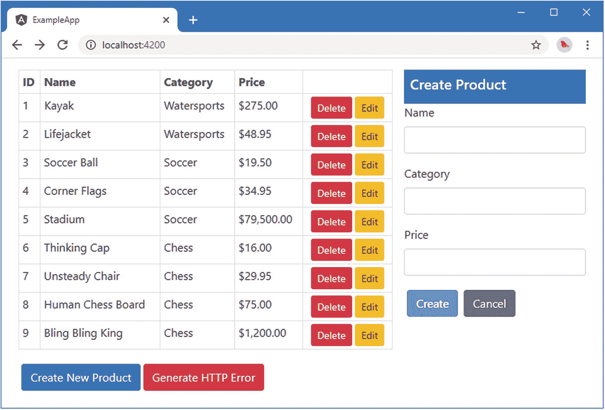
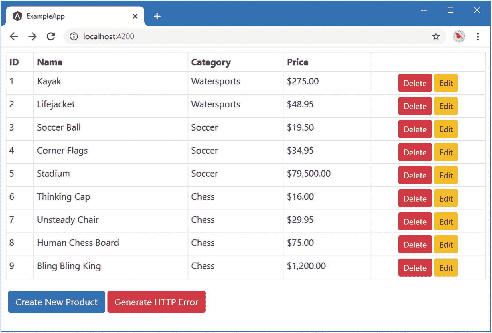
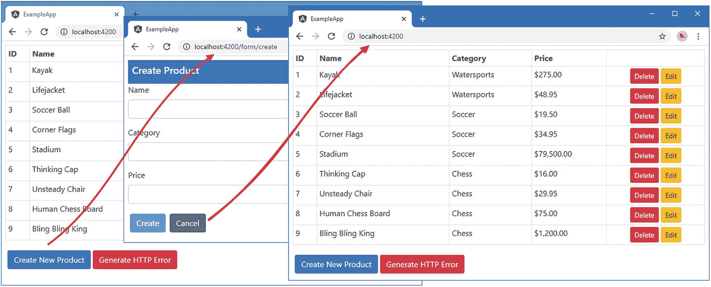
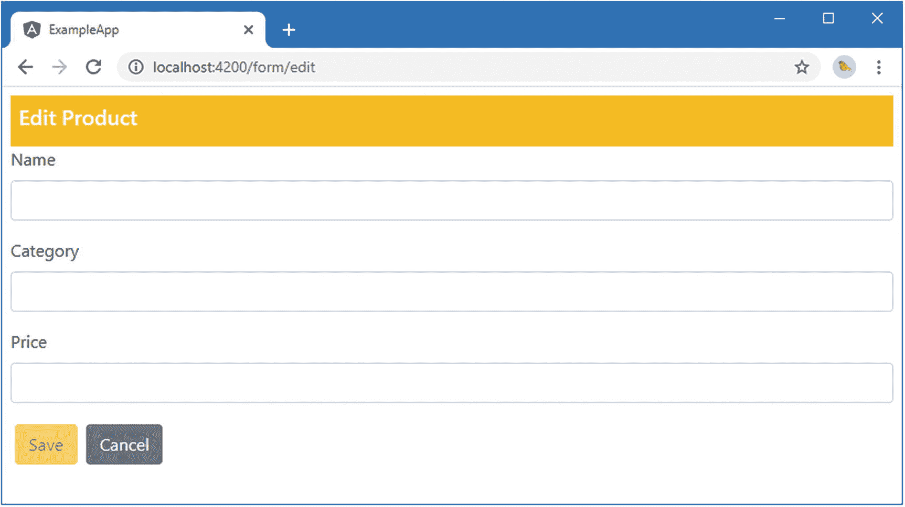
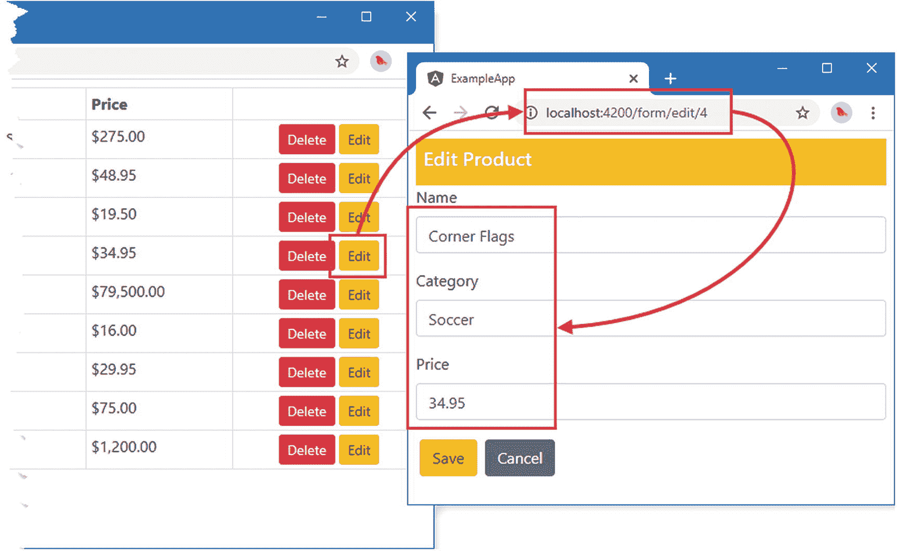
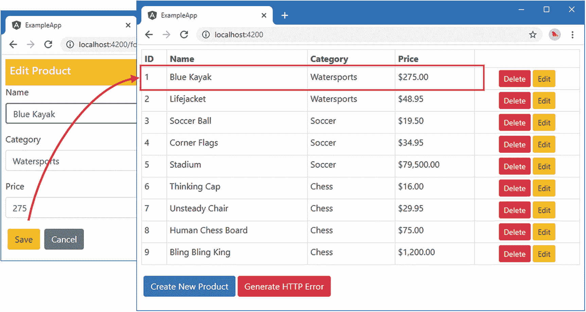
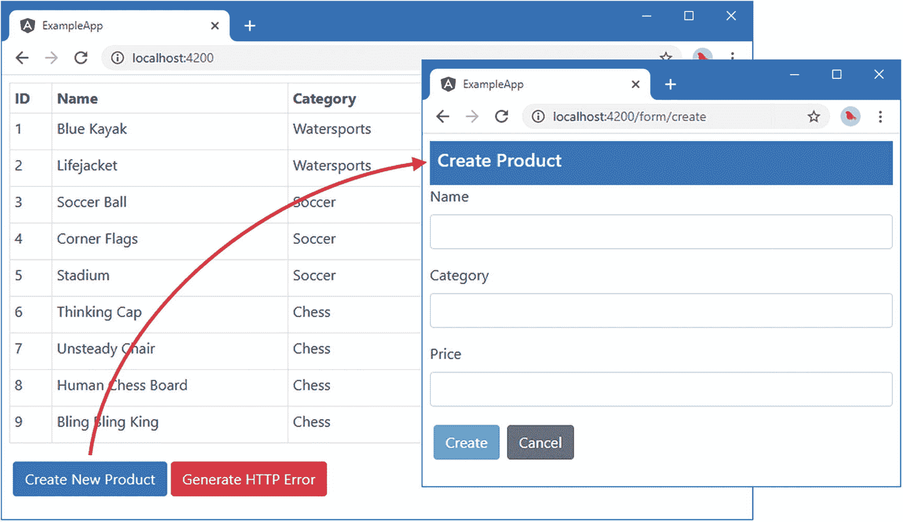

# 25.路由和导航:第 1 部分

Angular路由功能允许应用通过响应浏览器 URL 的更改来更改显示给用户的组件和模板。这允许创建复杂的应用，用最少的代码以开放和灵活的方式修改它们所呈现的内容。为了支持这一特性，可以使用数据绑定和服务来更改浏览器的 URL，从而允许用户在应用中导航。

随着项目复杂性的增加，路由变得非常有用，因为它允许应用的结构与组件和指令分开定义，这意味着可以在路由配置中对结构进行更改，而不必应用于单个组件。

在这一章中，我演示了基本的路由系统是如何工作的，并将其应用到示例应用中。在第 [26](26.html) 和 [27](27.html) 章中，我解释了更高级的路由特性。表 [25-1](#Tab1) 将路由放在上下文中。

表 25-1。

将路由和导航放在上下文中

<colgroup><col class="tcol1 align-left"> <col class="tcol2 align-left"></colgroup> 
| 

问题

 | 

回答

 |
| --- | --- |
| 这是什么？ | 路由使用浏览器的 URL 来管理向用户显示的内容。 |
| 为什么有用？ | 路由允许应用的结构与应用中的组件和模板分开。对应用结构的更改是在路由配置中进行的，而不是在单个组件和指令中进行的。 |
| 如何使用？ | 路由配置被定义为一组片段，用于匹配浏览器的 URL 并选择一个组件，该组件的模板显示为一个名为`router-outlet`的 HTML 元素的内容。 |
| 有什么陷阱或限制吗？ | 路由配置可能变得难以管理，尤其是当 URL 模式是在特定的基础上逐渐定义的时候。 |
| 还有其他选择吗？ | 您不必使用路由功能。您可以通过创建一个组件来获得类似的结果，该组件的视图使用`ngIf`或`ngSwitch`指令选择向用户显示的内容，尽管随着应用的规模和复杂性的增加，这种方法比使用路由更加困难。 |

表 [25-2](#Tab2) 总结了本章内容。

表 25-2。

章节总结

<colgroup><col class="tcol1 align-left"> <col class="tcol2 align-left"> <col class="tcol3 align-left"></colgroup> 
| 

问题

 | 

解决办法

 | 

列表

 |
| --- | --- | --- |
| 使用 URL 导航选择向用户显示的内容 | 使用 URL 路由 | 1–7 |
| 使用 HTML 元素导航 | 应用`routerLink`属性 | 8–10 |
| 响应路由变更 | 使用路由服务接收通知 | Eleven |
| 在 URL 中包含信息 | 使用路由参数 | 12–18 |
| 使用代码导航 | 使用`Router`服务 | Nineteen |
| 接收路由活动的通知 | 处理路由事件 | 20–21 |

## 准备示例项目

本章使用在第 [22](22.html) 章中创建的 exampleApp 项目。为了准备本章的专题，需要做一些修改。该应用被配置为在两个位置显示从表组件发送到产品组件的状态更改事件:通过消息服务和在表单组件的模板中。不再需要这些消息，清单 [25-1](#PC1) 从组件的模板中移除了事件显示。

Tip

你可以从 [`https://github.com/Apress/pro-angular-9`](https://github.com/Apress/pro-angular-9) 下载本章以及本书其他章节的示例项目。如果在运行示例时遇到问题，请参见第 [1](01.html) 章获取帮助。

```ts
<div class="bg-primary text-white p-2" [class.bg-warning]="editing">
    <h5>{{editing  ? "Edit" : "Create"}} Product</h5>
    <!-- Last Event: {{ stateEvents | async | formatState }} -->
</div>

<form novalidate #form="ngForm" (ngSubmit)="submitForm(form)" (reset)="resetForm()" >

    <div class="form-group">
        <label>Name</label>
        <input class="form-control" name="name"
               [(ngModel)]="product.name" required />
    </div>

    <div class="form-group">
        <label>Category</label>
        <input class="form-control" name="category"
               [(ngModel)]="product.category" required />
    </div>

    <div class="form-group">
        <label>Price</label>
        <input class="form-control" name="price"
               [(ngModel)]="product.price"
               required pattern="^[0-9\.]+$" />
    </div>

    <button type="submit" class="btn btn-primary m-1"
            [class.btn-warning]="editing" [disabled]="form.invalid">
        {{editing ? "Save" : "Create"}}
    </button>
    <button type="reset" class="btn btn-secondary m-1">Cancel</button>
</form>

Listing 25-1.Removing the Event Display in the form.component.html File in the src/app/core Folder

```

清单 [25-2](#PC2) 禁用了将状态改变事件推入消息服务的代码。

```ts
import { NgModule } from "@angular/core";
import { BrowserModule } from "@angular/platform-browser";
import { FormsModule } from "@angular/forms";
import { ModelModule } from "../model/model.module";
import { TableComponent } from "./table.component";
import { FormComponent } from "./form.component";
import { SharedState, SHARED_STATE } from "./sharedState.model";
import { Subject } from "rxjs";
import { StatePipe } from "./state.pipe";
import { MessageModule } from "../messages/message.module";
import { MessageService } from "../messages/message.service";
import { Message } from "../messages/message.model";
import { Model } from "../model/repository.model";
import { MODES } from "./sharedState.model";

@NgModule({
  imports: [BrowserModule, FormsModule, ModelModule, MessageModule],
  declarations: [TableComponent, FormComponent, StatePipe],
  exports: [ModelModule, TableComponent, FormComponent],
  providers: [{
    provide: SHARED_STATE,
    deps: [MessageService, Model],
    useFactory: (messageService, model) => {
      return new Subject<SharedState>();
      //let subject = new Subject<SharedState>();
      //subject.subscribe(m => messageService.reportMessage(
      //  new Message(MODES[m.mode] + (m.id != undefined
      //    ? ` ${model.getProduct(m.id).name}` : "")))
      //);
      //return subject;
    }
  }]
})
export class CoreModule { }

Listing 25-2.Disabling State Change Events in the core.module.ts File in the src/app/core Folder

```

打开一个新的命令提示符，导航到`exampleApp`文件夹，运行以下命令启动提供 RESTful web 服务器的服务器:

```ts
npm run json

```

打开一个单独的命令提示符，导航到`exampleApp`文件夹，运行以下命令启动Angular开发工具:

```ts
ng serve

```

打开一个新的浏览器窗口并导航到`http://localhost:4200`以查看如图 [25-1](#Fig1) 所示的内容。



图 25-1。

运行示例应用

## 路由入门

目前，应用中的所有内容始终对用户可见。对于示例应用，这意味着表格和表单总是可见的，并且由用户来跟踪他们正在使用应用的哪一部分来完成手头的任务。

这对于一个简单的应用来说很好，但是对于一个复杂的项目来说就变得难以管理了，这个项目可能有很多功能区域，如果一次全部显示出来的话，这些功能区域会变得令人不知所措。

URL 路由使用 web 应用的一个自然且众所周知的方面:URL，向应用添加结构。在这一节中，我将通过将 URL 路由应用到示例应用来介绍它，这样表格或表单都是可见的，活动组件是根据用户的操作选择的。这将为解释路由如何工作提供一个良好的基础，并为更高级的功能奠定基础。

### 创建路由配置

应用路由的第一步是定义*路由*，这是 URL 和将显示给用户的组件之间的映射。路由配置通常在名为`app.routing.ts`的文件中定义，该文件在`src/app`文件夹中定义。我创建了这个文件，并添加了清单 [25-3](#PC5) 中所示的语句。

```ts
import { Routes, RouterModule } from "@angular/router";
import { TableComponent } from "./core/table.component";
import { FormComponent } from "./core/form.component";

const routes: Routes = [
    { path: "form/edit", component: FormComponent },
    { path: "form/create", component: FormComponent },
    { path: "", component: TableComponent }]

export const routing = RouterModule.forRoot(routes);

Listing 25-3.The Contents of the app.routing.ts File in the src/app Folder

```

`Routes`类定义了一个路由集合，每个路由告诉 Angular 如何处理一个特定的 URL。这个例子使用了最基本的属性，其中,`path`指定了 URL,`component`属性指定了将向用户显示的组件。

`path`属性是相对于应用的其余部分指定的，这意味着清单 [25-3](#PC5) 中的配置设置了表 [25-3](#Tab3) 中所示的路由。

表 25-3。

示例中创建的路由

<colgroup><col class="tcol1 align-left"> <col class="tcol2 align-left"></colgroup> 
| 

统一资源定位器

 | 

显示的组件

 |
| --- | --- |
| `http://localhost:4200/form/edit` | `FormComponent` |
| `http://localhost:4200/form/create` | `FormComponent` |
| `http://localhost:4200/` | `TableComponent` |

使用`RouterModule.forRoot`方法将路由打包成一个模块。`forRoot`方法产生一个包含路由服务的模块。还有一种不包含服务的`forChild`方法，这将在第 [26 章](26.html)中演示，在那里我将解释如何为特性模块创建路径。

虽然在定义路由时最常用的是`path`和`component`属性，但是还有一系列附加属性可用于定义具有高级功能的路由。这些属性在表 [25-4](#Tab4) 中有描述，以及描述它们的详细位置。

表 25-4。

用于定义路由的路由属性

<colgroup><col class="tcol1 align-left"> <col class="tcol2 align-left"></colgroup> 
| 

名字

 | 

描述

 |
| --- | --- |
| `path` | 此属性指定路由的路径。 |
| `component` | 该属性指定当活动 URL 与`path`匹配时将被选择的组件。 |
| `pathMatch` | 这个属性告诉 Angular 如何将当前 URL 匹配到`path`属性。有两个允许的值:`full`，它要求`path`值完全匹配 URL，和`prefix`，它允许`path`值匹配 URL，即使 URL 包含不属于`path`值的附加段。使用`redirectTo`属性时，该属性是必需的，如第 [26](26.html) 章所示。 |
| `redirectTo` | 此属性用于创建一个路由，该路由在激活时将浏览器重定向到不同的 URL。详见第 [26 章](26.html)。 |
| `children` | 该属性用于指定子路由，该子路由在活动组件模板中包含的嵌套`router-outlet`元素中显示附加组件，如第 [26 章](26.html)所示。 |
| `outlet` | 该属性用于支持多个出口元素，如第 [27](27.html) 章所述。 |
| `resolve` | 该属性用于定义在激活路由之前必须完成的工作，如第 [27](27.html) 章所述。 |
| `canActivate` | 如第 [27](27.html) 章所述，该属性用于控制何时激活一条路由。 |
| `canActivateChild` | 如第 [27](27.html) 章所述，该属性用于控制何时可以激活子路由。 |
| `canDeactivate` | 如第 [27](27.html) 章所述，该属性用于控制何时可以停用一条路由，以便激活一条新路由。 |
| `loadChildren` | 该属性用于配置仅在需要时加载的模块，如第 [27](27.html) 章所述。 |
| `canLoad` | 此属性用于控制何时可以加载按需模块。 |

Understanding Route Ordering

定义路由的顺序非常重要。Angular 依次将浏览器导航到的 URL 与每条路由的 path 属性进行比较，直到找到匹配项。这意味着应该首先定义最具体的路由，随后的路由的具体性逐渐降低。这对于清单 [25-3](#PC5) 中的路由来说没什么大不了的，但是当使用路由参数(在本章的“使用路由参数”一节中描述)或者添加子路由(在第 [26 章](26.html)中描述)时就变得很重要了。

如果您发现您的路由配置没有导致您期望的行为，那么定义路由的顺序是首先要检查的。

### 创建路由组件

使用路由时，根组件专用于管理应用不同部分之间的导航。这是创建时由`ng new`命令添加到项目中的`app.component.ts`文件的典型用途，在清单 [25-4](#PC6) 中，我已经为这种用途更新了它的内容。

```ts
import { Component } from "@angular/core";

@Component({
    selector: "app",
    templateUrl: "./app.component.html"
})
export class AppComponent { }

Listing 25-4.Replacing the Contents of the app.component.ts File in the src/app Folder

```

该组件是其模板的载体，该模板是`src/app`文件夹中的`app.component.html`文件。在清单 [25-5](#PC7) 中，我已经替换了默认内容。

```ts
<paMessages></paMessages>
<router-outlet></router-outlet>

Listing 25-5.Replacing the Contents of the app.component.html File in the src/app File

```

元素显示应用中的任何消息和错误。出于路由的目的，重要的是`router-outlet`元素——称为*出口*——因为它告诉 Angular 这是路由配置匹配的组件应该显示的位置。

### 更新根模块

下一步是更新根模块，以便新的根组件用于引导应用，如清单 [25-6](#PC8) 所示，它还导入包含路由配置的模块。

```ts
import { BrowserModule } from '@angular/platform-browser';
import { NgModule } from '@angular/core';
import { ModelModule } from "./model/model.module";
import { CoreModule } from "./core/core.module";
import { TableComponent } from "./core/table.component";
import { FormComponent } from "./core/form.component";
import { MessageModule } from "./messages/message.module";
import { MessageComponent } from "./messages/message.component";
import { AppComponent } from './app.component';
import { routing } from "./app.routing";

@NgModule({
    imports: [BrowserModule, ModelModule, CoreModule, MessageModule, routing],
    declarations: [AppComponent],
    bootstrap: [AppComponent]
})
export class AppModule { }

Listing 25-6.Enabling Routing in the app.module.ts File in the src/app Folder

```

### 完成配置

最后一步是更新`index.html`文件，如清单 [25-7](#PC9) 所示。

```ts
<!doctype html>
<html lang="en">
<head>
  <meta charset="utf-8">
  <title>ExampleApp</title>
  <base href="/">

  <meta name="viewport" content="width=device-width, initial-scale=1">
  <link rel="icon" type="image/x-icon" href="favicon.ico">
</head>
<body class="m-2">
  <app></app>
</body>
</html>

Listing 25-7.Configuring Routing in the index.html File in the src Folder

```

`app`元素应用新的根组件，其模板包含`router-outlet`元素。当你保存更改并且浏览器重新加载应用时，你将只看到产品表，如图 [25-2](#Fig2) 所示。应用的默认 URL 对应于显示产品表的路由。



图 25-2。

使用路由向用户显示组件

Tip

对于本例，您可能需要停止Angular开发工具，并使用`ng serve`命令再次启动它们。

### 添加导航链接

基本的路由配置已经就绪，但是无法在应用中导航:当您单击 Create New Product 或 Edit 按钮时，什么都不会发生。

下一步是将链接添加到应用中，这将改变浏览器的 URL，并在这样做时，触发路由更改，从而向用户显示不同的组件。清单 [25-8](#PC10) 将这些链接添加到表格组件的模板中。

```ts
<table class="table table-sm table-bordered table-striped">
    <tr>
        <th>ID</th><th>Name</th><th>Category</th><th>Price</th><th></th>
    </tr>
    <tr *ngFor="let item of getProducts()">
        <td>{{item.id}}</td>
        <td>{{item.name}}</td>
        <td>{{item.category}}</td>
        <td>{{item.price | currency:"USD" }}</td>
        <td class="text-center">
            <button class="btn btn-danger btn-sm mr-1"
                    (click)="deleteProduct(item.id)">
                Delete
            </button>
            <button class="btn btn-warning btn-sm" (click)="editProduct(item.id)"
                    routerLink="/form/edit">
                Edit
            </button>
        </td>
    </tr>
</table>
<button class="btn btn-primary m-1" (click)="createProduct()"
        routerLink="/form/create">
    Create New Product
</button>
<button class="btn btn-danger" (click)="deleteProduct(-1)">
    Generate HTTP Error
</button>

Listing 25-8.Adding Navigation Links in the table.component.html File in the src/app/core Folder

```

`routerLink`属性应用来自执行导航改变的路由包的指令。该指令可以应用于任何元素，尽管它通常应用于`button`和锚(`a`)元素。应用于编辑按钮的`routerLink`指令的表达式告诉 Angular 瞄准`/form/edit`路由。

```ts
...
<button class="btn btn-warning btn-sm" (click)="editProduct(item.id)"
        routerLink="/form/edit">
    Edit
</button>
...

```

应用于 Create New Product 按钮的相同指令告诉 Angular 以`/create`路由为目标。

```ts
...
<button class="btn btn-primary m-1" (click)="createProduct()"
        routerLink="/form/create">
    Create New Product
</button>
...

```

添加到表组件模板的路由链接将允许用户导航到表单。清单 [25-9](#PC13) 中所示的表单组件模板的添加将允许用户使用取消按钮再次返回。

```ts
<div class="bg-primary text-white p-2" [class.bg-warning]="editing">
    <h5>{{editing  ? "Edit" : "Create"}} Product</h5>
    <!-- Last Event: {{ stateEvents | async | formatState }} -->
</div>

<form novalidate #form="ngForm" (ngSubmit)="submitForm(form)" (reset)="resetForm()" >

    <div class="form-group">
        <label>Name</label>
        <input class="form-control" name="name"
               [(ngModel)]="product.name" required />
    </div>

    <div class="form-group">
        <label>Category</label>
        <input class="form-control" name="category"
               [(ngModel)]="product.category" required />
    </div>

    <div class="form-group">
        <label>Price</label>
        <input class="form-control" name="price"
               [(ngModel)]="product.price"
               required pattern="^[0-9\.]+$" />
    </div>

    <button type="submit" class="btn btn-primary m-1"
            [class.btn-warning]="editing" [disabled]="form.invalid">
        {{editing ? "Save" : "Create"}}
    </button>
    <button type="reset" class="btn btn-secondary m-1" routerLink="/">
            Cancel
    </button>
</form>

Listing 25-9.Adding a Navigation Link in the form.component.html File in the src/app/core Folder

```

分配给`routerLink`属性的值以显示产品表的路由为目标。清单 [25-10](#PC14) 更新了包含模板的特征模块，以便它导入`RouterModule`，这是包含选择`routerLink`属性的指令的Angular模块。

```ts
import { NgModule } from "@angular/core";
import { BrowserModule } from "@angular/platform-browser";
import { FormsModule } from "@angular/forms";
import { ModelModule } from "../model/model.module";
import { TableComponent } from "./table.component";
import { FormComponent } from "./form.component";
import { SharedState, SHARED_STATE } from "./sharedState.model";
import { Subject } from "rxjs";
import { StatePipe } from "./state.pipe";
import { MessageModule } from "../messages/message.module";
import { MessageService } from "../messages/message.service";
import { Message } from "../messages/message.model";
import { Model } from "../model/repository.model";
import { MODES } from "./sharedState.model";
import { RouterModule } from "@angular/router";

@NgModule({
    imports: [BrowserModule, FormsModule, ModelModule, MessageModule, RouterModule],
    declarations: [TableComponent, FormComponent, StatePipe],
    exports: [ModelModule, TableComponent, FormComponent],
    providers: [{
        provide: SHARED_STATE,
        deps: [MessageService, Model],
        useFactory: (messageService, model) => {
            return new Subject<SharedState>();
        }
    }]
})
export class CoreModule { }

Listing 25-10.Enabling the Routing Directive in the core.module.ts File in the src/app/core Folder

```

### 了解路由的影响

重启 Angular 开发工具，您将能够使用编辑、创建新产品和取消按钮在应用中导航，如图 [25-3](#Fig3) 所示。



图 25-3。

使用路由在应用中导航

并非应用中的所有功能都可以工作，但是这是探索将路由添加到应用中的效果的好时机。输入应用的根 URL(`http://localhost:4200`)，然后单击“创建新产品”按钮。当您单击按钮时，Angular routing 系统将浏览器显示的 URL 更改为:

```ts
http://localhost:4200/form/create

```

如果您在转换过程中观察开发 HTTP 服务器的输出，您会注意到服务器没有接收到新内容的请求。这种改变完全是在 Angular 应用中完成的，不会产生任何新的 HTTP 请求。

新的 URL 由 Angular 路由系统处理，该系统能够将新的 URL 与来自`app.routing.ts`文件的该路由进行匹配。

```ts
...
{ path: "form/create", component: FormComponent },
...

```

当路由系统将 URL 与路由匹配时，它会考虑到`index.html`文件中的`base`元素。`base`元素配置有`/`的`href`值，当 URL 为`/form/create`时，该值与路由中的`path`相结合以进行匹配。

`component`属性告诉Angular路由系统应该向用户显示`FormComponent`。创建了一个`FormComponent`类的新实例，它的模板内容被用作根组件模板中`router-outlet`元素的内容。

如果您单击表单下方的 Cancel 按钮，则会重复该过程，但这一次，浏览器会返回到应用的根 URL，该 URL 与路径组件为空字符串的路由相匹配。

```ts
{ path: "", component: TableComponent }

```

这条路由告诉 Angular 向用户显示`TableComponent`。创建了一个`TableComponent`类的新实例，它的模板被用作`router-outlet`元素的内容，向用户显示模型数据。

这就是路由的本质:浏览器的 URL 发生变化，导致路由系统查询其配置，以确定应该向用户显示哪个组件。有很多选项和特性是可用的，但这是路由的核心目的，如果你记住这一点，你就不会犯太大的错误。

The Perils of Changing the URL Manually

`routerLink`指令使用 JavaScript API 设置 URL，告诉浏览器这是相对于当前文档的更改，而不是需要向服务器发出 HTTP 请求的更改。

如果您在浏览器窗口中输入一个与路由系统匹配的 URL，您将看到一个看起来像预期的变化，但实际上完全是另外一回事的效果。在浏览器中手动输入以下 URL 时，请注意开发 HTTP 服务器的输出:

```ts
http://localhost:4200/form/create

```

浏览器不是在 Angular 应用中处理更改，而是向服务器发送 HTTP 请求，服务器重新加载应用。一旦应用被加载，路由系统检查浏览器的 URL，匹配配置中的一个路由，然后显示`FormComponent`。

这样做的原因是，对于与磁盘上的文件不对应的 URL，开发 HTTP 服务器将返回`index.html`文件的内容。例如，请求以下 URL:

```ts
http://localhost:4200/this/does/not/exist

```

浏览器将显示一个错误，因为请求已经向浏览器提供了`index.html`文件的内容，浏览器已经使用该文件加载并启动示例 Angular 应用。当路由系统检查 URL 时，它找不到匹配的路由并产生一个错误。

有两点需要注意。首先，当您测试应用的路由配置时，您应该检查浏览器发出的 HTTP 请求，因为您有时会因为错误的原因看到正确的结果。在速度快的机器上，你可能甚至没有意识到应用已经被浏览器重新加载和重启了。

其次，您必须记住，必须使用`routerLink`指令(或路由器模块提供的类似功能之一)来更改 URL，而不是使用浏览器的 URL 栏手动更改。

最后，由于用户不知道编程和手动 URL 更改之间的区别，你的路由配置应该能够处理不对应于路由的 URL，如第 [26](26.html) 章所述。

## 完成路由实施

将路由添加到应用中是一个好的开始，但是应用的许多功能都不起作用。例如，单击编辑按钮会显示表单，但它不会被填充，也不会显示表示编辑的颜色提示。在接下来的小节中，我使用路由系统提供的特性来完成应用的连接，这样一切都可以按预期工作。

### 处理组件中的工艺路由变更

表单组件工作不正常，因为它没有收到用户单击按钮编辑产品的通知。出现这个问题是因为路由系统仅在需要时才创建组件类的新实例，这意味着仅在单击编辑按钮后才创建`FormComponent`对象。如果单击表单下的 Cancel 按钮，然后再次单击该表中的 Edit 按钮，将会创建第二个`FormComponent`实例。

这导致了 product 组件和 table 组件通过一个反应式扩展`Subject`进行通信的时间问题。一个`Subject`只将事件传递给在`subscribe`方法被调用后到达的订阅者。路由的引入意味着`FormComponent`对象是在描述编辑操作的事件被发送后创建的。

这个问题可以通过用一个`BehaviorSubject`替换`Subject`来解决，当订阅者调用 subscribe 方法时，它会将最近的事件发送给订阅者。但是更好的方法——特别是因为这是关于路由系统的一章——是使用 URL 在组件之间进行协作。

Angular 提供了一种服务，组件可以接收该服务以获得当前路由的详细信息。服务和它提供访问的类型之间的关系初看起来可能很复杂，但是当您看到示例是如何展开的以及路由的一些不同使用方式时，它就有意义了。

组件声明依赖关系的类称为`ActivatedRoute`。在本节中，它定义了一个重要的属性，如表 [25-5](#Tab5) 所述。还有一些其他的属性，将在本章的后面描述，但是你可以暂时忽略它们。

表 25-5。

ActivatedRoute 属性

<colgroup><col class="tcol1 align-left"> <col class="tcol2 align-left"></colgroup> 
| 

名字

 | 

描述

 |
| --- | --- |
| `snapshot` | 该属性返回一个描述当前路由的`ActivatedRouteSnapshot`对象。 |

`snapshot`属性返回`ActivatedRouteSnapshot`类的一个实例，该实例使用表 [25-6](#Tab6) 中描述的属性，提供有关导致当前组件显示给用户的路径的信息。

表 25-6。

基本 ActivatedRouteSnapshot 属性

<colgroup><col class="tcol1 align-left"> <col class="tcol2 align-left"></colgroup> 
| 

名字

 | 

描述

 |
| --- | --- |
| `url` | 该属性返回一个由`UrlSegment`对象组成的数组，每个对象描述了 URL 中与当前路径匹配的一段。 |
| `params` | 这个属性返回一个`Params`对象，它描述了 URL 参数，通过名称进行索引。 |
| `queryParams` | 这个属性返回一个`Params`对象，它描述了 URL 查询参数，按名称进行索引。 |
| `fragment` | 该属性返回一个包含 URL 片段的`string`。 |

对于这个例子来说，`url`属性是最重要的，因为它允许组件检查当前 URL 的段，并从中提取执行操作所需的信息。`url`属性返回一组`UrlSegment`对象，这些对象提供了表 [25-7](#Tab7) 中描述的属性。

表 25-7。

URLSegment 属性

<colgroup><col class="tcol1 align-left"> <col class="tcol2 align-left"></colgroup> 
| 

名字

 | 

描述

 |
| --- | --- |
| `path` | 此属性返回包含段值的字符串。 |
| `parameters` | 该属性返回参数的索引集合，如“使用路由参数”一节中所述。 |

为了确定用户激活了什么路由，表单组件可以声明对`ActivatedRoute`的依赖，然后使用它接收到的对象来检查 URL 的段，如清单 [25-11](#PC20) 所示。

```ts
import { Component, Inject } from "@angular/core";
import { NgForm } from "@angular/forms";
import { Product } from "../model/product.model";
import { Model } from "../model/repository.model";
import { MODES, SharedState, SHARED_STATE } from "./sharedState.model";
import { Observable } from "rxjs";
//import { filter, map, distinctUntilChanged, skipWhile } from "rxjs/operators";
import { ActivatedRoute } from "@angular/router";

@Component({
    selector: "paForm",
    templateUrl: "form.component.html",
    styleUrls: ["form.component.css"]
})
export class FormComponent {
    product: Product = new Product();

    constructor(private model: Model, activeRoute: ActivatedRoute) {
        this.editing = activeRoute.snapshot.url[1].path == "edit";
    }

    editing: boolean = false;

    submitForm(form: NgForm) {
        if (form.valid) {
            this.model.saveProduct(this.product);
            this.product = new Product();
            form.reset();
        }
    }

    resetForm() {
        this.product = new Product();
    }
}

Listing 25-11.Inspecting the Active Route in the form.component.ts File in the src/app/core Folder

```

该组件不再使用反应式扩展来接收事件。相反，它检查活动路径的 URL 的第二段，以设置`editing`属性的值，该值决定它是否应该显示其创建或编辑模式。如果你点击表格中的编辑按钮，你将会看到正确的颜色显示，如图 [25-4](#Fig4) 所示。



图 25-4。

在元件中使用活动管线

### 使用路由参数

当我为应用设置路由配置时，我定义了两条针对表单组件的路由，如下所示:

```ts
...
{ path: "form/edit", component: FormComponent },
{ path: "form/create", component: FormComponent },
...

```

当 Angular 试图将一条路由与一个 URL 相匹配时，它会依次查看每一段，并检查它是否与正在导航的 URL 相匹配。这两个 URL 都由*静态段*组成，这意味着在 Angular 激活路由之前，它们必须与导航的 URL 完全匹配。

Angular路由可以更加灵活，包括路由参数*和*，它允许段的任何值与导航 URL 中的相应段相匹配。这意味着以具有相似 URL 的相同组件为目标的路由可以合并成一个单一的路由，如清单 [25-12](#PC22) 所示。

```ts
import { Routes, RouterModule } from "@angular/router";
import { TableComponent } from "./core/table.component";
import { FormComponent } from "./core/form.component";

const routes: Routes = [
    { path: "form/:mode", component: FormComponent },
    { path: "", component: TableComponent }
]

export const routing = RouterModule.forRoot(routes);

Listing 25-12.Consolidating Routes in the app.routing.ts File in the src/app Folder

```

修改后的 URL 的第二段定义了一个路由参数，由冒号(`:`字符)后跟一个名称表示。在这种情况下，路由参数称为`mode`。该路由将匹配任何包含两段的 URL，其中第一段是`form`，如表 [25-8](#Tab8) 中所总结的。第二段的内容将被分配给一个名为`mode`的参数。

表 25-8。

与路由参数匹配的 URL

<colgroup><col class="tcol1 align-left"> <col class="tcol2 align-left"></colgroup> 
| 

统一资源定位器

 | 

结果

 |
| --- | --- |
| `http://localhost:4200/form` | 不匹配-线段太少 |
| `http://localhost:4200/form/create` | 匹配，将`create`分配给`mode`参数 |
| `http://localhost:4200/form/london` | 匹配，将`london`分配给`mode`参数 |
| `http://localhost:4200/product/edit` | 不匹配—第一段不是`form` |
| `http://localhost:4200/form/edit/1` | 不匹配-分段太多 |

使用路由参数使得以编程方式处理路由变得更加简单，因为参数的值可以使用其名称来获得，如清单 [25-13](#PC23) 所示。

```ts
import { Component, Inject } from "@angular/core";
import { NgForm } from "@angular/forms";
import { Product } from "../model/product.model";
import { Model } from "../model/repository.model";
import { MODES, SharedState, SHARED_STATE } from "./sharedState.model";
import { Observable } from "rxjs";
//import { filter, map, distinctUntilChanged, skipWhile } from "rxjs/operators";
import { ActivatedRoute } from "@angular/router";

@Component({
    selector: "paForm",
    templateUrl: "form.component.html",
    styleUrls: ["form.component.css"]
})
export class FormComponent {
    product: Product = new Product();

    constructor(private model: Model, activeRoute: ActivatedRoute) {
        this.editing = activeRoute.snapshot.params["mode"] == "edit";
    }

    editing: boolean = false;

    submitForm(form: NgForm) {
        if (form.valid) {
            this.model.saveProduct(this.product);
            this.product = new Product();
            form.reset();
        }
    }

    resetForm() {
        this.product = new Product();
    }
}

Listing 25-13.Reading a Route Parameter in the form.component.ts File in the src/app/core Folder

```

组件不需要知道 URL 的结构来获取它需要的信息。相反，它可以使用由`ActivatedRouteSnapshot`类提供的`params`属性来获取参数值的集合，按名称进行索引。该组件获取`mode`参数的值，并使用它来设置`editing`属性。

#### 使用多个路由参数

为了告诉表单组件当用户单击编辑按钮时选择了哪个产品，我需要使用第二个路由参数。由于 Angular 根据 URL 所包含的段的数量来匹配 URL，这意味着我需要再次分割以表单组件为目标的路由，如清单 [25-14](#PC24) 所示。这种合并然后扩展路由的循环是大多数开发项目的典型特征，因为您增加了路由 URL 中包含的信息量，从而为应用添加了功能。

```ts
import { Routes, RouterModule } from "@angular/router";
import { TableComponent } from "./core/table.component";
import { FormComponent } from "./core/form.component";

const routes: Routes = [
    { path: "form/:mode/:id", component: FormComponent },
    { path: "form/:mode", component: FormComponent },
    { path: "", component: TableComponent }]

export const routing = RouterModule.forRoot(routes);

Listing 25-14.Adding a Route in the app.routing.ts File in the src/app Folder

```

新路径将匹配任何包含三段的 URL，其中第一段是`form`。为了创建以这条路由为目标的 URL，我需要对模板中的`routerLink`表达式使用不同的方法，因为我需要为产品表中的每个编辑按钮动态生成第三段，如清单 [25-15](#PC25) 所示。

```ts
<table class="table table-sm table-bordered table-striped">
    <tr>
        <th>ID</th><th>Name</th><th>Category</th><th>Price</th><th></th>
    </tr>
    <tr *ngFor="let item of getProducts()">
        <td>{{item.id}}</td>
        <td>{{item.name}}</td>
        <td>{{item.category}}</td>
        <td>{{item.price | currency:"USD" }}</td>
        <td class="text-center">
            <button class="btn btn-danger btn-sm mr-1"
                    (click)="deleteProduct(item.id)">
                Delete
            </button>
            <button class="btn btn-warning btn-sm" (click)="editProduct(item.id)"
                    [routerLink]="['/form', 'edit', item.id]">
                Edit
            </button>
        </td>
    </tr>
</table>
<button class="btn btn-primary m-1" (click)="createProduct()"
        routerLink="/form/create">
    Create New Product
</button>
<button class="btn btn-danger" (click)="deleteProduct(-1)">
    Generate HTTP Error
</button>

Listing 25-15.Generating Dynamic URLs in the table.component.html File in the src/app/core Folder

```

`routerLink`属性现在用方括号括起来，告诉 Angular 它应该将属性值视为数据绑定表达式。表达式被设置为一个数组，每个元素包含一个段的值。前两段是文字字符串，将被包含在目标 URL 中，无需修改。第三段将被求值，以包含由`ngIf`指令处理的当前`Product`对象的`id`属性值，就像模板中的其他表达式一样。`routerLink`指令将组合各个片段来创建一个 URL，如`/form/edit/2`。

清单 [25-16](#PC26) 显示了表单组件如何获得新的路由参数值，并使用它来选择要编辑的产品。

```ts
import { Component, Inject } from "@angular/core";
import { NgForm } from "@angular/forms";
import { Product } from "../model/product.model";
import { Model } from "../model/repository.model";
import { ActivatedRoute } from "@angular/router";

@Component({
    selector: "paForm",
    templateUrl: "form.component.html",
    styleUrls: ["form.component.css"]
})
export class FormComponent {
    product: Product = new Product();

    constructor(private model: Model, activeRoute: ActivatedRoute) {
        this.editing = activeRoute.snapshot.params["mode"] == "edit";
        let id = activeRoute.snapshot.params["id"];
        if (id != null) {
            Object.assign(this.product, model.getProduct(id) || new Product());
        }
    }

    editing: boolean = false;

    submitForm(form: NgForm) {
        if (form.valid) {
            this.model.saveProduct(this.product);
            this.product = new Product();
            form.reset();
        }
    }

    resetForm() {
        this.product = new Product();
    }
}

Listing 25-16.Using the New Route Parameter in the form.component.ts File in the src/app/core Folder

```

当用户点击编辑按钮时，被激活的路由 URL 告诉表单组件需要一个编辑操作，并指定要修改的产品，从而允许表单被正确填充，如图 [25-5](#Fig5) 所示。



图 25-5。

使用 URL 段提供信息

Tip

注意，我检查以确认我已经能够从清单 [25-16](#PC26) 中的数据模型中检索到一个`Product`对象，如果不是这样，就创建一个新对象。这一点很重要，因为模型中的数据是异步获取的，如果用户直接请求 URL，在显示表单组件时可能还没有到达。这也可能是开发中的一个问题，应用中代码的更改会触发重新编译，然后重新加载您在进行更改之前导航到的任何 URL。结果是一个错误，因为 Angular 试图直接导航到一个您预期在填充数据模型之前不需要的路径。在第 27 章中，我解释了如何阻止路由被激活，直到一个特定的条件成立，比如数据到达。

#### 使用可选的路由参数

可选的 route 参数允许 URL 包含为应用的其余部分提供提示或指导的信息，但这对于应用的工作来说不是必需的。

这种类型的路由参数使用 URL 矩阵符号表示，这不是 URL 规范的一部分，但浏览器仍然支持。以下是一个具有可选路由参数的 URL 示例:

```ts
http://localhost:4200/form/edit/2;name=Lifejacket;price=48.95

```

可选的路由参数由分号(`;`字符)分隔，这个 URL 包括名为`name`和`price`的可选参数。

作为如何使用可选参数的演示，清单 [25-17](#PC28) 显示了添加一个可选的路由参数，该参数包括要编辑的对象作为 URL 的一部分。这些信息并不重要，因为表单组件可以从模型中获取数据，但是通过路由 URL 接收数据可以避免一些工作。

```ts
<table class="table table-sm table-bordered table-striped">
    <tr>
        <th>ID</th><th>Name</th><th>Category</th><th>Price</th><th></th>
    </tr>
    <tr *ngFor="let item of getProducts()">
        <td>{{item.id}}</td>
        <td>{{item.name}}</td>
        <td>{{item.category}}</td>
        <td>{{item.price | currency:"USD" }}</td>
        <td class="text-center">
            <button class="btn btn-danger btn-sm mr-1"
                    (click)="deleteProduct(item.id)">
                Delete
            </button>
            <button class="btn btn-warning btn-sm" (click)="editProduct(item.id)"
                    [routerLink]="['/form', 'edit', item.id,
                    {name: item.name, category: item.category, price: item.price}]">
                Edit
            </button>
        </td>
    </tr>
</table>
<button class="btn btn-primary m-1" (click)="createProduct()"
        routerLink="/form/create">
    Create New Product
</button>
<button class="btn btn-danger" (click)="deleteProduct(-1)">
    Generate HTTP Error
</button>

Listing 25-17.An Optional Route Parameter in the table.component.html File in the src/app/core Folder

```

可选值表示为文字对象，其中属性名标识可选参数。在这个例子中，有`name`、`category`和`price`属性，它们的值使用由`ngIf`指令处理的对象来设置。可选参数将生成如下所示的 URL:

```ts
http://localhost:4200/form/edit/5;name=Stadium;category=Soccer;price=79500

```

清单 [25-18](#PC30) 显示了表单组件如何检查可选参数是否存在。如果它们已经包含在 URL 中，那么参数值被用来避免对数据模型的请求。

```ts
import { Component, Inject } from "@angular/core";
import { NgForm } from "@angular/forms";
import { Product } from "../model/product.model";
import { Model } from "../model/repository.model";
import { ActivatedRoute } from "@angular/router";

@Component({
    selector: "paForm",
    templateUrl: "form.component.html",
    styleUrls: ["form.component.css"]
})
export class FormComponent {
    product: Product = new Product();

    constructor(private model: Model, activeRoute: ActivatedRoute) {
        this.editing = activeRoute.snapshot.params["mode"] == "edit";
        let id = activeRoute.snapshot.params["id"];
        if (id != null) {
            let name = activeRoute.snapshot.params["name"];
            let category = activeRoute.snapshot.params["category"];
            let price = activeRoute.snapshot.params["price"];

            if (name != null && category != null && price != null) {
                this.product.id = id;
                this.product.name = name;
                this.product.category = category;
                this.product.price = Number.parseFloat(price);
            } else {
                Object.assign(this.product, model.getProduct(id) || new Product());
            }
        }
    }

    editing: boolean = false;

    submitForm(form: NgForm) {
        if (form.valid) {
            this.model.saveProduct(this.product);
            this.product = new Product();
            form.reset();
        }
    }

    resetForm() {
        this.product = new Product();
    }
}

Listing 25-18.Receiving Optional Parameters in the form.component.ts File in the src/app/core Folder

```

可选路由参数的访问方式与必需参数相同，组件负责检查它们是否存在，如果它们不是 URL 的一部分，则继续处理。在这种情况下，如果 URL 不包含它所寻找的可选参数，组件就可以返回查询数据模型。

### 在代码中导航

使用`routerLink`属性可以很容易地在模板中设置导航，但是应用通常需要在组件或指令中代表用户启动导航。

为了让指令和组件等构建模块访问路由系统，Angular 提供了`Router`类，该类通过依赖注入作为服务提供，其最有用的方法和属性在表 [25-9](#Tab9) 中描述。

表 25-9。

选定的路由器方法和属性

<colgroup><col class="tcol1 align-left"> <col class="tcol2 align-left"></colgroup> 
| 

名字

 | 

描述

 |
| --- | --- |
| `navigated` | 如果至少有一个导航事件，这个`boolean`属性返回`true`，否则返回`false`。 |
| `url` | 此属性返回活动 URL。 |
| `isActive(url, exact)` | 如果指定的 URL 是由活动路由定义的 URL，则该方法返回`true`。`exact`参数指定了指定 URL 中的所有段是否都必须与当前 URL 匹配，以便该方法返回`true`。 |
| `events` | 这个属性返回一个`Observable<Event>`，它可以用来监控导航的变化。有关详细信息，请参见“接收导航事件”部分。 |
| `navigateByUrl(url, extras)` | 此方法导航到指定的 URL。该方法的结果是一个`Promise`，当导航成功时用`true`解决，当导航失败时用`false`解决，当有错误时被拒绝。 |
| `navigate(commands, extras)` | 此方法使用线段数组导航。`extras`对象可用于指定 URL 的改变是否与当前路由相关。该方法的结果是一个`Promise`，当导航成功时用`true`解决，当导航失败时用`false`解决，当有错误时被拒绝。 |

`navigate`和`navigateByUrl`方法使得在构建块(比如组件)内部执行导航变得容易。清单 [25-19](#PC31) 展示了在创建或更新产品后，使用表单组件中的`Router`将应用重定向回表格。

```ts
import { Component, Inject } from "@angular/core";
import { NgForm } from "@angular/forms";
import { Product } from "../model/product.model";
import { Model } from "../model/repository.model";
import { ActivatedRoute, Router } from "@angular/router";

@Component({
    selector: "paForm",
    templateUrl: "form.component.html",
    styleUrls: ["form.component.css"]
})
export class FormComponent {
    product: Product = new Product();

    constructor(private model: Model, activeRoute: ActivatedRoute,
            private router: Router) {

        this.editing = activeRoute.snapshot.params["mode"] == "edit";
        let id = activeRoute.snapshot.params["id"];
        if (id != null) {
            let name = activeRoute.snapshot.params["name"];
            let category = activeRoute.snapshot.params["category"];
            let price = activeRoute.snapshot.params["price"];

            if (name != null && category != null && price != null) {
                this.product.id = id;
                this.product.name = name;
                this.product.category = category;
                this.product.price = Number.parseFloat(price);
            } else {
                Object.assign(this.product, model.getProduct(id) || new Product());
            }
        }
    }

    editing: boolean = false;

    submitForm(form: NgForm) {
        if (form.valid) {
            this.model.saveProduct(this.product);
            //this.product = new Product();
            //form.reset();
            this.router.navigateByUrl("/");
        }
    }

    resetForm() {
        this.product = new Product();
    }
}

Listing 25-19.Navigating Programmatically in the form.component.ts File in the src/app/core Folder

```

组件接收`Router`对象作为构造函数参数，并在`submitForm`方法中使用它导航回应用的根 URL。在`submitForm`方法中被注释掉的两条语句不再需要，因为一旦表单组件不再显示，路由系统就会销毁它，这意味着不需要重置表单的状态。

结果是单击表单中的保存或创建按钮将导致应用显示产品表，如图 [25-6](#Fig6) 所示。



图 25-6。

以编程方式导航

### 接收导航事件

在许多应用中，有些组件或指令不直接参与应用的导航，但仍然需要知道导航何时发生。示例应用在消息组件中包含一个示例，它向用户显示通知和错误。该组件总是显示最新的消息，即使该信息已经过时并且对用户没有帮助。要查看问题，请单击“生成 HTTP 错误”按钮，然后单击“创建新产品”按钮或其中一个编辑按钮。即使您在应用中导航到其他位置，错误消息仍会显示出来。

由`Router`类定义的`events`属性返回一个`Observable<Event>`，它发出一系列`Event`对象来描述路由系统的变化。通过观察器提供五种类型的事件，如表 [25-10](#Tab10) 所述。

表 25-10。

路由器事件观察器提供的事件类型

<colgroup><col class="tcol1 align-left"> <col class="tcol2 align-left"></colgroup> 
| 

名字

 | 

描述

 |
| --- | --- |
| `NavigationStart` | 导航过程开始时发送此事件。 |
| `RoutesRecognized` | 当路由系统将 URL 与路由匹配时，会发送此事件。 |
| `NavigationEnd` | 导航过程成功完成时会发送此事件。 |
| `NavigationError` | 当导航过程产生错误时，会发送此事件。 |
| `NavigationCancel` | 导航过程取消时会发送此事件。 |

所有事件类都定义了一个`id`属性和一个`url`属性，前者返回每次导航增加的数字，后者返回目标 URL。`RoutesRecognized`和`NavigationEnd`事件还定义了一个`urlAfterRedirects`属性，该属性返回已经导航到的 URL。

为了解决消息传递系统的问题，清单 [25-20](#PC32) 订阅由`Router.events`属性提供的`Observer`，并在收到`NavigationEnd`或`NavigationCancel`事件时清除显示给用户的消息。

```ts
import { Component } from "@angular/core";
import { MessageService } from "./message.service";
import { Message } from "./message.model";
import { Observable } from "rxjs";
import { Router, NavigationEnd, NavigationCancel } from "@angular/router";
import { filter } from "rxjs/operators";

@Component({
    selector: "paMessages",
    templateUrl: "message.component.html",
})
export class MessageComponent {
    lastMessage: Message;

    constructor(messageService: MessageService, router: Router) {
        messageService.messages.subscribe(m => this.lastMessage = m);
        router.events
            .pipe(filter(e => e instanceof NavigationEnd
                || e instanceof NavigationCancel))
            .subscribe(e => { this.lastMessage = null; });
    }
}

Listing 25-20.Responding to Events in the message.component.ts File in the src/app/messages Folder

```

`filter`方法用于从`Observer`中选择一种类型的事件，`subscribe`方法更新`lastMessage`属性，这将清除组件显示的消息。清单 [25-21](#PC33) 将路由功能导入消息模块。(因为根模块已经导入了路由特性，所以这并不是应用工作所必需的，但是让每个模块导入它所需要的所有特性是一个很好的实践。)

```ts
import { NgModule, ErrorHandler } from "@angular/core";
import { BrowserModule } from "@angular/platform-browser";
import { MessageComponent } from "./message.component";
import { MessageService } from "./message.service";
import { MessageErrorHandler } from "./errorHandler";
import { RouterModule } from "@angular/router";

@NgModule({
    imports: [BrowserModule, RouterModule],
    declarations: [MessageComponent],
    exports: [MessageComponent],
    providers: [MessageService,
        { provide: ErrorHandler, useClass: MessageErrorHandler }]
})
export class MessageModule { }

Listing 25-21.Importing the Routing Module in the message.module.ts File in the src/app/messages Folder

```

这些变化的结果是，直到下一次导航事件，消息才会显示给用户，如图 [25-7](#Fig7) 所示。



图 25-7。

响应导航事件

### 移除事件绑定和支持代码

使用路由系统的一个好处是，它可以简化应用，用导航更改替换事件绑定和它们调用的方法。完成路由实现的最后一项更改是删除以前用于组件间协调的机制的最后痕迹。清单 [25-22](#PC34) 注释掉了表格组件模板中的事件绑定，这些事件绑定用于在用户单击 Create New Product 或 Edit 按钮时做出响应。(删除按钮的事件绑定仍然是必需的。)

```ts
<table class="table table-sm table-bordered table-striped">
    <tr>
        <th>ID</th><th>Name</th><th>Category</th><th>Price</th><th></th>
    </tr>
    <tr *ngFor="let item of getProducts()">
        <td>{{item.id}}</td>
        <td>{{item.name}}</td>
        <td>{{item.category}}</td>
        <td>{{item.price | currency:"USD" }}</td>
        <td class="text-center">
            <button class="btn btn-danger btn-sm mr-1"
                    (click)="deleteProduct(item.id)">
                Delete
            </button>
            <button class="btn btn-warning btn-sm"
                [routerLink]="['/form', 'edit', item.id,
                    {name: item.name, category: item.category, price: item.price}]">
                Edit
            </button>
        </td>
    </tr>
</table>
<button class="btn btn-primary m-1" routerLink="/form/create">
    Create New Product
</button>
<button class="btn btn-danger" (click)="deleteProduct(-1)">
    Generate HTTP Error
</button>

Listing 25-22.Removing Event Bindings in the table.component.html File in the src/app/core Folder

```

清单 [25-23](#PC35) 显示了组件中相应的变化，这些变化删除了事件绑定调用的方法，并删除了对服务的依赖，该服务用于通知何时应该编辑或创建产品。

```ts
import { Component, Inject } from "@angular/core";
import { Product } from "../model/product.model";
import { Model } from "../model/repository.model";
//import { MODES, SharedState, SHARED_STATE } from "./sharedState.model";
//import { Observer } from "rxjs";

@Component({
    selector: "paTable",
    templateUrl: "table.component.html"
})
export class TableComponent {

    constructor(private model: Model,
        /*@Inject(SHARED_STATE) private observer: Observer<SharedState>*/) { }

    getProduct(key: number): Product {
        return this.model.getProduct(key);
    }

    getProducts(): Product[] {
        return this.model.getProducts();
    }

    deleteProduct(key: number) {
        this.model.deleteProduct(key);
    }

    //editProduct(key: number) {
    //    this.observer.next(new SharedState(MODES.EDIT, key));
    //}

    //createProduct() {
    //    this.observer.next(new SharedState(MODES.CREATE));
    //}
}

Listing 25-23.Removing Event Handling Code in the table.component.ts File in the src/app/core Folder

```

不再需要组件用于协调的服务，清单 [25-24](#PC36) 从核心模块中禁用它。

```ts
import { NgModule } from "@angular/core";
import { BrowserModule } from "@angular/platform-browser";
import { FormsModule } from "@angular/forms";
import { ModelModule } from "../model/model.module";
import { TableComponent } from "./table.component";
import { FormComponent } from "./form.component";
//import { SharedState, SHARED_STATE } from "./sharedState.model";
import { Subject } from "rxjs";
import { StatePipe } from "./state.pipe";
import { MessageModule } from "../messages/message.module";
import { MessageService } from "../messages/message.service";
import { Message } from "../messages/message.model";
import { Model } from "../model/repository.model";
//import { MODES } from "./sharedState.model";
import { RouterModule } from "@angular/router";

@NgModule({
    imports: [BrowserModule, FormsModule, ModelModule, MessageModule, RouterModule],
    declarations: [TableComponent, FormComponent, StatePipe],
    exports: [ModelModule, TableComponent, FormComponent],
    //providers: [{
    //    provide: SHARED_STATE,
    //    deps: [MessageService, Model],
    //    useFactory: (messageService, model) => {
    //        return new Subject<SharedState>();
    //    }
    //}]
})
export class CoreModule { }

Listing 25-24.Removing the Shared State Service in the core.module.ts File in the src/app/core Folder

```

结果是表格和表单组件之间的协调完全通过路由系统来处理，路由系统现在负责显示组件并管理组件之间的导航。

## 摘要

在本章中，我介绍了Angular路由特性，并演示了如何在应用中导航到一个 URL 来选择显示给用户的内容。我向您展示了如何在模板中创建导航链接，如何在组件或指令中执行导航，以及如何以编程方式响应导航更改。在下一章，我将继续描述角路由系统。