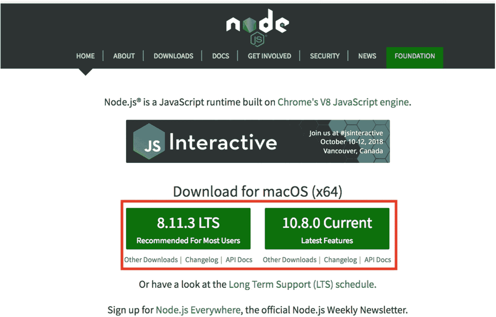

# 1.设置要求

在这本书里，我努力带你踏上一段旅程，你可以用 Angular 创建最全面的渐进式 Web 应用程序(pwa)。但在我开始之前，我们将回顾一些 PWA 基础知识，并设置将在整本书中使用的环境。

## 渐进式 Web 应用程序基础

PWAs 适用于那些**快速、引人入胜、可靠、**的 web 应用程序，并且将尝试逐步增强用户体验，而不管它们的浏览器、平台或设备如何。换句话说，PWA 不仅仅是一个框架、工具或时髦的术语，而是一种通过利用浏览器的现代 API 来不断增强的思维方式，这使得每个用户都感到满意。

无论您选择使用哪种框架，无论您选择用哪种语言编写代码，PWAs 都必须具有特殊的特征:

1.  **即时加载:**应用程序应该快速加载，并且必须能够快速交互。

2.  **连接独立:**没有网络或者连接缓慢且不稳定，应用程序必须继续工作。

3.  **响应式、移动优先、离线优先的设计:**先针对移动进行重点和优化，移动的硬件容量较低，应用在移动上应该完全可用。

4.  **重新参与:**推送通知是向用户发送提醒的一种方式。

5.  **类原生特性:**拥有 App Shell 这样的 UI 架构，使用 Web 蓝牙这样的硬件 API，可以让我们的 web app 更像一个原生 App。

6.  **安全:**安全是最高优先级，每个 PWA 必须通过 HTTPs 服务。

7.  可安装:可安装意味着它将被添加到设备的主屏幕上，并像本地应用程序一样启动。

8.  **渐进式:**无论使用何种浏览器或设备，我们的应用程序都应该不断发展，拥抱新功能，为每一个应用程序提供最佳的用户体验。

### 为什么有棱角？

几年前，甚至在 React 上市之前，前端世界就被 Angular 1.x 所主宰。通过建立和最终确定 ES6 和 TypeScript 外观，以及广泛适应的新浏览器功能和标准，得到谷歌支持的 Angular 团队决定重写 AngularJS，以前称为 Angular 1.x，导向 Angular 2，现在称为 Angular。Angular 由具有 Rxjs 和 TypeScript 的可观察 API 支持，并具有独特的功能，如健壮的更改检测和路由、动画、延迟加载、令人头痛的捆绑过程、CLI 和大量其他 API。这些使得它成为一个出色的、有能力的、成熟的前端框架，被世界上许多公司信任来构建和分发复杂的 web 应用程序。

此外，Angular Service Worker 模块已在版本 5 中引入，在版本 6 中进行了改进， <sup>[1](#Fn1)</sup> 现在正在定期更新，以便添加更多功能并变得稳定。尽管 Angular Service Worker 和 Angular CLI 并不是创建 PWA 的唯一选择，但它得到了很好的维护，使我们能够毫不费力地创建 Angular 应用程序或将它转换为 PWA。

总而言之，说你有一个一体化的框架来创建一个 web 和移动应用程序并不遥远，这使得 Angular 独一无二。

## 安装节点和 NPM

您需要确保您的计算机上安装了节点和 NPM。只需运行以下命令来检查您的节点和 NPM 版本，或者查看您是否已经安装了它们:

```ts
$ node -v
$ npm -v

```

需要节点 8 或更高版本以及 NPM 5 或更高版本。您可以在 [`https://nodejs.org`](https://nodejs.org) 访问节点网站，根据您的操作系统下载最新版本(图 [1-1](#Fig1) )。



图 1-1。

Node 官方网站，在那里可以下载 NodeJS 的最新版本

**纱**是 NPM 的替代品，已经存在一段时间了。如果您更喜欢使用它，您应该访问 [`https://yarnpkg.com/en/docs/install`](https://yarnpkg.com/en/docs/install) ，然后根据您的操作系统安装最新版本。要检查是否安装了 YARN，只需运行以下命令:

```ts
$ yarn -v

```

## 安装 Chrome

尽管我们创建了一个可以在任何浏览器下工作的 PWA，但我将坚持使用 Chrome 及其开发工具来开发和调试 Service Worker 以及其他 PWA 特性。在写这本书的时候，Chrome 有一个名为 **Lighthouse** 的 PWA 审计工具，内置在 *Audit* 标签下。如果你想下载 Chrome，可以访问 [`https://www.google.com/chrome/`](https://www.google.com/chrome/) *。*

在本书的后面，我会用 Lighthouse 评估我们的申请，并提高我们的 PWA 分数。我们持续使用*应用*选项卡来调试我们的服务人员、索引数据库、Web 应用清单等。

## 搭建我们的项目

是时候使用 Angular CLI 搭建我们的项目了。因此，在我们继续之前，首先通过运行以下命令来全局安装 Angular CLI:

```ts
$ npm install -g @angular/cli

```

*或*

```ts
$ yarn global add @angular/cli

```

现在 CLI 已在全球范围内安装，我们可以生成一个新的 Angular 应用程序。

### 使用 CLI 生成新的 Angular App

一旦安装了 Angular CLI 版本 6(当您阅读本书时，您可能会有更高的版本)，您的终端中就有了全局可用的 ***ng*** 命令。让我们通过运行以下命令来搭建我们的项目:

```ts
$ ng new lovely-offline –-routing –-style=scss

```

*可爱-离线*是我们的应用名称，*路由*将生成路由模块， *style=scss* 表示我们的样式文件的 scss 前缀。

### 添加有角度的材料设计

Angular Material 模块可能是 web 应用程序最好的 UI 库之一。它将让我们快速而完美地开发我们的应用程序。你不仅仅局限于这个库，但是我为这个项目推荐它。要安装:

```ts
$ npm install --save @angular/material @angular/cdk @angular/animations

```

现在在你的编辑器或 Idea 中打开项目，然后在`/src/app,`下找到`app.module.ts,`并将`BrowserAnimationsModule`导入到你的应用程序中以启用动画支持。

```ts
import { BrowserModule } from '@angular/platform-browser';
import { NgModule } from '@angular/core';
import { BrowserAnimationsModule } from '@angular/platform-browser/animations';

import { AppRoutingModule } from './app-routing.module';
import { AppComponent } from './app.component';

@NgModule({
  declarations: [
    AppComponent
  ],
  imports: [
    BrowserModule,
    BrowserAnimationsModule,
    AppRoutingModule
  ],
  providers: [],
  bootstrap: [AppComponent]
})
export class AppModule { }

```

要使用每个组件，我们应该将它们的相关模块导入到`ngModule`中，例如:

```ts
import { BrowserModule } from '@angular/platform-browser';
import { NgModule } from '@angular/core';
import { BrowserAnimationsModule } from '@angular/platform-browser/animations';

import { MatToolbarModule } from '@angular/material/toolbar';

import { MatIconModule } from '@angular/material/icon';

import { AppRoutingModule } from './app-routing.module';
import { AppComponent } from './app.component';

@NgModule({
  declarations: [
    AppComponent
  ],
  imports: [
    BrowserModule,
    BrowserAnimationsModule,
    MatToolbarModule,
    MatIconModule,
    AppRoutingModule
  ],
  providers: [],
  bootstrap: [AppComponent]
})
export class AppModule { }

```

需要一个主题；因此，我将在我们的项目中向`style.scs`添加一个可用的主题:

```ts
@import "~@angular/material/prebuilt-themes/indigo-pink.css";

```

建议您安装并包含`hammer.js`，因为该库中依赖于材料设计中的手势。

```ts
$ npm install hammerjs

```

安装后，在`src/main.ts`中导入

```ts
import { enableProdMode } from '@angular/core';
import { platformBrowserDynamic } from '@angular/platform-browser-dynamic';

import { AppModule } from './app/app.module';
import { environment } from './environments/environment';

import 'hammerjs';

if (environment.production) {
  enableProdMode();
}

platformBrowserDynamic().bootstrapModule(AppModule)
  .catch(err => console.log(err));

```

Icons 需要 Google Material Icons 字体；因此，我们将把字体 CDN 链接添加到我们的`index.html`文件中:

```ts
<!doctype html>
<html lang="en">
<head>
  <meta charset="utf-8">
  <title>LovelyOffline</title>
  <base href="/">

  <meta name="viewport" content="width=device-width, initial-scale=1">
  <link href="https://fonts.googleapis.com/icon?family=Material+Icons" rel="stylesheet">
  <link rel="icon" type="image/x-icon" href="favicon.ico">
</head>
<body>
  <app-root></app-root>
</body>
</html>

```

现在我们的项目已经可以使用了。只需运行 *ng 发球*或 *npm 启动*。您可以通过输入`localhost:4200`在浏览器中访问该项目。

## 设置移动设备

没有什么比在真实设备中测试我们的应用程序更好的了。Android 和 Chrome 一起支持大多数 PWA 功能，包括服务人员、推送通知和后台同步，以及更现代的浏览器 API。

如果你有一个真实的设备，并希望方便地将其连接到 Chrome dev tools，请阅读谷歌开发者网站上的文章 [`https://developers.google.com/web/tools/chrome-devtools/remote-debugging`](https://developers.google.com/web/tools/chrome-devtools/remote-debugging) 。请记住，真正的设备是不必要的；你可以随时通过 Android 和 iOS 模拟器测试你的应用。

## 设置移动模拟器

要运行 Android 模拟器，我建议您安装 **Android Studio** ，并按照 Android 开发者网站上的说明进行操作: [`https://developer.android.com/studio/run/emulator`](https://developer.android.com/studio/run/emulator) 。

Mac 用户也可以在 Mac 上安装 xCode 并运行 iPhone 模拟器。从 [`https://developer.apple.com/xcode/`](https://developer.apple.com/xcode/) 安装 xCode 后，你应该可以在 *xCode* 菜单下找到*打开开发者工具*，然后你就可以打开*模拟器*打开你选中的 iPhone / iPad。

## 将 Android 模拟器连接到 Chrome 开发工具

你现在应该可以将你的 Android 模拟器连接到 Chrome 开发工具了。请参考“设置移动设备”一节。

## 摘要

在本章中，我们已经了解了 PWA 的基础知识，然后我们使用 CLI 搭建了我们的项目。棱角分明的材料已经添加到我们的项目，以风格我们的应用程序。

此外，我们还回顾了本课程中需要用到的其他工具，如 Node、NPM、YARN 和 Chrome 我们还学习了如何设置我们的真实设备和模拟器，以便正确测试我们的应用程序。

<aside class="FootnoteSection" epub:type="footnotes">Footnotes [1](#Fn1_source)

在我写这本书的时候，Angular 是第 6 版，但是当你读这本书的时候，它可能有更高的版本。

 </aside>