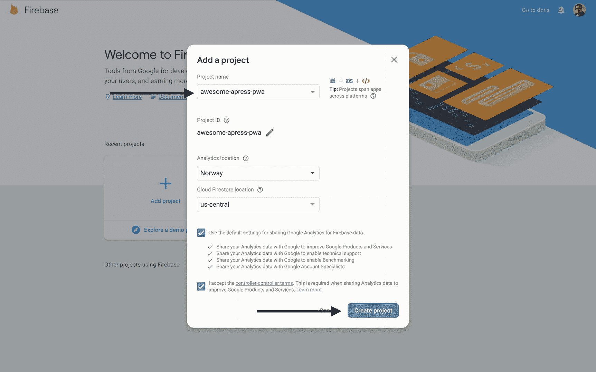
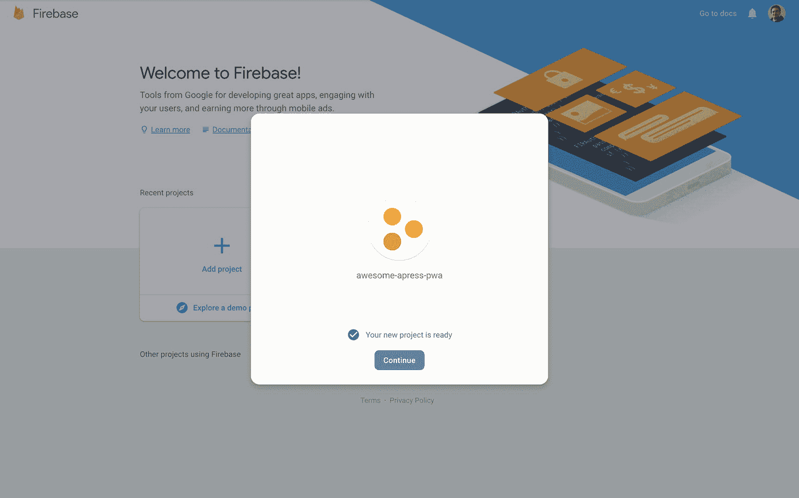
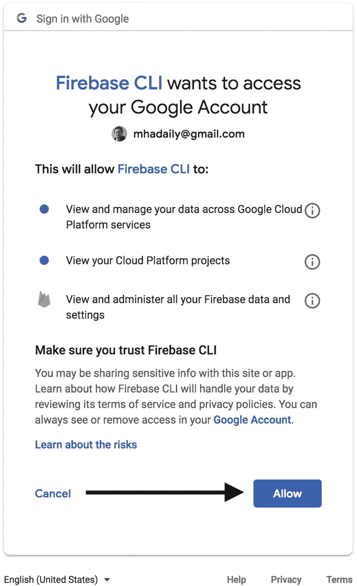
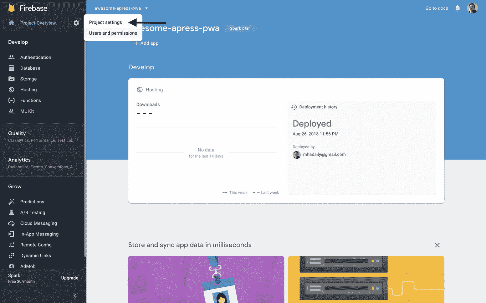
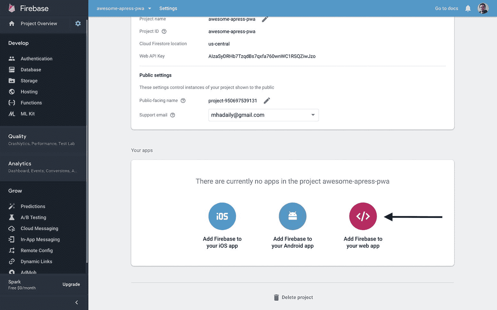
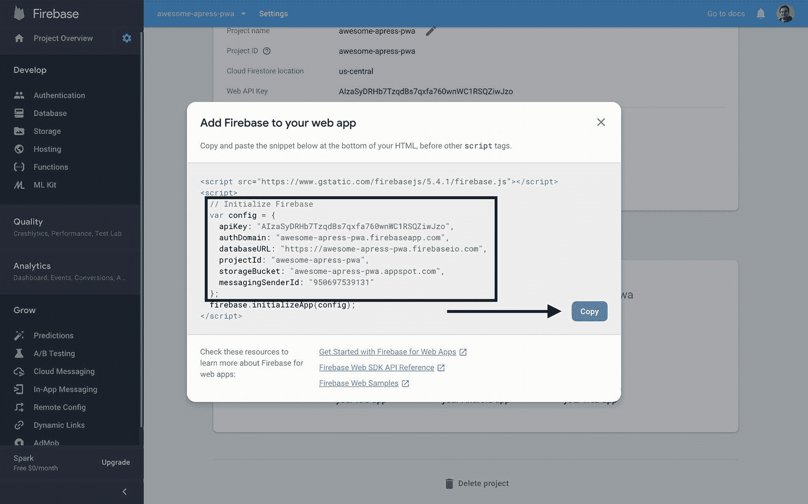

# 2.部署到 Firebase 作为后端

Firebase 被认为是后端即服务，它现在是谷歌云平台的一部分，但仍然是一个独立的实体。它提供不同的服务，如托管、实时数据库和云功能。

在这一章中，我将向你展示如何将我们的应用部署到 Firebase。值得一提的是，Firebase 并不是唯一的选择。然而，由于它易于设置和部署，我鼓励您使用 Firebase 作为我们的主机服务器。

此外，我们可能需要为我们的应用编写一些后端逻辑；因此，为了利用无服务器架构并减少我们对后端系统的担忧，Firebase Function 是最佳选择之一，而前端仍将是我们的主要关注点。

最后但同样重要的是，为了持久化我们的数据，我们将使用 Firebase Firestore，它为我们提供了尽可能快速地存储和检索数据的最佳被动能力，并在需要时内置了对每个集合和文档的 JSON 访问。

## 设置您的帐户

让我们从打开[](http://firebase.google.com)*开始吧。使用您的 Gmail 凭据登录，但如果您没有任何凭据，请首先注册一个 Google 帐户，然后继续操作。*

 *登录后，继续并点击“转到控制台”您将被重定向到控制台，在那里您可以看到您的项目。

## 创建项目

现在是时候添加您的项目了；只需点击**添加项目**，如图 [2-1](#Fig1) 所示。


图 2-1

Firebase 控制台，您应该点击**添加项目**来创建一个新项目

您应该会看到一个新的视图，它会询问您有关项目的详细信息，例如项目名称。我选择用 Awesome-Apress-PWA 来命名我的项目。

您可能需要更改您的组织或云 Firestore 位置；但是，默认设置应该足以开始使用。请记住，如果您更改了云 Firestore 的位置，在创建项目之前，您将无法更改它。

我将让**“使用默认设置共享 Firebase 数据的 Google Analytics”**和**“条款和条件”**处于选中状态**。**现在，点击**创建项目**按钮，如图 [2-2](#Fig2) 所示。



图 2-2

Firebase 项目详细模型

您的项目可能需要几秒钟才能准备就绪。一旦项目准备就绪，您就可以继续项目的仪表板(参见图 [2-3](#Fig3) )。



图 2-3

几秒钟后，项目就准备好了，所以只需点击“继续”按钮就可以重定向到仪表板

## 部署到火力基地

我们选择 Firebase 是因为它易于在我们的项目中使用，您很快就会看到使用 Firebase CLI(命令行界面)进行部署是多么容易。

### 生成新的Angular应用

在开始之前，我们需要使用 Angular CLI(命令行界面)生成一个新的 Angular app。如果您的计算机上没有全局安装@angular/cli，您应该首先运行以下命令:

```ts
$ npm install -g @angular/cli

```

要生成一个新的 Angular 应用，并设置好**路由**和 **scss** ，我们可以运行:

```ts
$ ng new lovely-offline     --routing           --style=scss
   Name of project      enable routing      styling with scss

```

安装完所有 NPM 依赖项后，您就可以准备好构建和部署您的应用了。

```ts
├── README.md
├── angular.json
├── e2e
├── node_modules
├── package-lock.json
├── package.json
├── src
│   ├── app
│   ├── assets
│   ├── browserslist
│   ├── environments
│   ├── favicon.ico
│   ├── index.html
│   ├── karma.conf.js
│   ├── main.ts
│   ├── polyfills.ts
│   ├── styles.scss
│   ├── test.ts
│   ├── tsconfig.app.json
│   ├── tsconfig.spec.json
│   └── tslint.json
├── tsconfig.json
└── tslint.json

```

现在让我们为生产构建我们的应用。

```ts
$ ng build --prod
> ng build
Date: 2018-08-26T17:20:35.649Z
Hash: e6da8aa80ad79bc41363
Time: 6332ms

chunk {main} main.js, main.js.map (main) 11.6 kB [initial] [rendered]
chunk {polyfills} polyfills.js, polyfills.js.map (polyfills) 227 kB [initial] [rendered]
chunk {runtime} runtime.js, runtime.js.map (runtime) 5.22 kB [entry] [rendered]
chunk {styles} styles.js, styles.js.map (styles) 16 kB [initial] [rendered]
chunk {vendor} vendor.js, vendor.js.map (vendor) 3.18 MB [initial] [rendered]

```

构建是成功的，现在是时候将我们的应用部署到 Firebase 了。让我们安装 Firebase CLI。

```ts
$ npm install -g firebase-tools

```

现在 **firebase** 命令在我们的命令行中是全局可用的。在部署之前，我们需要确保我们有足够的权限；因此，我们现在应该登录 Firebase 来设置我们的凭证，所以只需运行:

```ts
$ firebase login

```

问卷如下所示:

```ts
Allow Firebase to collect anonymous CLI usage and error reporting  information? (Y/n) Y

Visit this URL on any device to log in:
https://accounts.google.com/o/oauth2/........

Waiting for authentication...

```

一旦您看到**验证 URL，**您将被重定向到浏览器，以便登录您的 Google 帐户。然后，你要通过点击**允许**访问来授予 Firebase CLI 足够的权限，如图 [2-4](#Fig4) 所示。



图 2-4

点击**允许**授予 Firebase CLI 访问您的帐户的权限

一旦获得许可，你应该会在浏览器中看到一条**成功**的消息，如图 [2-5](#Fig5) 所示。


图 2-5

授予 Firebase CLI 权限后，浏览器中出现成功消息

您还会在终端中看到如下所示的成功消息，这意味着 Firebase CLI 现在有足够的权限访问您的 Firebase 项目。

```ts
✓  Success! Logged in as mhadaily@gmail.com

```

### 正在初始化应用

下一步是初始化 Firebase 项目。这将把您的本地 Angular 应用链接到我们刚刚创建的 Firebase 应用。为此，请确保您位于项目的根目录下，并运行:

```ts
$ firebase init

```

点击上面的命令后，Firebase CLI 会在您的终端中询问您几个问题，以便构建您的 Firebase 项目，并创建将我们的应用部署到 Firebase 的必要需求。让我们一步步复习每个问题。

#### 特征选择

如下所示，第一个问题是关于我们希望使用哪些 Firebase 特性:

```ts
Which Firebase CLI features do you want to set up for this folder? Press Space to select features, then Enter to confirm your choices.
  ◯ Database: Deploy Firebase Realtime Database Rules
> ◉ Firestore: Deploy rules and create indexes for Firestore
   ◉ Functions: Configure and deploy Cloud Functions
   ◉ Hosting: Configure and deploy Firebase Hosting sites
  ◯ Storage: Deploy Cloud Storage security rules

```

Firebase 实时数据库 <sup>[1](#Fn1)</sup> 和 Firestore <sup>[2](#Fn2)</sup> 是两个 NoSQL 数据库服务，用于存储和同步客户端和服务器端开发的数据。Firebase 的云函数允许您自动运行后端代码，以响应由 Firebase 特性和 HTTPS 请求触发的事件。你的代码存储在谷歌的云中，在一个托管的环境中运行。Firebase 托管为您的 web 应用、静态和动态内容以及微服务提供快速、安全的托管。云存储是为需要存储和提供用户生成的内容(如照片或视频)的应用开发人员而构建的。

我将为这个项目选择 **Firestore** 、**功能**和**主机功能**，因为我将在本书中通篇使用它们。一旦你选择了你需要的，按下**进入**进入下一步。

#### 项目选择

如下所示，第二个问题显示了您在 Firebase 中的项目，由于我们已经创建了一个项目，我将选择该项目并按下 **enter 键继续。请注意，您也可以在这一步中创建一个项目。**

```ts
Select a default Firebase project for this directory: (Use arrow keys)
[don't set up a default project]
> awesome-apress-pwa (awesome-apress-pwa)
  [create a new project]

```

#### 数据库设置

Firebase Firestore 是一个可扩展和灵活的 NoSQL <sup>[3](#Fn3)</sup> 实时数据库，用于存储和同步客户端或服务器端应用开发的数据。该数据库使我们的数据在多个客户端应用之间保持同步，并提供离线功能。Firestore 中的数据保存包含映射到值的字段的文档。集合是文档的容器，它不仅允许我们组织数据，还允许我们构建查询。

因为我们已经在步骤特征选择步骤中选择了 Firestore 服务，所以如下所示，第三个问题是关于数据库规则文件，以编写关于我们的项目数据库的所有规则。我继续使用默认名称，即 database.rules.json:

```ts
 What file should be used for Database Rules? (database.rules.json)

```

#### 功能设置

Firebase 中的云功能让我们可以在 HTTPS 请求上运行后端代码，而不需要一个实际的服务器来维护、管理和存储我们在谷歌的云管理环境中的代码。为了在我们的 app 中实现**无服务器** <sup>[4](#Fn4)</sup> 架构，我们要使用函数来编写和运行我们必不可少的后端代码。

由于我们已经在特性选择步骤中选择了使用 Firebase 函数特性，如下所示，第四个问题要求选择我们想要的语言来编写**函数**。

```ts
What language would you like to use to write Cloud Functions? (Use arrow keys)
> JavaScript
  TypeScript

```

JavaScript 是我现在的选择，因为我们在这本书里不会有很多函数；因此，我保持简单。如果您喜欢，可以继续使用 TypeScript。

在选择语言之后，Firebase CLI 提供了一个林挺工具来帮助我们在下一个问题中找到可能的错误和样式问题，如下所示。如果您喜欢强制样式化并捕捉云函数中可能的 bug，请继续使用 y。

```ts
Do you want to use ESLint to catch probable bugs and enforce style? (Y/N) y

```

#### 最终设置

我将继续回答最后三个问题，以完成我的项目初始化。

如果您想现在安装依赖项，请在下一个问题中输入 Y。

```ts
Do you want to install dependencies with npm now? (Y/n)

```

下一步，我们需要定义我们的随时部署应用的位置。默认情况下，在 Angular 里面是`dist`目录；因此，我也输入`dist`来设置我的公共目录。所以，我会如下图继续回答问题:

```ts
What do you want to use as your public directory? (public) dist

```

最后，我们的应用将在前端有一个路由系统，这意味着我们将创建一个单页面应用。因此，当 Firebase CLI 被询问是否重写所有到 index.html 的 URL 时，我们应该回答 Y，以确保我们的前端正在单独处理路由，而不考虑我们的服务器路由。

尽管我们正在开发单页面应用，但这绝对不是创建 PWA 所必需的。注意，在本书中，我们将通过 Angular 制作单页 PWA。让我们继续最后一个问题，Y 如下图所示:

```ts
Configure as a single-page app (rewrite all urls to /index.html)? (y/N) y

```

使用 Firebase CLI 初始化我们的应用已经完成！初始化后，我们的应用结构看起来像下面的树。

```ts
.
├── README.md
├── angular.json
├── database.rules.json   -> firebase databse rules
├── dist
├── e2e
├── firebase.json -> firebase configs
 ├── functions-> firebase cloud funtions directory
 │   ├── index.js
 │   ├── node_modules
 │   ├── package-lock.json
 │   └── package.json
├── node_modules
├── package-lock.json
├── package.json
├── src
│   ├── app
│   ├── assets
│   ├── browserslist
│   ├── environments
│   ├── favicon.ico
│   ├── index.html
│   ├── karma.conf.js
│   ├── main.ts
│   ├── polyfills.ts
│   ├── styles.scss
│   ├── test.ts
│   ├── tsconfig.app.json
│   ├── tsconfig.spec.json
│   └── tslint.json
├── tsconfig.json
└── tslint.json

```

#### Angular项目设置中的调整

在我们可以部署我们的应用之前，我们需要对位于 **Angular.json 中的 Angular 设置进行微小的更改。** Angular CLI 能够构建多个应用，每个应用都可以简单地放在 **dist** 文件夹中。然而，我们现在只想处理一个应用，我们需要将它构建在 **dist** 文件夹中，Firebase 将在那里找到并部署它。因此，我们应该从

```ts
   "architect": {
        "build": {
          "builder": "@angular-devkit/build-angular:browser",
          "options": {
            "outputPath": "dist/lovely-offline",  // outputPath showes where to build

```

到

```ts
   "architect": {
        "build": {
          "builder": "@angular-devkit/build-angular:browser",
          "options": {
            "outputPath": "dist ",  // build app just in dist

```

通过从**输出路径**中移除我们的应用名称，我们强制 Angular CLI 构建所有文件并将其放入 **dist** 文件夹中。现在是时候最终将我们的应用部署到 Firebase 上了。

### 部署我们的应用

当我们在项目目录的根目录中时，我们可以简单地运行以下命令:

```ts
$ firebase deploy

```

部署开始…

```ts
> firebase deploy

=== Deploying to 'awesome-apress-pwa'...

i  deploying database, functions, hosting
Running command: npm --prefix "$RESOURCE_DIR" run lint

> functions@ lint ~/awesome-apress-pwa/functions
> eslint .

✓  functions: Finished running predeploy script.
i  database: checking rules syntax...
✓  database: rules syntax for database awesome-apress-pwa is valid
i  functions: ensuring necessary APIs are enabled...
✓  functions: all necessary APIs are enabled
i  functions: preparing functions directory for uploading...
i  hosting[awesome-apress-pwa]: beginning deploy...
i  hosting[awesome-apress-pwa]: found 14 files in dist
✓  hosting[awesome-apress-pwa]: file upload complete
i  database: releasing rules...
✓  database: rules for database awesome-apress-pwa released successfully
i  hosting[awesome-apress-pwa]: finalizing version... 

✓  hosting[awesome-apress-pwa]: version finalized
i  hosting[awesome-apress-pwa]: releasing new version...
✓  hosting[awesome-apress-pwa]: release complete

✓  Deploy complete!

Project Console: https://console.firebase.google.com/project/awesome-apress-pwa/overview
Hosting URL: https://awesome-apress-pwa.firebaseapp.com

```

祝贺您-部署成功完成，现在网站可在 [`https://awesome-apress-pwa.firebaseapp.com`](https://awesome-apress-pwa.firebaseapp.com) 访问。

### 设置角火<sup>[5](#Fn5)T3】</sup>

AngularFire2 是 Angular 支持 Firebase 功能的官方库。它由可观察的实时绑定、身份验证和离线数据支持提供支持。我强烈建议实现这个库，以便让我们的开发过程更容易处理 Firebase。

要安装，请运行以下命令:

```ts
$ npm install firebase @angular/fire –-save

```

要添加一个 Firebase 配置，打开`/src/environment/environment.ts` `file, and`添加如下设置:

```ts
export const environment = {
  production: false,
  firebase: {
    apiKey: '<your-key>',
    authDomain: '<your-project-authdomain>',
    databaseURL: '<your-database-URL>',
    projectId: '<your-project-id>',
    storageBucket: '<your-storage-bucket>',
    messagingSenderId: '<your-messaging-sender-id>'
  }
};

```

要找到你的 app 配置，打开 Firebase 控制台，在项目总览页面，点击**齿轮**图标，点击**项目设置**，如图 [2-6](#Fig6) 所示。



图 2-6

点按齿轮图标以查看项目设置菜单

从项目设置视图中，找到**将 Firebase 添加到您的 web app** (参见图 [2-7](#Fig7) )。



图 2-7

单击将 Firebase 添加到您的应用按钮查看项目设置

替换`environment.ts`中的项目设置。(参见图 [2-8](#Fig8) )。



图 2-8

复制要在 environment.ts 中替换的项目设置

导航到`/src/app/app.module.ts`并注入 Firebase 提供程序。Injector 确保在应用中正确指定了 Firebase 配置。

```ts
import { BrowserModule } from '@angular/platform-browser';
import { NgModule } from '@angular/core';

import { AngularFireModule } from 'angularfire2';

import { AppRoutingModule } from './app-routing.module';
import { AppComponent } from './app.component';

import { environment } from '../environments/environment';

@NgModule({
  declarations: [
    AppComponent
  ],
  imports: [
    BrowserModule,
    AppRoutingModule,
    AngularFireModule.initializeApp(environment.firebase)
  ],
  providers: [],
  bootstrap: [AppComponent]
})
export class AppModule { }

```

AngularFire 是一个模块化的软件包，支持不同的 Firebase 特性。`AngularFirestoreModule`、`AngularFireAuthModule`、`AngularFireDatabaseModule`、`AngularFireStorageModule`可以单独添加到 **@NgModules 中。**例如，在这个应用中，我们将分别添加`AngularFireStoreModule`和`AngularFireAuthModule`，以获得对数据库和认证特性的支持。

```ts
import { BrowserModule } from '@angular/platform-browser';
import { NgModule } from '@angular/core';
import { AngularFireModule } from 'angularfire2';

import { AngularFirestoreModule } from 'angularfire2/firestore';

import { AngularFireAuthModule } from 'angularfire2/auth';

import { AppRoutingModule } from './app-routing.module';
import { AppComponent } from './app.component'; 

import { environment } from '../environments/environment';

@NgModule({
  declarations: [
    AppComponent
  ],
  imports: [
    BrowserModule,
    AppRoutingModule,
    AngularFireModule.initializeApp(environment.firebase),
    AngularFirestoreModule, // needed for database features
    AngularFireAuthModule, // needed for auth features,
  ],
  providers: [],
  bootstrap: [AppComponent]
})
export class AppModule { }

```

很好，`AngularFirestore` provider 现在可以访问 Firebase 数据库集合，以修改/删除或执行更多操作。比如打开**/src/app/app . component . ts**，注入`AngularFirestore`。

```ts
import { Component } from '@angular/core';

import { AngularFirestore } from 'angularfire2/firestore';

@Component({
  selector: 'app-root',
  templateUrl: './app.component.html',
  styleUrls: ['./app.component.scss']
})
export class AppComponent {
  title = 'lovely-offline';

  constructor(db: AngularFirestore) {

  }
}

```

下一步是绑定特定 Firestore 集合。例如，在将来，我们将创建一个名为 **notes** 的集合。下面的代码演示了我们如何访问所有数据，并在我们的视图中显示这些数据。

```ts
import { Component } from '@angular/core';
import { AngularFirestore } from 'angularfire2/firestore';
import { Observable } from 'rxjs';

@Component({
  selector: 'app-root',
  template: `
    <h1>Bind Firestore collection example</h1>
    <ul>
      <li class="text" *ngFor="let note of notes$ | async">
        {{note.title}}
      </li>
    </ul>
    <router-outlet></router-outlet>
  `,
  styleUrls: ['./app.component.scss']
})
export class AppComponent {
  notes$: Observable<any[]>;
  constructor(db: AngularFirestore) {
    this.notes$ = db.collection('notes').valueChanges();
  }
}

```

## 摘要

本章介绍了一种将我们的 Angular 应用部署到 Firebase 的简单方法，并介绍了一些服务，如 Firestore 云功能，以管理和运行我们的后端代码。即使我们没有深入研究每个功能，但这足以启动并使应用运行。

AngularFire2 是 Firebase 的官方 Angular 库，它已经在我们的应用中设置好了，在接下来的章节中解释了如何将它注入我们的组件，以便访问 Firestore 和其他 Firebase 功能。

现在，我们已经准备好了部署需求，我们准备进入下一章，创建我们的应用框架，并准备好开始构建 PWA。

<aside class="FootnoteSection" epub:type="footnotes">Footnotes [1](#Fn1_source)

[T2`https://firebase.google.com/docs/database/`](https://firebase.google.com/docs/database/)

  [2](#Fn2_source)

[T2`https://firebase.google.com/docs/firestore/`](https://firebase.google.com/docs/firestore/)

  [3](#Fn3_source)

[`https://en.wikipedia.org/wiki/NoSQL`](https://en.wikipedia.org/wiki/NoSQL) 阅读更多。

  [4](#Fn4_source)

[`https://en.wikipedia.org/wiki/Serverless_computing`](https://en.wikipedia.org/wiki/Serverless_computing) 阅读更多。

  [5](#Fn5_source)

[T2`https://github.com/angular/angularfire2`](https://github.com/angular/angularfire2)

 </aside>*