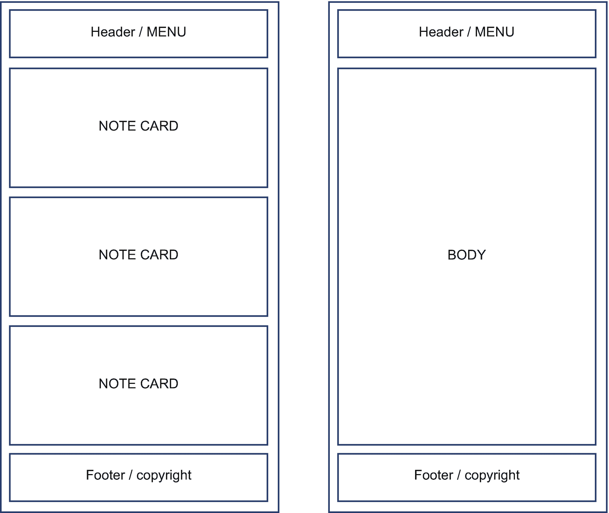
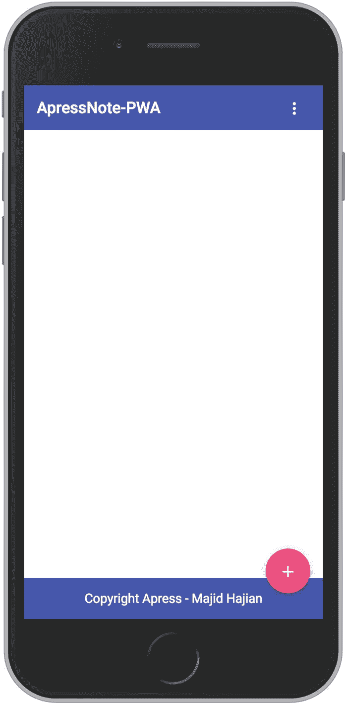
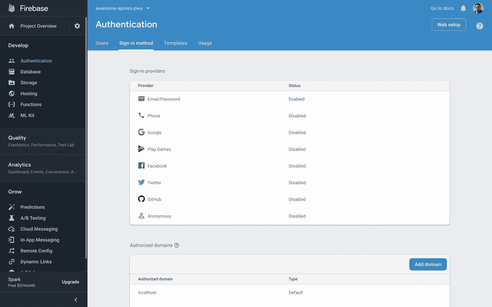
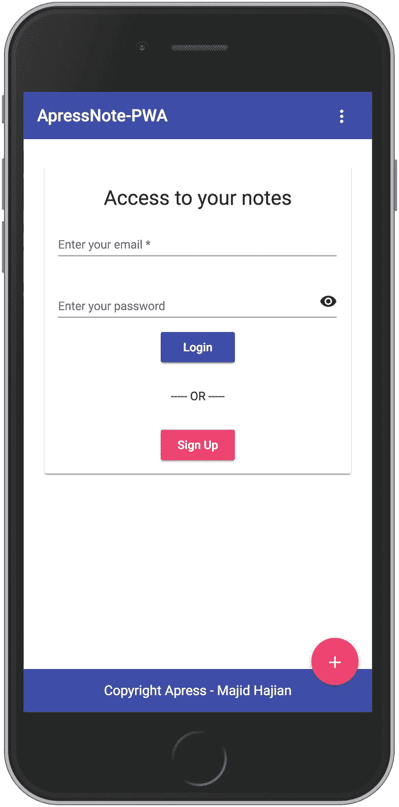
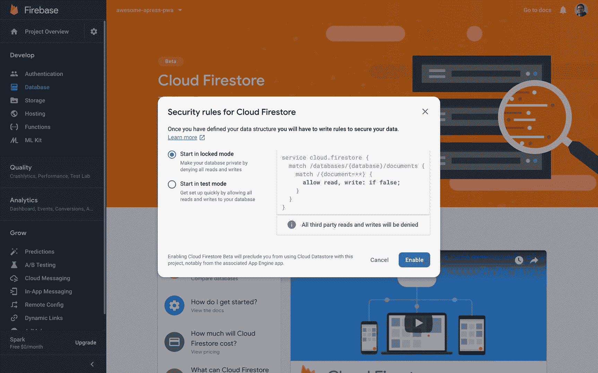
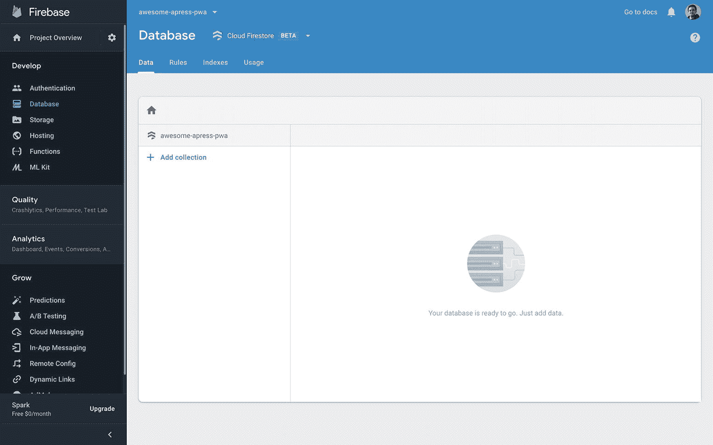
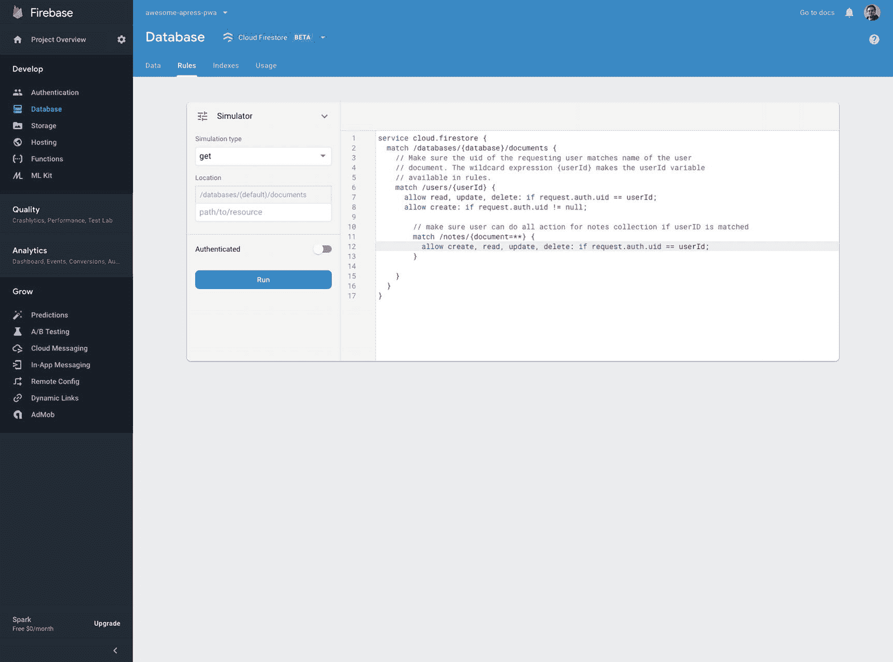
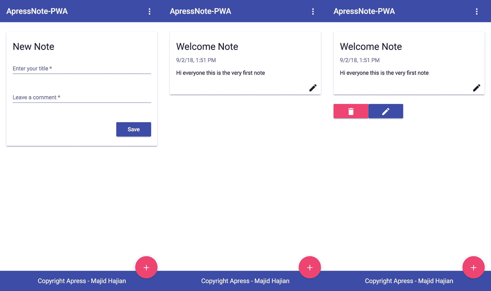

# 3.完成Angular应用

到目前为止，我们已经回顾了基础知识和需求，并设置了在云中托管、存储数据和运行功能的先决条件。对你来说这可能听起来有点无聊，但是随着我们继续每一章，它会变得更加令人兴奋，因为我们将通过添加更多的功能来逐渐构建一个真正的 PWA。

现在，是时候步入现实世界，创建一个有效的应用了。在这一章中，我们将实现一个在 Firebase 中保存个人笔记的程序。这个应用将具有用户认证功能，让用户保存，编辑和删除他们的个人帐户中的笔记。我们将分别为这些功能创建 ui 和路由。

此外，本章还有两个目标。首先，当我们继续下一章时，你将看到我们如何从头开始一个应用，并理解我们如何将它转换成 PWA。其次，您将看到我们如何将现有的应用转换为 PWA。那么，我们还在等什么？我们开始吧。

## 实现我们的用户界面

首先，我们需要创建一个看起来不错的应用。我们为我们的 UI 所选择的至少要包含以下特征:**现代**、**快速**、**一致**、**通用**、**灵活**、*、**、**、*、**移动优先**、**反应灵敏**、**和用户友好**。Angular Material<sup>[1](#Fn1)</sup>是其中最好的一种，它完美地符合 Angular，帮助我们快速开发我们的应用，同时它看起来很好，满足我们的需求。

### 安装和设置Angular材质、CDK 和动画

Angular CLI 6+提供了一个新命令`ng add`，以便用正确的依赖关系更新 Angular 项目，执行配置更改，并执行初始化代码(如果有)。

#### 使用 Angular CLI 自动安装@angular/material

我们现在可以使用这个命令来安装`@angular/material` `:`

```ts
ng add @angular/material

```

您应该会看到以下消息:

```ts
> ng add @angular/material

Installing packages for tooling via npm.
npm WARN @angular/material@6.4.6 requires a peer of @angular/cdk@6.4.6 but none is installed. You must install peer depen
dencies yourself.

+ @angular/material@6.4.6

added 2 packages from 1 contributor and audited 24256 packages in 7.228s
found 12 vulnerabilities (9 low, 3 high)
  run `npm audit fix` to fix them, or `npm audit` for details
Installed packages for tooling via npm.

UPDATE package.json (1445 bytes)

UPDATE angular.json (3942 bytes)

UPDATE src/app/app.module.ts (907 bytes)

UPDATE src/index.html (477 bytes)

UPDATE src/styles.scss (165 bytes)

added 1 package and audited 24258 packages in 7.297s

```

太棒了——Angular CLI 为我们处理了所有配置。然而，为了更好地理解它是如何详细工作的，我还将继续手动添加Angular材质到我的项目中，如下所述。

#### 手动安装@ angular/材料

您可以使用 NPM 或纱来安装软件包，所以使用最适合您的项目。我继续讲`npm`。

```ts
npm install --save @angular/material @angular/cdk @angular/animations

```

要在软件包安装后启用动画支持，`BrowserAnimationsModule`应该是:

```ts
imported into our application.

import { BrowserModule } from '@angular/platform-browser';

import { NgModule } from '@angular/core';
import { AngularFireModule } from 'angularfire2';
import { AngularFirestoreModule } from 'angularfire2/firestore';
import { AngularFireAuthModule } from 'angularfire2/auth';

import { AppRoutingModule } from './app-routing.module';
import { AppComponent } from './app.component';
import { environment } from '../environments/environment';
import { BrowserAnimationsModule } from '@angular/platform-browser/animations';

@NgModule({
  declarations: [
    AppComponent
  ],
  imports: [
    BrowserModule,
    AppRoutingModule,
    AngularFireModule.initializeApp(environment.firebase),
    AngularFirestoreModule, // needed for database features
    AngularFireAuthModule,  // needed for auth features,
    BrowserAnimationsModule,
  ],
  providers: [],
  bootstrap: [AppComponent]
})
export class AppModule { }

```

要在安装软件包后启用动画支持，应该导入`BrowserAnimationsModule`。

字体和图标帮助我们的应用看起来更好，感觉更好。因此，我们将添加 **Roboto 和材料图标字体**到我们的应用中。要包含它们，修改`index.html,`并在`<head></head>:`之间添加以下链接

```ts
<link href="https://fonts.googleapis.com/icon?family=Material+Icons" rel="stylesheet">
<link href="https://fonts.googleapis.com/css?family=Roboto:300,400,500" rel="stylesheet">

```

最后，我们需要包含一个主题。在我写这本书的时候，`@angular/material`库中有预先构建的主题，如下所示:

*   `deeppurple-amber.css`

*   `indigo-pink.css`

*   `pink-bluegrey.css`

*   `purple-green.css`

打开`angular.json,`并添加一个主题 CSS 文件到建筑师➤建立➤风格，所以它看起来像下面的配置:

```ts
"architect": {
        "build": {
          "builder": "@angular-devkit/build-angular:browser",
          "options": {
            "outputPath": "dist",
            "index": "src/index.html",
            "main": "src/main.ts",
            "polyfills": "src/polyfills.ts",
            "tsConfig": "src/tsconfig.app.json",
            "assets": [
              "src/favicon.ico",
              "src/assets"

            ],
            "styles": [
              {
                "input": "node_modules/@angular/material/prebuilt-themes/indigo-pink.css"
              },
              "src/styles.scss"
            ],
            "scripts": []
          },

```

太好了——我们已经为我们的 UI 添加了我们需要的东西；现在让我们为我们的应用创建一个基本框架。

## 创建核心模块/共享模块

Angular 中受益于延迟加载和代码分割的一种常见方式是模块化应用，同时保持其基于组件的方法。这意味着我们将尽可能多的组件封装到一个模块中，并通过导入到其他模块中来重用这个模块。首先，我们将生成 **SharedModule** 以导入到所有其他模块中，并公开将在我们的应用和 **CoreModule** 中重用的所有公共组件和模块，CoreModule【】将在我们的根模块`AppModule,`中仅导入一次，并包含所有的提供者，这些提供者是单例的，并将在应用启动时立即初始化。

运行以下命令来生成核心模块。

```ts
ng generate module modules/core
> ng g m modules/core
CREATE src/app/modules/core/core.module.spec.ts (259 bytes)
CREATE src/app/modules/core/core.module.ts (188 bytes)

```

Angular CLI 生成的`CoreModule`位于**模块**文件夹**中。**让我们再执行一次这个命令来生成`SharedModule located in the` **模块**文件夹 **:**

```ts
ng generate module modules/shared
> ng g m modules/shared
CREATE src/app/modules/shared/shared.module.spec.ts (275 bytes)
CREATE src/app/modules/shared/shared.module.ts (190 bytes)

```

为了确保`CoreModule`不会被多次导入，我们可以为这个模块创建一个防护。只需将以下代码添加到您的模块中:

```ts
export class CoreModule {
  constructor(@Optional() @SkipSelf() parentModule: CoreModule) {
    if (parentModule) {
      throw new Error(`CoreModule has already been loaded. Import Core modules in the AppModule only.`);
    }
  }
}

```

因此，我们的核心模块如下所示:

```ts
import { NgModule, Optional, SkipSelf } from '@angular/core';
import { CommonModule } from '@angular/common';

@NgModule({
  imports: [
    CommonModule,
  ],
  providers: []
})
export class CoreModule {
  constructor(@Optional() @SkipSelf() parentModule: CoreModule) {
    if (parentModule) {
      throw new Error(`CoreModule has already been loaded. Import Core modules in the AppModule only.`);
    }
  }
}

```

让我们将`CoreModule`导入到`AppModule`中。现在我们准备开始创建我们的第一个共享组件。

### 页眉、页脚和正文组件

在本节中，我们将基于图 [3-1](#Fig1) 所示的简单草图创建我们的第一个应用——一个主应用布局。



图 3-1

初始应用草图

我们将继续发展，而我们心中有这个草图。首先，让我们创建一个名为`LayoutModule`的模块，它包含页脚、页眉和菜单组件，然后将这个模块导入到`AppModule`中，以重用`app.component.ts`文件中的页眉/页脚。

```ts
ng g m modules/layout
import LayoutModule into AppModule:
...imports: [
    CoreModule,
    LayoutModule,...

```

通过运行以下命令，将分别生成页脚和页眉组件。

```ts
ng generate component modules/layout/header
ng generate component modules/layout/footer

```

我们已经创建了`SharedModule`；然而，我们需要在这个模块中做一些改变。首先，我们作为共享模块或共享组件导入的内容也应该导出。角形材料是一种模块化包装；也就是说，我们应该导入 UI 所需的模块。然后，我将在这个应用中根据我们的需要添加尽可能多的角状材料模块。以后可以添加或删除模块和组件。

最后，我们的`SharedModule`看起来像下面的代码:

```ts
const SHARED_MODULES = [
  CommonModule,
  MatToolbarModule,
  MatCardModule,
  MatIconModule,
  MatButtonModule,
  MatDividerModule,
  MatBadgeModule,
  MatFormFieldModule,
  MatInputModule,
  MatSnackBarModule,
  MatProgressBarModule,
  MatProgressSpinnerModule,
  MatMenuModule,
  ReactiveFormsModule,
  FormsModule,
  RouterModule
];
const SHARED_COMPONENTS = [];
@NgModule({
  imports: [ ...SHARED_MODULES2  ],
  declarations: [ ...SHARED_COMPONENTS ],
  exports: [ ...SHARED_MODULES,    ...SHARED_COMPONENTS  ],
})
export class SharedModule { }

```

将`SharedModule`导入`LayoutModule`后，我们可以根据所需的材料组件设计页眉/页脚。

以下是标题组件:

```ts
// header.component.html

<mat-toolbar color="primary">
  <span>ApressNote-PWA</span>
  <span class="space-between"></span>
  <button mat-icon-button [mat-menu-trigger-for]="menu">
    <mat-icon>more_vert</mat-icon>
  </button>
</mat-toolbar>
<mat-menu x-position="before" #menu="matMenu">
  <button mat-menu-item>Home</button>
  <button mat-menu-item>Profile</button>
  <button mat-menu-item>Add Note</button>
</mat-menu>

// header.component.scss

.space-between {
    flex:1;
}

// header.component.ts

import { Component, OnInit } from '@angular/core';
@Component({
  selector: 'app-header',
  templateUrl: './header.component.html',
  styleUrls: ['./header.component.scss']
})
export class HeaderComponent { }

```

下面是页脚组件:

```ts
// footer.component.html

<footer>
  <div class="copyright">Copyright Apress - Majid Hajian</div>
</footer>
<div class="addNote">
  <button mat-fab>
    <mat-icon>add circle</mat-icon>
  </button>
</div>

// footer.component.scss

footer{
    background: #3f51b5;
    color: #fff;
    display: flex;
    box-sizing: border-box;
    padding: 1rem;
    flex-direction: column;
    align-items: center;
    white-space: nowrap;
}
.copyright {
    text-align: center;
}
.addNote {
 position: fixed;
 bottom: 2rem;
 right: 1rem;
 color: #fff;
}

// footer.component.ts

import { Component, OnInit } from '@angular/core';

@Component({
  selector: 'app-footer',
  templateUrl: './footer.component.html',
  styleUrls: ['./footer.component.scss']
})
export class FooterComponent { }

```

现在在`style.scss`文件中添加一些自定义的 CSS 行来调整我们的布局:

```ts
html, body { height: 100%; }
body { margin: 0; font-family: 'Roboto', sans-serif; }
.appress-pwa-note {
    display: flex;
    flex-direction: column;
    align-content: space-between;
    height: 100%;
}
.main{
    display: flex;
    flex:1;
}
mat-card {
 max-width: 80%;
 margin: 2em auto;
 text-align: center;
}

mat-toolbar-row {
 justify-content: space-between;
}

```

最后，添加页脚、页眉和必要的修改到`app.component.ts:`

```ts
import { Component } from '@angular/core';

@Component({
  selector: 'app-root',
  template: `
  <div class="appress-pwa-note">
    <app-header></app-header>
    <div class="main">
      <router-outlet></router-outlet>
    </div>
    <app-footer></app-footer>
  </div>
  `,
})
export class AppComponent { }

```

到目前为止，一切顺利——基于草图的初始骨架现已准备就绪，如图 [3-2](#Fig2) 所示。

让我们继续前进，创建不同的页面和路由。

### 注意

你会在 [`www.github.com/mhadaily/awesome-apress-pwa/chapter03/01-material-design-and-core-shared-modules-setup`](http://www.github.com/mhadaily/awesome-apress-pwa/chapter03/01-material-design-and-core-shared-modules-setup) 中找到所有的代码。



图 3-2

初始应用外壳

### 登录/个人资料页面

我们需要创建页面，以便我的用户可以注册，登录，并看到他们的个人资料。首先，我们创建`UserModule,`包括路由:

```ts
ng generate module modules/user --routing

```

因为我们要延迟加载这个模块，我们至少需要一个路径和一个组件。要生成组件，请继续运行以下命令:

```ts
ng generate component modules/user/userContainer --flat
flag --flat ignores creating a new folder for this component.

```

一旦组件生成，我们应该将它添加到`UserModule declarations`，然后在`UserModuleRouting`中定义我们的路径——路径`/user`可以相应地在`AppRoutingModule`中延迟加载。

```ts
// UserModuleRouting

import { NgModule } from '@angular/core';
import { Routes, RouterModule } from '@angular/router';

import { UserContainerComponent } from './user-container.component';

const routes: Routes = [
  {
    path: '',
    component: UserContainerComponent
  }
];

@NgModule({
  imports: [RouterModule.forChild(routes)],
  exports: [RouterModule]
})
export class UserRoutingModule { }

//AppModuleRouting

import { NgModule } from '@angular/core';
import { Routes, RouterModule } from '@angular/router';

const routes: Routes = [
  {
    path: 'user',
    loadChildren: './modules/user/user.module#UserModule',
  }
];

@NgModule({
  imports: [RouterModule.forRoot(routes)],
  exports: [RouterModule]

})
export class AppRoutingModule { }

```

### 添加登录、注册和个人资料用户界面和功能

在我们继续添加登录/注册功能之前，我们必须激活 Firebase 中的登录提供者。因此，转到您的 project Firebase 控制台，在左侧菜单列表的 develop 组下找到 Authentication，然后将当前选项卡移动到 Sign-in methods。为了简单起见，我们将使用电子邮件/密码提供者；但是，您应该能够根据需要添加更多的提供者(参见图 [3-3](#Fig3) )。



图 3-3

启用电子邮件/密码验证

让我们继续创建一个处理所有 Firebase 身份验证方法的 Angular 服务。通过运行以下命令继续:

```ts
ng generate service modules/core/firebaseAuthService

```

我们需要编写几个方法，检查用户登录状态，进行登录、注册和注销。

慢慢来，看看清单 [3-1](#PC22) ，我们在其中实现了`FirebaseAuthService`，以便从`AngularFireAuth`服务中调用必要的方法，并在整个应用中共享状态。服务方法是不言自明的。

```ts
export class AuthService {
  // expose all data
  public authErrorMessages$ = new Subject<string>();
  public isLoading$ = new BehaviorSubject<boolean>(true);
  public user$ = new Subject<User>();

  constructor(private afAuth: AngularFireAuth) {
    this.isLoggedIn().subscribe();
  }

  private isLoggedIn() {
    return this.afAuth.authState.pipe(
      first(),
      tap(user => {
        this.isLoading$.next(false);
        if (user) {
          const { email, uid } = user;
          this.user$.next({ email, uid });
        }
      })
    );
  }

  public signUpFirebase({ email, password }) {
    this.isLoading$.next(true);
    this.handleErrorOrSuccess(() => {
      return this.afAuth.auth.createUserWithEmailAndPassword(email, password);
    });
  }

  public loginFirebase({ email, password }) {
    this.isLoading$.next(true);
    this.handleErrorOrSuccess(() => {
      return this.afAuth.auth.signInWithEmailAndPassword(email, password);
    });
  }

  public logOutFirebase() {
    this.isLoading$.next(true);
    this.afAuth.auth
      .signOut()
      .then(() => {
        this.isLoading$.next(false);
        this.user$.next(null);
      })
      .catch(e => {
        console.error(e);
        this.isLoading$.next(false);
        this.authErrorMessages$.next("Something is wrong when signing out!");
      });
  }

  private handleErrorOrSuccess(
    cb: () => Promise<firebase.auth.UserCredential>
  ) {
    cb()
      .then(data => this.authenticateUser(data))
      .catch(e => this.handleSignUpLoginError(e));
  }

  private authenticateUser(UserCredential) {
    const {
      user: { email, uid }
    } = UserCredential;

    this.isLoading$.next(false);
    this.user$.next({ email, uid });
  }

  private handleSignUpLoginError(error: { code: string; message: string }) {
    this.isLoading$.next(false);
    const errorMessage = error.message;
    this.authErrorMessages$.next(errorMessage);
  }
}

Listing 3-1App/modules/core/auth.service.ts

```

最后，应用应该提供登录和注册的 UI 以及用户信息。回到我们的`userContainerComponent` `,`我们将分别实现 UI 和方法。清单 [3-2](#PC23) 到 [3-4](#PC25) 显示了我们的类型脚本、HTML 和 CSS。

```ts
export class UserContainerComponent implements OnInit {
  public errorMessages$ = this.afAuthService.authErrorMessages$;
  public user$ = this.afAuthService.user$;
  public isLoading$ = this.afAuthService.isLoading$;
  public loginForm: FormGroup;
  public hide = true;

  constructor(
    private fb: FormBuilder,
    private afAuthService: FirebaseAuthService
  ) {}

  ngOnInit() {
    this.createLoginForm();
  }

  private createLoginForm() {
    this.loginForm = this.fb.group({
      email: ["", [Validators.required, Validators.email]],
      password: ["", [Validators.required]]
    });
  }

  public signUp() {
    this.checkFormValidity(() => {
      this.afAuthService.signUpFirebase(this.loginForm.value);
    });
  }

  public login() {
    this.checkFormValidity(() => {
      this.afAuthService.loginFirebase(this.loginForm.value);
    });
  }

  private checkFormValidity(cb) {
    if (this.loginForm.valid) {
      cb();
    } else {
      this.errorMessages$.next("Please enter correct Email and Password value");
    }

  }

  public logOut() {
    this.afAuthService.logOutFirebase();
  }

  public getErrorMessage(controlName: string, errorName: string): string {
    const control = this.loginForm.get(controlName);
    return control.hasError("required")
      ? "You must enter a value"
      : control.hasError(errorName)
        ? `Not a valid ${errorName}`
        : "";
  }
}

Listing 3-2User-container.component.ts

```

```ts
<mat-card *ngIf="user$ | async as user">
  <mat-card-title>
    Hello {{user.email}}
  </mat-card-title>
  <mat-card-subtitle>
    ID: {{user.uid}}
  </mat-card-subtitle>
  <mat-card-content>
    <button mat-raised-button color="secondary" (click)="logOut()">Logout</button>
  </mat-card-content>
</mat-card>

<mat-card *ngIf="!(user$ | async)">
  <mat-card-title>
    Access to your notes
  </mat-card-title>
  <mat-card-subtitle class="error" *ngIf="errorMessages$ | async as errorMessage">
    {{ errorMessage }}
  </mat-card-subtitle>
  <mat-card-content>
    <div class="login-container" [formGroup]="loginForm">
      <mat-form-field>

        <input matInput placeholder="Enter your email" formControlName="email" required>
        <mat-error *ngIf="loginForm.get('email').invalid">{{getErrorMessage('email', 'email')}}</mat-error>
      </mat-form-field>
      <br>
      <mat-form-field>
        <input matInput placeholder="Enter your password" [type]="hide ? 'password' : 'text'" formControlName="password">
        <mat-icon matSuffix (click)="hide = !hide">{{hide ? 'visibility' : 'visibility_off'}}</mat-icon>
        <mat-error *ngIf="loginForm.get('password').invalid">{{getErrorMessage('password')}}</mat-error>
      </mat-form-field>
    </div>
    <button mat-raised-button color="primary" (click)="login()">Login</button>
  </mat-card-content>
  <mat-card-content><br>----- OR -----<br><br></mat-card-content>
  <mat-card-content>
    <button mat-raised-button color="accent" (click)="signUp()">Sign Up</button>
  </mat-card-content>
  <mat-card-footer>
    <mat-progress-bar *ngIf="isLoading$ | async" mode="indeterminate"></mat-progress-bar>
  </mat-card-footer>
</mat-card>

Listing 3-3
User-container.component.html

```

```ts
.login-container {
  display: flex;
  flex-direction: column;
  > * {
    width: 100%;
  }

}

Listing 3-4User-container.component.scss

```

图 [3-4](#Fig4) 显示了到目前为止我们所做的结果。



图 3-4

应用中的登录、注册和个人资料用户界面

### 注意

你会在 [`www.github.com/mhadaily/awesome-apress-pwa/chapter03/02-login-signup-profile`](http://www.github.com/mhadaily/awesome%25c2%25adapress-pwa/chapter03/02-login-signup-profile) 中找到所有的代码。

尽管我们需要做的已经实现了，但是你并没有受到限制，你可以继续添加更多的 Firebase 特性，比如忘记密码链接、无密码登录和其他登录提供者。

### 注模块的 Firebase CRUD <sup>[3](#Fn3)</sup> 操作

在下一节中，我们将使用不同的视图和方法，以便在应用中列出、添加、删除和更新注释；让我们一步一步来。

#### 建立火风暴数据库

首先要做的事情:快速开始展示如何建立我们的 Firestore 数据库。

1.  打开浏览器，进入 Firebase 项目控制台。

2.  在**数据库**部分，点击云火商店的**入门**或**创建数据库**按钮。

3.  为您的云 Firestore 安全规则选择**锁定模式**。 <sup>[4](#Fn4)</sup>

4.  点击启用，如图 [3-5](#Fig5) 所示。



图 3-5

在 Firebase 中创建新数据库时选择锁定模式

下面是数据库模式 <sup>[5](#Fn5)</sup> ，我们的目标是创建存储我们的用户和他们的笔记。

```ts
----- users // this is a collection
      ------- [USER IDs] // this is a document
             ------ notes // this is a collection
                    ----- [NOTE DOCUMENT]
                    ----- [NOTE DOCUMENT]
                    ----- [NOTE DOCUMENT]
       ------- [USER IDs] // this is a document
             ------ notes // this is a collection
                    ----- [NOTE DOCUMENT]
                    ----- [NOTE DOCUMENT]
                    ----- [NOTE DOCUMENT]

```

可以在 Firestore 中手动创建收藏和文档；但是我们稍后将通过在我们的应用中实现适当的逻辑来编程实现它(参见图 [3-6](#Fig6) )。



图 3-6

Firestore 视图一旦启用

最后一步是设置 Firestore 规则，要求用户在请求中使用唯一的 id ( `uid`)，以便给予足够的权限来执行创建/读取/更新/删除操作。点击*规则*选项卡，复制粘贴以下规则(见图 [3-7](#Fig7) )。



图 3-7

Firestore 规则

```ts
service cloud.firestore {

  match /databases/{database}/documents {
    // Make sure the uid of the requesting user matches name of the user
    // document. The wildcard expression {userId} makes the userId variable
    // available in rules.
    match /users/{userId} {
      allow read, update, delete: if request.auth.uid == userId;
      allow create: if request.auth.uid != null;
      // make sure user can do all action for notes collection if userID is matched
        match /notes/{document=**} {
          allow create, read, update, delete: if request.auth.uid == userId;
        }
    }
  }

}

```

#### 列表、添加和详细注释视图

Firestore 设置完成后，下一步是创建我们的组件，以便显示注释列表、添加注释以及详细说明注释视图及其相关功能。

首先，通过运行以下命令生成一个 notes 模块，包括路由:

```ts
ng generate module modules/notes --routing

```

我们来看看`NotesRoutingModule`:

```ts
const routes: Routes = [
  {
    path: "",
    component: NotesListComponent
  },
  {
    path: "add",
    component: NotesAddComponent
  },
  {
    path: ":id",
    component: NoteDetailsComponent
  }
];

@NgModule({
  imports: [RouterModule.forChild(routes)],
  exports: [RouterModule]
})
export class NotesRoutingModule {}

```

如您所见，已经定义了三条路径；因此，我们应该通过分别运行每个命令来生成相关组件:

```ts
ng generate component modules/notes/notesList
ng generate component modules/notes/notesAdd
ng generate component modules/notes/noteDetails

```

最后，通过将`NotesRoutingModule`添加到`AppRoutingModule:`中来延迟加载`NotesModule`

```ts
const routes: Routes = [
  {
    path: "",
    redirectTo: "/notes",
    pathMatch: "full"
  },
  {
    path: "user",
    loadChildren: "./modules/user/user.module#UserModule",
  },
  {
    path: "notes",
    loadChildren: "./modules/notes/notes.module#NotesModule"
  }
];

@NgModule({
  imports: [RouterModule.forRoot(routes)],
  exports: [RouterModule]
})
export class AppRoutingModule {}

```

##### 认证服务

身份验证服务用于登录、注销和注册，并检查用户是否已经通过了应用的身份验证。通过调用 AngularFire Auth 服务上的适当方法，凭证被发送到 Firebase，以相应地执行每个功能。

需要注入`AuthService`<sup>[6](#Fn6)</sup>来处理我们 app 中的认证层:

```ts
ng generate service modules/core/auth

```

以下代码显示了`AuthService`的逻辑:

```ts
// auth.service.ts

interface User {
  uid: string;
  email: string;
}

@Injectable({
  providedIn: "root"
})
export class AuthService {
  public authErrorMessages$ = new BehaviorSubject<string>(null);
  public isLoading$ = new BehaviorSubject<boolean>(true);
  public user$ = new BehaviorSubject<User>(null);

  private authState = null;

  constructor(private afAuth: AngularFireAuth) {
    this.isLoggedIn().subscribe(user => (this.authState = user));
  }

  get authenticated(): boolean {
    return this.authState !== null;
  }

  get id(): string {
    return this.authenticated ? this.authState.uid : "";
  }

  private isLoggedIn(): Observable<User | null> {
    return this.afAuth.authState.pipe(
      map(user => {
        if (user) {
          const { email, uid } = user;
          this.user$.next({ email, uid });
          return { email, uid };
        }
        return null;
      }),
      tap(() => this.isLoading$.next(false))
    );
  }

  public getCurrentUserUid(): string {
    return this.afAuth.auth.currentUser.uid;

  }

  public signUpFirebase({ email, password }) {
    this.isLoading$.next(true);
    this.handleErrorOrSuccess(() => {
      return this.afAuth.auth.createUserWithEmailAndPassword(email, password);
    });
  }

  public loginFirebase({ email, password }) {
    this.isLoading$.next(true);
    this.handleErrorOrSuccess(() => {
      return this.afAuth.auth.signInWithEmailAndPassword(email, password);
    });
  }

  public logOutFirebase() {
    this.isLoading$.next(true);
    return this.afAuth.auth.signOut();
  }

  private handleErrorOrSuccess(
    cb: () => Promise<firebase.auth.UserCredential>
  ) {
    cb()
      .then(data => this.authenticateUser(data))
      .catch(e => this.handleSignUpLoginError(e));
  }

  private authenticateUser(UserCredential) {
    const {
      user: { email, uid }
    } = UserCredential;

    this.isLoading$.next(false);
  }

  private handleSignUpLoginError(error: { code: string; message: string }) {
    this.isLoading$.next(false);
    const errorMessage = error.message;
    this.authErrorMessages$.next(errorMessage);
  }
}

```

##### 数据服务

该服务包含一组标准的 CRUD 方法(创建、读取、更新和删除)。获取所有笔记等功能；添加、更新和删除；并通过调用适当方法或从适当的 API 请求来获取详细注释。事实上，它充当了 Angular 应用和后端 API 之间的接口。

要生成**数据服务**，请运行以下命令:

```ts
ng generate service modules/core/data

```

以下代码显示了`DataService`的逻辑:

```ts
// data.service.ts

interface Note {
  id: string;
  title: string;
  content: string;
}

@Injectable({
  providedIn: "root"
})
export class DataService {
  protected readonly USERS_COLLECTION = "users";
  protected readonly NOTES_COLLECTION = "notes";

  public isLoading$ = new BehaviorSubject<boolean>(true);

  get timestamp() {
    return new Date().getTime();
  }

  constructor(private afDb: AngularFirestore, private auth: AuthService) {}

  getUserNotesCollection() {
    return this.afDb.collection(
      this.USERS_COLLECTION + "/" + this.auth.id + "/" + this.NOTES_COLLECTION,
      ref => ref.orderBy("updated_at", "desc")
    );
  }

  addNote(data): Promise<DocumentReference> {
    return this.getUserNotesCollection().add({
      ...data,
      created_at: this.timestamp,
      updated_at: this.timestamp
    });
  }

  editNote(id, data): Promise<void> {
    return this.getUserNotesCollection()
      .doc(id)
      .update({
        ...data,
        updated_at: this.timestamp
      });
  }

  deleteNote(id): Promise<void> {
    return this.getUserNotesCollection()
      .doc(id)
      .delete();
  }

  getNote(id): Observable<any> {
    return this.getUserNotesCollection()
      .doc(id)
      .snapshotChanges()
      .pipe(
        map(snapshot => {
          const data = snapshot.payload.data() as Note;
          const id = snapshot.payload.id;
          return { id, ...data };
        }),
        catchError(e => throwError(e))
      );
  }

  getNotes(): Observable<any> {
    return this.getUserNotesCollection()
      .snapshotChanges()
      .pipe(
        map(snapshot =>
          snapshot.map(a => {
            //Get document data
            const data = a.payload.doc.data() as Note;
            //Get document id
            const id = a.payload.doc.id;
            //Use spread operator to add the id to the document data
            return { id, ...data };
          })
        ),
        tap(notes => {
          this.isLoading$.next(false);
        }),
        catchError(e => throwError(e))
      );
  }
}

```

##### 认证守卫

因为这个应用要求用户在执行任何操作之前进行身份验证，所以我们应该确保所有的路由都受到保护。

AuthGuard 有助于保护对身份验证路由的访问。因为我们需要在一个惰性加载模块上设置这个防护，所以应该实现`CanLoad`。

```ts
Ng generate guard modules/notes/auth

```

以下代码显示了`AuthGuard`的逻辑:

```ts
// auth.guard.ts

@Injectable()
export class AuthGuard implements CanLoad {
  constructor(private auth: AuthService, private router: Router) {}

  canLoad(): Observable<boolean> {
    if (!this.auth.authenticated) {
      this.router.navigate(["/user"]);
      return of(false);
    }
    return of(true);
  }
}

```

我们应该在我们的`AppRoutingModule`中提供`AuthGuard`。记住将这种保护添加到提供者中是很重要的。

```ts
  {
    path: "notes",
    loadChildren: "./modules/notes/notes.module#NotesModule",
    canLoad: [AuthGuard]
  }

@NgModule({
  imports: [RouterModule.forRoot(routes)],
  providers: [AuthGuard],
  exports: [RouterModule]

})

```

##### NoteList、NoteAdd 和 NoteDetail 组件

我们已经准备好了应用中需要的所有服务层和路由。应用的其余部分只是为 NotesList、NoteAdd 和 NoteDetail 组件实现适当的 UI 和组件逻辑(清单 [3-5](#PC39) 到 [3-13](#PC47) )。因为很简单，所以我希望你看一下组件，最后，图 [3-8](#Fig8) 将展示结果。

```ts
export class NotesListComponent implements OnInit {
  notes$: Observable<Note[]>;
  isDbLoading$;

  constructor(private db: DataService) {}

  ngOnInit() {
    this.notes$ = this.db.getNotes();
    this.isDbLoading$ = this.db.isLoading$;
  }
}

Listing 3-5// Notes-list.component.ts

```

```ts
<div *ngIf="notes$ | async as notes; else notFound">
  <app-note-card *ngFor="let note of notes" [note]="note" [loading]="isDbLoading$ | async" [routerLink]="['/notes', note.id]">
  </app-note-card>
</div>
<ng-template #notFound>
  <mat-card>
    <mat-card-title>
      Either you have no notes
    </mat-card-title>
  </mat-card>
</ng-template>

Listing 3-6// Notes-list.component.html

```

```ts
@Component({
  selector: "app-note-card",
  templateUrl: "./note-card.component.html",
  styleUrls: ["./note-card.component.scss"]
})
export class NoteCardComponent {
  @Input()
  note;

  @Input()
  loading;

  @Input()
  edit = true;
}

Listing 3-7// Notes-card.component.ts

```

```ts
<mat-card>
  <mat-card-title>{{ note.title }}</mat-card-title>
  <mat-card-subtitle>{{ note.created_at | date:"short" }}</mat-card-subtitle>
  <mat-card-content>{{ note.content }}</mat-card-content>
  <mat-card-footer class="text-right">
    <button color="primary" *ngIf="edit"><mat-icon>edit</mat-icon></button>
    <mat-progress-bar *ngIf="loading" mode="indeterminate"></mat-progress-bar>
  </mat-card-footer>
</mat-card>

Listing 3-8// Notes-card.component.html

```

```ts
export class NotesAddComponent {
  public userID;
  public errorMessages$ = new Subject();

  constructor(
    private router: Router,
    private data: DataService,
    private snackBar: SnackBarService
  ) {}

  onSaveNote(values) {
    this.data
      .addNote(values)
      .then(doc => {
        this.router.navigate(["/notes"]);
        this.snackBar.open(`Note ${doc.id} has been succeffully saved`);
      })
      .catch(e => {
        this.errorMessages$.next("something is wrong when adding to DB");
      });
  }

  onSendError(message) {
    this.errorMessages$.next(message);
  }

}

Listing 3-9// Notes-add.component.ts

```

```ts
<mat-card>
  <mat-card-title>New Note</mat-card-title>
  <mat-card-subtitle class="error" *ngIf="errorMessages$ | async as errorMessage">
    {{ errorMessage }}
  </mat-card-subtitle>
  <mat-card-content>
    <app-note-form (saveNote)="onSaveNote($event)" (sendError)="onSendError($event)"></app-note-form>
  </mat-card-content>
</mat-card>

Listing 3-10// Notes-add.component.html

```

```ts
export class NoteFormComponent implements OnInit {
  noteForm: FormGroup;

  @Input()
  note;

  @Output()
  saveNote = new EventEmitter();

  @Output()
  sendError = new EventEmitter();

  constructor(private fb: FormBuilder) {}

  ngOnInit() {
    this.createForm();

    if (this.note) {
      this.noteForm.patchValue(this.note);
    }
  }

  createForm() {
    this.noteForm = this.fb.group({
      title: ["", Validators.required],
      content: ["", Validators.required]
    });
  }

  addNote() {
    if (this.noteForm.valid) {
      this.saveNote.emit(this.noteForm.value);
    } else {
      this.sendError.emit("please fill all fields");
    }
  }
}

Listing 3-11// Notes-form.component.ts

```

```ts
<div class="note-container" [formGroup]="noteForm">
  <mat-form-field>
    <input matInput placeholder="Enter your title" formControlName="title" required>
  </mat-form-field>
  <br>
  <mat-form-field>
    <textarea matInput placeholder="Leave a comment" formControlName="content" required cdkTextareaAutosize></textarea>
  </mat-form-field>
</div>
<br>
<br>
<div class="text-right">
  <button mat-raised-button color="primary" (click)="addNote()">Save</button>
</div>

Listing 3-12// Notes-form.component.html

```

```ts
export class NoteDetailsComponent implements OnInit {
  public errorMessages$ = new Subject();
  public note$;
  public isEdit;

  private id;

  constructor(
    private data: DataService,
    private route: ActivatedRoute,
    private snackBar: SnackBarService,
    private router: Router
  ) {}

  ngOnInit() {
    const id = this.route.snapshot.paramMap.get("id");
    this.id = id;
    this.note$ = this.data.getNote(id);
  }

  delete() {
    if (confirm("Are you sure?")) {
      this.data
        .deleteNote(this.id)
        .then(() => {
          this.router.navigate(["/notes"]);
          this.snackBar.open(`${this.id} successfully was deleted`);
        })
        .catch(e => {
          this.snackBar.open("Unable to delete this note");
        });
    }
  }

  edit() {
    this.isEdit = !this.isEdit;
  }

  saveNote(values) {
    this.data
      .editNote(this.id, values)
      .then(() => {
        this.snackBar.open("Successfully done");
        this.edit();
      })
      .catch(e => {
        this.snackBar.open("Unable to edit this note");
        this.edit();
      });
  }

  sendError(message) {
    this.errorMessages$.next(message);
  }
}

Listing 3-13// Notes-details.component.ts

```



图 3-8

添加注释、详细信息和注释列表视图

```ts
<div *ngIf="note$ | async as note; else spinner">

    <mat-card *ngIf="isEdit">
        <mat-card-subtitle class="error" *ngIf="errorMessages$ | async as errorMessage">
            {{ errorMessage }}
        </mat-card-subtitle>
        <mat-card-content>
            <app-note-form [note]="note" (saveNote)="saveNote($event)" (sendError)="sendError($event)"></app-note-form>
        </mat-card-content>
    </mat-card>

    <app-note-card *ngIf="!isEdit" [note]="note" [loading]="isDbLoading$ | async"></app-note-card>

    <button mat-raised-button color="accent" (click)="delete()"><mat-icon>delete</mat-icon></button>
    <button mat-raised-button color="primary" (click)="edit()"><mat-icon>edit</mat-icon></button>

</div>

<ng-template #spinner>
    <mat-spinner></mat-spinner>
</ng-template>

Listing 3-14// Notes-details.component.html

```

### 注意

如果你觉得舒服，可以看看最后的代码。你可以在 github . com/mha daily/chapter 03/03-note-list-add-edit-update-delete/中找到。克隆项目并导航到文件夹。然后运行以下命令:

`npm install // to install dependencies`

`npm start // to run development server`

`npm run deploy // to deploy to firebase`

## 摘要

前三章的目标是揭示 PWA 的基本原理；工具；一步一步地一起创建一个应用。听起来可能与 PWA 无关；然而，正如我们在本书中继续的那样，一章接一章，一节接一节，我们将努力使我们的应用逐步变得更好，最终拥有一个带 Angular 的伟大 PWA。

从下一章开始，我们将深入实现离线功能、缓存、推送通知、新的现代浏览器 API，以及更多，只是为了创建一个类似本机的应用，以便在移动和网络上获得更好的用户体验。虽然这在几年前还是不可能的，但是现在它在主流浏览器中得到了广泛的支持。

<aside class="FootnoteSection" epub:type="footnotes">Footnotes [1](#Fn1_source)

[T2`https://material.angular.io/`](https://material.angular.io/)

  [2](#Fn2_source)

pread 运算符(三个点……)有助于连接数组。

  [3](#Fn3_source)

[T2`https://en.wikipedia.org/wiki/Create,_read,_update_and_delete`](https://en.wikipedia.org/wiki/Create,_read,_update_and_delete)

  [4](#Fn4_source)

[T2`https://firebase.google.com/docs/firestore/quickstart`](https://firebase.google.com/docs/firestore/quickstart)

  [5](#Fn5_source)

[T2`https://en.wikipedia.org/wiki/Database_schema`](https://en.wikipedia.org/wiki/Database_schema)

  [6](#Fn6_source)

[T2`https://angular.io/guide/dependency-injection`](https://angular.io/guide/dependency-injection)

 </aside>