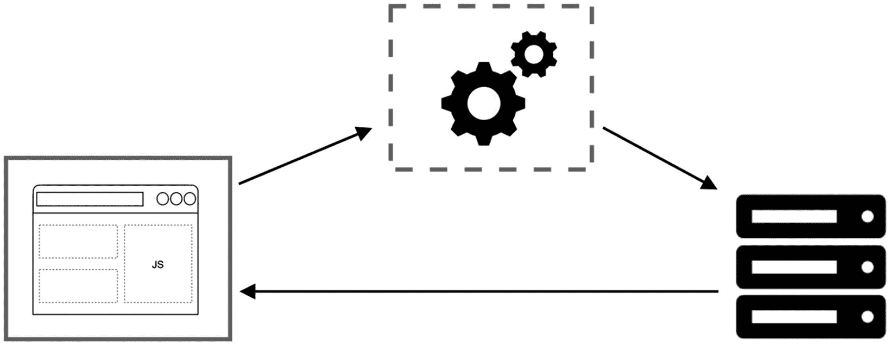
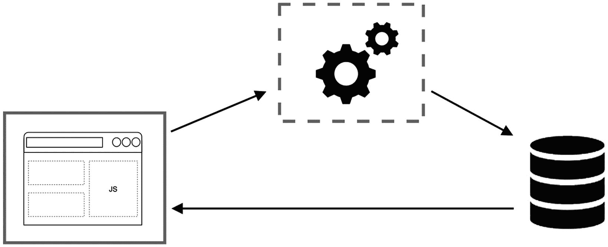
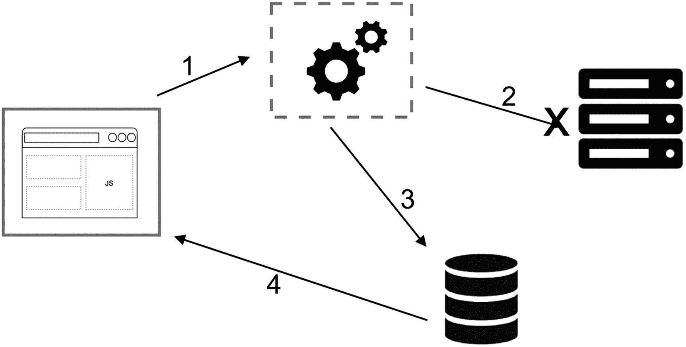
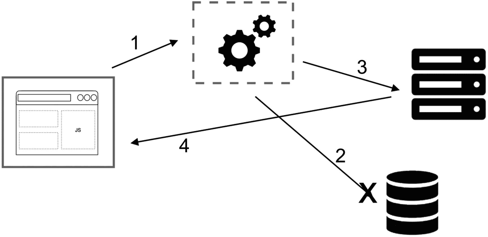
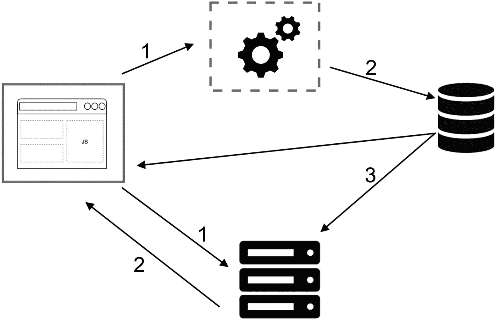
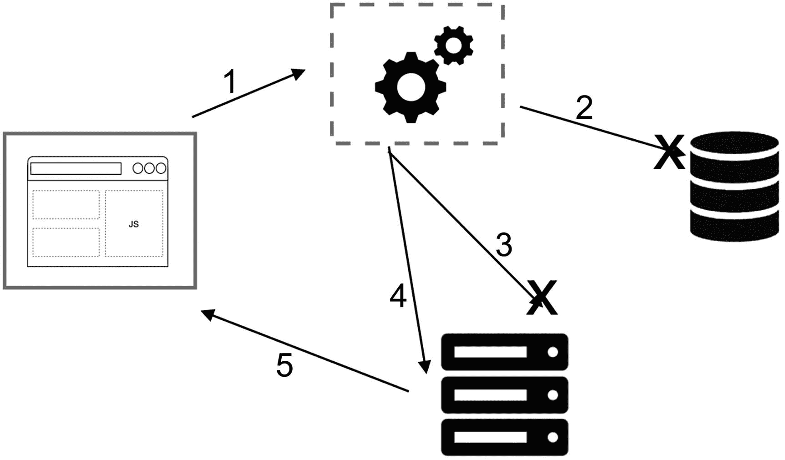
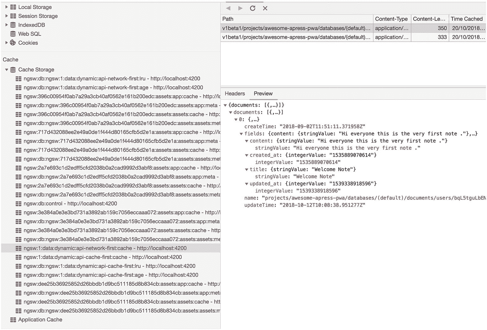
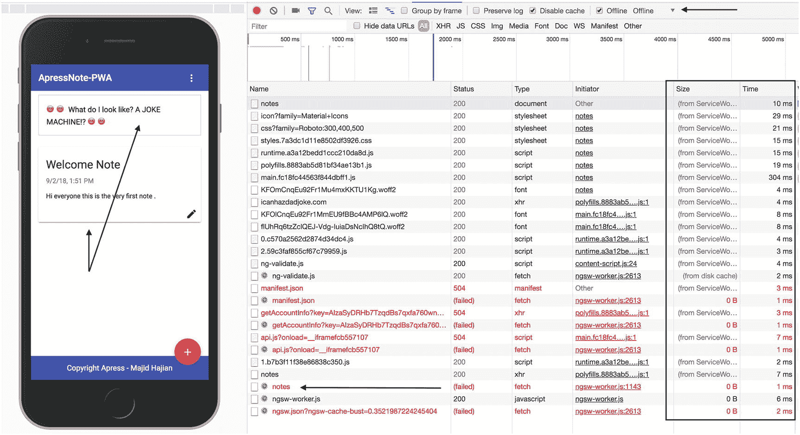
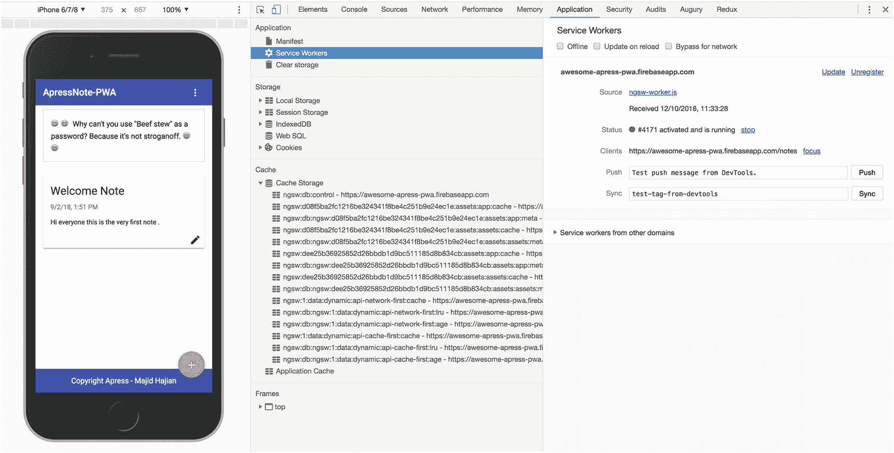

# 5.高级Angular服务工作器和运行时缓存

在前一章中，我们实现了 Angular Service Worker，并看到 Angular CLI 帮助我们以最小的努力运行 PWA。基本配置是我们创建带Angular PWA 之旅的开始。很明显，随着应用的发展，它将需要先进的技术和策略。因此，Angular Service Worker 提供了更多功能来处理各种情况。

在这一章中，我将把配置扩展到一个更高的层次，以便创建一个完全脱机的应用。然而，我们从学习服务工作器中复杂的缓存策略开始，这使我们能够理解 Angular 服务工作器实现的基础。

## 缓存策略

Service Worker 中有几种处理请求和响应的模式。它因应用而异。根据需要，您可以使用下面几节中讨论的一个或多个策略。

### 仅缓存

在这种策略中，请求总是在缓存中寻找匹配，并做出相应的响应。这对于“版本化”文件来说是理想的，因为它们应该存在于您的应用中，并且在下一次部署之前被认为是静态的和不变的。通常应用需要运行的所有静态资产，我们在安装事件时缓存它们。图 [5-1](#Fig1) 是显示其工作原理的简单图示。



图 5-1

仅缓存策略说明

下面的代码片段显示了我们如何使用这个策略。

```ts
self.addEventListener("fetch", event => {
  event.respondWith(caches.match(event.request));
});

```

请注意，如果在缓存中找不到匹配的请求，respond 将看起来像一个连接错误。

### 仅网络

有些用例没有离线的对等物。假设您有一个股票交易网站，并且总是需要向用户显示最新的汇率。图 [5-2](#Fig2) 简单展示了其工作原理。



图 5-2

仅网络

```ts
self.addEventListener("fetch", event => {
  event.respondWith(fetch(event.request));
});

```

有可能你没有调用`event.respondWith` `,`，这导致了默认的浏览器行为。

### 缓存退回到网络或缓存优先

这为您提供了仅缓存和仅网络的组合，其中它尝试匹配来自缓存的请求，如果它不存在，则它退回到从网络获取请求。参见图 [5-3](#Fig3) 了解其工作原理。



图 5-3

缓存退回到网络或缓存优先

```ts
self.addEventListener('fetch', function(event) {
const request = event.request;
  event.respondWith(
    caches.match(event.request).then(function(response) {
      return response || fetch(event.request);
    })
  );
});

```

我们可以利用这种策略来动态缓存内容。

```ts
self.addEventListener("fetch", event => {
const request = event.request;
  event.respondWith(
    caches.match(request).then(res => {
      // Fallback
      return (
        res ||  fetch(request).then(newRes => {
          // Cache fetched response
          caches
            .open(DYNAMIC_CACHE_VERSION)
            .then(cache => cache.put(request, newRes));
// Response can be used once, we need to clone to use it more in the context
          return newRes.clone();
        })
      );
    })
  );
});

```

请记住，更新缓存的内容将在同一请求的下一次访问中可用。

### 网络退回到缓存或网络优先

这种策略适用于那些无论应用版本或版本化文件如何都应该更新的资源:例如，在社交媒体中显示最新文章或时间线(见图 [5-4](#Fig4) )。最终，最新的内容将显示给我们的在线用户，而在离线模式下，用户将收到内容的旧缓存版本。与前面的策略类似，当网络请求成功时，我们很可能希望更新缓存条目。



图 5-4

网络退回到缓存或网络优先

```ts
self.addEventListener("fetch", event => {
const request = event.request;
  event.respondWith(
    fetch(request)
      .then(res => {
        // Cache latest version
        caches
          .open(DYNAMIC_CACHE_VERSION)
          .then(cache => cache.put(request, res));
        return res.clone();
      }) // Fallback to cache
      .catch(err => caches.match(request))
  );
});

```

然而，在慢速或间歇连接的情况下，用户面临不可接受的和不愉快的体验，因为获取需要非常长的时间；因此，从用户的Angular来看，这将是令人沮丧的。如果你正在寻找更好的选择，请看下一个模式。

### 缓存和网络

其思想是首先向用户显示旧的缓存内容(如果存在的话),然后在网络请求成功时更新 UI。换句话说，您必须在页面中发出两个 fetch 请求，并且在 Service Worker 中，您应该总是使用最新的 fetch 响应来更新缓存。图 [5-5](#Fig5) 展示了其工作原理。

你在 Twitter 等许多社交媒体平台上看到过这种模式，它们通常会显示旧的缓存内容，然后在时间轴上添加新的内容，并调整滚动位置，以便用户不受干扰。总而言之，这非常适合需要经常更新的内容，比如文章或活动时间表。

虽然这种策略给了我们的用户更好的体验，但它也可能是破坏性的:例如，当用户阅读网站上的内容时。突然间，为了更新用户界面并向他们显示新的数据，一大块内容消失了。因此，重要的是我们要确保用户与应用的互动，永远不要中断，以使它尽可能平稳。请记住，PWA 最重要的目标之一是为我们的用户提供更好的体验。

应用中的代码如下所示:



图 5-5

缓存和网络

```ts
const hasFetchData = false;
// fetch fresh data
const freshDataFromNetwork = fetch(YOUR_API)
.then((response) => response.json())
.then((data) => {
  hasFetchData = true;
  showDataInPage();
});

// fetch cached data
caches.match(YOUR_API)
.then((response) => response.json())
.then(function(data) {
  if (!hasFetchData) {
    showDataInPage(data);
  }
})
.catch((e)=>{
// in case if cache is not availble, we hope data is received by network fetch
return freshDataFromNetwork;
})

```

### 注意

除了服务工作器之外，缓存 API 在窗口对象和其他工作器中可用。

服务工作器中的代码类似于网络在更新缓存时回退到缓存。

```ts
self.addEventListener("fetch", event => {
  const request = event.request;
  event.respondWith(
    caches.open(DYNAMIC_CACHE_VERSION).then(cache => {
      return fetch(request).then(res => {
        cache.put(request, res.clone());
        return res;
      });
    })
  );
});

```

你可能会问，网络和缓存都失效怎么办？查看下一个模式，了解更多信息。

### 通用回退

这种模式非常适合于替代那些在缓存和网络中都不可用的请求:例如，当一个用户有一个虚拟角色，而从网络和缓存获取失败时。因此，我们可以简单地用照片占位符替换这个请求。另一个例子是当请求失败时向用户显示一个离线页面。您可以简单地预缓存 offline.html 页面，并在必要时从缓存中进行匹配。图 [5-6](#Fig6) 说明了它是如何工作的。



图 5-6

通用回退

```ts
self.addEventListener("fetch", event => {
  const request = event.request;
  event.respondWith(
    // check with cache first
    caches
      .match(request)
      .then(res => {
        // Fall back to network and if both failes catch error
        return res || fetch(request);
      })
      .catch(() => {
        // If both fail, show a generic fallback:
        return caches.match("/offline.html");
      })
  );
});

```

在实际的应用中，即使您可以向用户显示脱机替换，您也可能希望将数据存储到 indexedDB 中，并让您的用户知道请求被成功保留并将被同步。我们将在第 [9](09.html) 章一起回顾离线存储。

### 注意

很可能在一个应用中使用所有或许多缓存策略取决于我们需要实现什么。评估您的特定用例，然后选择一个适合它的模式。

在我们回顾 Angular 运行时缓存之前，理解 Service Worker 中大多数常见的缓存模式是很重要的。我相信您会对Angular缓存策略有更好的理解，因为您知道它们是如何工作的。让我们继续学习 Angular Service Worker 高级配置。

## Angular Service Worker 中的运行时缓存

使用`ngsw-config.json`配置Angular维修工人。在 Angular CLI 的帮助下，运行准系统 Angular 应用的默认设置已经就绪。但是随着应用的开发，我们发现需要缓存外部文件、CDN 资源以及从远程 API 调用填充数据。它变得更加复杂，我们希望缓存所有数据或至少部分缓存具有增强的性能、更快的应用和流畅的体验。我的目标是在这一节中介绍应用在数据和外部文件缓存方面的需求。让我们继续。

### 注意

运行时缓存也可以称为动态内容缓存。其思想是在应用运行时获取或请求数据时缓存数据，而数据在安装事件时尚未存储到缓存中，这被称为预缓存。

### 外部资源

不同来源或 CDN 上托管字体、JavaScript、样式、图像和其他类型的文件被视为外部资源。无论我们是想预先缓存还是在运行时将它们添加到缓存中，我们都需要在`ngsw-config.json`中定义它们。必须使用`urls`键将它们添加到`assetGroup`中，其中值将为`array of Glob, meaning we can also use glob pattern to specify urls`。URL 没有经过哈希处理；因此，只要配置发生变化，它们就会更新。如前几章所述，我们在应用中添加了两种字体。

```ts
<head>

<link href="https://fonts.googleapis.com/icon?family=Material+Icons" rel="stylesheet">

<link href="https://fonts.googleapis.com/css?family=Roboto:300,400,500" rel="stylesheet">

  <base href="/">
  <meta name="viewport" content="width=device-width, initial-scale=1">
  <link rel="manifest" href="manifest.json">
  <meta name="theme-color" content="#1976d2">
</head>

```

现在我们想缓存这些字体。代码类似于以下内容:

```ts
// this is our application ngsw-config.json file
{
      "name": "app",
      "installMode": "prefetch",
      "resources": {
        "files": ["/favicon.ico", "/index.html", "/*.css", "/*.js"],
         "urls": [
      https://fonts.googleapis.com/icon?family=Material+Icons,
      https://fonts.googleapis.com/css?family=Roboto:300,400,500,
      https://fonts.gstatic.com/s/roboto/v18/KFOlCnqEu92Fr1MmSU5fCRc4AMP6lbBP.woff2,
      https://fonts.gstatic.com/s/materialicons/v41/flUhRq6tzZclQEJ-Vdg-IuiaDsNcIhQ8tQ.woff2
             ]
      }
    },
   {
      "name": "assets",
      "installMode": "lazy",
      "updateMode": "prefetch",
      "resources": {
        "files": ["/assets/**"],
      }
    }

```

这里有一个例子，我们可以添加精确的网址，因为我们已经知道这些网址。然而，并不总是清楚确切的 URL 是什么。因此，我们可以添加一个 *glob 模式*来缓存 googleapis.com 和 gstatic.com 托管的所有*URL*，以便动态托管 *woff* 字体。

```ts
{
      "name": "app",
      "installMode": "prefetch",
      "resources": {
        "files": ["/favicon.ico", "/index.html", "/*.css", "/*.js"],
      }
    },
   {
      "name": "assets",
      "installMode": "lazy",
      "updateMode": "prefetch",
      "resources": {
        "files": ["/assets/**"],
          "urls": [
        https://fonts.googleapis.com/**,
         https://fonts.gstatic.com/**
             ]
      }
    }

```

除非另有明确说明，否则模式在配置中使用有限的 glob 格式。

1.  ****** 匹配 0 个或多个路径段
    1.  **/**/*。html** 指定所有的 html 文件

    2.  **/**/*。js** 指定所有的 js 文件

    3.  example.com**/* ***指定主机名匹配的所有请求

2.  ***** 匹配 0 个或更多字符，不包括/
    1.  **/*。html** 仅指定根目录中的 html 文件

    2.  **/a/folder/*。png** 只指定了/a/文件夹/中的 png 文件

3.  **？**只匹配一个字符，不包括/
    1.  **/什么？ver.js** 指定了根目录下的所有 js 文件，其中第 5 个<sup>字符可以是任何东西</sup>

4.  **该！前缀**的作用是否定的，意味着只有与模式不匹配的文件才会被包含进来。
    1.  **！/**/*.地图**排除所有源地图

    2.  **！/*.pdf** 排除根目录中的所有 pdf 文件

### 注意

`urls`不支持负 glob 模式和**？**会按字面匹配；这意味着什么？将不匹配除。本身。

运行 build 命令。完成后，导航到`/dist`文件夹，打开 Angular CLI 基于 ngsw-config.json 生成的`ngsw.json`。

```ts
"assetGroups": [
    {
      "name": "app",
      "installMode": "prefetch",
      "updateMode": "prefetch",
      "urls": [
        "/0.c570a2562d2874d34dc4.js",
        "/1.71eb2445db7dfda9e415.js",
        "/2.df6bb6a6fde654fe8392.js",
        "/favicon.ico",
        "/index.html",
        "/main.f224c8a2c47bceb8bef0.js",
        "/polyfills.8883ab5d81bf34ae13b1.js",
        "/runtime.e14ed3e6d31ff77728e9.js",
        "/styles.7a3dc1d11e8502df3926.css"
      ],
      "patterns": []
    },
    {
      "name": "assets",
      "installMode": "lazy",
      "updateMode": "prefetch",
      "urls": [
        "/assets/icons/icon-128x128.png",
        "/assets/icons/icon-144x144.png",
        "/assets/icons/icon-152x152.png",
        "/assets/icons/icon-192x192.png",
        "/assets/icons/icon-384x384.png",
        "/assets/icons/icon-512x512.png",
        "/assets/icons/icon-72x72.png",
        "/assets/icons/icon-96x96.png"
      ],
      "patterns": [
        "https:\\/\\/fonts\\.googleapis\\.com\\/.*",
        "https:\\/\\/fonts\\.gstatic\\.com\\/.*"
      ]
    }
  ],

```

通过查看生成的`ngsw-worker.js`和`ngsw.json,`,我们注意到 glob 变成了一个作为 regex 使用的模式。下面是从`ngsw-worker.js`中提取的`class AssetGroup`中的一段将模式映射到正则表达式的代码:

```ts
            // Patterns in the config are regular expressions disguised as strings. Breathe life into them.
            this.patterns = this.config.patterns.map(pattern => new RegExp(pattern));

```

在未来，在代码中，它被用作:

```ts
// Either the request matches one of the known resource URLs, one of the patterns for
// dynamically matched URLs, or neither. Determine which is the case for this request // in order to decide how to handle it.
if (this.config.urls.indexOf(url) !== -1 || this.patterns.some(pattern => pattern.test(url))) {

```

添加这些是为了在拦截请求并将其存储在缓存存储中时匹配请求。

### 无哈希资源的重新验证策略

当哈希存在于缓存中时，某些资源可能没有哈希。Angular 服务工作器将检查该请求有多长时间了，并确保它仍然可用。关于资源重新验证，Angular Service Worker 中应用了三种不同的策略:

1.  请求有一个`Cache-Control`头，因此过期需要基于它的年龄。
    *   这为请求和响应中的缓存机制指定了指令。客户端可以在 HTTP 请求中使用标准的缓存控制指令。

        ```ts
        Cache-Control: max-age=<seconds>
        Cache-Control: max-stale[=<seconds>]
        Cache-Control: min-fresh=<seconds>
        Cache-Control: no-cache
        Cache-Control: no-store
        Cache-Control: no-transform
        Cache-Control: only-if-cached

        ```

    *   取决于条件角寻找:**最大年龄**或**日期**标题。

2.  请求有一个`Expires`头，到期时间基于当前时间戳。
    *   `Expires`头包含日期/时间，而无效日期，如值 0，表示资源已经过期。如果响应中有带有`"max-age"`或`"s-maxage"`指令的`Cache-Control`报头，则 Expires 报头将被忽略。

    *   例如:`Expires: Wed, 21 Oct 2019 07:28:00 GMT.`

3.  该请求没有适用的缓存头，必须重新验证。
    *   如果无法评估陈旧性，则假设响应已经陈旧。

因此，将缓存控件添加到您的资源中是一个很好的做法；它不仅有助于浏览器重新验证响应，而且 Angular Service Worker 有助于有效地保持更新。

### 数据组设置

除了 assetGroups，还有`dataGroups.`与资产资源不同，本节定义的数据请求独立于应用版本，而 assetGroups 缓存更新策略不同:如果单个资源被更新，我们回收整个版本缓存。它们遵循自己手动配置的策略，这对于处理 API 请求和其他数据依赖等情况非常有用。我们可以使用它们来缓存来自外部服务的响应，以防应用离线。

看了一下`DataGroup` Typescript 接口，下面的属性揭示了:

```ts
export interface DataGroup {
  name: string;
  urls: string[];
  version?: number;
  cacheConfig: {
    maxSize: number;
    maxAge: string;
    timeout?: string;
    strategy?: 'freshness' | 'performance';
  };
}

```

1.  `name`:

    *(必需)*将包含在高速缓存 API 存储名称中的组的名称。它应该是`string`，描述我们的知识，并且是唯一标识的。

2.  `urls`:

    *(必需)*根据此数据策略，用于匹配这些 URL 以进行缓存的 glob 模式列表。与`assetGroups`类似，不支持负 glob 模式。会完全匹配也就是说。仍将是。性格和什么都不搭。

3.  `version`:

    *(可选)*API 中的版本控制很常见。在某种程度上，有时新版本格式将不会与旧 API 向后兼容；因此，现有的缓存包含较旧的格式，可能会破坏应用，因为它与较新的 API 结构不匹配。尽管`version`是可选的，并且整数字段默认为`0`，但是它提供了一种机制来指示正在缓存的 API 响应是否已经以向后不兼容的方式进行了更改。因此，存储该 API 响应的所有旧缓存条目必须被丢弃、根除，并用新响应替换。

4.  `cacheConfig`:

    *(required)* settings that define the policies and strategies by which matching requests will be cached:
    *   `maxSize`:

        *(必选)*当缓存打开接受无限数量的响应时，取决于你的 app 大小，它可以迅速增长，最终超过存储配额， <sup>[1](#Fn1)</sup> 调用驱逐。因此，我们可以在这里定义条目或响应的最大数量。

    *   `maxAge`:

        *(必需)*表示响应在被标记为无效并被逐出之前，允许在缓存中保留多长时间。指定持续时间的字符串，可以设置为`d:`天、`h:`小时、`m:`分、`s:`秒、`u:`毫秒。例如， ***10d12h4m*** 将内容缓存长达 10 天半零 4 分钟。

    *   `timeout`:

        (可选)虽然这是一个可选参数，但它告诉 Angular Service Worker 在返回缓存内容之前应该等待网络响应多长时间。当`strategy`是*新鲜度*时，这是有效的，这意味着网络优先(见下一个属性)。持续时间指定类似于`maxAge`单位的持续时间。 **1d** 考虑 1 天。

    *   **策略**

        (optional) it can have two options for all data resources:
        *   `performance` `:`

            它指的是缓存优先策略。不经常改变的内容可以属于这种策略，因为它已经针对更快的响应进行了优化。

            它首先检查缓存，如果资源存在，并且根据`maxAge`它没有过期，则根据`maxAge`缓存的版本将立即被提供，以换取更好的性能。如果内容过期，它会尝试更新缓存。

            例如，我们有一个端点来检索用户的期望列表。基于我们的 app，我们真的不需要调用这个 API 因此，我们可以设置 1 小时的`maxAge`和性能策略，以向用户显示更快的响应。

        *   `freshness` `:`

            这种策略被认为是网络优先的，因为它总是试图只从网络获取数据。根据`timeout`，如果网络没有相应的响应，请求会退回到缓存中。它适合所有需要频繁更新的数据。

            例如:显示用户积分余额的用户仪表板。

### 注意

默认情况下。Angular Service Worker 不缓存运行时获取的任何数据或文件。它们必须被明确地定义和配置。

现在是时候配置我们的 Note 应用了。我将使用网络优先的策略，通过** glob 从 Firebase 端点检索注释。我希望将大小设置为 100，最大缓存年龄设置为 10 天零 5 秒，超时后请求将退回到缓存(如果存在)。

为了更好地理解，我将在`data.service.ts`中创建两个新方法来直接向 Firestore API 发出 GET 请求，并创建另一个方法来获取一个随机的爸爸笑话。新方法看起来像下面的代码:

```ts
 // data.service.ts

// DataService

protected readonly FIRESTORE_ENDPOINT =
    'https://firestore.googleapis.com/v1beta1/projects/awesome-apress-pwa/databases/(default)/documents/';
  protected readonly DAD_JOKE = 'https://icanhazdadjoke.com';

// Get a random joke

getRandomDadJoke(): Observable<string> {
    return this.http
      .get<Joke>(this.DAD_JOKE, {
        headers: {
          Accept: 'application/json'
        }
      })
      .pipe(map(data => data.joke));
  }

// Get note Details

getNoteFromDirectApi(id): Observable<any> {
    return this.auth.getToken().pipe(
      switchMap(idToken => {
        return this.http.get(

          `${this.FIRESTORE_ENDPOINT}users/${this.auth.id}/notes/${id}`,
          {
            headers: {
              Authorization: `Bearer ${idToken}`
            }
          }
        );
      }),
      map(notes => this.transfromNote(notes))
    );
  }

// List all notes for current user

initializeNotes(): Observable<any> {
    return this.auth.getToken().pipe(
      switchMap(idToken => {
        return this.http.get(
          `${this.FIRESTORE_ENDPOINT}users/${this.auth.id}/notes`,
          {
            headers: {

              Authorization: `Bearer ${idToken}`
            }
          }
        );
      }),
      map((data: { documents: { fields: {} }[] }) => data.documents),
      map(notes => this.transfromNotes(notes)),
      tap(notes => {
        this.isLoading$.next(false);
      })
    );
  }

  private transfromNotes(notes) {

    return notes.map(note => this.transfromNote(note));
  }

// since I am calling google API directly, a simple transfromationm make it easy to use data in our application

  private transfromNote(note) {
    const _note = {};
    _note['id'] = note.name.split('/').reverse()[0];
    for (const prop in note.fields) {
      if (note.fields[prop]) {
        _note[prop] =
          note.fields[prop]['stringValue'] || note.fields[prop]['integerValue'];
      }
    }
    return _note;
  }

```

那我就分别把`notes-list.component.ts``note-details.component.ts``,`中的`getNotes()`换成`initializeNotes()`，把`getNote()`换成`getNoteFromDirectApi()`。最后，我将在我的`app.component.ts.`中加入一个笑话

```ts
@Component({
  selector: 'app-root',
  template: `
  <div class="appress-pwa-note">
    <app-header></app-header>
    <div class="main">
      <div *ngIf="joke$ | async as joke" class="joke">
      {{ joke }}
      </div>
      <router-outlet></router-outlet>
    </div>
    <app-footer></app-footer>
  </div>
  `,
  styles: [
    `
      .joke {
        margin-top: 0.5rem;
        padding: 1rem;
        border: 1px solid #ccc;
      }
    `
  ]
})
export class AppComponent implements OnInit {
  joke$: Observable<string>;

  constructor(private db: DataService) {}

  ngOnInit() {
    this.joke$ = this.db.getRandomDadJoke();
  }
}

```

基于我在应用中的策略，我决定使用`freshness`作为 Firestore Google API 端点，使用`performance`作为随机笑话端点，因为这不需要被多次调用；每 15 分钟一次应该足够了。相应的配置如下所示:

```ts
"dataGroups": [
    {
      "name": "api-network-first",
      "version": 1,
      "urls": ["https://firestore.googleapis.com/v1beta1/**"],
      "cacheConfig": {
        "strategy": "freshness",
        "maxSize": 100,
        "maxAge": "10d",
        "timeout": "5s"
      }
    },
    {
      "name": "api-cache-first",
      "version": 1,
      "urls": ["https://icanhazdadjoke.com"],
      "cacheConfig": {
        "strategy": "performance",
        "maxSize": 20,
        "maxAge": "15m"
      }
    }
  ]

```

现在，我将构建我的生产就绪应用，并在本地提供服务。

```ts
npm run prod

```

导航至`localhost:4200`并查看缓存存储和服务工作器选项卡。你会注意到现在我们有了缓存名来存储我们的两个策略，如图 [5-7](#Fig7) 所示。



图 5-7

运行时缓存

现在花一点时间使用应用，几分钟后，关闭网络，如图 [5-8](#Fig8) 所示，然后重新加载应用。


图 5-8

选中“脱机”以断开网络连接

惊喜！即使您没有任何网络连接，您看到的所有数据，包括笔记、静态资产和笑话，现在都是可用的。让我们看看网络选项卡中的所有请求。您可能会注意到，在图 [5-9](#Fig9) 中，没有对笑话端点的请求。



图 5-9

离线模式网络请求

是的，这是正确的，因为我们已经为该端点设置了`performance`(缓存优先)策略，并且由于`maxAge,`为 15 分钟，该策略尚未过期，Angular Service Worker 将丢弃该请求，直到其过期，然后将重新验证该请求，并使用适当的响应更新缓存。

### 导航缓存

在单页面应用中，路由在前端处理。前端中的所有路由最终被指向`index.html`，其中框架，特别是Angular路由器模块，将导航请求匹配到特定视图。

什么使一个请求被认为是导航请求分为三个要点:

1.  它的模式是导航。

    请求接口的*模式*只读属性，用于确定跨源请求是否导致有效响应，以及响应的哪些属性是可读的——值为 cors、no-cors、同源或导航。**导航**是一种支持导航的模式，仅供 HTML 导航使用。只有在文档间导航时，才会创建导航请求。<sup>2[2](#Fn2)T7】</sup>

2.  它接受文本/html 响应(由 Accept 头的值决定)。

3.  它的 URL 符合某些标准，默认为:
    1.  URL 不得包含文件扩展名(即*)。*、 *a .* 最后一个路径段。

    2.  URL 不得包含 *__* 。

看了一下`Config`界面，你会注意到有一个Angular或自定义导航`navigationUrls`的特定属性。如您所见，这是可选的，使我们能够定制一个 URL 列表。

```ts
export interface Config {
  appData?: {};
  index: string;
  assetGroups?: AssetGroup[];
  dataGroups?: DataGroup[];
  navigationUrls?: string[];
}

```

URL 可以是 URL 数组，也可以是在运行时匹配的类似 glob 的 URL 模式。支持负模式和非负模式。

虽然默认值在大多数情况下已经足够，但有时需要配置不同的规则。假设我们的应用中有一些特定的 URL 需要在后端提供服务，我们需要将它们传递给服务器进行处理，因为它们不是有Angular的路由。

如果省略`nagivationUrls`，默认值将被替换:

```ts
  "navigationUrls": [
    "/**",          // Include all URLs.
    "!/**/*.*",           // Exclude URLs to files.
    "!/**/*__*",          // Exclude URLs containing `__` in the last segment.
    "!/**/*__*/**"        // Exclude URLs containing `__` in any other segment.
  ]

```

结果会是这样的:

```ts
"navigationUrls": [
    {
      "positive": true,
      "regex": "^\\/.*$"
    },
    {
      "positive": false,
      "regex": "^\\/(?:.+\\/)?[^/]*\\.[^/]*$"
    },
    {
      "positive": false,
      "regex": "^\\/(?:.+\\/)?[^/]*__[^/]*$"
    },
    {
      "positive": false,
      "regex": "^\\/(?:.+\\/)?[^/]*__[^/]*\\/.*$"
    }
  ]

```

作为一个例子，我将实现一个不需要缓存的路由。

我将生成一个名为`NoCacheRouteComponent`的组件。

```ts
@Component({
  selector: 'app-no-cache-route',
  template: `
    <div class="appress-pwa-note">No-cache</div>
  `
})
export class NoCacheRouteComponent {}

```

然后我再加一条到`app-routing.module.ts`的路由。

```ts
  {
    path: 'no-cache-route',
    component: NoCacheRouteComponent
  }

```

最后，我将在`ngsw-config.json`中排除这个 URL。

```ts
  "navigationUrls": [
    "/**",
    "!/**/*.*",
    "!/**/*__*",
    "!/**/*__*/**",
    "!/**/no-cache-route"
  ]

```

### 注意

可以下拉 [`www.github.com/mhadaily/awesome-apress-pwa/chapter05/03-no-cache-route`](http://www.github.com/mhadaily/awesome-apress-pwa/chapter05/03-no-cache-route) 。运行`npm install`然后运行`npm run serve:prod`。它在网络服务器上运行生产应用。可以导航到`localhost:4200`。

### appdata config(appdata config)

此属性也是可选的，可能包含该特定版本的应用元数据。服务工作器不使用`appData`,但可以在服务器工作人员更新中确定，它可以用于在 UI 通知中显示附加信息，以通知用户或在应用上做出明智的决定。

例如，诸如发布日期、构建散列、指示服务器安全缺陷的标志之类的信息可以在下次重新加载时应用，而不会中断用户。

我将在下一节中使用这个对象，并在后面的其他章节中查看这个配置。

### 处理更新

通过在我们的应用中实现 Service Worker，与已缓存和使用的应用相比，处理过时版本的应用迟早会成为一个问题，因为新版本的 Service Worker 只会在页面重新加载时激活。Angular Service Worker 通过提供一个`SwUpdate`类来解决这个问题，这个类可以很容易地检查可用的更新。让我们来看看这个课程:

```ts
class SwUpdate {
  available: Observable<UpdateAvailableEvent>
  activated: Observable<UpdateActivatedEvent>
  isEnabled: boolean
  checkForUpdate(): Promise<void>
  activateUpdate(): Promise<void>
}

```

让我们来分解这个类:

1.  `available`: an observable that emits UpdateAvailableEvent whenever a new app version is available.

    ```ts
    interface Version {
        hash: string;
        appData?: Object;
    }

    interface UpdateAvailableEvent {
      type: 'UPDATE_AVAILABLE';
      current: Version
      available: Version;
    }

    ```

    界面非常简单明了。如您所见，在当前和可用属性中，`appData`是一个选项，如果我们在`ngsw-config.json.`中定义它，它将是可用的

    For example:

    ```ts
    {
      "index": "/index.html",
      "appData": {
        "version": "1.0.1"
      },
      "assetGroups": []
    }

    ```

2.  `activated`:每当应用更新到新版本时发出`UpdateActivateEvent`的可观察对象。

    ```ts
    interface UpdateActivatedEvent {
        type: 'UPDATE_ACTIVATED';
        previous?: Version;
        current: Version;
    }

    ```

3.  `isEnabled`:布尔值，用于检查浏览器是否支持服务工作器，是否通过 ServiceWorkerModule 启用。

4.  当有更新时，这个承诺将被兑现，它允许我们定期检查更新。

5.  将通过强制服务工作器更新来解决的承诺。我们可能需要在解决此功能后采取其他措施。例如，我们需要重新加载应用，因为当前加载的资源变得无效。

现在是时候在我们的应用中实现了，看看结果如何。

```ts
export class AppComponent implements OnInit {
  joke$: Observable<string>;

  constructor(private db: DataService, private swUpdates: SwUpdate, private snackbar: SnackBarService) {}

  ngOnInit() {
    this.joke$ = this.db.getRandomDadJoke();
    this.swUpdateFlow();
  }

  swUpdateFlow() {
    // check if service worker is enabled and only check if it's production
    if (this.swUpdates.isEnabled && environment.production) {
      // subscribe to recieve update when it's available
      this.swUpdates.available.subscribe((event: UpdateAvailableEvent) => {
        // console log version on appData Object defined in ngsw-config.js
        console.log(`Version: ${event.current.appData['version']}`);

        // an update is available, inform user

and take an action
        this.snackbar
          .action(
            `${event.type}: current is ${event.current.hash} but available is ${event.available.hash}`,
            'Activate'
          )
          .subscribe(() => {
            // force to activate update
            this.swUpdates
              .activateUpdate()
              .then(() => {
                this.snackbar.open('Update has been applied', 1000);
                // force to reload to ensure new update is in place
                // (<any>window).location.reload();
              })
              .catch(e => {
                this.snackbar.open('Something is wrong, please reload manually');
              });
          });
      });

      // subscribe to receive an notification when new version is activated
      this.swUpdates.activated.subscribe((event: UpdateActivatedEvent) => {
        // console log version on appData Object defined in ngsw-config.js
        console.log(`Version: ${event.current.appData['version']}`);

        this.snackbar
          .action(`${event.type}, current is ${event.current.hash} but previously was ${event.previous.hash}`, 'Reload')
          .subscribe(() => {
            // force to reload to ensure new update is in place
            (<any>window).location.reload();
          });
      });
    }
  }
}

```

在`app.component.ts,`我会先注射`SwUpdate`。然后，我将确保在生产和服务工作人员上运行代码。我将订阅可用的 observables，一旦有更新可用，我将显示 snackbar 通知，并通知用户有一个新版本的应用可用，并要求他们重新加载页面，以便查看应用的最新版本。

### 注意

可以下拉 [`www.github.com/mhadaily/awesome-apress-pwa/chapter05/04-notification-updates`](http://www.github.com/mhadaily/awesome-apress-pwa/chapter05/04-notification-updates) 。运行`npm install`然后运行`npm run serve:prod`。它在网络服务器上运行一个生产应用。您可以导航到`localhost:4200.`

## 部署到火力基地

现在我们已经准备好构建我们的应用并部署到 Firebase。像往常一样，只需运行:

```ts
npm run deploy

✓  hosting[awesome-apress-pwa]: file upload complete
i  database: releasing rules...
✓  database: rules for database awesome-apress-pwa released successfully
i  hosting[awesome-apress-pwa]: finalizing version...
✓  hosting[awesome-apress-pwa]: version finalized
i  hosting[awesome-apress-pwa]: releasing new version...
✓  hosting[awesome-apress-pwa]: release complete

✓  Deploy complete!

Project Console: https://console.firebase.google.com/project/awesome-apress-pwa/overview
Hosting URL: https://awesome-apress-pwa.firebaseapp.com

```

让我们导航到该网站，并检查服务工作器。如图 [5-10](#Fig10) 所示，已经安装并激活了新的服务工作器，并且创建了新的缓存。



图 5-10

成功部署到 Firebase

### 注意

可以下拉 [`www.github.com/mhadaily/awesome-apress-pwa/chapter05/02-runtime-cache`](http://www.github.com/mhadaily/awesome-apress-pwa/chapter05/02-runtime-cache) 。运行`npm install`然后运行`npm run serve:prod`。它在网络服务器上运行一个生产应用。可以导航到`localhost:4200`。您可能还需要将这段代码部署到 Firebase，以便在添加服务工作器之前评估您的应用。

## 摘要

在前两章中，我深入研究了 Angular Service Worker 的配置和设置，为我们的应用实现了最佳策略，并部署了一个离线就绪的应用。尽管我们的应用独立于 connection 工作，但仍有许多增强用户体验的可能性。

在下一章中，我们将详细了解应用清单，它使我们的应用可以安装在用户可以从主屏幕运行我们的应用的地方。

<aside class="FootnoteSection" epub:type="footnotes">Footnotes [1](#Fn1_source)

所有浏览器都有一个存储限制，即你的 web 应用源可以使用的存储空间，并且每个设备、每个浏览器都有所不同。如果原点驱逐不能释放足够的空间，浏览器将抛出一个`QuotaExceededError.`

  [2](#Fn2_source)

[https://开发者。mozilla。org/en-US/docs/Web/API/Request/mode](https://developer.mozilla.org/en-US/docs/Web/API/Request/mode)

 </aside>