# 7.App 外壳和Angular性能

没有人喜欢等很久才看到应用正在加载。事实上，统计数据显示，如果初始渲染时间超过三秒，用户很可能会离开我们的应用。PWAs 的主要基本原则之一是要快。在原生应用中，用户通常会看到一个闪屏，过一段时间后就会看到主要内容和框架。另一方面，在引导完成之前会出现白屏，尤其是单页应用。

在本章中，我们将回顾应用外壳模型，以了解它是什么以及它是如何工作的。然后，我们将设置 Angular CLI 来帮助我们生成 Angular 应用外壳。最后，我们将超越应用外壳，优化 Angular 应用，以实现更好的性能。

## 应用外壳模型

引入该模型是为了构建一个 PWA，它可以可靠地即时加载并提升用户感知的启动性能，就像他们在本地应用中看到的一样。

应用“外壳”是用户界面所需的最少的 HTML、CSS 和 JavaScript，以便在加载应用时看到有意义的内容。我们可以尽快想到他们应该在折叠内容或主骨架上方看到什么。它可以脱机缓存，应该立即加载，并且在用户重复访问时必须具有可靠的性能。换句话说，每次用户访问应用时，都不会从网络加载应用外壳。

你可能会问，那内容呢？在这种情况下，如有必要，从网络请求内容。这种架构可能不适用于所有场景和应用；然而，它一直是 Angular 应用的首选方法，这种应用通常被认为是单页面应用。

如图 [7-1](#Fig1) 和 [7-2](#Fig2) 所示，应用外壳类似于本地应用框架，是启动应用并向用户显示初始 UI 所必需的；但是，它不包含数据。因此，我们可以简单地将它打包并发布到应用商店。这种架构不仅有助于模拟类似本机的应用并快速加载，而且从经济的Angular来看，将保存我们缓存的数据，并在重复访问时重新加载缓存。

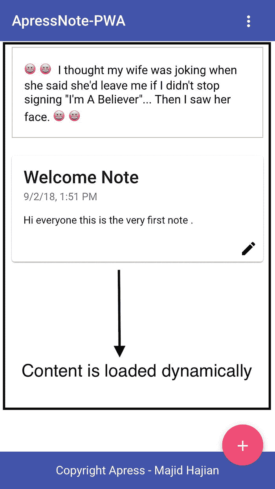

图 7-2

动态内容

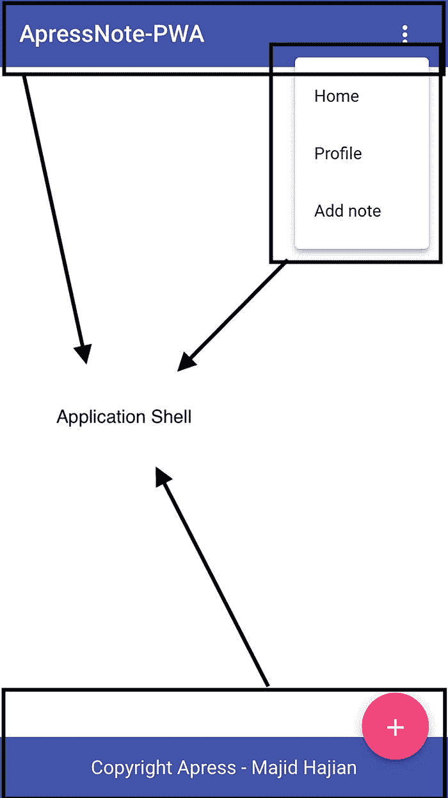

图 7-1

应用外壳

在第 [4](04.html) 章中，我们在技术上缓存了我们的应用外壳，甚至设法在第 [5](05.html) 章中缓存了我们的部分动态内容，这也提升了我们的用户体验。

## Angular分明的 App 外壳

Angular 中的应用外壳概念包含两个含义:“预缓存应用的 UI”和“在构建时预呈现 UI”一般来说，同时使用缓存和预渲染 ui 可以创建一个有Angular的应用外壳。

尽管我们已经缓存了静态资产，其中包括应用外壳需求，但直到 Angular 被引导后才会向用户显示。我们向用户展示有意义内容的时间是 JavaScript 文件被解析和执行的时候；因此，Angular 应用已经启动。正如我们所知，我们在`index.html`中引用我们的 JavaScript 文件；因此，在下载文件之前，用户首先点击这个文件。

在低性能的应用中，尤其是在首次访问时，看到应用内容和黑屏之间有一段时间，这基本上是我们的`index.html`，没有任何元素。

Angular CLI 有一个内置功能，可以帮助我们在构建时自动生成应用外壳。在我们继续之前，让我们看看在`/dist`文件夹中为 prod 构建之后`index.html`包含了什么。打开您的项目并为 prod 构建，或者如果您已经为这本书克隆了存储库，只需将您的目录更改为`chapter07`，然后更改为`02-app-shell`；最后，运行以下命令:

```ts
npm run build:prod

```

如果我们比较来自`src`文件夹和`dist`文件夹的`index.html`，我们注意到我们只看到 JS 文件和 CSS 文件被注入到这个文件中。

```ts
<!doctype html>
<html lang="en">

<head>
 ...
  <link rel="stylesheet" href="styles.c418d0a7774195ac83e5.css">
</head>

<body>
  <app-root></app-root>
  <noscript>Please enable JavaScript to continue using this application.</noscript>
  <script type="text/javascript" src="runtime.3d4490af672566f1a0de.js"></script>
  <script type="text/javascript" src="polyfills.c53b1132b0de9f2601bd.js"></script>
  <script type="text/javascript" src="main.a136972022b8598085fb.js"></script>
</body>

</html>

```

我想在构建后测量应用的启动性能。你可以运行`ng serve --prod`或者在构建之后运行一个本地服务器来运行应用。如果您仍然在这本书的项目库中，只需运行`npm run prod`然后遵循以下步骤:

1.  打开一个新的浏览器，可能隐姓埋名，我们确保没有缓存。

2.  在 Chrome 中打开 DevTools，选择选项卡 performance。

3.  Open capture setting and select Fast 3G for Network and 4x Slowdown for CPU; this is typically when we want to simulate throttling for a mobile (Figure [7-3](#Fig3)).

    

    图 7-3

    打开捕捉设置，选择快速 3G 和 4x 减速

4.  点击记录并按回车键加载网站，或点击性能选项卡中的重新加载图标简单地重新加载页面。

正如您在图 [7-4](#Fig4) 中所看到的，浏览器在大约 2000 毫秒时呈现页面，而第一次绘制尝试已经开始了大约 500 毫秒，但是因为没有内容和任何东西要显示，所以它保持空白。

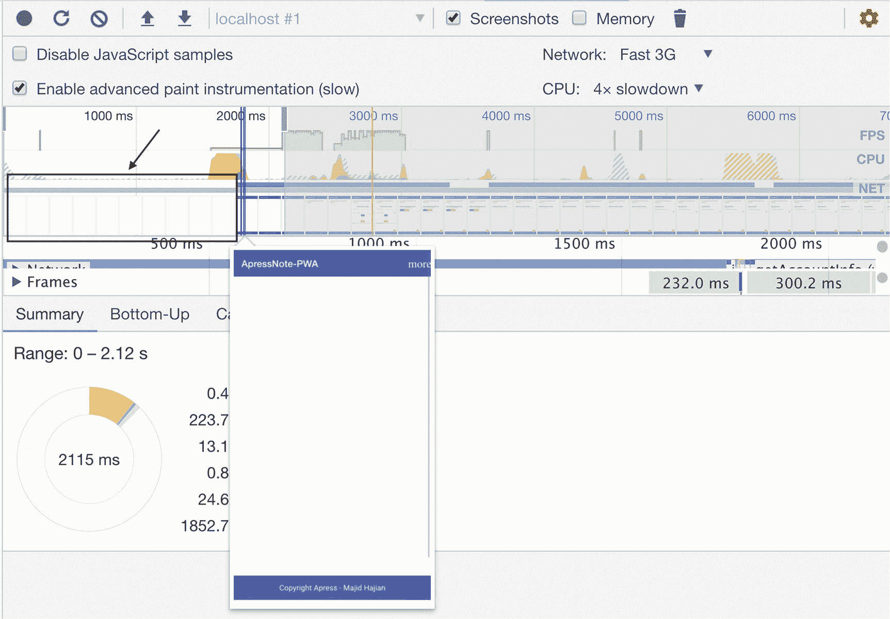

图 7-4

在 Angular 引导大约 2 秒后，应用外壳的初始渲染

### 角形 App 外壳和角形通用

Angular Universal 通过称为服务器端呈现(SSR)的过程在服务器上生成静态应用页面。当 Universal 与您的应用集成时，它可以预先生成 HTML 文件形式的页面，供以后使用。

看了一下应用的结构，`app.component.ts`有一个主框架，包括一个页眉和页脚。

```ts
  template: `
  <div class="appress-pwa-note">
    <app-header></app-header>
    <div class="main">
      <div *ngIf="joke$ | async as joke" class="joke">
      {{ joke }}
      </div>
      <router-outlet></router-outlet>
    </div>
    <app-footer></app-footer>
  </div>
  `,

```

看来如果能预渲染这个组件，在自举 Angular 之前就能有个 app 外壳了。正如您在组件模板中看到的，它的<router-outlet>将被替换为内容；因此，我们需要指定我们想要放置什么来代替路由器出口。</router-outlet>

这就是我们使用 Angular Universal 的地方，通过 Angular CLI 运行简单的命令，在构建时生成一个 app-shell，并在`index.html`中输出。我们定义了想要预渲染的路由，然后就可以开始了。因此，我们将为一个Angular宇宙搭建支架，以获得预渲染能力。Angular CLI 将是一个内置命令，帮助我们轻松实现目标。只需运行以下命令:

*   Angular CLI 生成 App Shell。

*   `--universal-project`指定我们要使用哪个Angular通用应用进行预渲染。

*   `--client-project`指定我们想要用于预渲染的客户端项目。

*   或者，您可以使用`--route`来指定应该使用什么路径名来生成应用外壳。默认值为`shell.`

```ts
ng generate app-shell --client-project <my-app> --universal-project <server-app>

```

由于 Angular CLI 6+可以处理多个客户端项目，因此找到正确的应用非常重要。如果您不知道您的客户端项目名称，请查看`angular.json` CLI 配置文件。

以下是命令输出:

```ts
CREATE src/main.server.ts (220 bytes)
CREATE src/app/app.server.module.ts (590 bytes)
CREATE src/tsconfig.server.json (219 bytes)
CREATE src/app/app-shell/app-shell.component.css (0 bytes)
CREATE src/app/app-shell/app-shell.component.html (28 bytes)
CREATE src/app/app-shell/app-shell.component.spec.ts (643 bytes)
CREATE src/app/app-shell/app-shell.component.ts (280 bytes)
UPDATE package.json (1822 bytes)
UPDATE angular.json (5045 bytes)
UPDATE src/main.ts (656 bytes)
UPDATE src/app/app.module.ts (1504 bytes)

```

如果你想手动完成这个过程，或者你想知道它是如何工作的。我会破解密码。

`Main.server.ts`已经被创建来引导`app-server-module` `:`

```ts
import { enableProdMode } from '@angular/core';

import { environment } from './environments/environment';

if (environment.production) {
  enableProdMode();
}

export { AppServerModule } from './app/app.server.module';

```

`app-server.module.ts`只有一条路由`shell`被替换为`router-outlet`

```ts
import { NgModule } from '@angular/core';
import { ServerModule } from '@angular/platform-server';

import { AppModule } from './app.module';
import { AppComponent } from './app.component';
import { Routes, RouterModule } from '@angular/router';
import { AppShellComponent } from './app-shell/app-shell.component';

const routes: Routes = [ { path: 'shell', component: AppShellComponent }];

@NgModule({
  imports: [
    AppModule,
    ServerModule,
    RouterModule.forRoot(routes),
  ],
  bootstrap: [AppComponent],
  declarations: [AppShellComponent],
})
export class AppServerModule {}

```

在这里我们可以添加预渲染需要显示的内容；在这种情况下，我将添加一个简单的加载消息。

```ts
// app-shell.component.html
<div class="loading" style="text-align:center; padding:3rem">
  loading... will be sevring you very very soon
</div>`

// app-shell.component.ts
@Component({
  selector: 'app-app-shell',
  templateUrl: './app-shell.component.html',
  styleUrls: ['./app-shell.component.css']
})
export class AppShellComponent implements OnInit {
  constructor() { }
  ngOnInit() {
  }
}

```

`tsconfig-server.json`将具备服务器端渲染一个 Angular app 的所有要求。

```ts
{
  "extends": "./tsconfig.app.json",
  "compilerOptions": {
    "outDir": "../out-tsc/app-server",
    "baseUrl": "."
  },
  "angularCompilerOptions": {
    "entryModule": "app/app.server.module#AppServerModule"
  }
}

```

并且`platform-server`模块已添加到`package.json`:

```ts
"@angular/platform-server": "^7.0.1",

```

在`app.module.ts, BrowserModule`中已配置，以便从服务器渲染的应用(如果页面上有)过渡。

```ts
BrowserModule.withServerTransition({ appId: 'serverApp' }),

```

除了所有其他变化，在`angular.json`文件中还有新的配置，我们有两个新的目标:

```ts
"server": {
          "builder": "@angular-devkit/build-angular:server",
          "options": {
            "outputPath": "dist/lovely-offline-server",
            "main": "src/main.server.ts",
            "tsConfig": "src/tsconfig.server.json"
          },
          "configurations": {
            "production": {
              "fileReplacements": [
                {
                  "replace": "src/environments/environment.ts",
                  "with": "src/environments/environment.prod.ts"
                }
              ]
            }
          }
        },
        "app-shell": {
          "builder": "@angular-devkit/build-angular:app-shell",
          "options": {
            "browserTarget": "lovely-offline:build",
            "serverTarget": "lovely-offline:server",
            "route": "shell" // where we define our route
          },
          "configurations": {
            "production": {
              "browserTarget": "lovely-offline:build:production"
            }
          }
        }

```

如您所见，`app-shell`组件被链接到`/shell`路由，但仅在`Angular Universal`应用中。这个特殊路径是一个内部Angular CLI 机制，用于生成 App Shell。它将替换`router-outlet`标签，用户将无法导航到它。

### 在生产中生成应用外壳

因此，一切似乎都准备好了，并已设置妥当。现在让我们使用应用外壳目标进行构建。

要触发生产构建，您只需运行以下命令之一:

```ts
ng run <project-name>:app-shell:production
ng run <project-name>:app-shell --configuration production

```

因此，在项目中，运行以下命令:

```ts
ng run lovely-offline:app-shell:production

```

这个命令将把名为`lovely-offline`的客户端应用和目标构建`app-shell`作为目标。Angular CLI 开始构建和捆绑，一旦完成，输出就在`dist`文件夹中准备好了。现在就来看看`index.html`吧。

```ts
<app-root _nghost-sc0="" ng-version="7.0.1">
    <div _ngcontent-sc0="" class="appress-pwa-note">
      <app-header _ngcontent-sc0="" _nghost-sc1="">
        <mat-toolbar _ngcontent-sc1="" class="mat-toolbar mat-primary mat-toolbar-single-row" color="primary"
          ng-reflect-color="primary"><span _ngcontent-sc1="" tabindex="0" ng-reflect-router-link="/">ApressNote-PWA</span><span

            _ngcontent-sc1="" class="space-between"></span><button _ngcontent-sc1="" aria-haspopup="true"
            mat-icon-button="" class="mat-icon-button _mat-animation-noopable"
            ng-reflect-_deprecated-mat-menu-trigger-for="[object Object]"><span class="mat-button-wrapper">
              <mat-icon _ngcontent-sc1="" class="mat-icon material-icons" role="img" aria-hidden="true">more_vert</mat-icon>
            </span>
            <div class="mat-button-ripple mat-ripple mat-button-ripple-round" matripple="" ng-reflect-centered="true"
              ng-reflect-disabled="false" ng-reflect-trigger="[object Object]"></div>
            <div class="mat-button-focus-overlay"></div>
          </button></mat-toolbar>
        <mat-menu _ngcontent-sc1="" x-position="before" class="ng-tns-c6-0">
          <!---->
        </mat-menu>
      </app-header>
      <div _ngcontent-sc0="" class="main">
        <!--bindings={
  "ng-reflect-ng-if": "How many kids with ADD does it"
}-->
        <div _ngcontent-sc0="" class="joke ng-star-inserted"> How many kids with ADD does it take to change a
          lightbulb? Let's go ride bikes! </div>
        <router-outlet _ngcontent-sc0=""></router-outlet>
        <app-app-shell _nghost-sc7="" class="ng-star-inserted">
          <div _ngcontent-sc7="" class="loading" style="text-align:center; padding:3rem"> loading... will be sevring

            you very very soon
          </div>`
        </app-app-shell>
      </div>
      <app-footer _ngcontent-sc0="" _nghost-sc2="">
        <footer _ngcontent-sc2="">
          <div _ngcontent-sc2="" class="copyright">Copyright Apress - Majid Hajian</div>
        </footer>
        <div _ngcontent-sc2="" class="addNote"><button _ngcontent-sc2="" mat-fab="" class="mat-fab mat-accent _mat-animation-noopable"
            tabindex="0" ng-reflect-router-link="/notes/add"><span class="mat-button-wrapper">
              <mat-icon _ngcontent-sc2="" class="mat-icon material-icons" role="img" aria-hidden="true">add circle</mat-icon>
            </span>
            <div class="mat-button-ripple mat-ripple mat-button-ripple-round" matripple="" ng-reflect-centered="false"

              ng-reflect-disabled="false" ng-reflect-trigger="[object Object]"></div>
            <div class="mat-button-focus-overlay"></div>
          </button></div>
      </app-footer>
    </div>
  </app-root>

```

它看起来和我们以前的很不一样。Angular CLI 已经生成了一个基于`/shell` route 的 shell，它有一个页脚和页眉，包括一个笑话部分。

除了 HTML，你看到所有基于这些组件的 CSS 也已经生成并添加到`<head> </head>`中。

我将添加一个 npm 脚本来构建 App Shell，并再次测量性能。

```ts
"build:prod:shell": "ng run lovely-offline:app-shell:production",

```

和

```ts
"prod": "npm run build:prod:shell && cd dist && http-server -p 4200 -c-1",

```

通过点击运行本地服务器

```ts
npm run prod

```

如果你正在运行你自己的项目，确保你已经安装了`http-server`，你把目录改成/ `dist`并运行`http-server -p 4200 c-1`。

在服务器准备好之后，在 Chrome 中导航到`localhost:4200`,进行与我们在应用外壳实现之前所做的相同的性能分析。

结果可能因应用和运行测试的位置而异，但重点是有Angular的应用外壳可能会增加启动加载时间。正如您在图 [7-5](#Fig5) 中看到的，我们设法在大约 100 毫秒内将我们的应用外壳呈现给用户，一旦 Angular 启动了动态内容，它就会被加载。

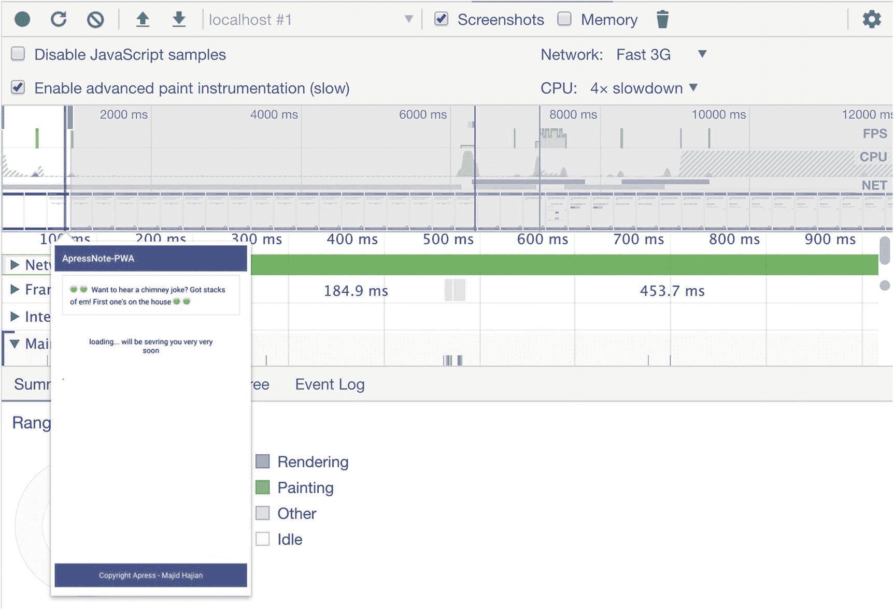

图 7-5

在我们实现了 Angular 应用外壳之后，大约 100 毫秒开始第一次绘制

### 通过 webpagetest.org 测量应用外壳性能

尽管我们已经通过 DevTools 中的 Chrome Performance 选项卡在本地服务器上运行了一次本地测试，但并不十分精确。Webpagetest.org 是一个工具，我们可以用它来衡量网站的性能，并生成有关测试的详细信息，包括许多对 web 应用优化有用的功能。

在部署新的应用 Shell 实现之前，让我们在 Firebase 上对我们的应用进行测试。

打开`webpagetest`网站，进入简单测试选项卡。输入你的网站名称，选择“**移动普通 3G** ”(见图 [7-6](#Fig6) )。选择“包括重复查看”和“运行 lighthouse 审计”您可以使用不同的设置运行更多的测试。最后，开始测试。

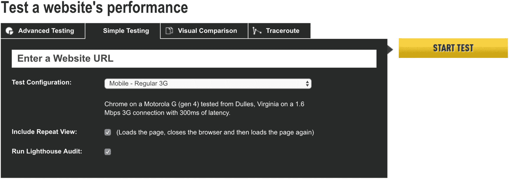

图 7-6

webpagetest.org 上的简单测试设置

一旦结果准备好，我们看到在应用外壳优化之前，交互时间约为 7.8 秒，浏览器开始渲染约为 6.9 秒，由于 bootstrapping Angular，这在某种程度上是意料之中的(见图 [7-7](#Fig7) )。要了解更多详情，请点击以下链接:

[T2`https://www.webpagetest.org/result/181030_ZA_ff4f3780bea8eb430be1171a5297ae35/`](https://www.webpagetest.org/result/181030_ZA_ff4f3780bea8eb430be1171a5297ae35/)


图 7-7

在移动常规 3G 网络上运行应用外壳和更多优化之前的网页测试结果

我将用应用外壳实现将应用部署到 Firebase。部署完成后，导航到网站并通过 Chrome 查看源代码。您将看到应用外壳和内联样式已经在源代码中。打开 webpagetest.org，再次运行完全相同的测试。

一旦结果准备就绪，就会看到显著的改进。与之前的测试相比，交互时间减少到了 5.9 秒，开始渲染时间至少减少了 2 秒。你会发现应用中的一个简单模型可能会对用户体验产生显著影响(见图 [7-8](#Fig8) )。


图 7-8

App Shell 后的 Webpagetest 结果，运行在移动常规 3G 网络上

要了解更多详情，请点击以下链接:

[T2`https://www.webpagetest.org/result/181031_KE_538b7df1cabf6cbe4a3565a3f6c42fc6/`](https://www.webpagetest.org/result/181031_KE_538b7df1cabf6cbe4a3565a3f6c42fc6/)

### 通过 Chrome DevTools 中的审计选项卡测量应用外壳性能

虽然 webpagetest.org 能够通过 Lighthouse 运行一个测试应用，但我想在我的机器上运行 Chrome DevTools 上的 web 应用来运行这项措施。记住，你做的测试越多越好。所以，不要放弃，在不同的工具上进行更多的测试。

当 Firebase 上的 web 应用加载时，只需打开 Chrome DevTools。转到您熟悉的审计选项卡，并选择性能复选框以及渐进式 Web 应用。确保选择*模拟快速 3G，4 倍 CPU 减速*进行节流，然后点击“运行审计”按钮。我将在使用应用外壳实现部署应用之前和之后进行此测试。你可以在图 [7-9](#Fig9) 到 [7-12](#Fig12) 中看到结果。

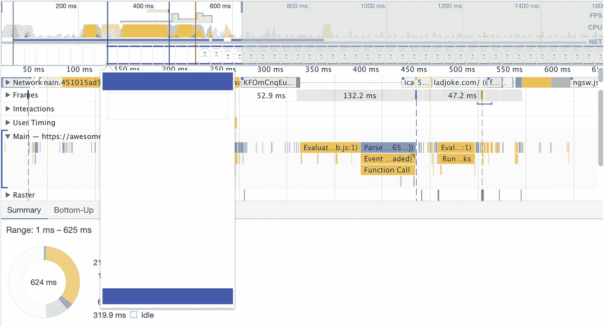

图 7-12

性能选项卡部署应用外壳实现后，在良好的互联网连接上进行测试，初始渲染时间约为 150 毫秒

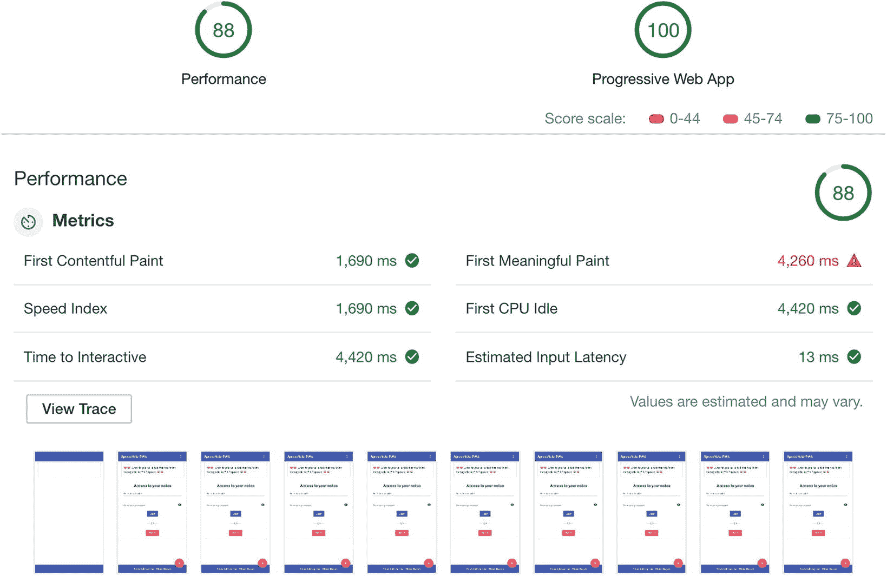

图 7-11

在 Chrome audit 选项卡中审核网站，以检查在模拟移动快速 3G 上部署 App Shell 实施后的性能得分

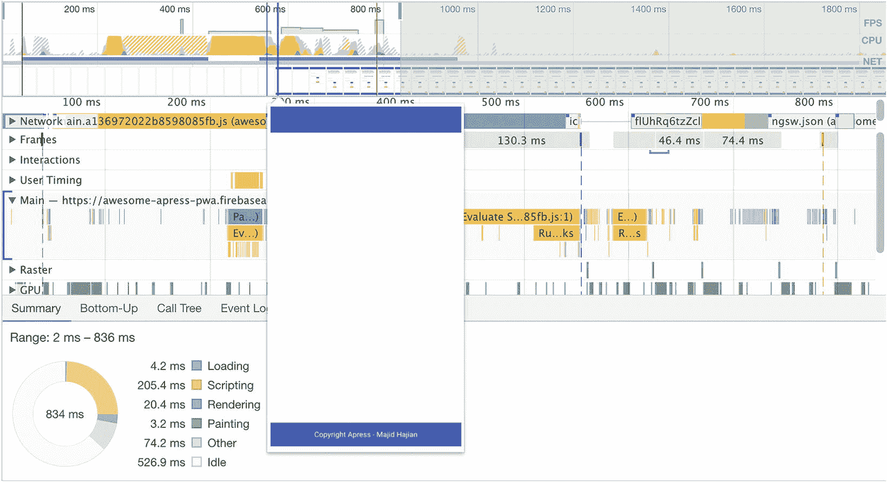

图 7-10

部署应用外壳实现之前的性能选项卡，在良好的互联网连接上进行测试，初始渲染大约需要 700 毫秒

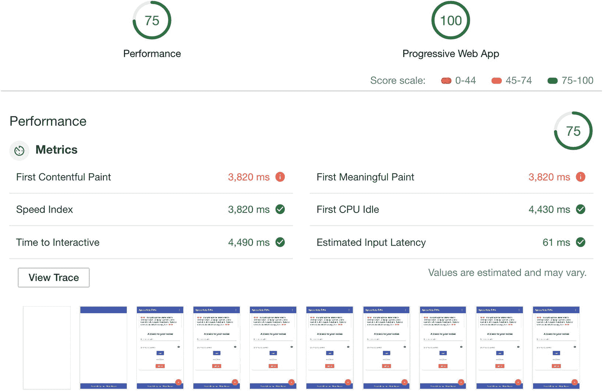

图 7-9

在模拟移动快速 3G 上部署应用外壳实施之前，在 Chrome 审计选项卡中审计网站以检查性能得分

正如我们所看到的，在这个特定的应用中，应用 Shell 对整个 SPA 的第一次油漆的典型时间进行了巨大的改进，这有时会让用户等待几秒钟。

尽管应用外壳模型是提高启动负载的一种方式，但它不是我们在应用中唯一可以做的事情。为了提高性能，我们可以在 web 应用中进行更多的优化，尤其是在 Angular 应用中。

## 除了应用外壳，进一步优化

我们知道，web apps 在性能感知上还在和原生 app 较劲；因此，每一次眨眼都很重要。我们可以在应用中尝试无数的技巧和窍门，来再挤出几毫秒的时间。

一般来说，Angular性能主要分为两个部分:

1.  运行时性能，以最佳实践为目标，主要改进变更检测和渲染相关的优化。

2.  网络性能，以最佳实践为目标，以提高我们的应用的加载时间，包括延迟和带宽减少。

web 开发中有一些常见的最佳实践，这两个部分都有所重叠。然而，在这一节中，我的重点是网络性能和更快的加载时间。为了提高加载速度，我将回顾一些最重要的技巧。

### 分析包大小和延迟加载模块

毫无疑问，包中的 JavaScript 代码越少，下载和解析就越好。Angular CLI 使用 Webpack 捆绑应用。通过在`build`命令中传递`--stats-json`，Angular CLI 将生成一个 JSON 文件，其中包含所有的包信息，我们可以简单地对其进行分析。

只需遵循以下步骤:

1.  用`npm install webpack-bundle-analyzer -D`安装工具

2.  在`packge.json`中添加`--stats-json`来构建脚本

    ```ts
    "build:prod": "ng build --prod --stats-json",

    ```

1.  向`package.json`文件添加新脚本

    ```ts
    "analyzer": "webpack-bundle-analyzer dist/stats.json"

    ```

1.  构建然后运行`npm run analyzer`

一旦构建完成，在`the /dist`文件夹中会有一个`stats.json`文件，包含关于项目包的所有信息。只要运行 npm 命令，你就会被重定向到浏览器，你会看到应用的统计信息，如图 [7-13](#Fig13) 所示。

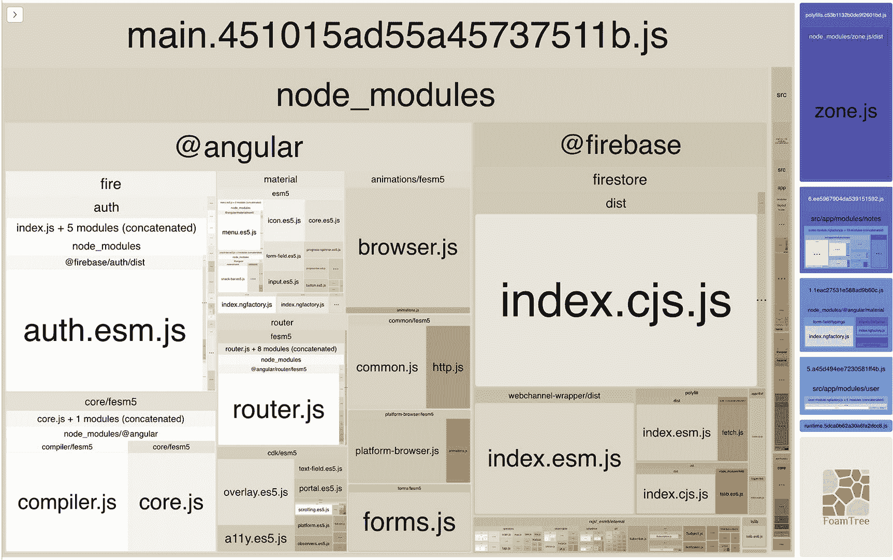

图 7-13

项目 app 分析；图片右侧显示了延迟加载的模块

分割代码以减小包大小的一种方法是使用Angular延迟加载。延迟加载通过将应用拆分为功能模块并按需加载，使您能够优化应用的加载时间。

```ts
  {
    path: 'user',
    loadChildren: './modules/user/user.module#UserModule'
  },
  {
    path: 'notes',
    loadChildren: './modules/notes/notes.module#NotesModule',
    canLoad: [AuthGuard]
  }

```

我们甚至可以基于某些条件阻止整个模块被加载。例如，在项目应用中，我们通过添加`canLoad` guard 来防止加载整个模块，如果根据 guard 中的规则有必要的话。

分析可能因应用而异，这取决于你如何设计你的应用。

### 来自网页测试的瀑布视图

瀑布视图揭示了许多有用的加载细节，可用于跟踪瓶颈:例如，阻碍呈现的东西，或者可以消除或推迟的请求。概述从初始请求到完成需要多长时间。关于 http 握手等有用的信息。例如，图 [7-14](#Fig14) 显示项目应用通过加载谷歌字体来渲染块，或者它延迟了 450 ms 左右的绘制，因为浏览器正在解析 CSS。

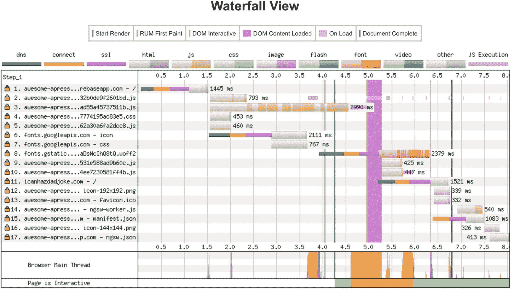

图 7-14

来自 webpagetest.org 的应用瀑布视图

### 减少渲染阻塞 CSS

这是一个常见的错误，在许多应用中，他们会加载大量的 CSS，而对于那些在屏幕上可以看到的内容或所谓的折叠内容来说是不必要的。

一般来说，我们应该确定什么对应用框架、应用外壳和初始加载至关重要，并将它们添加到 style.css 中。我们应该尽量减少初始样式文件的占用空间。

此外，我们应该在惰性加载模块中导入共享样式。有时，我们甚至需要将样式导入到那些需要特定样式的惰性加载模块中。例如，假设我们有一个已经被延迟加载的图表模块。如果这个模块需要一个特定的样式，我们应该只将它导入到这个模块中，它将在需要时被加载。

在一个真实的例子中，想想我们的应用，因为我们正在预渲染，应用 shell 和 Angular CLI 将把所有基本样式注入到`index.html`。将 Angular Material 主题 CSS 文件和我们的主`style.scss`文件移除到`AppComponent`中可能是有意义的，因为基本上整个应用都需要这些样式，我们可以简单地预渲染并将样式注入到 index.html 头部，这将导致移除阻止渲染的 style.css 捆绑文件。

```ts
// Angular.json
"styles": [
              {
                "input": "node_modules/@angular/material/prebuilt-themes/indigo-pink.css"
              },
              "src/styles.scss"
            ],

// remove these files and it looks like
"styles": [],

```

然后将它们导入`AppComponent`到`:`

```ts
//app.component.ts
@Component({
  selector: 'app-root',
  template: `
  <div class="appress-pwa-note">
    <app-header></app-header>
    <div class="main">
      <div *ngIf="joke$ | async as joke" class="joke">
      {{ joke }}
      </div>
      <router-outlet></router-outlet>
    </div>
    <app-footer></app-footer>
  </div>
  `,
  styleUrls: [
    '../../node_modules/@angular/material/prebuilt-themes/indigo-pink.css',
    '../../styles.scss'
  ]
})

```

现在，如果您构建应用，然后检查`/dist/index.html`，您将会看到所有的样式都已经添加到头部，不再有以前的 css 文件。

再说一次，这只是一个例子，我想告诉你如何优化你的应用；这可能对我们的笔记应用有意义，但似乎不是你下一个项目的好选择。请记住，您应该在每次更改后评估应用性能，看看是否有改进。

### 优化字体

很有可能你现在在网络应用中使用的是字体，尤其是谷歌字体等外部字体。当我们将样式链接添加到页面头部时，应该考虑到这些字体会阻碍渲染。这意味着渲染将推迟，直到这些样式被下载和渲染。重要的是要减少对字体的初始需求，并在需要时加载它们的重置。

#### 自托管字体

使用 web 字体外观块意味着，如果获取 web 字体需要很长时间，浏览器会决定如何处理。一些浏览器在回到系统字体之前会等待三秒钟，一旦下载完成，他们最终会换成系统字体。

我们正试图避免不可见的文本，因此多亏了名为`font-display`的新功能，这有助于根据网页字体交换所需的时间来决定它们如何呈现或后退。

交换给字体一个零秒的块周期和一个无限的交换周期。换句话说，如果下载需要时间，浏览器会用备用字体快速显示文本。一旦网络字体准备好了，它就要交换了。这个功能有很好的浏览器支持。 <sup>[1](#Fn1)</sup>

```ts
@font-face {
  font-family: YouFont;
  font-style: normal;
  font-display: swap;
  font-weight: 400;
  src: local(yo-font Regular'), local(YouFont -Regular'),
      /* Chrome 26+, Opera 23+, Firefox 39+ */
      url(you-font -v12-latin-regular.woff2') format('woff2'),
        /* Chrome 6+, Firefox 3.6+, IE 9+, Safari 5.1+ */
      url(you-font -v12-latin-regular.woff') format('woff');
}

```

在笔记应用的情况下，尽快向用户展示他们的笔记是有意义的，然后继续前进，一旦准备好就过渡到 web 字体。请记住，我们仍然会得到一个 **FOUT** <sup>[2](#Fn2)</sup> (无样式文本的闪烁)。

#### 基于 CDN 的字体

很明显，我们在笔记应用中使用了谷歌网络字体。有许多不同的方法来优化这些类型的字体。一种方法是将它们异步添加到 UI 中，这有助于避免块呈现。我们可以使用一些工具和库来延迟加载字体，但是最著名的库之一可能是 Web 字体加载器。 <sup>[3](#Fn3)</sup>

然而，我已经决定在我的 Angular 项目中以不同的方式加载我的字体，以便揭示两个属性，这两个属性有助于加载 JavaScript 文件，同时不会阻碍渲染。我已经创建了一个名为`lazy-fonts.js`的 JavaScript 文件，并将其添加到`/src`中，并将添加以下代码，这基本上是在文件头添加了一个脚本标签。

```ts
(function(d) {
  var x = d.createElement('link');
  var y = d.getElementsByTagName('script')[0];
  x.rel = 'stylesheet';
  x.href = 'https://fonts.googleapis.com/icon?family=Material+Icons';
  y.parentNode.insertBefore(x, y);
  })(document);

(function(d) {
  var x = d.createElement('link');
  var y = d.getElementsByTagName('script')[0];
  x.rel = 'stylesheet';
  x.href = 'https://fonts.googleapis.com/css?family=Roboto:300,400,500';
  y.parentNode.insertBefore(x, y);
})(document);

```

我还将删除应用中`index.html`文件中`<head>`之间的字体标签，并在`</body>`之前引用该文件。最后但同样重要的是，我将把这个文件添加到 Angular 配置文件的 assets 数组中，这告诉 Angular CLI 把这个文件从`src`文件夹复制到`dist`文件夹根目录。

```ts
// angular.json
"assets": [
              "src/favicon.ico",
              "src/assets",
              "src/manifest.json",
              "src/lazy-fonts.js"
            ],

```

和

```ts
// index.html
<script type="text/javascript" src="lazy-fonts.js"></script>
</body>

```

现代浏览器有几个额外的选项来防止脚本阻塞页面呈现过程。两个主要特征如下:

*   **defer 属性**:告诉浏览器在下载资源时继续渲染，但在完成 HTML 渲染之前不执行这个 JS 资源。换句话说，浏览器将等待脚本执行，直到渲染完全完成。对于`angular-cli`应用，目前没有办法在构建期间自动添加，所以你必须在构建之后手动添加。

*   **async 属性**:告诉浏览器在下载脚本资源的同时继续渲染只会暂停解析 HTML 来执行脚本。当您需要尽可能快地执行脚本，但又不阻止应用外壳的呈现时，这很有用。最好的例子是将它与 Google analytics 脚本一起使用，这些脚本通常独立于任何其他脚本。

因此，根据定义，我想将 async 添加到我的脚本文件中。

```ts
// index.html
<script type="text/javascript" src="lazy-fonts.js" async></script>
</body>

```

这将有助于渲染 HTML 而不会被脚本阻止，脚本还会将字体添加到应用中。

### 浏览器资源搜寻

你可能听说过`preload`、`prefetch,`和`preconnect`。最终，这些使 web 开发人员能够优化资源的交付，减少往返行程，并以比请求更快的速度获取资源。


图 7-17

撰写本书时的预连接浏览器支持

*   **Preload**: is a new standard to of how to gain more control on how resources should be fetched for current navigation. This directive is defined within a `<link>` element, `<link rel="preload">`. This allows the browser to set priority to prefetch even before the resource is reached. See Figure [7-15](#Fig15) for browser support.

    

    图 7-15

    截至撰写本书时，预加载浏览器支持

    ```ts
    <link rel="preload" href="https://example.com/fonts/font.woff" as="font" crossorigin>

    ```

*   **Prefetch**: is set as a low priority resource hint that informs the browser to fetch that particular resource in the background when the browser is idle. We use prefetch for those resources that may be needed later: for example, prefetch pictures that will need to be shown on the second navigation on the website. Element is defined similar to preload. See Figure [7-16](#Fig16) for browser support.

    

    图 7-16

    写这本书时预取浏览器支持

    ```ts
    <link rel="prefetch" href="/uploaimg/pic.png">

    ```

*   **预连接**:这允许浏览器在 HTTP 请求实际发送到服务器之前建立早期连接，包括 DNS 查找、TLS 协商和 TCP 握手。拥有这个资源提示的好处之一是消除了往返延迟，为用户节省了时间。在某些情况下，对于初始负载，它可以提高 400 ms。标签类似于 preload，在 HTML 中添加到头部。对通过 CDN 提供的字体等外部资源使用`preconnect`可能会增加加载时间。浏览器支持见图 [7-17](#Fig17) 。

    ```ts
      <link rel="preconnect" href="https://fonts.googleapis.com"crossorigin="anonymous">

    ```

由于我们在 PWA Note 项目中使用 Google 字体，添加资源会影响`preconnect`和`preload`并可能有助于加载性能。打开`src/index.html`，添加以下代码:

```ts
<head>
  <link rel="preconnect" href="https://fonts.googleapis.com" crossorigin="anonymous">
  <link rel="preconnect" href="https://fonts.gstatic.com" crossorigin="anonymous">
  <link rel="preload" href="https://fonts.googleapis.com/icon?family=Material+Icons" as="style">
  <link rel="preload" href="https://fonts.googleapis.com/css?family=Roboto:300,400,500" as="style">
  <link rel="preload" href="lazy-fonts.js" as="script">

```

一旦我们构建并部署到 Firebase，我们可以运行另一个测试来测量添加这些标记后的性能。您可能看不到巨大的改进，但即使 100 毫秒也很重要。记住，我们努力减少毫秒。

### 预加载有Angular的惰性加载模块

Angular 使我们能够预加载所有延迟加载的模块。这个特性是从 Angular Router 模块继承来的，在这里我们可以改变预加载策略。

虽然您可以编写一个自定义提供程序来定义预加载策略，但我使用的是已经包含在 Angular Router 模块中的`PreloadAllModules`。打开`app-routing.module.ts`并在`RouterModule`向`forRoot`添加第二个参数。

```ts
@NgModule({
  imports: [
    RouterModule.forRoot(routes, { preloadingStrategy: PreloadAllModules })
  ],
  providers: [AuthGuard],
  exports: [RouterModule]
})
export class AppRoutingModule {}

```

这允许浏览器甚至在模块被请求之前预取和缓存这些模块；因此，后续导航是即时的，而初始负载尽可能小。当我们的惰性加载模块非常大时，这可能特别有用。请记住，预加载不会影响初始负载性能。

### HTTP/2 服务器推送 <sup>[4](#Fn4)</sup>

HTTP/2 (h2)服务器推送是 HTTP 协议版本 2 中包含的性能特性之一。

只要所有的 URL 都通过相同的主机名和协议传送，web 服务器就可以提前将内容“推”给客户机，即使客户机没有请求它们。

让推送资源与 HTML 的交付竞争会影响页面加载时间。这可以通过限制推送的数量和大小来避免。

Firebase 允许我们通过配置位于项目根目录的`firebase.json`将内容推送到客户端。该规则类似于下面的代码:

```ts
"hosting": {
    "headers": [
      {
        "source": "/",
        "headers": [
          {
            "key": "Link",
            "value": "</lazy-fonts.js>;rel=preload;as=script,</css/any-file.css>;rel=preload;as=style"
          }
        ]
      }
    ],
}

```

虽然这个特性听起来很有前途，但是不要试图过度使用它。

## 摘要

App Shell 模式是提高初始加载速度的一种很好的方式，我们已经看到 Angular CLI 通过利用 Angular Universal 将为任何 Angular 项目生成合适的 app shell，只要它的架构良好。

我们优化我们的应用，以提高网络级别的性能，从而构建一个速度极快的应用。虽然我已经介绍了性能和优化方面的主要重要主题，但是您不会受到限制，应该更进一步，甚至进行更多的改进。像 Google Closure Compiler，Tree-shaking，Build-optimizer flag，Ivy Render Engine，Cache-control header，Gzip compression，HTTP/2 中的 Header compression，Compressing images，Change Detection optimization，Pure pipes 和 memoring，这些只是应用能走多远、能走多快的例子。

正如我提到的，渐进式改进是构建 PWAs 的最重要的关键之一。因此，在浏览器中实现具有功能检测的功能，始终牢记您的所有用户，迭代增强您的应用性能，并为您的用户提供最佳的集成和交互体验，无论他们使用什么浏览器。

在下一章中，我们将注意力转移到 PWA 的参与部分，看看如何向用户发送推送通知。

<aside class="FootnoteSection" epub:type="footnotes">Footnotes [1](#Fn1_source)

[T2`https://caniuse.com/#search=font-display`](https://caniuse.com/%2523search%253Dfont-display)

  [2](#Fn2_source)

[T2`https://en.wikipedia.org/wiki/Flash_of_unstyled_content`](https://en.wikipedia.org/wiki/Flash_of_unstyled_content)

  [3](#Fn3_source)

[T2`https://github.com/typekit/webfontloader`](https://github.com/typekit/webfontloader)

  [4](#Fn4_source)

[T2`https://en.wikipedia.org/wiki/HTTP/2_Server_Push`](https://en.wikipedia.org/wiki/HTTP/2_Server_Push)

 </aside>