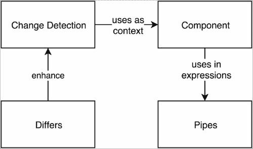
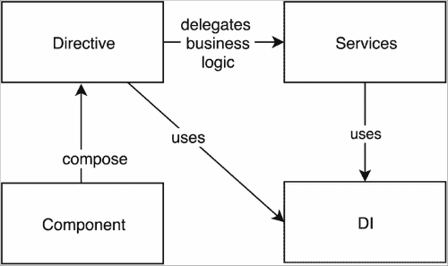
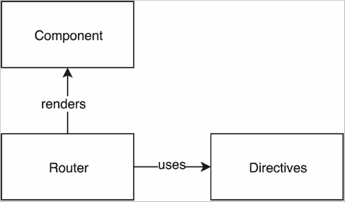
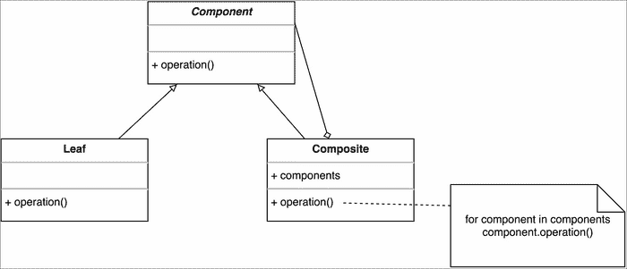

# 二、Angular 2 应用的构建块

在上一章中，我们研究了 Angular 2 背后设计决策的驱动因素。我们描述了导致开发全新框架的主要原因；Angular 2 利用了 web 标准，同时牢记了过去的经验教训。虽然我们熟悉主要的驱动程序，但我们仍然没有描述 Angular 2 的核心概念。该框架的上一个主要版本采用了与 AngularJS 1.x 不同的路径，并在用于开发单页应用的基本构建块中引入了许多更改。

在本章中，我们将介绍框架的核心，并简要介绍 Angular 2 的主要组件。本章的另一个重要目的是概述如何将这些概念组合在一起，以帮助我们为 web 应用构建专业的用户界面。以下各节将为我们提供一个概述，我们将在本书后面更详细地了解这些内容。

在本章中，我们将了解：

*   框架的概念概述，显示不同概念之间的关系。
*   如何将用户界面构建为组件的组合。
*   指令在 Angular 2 中采用了什么路径，以及它们的接口与框架的前一个主要版本相比是如何变化的。
*   强制分离关注点的原因，这导致将指令分解为两个不同的组件。为了更好地理解这两个概念，我们将演示其定义的基本语法。
*   概述改进的更改检测，以及它如何涉及指令提供的上下文。
*   区域是什么，以及为什么它们可以使我们的日常开发过程更容易。
*   管道是什么，它们与 AngularJS 1.x 过滤器的关系如何。
*   Angular 2 中全新的**依赖注入**（**DI**）机制及其与服务组件的关系。

# 角度 2 的概念概述

在我们深入研究 Angular 2 的不同部分之前，让我们先从概念上概述一下所有内容是如何组合在一起的。让我们看一下下图：


图 1

*图 1*至*图 4*展示了两个主要的角度概念以及它们之间的联系。这些图的主要目的是说明使用 Angular 2 构建单页应用的核心块及其关系。

**组件**是我们将使用 Angular 2 创建应用用户界面的主要构建块。该组件是指令的直接继承者，该指令是将行为附加到 DOM 的原语。组件通过提供更多的功能来扩展**指令**，例如带有附加模板的视图，该视图可用于呈现指令的组合。视图的模板内可以驻留不同的表达式。



图 2

前面的图从概念上说明了 Angular 2 的**变化检测**机制。它运行`digest`循环，该循环在特定 UI 组件的上下文中计算注册的表达式。由于作用域的概念已从 Angular 2 中删除，表达式的执行上下文是与其关联的组件的控制器。

**变化检测**机制可以通过**的不同**来增强；这就是为什么图表上这两个元素之间有直接关系。

**管道**是角 2 的另一个组件。我们可以将管道看作 AngularJS 1.x 中的过滤器。管道可以与组件一起使用。我们可以将它们包含在表达式中，这些表达式在任何组件的上下文中定义：



图 3

现在让我们来看看前面的图表。**指令**和**组件**将业务逻辑委托给**服务**。这加强了关注点、可维护性和代码的重用性的更好分离。**指令**使用框架的**DI**机制接收对声明为依赖项的特定服务实例的引用，并将业务相关逻辑的执行委托给它们。**指令**和**组件**都可以使用**DI**机制，不仅可以注入服务，还可以注入 DOM 元素和/或其他**组件**或**指令**。



图 4

最后，基于组件的路由器用于定义应用中的路由。由于**指令**没有模板，路由器只能呈现**组件**，代表我们应用中的不同视图。路由器还使用预定义的指令，这些指令允许我们定义不同视图和容器之间的超链接，在该容器中呈现这些视图。

现在，我们将更仔细地研究这些概念，看看它们是如何协同工作来创建 Angular2 应用的，以及它们是如何从 AngularJS 1.x 的前身改变过来的。

# 变更指令

AngularJS 1.x 在单页应用的开发中引入了指令的概念。指令的目的是封装与 DOM 相关的逻辑，并允许我们通过扩展 HTML 的语法和语义，将用户界面构建为此类组件的组成部分。最初，与大多数创新概念一样，指令被认为是有争议的，因为它们使我们在使用没有[T0]前缀的自定义元素或属性时容易编写无效的 HTML。然而，随着时间的推移，这一概念逐渐被接受，并证明它将继续存在。

AngularJS 1.x 中实现指令的另一个缺点是我们使用它们的方式不同。这需要了解属性值，可以是文字、表达式、回调或微语法。这使得工具在本质上是不可能的。

Angular2 保留了指令的概念，但从 AngularJS 1.x 中吸取了最好的部分，并添加了一些新的思想和语法。Angular 2 指令的主要目的是通过使用 ES2015 类中定义的自定义逻辑对 DOM 进行扩展，从而将行为附加到 DOM。我们可以将这些类视为与指令关联的控制器，并将它们的构造函数视为类似于 AngularJS 1.x 中指令的链接函数。然而，新指令的可配置性有限。它们不允许定义模板，这使得大多数用于定义指令的已知属性变得不必要。指令 API 的简单性并没有限制它们的行为，只是加强了关注点的分离。为了补充这个更简单的指令 API，Angular 2 为 UI 元素的定义引入了更丰富的接口，称为 components。组件通过`Component`元数据允许指令拥有一个模板，从而扩展了指令的功能。稍后我们将进一步了解组件。

Angular 2 指令使用的语法涉及 ES2016 装饰符。但是，我们也可以使用 TypeScript、ES2015、甚至**ECMAScript**5（**ES5**等）来实现同样的结果，只需稍微多输入一点。以下代码定义了一个用 TypeScript 编写的简单指令：

```ts
@Directive({
  selector: '[tooltip]'
})
export class Tooltip {
  private overlay: Overlay;
  @Input()
  private tooltip: string;
  constructor(private el: ElementRef, manager: OverlayManager) {
    this.overlay = manager.get();
  }
  @HostListener('mouseenter')
  onMouseEnter() {
    this.overlay.open(this.el.nativeElement, this.tooltip);
  }
  @HostListener('mouseleave')
  onMouseLeave() {
    this.overlay.close();
  }
}
```

指令可与我们模板中的以下标记一起使用：

```ts
<div tooltip="42">Tell me the answer!</div>
```

一旦用户指向标签`Tell me the answer!`，Angular 将调用该方法，该方法在指令定义中的`@HostListener`装饰符下定义。最后，将执行覆盖管理器的 open 方法。因为我们可以在一个元素上有多个指令，所以最佳实践表明我们应该使用一个属性作为选择器。

本指令定义的另一种 ECMAScript 5 语法为：

```ts
var Tooltip = ng.core.Directive({
  selector: '[tooltip]',
  inputs: ['tooltip'],
  host: {
    '(mouseenter)': 'onMouseEnter()',
    '(mouseleave)': 'onMouseLeave()'
  }
})
.Class({
  constructor: [ng.core.ElementRef, Overlay, function (tooltip, el, manager) {
    this.el = el;
    this.overlay = manager.get();
  }],
  onMouseEnter() {
    this.overlay.open(this.el.nativeElement, this.tooltip);
  },
  onMouseLeave() {
    this.overlay.close();
  }
});
```

前面的 ES5 语法演示了 Angular 2 提供的内部 JavaScript**领域特定语言**（**DSL**），以允许我们在没有语法的情况下编写代码，而现代浏览器尚不支持这种语法。

我们可以总结，Angular 2 通过保持将行为附加到 DOM 的思想，保留了指令的概念。x 和 2 之间的核心区别在于新的语法，以及通过引入组件来进一步分离关注点。在[第 4 章](4.html#164MG1-a118c4c18dd64e8ab73e171b466b6582 "Chapter 4. Getting Started with Angular 2 Components and Directives")、*开始学习 Angular 2 组件和指令*中，我们将进一步了解指令的 API。我们还将使用 ES2016 和 ES5 比较指令的定义语法。现在，让我们来看一下角 2 分量的巨大变化。

# 了解角度 2 组件

**模型视图控制器**（**MVC**是最初为实现用户界面而引入的一种微架构模式。作为 AngularJS 开发人员，我们每天都会使用此模式的不同变体，最常见的是**模型视图模型**（**MVVM**。在 MVC 中，我们有封装应用业务逻辑的模型和负责呈现用户界面、接受用户输入以及将用户交互逻辑委托给控制器的视图。该视图表示为组件的组成，正式名称为**复合设计模式**。

让我们看看下面的结构图，它显示了复合设计模式：



图 5

这里我们分为三类：

*   一个名为`Component`的抽象类。
*   两个具体类别分别称为`Leaf`和`Composite`。`Leaf`类是我们即将构建的组件树中的一个简单终端组件。

`Component`类定义了一个名为`operation`的抽象操作。`Leaf`和`Composite`都继承自`Component`类。然而，`Composite`类也拥有对它的引用。我们可以更进一步，允许`Composite`拥有`Component`实例的引用列表，如图所示。`Composite`中的组件列表可以包含对不同`Composite`或`Leaf`实例的引用，或对扩展`Component`类或其任何后续类的其他类的实例的引用。在方法`operation`的实现中，在`Composite`内部，循环中不同实例的调用操作可以表现出不同的行为。这是因为在面向对象编程语言中用于实现多态性的后期绑定机制。

## 运行中的部件

理论够了！让我们根据图中所示的类层次结构构建一个组件树。这样，我们将演示如何通过使用简化的语法利用复合模式构建用户界面。我们将在[第 4 章](4.html#164MG1-a118c4c18dd64e8ab73e171b466b6582 "Chapter 4. Getting Started with Angular 2 Components and Directives")*Angular 2 组件和指令入门*中的 Angular 2 上下文中看一个类似的例子：

```ts
Composite c1 = new Composite();
Composite c2 = new Composite();
Composite c3 = new Composite();

c1.components.push(c2);
c1.components.push(c3);

Leaf l1 = new Leaf();
Leaf l2 = new Leaf();
Leaf l3 = new Leaf();

c2.components.push(l1);
c2.components.push(l2);

c3.components.push(l3);
```

前面的伪代码创建了`Composite`类的三个实例和`Leaf`类的三个实例。实例`c1`在组件列表中包含对`c2`和`c3`的引用。实例`c2`包含对`l1`和`l2`的引用，`c3`包含对`l3`的引用：


图 6

上图是我们在代码段中构建的组件树的图形表示。这是一个相当简化的版本，与现代 JavaScript 框架中的视图类似。但是，它说明了如何组合指令和组件的基本原理。例如，在 Angular 2 的上下文中，我们可以将指令视为前面的`Leaf`类的实例（因为它们没有自己的视图，因此无法组成其他指令和组件），而将组件视为`Composite`类的实例。

如果我们更抽象地考虑 AngularJS 1.x 中的用户界面，我们可以注意到我们使用了非常类似的方法。我们视图的模板将不同的指令组合在一起，以便向应用的最终用户提供功能齐全的用户界面。

## 角度 2 中的组件

Angular 2 采用了这种方法，引入了名为**组件**的新构建块。组件扩展了我们在上一节中描述的指令概念，并提供了更广泛的功能。以下是基本`hello-world`组件的定义：

```ts
@Component({
  selector: 'hello-world',
  template: '<h1>Hello, {{this.target}}!</h1>'
})
class HelloWorld {
  target: string;
  constructor() {
    this.target = 'world';
  }
}
```

我们可以通过在视图中插入以下标记来使用它：

```ts
<hello-world></hello-world>
```

根据最佳实践，我们应该使用元素作为组件的选择器，因为每个 DOM 元素可能只有一个组件。

使用 DSL 的替代 ES5 语法为：

```ts
var HelloWorld = ng.core.
  Component({
    selector: 'hello-world',
    template: '<h1>Hello, {{target}}!</h1>'
  })
  .Class({
    constructor: function () {
      this.target = 'world';
    }
  });
```

我们将在本书后面更详细地了解前面的语法。但是，让我们简要描述一下该组件提供的功能。Angular 2 应用启动后，它将查看 DOM 树的所有元素并对其进行处理。一旦找到名为`hello-world`的元素，它将调用与其定义相关联的逻辑，这意味着将呈现组件的模板，并计算花括号之间的表达式。这将导致标记[T1]。

综上所述，AngularJS 核心团队将 AngularJS 1.x 中的指令分为两部分——**组件**和**指令**。指令提供了一种无需定义视图即可将行为附加到 DOM 元素的简单方法。Angular 2 中的组件提供了一个功能强大但易于学习的 API，它使我们更容易定义应用的用户界面。AngularJS 2 组件允许我们做与 AngularJS 1.x 指令相同的惊人事情，但需要的输入和学习的内容更少。组件通过向其添加视图来扩展 Angular 2 指令概念。我们可以从*图 5*中看到的图表中，以与`Composite`和`Leaf`之间的关系相同的方式来思考角度 2 分量和指令之间的关系。

如果我们开始说明 Angular 2 提供的构建块的概念模型，我们可以将指令和组件之间的关系表示为继承。[第 4 章](4.html#164MG1-a118c4c18dd64e8ab73e171b466b6582 "Chapter 4. Getting Started with Angular 2 Components and Directives")、*Angular 2 组件和指令入门*更详细地描述了这两个概念。

# 管道

在商业应用中，我们经常需要对同一数据段进行不同的可视化表示。例如，如果我们有数字 100000，并且我们想要将其格式化为货币，那么我们很可能不希望将其显示为普通数据；更有可能的是，我们想要 10 万美元左右。

AngularJS 1.x 中格式化数据的职责分配给了过滤器。数据格式要求的另一个例子是当我们使用项目集合时。例如，如果我们有一个项目列表，我们可能希望根据谓词（布尔函数）对其进行过滤；在数字列表中，我们可能只想显示素数。AngularJS 1.x 有一个名为`filter`的过滤器，它允许我们这样做。然而，名称的重复常常导致混淆。这也是核心团队将过滤器组件重命名为**管道**的另一个原因。

新名称背后的动机是用于管道和过滤器的语法：

```ts
{{expression | decimal | currency}}
```

在前面的示例中，我们将管道`decimal`和`currency`应用于`expression`返回的值。大括号之间的整个表达式看起来像 Unix 管道语法。

## 定义管道

定义管道的语法与用于定义指令和组件的语法类似。在中，为了创建新管道，我们可以使用 ES2015 装饰器`@Pipe`。它允许我们向类添加元数据，并将其声明为管道。我们需要做的就是为管道提供一个名称并定义数据格式化逻辑。还有另一种 ES5 语法，如果我们想跳过透明过程，可以使用它。

在运行时，一旦 Angular 2 表达式解释器发现给定表达式包含管道调用，它将从组件内分配的管道集合中检索该表达式，并使用适当的参数调用它。

以下示例说明了如何定义一个名为`lowercase1`的简单管道，该管道将给定字符串作为参数传递到其小写表示形式：

```ts
@Pipe({ name: 'lowercase1' })
class LowerCasePipe1 implements PipeTransform {
  transform(value: string): string {
    if (!value) return value;
    if (typeof value !== 'string') {
      throw new Error('Invalid pipe value', value);
    }
    return value.toLowerCase();
  }
}
```

为了保持一致，让我们展示用于定义管道的 ECMAScript 5 语法：

```ts
var LowercasePipe1 = ng.core.
  Pipe({
    name: 'lowercase'
  })
  .Class({
    constructor: function () {},
    transform: function (value) {
      if (!value) return value;
      if (typeof value === 'string') {
        throw new Error('Invalid pipe value', value);
      }
      return value.toLowerCase();
    }
  });
```

在 TypeScript 语法中，我们实现了`PipeTransform`接口，并定义了其中声明的`transform`方法。但是，在 ECMAScript 5 中，我们不支持接口，但是我们仍然需要实现`transform`方法，以便定义有效的 Angular 2 管道。我们将在下一章中解释 TypeScript 接口。

现在让我们来演示如何在组件中使用`lowercase1`管道：

```ts
@Component({
  selector: 'app',
  pipes: [LowercasePipe1],
  template: '<h1>{{"SAMPLE" | lowercase1}}</h1>'
})
class App {}
```

另外，ECMAScript 5 的另一种语法是：

```ts
var App = ng.core.Component({
  selector: 'app',
  pipes: [LowercasePipe1],
  template: '<h1>{{"SAMPLE" | lowercase1}}</h1>'
})
.Class({
  constructor: function () {}
});
```

我们可以使用带有以下标记的`App`组件：

```ts
   <app></app>
```

我们将在屏幕上看到的结果是`h1`元素中的文本样本。

Angular 2 将数据格式化逻辑保持为一个单独的组件，从而保持贯穿始终的关注点的强烈分离。我们将在[第 7 章](7.html#21PMQ2-a118c4c18dd64e8ab73e171b466b6582 "Chapter 7. Explaining Pipes and Communicating with RESTful Services")*中了解如何为我们的应用定义有状态和无状态管道，在探索管道和 http*的同时构建一个真实的应用。

# 变更检测

如前所述，MVC 中的视图根据从模型接收到的更改事件进行自我更新。一个数量的**模型视图**（**MVW**框架采用了这种方法，并将观察者模式嵌入其变化检测机制的核心。

## 经典变化检测

让我们来看看一个简单的例子，它不使用任何框架。假设我们有一个名为`User`的模型，它有一个名为`name`的属性：

```ts
class User extends EventEmitter {
  private name: string;
  setName(name: string) {
    this.name = name;
    this.emit('change');
	}
  getName(): string {
    return this.name;}
}
```

前面的代码段使用 TypeScript。如果您对语法不熟悉，请不要担心，我们将在下一章介绍该语言。

[T0]类扩展了类[T1]。这为发送和订阅事件提供了原语。

现在，让我们定义一个视图，它显示`User`类的一个实例的名称，作为参数传递给它的`constructor`：

```ts
class View {
  constructor(user: User, el: Element /* a DOM element */) {
    el.innerHTML = user.getName();
	}
}
```

我们可以通过以下方式初始化视图元素：

```ts
let user = new User();
user.setName('foo');
let view = new View(user, document.getElementById('label'));
```

最终结果是，用户将看到一个带有内容的标签`foo`。但是，视图不会反映用户的更改。为了在用户名称更改时更新视图，我们需要订阅更改事件，然后更新 DOM 元素的内容。我们需要通过以下方式更新`View`定义：

```ts
class View {
  constructor(user:User, el:any /* a DOM element */) {
    el.innerHTML = user.getName();
    user.on('change', () => {
      el.innerHTML = user.getName();
	  });
  }
}
```

在 AngularJS 1.x 时代之前，大多数框架都是这样实现变更检测的。

## AngularJS 1.x 变化检测

大多数初学者对 AngularJS 1.x 中的数据绑定机制着迷。Hello World 的基本示例如下所示：

```ts
function MainCtrl($scope) {
  $scope.label = 'Hello world!';
}

<body ng-app ng-controller="MainCtrl">
  {{label}}
</body>
```

如果您运行此操作，[T0]会神奇地出现在屏幕上。然而，这甚至不是最令人印象深刻的事情！如果我们添加文本输入并将其绑定到范围的`label`属性，则每次更改都将反映插值指令显示的内容：

```ts
<body ng-controller="MainCtrl">
  <input ng-model="label">
  {{label}}
</body>
```

真是太棒了！这是 AngularJS 1.x 的主要卖点之一，即实现数据绑定的极端简单性。我们在标记中添加两个（如果我们计算`ng-controller`和`ng-app`属性，则添加四个）属性，将属性添加到一个名为`$scope`的神秘对象，该对象神奇地传递给我们定义的自定义函数，一切都很简单！

然而，经验更丰富的 Angular 开发者对场景背后的实际情况有更好的理解。在前面的示例中，在指令`ng-model`和`ng-bind`（在我们的例子中是插值指令`{{}}`）中，Angular 添加了具有与相同表达式`label`相关联的不同行为的观察者。这些观察者与经典 MVC 模式中的观察者非常相似。在某些特定事件上（在我们的例子中，文本输入内容的更改），AngularJS 将遍历所有此类观察者，在给定范围的上下文中计算与它们相关的表达式，并存储它们的结果。这个循环称为`digest`循环。

在前面的示例中，范围上下文中表达式 label 的求值将返回文本`Hello world!`。在每次迭代中，AngularJS 将比较当前的计算结果和以前的结果，如果值不同，将调用相关的回调。例如，interpolation 指令添加的回调将把元素的内容设置为表达式计算的新结果。这是两个指令的观察者的回调之间的依赖关系的示例。`ng-model`添加的观察者的回调修改了与插值指令添加的观察者相关联的表达式的结果。

然而，这种方法有其自身的缺点。我们说过，`digest`循环将在某些特定事件上被调用，但是如果这些事件发生在框架之外，例如，会怎么样？如果我们使用`setTimeout`并在回调中（作为第一个参数传递），我们会更改附加到我们正在监视的范围的属性吗？AngularJS 将不知道该更改，并且不会调用`digest`循环，因此我们需要使用`$scope.$apply`显式地执行该操作。但是，如果框架知道浏览器中发生的所有异步事件，例如用户事件、`XMLHttpRequest`事件、`WebSockets`相关事件以及其他事件，该怎么办？在这种情况下，AngularJS 将能够拦截事件的处理，并可以调用摘要循环，而无需强制我们这样做！

### 在 zone.js 中

这正是 Angular 2 中的情况。此功能通过使用`zone.js`的区域实现。

在 2014 年的 ng conf 上，布赖恩·福特（Brian Ford）发表了关于区域的演讲。Brian 将区域表示为浏览器 API 的元猴子补丁。最近，Miško Hevery 建议 TC39 更成熟的区域 API 进行标准化。`Zone.js`是 Angular 团队开发的一个库，用 JavaScript 实现区域。它们代表一个执行上下文，允许我们拦截异步浏览器调用。基本上，通过使用区域，我们能够在给定的`XMLHttpRequest`完成后或当我们收到新的`WebSocket`事件时调用一段逻辑。Angular 2 通过截获异步浏览器事件并在正确的时间调用`digest`循环来利用`zone.js`。这完全消除了开发者使用 Angular 函数显式调用`digest`循环的需要。

### 简化数据流

交叉观察者依赖可能会在我们的应用中创建一个混乱的数据流，这很难理解。这可能会导致不可预测的行为和错误，很难找到。尽管 Angular 2 将脏检查作为实现更改检测的一种方式，但它强制执行单向数据流。这是通过禁止不同观察者之间的依赖关系实现的，这允许`digest`循环只运行一次。此策略显著提高了应用的性能，并降低了数据流的复杂性。Angular 2 还改进了内存效率和[T1]循环的性能。有关 Angular 2 的变化检测和用于实施的不同策略的更多详细信息，请参见[第 4 章](4.html#164MG1-a118c4c18dd64e8ab73e171b466b6582 "Chapter 4. Getting Started with Angular 2 Components and Directives")、*Angular 2 组件和指令入门*。

## 增强 AngularJS 1.x 的变化检测

现在让我们后退一步，思考框架的变化检测机制。

我们说过，在`digest`循环中，Angular 对注册的表达式求值，并将求值值与值进行比较，后者与循环上一次迭代中的相同表达式相关。

用于比较的最佳算法可能因表达式计算返回的值的类型而异。例如，如果我们得到一个可变的项目列表，我们需要在整个集合上循环，并逐个比较集合中的项目，以验证是否有更改。然而，如果我们有一个不可变的列表，我们可以通过比较引用来执行具有恒定复杂性的检查。这是因为不可变数据结构的实例无法更改。我们将获得一个应用了修改的新引用，而不是应用一个打算修改此类实例的操作。

在 AngularJS 1.x 中，我们可以使用一些方法添加观察者。其中两个是`$watch(exp, fn, deep)`或`$watchCollection(exp, fn)`。这些方法为我们提供了对更改检测执行相等性检查的方式的某种程度的控制。例如，通过使用`$watch`添加观察者并将`false`值作为第三个参数传递，将使 AngularJS 执行引用检查（即使用`===`将当前值与前一个值进行比较）。但是，如果我们传递一个 truthy（任何[T5]值），检查将是深入的（即使用[T6]）。这样，根据表达式值返回的预期类型，我们可以以最合适的方式添加侦听器，以便允许框架使用可用的最佳算法执行相等性检查。此 API 有两个限制：

*   它不允许您在运行时选择最合适的相等性检查算法。
*   它不允许您将更改检测扩展到第三方的特定数据结构。

Angular core 团队将此职责分配给了 Different，允许他们根据我们在应用中使用的数据扩展更改检测机制并对其进行优化。Angular 2 定义了两个基类，我们可以扩展它们来定义自定义算法：

*   `KeyValueDiffer`：这允许我们对基于键值的数据结构执行高级差异化。
*   `IterableDiffer`：这允许我们在类似列表的数据结构上执行高级差异化。

Angular 2 允许我们通过使用自定义算法扩展变更检测机制，从而完全控制变更检测机制，这在以前版本的框架中是不可能的。我们将在[第 4 章](4.html#164MG1-a118c4c18dd64e8ab73e171b466b6582 "Chapter 4. Getting Started with Angular 2 Components and Directives")、*Angular 2 组件和指令入门*中进一步探讨更改检测以及如何配置它。

# 理解服务

服务是 Angular 为应用的业务逻辑定义提供的构建块。在 AngularJS 1.x 中，我们有三种不同的定义服务的方法：

```ts
// The Factory method
module.factory('ServiceName', function (dep1, dep2, …) {
  return {
    // public API
  };
});

// The Service method
module.service('ServiceName', function (dep1, dep2, …) {
  // public API
  this.publicProp = val;
});

// The Provider method
module.provider('ServiceName', function () {
  return {
    $get: function (dep1, dep2, …) {
      return {
        // public API
      };
    }
  };
});
```

尽管前两个语法变体提供了类似的功能，但它们在实例化已注册指令的方式上有所不同。第三种语法允许在配置期间进一步配置注册的提供程序。

对于 AngularJS 1.x 初学者来说，有三种不同的定义服务的方法是相当混乱的。让我们考虑一下，是什么需要引入这些注册服务的方法。为什么我们不能简单地使用 JavaScript 构造函数、对象文本或 ES2015 类，而 Angular 不会意识到这一点？我们可以将业务逻辑封装在自定义 JavaScript 构造函数中，如下所示：

```ts
function UserTransactions(id) {
  this.userId = id;
}
UserTransactions.prototype.makeTransaction = function (amount) {
  // method logic
};

module.controller('MainCtrl', function () {
  this.submitClick = function () {
    new UserTransactions(this.userId).makeTransaction(this.amount);
  };
});
```

此代码完全有效。但是，它没有利用 AngularJS 1.x 提供的 DI 机制的关键特性之一。`MainCtrl`函数使用构造函数`UserTransaction`，该构造函数在其主体中可见。上述代码有两个主要缺陷：

*   我们结合了用于服务实例化的逻辑。
*   该代码是不可测试的。为了模仿`UserTransactions`，我们需要用猴子来修补它。

AngularJS 如何处理这两件事？当需要一个给定的服务时，通过框架的 DI 机制，AngularJS 解析它的所有依赖项，并通过将它们传递给`factory`函数来实例化它，该函数封装了创建它的逻辑。`factory`函数作为第二个参数传递给`factory`和`service`方法。`provider`方法允许定义较低级别的服务；其中的`factory`方法是提供者的`$get`属性下的方法。

就像 AngularJS 1.x 一样，Angular2 也容忍这种关注点分离，因此核心团队保留了服务。与 AngularJS 1.x 不同，框架的最后一个主要版本通过允许我们使用普通的 ES2015 类或 ES5 构造函数，为服务的定义提供了一个简单得多的接口。我们无法逃避这样一个事实，即我们需要明确地声明哪些服务应该可用于注入，并以某种方式为它们的实例化指定指令。然而，Angular2 为此使用 ES2016 装饰器的语法，而不是 AngularJS 1.x 中我们熟悉的方法。这使我们能够在应用中定义与 ES2015 类一样简单的服务，并使用装饰器配置 DI：

```ts
import {Inject, Injectable} from 'angular2/core';

@Injectable()
class HttpService {
  constructor() { /* … */ }
}

@Injectable()
class User {
  constructor(private service: HttpService) {}
  save() {
    return this.service.post('/users')
      .then(res => {
        this.id = res.id;
        return this;
      });
  }
}
```

另一种 ECMAScript 5 语法是：

```ts
var HttpService = ng.core.Class({
  constructor: function () {}
});
var User = ng.core.Class({
  constructor: [HttpService, function (service) {
    this.service = service;
  }],
  save: function () {
    return this.service.post('/users')
      .then(function (res) {
        this.id = res.id;
        return this;
      });
  }
});
```

服务与前面章节中描述的组件和指令相关。为了开发高度一致且可重用的 UI 组件，我们需要将所有与业务相关的逻辑转移到服务内部。而且，为了开发可测试组件，我们需要利用 DI 机制来解决它们的所有依赖关系。

Angular2 和 AngularJS 1.x 中的服务之间的一个核心区别是它们的依赖关系在内部被解析和表示的方式。AngularJS 1.x 使用字符串来标识不同的服务以及用于实例化的关联工厂。但是，Angular 2 使用关键点。通常，密钥是不同服务的类型。实例化中的另一个核心区别是注入器的层次结构，它封装了具有不同可见性的不同依赖项提供程序。

框架最后两个主要版本中的服务之间的另一个区别是简化的语法。尽管 Angular 2 使用 ES2015 类来定义我们的业务逻辑，但您也可以使用 ECMAScript 5`constructor`函数，或者使用框架提供的 DSL。Angular 2 中的 DI 具有完全不同的语法，并通过提供注入依赖项的一致方式改进了行为。上例中使用的语法使用 ES2016 装饰符，在[第 5 章](5.html#1LCVG1-a118c4c18dd64e8ab73e171b466b6582 "Chapter 5. Dependency Injection in Angular 2")、*Angular 2*中的依赖项注入中，我们将了解使用 ECMAScript 5 的替代语法。您还可以在[第 5 章](5.html#1LCVG1-a118c4c18dd64e8ab73e171b466b6582 "Chapter 5. Dependency Injection in Angular 2")中找到 Angular 2 服务和 DI 的更详细解释，在中找到*依赖注入。*

# 了解新的基于组件的路由器

在传统的 web 应用中，所有页面更改都与完整页面重新加载相关联，重新加载将获取所有引用的资源和数据，并将整个页面呈现在屏幕上。然而，web 应用的需求随着时间的推移而不断变化。

**单页应用**（**SPAs**），我们使用 Angular simulate desktop 用户体验构建。这通常涉及应用所需资源和数据的增量加载，并且在初始页面加载后不会重新加载整个页面。SPA 中的不同页面或视图通常由不同的模板表示，这些模板异步加载并呈现在屏幕上的特定位置。稍后，当加载包含所有必需资源的模板并更改路由时，将调用附加到所选页面的逻辑并用数据填充模板。如果用户在 SPA 中的给定页面加载后按下刷新按钮，则在视图刷新完成后，需要重新呈现相同的页面。这涉及到查找请求的视图、获取包含所有引用资源的所需模板以及调用与该视图关联的逻辑的类似行为。

需要获取的模板以及页面成功重新加载后应调用的逻辑取决于用户按下刷新按钮之前选择的视图。框架通过解析页面 URL 来确定这一点，该 URL 包含层次结构中表示的当前所选页面的标识符。

所有与导航、更改 URL、加载适当的模板以及在加载视图时调用特定逻辑相关的职责都分配给路由器组件。这是一些相当具有挑战性的任务，支持跨浏览器兼容性所需的不同导航 API 使得在现代 SPA 中实现路由成为一个非常重要的问题。

AngularJS 1.x 在其核心中引入了路由器，该路由器后来被外部化到`ngRoute`组件中。通过为每个页面提供一个模板，以及在选择页面时需要调用的一段逻辑，它允许以声明方式定义 SPA 中的不同视图。然而，路由器的功能是有限的。它不支持嵌套视图布线等基本功能。这也是大多数开发者喜欢使用社区开发的`ui-router`的原因之一。AngularJS 1.x 的路由器和`ui-router`路由定义都包含一个路由配置对象，它定义了一个模板和一个与页面关联的控制器。

如前面章节所述，Angular 2 改变了其为 SPA 开发提供的构建块。Angular 2 删除浮动控制器，而是将视图表示为组件的组合。这就需要开发一种全新的路由器，使这些新概念得以实现。

AngularJS 1.x 路由器和 Angular 2 路由器之间的核心区别是：

*   Angular 2 路由器是基于组件的，`ngRoute`不是。
*   现在支持嵌套视图。
*   ES2016 decorators 授权的不同语法。

## 角度 2 路线定义语法

让我们简单地看看 OUT1 T1 角 2 Ty2T2 路由器使用的新语法来定义我们的应用中的路由：

```ts
import {Component} from 'angular2/core';
import {bootstrap} from 'angular2/platform/browser';
import {RouteConfig, ROUTER_DIRECTIVES, ROUTER_BINDINGS} from 'angular2/router';

import {Home} from './components/home/home';
import {About} from './components/about/about';

@Component({
  selector: 'app',
  templateUrl: './app.html',
  directives: [ROUTER_DIRECTIVES]
})
@RouteConfig([
  { path: '/', component: Home, name: 'home' },
  { path: '/about', component: About, name: 'about' }
])
class App {}

bootstrap(App, [ROUTER_PROVIDERS]);
```

由于[第 6 章](6.html#1R42S1-a118c4c18dd64e8ab73e171b466b6582 "Chapter 6. Working with the Angular 2 Router and Forms")、*Angular 2 forms 以及新的基于组件的路由器*和[第 7 章](7.html#21PMQ2-a118c4c18dd64e8ab73e171b466b6582 "Chapter 7. Explaining Pipes and Communicating with RESTful Services")、*在探索管道和 http*的同时构建一个真实应用，我们在这里不做太多的详细介绍，但是让我们提到前面代码片段中的要点。

路由器位于模块`angular2/router`中。在那里，我们可以找到它定义的指令，用于路由的配置和`ROUTER_PROVIDERS`的装饰器。

### 注

我们将进一步了解[第 7 章](7.html#21PMQ2-a118c4c18dd64e8ab73e171b466b6582 "Chapter 7. Explaining Pipes and Communicating with RESTful Services")中的`ROUTER_PROVIDERS`，*在探索管道和 http*的同时构建一个真实的应用。

传递给`@RouteConfig`装饰器的参数显示了我们如何在应用中定义路由。我们使用带有对象的数组，该数组定义路由和与路由关联的组件之间的映射。在`Component`装饰器中，我们明确表示希望使用`ROUTER_DIRECTIVES`中包含的指令，这些指令与模板中路由器的使用有关。

# 总结

在本章中，我们快速概述了 Angular 2 提供的开发 SPA 的主要构建块。我们指出了 AngularJS 1.x 和 AngularJS 2 中这些组件之间的核心区别。

尽管我们可以使用 ES2015，甚至 ES5 来构建 Angular 2 应用，但谷歌的建议是利用用于开发框架类型脚本的语言。

在下一章中，我们将了解 TypeScript，以及如何在下一个应用中开始使用它。我们还将解释如何利用 JavaScript 库和框架中的静态类型，这些库和框架使用普通 JavaScript 编写，并带有环境类型注释。