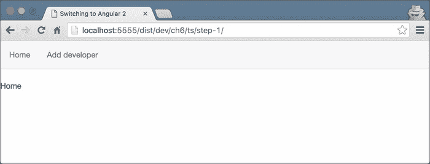
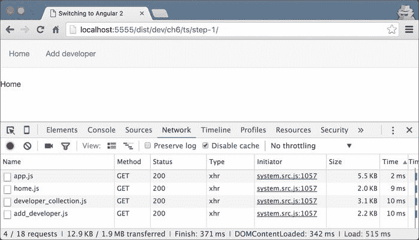
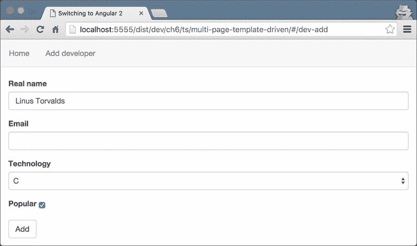

# 六、使用 Angular 2 路由器和表单

到目前为止，我们已经熟悉了框架的核心。我们知道如何定义组件和指令，以便开发应用的视图。我们还知道如何将业务相关逻辑封装到服务中，并使用 Angular 2 的依赖注入机制将所有内容连接在一起。

在本章中，我们将解释更多的概念，这些概念将帮助我们构建现实生活中的 Angular 2 应用。详情如下:

*   该框架基于组件的路由器。
*   使用角度 2 形式。
*   开发模板驱动的表单。
*   开发自定义表单验证程序。

开始吧！

# 开发“编码器存储库”应用

在解释前面提到的概念的过程中，我们将开发一个包含开发人员存储库的示例应用。在开始编码之前，让我们解释一下应用的结构。

“编码器存储库”将允许其用户添加开发人员，方法是在表单中填写开发人员的详细信息，或者为开发人员提供 GitHub 句柄，并从 GitHub 导入其个人资料。

### 注

在本章中，我们将把开发人员的信息存储在内存中，这意味着刷新页面后，我们将丢失会话期间存储的所有数据。

应用将具有以下视图：

*   所有开发者的列表。
*   添加或导入新开发人员的视图。
*   显示给定开发人员详细信息的视图。此视图有两个子视图：

应用主页的最终结果如下所示：


图 1

### 注

在本章中，我们将只构建列出的几个视图。本应用的其余部分将在[第 7 章](7.html#21PMQ2-a118c4c18dd64e8ab73e171b466b6582 "Chapter 7. Explaining Pipes and Communicating with RESTful Services")、*解释管道和与 RESTful 服务的通信*中解释。

每个开发人员都是以下类的实例：

```ts
// ch6/ts/multi-page-template-driven/developer.ts
export class Developer {
  public id: number;
  public githubHandle: string;
  public avatarUrl: string;
  public realName: string;
  public email: string;
  public technology: string;
  public popular: boolean;
}
```

所有开发人员将驻留在`DeveloperCollection`类中：

```ts
// ch6/ts/multi-page-template-driven/developer_collection.ts
class DeveloperCollection {
  private developers: Developer[] = [];
  getUserByGitHubHandle(username: string) {
    return this.developers
            .filter(u => u.githubHandle === username)
            .pop();
  }
  getUserById(id: number) {
    return this.developers
             .filter(u => u.id === id)
             .pop();
  }
  addDeveloper(dev: Developer) {
    this.developers.push(dev);
  }
  getAll() {
    return this.developers;
  }
}
```

这里提到的类封装了一个非常简单的逻辑，没有任何特定于 Angular 2 的内容，因此我们将不深入讨论任何细节。

现在，让我们通过探索新路由器继续实现。

# 探索角度 2 路由器

我们已经知道，为了引导 Angular 2 应用，我们需要开发一个根组件。“编码器存储库”应用没有任何不同；在这种特殊情况下唯一的补充是，我们将有多个页面需要与 Angular 2 路由器连接在一起。

让我们从路由器配置所需的导入开始，然后定义根组件：

```ts
// ch6/ts/step-0/app.ts
import {
  ROUTER_DIRECTIVES,
  ROUTER_PROVIDERS,
  Route,
  Redirect,
  RouteConfig,
  LocationStrategy,
  HashLocationStrategy
} from 'angular2/router';
```

在前面的代码片段中，我们直接从 Angular 2 路由器模块导入了一些东西，该模块在框架的核心之外外部化。

通过`ROUTER_DIRECTIVES`，路由器提供了一组常用指令，我们可以通过根组件将这些指令添加到已用指令列表中。这样，我们将能够在以后的模板中使用它们。

导入`ROUTE_PROVIDERS`包含一组与路由器相关的提供者，例如一个用于将`RouteParams`令牌注入组件的构造函数的提供者。

`RouteParams`令牌提供对路由 URL 参数的访问，以便参数化与给定页面相关的逻辑。稍后我们将演示此提供者的典型用例。

导入`LocationStrategy`类是一个抽象类，定义`HashLocationStrategy`（用于基于哈希的路由）和`PathLocationStrategy`（用于利用历史 API 进行基于 HTML5 的路由）之间的公共逻辑。

### 注

`HashLocationStrategy`不支持服务器端渲染。这是因为页面的散列没有发送到服务器，因此它无法找到与给定页面关联的组件。除 IE9 之外的所有现代浏览器都支持 HTML5 历史 API。您可以在本书的最后一章中找到有关服务器端渲染的更多信息。

我们没有注意的最后一个导入是`RouteConfig`，它是一个装饰器，允许我们定义与给定组件关联的路由；和`Route`和`Redirect`，分别允许我们定义单独的路由和重定向。通过`RouteConfig`，我们可以定义路由的层次结构，这意味着 AngularJS 2 的路由器支持嵌套的开箱即用路由，这与 AngularJS 1.x 的前身不同。

## 定义根组件并引导应用

现在，让我们定义一个根组件并配置应用的初始引导：

```ts
// ch6/ts/step-0/app.ts
@Component({
  selector: 'app',
  template: `…`,
  providers: [DeveloperCollection],
  directives: [ROUTER_DIRECTIVES]
})
@RouteConfig([…])
class App {}

bootstrap(…);
```

在前面的片段中，您可以注意到我们已经熟悉的语法，从[第 4 章](4.html#164MG1-a118c4c18dd64e8ab73e171b466b6582 "Chapter 4. Getting Started with Angular 2 Components and Directives")、*开始学习 Angular 2 组件和指令*和[第 5 章](5.html#1LCVG1-a118c4c18dd64e8ab73e171b466b6582 "Chapter 5. Dependency Injection in Angular 2")、*Angular 2*中的依赖注入。我们使用`app`选择器`template`定义了一个组件，稍后我们将介绍它，以及一组提供程序和指令。

`App`组件使用一个名为`DeveloperCollection`的提供程序。这个类包含应用存储的所有开发人员。您可以注意到我们添加了`ROUTER_DIRECTIVES`；它包含 Angular 路由器中定义的所有指令的数组。这个数组中的一些指令允许我们链接到`@RouteConfig`装饰器中定义的其他路由（`routerLink`指令），并声明与不同路由相关联的组件应该呈现的位置（`router-outlet`。我们将在本节后面解释如何使用它们。

现在让我们看一下函数的调用：

```ts
bootstrap(App, [
  ROUTER_PROVIDERS,
  provide(LocationStrategy, { useClass: HashLocationStrategy })
)]);
```

作为`bootstrap`的第一个参数，我们照常传递应用的根组件。第二个参数是可由整个应用访问的提供程序列表。在提供程序集中，我们添加了`ROUTER_PROVIDERS`并为`LocationStrategy`令牌配置提供程序。Angular 2 使用的默认`LocationStrategy`标记是`PathLocationStrategy`（即基于 HTML5 的标记）。然而，在本例中，我们将使用基于散列的方法。

默认位置策略的两个最大优点是，Angular 2 的服务器呈现模块支持该策略，并且应用的 URL 对最终用户来说更自然（没有使用`#`。另一方面，如果我们使用`PathLocationStrategy`，我们可能需要配置我们的应用服务器，以便正确处理路由。

## 使用路径定位策略

如果我们想使用`PathLocationStrategy`，我们可能需要提供`APP_BASE_HREF`。例如，在我们的例子中，`bootstrap`配置应该如下所示：

```ts
import {APP_BASE_HREF} from 'angular2/router';
//...
bootstrap(App, [
  ROUTER_PROVIDERS,
  // The following line is optional, since it's
  // the default value for the LocationStrategy token
  provide(LocationStrategy, { useClass: PathLocationStrategy }),
  provide(APP_BASE_HREF, {
    useValue: '/dist/dev/ch6/ts/multi-page-template-driven/'
  }
)]);
```

默认情况下，与`APP_BASE_HREF`令牌关联的值为`/`；它表示应用内部的基本路径名。例如，在我们的例子中，“编码器存储库”将位于`/ch6/ts/multi-page-template-driven/`目录下（即`http://localhost:5555/dist/dev/ch6/ts/multi-page-template-driven/`。

## 使用@RouteConfig 配置路由

作为下一个 T1 T1 步，让我们来看看在 PalthT0 装饰中放置的路由声明：

```ts
// ch6/ts/step-0/app.ts
@Component(…)
@RouteConfig([
  new Route({ component: Home, name: 'Home', path: '/' }),
  new Route({
    component: AddDeveloper,
    name: 'AddDeveloper',
    path: '/dev-add'
  }),
  //…
  new Redirect({
    path: '/add-dev',
    redirectTo: ['/dev-add']
  })
]) 
class App {}
```

正如前面的代码片段所示，`@RouteConfig`装饰器接受路由数组作为参数。在本例中，我们定义了两种类型的路由：使用类`Route`和`Redirect`。它们分别用于定义应用中的路由和重定向。

每条路线必须定义以下属性：

*   `component`：与给定路由关联的组件。
*   `name`：模板中引用的路由名称。
*   `path`：路由使用的路径。它将在浏览器的位置栏中可见。

### 注

`Route`类还支持一个数据属性，该属性的值可以通过使用`RouteData`标记注入其关联组件的构造函数中。如果我们希望根据包含`@RouteConfig`声明的父组件的类型注入不同的配置对象，那么 data 属性的一个示例用例可能是。

另一方面，重定向仅包含两个属性：

*   `path`：用于重定向的路径。
*   `redirectTo`：用户重定向到的路径。

在前面的示例中，我们声明希望将用户打开的路径为`/add-dev`的页面重定向到`['/dev-add']`。

现在，为了让一切都能正常工作，我们需要定义`AddDeveloper`和`Home`组件，它们在`@RouteConfig`中引用。首先，我们将提供一个基本的实现，我们将在本章中逐步扩展。在`ch6/ts/step-0`中，创建一个名为`home.ts`的文件，并输入以下内容：

```ts
import {Component} from 'angular2/core';
@Component({
  selector: 'home',
  template: `Home`
})
export class Home {}
```

不要忘记导入`app.ts`中的`Home`组件。现在，打开名为`add_developer.ts`的文件，在其中输入以下内容：

```ts
import {Component} from 'angular2/core';

@Component({
  selector: 'dev-add',
  template: `Add developer`
})
export class AddDeveloper {}
```

## 使用路由器链路和路由器出口

我们有路线的声明以及与各个路线相关的所有组件。唯一剩下的是定义根`App`组件的模板，以便将所有内容链接在一起。

将以下内容添加到`ch6/ts/step-0/app.ts`中`@Component`装饰器内的`template`属性中：

```ts
@Component({
  //…
  template: `
    <nav class="navbar navbar-default">
      <ul class="nav navbar-nav">
        <li><a [routerLink]="['/Home']">Home</a></li>
        <li><a [routerLink]="['/AddDeveloper']">Add developer</a></li>
      </ul>
    </nav>
    <router-outlet></router-outlet>
  `,
  //…
})
```

在上面的模板中，有两个特定于角度 2 的指令：

*   `routerLink`：这允许我们添加到特定路由的链接。
*   `router-outlet`：定义与当前所选路由关联的组件需要呈现的容器。

让我们看一看 FooT0}指令。作为值，它接受路由名称和参数数组。在本例中，我们只提供一个以斜杠为前缀的路由名称（因为此路由位于根级别）。请注意，`routerLink`使用的路由名称是由`@RouteConfig`中路由声明的`name`属性声明的。在本章后面，我们将看到如何链接到嵌套管线并传递管线参数。

此指令允许我们独立于已配置的`LocationStrategy`声明链接。例如，假设我们正在使用`HashLocationStrategy`；这意味着我们需要在模板中的所有路由前面加上`#`。如果我们切换到`PathLocationStrategy`，我们需要删除所有哈希前缀。`routerLink`的另一个巨大好处是，它对我们透明地使用 HTML5 历史推送 API，这将我们从大量样板中解放出来。

上一个模板的下一个指令是`router-outlet`，这对我们来说是新的。它与 AngularJS 1.x 中的[T1]指令具有类似的责任。基本上，它们都有相同的作用：指出`target`组件应该呈现在哪里。这意味着根据定义，当用户导航到`/`时，`Home`组件将呈现在`router-outlet`指出的位置，一旦用户导航到`/dev-add`后，`AddDeveloper`组件的呈现位置与相同。

现在我们有这两条路线了！打开`http://localhost:5555/dist/dev/ch6/ts/step-0/`可以看到如下截图：



图 2

如果没有，只需查看包含最终结果的`ch6/ts/step-1`。

## 异步路由的延迟加载

AngularJS 1.x 模块允许我们将应用中逻辑上相关的单元组合在一起。但是，默认情况下，它们需要在初始应用的`bootstrap`期间可用，并且不允许延迟加载。这需要在初始页面加载期间下载应用的整个代码库，如果是大型单页面应用，这可能会对性能造成不可接受的影响。

在一个完美的场景中，我们希望只加载与用户当前查看的页面相关的代码，或者基于与用户行为相关的启发式预取捆绑模块，这超出了本书的范围。例如，从示例的第一步打开应用：`http://localhost:5555/dist/dev/ch6/ts/step-1/`。一旦用户在`/`上，我们只需要`Home`组件可用，一旦他或她导航到`/dev-add`，我们就要加载`AddDeveloper`组件。

让我们检查一下 Chrome 开发工具中的实际情况：



图 3

我们可以注意到，在初始页面加载期间，我们下载了与所有路由相关联的组件，即使`AddDeveloper`不是必需的。这是因为在`app.ts`中，我们明确要求`Home`和`AddDeveloper`组件，并在`@RouteConfig`声明中使用它们。

在这种特定情况下，加载这两个组件似乎不是什么大问题，因为在这一步中，它们非常简单，没有任何依赖关系。但是，在实际应用中，它们将导入其他指令、组件、管道、服务，甚至第三方库。一旦需要任何组件，将下载其整个依赖关系图，即使此时不需要该组件。

Angular 2 的路由器提供了此问题的解决方案。我们需要做的就是从`angular2/router`模块导入`AsyncRoute`类，并在`@RouteConfig`内部使用，而不是使用`Route`：

```ts
// ch6/ts/step-1-async/app.ts

import {AsyncRoute} from 'angular2/router';
@Component(…)
@RouteConfig([
  new AsyncRoute({
    loader: () =>
      System.import('./home')
        .then(m => m.Home),
      name: 'Home',
      path: '/'
    }),
  new AsyncRoute({
    loader: () =>
      System.import('./add_developer')
        .then(m => m.AddDeveloper),
      name: 'AddDeveloper',
      path: '/dev-add'
    }),
    new Redirect({ path: '/add-dev', redirectTo: ['/dev-add'] })
])
class App {}
```

`AsyncRoute`类的构造函数接受具有以下属性的对象作为参数：

*   `loader`：返回需要与给定路由关联的组件解析的承诺的函数。
*   `name`：可用于在模板中引用它的路由的名称（通常在`routerLink`指令内）。
*   `path`：路线的路径。

一旦用户导航到与[T0]装饰器中的任何异步路由定义匹配的路由，就会调用其关联的加载程序。当使用目标组件的值解析加载程序返回的承诺时，将缓存并呈现该组件。下次用户导航到同一路由时，将使用缓存的组件，因此路由模块不会两次下载同一组件。

### 注

请注意，前面的示例使用 System，但是 Angular 的`AsyncRoute`实现没有耦合到任何特定的模块加载程序。例如，使用 require.js 也可以获得相同的结果。

# 使用两种形式的角度

现在让我们继续应用的实现。下一步，我们将处理`AddDeveloper`和`Home`组件。您可以通过扩展您当前在`ch6/ts/step-0`中拥有的内容来继续实施，或者如果您还没有达到步骤 1，您可以继续处理`ch6/ts/step-1`中的文件。

Angular 2 提供了两种通过验证开发表单的方法：

*   **模板驱动的方法**：提供一个声明式 API，我们在其中将验证声明到组件的模板中。
*   **模型驱动的方法**：为提供了一个带有`FormBuilder`的命令式 API。

在下一章中，我们将探讨两者。让我们从模板驱动的方法开始。

## 开发模板驱动表单

表格对于每个**CRUD**（**创建、检索、更新和删除**应用都是必不可少的。在我们的例子中，我们想要构建一个表单，用于输入我们想要存储的开发者的详细信息。

在部分结束时，我们将有一个表单，允许我们输入给定开发人员的真实姓名，添加他或她的首选技术，输入电子邮件，并声明她或他在社区中是否受欢迎。最终结果如下所示：



图 4

将以下导入添加到`add_developer.ts`：

```ts
import {
  FORM_DIRECTIVES,
  FORM_PROVIDERS
} from 'angular2/common;
```

我们需要做的下一件事是将`FORM_DIRECTIVES`添加到`AddDeveloper`组件使用的指令列表中。`FORM_DIRECTIVES`指令包含一组预定义的指令，用于管理 Angular 2 表单，例如`form`和`ngModel`指令。

`FORM_PROVIDERS`是一个数组，其中包含一组预定义的提供程序，我们可以使用这些提供程序在应用的类中注入与其令牌关联的值。

现在将`AddDeveloper`实现更新为以下内容：

```ts
@Component({
  selector: 'dev-add',
  templateUrl: './add_developer.html',
  styles: […],
  directives: [FORM_DIRECTIVES],
  providers: [FORM_PROVIDERS]
})
export class AddDeveloper {
  developer = new Developer();
  errorMessage: string;
  successMessage: string;
  submitted = false;
  technologies: string[] = [
    'JavaScript',
    'C',
    'C#',
    'Clojure'
  ];
  constructor(private developers: DeveloperCollection) {}
  addDeveloper() {}
}
```

`developer`属性包含与当前开发人员相关的信息，我们将在表单中添加这些信息。最后两个属性`errorMessage`和`successMessage`将分别用于在开发人员成功添加到开发人员集合或发生错误后显示当前表单的错误或成功消息。

## 挖掘模板驱动表单的标记

下一步，我们创建`AddDeveloper`组件（`step-1/add_developer.html`的模板。将以下内容添加到文件中：

```ts
<span *ngIf="errorMessage"
       class="alert alert-danger">{{errorMessage}}</span>
<span *ngIf="successMessage"
       class="alert alert-success">{{successMessage}}</span>
```

这两个元素用于在添加新开发人员时显示错误和成功消息。当`errorMessage`和`successMessage`分别具有非虚假值（即，与空字符串`false`、`undefined`、`0`、`NaN`或`null`不同的值）时，它们将可见。

现在让我们开发实际形式：

```ts
<form #f="ngForm" (ngSubmit)="addDeveloper()"
      class="form col-md-4" [hidden]="submitted">
  <div class="form-group">
    <label class="control-label"
           for="realNameInput">Real name</label>
    <div>
      <input id="realNameInput" class="form-control"
             type="text" ngControl="realName" required
             [(ngModel)]="developer.realName">
    </div>
  </div>
  <button class="btn btn-default"
          type="submit" [disabled]="!f.form.valid">Add</button>
  <!-- MORE CODE TO BE ADDED -->
</form> 
```

我们使用 HTML`form`标记声明一个新表单。一旦 Angular 2 在父组件中包含表单指令的模板中找到此类标记，它将自动增强其功能，以便用作 Angular 表单。一旦 Angular 处理了表单，我们就可以应用表单验证和数据绑定。在此之后，我们将使用`#f="ngForm"`为模板定义一个名为`f`的局部变量，它允许我们引用当前表单。表单元素剩下的最后一件事是提交事件处理程序。我们使用一种我们已经熟悉的语法`(ngSubmit)="expr"`，在本例中，表达式的值是连接到组件控制器的`addDeveloper`方法的调用。

现在，让我们来看一个具有类名为 OT1 的元素的 TyrT0.元素。

### 注

请注意，这不是一个角度特定的类；它是一个由引导定义的`CSS`类，我们使用它来为表单提供更好的外观和感觉。

在它里面，我们可以找到一个没有任何特定角度标记的`label`元素和一个允许我们设置当前开发人员真实姓名的输入元素。我们将控件设置为文本类型，并将其标识符声明为等于`realNameInput`。所需属性由 HTML5 规范定义，用于验证。通过在元素上使用它，我们声明该元素必须有一个值。尽管使用`ngControl`属性时该属性不是特定于角度的，但 Angular 将通过包含验证行为来扩展所需属性的语义。此行为包括在控件状态更改时在控件上设置特定的`CSS`类，以及管理框架内部保持的状态。

`ngControl`指令是`NgControlName`指令的选择器。它通过对表单控件的值的更改进行验证，并在控件的生命周期中应用特定的类，从而增强了表单控件的行为。在 AngularJS 1.x 中，表单控件在其生命周期的特定阶段用[T2]、[T3]和[T4]类等修饰，您可能对此很熟悉。

下表总结了框架在表单控件生命周期中添加到表单控件的`CSS`类：

<colgroup class="calibre18"><col class="calibre19"> <col class="calibre19"></colgroup> 
| 

班级

 | 

描述

 |
| --- | --- |
| `ng-untouched` | 控制室还没有被访问过 |
| `ng-touched` | 控件已被访问 |
| `ng-pristine` | 控件的值未更改 |
| `ng-dirty` | 控件的值已更改 |
| `ng-valid` | 连接到控件的所有验证器已返回`true` |
| `ng-invalid` | 连接到控件的任何验证器都有一个`false`值 |

根据此表，我们可以通过以下方式定义我们希望所有具有无效值的输入控件具有红色边框：

```ts
input.ng-dirty.ng-invalid {
  border: 1px solid red;
}
```

在 Angular 2 的上下文中，前面的[T0]背后的确切语义是为所有输入元素使用一个红色边框，这些元素的值已更改，并且根据附加到它们的验证器[T1]无效。

现在，让我们探索如何将不同的验证行为附加到控件。

## 使用内置表单验证器

我们已经可以通过的验证来改变任何行为。Angular 2 提供了另外两个内置验证器，如下所示：

*   `minlength`：允许我们指定给定控件应该具有的值的最小长度。
*   `maxlength`：允许我们指定给定控件应具有的值的最大长度。

这些验证器由 Angular 2 指令定义，可按以下方式使用：

```ts
<input id="realNameInput" class="form-control"
       type="text" ngControl="realName"
       minlength="2"
       maxlength="30">
```

通过这种方式，我们指定希望输入的值介于`2`和`30`字符之间。

## 定义自定义控件验证程序

`Developer`类中定义的另一个数据属性是`email`字段。让我们为这个属性添加一个输入字段。在前面表单中的按钮上方，添加以下标记：

```ts
<div class="form-group">
  <label class="control-label" for="emailInput">Email</label>
  <div>
    <input id="emailInput"
           class="form-control"
           type="text" ngControl="email"
     [(ngModel)]="developer.email"/>
  </div>
</div>
```

我们可以将`[(ngModel)]`属性看作是 AngularJS 1.x 中`ng-model`指令的替代品。我们将在*与 Angular 2*部分的双向数据绑定中详细解释。

尽管 Angular 2 提供了一组预定义的验证器，但它们还不足以满足我们的数据可以使用的各种格式。有时，我们需要为特定于应用的数据定制验证逻辑。例如，在本例中，我们要定义一个电子邮件验证器。典型的正则表达式在一般情况下工作（但不包括定义电子邮件地址格式的整个规范），如下所示：`/^[a-zA-Z0-9_.+-]+@[a-zA-Z0-9-]+\.[a-zA-Z0-9-.]+$/`。

在`ch6/ts/step-1/add_developer.ts`中，定义一个函数，该函数接受 Angular 2 控件的实例作为参数，如果该控件的值为空或与前面提到的正则表达式匹配，则返回`null`，否则返回`{ 'invalidEmail': true }`：

```ts
function validateEmail(emailControl) {
  if (!emailControl.value ||
    /^[a-zA-Z0-9_.+-]+@[a-zA-Z0-9-]+\.[a-zA-Z0-9-.]+$/.test(emailControl.value)) {
    return null;
  } else {
    return { 'invalidEmail': true };
  }
}
```

现在，从模块`angular2/common`和`angular2/core`导入`NG_VALIDATORS`和`Directive`，并将此验证功能包装在以下指令中：

```ts
@Directive({
  selector: '[email-input]',
  providers: [provide(NG_VALIDATORS, {
    useValue: validateEmail, multi: true
  })]
})
class EmailValidator {}
```

在前面的代码中，我们为令牌`NG_VALIDATORS`定义了一个多提供者。一旦我们注入了与此令牌相关的值，我们将得到一个数组，其中包含连接到给定控件的所有验证器（参考，请参阅[第 5 章](5.html#1LCVG1-a118c4c18dd64e8ab73e171b466b6582 "Chapter 5. Dependency Injection in Angular 2")、*Angular 2*中的依赖项注入中的多提供者部分）。

要使我们的自定义验证工作正常进行，只剩下两个步骤，即首先将`email-input`属性添加到电子邮件控件：

```ts
<input id="emailInput"
   class="form-control"
 email-input
   type="text" ngControl="email"
   [(ngModel)]="developer.email"/>
```

接下来，要将该指令添加到组件`AddDeveloper`指令使用的列表中：

```ts
@Component({
  selector: 'dev-add',
  templateUrl: './add_developer.html',
  styles: [`
    input.ng-touched.ng-invalid {
      border: 1px solid red;
    }
  `],
  directives: [FORM_DIRECTIVES, EmailValidator],
  providers: [FORM_PROVIDERS]
})
class AddDeveloper {…}
```

### 注

我们正在为`AddDeveloper`控件使用外部模板。对于给定的模板是否应该在组件中分别使用`templateUrl`或`template`进行外部化或内联化，没有最终的答案。最佳实践表明，我们应该内联短模板并将长模板外部化，但是对于哪些模板被认为是短模板，哪些是长模板，没有具体的定义。关于模板是内联使用还是放入外部文件的决定取决于开发人员的个人偏好或组织内的常见约定。

## 使用带角度传感器的选择输入

作为下一步，我们应该允许应用的用户进入输入开发人员最熟练的技术。我们可以定义一个技术列表，并以选择输入的形式显示它们。

在`AddDeveloper`类中，添加`technologies`属性：

```ts
class AddDeveloper {
  …
  technologies: string[] = [
    'JavaScript',
    'C',
    'C#',
    'Clojure'
  ];
  …
}
```

现在，在模板的`submit`按钮上方，添加以下标记：

```ts
<div class="form-group">
  <label class="control-label"
         for="technologyInput">Technology</label>
  <div>
    <select class="form-control"
            ngControl="technology" required
            [(ngModel)]="developer.technology">
        <option *ngFor="#t of technologies"
                [value]="t">{{t}}</option>
    </select>
  </div>
</div>
```

就像我们前面声明的输入元素一样，Angular 2 将根据 select 输入的状态添加相同的类。为了在 select 元素的值无效时在其周围显示红色边框，我们需要修改`CSS`规则：

```ts
@Component({
  …
  styles: [
    `input.ng-touched.ng-invalid,
     select.ng-touched.ng-invalid {
      border: 1px solid red;
    }`
  ],
  …
})
class AddDeveloper {…}
```

### 注

请注意，在组件声明中内联所有样式可能是一种不好的做法，因为这样，它们就无法重用。我们可以做的是将组件中的所有通用样式提取到单独的文件中。`@Component`装饰器有一个名为`styleUrls`的`array`类型的属性，我们可以在其中添加对给定组件使用的提取样式的引用。这样，如果需要，我们只能内联特定于组件的样式。

在此之后，我们将使用`ngControl="technology"`声明控件的名称等于“技术”。通过使用`required`属性，我们将声明应用的用户必须指定当前开发人员精通的技术。让我们最后一次跳过[T2]属性，看看如何定义 select 元素的选项。

在`select`元素中，我们将使用以下方法定义不同的选项：

```ts
<option *ngFor="#t of technologies"
        [value]="t">{{t}}</option>
```

这是我们已经熟悉的语法。我们将简单地迭代`AddDeveloper`类中定义的所有技术，对于每种技术，我们将显示一个选项元素，其值为技术名称。

## 使用 NgForm 指令

我们已经提到，表单指令通过添加一些额外的特定于角度 2 的逻辑来增强 HTML5 表单的行为。现在，让我们先来回顾一下输入元素的形式：

```ts
<form #f="ngForm" (ngSubmit)="addDeveloper()"
      class="form col-md-4" [hidden]="submitted">
  …
</form>
```

在前面的代码片段中，我们定义了一个名为`f`的新标识符，它引用表单。我们可以将表单视为控件的组成部分；我们可以通过窗体的 controls 属性访问各个控件。除此之外，表单还具有**已触摸的**、**未触摸的**、**原始的**、**脏的**、**无效的**和**有效的**属性，这些属性取决于表单中定义的各个控件。例如，如果表单中没有任何控件被触动，那么表单本身的状态将是未触动的。但是，如果窗体中的任何控件至少被触摸过一次，则窗体的状态也将被触摸。同样，只有当窗体的所有控件都有效时，该窗体才有效。

为了说明`form`元素的用法，让我们用选择器`control-errors`定义一个组件，它显示给定控件的当前错误。我们可以通过以下方式使用它：

```ts
<label class="control-label" for="realNameInput">Real name</label>
<div>
  <input id="realNameInput" class="form-control" type="text"
     ngControl="realName" [(ngModel)]="developer.realName"
         required maxlength="50">
  <control-errors control="realName"
    [errors]="{
      'required': 'Real name is required',
      'maxlength': 'The maximum length of the real name is 50 characters'
      }"
   />
</div>
```

请注意，我们还将[T0]验证器添加到了[T1]控件中。

`control-errors`元素具有以下属性：

*   `control`：声明要为其显示错误的控件的名称。
*   `errors`：创建控制错误和错误消息之间的映射。

现在在`add_developer.ts`中添加以下导入：

```ts
import {NgControl, NgForm} from 'angular2/common';
import {Host} from 'angular2/core';
```

在这些导入中，`NgControl`类是表示单个表单组件的抽象类，`NgForm`表示角度表单，`Host`是与依赖项注入机制相关的参数修饰符，我们已经在[第 5 章](5.html#1LCVG1-a118c4c18dd64e8ab73e171b466b6582 "Chapter 5. Dependency Injection in Angular 2")、*中介绍过 Angular 2*中的依赖注入。

以下是组件定义的一部分：

```ts
@Component({
  template: '<div>{{currentError}}</div>',
  selector: 'control-errors',
  inputs: ['control', 'errors']
})
class ControlErrors {
  errors: Object;
  control: string;
  constructor(@Host() private formDir: NgForm) {}
  get currentError() {…}
}
```

`ControlErrors`组件定义了两个输入：`control`-使用`ngControl`指令声明的控件名称（`ngControl`属性的值）-和`errors`-错误和错误消息之间的映射。它们可以分别由`control-errors`元素的`control`和`errors`属性指定。

例如，如果我们有控制权：

```ts
<input type="text" ngControl="foobar" required />
```

我们可以使用以下方法声明与其相关的`control-errors`组件：

```ts
<control-errors control="foobar"
      [errors]="{
       'required': 'The value of foobar is required'
      }"></control-errors>
```

在`currentError`getter 内部，在前面的代码片段中，我们需要做以下两件事：

*   查找对使用`control`属性声明的组件的引用。
*   返回与使当前控件无效的任何错误相关联的错误消息。

以下是实现此行为的代码段：

```ts
@Component(…)
class ControlErrors {
  …
  get currentError() {
    let control = this.formDir.controls[this.control];
    let errorsMessages = [];
    if (control && control.touched) {
      errorsMessages = Object.keys(this.errors)
        .map(k => control.hasError(k) ? this.errors[k] : null)
        .filter(error => !!error);
    }
    return errorsMessages.pop();
  }
}
```

在`currentError`实现的第一行中，我们使用注入表单的`controls`属性获得目标控件。它属于`{[key: string]: AbstractControl}`类型，其中键是我们用`ngControl`指令声明的控件的名称。一旦我们有了对目标控件实例的引用，我们就可以检查它的状态是否被触摸（即，它是否被聚焦），如果被触摸，我们就可以在`ControlError`实例的`errors`属性中循环所有错误。`map`函数将返回一个带有错误消息或`null`值的数组。剩下的就是过滤所有的`null`值，只得到错误消息。一旦我们获得了每个错误的错误消息，我们将通过从[T9]数组弹出它来返回最后一个错误。

最终结果应如下所示：


图 5

如果您在`ControlErrors`组件的实现过程中遇到任何问题，您可以在`ch6/ts/multi-page-template-driven/add_developer.ts`查看组件的实现。

每个控件的`hasError`方法都接受由验证器定义的错误消息标识符作为参数。例如，在前面定义了自定义电子邮件验证器的示例中，当输入控件的值无效时，我们将返回以下对象文本：`{ 'invalidEmail': true }`。如果我们将`ControlErrors`组件应用于电子邮件控件，其声明应如下所示：

```ts
  <control-errors control="email"
    [errors]="{ 'invalidEmail': 'Invalid email address' }"/>
```

# 带角度 2 的双向数据绑定

关于 Angular 2 最著名的谣言之一是，由于强制单向数据流，双向数据绑定功能被删除。事实并非如此；Angular 2 的表单模块通过选择器`[(ngModel)]`实现指令，这使我们能够轻松实现从视图到模型和从模型到视图的两个方向的数据绑定。

让我们来看看下面的简单组件：

```ts
// ch6/ts/simple-two-way-data-binding/app.ts

import {Component} from 'angular2/core';
import {bootstrap} from 'angular2/platform/browser';
import {NgModel} from 'angular2/common';

@Component({
  selector: 'app',
  directives: [NgModel],
  template: `
    <input type="text" [(ngModel)]="name"/>
    <div>{{name}}</div>
  `,
})
class App {
  name: string;
}

bootstrap(App, []);
```

在前面的示例中，我们从`angular2/common`包导入了指令`NgModel`。稍后，在模板中，我们将属性`[(ngModel)]`设置为值`name`。

一开始，语法`[(ngModel)]`似乎有点不寻常。从[第 4 章](4.html#164MG1-a118c4c18dd64e8ab73e171b466b6582 "Chapter 4. Getting Started with Angular 2 Components and Directives")*开始学习 Angular 2 组件和指令*，我们知道语法`(eventName)`用于绑定由给定组件触发的事件（或输出）。另一方面，我们使用语法`[propertyName]="foobar"`通过将名为`propertyName`的属性值（或在角度 2 组件的术语中，输入）设置为表达式`foobar`的计算结果，来实现单向数据绑定。语法`NgModel`只是将两者结合起来，以实现两个方向的数据绑定。这就是为什么我们可以认为它更像一个语法糖，而不是一个新概念。与 AngularJS 1.x 相比，这种语法的主要优点之一是，我们可以通过查看模板来判断哪些绑定是单向的，哪些是双向的。

### 注

就像`(click)`有它的规范语法`on-click`和`[propertyName]`有`bind-propertyName`一样，`[(ngModel)]`的替代语法是`bindon-ngModel`。

如果您打开`http://localhost:5555/dist/dev/ch6/ts/simple-two-way-data-binding/`，您将看到以下结果：


图 6

更改输入框的值后，它将自动更新以下标签。

我们已经在前面的模板中使用了[T0]指令。例如，我们使用以下方式绑定到开发人员的电子邮件：

```ts
<input id="emailInput"
       class="form-control" type="text"
       ngControl="email" [(ngModel)]="developer.email"
       email-input/>
```

这样，一旦我们更改文本输入的值，附加到`AddDeveloper`组件实例的开发人员对象的电子邮件属性的值将更新。

# 存储表单数据

我们再看一下`AddDeveloper`组件控制器的接口：

```ts
export class AddDeveloper {
  submitted: false;
  successMessage: string;
  developer = new Developer();
  //…
  constructor(private developers: DeveloperCollection) {}
  addDeveloper(form) {…}
}
```

它有一个类型为`Developer`的字段，我们使用`NgModel`指令将表单控件绑定到它的属性。该类还有一个名为`addDeveloper`的方法，在提交表单时调用该方法。我们通过以下方式绑定到`submit`事件来声明：

```ts
<!-- ch6/ts/multi-page-template-driven/add_developer.html -->
<form #f="form" (ngSubmit)="addDeveloper()"
      class="form col-md-4" [hidden]="submitted">
  …
  <button class="btn btn-default"
      type="submit" [disabled]="!f.form.valid">Add</button>
</form>
```

在前面的片段中，我们可以注意到另外两件事。我们使用`#f="ngForm"`获得对表单的引用，并将按钮的 disabled 属性绑定到表达式：`!f.form.valid`。我们在上一节中已经描述了`NgForm`控件；一旦表单中的所有控件都具有有效值，则其 valid 属性的值将为 true。

现在，假设我们已经为表单中的所有输入控件输入了有效值。这意味着其**提交**按钮将被启用。一旦我们按下*输入*或点击**添加**按钮，将调用`addDeveloper`方法。以下是此方法的示例实现：

```ts
class AddDeveloper {
  //…
addDeveloper() {
    this.developer.id = this.developers.getAll().length + 1;
    this.developers.addDeveloper(this.developer);
    this.successMessage = `Developer ${this.developer.realName} was successfully added`;
    this.submitted = true;
  }
```

最初，我们将当前开发者的`id`属性设置为等于`DeveloperCollection`中的开发者总数加 1。后来，我们将开发人员添加到集合中，并设置[T2]属性的值。在此之后，我们将提交的属性设置为等于`true`，这将导致隐藏表单。

# 列出所有存储的开发人员

现在，我们可以向开发者集合添加一个新条目，让我们在“编码器存储库”的首页上显示所有开发者的列表。

打开文件`ch6/ts/step-1/home.ts`并输入以下内容：

```ts
import {Component} from 'angular2/core';
import {DeveloperCollection} from './developer_collection';

@Component({
  selector: 'home',
  templateUrl: './home.html'
})
export class Home {
  constructor(private developers: DeveloperCollection) {}
  getDevelopers() {
    return this.developers.getAll();
  }
}
```

这里对我们来说没有什么新鲜事。我们通过提供外部模板和实现`getDevelopers`方法来扩展`Home`组件的功能，该方法将其调用委托给注入构造函数中的`DeveloperCollection`实例。

模板本身也是我们已经熟悉的：

```ts
<table class="table" *ngIf="getDevelopers().length > 0">
  <thead>
    <th>Email</th>
    <th>Real name</th>
    <th>Technology</th>
    <th>Popular</th>
  </thead>
  <tr *ngFor="#dev of getDevelopers()">
    <td>{{dev.email}}</td>
    <td>{{dev.realName}}</td>
    <td>{{dev.technology}}</td>
    <td [ngSwitch]="dev.popular">
      <span *ngSwitchWhen="true">Yes</span>
      <span *ngSwitchWhen="false">Not yet</span>
    </td>
  </tr>
</table>
<div *ngIf="getDevelopers().length == 0">
  There are no any developers yet
</div>
```

我们将所有开发人员列为 HTML 表中的行。对于每个开发人员，我们检查其流行标志的状态。如果其值为`true`，则对于**热门**列，我们用文本`Yes`显示一个跨度，否则我们将文本设置为`No`。

当您在**添加开发者**页面中输入几个开发者，然后导航到主页时，您会看到一个类似以下截图的结果：


图 7

### 注

您可以在`ch6/ts/multi-page-template-driven`找到应用的完整功能。

# 总结

到目前为止，我们已经在 Angular 2 中解释了布线的基础知识。我们了解了如何定义不同的路由，以及如何实现与路由更改中显示的路由相关联的组件。为了链接到不同的路由，我们解释了`routerLink`，并且我们还使用`router-outlet`指令指出了与各个路由相关联的组件应该呈现在哪里。

另一件我们要看的是 Angular 2 forms 功能，带有内置和自定义验证。之后，我们解释了`NgModel`指令，它为我们提供了双向数据绑定。

在下一章中，我们将介绍如何开发模型驱动的表单、子路由和参数化路由、使用`Http`模块进行 RESTful 调用以及使用自定义管道转换数据。