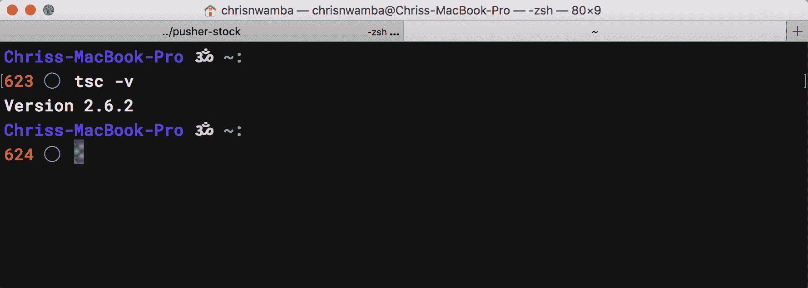
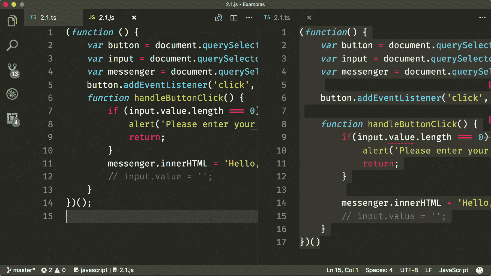

# TypeScript 入门

在上一章中，我们讨论了由于 JavaScript 语言的松散类型特性而可能遇到的挑战。我们还看到了缓解这些挑战的各种尝试，没有一种感觉是自然的。我们还引入了 TypeScript 作为一种工具，可以提供帮助；我们将在本章中讨论 TypeScript 如何提供帮助。

TypeScript 的构建块及其核心概念是核心问题，我们需要这样对待它们。因此，我们将以实际操作的示例为背景，讨论这些构建块，它们如何协同工作，以及作为 JavaScript 开发人员如何将它们集成到工作流中。但首先，我们需要学习如何设置 TypeScript。

在本章中，我们将介绍以下主题：

*   创建类型脚本环境
*   使用 TypeScript 构建工作示例
*   类型注释
*   类型 6 和脚本

# 设置打字脚本

TypeScript 设置取决于使用它的上下文。这是因为您可以将它集成到任何 JavaScript 工具、库和框架中，只要它针对环境进行了正确配置。现在，我们将重点介绍最简单和最基本的设置。

要开始使用 TypeScript，需要具备节点及其包管理器 npm 的基本知识。还需要从节点网站（[上安装 https://nodejs.org/en/](https://nodejs.org/en/) ）

安装了 Node 和 npm 后，您可以通过命令行工具使用`npm`全局安装 TypeScript：

```ts
npm install -g typescript
```

如果您在尝试安装时收到权限警告，您可以使用`sudo`命令：

```ts
sudo npm install -g typescript
```

如果安装顺利，您将看到以下输出：


要确认 TypeScript 安装是否成功，可以检查已安装的版本。如果显示版本，则您的安装成功：

```ts
tsc -v
```

因此，计算机上的 TypeScript 实例将如前所示工作：



# 你好，世界

TypeScript 文件有一个`.ts`扩展名。该扩展同时支持 JavaScript 和 TypeScript。这意味着在没有 TypeScript 的`.ts`文件中编写 JavaScript 代码是正确的。让我们看一个例子。

首先，创建一个具有以下最小引导标记的`index.html`文件：

```ts
<!-- Code 2.1.html -->
<html>
 <head>
   <title>Example 2.1: Hello World</title>
   <!-- Include Bootstrap and custom style -->
   <link rel="stylesheet" href="https://maxcdn.bootstrapcdn.com/bootstrap/3.3.7/css/bootstrap.min.css">
   <link rel="stylesheet" href="2.1.css">
 </head>
 <body>
   <div class="container">
     <div class="col-md-4 col-md-offset-4 main">
       <h3 class="messenger"></h3>
     </div>
     <div class="col-md-4 col-md-offset-4 main">
       <input type="text" class="form-control">
       <button class="button">Greet</button>
     </div>
   </div>
   <!-- Include JavaScript file -->
   <script src="2.1.js"></script>
 </body>
</html>
```

注意，在结束标记之前添加的 JavaScript 文件是*而不是*一个`.ts`文件；相反，它是一个熟悉的 JavaScript 文件，具有`.js`扩展名。这并不意味着我们的逻辑将用 JavaScript 编写；实际上，它是一个名为`2.1.ts`的类型脚本文件：

```ts
// Code 2.1.ts
(function() {
 var button = document.querySelector('.button');
 var input = document.querySelector('.form-control');
 var messenger = document.querySelector('.messenger');

 button.addEventListener('click', handleButtonClick);

 function handleButtonClick() {
   if(input.value.length === 0) {
     alert('Please enter your name');
     return;
   }
   // Update messanger 
   messenger.innerHTML = 'Hello, ' + input.value;
 }
})();
```

有什么奇怪的吗？不，我不这么认为。我们仍然在谈论纯 JavaScript，但只是它存在于一个 TypeScript 文件中。这显示了 TypeScript 如何支持纯 JavaScript。

请记住，我们正在导入`index.html`文件中的`2.1.js`，而不是`2.1.ts`。因此，是时候生成浏览器可以理解的输出了。这就是我们通过`npm`安装的 TypeScript 编译器的用武之地。要编译，请在工作目录中输入`cd`，并在命令行中运行以下命令：

```ts
tsc 2.1.ts
```

*忽略有关 value 属性的警告。我们很快就会解决的。*

这将生成一个已编译的`2.1.js`文件。正如您可能已经猜到的，查看这两种语言并没有语法上的差异：



然后，您可以使用 web 服务器为 web 页面提供生成的资产。有很多选项可以帮助您完成此操作，但`serve`非常受欢迎且稳定（[https://github.com/zeit/serve](https://github.com/zeit/serve) ）。要安装`serve`，请运行以下命令：

```ts
npm install -g serve
```

现在您可以通过以下服务直接托管您的`index`文件：

```ts
serve --port 5000
```

使用`npm`脚本，您可以同时运行这两个命令。首先，初始化`package.json`：

```ts
npm init -y
```

现在，将以下脚本添加到 JSON：

```ts
"scripts": {"start": "tsc 2.1.ts -w & serve --port 5000"},
```

我们传入了 watched 选项（`-w`，因此每当在`.ts`文件中检测到更改时，TypeScript 都可以重新编译。

我们的示例如下所示：


# TypeScript 中的类型注释

值得一提的是，在我们刚才看到的`Hello World`示例中，没有什么不同。让我们使用一些特定于 TypeScript 的特性，其中之一就是类型。类型是 TypeScript 存在的原因，除了类型之外的所有其他特性都只是语法上的糖分。

我们不会详细讨论类型，因为[第 3 章](03.html)、*Typescript 本机类型和访问器*涵盖了这一点。我们可以讨论的是类型注释，这是 TypeScript 用于将严格类型应用于成员的机制。通过使用冒号（`:`）和类型（例如`string`）在成员初始化之后进行注释，如下所示：

```ts
var firstName: string;
```

让我们看一些带注释的示例：

```ts
var name: string = 'John';
console.log(name); // John

var age: number = 18;
console.log(age); // 18

var siblings: string[] = ['Lisa', 'Anna', 'Wili'];
console.log(siblings); // ['Lisa', 'Anna', 'Wili']

// OR

var siblings: Array<string> = ['Lisa', 'Anna', 'Wili'];
console.log(siblings); // ['Lisa', 'Anna', 'Wili']

// any type supports all other types
// and useful for objects when we are lazy
// to make types with interfaces/class for them

var attributes: any = {legs: 2, hands: 2, happy: true}
```

不仅可以输入原语，还可以输入对象、数组和函数。我们很快就会知道。

我们可以做的是重写前面的`Hello World`示例，以便用类型注释变量和函数。

请再次查看此图像：


在 TypeScript 部分（右侧），编辑器似乎没有将`value`标识为 DOM 的属性，因此错误行也没有标识。但是等等，这是你一生都在写的老 JavaScript。这里怎么了？

TypeScript 附带了为 DOM 定义的类型。这意味着，当我们试图访问未在相应 DOM 接口中定义的属性时，它将抛出一个错误（稍后将详细介绍接口）。本质上，DOM 查询方法`querySelector`与其他查询方法一起返回一个`Element`类型（如果未加注释，则会推断该类型）。`Element`类型是基本类型，由 DOM 的一般信息组成，这意味着不会看到特定于`Element`派生内容的属性和方法。

这不仅在 TypeScript 中有意义，在其他 OOP 语言中也有意义：

```ts
class Base {
  name: string = 'John'
}

class Derived extends Base {
  gender: string = 'male'
}

(new Base()).name // John
(new Base()).gender // throws an error
```

回到我们的示例，让我们看看如何使用注释和转换来修复此问题：

```ts
// Code 2.2.ts
(function() {
   // 1\. Button type is Element
   var button: Element = document.querySelector('.button');
   // 2\. Input type is HTMLInputElement and we cast accordingly
   var input: HTMLInputElement = <HTMLInputElement>document.querySelector('.form-control');
   // 3\. Messanger is HTMLElement and we cast accordingly
   var messenger: HTMLElement = document.querySelector('.messenger') as HTMLElement;

   // 4\. The handler now takes a function and returns another function (callback)
   button.addEventListener('click', handleButtonClick('Hello,', 'Please enter your name'));

   function handleButtonClick(prefix, noNameErrMsg) {
     // Logic here
     // Should return a function 
   }
})()
```

没有行为上的改变，只有生产力的提高。让我们讨论一下发生了什么：

1.  按钮元件为`Element`型。这里没有什么特别之处，因为 TypeScript 已经在内部推断出了这一点。
2.  输入元件为`HTMLInputElement`型。因为 TypeScript 将返回值推断为`Element`，所以我们必须转换为正确的类型，即`HTMLInputElement`。这是通过在返回值前面加上`<>`并传递我们想要将其转换到的接口来实现的。
3.  通讯器元件为`HTMLElement`型。我们仍然必须在这里使用与*步骤 2*相同的原因进行强制转换，但支持的语法不同（`as`。`HTMLElement`是`Element`的子类型，包括更具体的 DOM 属性/方法（如`innerText`。
4.  我们没有传递回调，而是将其封装在函数中，以便接收参数。

让我们来看一下传递给 PoT T0 的方法：

```ts
// Code 2.2.ts
function handleButtonClick(prefix, noNameErrMsg) {
   return function() {
     if(input.value.length === 0) {
       if(typeof noNameErrMsg !== 'string') {
         alert('Something went wrong, and no valid error msg was provided')
         return;
       }
       alert(noNameErrMsg);
       return;
   }

   if(typeof prefix !== 'string') {
     alert('Improper types for prefix or error msg')
   }

   messenger.innerHTML = prefix + input.value;

 }
```

我们添加了很多验证逻辑，只是为了确保从参数中获得正确的类型。我们可以通过使用 TypeScript 注释来简化此过程：

```ts
// Code 2.3.ts
function handleButtonClick(prefix: string, noNameErrMsg: string) {
  return function(e: MouseEvent) {
    if(input.value.length === 0) {
      alert(noNameErrMsg);
      return;
    }

    messenger.innerHTML = prefix + input.value;

  }
}
```

这样好多了，对吧？不必要的检查由类型处理。事实上，在这进入浏览器之前，如果您的编辑器（例如 VS 代码）支持 TypeScript，那么当使用无效类型调用该方法时，您将得到语法错误。

类型注释帮助我们编写更少的冗长、更容易理解和无错误的应用程序。打字使注释灵活；因此，您不必严格地为逻辑中的每个成员提供类型。你可以自由地诠释你认为必要的东西，从零到全；请记住，注释越严格，在浏览器中进行的调试就越少。

# ES6 及以上

除了类型注释外，TypeScript 还支持 EcamaScript 6（ES6/ES2015）以及其他有用的功能，如枚举、装饰器、可访问性级别（私有、公共和受保护）、接口、泛型等

在下一章中，我们将深入研究一些特性。在此之前，让我们尝试另一个例子，让我们的脚湿一点，手脏一点，这个例子包含了一些 ES6 和 TypeScript 特有的特性。我们将建立一个计数器应用程序。这只是为了让您对这些特性感到兴奋，您可以看到 TypeScript 如何带来您一直希望存在于 JavaScript 中的特性。

让我们从一个基本的 HTML 模板开始：

```ts
<!-- Code 2.4.html -->
<div class="container">
  <div class="col-md-6 col-md-offset-3 main">
    <div class="row">
      <div class="col-md-4">
        <button id="decBtn">Decrement--</button>
      </div>
      <div class="col-md-4 text-center" id="counter">0</div>
      <div class="col-md-4">
        <button id="incBtn">Inccrement++</button>
      </div>
    </div>
 </div>
</div>
```

# 用户故事

*用户希望通过点击按钮增加或减少计数器，*基本上是一个初始化为`0`的计数器，一个增加按钮增加`1`，一个减少按钮减少`1`。

我们可以将它们组织到类中，而不是将代码与 DOM 操作和事件逻辑混为一谈。毕竟，这就是类存在的原因：

```ts
// Code 2.4.ts
class DOM {
  private _incBtn: HTMLElement;
  private _decBtn: HTMLElement;
  private _counter: HTMLElement;

  constructor() {
    this._incBtn = this._getDOMElement('#incBtn');
    this._decBtn = this._getDOMElement('#decBtn');
    this._counter = this._getDOMElement('#counter');
  }

  public _getDOMElement (selector: string) : HTMLElement {
    return document.querySelector(selector) as HTMLElement;
  }

  get incBtn(): HTMLElement {
    return this._incBtn;
  }

  get decBtn(): HTMLElement {
    return this._decBtn;
  }

  get counter(): number {
    return parseInt(this._counter.innerText);
  }

  set counter(value: number) {
    this._counter.innerText = value.toString();
  }
}
```

这是一种类似 JavaScript 的结构化语言。让我们花点时间来解释发生了什么：

*   首先，我们创建一个类并声明一些私有属性来保存 HTMLDOM 元素的临时状态。像`private`这样的可见性特性只针对 TypeScript，但类在 ES6 中已经存在。
*   构造函数使用这个`_getDOMElement`私有实用程序方法来查询 DOM 并初始化私有属性的值。
*   `incBtn`和`decBtn`getter 用于将这些私有属性的值公开。这是 OOP 中的常见模式。getter 在 accessors 下分类，在 ES6 中可用。
*   计数器访问器用于通过将计数器文本的值分别转换为整数和字符串来设置和检索计数器文本的值。

第一次尝试运行此操作时将抛出一个错误，如下图所示：


这是预期的，因为 TypeScript 默认编译为 ES3，但 getter 和 setter（访问器）在 ES3 中不可用。要消除此错误，可以告诉 TypeScript 编译器您更喜欢 ES5 而不是 ES3：

```ts
"start": "tsc 2.4.ts -w -t es5 & serve --port 5000"
```

`-t`标志是`--target`的别名，它告诉 TypeScript 编译到哪个版本。

`DOMEvent`类要简单得多——调用时只需一个方法来注册所有类型的事件：

```ts
// Code 2.4.ts
class DOMEvents {
  private register(htmlElement: HTMLElement, type:string, callback: (e: Event) => void): void {
    htmlElement.addEventListener(type, callback)
  }
}
```

该方法采用以下步骤：

*   用于侦听其上事件的元素
*   事件的类型（例如，`click`、`mouseover`和`dblclick`作为字符串）
*   一种回调方法，它不返回任何内容（`void`，但传递给事件负载

然后，该方法使用`addEventListener`来注册事件。

最后，我们需要一个示例的入口点。这也将以类的形式出现，并且该类将取决于`DOM`和`DOMEvent`类的实例：

```ts
// Code 2.4.ts
class App {
  constructor(public dom:DOM, public domEvents: DOMEvents) {
    this.setupEvents()
  }
  private setupEvents() {
    const buttons = [this.dom.incBtn, this.dom.decBtn];
    buttons.forEach(button => {
      this.domEvents.register(button, 'click', this.handleClicks.bind(this))
    })
  }
  private handleClicks(e: MouseEvent): void {
    const {id} = <HTMLElement>e.target;
    if(id === 'incBtn') {
      this.incrementCounter();
    } else {
      this.decrementCounter();
    }
  }

  private incrementCounter() {
    this.dom.counter++
  }

  private decrementCounter () {
    this.dom.counter--
  }
}
```

让我们讨论一下前面的代码段是如何工作的：

*   初始化类时调用的构造函数尝试使用`setupEvents`方法设置事件。
*   `setupEvents`方法迭代 DOM 上的按钮列表，并对每个按钮调用`DOMEvents register`方法
*   寄存器方法作为`HTMLElement`、`click`作为事件类型、`handleClicks`作为事件处理程序传递给按钮。处理程序与正确的上下文`this`绑定。在 JavaScript 中，这总是一种混乱；Yehuda Katz 在[中以简单的方式解释了它的工作原理 http://yehudakatz.com/2011/08/11/understanding-javascript-function-invocation-and-this/](http://yehudakatz.com/2011/08/11/understanding-javascript-function-invocation-and-this/) 。
*   回调方法根据所单击按钮的 ID 调用`incrementCounter`或`decrementCounter`。这些方法分别从计数器中添加或减去`1`。

您可以通过创建`App`的实例来初始化应用程序：

```ts
// Code 2.4.ts
(new App(new DOM, new DOMEvents))
```

图中显示了我们新构建的 slick counter 应用程序：


# 最后说明

再次指出我们在这些示例中使用的酷功能非常重要：

*   班级
*   访问器
*   可见度
*   箭头函数（回调）：

```ts
var fooFunc = (arg1) => {
    return arg1
}
```

*   变量声明的`const`关键字，而不是`var`
*   分解：

```ts
const {id} = <HTMLElement>e.target;
```

# 总结

其中一些特性在 JavaScript 环境中本机可用；TypeScript 构建在它们之上，为您提供更好的开发体验。这就是为什么它被称为 JavaScript 超集。

在下一章中，我们将回顾并用更多示例描述这些功能，以使您熟悉工作流。