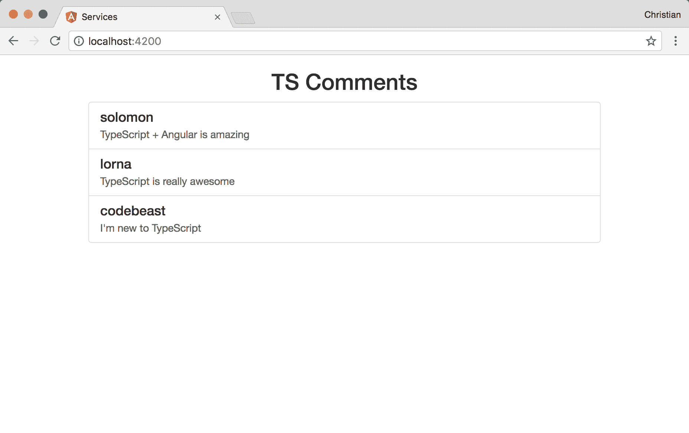
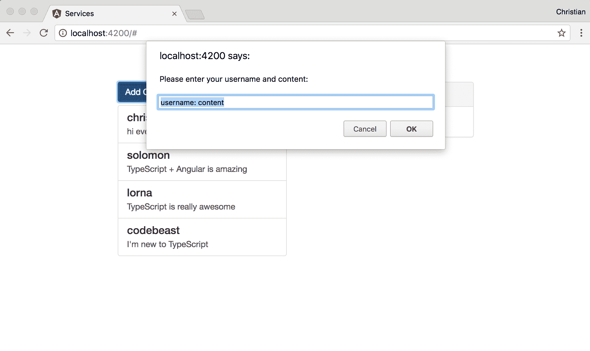

# 用类型化服务分离关注点

本章建立在前一章的基础上，通过更多技术展示了如何在应用程序的构建块中进行通信。在本章中，您将学习以下主题：

*   服务和依赖注入（DI）概念
*   组件与服务的通信
*   使用服务编写数据逻辑

为了更好地理解服务，您至少需要理解依赖注入的基本概念。

# 依赖注入

在 TypeScript 中编写 Angular 需要在类中编写构建块（组件、指令、服务等）。它们只是构建块，这意味着它们需要相互交织才能发挥作用，从而形成一个完整的应用程序。

这种相互交织的过程可能相当令人畏惧。因此，让我们先了解问题。以下面的 TypeScript 类为例：

```ts
export class Developer {
  private skills: Array<Skill>;
  private bio: Person;
  constructor() {
    this.bio = new Person('Sarah', 'Doe', 24, 'female');
    this.skills = [
      new Skill('css'), 
      new Skill('TypeScript'), 
      new Skill('Webpack')
    ];
  }
}
```

`Person`和`Skill`类的实现如下所示：

```ts
// Person Class
export class Person {
  private fName: string;
  private lName: string;
  private age: number;
  private gender: string;
  constructor(
    fName: string, 
    lName: string, 
    age: number, 
    gender: string, 
  ) {
    this.fName = fName;
    this.lName = lName;
    this.age = age;
    this.gender = gender;
  }
}

// Skill Class
export class Skill {
  private type: string;
  constructor(
    type: string
  ) {
    this.type = type;
  }
}
```

在您开始使用该类创建更多的开发人员类型之前，前面的示例是非常实用和有效的代码。实际上没有办法创建另一种类型的开发人员，因为所有的实现细节都绑定到一个类；因此，这个过程是不灵活的。我们需要使这个类更加通用，然后才能用于创建更多类型的开发人员。

让我们尝试改进`Developer`类，以便它从构造函数接收创建类所需的所有值，而不是在类中设置它：

```ts
export class Developer {
  private skills: Array<Skills>;
  private bio: Person;
  constructor(
    fName: string, 
    lName: string, 
    age: number, 
    gender: string, 
    skills: Array<string>
  ) {
    this.bio = new Person(fName, lName, age, gender);
    this.skills = skills.map(skill => new Skill(skill));
  }
}
```

在这么少的行中有这么多的改进！我们现在使用构造函数使代码更加灵活。通过此更新，您可以使用`Developer`类创建所需的任意多个类型的开发人员。

虽然这个解决方案似乎可以节省时间，但系统中仍然存在一个紧密耦合的问题。当`Person`和`Skill`类中的构造函数发生变化时会发生什么？这意味着您必须返回并更新对`Developer`类中此构造函数的调用。以下是`Skill`中此类变更的示例：

```ts
// Skill Class
export class Skill {
  private type: string;
  private yearsOfExperience: number;
  constructor(
    type: string,
    yearsOfExperience: number
  ) {
    this.type = type;
    this.yearsOfExperience = yearsOfExperience
  }
}
```

`yearsOfExperience`表示一个类的另一个技能被添加了多长时间。为了在`Developer`中实际工作，我们还必须更新`Developer`类：

```ts
export class Developer {
  public skills: Array<Skill>;
  private bio: Person;
  constructor(
    fName: string, 
    lName: string, 
    age: number, 
    gender: string, 
    skils: Array<any>
  ) {
    this.bio = new Person(fName, lName, age, gender);
    this.slills = skills.map(skill => 
       new Skill(skill.type, skill.yearsOfExperience));
  }
}
```

每次依赖项发生变化时更新这个类是我们努力避免的。通常的做法是将依赖项的构造函数提升为类本身的构造函数：

```ts
export class Developer {
  public skills: <Skill>;
  private person: Person;
  constructor(
    skill: Skill,
    person: Person
  ) {}
}
```

这样，`Developer`对`Skill`和`Person`的实现细节知之甚少。因此，如果它们在内部发生变化，`Developer`不会在意；它只是保持原样。

事实上，TypeScript 提供了一种生产力速记：

```ts
export class Developer {
  constructor(
    public skills: <Skill>,
    private person: Person
  ) {}
}
```

这个速记将隐式声明属性，并通过构造函数将它们作为依赖项分配。

这还不是全部；提升这些依赖性带来了另一个挑战。我们如何管理应用程序中的所有依赖项，而不忘记事情的目的？这就是依赖注入的用武之地。它不是一个角度的东西，而是一个用角度实现的流行模式。

让我们开始看看 DI 在 Angular 应用程序中的作用。

# 组件中的数据

为了更好地理解服务和 DI 的重要性，让我们创建一个简单的应用程序，其中包含一个显示用户评论列表的组件。创建应用程序后，可以运行以下命令来生成所需的组件：

```ts
ng g component comment-list
```

使用以下代码段更新组件的代码：

```ts
import { Component, OnInit } from '@angular/core';

@Component({
  selector: 'app-comment-list',
  templateUrl: './comment-list.component.html',
  styleUrls: ['./comment-list.component.css']
})
export class CommentListComponent implements OnInit {

  comments: Array<any>
  constructor() { }

  ngOnInit() {
    this.comments = [
      {
        author: 'solomon',
        content: `TypeScript + Angular is amazing`
      },
      {
        author: 'lorna',
        content: `TypeScript is really awesome`
      },
      {
        author: 'codebeast',
        content: `I'm new to TypeScript`
      },
    ];
  }

}
```

组件有一个`comments`数组，一旦组件通过`ngOnInit`生命周期初始化，该数组将填充硬编码数据。现在我们需要迭代数组列表并在 DOM 上打印：

```ts
<div class="list-group">
  <a href="#" class="list-group-item" *ngFor="let comment of comments">
    <h4 class="list-group-item-heading">{{comment.author}}</h4>
    <p class="list-group-item-text">{{comment.content}}</p>
  </a>
</div>
```

您需要在条目（应用程序）组件中包含该组件，以使其显示：

```ts
<div class="container">
  <h2 class="text-center">TS Comments</h2>
  <div class="col-md-6 col-md-offset-3">
    <app-comment-list></app-comment-list>
  </div>
</div>
```

您的应用程序应该如下所示（请记住包括引导，如[第 2 章](02.html)、*开始使用 TypeScript*中所示）：



这个例子有效，但问题在于细节。当另一个组件需要注释列表或列表的一部分时，我们最终会重新创建注释。这就是在组件中包含数据的问题。

# 数据类服务

为了可重用性和可维护性，我们需要将逻辑关注点从组件中抽象出来，让组件仅仅充当表示层。这是 Angular 中的 TypeScript 服务发挥作用的用例之一。

首先需要使用以下命令创建服务：

```ts
ng g service comment
```

这将创建带有脚手架内容的服务类`./src/app/comment.service.ts`。使用以下内容更新内容：

```ts
import { Injectable } from '@angular/core';

@Injectable()
export class CommentService {
  private comments: Array<any> = [
    {
      author: 'solomon',
      content: `TypeScript + Angular is amazing`
    },
    {
      author: 'lorna',
      content: `TypeScript is really awesome`
    },
    {
      author: 'codebeast',
      content: `I'm new to TypeScript`
    }
  ];
  constructor() {}

  getComments() {
    return this.comments;
  }
}
```

该类现在执行我们的组件应该对数据执行的任何操作，并且使用`getComments`方法获取数据，该方法只返回一个注释数组。`CommentService`类也进行了装饰；除非类具有要解析的依赖项，否则这不是必需的。尽管如此，良好的实践要求我们总是用`Injectable`来装饰，以了解一个类意味着一种服务。

回到列表组件，我们只需导入类，从构造函数解析依赖关系以创建服务类的实例，然后使用`getComments`返回值填充属性：

```ts
import { Component, OnInit } from '@angular/core';
import { CommentService } from '../comment.service';

@Component({
  selector: 'app-comment-list',
  templateUrl: './comment-list.component.html',
  styleUrls: ['./comment-list.component.css']
})
export class CommentListComponent implements OnInit {
  private comments: Array<any>;
  constructor(
    private commentService: CommentService
  ) { }

  ngOnInit() {
    this.comments = this.commentService.getComments();
  }

}
```

让我们尝试在浏览器中使用这些当前更改运行应用程序，看看是否仍能按预期工作：


见鬼，不！它爆炸了。可能出了什么问题？错误消息显示 CommentService 没有提供程序！

请记住，当我们使用`ng`CLI 命令构建组件时，CLI 不仅会创建一个组件，还会将其添加到`ngModule`的 decorator 中的声明数组中：

```ts
// ./src/app/app.module.ts
declarations: [
    AppComponent,
    // New scaffolded component here
    CommentListComponent
  ],
```

模块需要知道哪些组件和服务作为成员属于它们。这就是为您自动添加组件的原因。这与服务不同，因为当您通过 CLI 工具创建服务类时，CLI 不会自动更新模块（在 scaffold 期间会发出警告）。我们需要通过`providers`数组手动添加服务：

```ts
import { CommentService } from './comment.service';
//...

@NgModule({
  //...
  providers: [
    CommentService
  ],
})
export class AppModule { }
```

现在，再次运行应用程序，查看我们的服务现在如何在控制台中为应用程序供电，而不再出现错误：


如果需要操纵数据，则必须在服务中而不是在组件中进行。假设您希望通过双击列表中的每个项目来删除注释，则可以通过组件接收事件，但实际的删除应由服务处理。

首先，将事件侦听器添加到列表项：

```ts
<a href="#" class="list-group-item" (dblclick)="removeComment(comment)" *ngFor="let comment of comments">
    <h4 class="list-group-item-heading">{{comment.author}}</h4>
    <p class="list-group-item-text">{{comment.content}}</p>
  </a>
```

双击项目触发`dblclick`事件。当这种情况发生时，我们在传递要从项中删除的注释时调用`removeComment`方法。

以下是`removeComment`在组件中的外观：

```ts
removeComment(comment) {
    this.comments = this.commentService.removeComment(comment);
}
```

正如您所看到的，它只不过是在我们的服务上调用一个方法而已，这个方法也被称为`removeComment`。这是一种实际负责从注释数组中删除项的方法：

```ts
// Comment service
removeComment(removableComment) {
    // find the index of the comment
    const index = this.comments.findIndex(
      comment => comment.author === removableComment.author
    );
    // remove the comment from the array
    this.comments.splice(index, 1);
    // return the new array
    return this.comments;
  }
```

# 组件与服务的交互

这是一个非常方便的服务用例。在[第 6 章](06.html)*组件与*类型脚本的组合中，我们讨论了组件如何相互作用，并展示了不同的方式。其中一种方法被忽略了——使用服务作为不同组件的事件中心/通信平台。

让我们再次假设，当单击列表中的项目时，我们使用注释列表组件的同级组件来显示所选注释的详细视图。首先，我们需要创建此组件：

```ts
ng g component comment-detail
```

然后，您可以更新`app.component.html`文件以显示添加的组件：

```ts
<div class="container">
  <h2 class="text-center">TS Comments</h2>
  <div class="col-md-4 col-md-offset-2">
    <app-comment-list></app-comment-list>
  </div>
  <div class="col-md-4">
    <!-- Comment detail component -->
    <app-comment-detail></app-comment-detail>
  </div>
</div>

```

现在，我们需要定义组件的功能，因为它现在是空的。但在此之前，让我们更新注释服务，使其同时充当列表组件和同级详细信息组件之间的中心：

```ts
import { Injectable } from '@angular/core';
import { Subject } from 'rxjs/Subject';

@Injectable()
export class CommentService {
  private commentSelectedSource = new Subject<any>();
  public commentSelected$ = this.commentSelectedSource.asObservable();

  private comments: Array<any> = [
   // ...
  ];

  // ...

  showComment(comment) {
    this.commentSelectedSource.next(comment);
  }
}
```

该服务现在使用一个 Rx 主题来创建一个流和一个侦听器，所选的注释被推送通过并从中获取。`commentSelectedSource`对象负责在单击注释时向流中添加注释。`commetSelected$`对象是一个可观察的对象，单击此评论时，我们可以订阅并对其进行操作。

现在，向右返回组件并添加单击事件以选择注释项：

```ts
<div class="list-group">
  <a href="#" class="list-group-item" 
    (dblclick)="removeComment(comment)" 
    *ngFor="let comment of comments"
    (click)="showComment(comment)"
    >
    <h4 class="list-group-item-heading">{{comment.author}}</h4>
    <p class="list-group-item-text">{{comment.content}}</p>
  </a>
</div>
```

click 事件触发组件上的`showComment`方法，该方法反过来调用服务上的`showComment`：

```ts
showComment(comment) {
  this.commentService.showComment(comment);
}
```

我们仍然需要更新 comment detail 组件，因此它订阅了我们在类中创建的 observable：

```ts
import { Component, OnInit } from '@angular/core';
import { CommentService } from '../comment.service';

@Component({
  selector: 'app-comment-detail',
  templateUrl: './comment-detail.component.html',
  styleUrls: ['./comment-detail.component.css']
})
export class CommentDetailComponent implements OnInit {

  comment: any = {
    author: '',
    content: ''
  };
  constructor(
    private commentService: CommentService
  ) { }

  ngOnInit() {
    this.commentService.commentSelected$.subscribe(comment => {
      this.comment = comment;
    })
  }

}
```

通过`ngOnInit`生命周期挂钩，我们可以在组件准备就绪后创建对可观察对象的订阅。有一个注释属性将绑定到视图，并且每次单击注释项时，该属性都会通过订阅进行更新。以下是显示所选注释的组件模板：

```ts
<div class="panel panel-default" *ngIf="comment.author">
  <div class="panel-heading">{{comment.author}}</div>
  <div class="panel-body">
    {{comment.content}}
  </div>
</div>
```

您可以再次启动应用程序并尝试选择评论。您应该看到以下行为：


# 作为公用事业的服务

除了管理状态和组件交互之外，服务还可以处理实用程序操作。假设我们想在我们的评论应用程序中开始收集新的评论。我们还不太了解表单，所以我们可以使用浏览器的提示。我们希望用户通过提示符中的同一文本框传递用户名和内容，如下所示：

```ts
<username>: <comment content>
```

因此，我们需要一种实用方法将这些位从文本框提取到具有 author 和 content 属性的 comment 对象中。让我们从 comment list 组件收集信息开始：

```ts
showPrompt() {
    const commentString = window.prompt('Please enter your username and content: ', 'username: content');
    const parsedComment = this.commentService.parseComment(commentString);
    this.commentService.addComment(parsedComment);
  }
```

`showPrompt()`方法用于收集用户输入，并将输入传递给服务上的`parseComment`方法。此方法是实用方法的一个示例，我们将很快实现它。我们还将实现`addComment`方法，通过解析的注释调用该方法来更新注释列表。接下来，在视图中添加一个按钮，该按钮带有一个触发`showPrompt`的点击事件监听器：

```ts
<button class="btn btn-primary" 
 (click)="showPrompt()"
>Add Comment</button>
```

将以下两种方法添加到注释服务：

```ts
parseComment(commentString) {
    const commentArr = commentString.split(':');
    const comment = {
      author: commentArr[0].trim(),
      content: commentArr[1].trim()
    }
    return comment;
  }

  addComment(comment) {
    this.comments.unshift(comment);
  }
```

`parseComment`方法获取一个字符串，拆分该字符串，并获取注释的作者和内容。然后，它返回注释。addComment 方法接受注释并将其添加到现有注释列表中。

现在，您可以开始添加新评论，如以下屏幕截图所示：



# 总结

本章在利用依赖注入的能力的同时，揭示了数据抽象中许多有趣的概念。您了解了组件如何使用服务作为中心进行交互，如何将数据和逻辑从组件抽象到服务，以及如何在服务中处理可重用的实用程序代码以保持应用程序干净。在下一章中，您将学习在 Angular 和 DOM 事件中处理表单的实用方法。